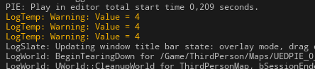
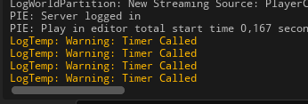

# Таймеры
Таймеры - это способ вызывать определенную функцию или лямбду на постоянной основе или один раз, с задержкой.
Самый простой способ создания таймера это лямбда.
```cpp
// я специально вынес параметры в отдельные переменные
float TimerRate = 1.0f;
// задержка перед запуском, может быть TimerRate или -1 если задержка не нужна
float InitialDelay = -1.0f;
bool IsLooping = true;
GetWorld()->GetTimerManager().SetTimer(*(new FTimerHandle()), [&]()->void {
    UE_LOG(LogTemp, Warning, TEXT("Timer Worked!"))
}, TimerRate, IsLooping, InitialDelay);
```
Однако лямбда в такой форме не дает полного контроля над таймером.
При необходимости можно вынести создание `FTimerHandle` в переменную. Это позволит управлять таймером.
```cpp
float TimerRate = 1.0f;
float InitialDelay = -1.0f;
bool IsLooping = true;
// unique handle to allow system track this timer
FTimerHandle TH;
// Timer Lambda
GetWorld()->GetTimerManager().SetTimer(TH,[&]()->void{
	UE_LOG(LogTemp, Warning, TEXT("Timer Worked!"))
}, TimerRate, IsLooping, InitialDelay);
// Getting timer remaining time
float Remaining = GetWorld()->GetTimerManager().GetTimerRemaining(TH);
UE_LOG(LogTemp, Warning, TEXT("1Timer Remaining = %f"), Remaining)
// Removing timer
GetWorld()->GetTimerManager().ClearTimer(TH);
```
Так-же возможна еще более замудренный подход к вызову таймера - через `Delegate`:
```cpp
// unique handle to allow system track this timer
FTimerHandle TH;
// delegate with callback function or lambda
FTimerDelegate TD;
TD.BindLambda([&]()->void{
                    UE_LOG(LogTemp, Warning, TEXT("Timer Called!"))
                });
float TimerRate = 1.7f;
float InitialDelay = TimerRate;
bool IsLooping = true;
GetWorld()->GetTimerManager().SetTimer(TH, TD, TimerRate, IsLooping, InitialDelay);
```
К делегату так-же можно подключить функцию и передать в нее аргументы, так:
```cpp
// .h
UFUNCTION(BlueprintCallable)
void TestTimerFunction(int &PtVar) {
		UE_LOG(LogTemp, Warning, TEXT("Value = %d"), PtVar)
	}
};
// ...
// unique handle to allow system track this timer
FTimerHandle TH;
// delegate with callback function or lambda
FTimerDelegate TD;
int Number = 4;
TD.BindUFunction(this, "TestTimerFunction", Number);
float TimerRate = 1.7f;
float InitialDelay = TimerRate;
bool IsLooping = true;
GetWorld()->GetTimerManager().SetTimer(TH, TD, TimerRate, IsLooping, InitialDelay);
```

или так, но! Без Аргументов:
```cpp
// .h
UFUNCTION(BlueprintCallable)
void TestTimerFunction() {
		UE_LOG(LogTemp, Warning, TEXT("Timer Called"))
	}
};
// ...
// unique handle to allow system track this timer
FTimerHandle TH;
float TimerRate = 1.7f;
float InitialDelay = TimerRate;
bool IsLooping = true;
GetWorld()->GetTimerManager().SetTimer(TH, this, &UDelegatesTest::TestTimerFunction, TimerRate, IsLooping, InitialDelay);
```

## Sleep
```cpp
FPlatformProcess::Sleep(5.0f); // останавливает любой поток на 5 секунд
```