# Доступ к различным сущностям
Тут будут приведены разные способы доступа к самым разным элементам программной логики.
## All Actors of Class / Interface
```cpp
#include "Kismet/GameplayStatics.h"
///
TArray<AActor*> FoundActors;
// by interface
UGameplayStatics::GetAllActorsWithInterface(GetWorld(), UActorHUDInterface::StaticClass(), FoundActors);
// by class
UGameplayStatics::GetAllActorsOfClass(GetWorld(), APawn::StaticClass(), FoundActors);
```
## Player Character
```cpp
#include "Kismet/GameplayStatics.h"
///
ACharacter* Character = UGameplayStatics::GetPlayerCharacter(this, 0);
```
## Player Controller
```cpp
#include "Kismet/GameplayStatics.h"
///
// Simple:
APlayerController* PController = UGameplayStatics::GetPlayerController(this, 0);
// Complex
// Servers has all the controllers, if server is playable then some will be Local
for (FConstPlayerControllerIterator Iterator = GetWorld()->GetPlayerControllerIterator(); Iterator; ++Iterator)
{
    APlayerController * PController = Iterator->Get();
    if (PController->IsLocalPlayerController()) {
        // this is current player controller
    }
}
```
## HUD
```cpp
#include "Kismet/GameplayStatics.h"
///
AInfoHUD* HUD = UGameplayStatics::GetPlayerController(this, 0)->GetHUD<AInfoHUD>();
```
## Player State
```cpp
#include "Kismet/GameplayStatics.h"
///
APlayerController* PController = UGameplayStatics::GetPlayerController(GetWorld(), 0);
APlayerState* CurrentPlayerState = PController->GetPlayerState<APlayerState>();
APlayerState* CurrentPlayerState = UGameplayStatics::GetPlayerState(this, 0);
```
## Game Instance
```cpp
#include "Kismet/GameplayStatics.h"
///
YourGameInstanceClass* GI = Cast<YourGameInstanceClass>(UGameplayStatics::GetGameInstance(this));
if (GI != nullptr){
 
}
```
## Game State
```cpp
#include "GameFramework/GameState.h"
///
const AGameState* MyGameState = GetWorld() != NULL ? GetWorld()->GetGameState<AGameState>() : NULL;
```
## Subsystem
```cpp
// Engine Subsystem
UMyEngineSubsystem* MySubsystem = GEngine->GetEngineSubsystem<UMyEngineSubsystem>();
// Editor Subsystem
UEditorSubsystem* Subsystem = GEditor->GetEditorSubsystem<UEditorSubsystem>();
// World Sybsystem
UWorldSubsystem* Subsystem = GetWorld()->GetSubsystem<UWorldSubsystem>();
// GameInstance Subsystem
#include "Kismet/GameplayStatics.h"
///
UGameInstance* GameInstance = UGameplayStatics::GetGameInstance(GetWorld());
UGameInstanceSubsystem* Subsystem = GameInstance->GetSubsystem<UGameInstanceSubsystem>();
// Local Player Subsystem
APlayerController* PController = UGameplayStatics::GetPlayerController(GetWorld(), 0);
ULocalPlayer* LPlayer = PController->GetLocalPlayer();
UPlayerSubsystem* Subsystem = LPlayer->GetSubsystem<UPlayerSubsystem>();
```
## Module Constructor Refrence
Конструктором модуля называется класс, отвечающий за загрузку модуля в систему.
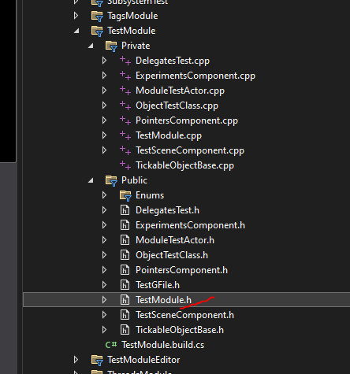
Мы можем получить ссылку на конструктор любого модуля (включая модули внутри плагинов) через интерфейс `FModuleManager`.
```cpp
#include "Modules/ModuleManager.h"
//...
FTestModule& TestModule = FModuleManager::LoadModuleChecked<FTestModule>("TestModule");
```
Обратите внимание, что название модуля должно соответствовать тому, которое используется в файле `.uproject` или `.uplugin`.
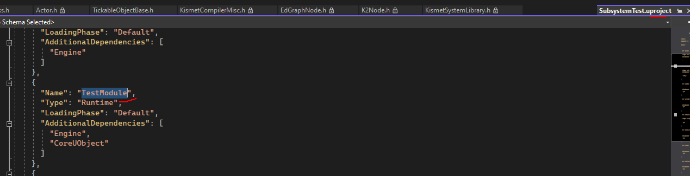
Разумеется, чтобы можно было подключать класс модуля, для начала нам надо подключить сам модуль в зависимости в файле `.build.cs`.
```csharp
PrivateDependencyModuleNames.AddRange(new string[] { "TestModule" });
```
## Доступ к данным плагина
```cpp
#include "Interfaces/IpluginManager.h"
//...
IPluginManager::Get().FindPlugin(TEXT("StateTreeEditorModule"))
```
## Доступ к ассетам по рефренсам
```cpp
FString SkeletalMeshPath = TEXT("/Script/Engine.SkeletalMesh'/Game/Characters/Mannequins/Meshes/SKM_Quinn_Simple.SKM_Quinn_Simple'");
//------------------
// Loading Skeletal Mesh using ConstructorHelpers
// static ConstructorHelpers::FObjectFinder<USkeletalMesh>
// использование слова static перед выражением приведет к тому, что найденный меш будет загружаться в объект лишь после Перезагрузки Движка. Не знаю почему.
// поэтому место ConstructorHelpers я предпочитаю использовать TSoftObjectPtr
ConstructorHelpers::FObjectFinder<USkeletalMesh> FoundSKMesh(*SkeletalMeshPath);
if (FoundSKMesh.Succeeded()) {
    SkeletalMesh = FoundSKMesh.Object;
}
//------------------
// Loading Skeletal Mesh alternative
auto FoundSKMesh = ConstructorHelpers::FObjectFinder<USkeletalMesh>(*SkeletalMeshPath);
if (FoundSKMesh.Succeeded()) {
    SkeletalMesh = FoundSKMesh.Object;
}
//------------------
// Loading Skeletal Mesh using LoadObject
SkeletalMesh = LoadObject<USkeletalMesh>(NULL, *SkeletalMeshPath, NULL, LOAD_None, NULL);
//------------------
// Using StaticLoadObject
UStaticMesh* StaticLoadedMesh = Cast<UStaticMesh>(StaticLoadObject(UStaticMesh::StaticClass(), NULL, TEXT("/Game/LevelPrototyping/Meshes/SM_ChamferCube.SM_ChamferCube")));
if (StaticLoadedMesh != nullptr) {
    this->StaticMesh = StaticLoadedMesh;
}
//------------------
// Using TSoftObjectPtr
FString StringAssetPath = TEXT("/Script/Engine.StaticMesh'/Game/LevelPrototyping/Meshes/SM_ChamferCube.SM_ChamferCube'");
TSoftObjectPtr<UStaticMesh> StaticMeshAsset = TSoftObjectPtr<UStaticMesh>(UKismetSystemLibrary::MakeSoftObjectPath(StringAssetPath));
// или напрямую
TSoftObjectPtr<UStaticMesh> StaticMeshAsset = TSoftObjectPtr<UStaticMesh>(*StringAssetPath);
StaticMeshAsset.LoadSynchronous(); // this loads
StaticMeshAsset.Get(); // this will load only if object was loaded before
```
## Загрузка текстуры из файла в `FSlateImageBrush`
В примере кода загружаемый файл размещается в папке модуля `/Resources/` и называется `test.jpg`, а модуль называется `SlateRuntimeModule`.
```cpp
new FSlateImageBrush{
    // load image from module's resources folder
    FImageUtils::ImportFileAsTexture2D(FPaths::GameSourceDir() + TEXT("/SlateRuntimeModule/Resources/test.jpg")),
    FVector2D{128.0, 128.0},
    FLinearColor::White, // tint
    ESlateBrushTileType::NoTile,
    ESlateBrushImageType::FullColor // draw as
}
```
Другой пример, с проверками.
```cpp
FString ImagePath = FPaths::GameSourceDir() + TEXT("/SlateRuntimeModule/Resources/test.jpg");
UTexture2D* LoadedImage = nullptr;
// load default image if no image is set
if (ImageBrush.Get()->GetResourceObject() == nullptr) { // no object is set
    if(FPaths::FileExists(ImagePath)){
        LoadedImage = FImageUtils::ImportFileAsTexture2D(ImagePath);
        // your code
    }
}
```
## Загрузка материала в `FSlateImageBrush`
Предположим есть материал:
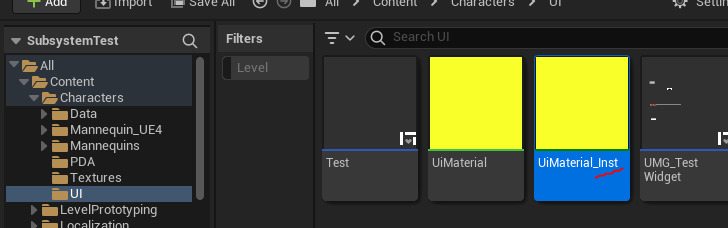
Как использовать его в `FSlateImageBrush` и возможно ли это?
Да возможно. Так:
```cpp
new FSlateImageBrush{
    Cast<UMaterialInstance>(StaticLoadObject(UMaterialInstance::StaticClass(), NULL,
    TEXT("/Game/Characters/UI/UiMaterial_Inst.UiMaterial_Inst"))),
    FVector2D{120.f, 120.f},
    FLinearColor::White // Default Slot tint color is White
}
```
Важно помнить, что материалы отправляемые в `FSlateImageBrush` должны иметь `Material Domain = User Interface`.
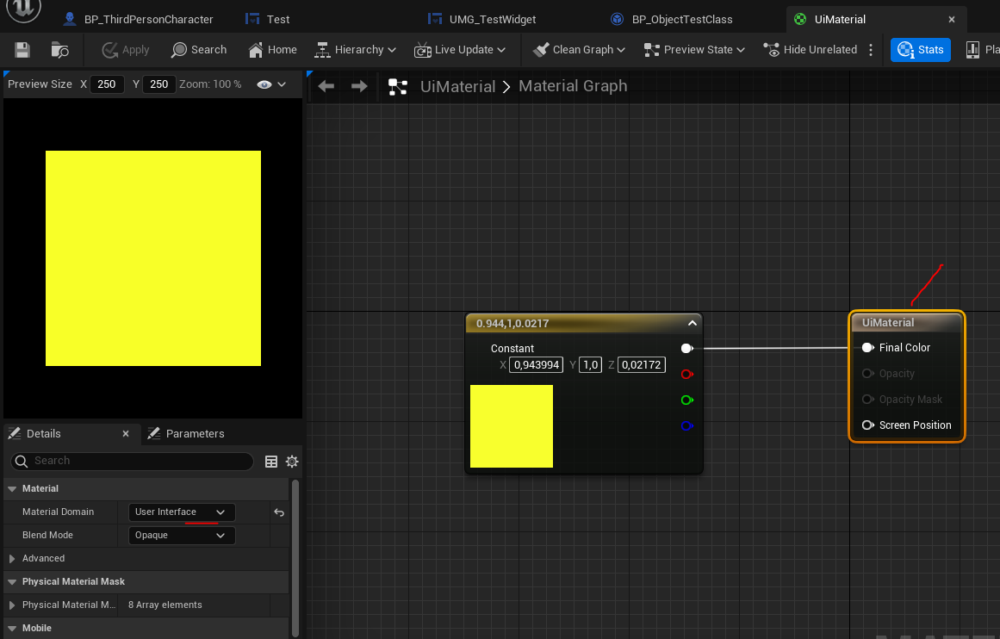
## Загрузка импортированных шрифтов
После импорта шрифта в движок вы получите два файла.
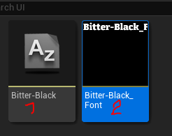
`FontFace` и `Font`.
Ссылку на шрифт надо брать с объекта `Font`.
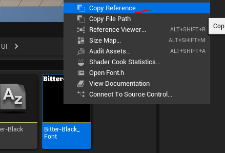
В `UPROPERTY` переменную данный объект может быть установлен так:
```cpp
//.h
// FontStyle
UPROPERTY(EditAnywhere, Category = Appearance)
FSlateFontInfo TextUiFontInfo;
FSlateUIStyle& SetTextUiFont(const FSlateFontInfo& InFontInfo) {
    TextUiFontInfo = InFontInfo;
    return *this;
}
//...
//.cpp
// set default font object
FString FontPath = TEXT("/Script/Engine.Font'/Game/UI/Bitter-Black_Font.Bitter-Black_Font'");
//TSharedPtr<UObject> LoadedFontObj = MakeShareable(LoadObject<UObject>(NULL, *FontPath)); // - this will work  to but i prefer soft pointers
TSoftObjectPtr<UObject> FontPointer = TSoftObjectPtr<UObject>( FSoftObjectPath(*FontPath) );
if (!FontPointer.IsNull()) {
    TextUiFontInfo.FontObject = FontPointer.LoadSynchronous(); // stylesets work only with valid objects
    TextUiFontInfo.Size = 16;
}
```
## Ссылки на `Blueprint` классы
Обычная ссылка на ассет выглядит так - `/Script/Engine.AnimBlueprint'/Game/Characters/Mannequins/Animations/ABP_Manny.ABP_Manny'`.
Если это с++ ассет или не-кодовый ассет (например текстура или меш) то ссылка будет воспринята движком вполне адекватно.
Однако, если вы попытаетесь загрузить `blueprint` ассет по такой ссылке - будет выдана ошибка. (в моем случае движок просто крашился ничего не выдавая)
Например такой код **не сработает**:
```cpp
const FString AnimationInstanceAsset = TEXT("/Script/Engine.AnimBlueprint'/Game/Characters/Mannequins/Animations/ABP_Manny.ABP_Manny'");
const TSoftClassPtr<UAnimInstance> CAnimInst(AnimationInstanceAsset);
MeshComp->SetAnimationMode(EAnimationMode::AnimationBlueprint);
MeshComp->SetAnimInstanceClass(CAnimInst.LoadSynchronous());
```
Потому что мы ссылаемся по обычной ссылке на `Animation BLUEPRINT`.

> Все ссылки на `Blueprint` объекты должны заканчиваться на постфикс - `_C`.

Об этом нигде не написано и никто вам этого не скажет. Я случайно узнал о этой особенности движка из незаметного поста на форуме (теперь он стал чуть заметнее).
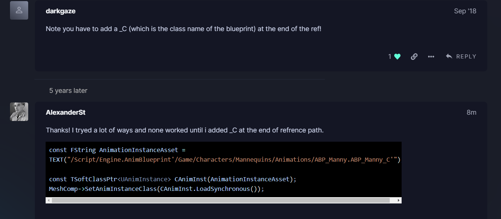
Ссылка на ассет должна иметь такой вид: `/Script/Engine.AnimBlueprint'/Game/Characters/Mannequins/Animations/ABP_Manny.ABP_Manny_C'`.
А код, в свою очередь, должен быть таким:
```cpp
// Load AnimationBlueprint
const FString AnimationInstanceAsset = TEXT("/Script/Engine.AnimBlueprint'/Game/Characters/Mannequins/Animations/ABP_Manny.ABP_Manny_C'");
const TSoftClassPtr<UAnimInstance> CAnimInst(AnimationInstanceAsset);
MeshComp->SetAnimationMode(EAnimationMode::AnimationBlueprint);
MeshComp->SetAnimInstanceClass(CAnimInst.LoadSynchronous());
// or use LoadClass
TSubclassOf<ACharacter> ObjClass = LoadClass<ACharacter>(NULL, TEXT("/Script/Engine.Blueprint'/Game/Characters/BP_ACharacterTestChild.BP_ACharacterTestChild_C'"));
```
## Чтение данных из `DataAsset` по ссылке
Делается элементарно.
DataAsset имеет следующие поля:
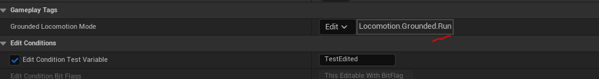
Я получаю ссылку на ассет, кликнув на него правой кнопкой мыши > `Copy Refrence`.
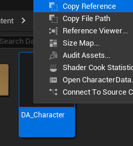
Теперь я могу использовать ссылку в методе LoadObject следующим образом:
```cpp
#include "CharacterData.h"
//...
UCharacterData* Asset = LoadObject<UCharacterData>(NULL, TEXT("/Script/DataAccess.CharacterData'/Game/Characters/Data/DA_Character.DA_Character'"));
UE_LOG(LogTemp, Warning, TEXT("GroundedLocomotionMode = %s"), *Asset->GroundedLocomotionMode.ToString());
```
Я использую загруженные данные, чтобы напечатать структуру ассета в лог.
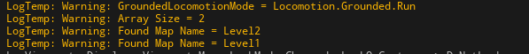
## Доступ к классам по рефренсам
```cpp
// loading class by asset path
{
    //  *note bp class refs should end to _C
    FString CharacterBPPath = TEXT("/Script/Engine.Blueprint'/Game/ThirdPerson/Blueprints/BP_ThirdPersonCharacter.BP_ThirdPersonCharacter_C'");
    {
        // *note ConstructorHelpers work only in class constructor!
        UE_LOG(LogTemp, Warning, TEXT("=== ConstructorHelpers::FClassFinder ==="));
        if (!IsRunningCommandlet()) {
            ConstructorHelpers::FClassFinder<ACharacter> CharacterBPClass(*CharacterBPPath);
            if (CharacterBPClass.Succeeded()) {
                UE_LOG(LogTemp, Warning, TEXT("[LoadClass] BP Class Name: %s"), *CharacterBPClass.Class->GetName());
            }
        }
    }
    {
        UE_LOG(LogTemp, Warning, TEXT("=== LoadClass ==="));
        TSubclassOf<ACharacter> CharacterBPClass = LoadClass<ACharacter>(NULL, *CharacterBPPath);
        if (CharacterBPClass != nullptr) {
            UE_LOG(LogTemp, Warning, TEXT("[LoadClass] BP Class Name: %s"), *CharacterBPClass->GetName());
        }
    }
}
```
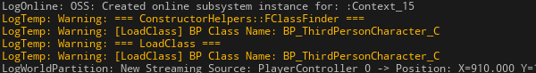
## Доступ к `blueprint` объектам по рефренсам
```cpp
// loading bp classes as objects
FString CharacterBPPath = TEXT("/Script/Engine.Blueprint'/Game/ThirdPerson/Blueprints/BP_ThirdPersonCharacter.BP_ThirdPersonCharacter'");
{ // load Character BP using ConstructorHelpers::FObjectFinder
    ConstructorHelpers::FObjectFinder<UObject> Found(*CharacterBPPath);
    if (Found.Succeeded()) {
        UBlueprint* GeneratedBP = Cast<UBlueprint>(Found.Object);
        if (GeneratedBP != nullptr) {
            UE_LOG(LogTemp, Warning, TEXT("[ConstructorHelpers::FObjectFinder] BP Name is: %s"), *GeneratedBP->GetName());
            UE_LOG(LogTemp, Warning, TEXT("[ConstructorHelpers::FObjectFinder] BP Class Name is: %s"), *GeneratedBP->GeneratedClass->GetName());
        }
    }
}
{ // load Character BP using LoadObject
    UBlueprint* GeneratedBP = LoadObject<UBlueprint>(NULL, *CharacterBPPath, NULL, LOAD_None, NULL);
    if (GeneratedBP != nullptr) {
        UE_LOG(LogTemp, Warning, TEXT("[LoadObject] BP Name is: %s"), *GeneratedBP->GetName());
    }
}
{ // load Character BP using StaticLoadObject
    UObject* SpawnedCharacter = Cast<UObject>(StaticLoadObject(UObject::StaticClass(), NULL, *CharacterBPPath));
    UBlueprint* GeneratedBP = Cast<UBlueprint>(SpawnedCharacter);
    if (GeneratedBP != nullptr) {
        UE_LOG(LogTemp, Warning, TEXT("[StaticLoadObject] BP Name is: %s"), *GeneratedBP->GetName());
        UE_LOG(LogTemp, Warning, TEXT("[StaticLoadObject] BP Class Name is: %s"), *GeneratedBP->GeneratedClass->GetName());
    }
    return;
}
```
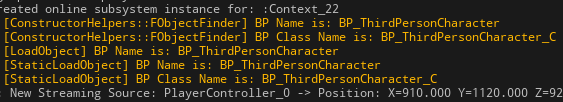
## Переопределение свойств материала
```cpp
UStaticMesh* SMesh = LoadedStaticMesh.LoadSynchronous();
StaticComponent->SetStaticMesh(SMesh);
// change mesh material
FString MIPath = TEXT("/Script/Engine.MaterialInstanceConstant'/Game/Characters/MRed_Inst.MRed_Inst'");
// load material from path using Soft Object PTR
TSoftObjectPtr<UMaterialInstance> FoundMInstance = TSoftObjectPtr<UMaterialInstance>(UKismetSystemLibrary::MakeSoftObjectPath(MIPath));
if (!FoundMInstance.IsNull()) {
    UMaterialInstance * LMaterial = FoundMInstance.LoadSynchronous();
    UMaterialInstanceDynamic* MIDyn = UMaterialInstanceDynamic::Create(LMaterial, SMesh);
    // Dynamic Material Instance setting parameter values
    // Set Color Parameter Value
    MIDyn->SetVectorParameterValue(TEXT("Color"), FColor::Green);
    // Load texture
    FString TxPath = TEXT("/Script/Engine.Texture2D'/Game/Characters/Textures/2344444_original.2344444_original'");
    TSoftObjectPtr<UTexture> TextureRef = TSoftObjectPtr<UTexture>(UKismetSystemLibrary::MakeSoftObjectPath(TxPath));
    MIDyn->SetTextureParameterValue(TEXT("PlanarTexture"), TextureRef.LoadSynchronous());
    // Scalar parameter
    MIDyn->SetScalarParameterValue(TEXT("Scale"), 110.0f);
    SMesh->SetMaterial(0, MIDyn);
    UE_LOG(LogTemp, Warning, TEXT("LOADED!"))
}
else {
    UE_LOG(LogTemp, Warning, TEXT("NOT LOADED!"))
}
```
Написал такой материал с World Space Planar разверткой.
В коде переопределяются параметры текстуры, цвета и скалирования.
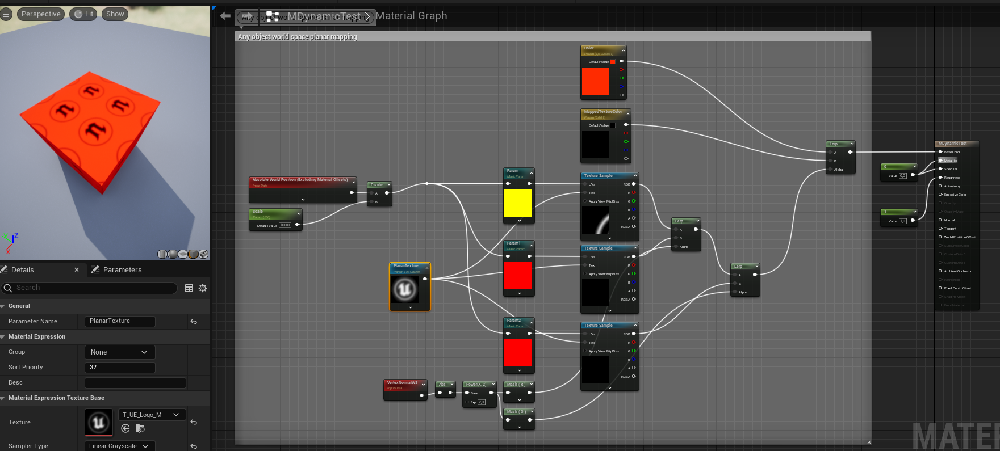
В игре материал выглядит так:
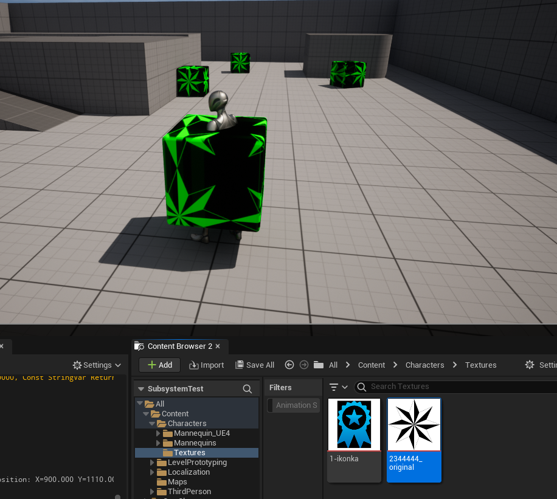
