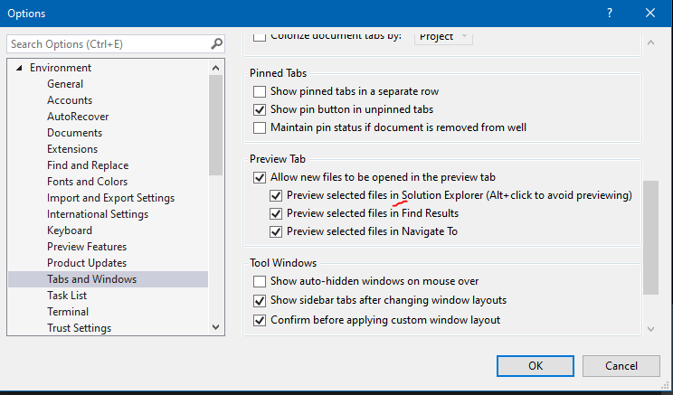

# Создаем первый проект в `Unreal Engine`
Движок `Unreal Engine` имеет очень высокий порог входа для желающих разрабатывать под него на `с++`.
Даже если у вас уже есть опыт разработки на `blueprint`, движок найдет миллионы способов поставить вас в тупик.
Вот с чем пришлось столкнуться лично мне:
1. У меня постоянно сбоил `Visual Studio 2019` и не работал `Intellisense`.
2. В логе компиляции, вместо читаемых букв, выдавался текст с поломанной кодировкой.
3. Я не понимал как надо собирать проект и в чем отличия между сборкой в `Visual Studio` и сборкой через `Live Coding`.
И это не считая проблем с восприятием кода в движке.
Исходный код движка `Unreal Engine` найдет миллион способов поставить в тупик даже самых опытных разработчиков. Движок использует собственную систему сборки `Unreal Build Tool`, собственный препроцессор `Unreal Header Tool`, собственные библиотеки умных указателей и многопоточности.
Когда я начинал свое знакомство с движком, мне были непонятны подключаемые файлы `.generated.h`. Я абсолютно не понимал, как работает система сборки и как добавлять в нее новые модули. С трудом разобравшись, я решил сохранить результаты своих открытий в виде нескольких материалов. Так, постепенно, появилась эта книга.
## Что потребуется для работы
Среда разработки - `Visual Studio 2022` или последующие версии. (`VS2019` не годится из-за несовместимости с плагином `Visual Studio Integration Tool`, а так-же проблем с производительностью `Intellisense`).
Игровой движок - `Unreal Engine 5.1` или последующие версии.
## Создание проекта
Запускаете движок.

В движке идем `Games -> ThirdPerson`, убираем галочку с пункта StarterContent, чтобы проект по меньше весил.
Берем `Blueprint` версию, потому что куда лучше совмещать `c++` и `blueprint` подходы. Причина такого решения проста - оно дает куда больше возможностей для маневра, потому что `blueprint` можно в любой момент отредактировать, не компилируя весь проект. Тем более, что по ходу серьезной разработки размер проекта будет увеличиваться, как и количество `с++` кода в нем. А потому имеет смысл большую часть разработки делать на быстро компилирующихся блюпринтах.
Для компиляции `с++` кода мы будем использовать технологию - `Live Coding`, позволяющую собирать проект прямо в движке, а код писать в каком угодно редакторе, хоть в блокноте. Однако, конкретно я буду писать код в `Visual Studio 2022` из-за системы `Intellisense`, которая туда встроена. И вам я тоже рекомендую использовать `Visual Studio 2022`.
Если у вас установлена `Vs 2019` - удалите ее и замените на `2022`, как это сделал я, ничего страшного не случилось, хотя я боялся, что потрутся важные библиотеки. Почему я акцентирую на этом внимание? Потому что только `VS2022` корректно работает с `Unreal Engine 5`.

Проект я назвал `SubsystemTest`, с этим придется мириться на протяжении всех статей. Логичнее было бы назвать проект `Unreal Experiments`, но уже поздно.
## Включаем плагин `Visual Studio Integration Tools`
Установите на движок плагин - [Visual Studio Integration Tool](https://www.unrealengine.com/marketplace/en-US/product/362651520df94e4fa65492dbcba44ae2), он бесплатный. Переходите по ссылке, добавляете его в библиотеку, потом загружаете в из `EpicGames` лаунчера.

После загрузки плагина открываем наш проект в движке. Переходим `Edit -> Plugins`.

Ищем в списке плагин `Visual Studio Integration Tools`

Учтите, что сам плагин не находится ни в одной из подкатегорий, а потому его сложно найти. Нажмите на пункт `Installed` и промотайте вниз по списку до нужного пункта.
После включения плагина система попросит вас перезапустить движок. Не делайте этого. Пока что.
## Включение `с++` в проекте
Теперь необходимо сгенерировать проект для `Visual Studio`, который будет содержать все необходимые настройки.
Переходим `Edit -> Editor Preferences -> Source Code`. Выберите в пункте `Source Code Editor` в качестве редактора - `Visual Studio 2022`.

Теперь надо сгенерировать `Solution` файл для `visual studio`.

Чтобы сгенерировать `solution` необходим хотя-бы один с++ класс. Без добавления `c++` класса(хотя-бы одного) - `Solution` для `Visual Studio` в проекте появится.
Предлагаю добавить класс, унаследованный от `Actor`.
Идем `Tools -> New C++ Class` и ищем заготовку класса - `Actor`.

Нажимаем `Next` и называем наш класс `TestActor`. У меня он уже создан, так что будет `TestActor1`.

Выставляем `ClassType` на `Public`, чтобы наш проект был более-менее структурирован. Это позволит разместить заголовочный файл `.h`в подпапке `/public`, а файл реализации `.cpp` в подпапке `/private`.
Теперь необходимо выбрать модуль, в котором будет сгенерирован будущий класс. В нашем проекте пока всего один модуль, это модуль самого проекта (в моем случае проект называется `Subsystem Test`, в вашем как-то иначе).

Нажимаем `Create Class`. Это запустит операцию по созданию файла, а так-же `Visual Studio Solution` для вашего проекта.

## Настройка `Visual Studio`
Редактор `Visual Studio` может быть запущен из движка через меню `Tools -> Open Visual Studio 2022`.


### Выключаем `Hot Reloading`
Система `Hot Reloading` запросто может поломать ваш проект прямо во время работы, как это случилось у меня. Поэтому лучше ее выключить.
В `Visual Stuidio` переходим в пункт меню `Tools -> Options`.

После чего `Debugging -> General`. В появившемся окне ищите пункт: `Enable Edit and Continue and Hot Reload`. Убирайте галочку с этого пункта.

### Настройка `Intellisense`
`Intellisense` подсвеичвает код, но что важнее - добавляет возможность навигации по заголовочным файлам. Не зная `API` движка на зубок, вам будет очень тяжело работать без этой системы.
В версии `Visual Studio 2022` инструмент `Intellisense` очень сильно ускорили.
Принцип работы системы таков: `Intellisense` анализирует код вашего проекта и собирает его в "базу данных", которая, затем, потом используется для генерации контекстных подсказок. База данных `Intellisense` по размерам может запросто достигать `5GB` и более. Поэтому полезно ее, время от времени, удалять.

Настраиваем систему.
В меню `Options` переходим по пунктам `Options -> Text Editor -> C / C++`. Ищем подкатегорию `Advanced` и выставляем параметр `Disable External Dependencies Folder` в `True`

В том-же меню выставляем пункт `Disable Intellisense` в `False`.

Переходит в подпункт `View` и выставляем параметр `Show Inactive Blocks` в `False`.

Далее, идем в секцию `Projects And Solutions`. В подпункте `General` выставляем параметр `Alvays show error list in build finishes with errors` в `False`.

### Включаем `Track Active Item` в `Solution Explorer`
`Visual Studio`, по умолчанию, не умеет показывать, в какой конкретно папке находится текущий файл проекта. Постоянно вручную искать активный файл в `Solution Explorer` - не вариант.
Рассмотрим проблему в подробностях.

В данный момент у меня открыт файл`Character.cpp`, я даже могу узнать по какому пути он находится используя опцию `Copy Full Path`. Но опции для поиска этого файла в `Solution Explorer` - нет.
Как быстро найти в проекте файл, который вы открыли?
Для этого есть специальная опция. Именно ее мы и включим в этой главе.
Переходим в меню настроек: `Tools -> Options -> Projects And Solutions`. Здесь есть параметр `Track Active Item in Solution Explorer`.

По умолчанию этот параметр отключен. Если его включить, то каждый открытый файл проекта будет автоматически перематывать `Solution Explorer` к его расположению.
Это не очень удобно для практической работы, а проект при таком использовании опции, из упорядоченного набора каталогов, рискует превратиться в бессвязную кашу.
Куда лучше будет сделать собственное сочетание клавиш, по которому эту настройку можно будет включать и отключать по желанию.
Идем в `Tools -> Options -> Environment -> Keyboard`.

Тут можно добавлять сочетания клавиш для разных команд.
Ищем там команду следующего вида - `View.TrackActivityinSolutionExplorer`.

Выбираем поле `Press shortcut keys` и вбиваем желаемое сочетание для включения - отключения этой опции. В моем случае это `Ctrl + Alt + ;`.

Жмем `Assign`.
Теперь, если нажать это сочетание клавиш, открытый файл будет показан по полному своему пути в SE.

Есть и еще один вариант использования этой команды.
Щелкаем на тулбаре правой кнопкой мыши.

Далее идем по пути `Customize -> Commands -> MenuBar -> View`.

Тут мы можем добавить новый пункт в меню View.
Жмем `AddCommand` ищем там секцию `View` и подсекцию - `Track Activity in Solution Explorer`.

Нажимаем `OK`.
Можете поместить добавленный пункт на нужное место двигая его кнопками `Move Up` и `Move Down`.

Теперь этот пункт меню будет находиться в подменю `View`.

И вы всегда сможете найти открытый файл в Solution Explorer, просто включив его. А когда эта опция не нужна - отключив. Это колоссально поможет вам в работе.
### Включаем предпросмотр файлов в `Solution Explorer`
Опция `Preview Selected Files in Solution Explorer` позволяет просматривать содержимое файлов проекта, не открывая их для редактирования.

У большинства разработчиков эта настройка включена по умолчанию. Но если, по какой-то причине, у вас она отключилась (у меня такое произошло прямо в ходе работы), включить эту настройку можно, перейдя по пути `Options-> Environment -> Tabs And Wndows`.
На вкладке вы найдете соответствующие параметры - `Preview Selected Files...` включите их все.

Поздравляю, мы настроили `Visual Studio`.
Для лучшей работы, советую перезапустить ее и открыть заново через `Unreal Engine -> Tools -> Open Visual Studio 2022`.
## Сборка проекта
Рассмотрим способы, которыми разработчик может компилировать и запускать свой проект.
### Сборка из `Visual Studio`

+ Плюсы - очень удобная отладка, прямо из `Visual Studio`. Точки останова будут работать как надо. Можно отслеживать работу памяти и загруженность игровых систем.
- Минусы - требуется установка "символов отладки", которые занимают от `40Gb` до `60Gb` памяти. Это серьезный минус, лично для меня, поэтому я не буду пользоваться этим методом сборки (и вам не советую).

Прочитать подробнее про процесс сборки можно на странице [официальной документации](https://docs.unrealengine.com/5.1/en-US/building-unreal-engine-from-source/).
#### Опции сборки `Visual Studio`
При открытии проекта в `Visual Studio` у вас будет масса опций для сборки проекта.


В зависимости от установленных пакетов, список опций будет отличаться. Например, если у вас установлены пакеты для экспорта проекта под линукс - в списке целей появятся дополнительные пункты.
Рассмотрим основные цели сборки, которые доступны для пакетов "по умолчанию".
`Degub Game` и `Debug Editor` - полностью пересобирают исходники движка и игрового проекта, соответственно, с созданием символов отладки. Что это значит? Это значит, что символы отладки качать не обязательно, если вам не жалко систему. Вы можете собрать проект отсюда и символы отладки сгенерируются автоматически. Через пару часов компиляции и после того, как место на вашем драгоценном жестком диске закончится окончательно. НЕ ИСПОЛЬЗУЙТЕ ЦЕЛИ СБОРКИ `Debug Game` и `Debug Editor`. Забудьте про них.
`Development` и `Development Editor` - эти цели сборки будут использовать предустановленные символы отладки для `Unreal Engine`. Установить эти символы отладки можно вручную из меню движка.


Размер символов отладки крайне большой, качать их или нет - дело ваше.

Опция `Development Editor` запустит сборку как движка, так и вашего проекта в нем. Опция `Development` запустит сборку только вашего проекта, который будет запущен как отдельное от движка приложение. Но! Эта опция из "коробки" работать не будет.
Чтобы запустить проект без сборки редактора - придется запечь контент для целевой платформы. Эта операция может запросто длиться несколько часов даже со среднего размера проектом.
Делается это из меню `Platforms -> Windows -> Cook Content`.


#### Заключение
Если вы собираете проект из `Visual Studio`, значит вы знаете, что вы делаете и мои советы вам не нужны. В противном случае - просто забудьте про эту возможность.
Все варианты сборки проекта из под `Visual Studio` крайне не привлекательны из-за требований к памяти на жестком диске, а так-же высокой нагрузки на систему. Поэтому пользоваться этим подходом в своей работе я не буду вообще (и вам не советую, если вы не знаете, что делаете).
### Сборка через Live Conding.
Этот способ сборки наиболее простой, удобный и эффективный, потому что встроен в движок.


Плюсы - быстрая сборка, не надо запекать контент для платформы, собранный проект не расходует слишком много памяти на диске.
Минусы - отладку вести сложнее, точки останова - не работают.
#### Включение `Live Coding`
По умолчанию в `Unreal Engine` уже включен `LiveCoding`, убедиться в этом  можно перейдя в `Edit -> Editor Preferences -> Live Coding`.

Вызвать окно настроек `Live Coding` можно из правого нижнего угла движка, нажав по иконке.


Если, по какой-то причине, в вашем проекте `LiveCoding` отключен и его не получается включить из настроек (а такое бывает) - закройте проект в `Unreal Engine` и `Visual Studio`, а затем удалите папки `Build` и `Intermediate` и каталога проекта.

Запустите проект с перекомпиляцией всех модулей. Когда движок откроется, активируйте обновление проекта соответствующей опцией из меню `Tools -> Refresh visual Studio 2022 Project`.


После этого `LiveCoding` должен включиться.
#### Запуск компиляции
Чтобы собрать проект в LiveCoding нажмите на кнопку сборки в левом нижнем углу движка.

Поскольку постоянно открывать движок и нажимать на эту кнопку крайне неудобно, я советую вызвать `LiveCoding` сочетанием клавиш: `Ctrl + Alt + F11`.

#### Отладка `LiveCoding`
Единственный вменяемый способ отладки кода, при работе с `LiveCoding` сводится к использованию макроса `UE_LOG`, который печатает информацию в лог движка.
Этот макрос стоит использовать вместо "точек останова" там, где хочется увидеть результаты тех или иных вычислений.
```cpp
float to_print = FirstNum + SecondNum;
UE_LOG(LogTemp, Error, TEXT("val = %f"), to_print)
```

Помимо `UE_LOG` в движке есть операторы прерывания - `Asserts`, которые выступают как альтернатива "точкам останова". Их используют, чтобы останавливать работу приложения, с выводом текста ошибки в лог `LiveCoding`. Я рассмотрю эти операции в отдельной статье.
#### Отладка `LiveCoding` кода в `Visual Studio`
К сожалению, при использовании `LiveCoding` нормальная отладка с точками останова возможна лишь при соблюдении ряда условий.
Для начала придется установить `Debug Symbols`, то есть символы отладки для `Unreal`.
Идем в `Epic Games Laucher` и находим установленный движок.
Жмем `Настройки`.

Тут будет пункт `Символы для редактора отладки`. И объем загружаемых данных.

Как вы видите объем значительный.
После загрузки мы сможем, через отладчик `Visual Studio`, подключиться к процессу движка и вести отладку.
Чтобы подключиться отладчиком надо перейти в `Debug -> Attach To Process`.


## Добавляем код печати текста на экран
Теперь, когда мы ознакомились с методами сборки проекта, самое время написать тестовый код. Для этих целей отлично подойдет уже созданный нами, в главе про `включение с++ в проекте`, класс `TestActor`.


Данный класс состоит из заголовочного файла `.h`, содержащего описание класса, а так-же из реализации этого класса в файле `.cpp`. Оба файла находятся в соответствующих папках - `Public` и `Private`.

Откройте файл заголовка `TestActor.h`.
Мы создали класс из самого Unreal Engine, так что в файле уже будет заготовка в виде кода.

Как вы видите тут уже представлены перегрузки для `BeginPlay` и `Tick` функций.
Если вы знакомы с `blueprint` версией класса `Actor`, то эти функции будут вам знакомы.
Так-же тут имеется конструктор - `ATestActor()`.
Теперь давайте откроем файл реализации - `TestActor.cpp`.

Тут мы видим реализацию методов, описанных в заголовке.
Давайте добавим тестовый код, чтобы убедиться, что все работает. В нашем случае для теста будет использоваться вывод строки на экран.
Делается это через команду:
```cpp
GEngine->AddOnScreenDebugMessage(-1, 0.2f, FColor::Cyan, TEXT("TEST"));
```
Добавьте этот текст в файл `TestActor.cpp`, внутрь метода `Tick`.

Сохраните файл `Ctrl + S`.
Теперь нам надо собрать наш проект. По скольку выше я уже указывал, что собирать его мы будем используя `LiveCoding`, то откройте движок.
В нижнем правом углу вы обнаружите иконку компиляции.

Нажмите ее. Это автоматически  запустит компиляцию.

Вам не обязательно всякий раз открывать движок и вызывать `LiveCoding` оттуда. Можно нажать сочетание клавиш `Ctrl + Alt + F11` и это откроет окно `LiveConding` в любом месте.

Таким образом вы можете писать код под `Unreal Engine` почти в любом редакторе. Но `VisualStudio` удобнее из-за его `Intellisense`, то есть контекстуальных подсказок.
## Проверка кода
Как проверить работоспособность только что скомпилированного кода? Просто найдите созданный класс Actor'а и добавьте его на тестовую  сцену, после чего запустите симуляцию.
Класс `Actor'а` находится в подпункте C++ Classes проводника Unreal.

Перетащите его оттуда прямо на сцену.

Теперь, если мы запустим проект, то увидим следующее:

Поздравляю, мы изучили способ добавления собственных классов в Unreal Engine, а так-же настроили `Visual Studio`. 