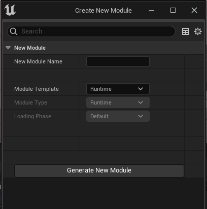
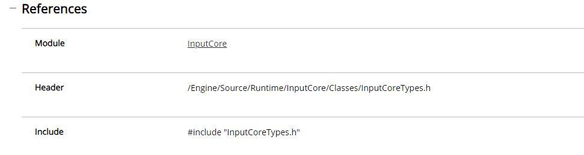

# Знакомство с движком
Одним  из ключевых навыков в работе с `Unreal Engine` является умение читать его исходный код.
Исходный код `Unreal Engine` поставляется вместе с движком и автоматически загружается при открытии проекта в `Visual Studio`.

Большая часть статей в этой книге основана на изучении исходного кода движка.
Несмотря на то, что в этой статье я практически не пишу код, чтение ее крайне важно, для  понимания книги, потому что тут я затрагиваю архитектуру модулей и работу с зависимосями для проекта.

> Помимо этой статьи, на ютубе есть полезное видео, раскрывающее принцип работы движка от функции [tick](https://www.youtube.com/watch?v=IaU2Hue-ApI). Советую ознакомиться.

## Подготовка к работе
В предыдущей главе мы создали проект `SubsystemTest`. Запускаем его через `Epic Games Launcher` или через и файл `.uproject`.


Открываем `Visual Studio` из меню `Tools -> Open Visual Studio 2022`.

## Особенности `c++` в `Unreal Engine`
В этой статье мы будем изучать исходный код движка. Однако, прежде чем приступать к главному блюду, давайте рассмотрим некоторые сложные моменты.
### `Forward Declaration`
На что наткнется начинающий `с++` разработчик, когда откроет исходные файлы движка? На странные конструкции вида `class ClassName;`.
Что это такое? Эти конструкции называются `Forward Declaration`.

Зачем они нужны в `с++`?
Операторы `Forward Declaration` позволяют избежать проблемы с цикличной зависимостью … то есть с `cyclic dependency`.
Как это выглядит.
Предположим есть два класса, зависимых друг от друга. Причем классы эти расположены в двух разных файлах.
```cpp
//file Class1.h
#include "Class2.h" // include second class
class ClassName1{
    ClassName2 VariableC2;
}
//file Class2.h
#include "Class1.h" // include first class
class ClassName1{
    ClassName1 VariableC1;
}
```
Между такими классами имеется т.н. `Cyclic Dependency`. Система сборки не сможет понять, какой из этих классов надо скомпилировать первым. Потому что `ClassName1` ссылается на `ClassName2`, а `ClassName2` ссылается на `ClassName1`. Стандартными способами эту проблему физически решить Не ВОЗМОЖНО.
Эта проблема решается  с помощью `Forward Declaration`. Вот как выглядит код с применением этой техники.
```cpp
//file Class1.h
#include "Class2.h"
class ClassName1{
    ClassName2 VariableC2;
}
//file Class2.h
//#include "Class1.h" - don't need to include
class ClassName1; // forward declaration
class ClassName1{
    ClassName1 VariableC1;
}
```
В этом коде циклической зависимости не будет, потому что системе сразу понятно, какой файл компилировать первым.
При разработке для `Unreal Engine` очень часто используется техника `Forward Declaration`.
### `Reflection system`
Теперь коснемся макросов, вроде `UCLASS`, `GENERATED_BODY`, `UFUNCTION`,  или `UOBJECT`, которые применяются повсеместно.

Это макросы `Reflection system`. Они применяются для отражения `с++` кода в `blueprint` и параметры движка. Данные макросы, перед компиляцией, автоматически заменяются сгенерированным кодом. Отвечает за это система, под названием `Unreal Header Tool`, ее я рассмотрю в одной из следующих глав. А пока, просто помните, что в этих макросах ничего "странного" нет. Они не стандартны, но их существование вполне оправданно.
## Исходники движка внутри проекта `Visual Studio`
Запустите `Visual Studio` из пункта меню `Tools -> Open Visual Studio 2022`, если еще не сделали это.

Обратите внимание на вкладку - `Solution Explorer`. Здесь вы найдете папку `UE5` с исходниками `Unreal Engine`. Она загружается автоматически в каждый проект.

Если раскрыть папку `UE5`, появится список каталогов, среди которых будут `Plugins` и `Source`.

В каталоге `Plugins` находятся все встроенные плагины движка. Включая те, которые вы купили на маркетплейсе.

Вы можете посмотреть cделаны любые плагины движка, не покидая свой текущий проект.
_(про создание собственных плагинов читайте следующую главу)_
В каталоге `Source` находятся основные исходники `Unreal Engine`.


Здесь нас интересуют папки `Developer`, `Editor` и `Runtime`. Каждая из них содержит модули, завязанные на систему сборки `Unreal`.
### Модули `Unreal Engine`
Модули в движке делятся на три типа.
#### `Editor` модули
Это модули редактора `Unreal Engine`.
Тут можно найти модуль редактора анимаций.

То есть конкретно вот этот редактор.

Если хотите знать, как устроены подобные модули - советую покопаться в этой папке и выяснить. Но перед этим - рекомендую прочитать главу про `Slate`, без знакомства с которой понять код такого модуля будет затруднительно.
#### `Developer` модули
Эти модули содержат в себе `third party` утилиты и библиотеки, а так-же короткие запускаемые скрипты и операции.
Например, в папке `Developer` можно найти код операций, доступных для ассета.

Код, генерирующий это меню ассета, находится в модуле `AssetTools`, который, в свою очередь, находится в папке `Developer`. Полный путь до файла выглядит так - `Developer -> AssetTools -> Private -> AssetTypeActions -> AssetTypeActions_AnimationAsset.cpp`

Можете поизучать и его устройство, чтобы знать, как создаются подобные меню и пункты для них.
#### `Runtime` модули
Данные модули составляют ядро движка `Unreal Engine` и всегда загружаются вместе с проектом.
Именно в `Runtime` модуле находится ядро движка `Unreal Engint`, а так-же основной цикл тика. Модуль этот называется `Launch`.

#### Модуль, запускающий `Unreal Engine`
Модуль, запускающий игровой движок, называется `Launch`. Это `Runtime` модуль, и файлы в нем распределены по типам операционных систем, которые поддерживает `Unreal Engine`.
В случае с `Windows` движок подключается к `WinAPI` откуда соединяется с функцией `WinMain`. Это и есть точка входа в наше приложение.
Исходный код файла выглядит так:

Из этой функции затем вызывается другая - `LaunchWindowsStartup`, куда вынесена основная логика запуска движка под `Windows`. Оттуда идет вызов следующей функции - `GuardedMain`, которая и является точкой входа в цикл `tick` для движка.

Сама функция `GuardedMain` находится в файле `Launch.cpp` по пути `Runtime -> Launch -> Private -> Launch.cpp`.
Так или иначе эта функция вызывается в каждой из поддерживаемых движком ОС.

Теперь предлагаю взглянуть на основной цикл обновления движка. Это замкнутый цикл `while`, каждую итерацию цикла вызывается метод `tick`.
Цикл обновления движка надохдится в том-же файле `Launch.cpp`.
Выглядит он так:

Размотаем цепочку вызовов.
Функция `EngineTick` выглядит так:

Из нее вызывается метод в другом классе - `FEngineLoop`. Внутри него мы можем видеть полноценную реализацию метода `Tick()`.


## Архитектура модулей в игровом проекте
Давайте детально рассотрим то, из чего собран весь движок `Unreal Engine` - модули.
В предыдущей главе мы касались модуля `Launch`, который запускает игровой движок.
Давайте создадим свой  собственный подуль.
### Создание модулей
В корне проекта (в папке `Source`) мы видим список доступных нам модулей. Основной модуль создается по умолчанию и имеет то-же самое название, которое выставлено у проекта. Остальные мы создали вручную, в данном случае это модули `CharactersModule` и `TestModule`, ну а проект у нас называется, если вы еще не забыли - `SubsystemTest`.

Давайте рассмотрим процесс создания модуля `TestModule`.
Стандартного инструментария в Unreal Engine для создания модулей - нет. Подразумевается, что разработчик будет создавать их вручную (что мы рассмотрим чуть пожже).
Однако существуют сторонние (и при этом бесплатные) плагины, позволяющие создавать модули в пару кликов мыши.

Всего таких плагинов два. Использовать буду тот, который [C++ Module Generator](https://marketplace-website-node-launcher-prod.ol.epicgames.com/ue/marketplace/en-US/product/c-module-generator). Не помню почему я использую именно его. Предыдущий, вроде, имеет какие-то недоработки.
Добавляем в библиотеку, загружаем в движок, включаем.

После включения и перезапуска движка, появится новый пункт меню в Window -> Module Generator.

Тыкаем туда, чтобы появился диалог.

Здесь вы можете выбрать имя модуля, а так-же его способ загрузки. По умолчанию есть два шаблона загрузки - Editor и Runtime.
Эти шаблоны отвечают за конфигурацию модуля в файле `.uproject`.  Подробный разбор конфигурации будет ниже.

Для теста нам достаточно выбрать Runtime, то есть оставить все как есть, задать имя - `TestModule` и нажать на `Generate New Module`. (я этот  модуль уже создал, просто воспроизвожу процесс)

После этого появится сообщение о необходимости перезапуска движка.
При перезапуске система спросит - не хотите ли пересобрать проект? Жмете `Yes` ждете пересборки.
После открытия проекта разработчик может столкнутсья с проблемой - новый модуль не появился в списке файлов, в проводнике Unreal.

Однако не пугайтесь, он там. Просто проводник не отображает пустые папки.
Чтобы убедиться в том, что модуль действительно создан, давайте запустим Visual Studio. Но сначала надо сделать Tools -> Refresh Visual Studio 2022 Project.

После открытия Visual Studio, мы можем видеть новый модуль в SolutionExplorer'е.

Модуль автоматически загружен в Unreal Build System.
Откройте файлы `ИмяПроекта.Target.cs` чтобы убедиться в этом.

Теперь, когда мы создали наш модуль, давайте пройдемся по его архитектуре.
### Загрузка модулей
Модули загружаются в движок через файл конфигурации проекта - `.uproject`, где под них отведена секция `Modules`.

Если вы используете плагины, то в файле `.uplugin` вы так-же найдете список модулей, из которых состоит плагин.

Каждый модуль имеет тип и фазу загрузки, которые задаются соответствующими строчками в конфиге.
```json
{
    "Name": "TestModule",
    "Type": "Runtime", // тип модуля
    "LoadingPhase": "Default", //фаза загрузки
    "AdditionalDependencies": [
        "Engine"
    ]
}
```
И вот эти то строчки `Type` и `LoadingPhase` я бы хотел рассмотреть отдельно.
Как узнать - какие значения они могут принимать?
Ведь автозавершение в VS не выводит никаких подсказок.
Кто-то скажет, что надо посмотреть в документацию на сайте, но там она достаточно кастрирована.
Давайте лучше найдем внутри исходников движка заголовочный файл, отвечающий за загрузку модулей и чтение их конфигов. Там мы и узнаем допустимые знчения для каждой из строк указанных выше.
И да, такой файл действительно имеется. Находится он в модуле `Runtime -> Projects` и называется `ModuleDescriptor.h`.

Так-же в этой папке есть `PluginDescriptor.h`, в котором, очевидно, находятся значения настроек для плагина.
Но мы остановимся на дескрипторе модуля.
Внутри файла `ModuleDescriptor.h` можно обнаружить два перечисления (enum) со следующими названиями: `ELoadingPhase` и `EHostType`.
Очевидно, что они соответствуют допустимым значениям для `LoadingPhase` и `Type` настроек в конфигурации модуля.
Возможные значения для `LoadingPhase` выглядят так:

Обратите внимание на пункт `None`.
Если вы хотите отключить модуль, можете установить ему `None` в настройке `LoadingPhase`.
Возможные значения для настройки `Type` выглядят так:

Обычно используется `Runtime`.
Помимо автоматической загрузки модулей через строки конфигурации, их можно загружать и используя код. Например, прямо во время геймплея. И хотя врятли это хорошая идея, такая возможность все равно имеется. Давайте ее рассмотрим.
#### Включение и отключение модулей из кода.
В движке есть синглтон `FModuleManager` (вот его [документация](https://docs.unrealengine.com/4.27/en-US/API/Runtime/Core/Modules/FModuleManager/)), который позволяет обратиться к конструктору модуля, то есть его главному классу практически из любого  места движка.
Если вы создадите в основном классе модуля какой-то функционал, то вы можете получить к нему доступ вот так:
```cpp
FAssetRegistryModule& AssetRegistryModule = FModuleManager::LoadModuleChecked<FAssetRegistryModule>(TEXT("AssetRegistry"));
```
В данном случае код получает доступ к модулю `AssetRegistry`. Я взял его из модуля `Developer/AssetTools/Private/AssetToolsModule.cpp`.
Метод `LoadModuleChecked` - загружает модуль и возвращает на него ссылку. Если модуль уже загружен - просто возвращает на него ссылку.
Так-же в классе `FModuleManager` есть методы вроде `UnloadModule` - для остановки модуля и `AbandonModule` - для приостановки модуля по имени. Документацию класса можете найти выше, я привел ссылку.
### Конструктор модуля
Конструктор и деструктор - это части любого класса в С++.
Модули тоже имеют свой конструктор и деструктор в виде методов, вызываемых из главного класса модуля.
Этот класс всегда имплементирует интерфейс `IModuleInterface`, а так-же содержит в себе макрос - `IMPLEMENT_MODULE`, в котором указывается название модуля и класс, который этот модуль реализует.
По этому макросу Unreal определяет главный класс для модуля.
В нашем случае макрос выглядит так:
```cpp
IMPLEMENT_MODULE(FTestModule, TestModule)
```
Этот макрос может находиться в любом `.cpp` файле, но обычно название этого файла совпадает с названием модуля или имеет постфикс (\*Module.cpp). В нашем случае это `TestModule.cpp`.
Файл `TestModule.cpp`:

Заголовочный файл `TestModule.h`:

Название класса - `FTestModule` имеет префикс `F`, потому что все функциональные классы в UnrealEngine должны иметь этот префикс по стандарту. (О Стандартах с++ кода в Unreal мы поговорим в другой статье.)
Этот класс реализует две функции из интерфейса - `StartupModule` и `ShutdownModule`, давайте их рассмотрим.
`StartupModule`, очевидно, вызывается, когда модуль запускается (порядок запуска модуля зависит от его конфигурации в файле `.uproject` или `.uplugin`, выше мы их рассматривали, сточка - `LoadingPhase`)
`ShutdownModule` вызывается, когда модуль отключается.
Тут, к стати, можно добавить, что модули можно включать и отключать не только из файла конфигурации, но так-же используя интерфейс движка.
Какая обычно логика задается модулю при его запуске и остановке?
При запуске в модуле создают пункты настройки в параметрах проекта, регистрируют собственные меню в движке, запускают какие-либо потоки или подсистемы, а так-же регистрируют свои редакторы переменных.
Ну а при остановке модуля все зарегистрированное - убирается.
К примеру модуль `AudioEditor` запускается вот так:

На данном этапе я не буду добавлять код ни в конструктор ни в деструктор модуля. Вместо этого мы сосредоточимся на добавлении своих собственных классов внутрь модулей.
### Добавление классов в модули из движка
Теперь, давайте создадим собственный класс внутри модуля. Пусть это будет обычный класс Actor'а, чтобы не тратить много времени.
Идем в `Tools -> New C++ Class`. Выбираем `Actor`.

Жмем `Next`.
На следующем экране задаем имя нашего файла, а так-же выставляем ему модификатор Public, чтобы организовать заголовочный файл и файл реализации(\*.cpp) в соответствующие папки.

Тут важно. В правом выпадающем меню можно выбрать модуль, в котором будет создан новый класс. Выберите тут TestModule, чтобы было как-то так:

Теперь жмем Create Class.
В Visual Studio будет запрос на перезагрузку проекта, жмем Reload All.

И вот, внутри модуля появился наш класс.

Давайте добавим в него тестовый код, выводящий текст на экран.
```cpp
GEngine->AddOnScreenDebugMessage(-1, 0.2f, FColor::Cyan, TEXT("Module Actor TEST"));
```
Чтобы было так:

Ну и скомпилируем все это нажав сочетание клавиш `Ctrl + Alt + F11`.

А теперь, в  движке, перетащите созданный нами класс ModuleTestActor в игровой мир и запустите симуляцию.


Результат симуляции:

### Добавление файлов с кодом в модули вручную
Иногда в проект Unreal необходимо добавить не-шаблонный класс или заголовочный файл. В некоторых случаях мы не можем (или не хотим) использовать классический способ добавления класса из меню движка. Например, если файл, который мы добавляем, содержит не класс, а `enum`. При этом нужен лишь заголовочный файл `.h`, а файл `.cpp` не нужен.

> **Ни в коем случае не добавляйте файл через меню `Visual Studio`! `VS` создает файлы проекта внутри папки `intermediate`, откуда их потом придется или извлекать или полностью удалять папку `intermediate`, после чего пересобирать проект.**

Открываем в обычном проводнике папку модуля проекта, в нашем случае это `TestModule` и добавляем туда папку `Enums`.

В папке щелкаем `пкм -> Создать -> Текстовый документ`

Называем: `TestEnums.h`.

Если вы не можете отредактировать расширение файла - в проводнике перейдите на вкладку "вид" и включите опцию "расширения имен файлов".

Однако созданный файл не появится в Visual Studio сразу. Чтобы файл появился в проекте, откройте движок далее `Tools -> Refresh Visual Studio 2022 Project`.

После этого в `Visual Studio -> Solution Explorer` появится созданный нами файл.
Но он пока пуст.

Поместите в файл, например, такой код:
```cpp
#pragma once
#include "CoreMinimal.h"
#include <UObject/ObjectMacros.h>
// UHT
#include "TestEnums.generated.h"
// Our Test Enum
UENUM(BlueprintType)
enum class EMyFruitsList : uint8
{
	Apple UMETA(DisplayName = "Green Apple"),
	Orange,
	Cherry UMETA(ToolTip = "Some Test Tooltip."),
};
```

Теперь давайте подключим этот файл в конструкторе модуля. Откройте файл `TestModule.h` и пропишите `#include "Enums/TestEnums.h"`.

Если вам не хочется всякий раз указывать имя папки, в которой находится подключаемый файл, можете открыть файл `TestModule.build.cs` и включить эту папку в категорию `PublicIncludePaths`.

Теперь можно заменить `#include "Enums/TestEnums.h"` на `#include "TestEnums.h"`.
#### `#pragma once`
В начале заголовочных файлов всегда надо использовать команду `#pragma once`.
Эта команда заставляет компилятор подключать заголовчный файл всего один раз.
Поскольку ваши заголовочные файлы внутри проекта могут быть использованы из других модулей или скомпонованы с другими файлами на этапе сборки - эта команда **обязательна** к использованию для каждого заголовочного файла `.h` в `Unreal`.
### Создание модуля вручную

> *Этот материал является дополнением, я написал его уже после того, как закончил статью. Мне показалось, что статья без него не является полной.*

Давайте, ради спортивного интереса и дополнительных знаний, создадим модуль вручную.
#### Создаем иерархию файлов
Для начала делаем директорию с названием модуля в папке `/Sources` проекта.
Модуль у нас будет называться `HandmadeModule`.

Заходим в созданную папку и добавляем текстовый файл `HandmadeModule.build.cs`.

В этот файл помещаем следующий код:
```csharp
using UnrealBuildTool;
public class HandmadeModule : ModuleRules
{
	public HandmadeModule(ReadOnlyTargetRules Target) : base(Target)
	{
        PCHUsage = PCHUsageMode.UseExplicitOrSharedPCHs;
		PublicDependencyModuleNames.AddRange(new string[] { "Core", "CoreUObject", "Engine"});
		PublicIncludePaths.AddRange(new string[] {"HandmadeModule/Public"});
		PrivateIncludePaths.AddRange(new string[] {"HandmadeModule/Private"});
	}
}
```
Обратите внимание на строчки `HandmadeModule` внутри кода. Им соответствует конструктор класса, а так-же сам класс. Если ваш модуль имеет другое название - замените эти строчки.
#### Добавляем конструктор модуля
Теперь создаем две папки `Public` и `Private`.

В папке `Public` создаем основной файл модуля, с названием `HandmadeModule.h`.

С таким содержимым:
```cpp
#pragma once
#include "Modules/ModuleManager.h"
DECLARE_LOG_CATEGORY_EXTERN(HandmadeModule, All, All);
class FHandmadeModule : public IModuleInterface
{
	public:
	/* Called when the module is loaded */
	virtual void StartupModule() override;
	/* Called when the module is unloaded */
	virtual void ShutdownModule() override;
};
```
(Замените в коде строки `HandmadeModule` на свое название модуля, при необходимости.)
Теперь в папке `Private` создаем файл `HandmadeModule.cpp`.

И помещаем туда такой код:
```cpp
#include "HandmadeModule.h"
DEFINE_LOG_CATEGORY(HandmadeModule);
#define LOCTEXT_NAMESPACE "FHandmadeModule"
void FHandmadeModule::StartupModule()
{
	UE_LOG(HandmadeModule, Warning, TEXT("HandmadeModule module has been loaded"));
}
void FHandmadeModule::ShutdownModule()
{
	UE_LOG(HandmadeModule, Warning, TEXT("HandmadeModule module has been unloaded"));
}
#undef LOCTEXT_NAMESPACE
IMPLEMENT_MODULE(FHandmadeModule, HandmadeModule)
```
#### Добавляем модуль в систему  сборки
Теперь открываем файлы `.target.cs` в папке `Source`.

Добавляем наш модуль в систему сборки. В оба файла.


#### Регистрируем модуль в файле `.project`
Модуль надо зарегистрировать. Для этого открываем файл `.uproject` в корне проекта.

В секцию `Modules` вписываем это:
```json
{
    "Name": "HandmadeModule",
    "Type": "Runtime",
    "LoadingPhase": "Default",
    "AdditionalDependencies": [
        "Engine"
    ]
},
```
Чтобы было так:

Модуль готов. Чтобы скомпилировать все это дело и загрузить - сначала закройте движок, если он у вас открыт. Удалите папки `Intermediate` и `Binaries`. Запустите движок.
Перед вами появится такое сообщение, обратите внмиание на строчку `HandmadeModule`. Наш модуль подключен и будет собран системой.

Ждите пока пройдет компиляция.
Если все прошло успешно идем в `Tools->Refresh Visual Studio 2022 Project`.

Теперь можно попробовать добавить в новый модуль класс из движка. Жмем `New C++ Class`.

Как вы видите, возможность добавить класс внутрь модуля появилась в диалоге.
## `UnrealHeaderTool`, `generated.h` и `Reflection System`
Если сейчас в созданном нами классе `Actor'а` открыть заголовочный файл `ModuleTestActor.h`, то, среди прочего, мы увидим такую строчку:
```cpp
#include "ModuleTestActor.generated.h"
```

### `.generated.h`
Подключаемый файл `.generated.h` генерируется автоматически системой, под названием `UnrealHeaderTool`.
Генерируется он всякий раз при компиляции проекта для каждого файла, в котором используются макросы `reflection system`, а именно: `UCLASS, UPROPERTY, USTRUCT` и другие…
Содержимое сгенерированного файла можно просмотреть. Откройте папку проекта по пути `/Intermediate/Build/Win64/UnrealEditor/Inc/TestModule/UHT`. Эта папка относится к `UHT` и в нее складываются все файлы, генерируемые этой системой для текущего проекта.

Вы можете сгенерировать такой файл для любого класса, в котором применяется `reflection`, то есть отражение с++ кода в `blueprint`.
Давайте создадим в папке проекта пустой текстовый файл `TestGFile.h`, прямо из проводника.

Необходимо обновить проект `Tools->Refresh Visual Studio 2022 Project`, чтобы файл появился в Visual Studio.

В файл поместите простой код:
```cpp
#pragma once
#include "CoreMinimal.h"
// UHT
#include "TestGFile.generated.h"
UCLASS(BlueprintType)
class TESTMODULE_API UTestGFile : public UObject
{
	GENERATED_BODY()
	//public:
};
```
Если скомпилировать код, то файл `TestGFile.generated.h` автоматически сгенерируется в папке `/Intermediate/Build/Win64/UnrealEditor/Inc/TestModule/UHT`.

### `UnrealHeaderTool`
Исходники `UnrealHeaderTool`, далее просто `UHT`, можно найти в папке `Programs` движка.

Внутри вы можете найти файл, отвечающий за генерацию кода - `CodeGenerator.cpp`.

Этот файл генерируется лишь для классов, в которых так или иначе используются макросы `Reflection system`. К примеру: `UCLASS(), UOBJECT(), GENERATED_BODY()` и так далее.
Полный список макросов вы можете найти в файле `Runtime -> CoreUObject -> Public -> UObject -> ObjectMacros.h`.

Но если вы откроете указанный файл, то увидите, что в теле макросов ничего нет.
Обратите внимание: код `UPROPERTY(...)` задан как пустой макрос с тремя точками внутри. Потому что реальный код этого макроса генерируется системой `UHT` индивидуально для нужных файлов.
### Пример использования `Reflection System`
В качестве примера использования `RS` мы можем рассмотреть взаимодействие `с++` с `blueprint`, написав небольшой тестовый код.
Поскольку у нас уже есть класс `ModuleTestActor.h`, то с ним мы и будем работать.
Откройте его заголовок и добавьте такой код после конструктора:
```cpp
UPROPERTY(EditAnywhere, BlueprintReadWrite, Category = "ExposedVariables")
float SomeVariable;
```

Если теперь скомпилировать код и посмотреть на наш класс `ModuleTestActor` на уровне, можно будет увидеть среди его настроек и параметр `SomeVariable`, который появился там благодаря макросу `UPROPERTY` и `reflection system`.


Итоговый код класса:
```cpp
#pragma once
#include "CoreMinimal.h"
#include "GameFramework/Actor.h"
#include "ModuleTestActor.generated.h"
UCLASS()
class TESTMODULE_API AModuleTestActor : public AActor
{
	GENERATED_BODY()
public:
	// Sets default values for this actor's properties
	AModuleTestActor();
	UPROPERTY(EditAnywhere, BlueprintReadWrite, Category = "ExposedVariables")
	float SomeVariable;
protected:
	// Called when the game starts or when spawned
	virtual void BeginPlay() override;
public:
	// Called every frame
	virtual void Tick(float DeltaTime) override;
};
```

Давайте посмотрим, какой код был сгенерирован `UHT` для нашего класса.
Идем в папку `Intermediate\Build\Win64\UnrealEditor\Inc\TestModule\UHT` и открываем файл `MModuleTestActor.gen.cpp`. Он достаточно большой, поэтому я приведу лишь изображение с отрывком содержимого.

## Система сборки `Unreal` - `Unreal Build Tool`
Unreal Engine использует собственную систему сборки - [Unreal Build Tool](https://docs.unrealengine.com/4.26/en-US/ProductionPipelines/BuildTools/UnrealBuildTool/), написанную на `C#`.
### Исходные файлы `UBT`
Исходные файлы `UBT` находятся в папке `Programs` движка, правда из `SolutionExplorer` найти ее не получится.

Доступ к исходникам `Unreal Build Tool` возможен, если открыть папку `Programs`, в директории движка обычным файловым менеджером.

Внутри папки `Programs / UnrealBuildTool`, в подпапке `Configuration` можно найти файлы, в которых заданы основные инструкции системы. В частности, файл `ModuleRules.cs`, с настройками сборщика модулей.

Внутри этого файла находятся абсолютно все актуальные настройки для сборщика модулей, точнее для файлов `.build.cs` этого самого сборщика.

Вместе с пояснениями и комментариями.

### Конфигурация сборщика модулей
Файлы сборщика модулей имеют расширение `.build.cs`. Здесь указываются зависимости модулей.

Если посмотреть на содержимое файла `TestModule.build.cs`, то внутри мы обнаружим `c#` класс. Именно тут задаются названия связанных модулей, к файлам которых мы будем делать `#include` из собственного кода.

Весь список доступных методов и команд для сборщика модулей можно найти в [документации](https://docs.unrealengine.com/5.1/en-US/module-properties-in-unreal-engine/).
#### Precompiled Headers (PCH)
Рассмотрим опцию:
```csharp
PCHUsage = PCHUsageMode.UseExplicitOrSharedPCHs
```
Данная инструкция ускоряет компиляцию модуля, за счет предкомпиляции заголовочных файлов.
Рассмотрим процесс компиляции.
При компиляции проекта, препроцессор `C++`, прибавляет исходный код файлов, переданных через `#include`, к исходному коду основного файла.
Если мы выбираем `PredcompiledHeaders`, то сборщик движка будет анализировать наши исходные файлы на наличие инструкций `#include`, а потом компилировать то, что найдет, замещая ссылки на чистые `#include`, ссылками на предкомпилированные библиотеки. Что сокращает время компиляции кода файла, потому что объем данных, необходимый для компиляции, сокращается.
Рекомендую ознакомиться с тем, как происходит процесс сборки файла в компиряторе `с++`, с применением предкомилированных заголовков, прочитав [пост со Stackowerflow](https://stackoverflow.com/a/497067/2574125).
Давайте пройдемся по каждому режиму `PCH`, благо их тут мало.

+ `NoPCHs` - все заголовки, подклюенные в `#include` будут добавлены в содержимое файлов модуля перед его сборкой и собраны вместе с модулем, даже если до этого эти заголовки уже были скомпилированы для других модулей.
+ `NoSharedPCHs` - предкомпилировать заголовки, подключенные в `#include` эксклюзивно для этого модуля. То есть если эти заголовки уже были скомпилированы для других модулей - не  подключать готовые версии. Скомпилировать эксклюзивно для этого модуля и использовать. Например если в модуле есть два класса `Actor`, ссылающихся на модуль `Core`, то для них этот модуль будет скомпилирован и использован. При этом если модуль `Core` уже был собран для других модулей движка - его скомпилированную shared версию система для текущего  модуля использовать не будет. Она проведет компиляцию эксклюзивно для нашего модуля.
+ `UseSharedPCHs` - если зависимость из `#include` уже скомпилирована для других модулей - связать скомпилированную библиотеку  с нашим модулем при сборке.
+ `UseExplicitOrSharedPCHs` - это значение по умолчанию. Если зависимость из заголовка, подключенного через `#include` находится в массиве `PublicDependencyModuleNames` или `PrivateDependencyModuleNames` - использовать ее предкомпилированную версию.

#### `Public` и `Private` Dependencies
Обратите внимание на строку:
```csharp
PublicDependencyModuleNames.AddRange(new string[] { "Core", "CoreUObject", "Engine"});
```
Она отвечает за добавление зависимостей от других модулей.
Есть две команды добавления зависимостей от других модулей, это: `PublicDependencyModuleNames` и `PrivateDependencyModuleNames`.
Подключив сторонний модуль как зависимость через команду `*DependencyModuleNames` мы открываем себе возможность подключать его заголовочные файлы в своем собсвтенном модуле используя инструкцию `#include`.
```cpp
PublicDependencyModuleNames.AddRange(new string[] { "Core", "CoreUObject", "Engine", "InputCore", "EnhancedInput" });
PrivateDependencyModuleNames.AddRange(new string[]
{
    "GameplayAbilities",
    "GameplayTasks",
    "GameFeatures",
    "GameplayTags",
    "Slate",
    "SlateCore"
});
```
Например класс `ModuleTestActor`, созданный нами в предыдущем шаге, содержит в себе две инструкции `#include`, относящиеся к сторонним модулям.

В данном случае файл `CoreMinimal.h` является частью модуля `Core`, файл `GameFramework/Actor.h` является частью модуля `Engine` Оба они подключены как `PublicDependancy`, то есть как публичные зависимости.
Если бы я захотел использовать в своем проекте виджеты `Slate`, которых мы коснемся чуть пожже, я бы включил в зависимости следующие модули: `Slate` и `SlateCore`.

Они оба так-же находятся в папке движка. Подключение модулей в качестве зависимостей позволило бы мне делать `#include` к файлам `SlateCore/Widgets`, например к файлу `SWidget.h`, для создания собственных виджетов на с++.

В чем разница между параметрами `PublicDependencyModuleNames` и `PrivateDependencyModuleNames`?
У модулей есть система наследования или ее подобие. Те кто знаком с нормальным ООП понимают о чем речь.
Зависимости, перечисленные в массиве `PublicDependencyModuleNames` наследуются зависимыми модулями.
Зависимости, которые перечислены в `PrivateDependencyModuleNames` не наследуются зависимыми модулями.
#### `PublicIncludePaths` и `PrivateIncludePaths`
Используя данные параметры, разработчик может определить, к каким файлам у зависимых модулей будет доступ, а к каким - не будет.
```csharp
PublicIncludePaths.AddRange(new string[] {"TestModule/Public"});
PrivateIncludePaths.AddRange(new string[] {"TestModule/Private"});
```
Под зависимыми модулями имеются в виду модули, которые используют текущий модуль как зависимость (да, тавтология, а что вы хотели?).
По умолчанию все, что находится в папке `/Public` доступно зависимым модулям для использования в инструкциях `#include`.
Если вам надо выделить какую-то дополнительную папку для этих целей - можете включить ее относительный путь в массив.
### Конфигурация сборщика проекта
Файлы, отвечающие за сборку проекта имеют расширение `.Target.cs`. Их документацию вы тоже можете найти на [официальном сайте](https://docs.unrealengine.com/4.26/en-US/ProductionPipelines/BuildTools/UnrealBuildTool/TargetFiles/).
Рассмотрим файл сборщика из корня проекта. У меня это `SubsystemTest.Target.cs`.

```cpp
// Fill out your copyright notice in the Description page of Project Settings.
using UnrealBuildTool;
using System.Collections.Generic;
public class SubsystemTestTarget : TargetRules
{
	public SubsystemTestTarget(TargetInfo Target) : base(Target)
	{
		Type = TargetType.Game;
		DefaultBuildSettings = BuildSettingsVersion.V2;
		ExtraModuleNames.AddRange( new string[] { "SubsystemTest" } );
        ExtraModuleNames.AddRange(new string[] { "TestModule" });
		ExtraModuleNames.AddRange( new string[] { "CharactersModule" } );
    }
}
```
В этом файле вы должны перечислить все модули, которые будут компилироваться вместе с текущим проектом. За это отвечает параметр `ExtraModuleNames`.
Разберем остальные параметры сборщика.
#### Параметр `Type`
```csharp
Type = TargetType.Game;
```
Отвечает за цель сборки.
`UnrealEngine` - это не только игровой движок. Его можно использовать для разных целей. Например - на нем можно написать игровой сервер, который будет запускаться в виде консольного приложения и не будет иметь `3D` составляющей вообще.
Настройка `Type`  позволяет указать, как именно должен быть собран конкретный проект.

Возможные варианты:

1. `Game` - Стандартный вариант сборки. Содержит сетевую составляющую, рассчитанную на  парралельный кооператив.
2. `Client` - То-же самое, что и `Game`, но без серверной сетевой составляющей для кооператива.
3. `Server` - В этом варианте сборки движок будет представлять из себя консольное приложение, работающее как игровой сервер, к которому подключаются клиенты.
4. `Editor` - Вариант сборки, в котором линкуются `editor` модули.
5. `Program` - для программ, собранных на `Unreal Engine`. Хоть это и игровой движок, делать в нем нормальные утилиты и программы тоже можно.
#### Параметр `DefaultBuildSettings`
Данный параметр отвечает за выбор версии системы сборки:

```csharp
DefaultBuildSettings = BuildSettingsVersion.V2;
```
Это стандартный параметр для любой системы сборки, в `CMAKE` вы его тоже выставляете, если кто помнит.
Он нужен, чтобы система сборки могла определить набор доступных пользователю функций (в зависимости от версии они могут отличаться). Этот параметр вообще трогать не надо.
## Как добавлять модули в систему сборки
Предположим, мы бы хотели использовать в нашем классе переменную типа `FKey`, например так:

```cpp
// Default Key
UPROPERTY(EditDefaultsOnly, Category = "Input")
FKey KeyMapping;
```

Как нам узнать, какие заголовочные файлы надо подключить в `#include` и какие модули надо добавить в `.build.cs`, чтобы тип `FKey` был доступен для использования?
### Ищем информацию о сборке в документации
Самое простое - найти документацию по классу `FKey` [на официальном сайте](https://docs.unrealengine.com/4.27/en-US/API/Runtime/InputCore/FKey/). Открыв страницу документации для структуры `FKey` вы увидите таблицу с инструкциями для подключения.

Колонка `Module`, очевидно, идет в файл сборщика `.build.cs`. Колонка `Include` идет в оператор `#include`.
### Самостоятельо дополняем файл сборки
Что делать, если на официальном сайте документации ваш класс еще не описан или никогда не будет описан, потому что это класс стороннего плагина, который вы купили на маркетплейсе?
В этом случае надо вручную выяснить в каком именно файле находится выбранный вами тип данных. Тут нам поможет `Intellisense`. В `Visual Studio` зажимаем клавишу `Ctrl` и щелкаем на названии типа.

Почти сразу, или через небольшой промежуток времени, `Visual Studio` откроет файл, в котором реализован выбранный тип. В моем случае это `FKey`.

Щелкаем на заголовке файла правой кнопкой мыши.

Выбираем пункт - `CopyFullPath`. Или просто наводим мышь на заголовок файла и смотрим на полученный путь до файла внутри модуля.

В моем случае путь выглядит так:
```cpp
C:\GameEngine\UE_5.1\Engine\Source\Runtime\InputCore\Classes\InputCoreTypes.h
```

Модули в `Unreal Engine` делятся на три категории - `Runtime`, `Developer` и `Editor`.
Проанализировав путь, мы можем понять, что модуль с файлом `InputCoreTypes.h` называется `InputCore` и находтся он в папке `Runtime`.
Соответственно, в зависимости надо добавить строчку `InputCore`, а в `#include` - `InputCoreTypes.h`.
Я часто пользуюсь этим методом.
### Итог
Таким образом для использования структуры `FKey` в своем проекте надо добавить в файл `.build.cs` следующую строку:
```cpp
 PrivateDependencyModuleNames.AddRange(new string[] { "InputCore" });
```
А в заголовочный файл `.h` следующую строку:

```cpp
#include "InputCoreTypes.h"
```
