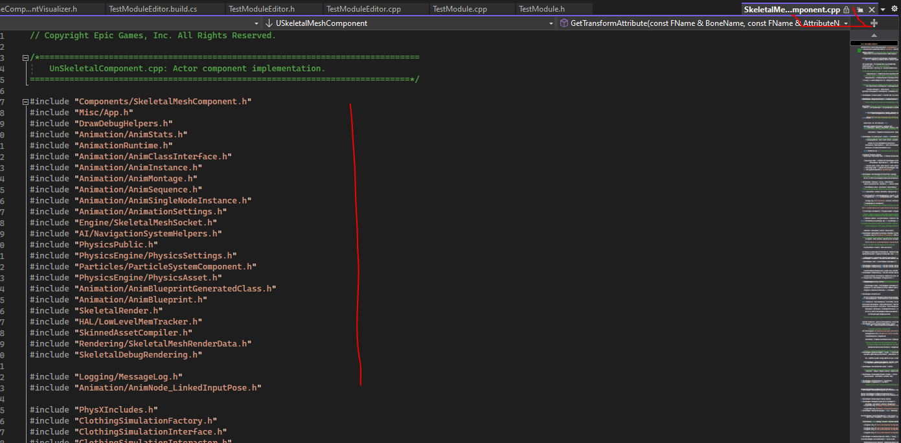
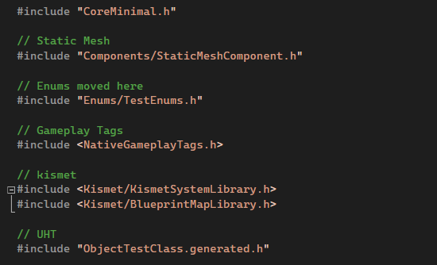

# Рекомендации по написанию кода
Прежде чем серьезно писать код под `Unreal`, не плохо бы разобраться в том, как именно он должен выглядеть.
В этом нам поможет документация самого движка, которую можно прочитать [тут](https://docs.unrealengine.com/5.1/en-US/epic-cplusplus-coding-standard-for-unreal-engine/#namingconventions).
Статья там достаточно объемная и на английском. Я приведу ниже часть выжимки оттуда, плюс собственные дополнения.
## Стандарт наименований
`UnrealEngine` использует стандарт под названием `PascalCase`. (есть еще `camelCase` и `snake_case`), сам вид их написания говорит за их … суть.
`PascalCase` - в этом стандарте слова в названиях классов и переменных всегда начинаются с заглавной буквы. Название стандарта связано с языком `Pascal`.
Имена переменных и  функций должны иметь смысл.
```cpp
int c = a + b; // не корректно
int Summ = ParameterA + RowsCountB; // корректно
// для функций и методов
int a(){} // не корректно
int ST_CalculateA(){} // корректно
```
## Префиксы
В `Unreal Engine`  используются префиксы типов. Рассмотрим их.
`A` - префикс для классов, унаследованных от `Actor`, к примеру - `AItem`. При этом классы унаследованные от `Pawn` и `Character`, по скольку в их корне все равно находится `Actor`, тоже будут иметь эту букву в префиксе - `ATestCharacter`
`U` - префикс для классов, унаследованных от `UObject`. Работает по тому-же принципу, что и с `Actor`, то есть `UMyItemAction`.
`E` - префикс для перечислений (`enum`) `EItemType`
`F` - префикс для структур (`struct`) и для псевдонимов, задаваемых командой `typedef`.
`T` - префикс для `с++` шаблонов и контейнеров, например `TMap`.
`I` - префикс для Интерфейсов.
`S` - префикс для виджетов (от `gui` фреймворка, встроенного в `Unreal`, называется он - `Slate`, мы коснемся его в будущем)
## Комментарии в коде
Комментарии в коде должны быть точными, четкими и по делу. Никаких матов, никаких понтов, пожалейте самих себя (если вдруг придется перечитывать в будущем собственный код), а так-же других программистов (которым случайно ваш код может попасть в руки, что они о вас подумают?).
Старайтесь разъяснять с помощью комментариев неочевидные моменты происходящих вычислений.
```cpp
// correcting value from InputA because it's to small for further calculations
if(InputA < Treshold){
InputA += Correction;
}
```
Комментарии могут быть на русском языке, если вы пишете их для себя или не планируете продавать код проекта. Я пишу комментарии на английском, потому что знаю его (а так-же продаю код).
Условному индусу или итальянцу будет очень сложно разобраться с кириллицей. Лучше всего писать комментарии к коду на английском, который может быть легко переведен любым разработчиком на родной язык благодаря автоматическим сервисам перевода.
Если разъяснить тот или иной вопрос в коротком комментарии к коду не получается - есть смысл разместить в коде ссылку на статью, в которой освещается затронутая вами тема. Если вы используете сложный код со `Stackoverflow`  - в комментариях можете оставить ссылку на пост с этим самым кодом. Это поможет и вам, если вдруг забудете откуда вы это взяли, и потенциальному читателю кода, если он вдруг надумает что-либо изменить.
## Вычисления в блоках `if`
Никогда не создавайте длинные вычисления внутри блоков if.
```cpp
if(SomeVar - VarSome > 5 && TestVar + VarTest < 15){} // так делать НЕ надо
// вместо этого надо делать так:
int SomeSub = SomeVar - VarSome;
int TestSumm = TestVar + VarTest;
if(SomeSub > 5 && TestSumm < 15){}
```
Как вы видите - все вычисления вынесены из блока `if`.
## Размещение кавычек
В `Unreal Engine` желательно ставить кавычки после одиночных условий и циклов, даже если они не обязательны.
```cpp
// так делать не надо
if(bTest == 5)
    cout << "XXX"
for(int i; i<5; i++)
    cout << i;
// надо делать так
if(bTest == 5){
    cout << "XXX"
}
for(int i; i<5; i++){
    cout << i;
}
```
В случае применения операторов `break` или `continue` кавычки не обязательны:

```cpp
for(int i; i<7; i++)
    // так делать можно
    if( i <= 2 ) continue;
    if( i>4 ) break;
    cout << i;
```

## Упорядочивание файлов `#include` по категориям
В некоторых исходниках `Unreal Engine` творится настоящая каша из файлов `#include`. Эта каша появилась там, из-за использования автоматических средств `IDE`, например `Intellisense` в `VS` и … что-то там, в `Rider`.

Пожалуйста, не допускайте такого бардака в своем коде. Старайтесь распределять файлы `#include` по осознанным категориям и добавлять их лишь при необходимости. Не полагайтесь на автоматические инструменты, вроде `Intellisense`.
