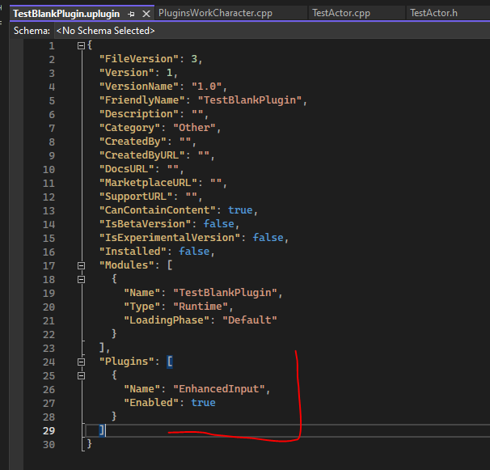
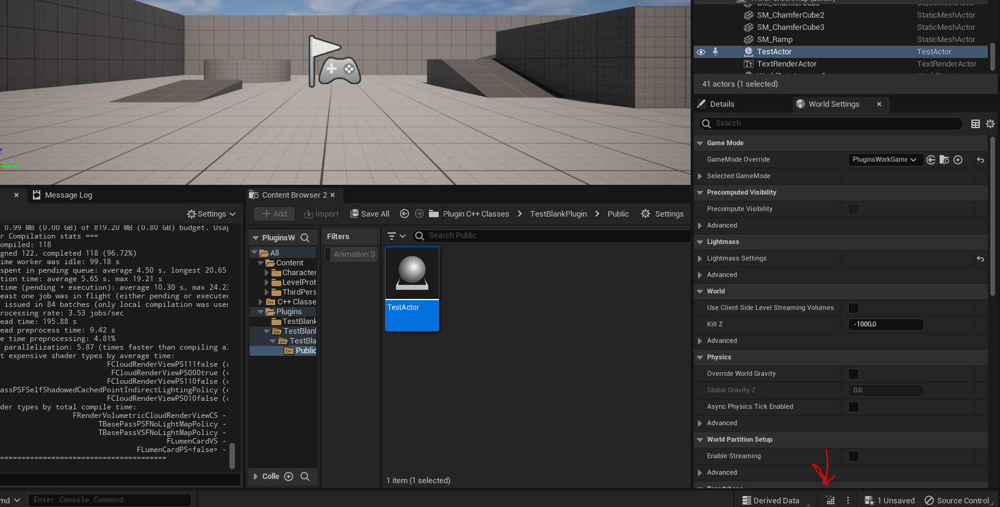
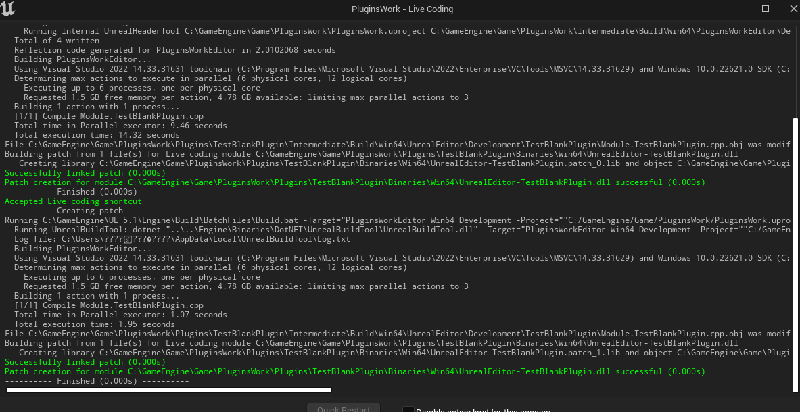
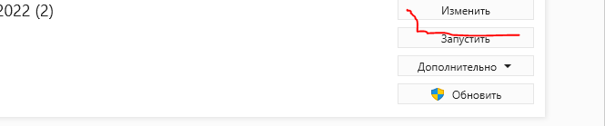

# Создание простейшего плагина для `Unreal Engine`
Плагины - это переносные скомпилированные модули. Именно поэтому, если вы хотите выставить свой код на `Unreal Marketplace`, вам придется упаковать его в плагин.
Давайте рассмотрим процесс создания плагинов, потому что в нем все не так однозначно.
## Наивная попытка добавления плагина в  проект
Для начинающего разработчика все кажется очень очень просто. Открываем `blueprint` проект, идем в `Edit -> Plugins`, видим сверху кнопку `Add`, нажимаем на нее.

> Тут я демонстрирую метод, который не работает! Не надо повторять мои шаги в этой главе!


Перед нами появится диалог, позволяющий выбрать базовый шаблон нашего будущего плагина.
Можно выбрать `Blank`, вбить название - `TestPlugin`  и нажать - `Create Plugin`


А  потом увидеть вот такое: `Failed to compile plugin source code. See output log for more information`.


Ну и давайте посмотрим в этот самый лог.


Лог нам ни о чем не говорит.
При этом, любые попытки создать плагин натыкаются на крах, даже если отключить `LiveCoding` и перезапустить движок.
Так в чем-же дело?
А дело в том, что капризный `Unreal Engine` не позволяет вам создавать плагины в проектах, которые основаны на `blueprint`. Вероятно это баг, в будущем его, возможно, исправят.
Плагины можно создавать только в `с++ based` проектах.
Так что идем создавать новый `c++` проект. Тут БЕЗ вариантов на данный момент, `Unreal Engine 5.1`.
## Создание проекта для плагина
Запустите движок, далее `Games -> Third Person`, выбираем `С++`, убираем галочку с пункта `StarterContent`.

Жмем `Create`, ждем пока все компилируется, открываем.
И вот теперь идем в Edit -> Plugins -> Add.

Тут мы видим ряд готовых шаблонов для плагинов. Например Editor Standalone Window позволяет создать плагин, демонстрирующий  способ создания собственных окон в редакторе Unreal.
Но мы, для теста, выбираем Blank, то есть пустой шаблон, жмем Create Plugin и ждем компиляции.

Поздравляю, плагин успешно добавлен.
Однако созданного плагина нет в проекте `Visual Studio`.

Поэтому закрываем `Visual Studio`.
В `Unreal Engine` идем `Tools -> Refresh Visual Studio 2022 Project`.

Ждем.

После чего открываем студию снова кнопкой "Open Visual Studio 2022" в том - же самом меню Tools.

Поздравляю, плагин на месте.
## Структура плагина и его зависимости
Каждый плагин содержит текстовое описание, в котором вы можете указывать те или иные параметры для плагина.
Это описание генерируется автоматически, при создании плагина указанным выше способом.
Описание плагина имеет расширение `.uplugin`, вы можете найти этот файл в `Visual Studio`.

Откройте его и обратите внмиание на секцию Modules.
В плагине может быть несколько модулей, которые можно перенести туда прямо из корня проекта.
При этом каждый модуль может иметь собственную фазу загрузки и тип.
Помимо модулей в зависимости можно записать и другие плагины. Тогда они будут включаться автоматически, при включении основного плагина в редакторе `Unreal`.
По скольку этой  строки у нас нет, давайте ее добавим.
Добавьте такую конструкцию после секции "Modules":
```json
"Plugins": [
		{}
	]
```
Теперь в ней можно указывать зависимые плагины. Пусть это будет… не знаю, плагин EnchansedInput.

Нам надо указать его настоящее имя и включен он или выключен. Чтобы узнать настоящее имя плагина - его надо найти  в самом движке.
В Visual Studio Solution Explorer обратите внимание на секцию Engine.

Раскройте ее до секции Plugins. Там вы сразу-же увидите EnchansedInput.

Раскройте его и найдите файл `.uplugin`.
Нам нужен первый модуль отсюда. Так-же вы можете покопаться в исходниках дальше, если вам интересно узнать, как этот плагин был сделан.

Таким образом в секцию "Plugins" нам надо записать следующее:

```json
"Plugins": [
		{
			"Name": "EnhancedInput",
			"Enabled": true
		}
	]
```

Выглядеть это будет так:



Теперь, при включении нашего плагина, так-же будет включаться и плагин `Enchansed Input`.
### Встроенный редактор описания для плагина
Если вышеуказанный путь редактирования плагина вас не устраивает, то вы можете использовать встроенный редактор. Для этого перейдите `Edit -> Plugins`, после чего найдите в списке свой плагин.


Видите кнопку `Edit`? Нажмите ее.
Перед вами появится диалог, со всеми параметрами файла `.uplugin`


Тут можно задать ему иконку (желательно для начала импортировать ее в сам плагин), категорию плагина, его описание и так далее.
Единственное, чего тут не будет - секции Modules, которая крайне важна, если вы собираетесь объединять несколько модулей в единый плагин вручную. Для заполнения этой секции придется править файл `.uplugin` в текстовом редакторе.


## Как добавлять классы в новый плагин
Теперь разберем вопрос добавления собственных классов на примере класса Actor'а.
В Unreal Engine идите в `Tools -> New C++ Class`.
Перед вами появится диалог выбора родительского класса:


Выберите `Actor`, нажмите `Next`. В следующем окне дайте имя новому классу (`TestActor`), а так-же выберите его тип - `Public`, это позволит нам организовать `с++` файлы заголовков в папке `/Public`, а файлы реализации в папке `/Private`.

Теперь самое важное. Выбираем модуль, в котором будет генерироваться этот класс. Для этого в правой части, после имени, есть выпадающее меню. Нажмите туда.

Тут мы можем решать, в каком модуле появится новый класс. А по скольку плагин - это переносимый модуль, то его имя мы тоже увидим в списке.
Наш плагин имеет имя `TestBlankPlugin`, выбираем этот пункт и нажимаем `Create Class`.

Ждем пока файл добавится в проект.
Visual Studio заметит изменение структуры проекта и спросит - надо ли его перезагрузить. Жмем `Reload All`.

Теперь мы можем видеть, что файлы, относящиеся к классу `TestActor` появились в соответствующих директориях.

В заголовочном файле TestActor.h вы можете видеть заготовку для будущего класса, эта заготовка генерируется самим движком и уже содержит перегрузки для методов `BeginPlay` и `Tick`, а так-же конструктор.

В файле TestActor.cpp вы можете видеть реализацию методов класса.

Давайте протестируем класс на работоспособность. Для этого добавьте указанную ниже строчку в метод `Tick`.
```cpp
GEngine->AddOnScreenDebugMessage(-1, 0.2f, FColor::Cyan, TEXT("TEST"));
```

Чтобы было так:


Эта строчка будет выводить сообщение TEST на экран.
Теперь надо все это дело скомпилировать. Мы не будем компилировать плагин из Visual Studio, вместо этого воспользуемся встроенным в Unreal Engine инструментом - `Live Coding`.
Чтобы его запустить откройте движок и посмотрите в правый нижний угол экрана. Там вы увидите иконку компиляции.

Нажмите на нее и появится консоль LiveCoding, в которой будет произведена компиляция.

Вам не обязательно всякий раз разворачивать движок и нажимать на эту кнопку. Вы можете вызывать `LiveCoding` через сочетание клавиш: `Ctrl + Alt + F11`, пока запущен движок.
После завершения компиляции просто перекиньте созданный класс `TestActor` на открытую тестовую сцену. (файл находится в папке `Plugins -> Имя плагина`)

Теперь, можете запустить проект в движке и увидеть надписи TEST, которые генерирует наш код.

## Пару слов об выводе ошибок
Давайте НАМЕРЕННО сделаем какую-нибудь ошибку, например удалим ";" из нашего кода и нажмем на сборку. Поскольку мы не собираем код из самого VisualStudio, а используем `LiveCoding`, то ошибка будет выведена именно в его консоли.

Обратите внимание на текст ошибки.
`error C2143: syntax error: missing ';' before 'AActor::Tick'`
Она у меня отображается на  английском языке, хотя изначально была совершенно не читаема из-за поломанной кодировки.
Кириллица не работает и не отображается в окне `LiveCoding`, поэтому если на этом этапе перед вами вышел текст с поломанной кодировкой, то я знаю что вам надо сделать.
Откройте `VisualStudioInstaller` и нажмите кнопку "Изменить" над студией.

Перейдите в подпункт Языковые Пакеты. Удалите Русский, добавьте Английский пакет.

Закройте студию и `Unreal Engine`, после чего дайте системе скачать языковые файлы.
После этого текст ошибки будет выводиться на вашей системе на английском языке без проблем с кодировкой.