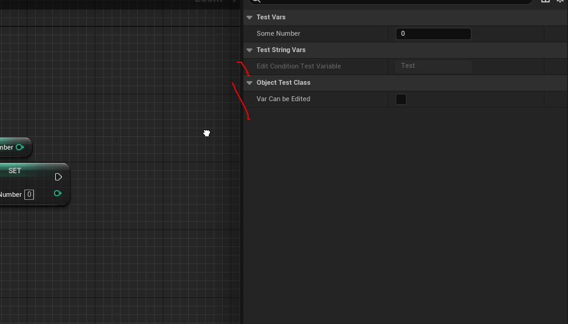

# Макросы `Reflection System`
`Reflection System`, она-же система отражений, представляет собой набор макросов, позволяющих связывать с++ и `blueprint` код.
Макросы `reflection system` разворачиваются в необходимый с++ код на этапе компиляции, благодаря встроенному в движок препроцессору - `Unreal Header Tool`.
Весь `blueprint` интерфейс движка основан на `reflection system`.
К примеру, все параметры, выведенные в панели `Details` для кубика со стартовой сцены - обернуты в макросы `UPROPERTY`.


Все компоненты, доступные в `blueprint` редакторе - представляют из себя `blueprintable` классы, то есть классы, обернутые в макросы по определенному паттерну.


Знание `reflection` макросов и их паттерна - основной ключ к успеху в работе с движком.
## Макрос `UCLASS / USTRUCT / UENUM`
Макрос `UCLASS()` позволяет использовать внутри класса другие `reflection` макросы, к примеру `UPROPERTY` и `UFUNCTION`.
Полный список модификатров макроса `UCLASS` можно найти в официальной [документации](https://docs.unrealengine.com/5.0/en-US/class-specifiers/).
### Реализация паттерна `UCLASS`
Давайте рассмотрим макрос `UCLASS` и его модификаторы на примере собственного класса.
Идем `Tool -> Add C++ Class`.

Выбираем пункт `Common Classes -> None`. Называем будущий класс `ObjectTestClass`.

После этих шагов движок сгенерирует для нас пустую заготовку класса, состояющую из конструктора и деструктора.

Этот класс вполне можно использовать из с++ кода, но переопределить его через `blueprint` не  получится. Если скомпилировать проект сейчас, а потом поискать `ObjectTestClass` в движке, мы ничего не найдем.

Чтобы это исправить, добавим в класс три строчки:
```cpp
#include "ObjectTestClass.generated.h"
// inherit from
: public UObject
UCLASS() // all classes, inherited from UObject should have this macro at top
GENERATED_BODY() // all classes, inherited from UObject should have this macro in beginning
```
Чтобы было так:
```cpp
#pragma once
#include "CoreMinimal.h"
#include "UObject/NoExportTypes.h"
#include "ObjectTestClass.generated.h"
UCLASS()
class TESTMODULE_API UObjectTestClass : public UObject
{
	GENERATED_BODY()
public:
    UObjectTestClass();
    ~UObjectTestClass();
}
```

#### Файл `.generated.h`
Строчка кода `#include "ObjectTestClass.generated.h"` - отвечает за подключение автоматически создаваемого  системой `Unreal Header Tool` заголовочного файла.
Этот файл содержит в себе реализацию всех макросов, использованных в коде, в том числе`GENERATED_BODY` и `UCLASS`.
Файлы `.generated.h` создаются в папке проекта по пути - `/Intermediate/Build/Win64/UnrealEditor/Inc/TestModule/UHT`. Можете на них посмотреть.

_(это достаточно поздний скриншет, сделанный на этапе редактуры)_
#### `UObject Base`
Продолжаем развивать созданный нами класс.
Поскольку классы, унаследованные от `UObject` управляются системой сборки мусора, деструктр им не нужен. Удаляем.
Что касается конструктора, то лучше прописать в нем `ObjectInitializer`. Это один из вариантов конструктора, присутствующего в `UObject`.

В итоге класс будет выглядеть так:
```cpp
#pragma once
#include "CoreMinimal.h"
// UHT
#include "ObjectTestClass.generated.h"
UCLASS()
class TESTMODULE_API UObjectTestClass : public UObject
{
	GENERATED_BODY()
public:
	UObjectTestClass(const FObjectInitializer& ObjectInitializer);
}
```

Не забываем отразить изменения в файле `.cpp`.
```cpp
UObjectTestClass::UObjectTestClass(const FObjectInitializer& ObjectInitializer)
{}
```

Теперь можно приступать к рассмотру модификаторов класса.
### Модификатор `Blueprintable`
Данный модификатор позволяет создавать в игровом проекте собственные `blueprint` файлы, унаследованные от нашего класса `ObjectTestClass`.
Рассмотрим подробнее.
В `ContentBrowser'е` щелкните правой кнопкой мыши и выберите `BlueprintClass`.

Далее в поиске пропишите имя нашего класса `ObjectTestClass`.

Как вы видите - ничего нет. Это значит, что в данный момент вы не можете создать `blueprint` класс, унаследованный от типа `ObjectTestClass`.
Теперь давайте пропишем модификатор `Blueprintable` в макрос `UCLASS`.
#### `Blueprintable UClass`
```cpp
#pragma once
#include "CoreMinimal.h"
// UHT
#include "ObjectTestClass.generated.h"
UCLASS(Blueprintable) // here
class TESTMODULE_API UObjectTestClass : public UObject
{
	GENERATED_BODY()
public:
	UObjectTestClass(const FObjectInitializer& ObjectInitializer);
}
```

Если сейчас скомпилировать код, то наш класс появится в списке доступных для создания `blueprint` объектов.

Если создать таким образом класс, то можно управлять его внутренними методами и переменными. _Правда мы их еще пока не добавили._


### Модификатор `BlueprintType`
У каждой `blueprint` переменной есть свой тип.

Давайте сделаем новую переменную. Нажмите на иконку плюсика.
Для переменных разработчику доступны стандартные типы, но меня интересует секция `ObjectTypes`.

Что если бы мы хотели задать свой собственный объект как тип для переменной?
Давайте сейчас поищем наш объект в этом списке.

Ничего нет.
Теперь пропишем в наш макрос модификатор `BlueprintType` и скомпилируем.
#### `BlueprintType UClass`
```cpp
#pragma once
#include "CoreMinimal.h"
// UHT
#include "ObjectTestClass.generated.h"
UCLASS(BlueprintType) // here
class TESTMODULE_API UObjectTestClass : public UObject
{
	GENERATED_BODY()
public:
	UObjectTestClass(const FObjectInitializer& ObjectInitializer);
}
```

В результате мы сможем задать нашей переменной тип `ObjectTestClass`.

### Структура `USTRUCT`
Обычно с модификатором `BlueprintType` в систему скармливаются не классы, а структуры. В отличие от классов, структуры инициализируются макросом `USTRUCT`.
В том-же самом заголовочном файле объекта `ObjectTestClass.h` пишем такой код:
```cpp
USTRUCT(BlueprintType)
struct FObjectTestStruct
{
	GENERATED_USTRUCT_BODY()
	// constructor
	FObjectTestStruct(int Value = 0, FString Text = "Text")
	{
		SomeVal = Value;
		SomeTest = Text;
	}
	UPROPERTY(BlueprintReadWrite, EditAnywhere)
	int SomeVal;
	UPROPERTY(BlueprintReadWrite, EditAnywhere)
	FString SomeTest;
    // this is important to allow structs work with TMap and TArray Find
    bool operator==(const FObjectTestStruct& Other) const {
		bool result = true;
		// use simple AND
		result &= SomeVal == Other.SomeVal;
		result &= SomeTest == Other.SomeTest;
		return result;
	}
};
```

Несмотря на то, что структуры тоже могут иметь методы, реализацию этих методов редко выносят в отдельный `.cpp` файл.
Обычно структуры используются в качестве контейнеров данных, когда внутри одной переменной надо передать несколько значений.
В отличие от классов, в структурах все поля по умолчанию имеют модификатор `public`.
Добавленную структуру можно использовать внутри движка.

И более того, с ней теперь работают классические вспомогательные функции Unreal, такие как `Break` и `SetByRef-Var`.

### `Meta` поля
К макросам типа `UCLASS`, `UPROPERTY` и `UFUNCTION` можно добавлять секцию `meta=()`. Мета полями можно корректировать оформление объектов, переменных и функций в движке.
В данной главе я рассмотрю некоторые `Meta` поля, доступные для макросов `UCLASS / USTRUCT`. Список доступных полей можно найти в [документации](https://docs.unrealengine.com/5.0/en-US/class-specifiers/). Большая их часть - очень ситуативная.
#### Meta `DisplayName`
Позволяет изменить название родительского класса `blueprint` в редакторе.
Формат записи - `DisplayName="Blueprint Node Name"`. Поддерживаются пробелы и символы типа `, !` и т.д., обычно не допустимые в именах классов и переменных.

В коде это выглядит так:
```cpp
meta=(DisplayName = "This is custom name!")
```

####  Meta `BlueprintSpawnableComponent`
Формат записи:
```cpp
UCLASS(Blueprintable, meta=(BlueprintSpawnableComponent, ToolTip="Hand-written tooltip", DisplayName="Blueprint Node Name") )
```

> Мета поле `BlueprintSpawnableComponent` - относится к классам компонентов, поэтому нет смысла его размещать в нашем `UObject`.

Компоненты с этим модификатором могут быть созданы в движке через вызов ноды `Add*Component`.
Давайте рассмотрим как это работает в файле `BP_ThirdPersonCharacter`. Щелкаете там правой кнопкой мыши в области `Event Graph` и в поиске вбиваете `AddSkeletalMeshComponent`.


Точно такая-же нода генерируется для каждого компонента с `meta=(BlueprintSpawnableComponent)`.
В одной из последующих статей я подробно разобрал процесс создания собственного компонента. Вот как вел себя компонент с `meta` полем `BlueprintSpawnableComponent`.
Класс компонента у меня называется `TestSceneComponent`.

Без пометки `BlueprintSpawnableComponent` его невозможно вызвать через ноду `Add`, смотрите:

Но если добавить эту метку, а потом скомпилировать.

То компонент появится в списке.

Вот как это выглядит:

### Создаем `Tickable UObject`
Мы можем связать желаемый метод `UObject` класса с `tick` циклом движка. Для этого есть два способа.
Но для начала давайте сделаем, прямо в том-же самом файле, копию нашего класса. Или даже две копии под обе реализации.
```cpp
#include "CoreMinimal.h"
#include "UObject/NoExportTypes.h"
// kismet
#include "Kismet/KismetSystemLibrary.h"
#include "Kismet/GameplayStatics.h"
// actor class include
#include "GameFramework/Actor.h"
// UHT
#include "ObjectTestClass.generated.h"
//...
// Tickable using FTIckableGameObject interface
UCLASS(Blueprintable, BlueprintType)
class TESTMODULE_API UObjectTestTickableClass : public UObject
{
	GENERATED_BODY()
public:
	UObjectTestTickableClass(const FObjectInitializer& ObjectInitializer) {};
};
/**/
// Tickable using FTickerDelegate
UCLASS(Blueprintable, BlueprintType)
class TESTMODULE_API UObjectTestTickableDelegateClass : public UObject
{
	GENERATED_BODY()
public:
	UObjectTestTickableDelegateClass(const FObjectInitializer& ObjectInitializer) {};
};
```
Реализацию логики будем писать прямо внутри классов.

#### Реализация `tick` через `FTickableGameObject`
Заставить `UObject` вызывать `tick` можно, добавив к нему интерфейс - `FTickableGameObject`.
Делается это за счет множественного наследования. Добавляем `public FTickableGameObject` сразу после `public UObject`.

У этого интерфейса есть несколько методов.
Полный их список можно увидеть в самом файле интерфейса, нажав на его название с зажатой клавишей `Ctrl`. Всегда читайте код тех классов, которые используете.
(Если Intellisense у вас поломан или вы не работаете в Visual Studio, то путь до этого файла таков - `Engine/Source/Runtime/Engine/Public/Tickable.h`.)

Берем отсюда метод `Tick, isTickable и GetStatId`.
Метод `Tick` вызывается движком каждое обновление экрана. Это один из ключевых методов программирования игровой логики.
Метод  `isTickable` позволяет указать, может ли класс, в котором используется `FTickableGameObject`, использовать метод `Tick`.
Метод `GetStatId` возвращает идентификатор объекта, который будет использован в дебаггере, при замерах, например,  производительности игрового потока. Его реализация примитивна, для каждого `UObject` это просто:
```cpp
TStatId GetStatId() const override { return UObject::GetStatID(); };
```
В итоге получится такой код.
```cpp
// Tickable using FTIckableGameObject interface
UCLASS(Blueprintable, BlueprintType)
class TESTMODULE_API UObjectTestTickableClass : public UObject, public FTickableGameObject
{
	GENERATED_BODY()
public:
	UObjectTestTickableClass(const FObjectInitializer& ObjectInitializer) {};
	void PostInitProperties() override {
		Super::PostInitProperties();
        // don't tick if World is not set and we are not in the "runtime"
		// only after this we can tick. it's "BeginPlay".
		if (GetOuter() && GetOuter()->GetWorld()) {
			bIsInit = true;
		}
	}
	// Begin FTickableGameObject Interface.
	void Tick(float DeltaTime) override {
		GEngine->AddOnScreenDebugMessage(-1, 0.2f, FColor::Blue, TEXT("TICK!!!"));
	};
	bool IsTickable() const override {
		return this->bIsInit; // tick only after "BeginPlay"
	};
	TStatId GetStatId() const override { return UObject::GetStatID(); };
	// End FTickableGameObject Interface.
private:
	bool bIsInit = false;
};
```
В этом коде, при каждом тике, я вывожу сообщение на экран.
Чтобы проверить работает код или нет - создадим `blueprint` на основе нашего `UObjectTestTickableClass`.

После чего, в `BeginPlay` персонажа, создадим объект от этого класса.
Для создания инстанцев от `UObject` есть `blueprint` нода `Construct Object`.
Выглядит это так.

Если теперь запустить проект, то мы увидим следующее:

Сообщение `TICK!!!` печатается на экран, следовательно - код работает.
#### Реализация `tick` через `FTickerDelegate`
Через делегаты можно заставить любой `UObject` делать `tick()` и использовать метод с любым названием в качестве `tick`.
Делегаты это система событий, встроенная в Unreal Engine. Я разберу ее чуть пожже, в этом коде мы будем использовать уже готовый делегат, который не надо отдельно создавать. Это - `FTickerDelegate`.
`FTickerDelegate` позволяет создать копию объекта в памяти, а так-же привязать один из его внутренних методов как `Tickable`. Без копирования объекта, к сожалению, не обойтись, по простой  причине - к не `static` полям классов доступ из вне невозможен.
Делается это так:
```cpp
TickDelegate = FTickerDelegate::CreateUObject(this, &UObjectTestTickableDelegateClass::CustomTTest); // create instance of this object as Tickter
```
Далее мы можем привязать наш делегат, с загруженным в него объектом, к глобальному интерфейсу `FTSTicker`.

```cpp
TickDelegateHandle = FTSTicker::GetCoreTicker().AddTicker(TickDelegate); // Feed TickDelegate to the FTicker
```
Данный интерфейс привязывает отправленные в него делегаты к основному циклу `tick` движка.
Код класса выглядит так:
```cpp
// Tickable using FTickerDelegate
UCLASS(Blueprintable, BlueprintType)
class TESTMODULE_API UObjectTestTickableDelegateClass : public UObject
{
	GENERATED_BODY()
public:
	UObjectTestTickableDelegateClass(const FObjectInitializer& ObjectInitializer) {};
	// this is BeginPlay alternative for UObject
	virtual void PostInitProperties() override {
		Super::PostInitProperties();
		if (GetOuter() && GetOuter()->GetWorld()) {
			// BeginPlay Alternative
			// make this UObject tickable once it's constructed
			// (ticker construction can be made from anywhere, but i do it in class Constructor)
			TickDelegate = FTickerDelegate::CreateUObject(this, &UObjectTestTickableDelegateClass::CustomTTest); // create instance of this object as Tickter
			TickDelegateHandle = FTSTicker::GetCoreTicker().AddTicker(TickDelegate); // Feed TickDelegate to the FTicker
		}
	};
	// here will be our tick
	bool CustomTTest(float DeltaSeconds)
	{
		GEngine->AddOnScreenDebugMessage(-1, 0.2f, FColor::Emerald, TEXT("TICK DELEGATE!"));
		return true;
	};
private:
	// Used to call tick function in class
	FTickerDelegate TickDelegate;
	// Ticker Handle
	FTSTicker::FDelegateHandle TickDelegateHandle;
};
```
Тут в качестве тика вызывается функция `CustomTTest`. Она возвращает `bool`, потому что `FTickerDelegate` требует такого формата функции.
Так-же тут вы видите реализацию `BeginPlay` через метод `PostInitProperties`. Обратите внимание, что этот метод вызывается не только в игровом мире, но и в мире движка. Из-за чего движок может просто крашнуться. Я долго ломал голову над причиной такого поведения и спасла меня вот эта строчка `if (GetOuter() && GetOuter()->GetWorld()) {`, она  проверяет, есть ли в данный момент "мир" или нет.
Чтобы этот метод протестировать, вам надо, как и в предыдущем случае, создать blueprint на основе класса `UObjectTestTickableDelegateClass`.


После чего вызвать этот класс внутри персонажа в событии `BeginPlay`.

Обратите внимание, что тут я сохраняю ссылку на созданный объект в переменную `ObjD`. Это делается для того, чтобы защитить сконструированный класс от сборщика мусора. А иначе объект создастся и сразу удалится, напечатав тестовое сообщение всего пару раз.

## Макрос `UENUM`
Макрос UENUM позволяет задавать перечисления. На официальном сайте к нему тоже есть [документация](https://docs.unrealengine.com/5.1/en-US/API/Runtime/CoreUObject/UObject/UEnum/).
Чаще всего `UENUM` используют с модификатором `BlueprintType`.
Пример:
```cpp
UENUM(BlueprintType)
enum class EFruitsList : uint8
{
  Apple UMETA(DisplayName="Green Apple"),
  Orange,
  Cherry UMETA(ToolTip="Some Test Tooltip."),
};
```
Добавим этот код прямо в наш `ObjectTestClass.h`, в начало файла, после секции `#include`.

Если мы выставили `BlueprintType` то наше перечисление будет доступно как тип для  переменных в `blueprint`.

При этом, если такую переменную создать, то она будет принимать значения, заданные нами в коде.

### `BitFlags / BitMask`
`BitMask` — это способ упаковать кучу логических значений (да/нет) вместе и работать с ними как с одним числом. Предлагаю углубиться в теорию, потому что без нее понять суть такого типа полей - не получится.
Вы знаете, что вся информация в компьютере представлена в двоичном формате. Аналогично и с числами типа `int`.
Если взять тип `uint8` (от которого наследуются `enum'ы` поддерживаемые `reflection system`), то его размерность составляет всего `1 байт`, то есть `8 бит`, которые могут быть представлены строкой с 8 нулями.
`00000001`
 (`uint8` расшифровывается как `unsigned int 8bit`, общая вместимость - 256 сочетаний)
8 нулей позволяют нам сохранить 8 разных значений типа `bool` внутри 1 числа, если предоставить по одному значению на каждый ноль (если берем `true` - 1,  а `false` - 0). При этом сочетания битов интерпретируются как комбинации значений.
Первый бит (первый ноль) - это первое значение, второй бит - это второе значение и так далее.
Можно расписать данную логику следующим образом:
```
// фрукты в корзине
1 - apple
0 - orange
0 - banana
0 - lime
1 - kiwi
0 - avocado
1 - nectarine
0 - papaya
```
Таким образом маска `10001010` соответствует корзине с яблоками, киви и нектаринами. При этом нам не пришлось создавать массив из `Enum'ов`, мы смогли разместить все значения в виде битов целого числа. Причем - Одного числа.
Именно так и работают эти `BitFlags`.
Для чего эта техника используется в Unreal? Для того, чтобы выбрать из нескольких значений.

> _(На самом деле я не видел разработчиков, которые бы использовали `BitFlags`, поэтому решил разобрать эту тему более подробно, дабы ее популяризовать. Может зря?...)_

Обычные переменные типа `Enum` могут иметь лишь одно фиксированное значение. К примеру переменная `EItemType` может иметь значение `Helmet` или `Gloves`, но не может иметь их оба сразу.

Для комбинации параметров используется модификатор `BitFlags`.
Добавление `BitFlags` для `Enum` выполняется через поле `meta`.
```cpp
// Item Types Enum
UENUM(BlueprintType, meta = (Bitflags, UseEnumValuesAsMaskValuesInEditor = "true"))
enum class EItemTypes : uint8
{
	NONE = 0 UMETA(Hidden),
	Default = 1 << 0,
	Helmet = 1 << 1,
	Gloves = 1 << 2,
	Sword = 1 << 3,
	Boots = 1 << 4,
};
ENUM_CLASS_FLAGS(EItemTypes);
```
Параметр `NONE = 0 UMETA(Hidden)` обязателен. Для BitFlags всегда должен быть 0 параметр.
Что это за цифры такие после `<<`? Это побитовый сдвиг.
Объяснить лучше на примере.
1 - это двоичная цифра, которая соответствует 1, в случае `uint8` это - `00 00 00 01`
Мы берем эту цифру и сдвигаем (`<<`) ее конец на `N` знаков.
Для `Default` мы просто берем двоичную единицу без сдвига (нулевой сдвиг) `00 00 00 01`
Для `Helmet` мы сдвигаем двоичную единицу на один знак влево, получая `00 00 00 10`
Для `Helmet` мы сдвигаем на двоичную единицу на два знака влево, получая `00 00 01 00`.
И так для каждого из значений.
При создании переменной типа `BitFlags - EItemTypes` пользователь сможет выбирать несколько значений перечисления, комбинируя таким образом выставленные флаги.
Добавление `BitFlags` в переменную.
Чаще всего для работы с `BitFlags` выбирают тип `int32`. Несмотря на явно большее количество нулей, это никак не мешает конверсии `uint8` в `int32`.
Возьмем параметр `int32 SelectedItems = 0;`
Как поместить в него флаги от нескольких типов предметов?
Для этого используется операция OR (`|`), а так-же приведение типа `enum` к `int32`, поскольку сами `enum'ы` с поддержкой `BitFlags` в Unreal всегда - `unit8`.
```cpp
int32 SelectedItems = 0;
// Добавляем предметы
SelectedItems |= StaticCast<int32>(EItemTypes::Helmet);
SelectedItems |= StaticCast<int32>(EItemTypes::Sword);
```
Я сильно подозреваю, что вместо `StaticCast` тут нужно использовать `reinterpret_cast`. Но работает и без этого, потому что неявная конверсия между двумя типами `int` просто переносит биты напрямую.
Как проверить, что, например ,`EItemTypes::Helmet` находится в `SelectedItems`?
Для этого используется операция бинарного и (`&`) между искомым значением и набором флагов. (нормальный и это `&&`)
```cpp
bool bHasHelmet = SelectedItems & StaticCast<int32>(EItemTypes::Helmet);
```
Как вывести переменную, хранящую в себе BitFlags, для работы в Blueprint?
Для этого есть макрос `UPROPERTY`, ниже мы его более подробно рассмотрим.
```cpp
UPROPERTY(BlueprintReadWrite, EditAnywhere, meta = (Bitmask, BitmaskEnum = EItemTypes))
int32 SelectedItems = 0;
```
Обратите внимание на параметр `BitmaskEnum = EItemTypes`, тут задается `Enum`, являющийся источником элементов.

Чтобы задать значение "по умолчанию" для такого типа переменной, можно сделать так:
```cpp
UPROPERTY(BlueprintReadWrite, EditAnywhere, Category = "VariableExperiments", meta = (Bitmask, BitmaskEnum = "/Script/TestModule.EItemTypes"))
int32 ItemTypeFlags = StaticCast<int32>(EItemTypes::Helmet | EItemTypes::Gloves);
```

### Неограниченные `Bitflgas ENUM`.
>*(я не знаю, работает этот метод или нет, но все равно напишу о нем в статье, на будущее)*
Стандартный `Enum` в Unreal Engine ограничен `256` элементами, потому что наследуется от `uint8`.Другие типы наследования для `enum`не поддерживаются `reflection system`. Обычно 256 значений достаточно.
Но что делать, если надо больше?
Использовать `enum` немного не стандартным образом - внутри `namespace`, в котором `enum` определен  ключем `Type`.
```cpp
// This is way of making unlimited enums thru namespaces
UENUM(BlueprintType, Meta = (Bitflags, UseEnumValuesAsMaskValuesInEditor = "true"))
namespace EUnlimitedEnum
{
	enum Type
	{
		NONE			= 0 UMETA(Hidden),
		UNL_First		= 1 << 0 UMETA(DisplayName = "First"),
		UNL_Second		= 1 << 1,
		UNL_Third		= 1 << 2,
		UNL_Quartis		= 1 << 3,
		UNL_Quintis		= 1 << 4,
		UNL_Sextus		= 1 << 5,
		UNL_Septemus	= 1 << 6,
		UNL_Octus		= 1 << 7, // i'm pretty bad at Roman number names...
		UNL_Novus		= 1 << 8,
		UNL_Decemus		= 1 << 9,
		UNL_Undecimus	= 1 << 10,
	};
}
ENUM_CLASS_FLAGS(EUnlimitedEnum::Type);
```
Вывод `UPROPERTY BitFlags` для такого Enum'а:
```cpp
// Unlimited BitFlags
UPROPERTY(BlueprintReadWrite, EditAnywhere, Category = "BitFlags", Meta = (Bitmask, BitmaskEnum = "/Script/TestModule.EUnlimitedEnum"))
int32 UnlimitedEnumFlags = StaticCast<int32>(EUnlimitedEnum::Type::UNL_First | EUnlimitedEnum::Type::UNL_Second);
```


Как вы видите, таким способом можно сделать `bitflags` больше чем для 8 элементов.
Повторюсь, что это экспериментально и я не уверен, что вам стоит использовать такой подход на практике.
### `Bitflags` в качестве аргумента для функций
```cpp
// Function with Bit Flags Pin
UFUNCTION(BlueprintCallable, Category = "Custom Functions|BitFlags")
void BitflagsInputDemo(UPARAM(meta = (Bitmask, BitmaskEnum = "/Script/TestModule.EItemTypes")) int32 Mask, float FloatNum = 4.0f) {}
// Function with Bit Flags Unlimited
UFUNCTION(BlueprintCallable, Category = "Custom Functions|BitFlags")
bool BitflagsInputDemoUnlimited(UPARAM(meta = (Bitmask, BitmaskEnum = "/Script/TestModule.EUnlimitedEnum")) int32 InFlags){ return true; };
```

### `Enum` в качестве аргумента для функций
```cpp
// Function with Enum input
UFUNCTION(BlueprintCallable, Category = "Custom Functions|Enums")
void EnumInputDemo(EItemTypes In, float FloatNum = 4.0f) {}
// Function with Unlimited Enum input
UFUNCTION(BlueprintCallable, Category = "Custom Functions|Enums")
bool EnumInputDemoUnlimited(EUnlimitedEnum::Type In = EUnlimitedEnum::UNL_Quartis) { return true; };
```

## Макрос `UMETA`
Данный макрос позволяет изменять `meta` параметры для элементов перечислений и  структур.
В макросе указываются `Meta` параметры, что очевидно.
Полезной особенностью этого макроса является то, что им можно изменять отображаемое название пунктов в `Enum`, а так-же скрывать их или показывать.
```cpp
// This is way of making unlimited enums thru namespaces
UENUM(BlueprintType, Meta = (Bitflags, UseEnumValuesAsMaskValuesInEditor = "true"))
namespace EUnlimitedEnum
{
	enum Type
	{
		NONE			= 0 UMETA(Hidden),
		UNL_First		= 1 << 0 UMETA(DisplayName = "First"),
		UNL_Second		= 1 << 1,
		UNL_Third		= 1 << 2,
		UNL_Quartis		= 1 << 3,
		UNL_Quintis		= 1 << 4,
		UNL_Sextus		= 1 << 5,
		UNL_Septemus	= 1 << 6,
		UNL_Octus		= 1 << 7,
		UNL_Novus		= 1 << 8, // i'm pretty bad at Roman number names...
		UNL_Decemus		= 1 << 9,
		UNL_Undecimus	= 1 << 10,
	};
}
ENUM_CLASS_FLAGS(EUnlimitedEnum::Type);
```
## Макрос `UPROPERTY`
Макрос `UPROPERTY` позволяет настроить отображение переменной на стороне редактора.
[Документация](https://docs.unrealengine.com/4.27/en-US/ProgrammingAndScripting/GameplayArchitecture/Properties/) содержит полный список доступных мета полей и спецификаторов.
### Спецификаторы
#### `BlueprintReadWrite`, `BlueprintReadOnly`
```cpp
UPROPERTY(BlueprintReadWrite)
int SomeNumber;
```
Этот код генерирует на стороне `blueprint` для переменной `SomeNumber` геттер и сеттер.
 `BlueprintReadOnly` - генерирует только геттер.

Однако, обратите внимание, что список `ClassDefaults` пуст. Хотя переменная, однозначно, находится в классе.
Как заставить ее появиться?
#### `EditAnywhere`, `EditDefaultsOnly`
Это спецификаторы доступности переменной в редакторе.
> Спецификатор `EditAnywhere` открывает возможность изменения переменной как внутри панели `Details` так и в игровом мире.
> Спецификатор `EditDefaultsOnly` позволяет изменять переменную только в панели `Details`. В "мире" игры доступ к этой переменной будет закрыт.
Зададим в теле класса следующую переменную:
```cpp
UPROPERTY(EditAnywhere, Category = Variables)
int SomeNumber = 5;
UPROPERTY(EditDefaultsOnly, Category = Variables)
float FloatNumber = 3.2f;
```
После компиляции обе переменные появятся в панели `Details`.

Но если разместить данный `AActor` на уровне, то в его параметрах будет доступна только переменная `SomeNumber`, с параметром `EditAnywhere`.

Важно помнить, что эти спецификаторы не создают геттер и сеттер для переменной.

Если вам надо иметь доступ не только к редакторованию переменной из редактора, но и к ее присвоению - чтению через `blueprint` делайте так:
```cpp
UPROPERTY(BlueprintReadWrite, EditAnywhere, Category = Variables)
int SomeNumber = 5;
```

#### `Getter` и `Setter`
Иногда, при установке значения переменной, необходимо выполнять ту или иную логику. Для этого используются спецификаторы `Getter` и `Setter`, которые перенаправляют все вызовы переменной - на вызовы соответствующих функций.
При указании параметров `Getter` и `Setter` необходимо так-же задать соответствующие функции `GetVarName` и `SetVarName`.
Имена функций должны соответствовать указанному шаблону, иначе код не скомпилируется.
```cpp
UPROPERTY(EditAnywhere, BlueprintReadWrite, Getter, Setter, Category = "Appearance")
int SomeIntNumber;
int GetSomeIntNumber() const {
    UE_LOG(LogTemp, Warning, TEXT("Getter Called!"))
    return SomeIntNumber;
}
void SetSomeIntNumber(const int& Number) {
    UE_LOG(LogTemp, Warning, TEXT("Setter Called!"))
    SomeIntNumber = Number;
}
```
Теперь, если из `blueprint` кода изменить значение `SomeIntNumber` или попытаться считать это значение - будут вызваны геттер и сеттер.


#### `BlueprintGetter` и `BlueprintSetter`
Данные спецификаторы позволяют использовать `BlueprintCallable` функции в качестве геттеров и сеттеров. Эти функции заменяют стандартные узлы `Get` и `Set`.

```cpp
UPROPERTY(EditAnywhere, BlueprintReadWrite, Getter, Setter, BlueprintSetter = "SetSomeIntNumber", BlueprintGetter = "GetSomeIntNumber", Category = "Appearance")
int32 SomeIntNumber;
UFUNCTION(BlueprintCallable, Category = "Appearance")
int32 GetSomeIntNumber() const {
    UE_LOG(LogTemp, Warning, TEXT("Getter Called!"))
    return SomeIntNumber;
}
UFUNCTION(BlueprintCallable, Category = "Appearance")
void SetSomeIntNumber(const int32 InArg) {
    UE_LOG(LogTemp, Warning, TEXT("Setter Called!"))
    SomeIntNumber = InArg;
}
```
Обратите внимание - и геттер и сеттер должны быть `UFUNCTION`, то есть доступны в `blueprint`.

#### `Category`
Переменной можно задать категорию, в которой она появится внутри редактора, используя модификатор `Category`.
```cpp
// properties
UPROPERTY(BlueprintReadWrite, EditAnywhere, Category = TestVars)
int SomeNumber;
```
Если теперь скомпилировать код, то у нашей переменной появится категория `TestVars`.

Что вообще такое "категория"? Это способ группировки переменных по некоему общему смыслу. Мы можем добавить в одну и ту-же категорию несколько разных переменных. Например так.

Или разместить переменные в подкатегории. Классический разделитель для подкатегорий в Unreal это символ `|`.
`Category="VariableExperiments | Float"`
```cpp
// properties
UPROPERTY(BlueprintReadWrite, EditAnywhere, Category="VariableExperiments", meta = (ExposeOnSpawn = "true"))
int SomeNumber;
UPROPERTY(BlueprintReadWrite, EditAnywhere, Category = "VariableExperiments", meta = (Bitmask, BitmaskEnum = EItemTypes))
uint8  ItemTypeFlags = 0;
UPROPERTY(BlueprintReadWrite, EditAnywhere, Category="VariableExperiments|Float", meta = (ClampMin = "0.5", ClampMax = "2.4"))
float someFloatTest = 0.7f;
UPROPERTY(BlueprintReadWrite, EditAnywhere, Category="VariableExperiments|DisplayName", meta = (DisplayName = "This Variable has Long name! Hey!"))
int SomeVarWithDisplayName = 0;
```
Такой код сгенерирует для нас глобальную категорию `VariableExperiments` с подкатегориями `Float` и `DisplayName`.

#### `AssetRegistrySearchable`
Спецификатор `AssetRegistrySearchable` позволяет фильтровать файлы по этому параметру из `AssetRegistry`.
```cpp
// Allow asset registry to filter assets with this field using
UPROPERTY(EditAnywhere, Category = "AssetRegistryMark", AssetRegistrySearchable)
int ParameterFilter = 0;
```
Фильтрование выполняется так:
```cpp
//module.build.cs
PrivateDependencyModuleNames.AddRange(new string[] { "AssetRegistry"});
//.h
#include "AssetRegistry/AssetRegistryModule.h" // Asset Registry
#include "AssetRegistry/ARFilter.h" // Asset Registry Filter
//.cpp
FAssetRegistryModule& Registry = FModuleManager::LoadModuleChecked<FAssetRegistryModule>("AssetRegistry");
TArray<FAssetData> AssetData; // This Array will contain our assets
FARFilter Filter; // Assets will be filtered by this
Filter.TagsAndValues.Add(FName("ParameterFilter"), FString("0"));
Registry.Get().GetAssets(Filter, AssetData); // apply filter and get results
for (FAssetData Asset : AssetData) { // loop thru found assets
    //Asset.PrintAssetData();
    UE_LOG(LogTemp, Warning, TEXT("AssetName: %s"), *Asset.AssetName.ToString());
}
```

#### Массивы `TArray`
Контейнер `TArray` используется для хранения однотипных данных.
Рассмотрим создание массива от уже созданной нами структуры `FObjectTestStruct`.
```cpp
UPROPERTY(BlueprintReadWrite, EditAnywhere, Category = "Arrays")
TArray< FObjectTestStruct > StructArray;
UPROPERTY(BlueprintReadWrite, EditAnywhere, Category = "Arrays")
TArray<int32> TestIntArray;
```
Вышеуказанный код создаст для нас два изменяемых массива.

Задать их значения "по умолчанию" можно в конструкторе, следующим образом:
```cpp
UObjectTestClass::UObjectTestClass(const FObjectInitializer& ObjectInitializer)
{
	// Fill Int Array
	if (TestIntArray.IsEmpty()) {
		TestIntArray.Add(5);
		TestIntArray.Add(2);
	}
	// Fill Struct Array
	if (StructArray.IsEmpty()) {
		StructArray.Add(FObjectTestStruct(10,"Test1"));
		StructArray.Add(FObjectTestStruct(11,"Test2"));
	}
}
```

В тип `TArray` встроен целый ряд вспомогательных функций(Find, Sort, Append, Swap), поэтому рекомендуется использовать именно его, а не обчные с++ массивы, даже несмотря на главный недостаток `TArray`, а именно - он не позволяет создавать многомерные массивы.
Движок Unreal Engine не умеет работать с многомерными массивами, потому что его интерфейс на такое не рассчитан.
К счастью все, абсолютно все, N-мерные массивы можно привести к одномерному виду используя Шаг.
Формула очень простая - `[5][2] = 5*ItemsInRow + 2 ` (тут приведена формула для двумерных массивов). Аналогичное работает и для N-мерных.
И более того, вы, при должном рвении, можете даже сделать операции сложения матриц на одномерных массивах с шагом. Я знаю, я делал, но тут мы этого делать не будем.
#### `TMap`
`TMap` это хранилище элементов по принципу "ключ-значение". Своеобразная комбинация двух массивов.
На официальном сайте есть [документация](https://docs.unrealengine.com/5.1/en-US/map-containers-in-unreal-engine/) с огромным числом примеров.
Данный тип используется для хранения самых разных данных, в системах инвентарей и много где еще.
Типичный пример `Map` - простенькая таблица, со списком фруктов.
Яблоки - 5
Лимоны - 2
Абрикосы - 1
Задается данный тип следующим образом:
```cpp
// Map. Filled in constructor
UPROPERTY(BlueprintReadWrite, EditAnywhere, Category = "Map")
TMap<FString, float> TestMap;
```
Заполняется  в конструкторе следующим образом:
```cpp
UObjectTestClass::UObjectTestClass(const FObjectInitializer& ObjectInitializer)
{
    // Fill Map
	if(TestMap.IsEmpty()){
		TestMap.Add("Test", 0.4);
		TestMap.Add("SomeTest", 0.1);
	}
}
```
Выглядит так:

Поиск по `TMap` выполняется с помощью методов `Find` и `FindRef`.
`Find` - возвращает указатель на значение
`FindRef` - возвращает значение
```cpp
TMap<FName, int> SomeMap;
SomeMap.Add( TEXT("TEST"), 123);
// findref
FString Printable = FString::Printf(TEXT("MapData = %i"), SomeMap.FindRef( TEXT("TEST") ) );
// find
FString Printable = FString::Printf(TEXT("MapData = %i"), *SomeMap.Find( TEXT("TEST") ) );
// печать на экран
GEngine->AddOnScreenDebugMessage(-1, 2.0f, FColor::Blue, Printable);
```
### Значения "по умолчанию" для переменных
В с++ значения переменных могут быть заданы при их инициализации:
```cpp
// Int
UPROPERTY(BlueprintReadWrite, EditAnywhere, Category="VariableExperiments|Int", meta = (ExposeOnSpawn = "true"))
int SomeNumber = 5;
```
Вы так-же можете задавать значения "по умолчанию" через конструктор.
Для демонстрации давайте зададим значение "по умолчанию" переменной типа `UTexture`.
Поскольку мы не можем установить для этой переменной значение "при инициализации", придется использовать конструктор.
```cpp
//Texture asset refrence
UPROPERTY(BlueprintReadWrite, EditAnywhere, Category = "VariableExperiments", meta = (ExposeOnSpawn = "true"))
UTexture* SomeTexture;
```
Для начала нам нужна ссылка на текстуру, которую мы поместим в переменную `SomeTexture`.
В стартовом проекте `ThirdPersonTemplate`, который использую я, можно найти логотип `Unreal`.

Щелкаем на нем правкой кнопкой мыши - `Copy Refrence`.

Далее пишем в конструкторе код, загружающий текстуру и помещающий ее адрес в указатель:
```cpp
UObjectTestClass::UObjectTestClass(const FObjectInitializer& ObjectInitializer)
{
	// UTexture Default value
	if (SomeTexture == nullptr) {
		// setting texture using LoadObject
		FString TexturePath = TEXT("/Script/Engine.Texture2D'/Game/Characters/Mannequins/Textures/Shared/T_UE_Logo_M.T_UE_Logo_M'");
		SomeTexture = LoadObject<UTexture>(NULL, *TexturePath, NULL, LOAD_None, NULL);
	}
}
```
Если теперь скомпилировать код то мы увидим, что эта текстура установлена для переменной `SomeTexture`.


> В `Unreal Engine` существует целый ряд способов загрузки ассетов по ссылкам, я описал эти способы в отдельной статье - "Доступ к объектам", найти ее можно в папке "Справки".

Обратите внимание: если изменить текстуру на любую другую, справа от переменной появится стрелочка, показывающая, что значение переменной можно сбросить на "по умолчанию" в любой момент.

Если нажать на эту стрелочку, то базовая текстура вернется на свое место.

И это при том, что мы задали ее внутри конструктора, а не при инициализации.
### Отслеживание изменений параметров
Иногда требуется отслеживать каждое изменение параметра.
Для этих задач в классах, унаследованных от `UObject`, есть две перегрузки. Это `PostEditChangeProperty` и `PostEditChangeChainProperty` (для массивов).

Давайте их переопределим в тестовом классе `UObjectTestClass`.

```cpp
// for linear properties
void UObjectTestClass::PostEditChangeProperty(struct FPropertyChangedEvent& e) {
	FName PropertyName = (e.Property != NULL) ? e.Property->GetFName() : NAME_None;
	// check if this property exists on this class
	if (PropertyName == GET_MEMBER_NAME_CHECKED(UObjectTestClass, someFloatTest))
	{
		UE_LOG(LogTemp, Warning, TEXT("Some Var Changed!"));
	}
	Super::PostEditChangeProperty(e);
}
// for arrays:
void UObjectTestClass::PostEditChangeChainProperty(struct FPropertyChangedChainEvent& e)
{
	FName PropertyName = (e.Property != NULL) ? e.Property->GetFName() : NAME_None;
	// check if this property exists on this class
	if (PropertyName == GET_MEMBER_NAME_CHECKED(UObjectTestClass, TestIntArray))
	{
		int32 EditedIndex = e.GetArrayIndex(e.PropertyChain.GetActiveMemberNode()->GetValue()->GetName());
		//UE_LOG(LogTemp, Warning, TEXT("TestIntArrayChanged!"));
		//UE_LOG(LogTemp, Warning, TEXT(FString::FromInt(EditedIndex).GetCharArray().GetData()) );
		const FText Msg = FText::Format(FText::FromString(TEXT("TestIntArrayChanged! {0}")), FText::AsNumber(EditedIndex));
		UE_LOG(LogTemp, Warning, TEXT("%s"), *Msg.ToString());
	}
	Super::PostEditChangeChainProperty(e);
}
```
Вышеуказанный код будет печатать в Log, при изменении элементов массива `TestIntArray` - индекс изменяемого элемента и тестовое сообщение.
Так-же тестовое сообщение напечатается если изменить значение ползунка в `someFloatTest`.


### Мета-поля макроса `UPROPERTY`
Указываются следующим образом `meta=()`.
#### Meta `ExposeOnSpawn`
`ExposeOnSpawn="true"` - пожалуй, одно из самых часто используемых полей для `blueprint`. Позволяет задать значение этой переменной при конструировании объекта.


Теперь давайте просто зададим наш класс `UObjectTestClass` в ноду `Construct Object`.


Как вы видите у узла появилась эта переменная.
#### Meta `AllowPrivateAccess`
Данный модификатор позволяет разрешить движку использовать переменные из `private` зоны класса внутри унаследованного `blueprint`.
```cpp
private:
    UPROPERTY(Category = SubobjectTestCharacter, VisibleAnywhere, BlueprintReadOnly, meta = (AllowPrivateAccess = "true"))
    TObjectPtr<UStaticMeshComponent> TestMesh;
```


#### Meta `Categories`
Для системы `GameplayTags` существует собственный `meta` параметр, который работает только с параметрами типа `FGameplayTag`.
```cpp
// use "GameplayTags" in PublicDependencyModuleNames
// Gameplay Tags
#include <NativeGameplayTags.h>
//...
// Gameplay tag locked category
UPROPERTY(EditAnywhere, Category = "GameplayTags", meta = (Categories = "Locomotion.Grounded"))
FGameplayTag GroundedLocomotionMode;
// Gameplay tag
UPROPERTY(EditAnywhere, Category = "GameplayTags")
FGameplayTag TagTest;
// also can be used with function parameters like so:
// this will broadcast given tag to all listeners
UFUNCTION(BlueprintCallable, Category = "Operations", Meta=(EventTag="Events.All"))
void CallEvent(UPARAM(meta=(Categories = "Events")) FGameplayTag EventTag);
```
Используя такой параметр можно конкретизировать категорию тегов, которая будет доступна для устанвоки значений в переменной.
Переменная `GroundedLocomotionMode` у которой есть параметр `Category` выглядит так:


Переменная `TagTest` у которой нет параметра `Category` выглядит так:


#### Meta `Clamp`
`ClampMin="N"` и `ClampMax="N"` позволяют указать максимальное и минимальное значение для числового параметра.
Сделаем такую переменную.
```cpp
UPROPERTY(BlueprintReadWrite, EditAnywhere, meta = (ClampMin = "0.5", ClampMax = "2.4"))
float someFloatTest = 0.7f;
```
Минимальное тут `0.5`, а максимальное - `2.4`.

Скомпилируем и увидим слайдер, изменяющийся между `0.5` и `2.4`


#### Meta `DisplayName`
`DisplayName="Property Name"` - через это поле можно задать собственное название для переменной, в том числе включающее пробелы. Вместо того, что генерируется автоматически из имени переменной.
```cpp
UPROPERTY(BlueprintReadWrite, EditAnywhere, meta = (DisplayName = "This is long display name. Hey!"))
int SomeVarWithDisplayName = 0;
```
После компиляции вы увидите такое:


### Meta `EditCondition`
`EditCondition="BooleanPropertyName"` -  очень интересный модификатор. Работает в комбинации с другим параметром - булевым. При этом вместо булевого параметра может быть какое-либо выражение. Но для начала рассмотрим простой пример.
Берем такой код.
```cpp
UPROPERTY(BlueprintReadWrite, EditAnywhere, Category = TestStringVars, meta = (ExposeOnSpawn = "true", EditCondition = "bVarCanBeEdited"))
FString EditConditionTestVariable = "Test";
UPROPERTY(BlueprintReadWrite, EditAnywhere)
bool bVarCanBeEdited;
```
Суем в наш класс.

После компиляции видим наши переменные.
Переменная `EditConditionTestVariable` по умолчанию будет заблокирована.

Чтобы ее разблокировать нажмите на `bVarCanBeEdited`.

#### Meta - модификатор `EditConditionHides`
Если мы хотим не просто блокировать переменную, а скрывать ее - необходимо добавить еще одно meta поле  - `EditConditionHides`.
Если это сделать, код будет выглядеть так:
```cpp
UPROPERTY(BlueprintReadWrite, EditAnywhere, Category = TestStringVars, meta = (EditCondition = "bVarCanBeEdited", EditConditionHides))
FString EditConditionTestVariable = "Test";
```
При этом переменная `EditConditionTestVariable` по умолчанию будет скрыта.

A когда мы установим `bVarCanBeEdited` в `true` - она появится.

Для чего это применяется? Обычно такой подход используют внутри `DataAsset`, если пишут системы инвентаря.
В данный момент у нас чекбокс и само текстовое поле находятся в разных рядах.

#### Meta - модификатор `InlineEditConditionToggle`
Если приписать к нашей булевой переменной модификатор `meta=(InlineEditConditionToggle)`, то можно объединить их в один ряд. Тут важно помнить, что модификатор `InlineEditConditionToggle` не совместим с предыдущим - `EditConditionHides`, поэтому его придется убрать.
```cpp
UPROPERTY(BlueprintReadWrite, EditAnywhere, Category="EditConditions", meta = (EditCondition = "bVarCanBeEdited"/*, EditConditionHides*/))
FString EditConditionTestVariable = "Test";
UPROPERTY(BlueprintReadWrite, EditAnywhere, Category="EditConditions", meta = (InlineEditConditionToggle))
bool bVarCanBeEdited = false;
```

#### Enum `EditCondition`
Если мы хотим использовать разные значения Enum как условия для доступности тех или иных переменных, мы можем использовать следующий подход.
Предположим у нас есть enum такого формата:
```cpp
enum class EItemTypes : uint8
{
	NONE = 0 UMETA(Hidden),
	Default,
	Helmet,
	Gloves,
	Sword,
	Boots,
};
```
Тут мы хотим для пункта `Sword` показывать параметр `Damage`, а для всех остальных пунктов - параметр `Armor`.
```cpp
// enum based edit condition
UPROPERTY(BlueprintReadWrite, EditAnywhere, Category = "EditConditions|Enum", meta = (EditCondition = "ItemType != EItemTypes::Sword", EditConditionHides))
int Armor = 15;
UPROPERTY(BlueprintReadWrite, EditAnywhere, Category = "EditConditions|Enum", meta = (EditCondition = "ItemType == EItemTypes::Sword", EditConditionHides))
int Damage = 30;
UPROPERTY(BlueprintReadWrite, EditAnywhere, Category = "EditConditions|Enum")
EItemTypes ItemType = EItemTypes::Boots;
```
Как вы видите внутрь `EditCondition` не обязательно ставить булев параметр напрямую. Это может быть и булево выражение, вроде того, что приведено выше `ItemType == EItemTypes::Sword`.
В результате, если переменную `ItemType` установить в `Sword` - будет показан параметр `Damage`.

Если-же использовать другие пункты перечисления, то параметр `Damage` скроется и появится параметр `Armor`.

#### BitFlag `EditCondition`
Просто ради интереса. В интернете информации об этом нет. Я сам попробую использовать параметр `BitFlag` в `EditCondition`.
Поздравляю. Если вы это читаете, значит мои маленькие эксперименты увенчались успехом.
Мы можем использовать BitFlags в качестве EditCondition. Но есть особенность -  путь до Enum'а надо указывать … немного не стандартным образом.
Выглядит все вот так.
```cpp
// Bit Flags variable
UPROPERTY(BlueprintReadWrite, EditAnywhere, Category = "VariableExperiments", meta = (Bitmask, BitmaskEnum = "/Script/TestModule.EItemTypes"))
int32 ItemTypeFlags = 0;
// BitFlag based condition
UPROPERTY(BlueprintReadWrite, EditAnywhere, Category = "EditConditions", meta = (EditCondition = "ItemTypeFlags & '/Script/TestModule.EItemTypes::Sword'"))
FString EditConditionBitFlags = "This Editable With BitFlag";
```
Обратите внимание, что сам Enum указан не стандартно. По умолчанию в документации нам предлагается такой вариант:
```cpp
UPROPERTY(BlueprintReadWrite, EditAnywhere, Category = "VariableExperiments", meta = (Bitmask, BitmaskEnum = "EItemTypes"))
int32 ItemTypeFlags = 0;
```
Однако он не работает с BitFlags. Поэтому приходится формировать "полный путь", выглядящий в нашем случае следующим образом - `/Script/TestModule.EItemTypes` ну и путь до отдельных пунктов - `/Script/TestModule.EItemTypes::Sword`.
Откуда я его взял, вот этот `/Script/TestModule.` путь? Наткнулся случайно, когда решил прочитать сообщение об ошибке в логе полностью.
При попытке навестись на параметр BitMask с неверным значением - в логе печаталось следующее: `LogClass: Warning: Short type name "EItemTypes" provided for TryFindType. Please convert it to a path name (suggested: "/Script/TestModule.EItemTypes").`.

То есть движок сам посоветовал мне путь до Enum'а. А я лишь его использовал. Ну и додумался кавычки поставить, одинарные. Без них отказыалось работать.
Полагаю, все остальные пути к Enum формируются схожим образом. То есть `/Script/ИмяМодуля.ИмяПеречисления`.
Что касается выражения `ItemTypeFlags & '/Script/TestModule.EItemTypes::Sword'` то это побитовый AND. Для нормального AND надо `&&`, если вы вдруг забыли. В чем смысл побитового? Он сравнивает биты по отдельности. Выше я уже приводил пример проверки на наличие BitFlag'а.
```cpp
bool bHasHelmet = SelectedItems & StaticCast<int32>(EItemTypes::Helmet);
```
Это та-же проверка, просто записанная внутрь EditCondition.
Переменная `EditConditionBitFlags` остается не активна до тех пор, пока в переменной `ItemTypeFlags` не будет выбран параметр `Sword`.


Как только мы выбираем `Sword`, редактирование параметра `EditConditionBitFlags` разрешается.

#### Метод `CanEditChange`
Если функционал `EditCondition` вас не устраивает, вы можете контролировать доступность переменных в редакторе через метод `CanEditChange`, который присутствует в каждом `UObject` и доступен для переопределения.
Пусть есть две переменные:
```cpp
// Actor refrence that is exposed on spawn
UPROPERTY(BlueprintReadWrite, EditAnywhere, Category = "VariableExperiments", meta = (ExposeOnSpawn = "true"))
TObjectPtr<AActor> SomeActorRefrence = nullptr;
// Int
UPROPERTY(BlueprintReadWrite, EditAnywhere, Category="VariableExperiments|Int", meta = (ExposeOnSpawn = "true"))
int SomeNumber = 5;
```
И мы хотим, чтобы поле `SomeActorRefrence` было доступно для редактирования ТОЛЬКО если `SomeNumber == 7`;
Во всех остальных случаях мы хотим скрывать поле `SomeActorRefrence`.
Реализуем эту задачу через `CanEditChange`.
```cpp
// Can Edit Change
bool CanEditChange(const FProperty* Property) const override{
    // If other logic prevents editing, we want to respect that
    const bool ParentVal = Super::CanEditChange(Property);
    // control variable SomeActorRefrence acessibility
    if (Property->GetFName() == GET_MEMBER_NAME_CHECKED(UObjectTestClass, SomeActorRefrence)){
        return ParentVal && SomeNumber == 5;
    }
    return ParentVal;
};
```
Макрос `GET_MEMBER_NAME_CHECKED` проверяет, есть ли у класса метод `UPROPERTY` с указанным названием. В нашем случае это `SomeActorRefrence`.
Если скомпилировать код то получится следующее:
Когда переменная `SomeNumber` == 5 параметр `SomeActorRefrence` доступен для редактирования.

Но если изменить значение переменной `SomeNumber`, то редактирование `SomeActorRefrence` будет отключено.

Обратите внимание - полностью скрыть переменную с помощью данной методики не получится. Если вы хотите добиться полного скрытия - используйте `EditCondition` Meta.
Дело в том, что `EditConditionHides` не совместима с `CanEditChange`, [ссылка на форум с обсуждением этой проблемы](https://forums.unrealengine.com/t/editconditionhides-does-not-work-together-with-caneditchange/764688).
## Макрос `UFUNCTION`
Данный макрос регистрирует вызов функции в `Reflection System`.
[Документация макроса](https://docs.unrealengine.com/4.26/en-US/ProgrammingAndScripting/GameplayArchitecture/Functions/).
Тестовый код будем писать внутри класса `UObjectTestClass`.

Запускать функции будем из `BP_ThirdPersonCharacter`, по событию `BeginPlay`.

Для упрощения, будем писать функции и их реализацию в одном и том-же файле `ObjectTestClass.h`.
### Модификатор `BlueprintCallable`
Самый базовый модификатор `UFUNCTION`. Он позволяет вызывать функцию на стороне `blueprint` кода.
```cpp
UFUNCTION(BlueprintCallable, Category="Custom Functions|Summ")
int SummAndPrintLog(float FirstNum = 2.1f, float SecondNum = 1.7f) {
    float to_print = FirstNum + SecondNum;
    UE_LOG(LogTemp, Error, TEXT("val = %f"), to_print)
    return FGenericPlatformMath::CeilToInt(to_print);
}
```
После компиляции этого кода, функция `SummAndPrintLog` станет доступна для вызова.


При этом нода функции будет находиться в соответствующей категории.

#### Использование параметра `TMap` в `BlueprintCallable`.
Ничего особенного.
```cpp
// Map as function input
UFUNCTION(BlueprintCallable, Category = "Custom Functions|Map")
void MapFunctionTest(TMap<int32, FString> InputMap){}
```

### Модификатор `Category`
Работает точно так-же как и на прочих макросах, позволяя задавать категорию или подкатегорию для функции.
Формат - `Category = "TopCategory|SubCategory|Etc"`.
Демонстрация использования этого модификатора приведена в предыдущем параграфе.
### Модификатор `BlueprintPure`
Позволяет создать т.н. `Pure` функцию, то есть без `execution pin`.
Применяется следующим образом:
```cpp
// BlueprintPure
UFUNCTION(BlueprintCallable, BlueprintPure = true, Category = "Custom Functions|Pure")
int PureFunctionTest(float SomeInput=0.4f) {
    return SomeInput;
}
// Pure Function with FString default value
UFUNCTION(BlueprintPure, Category = "Custom Functions|Pure", meta=(In="Test"))
FString PureFString(const FString &In) {
    return In + "123";
};
// Pure Function with Color default value
UFUNCTION(BlueprintPure, Category = "Custom Functions|Pure", meta = (InColor = "(R=1,G=1,B=1,A=1)"))
FLinearColor PureColor(FLinearColor InColor) {
    return InColor;
};
// Pure function with CompactNodeTitle
UFUNCTION(BlueprintPure, Category = "Custom Functions|Pure", meta = (CompactNodeTitle = "=="))
int CompactNodeWithTitle(int a, int b) {
    return a == b;
};
```

Внимание - из `Pure` функций нельзя изменять значения класса. Эти функции - аналог `public static`.
Помните, что `Pure` функции используются исключительно для вывода данных или их простейшей обработки. Их не нужно использовать для получения данных и изменения данных внутри класса.
### `Const` функции
Функции, созданные с модификатором `const`, выглядят почти так-же как и `Pure`:
```cpp
// Const Function
UFUNCTION(BlueprintCallable, Category = "Custom Functions|Const")
int ConstFunctionTest(const float SomeInput = 0.4f) const {
    return SomeInput;
}
```

Если необходимо, `const` функцию можно превратить в "обычную" указав `BlueprintPure = false`
```cpp
// Const Function No Pure
UFUNCTION(BlueprintCallable, BlueprintPure = false, Category = "Custom Functions|Const")
int ConstFunctionTest_NoPure(const float SomeInput = 0.4f) const {
    return SomeInput;
}
```

### `BlueprintNativeEvent`
Используя данный модификатор можно создавать базовые события внутри генерируемого `blueprint`. Что вообще такое "базовые / нативные события".  Это такие события, которые присутствуют в классе "по умолчанию".
Например - `BeginPlay` или `tick`.

У нас в классе `UObjectTestClass` как раз отсутствует событие `BeginPlay`. Давайте его добавим.
Для этого придется перегрузить функцию `PostInitProperties`.
```cpp
// Override PostInitProperties to make BeginPlay
virtual void PostInitProperties() override {
    Super::PostInitProperties();
    // only after this we can tick. it's "BeginPlay".
    if (GetOuter() && GetOuter()->GetWorld()) {
        BeginPlay();
    }
}
// Begin Play in Blueprint
UFUNCTION(BlueprintCallable, BlueprintNativeEvent, meta = (DisplayName = "BeginPlay"))
void ReceiveBeginPlay(); // don't make realization for this function, it's generated by UHT
// _Implementation is function that spawned by "Add Call To Parent Function"
void ReceiveBeginPlay_Implementation() {
    UE_LOG(LogTemp, Error, TEXT("BeginPlay Implementation called!"))
};
// Real BeginPlay
void BeginPlay() {
    UE_LOG(LogTemp, Error, TEXT("BeginPlay called!"))
    // call bp version of the BeginPlay
    ReceiveBeginPlay();
};
```
Тут в качестве события мы используем метод `ReceiveBeginPlay`, который переименовывается в оригинальный `BeginPlay` через `DisplayName`.
Обратите вниманое, что у метода `ReceiveBeginPlay` нет реализации. Так и должно быть. Реализация этого метода генерируется `UHT`.
Метод `ReceiveBeginPlay_Implementation` - это автоматически определяемая движком `Unreal` привязка для вызова "родительской" функции. В `blueprint` она проявляется как нода `Parent`.

Чтобы этот вызов появился надо щелкнуть на самом событии `BeginPlay` правой кнопкой мыши и выбрать пункт `Add Call To Parent Function`.

Если сейчас запустить класс, то в логе мы увидим следующее:

Можно добавить в `blueprint` дополнительный вызов метода `print`.

Тогда лог будет выглядеть так:

Можно, так-же, добавить событие `init` следующим образом:
```cpp
// Init event in Blueprint
UFUNCTION(BlueprintCallable, BlueprintNativeEvent, meta = (DisplayName = "Init"))
void ReceiveInit();
// _Implementation is function that spawned by "Add Call To Parent Function"
void ReceiveInit_Implementation() { /* Nothing Here */ };
```
Я не планирую вызывать это событие в с++ коде, поэтому делать базовый метод `Init` тут не обязательно.

### `BlueprintImplementableEvent`
Функция с таким модификатором предназначена для переопределения в `blueprint`. Аналог виртуальной функции. Как и в случае с виртуальной функцией, для функции с `BlueprintImplementableEvent` не надо создавать реализацию.
Рассмотрим следующий код:
```cpp
// BlueprintImplementableEvent no return
UFUNCTION(BlueprintCallable, BlueprintImplementableEvent)
void SimpleImplementableEvent();
// BlueprintImplementableEvent with return
UFUNCTION(BlueprintCallable, BlueprintImplementableEvent, meta = (SomeString = "Test"))
int ComplexImplementableEvent(UPARAM(ref) FString& SomeString, int SomeInt = 5, float SomeFloat = 0.5f);
```
Этот код генерирует две функции, одна простая и без аргументов - выглядит как событие.

Вторая с аргументами и возвращаемым значением - выглядит как полноценная функция и должна быть перегружена.


Обратите внимание на сгенерированное "тело" функции. Оно появляется только в том случае, если функция помечена как `BlueprintCallable`. Если же ее предполагается вызывать исключительно на стороне с++, то этот модификатор не приводится и тело функции - не генерируется. То есть тогда будет так:
```cpp
// BlueprintImplementableEvent not BlueprintCallable
UFUNCTION(BlueprintImplementableEvent)
int ComplexImplementableEventNotCallable(UPARAM(ref) FString& SomeString, float SomeFloat = 0.5f);
```

### Meta `BlueprintThreadSafe`
Отвечает за потокобезопасность функции в `blueprint`. Задается так:
```cpp
UFUNCTION(BlueprintCallable, meta=(BlueprintThreadSafe))
```
Данный параметр можно увидеть в любой функции, которую вы создаете из `blueprint`.

Потокобезопасность функций в `blueprint` - относительно новое явление, появившееся в движке то-ли с версии `4,26` то ли с `4,27`.
Официальная документация говорит, что этот параметр работает лишь с функциями, которые находятся в библиотеках функций. Попытки работать с такими функциями из потоков привели к сбоям движка, поэтому я не могу показать вам никаких примеров работы этого функционала.
### Meta `ExpandEnumAsExecs`
Данный параметр позволяет создать несолько `exec` пинов у ноды `UFUNCTION`.
#### Функция с выходными `Exec` пинами
Создадим `Enum`, поля которого будут считаны движком как выходные параметры функции.
```cpp
// Function Exit Pins Enum
UENUM(BlueprintType)
enum class EFunctionExpOutputs : uint8
{
	Then	UMETA(DisplayName = "Then"),
	Success	UMETA(DisplayName = "On Success"),
	Fail	UMETA(DisplayName = "On Failure")
};
```
Обратите внимание, что для первого параметра я задал название - `Then`. Это было сделано, чтобы скрыть имя первого вывода функции.
Если кто не знал, в макросах и функциях пины с именами `Execute` и `Then` скрываются автоматически. Это скрытая особенность движка.

Теперь давайте скормим наш `Enum` функции.
```cpp
// Enum As Execs
UFUNCTION(BlueprintCallable, Category = "Custom Functions|ExpandEnum", Meta = (SomeInput=1, ExpandEnumAsExecs = "Branches"))
void ExpandEnumDemo(int SomeInput, EFunctionExpOutputs& Branches) {
    if (SomeInput == 0)
    {
        Branches = EFunctionExpOutputs::Then;
    }
    else if(SomeInput == 1)
    {
        Branches = EFunctionExpOutputs::Success;
    }
    else
    {
        Branches = EFunctionExpOutputs::Fail;
    }
}
```

#### Активация пинов
Чтобы активировать тот или иной пин в коде используется простое присваивание значения.
К примеру, такое присвоение:
```cpp
Branches = EFunctionExpOutputs::Fail;
```
Направит вывод функции на третий пин.
Давайте протестируем получившееся.

Если установить значение переменной `Some Input` на `1`, то напечататься должно `Success`.

Если установить значение переменной `Some Input` на `0`, то напечататься должно `Then`.

Если установить значение переменной `Some Input` на любое значение выше `2`, например на `5`, то напечататься должно `Fail`.

Итоговый код:
```cpp
// Function Exit Pins Enum
UENUM(BlueprintType)
enum class EFunctionExpOutputs : uint8
{
	Then	UMETA(DisplayName = "Then"),
	Success	UMETA(DisplayName = "On Success"),
	Fail	UMETA(DisplayName = "On Failure")
};
// Enum As Execs
UFUNCTION(BlueprintCallable, Category = "Custom Functions|ExpandEnum", Meta = (SomeInput=1, ExpandEnumAsExecs = "Branches"))
void ExpandEnumDemo(int SomeInput, EFunctionExpOutputs& Branches) {
    if (SomeInput == 0)
    {
        Branches = EFunctionExpOutputs::Then;
    }
    else if(SomeInput == 1)
    {
        Branches = EFunctionExpOutputs::Success;
    }
    else
    {
        Branches = EFunctionExpOutputs::Fail;
    }
}
```
Обратите внимание на параметр `EFunctionExpOutputs& Branches`. Поскольку в нем присутствует символ `&`, то есть значение передается по ссылке - параметр интерпретируется движком как "выходной" `Exec` пин.
#### Функция с входными и выходными `Exec` пинами
Если убрать из параметра `EFunctionExpOutputs& Branches` символ `&`, то пины, генерируемые на его основе, будут работаеть как "входные".
Изменим код функции таким образом, чтобы входной пин соответстовал выходному.
Я добавив код еще один `Enum` для входных пинов - `EFunctionExpInputs`.
```cpp
// Enums.h
// Function Input Pins Enum
UENUM(BlueprintType)
enum class EFunctionExpInputs : uint8
{
	Execute	UMETA(DisplayName = "Execute"),
	UseSecond,
	UseThird
};
// Function Exit Pins Enum
UENUM(BlueprintType)
enum class EFunctionExpOutputs : uint8
{
	Then	UMETA(DisplayName = "Then"),
	Success	UMETA(DisplayName = "On Success"),
	Fail	UMETA(DisplayName = "On Failure")
};
//...
// Enum As Execs
UFUNCTION(BlueprintCallable, Category = "Custom Functions|ExpandEnum", Meta = (SomeInput=1, ExpandEnumAsExecs = "Inputs,Branches"))
void ExpandEnumDemo(int SomeInput, EFunctionExpInputs Inputs, UPARAM(meta=(DisplayName="Outputs")) EFunctionExpOutputs & Branches) {
    if (Inputs == EFunctionExpInputs::Execute)
    {
        Branches = EFunctionExpOutputs::Then;
    }
    else if(Inputs == EFunctionExpInputs::UseSecond)
    {
        Branches = EFunctionExpOutputs::Success;
    }
    else
    {
        Branches = EFunctionExpOutputs::Fail;
    }
}
```
Результат:

Тестирование:


Если подсоединен второй пин, то напечатает `Success`.


Ну и для третьего пина будет `Fail`.

### Meta `World Context`
Это весьма интересный Meta парамер. Он позволяет автоматически заполнять слот переменной WorldContext, когда функция вызывается из размещаемых в мире игры объектов (AActor / APawn / ACharacter).
Рассмотрим пример использования:
```cpp
// World Context function test
UFUNCTION(BlueprintCallable, Category = "Custom Functions|WorldContext", meta = (WorldContext = "WorldContextObject"))
void WCFunctionTest(UObject* WorldContextObject, int SecondParam = 0) {
    UE_LOG(LogTemp, Warning, TEXT("[WC object] name = %s"), *(WorldContextObject->GetName()))
    AActor* Actor = Cast<AActor>(WorldContextObject);
    if (Actor != nullptr) {
        UE_LOG(LogTemp, Warning, TEXT("[WC object] is AActor"))
    }
};
```
В функции `WCFunctionTest` я использую параметр `UObject* WorldContextObject`. И логично предположить, что если я вызову эту функцию внутри нашего класса `ObjectTestClass` - то этот параметр будет запрошен как один из аргументов. Давайте посмотрим.

Поскольку класс `ObjectTestClass` не является объектом, размещаемым в мире игры (у этого класса попросту нет "тела"), то пин `WorldContextObject` должен быть задан вручную.
Но если мы вызовем ту-же самую функцию внутри нашего игрового персонажа `BP_TheirdPersonCharacter`, то этого делать не придется. Игровой движок сам заполнит этот пин и скроет его от нас.

Если мы скомпилируем код, то запустив проект увидим следующий вывод:

Использование пина `WorldContextObject` позволяет получить автоматически устанавливаемую ссылку на `blueprint` объект, в котором вызвана функция. Это очень помогает упрощать разработку.
### Meta Значения по умолчанию.
Используя `meta` можно задавать значения по умолчанию для аргументов функции, если, по тем или иным причинам, средствами языка эти значения задать не получается.
Например:
```cpp
// Pure Function with FString default value
UFUNCTION(BlueprintPure, Category = "Custom Functions|Pure", meta=(In="Test"))
FString PureFString(const FString &In) {
    return In + "123";
};
```
Нам необходимо задать слово "Test" в параметр `In`.
Сделать так `const FString &In = "Test"` мы не можем, потому что значение в функцию передается по ссылке.
Нельзя иметь значение по умолчанию для параметра, передающегося по ссылке. (Разве что вы сделаете static переменную.... Можете почитать об этом на [stackoverflow](https://stackoverflow.com/questions/1059630/default-value-to-a-parameter-while-passing-by-reference-in-c).)
Обычно считается, что параметрам, передающимся по ссылке, нельзя давать значения по умолчанию. Чтобы обойти эту проблему мы можем использовать `meta`, введя туда параметр `In="Test"`.
И он будет установлен!

Так-же можно сделать, например, с цветом.
```cpp
// Pure Function with Colot default value
UFUNCTION(BlueprintPure, Category = "Custom Functions|Pure", meta = (InColor = "(R=1,G=1,B=1,A=1)"))
FLinearColor PureColor(FLinearColor InColor) {
    return InColor;
};
```

### Meta `HideSelfPin`
Используется для скрытия пина Self в BlueprintCallable.

```cpp
// Const Function with hidden self pin
UFUNCTION(BlueprintCallable, Category = "Custom Functions|Const", meta=(HideSelfPin=true))
int ConstFunctionTestNoSelf(const float SomeInput = 0.4f) const {
    return SomeInput;
}
```

### Meta `DeterminedOutput`
Этот подход позволяет изменять выходное значение на основе класса входного значения.
```cpp
// Determined Output Test
UFUNCTION(BlueprintCallable, Category = "Custom Functions|Determined", meta = (DeterminesOutputType="ActorClass", DynamicOutputParam="OutActors"))
void DeterminedOutputTest(TSubclassOf<AActor> ActorClass, TArray<AActor*>& OutActors) {};
```
Этот код создаст функцию `DeterminedOutputTest`, которая в качестве входного параметра будет принимать класс унаследованный от `AActor`.

Если задать в этой функции значение для параметра `ActorClass`, то выходной  параметр `OutActors` будет того-же класса.


### Meta `Keywords`
Задается так:
```cpp
meta=(Keywords = "pause, wait")
```
Позволяет находить по ключевым словам функцию в `blueprint` редакторе.
### Возвращение `UObject` по ссылке из функции
Рассмотрим ситуацию. У нас есть два параметра типа `UObject` и оба параметра нам надо вернуть из функции.
```cpp
// Function that should return two objects
UFUNCTION(BlueprintCallable, Category = "Custom Functions|UObjectReturn")
void TwoUObjectsReturn(UObject * A, UObject * B) {
    A = GetMutableDefault<UObject>();
    B = GetMutableDefault<UObject>();
};
```
Если мы попытаемся скомпилировать такой код то нас ждет разочарование. Дело в том, что `UObject` должен возвращаться как указатель. Но из-за синтаксиса `reflection system` указатели считаются "входными параметрами".

Напомню, мы хотим ВЕРНУТЬ объекты, а не ЗАДАТЬ их.
Как быть? Можно попробовать `UPARAM(ref)`, это не поможет, но давайте рассмотрим.
```cpp
// Function that should return two objects
UFUNCTION(BlueprintCallable, Category = "Custom Functions|UObjectReturn")
void TwoUObjectsReturn(UPARAM(ref) UObject * A, UPARAM(ref) UObject * B) {
    A = GetMutableDefault<UObject>();
    B = GetMutableDefault<UObject>();
};
```

#### Решение
Решение очень странное и узнал я его случайно. Нагуглить такое очень тяжело, потому что непонятно как составлять запрос. Я даже не смог вменяемое название для этой заметки придумать.
Чтобы вернуть два `UObject'а` надо использовать `*&` именно в таком порядке. Сочетание символа указателя и ссылки в аргументе функции или делегата (не проверял).
Код выглядит так:
```cpp
// Function that should return two objects
UFUNCTION(BlueprintCallable, Category = "Custom Functions|UObjectReturn", meta=(HideSelfPin = true))
void TwoUObjectsReturn(UObject *& A, UObject *& B) {
    A = GetMutableDefault<UObject>();
    B = GetMutableDefault<UObject>();
};
```
И выдает он именно то, что требуется.

## Макрос `UPARAM`
Данный макрос используется в связке с `UFUNCTION` и применяется для дополнительной настройки аргументов функции.
Например таким образом можно создать функцию, которая получает в качестве ввода `Bitmask` за счет указания соответствующего `meta`-ключа.
```cpp
// Function with Bit Flags Pin
UFUNCTION(BlueprintCallable, Category = "Custom Functions|Bitmask")
void BitmaskInputDemo(UPARAM(meta = (Bitmask, BitmaskEnum = "/Script/TestModule.EItemTypes")) int32 Mask, float FloatNum = 4.0f) {}
```

### `UPARAM(ref)`
Этот параметр позволяет передавать в `blueprint` ноды значения по ссылке.
Рассмотрим следующий пример:
```cpp
// Pass int by ref Uparam
UFUNCTION(BlueprintCallable, Category = "Custom Functions|Uparam")
void UparamWithRef(int & SomeInt) {}
```
Если скомпилировать эту функцию, параметр `SomeInt` переместится в список возвращаемых параметров, а не получаемых, как необходимо.

Весьма странный баг, который исправляется следующей вставкой: `UPARAM(ref)`.
```cpp
// Pass int by ref Uparam
UFUNCTION(BlueprintCallable, Category = "Custom Functions|Uparam")
void UparamWithRef(UPARAM(ref) int & SomeInt) {}
```
Этот код, наконец, расставляет все по местам.

Так-же этот параметр используется при передаче массивов. Потому что они всегда передаются по ссылке.
```cpp
// Pass array by ref
UFUNCTION(BlueprintCallable, Category = "Custom Functions|Uparam")
void UparamArrayTest(UPARAM(ref) TArray<bool>&bArray) {};
```

###  `UPARAM(DisplayName)`
C помощью `UPARAM` можно присваивать переменным нестандартные и длинные названия.
```cpp
// UPARAM with DisplayName
UFUNCTION(BlueprintCallable, Category = "Custom Functions|Uparam")
void UparamDisplayName(UPARAM(DisplayName="New Var Name") FName SomeName) {};
```

### `UPARAM(meta=(AllowAbstract=true))`
Так-же стоит упомянуть о еще одном параметре для этого макроса.
`AllowAbstract`. Данный параметр используется исключительно вместе с переменными от `TSubclassOf<UObject>` и разрешает он показ в списке абстрактных классов. Абстрактные классы создаются с модификатором: `UCLASS(abstract)`. Наследовать `blueprint` классы от таких объектов нельзя.
Пример такого класса - `AController`.

```cpp
UCLASS(abstract, notplaceable, NotBlueprintable, HideCategories=(Collision,Rendering,Transformation))
class ENGINE_API AController : public AActor, public INavAgentInterface
{}
```
Давайте создадим функцию, которая будет принимать ссылку на класс типа `AController`.
```cpp
// UPARAM with AllowAbstract
UFUNCTION(BlueprintCallable, Category = "Custom Functions|Uparam")
void UparamAllowAbstract(UPARAM(meta =(AllowAbstract=true)) TSubclassOf<AController> Sublcass) {};
```
Параметр `Sublcass` тут имеет тип `AController`. С `AllowAbstract=true` движок выдает такой результат (8 пунктов):
Если сделать `AllowAbstract=false`, то будет так (7 пунктов):

## Исходники
Привожу весь код, написанный в данной статье.
## Файл `TestEnums.h`
```cpp
#pragma once
#include "CoreMinimal.h"
// somehow my VS dosen't detect .generated.h for nested files so i have to inclde this manyally to get rid of red errors
#include <UObject/ObjectMacros.h>
// UHT
#include "TestEnums.generated.h"
// Our Test Enum
UENUM(BlueprintType)
enum class EMyFruitsList : uint8
{
	Apple UMETA(DisplayName = "Green Apple"),
	Orange,
	Cherry UMETA(ToolTip = "Some Test Tooltip."),
};
// Our Test Enum
UENUM(BlueprintType)
enum class EFruitsList : uint8
{
	Apple UMETA(DisplayName = "Green Apple"),
	Orange,
	Cherry UMETA(ToolTip = "Some Test Tooltip."),
};
// Function Exit Pins Enum
UENUM(BlueprintType)
enum class EFunctionExpOutputs : uint8
{
	Then	UMETA(DisplayName = "Then"),
	Success	UMETA(DisplayName = "On Success"),
	Fail	UMETA(DisplayName = "On Failure")
};
// Function Input Pins Enum
UENUM(BlueprintType)
enum class EFunctionExpInputs : uint8
{
	Execute	UMETA(DisplayName = "Execute"),
	UseSecond,
	UseThird
};
// Item Types Enum
// This enum size limited by 8 maximum items since it's bitmask enum from uint8
UENUM(BlueprintType, meta = (Bitflags, UseEnumValuesAsMaskValuesInEditor = "true"))
enum class EItemTypes : uint8
{
	NONE = 0 UMETA(Hidden),
	Default = 1 << 0,
	Helmet = 1 << 1,
	Gloves = 1 << 2,
	Sword = 1 << 3,
	Boots = 1 << 4,
};
ENUM_CLASS_FLAGS(EItemTypes);
// This is way of making unlimited enums thru namespaces
UENUM(BlueprintType, Meta = (Bitflags, UseEnumValuesAsMaskValuesInEditor = "true"))
namespace EUnlimitedEnum
{
	enum Type
	{
		NONE			= 0 UMETA(Hidden),
		UNL_First		= 1 << 0 UMETA(DisplayName = "First"),
		UNL_Second		= 1 << 1,
		UNL_Third		= 1 << 2,
		UNL_Quartis		= 1 << 3,
		UNL_Quintis		= 1 << 4,
		UNL_Sextus		= 1 << 5,
		UNL_Septemus	= 1 << 6,
		UNL_Octus		= 1 << 7,
		UNL_Novus		= 1 << 8, // i'm pretty bad at Roman number names...
		UNL_Decemus		= 1 << 9,
		UNL_Undecimus	= 1 << 10,
	};
}
ENUM_CLASS_FLAGS(EUnlimitedEnum::Type);
```
## Файл `TestModule.build.cs`
```cpp
using System.IO;
using UnrealBuildTool;
public class TestModule : ModuleRules
{
	public TestModule(ReadOnlyTargetRules Target) : base(Target)
	{
        PCHUsage = PCHUsageMode.UseExplicitOrSharedPCHs;
		PublicDependencyModuleNames.AddRange(new string[] {
			"Core",
			"CoreUObject",
			"Engine",
            "Slate",
			"SlateCore",
			"LocalizationCommandletExecution",
            "GameplayTags"
        });
        PrivateDependencyModuleNames.AddRange(new string[] {
            "InputCore"
            , "EnhancedInput"
        });
        PublicIncludePaths.AddRange(new string[] {"TestModule/Public", "TestModule/Public/Enums" });
		PrivateIncludePaths.AddRange(new string[] {
            Path.Combine(ModuleDirectory, "Private")
        });
	}
}
```
## Файл `ObjectTestClass.h`
```cpp
#pragma once
#include "CoreMinimal.h"
// Static Mesh
#include "Components/StaticMeshComponent.h"
// Enums moved here
#include "Enums/TestEnums.h"
// Gameplay Tags
#include "NativeGameplayTags.h"
// Input
#include "InputAction.h" // enhanced input
#include "InputMappingContext.h"
#include "EnhancedInputLibrary.h"
#include "EnhancedActionKeyMapping.h"
#include "PlayerMappableInputConfig.h"
#include "InputTriggers.h"
// kismet
#include "Kismet/KismetSystemLibrary.h"
#include "Kismet/BlueprintMapLibrary.h"
// UHT
#include "ObjectTestClass.generated.h"
USTRUCT(BlueprintType)
struct FObjectTestStruct
{
	GENERATED_USTRUCT_BODY()
	// constructor
	FObjectTestStruct(int Value = 0, FString Text = "Text")
	{
		SomeVal = 0;
		SomeTest = "Text";
	}
	UPROPERTY(BlueprintReadWrite, EditAnywhere)
	int SomeVal;
	UPROPERTY(BlueprintReadWrite, EditAnywhere)
	FString SomeTest;
    // this is important to allow structs work with TMap and TArray Find
    bool operator==(const FObjectTestStruct& Other) const {
		bool result = true;
		// use simple AND
		result &= SomeVal == Other.SomeVal;
		result &= SomeTest == Other.SomeTest;
		return result;
	}
};
UCLASS(ClassGroup=TestClassGroup, Blueprintable, BlueprintType, meta=(DisplayName = "UObject Test Class"))
class TESTMODULE_API UObjectTestClass : public UObject
{
	GENERATED_BODY()
public:
	UObjectTestClass(const FObjectInitializer& ObjectInitializer);
	// Can Edit Change
	bool CanEditChange(const FProperty* Property) const override{
		// If other logic prevents editing, we want to respect that
		const bool ParentVal = Super::CanEditChange(Property);
		// control variable SomeActorRefrence acessibility
		if (Property->GetFName() == GET_MEMBER_NAME_CHECKED(UObjectTestClass, SomeActorRefrence)){
			return ParentVal && SomeNumber == 5;
		}
		return ParentVal;
	};
	// Subobject Test
	UPROPERTY(BlueprintReadWrite, EditAnywhere, Category = "SubObjectsTest")
	TObjectPtr<UStaticMeshComponent> SOStaticMeshComponent;
	// =====
	// Variables
	// =====
	// Level Refrence
	UPROPERTY(EditAnywhere, Category = Levels)
	TSoftObjectPtr<UWorld> LevelToLoad;
	// use "GameplayTags" in PublicDependencyModuleNames
	// Gameplay tag locked category
	UPROPERTY(EditAnywhere, Category = "GameplayTags", meta = (Categories = "Locomotion.Grounded"))
	FGameplayTag GroundedLocomotionMode;
	// Gameplay tag
	UPROPERTY(EditAnywhere, Category = "GameplayTags")
	FGameplayTag TagTest;
	// Int
	UPROPERTY(BlueprintReadWrite, EditAnywhere, Category="VariableExperiments|Int", meta = (ExposeOnSpawn = "true"))
	int SomeNumber = 5;
	// Float
	UPROPERTY(BlueprintReadWrite, EditAnywhere, Category = "VariableExperiments|Float", meta = (ClampMin = "0.5", ClampMax = "2.4"))
	float someFloatTest = 0.7f;
	// String
	UPROPERTY(BlueprintReadWrite, EditAnywhere, Category = "VariableExperiments|Text")
	FString SomeStringTest = "Test";
	// Name
	UPROPERTY(BlueprintReadWrite, EditAnywhere, Category = "VariableExperiments|Text")
	FName SomeNameTest = "Test";
	// Text
	UPROPERTY(BlueprintReadWrite, EditAnywhere, Category = "VariableExperiments|Text")
	FText SomeTest = NSLOCTEXT("ObjectTestClass","SomeStringTest", "This is Text!");
	// Actor refrence that is exposed on spawn
	UPROPERTY(BlueprintReadWrite, EditAnywhere, Category = "VariableExperiments", meta = (ExposeOnSpawn = "true"))
	TObjectPtr<AActor> SomeActorRefrence = nullptr;
	// Actor class refrence
	UPROPERTY(BlueprintReadWrite, EditAnywhere, Category = "VariableExperiments", meta = (ExposeOnSpawn = "true"))
	TSubclassOf<AActor> SomeActorClass;
	// Texture2D asset refrence
	UPROPERTY(BlueprintReadWrite, EditAnywhere, Category = "VariableExperiments", meta = (ExposeOnSpawn = "true"))
	TObjectPtr<UTexture2D> SomeTexture2D;
	//Texture asset refrence
	UPROPERTY(BlueprintReadWrite, EditAnywhere, Category = "VariableExperiments", meta = (ExposeOnSpawn = "true"))
	UTexture* SomeTexture;
	//Data asset refrence
	UPROPERTY(BlueprintReadWrite, EditAnywhere, Category = "VariableExperiments")
	TSoftObjectPtr<UDataAsset> DataAssetRefrence;
	// Primary Data Asset Type test
	UPROPERTY(BlueprintReadOnly, EditAnywhere, Category = "VariableExperiments")
	FPrimaryAssetType Type;
	// Bit Flags variable
	UPROPERTY(BlueprintReadWrite, EditAnywhere, Category = "BitFlags", meta = (Bitmask, BitmaskEnum = "/Script/TestModule.EItemTypes"))
	int32 ItemTypeFlags = StaticCast<int32>(EItemTypes::Helmet | EItemTypes::Gloves);
	// Unlimited Bit Flags
	UPROPERTY(BlueprintReadWrite, EditAnywhere, Category = "BitFlags", Meta = (Bitmask, BitmaskEnum = "/Script/TestModule.EUnlimitedEnum"))
	int32 UnlimitedEnumFlags = StaticCast<int32>(EUnlimitedEnum::Type::UNL_First | EUnlimitedEnum::Type::UNL_Second);
	// Display Name
	UPROPERTY(BlueprintReadWrite, EditAnywhere, Category="VariableExperiments|DisplayName", meta = (DisplayName = "This Variable has Long name! Hey!"))
	int SomeVarWithDisplayName = 0;
	// Edit Condition
	UPROPERTY(BlueprintReadWrite, EditAnywhere, Category="EditConditions", meta = (EditCondition = "bVarCanBeEdited"/*, EditConditionHides*/))
	FString EditConditionTestVariable = "Test";
	UPROPERTY(BlueprintReadWrite, EditAnywhere, Category="EditConditions", meta = (InlineEditConditionToggle))
	bool bVarCanBeEdited = false;
	// BitFlag based condition
	UPROPERTY(BlueprintReadWrite, EditAnywhere, Category = "EditConditions", meta = (EditCondition = "ItemTypeFlags & '/Script/TestModule.EItemTypes::Sword'"))
	FString EditConditionBitFlags = "This Editable With BitFlag";
	// enum based edit condition
	UPROPERTY(BlueprintReadWrite, EditAnywhere, Category = "EditConditions|Enum", meta = (EditCondition = "ItemType != EItemTypes::Sword", EditConditionHides))
	int Armor = 15;
	UPROPERTY(BlueprintReadWrite, EditAnywhere, Category = "EditConditions|Enum", meta = (EditCondition = "ItemType == EItemTypes::Sword", EditConditionHides))
	int Damage = 30;
	UPROPERTY(BlueprintReadWrite, EditAnywhere, Category = "EditConditions|Enum")
	EItemTypes ItemType = EItemTypes::Boots;
	// Arrays
	UPROPERTY(BlueprintReadWrite, EditAnywhere, Category = "Arrays")
	TArray< FObjectTestStruct > StructArray;
	UPROPERTY(BlueprintReadWrite, EditAnywhere, Category = "Arrays")
	TArray<int32> TestIntArray;
	// Map. Filled in constructor
	UPROPERTY(BlueprintReadWrite, EditAnywhere, Category = "Map")
	TMap<FString, float> TestMap;
	// Input Action Mapping classic
	UPROPERTY(EditDefaultsOnly, Category = "Input")
	FInputActionKeyMapping InputKeyMapping = {TEXT("Test Action"), FKey{EKeys::F} };
	// Enhanced Key Mapping
	UPROPERTY(EditDefaultsOnly, Category = "Input")
	FEnhancedActionKeyMapping EnhancedMapping;
	// Default Key
	UPROPERTY(EditDefaultsOnly, Category = "Input")
	FKey KeyMapping;
	// Input Action as parameter in Data Asset
	UPROPERTY(EditDefaultsOnly, Category = "Input")
	TSoftObjectPtr<UInputAction> InputAction = nullptr;
	// Input Context as parameter in Data Asset
	UPROPERTY(EditDefaultsOnly, Category = "Input")
	TSoftObjectPtr<UInputMappingContext> InputContext = nullptr;
	//======
	// Allow asset registry to filter assets with this field using AssetRegistrySearchable
	UPROPERTY(EditAnywhere, Category = "AssetRegistryMark", AssetRegistrySearchable)
	int ParameterFilter = 0;
private:
	// track property changes of usual variables
	void PostEditChangeProperty(struct FPropertyChangedEvent& PropertyChangedEvent) override;
	// track property changes on Arrays
	void PostEditChangeChainProperty(struct FPropertyChangedChainEvent& PropertyChangedEvent) override;
public:
	// =====
	// Functions
	// =====
	// simple recursion
	int TestRecursion(int p) {
		checkNoRecursion(); // will stop execution chan if recursion happened
		p++;
		if (p > 15) {
			return p;
		}
		return TestRecursion(p);
	}
	// just BlueprintCallable
	UFUNCTION(BlueprintCallable, Category="Custom Functions|Summ")
	int SummAndPrintLog(float FirstNum = 2.1f, float SecondNum = 1.7f) {
		/*// let's read blueprint property TestVar's value
		// blueprint path
		UBlueprint* Obj = LoadObject<UBlueprint>(nullptr, TEXT("/Script/Engine.Blueprint'/Game/Characters/BP_ACharacterTestChild.BP_ACharacterTestChild'"));// var name
		FName TargetPropertyName = "TestVar";
		FProperty* Property = nullptr;
		// search for property
		for (TFieldIterator<FProperty> PropertyIterator(Obj->GeneratedClass); PropertyIterator; ++PropertyIterator) {
			FProperty* lProperty = *PropertyIterator;
			if (PropertyIterator->GetFName() == TargetPropertyName) {
				Property = lProperty;
				break; // exit loop
			}
		}
		if (Property != nullptr) {
			// we know that TestVar is int
			FIntProperty* IntProperty = CastField<FIntProperty>(Property);
			ensure(IntProperty != nullptr);
			// read value from default object of blueprint generated class
			int32 IntValue = IntProperty->GetPropertyValue(Property->ContainerPtrToValuePtr<int32>(Obj->GeneratedClass.GetDefaultObject()));
			UE_LOG(LogTemp, Error, TEXT("int val = %i"), IntValue)
		}
		else {
			UE_LOG(LogTemp, Error, TEXT("no property"))
		}*/
		/*{
			FirstNum = 3.f;
			SecondNum = 2.1f;
			ensureMsgf(FirstNum < SecondNum, TEXT("Error Text, Number = %i"), 3); // will show error in log only once, since FirstNum bigger than SecondNum
			ensureAlwaysMsgf(FirstNum < SecondNum, TEXT("Error Text, Number = %i"), 3); // will show error in log on every execution, since FirstNum bigger than SecondNum
		}
		{
			FirstNum = 3.f;
			SecondNum = 2.1f;
			ensure(FirstNum < SecondNum); // will show error in log, since FirstNum bigger than SecondNum
			ensureAlways(FirstNum < SecondNum); // will show error in log on every execution, since FirstNum bigger than SecondNum
		}
		{
			FirstNum = 3.f;
			SecondNum = 2.1f;
			verifyf(FirstNum < SecondNum, TEXT("Error Text, Number = %i"), 3); // will stop execution and show error, since FirstNum bigger than SecondNum
		}
		{
			FirstNum = 3.f;
			SecondNum = 2.1f;
			verify(FirstNum < SecondNum); // will stop execution and show error, since FirstNum bigger than SecondNum
		}
		// TestRecursion(0);
		{
			checkNoReentry();
		}
		{
			checkCode(
				if(FirstNum > SecondNum){
					UE_LOG(LogTemp, Error, TEXT("FirstNum > SecondNum"))
				}
			);
		}
		{
			FirstNum = 3.f;
			SecondNum = 2.1f;
			checkf(FirstNum < SecondNum, TEXT("Error Text, Number = %i"), 3); // will stop execution and show error, since FirstNum bigger than SecondNum
		}
		{
			FirstNum = 3.f;
			SecondNum = 2.1f;
			check(FirstNum < SecondNum); // will stop execution and show error, since FirstNum bigger than SecondNum
		}*/
		float to_print = FirstNum + SecondNum;
		UE_LOG(LogTemp, Error, TEXT("val = %f"), to_print)
		return FGenericPlatformMath::CeilToInt(to_print);
	}
	// Map as function input
	UFUNCTION(BlueprintCallable, Category = "Custom Functions|Map")
	void MapFunctionTest(TMap<int32, FString> InputMap){}
	// Wildcard as function input
	UFUNCTION(BlueprintCallable, CustomThunk, Category = "Custom Functions|Widcard", meta = (CustomStructureParam = "WCPinForInt,WCPinForFloat,WCSummOutput"))
	bool WildcardFunctionTest(FString StringProperty, const int32& WCPinForInt, const int32& WCPinForFloat, int32& WCSummOutput);
	DECLARE_FUNCTION(execWildcardFunctionTest);
	// Wildcard with ref pin
	UFUNCTION(BlueprintCallable, CustomThunk, Category = "Custom Functions|Widcard", meta = (CustomStructureParam = "InRefPin", AutoCreateRefTerm = "InRefPin"))
	void WildcardPassByRef(const int32& InRefPin);
	DECLARE_FUNCTION(execWildcardPassByRef);
	// Wildcard with Array pin
	UFUNCTION(BlueprintCallable, CustomThunk, Category = "Custom Functions|Widcard", meta = (ArrayParm = "InArray,OutArray", AutoCreateRefTerm = "InArray", ArrayTypeDependentParams = "ElementToAdd,OutArray"))
	void WildcardArrayTest(const TArray<int32>& InArray, const int32& ElementToAdd, TArray<int32>& OutArray);
	DECLARE_FUNCTION(execWildcardArrayTest);
	// Wildcard with Map pin
	UFUNCTION(BlueprintCallable, CustomThunk, Category = "Custom Functions|Widcard", meta = (MapParam = "TargetMap", MapKeyParam = "Key", MapValueParam = "Value", AutoCreateRefTerm = "Key,Value"))
	void WildcardMapTest(const TMap<int32, int32>& TargetMap, const int32& Key, const int32& Value);
	DECLARE_FUNCTION(execWildcardMapTest);
	// Function with Bit Flags Pin
	UFUNCTION(BlueprintCallable, Category = "Custom Functions|BitFlags")
	void BitflagsInputDemo(UPARAM(meta = (Bitmask, BitmaskEnum = "/Script/TestModule.EItemTypes")) int32 Mask, float FloatNum = 4.0f) {}
	// Function with Bit Flags Unlimited
	UFUNCTION(BlueprintCallable, Category = "Custom Functions|BitFlags")
	bool BitflagsInputDemoUnlimited(UPARAM(meta = (Bitmask, BitmaskEnum = "/Script/TestModule.EUnlimitedEnum")) int32 InFlags){ return true; };
	// Function with Enum input
	UFUNCTION(BlueprintCallable, Category = "Custom Functions|Enums")
	void EnumInputDemo(EItemTypes In, float FloatNum = 4.0f) {}
	// Function with Unlimited Enum input
	UFUNCTION(BlueprintCallable, Category = "Custom Functions|Enums")
	bool EnumInputDemoUnlimited(EUnlimitedEnum::Type In = EUnlimitedEnum::UNL_Quartis) { return true; };
	// FString type input function
	UFUNCTION(BlueprintCallable, Category = "Custom Functions|Data")
	void FStringInputFunction(FString Str = "Test") {};
	// BlueprintPure
	UFUNCTION(BlueprintCallable, BlueprintPure = true, Category = "Custom Functions|Pure")
	int PureFunctionTest(float SomeInput=0.4f) {
		return SomeInput;
	}
	// Pure Function with FString default value
	UFUNCTION(BlueprintPure, Category = "Custom Functions|Pure", meta=(In="Test"))
	FString PureFString(FString In) {
		return In + "123";
	};
	// Pure Function with Color default value
	UFUNCTION(BlueprintPure, Category = "Custom Functions|Pure", meta = (InColor = "(R=1,G=1,B=1,A=1)"))
	FLinearColor PureColor(FLinearColor InColor) {
		return InColor;
	};
	// Pure function with CompactNodeTitle
	UFUNCTION(BlueprintPure, Category = "Custom Functions|Pure", meta = (CompactNodeTitle = "=="))
	int CompactNodeWithTitle(int a, int b) {
		return a == b;
	};
	// Const Function
	UFUNCTION(BlueprintCallable, Category = "Custom Functions|Const")
	int ConstFunctionTest(const float SomeInput = 0.4f) const {
		return SomeInput;
	}
	// Pass int by ref Uparam
	UFUNCTION(BlueprintCallable, Category = "Custom Functions|Uparam")
	void UparamWithRef(UPARAM(ref) int & SomeInt) {}
	// Pass array by ref
	UFUNCTION(BlueprintCallable, Category = "Custom Functions|Uparam")
	void UparamArrayTest(UPARAM(ref) TArray<bool>&bArray) {};
	// UPARAM with DisplayName
	UFUNCTION(BlueprintCallable, Category = "Custom Functions|Uparam")
	void UparamDisplayName(UPARAM(DisplayName="New Var Name") FName SomeName) {};
	// UPARAM with AllowAbstract
	UFUNCTION(BlueprintCallable, Category = "Custom Functions|Uparam")
	void UparamAllowAbstract(UPARAM(meta =(AllowAbstract=false)) TSubclassOf<AController> Sublcass) {};
	// Const Function with hidden self pin
	UFUNCTION(BlueprintCallable, Category = "Custom Functions|Const", meta=(HideSelfPin=true))
	int ConstFunctionTestNoSelf(const float SomeInput = 0.4f) const {
		return SomeInput;
	}
	// Const Function No Pure
	UFUNCTION(BlueprintCallable, BlueprintPure = false, Category = "Custom Functions|Const")
	int ConstFunctionTest_NoPure(const float SomeInput = 0.4f) const {
		return SomeInput;
	}
	// Determined Output Test
	UFUNCTION(BlueprintCallable, Category = "Custom Functions|Determined", meta = (DeterminesOutputType="ActorClass", DynamicOutputParam="OutActors"))
	void DeterminedOutputTest(TSubclassOf<AActor> ActorClass, TArray<AActor*>& OutActors) {};
	// Override PostInitProperties to make BeginPlay
	virtual void PostInitProperties() override {
		Super::PostInitProperties();
		// only after this we can tick. it's "BeginPlay".
		if (GetOuter() && GetOuter()->GetWorld()) {
			BeginPlay();
		}
	}
	// World Context function test
	UFUNCTION(BlueprintCallable, Category = "Custom Functions|WorldContext", meta = (WorldContext = "WorldContextObject"))
	void WCFunctionTest(UObject* WorldContextObject, int SecondParam = 0) {
		UE_LOG(LogTemp, Warning, TEXT("[WC object] name = %s"), *(WorldContextObject->GetName()))
		AActor* Actor = Cast<AActor>(WorldContextObject);
		if (Actor != nullptr) {
			UE_LOG(LogTemp, Warning, TEXT("[WC object] is AActor"))
		}
	};
	// Function that should return two objects
	UFUNCTION(BlueprintCallable, Category = "Custom Functions|UObjectReturn", meta=(HideSelfPin = true))
	void TwoUObjectsReturn(UObject *& A, UObject *& B) {
		A = GetMutableDefault<UObject>();
		B = GetMutableDefault<UObject>();
	};
	// Enum As Execs
	UFUNCTION(BlueprintCallable, Category = "Custom Functions|ExpandEnum", Meta = (SomeInput=1, ExpandEnumAsExecs = "Inputs,Branches"))
	void ExpandEnumDemo(int SomeInput, EFunctionExpInputs Inputs, UPARAM(meta=(DisplayName="Outputs")) EFunctionExpOutputs & Branches) {
		if (Inputs == EFunctionExpInputs::Execute)
		{
			Branches = EFunctionExpOutputs::Then;
		}
		else if(Inputs == EFunctionExpInputs::UseSecond)
		{
			Branches = EFunctionExpOutputs::Success;
		}
		else
		{
			Branches = EFunctionExpOutputs::Fail;
		}
	}
	// Begin Play in Blueprint
	UFUNCTION(BlueprintCallable, BlueprintNativeEvent, meta = (DisplayName = "BeginPlay"))
	void ReceiveBeginPlay();
	// _Implementation is function that spawned by "Add Call To Parent Function"
	void ReceiveBeginPlay_Implementation() {
		UE_LOG(LogTemp, Error, TEXT("BeginPlay Implementation called!"))
	};
	// Real BeginPlay
	void BeginPlay() {
		//UE_LOG(LogTemp, Error, TEXT("BeginPlay called!"))
		// call bp version of the BeginPlay
		ReceiveBeginPlay();
	};
	// BlueprintImplementableEvent no return
	UFUNCTION(BlueprintCallable, BlueprintImplementableEvent)
	void SimpleImplementableEvent();
	// BlueprintImplementableEvent with return
	UFUNCTION(BlueprintCallable, BlueprintImplementableEvent, meta = (SomeFloat = "1.1"))
	int ComplexImplementableEvent(UPARAM(ref) FString& SomeString, int SomeInt = 5, float SomeFloat = 0.5f);
	// BlueprintImplementableEvent not BlueprintCallable
	UFUNCTION(BlueprintImplementableEvent)
	int ComplexImplementableEventNotCallable(UPARAM(ref) FString& SomeString, float SomeFloat = 0.5f);
};
// Tickable using FTIckableGameObject interface
UCLASS(Blueprintable, BlueprintType)
class TESTMODULE_API UObjectTestTickableClass : public UObject, public FTickableGameObject
{
	GENERATED_BODY()
public:
	UObjectTestTickableClass(const FObjectInitializer& ObjectInitializer) {};
	virtual void PostInitProperties() override {
		Super::PostInitProperties();
		// don't tick if World is not set and we are not in the "runtime"
		// only after this we can tick. it's "BeginPlay".
		if (GetOuter() && GetOuter()->GetWorld()) {
			bIsInit = true;
		}
	}
	// Begin FTickableGameObject Interface.
	virtual void Tick(float DeltaTime) override {
		GEngine->AddOnScreenDebugMessage(-1, 0.2f, FColor::Blue, TEXT("TICK!!!"));
	};
	virtual bool IsTickable() const override {
		return this->bIsInit; // tick only after "BeginPlay"
	};
	virtual TStatId GetStatId() const override { return UObject::GetStatID(); };
	// End FTickableGameObject Interface.
private:
	bool bIsInit = false;
};
/**/
// Tickable using FTickerDelegate
UCLASS(Blueprintable, BlueprintType)
class TESTMODULE_API UObjectTestTickableDelegateClass : public UObject
{
	GENERATED_BODY()
private:
	// Used to call tick function in class
	FTickerDelegate TickDelegate;
	// Ticker Handle
	FTSTicker::FDelegateHandle TickDelegateHandle;
public:
	UObjectTestTickableDelegateClass(const FObjectInitializer& ObjectInitializer) {};
	// this is BeginPlay alternative for UObject
	virtual void PostInitProperties() override {
		Super::PostInitProperties();
		if (GetOuter() && GetOuter()->GetWorld()) {
			// BeginPlay Alternative
			// make this UObject tickable once it's constructed
			// (ticker construction can be made from anywhere, but i do it in class Constructor)
			TickDelegate = FTickerDelegate::CreateUObject(this, &UObjectTestTickableDelegateClass::CustomTTest); // create instance of this object as Tickter
			TickDelegateHandle = FTSTicker::GetCoreTicker().AddTicker(TickDelegate); // Feed TickDelegate to the FTicker
		}
	};
	// here will be our tick
	bool CustomTTest(float DeltaSeconds)
	{
		GEngine->AddOnScreenDebugMessage(-1, 0.2f, FColor::Emerald, TEXT("TICK DELEGATE!"));
		return true;
	};
};
```
## Файл `ObjectTestClass.cpp`
```cpp
#include "ObjectTestClass.h"
UObjectTestClass::UObjectTestClass(const FObjectInitializer& ObjectInitializer)
{
	SOStaticMeshComponent = CreateDefaultSubobject<UStaticMeshComponent>( TEXT("Test SM SubComponent") );
	// assign tag default values
	GroundedLocomotionMode = FGameplayTag::RequestGameplayTag(FName("Locomotion.Grounded.Walk"));
	TagTest = FGameplayTag::RequestGameplayTag(FName("Locomotion.Grounded.Jog"));
	// UTexture Default value
	if (SomeTexture == nullptr) {
		// setting texture using LoadObject
		FString Path = TEXT("/Script/Engine.Texture2D'/Game/Characters/Mannequins/Textures/Shared/T_UE_Logo_M.T_UE_Logo_M'");
		SomeTexture = LoadObject<UTexture>(NULL, *Path, NULL, LOAD_None, NULL);
	}
	// Data Asset Default Value
	if (DataAssetRefrence == nullptr) {
		const FString Path = TEXT("/Script/DataAccess.CharacterData'/Game/Characters/Data/DA_Character.DA_Character'");
		DataAssetRefrence = UKismetSystemLibrary::MakeSoftObjectPath(Path);
	}
	// Default Level Value
	if (LevelToLoad == nullptr) {
		const FString Path = TEXT("/Script/Engine.World'/Game/Maps/Level2.Level2'");
		LevelToLoad = UKismetSystemLibrary::MakeSoftObjectPath(Path);
	}
	// Fill Map
	if(TestMap.IsEmpty()){
		TestMap.Add("Test", 0.4);
		TestMap.Add("SomeTest", 0.1);
	}
	// Fill Int Array
	if (TestIntArray.IsEmpty()) {
		TestIntArray.Add(5);
		TestIntArray.Add(2);
	}
	// Fill Struct Array
	if (StructArray.IsEmpty()) {
		StructArray.Add(FObjectTestStruct(10,"Test1"));
		StructArray.Add(FObjectTestStruct(11,"Test2"));
	}
	// Input Action loading
	if (InputAction == nullptr) {
		const FString Path = TEXT("/Script/EnhancedInput.InputAction'/Game/ThirdPerson/Input/Actions/IA_Jump.IA_Jump'");
		InputAction = UKismetSystemLibrary::MakeSoftObjectPath(Path);
	}
	// Input Context loadng
	if (InputContext == nullptr) {
		const FString Path = TEXT("/Script/EnhancedInput.InputMappingContext'/Game/ThirdPerson/Input/IMC_Default.IMC_Default'");
		InputContext = UKismetSystemLibrary::MakeSoftObjectPath(Path);
	}
	if (EnhancedMapping.Action == nullptr) {
		const FString Path = TEXT("/Script/EnhancedInput.InputAction'/Game/ThirdPerson/Input/Actions/IA_Jump.IA_Jump'");
		EnhancedMapping.Action = InputAction.Get();
		EnhancedMapping.Key = EKeys::Two;
	}
}
// for linear properties
void UObjectTestClass::PostEditChangeProperty(struct FPropertyChangedEvent& e) {
	FName PropertyName = (e.Property != NULL) ? e.Property->GetFName() : NAME_None;
	// check if this property exists on this class
	if (PropertyName == GET_MEMBER_NAME_CHECKED(UObjectTestClass, someFloatTest))
	{
		UE_LOG(LogTemp, Warning, TEXT("Some Var Changed!"));
	}
	Super::PostEditChangeProperty(e);
}
// for arrays:
void UObjectTestClass::PostEditChangeChainProperty(struct FPropertyChangedChainEvent& e)
{
	FName PropertyName = (e.Property != NULL) ? e.Property->GetFName() : NAME_None;
	// check if this property exists on this class
	if (PropertyName == GET_MEMBER_NAME_CHECKED(UObjectTestClass, TestIntArray))
	{
		int32 EditedIndex = e.GetArrayIndex(e.PropertyChain.GetActiveMemberNode()->GetValue()->GetName());
		const FText Msg = FText::Format(FText::FromString(TEXT("TestIntArrayChanged! {0}")), FText::AsNumber(EditedIndex));
		UE_LOG(LogTemp, Warning, TEXT("%s"), *Msg.ToString());
	}
	Super::PostEditChangeChainProperty(e);
}
// function with wildcad pins
DEFINE_FUNCTION(UObjectTestClass::execWildcardFunctionTest)
{
	// properties section begin:
	// Property order MATTERS!
	// function properties can be obtained in two ways
	// simple way:
	P_GET_OBJECT(FString, StringProperty); // FString is Class
	// complex way:
	// clear stack property values if any
	Stack.MostRecentProperty = nullptr;
	Stack.MostRecentPropertyAddress = nullptr;
	Stack.StepCompiledIn<FIntProperty>(NULL); // move property pointer stack forward to 1
	// get wildcard property value from stack
	void* IntPropValueAddr = Stack.MostRecentPropertyAddress;
	const FIntProperty* IntWCProp = CastField<FIntProperty>(Stack.MostRecentProperty);
	// clear stack property values if any
	Stack.MostRecentProperty = nullptr;
	Stack.MostRecentPropertyAddress = nullptr;
	Stack.StepCompiledIn<FDoubleProperty>(NULL); // move property pointer stack forward to 1
	// get wildcard property value from stack
	void* FloatPropValueAddr = Stack.MostRecentPropertyAddress;
	const FDoubleProperty* FloatWCProp = CastField<FDoubleProperty>(Stack.MostRecentProperty);
	// get return value wildcard pin
	// clear stack property values if any
	Stack.MostRecentProperty = nullptr;
	Stack.MostRecentPropertyAddress = nullptr;
	Stack.StepCompiledIn<FProperty>(NULL); // move property pointer stack forward to 1, this is outbut pin, there is no value
	void* ResultValueAddr = Stack.MostRecentPropertyAddress;
	const FProperty* ResultWCProp = CastField<FProperty>(Stack.MostRecentProperty);
	ResultWCProp->InitializeValue(ResultValueAddr);
	P_FINISH; // properties section end
	// global values should be initialized before NATIVE section
	bool bResult = false;
	// NATIVE section
	P_NATIVE_BEGIN;
		// get values from containers
		int IntPropVal = IntWCProp->GetPropertyValue(IntPropValueAddr);
		float FloatPropVal = FloatWCProp->GetPropertyValue(FloatPropValueAddr);
		if (IntPropVal > 3 && FloatPropVal > 4.f) {
			bResult = true;
		}
		int res = IntPropVal + FMath::TruncToInt(FloatPropVal);
		ResultWCProp->CopySingleValueFromScriptVM(ResultValueAddr, &res);
	P_NATIVE_END;
	// Function Return Value
	*(bool*)RESULT_PARAM = bResult;
}
// function with wildcad pin that passed by "ref"
DEFINE_FUNCTION(UObjectTestClass::execWildcardPassByRef)
{
	// properties section begin:
	Stack.MostRecentProperty = nullptr;
	Stack.MostRecentPropertyAddress = nullptr;
	Stack.StepCompiledIn<FNameProperty>(NULL); // move property pointer stack forward to 1, this is outbut pin, there is no value
	void* ValueAddr = Stack.MostRecentPropertyAddress;
	const FNameProperty* Prop = CastField<FNameProperty>(Stack.MostRecentProperty);
	P_FINISH; // properties section end
	P_NATIVE_BEGIN;
	FName NewValue = TEXT("This Is New Text Value!");
	Prop->CopyCompleteValueToScriptVM(ValueAddr, &NewValue);
	P_NATIVE_END;
}
// function with wildcad array pin
DEFINE_FUNCTION(UObjectTestClass::execWildcardArrayTest)
{
	// properties section begin:
	// Property order MATTERS!
	// clear stack property values if any
	Stack.MostRecentProperty = nullptr;
	Stack.MostRecentPropertyAddress = nullptr;
	Stack.StepCompiledIn<FArrayProperty>(NULL); // move property pointer stack forward to 1
	// get wildcard property value from stack
	void* InArrayValueAddr = Stack.MostRecentPropertyAddress;
	FArrayProperty* InArrayProperty = ExactCastField<FArrayProperty>(Stack.MostRecentProperty);
	// clear stack property values if any
	Stack.MostRecentProperty = nullptr;
	Stack.MostRecentPropertyAddress = nullptr;
	Stack.StepCompiledIn<FProperty>(NULL); // move property pointer stack forward to 1
	// get wildcard property value from stack
	void* ElementValueAddr = Stack.MostRecentPropertyAddress;
	const FProperty* ElementProperty = CastField<FProperty>(Stack.MostRecentProperty);
	// clear stack property values if any
	Stack.MostRecentProperty = nullptr;
	Stack.MostRecentPropertyAddress = nullptr;
	Stack.StepCompiledIn<FArrayProperty>(NULL); // move property pointer stack forward to 1
	// get wildcard property value from stack
	void* OutArrayValueAddr = Stack.MostRecentPropertyAddress;
	FArrayProperty* OutArrayProperty = ExactCastField<FArrayProperty>(Stack.MostRecentProperty);
	P_FINISH; // properties section end
	if (InArrayValueAddr == nullptr)
	{
		Stack.bArrayContextFailed = true;
		return;
	}
	int32 NewIndex = INDEX_NONE;
	P_NATIVE_BEGIN;
		FScriptArrayHelper ArrayHelper(InArrayProperty, InArrayValueAddr);
		FProperty* InnerProp = InArrayProperty->Inner;
		// this will generate new empty array items
		NewIndex = ArrayHelper.AddValue();
		// set new value of array element
		InnerProp->CopySingleValueToScriptVM(ArrayHelper.GetRawPtr(NewIndex), ElementValueAddr);
		// copy values to output
		FScriptArrayHelper OutArrayHelper(OutArrayProperty, OutArrayValueAddr);
		// initialize Num values in OutArray
		OutArrayHelper.AddValues(ArrayHelper.Num());
		FProperty* InnerPropOA = OutArrayProperty->Inner;
		for (int Index = 0; Index < ArrayHelper.Num(); Index++)
		{
			// copy
			InnerPropOA->CopySingleValueToScriptVM(OutArrayHelper.GetRawPtr(Index), ArrayHelper.GetRawPtr(Index));
		}
	P_NATIVE_END;
}
// function with map pin
// build based on UBlueprintMapLibrary::Map_Add, see /Runtime/Engine/Classes/Kismet/BlueprintMapLibrary.h
DEFINE_FUNCTION(UObjectTestClass::execWildcardMapTest)
{
	// properties section begin:
	// Property order MATTERS!
	Stack.StepCompiledIn<FMapProperty>(NULL);  // move property pointer stack forward to 1
	void* MapAddr = Stack.MostRecentPropertyAddress;
	FMapProperty* MapProperty = CastField<FMapProperty>(Stack.MostRecentProperty);
	if (!MapProperty)
	{
		Stack.bArrayContextFailed = true;
		return;
	}
	// Since Key and Value aren't really an int, step the stack manually
	const FProperty* CurrKeyProp = MapProperty->KeyProp;
	const int32 KeyPropertySize = CurrKeyProp->ElementSize * CurrKeyProp->ArrayDim;
	// manually allocate memory for the Key
	void* KeyStorageSpace = FMemory_Alloca(KeyPropertySize);
	CurrKeyProp->InitializeValue(KeyStorageSpace);
	Stack.MostRecentPropertyAddress = nullptr;
	Stack.MostRecentPropertyContainer = nullptr;
	Stack.StepCompiledIn<FProperty>(KeyStorageSpace); // move property pointer stack forward to 1 and fill value
	const FProperty* CurrValueProp = MapProperty->ValueProp;
	const int32 ValuePropertySize = CurrValueProp->ElementSize * CurrValueProp->ArrayDim;
	// manually allocate memory for the Value
	void* ValueStorageSpace = FMemory_Alloca(ValuePropertySize);
	CurrValueProp->InitializeValue(ValueStorageSpace);
	Stack.MostRecentPropertyAddress = nullptr;
	Stack.MostRecentPropertyContainer = nullptr;
	Stack.StepCompiledIn<FProperty>(ValueStorageSpace); // move property pointer stack forward to 1 and fill value
	P_FINISH; // properties section end
	P_NATIVE_BEGIN;
		if (MapAddr)
		{
			FScriptMapHelper MapHelper(MapProperty, MapAddr);
			MapHelper.AddPair(KeyStorageSpace, ValueStorageSpace);
		}
	P_NATIVE_END;
	CurrValueProp->DestroyValue(ValueStorageSpace);
	CurrKeyProp->DestroyValue(KeyStorageSpace);
}
```