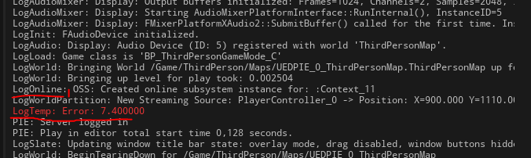
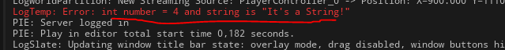

# Печать информации в лог
## Печать на экран
Делается следующим образом:
```cpp
GEngine->AddOnScreenDebugMessage(-1, 0.2f, FColor::Cyan, TEXT("TEST"));
```
## Макрос `UE_LOG`
Используется для печати информации в лог.
Примеры использования:
```cpp
UE_LOG(LogTemp, Warning, TEXT("This is warning!"))
UE_LOG(LogTemp, Error, TEXT("float val = %f"), 5.0f)
```
Значение `LogTemp` - это глобальная категория лога. Просто ее и не отвлекайтесь на задание собственной категории.
### Задаем свою категорию лога
Категория лога выводится перед текстом.

Задать свою собственную категорию лога можно следующим образом:
```cpp
DECLARE_LOG_CATEGORY_EXTERN(MySuperLogCategory, All, All) // - идет в .h файл
DEFINE_LOG_CATEGORY(MySuperLogCategory) // - идет в .cpp файл
// оба макроса надо указывать в начале файлов после секции #include
// теперь, в коде .c++ файла можно делать так
UE_LOG(MySuperLogCategory, Warning, TEXT("This is warning!"))
```
### Задаем цветовое обознаениче и форматирование текста
Цветовое обозначение текста в логе зависит от маркера. Их несколько.
`Error` - красный
`Warning` - желтый
`Display` - серый
(на самом деле маркеров больше, смотрите документацию)
Выводимый текст поддерживает форматирование.
Что это значит?
Если вы раньше работали с чистым с++, то знаете о наличии в нем такой функции как `printf`, которая поддерживает форматирование. Вот UE_LOG делает точно так-же.
То есть функция умеет заменять специальные символы - своими аргументами.
```cpp
UE_LOG(LogTemp, Error, TEXT("int number = %i and string is \"%s\""), (1 + 3), TEXT("It's a String!"))
```



Флаги форматирования можно найти в [документации к printf](https://cplusplus.com/reference/cstdio/printf/).
Я приведу лишь самые ходовые.
______________
`%d` или `%i` - `digit` / `int` то  есть целое число
`%u` - `unsigned decimal int`, то есть тоже целое число, просто без подписи (`uint`)
`%f` - `float`, число с плавающей точкой
`%c` - `char`, то есть символ, единичный, например `chasr c = 'c';`.
`%s` - `string`, строка
Для параметров типа `bool` флаг форматирования не предусмотрен, но можно использовать сокращеный `if` следующим образом: `("%s", x?"true":"false");` где `x` - `bool` параметр
______________
С подстановкой `FString` есть небольшая особенность. Перед строкой надо ставить знак `*`.
```cpp
FString Str = TEXT("It's a String!");
UE_LOG(LogTemp, Error, TEXT("String is \"%s\""), *Str)
```