# Указатели
Изначально я не собирался посвящать этой теме отдельную статью. Хотя-бы потому что мои статьи не являются учебником, это просто - сборник рецептов и экспериментов.
Так почему же я сейчас пишу это?
В чате для программистов я, в один момент, показал участок своего кода.
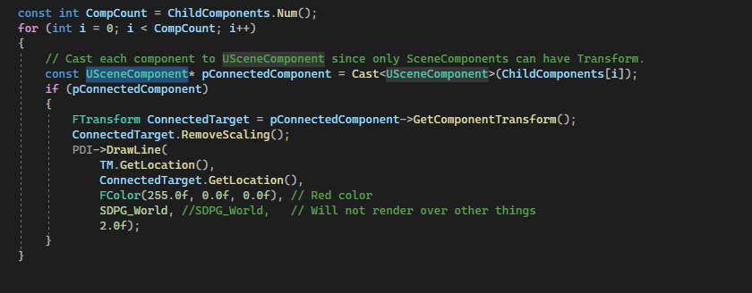
Конкретно этот.
И одному из участников дискуссии стало интересно - нет ли у меня тут утечки памяти. Ведь я, по его мнению, постоянно "выделяю  память" внутри цикла, и не "очищаю ее".
Вот в этом участке:
```cpp
const USceneComponent* pConnectedComponent = Cast<USceneComponent>(ChildComponents[i]);
```
Причем это замечание мне сделал довольно опытный коллега, работающий в энтерпрайз разработке (правда на `C#`) уже 5 или 6 лет… или сколько там прошло с `2016` года.
Надо сказать, что спорщик из меня "так себе", к тому-же особым сверх "авторитетом" среди других кодеров я не пользуюсь. Никогда за таким не следил.
Так что не уверен, что тот спор мной был выигран. Но важнее другое - я понял, что многие люди, даже опытные, понятия не имеют как работают указатели. Для них это такая "магия".
Они не понимают когда происходит выделение памяти, не понимают что вообще из себя представляет "указатель", как работает память и ее адреса.
Именно поэтому я постараюсь покрыть большинство вопросов по указателям для тебя, дорогой читатель.
## Что такое указатели
Начнем с того, что все переменные - помещаются в оперативную память. То место, куда они помещаются, называется `heap`, то есть куча.

Почему Куча? Потому что объекты, переменные и функции помещаются в память в произвольном порядке. Точнее в том, в котором они вызываются внутри кода.
Поскольку программе надо знать, где находятся те или иные переменные - адрес каждого элемента кучи сохраняется в т.н. стек указателей.

> Указатели - это переменные, значения которых соответствуют адресам ячеек в памяти.

Как в картотеке карточка указывает в каком каталоге находится та или иная папка, так и указатель указывает где находится переменная или функция.

Можно ли увидеть адрес, размещенный внутри указателя? Да, можно, для этого достаточно напечатать указатель. Обычным `printf` или `cout`.
Я создал простенькое `c++` приложение, чтобы продемонстрировать в нем основы указателей.
```cpp
#include <iostream>
int main(){
    int Num = 10;
 
    // берем адрес, в котором находится Num и помещаем в указатель
    int* pNum = &Num;
 
    std::cout << Num << "\n";
    std::cout << pNum << "\n";
 
    return 0;
}
```
Тут я создаю переменную `Num`, которой присваиваю значение `10`.
Далее я беру адрес этой переменной через амперсанд, то есть `&Num` и печатаю его.
Давайте посмотрим, какой результат выдает этот код при компиляции.
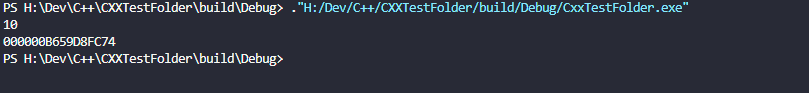
Сверху мы видим значение `int Num`, это `10`, а снизу значение `int* pNum` и это как раз - адрес переменной `Num` в памяти `000000B659D8FC74`. (у меня компиляция под x64, поэтому адрес указателя занимает 8 байт)
Как получить данные, на которые указывает указатель?
Для этого перед указателем надо прописать `*`, таким образом.
```cpp
std::cout << "Addres = " << pNum << "\n";
std::cout << "Addres Value = " << *pNum << "\n";
```
Если теперь скомпилировать код, то увидим следующее:
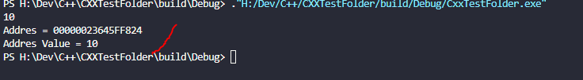
Рассмотрим частные случаи работы с указателями.
Указателю нельзя присвоить значение "напрямую":
```cpp
int *pTest = 100;
```
Текст ошибки: `a value of type "int" cannot be used to initialize an entity of type "int *"`;
Так делать тоже нельзя, хотя ошибку и не напишет:
```cpp
int *pTest = (int*)100;
```
Почему? Указатель хранит адрес в памяти. А число 100 это временное `rvalue` значение, у которого еще нет постоянного адреса в памяти.
Исключением является тип `char*`:
```cpp
char* pTest = "My Text!";
```
Это исключительно особенность данного типа, упрощающая работу со строками Она унаследована от языка `c`.
### Оператор `*&`
Обратите внимание, что команды `&` и `*` являются взаимоисключающими. Первая - берет адрес, а вторая - берет значение по этому адресу.
Поэтому вывод двух следующих строк будет одинаковым.
```cpp
std::cout << "Number = " << Num << "\n";
std::cout << "*& = " << *&Num << "\n";
```
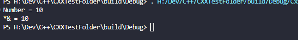
Тем не менее, в некоторых ситуациях, использование очень странного оператора `*&` вполне возможно.
Вот пример:
```cpp
// Function that should return two objects
UFUNCTION(BlueprintCallable, Category = "Custom Functions|UObjectReturn", meta=(HideSelfPin = true))
void TwoUObjectsReturn(UObject *& A, UObject *& B) {
    A = GetMutableDefault<UObject>();
    B = GetMutableDefault<UObject>();
};
```
Этот код используется, чтобы вернуть из функции два инициализированных `UObject'а`.

### Ручное управление памятью
Из `c` в языке `c++` имеется следующий набор функций:
`void *malloc(size_t bytes)` - выдеделение памяти, `Memory Allocation`.
`void *calloc(size_t num, size_t size)` - тоже выделяет память, но перед выделением присваивает новым байтам значение `0`, `Clear Allocation`.
С точки зрения кодера обе функции работают абсолютно одинаково, с небольшой поправкой на нулевые значения.
Приведенные ниже сегменты кода делают одно и то-же.
```cpp
// не забываем про \0 - итоговая длинна строки всегда на 1 символ больше
char * string_to_load = "| Test |";
// Выделяем память под strlen(string_to_load) + 1 букв размерности char
char * malloc_test = (char*)malloc(sizeof(char) * strlen(string_to_load) + 1);
// Выделяем память под strlen(string_to_load) + 1 букв char, предварительно очищая память
char * calloc_test = (char*)calloc(strlen(string_to_load) + 1, sizeof(char));
```
Разницу между `malloc` и `calloc` можно увидеть, напечатав выделенную память:
```cpp
// не забываем про \0 - итоговая длинна строки всегда на 1 символ больше
char * string_to_load = "| Test |";
// Выделяем память под strlen(string_to_load) + 1 букв размерности char
char * malloc_test = (char*)malloc(sizeof(char) * strlen(string_to_load) + 1);
// Выделяем память под strlen(string_to_load) + 1 букв char, предварительно очищая память
char * calloc_test = (char*)calloc(strlen(string_to_load) + 1, sizeof(char));
// смотрим что внутри памяти находится сейчас
std::cout << "Malloc Content: "<< malloc_test << "\n";
std::cout << "Calloc Content: "<< calloc_test << "\n";
std::cout << "\n------\n";
```

Как вы видите, содержимое памяти, выделенное через `malloc` небыло очищено и содержит какой-то мусор.
Ну а память выделенная через `calloc` содержит пустоту.
Таким образом `malloc` быстрее, а `calloc` безопаснее.
Рассмотрим запись данных в выделенную память на примере `c` строки `string_to_load`.
```cpp
strcpy(malloc_test, string_to_load);
```
Что если мы бы хотели добавить к `c` строке дополнительный суффикс?
Это возможно сделать, изменив память через оператор `void *realloc(void *ptr, size_t newsize)`. Данный оператор перераспределяет уже выделенную память, причем как в большую, так и в меньшую сторону.
В нашем случае мы можем сделать так:
```cpp
char * string_to_append = " Appended Text |";
 
malloc_test = (char*)realloc(malloc_test, strlen(malloc_test) + strlen(string_to_append) + 1); // strlen не учитывает символ \0
```
И добавить текст переменной `string_to_append` в новую освобожденную память мы можем методом `strcat`.
```cpp
strcat(malloc_test, string_to_append);
```
После всех операций память, выделенную под указатель, необходимо освободить. "Пометить для системы, что память можно перезаписывать".
Делается это командой `void free(void *ptr)`, которая должна вызываться для каждого указателя, память которого была выделена через `malloc`.
```cpp
free(malloc_test);
free(calloc_test);
```
Полный код тестовой программы вышел такой:
```cpp
#include <iostream>
#include <stdlib.h>
int main(){
    // не забываем про \0 - итоговая длинна строки всегда на 1 символ больше
    char * string_to_load = "| Test |";
    // Выделяем память под strlen(string_to_load) + 1 букв размерности char
    char * malloc_test = (char*)malloc(sizeof(char) * strlen(string_to_load) + 1);
 
    // Выделяем память под strlen(string_to_load) + 1 букв char, предварительно очищая память
    char * calloc_test = (char*)calloc(strlen(string_to_load) + 1, sizeof(char));
 
    // смотрим что внутри памяти находится сейчас
    std::cout << "Malloc Content: "<< malloc_test << "\n";
    std::cout << "Calloc Content: "<< calloc_test << "\n";
    std::cout << "\n------\n";
    // Помещаем слово string_to_load внутрь каждого фрагмента памяти
    strcpy(malloc_test, string_to_load);
    strcpy(calloc_test, string_to_load);
 
    std::cout << "Malloc Text :" << malloc_test << " size " << strlen(malloc_test) << "\n"; // я знаю про std::endl, но где-то читал, что "\n" быстрее, не помню где
    std::cout << "Calloc Text :" << calloc_test << " size " << strlen(calloc_test) << "\n";
    std::cout << "\n------\n";
 
    char * string_to_append = " Appended Text |";
 
    malloc_test = (char*)realloc(malloc_test, sizeof(char) * (strlen(malloc_test) + strlen(string_to_append) + 1));
    calloc_test = (char*)realloc(calloc_test, sizeof(char) * (strlen(calloc_test) + strlen(string_to_append) +1));
    strcat(malloc_test, string_to_append);
    strcat(calloc_test, string_to_append);
    std::cout << "Reallocated Malloc Text: " << malloc_test << " size " << strlen(malloc_test) << "\n";
    std::cout << "Reallocated Calloc Text: " << calloc_test << " size " << strlen(calloc_test) << "\n";
    free(malloc_test);
    free(calloc_test);
    return 0;
}
```
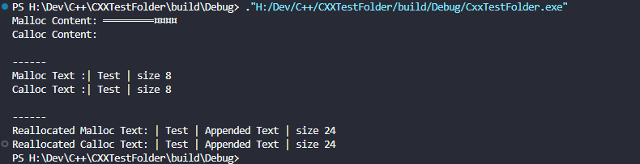
Обратите внимание, когда я выделяю новые блоки памяти в `malloc` и `realloc` я не использую `sizeof()`. Почему?
Дело в том, что `sizeof` не работает с кучей (heap), в которой мы выделяем память. Не умеет работать. И единственный способ узнать, каков реальный размер объекта в куче - это использовать для строк `strlen`, ну а для других данных - иные методы подсчета, например перебором в цикле.
Единственное для чего `sizeof` реально годится - для измерения массивов, размер которых изначально известен (и не будет меняться), а так-же для измерения размерности типов.
Условно говоря `sizeof` не будет работать тут:
```cpp
int* ints = new int[222];
std::cout<<"the size of ints is "<<sizeof(ints)<<"\n";
delete ints;
```
Но будет работать тут:
```cpp
int ints2[10];
std::cout<<"the ints2 size is "<<sizeof(ints2)/sizeof(int)<<"\n";
```
Можете сами проверить, в первом случае, вам напишет не `222*sizeof(int)`, а просто `sizeof(int)`, то есть, в моем случае это `4`. Четыре. Не `222`.
Ну а во втором - `10`.
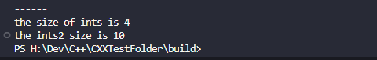
При работе с кучей, разработчик должен сам сохранять размерность массива. Лучше всего это делать внутри `private` переменной класса.
Встроенные в стандартную библиотеку контейнера типа `std::vector`, `std::string` и прочие - сами считают свой размер всякий раз как получают новые данные или теряют их.
`c++` привносит в синтаксис си элементы ооп. Все "новые" возможности управления памятью в `с++` сводятся к ключевым словам `new` и `delete`. Ключевое слово `new` упрощает выделение памяти под объекты, потому что не всегда можно просчитать размерностью объекта для оператора `malloc`, как я уже показал на примере `sizeof`.
Ключевое слово `delete` удаляет объект из памяти.
Пример использования:
```cpp
std::cout << "\n------\n";
std::vector<int> * vector_test = new std::vector<int>(222);
vector_test->at(5) = 15; // put number 15 at position of 5
std::cout << "Vector Size: " << vector_test->size() << "\n";
std::cout << "Vector value 5 before deletion: " << vector_test->at(5) << "\n";
delete vector_test; // deleting vector
std::cout << "Vector value 5 after deletion: " << vector_test->at(5) << "\n";
```
В конце этот код выдаст ошибку, ибо я пытаюсь обратиться к уже удаленной памяти. Намеренно. Чтобы продемонстрировать.
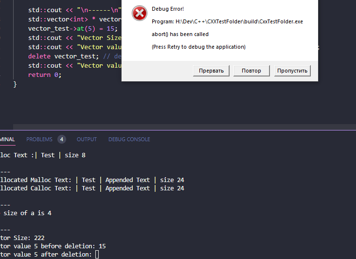
Так-же в с++ введено понятие конструктора и деструктора класса. В современном с++ есть более расширенные понятия конструктора класса, это `copy constructor, move constructor, copy assignment, move assignment, default constructor`, это т.н. принцип `4+1`. Видимо придется на этом тоже остановиться… в другой главе.
#### Утечки памяти
Помните, что если ваше приложение закроется до освобождения памяти объекта, то выделенная память останется заблокированной, до перезагрузки компьютера.
Оператры `free()` и `delete` помечают память как доступную для перезаписи другими прилжениями и процессами. Их вызов - обязателен.
Утечки памяти - одна из главных претензций большинства разработчиков и к `с` и к `с++`.
Рассмотрим следующий код:
```cpp
std::cout << "\n------\n";
int test_array[10];
// заполняем массив
for (int i = 0; i< sizeof(test_array)/sizeof(int); i++){
    test_array[i] = i+1;
}
// тут sizeof(test_array)/sizeof(int) сработает, потому что в компайл тайме уже известен размер массива - 10 элементов
for (int i = 0; i< sizeof(test_array)/sizeof(int); i++){
    const int * array_item = &test_array[i];
    std::cout << *array_item << " ";
}
std::cout << "\nArray Size: " <<sizeof(test_array)/sizeof(int) << "\n";
```

Это доведенный до абсурда пример из вступления. Обратите внимание на этот участок `const int * array_item = &test_array[i];`.
Как вы считаете, есть ли в теле цикла утечка памяти?
Если вы внимательно читали мои предыдущие объяснения, то поймете, что тут ее нет. И пусть слово `const` вас не сбивает с толку, потому что это `compile time operator`.
В теле цикла нигде не использутеся `new`, не используется `malloc` или `calloc`.
Что делает эта строчка: `const int * array_item = &test_array[i];`?
Тут берется адрес в ПАМЯТИ элемента массива по индексу `i`. То есть не сам элемент, а его адрес в памяти. Понимаете? Он ведь находится в памяти, вот я его адрес и беру.
А в какого типа переменных хранятся адреса памяти? В указателях.
Вот я и сую этот адрес в указатель. Заметьте, в указатель идет лишь адрес, а не память как таковая. Таким образом утечки памяти тут нет.
И я, таки, делаю ваше внимание на тот факт, что в обоих циклах у меня используется индекс `i`. И в верхнем и в нижнем. Как же такое возможно? Разве это не вызывает конфликт имен, спросит юный и неопытный коллега? Как видите - не вызывает. У этих переменных разная область видимости `{}`. Я часто использую этот трюк в коде.
Данные, которые выделяются в теле цикла, будь это переменные или указатели, сбрасываются по выходу из своей области видимости `{}`. Да, указатели тоже сбрасываются. Но **память**, на которую они указывают, _не сбрасывается_, пока вы ее вручную не очистите через `free` или `delete`.
Как тут все запороть и, таки, создать утечку памяти на мою голову?

```cpp
for (int i = 0; i< sizeof(test_array)/sizeof(int); i++){
    const int * array_item = &test_array[i];
    int* useless_pointer = (int*)malloc(sizeof(int) * 5);
    std::cout << *array_item << " ";
}
```
Вот так. Значение переменной `useless_pointer` сбросится, по выходу из цикла она не будет существовать. А вот память, выделенная в `malloc` существовать будет. Просто на нее ничто не будет указывать и потому очистить ее никак не получится.
Это и есть самый страшный пример "утечки памяти".
Утечку памяти можно сделать и так (через `new`):
```cpp
for (int i = 0; i< sizeof(test_array)/sizeof(int); i++){
    const int * array_item = &test_array[i];
    int* useless_pointer = new int[5];
    std::cout << *array_item << " ";
}
```
Теперь, когда мы разобрались с обычными указателями, самое время переходить к Unreal Engine.
## Подготовка к работе
Поскольку класс из предыдущей статьи у нас разросся до невозможности, в этот раз мы будем работать с новым классом. Пусть это будет класс компонента, который мы просто добавим к `BP_ThirdPersonCharacter`.
Про компоненты отдельно мы поговорим в следующей статье. А в этой просто используем класс компонента для своих тестов.
### Добавляем компонент
Чтобы добавить компонент идем, как обычно, `Tools -> New C++ Class`.
Выбираем `ActorComponent`.
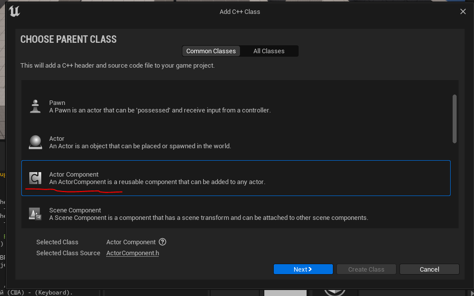
Называем `PointersComponent`. Компонент должен добавляться в модуль - `TestModule`.
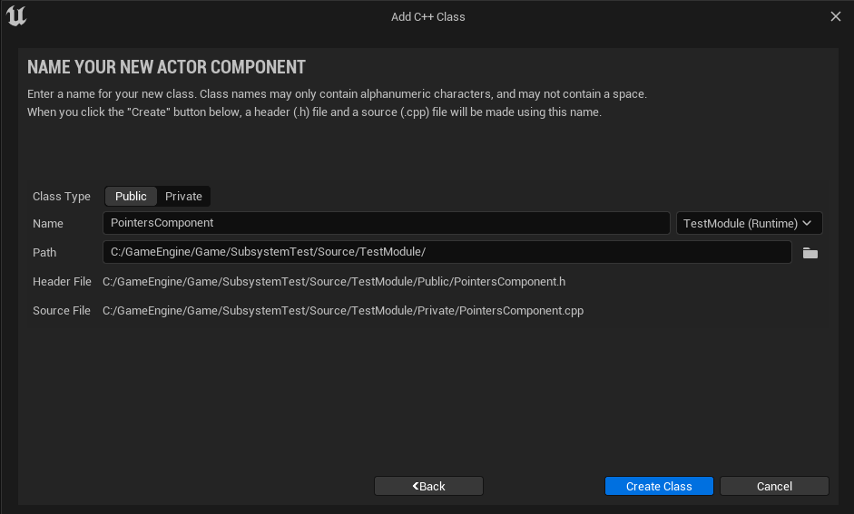
### Зависимости сборки
В файле `TestModule.build.cs` прописываем следующие зависимости:
```cpp
using System.IO;
using UnrealBuildTool;
public class TestModule : ModuleRules
{
	public TestModule(ReadOnlyTargetRules Target) : base(Target)
	{
        PCHUsage = PCHUsageMode.UseExplicitOrSharedPCHs;
		PublicDependencyModuleNames.AddRange(new string[] {
			"Core",
			"CoreUObject",
			"Engine",
            "Slate",
			"SlateCore",
			"LocalizationCommandletExecution",
            "GameplayTags"
        });
        PrivateDependencyModuleNames.AddRange(new string[] {
            "InputCore"
            , "EnhancedInput"
        });
        PublicIncludePaths.AddRange(new string[] {"TestModule/Public", "TestModule/Public/Enums" });
		PrivateIncludePaths.AddRange(new string[] {
            Path.Combine(ModuleDirectory, "Private")
        });
	}
}
```
### Добавляем компонент к персонажу
Открываем `BP_ThirdPersonCharacter`, добавляем туда наш компонент.
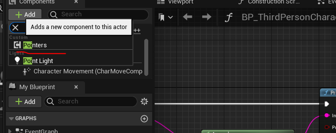
## Обычные указатели в `Unreal Engine`
Давайте начнем разбор указателей в движке с обычных.
Как вы знаете в `Unreal Engine` имеется встроенная система сборки мусора, автоматически следящая за памятью и ее использованием. Это достаточно удобный инструмент, однако обычные указатели не всегда обрабатываются этой системой. Поэтому работать с ними надо крайне осторожно.
В каких случаях использование обычных указателей безопасно?
Тут есть два варианта:
1. Если обычный указатель ссылается на `UObject`, то его автоматически будет обрабатывать сборщик мусора. Таким образом вы можете спокойно использовать обчные указатели с объектами типа: `UObject, AActor, APawn, ACharacter, AActorComponent, ASceneComponent`, а так-же с любыми объектами, унаследованными от этих классов.
2. Если обычный указатель используется как `UPROPERTY` параметр. Система `Unreal Header Tool` умеет преобразовывать обычные указатели в управляемые автоматически, в момент компиляции, если они используются как параметры.
```cpp
// Actor RAW refrence
UPROPERTY(BlueprintReadWrite, EditAnywhere, Category = "DifferentPointers")
AActor* SomeActorRefrence = nullptr;
```
Если скомпилировать указанный выше код, добавив его в класс `PointersComponent`, мы получим поле, в котором можно указать объект текущего, открытого, уровня.
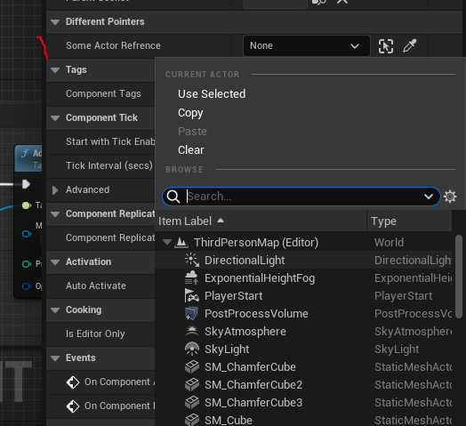
## Умные указатели в `Unreal Engine`
"Умные" указатели отличаются от обычных тем, что предоставляют разработчику дополнительные возможности по управлению объектами, на которые ссылаются.
Память, на которую ссылаются "умные" указатели - автоматически очищается при сбоях системы или закрытии приложения. Это гарантирует безопасность при работе с такими указателями.
Есть умные указатели, интегрированные и не интегрированные в сборщик мусора. Работают они по разному.
### Управляемые умные указатели
Управляемые классы умных указателей работают совместно с системой сборки мусора `Unreal` и поэтому могут свободно работать с объектами, унаследованными от `UObject, AActor, APawn, ACharacter, AActorComponent, ASceneComponent`.
#### `TObjectPtr` - замена `raw object pointer`
[Документация.](https://docs.unrealengine.com/5.0/en-US/API/Runtime/CoreUObject/UObject/TObjectPtr/)
`TObjectPtr` - это относительно новый класс умных указателей (появился в `Unreal Engine 5`), выступающий как альтернатива использованию чистых указателей для `UPROPERTY`.
Разработчики советуют использовать в `Unreal 5` именно `TObjectPtr` и воздержаться от использования чистых указателей.
`TObjectPtr` работает как блокирующий указатель, который не позволяет системе сборки мусора удалять объект, на который ссылается указатель, до тех пор, пока сам указатель используется хоть в одном активном классе.
`TObjectPtr` используют для хранения ссылок на объекты или для создания новых объектов.
Ниже будет ряд примеров использования данного указателя совместно с `UPROPERTY`.
```cpp
// Texture2D asset refrence
UPROPERTY(BlueprintReadWrite, EditAnywhere, Category = "DifferentPointers")
TObjectPtr<UTexture2D> SomeTexture2D = nullptr;
//Texture asset refrence
UPROPERTY(BlueprintReadWrite, EditAnywhere, Category = "DifferentPointers")
TObjectPtr<UTexture> SomeTexture = nullptr;
// Static Mesh Refrence
UPROPERTY(BlueprintReadWrite, EditAnywhere, Category = "DifferentPointers")
TObjectPtr<UStaticMesh> StaticMesh = nullptr;
// Skeletal Mesh Refrence
UPROPERTY(BlueprintReadWrite, EditAnywhere, Category = "DifferentPointers")
TObjectPtr<USkeletalMesh> SkeletalMesh = nullptr;
// Physics Asset Refrence
UPROPERTY(BlueprintReadWrite, EditAnywhere, Category = "DifferentPointers")
TObjectPtr<UPhysicsAsset> PhysicsAsset = nullptr;
```
#### `TWeakObjectPtr`
Это "не блокирующий" указатель. Память, на которую он ссылается, может быть удалена или очищена вне зависимости от того, активен указатель или нет.
Eго предназначение - работа с объектами, которые уже сконструированы и присутствуют на уровне.
Например, мы можем взять ссылку на любой объект с уровня и  поместить ее в `TWeakObjectPtr`.
```cpp
// Actor Weak Refrence
UPROPERTY(EditAnywhere, BlueprintReadWrite, Category = "DifferentPointers")
TWeakObjectPtr<AActor> ActorWeakRefrence;
```
Загрузим объект `PlayerStart` по его пути на уровне.
```cpp
// setting Weak Refrence to Actor on Level
if (ActorWeakRefrence == nullptr) {
    FString StringObjectOnLevelPathW = TEXT("/Game/ThirdPerson/Maps/ThirdPersonMap.ThirdPersonMap:PersistentLevel.PlayerStart_0");
    // search for StringObjectOnLevelPath using FObjectFinder
    ConstructorHelpers::FObjectFinder<AActor> FoundActor(*StringObjectOnLevelPathW);
    if (FoundActor.Succeeded()) {
        ActorWeakRefrence = MakeWeakObjectPtr<AActor>(FoundActor.Object);
    }
}
```
####  `TSoftObjectPtr`
Это "не блокирующий" указатель. Работает как `TWeakObjectPtr`, но в отличие от него может ссылаться на еще не загруженные в игру объекты или на объекты, находящиеся на других уровнях.
Этот указатель хранит путь до ассета на который ссылается и поэтому он предоставляет дополнительный функционал по инициализации объектов. Ниже мы это рассмотрим.
```cpp
UPROPERTY(BlueprintReadWrite, EditAnywhere, Category = "DifferentPointers")
TSoftObjectPtr<AActor> SomeSoftActorRef = nullptr;
```
Сослаться на ассет на любом уровне можно следующим образом. Сначала выставляем этот ассет в полученном `UPROPERTY`. Щелкаем на поле ПКМ и нажимаем `Copy`.
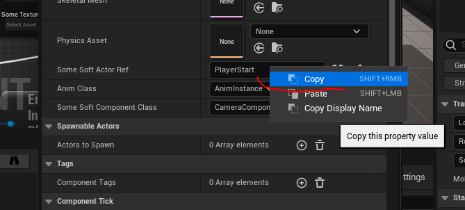
Полученную ссылку можно загрузить в `TSoftObjectPtr` используя такой код:
```cpp
// soft actor ref
if (SomeSoftActorRef == nullptr) {
    FString StringObjectOnLevelPath = TEXT("/Game/ThirdPerson/Maps/ThirdPersonMap.ThirdPersonMap:PersistentLevel.PlayerStart_0");
    SomeSoftActorRef = UKismetSystemLibrary::MakeSoftObjectPath(StringObjectOnLevelPath);
}
```
При этом `SoftObjectPath` автоматически преобразуется в `TSoftObjectPtr`.
Ну и конечно этот код надо вызывать в конструкторе класса, если вы желаете установить данное значение как "по умолчанию" для переменной.
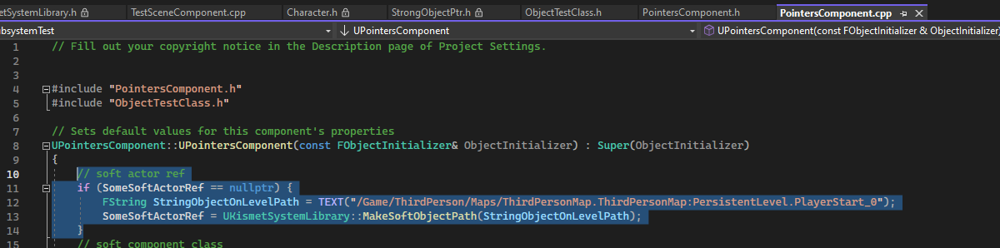
Получение прямой ссылки на сам ассет, с его автоматической загрузкой, осуществляется методом `.Get()`
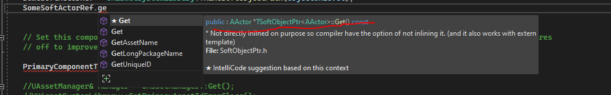
Используя `UKismetSystemLibrary` можно получить доступ к следующим методам для `TSoftObjectPtr`:
```cpp
#include "Kismet/KismetSystemLibrary.h"
//...
// Конвертирует указатель в нормальный объект
UKismetSystemLibrary::Conv_SoftObjectReferenceToObject(TSoftObjectPtr)
// Primary Asset Id
UKismetSystemLibrary::GetPrimaryAssetIdFromSoftObjectReference(SomeSoftActorRef);
// Get object refrence from SoftRefrence
UKismetSystemLibrary::Conv_SoftObjectReferenceToObject(SomeSoftActorRef);
// Cheks if object exists at given pointer
UKismetSystemLibrary::IsValidSoftObjectReference(SomeSoftActorRef);
```
Так-же из `TSoftObjectPtr` доступны дополнительные методы работы с привязанной ссылкой на ассет.
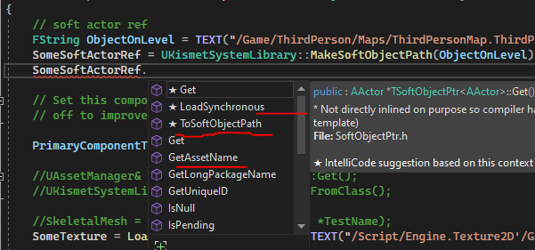
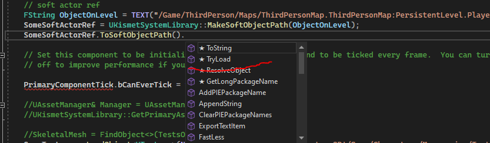
#### `TAssetPtr`
Это старый умный указатель, для управления ссылками на ассеты. В данный момент он все еще поддерживается ради совместимости движка со старым кодом. Документация гласит следующее:

В данный момент `TAssetPtr` представляет из себя просто `typedef` от `TSoftObjectPtr`, то есть это просто псевдоним. И использовать его не рекомендуется, потому что в будущем данный тип указателя может получить статус `Deprecated`, не поддерживаемого. Используйте `TSoftObjectPtr`.
####  TSoftClassPtr
Работает как `TSubclassOf`, но может указывать на не-загруженные классы. Классы загружаются посредством подсистемы `UAssetManager`.
Так-же позволяет осуществлять асинхронную загрузку классов. Однако не может ссылаться на классы типа `DataAsset`. Для них надо использовать `TSubclassOf`.
```cpp
// AnimInstance Class Refrence
UPROPERTY(BlueprintReadWrite, EditAnywhere, Category = "DifferentPointers")
TSubclassOf<UAnimInstance> AnimClass = UAnimInstance::StaticClass();
// Soft Class
UPROPERTY(BlueprintReadWrite, EditAnywhere, Category = "DifferentPointers")
TSoftClassPtr<UActorComponent> SomeSoftComponent = UCameraComponent::StaticClass();
```
Сослаться на ассет на любом уровне можно следующим образом. Сначала выставляем этот ассет в полученном `UPROPERTY`. Щелкаем на поле ПКМ и нажимаем `Copy`.
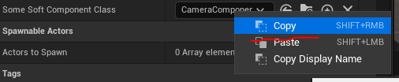
Полученную ссылку можно загрузить в `TSoftClassPtr` используя такой код:
```cpp
// soft component class
if (SomeSoftComponentClass == nullptr) {
    FString StringClassPath = TEXT("/Script/Engine.CameraComponent");
    SomeSoftComponentClass = UKismetSystemLibrary::MakeSoftClassPath(StringClassPath);
}
```
Если надо получить из `TSoftClassPtr` сам класс, то используйте метод `Get()`.
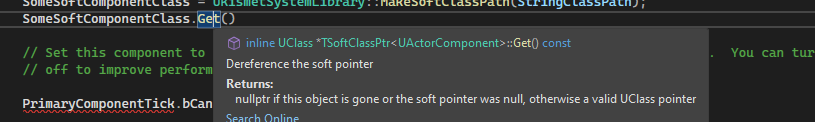
Используя `UKismetSystemLibrary` можно получить доступ к следующим методам для `TSoftClassPtr`:
```cpp
// Конвертирует указатель в нормальный объект
UKismetSystemLibrary::Conv_SoftObjectReferenceToObject(TSoftObjectPtr)
// Primary Asset Id
UKismetSystemLibrary::GetPrimaryAssetIdFromSoftClassReference(SomeSoftComponentClass);
// Check if asset exists on given path
UKismetSystemLibrary::IsValidSoftClassReference(SomeSoftComponentClass);
// Loads class non async
UKismetSystemLibrary::LoadClassAsset_Blocking(SomeSoftComponentClass);
```
##### Для DATA ASSET'ов
Чтобы ссылаться на `Data Asset` нужно использовать не `TSoftClassPtr`, а `TSoftObjectPtr`, что немного не логично, но, как есть.
```cpp
UPROPERTY(EditDefaultsOnly, Category = "Input")
TSoftObjectPtr<UInputAction> InputAction = nullptr;
// Input Context as parameter in Data Asset
UPROPERTY(EditDefaultsOnly, Category = "Input")
TSoftObjectPtr<UInputMappingContext> InputContext = nullptr;
```

##### Работа с `Blueprint` классами
Если мы хотим сослаться не на с++ класс или ассет, а на `blueprint` класс, то к тексту рефренса этого ассета надо добавить постфикс `_C`.
Например такой рефренс у `Animation Blueprint`: `/Script/Engine.AnimBlueprint'/Game/Characters/Mannequins/Animations/ABP_Manny.ABP_Manny'`

Чтобы присвоить это значение для переменной типа `TSoftClassPtr` нужен такой код:
```cpp
const FString AnimationInstanceAsset = TEXT("/Script/Engine.AnimBlueprint'/Game/Characters/Mannequins/Animations/ABP_Manny.ABP_Manny_C'");
const TSoftClassPtr<UAnimInstance> CAnimInst(AnimationInstanceAsset);
MeshComp->SetAnimationMode(EAnimationMode::AnimationBlueprint);
MeshComp->SetAnimInstanceClass(CAnimInst.LoadSynchronous());
```
Если, в данном случае, постфикс `_C` не использовать, то вместо `blueprint` класса, указатель будет ссылаться на `AUnimInstance`, то есть на первый с++ класс доступный как предок данного `blueprint`.
### Неуправляемые умные указатели
Данные указатели не управляются встроенным сборщиком мусора и не могут работать с классами, унаследованными от `UObject`. Их предназначение - работать с не управляемыми типами объектов и структур. Это могут быть ваши собственные объекты или объекты из подключенных сторонних библиотек.
Для наших экспериментов создадим простенькую структуру:
```cpp
// struct to test unmanaged smart pointers
struct FPtrTestStruct {
	FPtrTestStruct() {
		Field1 = 0;
		Field2 = 1.0f;
	}
	int Field1;
	float Field2;
};
```
Обратите внимание, что мы не использовали в этой структуре макрос `USTRUCT`, таким образом исключив ее из обработки сборщиком мусора. Представим, что эта структура идет из некой сторонней библиотеки. На ней и будем проводить эксперименты.
#### `TSharedPtr`
[Документация.](https://docs.unrealengine.com/4.26/en-US/ProgrammingAndScripting/ProgrammingWithCPP/UnrealArchitecture/SmartPointerLibrary/SharedPointer/)
Аналог встроенного в стандартную библиотеку с++ умного указателя `std::shared_ptr`. В Unreal можно работать как с `TSharedPtr` так и с `std::shared_ptr`.
Это "блокирующий"  и анализирующий свое использование указатель. Память, на которую он ссылается, не может быть очищена сборщиком мусора до тех пор, пока хоть один объект ссылается на этот указатель.
Когда количество объектов, использующих `TSharedPtr`, становится равным `0`, этот указатель автоматически уничтожается.
Объект можно инициализировать как `TSharedPtr` используя вспомогательныe методы `MakeShared` и `MakeShareable`.
```cpp
TSharedPtr<TestClass> ObjPtr = MakeShareable(new TestClass(Args)); // этот позволяет превратить в указатель любой объект
TSharedPtr<TestClass> ObjPtr = MakeShared<TestClass>(Args); // этот позволяет создать экземпляр объекта с аргументами по его классу
// например
TSharedPtr<int,ESPMode::ThreadSafe> ThreadsafeIV = MakeShared<int>(0);
```
Когда надо использовать?
Когда нужен указатель на объект, использующийся многими другими объектами. То есть Shared, общий.
#### `TSharedRef`
То-же самое, что и `TSharedPtr`, с одним отличием - этот указатель не может ссылаться на `nullptr`. Если он ссылается, то выскочит ошибка в работе приложения. Рекомендуется использовать этот тип указателя для аргументов функции.
#### `TWeakPtr`
[Документация.](https://docs.unrealengine.com/5.1/en-US/weak-pointers-in-unreal-engine/)
Аналог встроенного в стандартную библиотеку с++ умного указателя `std::weak_ptr`. В Unreal можно работать как с `TWeakPtr` так и с `std::weak_ptr`.
Это "не блокирующий" указатель. Память, на которую он ссылается, может быть удалена или очищена вне зависимости от того, активен указатель или нет. Поэтому важно добавлять проверки на то, является ли содержимое указателя `nullptr`.
Чтобы использовать `WeakPtr` с `UObject` типами есть второй указатель - `TWeakObjectPtr`. Который может работать с `UObject`. Я его уже рассматривал.
Когда надо использовать?
`TWeakPtr` используется тогда, когда надо сослаться на уже существующий объект.
Делается это так:
```cpp
// Allocate a new data object and create a strong reference to it.
TSharedRef<FMyObjectType> ObjectOwner = MakeShared<FMyObjectType>();
// Create a weak pointer to the new data object.
TWeakPtr<FMyObjectType> ObjectObserver(ObjectOwner);
```
У вас не получится сконструировать объект с этим указателем, потому что такой объект сразу вычистит система сборки мусора, а указатель в итоге будет ссылаться на `nullptr`.
При необходимости `TWeakPtr` можно преобразовать в `TSharedPtr`, благодаря методу `Pin()`.
```cpp
TWeakPtr<UPointersComponent> component = this;
TSharedPtr<UPointersComponent> shared = component.Pin();
```
#### TUniquePtr
[Документация.](https://docs.unrealengine.com/4.27/en-US/API/Runtime/Core/Templates/TUniquePtr/) Надо сказать, что информации по этому указателю в интернете почти нет (как нет ее и по остальным указателям, люди их буквально не используют). В гугле всего 4 страницы выдает. Благо, как и  все остальные указатели для неуправляемого кода, данный является лишь аналогом к `std::unique_ptr`. А значит документация из стандартной библиотеки верна и для Unreal.
Это "блокирующий" указатель, работающий вне стандартного сборщика мусора и конфликтующий с ним. Память, на которую ссылается `TUniquePtr` автоматически очищается, когда программа выходит за область действия этого указателя. Например когда заканчивается функция, в которой этот указатель был создан. Сборщик мусора не управляет этим указателем. Этот указатель нельзя передать в другие функции в качестве аргумента.
Поскольку этот указатель работает вне стандартной системы сборки мусора - он не может управлять объектами, которые уже привязаны к сборщику мусора. То есть этот указатель нельзя создать для классов, унаследованных от `UObject`. Или для классов созданных при участии макросов `UCLASS` / `USTRUCT`.
Вы не сможете засунуть в этот указатель класс `AActor`. Зато в него можно засунуть указатели на классы и структуры от сторонних библиотек.

> Этот тип указателя работает только с классами и структурами **не управляющимися встроенным сборщиком мусора**.

Создание указателя для примитивной "чистой" структуры выглядит так:
```cpp
struct FUniquePtrTestStruct {
	FUniquePtrTestStruct() {
		Field1 = 0;
		Field2 = 1.0f;
	}
	int Field1;
	float Field2;
};
// ----
// загрузка структуры в указатель
TUniquePtr<FUniquePtrTestStruct> Unique = MakeUnique<FUniquePtrTestStruct>();
Unique->Field1 = 5;
Unique->Field2 = 7.4f;
FString ToPrint = FString::Printf( TEXT("Field1 = %i\nField2 = %f"), Unique->Field1, Unique->Field2);
GEngine->AddOnScreenDebugMessage(-1, 5.0f, FColor::Cyan, *ToPrint);
```
Обратите внимание на тот факт, что структура создана без макроса `USTRUCT`. Если изменить ее под этот макрос, например так:
```cpp
USTRUCT(BlueprintType)
struct FUniquePtrTestStruct {
	GENERATED_USTRUCT_BODY()
	FUniquePtrTestStruct() {
		Field1 = 0;
		Field2 = 1.0f;
	}
	int Field1;
	float Field2;
};
```
Ваш код вызовет сбой движка в момент компиляции, потому что переменная структуры не может одновременно управляться указателем `TUniquePtr` и системой сборки мусора.
Помните об этом.
`TUniquePtr` не копируется. Что это значит? Это значит что вот такой код не сработает, выдав ошибку `cannot be refrenced -- it is a deleted function`.
```cpp
void TestPointerArg(TUniquePtr<FUniquePtrTestStruct> arg) {};
// ----
TUniquePtr<FUniquePtrTestStruct> Unique = MakeUnique<FUniquePtrTestStruct>();
TestPointerArg(Unique);
```
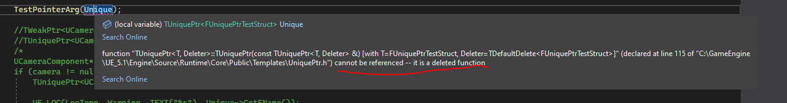
Дело в том, что при передаче аргументов внутрь функции - они копируются. В примере я передаю в функцию `TestPointerArg` наш указатель как один из аргументов. Из-за того, что `TUniquePtr` нельзя копировать - код выдает ошибку.
Однако данное ограничение можно обойти за счет перемещения памяти используя `MoveTemp`,  `std::move` или за счет встроенного в указатель метода `Release`. Вместо копирования памяти указателя - мы просто ее перемещаем.
Делается это так:
```cpp
// make first pointer
TUniquePtr<FUniquePtrTestStruct> Unique = MakeUnique<FUniquePtrTestStruct>();
// release it to second pointer
TUniquePtr<FUniquePtrTestStruct> Unique1(Unique.Release());
Unique1->Field1 = 5;
Unique1->Field2 = 7.4f;
FString ToPrint = FString::Printf( TEXT("Field1 = %i\nField2 = %f\nIs first pointer valid? = %s"), Unique1->Field1, Unique1->Field2, Unique.IsValid() ? TEXT("true") : TEXT("false") );
GEngine->AddOnScreenDebugMessage(-1, 5.0f, FColor::Cyan, *ToPrint);
```
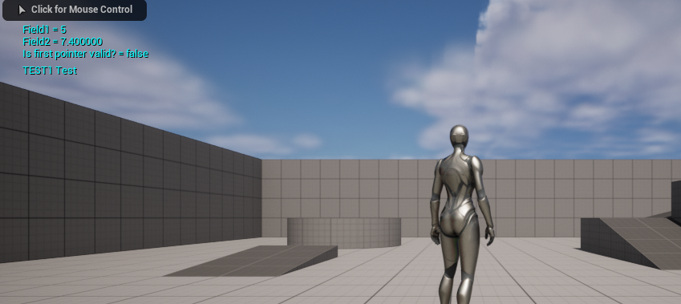
Когда `TUniquePtr` надо использовать?
Данный указатель рассчитан на использование с классами и структурами, не добавленными в сборщик мусора Unreal, потому что изначально под него не создавались, например с классами из сторонних с++ библиотек или совместно с виджетами Slate.
Так-же некоторые аргументы функций и методы движка возвращают этот тип указателя.
## Указатели на функции
Поскольку функции тоже имеют свой адрес в памяти, очевидно, что на них можно получить указатель, а потом вызвать их по этому указателю.
Зачем это используется? Для расширения возможностей обычных функций, а так-же для передачи событий.
Например, в функцию сортировки можно скормить указатель на другую функцию, которая будет сравнивать сортируемые элементы. В Unreal есть тип TArray -> Sort, который именно так и работает (с UObject).
Поэтому обойти данную тему никак не получится.
### Классические указатели на функции в объекте
Начнем с классики, с встроенной в язык с++ механики указателей на функции. Без оберток, шаблонов и сторонних вспомогательных элементов.
Но сначала пара оговорок.
Функции внутри объектов принято называть методами. Но про термин "указатель на метод" я ниразу не слышал. Может он и есть, однако он не "звучит". Поэтому я буду пользоваться термином - "указатель на функцию", даже если это не функция, а метод.
Почему я решил рассмотреть именно указатель на функцию в объекте, а не просто указатель на функцию внутри примитивного демо?
Причина тут проста - примеров _обычных_ указателей на _обычные_ функции в гугле полно. И вы можете почитать оттуда все что надо сами. Я же предпочитаю писать о том, про что больше нигде почитать не получится.
Давайте создадим метод, над которым будем работать.
Для нас крайне важно, чтобы на этом методе можно было показать как можно больше примеров работы с данными.
Таким образом метод должен: принимать значение переменной классическим способом, по сслыке, по указателю, а так-же возвращать некое значение.
```cpp
class TESTMODULE_API UPointersComponent : public UActorComponent
{
// код из этой секции был убран, чтобы уместить все внутрь статьи
public:
    // This function will be passed as arg
    int LogApple(int ApplesCount, const FString& Arg2, float *Arg3) {
        UE_LOG(LogTemp, Warning, TEXT("LogApple"))
        // Note* FString can't be passed to UE_LOG directly, it needs wchar, so convert it via adding * before string arg - *Arg2
        UE_LOG(LogTemp, Warning, TEXT("Apples Count = %d, Const StringArg = %s, FloatArg = %f"), ApplesCount, *Arg2, *Arg3)
        // change refrenced variables to test if changes are passed
        ApplesCount = ApplesCount + 1;
        *Arg3 = *Arg3 + 1.1;
        return ApplesCount;
    };
}
```
Обратите внимание, что сам метод находится в `public` секции класса `UPointersComponent`.
Теперь создадим указатель на этот метод. Указатель будет реализован в качестве "виртуального поля" для класса. Такое поле не создается непосредственно в самом классе, а привязывается к нему "на лету". Так  можно делать, но только с указателями.
```cpp
// only memebers of UPointersComponent can call it's functions directly by ref
// so i create "virtual pointer" UPointersComponent::*pFunc
// that will be bound to the class and can interact with it
int (UPointersComponent::*pFunc)(int, const FString&, float*){
    &UPointersComponent::LogApple // default bound function, not necessary
};
pFunc = &UPointersComponent::LogApple;
```
`UPointersComponent::*pFunc` - тут я привязываю указатель pFunc к классу `UPointersComponent`.
Формат указателя на функцию следующий:
```cpp
// чистое определение
возвращаемый_тип (класс_владелец_функции::*название_указателя)(аргументы){
    &функция_на_которую_ссылаемся"по умолчанию"
}
// можно использовать using:
using название_указателя = возвращаемый_тип (*)(аргументы);
// или typedef
typedef возвращаемый_тип (*название_указателя)(аргументы);
```
Присвоить функцию к такому указателю можно следующей строкой:
```cpp
pFunc = &UPointersComponent::LogApple;
```
По сути мы берем адрес функции внутри класса, используя оператор `&` и присваиваем его указателю.
Поскольку у нас значение `&UPointersComponent::LogApple;` уже присвоено указателю при его создании, как значение "по умолчанию", в этой строчке `pFunc = &UPointersComponent::LogApple;` нет никакого смысла. Она тут исключительно для демонстрации.
Теперь этот указатель надо передать в другую функцию, в качестве ее аргумента.
```cpp
// This function recives pointer to other function as argument
void ReciveFunctionPointerAsArg(int Arg1, UPointersComponent * objectPtr, int(UPointersComponent::*pFunc)(int, const FString&, float*)) {
    float FVar = 3.1f;
    FString StrVar = TEXT("Test String");
    // Run Function
    int ApplesReturn = (objectPtr->*pFunc)(5, StrVar, &FVar);
    UE_LOG(LogTemp, Warning, TEXT("Classic Pointer"))
    UE_LOG(LogTemp, Warning, TEXT("Apples Returned = %d, Float Var Returned = %f, Const StringVar Returned = %s"), ApplesReturn, FVar, *StrVar)
};
```
Аргумент передаваемой функции задается по точно тому-же формату, то есть `int(UPointersComponent::*pFunc)(int, const FString&, float*)`, где `pFunc` - название указателя. Я просто скопировал, потому что ленивый.
Чтобы вызвать функцию, переданную по аргументу, я использовал следующий код:
```cpp
// Run Function
int ApplesReturn = (objectPtr->*pFunc)(5, StrVar, &FVar);
```
Вместе с указателем на функцию мы передаем так-же  и объект, к которому привязан этот указатель`UPointersComponent * objectPtr`.
Без передачи объекта вызвать указатель `pFunc` у вас НЕ ПОЛУЧИТСЯ (там есть вариант использовать TFunctionRef, встроенный в Unreal Engine, но этот вариант мы рассмотрим чуть пожже).
Чтобы передать указатель на функцию `LogApple` в функцию `ReciveFunctionPointerAsArg` используется следующий код:
```cpp
// only memebers of UPointersComponent can call it's functions directly by ref
// so i create "virtual pointer" UPointersComponent::*pFunc
// that will be bound to the class and can interact with it
int (UPointersComponent::*pFunc)(int, const FString&, float*){ &UPointersComponent::LogApple };
pFunc = &UPointersComponent::LogApple;
// pass function ref
ReciveFunctionPointerAsArg(5, this, pFunc);
```
Обратите внимание на то, что в качестве указателя на объект я передаю `this`. Я бы мог этого не делать, поскольку оба метода принадлежат одному классу.
Так что код мог бы выглядеть вот так:
```cpp
// This function recives pointer to other function as argument
void ReciveFunctionPointerAsArg(int Arg1, int(UPointersComponent::*pFunc)(int, const FString&, float*)) {
    float FVar = 3.1f;
    FString StrVar = TEXT("Test String");
    // Run Function
    int ApplesReturn = (this->*pFunc)(5, StrVar, &FVar);
    UE_LOG(LogTemp, Warning, TEXT("Classic Pointer"))
    UE_LOG(LogTemp, Warning, TEXT("Apples Returned = %d, Float Var Returned = %f, Const StringVar Returned = %s"), ApplesReturn, FVar, *StrVar)
};
```
И это отлично будет работать.
Но я решил продемонстрировать как именно передавать указатель, если он вдруг принадлежит другому объекту.
Я поместил код создания указателя в конструктор компонента `UPointersComponent`.
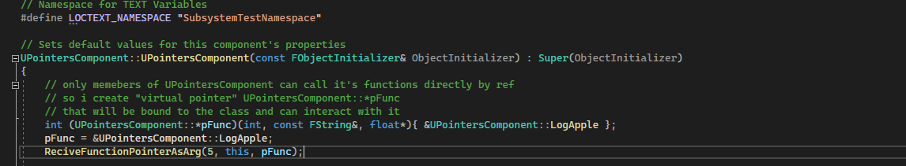
После компиляции мы увидим следующее:
```cpp
LogTemp: Warning: LogApple
LogTemp: Warning: Apples Count = 5, Const StringArg = Test String, FloatArg = 3.100000
LogTemp: Warning: Classic Pointer
LogTemp: Warning: Apples Returned = 6, Float Var Returned = 4.200000, Const StringVar Returned = Test String
```
Обратите внимание как меняет свое значение `float` параметр.
В функции `LogApple` я меняю его значение следующим образом:
```cpp
*Arg3 = *Arg3 + 1.1;
```
Поскольку значение данного аргумента передано по указателю, то оно изменяется и в исходной функции.
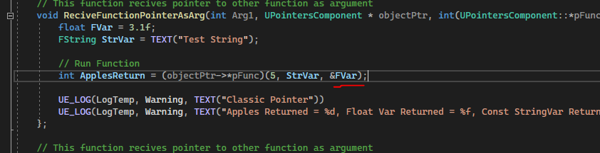
поэтому `FloatArg = 3.100000` после вызова функции по ссылке становится `Float Var Returned = 4.200000`.
### Указатели на функцию в стандартной библиотеке (STL)
В стандартной библиотеке с++ есть шаблон - `std::function` который представляет из себя умный указатель на функцию.
Формат:
```cpp
std::function<return_type(arg1, arg2)> = &function_name;
```
Где `return_type` это возвращаемый функцией тип, а `arg1, arg2` - аргументы функции.
Используется так:
```cpp
#include <functional> // std::function
#include <stdio.h> // printf
float test_calculations(int a, int b){
    return (float)(a+b) * 0.5f;
}
int main(){
    std::function<float(int, int)> test_function_pointer = &test_calculations;
 
    printf("called function template pointer value = %f",test_function_pointer(5,4));
    return 0;
}
```

Однако учтите, что шаблон `std::function` не может работать с классами напрямую. Дальше я рассмотрю как такое ограничение можно обойти через лямбды.
Такой код работать не будет:
```cpp
#include <functional> // std::function
#include <stdio.h> // printf
class ClassTest{
public:
    float test_calculations(int a, int b){
        return (float)(a+b) * 0.5f;
    }
};
int main(){
    std::function<float(int, int)> test_function_pointer = &ClassTest::test_calculations;
 
    printf("called function template pointer value = %f",test_function_pointer(5,4));
    return 0;
}
```
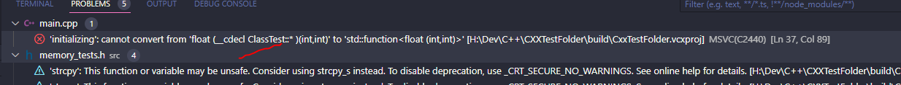
Причина проблем с указателями на методы классов состоит в том, что они привязаны к экземплярам классов. Если добавить к функции модификатор `static` код сработает.
```cpp
#include <functional> // std::function
#include <stdio.h> // printf
class ClassTest{
public:
    float test_calculations(int a, int b){
        return (float)(a+b) * 0.5f;
    }
};
int main(){
    std::function<float(int, int)> test_function_pointer = &ClassTest::test_calculations;
 
    printf("called function template pointer value = %f",test_function_pointer(5,4));
    return 0;
}
```
### Указатели на функцию в Unreal
Unreal предоставляет разработчику следующие шаблоны для реализации указателей на функцию:
`TFunction` - шаблонный класс, который хранит в себе копию лямбды или статичной функции. Под копией подразумевается прямое копирование памяти, в которой находится функция или лямбда. Это позволяет использовать переменные типа `TFunction` даже там, где нет доступа к пространству из которого лямда или функция были созданы.
`TUniqueFunction` - шаблонный класс, который хранит в себе копию вызываемой лямбды или статичной функции. То есть работает как `TFunction`. Однако отличие есть и  оно существенно. Сами экземпляры `TUniqueFunction` нельзя копировать. Это такой аналог `TUniquePtr` для указателей на функции. Экземпляр данного класса не получится передать в качестве аргумента на функцию, без использования `MoveTemp` или `std::move`.
`TFunctionRef` - шаблонный класс, который хранит в себе указатель на статичную функцию или лямбду. Область возможного вызова переменной типа `TFunctionRef` ограничена областью ее видимости. `TFunctionRef` в принципе нельзя передать в другие методы, если только переменная типа `TFunctionRef` не находится в глобальном пространстве.
Как и в случае с `std::function`, каждый из вышеуказанных шаблонных классов может ссылаться лишь на `static` функции классов. Чтобы обойти это ограничение можно использовать лямбду, про это читайте в главе про лямбды, ниже.
Формат каждого из шаблонных типов следующий:
Формат:
```cpp
TFunction<return_type(arg1, arg2)> = &function_name;
TUniqueFunction<return_type(arg1, arg2)> = &function_name;
TFunctionRef<return_type(arg1, arg2)> = &function_name;
```
Где `return_type` это возвращаемый функцией тип, а `arg1, arg2` - аргументы функции.

> _тем кто не понимает как в `с++` работают лямбды - ниже я написал целую главу, которая посвящена этому вопросу_

Рассмотрим примеры использования.
#### `TFunction`
Хранит в себе копию лямбды или статичного метода, позволяя вызывать их даже в том случае, если оригинальный объект, содаржащий их - уничтожен или не доступен.
```cpp
// .h
// This function is used to test function pointers to static functions
// This function is used to test function pointers to static methods
static int TestSummFunc(int a, int b, const FString& C) {
    UE_LOG(LogTemp, Warning, TEXT("C is %s, Summ IS %d"), *C, a+b);
    return a+b;
}
// This will test TFunction as arg
void TFunctionAsArgTest(TFunction<int(int, int, const FString&)> TestFuncPtr) {
    int Value = TestFuncPtr(5, 3, TEXT("TEST"));
    UE_LOG(LogTemp, Warning, TEXT("Value = %d"), Value);
}
// ..
// .cpp
// BeginPlay
// Create pointer
UE_LOG(LogTemp, Warning, TEXT(" === TFunction ==="));
// Create pointer
{
    TFunction<int(int, int, const FString&)> FuncPointer = &UPointersComponent::TestSummFunc;
    FuncPointer(5, 3, TEXT("TEST")); // Call pointer directly
    TFunctionAsArgTest(FuncPointer); // Pass pointer as arg
}
// With Lambda
{
    UE_LOG(LogTemp, Warning, TEXT(" === Lambda ==="));
    TFunction<int(int, int, const FString&)> LambdaPointer = [](int a, int b, const FString& C)->int {
        UE_LOG(LogTemp, Warning, TEXT("C is %s, Summ IS %d"), *C, a + b);
        return a + b;
    };
    LambdaPointer(5, 3, TEXT("TEST")); // Call lambda directly
    TFunctionAsArgTest(LambdaPointer); // Pass lambda as arg
}
```
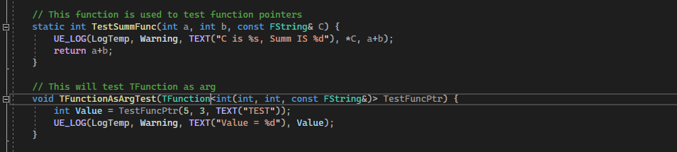
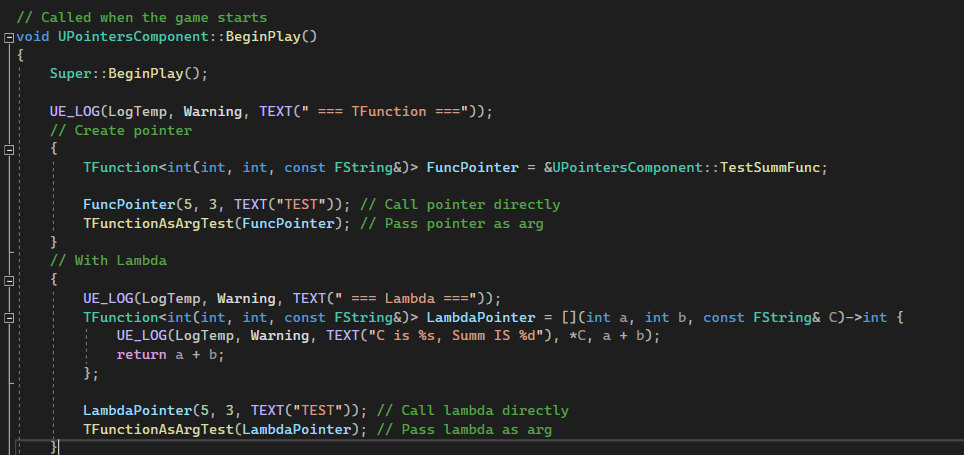
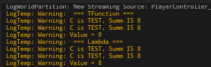
#### `TFunctionRef`
Представляет из себя альтернативу `TFunction`, просто хранит в себе указатель на статичный метод или лямбду. Если объект, в котором задана эта лямбда или метод - удалены, то указатель в `TFunctionRef` становится `nullptr`. Из-за этой особенности `TFunctionRef` не получится передать в другие методы, если только указатель не задан глобально.
```cpp
// .h
// This function is used to test function pointers
static int TestSummFunc(int a, int b, const FString& C) {
    UE_LOG(LogTemp, Warning, TEXT("C is %s, Summ IS %d"), *C, a+b);
    return a+b;
}
// This will test TFunctionRef as arg
void TFunctionAsArgTest(TFunctionRef<int(int, int, const FString&)> TestFuncPtr) {
    int Value = TestFuncPtr(5, 3, TEXT("TEST"));
    UE_LOG(LogTemp, Warning, TEXT("Value = %d"), Value);
}
// ..
// .cpp
// BeginPlay
UE_LOG(LogTemp, Warning, TEXT(" === TFunctionRef ==="));
// Create pointer
{
    TFunctionRef<int(int, int, const FString&)> FuncPointer = &UPointersComponent::TestSummFunc;
    FuncPointer(5, 3, TEXT("TEST")); // Call pointer directly
}
// With Lambda
{
    UE_LOG(LogTemp, Warning, TEXT(" === Lambda ==="));
    TFunctionRef<int(int, int, const FString&)> LambdaPointer = [](int a, int b, const FString& C)->int {
        UE_LOG(LogTemp, Warning, TEXT("C is %s, Summ IS %d"), *C, a + b);
        return a + b;
    };
    LambdaPointer(5, 3, TEXT("TEST")); // Call lambda directly
}
```
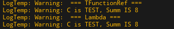
#### `TUniqueFunction`
Функция с отключенной возможностью копирования. В памяти может быть лишь по 1 экземпляру этого типа.
Передать `TUniqueFunction` в качестве аргумента функции обычным способом у нас не получится.
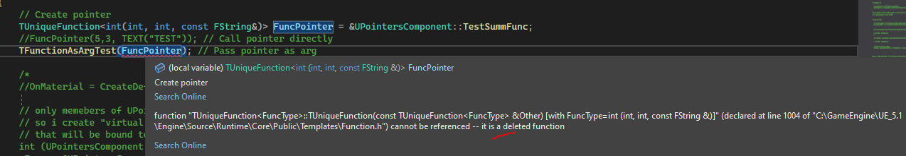
Придется использовать `MoveTemp`. Просто оберните вызов при передаче.
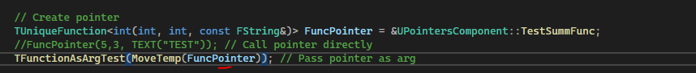
Общий код:
```cpp
// .h
// This function is used to test function pointers
static int TestSummFunc(int a, int b, const FString& C) {
    UE_LOG(LogTemp, Warning, TEXT("C is %s, Summ IS %d"), *C, a+b);
    return a+b;
}
// This will test TUniqueFunction as arg
void TFunctionAsArgTest(TUniqueFunction<int(int, int, const FString&)> TestFuncPtr) {
    int Value = TestFuncPtr(5, 3, TEXT("TEST"));
    UE_LOG(LogTemp, Warning, TEXT("Value = %d"), Value);
}
// ..
// .cpp
// BeginPlay
UE_LOG(LogTemp, Warning, TEXT(" === TUniqueFunction ==="));
// Create pointer
{
    TUniqueFunction<int(int, int, const FString&)> FuncPointer = &UPointersComponent::TestSummFunc;
    FuncPointer(5,3, TEXT("TEST")); // Call pointer directly
    TFunctionAsArgTest(MoveTemp(FuncPointer)); // Pass pointer as arg
}
// With Lambda
{
    UE_LOG(LogTemp, Warning, TEXT(" === Lambda ==="));
    TUniqueFunction<int(int, int, const FString&)> LambdaPointer = [](int a, int b, const FString& C)->int{
        UE_LOG(LogTemp, Warning, TEXT("C is %s, Summ IS %d"), *C, a + b);
        return a + b;
    };
    LambdaPointer(5, 3, TEXT("TEST")); // Call lambda directly
    TFunctionAsArgTest(MoveTemp(LambdaPointer)); // Pass lambda as arg
}
```
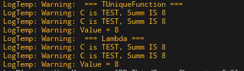
## Лямбды в С++
Лямбды в `с++` представляют собой оператор, который разворачивается во вложенную структуру т.н. функтор. Главное преимущество лямбд состоит универсальности.
В последующих статьях я очень часто использую лямбды (и вам рекомендую), поэтому, пожалуйста, прочитайте эту главу.
#### Формат лямбда-выражения
Давайте рассмотрим формат лямбда-выражения.
```cpp
auto lambda = [спецификаторы](аргументы) mutable -> возвращаемый_тип { тело_лямбды; return возвращаемый_тип; }
```
Технически лямбды представляют собой оператор препроцессора, который разворачивает указанную выше конструкцию в функтор примерно следующего вида:
```cpp
struct LambdaName{
    auto operator()(Args){
        // ваши вычисления
    }
}
```
Таким образом лямбда не более чем оператор препроцессора, а не полноценный рунтайм оператор языка. Это важно понимать, потому что при передаче лямбды по указателю возникают противоречия между декларируемым определением (анонимная функция) и фактическим поведением (как объект). Потому что лямбда в `с++` - это никакая не анонимная функция (в чем нас уверяют некоторые интернет-туториалы). Лямбда - это генерируемый функтор, по сути заплатка над старым ядром языка.
#### Спецификаторы
Рассмотрим массив `спецификаторы` (lambda captures). Он используется для передачи доступа к переменным из функции или класса в лямбду.
Например если сделать так:
```cpp
int a = 5;
auto lambda2 = []() -> void { a = 7; };
```
То мы увидим следующую ошибку: `an enclosing-function local variable cannot be refrenced in a lambda body unless it is in the caputre list`.
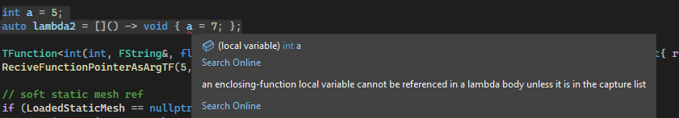
Но если в список `[]` передать по ссылке переменную `a` - ошибка исчезнет.
```cpp
int a = 5;
auto lambda2 = [&a]() -> void { a = 7; };
```
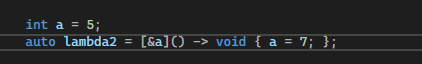
При этом значение не обязательно передавать по ссылке именно так. Мы можем заставить все переменные, переданные внутрь лямбды передаваться по ссылке используя ключевое слово `mutable`. В основном этот трюк используется вместе с многопоточностью.
```cpp
int a = 5;
auto lambda2 = [a]() mutable -> void { a = 7; };
```
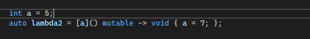
Согласитесь, передавать каждую переменную из функции в лямбду поштучно - не очень практично.
С++ предоставляет нам ряд спецификаторов, которыми можно пользоваться, чтобы упростить себе жизнь.
`&` - данный спецификатор позволит использовать внутри тела лямбды все переменные, которые были заданы в функции. При этом переменные будут передаваться в лямбду "по ссылке", то есть их можно будет изменить в лямбде.
```cpp
int a = 5;
auto lambda2 = [&]() -> void { a = 7; };
```
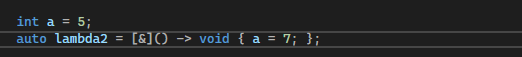
`=` - данный  спецификатор передает в тело переменные из функции "по значению". Переданные переменные нельзя будет изменить из тела лямбды. Можно будет лишь получить их значения.
Поэтому такой код работать не будет:
```cpp
int a = 5;
auto lambda2 = [=]() -> void { a = 7; };
```
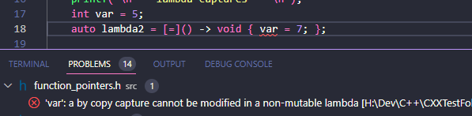
А вот такой код работать будет, потому что тут я не пытаюсь изменить переменную `a`, которая передается "по значению":
```cpp
int a = 5;
int b = 2;
auto lambda2 = [=, &b]() -> void {
    int c = a + b;
    b = 5;
};
```
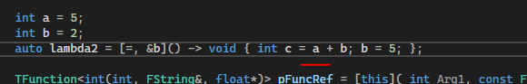
Однако, это ограничение легко обходится, благодаря ключевому слову `mutable`.
```cpp
int num = 5;
printf("num = %i\n", num); // 5
[=]() mutable -> void {
    num = 7; // now we can change variable value in local space
    printf("num = %i\n", num); // 7
}(); // this lambda will be self-executed
printf("num = %i\n", num); // but this won't affect lambda value outside
```
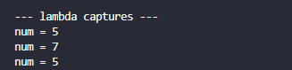
Как вы видите из этого примера - `mutable` спецификатор не выводит значение переменной за пределы лямбды.
#### Псевдонимы спецификаторов
Через спецификаторы можно здавать псевдонимы для тех или иных переменных используя следующий синтаксис:
```cpp
[alias=variable]() mutable -> void{}
```
Например так.
```cpp
int n = 7;
auto l = [var = n]() mutable ->void{
    printf("var = %i", var);
};
l();
```

Создавать переменную псевдонима отдельно от тела лямбды - не надо, она генерируется автоматически.
Псевдоним переменной получает данные "по значению", а значит - его не поулчится изменить в теле лямбды, если не использовать спецификатор `mutable`.
То есть такой код не сработает:
```cpp
int n = 7;
auto l = [var = n]() ->void{
    var = 2;
    printf("var = %i", var);
};
l();
```
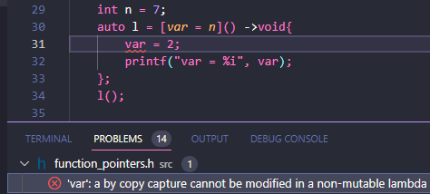
Зато  с `mutable` лямбдой все работает, правда значение псевдонима, измененное в теле лямбды, не отражается на оригинальном значении переменной.
```cpp
int n = 7;
printf("n = %i\n", n); // 7
auto l = [var = n]() mutable->void{
    var = 2;
    printf("var = %i\n", var); // 2
};
l();
printf("n = %i\n", n); // still 7
```
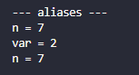
Используя псевдонимы можно работать с `move` семантикой внутри лямбды.
Я еще не рассматривал эту тему, но если вы знаете, о чем речь, то вот так можно передать переменную `a` в лямбду через `std::move`:
```cpp
int a = 7;
printf("a = %i\n", a); // 7
[var = std::move(a)]() mutable ->void{
    var = 3;
    printf("var = %i\n", var);
}();
printf("a = %i\n", a); // 7
```
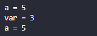
Правда на значениях применение `move`  семантики никак не сказыается. Потому что у стандартных типов, вроде `int`, `char` и так далее - нет `move` конструктора и оператора присваивания.
А вот у `std::string` он есть, давайте проверим.
```cpp
std::string str = "in";
printf("str = %s\n", str.c_str()); // "in"
str = [var = std::move(str)]() mutable -> std::string{
    var = "out";
    printf("var = %s\n", var.c_str()); // "out"
    return std::move(var);
}(); // lambda will be self-executed, thanks to the ending '()', and it's return value will be put in to str variable
printf("str = %s\n", str.c_str()); // "out"
```
#### Автозапуск лямбды
В приведенном выше коде я использовал т.н. автозапуск лямбды.
Если прописать `()` после лямбды - она запустится  автоматически.
```cpp
int a = 7;
[var = std::move(a)]()->void{
    printf("var = %i", var);
}();
```
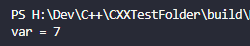
Можно даже вернуть из лямбды значение или передать в нее аргументы таким образом.
```cpp
int summ = [](int a, int b)->int{
    return a+b;
}(2, 5); // this will run lambda with 2 arguments: 3 and 5
printf("summ = %i\n", summ);
```

#### Обращение к методам класса из тела лямбды
Теперь рассмотрим обращение к методам класса, на примере `LogApple`.
Если обратиться к этому методу не используя спецификаторы, то будет ошибка: `the enclosing-function 'this' cannot be referenced in a lambda body unless it is in the capture list`.
```cpp
auto lambda2 = []() -> void {
        float FVal = 3.3f;
        LogApple(5, TEXT("123"), &FVal);
    };
```
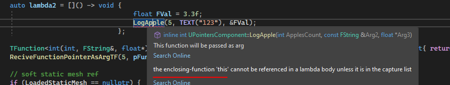
Текст ошибки прямо намекает, что параметр `this` должен находиться в массиве спецификаторов `capture list`.
Если его добавить - ошибка исчезнет.
```cpp
auto lambda2 = [this]() -> void {
        float FVal = 3.3f;
        LogApple(5, TEXT("123"), &FVal);
    };
```
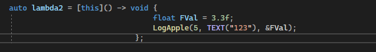
Рассмотрим спецификаторы классов:
`this` - данный спецификатор передает класс внутрь лямбды по указателю, то есть мы сможем менять его внутренние значения и вызывать методы.
Введем, для наглядности, дополнительную переменную `LabdaCaptureTest`. Да, это опечатка, заметил уже когда закончил статью.
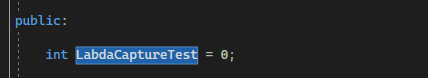
```cpp
auto lambda2 = [this]() -> void {
        float FVal = 3.3f;
        LogApple(5, TEXT("123"), &FVal);
        LabdaCaptureTest = 5;
    };
```
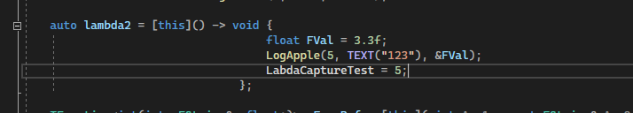
`*this` - данный спецификатор передает класс внутрь лямбды по "значению". Это значит, что мы не сможем изменить поля класса внутри лямбды. Так-же мы не сможем вызвать из тела лямбды другие методы класса. Мы сможем лишь получить значение полей и все.
Поэтому предыдущий код с этим спецификатором выдаст нам ошибку: `the object has type qualifiers that are not compatible ...`.
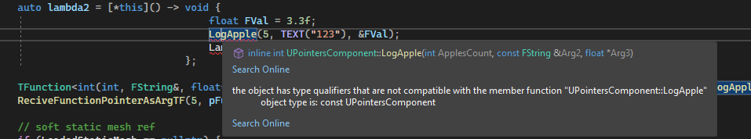
Зато следующий код будет работать:
```cpp
auto lambda2 = [*this]() -> void {
        int C = LambdaCaptureTest + 5;
    };
```
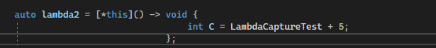
Теперь, ознакомившись с лямбдами, мы можем рассмотреть их передачу в функции и  методы.
#### Вызов метода класса из тела лямбды
Для начала подготовим небольшой код, который будет передавать лямбда.
Воспользуемся методом `UPointersComponent::LogApple`.
```cpp
// This function will be passed as arg
int UPointersComponent::LogApple(int ApplesCount, const FString& Arg2, float *Arg3) {
    UE_LOG(LogTemp, Warning, TEXT("LogApple"))
    // Note* FString can't be passed to UE_LOG directly, it needs wchar, so convert it via adding * before string arg - *Arg2
    UE_LOG(LogTemp, Warning, TEXT("Apples Count = %d, Const StringArg = %s, FloatArg = %f"), ApplesCount, *Arg2, *Arg3)
    // change refrenced variables to test if changes are passed
    ApplesCount = ApplesCount + 1;
    *Arg3 = *Arg3 + 1.1;
    return ApplesCount;
};
```
Поместим вызов метода `UPointersComponent::LogApple` внутрь лямбды, для дальнейшего тестирования.
Чтобы вызывать метод класса из тела лямбды, надо передать в лямбду, так или иначе, указатель на оригинальный класс.
Сделать это можно двумя способами:
```cpp
auto lambda1 = [this](int Arg1, const FString& Arg2, float* Arg3) -> int{
    return LogApple(Arg1, Arg2, Arg3);
};
auto lambda = [](int Arg1, const FString& Arg2, float* Arg3, UPointersComponent *SrcClass) -> int{
    return SrcClass->LogApple(Arg1, Arg2, Arg3);
};
```
Первый способ - `auto lambda1 = [this](int Arg1, const FString& Arg2, float* Arg3) -> int{ return LogApple(Arg1, Arg2, Arg3); };` использует спецификатор `[this]`.
Недостаток данного способа создания лямбды  следующий  - эту лямбду нельзя передать в функцию по указателю стандартными средствами.
Зато данная лямбда куда короче второй, а ее код куда более лаконичный.
Второй способ - `auto lambda = [](int Arg1, const FString& Arg2, float* Arg3, UPointersComponent *SrcClass) -> int{ return SrcClass->LogApple(Arg1, Arg2, Arg3); };`. Эта лямбда не использует захват пространства и класса, но она длиннее, из-за необходимости ввода еще одного аргумента - `UPointersComponent *SrcClass`. Ведь очевидно, что без этого аргумента вызвать метод `LogApple` внутри лямбды не получится.
Зато данная лямбда может быть преобразована в указатель на функцию.
Именно ее мы и будем передавать.
#### Передача лямбды в функцию по указателю
Функция, в которую будет передаваться лямбда выглядит так:
```cpp
// This function recives pointer to other function as argument
void ReciveFunctionPointerAsArgLambda(int Arg1, UPointersComponent* objectPtr, int(*pFunc)(int, const FString&, float*, UPointersComponent* SrcClass)
) {
    float FVar = 3.1f;
    FString StrVar = TEXT("Test String");
    // Run Function
    int ApplesReturn = (*pFunc)(5, StrVar, &FVar, objectPtr);
    UE_LOG(LogTemp, Warning, TEXT("Lambda in function"))
    UE_LOG(LogTemp, Warning, TEXT("Apples Returned = %d, Float Var Returned = %f, Const StringVar Returned = %s"), ApplesReturn, FVar, *StrVar)
};
```
Как вы видите, аргумент по которому передается лямбда - `int(*pFunc)(int, const FString&, float*, UPointersComponent* SrcClass)` - являет собой обычный указатель на функцию. `С++` автоматически преобразовывает лямбду без модификаторов в указатель на функцию.
Вызывается лямбда тоже классическим способом - `int ApplesReturn = (*pFunc)(5, StrVar, &FVar, objectPtr);`.
Код, передающий лямбду, выглядит так:
```cpp
auto lambda = [](int Arg1, const FString& Arg2, float* Arg3, UPointersComponent *SrcClass) -> int{ return SrcClass->LogApple(Arg1, Arg2, Arg3); };
ReciveFunctionPointerAsArgLambda(7, this, lambda);
```
Я добавил его в конструктор класса `UPointersComponent`
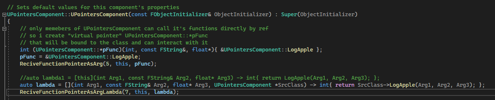
Если сейчас запустить выполнение этого кода, мы увидим следующий результат:
```cpp
LogTemp: Warning: LogApple
LogTemp: Warning: Apples Count = 5, Const StringArg = Test String, FloatArg = 3.100000
LogTemp: Warning: Lambda in function
LogTemp: Warning: Apples Returned = 6, Float Var Returned = 4.200000, Const StringVar Returned = Test String
```
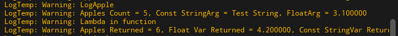
Как вы видите, значение переданное по ссылке в лямбду (это `float`) изменяется, лямбда прекрасно работает.
## Лямбды в `Unreal Engine`
Согласитесь, задавать аргумент функции с нужной лямбдой таким способом:
```cpp
int(*pFunc)(int, const FString&, float*, UPointersComponent* SrcClass)
```
крайне неудобно.
`Unreal Engine` предлагает разработчику ряд шаблонов, позволяющих ссылаться на те или иные лямбды или даже `blueprint` функции гораздо проще.
Это `TFunction`, `TUniqueFunction` и `TFunctionRef`.
Вот так, например, в `TFunction` можно поместить лямбду, вызывающую метод `LogApple`:
```cpp
TFunction<int(int, FString&, float*)> pTFunc = [this]( int Arg1, const FString& Arg2, float* Arg3) -> int{ return LogApple(Arg1, Arg2, Arg3); };
TFunctionRef<int(int, FString&, float*)> pTFuncRef = [this]( int Arg1, const FString& Arg2, float* Arg3) -> int{ return LogApple(Arg1, Arg2, Arg3); };
```
Обратите внимание на тот факт, что в передаваемых таким образом лямбдах Можно использовать спецификаторы. Тут я использую `[this]`. Это очень сильно упрощает работу.
### Лямбды как аргументы функций в `Unreal`
Рассмотрим функцию, принимающую `TFunction` как аргумент.
```cpp
// This function recives pointer to other function as argument
void ReciveFunctionPointerAsArgTF(int Arg1, TFunction<int(int, FString&, float*)> pFunc) {
    float FVar = 3.3f;
    FString StrVar = TEXT("Test String");
    // Run Function
    int ApplesReturn = pFunc(5, StrVar, &FVar);
    UE_LOG(LogTemp, Warning, TEXT("TFunction Pointer"))
    UE_LOG(LogTemp, Warning, TEXT("Apples Returned = %d, Float Var Returned = %f, Const StringVar Returned = %s"), ApplesReturn, FVar, *StrVar)
};
```
Данная функция выглядит в разы проще, чем примеры из передачи лямбд по указателю, которые я приводил выше.
Чтобы вызвать переданную в `TFunction` лямбду я использую такой код:
```cpp
// Run Function
int ApplesReturn = pFunc(5, StrVar, &FVar);
```
Просто сравните этот метод с теми, что мы писали ранее. Он куда короче.
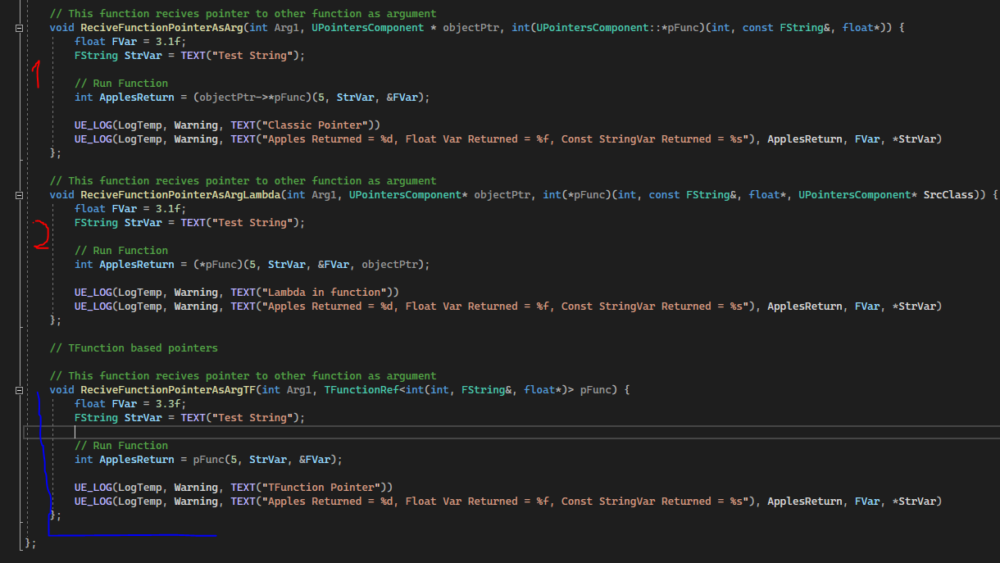
Вызов метода для тестирования я провожу из конструктора нашего `UPointersComponent`.
Код для передачи лямбды в функцию выглядит так:
```cpp
TFunction<int(int, FString&, float*)> pTFunc = [this]( int Arg1, const FString& Arg2, float* Arg3) -> int{ return LogApple(Arg1, Arg2, Arg3); };
//TFunctionRef<int(int, FString&, float*)> pTFuncRef = [this]( int Arg1, const FString& Arg2, float* Arg3) -> int{ return LogApple(Arg1, Arg2, Arg3); };
ReciveFunctionPointerAsArgTF(5, pTFunc);
```


К стати говоря, использовать `TFunction` для передачи лямбды - не самый оптимальный способ работы. Дело в том, что данный шаблон, при передаче его в функцию - копируется. И вот, вместо одной лямбды в памяти - у вас две лямбды в памяти. Это не оптимальный подход. Куда логичнее было бы использовать `TUniqueFunction` и `MoveTemp`.
Но для начала разберемся, что это за функции такие.
### Пример использования лямбд для сортировки массива
В качестве сортируемого элемента используем структуру.
Задаем в `PointersComponent.h`, в самом начале, такую структуру:
```cpp
// .h
// Struct to test array sorting
struct FSortTests {
	int Number = 0;
	FSortTests(int InNumber = 0) {
		Number = InNumber;
	}
};
```
Она содержит всего одно поле - `Number`, по которому и будет проводиться сортировка.
Теперь нужен массив типа `TArray` и заполнение его произвольными структурами.
```cpp
// Sort TArray of structs using lambda
TArray<FSortTests> StructsArray;
// add some items to array
StructsArray.Add(FSortTests(1));
StructsArray.Add(FSortTests(3));
StructsArray.Add(FSortTests(4));
StructsArray.Add(FSortTests(11));
StructsArray.Add(FSortTests(17));
StructsArray.Add(FSortTests(28));
StructsArray.Add(FSortTests(4));
StructsArray.Add(FSortTests(2));
StructsArray.Add(FSortTests(5));
StructsArray.Add(FSortTests(9));
StructsArray.Add(FSortTests(100));
```
Для сортировки у класса `TArray` есть метод `Sort`, который принимает лямбду.
Код вызова данного метода выглядит так:
```cpp
StructsArray.Sort([](FSortTests Item1, FSortTests Item2) -> bool {
    // compare
    return Item1.Number < Item2.Number;
});
```
Для  сортировки по возрастанию лямбда должна возвращать `true` если первый аргумент меньше второго, иначе - `false`.
Общий код выглядит так:
```cpp
// Sort TArray of structs using lambda
TArray<FSortTests> StructsArray;
// add some items to array
StructsArray.Add(FSortTests(1));
StructsArray.Add(FSortTests(3));
StructsArray.Add(FSortTests(4));
StructsArray.Add(FSortTests(11));
StructsArray.Add(FSortTests(17));
StructsArray.Add(FSortTests(28));
StructsArray.Add(FSortTests(4));
StructsArray.Add(FSortTests(2));
StructsArray.Add(FSortTests(5));
StructsArray.Add(FSortTests(9));
StructsArray.Add(FSortTests(100));
// sorting
StructsArray.Sort([](FSortTests Item1, FSortTests Item2) -> bool {
    // compare
    return Item1.Number < Item2.Number;
});
// print sorted values to log
for (FSortTests Item : StructsArray) {
    UE_LOG(LogTemp, Warning, TEXT("%i"), Item.Number)
}
```
Я добавил его в конструктор класса `UPointersComponent`.

После компиляции и запуска, в консоли будет напечатано следующее:
```cpp
LogTemp: Warning: 1
LogTemp: Warning: 2
LogTemp: Warning: 3
LogTemp: Warning: 4
LogTemp: Warning: 4
LogTemp: Warning: 5
LogTemp: Warning: 9
LogTemp: Warning: 11
LogTemp: Warning: 17
LogTemp: Warning: 28
LogTemp: Warning: 100
```

Как вы видите - сортировка сработала.
Именно так рекомендуется сортировать объекты внутри игры. Есть, конечно, возможность сделать пузырьковую сортировку чисто на `blueprint`, но работать она будет ужасно медленно.
А так будет выглядеть сортировка массива с `Actor'ами` по их дистанции до персонажа:
```cpp
FVector3d PlayerLoc = GetOwner()->GetActorLocation();
Array.Sort([PlayerLoc] (const AActor* A, const AActor* B) {
    return FVector::DistSquared(PlayerLoc, A->GetActorLocation()) < FVector::DistSquared(PlayerLoc, B->GetActorLocation());
});
```
### Пузырьковая сортировка на blueprint
Раз уж мы затронули тему сортировки, замечу, что в `blueprint` делать ее не рекомендуется. Но если все-же без этого никак не обойтись (например вы пишете `blueprint` ассет на продажу и не можете использовать там `с++` код) то вот пример реализации такого рода сортировки:
Это мой старый код, выложенный на [форуме](https://forums.unrealengine.com/t/help-with-sorting-an-array-in-a-blueprint/341376/4?u=alexanderst).


## Загрузка ассетов из `TSoftObjectPtr` и генерация компонентов
Давайте протестируем загрузку данных из `TSoftObjectPtr` в генерируемый в рантайме компонент.
Для начала создадим переменную `TSoftObjectPtr`, в которой будет храниться указатель, на загружаемый ассет. Загружать будем `UStaticMesh`.
```cpp
// Static mesh ref that will be loaded into spawned component
UPROPERTY(BlueprintReadWrite, EditAnywhere, Category = "PointerLoadingTest")
TSoftObjectPtr<UStaticMesh> LoadedStaticMesh = nullptr;
```
Зададим данной переменной значение "по умолчанию" через конструктор.
В качестве меша будем использовать уже приевшийся нам синий кубик. Щелкаем по нему правой кнопкой мыши и выбираем пункт `Copy Refrence`.

Загружаем в конструкторе данный рефренс в переменную, если ее значение равно `nullptr`.
```cpp
// soft static mesh ref
if (LoadedStaticMesh == nullptr) {
    FString StringAssetPath = TEXT("/Script/Engine.StaticMesh'/Game/LevelPrototyping/Meshes/SM_ChamferCube.SM_ChamferCube'");
    LoadedStaticMesh = UKismetSystemLibrary::MakeSoftObjectPath(StringAssetPath);
}
```

Если теперь скомпилировать код, то в компоненте `PointersComponent` мы увидим переменную, со ссылкой на куб.

Теперь давайте загрузим этот куб в `UStaticMeshComponent` внутри нашего персонажа.
Для этих целей нам потребуется функция, создающая озвученный компонент, а так-же функицонал асинхронного вызова этой функции.
Добавляем в `.h` файл функцию, которая будет спавнить компонент, а так-же переменную типа `TObjectPtr`, в которую будет помещена ссылка на созданный компонент.
```cpp
// Spawned Static Mesh Component refrence
TObjectPtr<UStaticMeshComponent> StaticComponent;
// Spawns Static Mesh Component and attaches it to character
void SpawnStaticMeshComponent();
```
И пишем реализацию.
```cpp
// Spawns Static Mesh Component and attaches it to character
void UPointersComponent::SpawnStaticMeshComponent()
{
	TWeakObjectPtr<AActor> OwnerActor = GetOwner();
	// component name
	FName NewMeshCompName = TEXT("CustomStaticComponent");
	// create new static mesh object
	StaticComponent = NewObject<UStaticMeshComponent>(this, UStaticMeshComponent::StaticClass(), NewMeshCompName, RF_NoFlags, nullptr);
	StaticComponent->SetupAttachment(OwnerActor->GetRootComponent()); // Attach to actor's root
	StaticComponent->RegisterComponent();
	OwnerActor->AddInstanceComponent(StaticComponent); //without this, component wont show up in properties
}
```
Давайте протестируем работу нашей функции, добавив ее вызов в BeginPlay.

Если сейчас запустить игру, в нашем персонаже сгенерируется компонент с именем `CustomStaticComponent`.

Правда пока он пуст.
Теперь зададим компоненту меш, который приведен в указателе `LoadedStaticMesh`, который, если вы помните, имеет тип `TSoftObjectPtr`.
```cpp
SpawnStaticMeshComponent();
if (StaticComponent != nullptr && !LoadedStaticMesh.IsNull()) {
    TWeakObjectPtr<UStaticMesh> SMesh = LoadedStaticMesh.LoadSynchronous();
    StaticComponent->SetStaticMesh(SMesh.Get());
}
```
Тут я сделал загрузку меша "синхронной" используя метод `.LoadSynchronous();`. В нашем случае использование такого метода не вызовет никаких проблем, поскольку мы загружаем простой куб. Но если бы это был более объемный ассет, с миллионом полигонов, вероятно могли бы возникнуть сложности.
Проверим работает ли код.

## Генерация SkeletalMesh компонента с копированием настроек
Раз уж я затронул тему генерации компонентов из кода для `StaticMesh`, давайте рассмотрим и генерацию `SkeletalMesh`, вместе с дублированием настроек (есть и такая возможность). Unreal предоставляет довольно гибкий функционал для шаблона `NewObject`.
Сам компонент генерируется так:
```cpp
// Spawn skeletal mesh component on owning character and copy parameters of character->mesh to it
void UPointersComponent::SpawnSkeletalMeshComponent()
{
	TWeakObjectPtr<AActor> OwnerActor = GetOwner();
	FName NewMeshCompName = TEXT("CustomSkeletalComponent");
	TObjectPtr<USkeletalMeshComponent> pNewSkeletalMeshComponent = NewObject<USkeletalMeshComponent>(this, USkeletalMeshComponent::StaticClass(), NewMeshCompName, RF_NoFlags, nullptr);
	pNewSkeletalMeshComponent->SetupAttachment(OwnerActor->GetRootComponent()); // Attach to actor's root
	pNewSkeletalMeshComponent->RegisterComponent();
	OwnerActor->AddInstanceComponent(pNewSkeletalMeshComponent); //without this, component wont show up in properties
}
```
Если сейчас добавить вызов этой функции в BeginPlay и потом скомпилировать код то мы увидим следующее:

Компонент с именем `CustomSkeletalComponent` генерируется, однако он пуст.
Давайте копируем в этот компонент содержимое компонента Mesh нашего `BP_ThirdPresonCharacter'а`.
Вместе с материалами, настройками AnimGraph и прочим.

Чтобы это провернуть нам надо для начала получить указатель на этот самый `Mesh`.
Для этого придется провести ряд приведений типов, через `Cast`.
```cpp
// cast owner to character class
TWeakObjectPtr<ACharacter> OwningCharacter = Cast<ACharacter>(OwnerActor);
// take refrence of character's Mesh component
TWeakObjectPtr<UObject> FoundSkeletalMeshComponent = nullptr;
if (OwningCharacter != nullptr)
{
    FoundSkeletalMeshComponent = Cast<UObject>( OwningCharacter->GetMesh() );
}
```
> Мы не можем сделать `GetMesh()`, не приводя тип `AActor` к `ACharacter`.
Теперь мы можем скормить значение переменной `FoundSkeletalMeshComponent` в наш шаблон `NewObject`, в качестве параметра Template.

Итоговый код будет таким:
```cpp
// Spawn skeletal mesh component on owning character and copy parameters of character->mesh to it
void UPointersComponent::SpawnSkeletalMeshComponent()
{
	TWeakObjectPtr<AActor> OwnerActor = GetOwner();
	FName NewMeshCompName = TEXT("CustomSkeletalComponent");
	// cast owner to character class
	TWeakObjectPtr<ACharacter> OwningCharacter = Cast<ACharacter>(OwnerActor);
	// copy properties of character's Skeletal Mesh component into new spawned component
	// take refrence of character's Mesh component
	TWeakObjectPtr<UObject> FoundSkeletalMeshComponent = nullptr;
	if (OwningCharacter != nullptr)
	{
		FoundSkeletalMeshComponent = Cast<UObject>( OwningCharacter->GetMesh() );
	}
	//take note of last argument here, it almost makes a perfect copy of FoundSkeletalMeshComponent, including scale and USkeletalMesh
	TObjectPtr<USkeletalMeshComponent> pNewSkeletalMeshComponent = NewObject<USkeletalMeshComponent>(this, USkeletalMeshComponent::StaticClass(), NewMeshCompName, RF_NoFlags, FoundSkeletalMeshComponent.Get());
	pNewSkeletalMeshComponent->SetupAttachment(OwnerActor->GetRootComponent()); // Attach to actor's root
	pNewSkeletalMeshComponent->RegisterComponent();
	//pNewSkeletalMeshComponent->AttachToComponent(args) this will crash the game, and its redundant as RegisterComponent does an AttachToComponent using data from SetupAttachment!!!
	OwnerActor->AddInstanceComponent(pNewSkeletalMeshComponent); //without this, component wont show up in properties
}
```
И если все скомпилировать, а потом запустить, мы получим компонент `CustomSkeletalComponent`, который копирует все параметры компонента `Mesh`.
