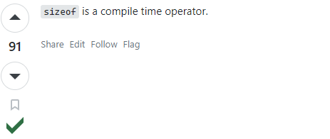
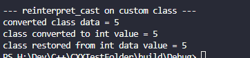
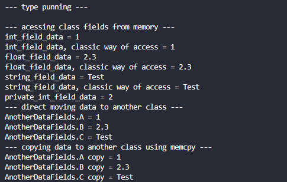

# Возможности современного c++
Движок `Unreal Engine` разрабатывается профессиональными программистами очень высокого уровня. Они прекрасно владеют языком `с++` и его возможностями. Многие из них учились в лучших университетах мира и общались с лучшими специалистами в своем классе. Врятли то-же самое можно сказать о новичках, желающих программировать под `Unreal`. Для них эта статья может стать очень хорошим подспорьем в работе.
Когда я сам учился программировать под `Unreal Engine`, мне очень сильно помогли статьи с википедии, которые я рекомендую к ознакомлению каждому читателю.
[Википедия, возможности с++11.](https://ru.wikipedia.org/wiki/C%2B%2B11)
[Википедия, возможности с++14.](https://ru.wikipedia.org/wiki/C%2B%2B14)
[Википедия, возможности с++17.](https://ru.wikipedia.org/wiki/C%2B%2B17)
На википедии приведены все возможности современного `с++` от версии к версии. К сожалению описаны они там крайне скупо и без подробностей, но это все еще крайне хороший источник информации.
Несмотря на то, что моя книга посвящена `Unreal`, в этой статье я буду работать в обычном `hello world` приложении, просто потому что так удобнее проводить тесты.
Большая часть тем, которые я рассматриваю в этой статье, относится к одной большой категории, под названием "метапрограммирование".
##Препроцессор
Компилятор `с++` поставляется вместе с препроцессором, который обрабатывает исходный код программы до того, как произойдет компиляция.
Директивы вида `#include`, `#define`, а так-же директивы шаблонов обрабатываются препроцессором. Некоторые операторы, например `sizeof` тоже обрабатываются препроцессором и заменяются на статичное  число. Об этом я знал всегда, но решил [проверить](https://stackoverflow.com/a/2615205/2574125).

Таким образом `с++` код делится на две категории - `runtime` и `compile time`.
`runtime` код срабатывает в момент работы уже скомпилированного приложения, а код `compile time` срабатывает в момент компиляции.
Операторы вида `decltype, auto, constexpr` и многие другие, например шаблон `tuple`, появившиеся в современном `с++` - это операторы `compile time`.
Автоматическое определение типа через `auto` заменяется препроцессором на вполне конкретный тип. Так-же происходит и с `constexpr` переменными, шаблонными функциями и кортежами.
Очевидно, что шаблонная функция разделяется препроцессором на столько функций, сколько перегрузок требуется системе.
Почти все нововведения (а может и вообще все) современного с++ относятся к раширению возможностей препроцессора. Основное ядро языка `с++` практически не меняется с `98` года.
Зная этот простой факт, вы очень легко сможете понять операторы, с которыми мы столкнемся в этой статье. Потому что почти все они обрабатываются в `compile time`.
##Области действия внутри функций
В с++ области действия переменных внутри функций и методов отделяются кавычками `{}`.
Объекты, созданные в одной области - не доступны из других. Это позволяет, в рамках одной и той-же функции, иметь несколько переменных с одним и тем-же названием.
Я довольно часто пользуюсь этим трюком, а потому не хотел бы, чтобы он вас смущал.
```cpp
int main(){
    {
        int a = 0;
        std::cout<< "a = " << a << "\n";
    }
    {
        int a = 1;
        std::cout<< "a = " << a << "\n";
    }
    {
        int a = 2;
        std::cout<< "a = " << a << "\n";
    }
    return 0;
}
```

В приведенном фрагменте кода используется три переменные с названием `a`.
##Пространства имен
Пространства имен задаются ключевым словом `namespace` и являются блоками функций, переменных и классов, которые объединены общей областью действия`{}`.

Формат:
```cpp
namespace NAME{}
```
Пространство имен может быть вложенным, но оно всегда должно задаваться в глобальной области действия. Пространства имен нельзя вкладывать в функции.
Для использование пространства имен используется тот-же оператор, который дает доступ к `static` методам - `::`.
```cpp
namespace DG{ // Demo Namespace
    int a = 5;
    int int_summ(const int& a, const int& b){
        return a+b;
    }
    namespace NESTED{ // Nested Namespace
        int a = 3;
        int mult(const int& a, const int& b){
            return a*b;
        }
    }
};
int main(){
    std::cout<< "DG::a = " << DG::a <<"\n";
    std::cout<< "DG::int_summ(3, 5) = " << DG::int_summ(3, 5) <<"\n";
    std::cout<< "DG::NESTED::a = " << DG::a <<"\n";
    std::cout<< "DG::NESTED::mult(3, 5) = " << DG::NESTED::mult(3, 5) <<"\n";
    return 0;
}
```

Пространства имен рекомендуют использовать вместо синглтонов.
Синглтон представляет из себя не более чем глобальный объект, объединяющий изменяющиеся тем или иным образом данные. Абсолютно ту-же самую задачу может выполнять и пространство имен, причем без необходимости создания отдельного объекта, а следовательно - без проблем, связанных с необходимостью его удалять, очищая память.
```cpp
namespace SGRepl{ // namespace, used like singleton
    int summ = 0;
    int add_summ(int value){
        summ += value;
        return summ;
    }
    int get_summ(){
        return summ;
    }
}
int main(){
    SGRepl::add_summ(4);
    SGRepl::add_summ(2);
    SGRepl::add_summ(1);
    std::cout<< "SGRepl::get_summ() = " << SGRepl::get_summ() <<"\n";
    return 0;
}
```

При таком подходе, данные находящиеся внутри пространства имен - остаются изолированными и не конфликтуют с другими участками кода.
Таким способом в Unreal Engine реализована [система тасков](https://docs.unrealengine.com/5.0/en-US/tasks-systems-in-unreal-engine/), которые объединены в  пространство `UE::Tasks`.
## `using namespace` и пространства имен
Поскольку писать имя пространства всякий раз при обращении к его данным не всегда удобно - можно использовать `using namespace`:
```cpp
using namespace NamespaceName;
```
Данная команда объединяет область действия переданного пространства имен и область действия, в которой был осуществлен ее вызов.
```cpp
int main(){
    {
        using namespace SGRepl;
        add_summ(4);
        add_summ(2);
        add_summ(1);
        std::cout<< "SGRepl::get_summ() = " << get_summ() <<"\n";
    }
    return 0;
}
```

Вне области действия ключевого слова `using` использование префикса пространства имен все так-же требуется.

Наиболее популярным применением `using namespace` является `using namespace std`. Я крайне не рекомендую использовать `using namespace std` в `Unreal Engine`, потому что код стандартной библиотеки будет конфликтовать с кодом движка (названия некоторых функций, классов). Использование конструкции `using namespace std` является крайне дурным тоном.
##Шаблон для печати типа переменной
Иногда надо напечатать тип переменной. Для этого есть два способа, простой и чуть сложнее.
Простой способ печати типа переменной выглядит так:
```cpp
int main(){
    const int ci = 0;
    std::cout << typeid(ci).name() << '\n';
    return 0;
}
```

Главная проблема такого кода в том, что тип не печатается полностью. А это у нас - `const int`. Если вам нужен полный тип переменной, а иногда он бывает ОЧЕНЬ нужен, есть второй способ решения - использовать под эти задачи продвинутый шаблон, найденный мной на [stackoverflow](https://stackoverflow.com/a/20170989/2574125):
```cpp
#include <iostream>
#include <string_view>
template <typename T>
constexpr auto type_name() {
    std::string_view name, prefix, suffix;
#ifdef __clang__
    name = __PRETTY_FUNCTION__;
    prefix = "auto type_name() [T = ";
    suffix = "]";
#elif defined(__GNUC__)
    name = __PRETTY_FUNCTION__;
    prefix = "constexpr auto type_name() [with T = ";
    suffix = "]";
#elif defined(_MSC_VER)
    name = __FUNCSIG__;
    prefix = "auto __cdecl type_name<";
    suffix = ">(void)";
#endif
    name.remove_prefix(prefix.size());
    name.remove_suffix(suffix.size());
    return name;
}
int main(){
    const int ci = 0;
    std::cout << type_name<decltype(ci)>() << '\n';
    std::cout << type_name<decltype(std::move(ci))>() << '\n';
    return 0;
}
```

Как вы видите, этот подход позволяет печатать даже `lvalue` и `rvalue` значения. Рекомендую добавить эту функцию в личную библиотеку для дальнейшего использования.
В последующих главах я буду использовать этот шаблон в коде.
##`auto`
Ключевое слово `auto` означает, что препроцессор, на этапе компиляции, должен определить тип для выражения, а потом подставить его вместо `auto`.
```cpp
auto a = 3; // will be int
std::cout<< "a type = "<< typeid(a).name() << "\n";
```

Данное ключевое слово добавляет удобства при разработке функций. Особенно если такие функции возвщащают что-то уж совершенно ужасное и разработчик не хочет это писать, к примеру: `TSoftObjectPtr<UInputMappingContext>` (бывают куда более тяжелые случаи, тот-же `TArray<TPair<FString, FMLAdapterDescription>>`).
Так-же ключевое слово `auto` может быть использовано для замещения шаблонов. Все таки создание шаблонов может создавать сложности для новичков. Можете использовать `auto` и все будет работать. Рассмотрим такой случай.
```cpp
// auto function
auto summ(auto a, auto b){
    return a+b;
}
int main(){
    std::cout<< "summ = "<<summ(3,4.3f) << "\n";
    return 0;
}
```

Как вы видите, такой код вполне работоспособен.
Препороцессор, на этапе компиляции, сгенерирует для функции `summ` отдельную реализацию под каждый уникальный тип, с которым она была вызвана.
Ключевое слово `auto` обрасывает `change value` квалификаторы присвоенные выражению, а именно: `const`, `mutable` и `volatle`, `&`, `&&`.
```cpp
const int a = 3;
auto b = a;
b = 4; // no more const here, no need to dereference
std::cout<< "b=" << b << "\n";
```

##`decltype`
Оператор `decltype` превращается препроцессором в тот тип данных, который описывает переданное ему выражение. Его работа схожа с `auto`, хотя метод вызова и отличается.
```cpp
decltype(3+4.5f) a = 2; // will be replaced with: float a = 2.0f;
std::cout<< "a type = "<< typeid(a).name() << "\n";
```

Различие между `decltype` и `auto` сводится к форме возвращаемого значения: результат использования `auto` теряет `cv` квалификаторы типов: `const`, `volatile`, `mutable`, `&`, `&&`, а результат использования `decltype` сохраняет эти квалификаторы.

##`decltype(auto)`
Иногда оба выражения сочетаются. Дело в том, что `decltype` всегда требует внутрь себя то или иное выражение, на основе которого будет определен тип и уже этот тип будет присвоен. Выражение, переданное в `decltype`, будет вычислено первым.
```cpp
decltype( ??? ) a = 3; // we can't write like this
decltype(auto) a = 3; // but we can write like this!
// it will be replaced by: int a = 3;
```
При таком использовании оператора `decltype` сохраняются все его преимущества, то есть у присвоенного типа остаются все квалификаторы `const, rvalue, lvalue` и т.д.
Именно поэтоу такое сочетание операторов используется в функциях.
```cpp
decltype(auto) summ(auto&& a, auto&& b){
    return std::move(a+b);  // return rvalue
}
int main(){
    std::cout << type_name<decltype( summ(3, 4) )>() << "\n";
    return 0;
}
```

Как вы видите, `rvalue` квалификатор сохранен.
Та-же функция, но без `decltype(auto)` выдает просто `int` без квалификаторов.
```cpp
auto summ(auto&& a, auto&& b){
    return std::move(a+b);  // return rvalue
}
int main(){
    std::cout << type_name<decltype( summ(3, 4) )>() << "\n";
    return 0;
}
```

##`decltype` и указатели на функции
Если передать в `decltype` простую функцию, то вместо ее возвращаемого типа оператор возвратит нам указатель на эту функцию.
```cpp
int decltype_n_func(){
    return 7;
}
int main(){
    std::cout<< "=== decltype and functions ===\n";
    std::cout << type_name<decltype( &decltype_n_func )>() << "\n";
    return 0;
}
```

Если функция является шаблоном, то обрабатывать ее надо так:
```cpp
// auto in template
template <typename T1, typename T2>
auto summ(T1 a, T2 b)->decltype(a+b){
   return a + b;
}
int main(){
    std::cout<< "=== decltype and functions ===\n";
    std::cout << type_name<decltype( &summ<int,int> )>() << "\n";
    return 0;
}
```

##`decltype` для опеределения возвращаемого типа функции
Иногда нам надо получить не указатель на функцию, а ее возвращаемый тип. Для этого, просто передайте вызов функции, вместе с ее аргументами, в лямбду. Не беспокойтесь, к запуску самой функции это не приведет. Хотя код и будет выглядеть странно для тех, кто не знает о таком трюке.
```cpp
#include "type_name.h" // used to print type names
// auto in template
template <typename T1, typename T2>
auto summ(T1 a, T2 b)->decltype(a+b){
   return a + b;
}
int decltype_n_func(){
    std::cout << "\n Function is CALLED! \n";
    return 7;
}
int main(){
    std::cout<< "=== decltype and functions ===\n";
    std::cout << "decltype_n_func return value = " << type_name<decltype( decltype_n_func() )>() << "\n";
    std::cout << "summ return value = " << type_name<decltype( summ(3,4.5f) )>() << "\n";
    return 0;
}
```

Обратите внимание, что функция `decltype_n_func` имеет внутри себя вывод собщения:
`Function is CALLED!`. Которое, тем не менее, не появляется, после отправки этой функции в `decltype`. Вместо этого, `decltype`, выдает нам возвращаемый тип данной функции, а именно - `int`.
Так-же для определения возвращаемого типа указателя можно использовать `std::invoke_result`. Поскольку `decltype` как раз и возвращает указатель на функцию, в этом примере не обращайте на него внимания.
```cpp
#include <type_traits>
#include "type_name.h" // used to print type names
int decltype_n_func(){
    std::cout << "\n Function is CALLED! \n";
    return 7;
}
int decltype_n_func_args(int a, float b){
    std::cout << "\n Function is CALLED! \n";
    float res = (float)a + b;
    std::cout << "a + b \n" << res << "\n";
    return res;
}
int main(){
    std::cout<< "=== std::invoke_result ===\n";
    // decltype(&decltype_n_func_args) - generate function pointer
    std::invoke_result<decltype(&decltype_n_func)>::type bfr; // basic function return type
    std::invoke_result<decltype(&decltype_n_func_args),int, float>::type tfr; // template function return type
    std::cout << "basic function return type is = " <<type_name<decltype( tfr )>() << "\n";
    std::cout << "template function return type is = "<< type_name<decltype( tfr )>() << "\n";
    return 0;
}
```
##Указание конечного возвращаемого типа `->`
В шаблонных функциях, использующих ключевое слово `auto`, разумно будет использовать указание возвращаемого значения через `->`.
Формат шаблона, с указанным возвращаемым значением выглядит так:
```cpp
template<typename T>
auto FuncName(T Arg1)->decltype(Arg1){
    // your code goes here
}
```
Это нужно, чтобы показать системе, на основе каких именно значений будет получен результат.
В с++ 17 делать такие трюки не обязательно, указание конечного результата функции сохранено в языке для совместимости.
Пример использования:
```cpp
template <typename T1, typename T2>
auto summ(T1 a, T2 b)->decltype(a+b){
   return a + b;
}
int main(){
    std::cout << "summ = " << summ(2, 2) << "\n";
    return 0;
}
```

Вышеуказанный код будет работать и без `->decltype(a+b)`, в с++17 указание конечного типа не обязательно.
```cpp
template <typename T1, typename T2>
auto summ(T1 a, T2 b){
   return a + b;
}
int main(){
    std::cout << "summ = " << summ(2, 2) << "\n";
    return 0;
}
```

##`Forward Declaration`
В заголовочных файлах некоторых классов `Unreal Engine` можно наткнуться на странные конструкции вида `class ClassName;`.
Эти конструкции называются `Forward Declaration`.

Операторы `Forward Declaration` позволяют избежать проблемы с цикличной зависимостью … то есть с `cyclic dependancy`.
Как это выглядит.
Предположим есть два класса, зависимых друг от друга. Причем классы эти расположены в двух разных файлах.
```cpp
//file Class1.h
#include "Class2.h" // include second class
class ClassName1{
    ClassName2 VariableC2;
}
//file Class2.h
#include "Class1.h" // include first class
class ClassName1{
    ClassName1 VariableC1;
}
```
Между такими классами имеется т.н. `Cyclic Dependancy`. Система сборки не сможет понять, какой из этих классов надо скомпилировать первым. Потому что `ClassName1` ссылается на `ClassName2`, а `ClassName2` ссылается на `ClassName1`. Стандартными способами эту  проблему физически решить Не ВОЗМОЖНО.
Эта проблема решается  с помощью `Forward Declaration`. Вот как выглядит код с применением этой техники.
```cpp
//file Class1.h
#include "Class2.h"
class ClassName1{
    ClassName2 VariableC2;
}
//file Class2.h
//#include "Class1.h" - don't need to include
class ClassName1; // forward declaration
class ClassName1{
    ClassName1 VariableC1;
}
```
В этом коде циклической зависимости не будет, потому что системе сразу понятно, какой файл компилировать первым.
##`constexpr`
`const` гарантирует, что переменную не получится изменить из кода. Однако компилятор с++ не предпринимает никаких дополнительных оптимизаций, связанных с постоянством функций и переменных, даже если это было бы желательно. Все потому, что `const` это не конечный спецификатор. Его можно убрать у переменной, при необходимости.
Если требуется обеспечить реальную `compile time` постоянность для данных - используйте спецификатор `constexpr`
Спецификатор `constexpr` просчитывается на этапе компиляции, позволяя дополнительно оптимизировать код, во всем остальном он работает точно так-же как и оператор `const`.
`constexpr` может быть использован с переменными, функциями и конструкциями типа `if`.
```cpp
constexpr int a = 3 + 4; // will be replaced with const int a = 7
```
`constexpr` функции просчитываются в `compile time`, если вызывающее их выражение имеет спецификатор `constexpr`:
```cpp
// constexpr function results will be calculated in compile-time if calling expression is constexpr
constexpr int summ_cexpr (int a, int b)
{
	return a + b;
}
int main(){
    constexpr auto cexpr_summ = summ_cexpr(3,7); // will be replaced with: const int cexpr_summ = 7; at compile time
    std::cout<<"summ_cexpr = "<< cexpr_summ << "\n";
    return 0;
}
```

`constexpr` оператор `if` заменяется на прямой код, если выражение, которое находится в этом операторе, возвращает `true`:
```cpp
if constexpr ( a > 3) { // will be replaced by: std::cout<< "a > 3\n";
    std::cout<< "a > 3\n";
}
```
Чаще всего данный оператор используется с шаблонами. Во всяком случае в этой статье я использовал его с шаблонами.
```cpp
// constexpr in template
template<class T1, class T2>
decltype(auto) summ_numerics(T1 num1, T2 num2){
    if constexpr (std::is_arithmetic<T1>::value && std::is_arithmetic<T2>::value){
        return num1 +  num2;
    }
    return T1();
}
int main(){
    std::cout<<"summ_numerics(2, 3) = "<< summ_numerics(2, 3) << "\n";
    std::cout<<"summ_numerics(\"Test\", \"Test1\") = "<< summ_numerics("Test", "Test1") << "\n";
    return 0;
}
```

Вышеуказанный код не скомпилируется, выдав кучу ошибок, если из условия шаблона убрать `constexpr`.

##Автозапускаемая `Lambda`
В `Unreal Engine` вы можете столкнуться с таким кодом лямбды:
```cpp
[]()->void{
    std::cout << "Test" << "\n";
}();
```
Что это? Откуда здесь `()` и неужели это скомпиируется?
Да, скомпилируется (в `с++17`). Это всего-лишь сокращенный синтаксис. Кавычки тут отвечают за автоматический запуск лямбды сразу после ее создания.
Используя автозапуск можно передавать аргументы в лямбду. При этом выносить ее определение в отдельную переменную - не обязательно.
```cpp
[](int a){
    std::cout << "a = " << a << "\n";
}(5);
```

Из лямбд, запускаемых автоматически, можно даже получать значения.
```cpp
int summ = [](int a, int b)->int{
    return a+b;
}(2, 5); // this will run lambda with 2 arguments: 3 and 5
printf("summ = %i\n", summ);
```

##`std::invoke`
Эта функция позволяет унифицированно вызывать лямбды, методы классов и указатели на функции. Но главное ее преимущество состоит в возможности вызова методов класса по указателю, не мучаясь с написанием обертки.
В `Unreal` сходим образом работают делегаты, а точнее часть их методов - `AddUobject, AddSP`, подробнее - в соответствующей статье.
```cpp
class SimpleTest{
public:
    int TestMethod(int A = 0){
        std::cout << "Test Method Called with A = " << A << "\n";
        return A + 2;
    }     
};
int main(){
    SimpleTest invokeTarget;
    // call function using pointer
    int A = std::invoke(&SimpleTest::TestMethod, invokeTarget, 5);
    std::cout << "Test Method Returned A = " << A << "\n";
    return 0;
}
```

Для запуска лямбды используется схожий синтаксис:
```cpp
int A = std::invoke( [](int A) { return A + 2; }, 5 );
std::cout << "Test Lambda Returned A = " << A << "\n";
```

##Singleton Pattern
Классы типа `Singleton` используют особенность `static` переменных в `с++` хранить свое значение на протяжении всего времени работы приложения. В `Unreal Engine`, иногда, приходится создавать синглтоны. Например - `StyleSet` для `Slate` создается как `Singleton`, мы еще дойдем до этого.
```cpp
class Singleton
{
public:
    Singleton(Singleton const&) = delete; // no assignment constructor
    Singleton& operator=(Singleton const&) = delete; // no assignment operator
    static Singleton& instance ()
    {
        static Singleton INSTANCE;
        return INSTANCE;
    }
private:
    // default constructor
    Singleton() {}
};
```
##Шаблоны
Шаблоны в коде `Unreal` встречаются достаточно часто, поэтому прогнорировать такую тему в своих статьях я не могу.
## Зачем нужны шаблоны?
Все мы знаем, что `с++` это строго типизированный язык. Это создает для разработчика определенные проблемы. Даже не знаю стоит ли тут упоминать такую базовую вещ, как перегрузка функций. По идее вы должны про нее знать и без примеров.
Давайте рассмотрим необходимость наличия шаблонов на примере класса.
Рассмотрим класс следующего вида:
```cpp
class Data{
    float Value = 0.0f;
public:
    // constructor
    Data(float inValue = 0.0f) : Value(inValue){};
    // overload operator `=` for float assignment
    Data& operator = (const float& Val){
        this->Value = Val;
        return *this;
    }
    // getter
    const float getValue(){
        return this->Value;
    }
};
```
Это базовый контейнер для данных типа `float`.
Что если бы я хотел сделать аналогичный класс но для данных типа `int` или `std::string`? В языке с++ НЕТ перегрузки классов. То есть второй класс `Data` задать я не смогу (в отличие от функции).

(на самом деле класс с тем-же именем добавить можно через операторы препроцессора `#ifndef #define #endif`  или просто используя другой конструктор (с аргументом `std::string`, например), но дублировать этот класс всякий раз под отдельный тип данных - очень плохая идея)
Вернемся к нашей задаче. Требуется сделать из класса `Data` контейнер для любых типов данных. Как же быть? Использовать шаблоны.
Если вынести тип хранимого значения в ключевое слово `template`, то получится шаблон.
```cpp
template<typename StoredType>
class Data{
    StoredType Value;
public:
    // constructor
    // if constructor value is template class and because of it - unknown - just use template class with ()
    // in my case it's StoredType() to create "default" value for variable
    Data(const StoredType inValue = StoredType()) : Value(inValue){};
    // overload operator `=` for float assignment
    Data& operator = (const StoredType& Val){
        this->Value = Val;
        //get_instance().Value = Val;
        return *this;
    }
 
    // getter
    const StoredType getValue(){
        //return get_instance().Value;
        return this->Value;
    }
};
int main(){
    Data<int> *d = new Data<int>(0);
    *d = 5;
    printf("Data Value = %d", d->getValue());
    return 0;
}
```

Обратите внимание, что для присваивания значения "по умолчанию" в конструкторе я использую конструкцию `StoredType()`, которая задается в шаблоне. Она работает и с встроенными типами, вроде `int, float`.
Более того, контейнер `Data` может запросто работать и с типом `std::string`.


## Синтаксис шаблонов
Базовый вид шаблона задается следующим образом:
```cpp
template<class Name1, class Name2, class Name3>
```
Однако, общая формула шаблона, которую я смог вывести, куда сложнее для восприятия.
```cpp
template<
    // begin
    class Name1,
    class Name2,
    class Name3,
    template<typename...> class Nested_AnyArgs, // Вложенный шаблон с любым кол-вом аргументов
    template<typename, typename = int> class Nested_TwoArgs, // Вложенный шаблон с двумя аргументами, один из которых
    class TypeWithDefault = int, // Шаблоны могут иметь тип, присвоенный "по умолчанию". Все параметры, идущие после шаблона с типом "по умолчанию", должны так-же иметь типы "по умолчанию". Однако это правило не относится к параметрам у которых кол-во аргументов не ограничено.
    class ... Args, // Параметры шаблонов могут принимать неопределенное кол-во аргументов (tuples), которые будут помещены в переменную Args. Параметр с бесконечным кол-вом аргументов должен идти последним в списке.
    std::enable_if<std::is_same<Name3,int>, Name3> // Параметр enable_if позволяет контролировать типы, которые допустимы для конкретного шаблона
    // end
>
```
`Name1`, `Name3`и так далее - это псевдонимы классов, которые пользователь передаст в шаблон.
Вложенные шаблоны задаются конструкцией `template<typename, typename = int> class Nested_TwoArgs`. Эта конструкция позволит обрабатывать форматы вроде `std::vector`. Однако этот подход не избавляет разработчика от необходимости запрашивать параметр типа элемента. Все дело в том, что такой код работать не будет:
```cpp
template<template<typename ItemType> class TemplatedType>
```
Дело в том, что получить доступ к вложенному типу, а это `ItemType` система не даст. Поэтому вложенные шаблоны всегда задаются такой конструкцией:
```cpp
template<template<typename> class TemplatedType, typename ItemType>
```
Тут `ItemType` передается как последний аргумент шаблона, в то время как сам вложенный шаблон не имеет явно заданной типизации - `template<typename>`.
Если количество аргументов вложенного шаблона неизвестно - можете использовать такую вставку - `template<typename...>`.
Шаблон может задаваться как перед функцией так и перед классом, но работает он всегда одинаково - формирует временный псевдоним для типа в рамках области видмости класса или функции.
### `std::enable_if`
`std::enable_if` проверяет данные, переданные шаблону, на соответствие определенным условиям. Если условие, указанное в `std::enable_if` возвращает `true` то результат выполнения шаблона будет структурой, с полем `using type = void`, иначе - шаблон сгенерирует пустую структуру, в которой нет поля `::type`.
Формат выражения:
```cpp
std::enable_if<boolean_check>::type // returns void as type if boolean_check is true, otherwise - returns nothing
// there is exactly type version of template -
std::enable_if_t<boolean_check> // this can be used with function return value, but only in case if function returns void
```
Пример использования `std::enable_if` в шаблоне.
```cpp
#include <type_traits> // std::is_same, std::is_arithmetic
// Enable If test in template
template<typename ValueType, // type
typename = typename std::enable_if<std::is_arithmetic<ValueType>::value, ValueType>::type  // check if type is arithmetic
// converts to: typename = typename void on success
>
ValueType SummValues(ValueType A,  ValueType B){
    // summ only int or float
    if(std::is_same<ValueType, int>::value || std::is_same<ValueType, float>::value){ // different way to check if we working with Exact types
        printf("\n1\n");
        return A + B;
    }
    return ValueType();
}
int main(){
    int Summ = SummValues<int>(3, 4);
    printf("SummValues = %d", Summ);
    return 0;
}
```
В этом примере я создал функцию `SummValues`, которая складывает два значения типа `ValueType`. Но мы знаем, что оператор сложения `+` не доступен для всех классов, например сложить две переменные типа `std::string` не получится. Поэтому я добавил в функцию, прямо в тело шаблона, проверку на то, является ли переданный шаблону тип - арифметическим. Для этого я использовал трейт `is_arithmetic` вместе с модификатором `std::enable_if`, который блокирует компиляцию, если переданные аргументы не возвращают `true`.
Давайте передадим в эту функцию какой-нибудь не арифметический тип. Например вышеупомянутый `std::string`.

Сразу появилась ошибка и компиляция больше не проходит.

Именно так работает трейт `std::enable_if`.
Теперь перейдем в тело функции. Что если тип является арифметическим, например `double`, но мы бы не хотели, чтобы его можно было складывать внутри функции. Как его отфильтровать?
Для этого я применил проверку, вызвав сравнение типов `std::is_same<ValueType, int>::value`.
Отмечу, что проверку на соответствие типов можно провести и вот так:
```cpp
typeid(ValueType) == typeid(int)
```
Давайте посмотрим, что случится, если передать в функцию тип `double`.
```cpp
double Summ = SummValues<double>(3.0, 4.3);
printf("SummValues = %f", Summ);
```

Компиляция этого кода выводит значение в `0`.

`std::enable_if` может работать не только как модификатор шаблона, но так-же и в качестве модификатора для методов или функций.
```cpp
// Enable If with function
template <bool b>
std::enable_if_t<b> en_func(){
    std::cout<< "Test\n";
}
int main(){
    int main(){
    en_func<true>();
}
```


Обратите внимание, что я не использую `return` в функции `en_func`, потому что шаблон `std::enable_if_t` заменяется препроцессором.
## Шаблон с переданным значением
Шаблоны могут содержать в себе не только типы, но и значения. А так-же могут эти значения передавать. К примеру следующий код будет вполне работоспособен:
```cpp
template<typename MyType, int TypeSize>
class DataArray{
private:
    MyType Items[TypeSize];
public:
    // getter
    MyType* getItems(){
        return Items;
    }
    // get item by index
    MyType getItem(int Index){
        return isOutOfRange(Index) ? MyType() : Items[Index];
    }
    // sets index value
    void SetItem(MyType value, int Index){
        if(isOutOfRange(Index)){
            printf("\n[Error] Value Out Of Range! \n");
            return;
        }
        Items[Index] = value;
    }
    // check if out of range
    bool isOutOfRange(int Index){
        return Index >= TypeSize ? true : false; // сокращенный if. гуглите. Формат - std::string ab0 = (A>0)? "da" : "net";
    }
};
int main(){
    DataArray<std::string, 3> *Strings = new DataArray<std::string, 3>();
    Strings->SetItem("Test", 1);
    // print out array
    for(int i = 0; i<4; i++){
        std::string item = Strings->getItem(i);
        printf("\n[%d] = %s", i, item.c_str());
    }
 
    delete Strings;
}
```

Тут я использовал параметр `TypeSize` как часть шаблона.
В чистом виде передача значений через шаблон выглядит так:
```cpp
// Passing args thru template
// call like this: SummFromTemplate<1,3>();
template <int A, int B>
int SummFromTemplate(){
    return A + B;
}
int main(){
    std::cout << "summ is = " << SummFromTemplate<1,3>() << "\n";
    return 0;
}
```

Как вы видите, тут я передаю значения не в `()` функцию, а непосредственно в шаблон через `<>`.
## `auto` в шаблонах
В с++ 17 добавили возможность добавлять `auto` в шаблоны. Модификтор `auto` используется в шаблонах для предопределения типа переданного значения. Он не работает с типами, он работает со значениями.
Приведенный выеш код может быть переписан с учетом модификатора `auto`:
```cpp
template <auto A, auto B>
auto SummFromTemplate()->decltype(A + B){
    return A + B;
}
int main(){
    std::cout << "summ = " << SummFromTemplate<2, 2.3f>() << "\n";
    return 0;
}
```

Так-же допустимо использование `auto` в шаблонах классов и структур:
```cpp
template<auto V>
class AutoTest{
public:
    decltype(V) value = V;
};
int main(){
    AutoTest<3> A;
    AutoTest<3.2> A1;
    AutoTest<'c'> A2;
    std::cout << "A type = " << type_name<decltype( A.value )>() << "\n";
    std::cout << "A1 type = " << type_name<decltype( A1.value )>() << "\n";
    std::cout << "A2 type = " << type_name<decltype( A2.value )>() << "\n";
    return 0;
}
```

## Различия между `typename` и `class` в шаблоне
В чем разница между следующими шаблонами?
```cpp
template <typename T>
template <class T>
```
Ни в чем. В с++ стандарта 17 разницы нет. Раньше была. Ключевое слово `typename` следовало употреблять для вложенных шаблонов, например так:
```cpp
template<template<typename> class T>
```
Сейчас тоже ничто не мешает следовать этому правилу, дабы избегать тавтологий.
Я использую то, что кажется мне наиболее логичным.
## Вложенные шаблоны
Что если в шаблон надо отправить не просто тип, а шаблонный тип, к примеру `std::vector`. Как в этом случае должен строиться формат шаблона?
```cpp
// Nested Template
template <typename ItemType, template<typename, typename = std::allocator<ItemType>> class VectorType, typename ExtraType = int, typename ... Args>
class VectorData{
private:
    VectorType<ItemType> Data;
public:
    VectorData(VectorType<ItemType> inData = VectorType<ItemType>()):Data(inData){}
 
    // getter
    const VectorType<ItemType> getData(){
        return Data;
    }
};
int main(){
    VectorData<int, std::vector> D({3,2,5}); // put data into VectorData container
    std::vector<int> LoadedData = D.getData(); // load data from VectorData container
 
    // Print data
    const int size = LoadedData.size(); // *note std::vector size is index[0] - index[max] so it alvays in range and not need to do -1 from it
    for(int i = 0; i < size; i++){
        int value = LoadedData[i];
        printf("Value = %i\n", value);
    }
    return 0;
}
```

Обратите внимание, для вложенного шаблона я применил значение "по умолчанию" - `template<typename, typename = std::allocator<ItemType>>`.
Дело в том, что тип `std::vector` принимает два аргумента, второй аргумент описывается конструкцией `std::allocator<ItemType>`, которую я и подставил в качестве значения "по умолчанию".
Однако, очевидно, что так делать не совсем удобно.
Если вы не знаете точный список аргументов для вложенного в шаблон класса или не хотите задавать значения "по умолчанию" для этих аргументов, как сделал я, можете использовать множественную подстановку такого вида - `typename ...`.
Давайте применим этот подход в нашем коде:
```cpp
// Nested Template
template <typename ItemType, template<typename, typename ... > class VectorType>
class VectorData{
private:
    VectorType<ItemType> Data;
public:
    VectorData(VectorType<ItemType> inData = VectorType<ItemType>()):Data(inData){}
 
    // getter
    const VectorType<ItemType> getData(){
        return Data;
    }
};
```
К стати класс можно упростить еще сильнее использовав такую подстановку - `template<typename ... > class VectorType`.
##Функции с неограниченным количеством параметров
Язык с++ позволяет создавать функции с неограниченным количеством параметров (`variadic functions`). Примером такой функции выступает `printf`. В этой главе я коснусь вопросов работы с такими функциями.
## Классические `variadic` функции
Рассмотрим классический подход.
В библиотеке с++ имеется набор макросов, помогающий работать со списком аргументов, переданных в функцию. В частности это: `va_start, va_end, va_arg`. Однако, используя эти макросы не получится определить тип конкретного аргумента, а так-же их количество. Потому что переданный в функцию набор аргументов будет указателем на объект в куче.
Рассмотрим пример:
```cpp
// Pure Variadic summ of floats
double float_summ(int vars_count, ...)
{
    va_list arg_cont; // container for variadinc arguments
    double summ = 0.0f; // float arguments get promoted to double automatically. Who knows why, but is you use float type instead - results might be unpredictable.
    va_start(arg_cont, vars_count); // this variable requires total count of given args
    for(int i = 0; i < vars_count; i++){
        auto arg_value = va_arg(arg_cont, double); // arg_cont increments itself automatically
        //printf("[%d] = %i\n", i, arg_value);
        std::cout<< "[" << i <<"]" << " = " << arg_value << "\n"; // since i experiment with argument type - it's better to use cout, that is type independant
        summ += arg_value;
    }
    va_end(arg_cont);
    return summ;
}
int main(){
    float summ = float_summ(3, 1.1, 2.2f, 4.0f);
    printf("summ = %f", summ);
    return 0;
}
```

Тут всплывает целая масса проблем сразу.
Во первых в данную функцию нельзя просто так взять и отправить тип `float`, потому что он конвертируется в `double`  автоматически.
Если я заменю тип `double` на `float` в коде, смотрите что случится с результатом:

Во вторых - что если пользователь отправил в функцию не только `float` числа, но и, например, строки, а так-же числа типа `int`? Если так сделать - все сломается.

В третьих, поскольку система понятия не имеет о числе переданных в функцию аргументов, всегда должен быть способ определения их количества. В моем примере за количество аргументов ответственен параметр `vars_count`.
Но что  если мы укажем в значении этого параметра куда большее число, чем количество аргументов, которое было передано?

Снова вылезают непредсказуемые значения среди аргументов, которые не заданы.
Отличить заданные аргументы от не заданных разработчик, при этом, никак не может.
Как встроенные в язык `c` функции, вроде `printf`, работают с `vairadic` данными, обходя озвученные выше проблемы? Они распознают в переданной строке параметры вида `%s, %i, %f` и  так далее. Которые потом считаются и обрабатываются. Поэтому неопределенного поведения не возникает.
Итоговая функция суммы у меня  получилась такой:
```cpp
// Pure Variadic summ of floats
auto args_summ(int vars_count, ...)
{
    va_list arg_cont; // container for variadinc arguments
    //std::cout<< "----" << sizeof...(...) << "\n"; - dosen't work - variadic arg should have name
    typedef double ArgsType; //  now ArgsType is alias of double. if we need to summ ints, change it to int. Can't be <template> parameter since our variadic data not in the template.
    ArgsType summ = ArgsType(); // float arguments get promoted to double automatically. Who knows why, but is you use float type instead - results might be unpredictable.
    va_start(arg_cont, vars_count); // this variable requires total count of given args
    for(int i = 0; i < vars_count; i++){
        auto arg_value = va_arg(arg_cont, ArgsType); // arg_cont increments itself automatically
        std::cout<< "[" << i <<"]" << " = " << arg_value << "\n"; // since i experiment with argument type - it's better to use cout, that is type independant
        summ += arg_value;
    }
    va_end(arg_cont);
    return summ;
}
```
## `Variadic` шаблоны
Теперь рассмотрим `variadic` шаблоны.
Главный недостаток классических `variadic` функций состоит в жесткой привязке к типам. Макрос `va_arg`, который мы использовали выше, обязательно требует наличия готового типа, как второго аргумента - `va_arg(arg_cont, double)`.
Если типа нет - макрос не работает.
В `variadic` шаблонах наличие определенного типа не обязательно, но их использование накладывает на разработчика целый ряд сложностей, поскольку все шаблоны обрабатываются препроцессором, то есть работают в `compile time`.
Сокращенный формат `variadic` шаблона выгядит так:
```cpp
// Variadic Function Demo
template <class ... Ts>
void variadic_function (Ts ... inputs)
{
    int elements_count = sizeof...(inputs);
    std::cout << elements_count << '\n';
}
int main(){
    variadic_function("1",3, "Test", 't', 3.2);
    return 0;
}
```

Так-же возможны `variadic` шаблоны для классов и структур.
```cpp
// Variadic Class Demo
template <class ... Ts>
class VariadicClass{
public:
    VariadicClass(Ts ... inputs){
        int elements_count = sizeof...(inputs);
        std::cout << elements_count << '\n';
    }
};
int main(){
    auto *Vc = new VariadicClass("1", 5, 4.3);
    delete Vc;
    return 0;
}
```

Из `variadic` классов создают кортежи, про которые я напишу чуть ниже (а может и не напишу, в Unreal их не используют и правильно делают). Пока же сфокусируемся на аргументах.
### Паки параметров
`variadic` параметры функций и методов по другому еще называют `Parameter Packs`.
Причем паков в нашей тестовой функции будет два. Пак типов `Ts...` и пак значений `inputs...`.
При работе с паками параметров надо указывать `...`.
Паки параметров обладают следующими свойствами:
1)паки могут содержать любое количество любых данных любого типа
2)паку параметров нельзя присвоить значение "по умолчанию"

3)пак параметров должен идти последним в списке аргументов функции

4)невозможно изменить значение параметров в паке (это `compile-time` параметр)
5)невозможно добавить параметры в пак
Паки параметров обрабатываются препроцессором перед компиляцией. На основе функции с паком параметров, препроцессор генерирует обычную функцию с обычными аргументами.
В итоговом, обработанном препроцессором, коде приложения нет никаких паков параметров и нет никаких шаблонов. Это значит что параметры в паке нельзя изменять в рунтайме, их нельзя передавать в циклы (потому что циклы работают в реальном времени), а само использование упакованных параметров возможно лишь с другими функциями или с шаблонами. При этом паки параметров можно передавать другим функциям, копировать или использовать рекурсию.

Чтобы работать с упакованными аргументами, для начала их надо распаковать.
Для этого в стандартной библиотеке есть шаблон `std::get`, который можно применить к паку значений, и функтор (на основе структуры) `std::tuple_element`, который может быть применен к паку типов.
Пак параметров это подвид кортежа, поэтому функции для работы с кортежами - работают и с паками параметров.
```cpp
#include <variant> // std::get
// Variadic Function Demo
template <class ... Ts>
void variadic_function (Ts ... inputs){
    int elements_count = sizeof...(inputs);
    const static int N = 1; // we will get second arg in variadic
    // getting type by id
    typename std::tuple_element<N, std::tuple<Ts...> >::type NType;
    // getting value by id
    auto tulpe_values = std::forward_as_tuple(inputs...);
 
    std::cout<< "Arg" << N << " Type Name = [" << typeid(NType).name() << "]\n";
    std::cout<< "Arg" << N << " Value = [" << std::get<N>(tulpe_values) << "]\n";
    std::cout << "Args Count = " <<elements_count << "\n";
}
```

Однако у такого подхода есть один серьезный недостаток. Номер элемента, который мы получаем через `std::get` обязан быть `static const`. Иначе код не сработает.

Почему так? Потому что код шаблонов и упакованных параметров заменяется в момент компиляции. Из-за такой особенности языка любая попытка пройтись по элементам пака в цикле - не сработает. Циклы работают в реальном времени, то есть в запущенном приложении. А шаблоны и их параметры заменяются в момент компиляции и в реальном времени они не существуют.

У распаковки параметров из пака есть только два действительно работающих решения.
### Рекурсивная распаковка аргументов
Старое решение, применявшееся до `с++ 17` заключалось в рекурсивной обработке параметров.
Выглядит это так:
```cpp
// recursive variadic unpack
// one arg version of recursive unpack will be called last
template<typename ArgType>
bool variadic_recursive(ArgType Arg) {
    std::cout<< "Final Arg " <<Arg << "\n";
    return true;
}
// main process of recursive unpack
template<class Head, class... Tail>
bool variadic_recursive(Head head, Tail ... tail) {
    std::cout<< " current head = " << head << " elements left = "<< sizeof...(tail) << "\n";
    return variadic_recursive(tail...);
}
int main(){
    variadic_recursive("h", 3, 'e','l','l','o');
    return 0;
}
```

Здесь я использовал перегрузку функции `variadic_recursive`, первый параметр которой постоянно убавлял стек, переданный в `tail`.
Поскольку значение "по умолчанию" для `variadic` переменных невозможно, такой подход подразумевает наличие второй - "завершающей" функции, которая вызывается благодаря `function overloading`. Если завершающую функцию убрать - код прекратит компилироваться.
### Свернутые выражения (`Fold Expressions`)
Второй  способ распаковки `variadic` шаблонов заключается в использовании использовании "свернутых выражений" (`fold expressions`).
Выглядит этот способ  следующим образом:
```cpp
// fold expression based parameter pack unpack
//https://stackoverflow.com/a/60136761/2574125
template <class ... Ts>
void fold_ex_unpack(Ts && ... inputs){
    int i = 0;
    // fold expression "loop"
    // this loop happens in compile time, not in runtime!
    ([&]{
        ++i;
        std::cout << "input " << i << " = " << inputs;
        std::cout << " type " << i << " = " << typeid(Ts).name() << "\n";
    } (), ...);
}
int main(){
    fold_ex_unpack("1",3, "Test", 't', 3.2);
    return 0;
}
```
Обратите внимание на формат лямбды тут - `[](){}()`. Выше я уже писал, что лямбды, закрывающиеся кавычками `()` - это автозапускаемые лямбды. Приведенное выше свернутое выражение расшифровывается примерно так - для каждого элемента в `...` провести запуск лямбды. Из лямбды, ради интереса, я увеличиваю счетчик `i++` и  вывожу количество итераций.
Внутри свернутого выражения доступ к значению `variadic` аргумента выполняется по его имени, в нашем случае это `inputs` для значений и  `Ts` для типов.
Таким образом `fold expressions` - это конструкции, которые разворачиваются препроцессором в результирующий код для каждого из аргументов.
Формат выражения:
```cpp
(&callable, ...);
```
При этом, поскольку свернутые выражения подразумевают использование оператора `...`, то применять их можно только внутри `variadic` лямбд, функций или классов.
К примеру `fold expression` для кортежа `std::tuple` выполняется так:
```cpp
std::apply([](auto&&... xs) {
    ([xs](){
        std::cout << "Arg Value = " << xs << '\n';
    }(), ...);
},
std::make_tuple(1, 2.3f, 3.0));
```

В сокращенном виде будет так:
```cpp
std::apply([](auto&&... xs) {
    ((std::cout << std::forward<decltype(xs)>(xs) << '\n'), ...);
},
std::make_tuple(1, 2.3f, 3.0));
```

Тут я обернул `fold expression` в `variadic` лямбду, чтобы данный код сработал в `std::apply`.  Без такой обертки код не сработает. Сами по себе свернутые выражения не могут быть использованы вне `variadic` сущностей.
Зная все вышеописанное, можно написать, например, функцию суммирования аргументов функции.
```cpp
// Variadic arithmetic summ
template <class ... Ts>
auto variadic_arithmetic_summ (Ts ... inputs){
    return ([&]()->decltype(inputs){ return inputs; }() + ...);
}
int main(){
    std::cout << variadic_arithmetic_summ(5.0f, 3, 2.1f);
    std::cout<< "\n------------\n";
    return 0;
}
```

Это развернутый формат, который отлично читается и может быть понят даже теми, кто о `fold expressions` знает мало. Тут сразу видно, что идет запуск лямбды, которая возвращает `decltype(inputs)`.
Но код можно сильно упростить. Поскольку в теле лямбды нам нужно лишь сделать `return inputs;` код сокращается до:
```cpp
// Variadic arithmetic summ, simplified
template <class ... Ts>
auto variadic_arithmetic_summ1 (Ts ... inputs){
    return (( inputs ) + ...);
}
```

Кавычки, запускающие лямбду, можно убрать и тогда мы получим пример, который можно найти в гугле, если вбить запрос про `fold expressions`. Этот, сокращенный, вариант выражения - наиболее непонятен и плохо читается.
```cpp
// Variadic arithmetic summ, simplified
template <class ... Ts>
auto variadic_arithmetic_summ_simple (Ts ... inputs){
    return ( inputs + ...);
}
```

Как вы видите, свернутые выражения поддерживают математические операции в своем контексте. Выше я использовал `+`. Булевы операции тоже поддерживаются.
### Распаковка аргументов через `overloaded` паттерн
Данный подход позволяет задать уникальную логику для каждого из переданных в шаблон типов. Взято из [stackowerflow](https://stackoverflow.com/a/54641400/2574125).
Реализация подхода выглядит так:
```cpp
// overloaded pattern
template<class... Ts> struct overloaded : Ts... { using Ts::operator()...; };
template<class... Ts> overloaded(Ts...) -> overloaded<Ts...>; // this will move args from () to <>
// main calls this
int main(){
    auto f = overloaded {
            [](double d) { std::cout << "double = " << d << "\n"; },
            [](int i) { std::cout << "int = " << i << "\n"; },
            [](const std::string& s) { std::cout << "string = " << s << "\n"; },
        };
    // apply struct above to each of tuple params
    std::apply([&](const auto&& ... e){
            (f(e), ...); // fold expression to run
        },
        std::make_tuple(1, 2.3f, 3.3f, "test"));
    std::cout<< "\n------------\n";
    return 0;
}
```

Есть упрощенный и более читабельный вариант шаблона, позволяющий обрабатывать наборы данных, основанные на `std::variant`:
```cpp
std::cout<< "\n--- simple overloaded ---\n";
struct OverloadedSimple {
    void operator() (double d) {
        std::cout << "double = " << d << "\n";
    }
    void operator() (int i) {
        std::cout << "int = " << i << "\n";
    }
    void operator () (const std::string& s) {
        std::cout << "string = " << s << "\n";
    }
};
// make short alias for std::variant
typedef std::variant<int, double, const std::string> type_variants; // each std::variant variable can contain one of provided types from the list
// variant size
size_t vsize = std::variant_size<type_variants>::value;
std::cout<<"types in variant = " << vsize << "\n";
// make array (vector) of variants with provided data
std::vector<type_variants> values = {1, 2.3f, 3.3f, "test"};
// pass every variant in array thru struct
for (auto& variant : values) {
    std::visit(OverloadedSimple{}, variant);
}
```

##Преобразования типов, встроенные в с++
В Unreal Engine уже есть свой метод приведения типов - это `Cast<тип>(приводимое значение)`, который опускает тот или иной элемент по иерархии наследования. В дополнение к этому методу в с++ есть еще несколько операций приведения типа. Давайте ознакомимся с ними.
## Неявные преобразования типов `implicit type conversions`
Язык с++ способен неявно преобразовывать типы. Например, так можно преобразовать `float` в `int`:
```cpp
std::cout<< "\n--- type conversions ---\n";
int a = 5;
float b = a; // implicit conversion int -> float
int c = b + 3; // implicit conversion float -> int during calculation
```

### Перегрузка неявного преобразования типов в классах
Неявное преобразование типов не работает с пользовательскими классами. Но можно перегрузить оператор преобразования, чтобы это исправить.
Формат перегрузки:
```
operator conversion_type() { return conversion_type; }
```
Где `conversion_type` это тип, в который предполагается конверсия.
Лучше будет записать в формате шаблона:
```cpp
// conversion to type by assignment
// usage: int pv = CTest();
template<class ResultingType>
operator ResultingType(){
    return ResultingType();
}
// pointer conversion
template<typename ResultingType>
operator ResultingType*() {
    static ResultingType *ref = new ResultingType();
    return ref;
}
// conversion to refrence type by assignment
// usage: int pv = CTest();
// *note use this or "conversion to type by assignment"(1) do not use both, they are ambigous
template<class ResultingType>
operator ResultingType&() {
    static ResultingType *res = new ResultingType();
    return *res;
}
```
Рассмотрим на примере:
```cpp
// Class to test converstions
class CTest{
public:
    int int_data = 0;
    std::string string_data = "";
    // Default contructor
    CTest() = default;
 
    // copy assignment overload CTest = int;
    template<class FromType>
    CTest& operator = (FromType value) {
        //std::cout<< typeid(FromType).name() << "\n"; // print passed type
        if constexpr ( typeid(FromType) == typeid(int) ){ // if value is int. one way of chek if typeas are the same
            // pay attention to constexpr in the IF statement
            // we will not be able to make `int_data = value` without constexpr if since template type - `FromType` not convertable to int
            int_data = value;
            std::cout<<"int assigned\n";
        } else
        if constexpr ( std::is_same<FromType, const char*>() || std::is_same<FromType,std::string>() ){ // if value is string
            string_data = value;
            std::cout<<"std::string assigned\n";
        }
        return *this;
    }
    // conversion to type by assignment
    // usage: int pv = CTest();
    /*template<class ResultingType>
    operator ResultingType(){ //use this or "conversion to refrence type by assignment"(3), not both since will throw error
        if constexpr (std::is_same<ResultingType, int>()){
            return int_data;
        }else
        if constexpr (std::is_same<ResultingType, std::string>()){
            return string_data;
        }
        return ResultingType();
    }*/
    // conversion to pointer type by assignment
    // usage: int *pv = CTest();
    template<class ResultingType>
    operator ResultingType*(){
        //std::cout<< typeid(ResultingType).name() << "\n"; // print passed type
        if constexpr (std::is_same<ResultingType, int>()){
            //static int *result = new int(7);
            return &int_data;
        }else
        if constexpr (std::is_same<ResultingType, std::string>()){
            return &string_data;
        }
        return nullptr;
    }
    // conversion to refrence type by assignment
    // usage: int pv = CTest();
    // *note use this or "conversion to type by assignment"(1) do not use both, they are ambigous
    template<class ResultingType>
    operator ResultingType&(){
        //std::cout<< typeid(ResultingType).name() << "\n"; // print passed type
        if constexpr (std::is_same<ResultingType, int>()){
            return int_data;
        }else
        if constexpr (std::is_same<ResultingType, std::string>()){
            return string_data;
        }
        static ResultingType *res = new ResultingType(); // we have to use static or internal variable, because temporary is created otherwise
        return *res;
    }
};
int main(){ 
    CTest * conv_obj = new CTest();
    std::cout<< "\n--- data assign overload ---\n";
    // copy-assingn overload tests
    *conv_obj = 5;
    *conv_obj = "Test";
    std::cout<<"some_data value assigned to = " << conv_obj->int_data << "\nsome_string value assigned to = " << conv_obj->string_data.c_str() << "\n";
    std::cout<< "\n--- type conversions ---\n";
    // implicit conversion overload tests
    int stored_num = *conv_obj;
    std::string stored_string = *conv_obj;
    std::cout<< "stored number = " << stored_num << " \n";
    std::cout<< "stored string = " << stored_string << " \n";
    // pointer conversion
    int *pointer_stored_num = *conv_obj;
    *pointer_stored_num = 7; // change pointer memory value (this will affect class data and value below)
    std::string *pointer_stored_string = *conv_obj;
    std::cout<< "pointer stored number = " << *pointer_stored_num << " \n";
    std::cout<< "pointer stored string = " << *pointer_stored_string << " \n";
    // refrence conversion
    int &ref_stored_num = *conv_obj;
    std::string &ref_stored_string = *conv_obj;
    ref_stored_string = "OverridenText"; // change refrence memory value (this will affect class data and value below)
    std::cout<< "refrence stored number = " << ref_stored_num << " \n";
    std::cout<< "refrence stored string = " << ref_stored_string << " \n";
    std::cout<< "Object stored string = " << conv_obj->string_data << " \n";
    delete conv_obj;
    std::cout<< "\n--------------\n";
    return 0;
}
```

Тут я шаблонно перегрузил оператор `()` в разных вариациях - ссылки, указателя и просто переменной. Это позволяет напрямую, используя неявную конверсию, обращаться к полям класса и даже менять их через ссылки.
Реализованные таким образом операторы конверсии будут работать с классом даже если применить к нему прямое преобразование типа через метод `static_cast` (его я рассмотрю чуть ниже):
```cpp
// direct conversion
int direct_cast_num = static_cast<int>(*conv_obj);
std::cout<< "direct casted number = " << direct_cast_num << " \n";
```

Помимо конверсии, я перегрузил и операцию присвоения данных - `CTest& operator = (FromType value)`, что позволяет присваивать данные полям класса, не обращаясь к ним напрямую.
```cpp
// copy-assingn overload tests
*conv_obj = 5;
*conv_obj = "Test";
std::cout<<"some_data value assigned to = " << conv_obj->int_data << "\nsome_string value assigned to = " << conv_obj->string_data.c_str() << "\n";
```
### `explicit`
Есть такое ключевое слово как `explicit`. Оно запрещает неявную конверсию типов при работе с методами класса.
Компилятор с++ может использовать конструктор с одним параметром для автоматической инициализации класса (со сбросом его полей и данных). В ряде случаев это еще может привести к утечке памяти. Ключевое слово `explicit` позволяет блокировать подобные явления.
Добавим в наш класс пару конструкторов - один с полем типа `int` и второй с полем типа `std::string`. Так-же, на время, закомментируем перегрузку присвоения `CTest& operator = (FromType value)`.
```cpp
// Class to test converstions
class CTest{
public:
    int int_data = 0;
    std::string string_data = "";
    // Default contructor
    CTest() = default;
    // Constructor for int initialisation
    CTest(int in_int_data) : int_data(in_int_data){
        std::cout << "int constructor is called\n";
    }
    // Constructor for string initialisation
    CTest(std::string in_string) : string_data(in_string){
        std::cout << "string constructor is called\n";
    }
    // Constructor for string initialisation
    CTest(const char* in_ch) : string_data(in_ch){
        std::cout << "const char constructor is called\n";
    }
 
    // copy assignment overload CTest = int;
    /*template<class FromType>
    CTest& operator = (FromType value) {
        //std::cout<< typeid(FromType).name() << "\n"; // print passed type
        if constexpr ( typeid(FromType) == typeid(int) ){ // if value is int. one way of chek if typeas are the same
            // pay attention to constexpr in the IF statement
            // we will not be able to make `int_data = value` without constexpr if since template type - `FromType` not convertable to int
            int_data = value;
            std::cout<<"int assigned\n";
        } else
        if constexpr ( std::is_same<FromType, const char*>() || std::is_same<FromType,std::string>() ){ // if value is string
            string_data = value;
            std::cout<<"std::string assigned\n";
        }
        return *this;
    }*/
    // ... rest of the code
};
int main(){
 
    CTest * conv_obj = new CTest();
    std::cout<< "\n--- data assign overload ---\n";
    // copy-assingn overload tests
    *conv_obj = 5;
    *conv_obj = "Test";
    std::cout<<"some_data value assigned to = " << conv_obj->int_data << "\nsome_string value assigned to = " << conv_obj->string_data.c_str() << "\n";
    return 0;
}
```
Если запустить такой код, то результат будет немного не логичным:
```cpp
int constructor is called
const char constructor is called    
some_data value assigned to = 0     
some_string value assigned to = Test
```

Обратите внимание, в коде мы отправили значение `5` в класс строчкой `*conv_obj = 5`. Однако в результате указано, что `some_data value assigned to = 0`. То есть значение целочисленного поля равно `0`.
Почему такое происходит?
Поскольку я закомментировал перегрузку оператора присвоения, команды `*conv_obj = 5;` и `*conv_obj = "Test"` будут неявно вызывать соответствующие конструкторы.
Поэтому класс в нашем примере инициализируется аж целых три раза, тремя разными конструктоами. И каждая инициализация создает новый экземпляр класса с пустыми значениями полей. При этом старые экземпляры класса не удаляются из памяти, потому что никто не вызывает их деструктор. Указатель просто перзаписывается. При этом память в куче как была выделена под объекты (на которые теперь ничто не указывает) так и остается выделенной. Это и есть утечка памяти.
Дабы избежать такого поведения - надо использовать ключевое слово `explicit`. Оно не позволит инициализировать класс через присвоение значения.
Изменим конструкторы таким образом:
```cpp
// Constructor for int initialisation
explicit CTest(int in_int_data) : int_data(in_int_data){
    std::cout << "int constructor is called\n";
}
// Constructor for string initialisation
explicit CTest(std::string in_string) : string_data(in_string){
    std::cout << "string constructor is called\n";
}
// Constructor for string initialisation
explicit CTest(const char* in_ch) : string_data(in_ch){
    std::cout << "const char constructor is called\n";
}
```
После добавления ключевого слова `explicit` присвоение больше не работает для конструкторов.

Как итог - мы можем раскомментировать перегрузку оператора присвоения, что гарантирует его использование.
Так-же ключевое слово `explicit` можно использовать с операторами конвертации типа.
```cpp
// conversion to pointer type by assignment
// usage: int *pv = CTest();
template<class ResultingType>
explicit operator ResultingType*(){
    //std::cout<< typeid(ResultingType).name() << "\n"; // print passed type
    if constexpr (std::is_same<ResultingType, int>()){
        //static int *result = new int(7);
        return &int_data;
    }else
    if constexpr (std::is_same<ResultingType, std::string>()){
        return &string_data;
    }
    return nullptr;
}
// conversion to refrence type by assignment
// usage: int pv = CTest();
// *note use this or "conversion to type by assignment"(1) do not use both, they are ambigous
template<class ResultingType>
explicit operator ResultingType&(){
    //std::cout<< typeid(ResultingType).name() << "\n"; // print passed type
    if constexpr (std::is_same<ResultingType, int>()){
        return int_data;
    }else
    if constexpr (std::is_same<ResultingType, std::string>()){
        return string_data;
    }
    static ResultingType *res = new ResultingType(); // we have to use static or internal variable, because temporary is created otherwise
    return *res;
}
```
Такое изменение кода вынудит нас явно указывать конвертируемый тип для каждой переменной.
```cpp
// refrence conversion
int &ref_stored_num = (int&)*conv_obj;
std::string &ref_stored_string = (std::string&)*conv_obj;
```

Неявная конверсия будет запрещена.
## `static_cast`
Формат оператора:
```cpp
type var_name = static_cast<type>(soruce_var);
```
Данный оператор работает так-же как и классическое приведение типов. В c/c++ уже есть оператор приведения типа - `()`, вот `static_cast` работает в соответствии с этим оператором, но с одной оговоркой - `static_cast` это `compile-tile` приведение типа. А классический оператор `()` может работать и  в `runtime`.
Примеры:
```cpp
std::cout<< "\n--- static_cast ---\n";
// static cast
int num = 3.2f;
int ac = static_cast<int>(3.2f);
std::cout << "float to int = " << ac <<"\n";
char c = 't';
int cc = static_cast<int>(c);
std::cout << "char to int = " << cc <<"\n";
```

## `const_cast`
Этот оператор не имеет прямого отношения к приведению типа. Более того, если тип, который вы передадите в `const_cast` не будет соответствовать типу передаваемой переменной - выскочет ошибка.
Данный оператор позволяет убирать модификатор `const` у указателей на память, разрешая, таким образом, их изменение.
Этот оператор может работать только с указателями. Применить его к переменным не получится.

Пример использования:
```cpp
// const cast
const int *anum = new int(0);
int *bnum = const_cast<int*>(anum);
// classic converstion works as well if you interested
// int *bnum = (int*)(anum);
// bnum here will point at the same location as anum
// but, since anum is const, we can't change anums's memory value directly
//*anum = 4; // - this won't work
*bnum = 5; // but using bnum we can change memory value passing thru const modifier
std::cout << "const anum = " << *anum << "\nbnum = " << *bnum << "\n"; // anum == bnum here because they are pointing at the same place
std::cout << "anum memory address = " << anum << "\nbnum memory address = " << bnum << "\n";
```

В результате `anum` и `bnum` будут иметь одинаковое значение в `5`. Несмотря на то, что я изменял только указатель `bnum`. Так произошло, потому что оба указателя ссылаются на одну и ту-же память.
Так-же `const_cast` можно использовать в `const` методах классов, что позволяет изменять параметры класса игнорируя `const`. Это может быть полезно при работе с мутексами (рассмотрим в статье про многопоточность).
```cpp
// Class to test different type casts
class CData{
public:
    int data_value = 0; // value to store
 
    int get_data_value_increment() const{ // we can't modofy data_value from const function
        //data_value += 1; // - this won't work, function is const
        const_cast<CData*>(this)->data_value += 1; // but if we use const cast - we can modify value!
        return data_value;
    }
};
int main(){
    std::cout<< "\n--- const_cast in class ---\n";
    CData *cd = new CData();
    for (int i=0; i < 5; i++ ){
        int value = cd->get_data_value_increment(); // increment value every time
        std::cout<< "CData value = " << value << "\n";
    }
    return 0;
}
```

Другим полезным примером использования `const_cast` будет передача `const` значения в функцию по не `const` аргументу.
Если я реализую в классе `CData` функцию, принимающую не `const` указатель, например такую:
```cpp
void set_data_value(int *value){
    data_value = *value;
}
```
Я не смогу отправить в нее значение таким образом:
```cpp
const int *new_data_value = new int(100);
cd->set_data_value(*new_data_value);
```
Потому что `const` указатели нельзя передавать как не изменяемые параметры.

Поэтому придется использовать `const_cast` таким образом:
```cpp
cd->set_data_value(const_cast<int*>(new_data_value));
```

Этот код сработает и значение в классе изменится на 100.
Полный код:
```cpp
// Class to test different type casts
class CData{
public:
    int data_value = 0; // value to store
    int get_data_value_increment() const{ // we can't modofy data_value from const function
        //data_value += 1; // - this won't work, function is const
        const_cast<CData*>(this)->data_value += 1; // but if we use const cast - we can modify value!
        return data_value;
    }
    void set_data_value(int *value){
        data_value = *value;
    }
};
int main(){
    std::cout<< "\n--- const_cast in class ---\n";
    std::cout<< "\n--- increment CData value thru const function call ---\n";
    CData *cd = new CData();
    for (int i=0; i < 5; i++ ){
        int value = cd->get_data_value_increment(); // increment value every time
        std::cout<< "CData value = " << value << "\n";
    }
    std::cout<< "\n--- set CData value thru function arg ---\n";
    const int *new_data_value = new int(100);
    //cd->set_data_value(new_data_value); // - this won't work because we can't pass const pointer as non const arg
    cd->set_data_value(const_cast<int*>(new_data_value));
    std::cout<< "CData value = " << cd->data_value << "\n";
    return 0;
}
```

Будьте крайне осторожны используя `const_cast`, потому что измененные объекты, особенно это относится к `const static` могут очень сильно навредить работе проекта.
```cpp
const int val = 5;
const int* constvalptr = &val;
int* valptr = const_cast<int*>(&val);
*valptr = 10;
printf("constvalptr = %i\n", *constvalptr);
printf("valptr = %i\n", *valptr);
```

В приведенном выше примере значение изменилось в обоих указателях и в `constvalptr` и в `valptr`, хотя `const_cast` был применен лишь к одному из них. Это крайне опасная ситуация. Используйте `const_cast` с крайне высокой осторожностью. По возможности избегайте ситуаций, в которых допускается изменение данных в `const` переменных.
### `mutable`
Модификатор `mutable` является полной противоположностью `const`.
Если `const` блокирует изменение переменной, то `mutable` позволяет изменять переменную даже там, где это запрещено, например в `const` методах. На первый взгляд `mutable` делает то-же самое, что и `const_cast`. Однако различия между этими двумя операторами есть.
Рассмотрим их.
Суть проблемы - мы не можем менять значения параметров класса внутри `const` функций. То есть вот такой код не сработает:
```cpp
// Class to test different type casts
class CData{
public:
    int data_value = 0; // value to store
    int get_data_value_increment() const{ // we can't modify data_value from const function
        data_value += 1; // - this won't work, function is const
        return data_value;
    }
    void set_data_value(int *value){
        data_value = *value;
    }
};
```

Но если добавить переменной `data_value` модификатор `mutable` - ошибка пропадет.
```cpp
// Class to test different type casts
class CData{
public:
    mutable int data_value = 0; // value to store
    int get_data_value_increment() const{ // we can't modofy data_value from const function
        data_value += 1; // - this won't work, function is const
        return data_value;
    }
    void set_data_value(int *value){
        data_value = *value;
    }
};
```

Несмотря на то, что `mutable` и `const_cast` работают схожим образом, отменяя эффекты `const`, разница между ними все-же есть и она существенна.
Модификатор `mutable` можно применить к обычной переменной, в то время как `const_cast` работает лишь с указателями.
`const_cast` может работать вне области класса, в то время как `mutable` переменную определить в глобальном пространстве не получится.

Модификатор `mutable` часто используют с т.н. мутексами, что будет рассмотрено мной отдельно, в статье про многопоточность.
## `dynamic_cast`
Позволяет перемещать указатель по иерархии наследования его класса, если такая имеется. Если перемещение невозможно - возвращает `nullptr`.
Важно понимать, что с++ не выстраивает иерархию наследования, если в классе нет виртуальных методов. Многие языки выстраивают иерархию наследования автоматически, например c# или паскаль, но с++ так не делает. Поэтому использовать метод `dynamic_cast` в классе без виртуальных методов - не получится.
В `c#` есть такой оператор как `as`, который делает то-же самое, что и `dynamic_cast`.
Важно понимать, что использовать `dynamic_cast` не обязательно (но желательно), язык с++ сам способен неявно преобразовывать типы при их передаче в функции.
Оператор `dynamic_cast` работает в реальном времени.
Используя `dynamic_cast` можно двигаться вниз по иерархии наследования и, если указатель ранее был более высокой категории - вверх до этой категории.
```cpp
// inheritance hierarhy to demonstate dynamic_cast
// inheritance hierarhy to demonstate dynamic_cast
class Base{
    int value = 0;
public:
    Base() = default; // no args constructor
    virtual ~Base() = default; // virtual destructor, dynamic_cast won't work without virtual method in base class
    virtual int BaseValueIncrement(){
        return ++value;
    }
 
};
class InheritedA_Base : public Base{
public:
    int A = 0;
    int BaseValueIncrement() override{
        return ++A;
    }
};
class InheritedB_Base : public Base{
public:
    int B = 0;
    int BaseValueIncrement() override{
        return ++B;
    }
};
// this inherits InheritedB_Base
class InheritedBA_Base : public InheritedB_Base{
public:
    int BA = 0;
    int BaseValueIncrement() override{
        return ++BA;
    }
};
int main(){
    // dynamic cast
    InheritedB_Base *CurrentInstance = new InheritedB_Base();
    // casting Down
    Base *BaseInstance = dynamic_cast<Base*>(CurrentInstance);
    Base *BaseInstanceImplicit = CurrentInstance; // this can be done implicitly
    if(BaseInstance != nullptr){
        std::cout << "Current Instance is child of Base Instance!\n";
        BaseInstance->BaseValueIncrement();
    }
    // casting back
    // since our BaseInstance was `InheritedB_Base` before we casted it down - we can cast it back and check if it is actually instance of `InheritedB_Base`
    InheritedB_Base *CastedInstanceB = dynamic_cast<InheritedB_Base*>(BaseInstance);
    if(CastedInstanceB != nullptr){
        std::cout << "CurrentInstanceB is InheritedB_Base!\n";
        CastedInstanceB->BaseValueIncrement();
    }
    // trying to shift our instance vertically in hierarhy
    InheritedA_Base *CastedInstanceA = dynamic_cast<InheritedA_Base*>(BaseInstance);
    if(CastedInstanceA == nullptr){
        std::cout << "CurrentInstanceA Not instance of initialised pointer, try another class!\n";
    }
    // trying to shift our instance upper in hierarhy
    InheritedBA_Base *CastedInstanceBA = dynamic_cast<InheritedBA_Base*>(CastedInstanceB);
    if(CastedInstanceBA == nullptr){
        std::cout << "We can't shift upper.\n";
    }
    InheritedBA_Base *InstanceBA = new InheritedBA_Base();
    Base *LowestBImplicit = InstanceBA; // we can use implicit in this case as well
    Base *LowestB = dynamic_cast<Base*>(InstanceBA);
    if(LowestB != nullptr){
        std::cout<< "We can go down in inheritance hierarhy for many levels\n";
    }
    delete CurrentInstance;
    delete InstanceBA;
    return 0;
}
```

## `reinterpret_cast`
Этот тип конверсии работает только с указателями, позволяя полностью менять их тип.

Переинтерпретирует тип указателя. В отличие от `static_cast` - не влияет на память указателя. Крайне не безопасный тип конверсии, с помощью которого можно указатель на любой класс конвертировать, например, в массив, пропуская явное присваивание и копирование.
Базовый пример использования выглядит так:
```cpp
int *renum = new int(100);
std::cout << "value to convert = " << *renum << "\n";
float *renumf = reinterpret_cast<float*>(renum);
std::cout<< "reinterpret_cast int to float result = " << *renumf << "\n";
int *renumi = reinterpret_cast<int*>(renumf);
std::cout<< "reinterpret_cast back float to int result = " << *renumi << "\n";
```

Поскольку `reinterpret_cast` не меняет память, а  просто заставляет систему воспринимать ту-же самую память как другой тип, при конвертации `int` в `float` таким образом, получается странное значение. Это связано с тем, что рамзерность типа `int` и типа `float` разная. Однако, если реинтерпретировать эту память назад, как `int` мы увидим, что значение не изменилось.
Данный трюк сработает и с классом.
```cpp
// Class to test different type casts
class CData{
public:
    int data_value = 0; // value to store
    int get_data_value_increment() const{ // we can't modofy data_value from const function
        //data_value += 1; // - this won't work, function is const
        const_cast<CData*>(this)->data_value += 1; // but if we use const cast - we can modify value!
        return data_value;
    }
    void set_data_value(int *value){
        data_value = *value;
    }
};
int main(){
    std::cout<< "\n--- reinterpret_cast on custom class ---\n";
    CData *cdr = new CData();
    cdr->set_data_value(new int(5));
    // convert custom class pointer to void*
    void* stored_class = reinterpret_cast<void*>(cdr);
    // convert void* back to class pointer
    CData *cdr_restored = reinterpret_cast<CData*>(stored_class);
    std::cout<<"converted class data = "<< cdr_restored->data_value << "\n";
    // now convert it to int
    int* int_class = reinterpret_cast<int*>(cdr_restored);
    std::cout<<"class converted to int value = "<< *int_class << "\n";
    // restore back
    CData *cdr_restored2 = reinterpret_cast<CData*>(int_class);
    std::cout<<"class restored from int data value = "<< cdr_restored2->data_value << "\n";
    delete cdr;
    return 0;
}
```

Тут я конвертирую указатель на класс сначала в `void*` и обратно, потом в `int*` и обратно.
Тут есть интересный момент.
Почему при печати данных класса, преобразованного в целое число `int` у нас получается результат в `5`?
Дело в том, что при компиляции в машинный код с++ не создает никаких дополнительных данных для идентификации класса. Класс - это исключительно виртуальная языковая конструкция. В реальном коде есть лишь значения. Причем все поля класса идут в памяти в том самом порядке, который вы задаете в самом классе. Очевидно, что адрес первого поля класса будет совпадать с адресом самого экземпляра класса. А у нас первое поле это число `data_value`, значение которого `5`. К которому мы и получаем доступ, преобразовывая класс в `int`.
```cpp
int* int_class = reinterpret_cast<int*>(cdr_restored);
```
Есть куда более эффектные трюки, связанные с особенностями организации памяти в с++.
## Классическое приведение типов
В дополнение к приведенным выше способам конвертации данных, в `с++` есть унаследованный от языка `с` оператор конвертации - `()`.
Работает он элементарно:
`int a = (int)3.5f`;
При этом данный оператр может работать вместо `static_cast`, `const_cast`, `reinterpret_cast` и `dynamic_cast`.
Зачем же они нужны?
Для конкретизации преобразования.
Поскольку `()` никак не конкретизирует какое именно преобразование будет выполнено, было бы логичнее использовать при переинтерпретации - `reinterpret_cast`, при работе с наследованием - `dynamic_cast`, при убирании `const` - `const_cast`, при простом преобразовании - `static_cast`.
К тому-же использование конкретных операторов приведения типа - быстрее. Например `static_cast`, являясь `compile time` преобразованием, позволяет ускорить работу кода.
Однако с++ не диктуте вам, как надописать код. Вы можете спокойно использовать классическое приведение типов вместо всех приведенных выше методов. Чем я и буду заниматься далее. Потому что это короче.
Сравните две строки:
```cpp
std::string* string_field_data = reinterpret_cast<std::string*>(reinterpret_cast<std::byte*>(data_fields) + sizeof(int) + sizeof(float) );
// и
std::string* string_field_data = (std::string*)((std::byte*)data_fields + sizeof(int) + sizeof(float) );
```
Вторая короче.
С другой стороны, использование `()` создает путаный код и не всегда ясно, для чего приведение типов было использовано. Вы поймете о чем речь в следующей главе.
## Обман системы типизации / Каламбур Типизации / Type Punning
В с++ одну и ту-же память или последовательность байт можно интерпретировать разным образом.
Например для преобразования класса в массив или наборот преобразования массива в класс напрямую.
Поскольку данные массива и данные класса идут упакованными в порядке своих значений, мы  можем использовать это для прямой конверсии данных, без их присвоения. Так-же можно с легкостью переключаться между схожими типами классов или структур, без прямого присвоения их полей.
Я уже немного касался вопросов работы с памятью в статье про указатели. Самое время продолжить.
Рассмотрим на примере (читайте комментарии в коде):
```cpp
// Type Punning Tests
class DifferentDataFields{
public:
    int IntField = 1;
    float FloatField = 2.3f;
    std::string StringField = "Test";
private:
    int PrivateIntField = 2;
};
class AnotherDataFields{
public:
    int A = 0;
    float B = 0.0f;
    std::string C = "";
};
int main(){
    std::cout<< "\n--- casts ---\n";
 
    std::cout<< "\n--- type punning ---\n";
    DifferentDataFields *data_fields = new DifferentDataFields(); // main class
    std::cout<< "\n--- acessing class fields from memory ---\n";
    int* int_field_data = (int*)data_fields; // first class field is int and has value of 1
    //since class address = flass first field, we just reinterpret class pointer type
    std::cout << "int_field_data = " << *int_field_data << "\n";
    std::cout << "int_field_data, classic way of access = " << data_fields->IntField << "\n";
    // second class field will be, obviously, after first + it's size
    // first field size is sizeof(int)
    // if we add it to the pointer, c++ will move our pointer to sizeof bits left, allowing us to read memory value of second variable
    float* float_field_data = (float*)((std::byte*)data_fields + sizeof(int));
    // classic way:
    // float* float_field_data = (float*)((char*)data_fields + sizeof(int))
    // many devs use char* to convert pointer to bytes, since char* has size of 1 byte in c and c++
    // but in c++'s std we have std::byte which is exactly 1 byte in size, it's new type added in c++17
    // also we can use uint8_t to move bytes since it's 1 byte in size as well
    // float* float_field_data = (float*)((uint8_t*)data_fields + sizeof(int));
    std::cout << "float_field_data = " << *float_field_data << "\n";
    std::cout << "float_field_data, classic way of access = " << data_fields->FloatField << "\n";
    // rest fields can be acessed by the same order
    std::string* string_field_data = (std::string*)((std::byte*)data_fields + sizeof(int) + sizeof(float) );
    std::cout << "string_field_data = " << *string_field_data << "\n";
    std::cout << "string_field_data, classic way of access = " << data_fields->StringField << "\n";
    // and ! even private ones )
    int* private_int_field_data = (int*)((std::byte*)data_fields + sizeof(int) + sizeof(float) + sizeof(std::string) );
    std::cout << "private_int_field_data = " << *private_int_field_data << "\n";
    // btw you can't access private fields traditianally
    std::cout << "--- direct moving data to another class ---\n";
    // we even can cast this data to another class instance with same fields order (but different amount of them)
    AnotherDataFields *data_f = (AnotherDataFields*)(std::byte*)data_fields;
    std::cout<< "AnotherDataFields.A = " << data_f->A << "\n";
    std::cout<< "AnotherDataFields.B = " << data_f->B << "\n";
    std::cout<< "AnotherDataFields.C = " << data_f->C << "\n";
    // and all that without copy operations and assignments, just thru reinterpretation of same memory data
    /*
    // classic way of douing the same woild be like this:
    data_f->A = data_fields->IntField;
    data_f->B = data_fields->FloatField;
    data_f->C = data_fields->StringField;
    */
    // or we can copy the memory!
    std::cout << "--- copying data to another class using memcpy ---\n";
    AnotherDataFields *data_f_copy = new AnotherDataFields(); // make sure to allocate memory first, c++ can't copy to null pointer
    memcpy(data_f_copy, data_fields, sizeof(int) + sizeof(float) + sizeof(std::string));
    std::cout<< "AnotherDataFields.A copy = " << data_f_copy->A << "\n";
    std::cout<< "AnotherDataFields.B copy = " << data_f_copy->B << "\n";
    std::cout<< "AnotherDataFields.C copy = " << data_f_copy->C << "\n";
    return 0;
}
```

Следующим образом можно конвертировать массив в структуру:
```cpp
std::cout << "--- array initialized struct data ---\n";
// now let's do crazy things - let's make struct out of array.
// But, since arrays all of one type, we can't do this trick with different data types
// so all fields of struct should be same
struct SingleDataStruct{
    int a;
    int b;
    int c;
    void PrintFields(){
        std::cout << "a = " << a << "\n";
        std::cout << "b = " << b << "\n";
        std::cout << "c = " << c << "\n";
    }
};
SingleDataStruct target_struct = {0,0,0};
int source_array[] = {3,2,1}; // this walues will go to the struct fields
memcpy(&target_struct, &source_array, sizeof(source_array)); // copy memory from source_array to target_struct
target_struct.PrintFields();
```

Я решил  проверить, получится ли этот трюк с массивом из разных данных.
Поскольку с++ не позволяет создавать массивы с разными типами элементов, я использовал массив типа `std::any`.
К сожалению, инициализировать обычный класс таким образом у меня не получилось, потому что поля типа `std::any`, вероятно, имеют большую размерность, чем типы, которые им передаются.
Зато инициализировать класс с полями типа `std::any` - получилось.
```cpp
// ----
std::cout << "--- std::any to struct ---\n";
// since memory in array comes in pack, together
// i can try to initialize custom class with different field types using std::any array[]
// and cast it to struct
// unfortunately this method works only with struct with fields of std::any
class AnyDataFields{
public:
    std::any A = (int)0; // we MUST set Exact types
    std::any B = (float)0.f;
    std::any C = std::string("");
};
AnyDataFields *AND = new AnyDataFields();
std::any any_array[] = {(int)7, (float)3.5f, std::string("this is string")}; // make sure to directly initialize string to std::string or assignment won't work
memcpy(AND, any_array, sizeof(any_array));
std::cout << "std::any array set to class fields = " << std::any_cast<int>(AND->A) << "\n";
std::cout << "std::any array set to class fields = " << std::any_cast<float>(AND->B) << "\n";
std::cout << "std::any array set to class fields = " << std::any_cast<std::string>(AND->C) << "\n";
```

Так-же я провел эксперимент с распаковкой `std::tuple` в структуру, правда он не имеет  отношения к работе с памятью, но все равно пусть будет.
```cpp
// ----
std::cout << "--- Tuple to struct ---\n";
// tuples can be cast to struct this way:
struct DifferentFieldStruct{
    int Num = 0;
    float FNum = 0.f;
    std::string Str = "";
    void PrintFields(){
        std::cout << "Num = " << Num << "\n";
        std::cout << "FNum = " << FNum << "\n";
        std::cout << "Str = " << Str << "\n";
    }
};
// initialise struct
DifferentFieldStruct struct_data = {2,1.5f, "Test String"};
std::cout << "Print Struct init data:\n";
struct_data.PrintFields();
auto tuple = std::make_tuple(5, 3.2, "Test Override");
// put tuple data to struct
std::tie(struct_data.Num, struct_data.FNum, struct_data.Str) = std::make_tuple(5, 3.2, "Test Override");
std::cout << "Print Struct by tuple override data:\n";
struct_data.PrintFields();
```

##`= delete` и `= default` в конструкторах классов
Если посмотреть на реализацию, например, `TUniquieFunction`, то можно обнаружить такой код:

Что делает этот код? Откуда в классе ` = default и = delete`?
Давайте разбираться.
В с++ компилятор предоставляет для всех классов следующие методы: конструктор по умолчанию, конструктор копирования, оператор присваивания копирования (operator=) и деструктор.
Программист может переопределить заданные по умолчанию методы, определив пользовательские версии. Однако, при переопределении некоторых встроенных методов, отключается генерация для других методов.

- Если в классе задан хоть один конструктор, с любым количеством параметров, система не генерирует конструктор "по умолчанию" и поэтому его необходимо задавать вручную. Если же мы бы хотели иметь конструктор копирования и конструктор "по умолчанию" - придется явно задавать их обоих.
- Если виртуальный деструктор объявлен явно, деструктор по умолчанию не создается автоматически и его тоже надо задавать вручную, если он нужен.
- Если явно объявлен конструктор перемещения или оператор присваивания перемещения, то:
      a. Конструктор копирования не создается автоматически.
      b. Конструктор копирования не создается автоматически.
      c. Оператор копирования-присваивания не генерируется автоматически.
- Если явно объявлен конструктор копирования, оператор присваивания копирования, конструктор перемещения, оператор присваивания перемещения или деструктор, то:
- Конструктор перемещения не создается автоматически.
- Оператор перемещения-присваивания не генерируется автоматически.
Дабы упростить работу программиста, в язык с++ встроен спецификатор явной реализации "по умолчанию" - `default`.

Его можно поместить в:

- конструктор по-умолчанию (без параметров)
- конструктор копирования
- конструктор перемещения
- оператор копирования через присвоение
- оператор перемещения через присвоение
- деструктор

Рассмотрим следующий класс:
```cpp
class S{
private:
    std::string s;
public:
    // default constructor
    S() = default;
    // Copy Constructor
    //S(S& source) = default;
    S(S& source) : s(source.s) {
        //s = source.s;
        std::cout << "copy constructur\n";
    };
    // Move Constructor
    //S(S&& source) = default;
    S(S&& source) noexcept : s(std::move(source.s)){ // we setting string variable s from rvalue source.s
        // move constructor should be noexcept
        std::cout<<"move constructor\n";
    };
    // Copy Assignment Operator
    //S& operator=(const S& target) = default;
    S& operator=(const S& target){
         s = target.s;
         std::cout << "copy assigned\n";
         return *this;
    };
    // Move Assignment Operator
    //S& operator=(S&& target) = default;
    S& operator=(S&& target){
        s = std::move(target.s);
        std::cout << "move assigned\n";
        return *this;
    };
    // destructor
    ~S() = default;
};
int main(){
    S s = S(); // default constructor
    S s1 = S(s); // copy constructor call
    S s2 = S(std::move(s)); // move constructor call
    s1 = s2; // copy assignment;
    s1 = std::move(s2); // move assignment;
 
    std::cout<< "\n--- pointer constructors ---\n";
    S *sp = new S(); // default constructor
 
    S *sp1 = new S(*sp); // copy constructor call
    S *sp2 = new S(std::move(*sp)); // move constructor call
    *sp1 = *sp2; // copy assignment;
    *sp1 = std::move(*sp2); // move assignment;
    return 0;
}
```
Если в этом классе закомментировать строчку `S() = default;` это отключит конструктор "по умолчанию". Поскольку в классе есть еще 2 конструктора (копирования и перемещения), компилятор будет считать их главными в классе. Поэтому мы не сможем инициализировать класс таким образом - `S *sp = new S();`.

Именно для того, чтобы сочетать в одном классе несколько методов инициализации и используется ключевое слово `default`.
Спецификатор `delete` - полная противоположность `default`. Им помечают те методы, работать с которыми нельзя. Чаще всего этот спецификатор используют, чтобы отключить возможность копирования для экземпляров класса.
Давайте реализуем класс, который не получится скопировать.
```cpp
// inherited non-copyable class
class SNC{
private:
    std::string s;
public:
    // default constructor
    SNC() = default;
    SNC(const SNC& source) = delete; // disable copy constructor
    SNC& operator=(const SNC& target) = delete; // disable copy assignment
    // Move Constructor
    //S(S&& source) = default;
    SNC(SNC&& source) : s(std::move(source.s)){
        std::cout<<"move constructor\n";
    };
};
// this function gets S class as arg
void SNCArg(SNC arg){}
int main(){
    std::cout<< "\n--- delete specifier ---\n";
    SNC snc = SNC();
    //SNCArg(snc);
    SNCArg(std::move(snc));
 
    return 0;
}
```
Я отключил конструктор копирования и оператор копирования через присвоение использовав `delete`. Поэтому экземпляр класса `SNC` не получится передать в функцию `SNCArg` напрямую, то есть вот так - `SNCArg(snc)`. Если все-же попытаться так сделать, компилятор выдаст ошибку - `attemption to refrence a deleted function`.

Чтобы передать экземпляр класса `SNC` в функцию, придется использовать `std::move`. Данная функция является частью обширной темы, под названием "семантика перемещения".
```cpp
SNCArg(std::move(snc));
```

##Семантика перемещения, `Move Semantics`
Под `move semantics` подразумевается спектр приемов, подразумевающий обмен данными между объектами и функциями без их копирования.
Семантика перемещения позволяет обойти нежелательное копирование данных при их передаче между функциями и объектами.
В коде `Unreal` довольно много классов используют `move` семантику, поэтому в этой статье мы ее и рассмотрим.
## `rvalue`, `lvalue`
`rvalue` и `lvalue` являются логическими абстракциями, которые описывают временные и постоянные объекты, соответственно.
На самом деле абстракций там куда больше, вы можете прочитать про `move`  семантику, например, на сайте [microsoft](https://learn.microsoft.com/en-us/cpp/cpp/lvalues-and-rvalues-visual-cpp?view=msvc-170).

Рассматривать все это по отдельности я не буду, потому что это вас запутает. В этой главе мы будем говорить только об `rvalue` и `lvalue`.
Прежде чем приступать к объяснению этих терминов, давайте вспомним про обычные ссылки.
Ссылка `refrence` определяется символом `&`.
```cpp
int a = 5;
&a // - a refrence
```
Что делают ссылки? Они позволяют получить адрес пременной.
Адрес переменной можно присвоить указателю, если это требуется.
```cpp
int main(){
    int a = 5;
    int *pa = &a;
    std::cout<< "a address = " << &a << "\n";
    std::cout<< "pa pointer value = " << pa << "\n";
    return 0;
}
```

Если запустить приведенный выше код, в результатах можно увидеть какой конкретно адрес получила переменная `a`.
Теперь остается задаться вопросом - по какому адресу находится цифра `5`?
Следуя вышеуказанной логике, мы бы могли применить оператор ссылки `&` к числу, после чего напечатать результат. Давайте попробуем.
```cpp
std::cout<<&5;
```

Система сразу покажет ошибку - `cannot take the address of an rvalue of type 'int'`, что интерпретируется как: невозможно получить адрес от не присвоенного значения типа `int`.
Подобная интерпретация ошибки сразу приведет вас к мысли о том, что есть "присвоенные" и "не присвоенные" значения.
В нашем случае "не присвоенным" значением является цифра `5`, адрес которой мы и попытались напечатать.
```cpp
std::cout << &5; // try to print address of not assigned value of 5 and fail
```
"Не присвоенные" значения загружаются в память, когда обрабатывается та или иная область видимости, но с оговоркой: адрес таких значений является временным, а потому с ним нельзя работать.
Чтобы получить адрес временных  переменных - надо выполнить "присваивание", в нашем случае это делается так: `int a = 5`.
После присваивания, адрес значения становится "постоянным" и загружается в переменную.
"Присвоенные" значения это - `lvalue` значения.
"Не присвоенные" значения это `rvalue` значения.
Свое название данные категории получили от своего расположения внутри оператора присваивания `=`, слева и справа соответственно.
В нашем примере:
```cpp
int a = 5;
```
Переменная `a`, которая получает число `5`, является `lvalue`, она слева от оператора присваивания. Число `5` находится справа, а еще оно, до присваивания, находится во временной памяти, поэтому это `rvalue`.
Стоит заметить, что правило левый - правый работает не всегда.
Существуют примеры, например, чистых `lvalue` - `lvalue` операций:
```cpp
int a = 5; // a - lvalue
int b = 1; // b - lvalue
// a and b both has address that can be print out
a = b; // who is lvalue and rvalue here? Both of them stay as lvalues.
```
Именно поэтому я вывел свое собственные определения для `lvalue` и `rvalue`.
`lvalue` - `location value`, это абстракция, описывающая переменную, чей адрес может быть получен оператором `&`, а потом напечатан.
Оператор `&`, примененный к объекту, называется `lvalue` ссылкой. Такую ссылку можно напечатать, но нельзя изменить.
```cpp
int a = 5;
// &a - lvalue ссылка на переменную a
```
`rvalue` - `relocable value`, это абстракция, описывающая "перемещаемое значение". Данная абстракция позволяет использовать `move` конструктор и оператор присвоения класса, к которому передается переменная.
Оператор `&&`, примененный к объекту, называется - `rvalue` ссылкой. Такую ссылку напечатать нельзя, потому что печать подразумевает наличие постоянного адреса у значения, а применение `rvalue` ссылки преобразовывает постоянный объект во временный.
```cpp
int a = 0;
(int&&) a; // rvalue ссылка на перменную 'а' (на самом деле это xvalue, но это еще сильнее вас запутает)
```
При попытке прямой печати `rvalue` ссылки вы получите ошибку - `syntax error:&&`:

При попытке печати `rvalue` с приведением типа - вы просто получите значение переменной. Никакого адреса вы не увидите.

На самом деле `rvalue` ссылка ничего не приобразовывает, потому что ее вообще нет. `&&` - это чистейшая абстракция, в которой вообще никакого адреса или данных нет, она лишь показывает, какой именно конструктор у класса должен быть вызван - перемещающий или копирующий.
## Копирование и перемещение данных в классе
Каждый пользовательский класс в современном `с++` имеет возможность переопределить `4` операции, а так-же один конструктор "по умолчанию". `4+1`. Я уже рассматривал  список этих операций, но упомяну еще раз:

- обычный конструктор `()`
- конструктор копирования `(class_name & var)`
- перегрузка оператора `=` с копированием `operator =(class_name &var)`
- конструктор перемещения  `(class_name && var)`
- перегрузка оператора `=` с перемещением `operator =(class_name &&var)`

Для `lvalue` параметров (`&`) вызываются копирующий конструктор и копирующая перегрузка присвоения.
Для `rvalue` параметров (`&&`) вызываются перемещающий коснтруктор и перегрузка присвоения.
Такое разделение логики работы класса - единственная причина, по которой в `с++` ввели `move` семантику.
Если вы, как и я, наивно полагали, что "перемещение" переменных влечет за собой так-же перемещение в памяти - вы ошибались. Встроенные типы, вроде `int`, `float` или `char` не имеют логики перемещения, а потому всегда копируются. В пользовательских же классах логику перемещения необходимо писать самостоятельно, применяя, например оператор `Swap`.

Рассмотрим код:
```cpp
int a = 4; // a is lvalue, 4 is rvalue
std::cout << "initial a address = "<< &a << "\n"; // print initial a address
int b = 0;
std::cout << "initial b address = "<< &b << "\n"; // print initial b address
b = (int&&)a; // move 'a' value to 'b' using rvalue cast
std::cout << "a address = "<< &a << "\n";
std::cout << "a value = "<< a << "\n";
std::cout << "b address = "<< &b << "\n";
std::cout << "b value = "<< b << "\n";
// Run the code and you'l see.
// Adderesses of 'a' and 'b' are different, even if i actually Moved 'a' to 'b'.
// Does 'Movement' imply reassigning memory address of 'a' to 'b'? NOT.
// Why?
// Because there is no difference between move semantics and copy semantics for the memory AT ALL.
// It's not possible to describe reason of existance of move semantics using integrated types, like 'int' here.
// Thing is: move semantics just enhance possibilities of c++ classes by "move constructor", and "move assignment operation"
// they don't do anything else, they not work with the memory, not move anything
// technically this: 'int b = (int&&)a' equals to this: 'int b = a' and works the Same way
// move semantics don't move anything, don't move addresses, dont move memory
// all what they do - allow developer to overload, assign and work with two new things in classes - "move constructor", and "move assignment operation"
// that's ALL about move semantics
// lvalue and rvalue are just Abstractions. They don't exist in assembler code.
// You can think of rvalue like "something that need to be assigned", and "lvalue" - "something that already assigned"
```


Несмотря на то, что я "переместил" `a` в `b`, адреса обоих переменных - вообще не изменились и никуда не переместились. Операция перемещения тут повела себя так, будто я просто присвоил значения друг другу. Хотя, казалось бы, "перемещение" должно подразумевать обмен адресами, разве нет? Нет.
Таким образом.
Подразумевает ли `move` семантика - реальное перемещение адресов в памяти? Нет, не подразумевает.
Это самое большое заблуждение разработчиков, которые натыкаются на статьи про `move` семантику, в том числе на хабре.
"Перемещение" в с++ классах - это просто абстракция. Как и `lvalue`, `rvalue`. Не позволяйте себя запутать. Если вам нужо действительно обменять память местами - используйтей указатели и метод `std::swap`.
Технически выражение `int b = (int&&)a` полностью эквивалентно `int b = a`, что мы и видим по памяти, которая у обоих переменных остается той-же самой.

> Вводя `move` семантику в `с++`, авторы стандарта просто расширили возможности классов внутри языка, позволив разделять логику в этих классах на копирующую и перемещающую, соответственно.

Введение `move` семантики открыло разработчикам `с++` доступ к конструктору перемещения `move constructor` и перегрузке оператора присваивания  с перемещением `move assignment operation overload`. Больше ничего с собой `move` семантика не  принесла.
Введение конструктора и оператора перемещения для пользовательских классов, позволяет разделять логику копирования и перемещения при помощи техники, под названием `perfect forwarding`.
Так-же, есть техника фактического обмена данными между вдумя  классами используя подход `copy and swap`. Оба этих подхода используются разработчиками Unreal Engine, поэтому я рассмотрю их реализацию в этой статье.
Давайте рассмотрим обычный класс, реализующий `move` семантику.
```cpp
// classic class that implemetns move semantics
class MoveData{
public:
    int value = 0;
    // Default Constructor used to assign value
    // should be explicit to allow copy assignment operator = overload
    explicit MoveData(int inValue):value(inValue) {
        std::cout << "default constructor called\n";
    }
    // Copy Constructor
    explicit MoveData(MoveData& source) : value(source.value){
        std::cout << "copy constructor called\n";
    };
    // Move Constructor
    explicit MoveData(MoveData&& source) noexcept : MoveData(source.value) { // initialize current object with default constructor, so *this will actually have value
        // move constructor should be noexcept
        std::cout<<"move constructor called\n";
        *this = std::move(source); // activate Move Assignment operator
    };
    // Move Assignment Operator
    MoveData& operator=(MoveData&& target){
        std::cout << "move assignment called with value = "<< target.value <<"\n";
     
        //value = target.value; // since target is rvalue we can reassign it
        //target.value = 0; // and then clear it's value
        // in c++ 14 and above we can do this:
        value = std::exchange(target.value, 0); // this will excange memory directly, by casting both targets to rvalue
        return *this;
    };
    // Copy Assignment Operator
    MoveData& operator=(MoveData& target){
        value = target.value;
        std::cout << "copy assignment called with value = "<< target.value <<"\n";
        return *this;
    };
    // int Assignment Overload for value
    MoveData& operator=(int new_value){
        value = new_value;
        std::cout << "value assigned = " << new_value << "\n";
        return *this;
    };
    // getter
    int get_value() const {
        return value;
    }
};
// main calls this
int main(){
    std::cout<< "=== Move Semantics Test ===\n";
    {
        std::cout << "=== Variable Based Move Semantics Test ===\n";
        // variable based tests
        MoveData MD_Base(3); // default constructor vith value 3
        MD_Base = 5; // copy-assignment of int number
        std::cout<< "=== Copy Assignment Test ===\n";
        // test copy assignment
        MoveData MD_CopyAssign(MD_Base); // will call copy constructor
        MD_CopyAssign = MD_Base; // will call copy assignment, since MD_Base is lvalue
        std::cout<< "=== Move Assignment Test ===\n";
        MoveData MD_MoveAssign(std::move(MD_Base)); // will call move constructor, since MD_Base converted to rvalue
        MD_MoveAssign = MoveData(5); // will call move assignment since MoveData(5) is rvalue
        MD_MoveAssign = std::move(MD_Base); // will call move assignment as well, since MD_Base converted to rvalue
    }
 
    {
        std::cout << "=== Pointer Based Move Semantics Test ===\n";
        MoveData * MD = new MoveData(5); // default constructor with value 5
        *MD = MoveData(7); // will call move assignment since MoveData(7) makes rvalue
        *MD = 11; // copy-assignment of int number
     
        MoveData * MD_MI = new MoveData(std::move(*MD)); // will call move constructor
        delete MD;
        delete MD_MI;
    }
    return 0;
}
```

В классе `MoveData` вы  можете увидеть, как делается логика перемещения.
```cpp
//value = target.value; // since target is rvalue we can reassign it
//target.value = 0; // and then clear it's value
// in c++ 14 and above we can do this:
value = std::exchange(target.value, 0);
```
Для перемещения можно использовать прямой обмен значений и  обнуление основного значения или воспользоваться `std::exchange`. Здесь не применятся `swap`, то есть значения обмениваются "как есть".
Вы можете видеть, что в коде я использовал `std::move`, это функция приведения переменной к `rvalue`, а точнее - способ заставить систему обработать переменную через `move` семантику.
Давайте рассмотрим основные способы активации `move` семантики: функцию `std::move` и шаблон `std::forward`.
### `std::move`
`std::move` - данная функция приводит любую переменную, переданную в нее, в `rvalue` ссылку, что позволяет, при ее передаче в классы и шаблоны, активировать логику перемещения.
`std::move` работает точно так-же как и оператор приведения типа к `(тип&&)переменная`, который я использовал ранее.
```cpp
int move_test = 5;
int mt_res = std::move( std::move(move_test) ); // two nested std::move's
std::cout<< "mt_res = " << mt_res << "\n";
```

Для чего, в реальной практике, приходится использовать `std::move`?
Для передачи некопируемых объектов, например экземпляров класса `std::unique_ptr`.
Рассмотрим код:
```cpp
#include <iostream>
#include <functional> // std::function
#include <stdio.h> // printf
void unique_ptr_reciver(std::unique_ptr<int> non_copyable_pointer){
    ++*non_copyable_pointer;
    printf("ptr value is = %d\n", *non_copyable_pointer);
}
int main(){
    std::unique_ptr<int> uptr(new int(2));
    unique_ptr_reciver(std::move(uptr));
    return 0;
}
```

Тут я передаю не копируемый умный указатель типа `std::unique_ptr` в функцию, используя `std::move`. По другому этот указатель в функцию передать не получится, будет ошибка - `call deleted constructor`.

Давайте рассмотрим данный пример в применении к Unreal Engine.
Вместо `std::unique_ptr` в Unreal используется `TUniquePtr`, а вместо `std::move` используется `MoveTemp`.
```cpp
// .h
// Recives TUniquePtr as argument
void PrintUniquePtrVal(TUniquePtr<int> IntPointer) {
    UE_LOG(LogTemp, Warning, TEXT("Pointer Value = %d"), *IntPointer.Get());
}
// ..
// .cpp
// BeginPlay
// Pass UniquePtr to function as arg
TUniquePtr<int> IntPointer (new int(5));
PrintUniquePtrVal(MoveTemp(IntPointer));
```


Как вы видите, указатель отлично передается.
Аналогичным способом можно передать и экземпляр `TUniqueFunction`, который тоже является не копируемым.
```cpp
// .h
// This function is used to test function pointers
static int TestSummFunc(int a, int b, const FString& C) {
    UE_LOG(LogTemp, Warning, TEXT("C is %s, Summ IS %d"), *C, a+b);
    return a+b;
}
// This will test TUniqueFunction as arg
void TFunctionAsArgTest(TUniqueFunction<int(int, int, const FString&)> TestFuncPtr) {
    int Value = TestFuncPtr(5, 3, TEXT("TEST"));
    UE_LOG(LogTemp, Warning, TEXT("Value = %d"), Value);
}
// ..
// .cpp
// BeginPlay
// Create pointer
TUniqueFunction<int(int, int, const FString&)> FuncPointer = &UPointersComponent::TestSummFunc;
//FuncPointer(5,3, TEXT("TEST")); // Call pointer directly
TFunctionAsArgTest(MoveTemp(FuncPointer)); // Pass pointer as arg
```


### `std::forward` и `Perfect Forwarding`
`std::forward` - это шаблон, который приводит переданное значение к `rvalue` только в том случае, если оно уже не является `rvalue`.

Такое избирательное поведение позволяет перенаправлять `lvalue` логику в копирующий конструктор, а `rvalue` логику в перемещающий конструктор.
Концепт этот называется `prfect forwarding`.
Его суть описывается следующим тезисом:

> копируемые объекты должны копироваться, перемещаемые объекты должны перемещаться.

Таким образом, если в шаблон передается `lvalue`, то есть постоянное значение с адресом, то оно будет скопировано при передаче. Если в шаблон передается `rvalue`, то есть временное значение, то оно будет перемещено.
Шаблон `std::forward` целесообразно применять лишь внутри других шаблонов. Применение его "само по себе" бессмысленно, ведь это не дает никаких дополнительных преимуществ. Чтобы понять это, давайте рассмотрим код:
```cpp
// Perfect Forwarding demo
class PerfectForwarding{
    int value = 0;
public:
    // default constructor
    PerfectForwarding(int inValue):value(inValue){ std::cout << "default constructur\n"; };
    // copy constructor
    PerfectForwarding(PerfectForwarding& source) noexcept : value(source.value) {
        std::cout << "copy constructur\n";
    };
    // move constructor
    PerfectForwarding(PerfectForwarding&& source) noexcept{
        value = std::move(source.value); // call default constructor with new value
        // move constructor should be noexcept
        std::cout<<"move constructor\n";
    }
    PerfectForwarding& operator=(const PerfectForwarding& target) = delete;
    PerfectForwarding& operator=(const PerfectForwarding&& target) = delete;
    // getter
    int get_value() const {
        return value;
    }
};
// this template runs perfect forwarding logics
template<typename Type>
Type run_perfect_forwarding(Type&& ForwardedVar){
    return std::forward<Type>(ForwardedVar);
}
int main(){
    PerfectForwarding first(5); // default constructor
    std::cout<<" --- \n";
    PerfectForwarding second = run_perfect_forwarding(first); // first is lvalue, it has address so this will call copy constructor
    std::cout<<" --- \n";
    PerfectForwarding third = run_perfect_forwarding(PerfectForwarding(3)); // PerfectForwarding(3) is rvalue so this will call move constructor
    return 0;
}
```

Обратите внимание на шаблон `run_perfect_forwarding`, который принимает тип `typename Type`. Дело в том, что при передаче шаблону той или иной переменной, без явного указания типа, язык с++ способен автоматически определить этот тип.
Когда мы передаем `rvalue` переменную в шаблон, туда подставляется `rvalue` тип, а когда передаем `lvalue` переменную - в шаблон подставляется `lvalue` тип.
Давайте я расшифрую поведение шаблона при каждом из вызовов, чтобы было понятнее.
```cpp
PerfectForwarding second = run_perfect_forwarding(first);
// будет заменено на:
PerfectForwarding second = run_perfect_forwarding<PerfectForwarding&>(first);
// потому что автоматически определяемый для first тип это PerfectForwarding&
// почему так? first это переменная с постоянным адресом в памяти, она - lvalue, а тип lvalue ссылки задается & одинарным амперсандом
// следовательно std::forward передаст временное значение в копирующий `copy` конструктор
//..
PerfectForwarding third = run_perfect_forwarding(PerfectForwarding(3));
// будет заменено на
PerfectForwarding third = run_perfect_forwarding<PerfectForwarding&&>(PerfectForwarding(3));
// потому что автоматически определяемый для PerfectForwarding(3) тип это PerfectForwarding&&
// почему так? при образотке PerfectForwarding(3) компилятор создает временное значение с результатом работы конструктора, это временное значение помещается впамять и передается в шаблон. Данное значение - `rvalue`, то есть временное. А тип `rvalue` ссылки задается двойным амперсандом &&
// следовательно std::forward передаст временное значение в перемещающий `move` конструктор
```
В Unreal Engine вместо шаблона `std::forward` используется `Forward`. Найти его можно в файле: `\Runtime\Core\Public\Templates\UnrealTemplate.h`.

## `Copy and Swap` idiom, `RAII`
Идиома копирования и обмена основана на принципе: получение ресурса есть инициализация. На английском это звучит следующим образом: `Resource Acquisition Is Initialization (RAII))`.
Определение весьма запутанное. На практике реализация `copy and swap` в объекте позволяет добиться передачи экземпляров этого объекта в функции без копирования. Что бывает очень важно, если работа ведется с объетами, размеры которых достигают гигабайта.
`RAII` строится вокруг использования `move` семантики с оператором `swap`, который обменивает память. Всякий раз, как экземпляру класса, следующего этой идиоме, передается ресурс через `move constructor` - происходит обмен данных, то есть `swap`. Это приводит к тому, что присвоенный ресурс и текущий ресурс  просто обмениваются местами.
Лучше всего данный подход описан в статье на [stackoverflow](https://stackoverflow.com/questions/3279543/what-is-the-copy-and-swap-idiom).
Я приведу пример своей реализации.
```cpp
// this class implements copy and swap idiom - https://stackoverflow.com/questions/3279543/what-is-the-copy-and-swap-idiom
class CSData{
    int value = 0;
public:
    CSData(int inValue):value(inValue){}; // default constructor, will be used in move constructor to initialize object with value
 
    CSData(CSData & data) = delete; // remove copy constructor
    CSData(CSData&& data) noexcept { // move constructor
        /**
         * >The move constructor should generally be noexcept, otherwise some code
         * (e.g. std::vector resizing logic) will use the copy constructor even when a move constructor would make sense.
         * Of course, only mark it noexcept if the code inside doesn't throw exceptions.
        **/
        std::cout<< "move constructor called\n";
        CSData(data.value); // initialize current object with default constructor, so *this will actually have value
        Swap(*this, data); // give this value back to data as rvalue
    }
    // Move Assignment Operator
    CSData& operator=(CSData &&target){
        std::cout<< "move assignment called\n";
        Swap(*this, target);
        return *this;
    }
    // why this method is friend?
    // frined functions can work with private fields of passed class instances outside of class itself
    // since .value parameter is private, i marked Swap function as friend to access it
    friend void Swap(CSData &first, CSData &second);
    // getter
    int get_value() const {
        return value;
    }
};
// friend functions can work with private fields of friend class instances
// CSData class is friend to this function
void Swap(CSData &first, CSData &second){
    // by swapping the members of two objects,
    // the two objects are effectively swapped
    std::swap(first.value, second.value);
}
int main(){
    std::cout<< "=== Copy and Swap Idiom Test ===\n";
    CSData Data = {5};
    CSData Data1 = std::move(Data); // move value = 5 to Data 1
    CSData Data2 = {3}; // make Data 2 with value of 3
    Data2 = std::move(Data1); // move value = 5 to Data 2, value 3 will be swapped to Data 1
    // now Data 2 has value of 5, Data 1 and Data has value of 0
    std::cout<< "data address = "<< &Data << ", data value = " << Data.get_value() << "\n";
    std::cout<< "data address = "<< &Data1 << ", data value = " << Data1.get_value() << "\n";
    std::cout<< "data address = "<< &Data2 << ", data value = " << Data2.get_value() << "\n";
    return 0;
}
```

В этом коде я создал класс `CSData`, который обменивает переданные ему объекты друг с другом. Для тестирования  я создал `3` объекта - `Data`, `Data1` и  `Data2`. Причем у объекта `Data` было значение `5`, которое, в процессе обмена с `Data1`  и `Data2`, перебирается в объект `Data2`.
Классы, реализующие `copy and swap idiom` есть в `Unreal Engine`. Это, в частности, `TFunction` и `TUniqueFunction`.

##Команда `typedef` и ее применение
Данная команда создает псевдоним для типа.
`typedef` встречается в коде `Unreal` довольно часто, поэтому освежим память и рассмотрим ее использование.
Формат команды:
```cpp
typedef type_name type_name_alias; // создает псевдоним для типа
typedef имя_типа псевдоним_типа;
typedef int MyCustomIntAlias;
```
## Упрощение шаблонов
Самое очевидное применение `typedef` относится к упрощению шаблонов.
Рассмотрим следующую конструкцию:
```cpp
Data<std::string> *D1 = new Data<int>("1");
Data<std::string> *D2 = new Data<int>("2");
Data<std::string> *D3 = new Data<int>("3");
```
Писать такое всякий раз может быть не очень удобно. К тому-же шаблоны бывают крайне сложные и с длинным набором рагументов.
Выносим `Data<std::string>` в `typedef`:
```cpp
typedef Data<std::string> StrData;
StrData *D1 = new StrData("1");
StrData *D2 = new StrData("2");
StrData *D3 = new StrData("3");
```
Рассмотрим еще один пример, на более длинном шаблоне, например `std::shared_ptr`.
```cpp
// Typedef Examples
auto function_for_alias(int Value){
    typedef std::shared_ptr<Data<int>> DataIntPtr;
    DataIntPtr D( new Data<int>(0) ); //= std::make_shared<Data<int>>(0);
    *D = 5;
    printf("D is set to %d\n", D->getValue());
    return D;
}
int main(){
    auto D = function_for_alias(5);
    printf("D is set to %d\n", D->getValue());
    return 0;
}
```
Обратите внимание, что функция возвращает `auto`, в `main` мы так-же используем `auto`, что не мешает работе кода. Хотя `typedef` находится вообще в другом пространстве.

Так-же, вполне можно создавать вполне осознанные типы. К примеру сделать из `std::pair<double, double>` тип точки - `Point`. Хотя я бы рекомендовал использовать собственную структуру.
```cpp
typedef std::pair<double, double> Point;
Point CombinePoints(Point A, Point B){
    return Point({A.first + B.first, A.second + B.second});
}
```
## Работа с указателями
В `typedef` можно размещать указатели. Причем как обычных переменных, так и функций.
В случае с обычными переменнами - ничего особенного, выглядит это так:
```cpp
typedef Data<int>* IntDataRaw;
IntDataRaw TestPointerType = new Data<int>(0);
```
Куда интереснее код выглядит, если через `typedef` надо задать указатель на функцию.
В этом случае вам помогут два шаблона:
```cpp
typedef return_val (*PointerName)(Arg1, Arg2 ... ArgN);
typedef decltype(&function_name) PointerName;
```
где:
`return_val` - возвращаемое значение функции.
`PointerName` - название указателя
`Arg1, Arg2 ... ArgN` - аргументы функции
Второй подход использует метод `decltype`, который возвращает тип функции. Поскольку мы скармливаем в `decltype` адрес функции (&) метод `decltype` возвращает указатель на этот адрес, обернутый в тип. Далее `typedef` задает псевдоним для данного типа.
Примеры использования:
```cpp
// Data container i used in examples
template<typename StoredType>
class Data{
    StoredType Value;
public:
    // constructor
    // if constructor value is template class and because of it - unknown - just use template class with () in my case it's StoredType()
    Data(const StoredType inValue = StoredType()) : Value(inValue){};
    // overload operator `=` for float assignment
    Data& operator = (const StoredType& Val){
        this->Value = Val;
        //get_instance().Value = Val;
        return *this;
    }
    // very short singleton experiment
    static Data<StoredType>& get_instance()
    {
        static Data<StoredType> INSTANCE; // statics are stored in separate stack and initialized only once, so we can always get access to one global object instance
        return INSTANCE;
    }
    // getter
    const StoredType getValue(){
        //return get_instance().Value;
        return this->Value;
    }
};
// class for function pointer in typedef experiments
class FPClass{
public:
    static int InFunction(const std::string& Text){
        static int IncrementalStatic;
        ++IncrementalStatic;
        printf("In Method Got Text = %s\n", Text.c_str());
        return IncrementalStatic;
    }
};
// function for typedef function pointer experiments
auto function_for_alias(int Value){
    typedef std::shared_ptr<Data<int>> DataIntPtr;
    DataIntPtr D( new Data<int>(0) ); //= std::make_shared<Data<int>>(0);
    *D = Value;
    printf("Function for Alias Got Value = %d\n", D->getValue());
    return D;
}
// typedef function pointers
typedef std::shared_ptr<Data<int>> (*FuncPointerAlias)(int);
typedef decltype(&function_for_alias) DecltypeFuncPointer;
// typedef class pointers
typedef int (*ClassMethodPointer)(const std::string&);
typedef decltype(&FPClass::InFunction) DecltypeClassMethodPointer;
int main(){
    typedef Data<int>* IntDataRaw;
    IntDataRaw TestPointerType = new Data<int>(0);
    auto D = function_for_alias(5);
    printf("D is set to %d\n", D->getValue());
    { // basic function pointer
        FuncPointerAlias func_pointer_alias = &function_for_alias;
        auto result = func_pointer_alias(1);
        printf("result is set to %d\n", result->getValue());
    }
 
    { // decltype() function pointer
        DecltypeFuncPointer dt_func_pointer_alias = &function_for_alias;
        auto result = dt_func_pointer_alias(3);
        printf("result is set to %d\n", result->getValue());
    }
    { // basic class method pointer
        ClassMethodPointer class_pointer_alias = &FPClass::InFunction;
        auto result = class_pointer_alias("Test ClassMethodPointer");
        printf("result is set to %d\n", result);
    }
    { // decltype class method pointer
        DecltypeClassMethodPointer dt_class_pointer_alias = &FPClass::InFunction;
        auto result = dt_class_pointer_alias("Test DecltypeClassMethodPointer");
        printf("result is set to %d\n", result);
    }
 
    return 0;
}
```

Обратите внимание, что при указании `typedef` на метод класса я использую `static`  метод. Не `static` методы функций таким образом в `typedef` поместить не получится из-за привязки к экземпляру класса.
## `typedef typename`
Иногда на глаза попадаются такие конструкции:
```cpp
typedef typename class::value_type value_type;
```
Кажется, будто ключевое слово `typename` нарушает общую структуру команды, но это не так. Ключевое слово `typename` тут всего-лишь гарантирует для компилятора, что `class::value_type` будет именно типом или классом.
## `typedef` и шаблонные аргументы
Используя `typedef` можно создавать синонимы не только для обычных классов, но и для шаблонных классов.
```cpp
template< typename First, typename Second, int third>
class SomeType;
template< typename Second>
using TypedefName = SomeType<OtherType, Second, 5>;
```
## `using` вместо `typedef`
Директиву `using` можно использовать для определения синонима типа, взамен `typedef`.
```cpp
typedef void (*OtherType)(double);	// Старый стиль
using OtherType = void (*)(double);	// Новый синтаксис
```