# Работа со строками
В этой статье рассмотрим крайне важный аспект работы с любой программируемой системой, а именно - строки.
В `Unreal Engine` есть несколько контейнеров, отвечающих за строки, это:
```cpp
FName - тип для индексов и наименований;
FString - обычные строки, но без поддержки локализации;
FText - строки с поддержкой локализации;
```
Давайте рассмотрим каждый из контейнер отдельно.
## `FName`
Данный тип используется для наименований.
```cpp
TMap<FName, int> SomeMap;
SomeMap.Add( TEXT("TEST"), 123);
```
Основным преимуществом типа `FName` является его невосприимчивость к регистру букв. Таким образом, выполняя поиск по полям типа `FName` можно не переживать о регистре.
Рассмотрим на примете.
Создадим в `Blueprint` переменную типа `Map`, в которой первый параметр имеет тип `FName`.
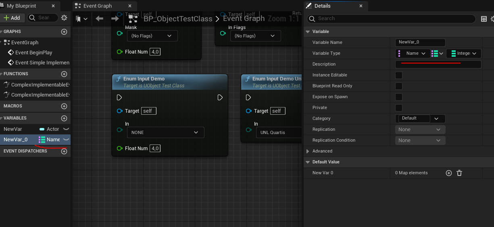
Добавим в эту пенеменную две колонки, в первой будет `Test`, а во второй `TeST`.
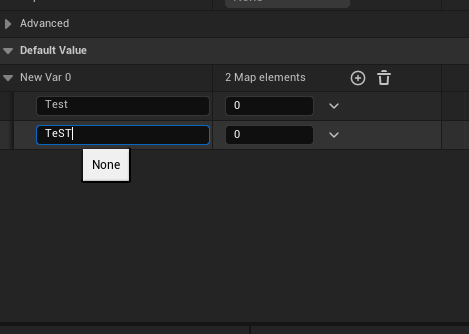
При попытке сохранить переменную с этими изменениями - выскочит ошибка - `Duplicate keys are not allowed in Map properties`.
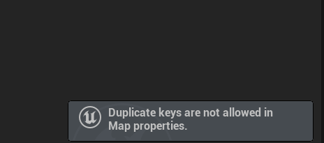
Потому что для переменных типа `FName` нет регстра, они его игнорируют. Таким образом, для `FName` следующее `Test` = `TeST` верно.
## `FString`
Это обычная "умная" строка без возможностей локализации, но с набором вспомогательных методов.
Имейте в виду - если вы используете `FString` для названия предмета в инвентаре - то вы не сможете перевести это название через локализацию. Это одна из проблем, с которыми я сталкивался в прошлом.
Преимущества `FString` таковы: это - самый гибкий тип строковых данных, с самым большим количеством вспомогательных функций. Тут тебе и `Append` и многое другое.
Пример использования:
```cpp
FString SomeFString = TEXT("Test");
UE_LOG(LogTemp, Warning, TEXT("%s"), *SomeFString)
```
### Конверсии `FString`
Из `FString ->` и в `-> FString` есть конверсия почти от каждого встроенного типа.

> Самое ходовое преобразование `FString` в `TCHAR` достигается через простое добавление `*` символа указателя перед переменной `FString`

```cpp
UE_LOG(LogTemp, Warning, TEXT("%s"), *SomeFString)
```
Конверсии:
```cpp
// as Property
UPROPERTY(BlueprintReadWrite, EditAnywhere, Category = "VariableExperiments")
FString SomeStringTest = "Test";
//FString->THCAR*
TCHAR* myvar = MyString.GetCharArray().GetData();
// аналогично можно FString превратить в TCHAR* вот так
TCHAR* myvar = *MyString
//FString->FName*
FName ConvertedFString = FName(*TheString);
//FString->Float
float MyShinyNewFloat = FCString::Atof(*TheString);
// Float / Int to FString
FString NewString = FString::FromInt(YourInt);
FString VeryCleanString = FString::SanitizeFloat(YourFloat);
// FText to FString
FText::FromString();
// FString to char*
char* result = TCHAR_TO_ANSI(*myFString);
// or
StringCast<ANSICHAR>(*FSTRINGVARIABLE).Get()
// or
char* result = StringCast<ANSICHAR>(*myFString).Get();
// or
char* result = StringCast<ANSICHAR>(*myFString).Get();
```
### `UEnum to String`
Есть очень простой способ конвертировать переменную `UENUM` в `FString`:
```cpp
EEdGraphPinDirection Direction = EGPD_Input; // our enum
FString Value = UEnum::GetValueAsString(Direction) // will make string : "EGPD_Input"
```
### Форматирование строк в `FString`
Строки `FString` можно объединять с другими данными используя static метод `Printf`.
```cpp
TMap<FName, int> SomeMap;
SomeMap.Add( TEXT("TEST"), 123);
// формируем строку по формату
FString Printable = FString::Printf(TEXT("MapData = %i SomeText = %s"), *SomeMap.Find( TEXT("TEST") ), TEXT("This Is Some Text!"));
GEngine->AddOnScreenDebugMessage(-1, 2.0f, FColor::Blue, Printable);
```
Флаги форматирования можно найти в [документации к printf](https://cplusplus.com/reference/cstdio/printf/).
Я приведу лишь самые ходовые.
______________
`%d` или `%i` - digit / int то  есть целое число
`%u` - unsigned decimal int, то есть тоже целое число, просто без подписи (uint)
`%f` - float, число с плавающей точкой
`%c` - char, то есть символ, единичный.
`%s` - string, строка
Для параметров типа `bool` флаг форматирования не предусмотрен, но можно использовать сокращеный `if` следующим образом: `("%s", x?"true":"false");` где `x` - `bool` параметр
______________
## Макрос TEXT()
Данный макрос используется при задании строковых значений из кода.
Что делает этот макрос? Он разрешает проблему с кодировкой символов в файле.
Дело в том, что если задать строку без участия этого макроса, например так:
```cpp
FName TestName = "Test Name";
```
То кодировка символов в строке `"Test Name"` будет той-же самой, какая выставлена у исходного файла. Обычно это UTF-8, но может быть и ANSI или что-то более экзотическое, если вы используете, например, китайский язык.
Чтобы избежать проблем с кодировкой текста разработчики создали макрос `TEXT()`.
Его использование обязательно, если вы задаете значение переменной из кода.
```cpp
FName TestName = TEXT("Test Name");
```
## FText
Это самый тяжелый тип текстовых данных. Его размерность - 40 байт.
К тому-же это не гибкий тип, тут нет метода `Append`, нет метода `Replace`. С этим типом не получится работать так-же качественно, как с `FString.`
Но, в замен, `FText` интегрирован в систему локализации `Unreal`.
Движок сам умеет парсить все вхождения `FText` внутри проекта и добавлять для локализации.
Но для этого надо соблюсти ряд условий.
### Инициализация текстовых данных через `LOCTEXT`
Каждая локализуемая переменная типа `FText` должна идти внутри макроса `LOCTEXT`.
```cpp
FText ItemName = LOCTEXT(LOCTEXT_NAMESPACE, "Basic Item");
```
Однако, уважаемый читатель, я прошу вас не спешить. С текстовыми данными все не так просто и для работы, вам понадобится задать еще пару макросов. Или использовать `NSLOCTEXT` (перейдите в соответствующую главу).
Перед тем как использовать макрос `LOCTEXT` нужно провести определенную подготовку.
В самом начале файла должен быть задан макрос `LOCTEXT_NAMESPACE` с описанием создаваемого текстового пространства.
```cpp
#define LOCTEXT_NAMESPACE "SubsystemTestNamespace"
```
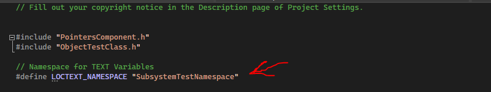
В самом конце файла макрос должен убираться:
```cpp
#undef LOCTEXT_NAMESPACE
```
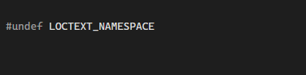
Теперь мы можем использовать объявленное нами пространство имен `SubsystemTestNamespace` для всех переменных типа `FText`, которые будут заданы внутри данного файла.
```cpp
// for FText
#define LOCTEXT_NAMESPACE "ItemTextNamespace"
//...
UPROPERTY(BlueprintReadOnly, EditDefaultsOnly, Category = "Item")
FText ItemName = LOCTEXT(LOCTEXT_NAMESPACE, "Basic Item");
//...
#undef LOCTEXT_NAMESPACE
```
### Зачем нужно `LOCTEXT_NAMESPACE`
Это нужно, поскольку все локализуемые данные индексируются, что потенциально может создать конфликт переводов для одинаковых записей, например, цифр, у которых при этом разный контекст значения.
Дабы избежать подобного сценария, движок использует разделение доступных для перевода переменных по их `namespace`, то есть пространству имен. Используя текстовые метки разработчик может пояснить переводчику, каково назначение текста, который он переводит.
Увидеть значение `LOCTEXT_NMAESPACE` можно в `LocationsationDashboard`.
Например для следующей текстовой метки:
```cpp
FText ItemName = LOCTEXT("TextItemNamespace", "Basic Item");
```
Переводчик увидит следующие значения:
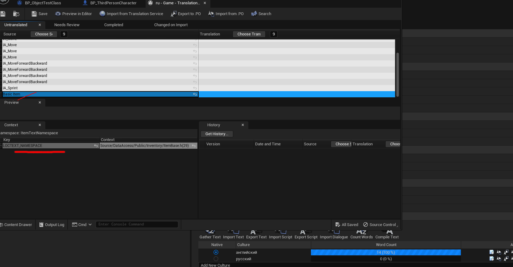
В этом примере переводчик, увидев ключ `TextItemNamespace` поймет, что текст, который он переводит, относится к имени предмета.
### Использоваение `NSLOCTEXT`
Макрос `NSLOCTEXT` может работать без задания `LOCTEXT_NAMESPACE`. Поэтому приведенный выше пример сокращается до следующего:
```cpp
UPROPERTY(BlueprintReadOnly, EditDefaultsOnly, Category = "Item")
FText ItemName = NSLOCTEXT("ItemTextNamespace", "ItemTextNamespace_ItemName", "Basic Item");
```
Первый параметр макроса `NSLOCTEXT` это глобальное пространство имен, в котором будет находиться текстовое описание.
Второй параметр макроса это локальное пространство имен для текстовой метки.
Третий параметр - текстовая метка.
### Форматирование `FText`
`FText`  поддерживает форматирование, но оно отличается от того, что имеется в `Printf`.
В `FText` можно ссылаться на любой аргумент используя его номер, следующим образом:
```cpp
FText CurrentHealth = FText::Format(LOCTEXT("SubsystemTestNamespace", "You currently have {0} health left."), 100);
FString TestString = TEXT("Test");
FText StringCombination = FText::Format(LOCTEXT("SubsystemTestNamespace", "Loaded String Data {0}."), FText::FromString(TestString));
FText CurrentHealth = FText::Format(LOCTEXT(LOCTEXT_NAMESPACE, "Bill currently have {0} health left and Annd Have {1} health left and {0} Mana."), 100, 75);
UE_LOG(LogTemp, Warning, TEXT("%s"), *CurrentHealth.ToString())
```
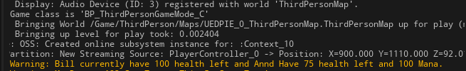
Обратите внимание, я сослался на первый аргумент дважды `{0}`, а на второй 1 раз `{1}`. Первый аргумент начинается с нуля. То есть в фигурных кавычках указывается индекс аргумента, начиная с `0`. Первый аргумент таким образом - `0`, второй - `1`.
Так-же можно провести более "читабельное" форматирование используя текстовую индексацию.
```cpp
FText CurrentHealth = FText::FormatNamed(LOCTEXT(LOCTEXT_NAMESPACE,
    "Max Health is {Health},\nMaxMana is {Mana},\nCurrentHealth is {Health}."),
    TEXT("Health"), 100,
    TEXT("Mana"), 75);
```
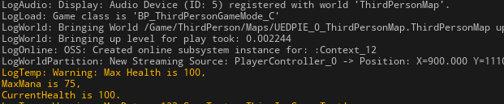
Форматирование текста допускает  наличие `Plural Forms`, то есть форм множественного числа.
Рассмотрим пример.
`Bird` - единственное число, `Birds` - множественное число. Окончание в первом случае отсутствует, во втором - `s`.
Или - `There is / There are`.
Если мы хотим, чтобы выводимый в `FText` результат менял свое окончание, мы можем использовать такой трюк:
`{NumBirds}|plural(one=is,few=are)`
Тут мы указываем, если переменная `{NumBirds}` имеет значение `1` то напечатано будет слово `is`, а если больше чем `1`, то напечатано будет слово `are`.
Задумка такова такова - `There is/are NumBirds bird/birds`.
```cpp
FText CurrentHealth = FText::FormatNamed(LOCTEXT(LOCTEXT_NAMESPACE,
    "There {NumBirds}|plural(one=is,few=are) {NumBirds} {NumBirds}|plural(one=bird,few=birds)"),
    TEXT("NumBirds"), 1);
UE_LOG(LogTemp, Warning, TEXT("%s"), *CurrentHealth.ToString())
```
С `NumBirds` равным `1` результат таков:
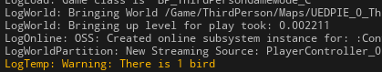
С `NumBirds` равным `2` результат таков:
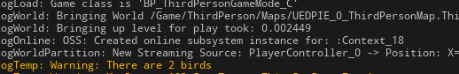
Касательно `Plurals` модификаторов.
Найти их можно в файле `\Runtime\Core\Public\Internationalization\Text.h` и выглядят они так:
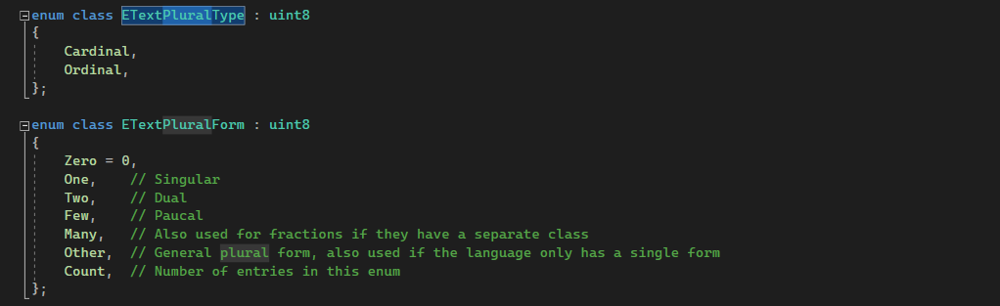
Я решил проверить доступные значения `plurals` написав следующий код:
```cpp
for (int i = 0; i < 20; i++) {
    FText TestNumText = FText::FormatNamed(LOCTEXT(LOCTEXT_NAMESPACE,
        "{TestNum} {TestNum}|plural(one=one,few=few,many=many,other=other)"),
        TEXT("TestNum"), i);
    UE_LOG(LogTemp, Warning, TEXT("%s"), *TestNumText.ToString())
}
```
Мне выдало следующее:
```cpp
LogTemp: Warning: 0 many
LogTemp: Warning: 1 one
LogTemp: Warning: 2 few
LogTemp: Warning: 3 few
LogTemp: Warning: 4 few
LogTemp: Warning: 5 many
----
LogTemp: Warning: 20 many
LogTemp: Warning: 21 one
LogTemp: Warning: 22 few
LogTemp: Warning: 23 few
LogTemp: Warning: 24 few
LogTemp: Warning: 25 many
----
LogTemp: Warning: 30 many
LogTemp: Warning: 31 one
LogTemp: Warning: 32 few
LogTemp: Warning: 33 few
LogTemp: Warning: 34 few
LogTemp: Warning: 35 many
----
LogTemp: Warning: 40 many
LogTemp: Warning: 41 one
LogTemp: Warning: 42 few
LogTemp: Warning: 43 few
LogTemp: Warning: 44 few
LogTemp: Warning: 45 many
----
LogTemp: Warning: 50 many
LogTemp: Warning: 51 one
LogTemp: Warning: 52 few
LogTemp: Warning: 53 few
LogTemp: Warning: 54 few
LogTemp: Warning: 55 many
----
LogTemp: Warning: 59 many
LogTemp: Warning: 60 many
LogTemp: Warning: 61 one
LogTemp: Warning: 62 few
LogTemp: Warning: 63 few
LogTemp: Warning: 64 few
LogTemp: Warning: 65 many
----
LogTemp: Warning: 70 many
LogTemp: Warning: 71 one
LogTemp: Warning: 72 few
LogTemp: Warning: 73 few
LogTemp: Warning: 74 few
LogTemp: Warning: 75 many
----
LogTemp: Warning: 80 many
LogTemp: Warning: 81 one
LogTemp: Warning: 82 few
LogTemp: Warning: 83 few
LogTemp: Warning: 84 few
LogTemp: Warning: 85 many
----
LogTemp: Warning: 90 many
LogTemp: Warning: 91 one
LogTemp: Warning: 92 few
LogTemp: Warning: 93 few
LogTemp: Warning: 94 few
LogTemp: Warning: 95 many
----
LogTemp: Warning: 100 many
LogTemp: Warning: 101 one
LogTemp: Warning: 102 few
LogTemp: Warning: 103 few
LogTemp: Warning: 104 few
LogTemp: Warning: 105 many
----
LogTemp: Warning: 109 many
```
### Локализация
Давайте попробуем перевести следующую переменную:
```cpp
FText CurrentHealth = FText::Format(LOCTEXT(LOCTEXT_NAMESPACE, "You currently have {0} health left."), 100);
UE_LOG(LogTemp, Warning, TEXT("%s"), *TestNumText.ToString())
```
Компилируем.
Теперь идем `Tools -> Localisation Dashboard`.
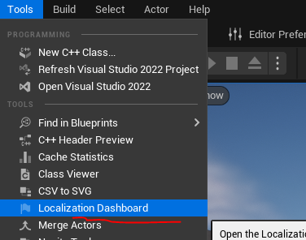
Перед вами появится встроенная система локализации движка. Она позволяет перевести проект очень быстро, благодаря возможности автоматически просканировать все вхождения `FText`.
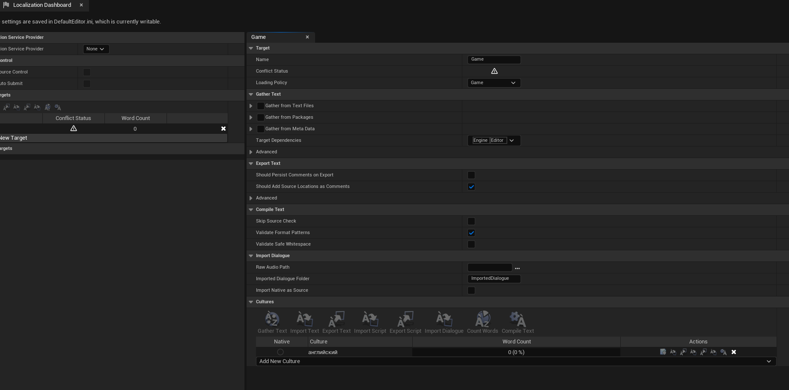
Добавим опцию локализации. Для этого нажмите кнопку `Add New Culture` в категории `Culture` и выберите тот язык, который хотите локализовать. Я беру `Русский`.
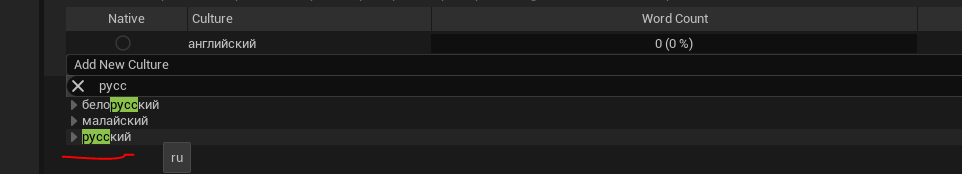
Сразу после добавления, данная локаль выставится как "по умолчанию". Если вы планируете наполнять вашу игру, ее сюжет и историю на русском(в моем случае) языке - можете оставить все как есть.
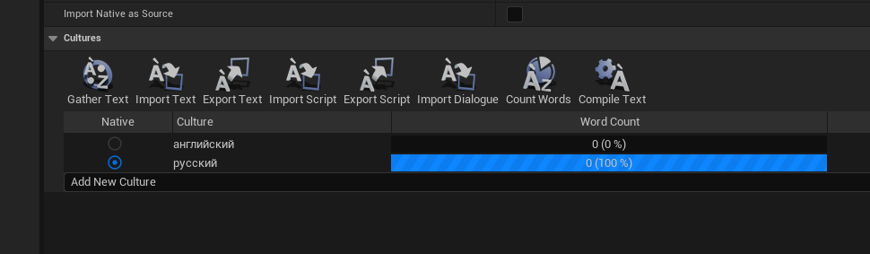
Если же вы создаете игру изначально на английском и потом собираетесь переводить ее, то поставьте параметр "по умолчанию" на английский. В моем случае тестовый участок кода `You currently have {0} health left.` написан на английском, поэтому придется сменить локаль на `английский` язык.
Перед нами появится предупреждение о том, что данное действие удалит ваши текущие правки. Но у нас небыло правок, так что жмем `yes`.
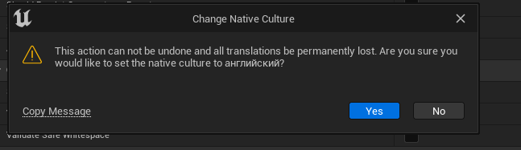
Теперь необходимо выбрать источники из которых текст будет собираться.
Источники доступны в поле `Gather Text`. Выбираем `FromTextFiles` и `FromPackages`.
Так-же для обоих полей добавляем пути, в которых локализация будет искаться. В случае  с `Packages` это папка `Content/*`, а в случае с `TextFiles` это папка `Source`.
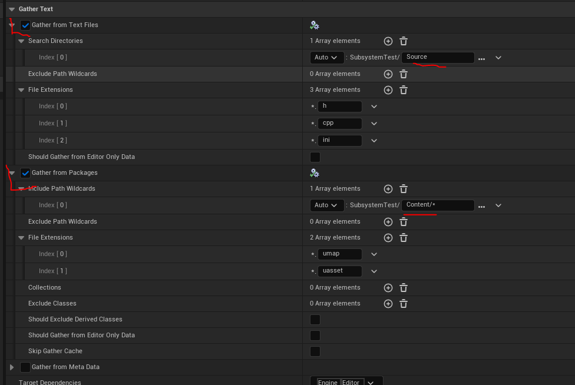
Обратите внимание на символ `*`. Не знаю почему, но в случае с параметрами `Packages` очень важно наличие `/*`, а в случае с `TextFiles` наоборот папка должна указываться без `/*`. Иначе работать не будет. (в будущем это может измениться)
Теперь жмем на кнопку "Gather Text".
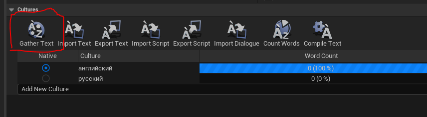
Это запустит процесс автоматической сборки текста из указанных источников.
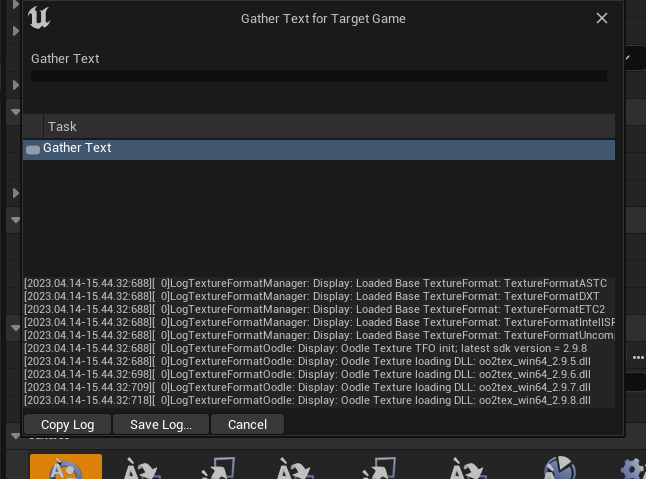
По завершению процесса, у меня было найдено 17 слов.
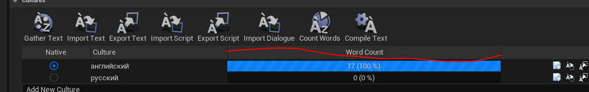
Самое время их перевести.
Для языка выставленного "по умолчанию", это у нас "английский" считается, что 100% перевода уже валидны. Поэтому редактировать мы будем текст для русского перевода.
Нажимаем кнопку `Edit Translation for this Culture` в  колонке "Actions".
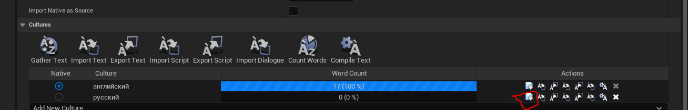
Перед нами появится редактор перевода. В нем 3 вкладки, это `Untranslated` - "не переведеное", `Needs Review` и `Completed`.
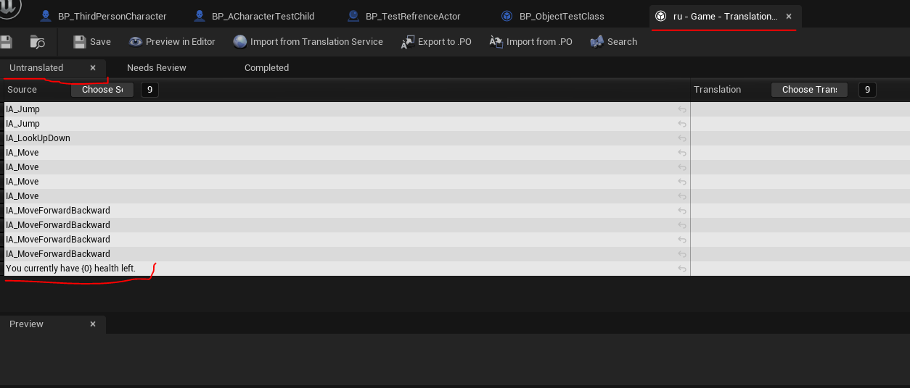
Внизу, на вкладке `Untranslated` вы можете видеть нашу переводимую строку `You currently have {0} health left.`, она была автоматически добавлена в локализуемые.
Чтобы ее перевести щелкните в правой колонке `Translation` дважды.
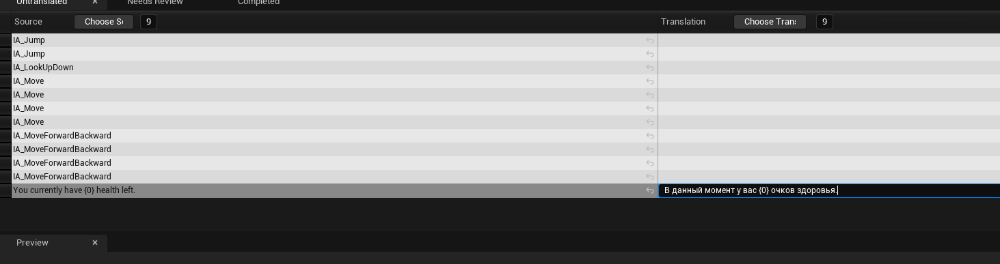
Теперь сохраните изменения и нажмите кнопку `Export to .PO`.
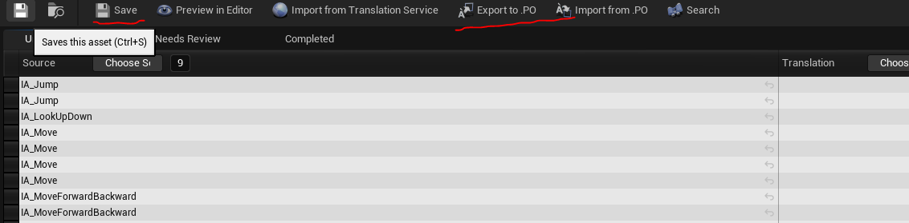
Перед вами появится диалог с выбором места назначения, для экспорта файла. В появившемся диалоге уже будет открыта нужная папка. Ничего не меняйте. Нажмите "Сохранить".
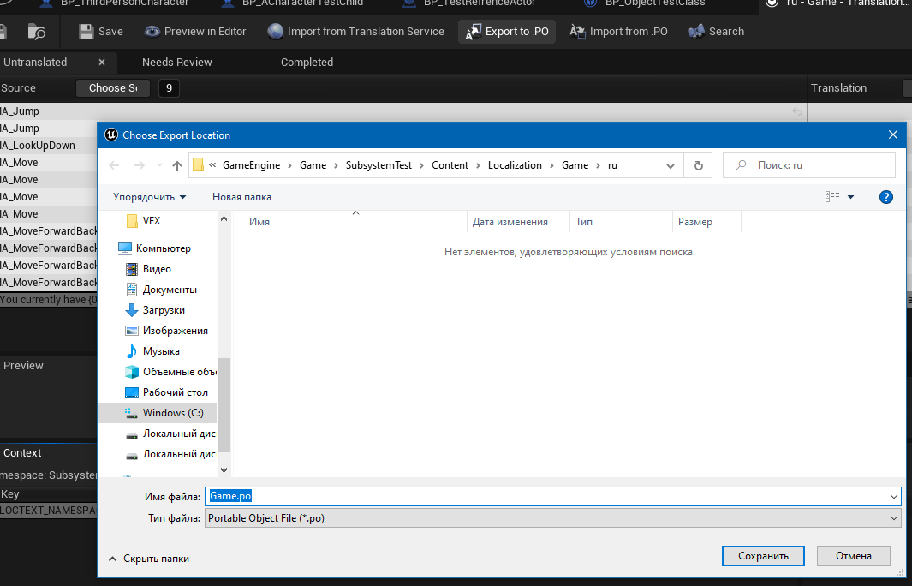
Всегда сохраняйте результат перевода в файле `.PO`, потому что внутри редактора `Unreal` перевод может в любой момент пропасть или потереться, без возможности восстановления. А теперь представьте, что вы на половину перевели большую рпг, а потом все переводы к чертям слетели. Чтобы такого небыло - всегда сохраняйте в `.PO` файлы.
После сохранения и экспорта вы можете видеть, что в меню статистики локализации - ничего не изменилось. Наш перевод как был на 0 так и остается.
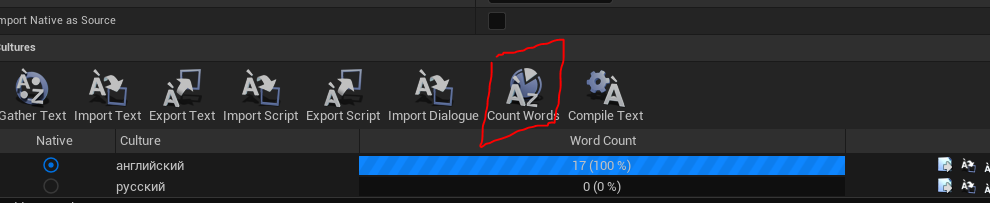
Чтобы это изменилось нажмите на кнопку "Count Words". Это запустит процесс анализа переведенной информации.
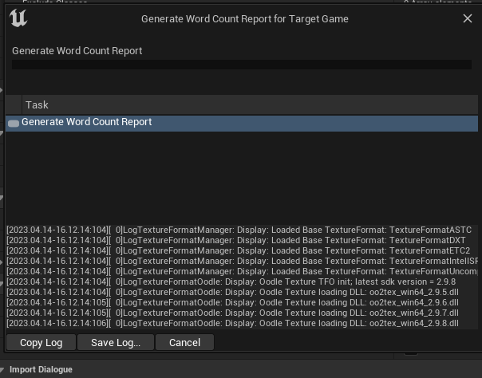
После подсчета мы увидим объективную статистику.
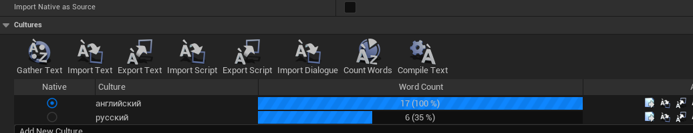
Функционал, делающий возможным загрузку локалей, подробно описан в [документации](https://docs.unrealengine.com/4.26/en-US/ProductionPipelines/Localization/ManageActiveCultureRuntime/) движка.
Сделать это можно как с помощью `blueprint`, так и с помощью `с++`.
### Рекомендации по использованию `FText`
Из-за тесной интеграции с системой локализации, очевидно, что те вещи, которые вы планируете локализовывать должны иметь тип `FText`, в основном это:
1. название кнопок интерфейса
2. описания предметов
3. названия предметов
4. тексты книг
5. имена персонажей
6. названия объектов в игровом мире
7. даты и названия дней недели
