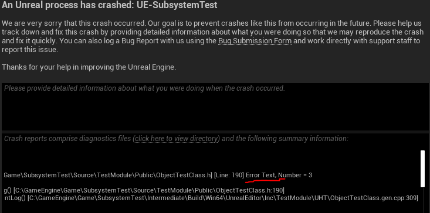
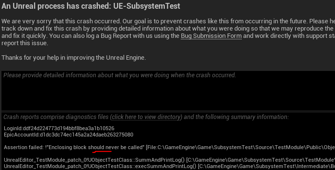
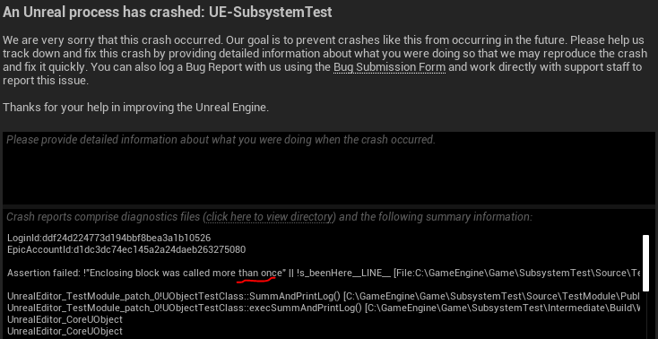
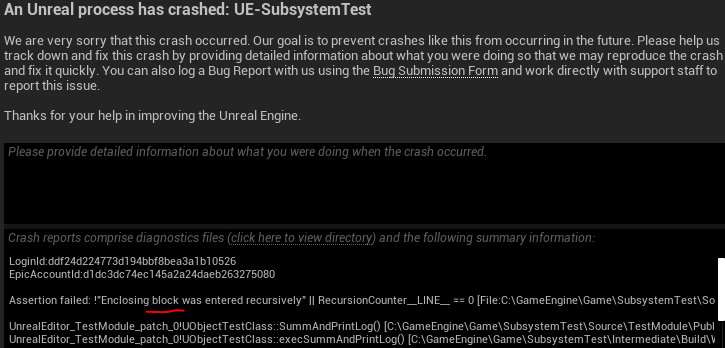
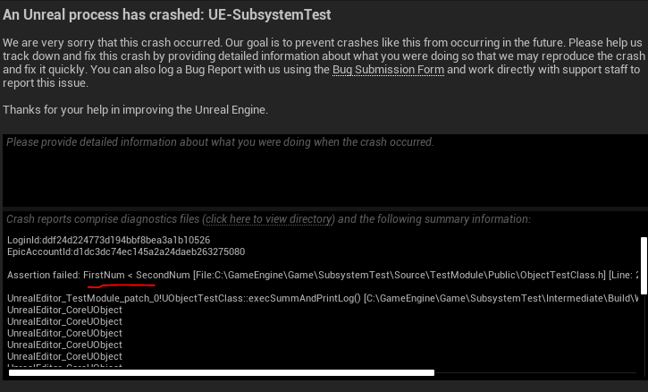
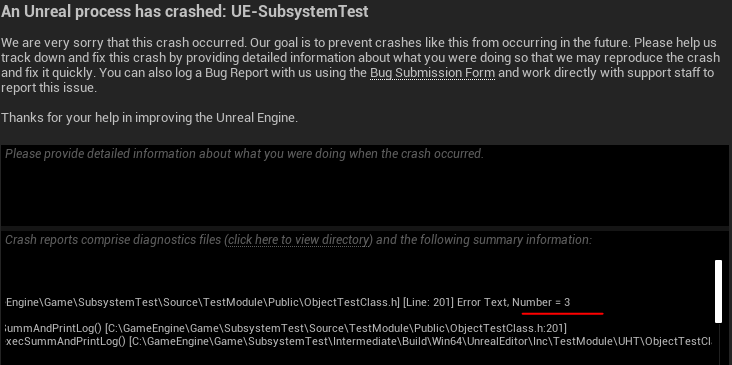
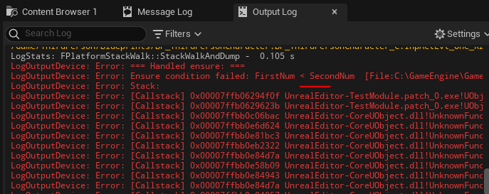
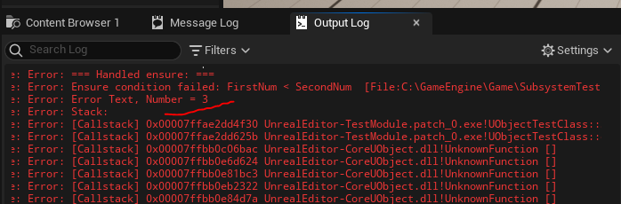

# Debug Asserts
В `Unreal Engine` есть набор операторов, упрощающих вывод ошибок. Это т.н. `Assert` операторы или операторы "прерываний".
При определенных условиях операторы прерывания останавливают работу приложения и выводят ошибку. В этом их работа схожа с точками останова. Если вы работаете без отладчика `Visual Studio`, операторы отладки могут быть крайне полезны. Они очень сильно упрощают разработку с помощью `LiveCoding`.
Материалы данной статьи целиком взяты со страницы [официальной документации](https://docs.unrealengine.com/5.1/en-US/asserts-in-unreal-engine/).
Я буду проверять каждый `Assert` оператор внутри следующей функции:
```cpp
// just BlueprintCallable
UFUNCTION(BlueprintCallable, Category="Custom Functions|Summ")
int SummAndPrintLog(float FirstNum = 2.1f, float SecondNum = 1.7f) {
    check(FirstNum > SecondNum);
    float to_print = FirstNum + SecondNum;
    UE_LOG(LogTemp, Error, TEXT("val = %f"), to_print)
    return FGenericPlatformMath::CeilToInt(to_print);
}
```
##Операторы группы `check`
Операторы данного типа срабатывают только в `development` сборках. В `shipping` сборках эти операторы игнорируются.
## `check` и `checkSlow`
Если значение, переданное в оператор становится `false`, то выполнение приложения будет остановлено с выводом ошибки и указанием на строчку, где ошибка произошла.
```cpp
FirstNum = 3.f;
SecondNum = 2.1f;
check(FirstNum < SecondNum); // will stop execution and show error, since FirstNum bigger than SecondNum
```

## `checkf` и `checkfSlow`
Данный оператор принимает два параметра. Первый - проверяемое значение, второй - тест, для печати. Если значение в первом параметре принимает значение `false`, выплонение приложения будет остановлено и в лог напечатается переданный текст.
```cpp
{
    FirstNum = 3.f;
    SecondNum = 2.1f;
    checkf(FirstNum < SecondNum, TEXT("Error Text, Number = %i"), 3); // will stop execution and show error, since FirstNum bigger than SecondNum
}
```

## `checkCode`
Данная команда просто выполняет указанный код. Поскольку операторы группы `check` это `development` операторы, код переданный внутрь команды `checkCode` будет работать только в `development` сборке игры. В релизной `shipping` сборке проекта логика обернутая в эту команду не будет выполняться.
```cpp
{
    checkCode(
        if(FirstNum > SecondNum){
            UE_LOG(LogTemp, Error, TEXT("FirstNum > SecondNum"))
        }
    );
}
```

## `checkNoEntry`
Этот оператор никогда не должен быть вызван. Если исполнение кода доходит до данного оператора - работа приложения прерывается.
```cpp
{
    checkNoEntry();
}
```

## `checkNoReentry`
Данный оператор останавливает работу приложения, если его вызвали повторно.
```cpp
{
    checkNoReentry();
}
```

## `checkNoRecursion`
Останавливает исполнение кода, если случилась рекурсия.
```cpp
// simple recursion
int TestRecursion(int p) {
    checkNoRecursion(); // will stop execution chan if recursion happened
    p++;
    if (p > 15) {
        return p;
    }
    return TestRecursion(p);
}
//...
TestRecursion(0);
```

## Операторы группы `Verify`
Данные операторы работают и в `shipping` и в `development` сборках проекта.
## `verify`
Данный оператор остановит выполнение программы, если в него будет передано значение `false`.
```cpp
{
    FirstNum = 3.f;
    SecondNum = 2.1f;
    verify(FirstNum < SecondNum); // will stop execution and show error, since FirstNum bigger than SecondNum
}
```

## `verifyf`
Данный оператор принимает два параметра. Первый - проверяемое значение, второй - тест, для печати. Если значение в первом параметре принимает значение `false`, выплонение приложения будет остановлено и в лог напечатается переданный текст.
```cpp
{
    FirstNum = 3.f;
    SecondNum = 2.1f;
    verifyf(FirstNum < SecondNum, TEXT("Error Text, Number = %i"), 3); // will stop execution and show error, since FirstNum bigger than SecondNum
}
```

##Операторы группы `Ensure`
Данные операторы, в отличие от двух предыдущих, не вызывают полную остановку приложения. Вместо этого, они просто печатают в лог текст ошибки.
## `ensure`, `ensureAlways`
Оператор `ensure` при первом выполнении, выводит в лог сообщение об ошибке.
Оператор `ensureAlways` выводит в лог сообщение об ошибке всякий раз, при исполнении.
```cpp
{
    FirstNum = 3.f;
    SecondNum = 2.1f;
    ensure(FirstNum < SecondNum); // will show error in log, since FirstNum bigger than SecondNum
    ensureAlways(FirstNum < SecondNum); // will show error in log on every execution, since FirstNum bigger than SecondNum
}
```

## `ensureMsgf` и `ensureAlwaysMsgf`
Оба оператора принимают два параметра. Первый параметр - выражение, второй параметр - текстовое сообщение, которое будет выведено в лог, если выражение приняло значение `false`.
Оператор `ensureMsgf` исполняется только один раз.
Оператор `ensureAlwaysMsgf` исполняется постоянно.
```cpp
{
    FirstNum = 3.f;
    SecondNum = 2.1f;
    ensureMsgf(FirstNum < SecondNum, TEXT("Error Text, Number = %i"), 3); // will show error in log only once, since FirstNum bigger than SecondNum
    ensureAlwaysMsgf(FirstNum < SecondNum, TEXT("Error Text, Number = %i"), 3); // will show error in log on every execution, since FirstNum bigger than SecondNum
}
```

