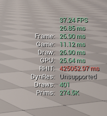
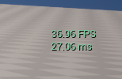
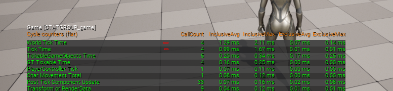
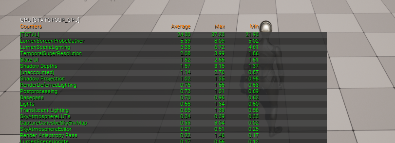
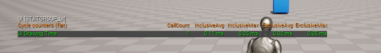
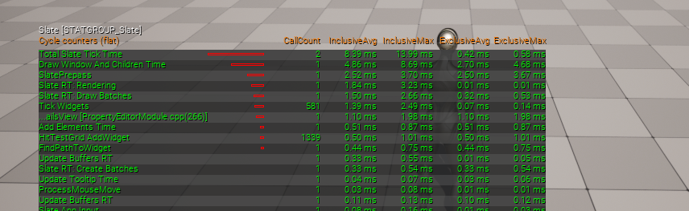
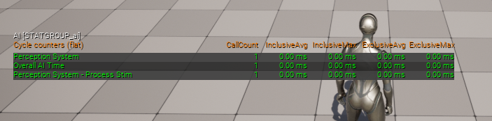

# Debug Console Commands
Open engine console by pressing `~`(tilda) key.
To hide info - enter same command again.
## `stat unit`
```cpp
stat unit - unit stats (fps, game and gpu thread times)
```


> note: "frame time" is highest time between `gpu` and `game` threads

## `stat fps`
```cpp
stat fps - will show fps and frame time
```

## `stat game`
```cpp
stat game - game thread stats
```

## `stat gpu`
```cpp
stat gpu - gpu states
```

## `stat ui`
```cpp
stat ui - ui draw time
```

## `stat slate`
```cpp
stat slate - slate ui rendering info
```

## `stat ai`
```cpp
stat ai - ai performance info
```

