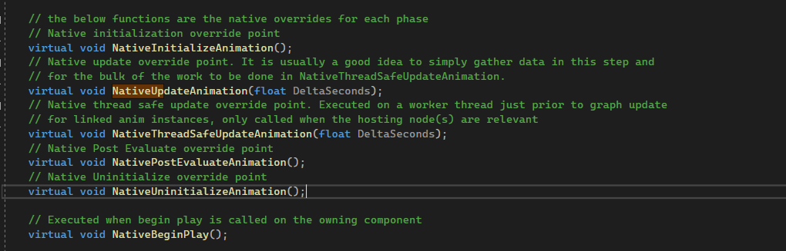

# `Anim Instance`
## Вступление
За работу с анимациями персонажа отвечает класс `AnimInstance`. Именно от `AnimInstance` наследуются классы `AnimtaionBlueprint`. В шаблоне `ThirdPerson` уже есть два ассета данного типа. Это `ABP_Manny` и `ABP_Quinn`.

Нас интересует `ABP_Manny`.

## Зачем создавать `AnimInstance` на с++.
Низкая производительность - это основная проблема `AnimBlueprint`. Сильнее всего проблемы с производительностью сказываются в случаях, когда надо отрисовать на сцене несколько (дестяков) персонажей.
Давайте рассмотрим подобный сценарий.
Я сделал тестовую карту, на которую добавил всего `60` тестовых персонажей.

Тестовые персонажи имеют только меш и установленный `Animation Blueprint`.

Даже ИИ на этих тестовых персонажах не добавлен. Тем не менее, фреймрейт на моем слабом пк снизился до `17` кадров в секунду. (обычно он в районе 40)
Выясним почему так происходит. Вводим команды `stat game`.

В появившемся окне видим, что сильнее всего замедляет систему `WorldTickTime`, на который приходится `20ms` общего фреймтайма.
Главная причина такой просадки производитеьности - метод `BlueprintUpdateAnimation`.

Математические операции, а так-же проверки условий в `blueprint` коде медленнее, чем в `с++`.
## Добавляем поддержку многопоточности в `Animation Blueprint`
`Unreal Engine` позволяет просчитывать логику метода `BlueprintUpdateAnimation` для разных персонажей - в разных потоках. Такой подход, от части, нивелирует низкую производительность `blueprint` кода.
Несмотря на то, что моя книга посвящена `с++`, я рассмотрю этот способ работы с `Animation Blueprint`.
### Включаем плагины
Для начала проверяем настройки проекта. Переходим по пути `Edit -> Project Settings -> General Settins` и ищем настройку `Allow Multi Threaded Animation Update`. Ставим `True`.

Теперь надо активировать плагин, добавляющий поддержку многопоточного доступа к переменным в `AnimBP`. Плагин называется `Property Access Node`. Найти его можно в секции `Edit -> Pluigins -> Blueprints`.

### Добавляем ноды `Property Access`
После активации плагина и перезапуска движка, снова откройте `AnimBp` и, в `EventGraph`, щелкните правой кнопкой мыши. В открывшемся меню поиска `blueprint` нод вбейте строчку `PropertyAccess`.

Добавьте найденную ноду в граф. В ноде `PropertyAccess` можно задать любую переменную, доступ к которой надо сделать потокобезопасным.

### Переопределяем `BlueprintThreadSafeUpdateAnimation`
Для многопоточного обновления параметров в `AnimationBlueprint` есть метод `BlueprintThreadSafeUpdateAnimation`, который выступает альтернативой для старого метода `BlueprintUpdateAnimation`.
Идем во вкладку `Functions`, щелкаем кнопку `Override` и переопределяем метод `BlueprintThreadSafeUpdateAnimation`.

Логика метода `BlueprintUpdateAnimation` должна быть переписана внутри метода `BlueprintThreadSafeUpdateAnimation`, с применением нод `PropertyAccess`.

Дело в том, что если внутри метода `BlueprintThreadSafeUpdateAnimation` мы попытаемся обработать обычную переменную - при запуске игры проекта возникнет сбой. Так происходит, потому что доступ к обычным `blueprint` переменным не потокобезопасен. Нода `PropertyAccess` исправляет эту проблему.
Я переписал логику метода следующим образом:

На скриншете очень плохо видно целевой набор нод, поэтому вот вам приближенные участки графа.


Разумеется, логику старого метода `BlueprintUpdateAnimation` надо отключить.

### Дополняем `AnimGraph`
В `AnimGraph` доступ ко всем переменным тоже надо обернуть в ноду `Property Access`.

В каждом графе, в каждом узле.


### Результат
Запускаем проект.
После всех этих операций, производительность сцены с `60` персонажами, в моем случае, улучшилась, но не так значительно. Фреймрейт с `17` поднялся до `22-25`, а фреймтайм сократился с `55+` до `45`.

Как вы видите, прирост производительности от `blueprint` многопоточности есть - но он не достаточен.
Чтобы получить еще более мощный прирост - реализуем обновление данных анимации через `с++`.
## Создаем класс `AnimInstance`
Предлагаю переписать логику методов `Blueprint Update Animation` на с++  с применением `Multithreaded Animation Update`.
Про `Multithreaded Animation Update` есть статья в официальной [документации](https://docs.unrealengine.com/5.0/en-US/animation-optimization-in-unreal-engine/). К сожалению она устарела. О том, как надо работать с `AnimInstance` можно посмотреть в официальном репозитории `Advanced Locomotion System`, по [ссылке](https://github.com/dyanikoglu/ALS-Community/blob/main/Source/ALSV4_CPP/Private/Character/Animation/ALSCharacterAnimInstance.cpp), обратите внимание на метод `NativeUpdateAnimation`.
Но даже код `ALS` немного устарел.
Рассмотрим более актуальный подход.
Добавляем новый класс `Tools -> New C++ Class -> All Classes -> Anim Instance`.

Я назвал класс `AnimInstanceBase`.

Созданный класс будет унаследован от `UAnimInstance`. Он выглядит так:

Мы будем переопределять методы класса `UAnimInstance`, с префиксом `Native`.
Логика префиксов такова: `BlueprintUpdateAnimation` = `NativeUpdateAnimation`.

### Файл `AnimInstanceBase.h`
```cpp
#pragma once
#include "CoreMinimal.h"
#include "Animation/AnimInstance.h"
#include "Animation/AnimInstanceProxy.h"
#include "GameFramework/CharacterMovementComponent.h"
// Kismet
#include "Kismet/KismetMathLibrary.h"
// ACharacter class refrence
#include "GameFramework/Character.h"
// generated.h
#include "AnimInstanceBase.generated.h"
/**
 * Anim Instance Base Class
 */
UCLASS(Blueprintable, BlueprintType)
class TESTMODULE_API UAnimInstanceBase : public UAnimInstance
{
	GENERATED_BODY()
public:
	// constructor
	UAnimInstanceBase(const FObjectInitializer& ObjectInitializer);
	// Native initialization override point
	// here we get base object refrences that not change over time
	virtual void NativeInitializeAnimation() override;
	// Native update override point.
	// It is usually a good idea to simply collect data in this step
	// and then process heavy calculations on collected data in NativeThreadSafeUpdateAnimation
	virtual void NativeUpdateAnimation(float DeltaSeconds) override;
	// Native thread safe update override point.
	// Executed on a worker thread just prior to graph update
	// for linked anim instances, only called when the hosting node(s) are relevant
	virtual void NativeThreadSafeUpdateAnimation(float DeltaSeconds) override;
	// Executed when begin play is called on the owning component
	virtual void NativeBeginPlay() override;
private:
	// Character refrence
	UPROPERTY(Transient, BlueprintReadOnly, Category = "Refrences", meta = (AllowPrivateAccess = "true"))
	TObjectPtr<ACharacter> Character = nullptr;
	// Movement Component refrence
	UPROPERTY(Transient, BlueprintReadOnly, Category = "Refrences", meta = (AllowPrivateAccess = "true"))
	TObjectPtr<UCharacterMovementComponent> MovementComponent = nullptr;
	// Velocity Vector
	UPROPERTY(VisibleDefaultsOnly, BlueprintReadOnly, Category = "Animation Params", meta = (AllowPrivateAccess = "true"))
	FVector Velocity;
	// Current Acceleration
	UPROPERTY(VisibleDefaultsOnly, BlueprintReadOnly, Category = "Animation Params", meta = (AllowPrivateAccess = "true"))
	FVector CurrentAcceleration;
	// Velocity Vector Length
	UPROPERTY(VisibleDefaultsOnly, BlueprintReadOnly, Category = "Animation Params", meta = (AllowPrivateAccess = "true"))
	float GroundSpeed;
	UPROPERTY(VisibleDefaultsOnly, BlueprintReadOnly, Category = "Animation Params", meta = (AllowPrivateAccess = "true"))
	bool ShouldMove = false;
	UPROPERTY(VisibleDefaultsOnly, BlueprintReadOnly, Category = "Animation Params", meta = (AllowPrivateAccess = "true"))
	bool IsFalling = false;
};
```
### Файл `AnimInstanceBase.cpp`
```cpp
#include "AnimInstanceBase.h"
// constructor
UAnimInstanceBase::UAnimInstanceBase(const FObjectInitializer& ObjectInitializer) {
	/* Nothing */
}
// Executed when begin play is called on the owning component
void UAnimInstanceBase::NativeBeginPlay()
{
	Super::NativeBeginPlay();
	/* Nothing */
}
// Native initialization override point
// here we get base object refrences that not change over time
void UAnimInstanceBase::NativeInitializeAnimation()
{
	Super::NativeInitializeAnimation(); // call parent
	Character = Cast<ACharacter>(TryGetPawnOwner());
	if (Character != nullptr) {
		// character movement refrence
		MovementComponent = Character->GetCharacterMovement();
	}
}
// Native update override point.
// It is usually a good idea to simply collect data in this step
// and then process heavy calculations on collected data in NativeThreadSafeUpdateAnimation
void UAnimInstanceBase::NativeUpdateAnimation(float DeltaSeconds)
{
	Super::NativeUpdateAnimation(DeltaSeconds);
	if(Character == nullptr || MovementComponent == nullptr) return;
	// collect values here
	Velocity = MovementComponent->Velocity;
	IsFalling = MovementComponent->IsFalling();
}
// Native thread safe update override point.
// Executed on a worker thread just prior to graph update
// for linked anim instances, only called when the hosting node(s) are relevant
void UAnimInstanceBase::NativeThreadSafeUpdateAnimation(float DeltaSeconds)
{
	Super::NativeThreadSafeUpdateAnimation(DeltaSeconds);
	if (Character == nullptr || MovementComponent == nullptr) return;
	// all calculations go here
	GroundSpeed = UKismetMathLibrary::VSizeXY(Velocity);
	CurrentAcceleration = MovementComponent->GetCurrentAcceleration();
	//UE_LOG(LogTemp, Warning, TEXT("Speed: %f"), GroundSpeed)
	ShouldMove = (GroundSpeed > 3.f || !UKismetMathLibrary::Vector_IsNearlyZero(CurrentAcceleration));
}
```
### Интеграция кода
После компиляции надо будет создать копию файла `ABP_Manny`, я назвал ее `ABP_Manny_CPP`.

В полученной копии надо удалить код методов `BlueprintThreadSafeUpdateAnimation` и `BlueprintUpdateAnimation`.

Переменные удалять не нужно. Система сама с ними разберется, потом подчистим.
Устанавливаем новый родительский класс. Для этого идем в классе `ABP_Manny_CPP` открываем пункю меню `File -> Reparent Blueprint`.

В появившемся списке выбираем класс `AnimInstanceBase`, который только что создали.

Теперь открываем `AnimGraph` и выставляем вместо `blueprint` переменных - переменные от родительского класса там, где они не выставились автоматически.

Причем выставлять переменные вы можете как через ноды `Property Access`, так и напрямую. `c++` переменные, выведенные в `AnimBlueprint` являются потокобезопасными "по умолчанию".

### Результат
При использовании `с++` и `NativeThreadSafeUpdateAnimation` фреймрейт вырос с `22` кадров до `25` кадров. И фреймтайм улучшился  с `45ms` до `39ms`.

Я ожидал более существенных изменений, но и эти - вполне неплохие.