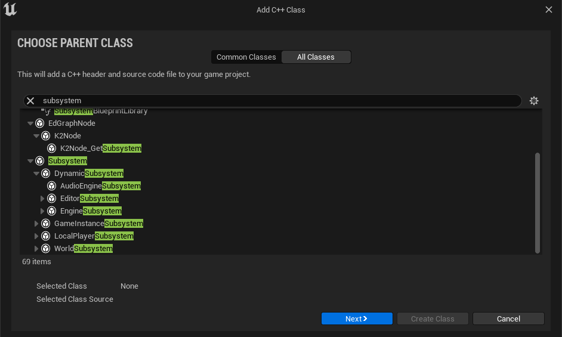
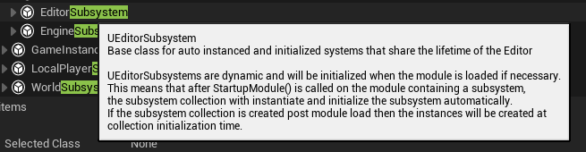
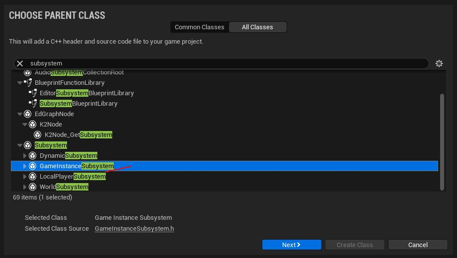
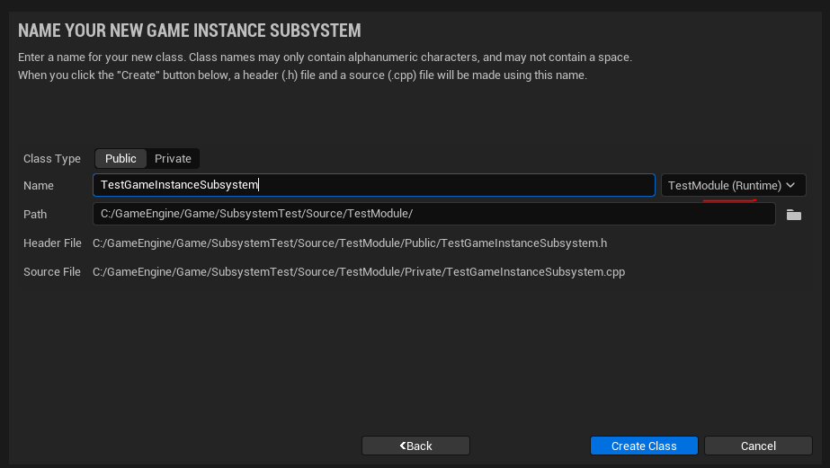
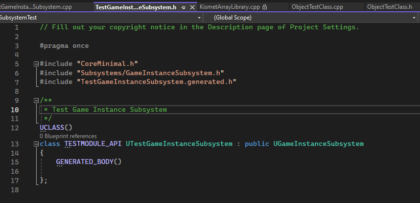
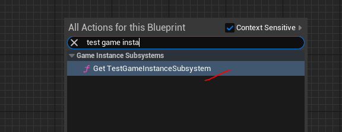
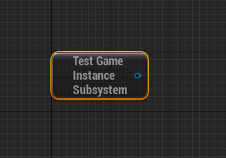
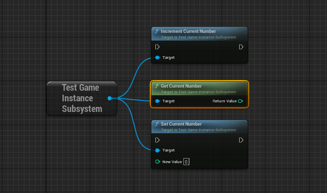
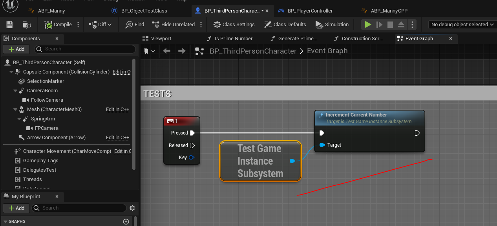
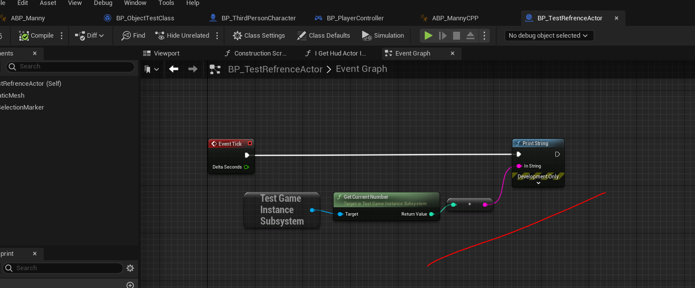

# Подсистемы
Подсистема это синглтон, с управляемым временем жизни. К подсистемам крайне легко получить доступ как из `blueprint`, так и из `с++` кода.
Подсистемы могут быть использованы, в первую очередь, для создания переменных функций с "глобальной" доступностью. Особенно это полезно для `blueprint` кода.
В частности, я планирю написать глобальную систему обмена событиями и глобальное хранилище данных.
## Введение
Основные виды подсистем, доступные в текущей версии `Unreal Engine`, можно увидеть, если перейти в меню `Tools -> New C++ Class -> All Classes`:

Наведя курсор на один из найденных пунктов, можно увидеть подсказку с описанием типа создаваемой подсистемы.

Каждая подсистема привязана к собственному пространству и создается-уничтожается вместе с этим пространством.
Таким образом:
`Editor Subsystem` - этот тип подсистемы создается при открытии редактора `Unreal` и уничтожается при его закрытии. Может быть использована только внутри `Editor` модулей.
`Engine Subsystem` - этот тип подсистемы создается при запуске игрового движка, то есть и в `editor` и в `runtime`.
`WorldSubsystem` - этот тип подсистемы создается при загрузке игрового уровня и уничтожается, когда уровень выгружается из памяти. Этот тип подсистем рекомендуется использовать для скрытия / показа персонажей в зависимости от дистанции до игрока.
`LocalPlayerSubsystem` - этот тип подсистемы создается для каждого `player controller` в вашем проекте. В мультиплеерной игре у каждого игрока будет собственный экземпляр `LocalPlayerSubsystem`. Доступ к этому типу подсистем возможен лишь из `player controller`. Здесь можно создавать сетевую логику обновления или отслеживания каких-то действий игрока, в частности управлять сетевым инвентарем.
`GameInstanceSubsystem` - создается, при загрузке класса `GameInstance`. Данный тип подсистемы доступен для всех персонажей и объектов на уровне.
## Доступ к Подсистемам из `с++`
```cpp
// Engine Subsystem
UMyEngineSubsystem* MySubsystem = GEngine->GetEngineSubsystem<UMyEngineSubsystem>();
// Editor Subsystem
UEditorSubsystem* Subsystem = GEditor->GetEditorSubsystem<UEditorSubsystem>();
// World Sybsystem
UWorldSubsystem* Subsystem = GetWorld()->GetSubsystem<UWorldSubsystem>();
// GameInstance Subsystem
#include "Kismet/GameplayStatics.h"
///
UGameInstance* GameInstance = UGameplayStatics::GetGameInstance(GetWorld());
UGameInstanceSubsystem* Subsystem = GameInstance->GetSubsystem<UGameInstanceSubsystem>();
// Local Player Subsystem
APlayerController* PController = UGameplayStatics::GetPlayerController(GetWorld(), 0);
ULocalPlayer* LPlayer = PController->GetLocalPlayer();
UPlayerSubsystem* Subsystem = LPlayer->GetSubsystem<UPlayerSubsystem>();
```
## Создаем подсистему
Рассмотрим принцип работы подсистеме на собственном пимере.
Идем `Tools -> New C++ Class -> All Classes` ищем `GameInstanceSubsystem`.

Называем класс `TestGameInstanceSubsystem` и добавляем в `TestModule`.

Сгенерированный класс выглядит так.

### `Subsystem Boilerplate`
```cpp
#pragma once
#include "CoreMinimal.h"
// kismet
#include "Kismet/KismetSystemLibrary.h"
// ACharacter class refrence
#include "GameFramework/Character.h"
#include "Subsystems/GameInstanceSubsystem.h" // root class
// .generated.h
#include "TestGameInstanceSubsystem.generated.h"
/**
 * Test Game Instance Subsystem
 */
UCLASS(ClassGroup="Subsystem", meta = (Keywords = "subsystem, instance")) // to simplify search of this subsystem's bp node
class TESTMODULE_API UTestGameInstanceSubsystem : public UGameInstanceSubsystem
{
	GENERATED_BODY()
public:
	/* your code goes here */
};
```
## Расширяем подсистему
После компиляции, разработчик может получить доступ к созданной подсистеме из любого `blueprint` класса.


Переменные, а так-же методы, добавленные в код нашей подсистемы, будут доступны глобально для любого класса.
Давайте их добавим.
```cpp
#pragma once
#include "CoreMinimal.h"
// kismet
#include "Kismet/KismetSystemLibrary.h"
// ACharacter class refrence
#include "GameFramework/Character.h"
#include "Subsystems/GameInstanceSubsystem.h" // root class
// .generated.h
#include "TestGameInstanceSubsystem.generated.h"
/**
 * Test Game Instance Subsystem
 */
UCLASS(ClassGroup="Subsystem", meta = (Keywords = "subsystem, instance")) // to simplify search of this subsystem's bp node
class TESTMODULE_API UTestGameInstanceSubsystem : public UGameInstanceSubsystem
{
	GENERATED_BODY()
public:
	// will increment CurrentNumber private var value
	UFUNCTION(BlueprintCallable, Category = "Operations")
	void IncrementCurrentNumber() {
		CurrentNumber++;
	};
	// will return CurrentNumber private var value
	UFUNCTION(BlueprintCallable, BlueprintPure, Category = "Operations")
	int GetCurrentNumber() const {
		return CurrentNumber;
	};
	// will set CurrentNumber private var value
	UFUNCTION(BlueprintCallable, Category = "Operations")
	void SetCurrentNumber(int NewValue = 0) {
		CurrentNumber = NewValue;
	};
private:
	// we will increment this number
	int CurrentNumber = 0;
};
```

Я добавил 3 функции для тестирования подсистемы. Все они связаны с внутренним `private` параметром класса `CurrentNumber`.
Функция `SetCurrentNumber` устанавливает значение параметра `CurrentNumber`.
Функция `GetCurrentNumber` возвращает значение параметра `CurrentNumber`.
Функция `IncrementCurrentNumber` увеличивает значение параметра `CurrentNumber` на `1`.
Для тестирования подсистемы, я добавил в класс `BP_ThirdPersonCharacter` вызов функции `IncrementCurrentNumber` из подсистемы, по нажатию кнопки `1`.

В совершенно другом, независимом, классе `BP_TestRefrenceActor` я добавил печать значения `CurrentNumber` каждый `tick`.

Как вы видите, изменение значения прекрасно отслеживается, несмотря на то, что прямой связи между `BP_ThirdPersonCharacter` и `BP_TestRefrenceActor` - нет.
