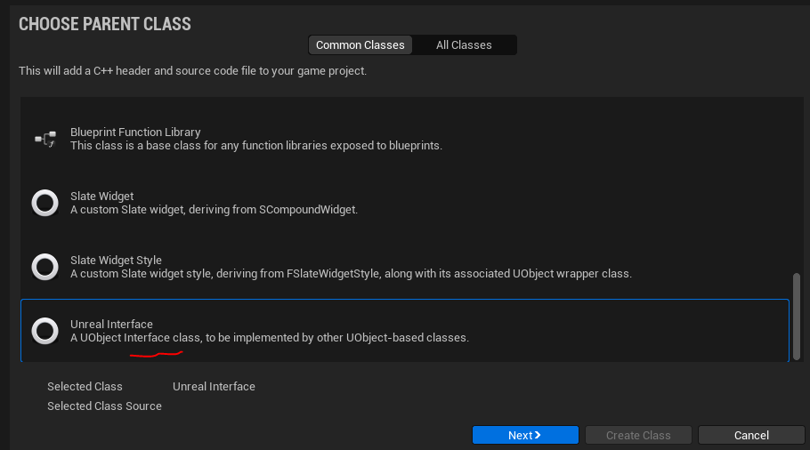
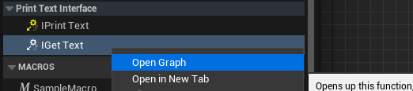

# `UObject Interface` или `UInterface`
Интерфейсы позволяют присваивать объектам универсальные методы, которые можно вызывать без приведения типа.
Использование интерфейсов избавляет разработчика сразу от двух проблем - от множественного вложенного наследования и от потери универсальности классов (что происходит при прямом приведении типа оператором `Cast`).
Реализация методов в `UInterface` сводится к использованию макросов `Reflection System`. Переопределяемые функции `UInterface` должны создаваться с модификатором `BlueprintImplementableEvent`.
Классы `UInterface` могут быть добавлены к любому `UObject` из панели `Class Settings` в редакторе или через обычное наследование.

## Создаем `UObject Interface`
Используем меню `Tools -> New C++ Class`. В появившемся окне ищем пункт `Unreal Interface`.

Называем класс - `PrintTextInterface` и  размещаем его в модуле `TestModule`, в подкаталоге `Interfaces`.


Движок сгенерирует вам заготовку с двумя классами, следующего вида:
```cpp
#pragma once
#include "CoreMinimal.h"
#include "UObject/Interface.h"
#include "PrintTextInterface.generated.h"
// This class does not need to be modified.
UINTERFACE(MinimalAPI)
class UPrintTextInterface : public UInterface
{
	GENERATED_BODY()
};
/**
 * Print Text Interface main class
 */
class TESTMODULE_API IPrintTextInterface
{
	GENERATED_BODY()
	// Add interface functions to this class. This is the class that will be inherited to implement this interface.
public:
};
```
Обратите внимание на комментарий `// This class does not need to be modified.`. Класс `UPrintTextInterface : public UInterface` не надо изменять. Изменять надо класс `class TESTMODULE_API IPrintTextInterface`, который приведен ниже.
Добавляем два тестовых метода
```cpp
// interface event, that will pass Text as Input
// made using BlueprintNativeEvent
UFUNCTION(BlueprintCallable, BlueprintNativeEvent, Category = "PrintTextInterface")
void IPrintText(const FString& Text); // don't need body or realisation
// interface function, that will return TextData value
// made using BlueprintNativeEvent
UFUNCTION(BlueprintCallable, BlueprintImplementableEvent, Category = "PrintTextInterface")
void IGetText(FString& TextData); // don't need body or realisation
```
### Код интерфейса `PrintTextInterface.h`
```cpp
#pragma once
#include "CoreMinimal.h"
#include "UObject/Interface.h"
#include "PrintTextInterface.generated.h"
// This class does not need to be modified.
UINTERFACE(MinimalAPI)
class UPrintTextInterface : public UInterface
{
	GENERATED_BODY()
};
/**
 * Print Text Interface main class
 */
class TESTMODULE_API IPrintTextInterface
{
	GENERATED_BODY()
	// Add interface functions to this class. This is the class that will be inherited to implement this interface.
public:
	// interface event, that will pass Text as Input
	// made using BlueprintNativeEvent
	UFUNCTION(BlueprintCallable, BlueprintNativeEvent, Category = "PrintTextInterface")
	void IPrintText(const FString& Text); // don't need body or realisation
	// interface function, that will return TextData value
	// made using BlueprintNativeEvent
	UFUNCTION(BlueprintCallable, BlueprintImplementableEvent, Category = "PrintTextInterface")
	void IGetText(FString& TextData); // don't need body or realisation
};
```
### Переопределение методов интерфейса в `blueprint`
Добавляем интерфейс к классу `BP_ThirdPersonCharacter`.

Методы `IPrintText` и `IGetText` стали доступны для переопределения.

#### Переопределяем `BlueprintNativeEvent`
Для переопределения методов интерфейса, созданных с использованием `BlueprintNativeEvent` - щелкните по ним правой кнопкой мыши и выберите пункт `Implement event`.

Система сгенерирует событие, привязанное к интерфейсу.

Дополним его следующим образом:

#### Переопределяем методы, которые возвращают значение
Методы интерфейса, которые должны возвращать значение, переопределять не надо, их реализация генерируется автоматически при добавлении интерфейса.
Просто щелкните по методу правой кнопкой мыши и выберите `Open Graph`.

Перед вами откроется редактор метода.

Дополним его следующим образом:

### Вызов методов интерфейса
Вызовем добавленные методы, например, из компонента `UPointersComponent`.
#### Проверка на наличие интерфейса
```cpp
#include "Interfaces/PrintTextInterface.h" // iterface
//...
AActor* Owner = GetOwner();
if (Owner->Implements<UPrintTextInterface>()) {
    // call interface methods
}
```
#### Вызов методов интерфейса
```cpp
#include "Interfaces/PrintTextInterface.h" // iterface
//...
AActor* Owner = GetOwner();
if (Owner->Implements<UPrintTextInterface>()) {
    FString TextResult = TEXT("");
    IPrintTextInterface::Execute_IGetText(Owner, TextResult);
    UE_LOG(LogTemp, Warning, TEXT("IGetText text is %s"), *TextResult)
    IPrintTextInterface::Execute_IPrintText(Owner, TEXT("[Thit text passed to the IPrintText]"));
}
```


### Вызов методов интерфейса в `blueprint`

