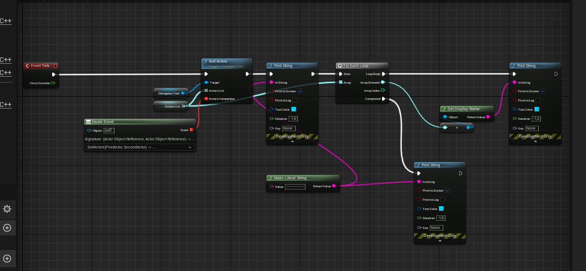

# События и Делегаты
За обработку событий в `Unreal Engine` отвечают особые объекты - т.н. делегаты. Они хранят в себе указатели на обработчики событий (функции) и отвечают за вызов этих обработчиков.
Объекты делегатов генерируются системой `Unreal Header Tool` на основе макроса.
## Структура делегата
Делегаты объявляются в виде макроса такой структуры:
```cpp
DECLARE_[usable_in_blueprint]_[events_count]_DELEGATE_[parameters_count]([delegate_type_name], param1_type, param1_value, param2_type, param2_value);
```
Разберем аргументы:
`usable_in_blueprint` заменяется на `DYNAMIC` если тип делегата должен быть доступен в `blueprin'ах`: `DECLARE_DYNAMIC_DELEGATE_OneParam`
Если же делегат планируется использовать исключительно из с++ кода, то этот аргумент пропускается, например так: `DECLARE_DELEGATE_OneParam`
Только динамические делегаты можно использовать в `blueprint`, это на будущее.
`events_count` - заменяется на `MULTICAST` - указывает на число доступных для подключения обработчиков (каналов) - если планируется привязка нескольких обработчиков: `DECLARE_MULTICAST_DELEGATE_OneParam`
в противном случае этот аргумент пропускается: `DECLARE_DELEGATE_OneParam`
`parameters_count` - число параметров, пишется в PascalCase. Может принимать значения вплоть до 9: `OneParam, TwoParams, ThreeParams, FourParams, FiveParams, SixParams, SevenParams, EightParams, NineParams`.
```cpp
// Blueprint acessible delegate with two parameters
DECLARE_DYNAMIC_MULTICAST_DELEGATE_TwoParams(FDArrayTest,const TArray<int>&, ArrayData, const FString&, StringData);
// Multicast Usual Delegate
DECLARE_MULTICAST_DELEGATE_ThreeParams(DFUsualMulticastSumm, int NumA, int NumB, int& Result);
```
Если кол-во параметров делегата равно 0, то данный аргумент пропускается.
```cpp
// Delegate with no params
DECLARE_DYNAMIC_MULTICAST_DELEGATE(FTestSimpleDelegate);
```
`delegate_type_name` - название типа, которое будет использовано при генерации делегата. Поскольку сгенерированный UHT объект делегата является структурой `struct`, - название типа делегата должно начинаться с буквы `F`.
Обратите внимание на `;` после макроса. Макросы делегатов надо закрывать символом `;`, в отличие от всех остальных макросов в движке. (Странно, что это не привели к единому  стилю, но, полагаю, сейчас это уже поздно исправлять из за риска потери совместимости.)
Примеры:
```cpp
// Генерация типа FSimpleCallable, передающего один параметр: int:Number
// Данный тип не будет доступен в blueprint (нет DYNAMIC)
// К этому типу может быть подключен лишь один обработчик (нет MULTICAST)
DECLARE_DELEGATE_OneParam(FSimpleCallable, int32, Number);
// Генерация типа FOnScoreChanged, передающего два параметра типа int:NewScore и APlayerState*:OwningPlayer
// Данный тип будет доступен в blueprint (DYNAMIC)
// К этому типу можно добавить множество обработчиков (MULTICAST)
DECLARE_DYNAMIC_MULTICAST_DELEGATE_TwoParams(FOnScoreChanged, int32, NewScore, APlayerState*, OwningPlayer);
// Генерация типа FOnDataUpdated, передающего три параметра: Массив TArray<int32>:Data, TMap<FName,float):ItemsMap и указатель AActor*:ActorPointer
// Данный тип не будет доступен в blueprint (нет DYNAMIC)
// К этому типу можно добавить множество обработчиков (MULTICAST)
DECLARE_MULTICAST_DELEGATE_ThreeParams(FOnDataUpdated, TArray<int32>, Data, TMap<FName,float), ItemsMap, AActor*, ActorPointer);
```
## Подготовка к работе
Для тестирования функционала делегатов - создадим новый компонент типа `UActorComponent`.

Называем файл компонента - `DelegatesTest` добавляем его к `TestModule`.

## Зависимости
Изменяем файл `TestModule.build.cs` следующим образом:
```cpp
using System.IO;
using UnrealBuildTool;
public class TestModule : ModuleRules
{
	public TestModule(ReadOnlyTargetRules Target) : base(Target)
	{
        PCHUsage = PCHUsageMode.UseExplicitOrSharedPCHs;
		PublicDependencyModuleNames.AddRange(new string[] {
			"Core",
			"CoreUObject",
			"Engine",
            "Slate",
			"SlateCore",
			"LocalizationCommandletExecution",
            "GameplayTags"
        });
        PrivateDependencyModuleNames.AddRange(new string[] {
            "InputCore"
            , "EnhancedInput"
        });
        PublicIncludePaths.AddRange(new string[] {"TestModule/Public", "TestModule/Public/Enums" });
		PrivateIncludePaths.AddRange(new string[] {
            Path.Combine(ModuleDirectory, "Private")
        });
	}
}
```
## Динамические Делегаты `DYNAMIC`
Как уже было выше сказано - динамические делегаты можно вызывать из `blueprint` кода.
Обычный, одноканальный `DYNAMIC` делегат может работать лишь в качестве аргумента функции. Если-же нужен делегат внутри класса - то следует использовать `DYNAMIC_MULTICAST` (в противном случае код просто не скомпилируется).
Рассмотрим оба случая.
### Динамические многоканальные делегаты `DYNAMIC MULTICAST`
К `MULTICAST` делегату можно подключать несколько событий, которые вызываются в произвольном порядке. Подобный тип делегата чаще всего используется внутри классов.
Зададим простейший тип динамического `MULTICAST` делегата:
```cpp
// Blueprint acessible delegate with two parameters
DECLARE_DYNAMIC_MULTICAST_DELEGATE_TwoParams(FTPDTest,const TArray<int>&, ArrayData, FString, StringData);
```
Так-же теле класса `UDelegatesTest` надо создать переменную, которая будет использовать сгенерированный макросом тип делегата.
При этом у переменной должен быть модификатор `BlueprintAssignable`. Этот модификатор позволит привязать функцию к делегату через `blueprint`.
```c++
UPROPERTY(BlueprintAssignable, Category = "Delegates")
FDArrayTest ArrayTestDelegate;
```

Теперь можно скомпилировать код и проверить его доступность из `blueprint`. Для этого добавим компонент `UDelegatesTest` к персонажу `BP_ThirdPersonCharacter`.
После чего поищем там наш `ArrayTestDelegate`.


#### Запуск делегата по таймеру
Разовьем идею делегата, настроив его вызов по таймеру.
```cpp
GetWorld()->GetTimerManager().SetTimer(*(new FTimerHandle()), [this]()->void {
    if (ArrayTestDelegate.IsBound()) {
        TArray<int> Items = { 5,4,2,1 };
        // call delegate
        ArrayTestDelegate.Broadcast(Items, TEXT("Test"));
    }
}, 2.1f, true);
```

Метод `Broadcast` в динамическом `MULTICAST` делегате позволяет вызвать каждую из привязанных функций, включая функции `blueprint`.
Ну и сам `blueprint` код изменим, чтобы он выводил данные:


Как вы видите - привязанный через делегат метод `blueprint` - вызывается.
### Возвращаемые значения в динамическом делегате
Помимо отправки значений в `blueprint`, динамические делегаты так-же поддерживают и получение значений оттуда.
Для этого просто сделайте один из аргументов делегата - ссылкой `&`. Без модификатора `const`.
```cpp
// Delegate with Return Value
DECLARE_DYNAMIC_MULTICAST_DELEGATE_ThreeParams(FDFloatSumm, float, a, float, b, float&, c);
// ...
// Delegate with Return Value
UPROPERTY(BlueprintAssignable, Category = "Delegates")
FDFloatSumm FloatSummDelegate;
```
В данном случае это параметр `c`.
После компиляции, внутри `blueprint` у нас будет возможность задать два типа привязок к делегату: `Event` и `EventDispatcher`.

Так вот. Если использовать `AddEvent` то параметров будет всего два и работать как надо метод не сможет.

Если мы попытамся скомпилировать `blueprint` с таким кодом, подключив его к `BeginPlay`, то увидим ошибку:

```cpp
[Compiler] No value will be returned by reference. Parameter 'c'. Node:  Bind Event to Float Summ Delegate
[Compiler] CustomEvent  Signature Error: The function/event 'CustomEvent' does not match the necessary signature - has the delegate or function/event changed?
```
Движок прямо говорит нам, что сигнатура переданной функции не совпадает с тем, что запрашивает делегат.
Для реализации делегатов с возвратом значения надо использовать `Event Dispatchers -> Create Event`.

Это действие создаст вам узел `CreateEvent`, в выпадающем списке которого надо выбрать пункт - `Create Matching Function`.

Это позволит сгенерировать функцию, подходящую к делегату.


В этой функции убдет узел `Return Node` с параметром `c`.
По умолчанию имя такой сгенерированной функции будет представлять собой сущий хаос. Советую переименовать ее во что-то более читабельное. И заполнить вычисление суммы.

Как же получить значение параметра `c`, переданного из `blueprint` кода в с++?
Метод `Broadcast` позволяет возвращать значения по ссылке, так что это довольно просто:
```cpp
GetWorld()->GetTimerManager().SetTimer(*(new FTimerHandle()), [this]()->void {
    // Call Summ Delegate
    float Result = 0.0f;
    FloatSummDelegate.Broadcast(2.3f, 1.1f, Result);
    UE_LOG(LogTemp, Warning, TEXT("Summ Delegate Result = %f"), Result)
}, 2.1f, true);
```

В процессе у меня появился странный баг движка, который не пропал даже после перезапуска. `Warning: No value will be returned by reference. Parameter 'c'. Node:  Bind Event to Float Summ Delegate`. Несмотря на баг, код работал правильно. Советую не обращать на него внимания, с делегатами и диспетчерами такое часто случается даже в `blueprint`.

### Использование динамических делегатов в `с++`
Хотя динамические делегаты рассчитаны на взаимодействие с `blueprint`, их так-же можно использовать и из `с++` кода.
Для этого есть методы `AddDynamic` если делегат `MULTICAST` и `BindDynamic`, если не `MULTICAST`.
Поскольку наш делегат позволяет подключение множества обработчиков,
сделаем метод `Summ` внутри класса и добавим его к делегату.
```cpp
// .h
// Delegate with Return Value
DECLARE_DYNAMIC_MULTICAST_DELEGATE_ThreeParams(FDFloatSumm, float, a, float, b, float&, c);
// This is default signature for Summ Delegate
UFUNCTION(BlueprintCallable, Category = "Summ")
void Summ(float a, float b, float& c){ c = a+b; };
// .cpp constructor
// Assign default value to FloatSummDelegate
FloatSummDelegate.AddDynamic(this, &UDelegatesTest::Summ);
```
В коде, к стати, не учтена одна важная особенность динамических делегатов - они поддерживают сериализацию. То есть могут быть сохранены вместе с объектом.
Поэтому вполне возможна ситуация, когда метод `Summ` привяжется не один раз, как мы бы того хотели, а несколько раз, в зависимости от количества вызовов конструктора.
Давайте посмотрим как это выглядит, потому что вышеуказанный код содержит этот баг.
Добавим в функцию `Summ` вывод лога.
```cpp
// Summ Implementation
void UDelegatesTest::Summ(float a, float b, float& c)
{
	c = a+b;
	UE_LOG(LogTemp, Warning, TEXT("Summ Is = %f"), c)
}
```
И вызовем сам делегат в `BeginPlay`.
```cpp
GetWorld()->GetTimerManager().SetTimer(*(new FTimerHandle()), [this]()->void {
    // Call Summ Delegate
    float Result = 0.0f;
    FloatSummDelegate.Broadcast(2.3f, 1.1f, Result);
    UE_LOG(LogTemp, Warning, TEXT("Summ Delegate Result = %f"), Result)
}, 2.1f, true);
```

При единовременном запуске игры мы видим следующее:

При двойном - следующее:

А при тройном следующее:

И так далее, поскольку конструктор вызывается раз за разом, а делегат - сериализуется.
Что делать? Для этого в делегате есть метод - `AddUniqueDynamic`.
```cpp
// Assign default value to FloatSummDelegate
FloatSummDelegate.AddUniqueDynamic(this, &UDelegatesTest::Summ);
```
Или отвязывать предыдущие вызовы через `RemoveDynamic`:
```cpp
// Assign default value to FloatSummDelegate
FloatSummDelegate.RemoveDynamic(this, &UDelegatesTest::Summ);
FloatSummDelegate.AddDynamic(this, &UDelegatesTest::Summ);
```

### Динамические одноканальные делегаты как аргументы функций
Выше я рассмотрел примеры делегатов, как части класса, но их можно, так-же, использовать с функциями.
Правда с оговоркой:

> `MULTICAST` делегаты аргументами функций быть не могут.

Поэтому работать будем с обычным динамическим делегатом.
#### Сортировка массива вида -`TArray<TSoftObjectPtr<AActor>>`
Давайте для примера реализуем умную сортировку `Actor'ов`. Точнее функцию умной сортировки, в которой компаратором(методом сравнения) будет выступать делегат, задаваемый из `blueprint`.
Поскольку обычный массив указателей типа `Actor` задать из `blueprint` не получится - для начала реализуем сортировку массива вида `TArray<TSoftObjectPtr<AActor>>`. Если вы помните, `TSoftObjectPtr` может ссылаться на ассеты с любых уровней. И эти ассеты можно задать прямо из движка.
Давайте зададим массив для  сортировки в `blueprint`. Для этого создайте переменную `ActorsList` типа `Actor -> Soft Object Refrence`.

Эта переменная должна быть массивом.

Поскольку это `Soft` указатель, мы можем указать внутри него объекты на открытом по умолчанию уровне. В нашем случае это уровень из `Third Person Shooter Template`.
На уровне есть синие кубики, возьмите их и поставьте в ряд.

Рекомендую так-же переименовать кубики следующим образом: `Cube1, Cube2, Cube3, Cube4`.

Теперь эти кубики надо поместить в массив `ActorsList`. Просто щелкаете на `+` и добавляете из выпадающего списка. Этот трюк не сработал бы, если бы наш массив - был массивом чистых указателей. Поскольку это `Soft` указатели, то так можно делать.

Теперь вернемся к коду и напишем делегат, которым будем сортировать кубики. Делегат должен быть одинарным, без модификатора `MULTICAST`.
```cpp
// Delegate for SortActors()
DECLARE_DYNAMIC_DELEGATE_ThreeParams(FDActorsComparator, TSoftObjectPtr<AActor>, FirstActor, TSoftObjectPtr<AActor>, SecondActor, bool&, Result);
```
Поскольку последний параметр компаратора передается по ссылке, это `bool& Result`, движок посчитает его - возвращаемым значением.
Теперь нужна сама функция сортировки. Мы будем сортировать массив "по ссылке", то есть функция не будет возвращать значений. Причем передавать по ссылке мы будем массив вида: `TArray<TSoftObjectPtr<AActor>>& `. (Не думал что сработает, но сработало.)
```cpp
// .h
// Actor
#include "GameFramework/Actor.h"
// ...
// Array of Actors sorting by ref
UFUNCTION(BlueprintCallable, Category = "Sort")
void SortActors(UPARAM(ref) TArray<TSoftObjectPtr<AActor>>& ActorsList, FDActorsComparator ActorsComparator);
```
Реализация функции выглядит так:
```cpp
// .cpp
// SortActors Implementation
void UDelegatesTest::SortActors(UPARAM(ref)TArray<TSoftObjectPtr<AActor>>& ActorsList, FDActorsComparator ActorsComparator)
{
	// Call Array.Sort with lambda comparator in which call comparator delegate
	ActorsList.Sort([&](TSoftObjectPtr<AActor> A, TSoftObjectPtr<AActor> B) -> bool{
		bool Result = false;
		ActorsComparator.ExecuteIfBound(A, B, Result);
		return Result;
	});
}
```
Тут я вызываю метод `TArray::Sort`, который встроен в класс массива и передаю ему лямбду.
Внутри лямбды я просто вызываю делегат, если он к чему-либо  привязан. В функции вызова есть отличие с предыдущим делегатом.
Обычные делегаты вызываются методом `Execute` или `ExecuteIfBound`, а делегаты типа `MULTICAST` вызываются методом `Broadcast`.
Параметр `Result` передается по ссылке.


После компиляции в `blueprint` появится возможность вызвать метод `SortActors`.

Его компаратор должен быть задан как `Event Dispatchers -> Create Event`, потому что компаратор имеет возвращаемое значение.


Сгенерируйте функцию компаратора. Внутри функции необходимо добавить сравнение дистанций от каждого из акторов до нашего персонажа.

Если короче - мы будем сортировать кубики по дистанции до нашего игрового персонажа.
Теперь в событии `tick` реализуйте такой набор узлов:

Если скомпилировать и запустить проект - в лог будет печататься список кубиков. Первым будет тот кубик, который ближе всего к нашему персонажу.


#### Сортировка массива вида - `TArray<AActor*>`
Давайте, за одно, напишем и функцию сортировки нормального массива `AActor'ов`. Без `Soft` указателей.
```cpp
// Delegate for SortActorsRaw()
DECLARE_DYNAMIC_DELEGATE_ThreeParams(FDActorsComparator, AActor*, FirstActor, AActor*, SecondActor, bool&, Result);
// ..
// Array of Actors sorting by raw ref
UFUNCTION(BlueprintCallable, Category = "Sort")
void SortActorsRaw(UPARAM(ref) TArray<AActor*>& ActorsList, FDActorsRawComparator ActorsComparator);
```
И реализация функции `SortActorsRaw`:
```cpp
// SortActorsRaw Implementation
void UDelegatesTest::SortActorsRaw(UPARAM(ref) TArray<AActor*>& ActorsList, FDActorsRawComparator ActorsComparator)
{
	// Call Array.Sort with lambda comparator in which call comparator delegate
	ActorsList.Sort([&](AActor& A, AActor& B) -> bool {
		bool Result = false;
		ActorsComparator.ExecuteIfBound(&A, &B, Result);
		return Result;
	});
}
```


После компиляции в `blueprint` будет доступна функция `SortActorsRaw`, которая принимает массив указателей на `Actor`.

#### Конверсия массива `TSoftObjectPtr` в массив `AActor`
Давайте, для интереса, напишем функцию конверсии массива `TSoftObjectPtr` в массив `AActor`.
Вообще, надо бы делать это как `Latent Action + Asset Manager`, но я этих тем еще не касался, поэтому используем грязный подход через `LoadSynchronous()`, у нас просто эксперименты.
```cpp
// .h
// Resolving Soft PointersArray
UFUNCTION(BlueprintPure, Category = "Convert")
TArray<AActor*> ResolveArray(TArray<TSoftObjectPtr<AActor>> Actors);
// ...
// .cpp
// Implementation of ResolveArray
TArray<AActor*> UDelegatesTest::ResolveArray(TArray<TSoftObjectPtr<AActor>> Actors)
{
	TArray<TObjectPtr<AActor>> Result;
	for (TSoftObjectPtr Item : Actors) {
		Result.Add(Item.LoadSynchronous());
	}
	return Result;
}
```
В результате у нас получится `Pure` функция, принимающая массив `Soft` указателей и  возвращающая его `Raw` версию.

Теперь, когда готова функция конвертирования - давайте проверим как будет работать сортировка `Raw` указателей.
#### Проверка работы
Создаем компаратор как и до этого.

И в событии `tick` реализуем код тестирования.

Все работает.


## Делегаты и TMap
Давайте создадим еще один делегат, один из параметров которого будет иметь тип `TMap`.

При попытке скомпилировать файл с таким делегатом выпадет ошибка:
```
too many arguments for function-like macro invocation 'DECLARE_DYNAMIC_MULTICAST_DELEGATE_ThreeParams'
```
Которая переводится как: "слишком много аргументов".
Почему? Потому что в парсере Unreal Header Tool, который обрабатывает макрос делегата, не предусмотрено отдельное условие для типа `TMap`. И судя по всему никогда уже не будет предусмотрено.
В декларации `TMap`, как вы видите, содержится запятая `TMap<FName, int>`, ведь это шаблонный тип . Запятыми же в макросе разделяются параметры. Вот и получается, что UHT определяет в моем коде 4 параметра, а не три.
Как обойти эту проблему?
В интернете пишут, что проблема решается через `typedef`, но это не так. Во всяком случае я не смог заставить код с `typedef` работать.
Все-же приведу его вам.
```cpp
// Map Wrapped into typedef
typedef TMap<FName, int> DelegateNameIntMap;
DECLARE_MULTICAST_DELEGATE_OneParam(FDNonDynamicDelegate, DelegateNameIntMap, MapData);
```
Объясняю, почему `typedef` не будет работать. Потому что макрос `DECLARE...DELEGATE` обрабатывается перед компиляцией через Unreal Header Tool. А он, этот самый UHT, понятия не имеет ни об каком `typedef`. Сама же команда `typedef` срабатывает лишь при компиляции.
Как быть?
Самое простое - это использовать два `TArray` вместо одного `TMap`. Один массив на ключи, второй на значения.
Если вас не устраивает этот способ, то можно использовать структуры.
Необходимо задать структуру с полем `TMap`, причем для нас важна не обычная структура, а `USTRUCT`, то есть такая, которую воспринимает UHT.
После чего скормить эту структуру в макрос.
Поскольку UHT обрабатывает и вполне воспринимает `USTRUCT`  и `UCLASS`, такой подход сработает.
```cpp
// Map wrapped into struct
USTRUCT(BlueprintType)
struct FMapContainer {
	GENERATED_USTRUCT_BODY()
	FMapContainer(){};
	UPROPERTY(BlueprintReadWrite, EditAnywhere)
	TMap<FName, int> MapField;
};
// Blueprint accessible delegate with TMap parameter
DECLARE_DYNAMIC_MULTICAST_DELEGATE_ThreeParams(FDMapTest,const TArray<int>&, ArrayData, const FString&, StringData, FMapContainer, MapData);
```
Обратите внимание, что и сам параметр `TMap` должен быть `UPROPERTY(BlueprintReadWrite, EditAnywhere)`.


## Обычные делегаты
Под "обычными" делегатами я имею в виду не `DYNAMIC` делегаты.
Синтаксис их определения немного отличается. К тому-же о использовании обычных делегатов статей в интернете почти нет(их нет). Между тем их очень часто используют вместе с системой `Sltate` для программирования элементов интерфейса.
Работать с обычными делегатами можно лишь из `с++`, в `blueprnt'ах` они не доступны. Однако взамен они предоставляют множество способов подключения сигналов от самых разных объектов.
В частности к таким делегатам можно привязывать лямбды и указатели на функции, что используется довольно часто.
Давайте создадим такой "обычный" делегат или даже пару делегатов.
```cpp
// .h
// Usual Delegates
// Multicast Usual Delegate
DECLARE_MULTICAST_DELEGATE_ThreeParams(DFUsualMulticastSumm, int NumA, int NumB, int& Result);
// Single Usual Delegate
DECLARE_DELEGATE_ThreeParams(DFUsualSumm, int NumA, int NumB, int& Result);
```
Обратите внимание на список аргументов - `int NumA, int NumB, int& Result`.

> В обычных делегатах тип аргумента не отделяется от его названия символом запятой `,`.

Для сравнения, если вы вдруг забыли, вот как определяется динамический делегат:
```cpp
DECLARE_DYNAMIC_MULTICAST_DELEGATE_ThreeParams(FDFloatSumm, float, a, float, b, float&, c);
```
Обычные делегаты, в отличие от динамических, нельзя вывести в `blueprint`.
Давайте проверим.
#### Проверка вывода обычного делегата в `blueprint`
Создадим в коде две переменные для наших делегатов `DFUsualMulticastSumm` и `DFUsualSumm`.

Ради интереса, давайте пропишем одному из обычных делегатов `UPROPERTY`. Попытаемся разрешить его использование в `blueprint`.

Ожидаемо, при попытке компиляции такой код выдал ошибку:
```cpp
Error: Unable to find 'class', 'delegate', 'enum', or 'struct' with name 'DFUsualSumm'
  Total of 0 written
```

### Способы привязки обычных делегатов
Давайте рассмотрим способы привязки обычных делегатов.
`MULTICAST` делегат использует методы начинающиеся на `Add*`.

Не `MULTICAST` делегат использует методы начинающиеся на `Bind*`.

### Binding Raw
`*Raw` - привязка к неуправляемым сборщиком мусора классам. То есть к не `UOBJECT` классам.
Давайте создадим неуправляемый класс и привяжем его метод к `MULTICAST` делегату.
```cpp
// .h
// simple class for binding
class SimpleRawClass {
	public:
	void Summ(int a, int b, int& c) {
		c = a+b;
	}
};
//...
// Multicast Usual Delegate
DECLARE_MULTICAST_DELEGATE_ThreeParams(DFUsualMulticastSumm, int NumA, int NumB, int& Result);
//...
// Usual Multicast Delegate
DFUsualMulticastSumm UsualMulticastSumm;
// ...
// .cpp
// Constructor
// Usual Multicast delegate test
TUniquePtr<SimpleRawClass> Raw(new SimpleRawClass());
UsualMulticastSumm.AddRaw(Raw.Get(), &SimpleRawClass::Summ);
```

Тестировать будем как и в прошый раз - внутри таймера:
```cpp
GetWorld()->GetTimerManager().SetTimer(*(new FTimerHandle()), [this]()->void {
    // Call Usual Delegates
    int UResult;
    UsualMulticastSumm.Broadcast(11, 20, UResult);
    UE_LOG(LogTemp, Warning, TEXT("Result = %d"), UResult)
}, 2.1f, true);
```


###  Binding Lambda
На сей раз привяжем лямбду. Только не в `MULTICAST` делегату, а к самому обычному, одиночному, делегату.
```cpp
// .h
//...
// Single Usual Delegate
DECLARE_DELEGATE_ThreeParams(DFUsualSumm, int NumA, int NumB, int& Result);
//...
// Usual Delegate
DFUsualSumm UsualSumm;
//...
//.cpp
// Constructor
// Lambda Binding Test
UsualSumm.BindLambda(
    [&](int a, int b, int& c) -> void{
        c = a+b;
    }
);
```

Для тестирования делегат вызывается в таймере:
```cpp
GetWorld()->GetTimerManager().SetTimer(*(new FTimerHandle()), [this]()->void {
 
    int UResult;
    UsualSumm.ExecuteIfBound(5, 15, UResult);
    UE_LOG(LogTemp, Warning, TEXT("Result = %d"), UResult)
     
}, 2.1f, true);
```

### Binding `UObject`
`*UObject`Если функция-обработчик находится внутри `UObject'а`, ее привязывают именно этим способом.
Зададим функцию:
```cpp
// .h
// Summ Int
UFUNCTION(BlueprintCallable, Category = "SummInt")
void SummInt(int a, int b, int& c);
// ...
// .cpp
// SummInt Implementation
void UDelegatesTest::SummInt(int a, int b, int& c)
{
	c = a + b;
}
```
Привязывается она следующим образом:
```cpp
//.h
// Multicast Usual Delegate
DECLARE_MULTICAST_DELEGATE_ThreeParams(DFUsualMulticastSumm, int NumA, int NumB, int& Result);
//...
// Usual Multicast Delegate
DFUsualMulticastSumm UsualMulticastSumm;
//.cpp
// constructor
// bind UObject
UsualMulticastSumm.AddUObject(this, &UDelegatesTest::SummInt);
```
Для тестирования делегат вызывается в таймере.
```cpp
GetWorld()->GetTimerManager().SetTimer(*(new FTimerHandle()), [this]()->void {
 
    int UResult;
    UsualMulticastSumm.Broadcast(11, 20, UResult);
    UE_LOG(LogTemp, Warning, TEXT("Result = %d"), UResult)
     
}, 2.1f, true);
```

### Binding Static
`BindStatic / AddStatic` - позволяет привязывать `static` методы классов к делегату.
Зададим такой метод в нашем тестовом классе:
```cpp
static void StaticSumm(int a, int b, int& c) {
    c = a + b;
}
```

Теперь его можно привязать к, например, обычному `MULTICAST` делегату.
```cpp
// .h
// simple class for binding
class SimpleRawClass {
	public:
	void Summ(int a, int b, int& c) {
		c = a+b;
	}
	static void StaticSumm(int a, int b, int& c) {
		c = a + b;
	}
};
//...
// Multicast Usual Delegate
DECLARE_MULTICAST_DELEGATE_ThreeParams(DFUsualMulticastSumm, int NumA, int NumB, int& Result);
//...
// Usual Multicast Delegate
DFUsualMulticastSumm UsualMulticastSumm;
//...
//.cpp
// constructor
// bind static method
UsualMulticastSumm.AddStatic(&SimpleRawClass::StaticSumm);
```
Для теста все вызывается в том-же самом таймере.
```cpp
GetWorld()->GetTimerManager().SetTimer(*(new FTimerHandle()), [this]()->void {
 
    int UResult;
    UsualMulticastSumm.Broadcast(11, 20, UResult);
    UE_LOG(LogTemp, Warning, TEXT("Result = %d"), UResult)
 
}, 2.1f, true);
```

### Binding SP
`AddSP / BindSP` - привязка ссылки на метод объекта как `TSharedPtr`.
Используется с обычными `raw` указателями на объект.
```cpp
// .h
// simple class for binding
class SimpleRawClass {
	public:
	void Summ(int a, int b, int& c) {
		c = a+b;
	}
	static void StaticSumm(int a, int b, int& c) {
		c = a + b;
	}
};
//...
// Multicast Usual Delegate
DECLARE_MULTICAST_DELEGATE_ThreeParams(DFUsualMulticastSumm, int NumA, int NumB, int& Result);
//...
// Usual Multicast Delegate
DFUsualMulticastSumm UsualMulticastSumm;
// ...
// .cpp
// Constructor
TSharedPtr<SimpleRawClass> Raw = MakeShareable(new SimpleRawClass()); // create pointer to class
UsualMulticastSumm.AddSP(Raw.ToSharedRef(), &SimpleRawClass::Summ); // add class method Summ to delegate
```
Для тестирования привязки, делегат вызывается в том-же самом таймере.
```cpp
GetWorld()->GetTimerManager().SetTimer(*(new FTimerHandle()), [this]()->void {
    int UResult;
    UsualMulticastSumm.Broadcast(11, 20, UResult);
    UE_LOG(LogTemp, Warning, TEXT("Result = %d"), UResult)
}, 2.1f, true);
```

## Передача делегата в лямбда - выражение
Иногда надо передать делегат в лямбду, чтобы вызвать его, например, из другого потока. Делается это с применением `Move` семантики.
```cpp
DECLARE_DYNAMIC_DELEGATE_OneParam(FCallResultDelegate, FString, FinishMessage);
//...
static void MakeThreadedDelay(float DelayDuration, FCallResultDelegate ResultDelegate) {
    // make async thread
    Async(EAsyncExecution::Thread, [&]()->FString {
        FPlatformProcess::Sleep(DelayDuration);
        return "Thread Finished";
    })
    // call Then after thread is done.
    // *note: Delegates can't be used in lambdas directly, we should Move them in lambda scope
    .Then([Delegate = MoveTemp(ResultDelegate)](TFuture<FString> Result) -> void {
        if (Result.IsValid()) { // Make Sure result valid
            Delegate.ExecuteIfBound(Result.Get()); // call bound event
        }
    });
}
```
##Предзаданные делегаты
В движке `Unreal Engine` есть ряд предзаданных делегатов, которые можно использовать, если хочется вызвать функцию или лямбду без аргументов, не заморачиваясь написанием длинного макроса `DECLARE_...`.
## `FSimpleDelegate`
`FSimpleDelegate` - самый простой одиночный делегат, к которому можно привязать лямбду или функцию. Не имеет никаких аргументов. Многие методы `Unreal Engine` запрашивают этот делегат в качестве одного из своих аргументов.
```cpp
FSimpleDelegate Delegate;
Delegate.BindLambda([]() -> void{
    UE_LOG(LogTemp, Warning, TEXT("SimpleDelegate Called!"));
});
Delegate.Execute(); // run
```

`FSimpleMulticastDelegate` - простой многоканальный делегат, к которому можно подключить несколько методов. Не имеет аргументов.
```cpp
FSimpleMulticastDelegate Delegate;
Delegate.AddLambda([]() -> void{
    UE_LOG(LogTemp, Warning, TEXT("FSimpleMulticastDelegate Called 1"));
});
Delegate.AddLambda([]() -> void {
    UE_LOG(LogTemp, Warning, TEXT("FSimpleMulticastDelegate Called 2"));
});
Delegate.Broadcast(); // run
```

## `FTSSimpleMulticastDelegate`
`FTSSimpleMulticastDelegate` - простой многоканальный делегат.
Работает точно так-же как и `FSimpleMulticastDelegate`, в дополнение к его возможностям предоставляя возможность привязки нескольких обработчиков.
##Links
https://docs.unrealengine.com/4.27/en-US/ProgrammingAndScripting/ProgrammingWithCPP/UnrealArchitecture/Delegates/
https://benui.ca/unreal/delegates-advanced/
