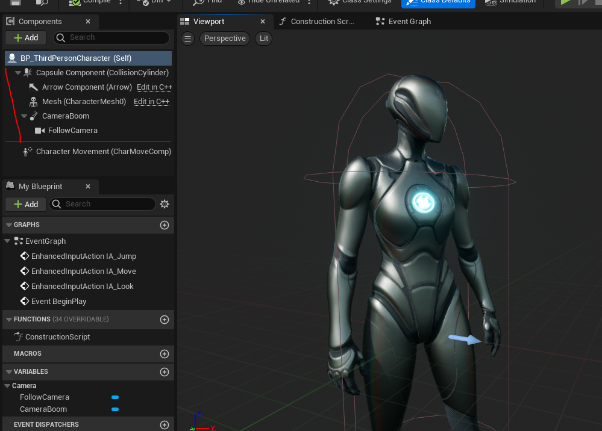

# Компоненты в Unreal Engine
В этой статье мы освоим компоненты, а так-же попробуем сделать с ними все, что может понадобиться в реальной практике.
Файлы классов мы будем создавать внутри `blueprint-based` проекта с модулями.
Компоненты для теста будут добавляться в основной `blueprint` класс персонажа - `BP_ThirdPersonCharacter`.

## Введение в компоненты
Компоненты - одна из сильнейших сторон `Unreal Engine` (и его "ахиллесова пята", потому что именно компоненты - главная причина плохой производительности движка при работе с большими сценами).
Благодаря компонентам разработчик может конструировать игровые объекты. Они - один из лучших способов организации игровой логики.
Чтобы добавить компонент к блюпринту `BP_ThirdPersonCharacter` нажмите на кнопку `Add` в меню `Components`.

Вы увидите огромное количество доступных для использования компонентов.

Класс персонажа по умолчанию состоит из следующих компонент:

Важно понимать, что компоненты можно создавать и через блюпринты.
Однако у таких компонентов не получится создать визуальную составляющую, как бы вы этого не хотели. К тому-же производительность `blueprint` компонентов оставляет желать лучшего и  я не рекомендую выносить логику метода `tick` в `blueprint` компоненты.
Высокопроизводительные компоненты с визуальной составляющей, такие как `SkeletalMeshComponent`, можно создавать только через `с++`.
Компоненты можно добавлять ко всем классам, унаследованным от `UObject`. Однако удобное меню добавления компонентов есть только у классов, унаследованных от `Actor`.
Большинство встроенных компонентов движка находится в модуле `Engine` в папке `Classes -> Components`.
Относительный путь: `Runtime\Engine\Classes\Components\ActorComponent.h`.

Однако, некоторые компоненты идут в отдельных папках, например в `Plugins`. Компонент камеры `UCameraComponent`, который мы будем изучать в этой статье, находится тут: `Runtime\Engine\Classes\Camera\CameraComponent.h`.

## Базовые классы компонентов
`Unreal Engine` предоставляет пользователю ряд готовых основ для будущих компонентов.
Это такие классы как:
`UActorComponent` - базовый класс для всех компонентов. В нем минимум логики, у него нет параметра `Transform`.
`USceneComponent` - базовый класс для чуть более сложных компонентов. Его можно крепить к  сокетам, у этого компонента есть параметр `Transform`, но все еще нет визуального представления. Которое пользователь, тем не менее, может сгенерировать сам.
Все остальные компонеты движка, так или иначе, наследуются от этих трех типов.
## Поиск компонентов в классе `AActor`
Поскольку все `Actor'ы` на игровом уровне состоят из компонентов - умение эти компоненты находить и потом использовать - ключевое и наиболее часто применяемое.
Прежде чем приступать к созданию собственного компонента, давайте изучим способы нахождения имеющихся компонентов, на примере класса персонажа.
В `blueprint` коде у вас есть 4 функции для поиска компоненетов.
Это:

- `Get Component By Class` - ищет компонент по классу
- `Get Components By Class` - ищет все компоненты указанного класса
- `Get Component By Tag` - ищет все компоненты, помеченные определенным тегом
- `Get Component By Interface` - ищет все компоненты, реализующие выбранный класс интерфейса


Все эти методы есть и в `с++`. Но в дополнение к обычным `GetComponentByClass`, есть так-же и методы `Find*`, которые чуть удобнее ибо представляют из себя шаблоны, которые сразу выдают приведенный к нужному классу экземпляр компонента.

Привожу примеры поиска компонентов в классе `AActor`:
```cpp
AActor* Owner = GetOwner(); // Get Component owner
// Get USkeletalMeshComponent in different methods
{
    // Using FindComponentByClass
    USkeletalMeshComponent* SKCmponent = Owner->FindComponentByClass<USkeletalMeshComponent>();
    if (SKCmponent != nullptr) {
        UE_LOG(LogTemp, Warning, TEXT("[find skeletal mesh by class] name = %s"), *(SKCmponent->GetName()))
    }
}
{
    // Using Components Array
    TArray<UActorComponent*> Components = {};
    Owner->GetComponents(Components, true);
    for (UActorComponent* Component : Components) {
        USkeletalMeshComponent* SKCmponent = Cast<USkeletalMeshComponent>(Component);
        if (SKCmponent != nullptr) {
            UE_LOG(LogTemp, Warning, TEXT("[skeletal mesh from components array] name = %s"), *(SKCmponent->GetName()))
        }
    }
}
{
    // Using GetComponentByClass
    UActorComponent* Component = Owner->GetComponentByClass(USkeletalMeshComponent::StaticClass());
    if (Component != nullptr) {
        USkeletalMeshComponent* SKCmponent = Cast<USkeletalMeshComponent>(Component);
        UE_LOG(LogTemp, Warning, TEXT("[skeletal mesh by class] name = %s"), *(SKCmponent->GetName()))
    }
}
{
    // Using GetComponentsByClass
    TArray<UActorComponent*> SkeletalMeshes = Owner->GetComponentsByClass(USkeletalMeshComponent::StaticClass());
    for (UActorComponent* Component : SkeletalMeshes) {
        USkeletalMeshComponent *SKCmponent = Cast<USkeletalMeshComponent>(Component);
        if (SKCmponent != nullptr) {
            UE_LOG( LogTemp, Warning, TEXT("[skeletal meshes by class] name = %s"), *(SKCmponent->GetName()) )
        }
    }
}
{
    // Using GetComponentsByTag
    // *note - before using - add tag `SK_Component` to skeletal mesh component of the character
    TArray<UActorComponent*> SkeletalMeshes = Owner->GetComponentsByTag(USkeletalMeshComponent::StaticClass(), TEXT("SK_Component"));
    for (UActorComponent* Component : SkeletalMeshes) {
        USkeletalMeshComponent* SKCmponent = Cast<USkeletalMeshComponent>(Component);
        if (SKCmponent != nullptr) {
            UE_LOG(LogTemp, Warning, TEXT("[skeletal mesh by tag] name = %s"), *(SKCmponent->GetName()))
        }
    }
}
```


Компоненты, добавленные как суб объекты, методом `CreateDefaultSubobject` можно получить следующим образом:
```cpp
{
    // Using Subobjects
    TArray<UObject*> SubOjects = {};
    Owner->GetDefaultSubobjects(SubOjects);
    for (UObject* Obj : SubOjects) {
        USkeletalMeshComponent* SKCmponent = Cast<USkeletalMeshComponent>(Obj);
        if (SKCmponent != nullptr) {
            UE_LOG(LogTemp, Warning, TEXT("[skeletal mesh from sub objects array] name = %s"), *(SKCmponent->GetName()))
        }
    }
}
```


## Создание своего компонента
Реализуем собственный компонент с визуальным представлением.
В качестве родительского класса, я предлагаю выбрать `SceneComponent`. Потому что у компонента данного типа есть параметр `transform`.
Создадим новый `SceneComponent` перейдя `Tools -> New C++ Class -> All Classes -> SceneComponent`. 


Добавляем компонент в тестовый модуль.


В коде нам понадобится указатель типа `UStaticMesh` из которого мы будем брать прокси меш для отрисовки. Меш будет отрисовываться в суб объекте типа `UStaticMeshComponent`. Назовем его `ProxyMeshComponent`.
Инициализировать `ProxyMeshComponent` мы будем в событии `OnRegister`, то есть в тот момент, когда компонент добавляется на сцену.
Разумеется, наш суб объект с мешем надо не только создавать, но еще и удалять вместе с удалением основного компонента `TestSceneComponent`. За это отвечает событие `OnComponentDestroyed`.
Так-же, необходимо заставить трансформации `ProxyMeshComponent` следовать за трансформациями рута `TestSceneComponent`. За отслеживание позиции `SceneComponent` отвечает событие `OnUpdateTransform`.
На данном этапе класс выглядит так: 


После ряда правок, я завершил написание основы для первой части компонента.
Для начала посмотрим как это выглядит, а потом разберем полученный код.


Я сделал компонент, который рендерит на сцене синий куб (в данный момент). Куб двигается вслед за компонентом и удаляется, если удаляют компонент.


Суб объект куба присутствует как в игровом мире, так и в редакторе.
Мы можем запустить игру, чтобы увидеть как работает с данным суб объектом.


### Код компонента
Базовый класс компонента выглядит так:


#### Файл `TestSceneComponent.h`
```cpp
UCLASS(ClassGroup=(TestComponents), Blueprintable, meta=(BlueprintSpawnableComponent) )
class TESTMODULE_API UTestSceneComponent : public USceneComponent
{
	GENERATED_BODY()
protected:
	UPROPERTY(BlueprintReadWrite, EditAnywhere, Category = TestMesh)
	TObjectPtr<class UStaticMesh> TestMeshToShow = nullptr;
	// Out TestMesh will be loaded into subcomponent of StaticMesh
	class UStaticMeshComponent* ProxyMeshComponent = nullptr;
public:
	// Sets default values for this component's properties
	UTestSceneComponent(const FObjectInitializer& ObjectInitializer);
	// Updates ProxyMesh in ProxyMeshcomponent if necessary
	virtual void RefreshProxy();
protected:
	// Called when the game starts
	virtual void BeginPlay() override;
public:
	// Called every frame
	virtual void TickComponent(float DeltaTime, ELevelTick TickType, FActorComponentTickFunction* ThisTickFunction) override;
	// Component Entered Scene
	virtual void OnRegister() override;
	// Component moved and it's should also move ProxyMeshComponent
	virtual void OnUpdateTransform(EUpdateTransformFlags UpdateTransformFlags, ETeleportType Teleport) override;
	// Once component is Destroyed - ProxyMeshComponent should be destroyed as well
	// *hmmm ... will garbage collector do that for me?..
	virtual void OnComponentDestroyed(bool bDestroyingHierarchy) override;
};
```
#### Файл `TestSceneComponent.cpp`
```cpp
// Sets default values for this component's properties
// Constructor
UTestSceneComponent::UTestSceneComponent(const FObjectInitializer& ObjectInitializer) : Super(ObjectInitializer)
{
	// Set this component to be initialized when the game starts, and to be ticked every frame.  You can turn these features
	// off to improve performance if you don't need them.
	PrimaryComponentTick.bCanEverTick = true;
	//if (!IsRunningCommandlet()){
		// Load Static Mesh by Refrence
		//static ConstructorHelpers::FObjectFinder<UStaticMesh> TestLoadedMesh(TEXT("/Game/LevelPrototyping/Meshes/SM_ChamferCube.SM_ChamferCube"));
		// Set Static Mesh ref to variable
		//this->TestMeshToShow = TestLoadedMesh.Object;
	//}
	// Use StaticLoadObject to load our Satic Mesh from desired path and then Cast it to the necessary type
	UStaticMesh* StaticLoadedMesh = Cast<UStaticMesh>(StaticLoadObject(UStaticMesh::StaticClass(), NULL, TEXT("/Game/LevelPrototyping/Meshes/SM_ChamferCube.SM_ChamferCube")));
	if (StaticLoadedMesh != nullptr)
	{
		this->TestMeshToShow = StaticLoadedMesh;
		//UE_LOG(LogTemp, Warning, TEXT("Loaded!"))
	}
}
// Component Entered Scene
void UTestSceneComponent::OnRegister()
{
	AActor* OwnerActor = GetOwner();
	if (OwnerActor != nullptr) {
		if (ProxyMeshComponent == nullptr) {
			ProxyMeshComponent = NewObject<UStaticMeshComponent>(OwnerActor, NAME_None, RF_Transactional | RF_TextExportTransient);
			// Attach proxy to current component
			ProxyMeshComponent->SetupAttachment(this);
			// This one just to mark current component as helper. Dosen' do anything.
			ProxyMeshComponent->SetIsVisualizationComponent(true);
			ProxyMeshComponent->bHiddenInGame = false;
			ProxyMeshComponent->CastShadow = false;
			// Inherit
			ProxyMeshComponent->CreationMethod = this->CreationMethod;
			// Without this line component won't appear even if it is instanced!
			ProxyMeshComponent->RegisterComponentWithWorld(GetWorld());
		}
		// this will set TestMeshToShow to ProxyMeshComponent
		RefreshProxy();
	}
	// Call parent
	Super::OnRegister();
}
// Component moved and it's should also move ProxyMeshComponent
void UTestSceneComponent::OnUpdateTransform(EUpdateTransformFlags UpdateTransformFlags, ETeleportType Teleport)
{
	if (ProxyMeshComponent != nullptr){
		// Copy Transforms to ProxyMeshComponent
		ProxyMeshComponent->SetWorldTransform(this->GetComponentToWorld());
	}
}
// Once component is Destroyed - ProxyMeshComponent should be destroyed as well
void UTestSceneComponent::OnComponentDestroyed(bool bDestroyingHierarchy)
{
	// Remove ProxyMeshComponent
	if (ProxyMeshComponent != nullptr) {
		ProxyMeshComponent->DestroyComponent();
	}
	// Propagate to parent
	Super::OnComponentDestroyed(bDestroyingHierarchy);
}
// Refresh ProxyMesh
void UTestSceneComponent::RefreshProxy(){
	if (ProxyMeshComponent != nullptr){
		// Update Mesh
		if (ProxyMeshComponent->GetStaticMesh() != this->TestMeshToShow) {
			ProxyMeshComponent->SetStaticMesh(this->TestMeshToShow);
			// Disable Collision
			ProxyMeshComponent->SetCollisionProfileName(UCollisionProfile::NoCollision_ProfileName);
		}
		// Reset Proxy Component's Transform
		ProxyMeshComponent->ResetRelativeTransform();
	}
}
```
### Разбор кода.
#### Конструктор.
В конструкторе задается меш, который затем отображается в суб объекте `TestMeshToShow`. За это отвечает данный код:
```cpp
UStaticMesh* StaticLoadedMesh = Cast<UStaticMesh>(StaticLoadObject(UStaticMesh::StaticClass(), NULL, TEXT("/Game/LevelPrototyping/Meshes/SM_ChamferCube.SM_ChamferCube")));
if (StaticLoadedMesh != nullptr)
{
    this->TestMeshToShow = StaticLoadedMesh;
    //UE_LOG(LogTemp, Warning, TEXT("Loaded!"))
}
```

#### Метод `OnRegister`
Данный метод срабатывает, когда когда компонент добавлен на сцену. [Документация](https://docs.unrealengine.com/4.27/en-US/API/Runtime/Engine/Components/UActorComponent/OnRegister/) гласит, что это происходит до рендера самого компонента.
В этом методе я инициализирую под-компонент `ProxyMeshComponent`, в котором и рендерится наш кубик. А так-же задаю ему определенные параметры.

#### Метод `RefreshProxy`
В этом методе происходит обновление меша, отображаемого в суб объекте.
Метод выглядит так:

Пользователь может изменить меш в переменной `this->TestMeshToShow`. Когда это происходит условие `ProxyMeshComponent->GetStaticMesh() != this->TestMeshToShow` возвращает `true`, потому что текущий меш, в компоненте `ProxyMeshComponent` перестает совпадать с тем, на который указывает `TestMeshToShow`. Это приводит к обновлению отображаемого меша.
Вот как выглядит замена меша:

После замены меша мы отключаем у него коллизии и сбрасываем трансформации. Врятли стоит эти строчки разжевывать, они очевидны.
#### Метод `OnUpdateTransform`.
`OnUpdateTransform` вызывается компонентом всякий раз, когда изменяется его положение в мире. Здесь мы заставляем прокси-компонент `ProxyMeshComponent` следовать за основным компонентом.

Используя метод `this->GetComponentToWorld()` мы получаем трансформы основного компонента, апотом переносим их на прокси. Все это делатся в одну строчку очень легко и  просто.
#### Метод `OnComponentDestroyed`.
Этот метод вызывается, когда разработчик(или игрок) удаляет компонент со сцены. Здесь мы должны проследить, чтобы прокси-компонент так-же удалился, иначе он будет вечно торчать в мире и убрать его никак не получится (без перезапуска движка).

У каждого компонента есть метод `DestroyComponent`, который его убирает с уровня. Этот метод мы и вызываем на прокси, после чего переходим к родительскому методу вызывая `Super::OnComponentDestroyed(bDestroyingHierarchy);`.
Собственно `Super` - это указатель на базовый класс, от которого унаследован наш текущий класс. Базовым классом для `USceneComponent` является `UActorComponent`.
## Добавление компонентов во время геймплея
Компоненты можно создавать прямо во время геймплея. Иногда это бывает полезно.
Базовый способ генерации компонента выглядит так:
```cpp
//.h
#include "GameFramework/Character.h"
//...
//.cpp
// Spawn skeletal mesh component on owning character and copy parameters of character->mesh to it
void UTestSceneComponent::SpawnSkeletalMeshComponent()
{
	TWeakObjectPtr<AActor> OwnerActor = GetOwner();
	FName NewMeshCompName = TEXT("CustomSkeletalComponent");
	TObjectPtr<USkeletalMeshComponent> pNewSkeletalMeshComponent = NewObject<USkeletalMeshComponent>(this, USkeletalMeshComponent::StaticClass(), NewMeshCompName, RF_NoFlags, nullptr);
	pNewSkeletalMeshComponent->SetupAttachment(OwnerActor->GetRootComponent()); // Attach to actor's root
	pNewSkeletalMeshComponent->RegisterComponent();
	OwnerActor->AddInstanceComponent(pNewSkeletalMeshComponent); //without this, component wont show up in properties
}
```
Если сейчас добавить вызов этой функции в `BeginPlay`, нашего тестового компонента, а потом скомпилировать код то мы увидим следующее:


Компонент с именем `CustomSkeletalComponent` генерируется, однако он пуст.
Давайте это исправим.
### Копирование параметров компонента
У шаблона `NewObject` есть возможность скопировать все параметры одного компонента - в другой при его создании.
Для ее демонстрации. предлагаю копировать в генерируемый компонент содержимое компонента `Mesh` нашего `BP_ThirdPresonCharacter'а`.
Копирование происходит вместе с материалами, настройками AnimGraph и прочим.

Для начала надо получить указатель на этот самый `Mesh`.
Делается это так:
```cpp
// cast owner to character class
TWeakObjectPtr<ACharacter> OwningCharacter = Cast<ACharacter>(OwnerActor);
// take refrence of character's Mesh component
TWeakObjectPtr<UObject> FoundSkeletalMeshComponent = nullptr;
if (OwningCharacter != nullptr)
{
    FoundSkeletalMeshComponent = Cast<UObject>( OwningCharacter->GetMesh() );
}
```
После получения ссылки на копируемый компонент, мы можем скормить эту ссылку в шаблон `NewObject`, в качестве параметра `Template`.

Итоговый код будет таким:
```cpp
//.h
#include "GameFramework/Character.h"
//...
//.cpp
// Spawn skeletal mesh component on owning character and copy parameters of character->mesh to it
void UTestSceneComponent::SpawnSkeletalMeshComponent()
{
	TWeakObjectPtr<AActor> OwnerActor = GetOwner();
	FName NewMeshCompName = TEXT("CustomSkeletalComponent");
	// cast owner to character class
	TWeakObjectPtr<ACharacter> OwningCharacter = Cast<ACharacter>(OwnerActor);
	// copy properties of character's Skeletal Mesh component into new spawned component
	// take refrence of character's Mesh component
	TWeakObjectPtr<UObject> FoundSkeletalMeshComponent = nullptr;
	if (OwningCharacter != nullptr)
	{
		FoundSkeletalMeshComponent = Cast<UObject>( OwningCharacter->GetMesh() );
	}
	//take note of last argument here, it almost makes a perfect copy of FoundSkeletalMeshComponent, including scale and USkeletalMesh
	TObjectPtr<USkeletalMeshComponent> pNewSkeletalMeshComponent = NewObject<USkeletalMeshComponent>(this, USkeletalMeshComponent::StaticClass(), NewMeshCompName, RF_NoFlags, FoundSkeletalMeshComponent.Get());
	pNewSkeletalMeshComponent->SetupAttachment(OwnerActor->GetRootComponent()); // Attach to actor's root
	pNewSkeletalMeshComponent->RegisterComponent();
	//pNewSkeletalMeshComponent->AttachToComponent(args) this will crash the game, and its redundant as RegisterComponent does an AttachToComponent using data from SetupAttachment!!!
	OwnerActor->AddInstanceComponent(pNewSkeletalMeshComponent); //without this, component wont show up in properties
}
```


Если скомпилировать данный код, а потом запустить, мы получим компонент `CustomSkeletalComponent`, который копирует все параметры компонента `Mesh`.

## Замена иконки у компонента
У любого `UObject'а`, в том числе и у компонента, можно заменить иконку класса. Предлагаю сделать это.
В данный момент наш компонент выглядит крайне невзрачно.

Поменяем его иконку на что-нибудь сносное.
### Добавляем зависимости
Для отрисовки иконок нам понадобится создать `StyleSet`. За функционал этого типа логики отвечает графический фреймворк `Slate`. Необходимо подключить его файле сборки `.build.cs` нашего модуля.
Открываем файл `TestModule.build.cs` и добавляем в `PublicDependencyModuleNames` строчки `Slate` и `SlateCore`.
```cpp
using System.IO;
using UnrealBuildTool;
public class TestModule : ModuleRules
{
	public TestModule(ReadOnlyTargetRules Target) : base(Target)
	{
        PCHUsage = PCHUsageMode.UseExplicitOrSharedPCHs;
		PublicDependencyModuleNames.AddRange(new string[] {
			"Core",
			"CoreUObject",
			"Engine",
			"Slate",
			"SlateCore"
		});
		PublicIncludePaths.AddRange(new string[] {"TestModule/Public", "TestModule/Public/Enums" });
		PrivateIncludePaths.AddRange(new string[] {
            Path.Combine(ModuleDirectory, "Private")
        });
	}
}
```
### Регистрируем стиль
Для регистрации нового стиля оформления, с иконкой, нам понадобится конструктор модуля. В нашем случае он находится в файлах `TestModule.h` и `TestModule.cpp`.
Добавляем в файл `TestModule.h` переменную будущего стиля `TSharedPtr<FSlateStyleSet> UiStyle;`.
```cpp
#pragma once
#include "Modules/ModuleManager.h"
// Slate
#include "Slate/SlateGameResources.h"
#include "Styling/ISlateStyle.h"
#include "Styling/SlateStyle.h"
#include "Styling/SlateStyleMacros.h"
#include "Styling/SlateStyleRegistry.h" // to register our styles in
DECLARE_LOG_CATEGORY_EXTERN(TestModule, All, All);
class FTestModule : public IModuleInterface
{
public:
	// Here will be our current module Style
	TSharedPtr<FSlateStyleSet> ModuleStyle = nullptr;
	/* Called when the module is loaded */
	virtual void StartupModule() override;
	/* Called when the module is unloaded */
	virtual void ShutdownModule() override;
private:
	TSharedPtr<FSlateStyleSet> UiStyle;
};
```
Регистрируем стиль с новой иконкой в файле `TestModule.cpp`.
```cpp
#include "TestModule.h"
DEFINE_LOG_CATEGORY(TestModule);
void FTestModule::StartupModule()
{
	UE_LOG(TestModule, Warning, TEXT("TestModule module has been loaded"));
	// register custom widget style class
	if (!UiStyle.IsValid()) {
		//UiStyle = MakeShared<FSlateStyleSet>();
		UiStyle = TSharedPtr<FSlateStyleSet>(new FSlateStyleSet(FName("TestSceneComponentStyleSet")));
		UiStyle->SetContentRoot(FPaths::EngineContentDir() / TEXT("/Editor/Slate/Icons/AssetIcons"));
		// Common sizes for icons and thumbnails
		const FVector2D Icon64x64(64.f, 64.f);
		const FVector2D Icon16x16(16.0f, 16.0f);
		// Set the Images of the properties to be equal of our new images, finding the property names can be a bit tricky however.
		UiStyle->Set("ClassThumbnail.TestSceneComponent", new FSlateImageBrush(
			UiStyle->RootToContentDir(TEXT("ObjectLibrary_64x"), TEXT(".png")),
			Icon64x64
		));
		UiStyle->Set("ClassIcon.TestSceneComponent", new FSlateImageBrush(
			UiStyle->RootToContentDir(TEXT("ObjectLibrary_16x"), TEXT(".png")),
			Icon16x16
		));
		// register our styles
		FSlateStyleRegistry::RegisterSlateStyle(*UiStyle.Get());
	}
}
void FTestModule::ShutdownModule()
{
	// unregister widget style and free memory
	if (!UiStyle.IsValid()) {
		FSlateStyleRegistry::UnRegisterSlateStyle(*UiStyle.Get());
		UiStyle.Reset();
	}
	UE_LOG(TestModule, Warning, TEXT("TestModule module has been unloaded"));
}
IMPLEMENT_MODULE(FTestModule, TestModule)
```
Основные иконки `Unreal Engine` поставляются вместе с движком. Найти их можно в папке установки движка, по пути `Engine\Content\Editor\Slate\Icons\`. Иконки ассетов и `blueprint` классов находятся в подпапке `AssetIcons`.
Для нашего компонента я решил использовать иконки `ObjectLibrary_16x` и `ObjectLibrary_64x`.

Для начала я задал каталог, в котором будут искаться файлы иконок.
```cpp
UiStyle->SetContentRoot(FPaths::EngineContentDir() / TEXT("/Editor/Slate/Icons/AssetIcons"));
```
Затем установил иконки для класса `TestSceneComponent`.
```cpp
// Set the Images of the properties to be equal of our new images, finding the property names can be a bit tricky however.
UiStyle->Set("ClassThumbnail.TestSceneComponent", new FSlateVectorImageBrush(
    UiStyle->RootToContentDir(TEXT("ObjectLibrary_64x"), TEXT(".png")),
    Icon64x64
));
UiStyle->Set("ClassIcon.TestSceneComponent", new FSlateVectorImageBrush(
    UiStyle->RootToContentDir(TEXT("ObjectLibrary_16x"), TEXT(".png")),
    Icon16x16
));
```
Формат задания стилей `UI`: `ТипСтиля.КлассСтиля`.
Таким образом строка `ClassThumbnail.TestSceneComponent` задает миниатюру класса для `TestSceneComponent`. А строка `ClassIcon.TestSceneComponent` задает иконку класса `TestSceneComponent`.
После компиляции - перезапустите движок.
Добавим `TestSceneComponent` к тестовому `Actor blueprint`. Как вы видите - иконка компонента поменялась.

Если создать `blueprint` класс, унаследованный от `TestSceneComponent`, то вы увидите, что иконка ассета тоже поменялась.

## `ComponentVisualizer`
`CV` позволяет разработчику отобразить вспомогательную графическую информацию для выбранного компонента. Это `Editor` функционал. То есть функционал расширения движка. `CV` не работают в `Runtime` модулях.
Доступные варианты классов `FComponentVisualizer` находятся в папке `Source / Editor / ComponentVisualizers`.

Рассмотрим работу `CV` на примере `SplineComponentVisualizer`.
Если вы добавите к персонажу компонент `Spline`, то выделив его сможете изменять положения точек.

Рендеринг сплайна происходит именно благодаря `CV`.
Однако, создание такого сложного `CV`, как `SplineComponentVisualizer` займет у меня кучу времени и врятли описание его кода можно будет поместить в нашу и так непомерно раздутую статью.
Куда проще посмотреть в сторону `RadialForceComponentVisualizer`.
При добавлении этого компонента к нашему игровому персонажу вы увидите сферу, радиус которой соответствует радиусу применения радиальной силы. Сама сфера и есть - `ComponentVisualizer`, поскольку иной визуальной репрезентации у компонента `RadialForce` нет.

Базовый класс для каждого `CV` называется `FComponentVisualizer` и находится в файле `Source -> Editor\UnrealEd\Public\ComponentVisualizer.h`
Для отрисовки собственных … фигур в этом классе разработчик должен перегрузить метод `DrawVisualization`.

Давайте посмотрим как выглядит отрисовка сферы в компоненте `RadialForceComponentVisualizer`.

Как вы видите движок просто вызывает метод `DrawWireSphereAutoSides` для отрисовки сферы заданного радиуса. Скриншот этой сферы приведен выше.
А так выглядит `Vizualizer` для компонента `SpotLight`:

Мы можем сделать примитивную визуализацию для нашего собственного класса `TestSceneComponent` аналогичным образом.
Однако этот процесс будет осложнен необходимостью создания дополнительного модуля. Потому что наш имеющийся `TestModule` загружается в `Runtime`. А `ComponentVisualizer` это часть логики `Editor`.
### Создаем модуль
Создаем новый модуль с названием `TestModuleEditor`.
Логика названия тут такова. У нас уже есть `TestModule` и добавляя второй модуль с постфиксом `Editor` я подчеркиваю зависимость обоих модулей друг от друга.

(Я этот модуль уже создал, поэтому отображается предупреждение)

### Дополняем файлы сборки
После создания модуля откройте его файл сборки `TestModuleEditor.build.cs` ибо туда надо добавить два новых модуля.
Первый необходимый модуль - это `EditorFramework`, это позволит нам делать `#include "ComponentVisualizer.h"`.
Второй необходимый модуль, это, разумеется `TestModule` как `public dependency`.
```cpp
using UnrealBuildTool;
public class TestModuleEditor : ModuleRules
{
	public TestModuleEditor(ReadOnlyTargetRules Target) : base(Target)
	{
        PCHUsage = PCHUsageMode.UseExplicitOrSharedPCHs;
		PublicDependencyModuleNames.AddRange(new string[] { "Core", "CoreUObject", "Engine", "UnrealEd", "TestModule"});
        PrivateDependencyModuleNames.AddRange(new string[] { "EditorFramework" });
        PublicIncludePaths.AddRange(new string[] {"TestModuleEditor/Public"});
		PrivateIncludePaths.AddRange(new string[] {"TestModuleEditor/Private"});
	}
}
```
### Создаем класс для `ComponentVisualizer`
Теперь необходимо создать класс, который будет работать как `ComponentVisualizer`.
Выбираем `None`, чтобы сгенерировать пустую заготовку.

Называем файл `TestSceneComponentVisualizer` и добавляем его в `TestModuleEditor`.

В итоге будет сгенерирован пустой класс с конструктором и деструктором.

Добавляем код.
#### Файл `TestSceneComponentVisualizer.h`
```cpp
#include "ComponentVisualizer.h"
#include "CoreMinimal.h"
#include "SceneManagement.h"
/**
 * ComponentVisualizer for TestSceneComponent
 */
class TESTMODULEEDITOR_API FTestSceneComponentVisualizer : public FComponentVisualizer
{
public:
	//~ Begin FComponentVisualizer Interface
	virtual void DrawVisualization(const UActorComponent* Component, const FSceneView* View, FPrimitiveDrawInterface* PDI) override;
	//~ End FComponentVisualizer Interface
};
```
#### Файл `TestSceneComponentVisualizer.cpp`
```cpp
#include "TestSceneComponentVisualizer.h"
void FTestSceneComponentVisualizer::DrawVisualization(const UActorComponent* Component, const FSceneView* View, FPrimitiveDrawInterface* PDI)
{
	const USceneComponent* pTestComponent = Cast<USceneComponent>(Component);
	if (pTestComponent)
	{
		FTransform TM = pTestComponent->GetComponentTransform();
		TM.RemoveScaling();
		const float Radius = 200.0f;
		// Draw light radius
		DrawWireSphereAutoSides(PDI, TM, FColor(200, 255, 255), Radius, SDPG_World);
	}
}
```
В коде класса я переопределил метод `DrawVisualization`, именно тут идет отрисовка тестовой сферы.
В коде была использована константа приоритета глубины отрисовки: `SDPG_World`

Что она делает? Она отвечает за видимость линий в нашей `CV` сфере. Если выбрать значение `SDPG_Foreground` то линии сферы будет видно сквозь другие объекты. По умолчанию выставлен параметр `SDPG_World`, который запрещает рендер линий сквозь другие объекты.
Созданный класс `CV` необходимо зарегистрировать используя конструктор модуля.
### Регистрируем `ComponentVisualizer`
Открываем файл модуля `TestModuleEditor.h`, добавляем туда новые строки в `#include`.
```cpp
#include "Modules/ModuleManager.h"
// Unreal Editor
#include "UnrealEd.h"
// Custom classes
#include "TestSceneComponent.h"
#include "TestSceneComponentVisualizer.h"
DECLARE_LOG_CATEGORY_EXTERN(TestModuleEditor, All, All);
class FTestModuleEditor : public IModuleInterface
{
	public:
	/* Called when the module is loaded */
	virtual void StartupModule() override;
	/* Called when the module is unloaded */
	virtual void ShutdownModule() override;
};
```
`#include "UnrealEd.h"` отвечает за доступ к синглтону `GUnrealEd`. А `TestSceneComponent.h` и `TestSceneComponentVisualizer.h` являются заголовками, которые необходимо привязать.
Теперь в файле `TestModuleEditor.cpp` просто проверяем, открыт модуль в редакторе или нет (если он находится в редакторе, то `GUnrealEd != nullptr`).
Если модуль открыт в редакторе, то вызываем метод `RegisterComponentVisualizer`.
```cpp
void FTestModuleEditor::StartupModule()
{
	UE_LOG(TestModuleEditor, Warning, TEXT("TestModuleEditor module has been loaded"));
	// Register custom visualizer
	if (GUnrealEd != nullptr) {
		GUnrealEd->RegisterComponentVisualizer(UTestSceneComponent::StaticClass()->GetFName(), MakeShareable(new FTestSceneComponentVisualizer()));
	}
}
void FTestModuleEditor::ShutdownModule()
{
	UE_LOG(TestModuleEditor, Warning, TEXT("TestModuleEditor module has been unloaded"));
	// Unregister custom visualizer
	if (GUnrealEd != nullptr) {
		GUnrealEd->UnregisterComponentVisualizer(UTestSceneComponent::StaticClass()->GetFName());
	}
}
```
После компиляции - перезапустите движок.
### Итоговый вид
Если добавить тестовый компонент к любому `Actor blueprint`, мы увидим сферу - она и есть наш `ComponentVisualizer`.

### Усложняем логику `CV`
Врятли наш пример со сферой смог достаточно точно объяснить, что же такое `CV`. Давайте немного подправим нашу логику, чтобы создать нечто более комплексное.
Например можно провести линии от нашего компонента к другим компонентам внутри того-же `Actor'а`.
Получим список `Scene` компонентов у текущего `Owner'а`.
```cpp
// Getting all child components
const AActor* OwnerActor = pTestComponent->GetOwner();
const TArray<UActorComponent*> ChildComponents = OwnerActor->GetComponentsByClass(USceneComponent::StaticClass());
```
Пройдемся в цикле и начертим линию до каждого найденного компонента.
Общий код будет теперь таким.
```cpp
void FTestSceneComponentVisualizer::DrawVisualization(const UActorComponent* Component, const FSceneView* View, FPrimitiveDrawInterface* PDI)
{
	const UTestSceneComponent* pTestComponent = Cast<UTestSceneComponent>(Component);
	if (pTestComponent)
	{
		FTransform TM = pTestComponent->GetComponentTransform();
		TM.RemoveScaling();
		const float Radius = 150.0f;
		// Draw light radius
		DrawWireSphereAutoSides(PDI, TM, FColor(200, 255, 255), Radius, SDPG_World);
		// Getting all child components
		const AActor* OwnerActor = pTestComponent->GetOwner();
		const TArray<UActorComponent*> ChildComponents = OwnerActor->GetComponentsByClass(USceneComponent::StaticClass());
		const int CompCount = ChildComponents.Num();
		for (int i = 0; i < CompCount; i++)
		{
			// Cast each component to USceneComponent since only SceneComponents can have Transform.
			const USceneComponent* pConnectedComponent = Cast<USceneComponent>(ChildComponents[i]);
			if (pConnectedComponent)
			{
				FTransform ConnectedTarget = pConnectedComponent->GetComponentTransform();
				ConnectedTarget.RemoveScaling();
				PDI->DrawLine(
					TM.GetLocation(),
					ConnectedTarget.GetLocation(),
					FColor(255.0f, 0.0f, 0.0f),	// Red color
					SDPG_Foreground, //SDPG_World,	// Will not render over other things
					2.0f);
			}
		}
	}
}
```
Для отрисовки линий используется метод `DrawLine`.
Результат:

Обратите внимание, линии проходят сквозь объекты, при выставленном `SDPG_Foreground`. Давайте заменим его на `SDPG_Max` и посмотрим что будет.
При `SDPG_Max` ничего не изменилось.

Выставим значение "по умолчанию" - `SDPG_World`.
Теперь линии не видны за объектами, как и ожидалось.

## Links
https://unrealcommunity.wiki/component-visualizers-xaa1qsng