# Суб Объекты
Суб объект - это инициализированный `UObject`, вложенный в другой `UObject`. Поскольку все основные классы `Unreal Engine` наследуются от `UObject`, используя механику суб объектов можно вкладывать одни компонеты в другие компоненты или вкладывать один `Actor` в другой `Actor`.
Но чаще всего механику суб объектов используют для вложения компонентов в другие компоненты или классы `Actor`.
Суб объекты, унаследованные от родительского класса, при необходимости, можно переопределять или удалять.
В редакторе `Unreal` суб объекты компонентов можно увидеть в древе `blueprint` класса, например, `Character`. Cуб объектами класса `Character` являются `CapsuleComponent`, `ArrowComponent`, `MeshComponent` и `CharacterMovementComponent`.
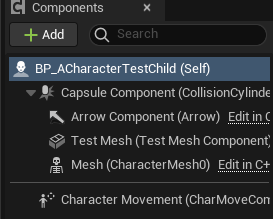
Если вы пишете игру на чистом `с++`, то именно через суб объекты вы будете конструировать собственные классы.
Пример добавления суб объекта типа `UStaticMeshComponent` к классу `ACharacterTest`:
```cpp
// .h
class CHARACTERSMODULE_API ACharacterTest : public ACharacter
{
	GENERATED_BODY()
public:
    // Test StaticMeshComponent Subobject
    UPROPERTY(Category = SubobjectTestCharacter, VisibleAnywhere)
    TObjectPtr<UStaticMeshComponent> TestMesh;
}
// .cpp
// in constructor!
ACharacterTest::ACharacterTest(const FObjectInitializer& ObjectInitializer)
{
 	// Set this character to call Tick() every frame.  You can turn this off to improve performance if you don't need it.
	PrimaryActorTick.bCanEverTick = true;
	// initialise test mesh subobject
	TestMesh = CreateDefaultSubobject<UStaticMeshComponent>(TEXT("Test Mesh Component"));
}
```
В коде присутствует переменная `TestMesh` типа `UStaticMeshComponent`. Она и является суб объектом. Это не обязательно должен быть компонент, но основная практика применения `CreateDefaultSubobject` сводится именно к инициализации компонентов.
_(Хотя компоненты можно добавлять и другими способами, в том числе и в рунтайме.)_
Суб объект `TestMesh` внутри класса `ACharacterTest` выглядит так:
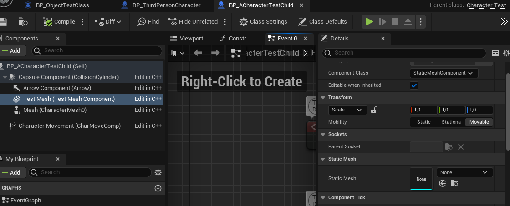
"По умолчанию" у класса `ACharacter` уже есть ряд суб объектов, в данном случае это `Capsule Component`, `Arrow Component`, `Mesh`, `Character Movement`. Приведенный выше код, добавил к списку этих суб объектов новый - `TestMesh`.
## Способы добавления суб объектов
Инициализация суб объекта всегда проводится в конструкторе класса. Вне конструктора класса вызов любой из функций, указанных ниже, в этой главе, приведет к сбою движка.
Суб объекты компонентов можно добавлять к ЛЮБЫМ классам, не только к тем, которые наследуются от `AActor`, а вообще к любому `UObject`. Например используя суб объекты можно подключить компонент от `GameplayAbilitySystem` к классу `PlayerState`. В будущем это мы рассмотрим.
Добавление суб объекта выполняется функциями:
### `CreateDefaultSubobject`
`CreateDefaultSubobject` - создает переопределяемый суб объект
```cpp
TestMesh = CreateDefaultSubobject<UStaticMeshComponent>(TEXT("Test Mesh Component"));
```
### `CreateOptionalDefaultSubobject`
`CreateOptionalDefaultSubobject` - создает переопределяемый суб объект, генерацию которого можно отменить, если в унаследованном классе указать внутри конструктора вызов `DoNotCreateDefaultSubobject`.
```cpp
TestMesh = CreateOptionalDefaultSubobject<UStaticMeshComponent>(TEXT("Test Mesh Component"));
```
### Удаление унаследованного суб объекта
Давайте отменим генерацию компонента для `CharacterMesh0` нашего персонажа.
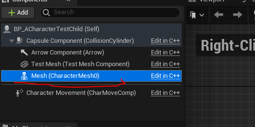
Поскольку компонент `CharacterMesh0` внутри класса `ACharacter` создается следующим образом:
```cpp
Mesh = CreateOptionalDefaultSubobject<USkeletalMeshComponent>(ACharacter::MeshComponentName);
```
Мы можем отменить его генерацию.
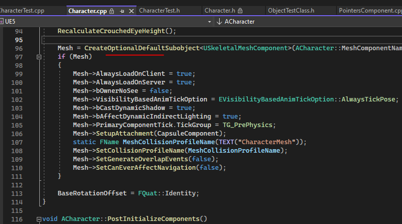
Пишем в конструкторе такой код:
```cpp
ACharacterTest::ACharacterTest(const FObjectInitializer& ObjectInitializer):Super(ObjectInitializer.DoNotCreateDefaultSubobject(TEXT("CharacterMesh0")))
{}
```
После компиляции компонент `CharacterMesh0` пропадает.
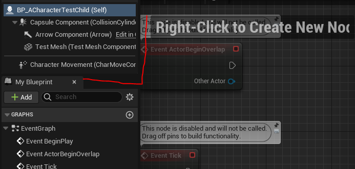
### `CreateEditorOnlyDefaultSubobject`
`CreateEditorOnlyDefaultSubobject` - создает суб объект, доступный только внутри редактора `Unreal Engine`.
```cpp
TestMesh = CreateEditorOnlyDefaultSubobject<UStaticMeshComponent>(TEXT("Test Mesh Component"));
```
## Получение списка всех суб объектов класса
Чтобы получить список суб объектов класса, можно пройтись по ним в цикле:
```cpp
TArray<UObject*> SubobjectsList;
GetDefaultSubobjects(SubobjectsList);
for (UObject* SObj : SubobjectsList) {
    UE_LOG(LogTemp, Warning, TEXT("Found SubObject FName = %s"), *SObj->GetFName().ToString())
}
```
В лог вам выдаст что-то такое:
```cpp
LogTemp: Warning: Found SubObject FName = CollisionCylinder
LogTemp: Warning: Found SubObject FName = Arrow
LogTemp: Warning: Found SubObject FName = CharMoveComp
LogTemp: Warning: Found SubObject FName = CharacterMesh0
LogTemp: Warning: Found SubObject FName = Test Mesh Component
```
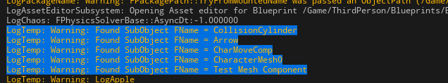
Обратите внимание, что `CharacterMovementComponent` имеет имя `CharMoveComp`, а `Mesh` - `CharacterMesh0`.
## Получение ссылки на суб объект по имени
Суб объект может быть найден по имени, методом `GetDefaultSubobjectByName`.
```cpp
// .h
// Character Movement Component
#include "GameFramework/CharacterMovementComponent.h"
// .cpp
ACharacterTest::ACharacterTest(const FObjectInitializer& ObjectInitializer)
{
    // Get Character Movement Component ref by it's FName
	UCharacterMovementComponent* CharMov = Cast<UCharacterMovementComponent>( GetDefaultSubobjectByName(TEXT("CharMoveComp")) );
	if (CharMov != nullptr) {
		UE_LOG(LogTemp, Warning, TEXT("Character Movement Component has been Found!"))
	}
}
```
## Переопределение суб объектов
Суб объекты можно переопределять в конструкторе класса.
Заменять будем `CharacterMovementComponent` и `Mesh`.
Но для начала не плохо бы иметь классы, которыми мы будем заменять оригиналы.
### Создаем класс `CharacterMovementComponent`
Чаще всего переопределяют `CharacterMovementComponent`. Его переопределение позволяет создать собственную логику движения персонажа (но я делать этого тут не буду, просто покажу на "вход").
Идем в редактор `Tools -> New C++ Class -> All Classes`.
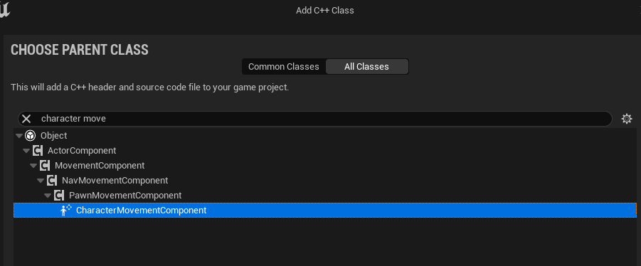
Выбираем `CharacterMovementComponent`, создаем с именем `CMCharacterMovementComponent`.
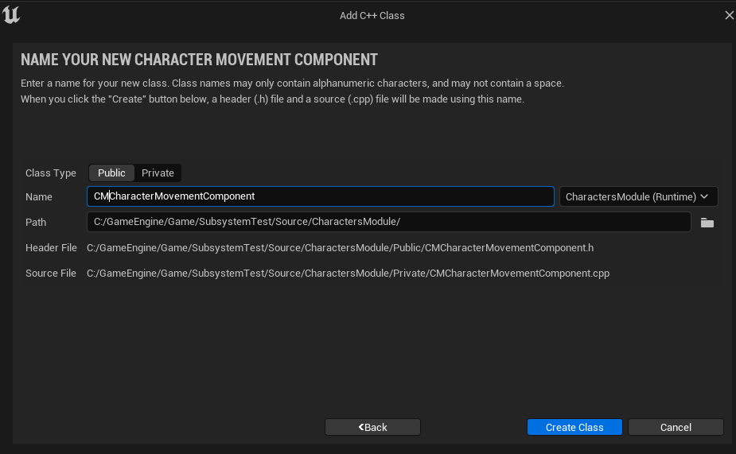
Движок сгенерирует пустую болванку, в которую мы добавим дополнительную переменную.
```cpp
public:
    UPROPERTY(BlueprintReadWrite, EditAnywhere, Category = Test)
    float CustomFloatParam;
```
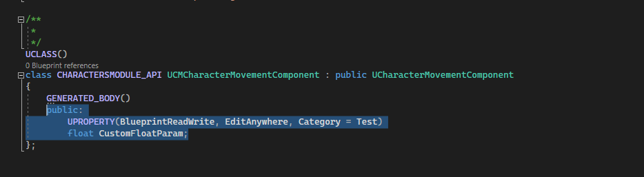
### Создаем класс `SkeletalMeshComponent`
Тем-же самым способом создаем еще один класс. На сей раз наследуем от `SkeletalMeshComponent`. Этот класс переопределяют чаще всего с одной целью - чтобы сделать собственную систему экипировки, способную комбинировать несколько мешей воедино.
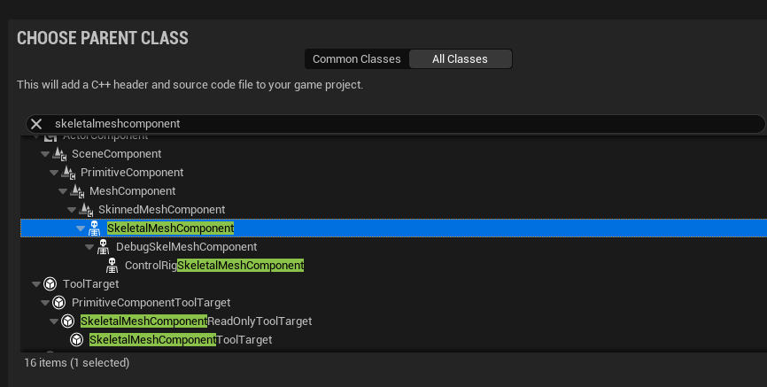
Называем новый компонент - `CMSkeletalMeshComponent`.
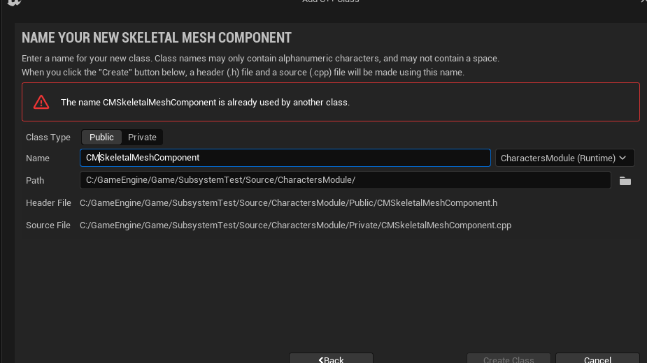
Внутрь добавим одну переменную, пусть это будет ссылка на массив `USkeletalMesh`.
```cpp
public:
    UPROPERTY(BlueprintReadWrite, VisibleAnywhere, Category = Mesh)
    TArray<USkeletalMesh*> SkeletalMeshList;
```
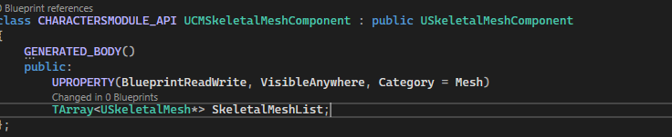
### Замена
Для замены обоих компонентов в классе `ACharacterTest` используется конструктор, содержащий `FObjectInitializer`.
```cpp
ACharacterTest(const FObjectInitializer& ObjectInitializer);
```
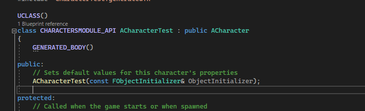
Этот конструктор присутствует во всех `UObject'ах`. Он дает доступ к переменной `FObjectInitializer`, используя которую можно переопределять суб объекты.
Делается это так:
```cpp
ACharacterTest::ACharacterTest(const FObjectInitializer& ObjectInitializer):Super(ObjectInitializer.SetDefaultSubobjectClass<UCMSkeletalMeshComponent>(ACharacter::MeshComponentName))
{}
```
То есть к конструктору класса приписывается вызов родительского конструктора.
```cpp
:Super(ObjectInitializer.SetDefaultSubobjectClass<UCMSkeletalMeshComponent>(ACharacter::MeshComponentName))
```
Но у нас два компонента, а не один. Есть еще `UCMCharacterMovementComponent`.
Чтобы добавить еще один компонент в строчку, пропишем еще один вызов функции `SetDefaultSubobjectClass` таким образом:
```cpp
// Sets default values
ACharacterTest::ACharacterTest(const FObjectInitializer& ObjectInitializer)
:Super(ObjectInitializer.SetDefaultSubobjectClass<UCMSkeletalMeshComponent>(ACharacter::MeshComponentName).SetDefaultSubobjectClass<UCMCharacterMovementComponent>(ACharacter::CharacterMovementComponentName)
){}
```
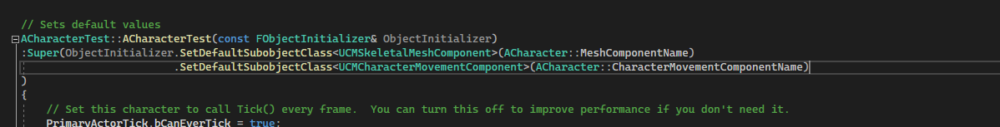
Если скомпилировать этот код, то мы увидим, как оба компонента были заменены.
В компоненте `CharacterMovement` теперь присутствует переменная `CustomFloatParam`.
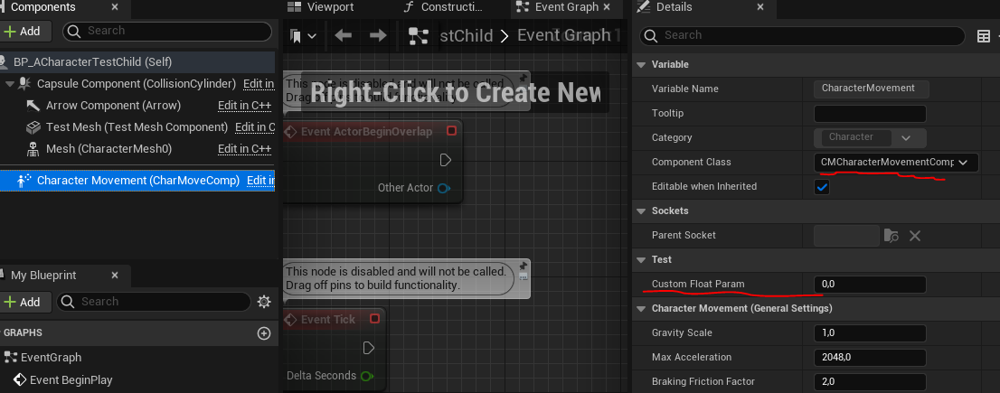
А в компоненте `Mesh` присутствует переменная `SkeletalMeshList`.
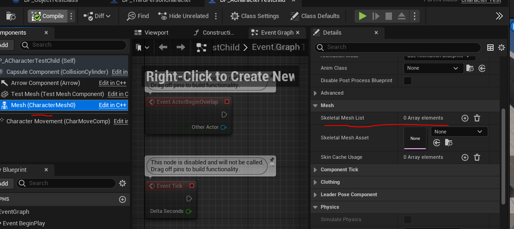
### Что будет, если не использовать инициализацию через конструктор?
Подход, рекомендованный движком для переопределения компонентов, выглядит крайне неудобно. Но именно так делают абсолютно все.
Что если все ошибаются?
Не станете же вы считать эту мешанину из кода чем-то "хорошим?".
```cpp
ACharacterTest::ACharacterTest(const FObjectInitializer& ObjectInitializer)
:Super(ObjectInitializer.SetDefaultSubobjectClass<UCMSkeletalMeshComponent>(ACharacter::MeshComponentName).SetDefaultSubobjectClass<UCMCharacterMovementComponent>(ACharacter::CharacterMovementComponentName)
){}
```
Я решил попробовать вызвать метод `SetDefaultSubobjectClass` вне инициализации конструктора.
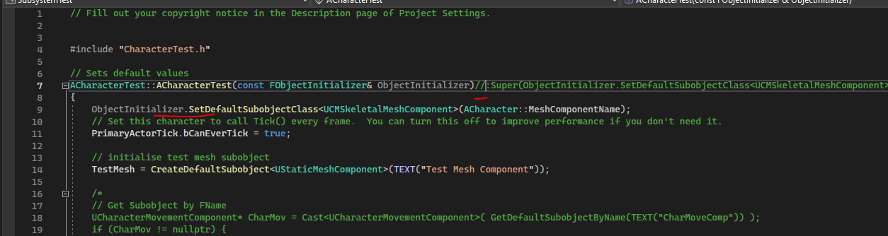
К сожалению ничего не вышло, в движке случился сбой с таким текстом ошибки:
```cpp
CharacterTest /Script/CharactersModule.Default__CharacterTest.CharacterMesh0: Subobject class setup is only allowed in base class constructor call (in the initialization list)
```
Из этого можно сделать вывод, что переопределение суб объектов возможно лишь в конструкторе через `:Super`.
Ну а для более "читабельного" вида, советую организовывать код через сноски.
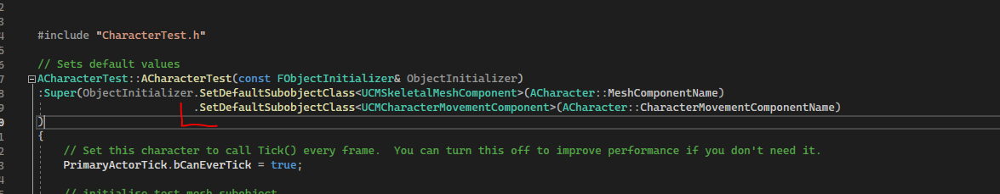
## Добавляем компонент к `UObject`
Редактор `Unreal` разрешает добавлять компоненты лишь к классам, унаследованным от типа `Actor`.
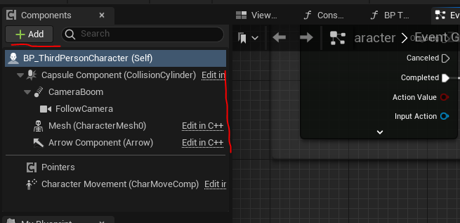
Добавлять компоненты к классам типа `UObject` из `blueprint` разработчик не может.
Добавить компонент к `UObject` можно только средствами `с++`, используя суб объекты.
Давайте рассмотрим самый абсурдный из примеров - прикрепим компонент с визуальной составляющей, например `StaticMeshComponent` к классу без визуальной составляющей. Посмотрим как себя поведет система.
Добавляем новый `UObject`. Идем `Tools -> New C++ Class -> All Classes -> Object`.
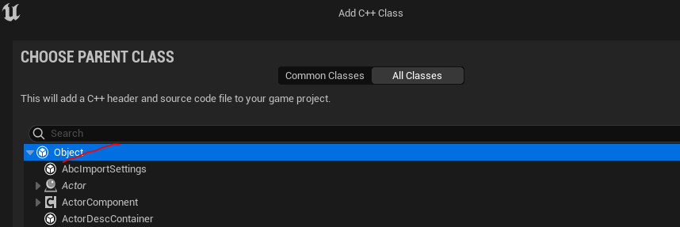
Называем новый класс `ObjectSubObject` и добавляем в модуль `TestModule`.
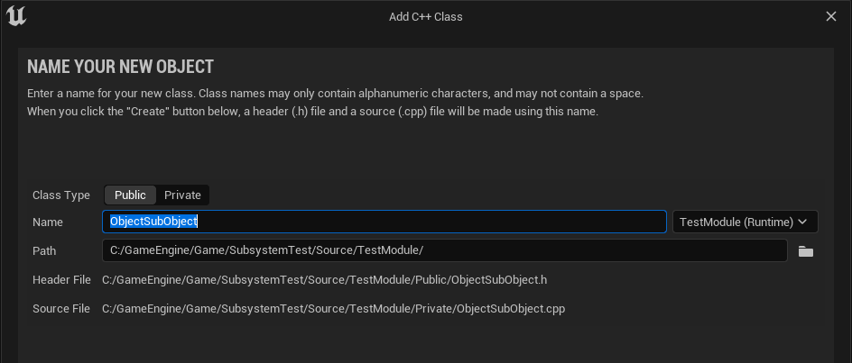
Добавляем в созданный класс новую переменную `UStaticMeshComponent` и конструктор с доступом к `FObjectInitializer`.
```cpp
#pragma once
#include "CoreMinimal.h"
#include "UObject/NoExportTypes.h"
#include "ObjectSubObject.generated.h"
/**
 * UObject with Static Mesh Sub Object
 */
UCLASS(Blueprintable, BlueprintType)
class TESTMODULE_API UObjectSubObject : public UObject
{
	GENERATED_BODY()
public:
	UObjectSubObject(const FObjectInitializer& ObjectInitializer);
	// Subobject Test
	UPROPERTY(BlueprintReadWrite, EditAnywhere, Category = "SubObjectsTest")
	TObjectPtr<UStaticMeshComponent> SOStaticMeshComponent;
};
```
Теперь идем в файл реализации и пишем логику добавления суб объекта.
```cpp
#include "ObjectSubObject.h"
UObjectSubObject::UObjectSubObject(const FObjectInitializer& ObjectInitializer)
{
	SOStaticMeshComponent = CreateDefaultSubobject<UStaticMeshComponent>(TEXT("Test SM SubComponent"));
}
```
Компилируем.
Компонент добавится, несмотря на то, что у нашего класса `UObjectTestClass` нет никакого визуального представления.
Создадим `blueprint` унаследованный от класса `UObjectSubObject` и посмотрим, на его содержимое.
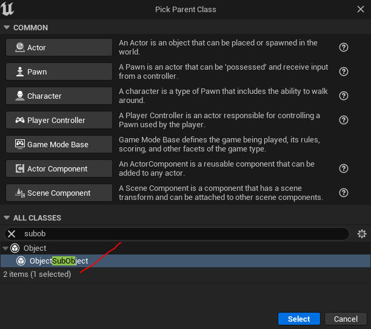
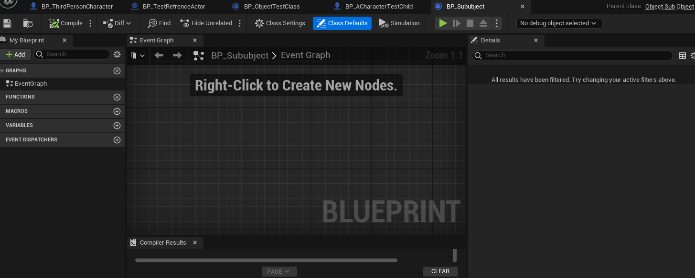
Созданный класс пуст. Однако к переменной суб объекта можно обратиться и даже задать ей `StatcMesh`. Я задал туда цилиндр.
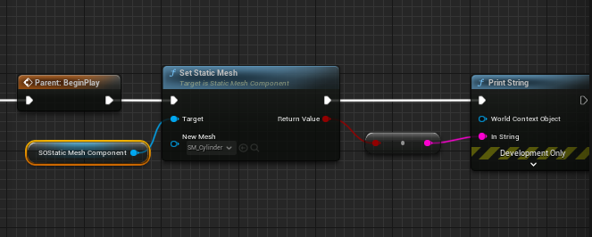
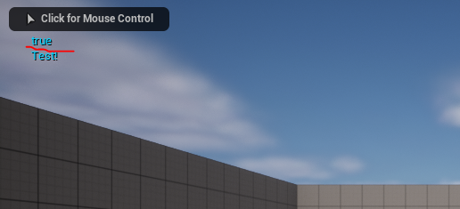
У хотя все устанавливается - меш в мире нигде не появляется. Так происходит, потому что у класса `UObject` нет визуального представления.