# Многопоточность
В движке Unreal представлен весьма гибкий функционал для реализации многопоточности. Это одна из важнейших возможностей движка, применять которую придется очень часто, как для реализации фоновых задач (например для анализа видимости окружающих врагов), так и для реализации локальных, но очень тяжелых вычислений.
## Подготовка к работе
Весь код этой главы, как и в прошлый раз, будем писать внутри `ActorComponent'а`. Который разместим в отдельном модуле.
### Создаем модуль
Назовем модуль - `ThreadsModule`.
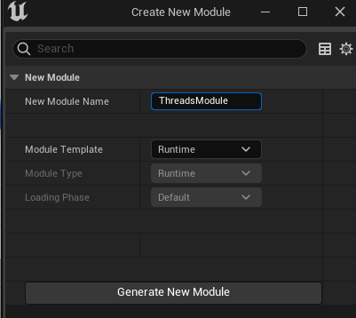
### Создаем компонент
Компонент назовем - `ThreadsComponent`.
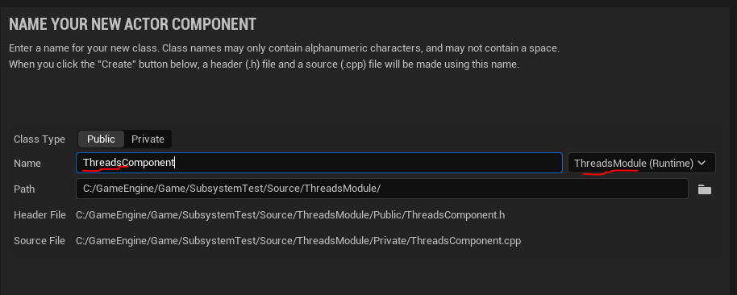
### Зависимости
Никаких особых зависимостей для нашей работы не потребуется. Тем не менее я привожу содержимое файла `ThreadsModule.build.cs`, на всякий случай.
```cpp
using UnrealBuildTool;
public class ThreadsModule : ModuleRules
{
	public ThreadsModule(ReadOnlyTargetRules Target) : base(Target)
	{
        IncludeOrderVersion = EngineIncludeOrderVersion.Latest;
        PCHUsage = PCHUsageMode.UseExplicitOrSharedPCHs;
		PublicDependencyModuleNames.AddRange(new string[] { "Core", "CoreUObject", "Engine"});
		PublicIncludePaths.AddRange(new string[] {"ThreadsModule/Public", "ThreadsModule/Public/Tasks"});
		PrivateIncludePaths.AddRange(new string[] {"ThreadsModule/Private"});
	}
}
```
### Добавляем компонент к персонажу
После компиляции кода, добавьте полученный компонент к `BP_ThirdPersonCharacter`.
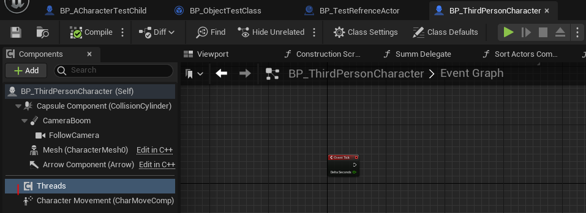
### Генерация простых чисел
Я решил использовать алгоритм генерации простых чисел `primary number`, для тестирования многопоточности. Этот алгоритм часто используется для замеров производительности языка программирования. Главная фишка алгоритма в том, что чем более крупное число мы тестируем - тем больше итераций  проверки требуется сделать. И чем дальше способен пройти алгоритм за заданное время, тем более производительным является язык программирования. Но мы не будем использовать этот алгоритм "в длину". Мы используем генерацию фиксированного количества простых чисел для того, чтобы просто нагрузить систему.

Определение:

> Простое число - натуральное число, имеющее ровно два различных натуральных делителя. Само себя и `1`. Самое маленькое простое число это `2`.

Собственно, вычисление простого числа сводится к проверке внутри цикла, делится ли это число на что-либо кроме `1` и самого себя.

Я буду генерировать простые числа до тех пор, пока не будет сгенерировано, например, `10 000` простых чисел.
```cpp
// Lambda checker for prime number
TFunction<bool(int)> IsPrime = [](int Num) -> bool {
    // since 0 and 1 is not prime return false.
    if (Num < 2)
        return false;
    // Run a loop from 2 to n-1
    for (int i = 2; i < Num; i++) {
        // if the number is divisible by i, then n is not a
        // prime number.
        if (Num % i == 0)
            return false;
    }
    // otherwise, n is prime number.
    return true;
};
int PrimesFound = 0;
int CurrentTestNumber = 0;
// Generate prime numbers until their amount less than 10000
while (PrimesFound < 10000)
{
    CurrentTestNumber++;
    if (IsPrime(CurrentTestNumber)) {
        PrimesFound++;
    }
}
```
Такие вычисления, в два цикла, сильно нагружают систему. Что и требуется, для тестирования  многопоточности.
#### Измерение времени работы кода
Так-же, давайте добавим измерение времени работы нашего алгоритма.
Для этого обернем генератор простых чисел в такой код:
```cpp
// Time Measuring
double StartTime = FPlatformTime::Seconds();
// ...
// тут вычисление простого числа
// ...
// Time Measuring
double EndTime = FPlatformTime::Seconds();
UE_LOG(LogTemp, Warning, TEXT("Code Executed in %f seconds."), EndTime - StartTime);
```
Обернем вычисления в функцию `CalculatePrimes`.
#### Итоговый код
Итоговый код будет таким:
```cpp
// Calculation of PrimeNumbers
int UThreadsComponent::CalculatePrimes(int Amount)
{
	// Time Measuring
	double StartTime = FPlatformTime::Seconds();
	UE_LOG(LogTemp, Warning, TEXT("Searching For Primes"))
	// Lambda checker for prime number
	TFunction<bool(int)> IsPrime = [](int Num) -> bool {
		// since 0 and 1 is not prime return false.
		if (Num < 2) {
			return false;
		}
		// Run a loop from 2 to n-1
		for (int i = 2; i < Num; i++) {
			// if the number is divisible by i, then n is not a
			// prime number.
			if (Num % i == 0) {
				return false;
			}
		}
		// otherwise, n is prime number.
		return true;
	};
	int PrimesFound = 0;
	int CurrentTestNumber = 0;
	// Generate prime numbers until their amount less than 10000
	while (PrimesFound < Amount)
	{
		CurrentTestNumber++;
		if (IsPrime(CurrentTestNumber)) {
			PrimesFound++;
		}
	}
	UE_LOG(LogTemp, Warning, TEXT("Primes Found = %i, Number = %i"), PrimesFound, CurrentTestNumber)
	// Time Measuring
	double EndTime = FPlatformTime::Seconds();
	UE_LOG(LogTemp, Warning, TEXT("Code Executed in %f seconds."), EndTime - StartTime);
	return CurrentTestNumber;
}
```
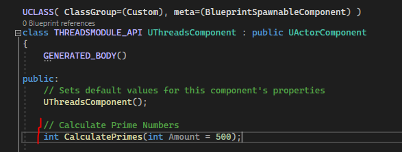
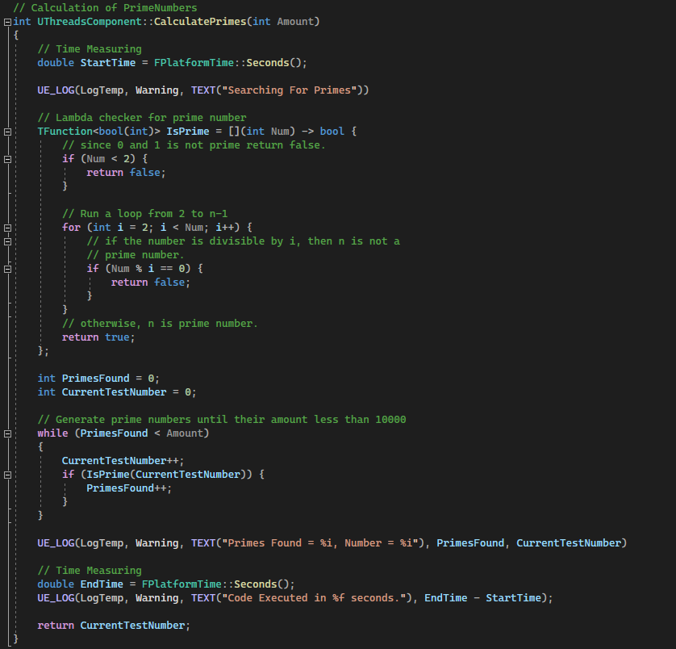
Чтобы проверить как все работает - можете добавить функцию в `BeginPlay` и запустить игру.
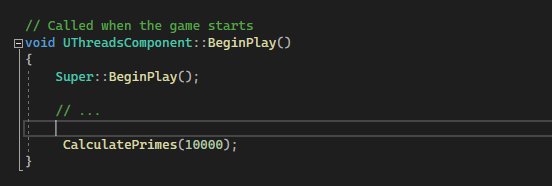
Если компонент уже добавлен к классу персонажа, то при запуске игры произойдет весьма заметный лаг, в течении которого движок будет вычислять простые числа.
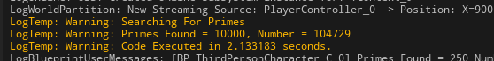
Как вы видите, поиск 10 000 простых чисел на с++  занимает 2.133 секунды.
Давайте так-же напишем алгорим вычисления простых чисел в `blueprint`.
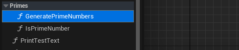
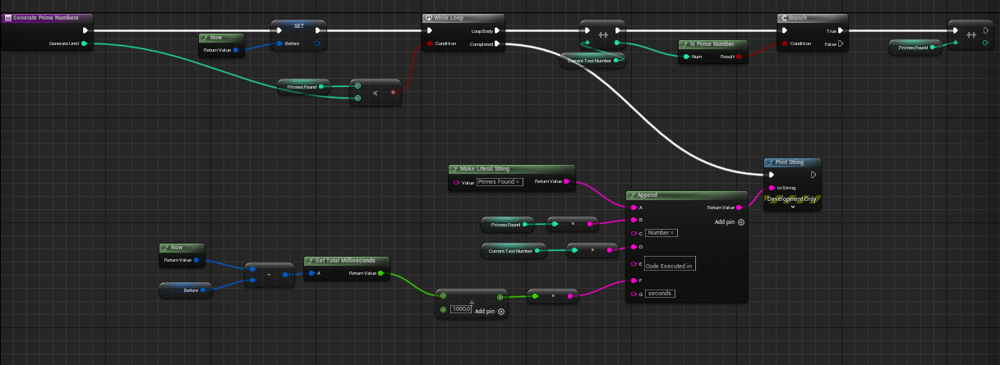
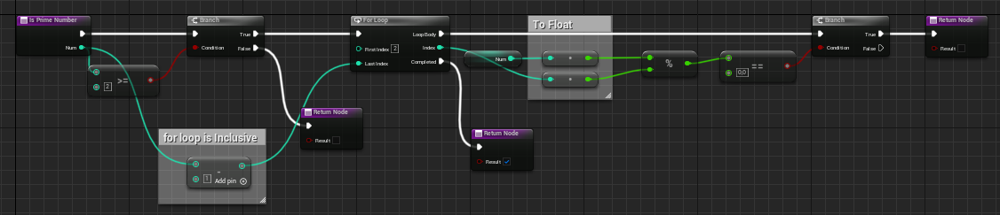
Важно помнить, что при попытке запустить `blueprint` на  поиск 10 000 простых чисел - как движок крашнется. Максимально большое число для теста рекомендую брать в районе 200.
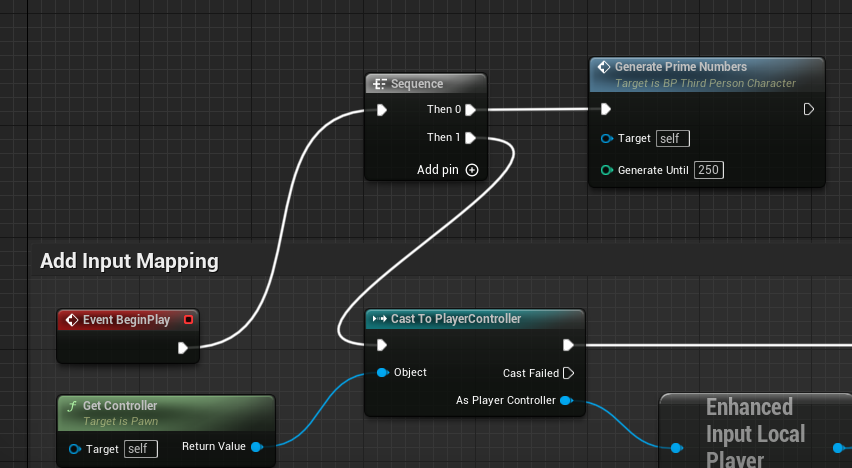

Производительность `blueprint` кода сильно хуже, чем производительность с++ кода.
В с++ вычисление 250 простых чисел происходит почти мгновенно - за `0.000877` секунды.
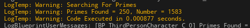
Если провести простейшую операцию - `0.577 / 0.000877` мы поймем, что `blueprint` код в `657.9` раз медленнее, чем с++ код.
Тут стоит отметить, что если запустить проект в упакованной и готовой к релизу версии, то вычисления будут быстрее, потому что `blueprint` упакуются в байткод и избавятся от дебаг-привязок. Но не ждите что производительность выростет значительно. Полагаю будет с++ все равно будет раз в 200 быстрее. Это та причина, по которой игры, особенно стратегии или рпг - надо писать на с++, хотите вы этого или нет.
Основные асинхронные методы движка находятся в файле `#include "Async/Async.h"`. Для начала рассмотрим их.
## `AsyncTask`
Самое первое, что вам удастся найти в интернете по теме многопоточности в `Unreal`, это, несомненно `AsyncTask`. И причина тут проста - это самый простой и базовый способ сделать какой-либо код асинхронным.
Если до этого вы работали с `с#`, то знакомы с классом `BackgroundWorker`,  `AsyncTask` является его аналогом.
Функция (или лямбда), переданная `AsyncTask` будет помещена в очередь на обработку одним из существующих в движке потоков (`Task Graph`, я рассмотрю эту систему очень подробно в одной из последующих глав).
Используется `AsyncTask` так:
```cpp
// .h
// Async
#include "Async/Async.h"
// ..
// .cpp
// Run CalculatePrimes on any random task graph
AsyncTask(ENamedThreads::AnyThread, [this]()->void{
    CalculatePrimes(10000);
});
```
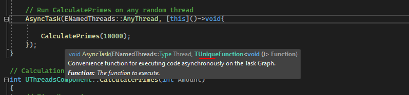
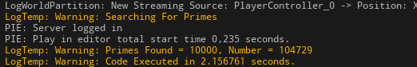
Такой код приведет к асинхронному вызову функции `CalculatePrimes`.
Для большего понимания картины - обернем `AsyncTask` в таймер. Чтобы код срабатывал периодически.
```cpp
// Timer to sequentally call long calculations
GetWorld()->GetTimerManager().SetTimer(*(new FTimerHandle()), [&]()->void {
    // Run CalculatePrimes on any random thread
    AsyncTask(ENamedThreads::AnyThread, [this]()->void {
        CalculatePrimes(10000);
    });
}, 3.0f, true, 3.0f);
```
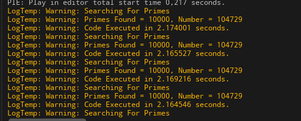
При этом вычисления не вызывают никаких лагов на основном потоке игры. Но это лишь потому, что в качестве графа для исполнения потока у нас выбран `ENamedThreads::AnyThread`.
Достаточно заменить `ENamedThreads::AnyThread` на `ENamedThreads::GameThread`, чтобы увидеть лаги.
```cpp
// Run CalculatePrimes on any random thread
AsyncTask(ENamedThreads::GameThread, [this]()->void {
    CalculatePrimes(10000);
});
```
Поскольку метод `AsyncTask` просто помещает указатель на функцию или лямбду в очередь указанного графа потоков, а мы выбрали в качестве потока `GameThread`, именно там и возникнет задержка.
С какими графами мы можем работать через `AsyncTask`?
Список можно найти в файле `Runtime\Core\Public\Async\TaskGraphInterfaces.h` и он довольно длинный.
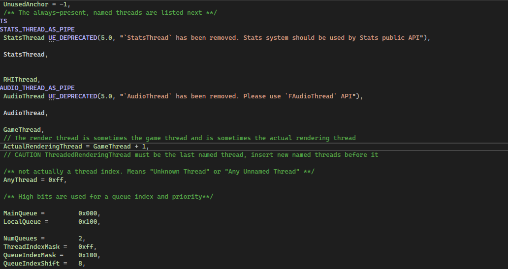
Минусы использования `AsyncTask` очевидны:

- Выбранный граф потоков всегда блокируется вашими вычислениями. При небольшом объеме вычислений проблем это не создает. Но если требуется посчитать какую-то очень сложную и долгую логику, выбор `AsyncTask` с модификатором `AnyThread` - плохая идея. Поведение кода при длительных вычислениях на любом из графов может быть непредсказуемым.
- Невозможно узнать (без мутексов, о них далее) завершил поток свою работу или нет, из-за чего, при сколь-либо сложной логике, возникают проблемы. Это решаемо, вы можете использовать `TFuture` - `TPromise`, в одной из следующих глав я рассматриваю подобный подход.

Так почему-же, при таких ограничениях, `AsycTask` используют? Потому что блокировка потока иногда полезна. Например, вы можете разместить несколько `AsyncTask` подряд в один и тот-же граф потоков, чтобы они выполнились последовательно.
Так-же, из метода `AsycTask` очень удобно создавать другие потоки и отслеживать их состояния.
## `AsyncThread`
Эта функция является оберткой над `FRunnableThread` и создает поток, с указанным приоритетом и размером стека.
Самый примитивный вызов данной функции выглядит так:
```cpp
// .h
// Async
#include "Async/Async.h"
// ...
// .cpp
AsyncThread([&]()->int {
    return CalculatePrimes(10000);
});
```
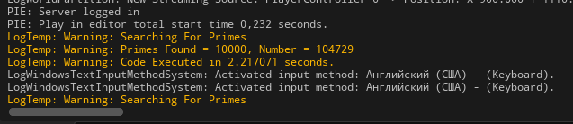
У `Async Thread` имеется ряд аргументов: `StackSize`, `ThreadPrioirty` и `CompletionCallback`.
### StackSize
`StackSize` отвечает за размер стека указателей и  переменных, который будет доступен в создаваемом потоке. 0 - значение по умолчанию, указывается байтах `bytes`.
Зачем эта переменная нужна? Если вы внутри потока создаете очень сложную логику, например, работы окна или какой-либо системы, то размер стека должен быть увеличен, чтобы его хватило для всех созданных переменных. Тут важно заметить - от размера стека указателей не зависит размер данных, на которые они ссылаются. От размера стека зависит лишь количество указателей, которые в этот стек можно засунуть. В разных ОС размер стека разный.
По умолчанию он задается функцией `GetDefaultStackSize()`.
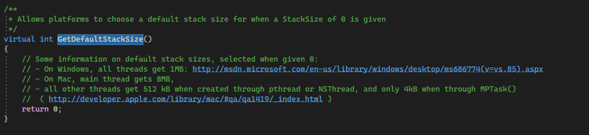
В Windows все потоки имеют размер 1МБ, которого более чем достаточно для большого количества переменных и указателей внутри потока.
У меня в потоке вызывается лишь одна функция, поэтому стека по умолчанию вполне хватает - использую `0.0f`.
### ThreadPrioirty
`ThreadPrioirty` - очевидный приоритет потока. Intellisense автоматически выведет вам список доступных опций, если напечатать `PTri`.
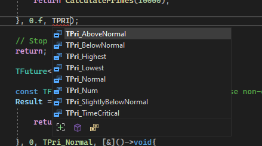
Полный же список опций находится тут - `/Runtime/Core/Public/GenericPlatform/GenericPlatformAffinity.h`.
Я использую `TPri_Normal`, но есть и более интересные варианты: `TPri_TimeCritical`, `TPri_Highest`, `TPri_Lowest`.
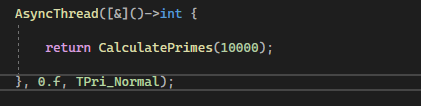
### CompletionCallback
`CompletionCallback` - параметр, позволяющий вызвать лямбду, по завершении вычислений.
```cpp
AsyncThread([&]()->int {
    return CalculatePrimes(10000);
}, 0.f, TPri_Normal,
[]()->void{
    UE_LOG(LogTemp, Warning, TEXT("Calculations Completed"))
    UE_LOG(LogTemp, Warning, TEXT("------------"))
});
```
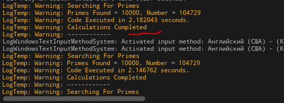
К сожалению, в параметре `CompletionCallback` нельзя получить возвращаемое из потока значение. Однако есть более гибкий способ.
### Получение результата вычислений из `AsyncThread`
Функция `AsyncThread` возвращает объект типа `TFuture`. Этот объект ждет, пока поток передаст ему значение, а затем пересылает его функции-обработчику.
#### `.Then()`
Обратиться к `TFuture` можно сразу после вызова функции, например через привязку метода `Then` к лямбде:
```cpp
AsyncThread([&]()->int {
    return CalculatePrimes(10000);
}, 0.f, TPri_Normal)
.Then([&](TFuture<int> Future) -> void {
    // Make Sure it's valid
    if (Future.IsValid()) {
        UE_LOG(LogTemp, Warning, TEXT("Result calculated in thread is %i"), Future.Get())
    }
});
```
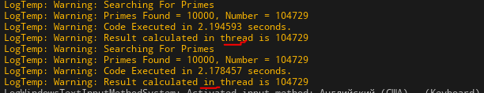
Метод `Then` передает всего один аргумент - сам объект `TFuture`. При этом данный метод срабатывает всегда, даже тогда, когда поток ничего не возвратил или завершился с ошибкой. Поэтому важно проводить проверку, внутри метода, на валидность объекта `if (Future.IsValid())`.
#### `.Next()`
Есть альтернативный способ привязки  - метод `Next`, который является безопасной оберткой над `Then`:
```cpp
AsyncThread([&]()->int {
    return CalculatePrimes(10000);
}, 0.f, TPri_Normal)
.Next([&](int Number)->void {
    UE_LOG(LogTemp, Warning, TEXT("Result calculated in thread is %i"), Number)
});
```
Данный метод срабатывает лишь когда поток возвращает валидное значение. Если поток прервется или завершится с ошибкой - метод `Next` вызван не будет.
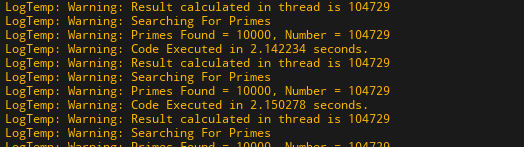
Вместо прямой привязки можно так-же использовать переменную.
```cpp
TFuture<int> Result = AsyncThread([&]()->int {
    return CalculatePrimes(10000);
}, 0.f, TPri_Normal);
Result.Next([&](int Number)->void {
    UE_LOG(LogTemp, Warning, TEXT("Result calculated in thread is %i"), Number)
});
```
Тут я вынес `TFuture` в переменную и присоединил к ней метод `Next`.
Обратите внимание, что привязать обработчики одновременно к `Next` и `Then` нельзя.
То есть такой код работать не будет:
```cpp
TFuture<int> Result = AsyncThread([&]()->int {
    return CalculatePrimes(10000);
}, 0.f, TPri_Normal);
Result.Next([&](int Number)->void {
    UE_LOG(LogTemp, Warning, TEXT("Result calculated in thread is %i"), Number)
});
Result.Then([&](TFuture<int> Future) -> void {
    // Make Sure it's valid
    if (Future.IsValid()) {
        UE_LOG(LogTemp, Warning, TEXT("Result calculated in thread is %i"), Future.Get())
    }
});
```
При попытке запустить такой код движок крашнется, после чего выдаст ошибку: `UnrealEditor-ThreadsModule.patch_0.exe!TFutureBase<int>::Then`.
Только одна функция-обработчик может быть присоединена к `TFuture`: или `Then` или `Next`.
```cpp
TFuture<int> Result = AsyncThread([&]()->int {
    return CalculatePrimes(10000);
}, 0.f, TPri_Normal);
/*Result.Next([&](int Number)->void {
    UE_LOG(LogTemp, Warning, TEXT("Result calculated in thread is %i"), Number)
});*/
Result.Then([&](TFuture<int> Future) -> void {
    // Make Sure it's valid
    if (Future.IsValid()) {
        UE_LOG(LogTemp, Warning, TEXT("Result calculated in thread is %i"), Future.Get())
    }
});
```
Вы можете найти в этой статье, чуть ниже, главу, посвященную более тесной работе с  `TFuture - TPromise`. Там я рассмотрел способ самостоятельного использования этих объектов, для получения данных из потока.
## `AsyncPool`
Данный метод позволяет добавить новую задачу в один из существующих пулов потоков. Пул потоков (не путать с графом потоков) вы можете создать как сами (это я рассмотрю ниже), так и использовать один из тех пулов, что существуют в движке по умолчанию и доступны глобально. Например - `GThreadPool`.
```cpp
// Add lambda to given global thread pool
AsyncPool(*GThreadPool, [&]()->int {
    return CalculatePrimes(10000);
},nullptr, EQueuedWorkPriority::Normal)
.Next([&](int Number)->void {
    UE_LOG(LogTemp, Warning, TEXT("Result calculated in thread is %i"), Number)
});
```
Как вы видите `AsyncPool` так-же позволяет получать значение через `TFuture`.
## `Async`
Метод `Async` является упрощенной комбинацией предыдущих подходов, позволяя запускать переданный код в одной из асинхронных систем на выбор.
Вызывается так:
```cpp
// .h
// Async
#include "Async/Async.h"
// ...
// .cpp
Async(EAsyncExecution::ThreadPool, [&]()->int {
    return CalculatePrimes(10000);
});
```
Обратите внимание на параметр `EAsyncExecution`. Он определяет где будет запущен поток.
Возможные значения:
`EAsyncExecution::TaskGraph` и `EAsyncExecution::TaskGraphMainThread` - запускают асинхронный код внутри `TGraphTask`.
Граф выбирается по следующей логике:
`ENamedThreads::AnyThread` в случае с `EAsyncExecution::TaskGraph`
`ENamedThreads::GameThread` в случае  с`EAsyncExecution::TaskGraphMainThread`.
`TGraphTask` не предназначен для объемных и долгих вычислений, а так-же бесконечных циклов.
`EAsyncExecution::Thread` - запускает поток внутри `FRunnableThread`. Это полноценный поток, работающий парралельно основным потокам движка.
Созданному через метод `Async` потоку не получится установить приоритет, поэтому лучше использовать метод `AsyncThread`, который предоставляет больше контроля.
`EAsyncExecution::ThreadIfForkSafe` - запускает `FRunnableThread` только в том случае, если в системе выставлена поддержка многопоточности `FPlatformProcess::SupportsMultithreading`.
Если такой поддержки нет - поток создан не будет.
`EAsyncExecution::ThreadPool` - помещает функцию в очередь на обработку к глобальному пулу потоков `GThreadPool`. Очевидный аналог `AsyncPool(*GThreadPool)`.
`EAsyncExecution::LargeThreadPool` - помещает функцию в очередь на обработку к глобальному пулу потоков `GLargeThreadPool`, если в системе выставлена поддержка многопоточности  - `FPlatformProcess::SupportsMultithreading`.
### Получение результатов вычислений из `Async`
Из потока, созданного через функцию `Async` можно получить результаты вычислений используя объект `TFutute`. Я уже делал подробный разбор работы с этим объектом, когда описывал `AsyncThread`.
Приведу короткий пример:
```cpp
Async(EAsyncExecution::ThreadPool, [&]()->int {
    return CalculatePrimes(10000);
})
.Next([&](int Number)->void {
    UE_LOG(LogTemp, Warning, TEXT("Result calculated in thread is %i"), Number)
});
```
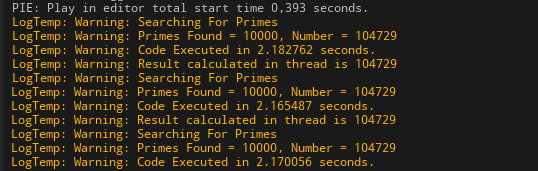
## Безопасность данных при работе с потоками (Threadsafe code)
Рассмотрим ситуацию, в которой два потока должны записывать данные в одну и ту-же переменную.
Поскольку потоки работают не по очереди, а парралельно и одновременно - возникает проблема с безопасностью памяти при доступе таких потоков к общим объектам. Суть проблемы сводится к тому, что если одновременно записывать или считывать данные из одного и того-же участка памяти - можно сломать эту самую память или получить там неопределенного вида кашу.
Давайте воплотим проблему потокобезопасности на практике, для большей наглядности.
Создадим переменную, например массив:
```cpp
// Testing ThreadSave Variable
TArray<int> ThreadSafeTest;
```
Теперь нужны два потока. В первом потоке будем добавлять к массиву цифру `1`, во втором будем добавлять цифру `2`.
```cpp
// Usafe thread tests
// Async Thread 1
Async(EAsyncExecution::TaskGraph, [this]()->void {
    ThreadSafeTest.Add(1);
});
// Async Thread 2
Async(EAsyncExecution::TaskGraph, [this]()->void {
    ThreadSafeTest.Add(2);
});
```
Ну и напишем код печати массива, а потом поместим все это в циклический таймер.
```cpp
//.cpp
// BeginPlay
// Timer to sequentally call long calculations
GetWorld()->GetTimerManager().SetTimer(*(new FTimerHandle()), [&]()->void {
		// Usafe thread tests
		// Async Thread 1
		Async(EAsyncExecution::TaskGraph, [this]()->void {
			ThreadSafeTest.Add(1);
		});
		// Async Thread 2
		Async(EAsyncExecution::TaskGraph, [this]()->void {
			ThreadSafeTest.Add(2);
		});
		// Print Array
		for (int ArrayItem : ThreadSafeTest) {
			UE_LOG(LogTemp, Warning, TEXT("[ArrayItem] = %i"), ArrayItem)
		}
}, 5.0f, true, 1.0f);
```
Если скомпилировать такой код, а потом запустить проект - в какой-то момент в движке возникает сбой и он закрывается, потому что код не потокобезопасен. Переменная `ThreadSafeTest` вызывается парралельно в двух потоках, что и создает проблему.
```cpp
Unhandled Exception: EXCEPTION_ACCESS_VIOLATION writing address 0x0000000000000004
```
Ошибка - `EXCEPTION_ACCESS_VIOLATION` - прямо намекает разработчику, что система не может одновременно из двух потоков записывать в один адрес памяти.
После нескольких попыток я смог заснять фрагмент вывода этого кода до того, как закроется движок.
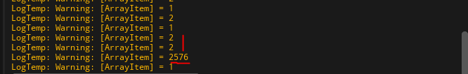
Как вы видите, в массиве есть участки с повторяющимися значениями. А так-же значение `2576`. Оно появилось тут, потому что цикл печати данных из потока - не потокобезопасен и может обращаться к ячейкам памяти, которые в данный момент обрабатываются одним из потоков. Это вызывает появление подобных, непредсказуемых, значений.
### Блокировка потоков: Мутексы
Дабы предотвратить одновременную работу нескольких потоков над одними и теми-же данными, разработчики создали систему т.н. мутексов. Используя мутексы программист  может заблокировать участок памяти, пока над ним работает какой-либо поток. Пока память блокирована - доступ к ней возможен лишь из одного потока, все остальные - ждут в очереди.

> Важно помнить, что злоупотребление мутексами сводит на нет все преимущества от многопоточности. Поэтому блокировать участки памяти надо лишь там, где выполняется чтение или запись в переменные. Сложные вычисления должны быть избавлены от мутексов.

Мутексы создаются из типа `FCriticalSection`.
При этом мутекс всегда задается в глобальном пространстве, внутри класса.
```cpp
mutable FCriticalSection Mutex;
```
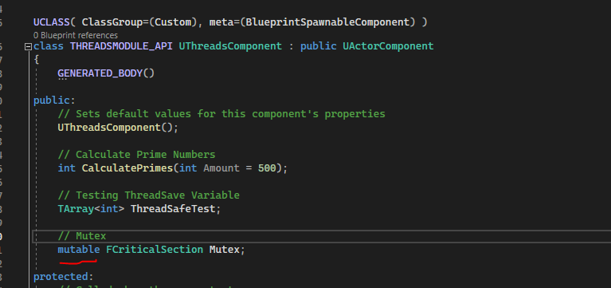
#### `Lock` - `Unlock`
Мутекс можно использовать двумя способами. Первый - непосредственно из самой переменной вызывать методы `.lock()` и `.unlock()`.
Метод `.Lock()` заблокирует участок памяти, над которым работает поток. Другие потоки не смогут получить доступ к этому участку и будут ждать разблокирования через функцию `.Unlock()`.
```cpp
// Async Thread 2
Async(EAsyncExecution::TaskGraph, [this]()->void {
    Mutex.Lock();
    ThreadSafeTest.Add(2);
    Mutex.Unlock();
});
```
#### `FScopeLock`
Однако, не всегда получается вызвать `.Unlock()`, например может быть метод такого вида:
```cpp
TArray<int> GetThreadSafeTest() const {
    return ThreadSafeTest;
}
```
В котором используется `return`. Где здесь можно прописать `.Unlock()`, ведь такой код работать не будет:
```cpp
TArray<int> GetThreadSafeTest() const {
    Mutex.Lock();
    return ThreadSafeTest; // code will exit here
    Mutex.Unlock(); // это не сработает, потому что функция завершит исполнение после return
}
```
Для таких случаев используется блокирование области действия `{}`, через `FScopeLock ScopeLock{ &Mutex };`. Блокировка снимается с данных автоматически, при выходе из области действия, в которой вызван `FScopeLock`.
Вышеуказанную функцию надо реализовывать вот так:
```cpp
// ThreadSafeTest variable thread safe getter
TArray<int> GetThreadSafeTest() const {
    FScopeLock ScopeLock{ &Mutex };
    return ThreadSafeTest;
}
```
`FScopeLock` можно разблокировать, при необходимости, таким образом:
```cpp
FScopeLock ScopeLock{ &Mutex };
// какие-то вычисления
ScopeLock.Unlock(); // разблокировка
```
#### Применение мутексов
Рассмотрим применение мутексов к нашим потокам, записывающим данные в массив.
```cpp
// Threadsafe tests
// Async Thread 1
Async(EAsyncExecution::TaskGraph, [this]()->void {
    FScopeLock ScopeLock{ &Mutex };
    ThreadSafeTest.Add(1);
});
// Async Thread 2
Async(EAsyncExecution::TaskGraph, [this]()->void {
    Mutex.Lock();
    ThreadSafeTest.Add(2);
    Mutex.Unlock();
});
UE_LOG(LogTemp, Warning, TEXT("-------"))
// Print Array
for (int ArrayItem : ThreadSafeTest) {
    FScopeLock ScopeLock{ &Mutex };
    UE_LOG(LogTemp, Warning, TEXT("[ArrayItem] = %i"), ArrayItem)
}
```
Обратите внимание, что в цикле печати массива я тоже использую мутекс. Это делается, потому что операция чтения данных из переменной - не потокобезопасна.
Если этот код скомпилировать, а потом запустить, то мы увидим, что потоки работают с переменной `ThreadSafeTest` последовательно.
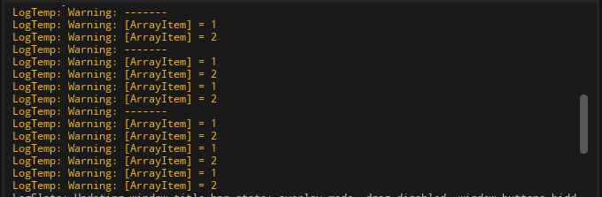
#### `mutable` в Мутексах
В вышеуказанном примере я добавил мутексу префикс `mutable`.
Зачем?
Чтобы использовать мутекс в `const` функциях.
Рассмотрим пример `const` функции, которая читает данные переменой `ThreadSafeTest`.
```cpp
TArray<int> GetThreadSafeTest() const {
    return ThreadSafeTest;
}
```
Парралельное чтение переменной без применения блокировки - не потокобезопасно. При чтении данных надо использовать мутекс. Однако, если создать мутекс без спецификатора `mutable`, то возникнет проблема.
```cpp
// Mutex
FCriticalSection Mutex;
// ThreadSafeTest variable getter
TArray<int> GetThreadSafeTest() const {
    FScopeLock ScopeLock{ &Mutex };
    return ThreadSafeTest;
}
```
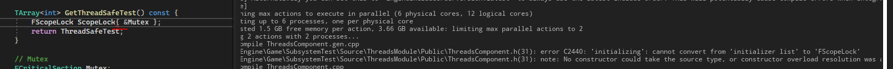
Потому что из `const` функций нельзя изменять параметры класса. А блокировка мутекса - подразумевает его изменение.
Чтобы изменять некоторые переменные внутри `const` обходя их ограничения - был придуман префикс `mutable`. Рекомендуется создавать мутексы с этим префиксом.
```cpp
// Mutex
mutable FCriticalSection Mutex;
// ThreadSafeTest variable thread safe getter
TArray<int> GetThreadSafeTest() const {
    FScopeLock ScopeLock{ &Mutex };
    return ThreadSafeTest;
}
```
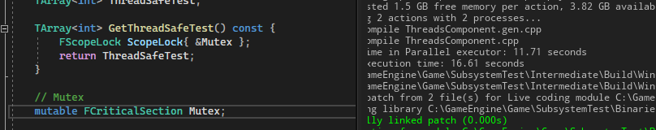
## Неблокирующая потокобезопасность (lockfree threadsafety)
Как я уже писал, частое использование мутексов сводит на нет преимущества от многопоточности. Поэтому давайте рассмотрим альтернативные подходы к работе с данными из нескольких потоков.
### Шаблон Atomic
`Atomic` операции позволяют работать с данными не используя блокировку потока.
`std::atomic` - единственный шаблон стандартной библиотеки с++, который рекомендован к использованию вместе с Unreal.
Для большинства шаблонов из стандартной библиотеки в Unreal есть свои собственные аналоги (`std::function -> TFunction`, `std::shared_ptr -> TSharedPtr` и так далее). Так и для `atomic` операций есть встроенный тип `TAtomic`. Однако, в данный момент (2023 год), встроенные типы данного семейства являются `Deprecated`, а саму систему, вероятно, планируют переделать.
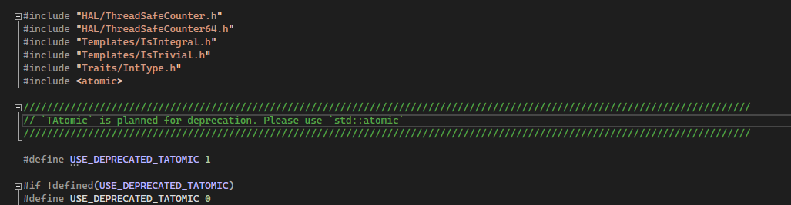
На что явно намекают всплывающие подсказки, а так-же документация к типу `TAtomic`.
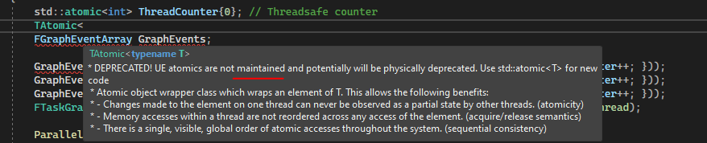
Вместо `TAtomic` разработчики рекомендуют использовать стандартный шаблон - `std::atomic`.
Данный шаблон подключается командой `#include <atomic>`.
Для получения значения из шаблона используется команда `.load()`.
```cpp
// .h
#include <atomic>
// ..
// .cpp
// BeginPlay
std::atomic<int> ThreadCounter{0}; // Threadsafe counter
// Parallel Calculations 1
Async(EAsyncExecution::Thread, [&]()->void {
    FGraphEventArray GraphEvents;
    for (int i = 0; i < 200; i++) { // add 200 tasks to graph event list
        GraphEvents.Add(FFunctionGraphTask::CreateAndDispatchWhenReady([&ThreadCounter] {
            FPlatformProcess::Sleep(0.005); // delay before incrementing
            ThreadCounter++;
        }));
    }
    FTaskGraphInterface::Get().WaitUntilTasksComplete(MoveTemp(GraphEvents), ENamedThreads::AnyThread); // run all tasks in parralel
});
// Parallel Calculations 2
Async(EAsyncExecution::Thread, [&]()->void {
    ParallelFor(100, [&ThreadCounter](int32 Index)
    {
        FPlatformProcess::Sleep(0.01); // delay before incrementing
        ThreadCounter++;
    });
});
// Wait some time and get ThreadCounter in the middle of calculations
FPlatformProcess::Sleep(0.03);
UE_LOG(LogTemp, Warning, TEXT("ThreadCounter Atomic Value is %d"), ThreadCounter.load());
```
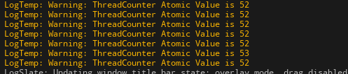
Обратите внимание: `std::atomic` не получится использовать с указателями.
Указатель хранит в себе всего-лишь адрес объекта, а не сам объект. Из-за этого доступ к объекту по его адресу, пусть даже и из `atomic` операции **не будет** потокобезопасным.
### Умные указатели и потокобезопасность
Указатели типа `TSharedPtr` и `TUniquePtr` имеют параметр, отвечающий за потокобезопасность - `ESPMode::ThreadSafe`. Но он отвечает лишь за **чтение** данных из указателя. Не за запись. Это очень важно.
Все мои попытки заставить движок записывать данные в умный указатель - провалились.
```cpp
TSharedPtr<int,ESPMode::ThreadSafe> TestSharedPointer = MakeShared<int>(0);
Async(EAsyncExecution::Thread, [&]()->void {
    *TestSharedPointer = 5;
});
```
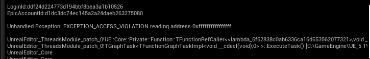
Виной тому - сама сущность указателей. Ведь они хранят лишь **ардес** памяти и больше ничего. Любая попытка изменить память по этому адресу - неизбежно будет не безопасной.
Аналогичная проблема наблюдается и с `std::shared_ptr`.
```cpp
std::shared_ptr<int> TestSharedPointer = std::make_shared<int>( 0 );
Async(EAsyncExecution::Thread, [&]()->void {
    *TestSharedPointer = 5;
});
```
На Stackoverflow есть более детальное [объяснение](https://stackoverflow.com/a/14485302/2574125) причины, по которой так происходит.
Таким образом:

> При записи данных по указателю избежать блокировки потока не получится. Придется использовать мутексы.

### `TLockFreePointerList`
Потокобезопасные списки, которые могут применятся для парралельной обработки данных.
`TLockFreePointerListFIFO ` - потокобезопасная очередь.
`TLockFreePointerListLIFO` - потокобезопасный стек.
`TLockFreePointerListUnordered` - потокобезопасная куча.
Наш массив `TArray<int> ThreadSafeTest` запросто может быть заменен на потокобезопасный стек.
Тогда приведенный выше пример будет выглядеть так:
```cpp
// .h
// Timer executions count
int TimerCount = 0;
// ThreadSafe stack test
TLockFreePointerListLIFO<int> ThreadSafeStack;
// ...
// .cpp
// Threadsafe tests
// Async Thread 1
Async(EAsyncExecution::TaskGraph, [this]()->void {
    int val = 1;
    ThreadSafeStack.Push(new int(1));
});
// Async Thread 2
Async(EAsyncExecution::TaskGraph, [this]()->void {
    int val = 2;
    ThreadSafeStack.Push(new int(2));
});
// since ThreadSafeStack.PopAll will clear stack items, i need to give system some values to write into it before printing
if (TimerCount >= 3) {
    UE_LOG(LogTemp, Warning, TEXT("-------"))
    // Print Array
    TArray<int*> StackItems;
    ThreadSafeStack.PopAll(StackItems);
    for (int* ArrayItem : StackItems) {
        UE_LOG(LogTemp, Warning, TEXT("[ArrayItem] = %i"), *ArrayItem)
    }
}
```

Поскольку `TLockFreePointerListLIFO` это потокобезопасный тип - он не блокирует пространство при записи данных. Что, в свою очередь, разрешает парралелизм для данной переменной. Именно поэтому в результатах вы можете наблюдать две `1, 1` идущие подряд.
## TaskGraph
Многопоточность движка `Unreal Engine` построена вокруг графа потоков. Каждый крупный блок логики движка выполняется на одном из графов, они перечислены в списке `ENamedThreads`.
Интерфейс `TGraphTask` позволяет запустить класс, соблюдающий ряд условий, в выбранном `TaskGraph` движка.
Классы, которые предполагается запускать в `TGraphTask` называются "классами задач" или тасками (я буду использовать оба термина, дабы избежать тавтологии).
Задачи в `TGraphTask` могут быть связаны между  собой логически, образуя целые деревья, следящие за выполнением той или иной логики. При этом система распределяет задачи тасков по различным ядрам движка, что позволяет получить серьезный прирост производительности.
Реализация задач для графа должна содержать в себе четыре метода - `DoTask`, `GetStatId`, `GetDesiredThread` и `GetSubsequentsMode`. При этом класс наследовать ни от чего не надо.
В методе `DoTask` осуществляется основная логика работы задачи.
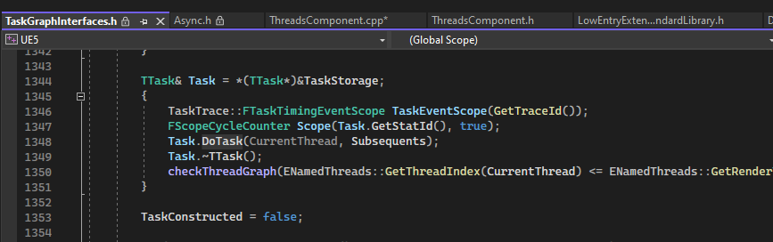
Реализация этого метода выглядит так:
```cpp
// Task calculations should go here
void DoTask(ENamedThreads::Type CurrentThread, const FGraphEventRef& MyCompletionGraphEvent)
{
    // из метода DoTask можно создавать новые задачи
    // Так-же новые задачи можно привязывать к MyCompletionGraphEvent, который вызывается по завершению таска
    //MyCompletionGraphEvent->DontCompleteUntil(TGraphTask<FSomeChildTask>::CreateTask(NULL, CurrentThread).ConstructAndDispatchWhenReady());
}
```
Метод `GetStatId` отвечает за идентификацию потока, в большинстве случаев его реализуют следующим образом:
```cpp
// Object Id
FORCEINLINE TStatId GetStatId() const
{
    RETURN_QUICK_DECLARE_CYCLE_STAT([класс_задачи], STATGROUP_TaskGraphTasks);
}
```
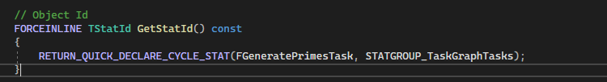
Метод `GetDesiredThread` отвечат за поток, в котором будет выполнена задача. Возвращает одно из значений типа `ENamedThreads`.
```cpp
// Named Thread where our task will be executed
static ENamedThreads::Type GetDesiredThread()
{
    return ENamedThreads::AnyThread;
}
```
Метод `GetSubsequentsMode` отвечает за механику обработки потоков, которые были созданы из этого потока. Он возвращает одно из значений типа `ESubsequentsMode`, это:
`ESubsequentsMode::TrackSubsequents` - данный таск не будет завершен и удален из памяти до тех пор, пока все задачи, которые были в нем созданы, не завершат свою работу.
`ESubsequentsMode::FireAndForget` - данный таск не следит за задачами, которые были в нем созданы.
```cpp
// Sub tasks called from this task track mode
static ESubsequentsMode::Type GetSubsequentsMode()
{
    return ESubsequentsMode::TrackSubsequents;
}
```
### Создание задач для TaskGraph
Давайте сделаем свой собственный тип таска (задачи) для графа потоков.
Разработчики оставили пример реализации таска в файле - `/Runtime/Core/Public/Async/TaskGraphInterfaces.h`.
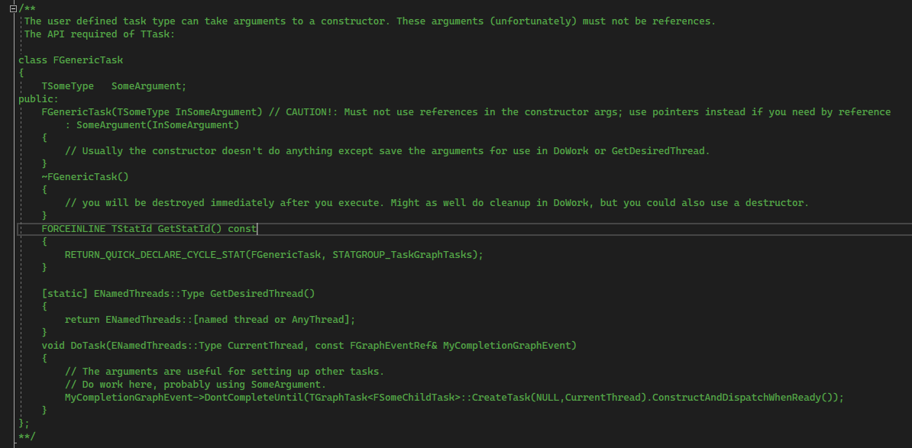
Его можно просто скопировать задав соответствующие значения.
Но для начала создадим отдельную категорию файлов под наши таски. Для этого в каталоге модуля, в папке `/Public/` создайте подпапку `/Tasks`, а в ней файл - `GeneratePrimesTask.h`.
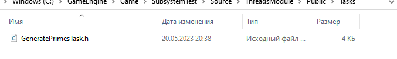
Чтобы файл появился в проекте `Visual Studio`, из движка вызовите команду `Tools -> Refresh Visual Studio 2022 Project`.
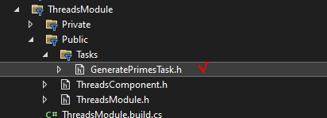
Теперь поместим в файл код задачи. Я написал его заранее в виде класса `FGeneratePrimesTask`, который вычисляет простые числа и пишет результаты вычислений в лог.
```cpp
#pragma once
#include "CoreMinimal.h"
#include <Stats/Stats.h>
// Async
#include "Async/Async.h"
// FThreadManager
#include "HAL/ThreadManager.h"
/**
* Task to generate Prime Numbers
* based on TaskGraphInterfaces.h / FGenericTask (it's commented section)
*/
class FGeneratePrimesTask
{
	// Arguments
	int NumsAmount = 500;
	int OffsetFromNum = 0;
	// For Time Measuring
	double StartTime = 0.0f;
public:
	FGeneratePrimesTask(int InNumsAmount, int InOffsetFromNum) // CAUTION!: Must not use references in the constructor args; use pointers instead if you need by reference
		: NumsAmount(InNumsAmount) , OffsetFromNum(InOffsetFromNum)
	{
		// Usually the constructor doesn't do anything except save the arguments for use in DoWork or GetDesiredThread.
		// In my case i'l do time measuring for task
		StartTime = FPlatformTime::Seconds();
		UE_LOG(LogTemp, Warning, TEXT("---------"));
	}
	~FGeneratePrimesTask()
	{
		// Time Measuring
		double EndTime = FPlatformTime::Seconds();
		UE_LOG(LogTemp, Warning, TEXT("Task Executed in %f seconds."), EndTime - StartTime);
		Log(__FUNCTION__);
		UE_LOG(LogTemp, Warning, TEXT("---------"));
	}
	// Object Id
	FORCEINLINE TStatId GetStatId() const
	{
		RETURN_QUICK_DECLARE_CYCLE_STAT(FGeneratePrimesTask, STATGROUP_TaskGraphTasks);
	}
	// Named Thread where our task will be executed
	static ENamedThreads::Type GetDesiredThread()
	{
		return ENamedThreads::AnyThread;
	}
	// Sub tasks called from this task track mode
	static ESubsequentsMode::Type GetSubsequentsMode()
	{
		return ESubsequentsMode::TrackSubsequents;
	}
	// Task calculations should go here
	void DoTask(ENamedThreads::Type CurrentThread, const FGraphEventRef& MyCompletionGraphEvent)
	{
		/* // Completion event of current task
        // тут я использую FFunctionGraphTask для привязки его к событию завершения задачи
        // про FFunctionGraphTask я напишу чуть ниже
        MyCompletionGraphEvent->DontCompleteUntil(FFunctionGraphTask::CreateAndDispatchWhenReady([this]() {
			UE_LOG(LogTemp, Warning, TEXT("MyCompletionGraphEvent has Been Called!"))
			// Sleep
			FPlatformProcess::Sleep(3.1);
			UE_LOG(LogTemp, Warning, TEXT("MyCompletionGraphEvent has Been Fnished!"))
		}, TStatId(), nullptr, ENamedThreads::AnyBackgroundThreadNormalTask));
		// We can also call another task from here
		//MyCompletionGraphEvent->DontCompleteUntil(TGraphTask<FGeneratePrimesTask>::CreateTask(NULL, CurrentThread).ConstructAndDispatchWhenReady());
        */
		UE_LOG(LogTemp, Warning, TEXT("Searching For Primes"))
		int FinalNumber = CalculatePrimes();
		Log(__FUNCTION__);
		UE_LOG(LogTemp, Warning, TEXT("%d Prime Numbers found between %d and %d"), NumsAmount, OffsetFromNum, FinalNumber)
	}
private:
	// log
	void Log(const char* Action)
	{
		uint32 CurrentThreadId = FPlatformTLS::GetCurrentThreadId();
		FString CurrentThreadName = FThreadManager::Get().GetThreadName(CurrentThreadId);
		UE_LOG(LogTemp, Warning, TEXT("%s[%d] - %s"), *CurrentThreadName, CurrentThreadId, ANSI_TO_TCHAR(Action));
	}
	// Calculation of PrimeNumbers
	int CalculatePrimes()
	{
		// Lambda checker for prime number
		TFunction<bool(int)> IsPrime = [](int Num) -> bool {
			// since 0 and 1 is not prime return false.
			if (Num < 2) {
				return false;
			}
			// Run a loop from 2 to n-1
			for (int i = 2; i < Num; i++) {
				// if the number is divisible by i, then n is not a
				// prime number.
				if (Num % i == 0) {
					return false;
				}
			}
			// otherwise, n is prime number.
			return true;
		};
		int PrimesFound = 0;
		int CurrentTestNumber = OffsetFromNum;
		// Generate prime numbers until their amount less than 10000
		while (PrimesFound < NumsAmount)
		{
			CurrentTestNumber++;
			if (IsPrime(CurrentTestNumber)) {
				PrimesFound++;
			}
		}
		return CurrentTestNumber;
	}
};
```
Данный таск генерирует в потоке указанное кол-во простых чисел, начиная от указанного числа.
Чтобы запустить приведенный выше класс задачи внутри графа вызывается следующая команда:
```cpp
// Generate Primes Task
#include "Tasks/GeneratePrimesTask.h"
// ...
// Construct test task
TGraphTask<FGeneratePrimesTask>::CreateTask().ConstructAndDispatchWhenReady(10500,20000);
```
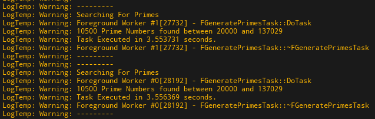
Запуск осуществляется мной внутри таймера:
```cpp
GetWorld()->GetTimerManager().SetTimer(*(new FTimerHandle()), [&]()->void {
    // Construct test task
    FGraphEventRef TaskEvent = TGraphTask<FGeneratePrimesTask>::CreateTask().ConstructAndDispatchWhenReady(10500,20000);
 
}, 5.0f, true, 1.0f);
```
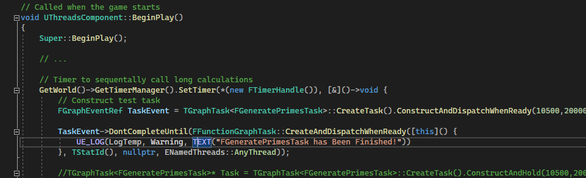
### `ConstructAndHold`
Иногда есть необходимость создать задачу, но не запускать ее сразу, для этого используется метод `TGraphTask::ConstructAndHold`.
Созданную таким образом задачу разработчик может запустить в любой момент, используя `TGraphTask::Unlock`.
```cpp
// Construct task and hold it's execution
// Constructor will be called, but DoTask will not be called
TGraphTask<FGeneratePrimesTask>* Task = TGraphTask<FGeneratePrimesTask>::CreateTask().ConstructAndHold(10500,20000);
if(SomethingHappend){
    // Run Task
    Task->Unlock();
}
```
### Вложенный класс - как `GraphTask`
Одна из самых недооцененных особенностей с++ состоит в возможности вложения классов, структур и перечислений(enum) внутрь других классов, структур, перечислений и даже методов.
В предыдущих примерах я создал отдельный файл под таск, вычисляющий простые числа. Если вам такого делать не хочется или ситуация не позволяет реализовывать глобально доступный класс, можно реализовать класс под таск прямо внутри метода. И он будет работать.
```cpp
// Nested class that is used as Task Graph task that generates and prints out Fibbonacci numbers
class FFibbonacciCalculationTask
{
private:
    // Fibbonacci numbers amount to generate
    int GenerationCount = 0;
public:
    // Constructor
    FFibbonacciCalculationTask(int inGenerationCount)
        : GenerationCount(inGenerationCount)
    {
    }
    // Object Id
    FORCEINLINE TStatId GetStatId() const
    {
        RETURN_QUICK_DECLARE_CYCLE_STAT(FFibbonacciCalculationTask, STATGROUP_TaskGraphTasks);
    }
    // Named Thread where our task will be executed
    static ENamedThreads::Type GetDesiredThread()
    {
        return ENamedThreads::AnyThread;
    }
    // Sub tasks called from this task track mode
    static ESubsequentsMode::Type GetSubsequentsMode()
    {
        return ESubsequentsMode::FireAndForget;
    }
    // Task calculations should go here
    void DoTask(ENamedThreads::Type CurrentThread, const FGraphEventRef& MyCompletionGraphEvent)
    {
        int32 ThreadId = FPlatformTLS::GetCurrentThreadId();
        FString ThreadName = FThreadManager::Get().GetThreadName(ThreadId);
        // Print out fibonacci numbers until
        for (int i = 0; i <= GenerationCount; i++) {
            int Fibn = FibRec(i);
            UE_LOG(LogTemp, Warning, TEXT("%s[%d], Next Fibbonacci Number:%d"), *ThreadName, ThreadId, Fibn);
        }
    }
    // Recursive Fibbonacci
    int FibRec(int num) {
        // fibbonacci - each nex fib number is summ of n-1 and n-2 numbers
        if (num - 1 < 0 || num - 2 < 0) return 1; // 1 and 1 is first fib numbers
        return FibRec(num - 1) + FibRec(num - 2);
    }
};
// Run class as task
FGraphEventRef OutEvent = TGraphTask<FFibbonacciCalculationTask>::CreateTask().ConstructAndDispatchWhenReady(10);
```
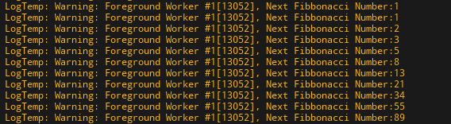
### Запуск функции в `FFunctionGraphTask`
Класс `FFunctionGraphTask` создан для того, чтобы не мучать разработчика постоянным написанием классов под примитивные задачи. `FFunctionGraphTask` - это уже готовый класс задачи, который позволяет напрямую запустить функцию или лямбду из переданную в качестве аргумента.
```cpp
// FFunctionGraphTask
FFunctionGraphTask::CreateAndDispatchWhenReady([this]() {
    // Time Measuring
    double StartTime = FPlatformTime::Seconds();
    // Thread Id
    uint32 CurrentThreadId = FPlatformTLS::GetCurrentThreadId();
    FString CurrentThreadName = FThreadManager::Get().GetThreadName(CurrentThreadId);
    UE_LOG(LogTemp, Warning, TEXT("Thread Sleeps"));
    // Sleep
    FPlatformProcess::Sleep(3.0);
    // Time Measuring
    double EndTime = FPlatformTime::Seconds();
    // Debug
    UE_LOG(LogTemp, Warning, TEXT("%s[%d] - Duration: %f"), *CurrentThreadName, CurrentThreadId, EndTime - StartTime);
}, TStatId(), nullptr, ENamedThreads::AnyThread);
```
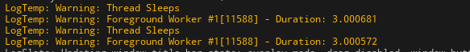
Так-же `FFunctionGraphTask` можно использовать, например, для обработки завершающего события.
#### Событие завершения задачи `MyCompletionGraphEvent`
В `DoTask(ENamedThreads::Type CurrentThread, const FGraphEventRef& MyCompletionGraphEvent)`  есть параметр `MyCompletionGraphEvent`, который вызывается автоматически, при завершении задачи.
Мы можем подключить к этому параметру обработчик в виде вызова `FFunctionGraphTask` следующим образом:
```cpp
void DoTask(ENamedThreads::Type CurrentThread, const FGraphEventRef& MyCompletionGraphEvent)
{
    // ...
    // Wait for FFunctionGraphTask to finish
    MyCompletionGraphEvent->DontCompleteUntil(FFunctionGraphTask::CreateAndDispatchWhenReady([this]() {
        UE_LOG(LogTemp, Warning, TEXT("MyCompletionGraphEvent has Been Called!"))
        // Sleep
        FPlatformProcess::Sleep(3.1);
        UE_LOG(LogTemp, Warning, TEXT("MyCompletionGraphEvent has Been Fnished!"))
    }, TStatId(), nullptr, ENamedThreads::AnyThread));
 
    // We can also call another task from here
    //MyCompletionGraphEvent->DontCompleteUntil(TGraphTask<FGeneratePrimesTask>::CreateTask(NULL, CurrentThread).ConstructAndDispatchWhenReady());
}
```
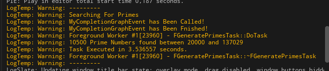
Поскольку обе задачи запускаются в графе `AnyThread` они работают синхронно. Если нужно добавить асинхронности - установите граф исполнения `MyCompletionGraphEvent` на `ENamedThreads::AnyBackgroundThreadNormalTask`.
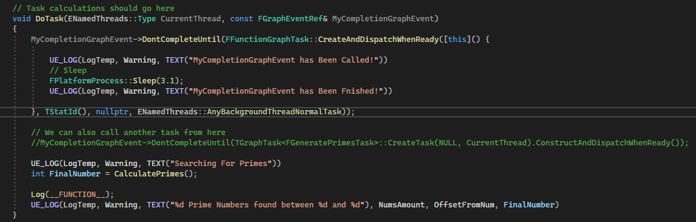
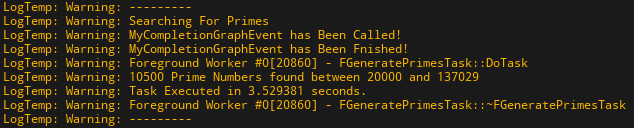
### Запуск асинхронных событий в `FDelegateGraphTask` и `FSimpleDelegateGraphTask`
Помимо`FFunctionGraphTask` в движке так-же присутствуют еще два интерфейса для упрощенного запуска асинхронной логики.
Интерфейс `FDelegateGraphTask` позволяет запустить в одном из потоков метод, привязанный к одному, конкретному, делегату. При этом делегат должен принимать два параметра: `NamedThreads::Type CurrentThread` и  `const FGraphEventRef& MyCompletionGraphEvent`, которые соответствуют аргументам метода `DoTask`.
Есть и упрощенный вариант данного интерфейса - `FSimpleDelegateGraphTask`, без аргументов.
```cpp
// FSimpleDelegateGraphTask Sample
FSimpleDelegateGraphTask::CreateAndDispatchWhenReady(FSimpleDelegateGraphTask::FDelegate::CreateLambda([this](){
    // Time Measuring
    double StartTime = FPlatformTime::Seconds();
    // Thread Id
    uint32 CurrentThreadId = FPlatformTLS::GetCurrentThreadId();
    FString CurrentThreadName = FThreadManager::Get().GetThreadName(CurrentThreadId);
    UE_LOG(LogTemp, Warning, TEXT("Thread Sleeps"));
    // Sleep
    FPlatformProcess::Sleep(3.0);
    // Time Measuring
    double EndTime = FPlatformTime::Seconds();
    // Debug
    UE_LOG(LogTemp, Warning, TEXT("%s[%d] - Duration: %f"), *CurrentThreadName, CurrentThreadId, EndTime - StartTime);
}), TStatId());
// FDelegateGraphTask Sample
FDelegateGraphTask::CreateAndDispatchWhenReady(
    FDelegateGraphTask::FDelegate::CreateLambda([this](ENamedThreads::Type InCurrentThread, const FGraphEventRef& MyCompletionGraphEvent)
    {
        // Time Measuring
        double StartTime = FPlatformTime::Seconds();
        // Thread Id
        uint32 CurrentThreadId = FPlatformTLS::GetCurrentThreadId();
        FString CurrentThreadName = FThreadManager::Get().GetThreadName(CurrentThreadId);
        UE_LOG(LogTemp, Warning, TEXT("Thread Sleeps"));
        // Sleep
        FPlatformProcess::Sleep(3.0);
        // Time Measuring
        double EndTime = FPlatformTime::Seconds();
        UE_LOG(LogTemp, Warning, TEXT("%s[%d] - Duration: %f"), *CurrentThreadName, CurrentThreadId, EndTime - StartTime);
    }),
TStatId());
```
### Управление задачами в графе
Задачам в графе можно задавать порядок исполнения, а так-же создавать из задач сложные логические цепочки. Такой подход позволяет разбивать сложные вычисления на несколько этапов.
Давайте создадим отдельный файл для задач, которыми мы собираемся управлять. Я назвал его `SimpleTask.h`
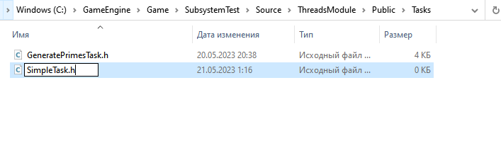
С таким кодом:
```cpp
#pragma once
#include "CoreMinimal.h"
#include <Stats/Stats.h>
// Async
#include "Async/Async.h"
// FThreadManager
#include "HAL/ThreadManager.h"
/**
* Very Simple graph task
* based on TaskGraphInterfaces.h / FGenericTask (it's commented section)
*/
class FSimpleTask
{
	// Arguments
	float SleepTime = 3.0f;
	FString TaskName = "A";
	// For Time Measuring
	double StartTime = 0.0f;
public:
	FSimpleTask(float InSleepTime = 3.0f, FString InTaskName = "A")
		: SleepTime(InSleepTime), TaskName(InTaskName)
	{
		// i'l do time measuring for task
		StartTime = FPlatformTime::Seconds();
		UE_LOG(LogTemp, Warning, TEXT("---------"));
		UE_LOG(LogTemp, Warning, TEXT("Constructed task \"%s\""), *TaskName);
	}
	~FSimpleTask()
	{
		// Time Measuring
		double EndTime = FPlatformTime::Seconds();
		UE_LOG(LogTemp, Warning, TEXT("Task \"%s\" Executed in %f seconds."), *TaskName, EndTime - StartTime);
		UE_LOG(LogTemp, Warning, TEXT("---------"));
	}
	// Object Id
	FORCEINLINE TStatId GetStatId() const
	{
		RETURN_QUICK_DECLARE_CYCLE_STAT(FSimpleTask, STATGROUP_TaskGraphTasks);
	}
	// Named Thread where our task will be executed
	static ENamedThreads::Type GetDesiredThread()
	{
		return ENamedThreads::AnyThread;
	}
	// Sub tasks called from this task track mode
	static ESubsequentsMode::Type GetSubsequentsMode()
	{
		return ESubsequentsMode::TrackSubsequents;
	}
	// Task calculations should go here
	void DoTask(ENamedThreads::Type CurrentThread, const FGraphEventRef& MyCompletionGraphEvent)
	{
		UE_LOG(LogTemp, Warning, TEXT("Running task \"%s\""), *TaskName);
		// Sleep
		FPlatformProcess::Sleep(SleepTime);
	}
};
```
Все что делает этот таск, как видите - ждет `SleepTime` секунд. При реальной разработке, вместо ожидания, должна идти сложная логика.
Вызывается этот таск простым кодом:
```cpp
// Construct test task
FGraphEventRef TaskEvent = TGraphTask<FSimpleTask>::CreateTask().ConstructAndDispatchWhenReady(2.0f, "D");
```
Давайте посмотрим на метод `CreateTask`, точнее на его реализацию в движке, файл `\Runtime\Core\Public\Async\TaskGraphInterfaces.h`, строка 1297 (в `UE5.1`).
```cpp
/**
 *	Factory to create a task and return the helper object to construct the embedded task and set it up for execution.
 *	@param Prerequisites; the list of FGraphEvents that must be completed prior to this task executing.
 *	@param CurrentThreadIfKnown; provides the index of the thread we are running on. Can be ENamedThreads::AnyThread if the current thread is unknown.
 *	@return a temporary helper class which can be used to complete the process.
**/
static FConstructor CreateTask(const FGraphEventArray* Prerequisites = NULL, ENamedThreads::Type CurrentThreadIfKnown = ENamedThreads::AnyThread)
```
Метод `CreateTask` имеет параметр `Prerequisites`, на котором я заострю внимание. `Prerequisites` - это массив событий, которые должны быть завершены, прежде чем запустится таск, созданный через `CreateTask`.
Таким образом можно заставить систему синхронизировать выполнение задач.
```cpp
// Task A -> Task B -> Task D -> ---------------
//   |                           | Task Finish |
//   ------> Task C -----------> ---------------
// Global scope variables
FGraphEventRef TaskAEvt, TaskBEvt, TaskCEvt, TaskDEvt, TaskFinishEvt;
// Task A
TaskAEvt = TGraphTask<FSimpleTask>::CreateTask().ConstructAndDispatchWhenReady(2.0f, "A");
// Since Prerequisites passed by ref we can't call all tasks with same Prerequisites refrence
// So need to use scope
// Variables defined in scope - acessible only inisde of it
// Task B Scope
{
    FGraphEventArray Prerequisites;
    Prerequisites.Add(TaskAEvt); // Task B Waits for Task A
    TaskBEvt = TGraphTask<FSimpleTask>::CreateTask(&Prerequisites).ConstructAndDispatchWhenReady(2.1f, "B");
}
// Task C Scope
{
    FGraphEventArray Prerequisites;
    Prerequisites.Add(TaskAEvt); // Task C Waits for Task A
    TaskCEvt = TGraphTask<FSimpleTask>::CreateTask(&Prerequisites).ConstructAndDispatchWhenReady(1.0f, "C");
}
// Task D Scope
{
    FGraphEventArray Prerequisites;
    Prerequisites.Add(TaskBEvt); // Task D Waits for Task B
    TaskDEvt = TGraphTask<FSimpleTask>::CreateTask(&Prerequisites).ConstructAndDispatchWhenReady(1.5f, "D");
}
// Task Finish Scope
{
    FGraphEventArray Prerequisites = { TaskAEvt, TaskBEvt, TaskCEvt, TaskDEvt };  // Task Finish Waits for all Tasks to be completed
    TaskFinishEvt = TGraphTask<FSimpleTask>::CreateTask(&Prerequisites).ConstructAndDispatchWhenReady(1.0f, "Finish");
}
```
В этом коде я реализую следующую схему:
```cpp
// Task A -> Task B -> Task D -> ---------------
//   |                           | Task Finish |
//   ------> Task C -----------> ---------------
```
Таск `B` зависит от `А`, а `D` зависит от `B`. Таск `C` зависит от `A`, поэтому выполняется в промежутке, парралельно таскам `B` и `D`.
Финальный таск ждет выполнения всех остальных и лишь потом запускается.
Вывод в лог выглядит так:
```cpp
---------
Constructed task "A"
---------
Constructed task "B"
Running task "A"
---------
Constructed task "C"
---------
Constructed task "D"
---------
Constructed task "Finish"
Task "A" Executed in 2.000110 seconds.
---------
Running task "B"
Running task "C"
Task "C" Executed in 3.000357 seconds.
---------
Task "B" Executed in 4.100642 seconds.
---------
Running task "D"
Task "D" Executed in 5.600780 seconds.
---------
Running task "Finish"
Task "Finish" Executed in 6.601250 seconds.
---------
```
Обратите внимание - задача `C` работает парралельно задаче `B`, а задача `Finish` запускается самой последней и ее суммарное время исполнения (между конструктором и деструктором) самое большое.
#### `FNullGraphTask`
В движке есть предзаданная задача - `FNullGraphTask`, единственный смысл которой состоит в том, чтобы закрывать последовательное исполнение группы задач.
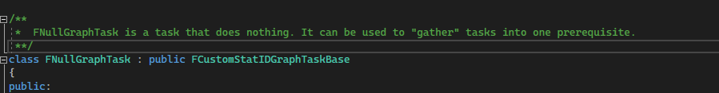
В приведенном выше примере я использовал таск `Finish`, чтобы сгруппировать таски.
Давайте используем `FNullGraphTask` для той-же цели.
```cpp
//  Task A ->
//          | -> NullTask(Gather/Fence)
//  Task B ->
{
    // We need  only STAT ID for Null task, so declare it in macro
    DECLARE_CYCLE_STAT(TEXT("FNullGraphTask.Gather"), FStat_STAT_FNullGraphTask_Gather, STATGROUP_TaskGraphTasks);
    FGraphEventRef TaskAEvt = TGraphTask<FSimpleTask>::CreateTask().ConstructAndDispatchWhenReady(2.0f, "A");
    FGraphEventRef TaskBEvt = TGraphTask<FSimpleTask>::CreateTask().ConstructAndDispatchWhenReady(3.0f, "B");
    FGraphEventArray Prerequisites = { TaskAEvt, TaskBEvt };
    FGraphEventRef CompleteEvent = TGraphTask<FNullGraphTask>::CreateTask(&Prerequisites)
    .ConstructAndDispatchWhenReady(GET_STATID(FStat_STAT_FNullGraphTask_Gather), ENamedThreads::GameThread);
    UE_LOG(LogTemp, Warning, TEXT("Waiting until Tasks A and B completed!"))
    CompleteEvent->Wait(); // this will FREEZE THREAD!
    UE_LOG(LogTemp, Warning, TEXT("Tasks A and B completed!"))
}
```
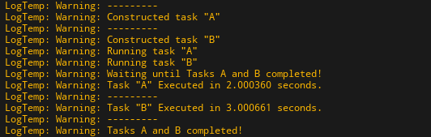
### `TFuture` - `TPromise`
Связка типов `TFuture` - `TPromise` используется для получения данных из потока.
Данные типы являются аналогами типов `std::future` и `std::promise` из стандартной библиотеки
Более подробно прочитать про эти объекты можно на [stackoverflow](https://stackoverflow.com/a/11020645/2574125).
`TPromise` - это тип, используя который можно передать данные в `TFuture`.
`TFuture` - это тип, к которому можно привязать событие получения данных. Это событие будет вызвано, когда `TPromise` получает обещанное значение.
Работа с этими типами выполняется по следующей концепции:
```
Создаем TPromise Promise, то есть обещание какого-то результата
TPromise<int> Promise - тут я обещаю передать целое число.
Promise.GetFuture() - При создании объекта TPromise в нем генерируется переменная состояния типа TFutureState<ResultType>, значение которой можно получить методом GetFuture()
TFuture<int> FutureValue = Promise.GetFuture()
Объект FutureValue, привязанный к Promise таким образом, будет автоматически вызван, когда обещание будет исполнено.
Promise.SetValue(5) - данный метод позволяет исполнить обещание о передаче значения. Исполнение обещания автоматически активирует привязанный через Promise.GetFuture() объект FutureValue.
```
Важным элементом системы обещаний является проверка на исполнимость обещаний. Если мы не вызываем `TPromise::SetValue` в текущей области видимости, то в движке случается сбой. Не создавайте объекты `TPromise`, которым вы не собираетесь установить значение.
Рассмотрим использование такого подхода применительно к функции `AsyncTask`.
Она возвращает `void`, поэтому одним из способов получения данных из `AsyncTask` может быть связка `TFuture` - `TPromise`.
```cpp
// TFuture - TPromise tests
TPromise<int> Promise; // Empty Promise Initialisation
TFuture<int> Future = Promise.GetFuture(); // Promise Future
AsyncTask(ENamedThreads::AnyThread, [&, PR = MoveTemp(Promise)]() mutable ->void {
    FPlatformProcess::Sleep(3);
    UE_LOG(LogTemp, Warning, TEXT("Fulfill the promise"));
    PR.SetValue(5); // since lambda is 'mutable' we can set value to promise alias, which will 'Fulfill Promise'
});
// Promise SHULD ALWAYS BEEN FULFILLED before calling .Then() or .Next() OR IT CRASH with error - Assertion Failed
// this callback will be called once Promise is fulfilled
//Future.Then([&](TFuture<int> Future) -> void {
    // Make Sure it's valid
    //if (Future.IsValid()) {
        //UE_LOG(LogTemp, Warning, TEXT("Result calculated in thread is %i"), Future.Get())
    //}
//});
// or we can use binding to Next
Future.Next([&](int Result)->void {
    UE_LOG(LogTemp, Warning, TEXT("Result calculated in thread is %i"), Result)
});
```
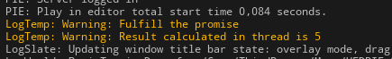
Я использовал `MoveTemp`, чтобы передать `Promise` в тело лямбды как `rvalue`. Такой подход позволяет передавать обещания внутрь потоков и возвращать оттуда значения. Важно, чтобы лямбда, запускаемая в потоке была `mutable`, потому что полученный "по значению" псевдоним `PR` изменить из нее иначе не получится.
### Собственные функции для запуска задач в графе
Функция `AsyncTask`, которую я описал ранее, имеет очень убогую реализацию. Предлагаю переписать ее с учетом механики `TFuture` - `TPromise`.
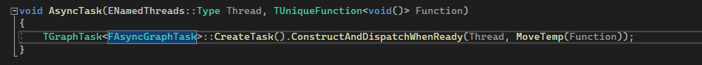
Для начала создадим с этой целью отдельный заголовочный файл в подпапке модуля `Tasks`. Назовем - `AsyncHelpers.h`.

После создания файла, в Unreal Engine выполняем команду `Tool -> Refresh Visual Studio 2022 Project`, чтобы этот файл появился в проекте Visual Studio.


Внутри файла создадим класс `AsyncHelpers`, в который можно будет добавлять собственные `static` методы, в частности новый `AsyncTask`.
```cpp
#pragma once
#include "CoreMinimal.h"
#include <Stats/Stats.h>
// Async
#include "Async/Async.h"
// Class to store our custom async methods
class AsyncHelpers {
};
```
В качестве заготовки для класса можно использовать функцию `Async` из файла `\Runtime\Core\Public\Async\Async.h`.

Учтите, что функция `Async` написана под с++ 11 или 14, поэтому некоторые ее конструкции можно упростить. А от некоторых и вовсе - отказаться. Например определение возвращаемого типа через `->` сейчас уже не обязательно.
Так-же не обязательно отдельно передавать `CompletionCallback` в `Promise`.
Класс задачи, которую я буду запускать - реализую прямо внутри функции, как я это делал в предыдущей главе с классом `FFibbonacciCalculationTask`.
```cpp
// Class to store our custom async methods
class AsyncHelpers {
public:
	template<class CallableType>
	static auto CAsyncTask(CallableType&& ThreadBody)// -> TFuture<decltype(Forward<CallableType>(ThreadBody)())>
	{
		using ResultType = decltype(Forward<CallableType>(ThreadBody)()); // detect return type of passed ThreadBody callable (lambda)
		// make UniqueFunction based on ThreadBody
		// "Perfect Forwarding" logics are used here, it's very complex question to explain in comments
		// short explanation:
		// if ThreadBody copyable (TFunction), it will be copied into Function variable using copy-constructor
		// if ThreadBody movable (TUniqueFunction), it will be moved into Function using move-constructor
		// exact explanations about "Perfect Forwarding" and how it works, you can find in my article about move-logics in this book
		// we also can use MoveTemp, but this will force copyable objects also move into Function variable
		TUniqueFunction<ResultType()> Function(Forward<CallableType>(ThreadBody));
		TPromise<ResultType> Promise;
		TFuture<ResultType> Future = Promise.GetFuture();
		// use nested class for task, because we can
		class FExecuteAsyncTask
		{
		private:
			TUniqueFunction<ResultType()> LogicToExecute; // this will hold passed function
			TPromise<ResultType> TaskPromise;
		public:
			explicit FExecuteAsyncTask() = delete; // remove default constructor
			explicit FExecuteAsyncTask(TUniqueFunction<ResultType()>& inLogicToExecute) = delete; // remove copy-constructor
			// move-constructor, works only with rvalues
			explicit FExecuteAsyncTask(TUniqueFunction<ResultType()>&& inLogicToExecute, TPromise<ResultType>&& inPromise)
				: LogicToExecute(MoveTemp(inLogicToExecute)), // store thread logic in private class field
				TaskPromise(MoveTemp(inPromise))
			{}
			// Object Id
			FORCEINLINE TStatId GetStatId() const
			{
				RETURN_QUICK_DECLARE_CYCLE_STAT(FFibbonacciCalculationTask, STATGROUP_TaskGraphTasks);
			}
			// Named Thread where our task will be executed
			static ENamedThreads::Type GetDesiredThread()
			{
				return ENamedThreads::AnyThread;
			}
			// Sub tasks called from this task track mode
			static ESubsequentsMode::Type GetSubsequentsMode()
			{
				return ESubsequentsMode::FireAndForget;
			}
			// Task calculations should go here
			void DoTask(ENamedThreads::Type CurrentThread, const FGraphEventRef& MyCompletionGraphEvent)
			{
				SetPromise(TaskPromise, LogicToExecute); // this will also run LogicToExecute(), because SetPromise gets result of the function
			}
		};
		// Run class as task
		/*FGraphEventRef OutEvent = */
		TGraphTask<FExecuteAsyncTask>::CreateTask().ConstructAndDispatchWhenReady(MoveTemp(Function), MoveTemp(Promise));
		return MoveTemp(Future);
	}
};
```
Задумка тут такова: я передаю в метод `AsyncHelpers::CAsyncTask` лямбду (которая может возвращать значение) и эта лямбда вызывается в таске, попадая туда через аргументы `ConstructAndDispatchWhenReady`.
Лямбда конструируется из переменной `ThreadBody` прямо на лету, в начале функции.
```cpp
TUniqueFunction<ResultType()> Function(Forward<CallableType>(ThreadBody));
```
Тут-же создается и возвращаемый объект - `TFuture`, который привязывается к `Promise`. Сам `Promise` передается в класс таска, где и вызывается.
В коде используется `move` семантика и `perfect forwarding`. Это техники для передачи объектов между разными переменными без копирования. Объяснять данные темы в этой статье бессмысленно - они слишком объемные.
Код прекрасно работает:
```cpp
//.h
// Async Helpers Library
#include "Tasks/AsyncHelpers.h"
///
//.cpp
// Begin Play
AsyncHelpers::CAsyncTask([&]()->int{
    FPlatformProcess::Sleep(3);
    UE_LOG(LogTemp, Warning, TEXT("Test Running Callable"));
    return 5;
}).Next([&](int Result)->void {
    UE_LOG(LogTemp, Warning, TEXT("[completed] Result = %i"), Result);
});
```

Чего в такой реализации не хватает? Не хватает ключевой возможности системы `GraphTask` - объединять несколько задач в цепочки, а так-же запускать их по своему желанию.
Давайте этот недочет исправим.
```cpp
// Async
#include "Async/Async.h"
// Class to store our custom async methods
class AsyncHelpers {
public:
	template<class CallableType>
	static auto CAsyncTask(CallableType&& ThreadBody, ENamedThreads::Type TargetThread = ENamedThreads::AnyThread)// -> TFuture<decltype(Forward<CallableType>(ThreadBody)())>
	{
		using ResultType = decltype(Forward<CallableType>(ThreadBody)()); // detect return type of passed ThreadBody callable (lambda)
		// make UniqueFunction based on ThreadBody
		// "Perfect Forwarding" logics are used here, it's very complex question to explain in comments
		// short explanation:
		// if ThreadBody copyable (TFunction), it will be copied into Function variable using copy-constructor
		// if ThreadBody movable (TUniqueFunction), it will be moved into Function using move-constructor
		// exact explanations about "Perfect Forwarding" and how it works, you can find in my article about move-logics in this book
		// we also can use MoveTemp, but this will force copyable objects also move into Function variable
		TUniqueFunction<ResultType()> Function(Forward<CallableType>(ThreadBody));
		TPromise<ResultType> Promise;
		TFuture<ResultType> Future = Promise.GetFuture();
		// use nested class for task, because we can
		class FExecuteAsyncTask
		{
		private:
			TUniqueFunction<ResultType()> LogicToExecute; // this will hold passed function
			TPromise<ResultType> TaskPromise;
			ENamedThreads::Type TargetThread = ENamedThreads::AnyThread; // thread that we will use to run our task
		public:
			explicit FExecuteAsyncTask() = delete; // remove default constructor
			explicit FExecuteAsyncTask(TUniqueFunction<ResultType()>& inLogicToExecute) = delete; // remove copy-constructor
			// move-constructor, works only with rvalues
			explicit FExecuteAsyncTask(TUniqueFunction<ResultType()>&& inLogicToExecute, TPromise<ResultType>&& inPromise)
				: LogicToExecute(MoveTemp(inLogicToExecute)), // store thread logic in private class field
				TaskPromise(MoveTemp(inPromise))
			{}
			// Object Id
			FORCEINLINE TStatId GetStatId() const
			{
				RETURN_QUICK_DECLARE_CYCLE_STAT(FFibbonacciCalculationTask, STATGROUP_TaskGraphTasks);
			}
			// Named Thread where our task will be executed
			ENamedThreads::Type GetDesiredThread()
			{
				return TargetThread;
			}
			// Sub tasks called from this task track mode
			static ESubsequentsMode::Type GetSubsequentsMode()
			{
				return ESubsequentsMode::FireAndForget;
			}
			// Task calculations should go here
			void DoTask(ENamedThreads::Type CurrentThread, const FGraphEventRef& MyCompletionGraphEvent)
			{
				SetPromise(TaskPromise, LogicToExecute); // this will also run LogicToExecute(), because SetPromise gets result of the function
			}
		};
		// Run class as task
		/*FGraphEventRef OutEvent = */
		TGraphTask<FExecuteAsyncTask>::CreateTask().ConstructAndDispatchWhenReady(MoveTemp(Function), MoveTemp(Promise));
		return MoveTemp(Future);
	}
	// Controllable Async Task
	template<class CallableType>
	static inline auto ControllableAsyncTask(CallableType&& ThreadBody, ENamedThreads::Type TargetThread = ENamedThreads::AnyThread)// -> TFuture<decltype(Forward<CallableType>(ThreadBody)())>
	{
		using ResultType = decltype(Forward<CallableType>(ThreadBody)()); // detect return type of passed ThreadBody callable (lambda)
		// make UniqueFunction based on ThreadBody
		// "Perfect Forwarding" logics are used here, it's very complex question to explain in comments
		// short explanation:
		// if ThreadBody copyable (TFunction), it will be copied into Function variable using copy-constructor
		// if ThreadBody movable (TUniqueFunction), it will be moved into Function using move-constructor
		// exact explanations about "Perfect Forwarding" and how it works, you can find in my article about move-logics in this book
		// we also can use MoveTemp, but this will force copyable objects also move into Function variable
		TUniqueFunction<ResultType()> Function(Forward<CallableType>(ThreadBody));
		TPromise<ResultType> Promise;
		TFuture<ResultType> Future = Promise.GetFuture();
		// use nested class for task, because we can
		class FExecuteAsyncTask
		{
		private:
			TUniqueFunction<ResultType()> LogicToExecute; // this will hold passed function
			TPromise<ResultType> TaskPromise;
			ENamedThreads::Type TargetThread = ENamedThreads::AnyThread; // thread that we will use to run our task
		public:
			explicit FExecuteAsyncTask() = delete; // remove default constructor
			// move-constructor, works only with rvalues
			explicit FExecuteAsyncTask( TUniqueFunction<ResultType()>&& inLogicToExecute,
										TPromise<ResultType>&& inPromise,
										ENamedThreads::Type inTargetThread
										)
				: LogicToExecute(MoveTemp(inLogicToExecute)), // store thread logic in private class field
				TaskPromise(MoveTemp(inPromise)),
				TargetThread(inTargetThread)
			{}
			// Object Id
			FORCEINLINE TStatId GetStatId() const
			{
				RETURN_QUICK_DECLARE_CYCLE_STAT(FFibbonacciCalculationTask, STATGROUP_TaskGraphTasks);
			}
			// Named Thread where our task will be executed
			ENamedThreads::Type GetDesiredThread() const
			{
				return TargetThread;
			}
			// Sub tasks called from this task track mode
			static ESubsequentsMode::Type GetSubsequentsMode()
			{
				return ESubsequentsMode::FireAndForget;
			}
			// Task calculations should go here
			void DoTask(ENamedThreads::Type CurrentThread, const FGraphEventRef& MyCompletionGraphEvent)
			{
				SetPromise(TaskPromise, LogicToExecute); // this will also run LogicToExecute(), because SetPromise gets result of the function
			}
		};
		// Construct task here
		TGraphTask<FExecuteAsyncTask>* OutTask = TGraphTask<FExecuteAsyncTask>::CreateTask().ConstructAndHold(MoveTemp(Function), MoveTemp(Promise), TargetThread);
		// *note TGraphTask::ExecuteTask has parameter bDeleteOnCompletion which automatically clears task object from memory
		// because of that we don't need smart pointer here
		// also - task destructor is deleted, so we anyway can't make smart pointer out of it's instance
		// just use raw pointer as i did, Unreal will take care of the rest, no memory leaks here
		// results struct
		// *note You may not belive me, but in c++17, we not only can do temporal structs, we even can return them
		// but, since one of types in struct use compile-time decuction, only way to use this function results will be - thru 'auto' keyword
		struct CAsyncTaskResult {
			decltype(Future) Future; // or TFuture<decltype(Forward<CallableType>(ThreadBody)())>
			TGraphTask<FExecuteAsyncTask>* TaskPointer;
		};
		return CAsyncTaskResult{ MoveTemp(Future), OutTask }; // rvalue
	}
};
```
> В коде используется не совсем очевидная логика, которую я обычно стараюсь избегать, дабы упростить жизнь читателю. Однако, в этом случае, без подобного было не обойтись. Я комментировал код как мог, но темы, рассматриваемые в нем куда шире, чем мои комментарии к ним.
Я написал метод `ControllableAsyncTask`, который создает задачу, но не запускает, возвращая лишь ее экземпляр, благодаря `ConstructAndHold`. Задачу можно запустить вручную, при помощи метода `Unlock`.
Добиться работы аргумента `Prerequisites` я не смог, потому что `FGraphEventRef` невозможно передать в другую область видимости, сохранив валидность, даже через `move` семантику.
```cpp
//.h
// Async Helpers Library
#include "Tasks/AsyncHelpers.h"
///
//.cpp
// Begin Play
// simple async task with finish event
AsyncHelpers::AsyncTask([&]()->int {
    UE_LOG(LogTemp, Warning, TEXT("[simple task] started"));
    FPlatformProcess::Sleep(1);
    UE_LOG(LogTemp, Warning, TEXT("[simple task] finished"));
    return 5;
})
.Then([&](TFuture<int> Future) -> void { // this will be triggered once simple task finished
    // Make Sure it's valid
    if (Future.IsValid()) {
        UE_LOG(LogTemp, Warning, TEXT("[simple task][completed] Result = %i"), Future.Get());
    }
});
/*.Next([&](int Result)->void {
    UE_LOG(LogTemp, Warning, TEXT("[simple task][completed] Result = %i"), Result);
});*/
// controllable async task 1
FGraphEventArray Task1Prereq{};
auto Task1Data = AsyncHelpers::ControllableAsyncTask([&]()->int {
    FPlatformProcess::Sleep(1); // wait for simple task
    UE_LOG(LogTemp, Warning, TEXT("[task1] started"));
    FPlatformProcess::Sleep(1);
    UE_LOG(LogTemp, Warning, TEXT("[task1] finished"));
    return 1;
}, ENamedThreads::AnyThread);
// controllable async task 2
auto Task2Data = AsyncHelpers::ControllableAsyncTask([&]()->void{
    UE_LOG(LogTemp, Warning, TEXT("[task2] started"));
    FPlatformProcess::Sleep(1);
    UE_LOG(LogTemp, Warning, TEXT("[task2] finished"));
});
// make simple chain: Task1 -> Task2
// this event will be called once task is finished
Task1Data.Future.Next([&, TP = MoveTemp(Task2Data.TaskPointer)](int Result)->void { // since TaskPointer is non-copyable i had to use MoveTemp in lambda captures
    UE_LOG(LogTemp, Warning, TEXT("[task1][completed] Result = %i"), Result);
    TP->Unlock(); // unlock [task 2]
});
Task1Data.TaskPointer->Unlock(); // unlock tasks chain
```

В этом коде, сначала, идет запуск простой задачи, без управления. Далее происходит инициализация двух задач с задержкой запуска. К первой задаче привязывается лямбда, которая срабатывает по завершению задачи. В эту лямбду я поместил запуск второй задачи. Что создает последовательность: `Задача 1 -> Задача 2`.
Таким образом можно делать цепочки из задач, которые могут быть выполнены на выбранном графе, в выбранный вами момент.
## Пул потоков
Пул потоков - это система, запускающая переданные ей потоки (помещаются в массив) порциями указанного размера.
За интерфейс пула потоков в Unreal Engine отвечает класс `FQueuedThreadPool`, используя который и предполагается создавать пул потоков. Создание пула потоков, в большинстве случаев, сводится к созданию переменной типа `FQueuedThreadPool`.
В движке уже есть готовые пулы потоков. Их список можно найти в `\Runtime\Core\Private\HAL\ThreadingBase.cpp`.

Доступ к глобальным пулам потоков возможен из любого места, если вы подключили `#include "CoreMinimal.h"`.
Реализация пула потоков находится в классе `FQueuedThreadPoolBase` по пути `\Runtime\Core\Private\HAL\ThreadingBase.cpp`.

Работает пул потоков по следующему принципу. Разработчик добавляет в массив пула определенное количество задач. Далее пул берет определенное количество потоков из массива и запускает их.
Когда пачка потоков отработает - берется следующая.
Для чего создана такая система? Представьте, что одновременно вы запустили сто потоков на вашем процессоре. Это мгновенно парализует работу всех ядер. Пул позволяет распределять нагрузку, проводя вычисления равномерными порциями.
Те, кто работал с `C#`, наверняка уже использовали `ThreadPool` там. Принцип работы пула в `Unreal Engine` ничем не отличается, разве что имена классов другие.
## Создание пула потоков
Создание пула потоков сводится к инициализации объекта типа `FQueuedThreadPool`.
Давайте добавим собственный пул потоков внутри класса `ThreadsComponent`.
```cpp
//.h
// Threads Pool
FQueuedThreadPool* LocalPool;
void OnComponentDestroyed(bool bDestroyingHierarchy) override {
    // we need to clear pool memory, since it's not garbage collected
    LocalPool->Destroy();
}
```

Важно понимать, что пул потоков и его память не освобождаются автоматически. Пул надо выгружать вручную, для чего там есть метод `Destroy`. При уничтожении компонента - должен уничтожаться и пул потоков, который в нем находится. Иначе будет утечка памяти.
Инициализация пула будет осуществлена в конструкторе класса.
```cpp
//.cpp
// === Initialize Thread Pool ===
LocalPool = FQueuedThreadPool::Allocate(); // allocate memory
int32 NumThreadsInThreadPool = (FPlatformProcess::SupportsMultithreading()) ? FPlatformMisc::NumberOfWorkerThreadsToSpawn() : 1;
UE_LOG(LogTemp, Warning, TEXT("Creating pool with number of active threads = %i"), NumThreadsInThreadPool);
constexpr int StackSize = 1024 * 1024;
verify(LocalPool->Create(NumThreadsInThreadPool, StackSize, TPri_SlightlyBelowNormal, TEXT("LocalThreadPool")));
```


Число потоков в пуле определяется или самим пользователем или, как сделал я, на основе платформы - `FPlatformMisc::NumberOfWorkerThreadsToSpawn()`.
Я печатаю это значение в лог, чтобы узнать, сколько именно там определено потоков. На моей системе это 10 возможных активных потоков.
В коде используется сокращенный `if`, я не помню описывал ли эту конструкцию, некоторые начинающие разработчики имеют сложности с ней.
Синтаксис сокращенного `if` такой:
```cpp
int value = ( a > b ) ? 1 : 0; // если a > b то value = 1
```
Размер стека, по умолчанию, равен `1024 * 1024`, найти его можно в файле `\Source\Runtime\Launch\Private\LaunchEngineLoop.cpp`.

Я просто взял это значение, мне было в падлу считать чо там будет по умножению, поэтому было решено оставить это препроцессору. Оператор `constexpr` заменит умножение простым числом, при компиляции, так, что это вычисление не будет отнимать производительность.
Макрос `verify` прерывает исплнение кода и закрывает движок (с выводом ошибки), если выражение, находящееся в нем, возвращает `false`. Метод `Create` возвращает `bool`, поэтому он прекрасно может быть использован в `verify`.

Теперь, когда у нас есть пул потоков - нужны задачи, которые в этом пуле будут запускаться.
## Асинхронные задачи в пуле потоков -`AsyncTask's`
В дополнение к графу задач, Unreal Engine имеет интерфейсы `FAsyncTask` и `FAutoDeleteAsyncTask`, которые позволяют запускать асинхронные задачи в глобальных пулах потоков. Их список можно найти в `\Runtime\Core\Private\HAL\ThreadingBase.cpp`.

Эти задачи могут быть как повторяемыми, так и авто-удаляемыми.
При этом классы задач чем-то схожи с классами задач для графа задач, с той лишь разницей, что им не требуется указывать метод `GetDesiredThread`.
В отличие от задач графа, асинхронные задачи запускаются внутри специально созданного под эти цели пула потоков.
### Подготовка к работе
В подпапке нашего модуля `ThreadsModule/Public/Tasks` создадим файл: `AsyncTasks.h`.

В этом файле я буду создавать все классы асинхронных задач.
После создания файла, в движке Unreal выполните команду: `Tools -> Refresh Visual Studio 2022 Project`, чтобы обновить проект.

В Visual Studio нажмите `Reload All`. После этого файл появится в `Solution Explorer`.

Файл пока пустой. Пропишем туда  стандартый заголовок:
```cpp
#pragma once
#include "CoreMinimal.h"
// Async
#include "Async/AsyncWork.h" // Non Abandonable Task
#include <Stats/Stats.h> // Time measuring
```
### Интерфейс `IQueuedWork`
Интерфейс `IQueuedWork` позволяет создавать примитивные задачи для непосредственной загрузки в пул потоков.
Базовый шаблон для таких задач можно найти в файле `\Runtime\Core\Public\Misc\IQueuedWork.h`.
Код из этого файла:
```cpp
/**
 * Interface for queued work objects.
 *
 * This interface is a type of runnable object that requires no per thread
 * initialization. It is meant to be used with pools of threads in an
 * abstract way that prevents the pool from needing to know any details
 * about the object being run. This allows queuing of disparate tasks and
 * servicing those tasks with a generic thread pool.
 */
class IQueuedWork
{
public:
	/**
	 * This is where the real thread work is done. All work that is done for
	 * this queued object should be done from within the call to this function.
	 */
	virtual void DoThreadedWork() = 0;
	/**
	 * Tells the queued work that it is being abandoned so that it can do
	 * per object clean up as needed. This will only be called if it is being
	 * abandoned before completion. NOTE: This requires the object to delete
	 * itself using whatever heap it was allocated in.
	 */
	virtual void Abandon() = 0;
	/**
	 * Returns any special work flags.
	 */
	virtual EQueuedWorkFlags GetQueuedWorkFlags() const { return EQueuedWorkFlags::None; }
	/**
	 * Returns an approximation of the peak memory (in bytes) this task could require during it's execution.
	 */
	virtual int64 GetRequiredMemory() const { return -1 /* Negative value means unknown */; }
public:
	/**
	 * Virtual destructor so that child implementations are guaranteed a chance
	 * to clean up any resources they allocated.
	 */
	virtual ~IQueuedWork() { }
	/**
	* Internal data can be used by the pool
	*/
	using IInternalDataType = TRefCountPtr<IQueuedWorkInternalData>;
	IInternalDataType InternalData;
};
```
На основе этого кода можно сделать следующий шаблон:
```cpp
class AsyncPoolWorker:public IQueuedWork
{
public:
	// constructor
	AsyncPoolWorker() {
	}
	// destructor
	~AsyncPoolWorker() {
	}
 
    // main calculations go here
	void DoThreadedWork() override {
	};
	// if task somehow not executed in pool and abandoned
    // (for example when engine is closed), we need to clear resources of the task here
	void Abandon() override {
		// cleanup here
        delete this;
	};
};
```
Обратите внимание, что шаблон `IQueuedWork` никак не управляет собственной памятью. А значит удалять задачу придется вручную.
Отдельно стоит коснуться метода `Abandon`. Он срабатывает, когда созданная задача была загруженна в пул, но не дождалась очереди на выполнение. В каком случае подобный сценарий может случиться? Если пользователь закрыл движок, в момент, когда задача была в очереди. Или случился сбой. Метод `Abandon` вызывается, в случае непредвиденной выгрузки пула потоков. В примитивных случаях там достаточно вызвать обычный деструктор.
Используем этот шаблон, для  создания простейшей задачи.
```cpp
// basic ThreadPoolTask
class AsyncPoolWorker:public IQueuedWork
{
	// For Time Measuring
	double StartTime = 0.0f;
	// Arguments
	float SleepTime = 3.0f;
	FString TaskName = "A";
public:
	// constructor
	AsyncPoolWorker(float InSleepTime = 3.0f, FString InTaskName = "A")
		: SleepTime(InSleepTime), TaskName(InTaskName)
	{
		// Usually the constructor doesn't do anything except save the arguments for use in DoWork or GetDesiredThread.
		// In my case i'l do time measuring for task
		StartTime = FPlatformTime::Seconds();
		UE_LOG(LogTemp, Warning, TEXT("---------"));
		UE_LOG(LogTemp, Warning, TEXT("Constructed task \"%s\""), *TaskName);
	}
	// destructor
	~AsyncPoolWorker() {
		// Time Measuring
		double EndTime = FPlatformTime::Seconds();
		UE_LOG(LogTemp, Warning, TEXT("Task \"%s\" Executed in %f seconds."), *TaskName, EndTime - StartTime);
		UE_LOG(LogTemp, Warning, TEXT("---------"));
	}
	// main calculations go here
	void DoThreadedWork() override {
		UE_LOG(LogTemp, Warning, TEXT("Running task \"%s\""), *TaskName);
		// Sleep
		FPlatformProcess::Sleep(SleepTime); // instead of douing anything i'l just let it sleep
		delete this; // since IQueuedWork can't desyroy itself, we need to do so manually
	};
	// if task somehow task not executed in pool and abandoned
	// (for example when engine is closed), we need to clear resources of the task here
	void Abandon() override {
		// cleanup here
		delete this;
	};
};
```
Я переписал `FSimpleTask` под `IQueuedWork`, то есть, все что делает задача - блокрует поток на `N` секунд.
Запуск задачи можно провести в `BeginPlay` так:
```cpp
//.cpp
// BeginPlay
// Run Task in Local Pool
LocalPool->AddQueuedWork(new AsyncPoolWorker(3.0f, "Test IQueuedWork Task"));
```


При этом, для запуска задач `IQueuedWork` не обязательно всякий раз создавать пулы потоков. Можно использовать один из тех, что встроены в движок. В частности - `GThreadPool`.
```cpp
// Run Task in Local Pool
GThreadPool->AddQueuedWork(new AsyncPoolWorker(3.0f, "Test IQueuedWork Task"));
```


### `FNonAbandonableTask`
Класс `FNonAbandonableTask` является чуть более развитым способом запускать задачи в выбранном пуле потоков.
Почему `NonAbandonable`? Как я уже писал по поводу метода `Abandon` в `IQueuedWork` - срабатывает он когда задача была загружена в пул, но еще не обработалась им. Происходит это, если движок закрывается пользователем или случается какой-либо сбой. В методе `Abandon` достаточно просто вызывать деструктор. Так вот `NonAbandonableTask`, в случае сбоя - сработает мгновенно. То есть этот тип задачи не может быть "не выполнен". Поэтому реализовывать в этой задаче метод `Abandon` не имеет никакого смысла.
Рассмотрим код задачи.
```cpp
class FReusableTask:public FNonAbandonableTask
{
	// For Time Measuring
	double StartTime = 0.0f;
	// Arguments
	float SleepTime = 3.0f;
	FString TaskName = "A";
	friend class FAsyncTask<FReusableTask>; // this will allow FAsyncTask to access private methods of current class
											// since our logic anyway goes in public section, this line can be removed
											// but let it be
public:
	FReusableTask(float InSleepTime = 3.0f, FString InTaskName = "A")
		: SleepTime(InSleepTime), TaskName(InTaskName)
	{
		// Usually the constructor doesn't do anything except save the arguments for use in DoWork or GetDesiredThread.
		// In my case i'l do time measuring for task
		StartTime = FPlatformTime::Seconds();
		UE_LOG(LogTemp, Warning, TEXT("---------"));
		UE_LOG(LogTemp, Warning, TEXT("Constructed task \"%s\""), *TaskName);
	}
	~FReusableTask()
	{
		// Time Measuring
		double EndTime = FPlatformTime::Seconds();
		UE_LOG(LogTemp, Warning, TEXT("Task \"%s\" Executed in %f seconds."), *TaskName, EndTime - StartTime);
		UE_LOG(LogTemp, Warning, TEXT("---------"));
	}
	// Task calculations should go here
	void DoWork()
	{
		UE_LOG(LogTemp, Warning, TEXT("Running task \"%s\""), *TaskName);
		// Sleep
		FPlatformProcess::Sleep(SleepTime); // instead of douing anything i'l just let it sleep
		delete this; // since FNonAbandonableTask can't desyroy itself, we need to do so manually
	}
	// Object Id
	FORCEINLINE TStatId GetStatId() const
	{
		RETURN_QUICK_DECLARE_CYCLE_STAT(FReusableTask, STATGROUP_ThreadPoolAsyncTasks);
	}
};
```
Я переписал класс `FSimpleTask`, чтобы он работал как `FNonAbandonableTask`. В потоке тут не происходит никаких вычислений, просто ожидание в течении избранного времени.
Поскольку `FNonAbandonableTask` не умеет удалять сама себя - пришлось сделать вызов деструктора вручную, в методе `DoWork` - `delete this`. Если эту строчку убрать - задача так и будет висеть в памяти. При этом указатель на нее уже давно будет утерян, а следовательно - будет утечка памяти.
Запуск задачи:
```cpp
//.h
// Async Tasks Library
#include "Tasks/AsyncTasks.h"
//...
//.cpp
// BeginPlay
// Make instance of FNonAbandonableTask
auto ReusableTask = new FAsyncTask<FReusableTask>(1, "TaskTest"); // Pass Args
ReusableTask->StartBackgroundTask(LocalPool); // Start task in LocalPool
```


Передача аргументов в задачу осуществляется в конструкторе `FAsyncTask`.
При этом саму задачу можно запустить как синхронно, так и асинхронно. Для этого есть два метода:
`StartBackgroundTask()` - запускает задачу асинхронно в выбранном пуле потоков. По умолчанию это `GThreadPool`, но мы можем выбрать и созданный ранее `LocalPool`.
```cpp
ReusableTask->StartBackgroundTask(LocalPool, EQueuedWorkPriority::High, EQueuedWorkFlags::DoNotRunInsideBusyWait);
```
`StartSynchronousTask()` - запускает задачу синхронно с выбранным приоритетом. Что значит "синхронно"? Это значит, что игра будет заморожена на время исполнения метода `DoWork` в классе потока. Этот метод игнорирует пул потоков.
```cpp
ReusableTask->StartSynchronousTask(EQueuedWorkPriority::High,EQueuedWorkFlags::Count);
```
Рассмотрим параметры:
`ThreadPool` - указатель на пул потоков. Создаете или сами, или используете `GThreadPool`.
`EQueuedWorkPriority` - приоритет задачи, добавленной в пул.

В пуле потоков одновременно работать может лишь `N` задач, как правило это число совпадает с количеством потоков вашего процессора. Пул автоматически выгружает одни задачи и загружает другие, чередуя их таким образом, чтобы потоки не перекрывали друг друга, а процессорное время расходовалось наиболее эффективным образом. Чем выше приоритет потока в пуле - тем раньше он будет запущен для каждой итерации пула.
`EQueuedWorkFlags` - параметр отвечает за то, будет ли задача в пуле ждать, пока другие задачи этого-же класса исполняются.

### Автоматически удаляемые задачи `FAutoDeleteAsyncTask`
В коде предыдущей задачи я принудительно вызвал деструктор, потому что ее память не очищается, после окончания работы. Это делать не обязательно. Можно запустить задачу через `FAutoDeleteAsyncTask` и тогда она автоматически будет удалена после обработки.
```cpp
// Task for test FAutoDeleteAsyncTask
class FWaitAutoDeleteTask:public FNonAbandonableTask
{
	// For Time Measuring
	double StartTime = 0.0f;
	// Arguments
	float SleepTime = 3.0f;
	FString TaskName = "A";
	friend class FAutoDeleteAsyncTask<FWaitAutoDeleteTask>; // this will allow FAsyncTask to access private methods of current class
															// since our logic anyway goes in public section, this line can be removed
															// but let it be
public:
	FWaitAutoDeleteTask(float InSleepTime = 3.0f, FString InTaskName = "A")
		: SleepTime(InSleepTime), TaskName(InTaskName)
	{
		// Usually the constructor doesn't do anything except save the arguments for use in DoWork or GetDesiredThread.
		// In my case i'l do time measuring for task
		StartTime = FPlatformTime::Seconds();
		UE_LOG(LogTemp, Warning, TEXT("---------"));
		UE_LOG(LogTemp, Warning, TEXT("Constructed task \"%s\""), *TaskName);
	}
	~FWaitAutoDeleteTask()
	{
		// Time Measuring
		double EndTime = FPlatformTime::Seconds();
		UE_LOG(LogTemp, Warning, TEXT("Task \"%s\" Executed in %f seconds."), *TaskName, EndTime - StartTime);
		UE_LOG(LogTemp, Warning, TEXT("---------"));
	}
	// Task calculations should go here
	void DoWork()
	{
		UE_LOG(LogTemp, Warning, TEXT("Running task \"%s\""), *TaskName);
		// Sleep
		FPlatformProcess::Sleep(SleepTime); // instead of douing anything i'l just let it sleep
	}
	// Object Id
	FORCEINLINE TStatId GetStatId() const
	{
		RETURN_QUICK_DECLARE_CYCLE_STAT(FAutoDeleteTask, STATGROUP_ThreadPoolAsyncTasks);
	}
};
```
Запуск задачи:
```cpp
//.h
// Async Tasks Library
#include "Tasks/AsyncTasks.h"
//...
//.cpp
// BeginPlay
auto ADelTask = new FAutoDeleteAsyncTask<FWaitAutoDeleteTask>(2, "Auto Delete Task Test");
ADelTask->StartBackgroundTask(LocalPool);
```


Как вы видите - деструктор задачи вызвался автоматически. Именно в деструкторе я провожу замер времени исполнения задачи. Мне не пришлось очищать память оператором `delete`.
## Runnable Threads
`FRunnable` - интерфейс для проведения вычислений в отдельном потоке. Это - самый базвый интерфейс многопоточности в Unreal. Именно на его основе построен и `TaskGraph` и `ThreadPool`.
Пример реализации `FRunnable` можно найти в самом движке, в файле `\Runtime\Core\Public\HAL\Runnable.h`.
Код из этого файла:
```cpp
/**
 * Interface for "runnable" objects.
 *
 * A runnable object is an object that is "run" on an arbitrary thread. The call usage pattern is
 * Init(), Run(), Exit(). The thread that is going to "run" this object always uses those calling
 * semantics. It does this on the thread that is created so that any thread specific uses (TLS, etc.)
 * are available in the contexts of those calls. A "runnable" does all initialization in Init().
 *
 * If initialization fails, the thread stops execution and returns an error code. If it succeeds,
 * Run() is called where the real threaded work is done. Upon completion, Exit() is called to allow
 * correct clean up.
 */
class CORE_API FRunnable
{
public:
	/**
	 * Initializes the runnable object.
	 *
	 * This method is called in the context of the thread object that aggregates this, not the
	 * thread that passes this runnable to a new thread.
	 *
	 * @return True if initialization was successful, false otherwise
	 * @see Run, Stop, Exit
	 */
	virtual bool Init()
	{
		return true;
	}
	/**
	 * Runs the runnable object.
	 *
	 * This is where all per object thread work is done. This is only called if the initialization was successful.
	 *
	 * @return The exit code of the runnable object
	 * @see Init, Stop, Exit
	 */
	virtual uint32 Run() = 0;
	/**
	 * Stops the runnable object.
	 *
	 * This is called if a thread is requested to terminate early.
	 * @see Init, Run, Exit
	 */
	virtual void Stop() { }
	/**
	 * Exits the runnable object.
	 *
	 * Called in the context of the aggregating thread to perform any cleanup.
	 * @see Init, Run, Stop
	 */
	virtual void Exit() { }
	/**
	 * Gets single thread interface pointer used for ticking this runnable when multi-threading is disabled.
	 * If the interface is not implemented, this runnable will not be ticked when FPlatformProcess::SupportsMultithreading() is false.
	 *
	 * @return Pointer to the single thread interface or nullptr if not implemented.
	 */
	virtual class FSingleThreadRunnable* GetSingleThreadInterface( )
	{
		return nullptr;
	}
	/** Virtual destructor */
	virtual ~FRunnable() { }
};
```
Я написал класс асинхронного вычисления следующих N чисел Фиббоначчи используя интерфейсы `FRunnable` и `FSingleThreadRunnable` (для однопоточной работы)
```cpp
// FRunnable class, that calculates N fibbonacci numbers in thread
class AsyncRunnable:public FRunnable, FSingleThreadRunnable
{
	// Thread Object (points to self)
	FRunnableThread* Thread = nullptr;
	// Fibbonacci numbers amount to generate
	int GenerationCount = 0;
	bool bShouldStop = false; // to stop calculations
public:
	// constructor
	AsyncRunnable(int inGenerationCount) : GenerationCount(inGenerationCount)
	{
		constexpr int StackSize = 1024 * 1024;
		Thread = FRunnableThread::Create(this, TEXT("AsyncRunnable root"), StackSize, TPri_Normal);
	}
	//destructor
	~AsyncRunnable(){
		if (Thread != nullptr)
		{
			Thread->Kill();
		}
	}
	// Recursive Fibbonacci
	int FibRec(int num) {
		// fibbonacci - each nex fib number is summ of n-1 and n-2 numbers
		if (num - 1 < 0 || num - 2 < 0) return 1; // 1 and 1 is first fib numbers
		return FibRec(num - 1) + FibRec(num - 2);
	}
	// custom DoWork function
	void DoWork() {
		int32 ThreadId = FPlatformTLS::GetCurrentThreadId();
		FString ThreadName = FThreadManager::Get().GetThreadName(ThreadId);
		// Print out fibonacci numbers until
		for (int i = 0; i <= GenerationCount; i++) {
			if (bShouldStop) {
				return; // stop calculations immediately
			}
			int Fibn = FibRec(i);
			UE_LOG(LogTemp, Warning, TEXT("%s[%d], Next Fibbonacci Number:%d"), *ThreadName, ThreadId, Fibn);
		}
	}
	/**
	* FRunnable interface
	*/
	// Initializes the runnable object.
	// if returned false - thread won't be created, so use this as checking solution
	bool Init()
	{
		UE_LOG(LogTemp, Warning, TEXT("RunnableThread in: Init"));
		if( GenerationCount < 0){
			return false;
		}
		return true;
	}
	// Main calculations go here
	// should return exit code of runnable object, 0 = success
	uint32 Run() override{
		UE_LOG(LogTemp, Warning, TEXT("RunnableThread in: Run"));
		DoWork(); // call do work in thread
		return 0; // exit code is just 0
	}
	// Stops the runnable object.
	// user, at any moment, even in the middle of calculations, can stop the thread
	// use this function to control stop behaviour
	void Stop() override {
		bShouldStop = true;
		UE_LOG(LogTemp, Warning, TEXT("RunnableThread in: Stop"));
	}
	// Exits the runnable object.
	// activate destructor here
	virtual void Exit() {
		// extra cleanup can be done here, before destructor is called
		bShouldStop = true; // stop any calculations if they are gouing
		UE_LOG(LogTemp, Warning, TEXT("RunnableThread in: Exit"));
	}
	/**
	* FSingleThreadRunnable interface
	*/
	/**
	 * Gets single thread interface pointer used for ticking this runnable when multi-threading is disabled.
	 * If the interface is not implemented, this runnable will not be ticked when FPlatformProcess::SupportsMultithreading() is false.
	 *
	 * @return Pointer to the single thread interface or nullptr if not implemented.
	 */
	class FSingleThreadRunnable* GetSingleThreadInterface() override
	{
		return this;
	}
	// SingleThreaded API
	// Run work single-threaded
	// *note: it's not actual tick, this object is not tickable
	void Tick() override
	{
		DoWork(); // call do work sync
	}
};
```
Я создаю указатель на поток прямо внутри класса, который отвечает за работу потока `FRunnableThread* Thread`. Таким образом можно создать сам поток прямо из конструктора.
Достаточно просто создать экземпляр этого класса, чтобы запустить асинхронные вычисления.
Я добавил в файл `ThreadsComponent.h` код:
```cpp
TUniquePtr<AsyncRunnable> ARunnable = nullptr;
```
`TUniquePtr` - если вы помните, то это шаблон умного указателя, который не поддерживает копирование.

Далее в конструкторе `UThreadsComponent` просто пишем такой код:
```cpp
//.cpp
// Construct runnable object
ARunnable = MakeUnique<AsyncRunnable>(55); // this will make thread, that prints out N fibbonacci numbers
```

Поток запускается автоматически, при создании экземпляра объекта.


Поскольку мы запустили поток внутри умного указателя - беспокоиться о памяти необходимости нет. Когда компонент будет удален - удалится и объект потока.
## `ParallelFor`
Используя функцию `ParallelFor` можно запустить параллельные вычисления какого-либо значения.
`ParallelFor` - мощнейший инструмент в руках разработчика. При правильном применении, используя этот инструмент можно творить чудеса. При этом сама функция крайне легко создается и вызывается.
Базовый формат функции:
```cpp
ParallelFor([threads_count], [](int32 Index)
{
    int32 ThreadId = FPlatformTLS::GetCurrentThreadId(); // current calculation id
    FString ThreadName = FThreadManager::Get().GetThreadName(ThreadId);
    UE_LOG(LogTemp, Display, TEXT("%s[%d] Index:%d"), *ThreadName, ThreadId, Index);
});
```
Где `[threads_count]` - количество парралельных потоков, которые будут созданы для вычисления значений.
`ParallelFor` выполняется синхронно для текущего потока, причем время блокировки зависит от того, как долго самый нагруженный поток проводит вычисления.
То есть вам не нужно событие завершения потока.
Давайте рассмотрим пример использования этой функции для вычисления `10'000` простых чисел.
Я разделю задачу на 100 потоков, каждый из которых будет проверять 10 простых чисел.
```cpp
std::atomic<int> BiggestPrime = 0;
const int IterationsAmount = 100;
// loop thru IterationsAmount*10 numbers and get biggest found prime number between 0 and IterationsAmount*10
// 10 numberw will be processed per loop
ParallelFor(IterationsAmount, [this, &BiggestPrime, IterationsAmount](int32 Index)
{
    UE_LOG(LogTemp, Warning, TEXT(" ==== "));
    int32 ThreadId = FPlatformTLS::GetCurrentThreadId(); // current calculation id
    FString ThreadName = FThreadManager::Get().GetThreadName(ThreadId);
    const int Amount = 10; // amount of primes
    int CurrentTestNumber = Index * 10; // offset
    // Lambda checker for prime number
    TFunction<bool(int)> IsPrime = [](int Num) -> bool {
        // since 0 and 1 is not prime return false.
        if (Num < 2) {
            return false;
        }
        // Run a loop from 2 to n-1
        for (int i = 2; i < Num; i++) {
            // if the number is divisible by i, then n is not a
            // prime number.
            if (Num % i == 0) {
                return false;
            }
        }
        // otherwise, n is prime number.
        return true;
    };
    int PrimesFound = 0;
    // Generate prime numbers until their amount less than 10000
    while (PrimesFound < Amount)
    {
        CurrentTestNumber++;
        if (IsPrime(CurrentTestNumber)) {
            PrimesFound++;
        }
    }
    if (BiggestPrime.load() < CurrentTestNumber) { // save biggest prime in atomic
        BiggestPrime = CurrentTestNumber;
    }
    UE_LOG(LogTemp, Warning, TEXT("%s[%d] Index:%d"), *ThreadName, ThreadId, Index);
}, EParallelForFlags::None);
UE_LOG(LogTemp, Error, TEXT("Max Found Prime Number = %i"), BiggestPrime.load());
```

Несмотря на то, что я применил `ParallelFor` для математики, наиболее правильным было бы использовать этот инструмент для массовой генерации прожектайлов или высчитывания логики поиска пути для большого количества объектов.
## Links
https://zhuanlan.zhihu.com/p/394791310
https://github.com/david-pp/UESnippets/blob/main/SnippetAsync/Private/RNGThread.h