# Библиотеки Функций для `Blueprint`
Самый простой способ сделать с++ функцию доступной в `Blueprint` коде без каких-либо условий - это библиотеки функций.
Для использования функций из таких библиотек не требуется создание отдельных объектов. Эти функции доступны безусловно, потому что представляют собой `static` методы классов.
Написанный мной ранее метод сортировки `Actor'ов`, приведенный в статье про делегаты, зависит от компонента - `UDelegatesTest` и не будет работать без него.
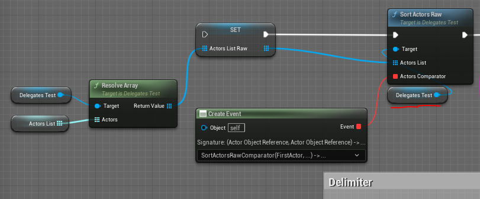
Мне бы хотелось, чтобы этот метод можно было использовать без добавления компонентов. В этой статье мы вынесем его в отдельную библиотеку функций.
Библиотеки функций представлены как классы `UCLASS`, унаследованные от `UBlueprintFunctionLibrary`.
Самая популярная библиотека функций, из встроенных в Unreal Engine, это `Kismet/KismetSystemLibrary.h`, которая содержит в себе почти все дополнительные `blueprint` функции движка от `Delay` до `LineTrace`.
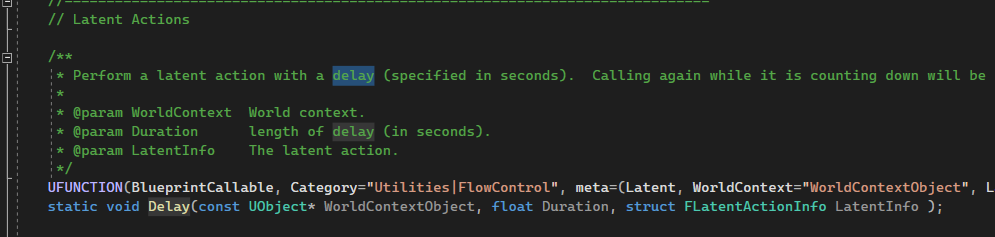
Найти эту библиотеку, чтобы изучить подходы к созданию своих функций, можно по пути: `\Runtime\Engine\Classes\Kismet\KismetSystemLibrary.h`.
Вынос высоконагруженной логики из `blueprint` кода в с++ библиотеки функций - самый очевидный из способов оптимизации игры. Особенно, если вы прототипировали игру на `blueprint`.
## Подготовка к работе
Давайте  создадим отдельный модуль, в котором будут размещены наши библиотеки. Как и раньше, используем для этих целей бесплатный плагин `c++ Module Generator`.

Модуль я назвал `FunctionLibraries`. В этом модуле планируется создавать все библиотеки функций, которые будут в проекте.
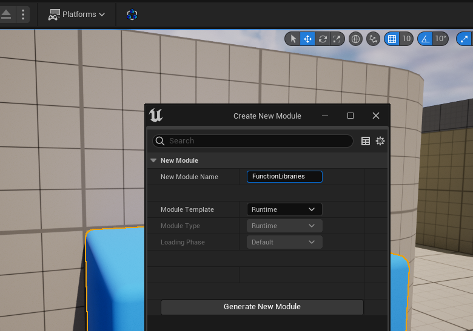
После создания модуля - необходимо перезапустить движок, а так-же выполнить команду `Tools -> Refresh Visual Studio 2022 Project`.

После чего файлы модуля появятся в Visual Studio `SolutionExplorer`.
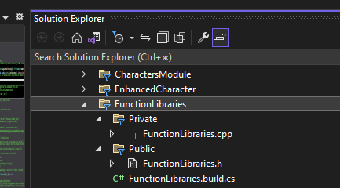
## Создание библиотеки функций
Движок Unreal Engine сам способен генерировать заготовку для библиотеки функций. Давайте воспользуемся этой возможностью.
Идем `Tools -> New C++ Class`.
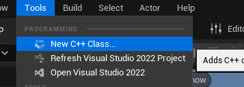
В появившемся окне переключаем вкладку на `All Classes` и ищем `BlueprintFunctionLibrary`.
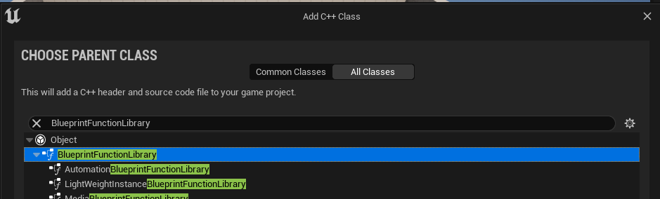
Я решил назвать библиотеку функций - `SortLibrary`. Давайте поместим в нее метод сортировки `Actor'ов`, написанный в статье про делегаты.
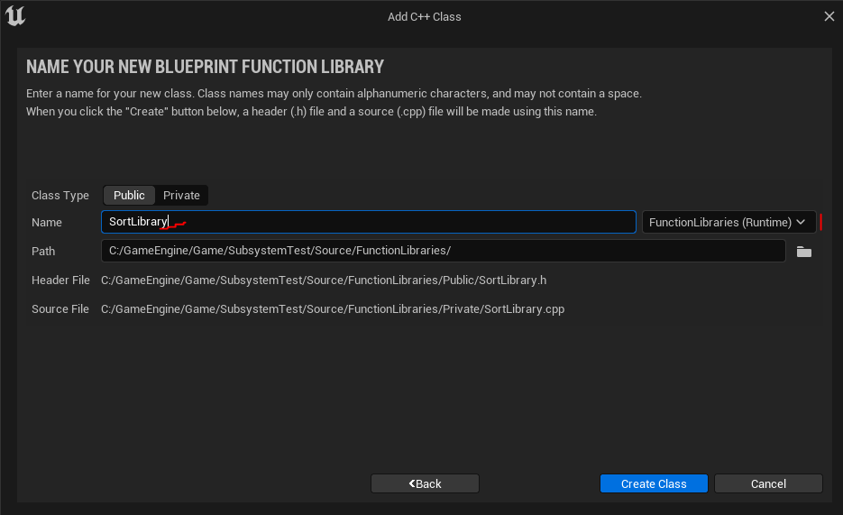
После создания файла не забудьте выполнить команду - `Tools -> Refresh Visual Studio 2022 Project`, чтобы сгенерированный шаблон появился в `Solution Explorer`.
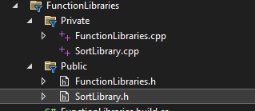
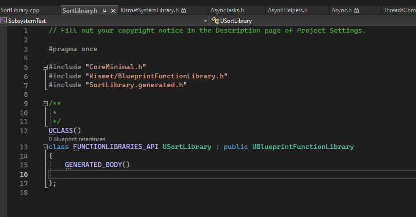
## Добавление функций в библиотеку
Любая функция с модификатором `static` и макросом `UFUNCTION()`, добавленная в класс библиотеки функций, будет доступна на глобальном уровне для `blueprint`.
Давайте напишем тестовую функцию, для начала. Например, для печати числа в лог.
```cpp
// Function that prints number
UFUNCTION(BlueprintCallable, Category = "USortLibrary|Print", meta = (WorldContext = "WorldContextObject"))
static void LogNumber(const UObject* WorldContextObject, float FloatNum = 0.0f) {
    UE_LOG(LogTemp, Warning, TEXT("[log number] Number = %f"), FloatNum);
}
```
Так-же эта функция имеет скрытый пин `WorldContextObject`, который бывает нужен в некоторых случаях.
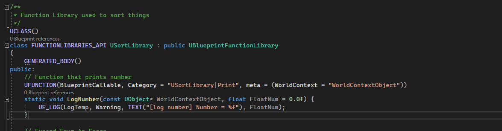
Если скомпилировать библиотеку с этим кодом, то в `blueprin'ах`, например в `BP_ThirdPersonCharacter` появится возможность добавить ноду `LogNumber`.
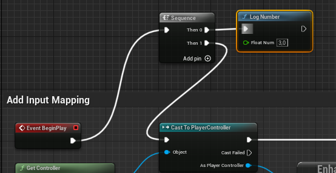
Если добавить ноду функции к событию `BeginPlay`, то после запуска проекта - можно будет увидеть соответствующее сообщение в логе.
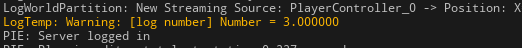
Давайте проверим как в библиотеке функций будет чувствовать себя функция с несколькими пинами, а так-же `blueprint pure` функция.
```cpp
// global scope
// Function Exit Pins Enum
UENUM(BlueprintType)
enum class ESL_MPOutputs : uint8
{
	Then	UMETA(DisplayName = "Then"),
	Warning	UMETA(DisplayName = "On Warning"),
	Error	UMETA(DisplayName = "On Error")
};
// Function Input Pins Enum
UENUM(BlueprintType)
enum class ESL_MPInputs : uint8
{
	Execute	UMETA(DisplayName = "Execute"),
	Yellow,
	Red
};
// UBlueprintFunctionLibrary
// Expand Enum As Execs
UFUNCTION(BlueprintCallable, Category = "SortLibrary|Print", Meta = (ExpandEnumAsExecs = "Inputs, Outputs"))
static void MultiplePinsLogNumber(int Number, ESL_MPInputs Inputs, ESL_MPOutputs& Outputs) {
    if (Inputs == ESL_MPInputs::Execute)
    {
        UE_LOG(LogTemp, Display, TEXT("[log number] Number = %i"), Number);
        Outputs = ESL_MPOutputs::Then;
    }
    else if (Inputs == ESL_MPInputs::Yellow)
    {
        UE_LOG(LogTemp, Warning, TEXT("[log number] Number = %i"), Number);
        Outputs = ESL_MPOutputs::Warning;
    }
    else
    {
        UE_LOG(LogTemp, Error, TEXT("[log number] Number = %i"), Number);
        Outputs = ESL_MPOutputs::Error;
    }
}
```
Данный код позволит создать функцию с несколькими входными и выходными пинами.
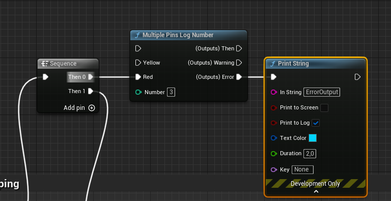
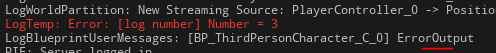
Теперь проверим `Pure` функции.
```cpp
// Pure Function that allows to lerp color
UFUNCTION(BlueprintPure, Category = "Custom SortLibrary|Pure", meta = (InColor1 = "(R=1,G=1,B=1,A=1)", InColor2 = "(R=0,G=0,B=0,A=1)"))
static FLinearColor LerpUsingHSV(FLinearColor InColor1, FLinearColor InColor2, float LerpAmount = 0.3f) {
    return FLinearColor::LerpUsingHSV(InColor1, InColor2, LerpAmount);
};
// Pure function with CompactNodeTitle
UFUNCTION(BlueprintPure, Category = "Custom SortLibrary|Pure", meta = (CompactNodeTitle = "+1"))
static int APlusOne(int a) {
    return a + 1;
};
```
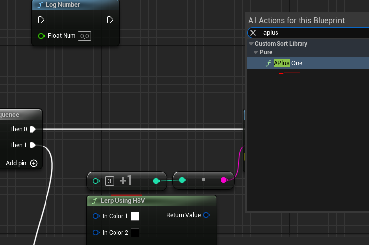

Теперь, когда мы убедились, что все работает - давайте перенесем функции сортировки массива `AActor'ов` по дистанции до них.
Создаем два делегата в начале файла.
```cpp
// Delegate for SortActors()
DECLARE_DYNAMIC_DELEGATE_ThreeParams(FDActorsComparator, TSoftObjectPtr<AActor>, FirstActor, TSoftObjectPtr<AActor>, SecondActor, bool&, Result);
// Delegate for SortActorsRaw()
DECLARE_DYNAMIC_DELEGATE_ThreeParams(FDActorsRawComparator, AActor*, FirstActor, AActor*, SecondActor, bool&, Result);
```
Через них ведется сравнение  двух `AActor'ов`.
Далее переносим в код класса функции сортировки.
```cpp
//.h
// UBlueprintFunctionLibrary
// Actors Sorting
// Array of Actors sorting by ref
UFUNCTION(BlueprintCallable, Category = "SortLibrary|Sort", meta = (WorldContext = "WorldContextObject"))
static void SortActors(UPARAM(ref) TArray<TSoftObjectPtr<AActor>>& ActorsList, FDActorsComparator ActorsComparator, const UObject* WorldContextObject);
// Array of Actors sorting by raw ref
UFUNCTION(BlueprintCallable, Category = "SortLibrary|Sort", meta = (WorldContext = "WorldContextObject"))
static void SortActorsRaw(UPARAM(ref) TArray<AActor*>& ActorsList, FDActorsRawComparator ActorsComparator, const UObject* WorldContextObject);
// Resolving Soft PointersArray
UFUNCTION(BlueprintPure, Category = "SortLibrary|Convert")
static TArray<AActor*> ResolveArray(TArray<TSoftObjectPtr<AActor>> Actors);
```
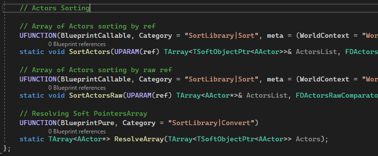
Реализация функций:
```cpp
//.cpp
void USortLibrary::SortActors(UPARAM(ref)TArray<TSoftObjectPtr<AActor>>& ActorsList, FDActorsComparator ActorsComparator, const UObject* WorldContextObject)
{
	// Call Array.Sort with lambda comparator in which call comparator delegate
	ActorsList.Sort([&](TSoftObjectPtr<AActor> A, TSoftObjectPtr<AActor> B) -> bool {
		bool Result = false;
		ActorsComparator.ExecuteIfBound(A, B, Result);
		return Result;
	});
}
void USortLibrary::SortActorsRaw(UPARAM(ref)TArray<AActor*>& ActorsList, FDActorsRawComparator ActorsComparator, const UObject* WorldContextObject)
{
	// Call Array.Sort with lambda comparator in which call comparator delegate
	ActorsList.Sort([&](AActor& A, AActor& B) -> bool {
		bool Result = false;
		ActorsComparator.ExecuteIfBound(&A, &B, Result);
		return Result;
	});
}
TArray<AActor*> USortLibrary::ResolveArray(TArray<TSoftObjectPtr<AActor>> Actors)
{
	TArray<TObjectPtr<AActor>> Result;
	for (TSoftObjectPtr Item : Actors) {
		Result.Add(Item.LoadSynchronous());
	}
	return Result;
}
```
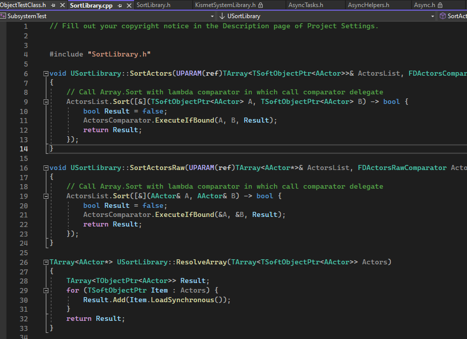
После компиляции станут доступны три функции - `SortActors`, для сортировки массива `SoftObject` ссылок, `SortActorsRaw` - для сортировки массива прямых ссылок и `ResolveArray` - для конверсии массива `TSoftObjectPtr<AActor>` в массив `AActor*`.
В результате чего мы сможем сортировать `Actor'ы` без использования компонента `DelegatesTest`.
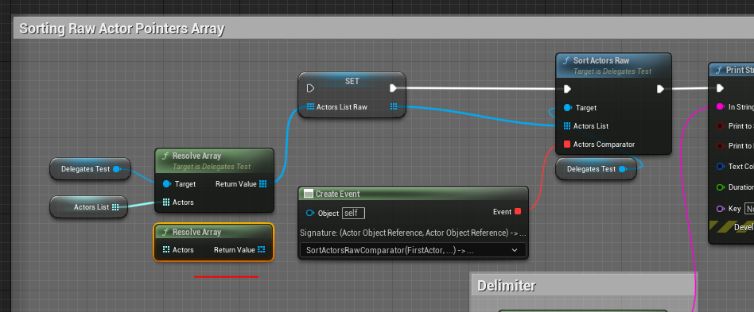
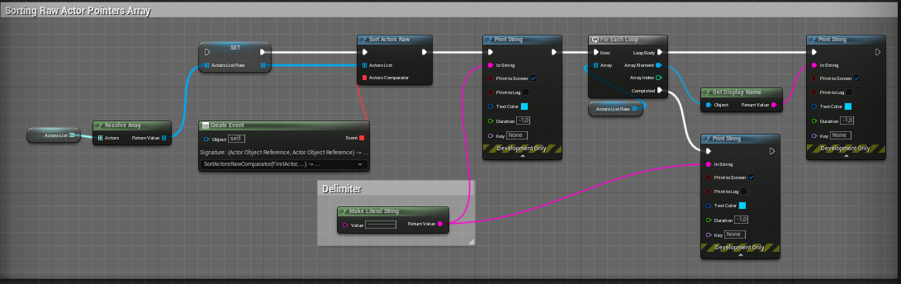
Я подробно разбирал реализацию сортировки через делегаты в, собственно, статье про делегаты. Если вы не помните - можете почитать.
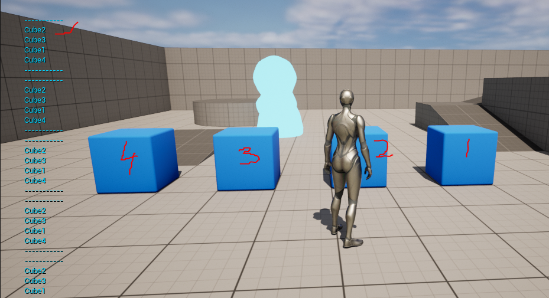