# Latent и Async Action
Ожидающие действия - одна из ключевых возможностей программирования собственных систем под `Unreal Engine`. Используя подобные действия можно работать с загрузкой уровней, ждать пока предмет добавится в инвентарь, ждать наложения того или иного статусного эффекта (это есть в `GAS`) и многое другое.
Некоторые ожидающие действия уже реализованы в движке. Вы наверняка уже сталкивались с ними, например типичный `Delay` именно таким действием и является.
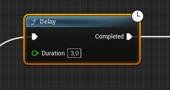
В движке Unreal есть два типа ожидающих действий. Унаследованные от `FPendingLatentAction` и от`UBlueprintAsyncActionBase`. Разница между ними следующая.
`FPendingLatentAction` - может применяться к методам классов, поэтому такие действия можно создавать как библиотеках функций с глобальной доступностью, так и с привязкой к какому-либо экземпляру объекта. Не может быть привязано к сторонним событиям (делегатам).
`UBlueprintAsyncActionBase` - представляет собой отдельный класс, с собственной логикой, по которому система сгенерирует `blueprint` ноду, одну или несколько (с единым набором выходных пинов). Может быть привязан к сторонним событиям (делегатам). Ноды этого типа доступны глобально.
## Подготовка к работе
Давайте создадим отдельный модуль под наши ожидающие действия.
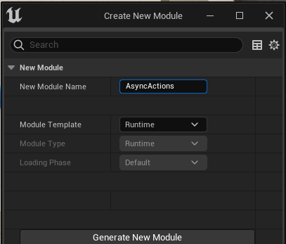
Перезапускаем, пересобираем.
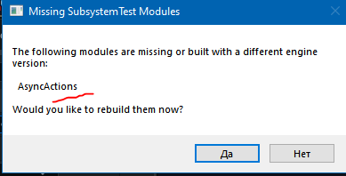
Не забудьте обновить проект через `Tools -> Refrehs Visual Studio 2022 Project`.
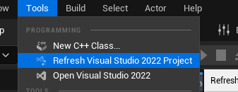
После этих действий модуль появится в `Solution Explorer`.
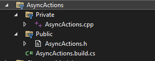
Именно в этот модуль будем добавлять наши файлы.
## `Latent Action` или Отложенное Действие
`Latent Action` или отложенное действие - представляет из себя метод, который позволяет дождаться наступления того или иного результата вычислений как в самой реализации метода, так и в переданных туда аргументах.
Этот метод обновляется каждый `tick` и благодаря этому может отслеживать состояния собственных или переданных переменных.
`Latent Action` не доступны в `UObject`, которые не привязаны к `tick`.
Отложенное действие не является асинхронным потоком. Обновление отложенного действия выполняется в том-же самом потоке, в котором это действие было вызвано и совпадает со срабатываением события `tick`.
В отложенном действии не получится привязать выходные пины к срабатыванию того или иного события (делегата), из-за особенностей реализации.
В отложенном действии может быть несколько входных и выходных `exec` пинов.
Отложенное действие может применяться к методам классов, поэтому такие действия можно создавать как библиотеках функций с глобальной доступностью, так и с привязкой к какому-либо экземпляру объекта.
### Создаем библиотеку функций
Для начала нам нужен метод, к которому мы будем привязывать асинхронное действие. Давайте для нашего метода создадим библиотеку функций. Идем в `Tools->New C++ Class`. Выбираем `Blueprint Function Library`.
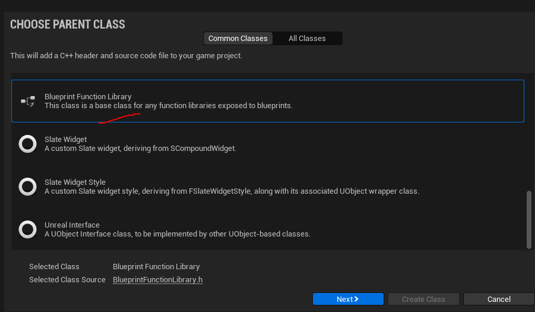
Называем `LatentActionLibrary` и  добавляем в модуль `AsyncActions`, который создали в начале статьи.
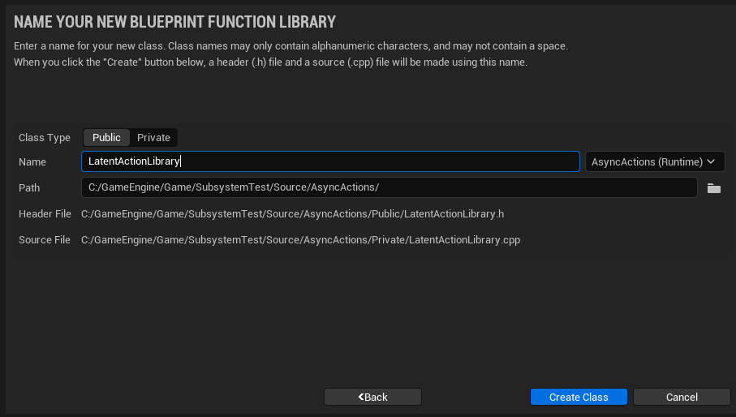
### Добавляем код
Предлагаю сделать действие, которое, с определенными промежутками, будет вызывать несколько выходных пинов. Это будет наиболее полной демонстрацией системы без лишней воды.
```cpp
#pragma once
#include "CoreMinimal.h"
#include "Engine/LatentActionManager.h" // Latent
#include "LatentActions.h"              // Actions
#include "Kismet/BlueprintFunctionLibrary.h"
#include "LatentActionLibrary.generated.h"
// DelayedSequence Input Pins Enum
UENUM(BlueprintType)
enum class ELAL_DelayedInputs : uint8
{
	Execute	UMETA(DisplayName = "Delay 0.5"),
	Delay1	UMETA(DisplayName = "Delay 1"),
	Delay2	UMETA(DisplayName = "Delay 2")
};
// DelayedSequence Exit Pins Enum
UENUM(BlueprintType)
enum class ELAL_DelayedExits : uint8
{
	Then	UMETA(DisplayName = "Exit 0.5"),
	Exit1	UMETA(DisplayName = "Exit 1"),
	Exit2	UMETA(DisplayName = "Exit 2")
};
/**
 * Function Library for Latent Actions
 */
UCLASS()
class ASYNCACTIONS_API ULatentActionLibrary : public UBlueprintFunctionLibrary
{
	GENERATED_BODY()
public:
	UFUNCTION(BlueprintCallable,
				Category = "LatentActions|DelaySequence",
				meta=( ExpandEnumAsExecs = "Inputs, Outputs",
						Latent, LatentInfo = "LatentInfo",
						WorldContext = "WorldContextObject",
						Keywords = "sleep"
					)
				)
	static void DelayedSequence(UObject* WorldContextObject, ELAL_DelayedInputs Inputs, ELAL_DelayedExits& Outputs, FLatentActionInfo LatentInfo){
		// inline Delay Latend action class
		class FDelaySequenceAction : public FPendingLatentAction
		{
			float TotalTime = 0.0f; // time of function activity
		public:
			FName ExecutionFunction;
			int32 OutputLink;
			FWeakObjectPtr CallbackTarget;
			ELAL_DelayedInputs Inputs;
			ELAL_DelayedExits& Outputs;
			bool bHalfTriggered = false;
			// constructor
			FDelaySequenceAction(const FLatentActionInfo& LatentInfo, ELAL_DelayedInputs inInputs, ELAL_DelayedExits& inOutputs)
				: ExecutionFunction(LatentInfo.ExecutionFunction)
				, OutputLink(LatentInfo.Linkage)
				, CallbackTarget(LatentInfo.CallbackTarget)
				, Outputs(inOutputs)
				, Inputs(inInputs)
			{
				UE_LOG(LogTemp, Warning, TEXT("[latent action] task has been started"))
			}
			// destructor
			~FDelaySequenceAction() {
				UE_LOG(LogTemp, Warning, TEXT("[latent action] task has been finished!"))
			}
			// this method will be called every tick so here we can check different things
			// Response.ElapsedTime() - delta time
			void UpdateOperation(FLatentResponse& Response) override
			{
				TotalTime += Response.ElapsedTime(); // total time is summ of all delta times
				{
					// this approach triggers output pin and destroys latent action
					// based on input pin that is connected
					bool condition2 = TotalTime >= 2.0f && Inputs == ELAL_DelayedInputs::Delay2;
					bool condition1 = TotalTime >= 1.0f && Inputs == ELAL_DelayedInputs::Delay1;
					bool condition05 = TotalTime >= 0.5f && Inputs == ELAL_DelayedInputs::Execute;
					if (condition2) {
						Outputs = ELAL_DelayedExits::Exit2;
						Response.FinishAndTriggerIf(condition2, ExecutionFunction, OutputLink, CallbackTarget); // will stop action
					}else if (condition1) {
						Outputs = ELAL_DelayedExits::Exit1;
						Response.FinishAndTriggerIf(condition1, ExecutionFunction, OutputLink, CallbackTarget); // will stop action
					}
					else if (condition05) {
						Outputs = ELAL_DelayedExits::Then;
						Response.FinishAndTriggerIf(condition05, ExecutionFunction, OutputLink, CallbackTarget); // will stop action
					} else {
						Response.DoneIf(TotalTime > 3); // force delete
					}
				}
				/*{
					// this approach triggers output pins multiple times, based on TotalTime
					bool condition2 = TotalTime >= 2.0f;
					bool condition1 = TotalTime >= 1.0f;
					bool condition05 = TotalTime >= 0.5f;
					if (condition2) {
						Outputs = ELAL_DelayedExits::Exit2;
						Response.FinishAndTriggerIf(condition2, ExecutionFunction, OutputLink, CallbackTarget); // will stop action
					}
					else if (condition1) {
						Outputs = ELAL_DelayedExits::Exit1;
						Response.TriggerLink(ExecutionFunction, OutputLink, CallbackTarget);
					}
					else if (condition05) {
						Outputs = ELAL_DelayedExits::Then;
						Response.TriggerLink(ExecutionFunction, OutputLink, CallbackTarget);
					} else {
						Response.DoneIf(TotalTime > 3); // force delete
					}
				}*/
			}
			virtual void NotifyObjectDestroyed() override {
				delete this;
			}
			virtual void NotifyActionAborted() override {
				delete this;
			}
		};
		// standart initialisation of Latent Action
		if (UWorld* World = GEngine->GetWorldFromContextObjectChecked(WorldContextObject))
		{
			FLatentActionManager& LatentActionManager = World->GetLatentActionManager(); //Get LatentActionManager
			if (LatentActionManager.FindExistingAction<FDelaySequenceAction>(LatentInfo.CallbackTarget, LatentInfo.UUID) == NULL)
			{
				// load instance of FDelaySequenceAction into FLatentActionManager
				LatentActionManager.AddNewAction(LatentInfo.CallbackTarget, LatentInfo.UUID, new FDelaySequenceAction(LatentInfo, Inputs, Outputs));
			}
		}
	}
};
```
Этот код позволяет сделать такую ноду:
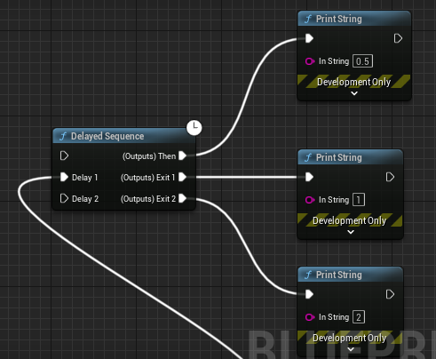
В зависимости от подключенного пина происходит активация выходного пина с задержкой. По умолчанию задержка - 0.5 секунд, пин `Delay 1` делает задержку в 1 секунду перед выходом, а пин `Delay 2` делает задержку в 2 секунды.
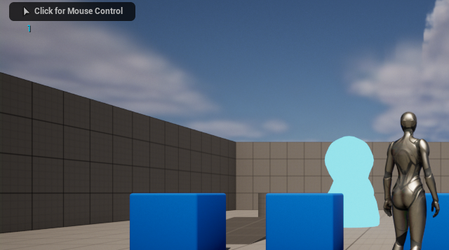
Пины можно зациклить, например так:
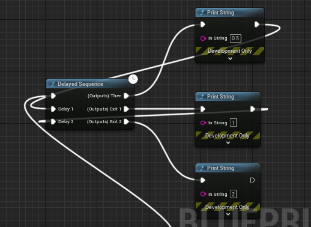
Тогда подряд будут выведены три значения, с соответствующей задержкой.
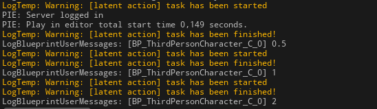
Можно так-же вызвать один пин несколько раз подряд, что позволяет создавать собственные циклы.
Я написал отдельную реализацю множественного вызова. Для ее запуска, в приведенном выше коде, в методе `UpdateOperation`, раскомментируйте нижнюю секцию и закомментируйте верхнюю.
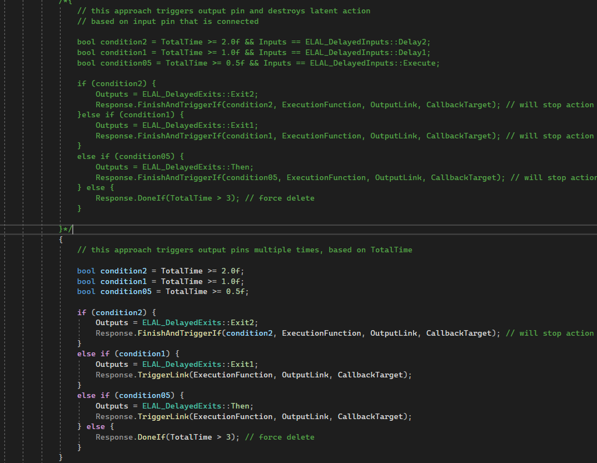
Так-же придется отказаться от двух нижних входных пинов, потому что они в этой реализации не учитываются.
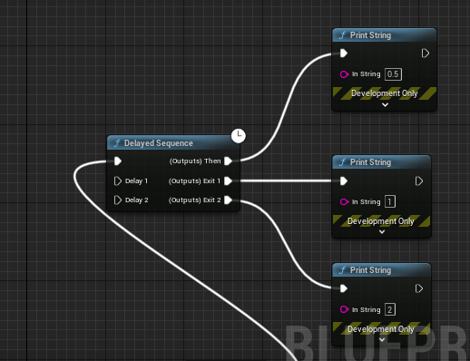
Эта версия кода будет печатать соответствующие сообщения каждый тик.
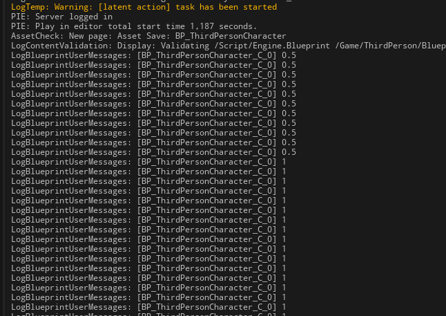
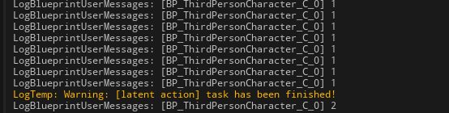
## `Async Action` или асинхронное действие
`Async Action` или асинхронное действие позволяет создать `blueprint` ноду с несколькими выходными пинами, которые можно активировать после завершения потока, срабатывания внутренней функции или вызова делегата.
Реализация асинхронного действия представляет собой отдельный класс, по которому система сгенерирует `blueprint` ноду, одну или несколько (с единым набором выходных пинов).
Асинхронное действие не вызывается каждый тик. Пины асинхронного действия должны активироваться разработчиком вручную, при наступлении требуемых условий.
Асинхронное действие, из-за особенностей реализации, может иметь всего один входной `exec` пин (но много выходных пинов).
Асинхронные действия доступны глобально для каждого `blueprint` класса, даже для такого, в котором не реализован `tick`.
Асинхронные действия активно используются в фреймворке `Gameplay Ability System`. Именно через асинхронные действия фреймворк позволяет отслеживать состояния тегов в компоненте. Поскольку асинхронные действия не вызываются каждый тик, а привязываются к делегатам - их использование экономит ресурсы системы и позволяет создавать разветвленные логические структуры.
Обычные асинхронные действия создаются через наследование от класса `UBlueprintAsyncActionBase`.
### Создаем асинхронное действие
Идем в `Tools -> New C++ Class -> All Classes` и ищем там `UBlueprintAsyncActionBase`.
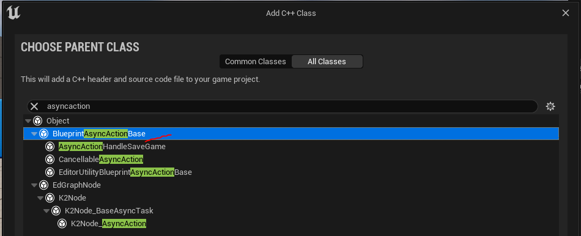
Называем класс `TestAsyncAction` и в модуль `Async Actions`.
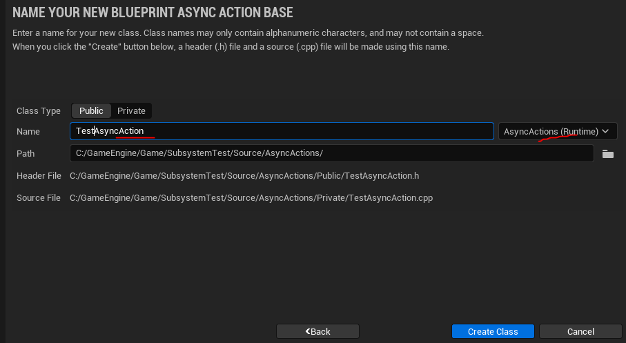
Не забудьте выполнить команду `Tools -> Refresh Visual Studio 2022 Project`, чтобы файл класса появился в `SolutionExplorer`.
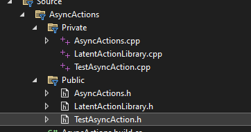
### Добавляем код
Реализуем асинхронное вычисление простых чисел внутри асинхронного действия.
```cpp
#include "CoreMinimal.h"
#include "Kismet/BlueprintAsyncActionBase.h"
// Async
#include "Async/Async.h"
// Time Measuring
#include <Stats/Stats.h>
// generated.h
#include "TestAsyncAction.generated.h"
// Delegates
DECLARE_DYNAMIC_MULTICAST_DELEGATE_OneParam(FPrimesOutputPin, const int&, FoundValue);
// I tryed to mix pin types and that did not worked
//DECLARE_DYNAMIC_MULTICAST_DELEGATE(FPlainOutputPin);
/**
 * Async Action Tests
 */
UCLASS()
class ASYNCACTIONS_API UTestAsyncAction : public UBlueprintAsyncActionBase
{
	GENERATED_BODY()
	// Output Pins
	UPROPERTY(BlueprintAssignable)
	FPrimesOutputPin Result;
	UPROPERTY(BlueprintAssignable)
	FPrimesOutputPin IterationResult;
	// world context
	const UObject* WorldContextObject;
	// Arguments
	int NumsAmount = 500;
	int OffsetFromNum = 0;
	// For Time Measuring
	double StartTime = 0.0f;
	// Calculation of PrimeNumbers
	int CalculatePrimes()
	{
		// Lambda checker for prime number
		TFunction<bool(int)> IsPrime = [](int Num) -> bool {
			// since 0 and 1 is not prime return false.
			if (Num < 2) {
				return false;
			}
			// Run a loop from 2 to n-1
			for (int i = 2; i < Num; i++) {
				// if the number is divisible by i, then n is not a
				// prime number.
				if (Num % i == 0) {
					return false;
				}
			}
			// otherwise, n is prime number.
			return true;
		};
		int PrimesFound = 0;
		int CurrentTestNumber = OffsetFromNum;
		// Generate prime numbers until their amount less than 10000
		while (PrimesFound < NumsAmount)
		{
			CurrentTestNumber++;
			if (IsPrime(CurrentTestNumber)) {
				PrimesFound++;
				IterationResult.Broadcast(CurrentTestNumber); // call pin with current number
			}
		}
		return CurrentTestNumber;
	}
public:
	// Main Logics go here
	virtual void Activate() override {
		// Do Primes calculation in another thread
		Async(EAsyncExecution::Thread, [&]()->int {
			// Time Measuring
			double StartTime = FPlatformTime::Seconds();
			UE_LOG(LogTemp, Warning, TEXT("[test async action] Is Running"));
			int res = CalculatePrimes(); // Run Calculations
			// Time Measuring
			double EndTime = FPlatformTime::Seconds();
			// Debug
			UE_LOG(LogTemp, Warning, TEXT("[test async action] Duration: %f"), EndTime - StartTime);
			return res;
		})
		.Then([&](TFuture<int> Future) {
			if (Future.IsValid()) {
				int value = Future.Get();
				Result.Broadcast(value); // Broadcast valur to "Result" pin
			}
		});
	}
	/**
	* Nodes
	*/
	// This will create bp node that calls output pins with delay
	UFUNCTION(BlueprintCallable, Category = "Test Async Actions", meta = (BlueprintInternalUseOnly = "true", WorldContext = "WorldContextObject" ))
	static UTestAsyncAction* DoPrimesCalculation(const UObject* WorldContextObject, int Amount = 500, int Offset = 0) {
		UTestAsyncAction* BlueprintNode = NewObject<UTestAsyncAction>(); // construct async action
		// Set internal class variables. Can't be done otherwise since function is static.
		BlueprintNode->WorldContextObject = WorldContextObject;
		BlueprintNode->NumsAmount = Amount;
		BlueprintNode->OffsetFromNum = Offset;
		return BlueprintNode;
	}
	// Second BP node with inside of the AsyncAction class
	// we can make multiple of them
	UFUNCTION(BlueprintCallable, Category = "Test Async Actions", meta = (BlueprintInternalUseOnly = "true", WorldContext = "WorldContextObject"))
	static UTestAsyncAction* Get100Primes(const UObject* WorldContextObject, int Offset = 0) {
		UTestAsyncAction* BlueprintNode = NewObject<UTestAsyncAction>(); // construct async action
		// Set internal class variables. Can't be done otherwise since function is static.
		BlueprintNode->WorldContextObject = WorldContextObject;
		BlueprintNode->NumsAmount = 100;
		BlueprintNode->OffsetFromNum = Offset;
		return BlueprintNode;
	}
};
```
### Разбор кода
Данный класс позволит создавать две `blueprint` ноды: `Get100Primes` и `DoPrimesCalculation`.
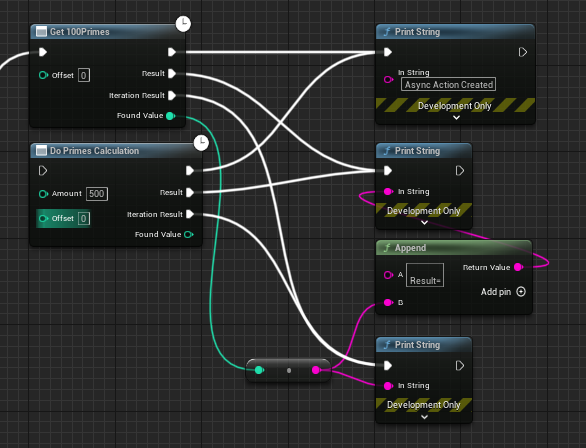
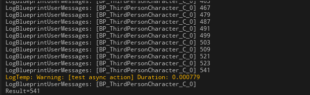
Простые числа вычисляются внутри отдельного потока. Каждая итерация цикла вычислений активирует пин `Iteration Result`. Конечная итерация активирует пин `Result`.
Обратите внимание на метод создания пинов. Это делегаты. В начале класса я задал делегат следующего вида:
```cpp
DECLARE_DYNAMIC_MULTICAST_DELEGATE_OneParam(FPrimesOutputPin, const int&, FoundValue);
```
Далее в самом классе асинхронного действия я создал переменные типа `FPrimesOutputPin`.
```cpp
// Output Pins
UPROPERTY(BlueprintAssignable)
FPrimesOutputPin Result;
UPROPERTY(BlueprintAssignable)
FPrimesOutputPin IterationResult;
```
Каждый делегат с модификатором `BlueprintAssignable` будет выведен как выходной `exec` пин функции. Далее мы сможем, по необходимости, вызывать эти делегаты из функции.
Обратите внимания - все пины делегатов должны быть одного типа. Нельзя смешивать разные делегаты. Код не будет работать, если вы смешаете, к примеру, такие пины:
```cpp
// Delegates
DECLARE_DYNAMIC_MULTICAST_DELEGATE_OneParam(FPrimesOutputPin, const int&, FoundValue);
// I tryed to mix pin types and that did not worked
DECLARE_DYNAMIC_MULTICAST_DELEGATE(FPlainOutputPin);
```
Для вывода результатов можно использовать лишь один тип делегата. Или `FPrimesOutputPin` или `FPlainOutputPin`, но не оба сразу.
Поскольку класс `UBlueprintAsyncActionBase` является `UObject` управлять его памятью не нужно, об этом позаботится сборщик мусора.
### `UCancellableAsyncAction` отменяемое асинхронное действие
Что если бы мы захотели остановить вычисления простых чисел в какой-то момент?
Для этого есть класс `UCancellableAsyncAction`. Найти данный класс можно в файле `\Runtime\Engine\Classes\Engine\CancellableAsyncAction.h` и представляет из себя он надстройку над `UBlueprintAsyncActionBase` с реализацией дополнительных методов: `Cancel`, `BeginDestroy` и `IsActive`.
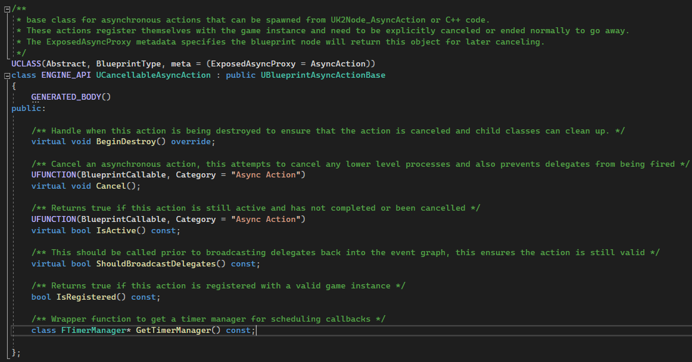
Ключевым методом тут является именно `Cancel`. Используя его можно унать - отменено действие или нет. И если оно отменено - можно выйти из цикла вычислений или закрыть поток.
Стандартная логика этого метода просто останавливает делегаты от срабатывания и понижает приоритет действия.
Я переписал класс для вычисления простых чисел с наследованием от `UCancellableAsyncAction`.
```cpp
#include "CoreMinimal.h"
#include "Kismet/BlueprintAsyncActionBase.h"
#include "Engine/CancellableAsyncAction.h"
// Async
#include "Async/Async.h"
// Time Measuring
#include <Stats/Stats.h>
// generated.h
#include "TestAsyncAction.generated.h"
/**
 * Cancellable Action Tests
 */
UCLASS()
class ASYNCACTIONS_API UTestCancellableAsyncAction : public UCancellableAsyncAction
{
	GENERATED_BODY()
	// Output Pins
	UPROPERTY(BlueprintAssignable)
	FPrimesOutputPin Result;
	UPROPERTY(BlueprintAssignable)
	FPrimesOutputPin IterationResult;
	bool bShouldStop = false; // if cancelled
	// world context
	const UObject* WorldContextObject;
	// Arguments
	int NumsAmount = 500;
	int OffsetFromNum = 0;
	// For Time Measuring
	double StartTime = 0.0f;
	// Calculation of PrimeNumbers
	int CalculatePrimes()
	{
		// Lambda checker for prime number
		TFunction<bool(int)> IsPrime = [](int Num) -> bool {
			// since 0 and 1 is not prime return false.
			if (Num < 2) {
				return false;
			}
			// Run a loop from 2 to n-1
			for (int i = 2; i < Num; i++) {
				// if the number is divisible by i, then n is not a
				// prime number.
				if (Num % i == 0) {
					return false;
				}
			}
			// otherwise, n is prime number.
			return true;
		};
		int PrimesFound = 0;
		int CurrentTestNumber = OffsetFromNum;
		// Generate prime numbers until their amount less than 10000
		while (PrimesFound < NumsAmount)
		{
			if (bShouldStop) {
				return CurrentTestNumber; // immediately exit from loop, if ation is cancelled
			}
			CurrentTestNumber++;
			if (IsPrime(CurrentTestNumber)) {
				PrimesFound++;
				IterationResult.Broadcast(CurrentTestNumber); // call pin with current number
			}
		}
		return CurrentTestNumber;
	}
public:
	// Main Logics go here
	virtual void Activate() override {
		// Do Primes calculation in another thread
		Async(EAsyncExecution::Thread, [this]()->int {
			// Time Measuring
			double StartTime = FPlatformTime::Seconds();
			UE_LOG(LogTemp, Warning, TEXT("[test async action] Is Running"));
			int res = CalculatePrimes(); // Run Calculations
			// Time Measuring
			double EndTime = FPlatformTime::Seconds();
			// Debug
			UE_LOG(LogTemp, Warning, TEXT("[test async action] Duration: %f"), EndTime - StartTime);
			return res;
		})
		.Then([&](TFuture<int> Future) {
			if (Future.IsValid()) {
				int value = Future.Get();
				Result.Broadcast(value); // Broadcast valur to "Result" pin
			}
		});
	}
	// if node cancelled
	virtual void Cancel() override {
		bShouldStop = true; // we can do manual cancellation logic, as i did
		// or
		// we can call superclass methods, it will prevent delegates from being called, but wont't stop background calculations anyway
		// UCancellableAsyncAction::Cancel(); // call super
		// SetReadyToDestroy(); // or directly do this
	}
	/**
	* Nodes
	*/
	// This will create bp node that calls output pins with delay
	// Now Cancellable
	UFUNCTION(BlueprintCallable, Category = "Test Async Actions", meta = (BlueprintInternalUseOnly = "true", WorldContext = "WorldContextObject"))
	static UTestCancellableAsyncAction* DoCancellablePrimesCalculation(const UObject* WorldContextObject, int Amount = 500, int Offset = 0) {
		UTestCancellableAsyncAction* BlueprintNode = NewObject<UTestCancellableAsyncAction>(); // construct async action
		// Set internal class variables. Can't be done otherwise since function is static.
		BlueprintNode->WorldContextObject = WorldContextObject;
		BlueprintNode->NumsAmount = Amount;
		BlueprintNode->OffsetFromNum = Offset;
		return BlueprintNode;
	}
	// Second BP node with inside of the AsyncAction class
	// we can make multiple of them
	// Now Cancellable
	UFUNCTION(BlueprintCallable, Category = "Test Async Actions", meta = (BlueprintInternalUseOnly = "true", WorldContext = "WorldContextObject"))
	static UTestCancellableAsyncAction* GetCancellable100Primes(const UObject* WorldContextObject, int Offset = 0) {
		UTestCancellableAsyncAction* BlueprintNode = NewObject<UTestCancellableAsyncAction>(); // construct async action
		// Set internal class variables. Can't be done otherwise since function is static.
		BlueprintNode->WorldContextObject = WorldContextObject;
		BlueprintNode->NumsAmount = 100;
		BlueprintNode->OffsetFromNum = Offset;
		return BlueprintNode;
	}
};
```
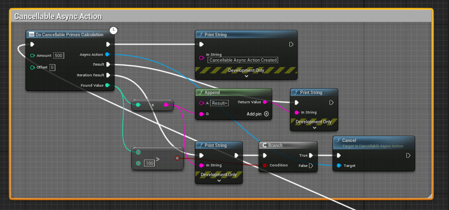
Ноды этого класса имеют дополнительный выходной пин, содержащий ссылку на асинхронное действие. Из этого действия можно вызвать метод `Cancel`, чтобы остановить вычисления, при определенном условии.
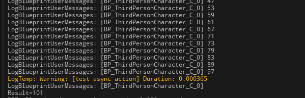