# Gameplay Tags
`Gameplay Tags` представляют собой иерархические текстовые метки, разделяемые символом `.` точки в формате `SuperTag.SubTag.Tag`. Теги являются очень удобным инструментом классификации и разделения игровой логики.
Используя `Gameplay Tags` можно создавать гибкие системы искусственного интеллекта, управлять объектами на уровне, обмениваться переменными и событиями. Часть подобных механик будет реализована в этой книге.
С использованием `Gameplay Tags` построен ключевой фреймворк `Unreal Engine`, а именно - `Gameplay Ability System`.
Давайте изучим как теги работают и как их использовать в собственном проекте.
## Принципы системы
Формат тега - `TagCategody.TagName`.
Например:
```cpp
Combat
Combat.InCombatMode
Combat.hasTargeting
Locomotion
Locomotion.isCrouching
Locomotion.isInWater
Locomotion.isRun
Locomotion.isRun.Fast
Locomotion.isRun.Injured
```
Каждый тег разделяется символом точки `.`. Система сама генерирует из тегов, разбитых точками, древовидные структуры.
Все теги, используемые в проекте, можно найти на соответствующей странице параметров проекта `Edit -> Project Settings -> Gameplay Tags`. По умолчанию там пусто.
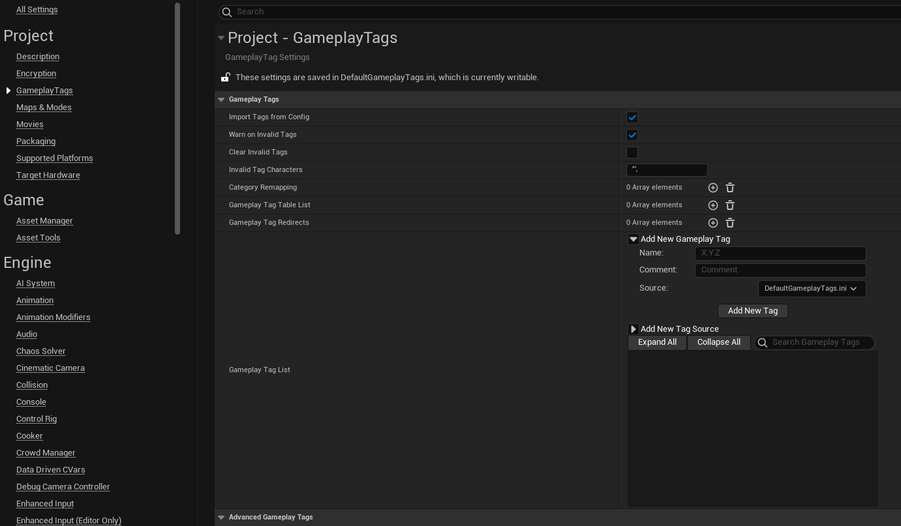
Нажав `Add New Gameplay Tag` можно добавить собственные теги.
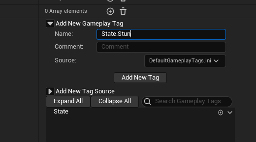
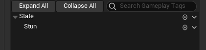
Хотя я не рекомендую использовать страницу настроек для ручного задания тегов.
Лучше всего использовать вынос тегов в отдельные таблицы `Data Table` или жестко задавать их через `с++ код`. Если добавлять теги "вручную", то они просто слетят, когда вы будете мигрировать проект. А это может привести к выходу из строя кучи игровых систем.
Чтобы использовать `Gameplay Tags` из `blueprint` кода надо создать переменную с типом `Gameplay Tag`.
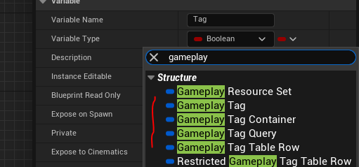
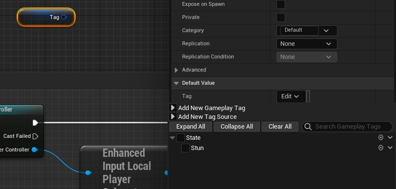
Так-же нужен контейнер, в котором с тегами предполагается работать. Он реализован в виде типа `Gameplay Tag Container`. Контейнер позволяет хранить в  себе теги, а так-же добавлять или удалять их.
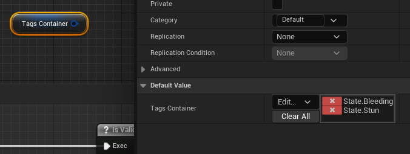
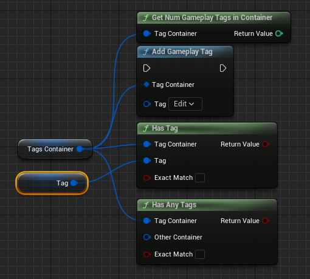
Используя эти два типа, тег и контейнер, можно проверять те или иные состояния персонажей, объектов на уровне или распределять задачи искусственного интеллекта.
* Пример из моей практики
Используя систему `Gameplay Tags` я сделал два своих предыдущих проекта. Давайте рассмотрим один из них - `Ultimative Locomotion`.
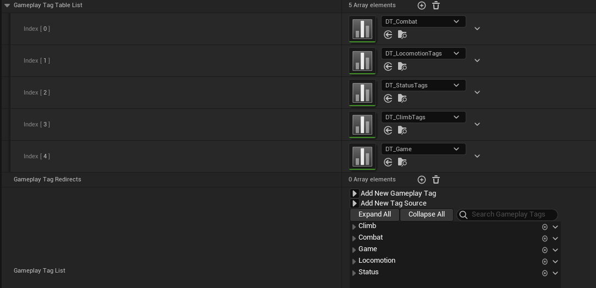
Все теги системы я поместил в отдельные таблицы, реализующие структуру `GameplayTagsTableRow`.
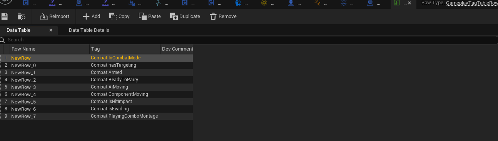
В самом проекте я создал компонент, это `blueprint` компонент - `Tags Component`.
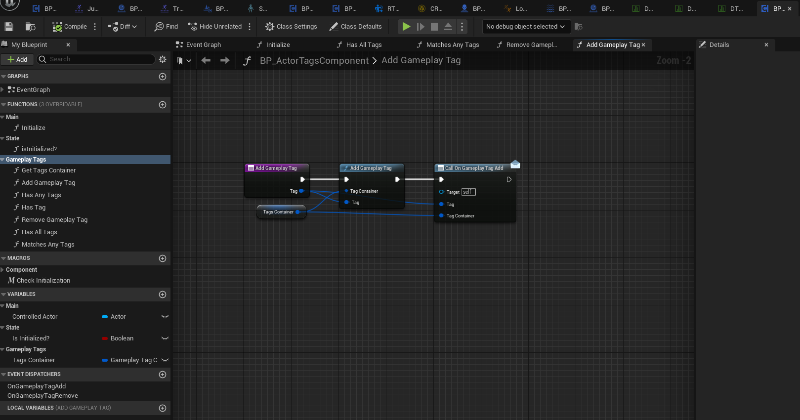
Данный компонент содержит в себе контейнер тегов, а так-же функции, которые позволяют добавлять и удалять теги из контейнера. Эти функции, затем, были вынесены в библиотеку макросов, для более удобного доступа.
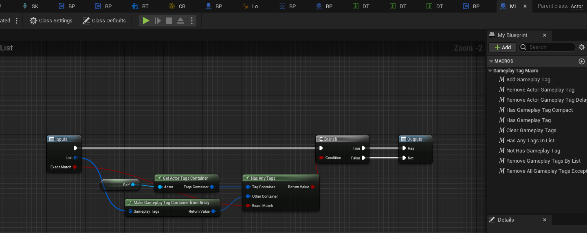
Так-же в компоненте есть диспетчер событий, генерирующий событие всякий раз, как тег добавляется или удаляется из контейнера.
с++ открывает нам куда более широкие возможности по работе с тегами, нежели `blueprint`, например пресловутые `latent action`. Поэтому - давайте реализуем этот компонент тегов на с++. За одно это ознакомит нас системой (да и мне полезно будет, давно хотел это сделать).
## Подготовка к работе
По умолчанию классы `AActor` не поддерживают `gameplay tags`. Поддержку системы надо добавлять самостоятельно и чаще всего это делают через компоненты.
У компонентов есть одно несравненное преимущество - у любого объекта типа `AActor` можно получить компонент, методом `FindComponentByClass`. Это значит, что если мы реализуем контейнер тегов внутри компонента, то доступ к этому контейнеру легко будет получить из любого объекта на уровне.
### Создаем модуль
Создадим наши задачи отдельный модуль. Я назвал модуль `Tags Module`.
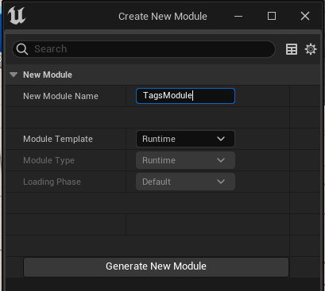
### Создаем компонент тегов
Добавим новый `с++` класс, унаследованный от `ActorComponent`.
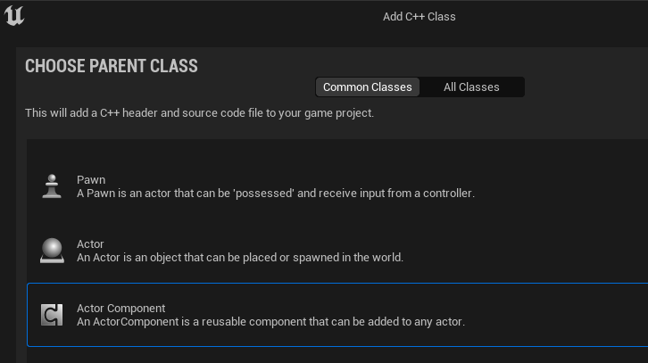
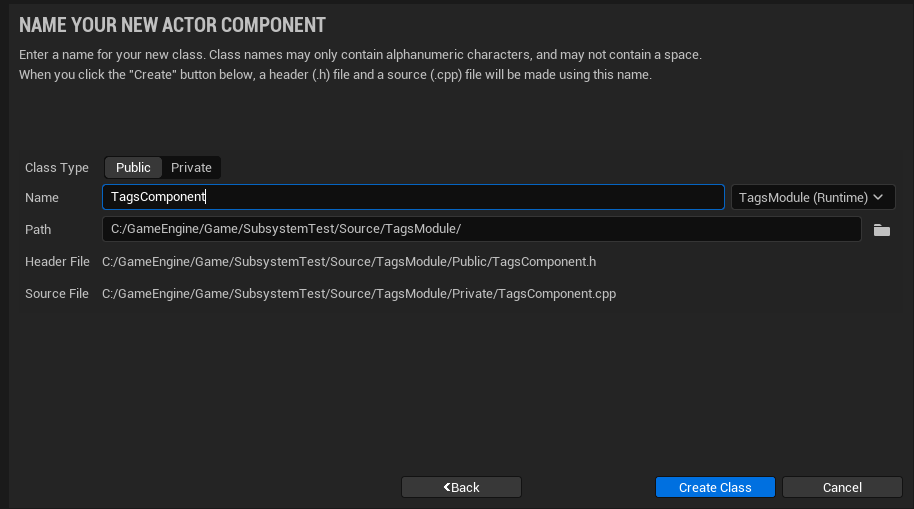
### Создаем библиотеку функций
А так-же библиотеку функций - `TagsLibrary`.
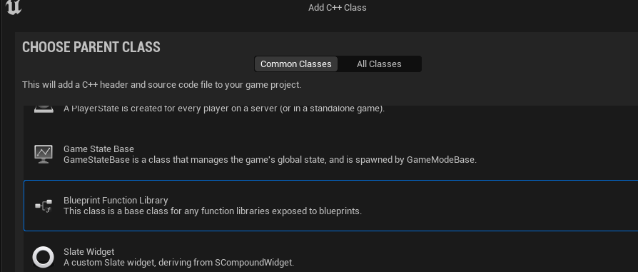
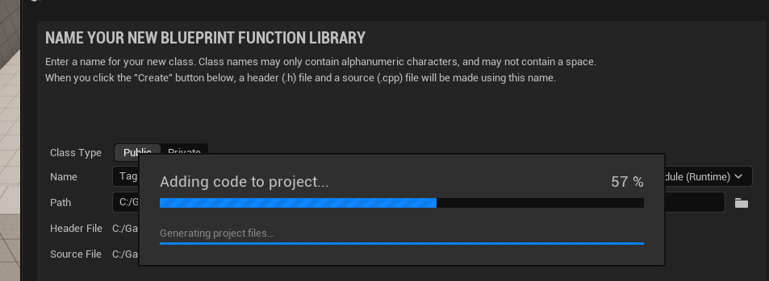
Не забудьте выполнить `Tools->Refresh Visual Studio 2022 Project`, чтобы файлы появились в `Solution Explorer`.
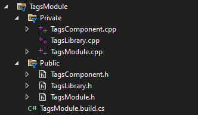
### Дополняем список зависимостей у модуля
Теперь надо добавить модуль `GameplayTags` в зависимости. Для этого откройте файл `TagsModule.build.cs` и добавьте туда строчку:
```cpp
PrivateDependencyModuleNames.AddRange(new string[] { "GameplayTags" });
```
Полный код файла `TagsModule.build.cs`.
```cpp
using UnrealBuildTool;
public class TagsModule : ModuleRules
{
	public TagsModule(ReadOnlyTargetRules Target) : base(Target)
	{
        PCHUsage = PCHUsageMode.UseExplicitOrSharedPCHs;
		PublicDependencyModuleNames.AddRange(new string[] { "Core", "CoreUObject", "Engine"});
        PrivateDependencyModuleNames.AddRange(new string[] { "GameplayTags" });
        PublicIncludePaths.AddRange(new string[] {"TagsModule/Public"});
		PrivateIncludePaths.AddRange(new string[] {"TagsModule/Private"});
	}
}
```
## Пишем компонент тегов
Одной из ключевых особенностей системы `Gameplay Tags` является их привязка к контейнерам. Контейнеры тегов наследуются от класса `FGameplayTagContainer`.

При этом по умолчанию ни у класса персонажа, ни у любого другого класса нет контейнера тегов. Его надо добавлять вручную. Можно использовать обычную переменную.
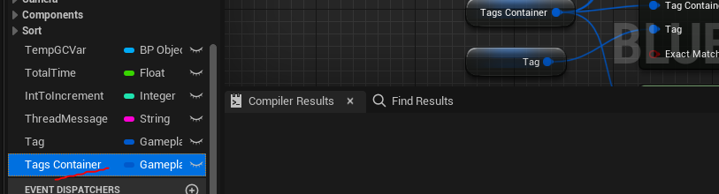
Но такой подход имеет недостаток - для каждого класса, в котором мы захотим использовать теги - придется писать отдельное API.
Поэтому, куда выгоднее создать унифицированный компонент тегов, который с легкостью добавляется к любому классу `AActor` через удобное меню.
Мы уже сгенерировали класс компонента, так что добавим его к `BP_ThirdPersonCharacter`, для тестов.
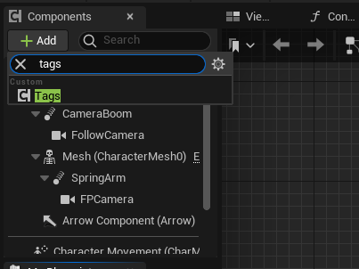
Теперь добавим контейнер тегов в наш компонент. Это будет обычная переменная.
```cpp
//.h
#include "GameplayTagContainer.h" // Gameplay Tags
// UActorComponent
UPROPERTY(BlueprintReadWrite, EditAnywhere, Category = "Default", meta = (DisplayName = "Tags Container"))
FGameplayTagContainer TagsContainer;
```
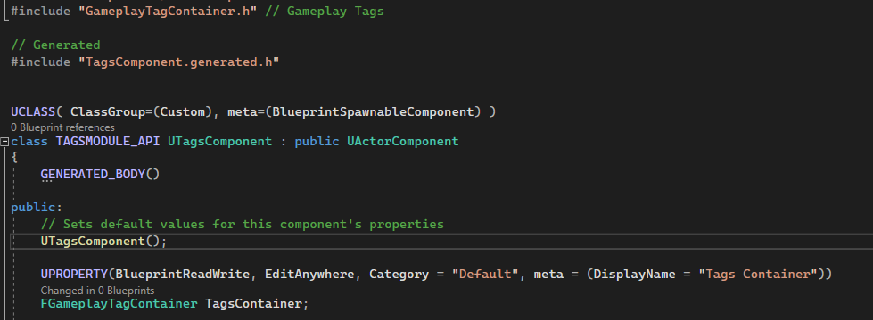
После компиляции переменная контейнера тегов `TagsContainer` будет доступна в `bluerpint` коде.
Доступность контейнера для чтения и записи через редактор откроет в будущем прекрасные возможности для отладки. Ведь мы в любой момент сможем посмотреть - какие состояния и значения записаны в компонент тегов, просто открыв этот компонент в редакторе. Это можно делать прямо во время отладки запущенного проекта.
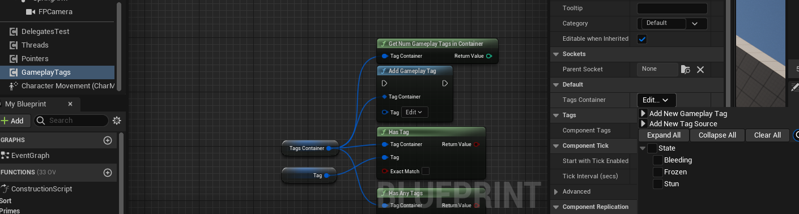
Теперь требуется создать функционал по добавлению и удалению тегов из компонента, а так-же по генерации соответствующих событий.
Итоговый компонент выглядит так:
```cpp
DECLARE_DYNAMIC_MULTICAST_DELEGATE_OneParam(FTagAddedDelegate, FGameplayTag, Tag);
DECLARE_DYNAMIC_MULTICAST_DELEGATE_TwoParams(FTagRemovedDelegate, FGameplayTag, Tag, bool, bIsRemoved);
UCLASS( ClassGroup=(Custom), meta=(BlueprintSpawnableComponent, DisplayName = "Tags Component"))
class TAGSMODULE_API UTagsComponent : public UActorComponent
{
	GENERATED_BODY()
public:
	// Sets default values for this component's properties
	UTagsComponent();
	// Getter for Tags Container
	UFUNCTION(BlueprintCallable, BlueprintPure, Category = "Tags Component|Container")
	FGameplayTagContainer GetTagsContainer() const {
		return TagsContainer;
	}
	// Adding Tag To Container
	UFUNCTION(BlueprintCallable, Category = "Tags Component")
	bool AddTagToContainer(const FGameplayTag& Tag) {
		if (!ContainerHasTag(Tag, true)) { // add only non-existing
			TagsContainer.AddTag(Tag);
			OnTagAdded.Broadcast(Tag); // Call tag added Event
			return true;
		}
		return false;
	}
	// Merge two Containers
	UFUNCTION(BlueprintCallable, Category = "Tags Component")
	void MergeContainers(const FGameplayTagContainer& inTagsContainer) {
		for (FGameplayTag Tag : inTagsContainer) {
			AddTagToContainer(Tag);
		}
	}
	// Remove Tag from Container
	UFUNCTION(BlueprintCallable, Category = "Tags Component")
	bool RemoveTagFromContainer(const FGameplayTag& Tag) {
		bool bRes = TagsContainer.RemoveTag(Tag);
		OnTagRemoved.Broadcast(Tag, bRes); // Call tag removed Event
		return bRes;
	}
	// Remove Tags from Container
	UFUNCTION(BlueprintCallable, Category = "Tags Component")
	void RemoveTagsFromContainer(const FGameplayTagContainer& inTagsContainer) {
		//TagsContainer.RemoveTags(inTagsContainer);
		for (FGameplayTag Tag : inTagsContainer) { // since we use delegates, go thru loop
			RemoveTagFromContainer(Tag);
		}
	}
	// Returns true if component container has any tags that match specified container
	// if Exact = true will also compare tag sizes e.g: this.tag == this.tag => true and this.tag == this => false
	UFUNCTION(BlueprintCallable, BlueprintPure, Category = "Tags Component|Container")
	bool ContainerHasAnyTags(const FGameplayTagContainer& inTagsContainer, bool Exact = false) const {
		if (Exact) {
			return TagsContainer.HasAnyExact(inTagsContainer);
		}
		return TagsContainer.HasAny(inTagsContainer);
	}
	// Returns true if component container has all tags from specified container
	// if Exact = true will also compare tag sizes e.g: this.tag == this.tag => true and this.tag == this => false
	UFUNCTION(BlueprintCallable, BlueprintPure, Category = "Tags Component|Container")
	bool ContainerHasAllTags(const FGameplayTagContainer& inTagsContainer, bool Exact = false) const {
		if (Exact) {
			return TagsContainer.HasAllExact(inTagsContainer);
		}
		return TagsContainer.HasAll(inTagsContainer);
	}
	// Search in container for tag
	// if Exact = true will also compare tag sizes e.g: this.tag == this.tag => true and this.tag == this => false
	UFUNCTION(BlueprintCallable, BlueprintPure, Category = "Tags Component|Container")
	bool ContainerHasTag(const FGameplayTag& Tag, bool Exact = false) const {
		if (Exact) {
			return TagsContainer.HasTagExact(Tag);
		}
		return TagsContainer.HasTag(Tag);
	}
	// On Tag Added Event
	UPROPERTY(BlueprintAssignable, Category = "Delegates")
	FTagAddedDelegate OnTagAdded;
	// On Tag Removed Event
	UPROPERTY(BlueprintAssignable, Category = "Delegates")
	FTagRemovedDelegate OnTagRemoved;
	// Core Tags Container
	UPROPERTY(BlueprintReadWrite, EditAnywhere, Category = "Default", meta = (DisplayName = "Tags Container"))
	FGameplayTagContainer TagsContainer;
protected:
	// Called when the game starts
	virtual void BeginPlay() override;
public:
	// Called every frame
	virtual void TickComponent(float DeltaTime, ELevelTick TickType, FActorComponentTickFunction* ThisTickFunction) override;
};
```
Данный компонент выводит в `blueprint` пространство целый набор интерфейсов для взаимодействия с вложенном контейнером тегов `TagsContainer`. Так-же тут происходит генерация событий через два делегата. Одно событие для удаления тега, второе для добавления.

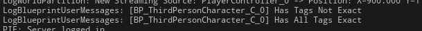
## Упрощем доступ к методам компонента используя библиотеку функций
Для использования методов компонента, очевидно, всегда придется брать ссылку на сам компонент.
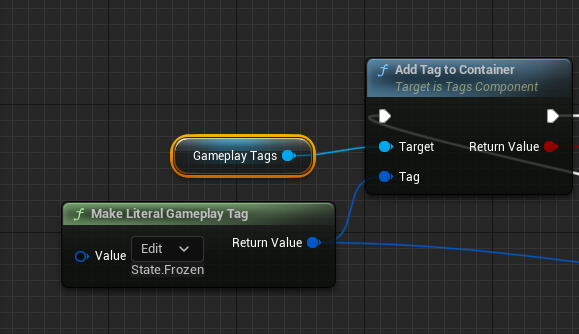
Это не всегда удобно, было бы не плохо вывести эти функции в библиотеку функций, которая автоматизировала бы за нас всю работу.
Используя `WorldContext` можно провернуть весьма любопытный трюк, который откроет прямой доступ к компоненту тегов(если он добавлен) как из классов `AActor` так и из классов `UActorComponent`.
Для начала я написал функцию получения "владельца" из `WorldContext`.
```cpp
// helper functions
// search for owner that contains components
static inline AActor* GetOwner(UObject * Context){
    AActor* Owner = Cast<AActor>(Context);
    if (Owner == nullptr) {
        UActorComponent* OwningComponent = Cast<UActorComponent>(Context);
        if (OwningComponent == nullptr) return nullptr; // node called not in actor and not in actor component
        Owner = OwningComponent->GetOwner();
    }
    return Owner;
}
```
Далее в каждой из функций библиотеки я использовал `meta = (WorldContext = "WorldContextObject")`. Что такое `WorldContext`? Это ссылка на объект, который вызывает `blueprint` ноду функции. Если мы вызываем функцию библиотеки из, например, персонажа то `WorldContext` будет ссылаться на персонажа. Если мы вызывам функцию из компонента, то `WorldContext` будет ссылаться на компонент.
```cpp
UFUNCTION(BlueprintCallable, BlueprintPure, Category = "Tags Library", meta = (WorldContext = "WorldContextObject"))
static UTagsComponent* GetTagsComponent(UObject* WorldContextObject) {
    AActor* Owner = UTagsLibrary::GetOwner(WorldContextObject);
    if(Owner == nullptr) return nullptr;
    return Owner->FindComponentByClass<UTagsComponent>();
}
// Getter for Tags Container
UFUNCTION(BlueprintCallable, BlueprintPure, Category = "Tags Library", meta = (WorldContext = "WorldContextObject"))
static FGameplayTagContainer GetTagsContainer(UObject* WorldContextObject){
    UTagsComponent* TC = UTagsLibrary::GetTagsComponent(WorldContextObject);
    if (TC != nullptr) {
        return TC->GetTagsContainer();
    }
    return FGameplayTagContainer();
}
```
Я использовал этот подход для начала написав функцию `GetTagsComponent` которая ищет компонент тегов в `WorldContextObject`. А потом функцию, которая ищет контейнер тегов в компоненте тегов, который находится в `WorldContextObject`.

Обратите внимание на то, какие чистые получились ноды у функций. При этом результат они возвращают корректный.
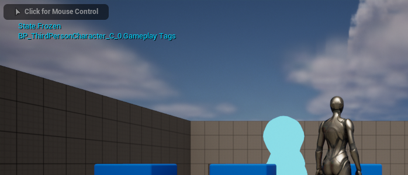
Этот-же код будет работать и внутри компонентов.
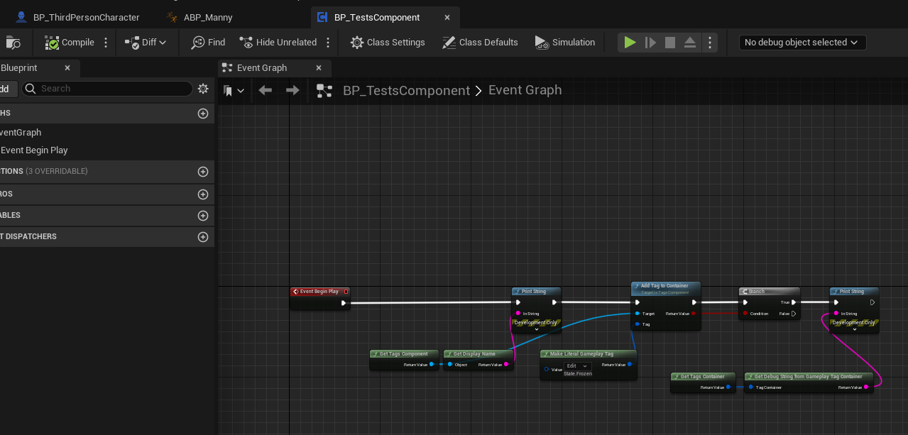
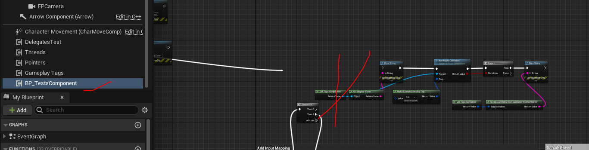
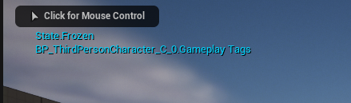
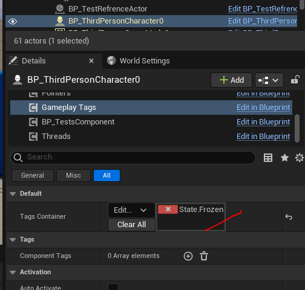
Используя этот подход перенесем все функции из компонента в библиотеку функций.
```cpp
#include "CoreMinimal.h"
#include "Kismet/BlueprintFunctionLibrary.h"
#include "GameplayTagContainer.h" // Gameplay Tags
#include "TagsComponent.h" // Tags Component
#include "TagsLibrary.generated.h"
/**
 *
 */
UCLASS()
class TAGSMODULE_API UTagsLibrary : public UBlueprintFunctionLibrary
{
	GENERATED_BODY()
public:
	// Getter for Tags Component
	UFUNCTION(BlueprintCallable, BlueprintPure, Category = "Tags Library", meta = (WorldContext = "WorldContextObject"))
	static UTagsComponent* GetTagsComponent(UObject* WorldContextObject) {
		AActor* Owner = UTagsLibrary::GetOwner(WorldContextObject);
		if(Owner == nullptr) return nullptr;
		return Owner->FindComponentByClass<UTagsComponent>();
	}
	// Getter for Tags Container
	UFUNCTION(BlueprintCallable, BlueprintPure, Category = "Tags Library", meta = (WorldContext = "WorldContextObject"))
	static FGameplayTagContainer GetTagsContainer(UObject* WorldContextObject){
		UTagsComponent* TC = UTagsLibrary::GetTagsComponent(WorldContextObject);
		if (TC != nullptr) {
			return TC->GetTagsContainer();
		}
		return FGameplayTagContainer();
	}
	// Adding Tag To Container
	UFUNCTION(BlueprintCallable, Category = "Tags Component", meta = (WorldContext = "WorldContextObject"))
	static bool AddTagToContainer(UObject* WorldContextObject, const FGameplayTag& Tag) {
		UTagsComponent* TC = UTagsLibrary::GetTagsComponent(WorldContextObject);
		if (TC != nullptr) {
			return TC->AddTagToContainer(Tag);
		}
		return false;
	}
	// Merge tags container with tag component container
	UFUNCTION(BlueprintCallable, Category = "Tags Component", meta = (WorldContext = "WorldContextObject"))
	static void MergeContainers(UObject* WorldContextObject, const FGameplayTagContainer& inTagsContainer) {
		UTagsComponent* TC = UTagsLibrary::GetTagsComponent(WorldContextObject);
		if (TC != nullptr) {
			TC->MergeContainers(inTagsContainer);
		}
	}
	// remove tag from component container
	UFUNCTION(BlueprintCallable, Category = "Tags Component", meta = (WorldContext = "WorldContextObject"))
	static bool RemoveTagFromContainer(UObject* WorldContextObject, const FGameplayTag& Tag) {
		UTagsComponent* TC = UTagsLibrary::GetTagsComponent(WorldContextObject);
		if (TC != nullptr) {
			return TC->RemoveTagFromContainer(Tag);
		}
		return false;
	}
	// remove tags sequence from tags container in tags component
	UFUNCTION(BlueprintCallable, Category = "Tags Component", meta = (WorldContext = "WorldContextObject"))
	static void RemoveTagsFromContainer(UObject* WorldContextObject, FGameplayTagContainer& inTagsContainer) {
		UTagsComponent* TC = UTagsLibrary::GetTagsComponent(WorldContextObject);
		if (TC != nullptr) {
			TC->RemoveTagsFromContainer(inTagsContainer);
		}
	}
	// Returns true if component tag container has any tags that match specified container
	// if Exact = true will also compare tag sizes e.g: this.tag == this.tag => true and this.tag == this => false
	UFUNCTION(BlueprintCallable, Category = "Tags Component", meta = (WorldContext = "WorldContextObject"))
	static bool TagsContainerHasAny(UObject* WorldContextObject, const FGameplayTagContainer& inTagsContainer, bool Exact = false) {
		UTagsComponent* TC = UTagsLibrary::GetTagsComponent(WorldContextObject);
		if (TC != nullptr) {
			return TC->ContainerHasAnyTags(inTagsContainer, Exact);
		}
		return false;
	}
	// Returns true if component container has all tags from specified container
	// if Exact = true will also compare tag sizes e.g: this.tag == this.tag => true and this.tag == this => false
	UFUNCTION(BlueprintCallable, Category = "Tags Component", meta = (WorldContext = "WorldContextObject"))
	static bool TagsContainerHasAll(UObject* WorldContextObject, const FGameplayTagContainer& inTagsContainer, bool Exact = false) {
		UTagsComponent* TC = UTagsLibrary::GetTagsComponent(WorldContextObject);
		if (TC != nullptr) {
			return TC->ContainerHasAllTags(inTagsContainer, Exact);
		}
		return false;
	}
	// Search in container for tag
	// if Exact = true will also compare tag sizes e.g: this.tag == this.tag => true and this.tag == this => false
	UFUNCTION(BlueprintCallable, Category = "Tags Component", meta = (WorldContext = "WorldContextObject"))
	static bool TagsContainerHas(UObject* WorldContextObject, const FGameplayTag& Tag, bool Exact = false) {
		UTagsComponent* TC = UTagsLibrary::GetTagsComponent(WorldContextObject);
		if (TC != nullptr) {
			return TC->ContainerHasTag(Tag, Exact);
		}
		return false;
	}
private:
	// helper functions
	// search for owner that contains components
	static inline AActor* GetOwner(UObject * Context){
		AActor* Owner = Cast<AActor>(Context);
		if (Owner == nullptr) {
			UActorComponent* OwningComponent = Cast<UActorComponent>(Context);
			if (OwningComponent == nullptr) return nullptr; // node called not in actor and not in actor component
			Owner = OwningComponent->GetOwner();
		}
		return Owner;
	}
};
```
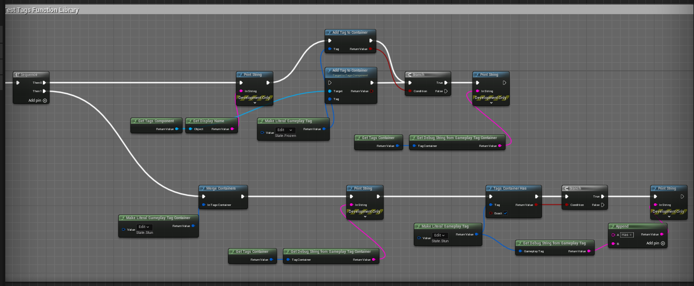
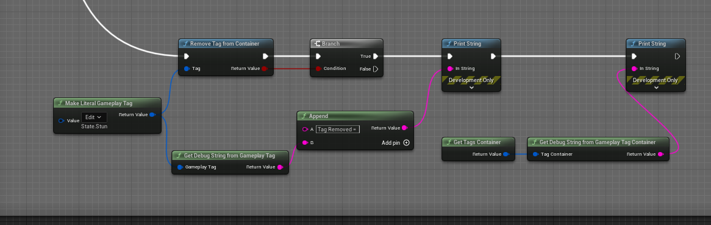
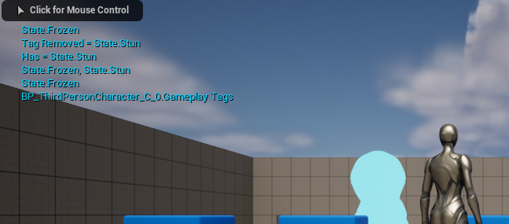
## Привязываем `Async Action` к событиям компонента
Как узнать что тег был добавлен или удален? Через подключение к событиям. В примитивном виде это выглядит так:
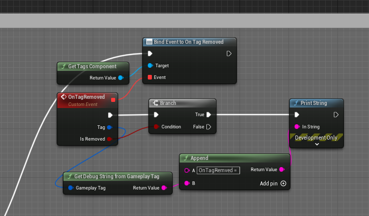
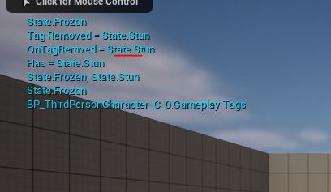
Однако, такой набор `blueprint` узлов очень неудобен. К тому-же подобные привязки крайне тяжело встраивать в сложную логику.
Создадим для действий `OnTagRemoved` и `OnTagAdded` ожидающие действия `Async Action`.
Это сильно упростит работу с компонентом и по сути поднимет его до уровня полноценной игровой системы. Поскольку мы планируем подключаться к диспетчерам событий - использовать `Latent Action` не получится. Нужен `Async Action`, то есть ожидающее действие, которое будет отслеживать вызов делегата.
Идем `Tools -> New C++ Class` и ищем `Cancellable Async Action`.
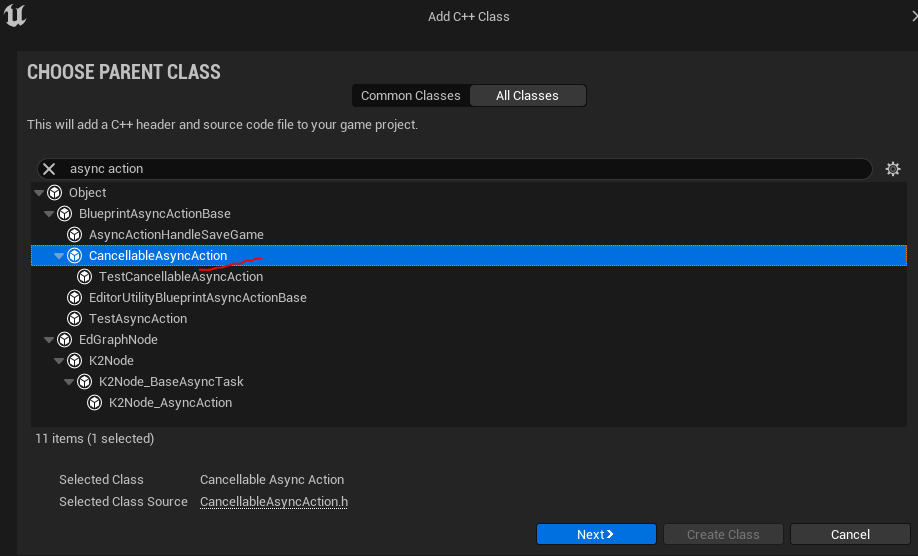
Называем `TagsCompCancellableAsyncAction`.
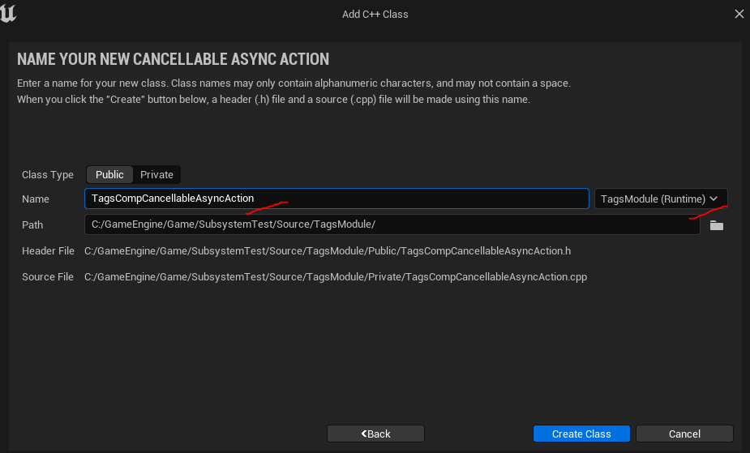
После добавления файла не забудьте выполнить команду `Tools -> Refresh Visual Studio 2022 Project`.
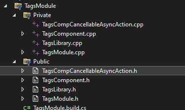
Реализация действий будет тривиальна. Нам даже не придется переопределять метод `Cancel`, потому что он и так делает по умолчанию то, что от него требуется - отвязывает события.
### `OnTagRemoved AsyncAction`
Реализация асинхронного действия для события `OnTagRemoved` выглядит так:
```cpp
#include "CoreMinimal.h"
#include "Engine/CancellableAsyncAction.h"
#include "GameplayTagContainer.h" // Gameplay Tags
#include "TagsComponent.h" // Tags Component
#include "TagsLibrary.h" // Tags Function Library
// generated.h
#include "TagsCompCancellableAsyncAction.generated.h"
DECLARE_DYNAMIC_MULTICAST_DELEGATE_TwoParams(FTagRemovedPin, FGameplayTag, Tag, bool, bIsRemoved);
/**
 * Tags Component Tag Remove binding
 */
UCLASS()
class TAGSMODULE_API UTagRemovedCancellableAsyncAction : public UCancellableAsyncAction
{
	GENERATED_BODY()
	// world context
	UObject* WorldContextObject;
	// search for owner that contains components
	inline AActor* GetNodeOwner() {
		AActor* Owner = Cast<AActor>(WorldContextObject);
		if (Owner == nullptr) {
			UActorComponent* OwningComponent = Cast<UActorComponent>(WorldContextObject);
			if (OwningComponent == nullptr) return nullptr; // node called not in actor and not in actor component
			Owner = OwningComponent->GetOwner();
		}
		return Owner;
	}
public:
	UPROPERTY(BlueprintAssignable)
	FTagRemovedPin TagRemoved;
	// Main Logics go here
	virtual void Activate() override {
		AActor* Owner = GetNodeOwner();
		if (Owner == nullptr) return;
		UTagsComponent* TC = Owner->FindComponentByClass<UTagsComponent>();
		//ensure(TC != nullptr);
		if(TC == nullptr) return;
		FScriptDelegate Delegate;
		Delegate.BindUFunction(this, "OnRemovedCallback");
		TC->OnTagRemoved.Add(Delegate);
	}
	// Callback for delegate
	UFUNCTION(BlueprintCallable)
	void OnRemovedCallback(FGameplayTag Tag, bool bIsRemoved) {
		TagRemoved.Broadcast(Tag, bIsRemoved); // Activate pin
	}
	// Node with pin that activates once tag is removed from component
	UFUNCTION(BlueprintCallable, Category = "Tags Component", meta = (BlueprintInternalUseOnly = "true", WorldContext = "WorldContextObject"))
	static UTagRemovedCancellableAsyncAction* OnceTagRemoved(UObject* WorldContextObject) {
		UTagRemovedCancellableAsyncAction* BlueprintNode = NewObject<UTagRemovedCancellableAsyncAction>(); // construct async action
		// Set internal class variables. Can't be done otherwise since function is static.
		BlueprintNode->WorldContextObject = WorldContextObject;
		return BlueprintNode;
	}
};
```
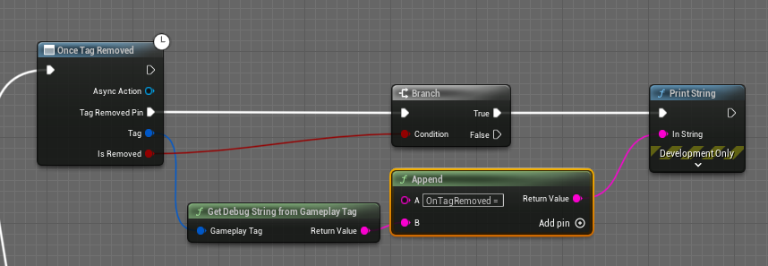
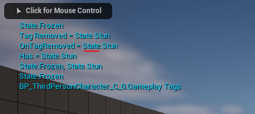
### `OnTagAdded AsyncAction`
Сделаем аналогичное действие для `OnTagAdded`.
Поскольку у действий разное количество аргументов - необходимо создать класс асинхронного действия. Я не буду делать для этого отдельный файл, использую этот-же.
```cpp
#include "CoreMinimal.h"
#include "Engine/CancellableAsyncAction.h"
#include "GameplayTagContainer.h" // Gameplay Tags
#include "TagsComponent.h" // Tags Component
#include "TagsLibrary.h" // Tags Function Library
// generated.h
#include "TagsCompCancellableAsyncAction.generated.h"
// On Tag Added pin
DECLARE_DYNAMIC_MULTICAST_DELEGATE_OneParam(FTagAddedPin, FGameplayTag, Tag);
/**
 * Tags Component Tag Add binding
 */
UCLASS()
class TAGSMODULE_API UTagAddedCancellableAsyncAction : public UCancellableAsyncAction
{
	GENERATED_BODY()
		// world context
		UObject* WorldContextObject;
	// search for owner that contains components
	inline AActor* GetNodeOwner() {
		AActor* Owner = Cast<AActor>(WorldContextObject);
		if (Owner == nullptr) {
			UActorComponent* OwningComponent = Cast<UActorComponent>(WorldContextObject);
			if (OwningComponent == nullptr) return nullptr; // node called not in actor and not in actor component
			Owner = OwningComponent->GetOwner();
		}
		return Owner;
	}
public:
	UPROPERTY(BlueprintAssignable)
	FTagAddedPin TagAdded;
	// Main Logics go here
	virtual void Activate() override {
		AActor* Owner = GetNodeOwner();
		if (Owner == nullptr){
			//UE_LOG(LogTemp, Warning, TEXT("[tags] Onwer is NULL! "))
			return;
		}
		UTagsComponent* TC = Owner->FindComponentByClass<UTagsComponent>();
		//ensure(TC != nullptr);
		if (TC == nullptr){
			return;
		}
		FScriptDelegate Delegate;
		Delegate.BindUFunction(this, "OnTagAddedCallback");
		TC->OnTagAdded.Add(Delegate);
	}
	// Callback for delegate
	UFUNCTION(BlueprintCallable)
	void OnTagAddedCallback(FGameplayTag Tag) {
		//UE_LOG(LogTemp, Warning, TEXT("[tags] Tag Added"))
		TagAdded.Broadcast(Tag); // Activate pin
	}
	// Node with pin that activates once tag is removed from component
	UFUNCTION(BlueprintCallable, Category = "Tags Component", meta = (BlueprintInternalUseOnly = "true", WorldContext = "WorldContextObject"))
	static UTagAddedCancellableAsyncAction* OnceTagAdded(UObject* WorldContextObject) {
		UTagAddedCancellableAsyncAction* BlueprintNode = NewObject<UTagAddedCancellableAsyncAction>(); // construct async action
		// Set internal class variables. Can't be done otherwise since function is static.
		BlueprintNode->WorldContextObject = WorldContextObject;
		return BlueprintNode;
	}
};
```
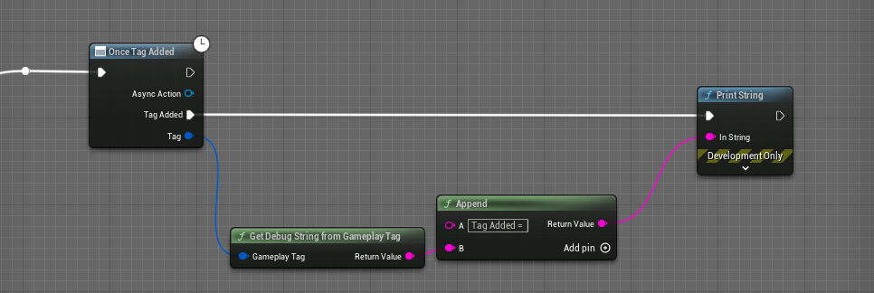
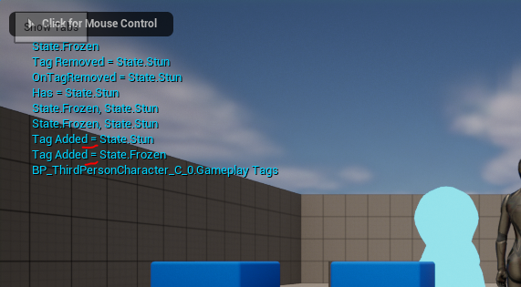
### Тестирование
Использовать ноды `OnceTagAdded` и `OnceTagRemoved` можно как из класса персонажа или любого `AActor'а`, так и из классов `UActorComponent`, которые подключены к персонажу. При этом достаточным условием, чтобы эти ноды работали, является наличие компонента тегов.
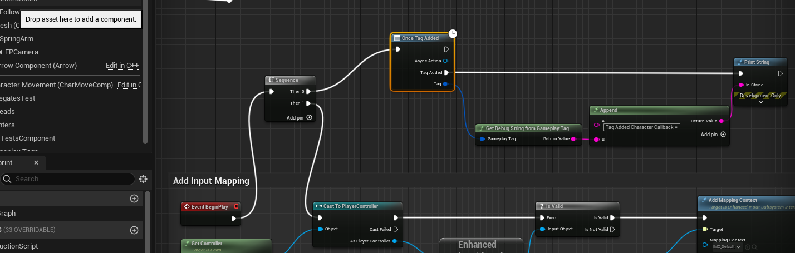
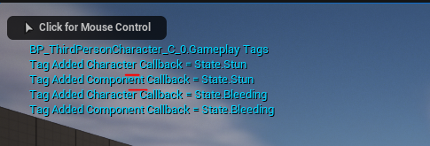
## Добавление тегов из `c++`
Предположим вы делаете модуль с системой передвижения. При этом вы бы хотели, чтобы теги, используемые в этом модуле, сразу активировались на стороне `blueprint` редактора, без ручного добавления их через меню настроек. О том, как это сделать - поговорим в этой главе.
### `RequestGameplayTag`
Самый простой способ заставить тег появиться в проекте - это использовать `FGameplayTag::RequestGameplayTag`.
```cpp
//.h
// Gameplay tag
UPROPERTY(EditAnywhere, Category = "GameplayTags")
FGameplayTag TagTest;
//...
//.cpp
// in constructor
TagTest = FGameplayTag::RequestGameplayTag(FName("Locomotion.Grounded.Jog"));
```

Этим способом можно создавать теги как в теле класса, так и внутри функций.
Недостаток у этой функции один - она обязательно должна быть вызвана или в теле класса или в конструкторе. Если этого не произойдет - тег не добавится.
### Macro Tags
Если нужны перманентно присутствующие теги, то есть макросы.
Макросы, отвечающие за теги, можно найти в файле `NativeGameplayTags.h` по пути `\Runtime\GameplayTags\Public\NativeGameplayTags.h`.
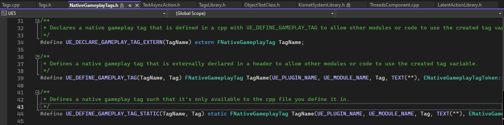
Давайте рассмотрим их код.
```cpp
/**
 * Declares a native gameplay tag that is defined in a cpp with UE_DEFINE_GAMEPLAY_TAG to allow other modules or code to use the created tag variable.
 */
#define UE_DECLARE_GAMEPLAY_TAG_EXTERN(TagName) extern FNativeGameplayTag TagName;
/**
 * Defines a native gameplay tag that is externally declared in a header to allow other modules or code to use the created tag variable.
 */
#define UE_DEFINE_GAMEPLAY_TAG(TagName, Tag) FNativeGameplayTag TagName(UE_PLUGIN_NAME, UE_MODULE_NAME, Tag, TEXT(""), ENativeGameplayTagToken::PRIVATE_USE_MACRO_INSTEAD); static_assert(UE::GameplayTags::Private::HasFileExtension(__FILE__, ".cpp"), "UE_DEFINE_GAMEPLAY_TAG can only be used in .cpp files, if you're trying to share tags across modules, use UE_DECLARE_GAMEPLAY_TAG_EXTERN in the public header, and UE_DEFINE_GAMEPLAY_TAG in the private .cpp");
/**
 * Defines a native gameplay tag such that it's only available to the cpp file you define it in.
 */
#define UE_DEFINE_GAMEPLAY_TAG_STATIC(TagName, Tag) static FNativeGameplayTag TagName(UE_PLUGIN_NAME, UE_MODULE_NAME, Tag, TEXT(""), ENativeGameplayTagToken::PRIVATE_USE_MACRO_INSTEAD); static_assert(UE::GameplayTags::Private::HasFileExtension(__FILE__, ".cpp"), "UE_DEFINE_GAMEPLAY_TAG_STATIC can only be used in .cpp files, if you're trying to share tags across modules, use UE_DECLARE_GAMEPLAY_TAG_EXTERN in the public header, and UE_DEFINE_GAMEPLAY_TAG in the private .cpp");
```
#### `UE_DEFINE_GAMEPLAY_TAG_STATIC`
Рассмотрим для начала самый простой макрос - `UE_DEFINE_GAMEPLAY_TAG_STATIC`.
Он используется только в `.cpp` файле и позволяет на ходу задавать и использовать макросы тегов.
```cpp
//.h
// Gameplay Tags
#include "GameplayTagContainer.h"
#include "BlueprintGameplayTagLibrary.h"
#include "NativeGameplayTags.h"
//...
//.cpp
// gameplay tags
UE_DEFINE_GAMEPLAY_TAG_STATIC(TAG_FROZEN, "State.Frozen");
UE_DEFINE_GAMEPLAY_TAG_STATIC(TAG_STUN, "State.Stun");
// will add gen.cpp
#include UE_INLINE_GENERATED_CPP_BY_NAME(K2Node_Test)
// now we can use TAG_FROZEN and TAG_STUN within this .cpp file
```
#### `UE_DECLARE_GAMEPLAY_TAG_EXTERN` и `UE_DEFINE_GAMEPLAY_TAG`
Следующие макросы служат для добавления глобально доступных игровых тегов, это: `UE_DECLARE_GAMEPLAY_TAG_EXTERN` и `UE_DEFINE_GAMEPLAY_TAG`.
Макрос `UE_DECLARE_GAMEPLAY_TAG_EXTERN` должен быть указан в заголовочном файле (`.h`), например, библиотеки функций.
```cpp
//.h file NativeTags/Tags.h
#pragma once
#include "NativeGameplayTags.h" // Gameplay Tags Native Macros
UE_DECLARE_GAMEPLAY_TAG_EXTERN(TAG_IS_ARMED)
UE_DECLARE_GAMEPLAY_TAG_EXTERN(TAG_WEARING_SWORD)
UE_DECLARE_GAMEPLAY_TAG_EXTERN(TAG_WEARING_BOW)
```
Макрос `UE_DEFINE_GAMEPLAY_TAG` должен быть указан в файле реализации (`.cpp`).
```cpp
//.cpp file NativeTags/Tags.cpp
#include "NativeTags/Tags.h"
UE_DEFINE_GAMEPLAY_TAG(TAG_IS_ARMED, "Combat.IsArmed");
UE_DEFINE_GAMEPLAY_TAG(TAG_WEARING_SWORD, "Equipment.Wearing.Sword");
UE_DEFINE_GAMEPLAY_TAG(TAG_WEARING_BOW, "Equipment.Wearing.Bow");
```
Давайте создадим отдельный набор файлов под макросы тегов. Чтобы идентификаторы тегов легко можно было подключить в любом проекте.
Добавляем в модуль `TagsModule/Public` подпапку `NativeTags`.
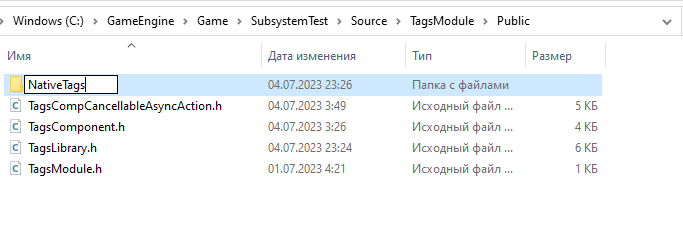
В эту папку добавляем файл - `Tags.h`.
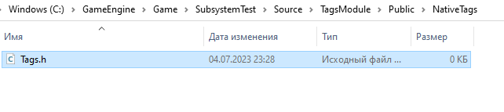
Теперь идем в папку `TagsModule/Private` и добавляем туда подпапку `NativeTags`.
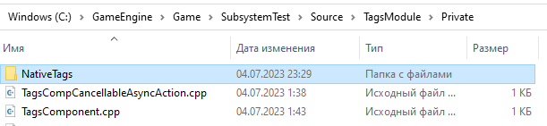
И добавляем туда файл -  `Tags.cpp`.
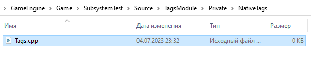
Теперь нам надо, чтобы эти файлы появились в проекте. Идем в Unreal Engine - `Tools / Refresh Visual Studio 2022 Project`.
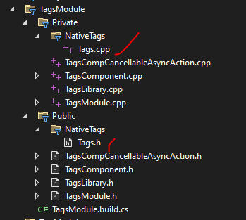
Теперь добавляем туда приведенный выше код.
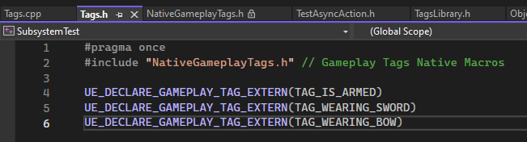
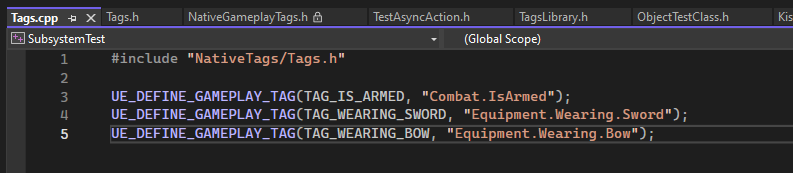
Если теперь просто скомпилировать проект - в нем появятся указанные теги. Переходим в `Tools -> Project Settings -> Gameplay Tags`.

> *Если теги  не появились - перезапустите движок.*

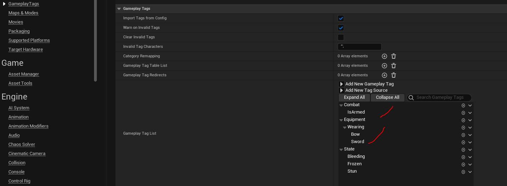
К тому-же, теперь, просто подключив исполняемый файл `NativeTags/Tags.h` мы сможем использовать макросы тегов, заданные там, для программирования  собственной системы.
Важно помнить, что теги будут удалены из системы, если из нее будет удален модуль, который эти теги добавляет (особенно это актуально, если модуль находится в плагине).
## Meta `Categories`
Для системы `GameplayTags` существует собственный `meta` параметр, который работает только с параметрами типа `FGameplayTag`.
```cpp
// use "GameplayTags" in PublicDependencyModuleNames
// Gameplay Tags
#include <NativeGameplayTags.h>
//...
// Gameplay tag locked category
UPROPERTY(EditAnywhere, Category = "GameplayTags", meta = (Categories = "Locomotion.Grounded"))
FGameplayTag GroundedLocomotionMode;
// Gameplay tag
UPROPERTY(EditAnywhere, Category = "GameplayTags")
FGameplayTag TagTest;
// also can be used with function parameters like so:
// this will broadcast given tag to all listeners
UFUNCTION(BlueprintCallable, Category = "Operations", Meta=(EventTag="Events.All"))
void CallEvent(UPARAM(meta=(Categories = "Events")) FGameplayTag EventTag);
```
Используя такой параметр можно конкретизировать категорию тегов, которая будет доступна для устанвоки значений в переменной.
Переменная `GroundedLocomotionMode` у которой есть параметр `Category` выглядит так:

Переменная `TagTest` у которой нет параметра `Category` выглядит так:


## Получение списка "суб тегов", `UGameplayTagsManager`
В `blueprint` менеджер тегов `UGameplayTagsManager` не доступен. Но из `с++` обращаться к нему можно, например, для получения списка "под тегов", от заданного тега.
```cpp
// in function library
// list of child tags, wrapped to container
UFUNCTION(BlueprintCallable, Category = "Tags")
static FGameplayTagContainer GetChildTags(FGameplayTag BaseTag) {
	UGameplayTagsManager& Manager = UGameplayTagsManager::Get();

	FGameplayTagContainer Children = Manager.RequestGameplayTagChildren(BaseTag);
	return Children;
}

// array of child tags
UFUNCTION(BlueprintCallable, Category = "Tags")
static TArray<FGameplayTag> GetChildTagsArray(FGameplayTag BaseTag) {
	UGameplayTagsManager& Manager = UGameplayTagsManager::Get();

	FGameplayTagContainer Children = Manager.RequestGameplayTagChildren(BaseTag);
	
	TArray<FGameplayTag> Tags;
	Children.GetGameplayTagArray(Tags);

	return Tags;
}
```
Вызывать так:
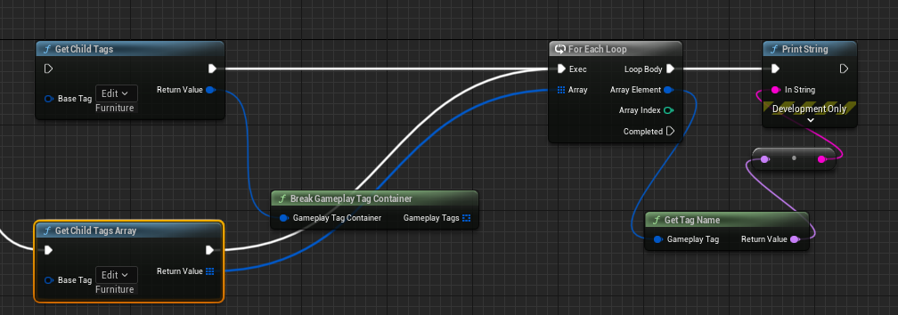

## Links
https://docs.unrealengine.com/4.26/en-US/ProgrammingAndScripting/Tags/
https://www.tomlooman.com/unreal-engine-gameplaytags-data-driven-design/
https://www.unrealdirective.com/tip/declare-define-native-gameplay-tags