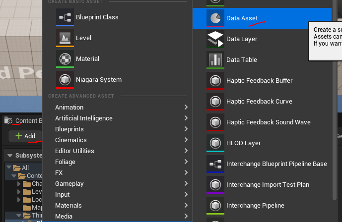

# Работа с ассетами и данными
(Assets and Data Management)
Рассмотрим методы индексации ассетов, а так-же файлы `Data Asset`.
## Подготовка к работе
### Создаем модуль
Cоздадим модуль `DataAccess`.

После генерации модуля не забудьте выполнить команду `Tools -> Refresh Visual Studio 2022 Project`, чтобы файлы появились в Visual Studio.

### Создаем `ActorComponent`
Теперь добавим `ActorComponent`, в котором и будем писать наш код.
Идем `Tools -> New C++ Class -> Actor Component`.

Называем компонент `DataAccessComponent`.

Не забудьте выполнить команду `Tools -> Refresh Visual Studio 2022 Project`, чтобы файл компонента появился в Visual Studio.

Теперь добавим полученный компонент к `BP_ThirdPersonCharacter`.

### Зависимости сборки
Прописываем в файл `DataAccess.build.cs` следующие зависимости:
```cpp
using UnrealBuildTool;
public class DataAccess : ModuleRules
{
	public DataAccess(ReadOnlyTargetRules Target) : base(Target)
	{
        PCHUsage = PCHUsageMode.UseExplicitOrSharedPCHs;
		PublicDependencyModuleNames.AddRange(new string[] {
			"Core",
			"CoreUObject",
			"Engine",
			"TestModule",
			"CharactersModule",
            "GameplayTags",
            "InputCore",
            "EnhancedInput"
        });
        PrivateDependencyModuleNames.AddRange(new string[] { "AssetRegistry", "TestModule" });
		PublicIncludePaths.AddRange(new string[] {"DataAccess/Public"});
		PrivateIncludePaths.AddRange(new string[] {"DataAccess/Private"});
	}
}
```
## Data Assets или ассеты данных
`UDataAsset` - это базовый класс, для организации различного рода файловых хранилищ данных. Реализуя данный класс разработчик создает заготовку, на основе которой формируются ассеты данных.
Давайте рассмотрим на практике.
Идем `Tools->New C++ Class -> AllClasses` и ищем `Data Asset`.

Нас интересует пока просто обычный `Data Asset`, не `Primary Data Asset`, о нем я поговорю ниже.
Добавляем новый `Data Asset` в модуль `DataAccess`, называем - `CharacterData`.

Далее обновляем индексацию проекта командой `Tools->Refresh Visual Studio 2022 Project`, чтобы добавленный файл появился в `Solution Explorer`.

В полученном классе `UCharacterData` мы можем выстроить модель данных, которая будет храниться внутри файлов `DataAsset`. Делается это через банальное добавление переменных с использованием макроса `UPROPERTRY`.
```cpp
// Packages used:
// "GameplayTags", "EnhancedInput", "TestModule"
#include "NativeGameplayTags.h" // gameplay tags
#include "InputAction.h" // enhanced input
#include "InputMappingContext.h"
// Item Types Enum
// This enum size limited by 8 maximum items since it's bitmask enum from uint8
UENUM(BlueprintType, meta = (Bitflags, UseEnumValuesAsMaskValuesInEditor = "true"))
enum class EItemTypes : uint8
{
	NONE = 0 UMETA(Hidden),
	Default = 1 << 0,
	Helmet = 1 << 1,
	Gloves = 1 << 2,
	Sword = 1 << 3,
	Boots = 1 << 4,
};
ENUM_CLASS_FLAGS(EItemTypes);
/**
 * Character Data Asset
 */
UCLASS()
class DATAACCESS_API UCharacterData : public UDataAsset
{
	GENERATED_BODY()
public:
	// Input Action as parameter in Data Asset
	UPROPERTY(EditDefaultsOnly, Category = "Input")
	TSoftObjectPtr<UInputAction> InputAction = nullptr;
	// Input Context as parameter in Data Asset
	UPROPERTY(EditDefaultsOnly, Category = "Input")
	TSoftObjectPtr<UInputMappingContext> InputContext = nullptr;
	// Gameplay tag locked category
	UPROPERTY(EditDefaultsOnly, Category = "GameplayTags", meta = (Categories = "Locomotion.Grounded"))
	FGameplayTag GroundedLocomotionMode;
	// Edit Condition
	UPROPERTY(BlueprintReadOnly, EditDefaultsOnly, Category = "EditConditions", meta = (EditCondition = "bVarCanBeEdited"/*, EditConditionHides*/))
	FString EditConditionTestVariable = "Test";
	UPROPERTY(BlueprintReadOnly, EditDefaultsOnly, Category = "EditConditions", meta = (InlineEditConditionToggle))
	bool bVarCanBeEdited = false;
	// Item Type Enum
	UPROPERTY(BlueprintReadOnly, EditDefaultsOnly, Category = "EditConditions|Enum")
	EItemTypes ItemType = EItemTypes::Boots;
	// Bit Flags variable
	UPROPERTY(BlueprintReadOnly, EditDefaultsOnly, Category = "BitFlags", meta = (Bitmask, BitmaskEnum = "/Script/TestModule.EItemTypes"))
	int32 ItemTypeFlags = StaticCast<int32>(EItemTypes::Helmet | EItemTypes::Gloves);
	// enum based edit condition
	UPROPERTY(BlueprintReadOnly, EditDefaultsOnly, Category = "EditConditions|Enum", meta = (EditCondition = "ItemType != EItemTypes::Sword", EditConditionHides))
	int Armor = 15;
	// BitFlag based condition
	UPROPERTY(BlueprintReadOnly, EditDefaultsOnly, Category = "EditConditions", meta = (EditCondition = "ItemTypeFlags & '/Script/TestModule.EItemTypes::Sword'"))
	FString EditConditionBitFlags = "This Editable With BitFlag";
	// Array Test
	UPROPERTY(BlueprintReadOnly, EditDefaultsOnly, Category = "Arrays")
	TArray<int32> TestIntArray;
	// Map. Filled in constructor
	UPROPERTY(BlueprintReadOnly, EditDefaultsOnly, Category = "Map")
	TMap<FString, float> TestMap;
	// Test Output Function
	UFUNCTION(BlueprintPure, Category = "Map")
	TMap<FString, float> GetTestMap() const {
		return TestMap;
	}
};
```
В код я перенес наиболее актуальные примеры переменных, которые так или иначе могут быть использованы на практике.
После добавления кода и его компиляции - самое время создать непосредственно `DataAsset` на основе класса `UCharacterData`.
Для этого идем в `Content Browser -> Add -> Miscellaneous -> Data Asset`.

Перед вами появится меню генерации `Data Asset`, в котором необходимо будте выбрать тип, на основе которого этот ассет создается. В нашем случае это `CharacterData`.

После создания вы увидите новый `DataAsset`, в котором будут содержаться все поля, которые мы указали в классе.


Особое внимание прошу обратить на параметры типа `EditCondition`. Их крайне часто применяют именно в файлах типа `DataAsset`, потому что таким образом можно обеспечить разные типы настроек для разных типов параметров.
В нашем примере, если выбрать для параметра `Item Type` тип `Helmet` то появится параметр `Armor`.

Если же выбрать `Sword` то параметр пропадет.

Вы можете крайне успешно применять похожую логику. Более подробно про `EditCondition` я уже писал в статье про макросы.
Рассмотрим получение ссылок на `DataAsset`.
### `DataAsset UPROPERTY`
```cpp
//.h
//Data asset refrence
UPROPERTY(BlueprintReadWrite, EditAnywhere, Category = "VariableExperiments")
UDataAsset* DataAssetRefrence;
//...
//.cpp
// default value
if (DataAssetRefrence == nullptr) {
    const FString Path = TEXT("/Script/DataAccess.CharacterData'/Game/Characters/Data/DA_Character.DA_Character'");
    DataAssetRefrence = UKismetSystemLibrary::MakeSoftObjectPath(Path);
}
```

### Чтение данных из `DataAsset` по ссылке
Делается элементарно.
```cpp
#include "CharacterData.h"
//...
UCharacterData* Asset = LoadObject<UCharacterData>(NULL, TEXT("/Script/DataAccess.CharacterData'/Game/Characters/Data/DA_Character.DA_Character'"));
UE_LOG(LogTemp, Warning, TEXT("GroundedLocomotionMode = %s"), *Asset->GroundedLocomotionMode.ToString());
```

## AssetRegistry или реестр ассетов
`AssetRegistry` или реестр ассетов - это интерфейс файловой системы движка Unreal Engine.
Реестр ассетов хранит ссылки на все файлы в директории проекта. Это позволяет выбирать из файловой системы, например, файлы данных, относящиеся к предметам инвентаря или к кастомизации персонажа.
Используя реестр можно создавать `ui` виджеты, элементы в которых появляются или удаляются автоматически, при добавлении или удалении файлов из директории проекта.
К примеру: можно сканировать папки с текстурами кожи или прическами, а потом выдавать результат сканирования напрямую в `ui` виджет кастомизации персонажа. Такой подход позволяет работать без использования `Data Table` и сторонних хранилищ данных. То есть вам не придется вручную всякий раз указывать файлы причесок в таблице или `DataAsset`, если виджет сам будет искать их в нужной папке.
Реестр ассетов относительно быстр, но при большом количестве файлов (тысячи), их фильтрование может создавать проблемы.
`Content Browser` в Unreal Engine работает, используя `AssetRegistry`.

Несмотря на тот факт, что реестр ассетов используется, в основном, редактором Unreal Engine, по своей сущности он является `runtime` модулем и может быть использован в других `runtime` модулях.
Найти модуль реестра ассетов можно по пути: `\Runtime\AssetRegistry\`.

В папке модуля нам особенно интересен сам интерфейс реестра ассетов, это интерфейс (класс) `IAssetRegistry`, найти его можно по пути `\Runtime\AssetRegistry\Public\AssetRegistry\IAssetRegistry.h`.
Данный интерфейс является классическим с++ синглтоном, не подсистемой (как написано в официальной документации), а именно просто синглтоном через `static` переменную.
Сам синглтон можно найти в файле `\Runtime\CoreUObject\Public\Misc\AssetRegistryInterface.h` и выглядит он так.

В интерфейс он выводится так:

Доступ к этому синглтону извне проекта можно получить обратившись к конструктору модуля. То есть к файлу `AssetRegistryModule.h`, в котором есть метод `Get`. Данный метод возвращает указатель на синглтон реестра ассетов.

Его мы и будем использовать.
Однако, прежде чем писать код, надо удовлетворить зависимости между модулями.
Находим в Solution Explorer наш модуль `DataAccess` (создавали в главе "подготовка к работе") идем в файл `DataAccess.build.cs` и добавляем туда строчку:
```cpp
PrivateDependencyModuleNames.AddRange(new string[] { "AssetRegistry" });
```

Теперь модуль `AssetRegistry` будет загружаться вместе с модулем `DataAccess`. Так-же, из модуля `DataAccess` мы получаем возможность делать `#include` к файлам `AssetRegistry`.
В частности, нас интересует этот файл:
```cpp
#include "AssetRegistry/AssetRegistryModule.h" // Asset Registry
```
Подключаем его в файле `DataAccessComponent.h`.

Чаще всего реестр ассетов используют для фильтрования файлов в папках. Это и рассмотрим.
### Получение списка ассетов по их классу
Давайте получим список файлов в папке `/Game/LevelPrototyping/Meshes`. Эта папка содержит базовые заготовки мешей для шаблона `ThirdPerson`.

Все меши в папке являются `StaticMesh`.
Получение ассетов типа `UStaticMesh` из папки `/Game/LevelPrototyping/Meshes` выглядит так:
```cpp
//.h
#include "AssetRegistryModule.h" // Asset Registry
#include "AssetRegistry/ARFilter.h" // Asset Registry Filter
//...
//.cpp
// BeginPlay
FAssetRegistryModule& Registry = FModuleManager::LoadModuleChecked<FAssetRegistryModule>("AssetRegistry");
TArray<FAssetData> AssetData; // This Array will contain our assets
FARFilter Filter; // Assets will be filtered by this
Filter.ClassPaths.Add(UStaticMesh::StaticClass()->GetClassPathName()); // add class to filter
Filter.PackagePaths.Add("/Game/LevelPrototyping/Meshes"); // all location to filter
Registry.Get().GetAssets(Filter, AssetData); // apply filter and get results
for (FAssetData Asset : AssetData) { // loop thru found assets
    Asset.PrintAssetData();
}
```
Тут, для выбора ассетов, я использовал два фильтра - по классу `Filter.ClassPaths` и по пути `Filter.PackagePaths`.
Если запустить проект - в логе можно будет увидеть отчет по каждому файлу, найденному в папке.

К сожалению, такой лог не очень то читабельный. Поэтому лучше использовать такой код:
```cpp
//.h
#include "AssetRegistryModule.h" // Asset Registry
#include "AssetRegistry/ARFilter.h" // Asset Registry Filter
//...
//.cpp
// BeginPlay
// get assets of class UStaticMesh in folder /Game/LevelPrototyping/Meshes
UE_LOG(LogTemp, Warning, TEXT("=== Get Assets of class UStaticMesh in folder /Game/LevelPrototyping/Meshes ==="));
FAssetRegistryModule& Registry = FModuleManager::LoadModuleChecked<FAssetRegistryModule>("AssetRegistry");
TArray<FAssetData> AssetData; // This Array will contain our assets
FARFilter Filter; // Assets will be filtered by this
Filter.ClassPaths.Add(UStaticMesh::StaticClass()->GetClassPathName()); // add class to filter
Filter.PackagePaths.Add("/Game/LevelPrototyping/Meshes"); // all location to filter
Registry.Get().GetAssets(Filter, AssetData); // apply filter and get results
for (FAssetData Asset : AssetData) { // loop thru found assets
    //Asset.PrintAssetData();
    UE_LOG(LogTemp, Warning, TEXT("AssetName: %s"), * Asset.AssetName.ToString());
}
```


> Если убрать фильтр по пути, можно получить список вообще всех ассетов `UStaticMesh` в проекте.

### Получение списка `blueprint` классов, унаследованных от `UObjectTestClass`
Теперь получим список `blueprint` классов, унаследованных от `UObjectTestClass`. Проблема в том, что мы не можем использовать метод `::StaticClass()` для выявления `blueprint` ассетов. Например, следующий код выдаст пустой результат при попытке найти `blueprint` класы `UObjectTestClass` в проекте.
```cpp
FAssetRegistryModule& Registry = FModuleManager::LoadModuleChecked<FAssetRegistryModule>("AssetRegistry");
TArray<FAssetData> AssetData; // This Array will contain our assets
FARFilter Filter; // Assets will be filtered by this
Filter.ClassPaths.Add(UObjectTestClass::StaticClass()->GetClassPathName()); // add class to filter
Filter.bRecursiveClasses = true; // to include subclasses of given class
Registry.Get().GetAssets(Filter, AssetData); // apply filter and get results
UE_LOG(LogTemp, Warning, TEXT("Found Amount = %i"), AssetData.Num());
for (FAssetData Asset : AssetData) { // loop thru found assets
    //Asset.PrintAssetData();
    UE_LOG(LogTemp, Warning, TEXT("AssetName: %s"), *Asset.AssetName.ToString());
}
UE_LOG(LogTemp, Warning, TEXT("======"));
```

Единственный способ получить `blueprint` классы через фильтрование сводится к применению типа `UBlueprint` в фильтре. Это выдаст вообще все `blueprint` классы, которые потом можно отфильтровать в цикле, чтобы найти нужные нам.
```cpp
// module
PublicDependencyModuleNames.AddRange(new string[] { "Core", "CoreUObject", "Engine", "TestModule"});
//.h
#include "AssetRegistryModule.h" // Asset Registry
#include "AssetRegistry/ARFilter.h" // Asset Registry Filter
#include "ObjectTestClass.h" // to access UObjectTestClass
//...
// .cpp
//BeginPlay
// get blueprint assets of class UObjectTestClass
UE_LOG(LogTemp, Warning, TEXT("=== Get Blueprint Assets of class UObjectTestClass ==="));
FAssetRegistryModule& Registry = FModuleManager::LoadModuleChecked<FAssetRegistryModule>("AssetRegistry");
IAssetRegistry& AssetRegistry = Registry.Get();
TArray<FAssetData> AssetData; // This Array will contain our assets
FARFilter Filter; // Assets will be filtered by this
// add blueprint class to filter, it will list us all the bp classes in project
// UBlueprint - for blueprint classes
// UWidgetBlueprint  - for bp widget classes
Filter.ClassPaths.Add(UBlueprint::StaticClass()->GetClassPathName());
Filter.bRecursiveClasses = true; // to include subclasses of given class
// in loop we will use this set to filter only blueprints with class UObjectTestClass
TSet<FName> DerivedNames;
{
    TArray< FName > BaseNames;
    BaseNames.Add(UObjectTestClass::StaticClass()->GetFName()); // we will search for UObjectTestClass
    //BaseNames.Add(AActor::StaticClass()->GetFName());
    TSet<FName> Excluded;
    AssetRegistry.GetDerivedClassNames(BaseNames, Excluded, DerivedNames);
}
AssetRegistry.GetAssets(Filter, AssetData); // apply filter and get results
UE_LOG(LogTemp, Warning, TEXT("Found Amount = %i"), AssetData.Num());
for (FAssetData Asset : AssetData) { // loop thru found assets
    //Asset.PrintAssetData();
    //Asset.GetClass();
    //Asset.GetAsset();
    FString GeneratedClassPathRef = Asset.TagsAndValues.FindRef(TEXT("GeneratedClass"));
    if(GeneratedClassPathRef == "") continue; // it's not a blueprint
    const FString ClassObjectPath = FPackageName::ExportTextPathToObjectPath(*GeneratedClassPathRef);
    const FString ClassName = FPackageName::ObjectPathToObjectName(ClassObjectPath);
    // skip blueprints that are not in list of DerivedNames
    if (!DerivedNames.Contains(*ClassName)) continue;
    UE_LOG(LogTemp, Warning, TEXT("Class Path: %s"), *ClassObjectPath);
    UE_LOG(LogTemp, Warning, TEXT("Class Name: %s"), *ClassName);
    UE_LOG(LogTemp, Warning, TEXT("Class Name Classic: %s"), *Asset.GetClass()->GetName());
    UE_LOG(LogTemp, Warning, TEXT("AssetName: %s"), *Asset.AssetName.ToString());
    UE_LOG(LogTemp, Warning, TEXT("======"));
}
```
Используя данный код я нашел все `blueprint` потомки класса `UObjectTestClass` (он всего один, на данный момент).


Обратите внимание на лог, а именно на строчку `Class Name Classic`, которая имеет значение `Blueprint`. Таким образом показано, что вы не можете взять класс у `blueprint` асета стандартным способом, через `Asset.GetClass()`. Класс `blueprint` ассета можно получить через параметр `GeneratedClass`.
Доступ к полю `GeneratedClass` можно получить через `TagsAndValues`:
```cpp
Asset.TagsAndValues.FindRef(TEXT("GeneratedClass"))
```
Полученная строчка возвращает ту-же самую ссылку, которую вы можете получить, кликнув по ассету правой кнопкой мыши `-> Copy Refrence`.

Далее эту строчку можно использовать в стандартном цикле загрузки ассета.
Так-же параметр `GeneratedClass` можно получить через приведение типа:
```cpp
UBlueprint* FoundBP = Cast<UBlueprint>(Asset.GetAsset());
FoundBP->GeneratedClass
```
В этом случае код будет выглядеть так:
```cpp
// module
PublicDependencyModuleNames.AddRange(new string[] { "Core", "CoreUObject", "Engine", "TestModule"});
//.h
#include "AssetRegistryModule.h" // Asset Registry
#include "AssetRegistry/ARFilter.h" // Asset Registry Filter
#include "ObjectTestClass.h" // to access UObjectTestClass
//...
// .cpp
//BeginPlay
// get blueprint assets of class UObjectTestClass, with each found loading
UE_LOG(LogTemp, Warning, TEXT("=== Get Blueprint Assets of class UObjectTestClass using Cast ==="));
FAssetRegistryModule& Registry = FModuleManager::LoadModuleChecked<FAssetRegistryModule>("AssetRegistry");
IAssetRegistry& AssetRegistry = Registry.Get();
TArray<FAssetData> AssetData; // This Array will contain our assets
FARFilter Filter; // Assets will be filtered by this
// add blueprint class to filter, it will list us all the bp classes in project
// UBlueprint - for blueprint classes
// UWidgetBlueprint  - for bp widget classes
Filter.ClassPaths.Add(UBlueprint::StaticClass()->GetClassPathName());
Filter.bRecursiveClasses = true; // to include subclasses of given class
// in loop we will use this set to filter only blueprints with class UObjectTestClass
TSet<FName> DerivedNames;
{
    TArray< FName > BaseNames;
    BaseNames.Add(UObjectTestClass::StaticClass()->GetFName()); // we will search for UObjectTestClass
    //BaseNames.Add(AActor::StaticClass()->GetFName());
    TSet<FName> Excluded;
    AssetRegistry.GetDerivedClassNames(BaseNames, Excluded, DerivedNames);
}
AssetRegistry.GetAssets(Filter, AssetData); // apply filter and get results
UE_LOG(LogTemp, Warning, TEXT("Found Amount = %i"), AssetData.Num());
for (FAssetData Asset : AssetData) { // loop thru found assets
    //Asset.PrintAssetData();
    //Asset.GetClass();
    //Asset.GetAsset();
    UBlueprint* FoundBP = Cast<UBlueprint>(Asset.GetAsset());
    if (FoundBP == nullptr) continue; // it's not a blueprint
    const FString ClassObjectPath = FPackageName::ExportTextPathToObjectPath(*FoundBP->GeneratedClass->GetClassPathName().ToString());
    const FString ClassName = FPackageName::ObjectPathToObjectName(ClassObjectPath);
    // skip blueprints that are not in list of DerivedNames
    if (!DerivedNames.Contains(*ClassName)) continue;
    UE_LOG(LogTemp, Warning, TEXT("Class Object Path: %s"), *ClassObjectPath);
    UE_LOG(LogTemp, Warning, TEXT("Class Name: %s"), *ClassName);
    UE_LOG(LogTemp, Warning, TEXT("Class Name Classic: %s"), *Asset.GetClass()->GetName());
    UE_LOG(LogTemp, Warning, TEXT("AssetName: %s"), *Asset.AssetName.ToString());
    UE_LOG(LogTemp, Warning, TEXT("======"));
}
```

Такой подход  можно применять как для получения списка `UBlueprint` классов, так и для классов `UWidgetBlueprint`.
Важно учитывать тот факт, что в упакованной к релизу игре нет никаких `UBlueprint` ассетов. Там есть лишь объекты типа `UBlueprintGeneratedClass`. Поэтому в цикле, при фильтрации, мы не можем использовать `Asset.GetClass()` для сравнения классов. Вместо этого необходимо использовать информацию о том, какой именно `UBlueprintGeneratedClass` будет сгенерирован системой для текущего `blueprint` ассета. Эта информация может быть получена из тега `GeneratedClass`. Я получаю ее в строчке `Asset.TagsAndValues.FindRef(TEXT("GeneratedClass"))`. Эта строчка гарантирует, что код будет работать и в запакованном проекте.
### Фильтрование ассетов по значениям их параметров `AssetRegistrySearchable`
Некоторым параметрам классов можно сообщить свойство `AssetRegistrySearchable`, чтобы сделать эти параметры доступными для поиска через реестр ассетов.
Например я добавил такой параметр в наш `UObjectTestClass`:
```cpp
// Allow asset registry to filter assets with this field using
UPROPERTY(EditAnywhere, Category = "AssetRegistryMark", AssetRegistrySearchable)
int ParameterFilter = 0;
```

Значение параметра тоже важно. Мы можем фильтровать классы и по названию параметров и по их значению.
Делается это так.
```cpp
// module
PublicDependencyModuleNames.AddRange(new string[] { "Core", "CoreUObject", "Engine", "TestModule"});
//.h
#include "AssetRegistryModule.h" // Asset Registry
#include "AssetRegistry/ARFilter.h" // Asset Registry Filter
#include "ObjectTestClass.h" // to access UObjectTestClass
//...
// .cpp
//BeginPlay
// get assets by AssetRegistrySearchable TagsAndValues
UE_LOG(LogTemp, Warning, TEXT("=== Get Assets by AssetRegistrySearchable TagsAndValues ==="));
FAssetRegistryModule& Registry = FModuleManager::LoadModuleChecked<FAssetRegistryModule>("AssetRegistry");
IAssetRegistry& AssetRegistry = Registry.Get();
TArray<FAssetData> AssetData; // This Array will contain our assets
FARFilter Filter; // Assets will be filtered by this
FString ClassPath = UObjectTestClass::StaticClass()->GetClassPathName().ToString();
UE_LOG(LogTemp, Warning, TEXT("Class Path: %s"), *ClassPath);
Filter.TagsAndValues.Add(FName("ParameterFilter"), FString("1")); // ParameterName / Value
// To Allow asset registry filter assets by property field use it this way:
// UPROPERTY(EditAnywhere, Category = "AssetRegistryMark", AssetRegistrySearchable)
// int ParameterFilter = 0;
AssetRegistry.GetAssets(Filter, AssetData); // apply filter and get results
for (FAssetData Asset : AssetData) { // loop thru found assets
    //Asset.PrintAssetData();
    UE_LOG(LogTemp, Warning, TEXT("AssetName: %s"), *Asset.AssetName.ToString());
}
UE_LOG(LogTemp, Warning, TEXT("======"));
```

Если в строке фильтра `Filter.TagsAndValues.Add(FName("ParameterFilter"), FString("0"))` установить значение `FString("0")`, например в `FString("1")`, то код ничего не найдет.


Но! Если копировать `blueprint` ассет с этим параметром, зайти туда и поставить значение 1 для строки `ParameterFilter`, то файл будет найден.


Используя метки типа `AssetRegistrySearchable` можно очень эффективно работать с ассетами данных `UPrimaryDataAsset` и виджетами.
### Реестр ассетов в `blueprint` коде
В `blueprint` коде есть глобальная нода `AssetRegistry`, которую можно вызвать из любого места.

Однако возможности `blueprint` интерфейса сильно ограничены. Например там нельзя создать `literal class name`, что создает проблемы при задании параметров дял структур типа `TopLevelAssetPath`.
### Спавн всех `blueprint` `Actor'ов` в папке
Помимо умения искать ассеты на диске, не менее важно понимать, как их использовать.
Давайте заспавним перед нашим персонажем `blueprint` классы, унаследованные от `UObjectTestClass`, найденные в папке `/Game/Characters` .
```cpp
// spawn all Actor blueprint assets in folder /Game/Characters
UE_LOG(LogTemp, Warning, TEXT("=== Spawn All Actor Blueprint Assets in folder /Game/Characters ==="));
FAssetRegistryModule& Registry = FModuleManager::LoadModuleChecked<FAssetRegistryModule>("AssetRegistry");
IAssetRegistry& AssetRegistry = Registry.Get();
TArray<FAssetData> AssetData; // This Array will contain our assets
FARFilter Filter; // Assets will be filtered by this
// add blueprint class to filter, it will list us all the bp classes in project
Filter.ClassPaths.Add(UBlueprint::StaticClass()->GetClassPathName());
Filter.PackagePaths.Add("/Game/Characters"); // only spawn actors in this area
Filter.bRecursiveClasses = true; // to include subclasses of given class
// in loop we will use this set to filter only blueprints with class UObjectTestClass
TSet<FName> DerivedNames;
{
    TArray<FName> BaseNames;
    BaseNames.Add(AActor::StaticClass()->GetFName()); // we will search for all AActor's
    TSet<FName> Excluded;
    AssetRegistry.GetDerivedClassNames(BaseNames, Excluded, DerivedNames);
}
AssetRegistry.GetAssets(Filter, AssetData); // apply filter and get results
UE_LOG(LogTemp, Warning, TEXT("Found Amount = %i"), AssetData.Num());
int NumberSpawned = 0; // spawned actors count
for(FAssetData Asset : AssetData) { // loop thru found assets
    UBlueprint* FoundBP = Cast<UBlueprint>(Asset.GetAsset());
    if (FoundBP == nullptr) continue; // it's not a blueprint
    const FString ClassObjectPath = FPackageName::ExportTextPathToObjectPath(*FoundBP->GeneratedClass->GetClassPathName().ToString());
    const FString ClassName = FPackageName::ObjectPathToObjectName(ClassObjectPath);
    // skip blueprints that are not in list of DerivedNames
    if (!DerivedNames.Contains(*ClassName)) continue;
    // spawn found actors
    AActor* Owner = this->GetOwner();
    FActorSpawnParameters SpawnParams;
    SpawnParams.Owner = Owner;
    SpawnParams.Instigator = Owner->GetInstigator();
    SpawnParams.bNoFail = true;
    SpawnParams.SpawnCollisionHandlingOverride = ESpawnActorCollisionHandlingMethod::AdjustIfPossibleButAlwaysSpawn;
    // spawn location
    FVector CLocation = Owner->GetActorForwardVector() * 120 + // on front of owner
                        Owner->GetActorRightVector() * 100 * NumberSpawned + // offset on right based on NumberSpawned to form line
                        Owner->GetActorLocation();
    World->SpawnActor<AActor>(FoundBP->GeneratedClass, CLocation, Owner->GetActorRotation(), SpawnParams);
    UE_LOG(LogTemp, Warning, TEXT("[%i] Actor Spawned: %s"), NumberSpawned,*ClassObjectPath);
    NumberSpawned++; // increment offset
    UE_LOG(LogTemp, Warning, TEXT("======"));
}
```
Конкретно в данный момент у меня в папке `/Game/Characters` всего два `AActor'а`.

Приведенный выше код заспавнит оба этих `Actor'а` перед персонажем игрока, с отступом вперед в 120 см и вправо в 100 см.


## Asset Manager или менеджер ассетов
Asset Manager - это встроенная в движок Unreal система индексации ассетов в файловой системе. Данная система является надстройкой над реестром ассетов. Она предоставляет удобный набор `blueprint` функций для работы ассетов, их загрузки и выгрузки.
### Проблемы менеджера ассетов
Проблемы менеджера ассетов вытекают из двух вещей: непонятной документации и устаревшей лекции на ютубе по этой системе. Менеджер ассетов появился в `Unreal Engine 4.17`, а сейчас `Unreal Engine 5`. За столь длительный промежуток система преобразилась в лучшую сторону. И там, где раньше люди вручную добавляли методы асинхронной загрузки ассетов, сегодня вручную делать уже ничего не надо.
Все уже сделано за нас.

Но об этом почти никто не знает. Поэтому, большая часть этой статьи будет посвящена раскрытию предназначения системы `AssetManager` на примерах.
Наиболее подробное объяснение принципов работы `Asset Manager'а` мне удалось найти в `.pdf` файле с документацией, он приложен к книге, в секции (дополнительные материалы). Так-же скачать файл документации можно [на форуме Unreal Engine.](https://forums.unrealengine.com/t/no-editor-game-hanging-on-splash-screen-constructorhelpers-fobjectfinder-skeletalmesh-is-null/94356/2?u=alexanderst)
Отмечу, что приведенная выше документация мне скорее навредила, чем помогла.
Согласно сему мудрому(от слова муд) талмуду(тоже от слова муд), менеджер ассетов может работать лишь с классами, у которых переопределен метод `GetPrimaryAssetId`.
Хороше, подумал я, открыл класс `UObjectTestClass` (мы писали его в одной из ранних статей) и переопределил вышеуказанный метод.
```cpp
virtual FPrimaryAssetId GetPrimaryAssetId() const override {
    FPrimaryAssetId AssetId(TEXT("UObjects"), GetFName());
    return AssetId;
}
```
Теперь я иду в `blueprint` редактор и скармливаю экземпляр этого `UObject` класса узлу `Get Primary Asset Id from Class`.
В моем понимании, этот узел долежен вызвать функцию `GetPrimaryAssetId` у класса `UObjectTestClass` и вернуть ее результаты.

Но если протестировать такой код то мы ничего не получим. Вообще ничего.

Ни сообщений об ошибке, ни предупреждений, ничего. Понимай как хочешь.
Причем, можно прочитать миллион статей других авторов в интернете, а я это упорно делал, но все равно не понять какого хрена этот код не работает.
И знаете. Если бы я не разобрался тогда, этой статьи бы вообще небыло. В какой-то момент я решил, что система `Asset Manager` вообще не работает в текущей версии Unreal Engine из-за бага или кривого переноса (кто ее знает). Но все оказалось куда интереснее.
На странице настроек проекта `Edit -> Project Settings` можно найти пункт `Asset Manager`.


Открыв этот пункт меню можно увидеть настройки для сканирования ключей ассетов - `Primary Asset Types to Scan`.


> Классы, которые возвращают `GetPrimaryAssetId`, добавляются в `Asset Manager`, при условии, что возвращаемое значение функции `GetPrimaryAssetId` присутствует в списке ключей.

То есть: не достаточно переопределить метод `GetPrimaryAssetId`, надо еще и сделать так, чтобы ключ, который этот метод возвращает, присутствовал в списке `Primary Asset Types to Scan`.
Об этом "незначительной" детали нет ни единого слова ни в одном из материалов, которые мне довелось изучить. Я узнал об этой особенности случайно, когда прочитал комментарий к классу `UPrimaryDataAsset`.
Приведенный выше `blueprint` код заработал, как только я добавил ключ `UObjects` в список `Primary Asset Types to Scan`, а так-же указал, что этот тип `Has Blueprint Classes`.


Теперь, когда нам стало понятно, как заставить `Asset Manager` работать, можно приступать к изучению его особенностей и принципов. А так-же к объяснению того, зачем он вообще нужен.
### Основные  принципы системы `Asset Manager`
Основная суть системы `Asset Manager` может быть изложена следующим образом: это высокоуровневый настраиваемый интерфейс индексации игровых ассетов.
Важно понимать, что эта система, в большей степени ориентирована на `blueprint` составляющую движка, где предоставляет удобный способ асинхронной загрузки ассетов и работы с ними.

Если кликнуть на параметр `Primary Asset Id`, например, у `blueprint` узла `Get Objects from Primary Asset Id` можно увидеть список присутствующих в системе первичных ассетов.

Это очень удобно. Бонусом идет возможность пройтись в цикле по всем первичным ассетам какой-либо категории, например - `UObjects`. Для этого используется `blueprint` узел `Get Primary Asset Id List`.


С менеджером ассетов можно работать и из с++, но основа мощного функционала этой системы вынесена именно в `blueprint` код. На стороне с++ мы можем расширить возможности класса `AssetManager`, добавив дополнительный функционал или изменив существующий.
#### Переопределение менеджера ассетов
Класс `AssetManager'а`, который используется в системе "по умолчанию", можно переопределить в настройках движка по пути `Edit -> Project Settings -> General Settings -> Default Classes -> Asset Manager`.

Сам класс менеджера ассеов можно найти по пути `Runtime\Engine\Classes\Engine\AssetManager.h`.

Переопределение этого класса позволяет создать собственные первичные типы ассетов `Primary Asset Types`, а так-же изменить или дополнить логику имеющихся в классе методов.
Идем в `Tools -> New C++ Class -> All Classes` и ищем в списке `AssetManager`.

Называем класс `DataModuleAssetManager`, размещаем его в модуле `DataAccess`.

После добавления класса не забудьте обновить проект через `Tools -> Refresh Visual Studio 2022 Project`.

Теперь давайте используем этот класс для добавления собственного `PrimaryAssetType`.
Делается это через `static const` переменные в теле класса. Так-же придется написать код, добавляющий эти переменные в `PrimaryAssetTypesToScan`.
```cpp
//.h
#include "CoreMinimal.h"
#include "Engine/AssetManager.h"
#include "Engine/AssetManagerSettings.h"
#include "DataModuleAssetManager.generated.h"
/**
 * Custom Asset Manager class
 */
UCLASS()
class DATAACCESS_API UDataModuleAssetManager : public UAssetManager
{
	GENERATED_BODY()
public:
	UDataModuleAssetManager() = default;
	virtual void PostInitProperties() override;
	// Return true if PrimaryAssetTypesToScan has PrimaryAssetType == Type
	virtual bool HasAssetTypeN(FName Type);
	// Inventory Item Groups
	// item group for abilities
	static const FPrimaryAssetType AbilityItemGroup;
	// item group for equippables
	static const FPrimaryAssetType ArmorItemGroup; // pauldrons, helmets..., will have stats for strength and others
	// item group for consumables
	static const FPrimaryAssetType ConsumableItemGroup; // potions, magic scrolls..., will be stackable
	// item group for weapons
	static const FPrimaryAssetType WeaponItemGroup; // swords, bows, shields ..., will have stats for damage
	// item group for buildable stuff
	static const FPrimaryAssetType BuildableItemGroup; // floor, walls..., will be stackable and can be build
	// item group for containers
	static const FPrimaryAssetType ContainerItemGroup; // containers, chests..., will have inventory size related parameters
	// item group for books
	static const FPrimaryAssetType TextItemGroup; // will have text field, usefull for books, scrolls, letters
	// Returns the current AssetManager with applied type
	static UDataModuleAssetManager& Get(); // *note override can't be applied to static functions
};
//...
//.cpp
// Since Static Const class members can't have "in class initialisation", we should initialize them in global scope
// it's ok, integrated Primary Asset Type - UAssetManager::MapType initialized same way
// this anyway will be avaivible in the constructor with it's value properly set
const FPrimaryAssetType UDataModuleAssetManager::AbilityItemGroup = FName(TEXT("AbilityItemGroup"));
const FPrimaryAssetType UDataModuleAssetManager::ArmorItemGroup = FName(TEXT("ArmorItemGroup"));
const FPrimaryAssetType UDataModuleAssetManager::ConsumableItemGroup = FName(TEXT("ConsumableItemGroup"));
const FPrimaryAssetType UDataModuleAssetManager::WeaponItemGroup = FName(TEXT("WeaponItemGroup"));
const FPrimaryAssetType UDataModuleAssetManager::BuildableItemGroup = FName(TEXT("BuildableItemGroup"));
const FPrimaryAssetType UDataModuleAssetManager::ContainerItemGroup = FName(TEXT("ContainerItemGroup"));
const FPrimaryAssetType UDataModuleAssetManager::TextItemGroup = FName(TEXT("TextItemGroup"));
void UDataModuleAssetManager::PostInitProperties()
{
	UAssetManager::PostInitProperties(); // call parent
	// Register our custom types in Asset Manager
	// GetMutableDefault can be used here instead
	UAssetManagerSettings* Settings = Cast<UAssetManagerSettings>(UAssetManagerSettings::StaticClass()->GetDefaultObject());
	/* my test code, leaving it for you as refrence
	SFName TypeName = TEXT("TestPrimaryType");
	for (FPrimaryAssetTypeInfo Info : Settings->PrimaryAssetTypesToScan) {
		if (Info.PrimaryAssetType == TypeName) {
			return; // don't add config if already exist
		}
	}
	Settings->PrimaryAssetTypesToScan.Add(FPrimaryAssetTypeInfo{TypeName ,
        AActor::StaticClass(),
        true,
        false,
        TArray<FDirectoryPath>( { FDirectoryPath{ TEXT("/Game/Characters") } } ),
        TArray<FSoftObjectPath>({})
    });*/
									
	if(!HasAssetTypeN(UDataModuleAssetManager::AbilityItemGroup))
		Settings->PrimaryAssetTypesToScan.Add(FPrimaryAssetTypeInfo{ UDataModuleAssetManager::AbilityItemGroup,
			UAbilityItemGroup::StaticClass(),
			false,
			false,
			TArray<FDirectoryPath>({}),
			TArray<FSoftObjectPath>({})
		});
	if(!HasAssetTypeN(UDataModuleAssetManager::ArmorItemGroup))
		Settings->PrimaryAssetTypesToScan.Add(FPrimaryAssetTypeInfo{ UDataModuleAssetManager::ArmorItemGroup,
			nullptr, // no type yet
			false,
			false,
			TArray<FDirectoryPath>({}),
			TArray<FSoftObjectPath>({})
		});
	if(!HasAssetTypeN(UDataModuleAssetManager::ConsumableItemGroup))
		Settings->PrimaryAssetTypesToScan.Add(FPrimaryAssetTypeInfo{ UDataModuleAssetManager::ConsumableItemGroup,
			nullptr, // no type yet
			false,
			false,
			TArray<FDirectoryPath>({}),
			TArray<FSoftObjectPath>({})
		});
	if (!HasAssetTypeN(UDataModuleAssetManager::WeaponItemGroup))
		Settings->PrimaryAssetTypesToScan.Add(FPrimaryAssetTypeInfo{ UDataModuleAssetManager::WeaponItemGroup,
			nullptr, // no type yet
			false,
			false,
			TArray<FDirectoryPath>({}),
			TArray<FSoftObjectPath>({})
		});
	if (!HasAssetTypeN(UDataModuleAssetManager::BuildableItemGroup))
		Settings->PrimaryAssetTypesToScan.Add(FPrimaryAssetTypeInfo{ UDataModuleAssetManager::BuildableItemGroup,
			nullptr, // no type yet
			false,
			false,
			TArray<FDirectoryPath>({}),
			TArray<FSoftObjectPath>({})
		});
	if (!HasAssetTypeN(UDataModuleAssetManager::ContainerItemGroup))
		Settings->PrimaryAssetTypesToScan.Add(FPrimaryAssetTypeInfo{ UDataModuleAssetManager::ContainerItemGroup,
			nullptr, // no type yet
			false,
			false,
			TArray<FDirectoryPath>({}),
			TArray<FSoftObjectPath>({})
		});
	if (!HasAssetTypeN(UDataModuleAssetManager::TextItemGroup))
		Settings->PrimaryAssetTypesToScan.Add(FPrimaryAssetTypeInfo{ UDataModuleAssetManager::TextItemGroup,
			nullptr, // no type yet
			false,
			false,
			TArray<FDirectoryPath>({}),
			TArray<FSoftObjectPath>({})
		});
	// We don't need to save. Setting will appear anyway.
	// Benefits from not saving - setting will be removed if asset manager class is removed
	// if you edit any added asettings edition results will be saved automatically
	//Settings->SaveConfig();
}
// Return true if PrimaryAssetTypesToScan has PrimaryAssetType == Type
bool UDataModuleAssetManager::HasAssetTypeN(FName Type)
{
	const UAssetManagerSettings& Settings = GetSettings();
	for (FPrimaryAssetTypeInfo Info : Settings.PrimaryAssetTypesToScan) {
		if (Info.PrimaryAssetType == Type) {
			return true;
		}
	}
	return false;
}
// Asset Manager singleton getter
UDataModuleAssetManager& UDataModuleAssetManager::Get()
{
	UDataModuleAssetManager* This = Cast<UDataModuleAssetManager>(GEngine->AssetManager);
	if (This)
	{
		return *This;
	}
	else
	{
		UE_LOG(LogTemp, Error, TEXT("Invalid AssetManager in DefaultEngine.ini, must be UDataModuleAssetManager!"));
		return *NewObject<UDataModuleAssetManager>();
	}
}
```
После компиляции кода необходимо переопределить встроенный менеджер ассетов перейдя по пути `Edit -> Project Settings -> General Settings -> Default Classes -> Asset Manager`.

Однако, переопределения не достаточно, чтобы первичные типы ассетов были зарегистрированы. Закройте движок, удалите папку `Binaries` в проекте и пересоберите его целиком.

После этого на странице `Edit -> Project Settings -> Asset Manager` вы увидите добавленные первичные типы ассетов.


В коде я указал группы предметов. Поясню почему группы. Я до этого уже разрабатывал две системы инвентаря и скажу, что не достаточно просто делить предметы по типам. Нужны еще и группы, которые объединяют между собой предметы одного типа. Например зелья маны и куски сыра будут иметь схожий функционал взаимодействия, но разные типы предметов, куски сыра это еда, а зелья маны - эликсиры. Поэтому во многих играх помимо дифференциации предметов по типам используется еще и группировка.

#### Важное дополнение
Обратите внимание на сочетание имени ассета и его класса.
```cpp
// name
AbilityItemGroup = FName(TEXT("AbilityItemGroup"))
//...
if(!HasAssetTypeN(UDataModuleAssetManager::AbilityItemGroup))
        Settings->PrimaryAssetTypesToScan.Add(FPrimaryAssetTypeInfo{ UDataModuleAssetManager::AbilityItemGroup,
            UAbilityItemGroup::StaticClass(),
            false,
            false,
            TArray<FDirectoryPath>({}),
            TArray<FSoftObjectPath>({})
        });
```
Класс `UAbilityItemGroup` и имя `AbilityItemGroup`. 
Они должны "совпадать", разумеется, без наличия буквы `U`.

Если имя ассета будет отличаться от типа, который используется, то `AssetManager` не будет работать корректно.

> Вы не можете использовать любые имена для названий `Primary Asset Types`. Имя должно совпадать с классом, за вычетом буквы `U`.


#### Использование менеджера ассетов через синглтон
Давайте используем менеджер ассетов из нашего компонента `UDataAccessComponent`. Для этого достаточно вывзвать синглтон:
```cpp
#include "Engine/AssetManager.h" // don't forget to include first
//...
UAssetManager &Manager = UAssetManager::Get();
```
Или, в случае с пользовательским классом менеджера ассетов:
```cpp
// module dependency: DataAccess
#include "DataModuleAssetManager.h" // don't forget to include first
//...
UDataModuleAssetManager &Manager = UDataModuleAssetManager::Get();
```
Далее мы можем, например, получить список ассетов из определенной категории. Поскольку у меня, в данный момент, не создано ни одного `PrimaryDataAsset'а` для групп предметов, я выведу просто список карт `UWorld` в папке `/Game/Maps`. Их у меня две.

```cpp
#include "DataModuleAssetManager.h"
//...
// BeginPlay
// working with asset manager from c++
UDataModuleAssetManager& Manager = UDataModuleAssetManager::Get();
TArray<FName> Bundles{ "/Game/Maps/" };
TArray<FPrimaryAssetId> AssetIds;
Manager.GetPrimaryAssetIdList(UDataModuleAssetManager::MapType, AssetIds);
UE_LOG(LogTemp, Warning, TEXT("Array Size = %i"), AssetIds.Num());
for (FPrimaryAssetId AssetId : AssetIds) {
    TSharedPtr<FStreamableHandle> MapHandle = Manager.LoadPrimaryAsset(AssetId, Bundles);
    if (MapHandle->WaitUntilComplete() == EAsyncPackageState::Complete) {
        UWorld* MapAsset = Cast<UWorld>(MapHandle->GetLoadedAsset());
        UE_LOG(LogTemp, Warning, TEXT("Found Map Name = %s"), *MapAsset->GetFName().ToString());
    }
}
```

Учтите, что указанный выше код не сработает, пока вы не перезапустите движок.
### Первичные и вторичные ассеты
Основной функционал системы `Asset Manager` строится вокруг двух категорий ассетов: перивичные `primary` и вторичные `secondary`.
Первичными являются те ассеты, которые разработчик добавил в список `Primary Asset Types to Scan` на странице настроек `Edit->Project Settings -> Asset Manager`.

Ассеты, которые не добавлены в список перивичных - считаются вторичными.
Старая документация говорит, что первичным ассетом может быть лишь класс, в котором переопределен метод `GetPrimaryAssetId`. К сожалению, это не так, перечитайте главу "Проблемы менеджера ассетов", в которой я рассмотрел поведение менеджера ассетов по отношению к классам, у которых реализован `GetPrimaryAssetId`. Менеджер ассетов не замечает такие классы, пока вы не добавите их, собственными руками, в список `Primary Asset Types to Scan`.
Чтобы понять, почему так происходит, рассмотрим реализацию метода `GetPrimaryAssetId` у базового, для всех ассетов, класса `UObject`. Найти код можно в файле `\Runtime\CoreUObject\Private\UObject\Obj.cpp`.

Обратите особое внимание на строчку `FCoreUObjectDelegates::GetPrimaryAssetIdForObject.IsBound()`.
Это делегат, к которому подключается `Asset Manager` в том случае, если ссылка на этот ассет указана в списке `Primary Asset Types To Scan`.
К делегату привязан метод `DeterminePrimaryAssetIdForObject`, который и определяет является ли ассет первичным или нет. Найти этот метод можно по пути `\Runtime\Engine\Private\AssetManager.cpp`.


В этом методе путь до объекта сравнивается со списком первичных ассетов из настроек системы. Если путь не содержится в списке - объект не является первичным.
Таким образом: метод `GetPrimaryAssetId`, встроенный в любой `UObject` умный и сам понимает, отмечен класс в качестве первичного или нет.
Исключением из этого правила является единственный класс - `UPrimaryDataAsset`, каждый файл, унаследованный от этого класса, может быть использован лишь единственным способом - как отдельная категория в списке `Primary Asset Types To Scan`.
### Primary Data Asset
Данный класс представляет из себя `DataAsset`, у которого переопределен метод `GetPrimaryAssetId`. Реализация этого метода внутри класса `UPrimaryDataAsset` использует имя файла в качестве типа ассета для `AssetManager` (`PrimaryAssetType`).

Для `DataAsset'ов`, созданных на основе экземпляра `PrimaryDataAsset` категория `PrimaryAssetType` равна названию файла исходного экземпляра  `PrimaryDataAsset`.
Сам класс `UPrimaryDataAsset` является `abstract`, что не позволяет разработчикам создавать ассеты, унаследованные от этого класса, напрямую.

Найти исходники класса можно по пути `Runtime\Engine\Classes\Engine\DataAsset.h`.
В комментарии к исходникам сказано указано следующее:
```cpp
/**
 * PrimaryDataAsset это DataAsset, который реализует метод GetPrimaryAssetId
 * A DataAsset that implements GetPrimaryAssetId and has asset bundle support, which allows it to be manually loaded/unloaded from the AssetManager.
 * Instances of native subclasses can be created directly as Data Assets and will use the name of the native class as the PrimaryAssetType.
 * Or, blueprint subclasses can be created with a PrimaryAssetType equal to the name of the first native class going up the hierarchy, or the highest level blueprint class.
 * IE, if you have UPrimaryDataAsset -> UParentNativeClass -> UChildNativeClass -> DataOnlyBlueprintClass the type will be UChildNativeClass.
 * Whereas if you have UPrimaryDataAsset -> ParentBlueprintClass -> DataOnlyBlueprintClass the type will be ParentBlueprintClass.
 * To change this behavior, override GetPrimaryAssetId in your native class or copy those functions into a different native base class.
 */
```
Таким образом, мы можем задавать каждый файл, унаследованный от `Primary Data Asset` лишь в качестве отдельной категории в `Primary Asset Types To Scan`.
Поскольку `UPrimaryDataAsset` поддерживает систему `AssetManager` мы можем создать на основе связки из этих двух систем игровой инвентарь. Точнее - заготовку игрового инвентаря, поскольку интерфейс и прочие системы писать в этой статье я не буду. Инвентарь, качественный, многослотовый, это предмет не малой статьи но целой серии статей. Тут будет лишь фундамент, структура данных.
Для начала нам нужен базовый класс элемента инвентаря. Я не собираюсь использовать отдельно `.cpp` файлы, достаточно будет заголовочных. Открываем папку модуля `DataAccess/Public`, создаем подпапку `Inventory`.

Внутри нам нужен файл `ItemBase.h`, который будет родительским для остальных категорий предметов.

Так-же добавим файлы:
* `AbilityItemGroup.h`
* `ArmorItemGroup.h`
* `ConsumableItemGroup.h`
* `WeaponItemGroup.h`
* `BuildableItemGroup.h`
* `ContainerItemGroup.h`
* `TextItemGroup.h`
По файлу под каждую из категорий предметов.

Так-же, советую сделать отдельный файл под перечисления.
В папке модуля `DataAccess/Public` создаем подпапку `Enums`, а в ней файл - `Enums.h`.

Теперь надо чтобы все файлы появились в `Solution Explorer`. Идем в Unreal Engine далее `Tools -> Refresh Visual Studio 2022 Project`.

Теперь давайте создадим перечисление для типов предметов.
```cpp
#pragma once
#include "CoreMinimal.h"
// somehow my VS dosen't detect .generated.h for nested files so i have to inclde this manually to get rid of red errors
#include <UObject/ObjectMacros.h>
// UHT
#include "Enums.generated.h"
// Inventory Item Type Enum
UENUM(BlueprintType)
enum class EInventoryItemsEnum : uint8
{
	NONE UMETA(Hidden, DiplaywName = "---"),
	Undefined,
	Helmet,
	Gloves,
	UpperBody,
	LowerBody,
	Boots,
	Cloak,
	ShortSword,
	LongSword,
	Bow,
	Shield,
	Mace,
	Axe,
	Arrow,
	Potion,
	Scroll,
	Book,
	Wall,
	Chest,
	// and much more, once you need them
};
```
Далее нам нужно реализовать базовый класс для каждого из предметов. Базовый класс, на начальном этапе, будет содержать всего два поля: тип предмета и его название. Для названия надо использовать параметр `Text`, потому что оно, очевидно, будет локализуемым.
```cpp
#pragma once
#include "CoreMinimal.h"
#include "Engine/DataAsset.h"
#include "NativeGameplayTags.h" // gameplay tags
#include "InputAction.h" // enhanced input
#include "InputMappingContext.h"
#include "Enums/Enums.h" // ItemTypes
// generated.h
#include "ItemBase.generated.h"
// Packages used:
// "GameplayTags", "EnhancedInput", "TestModule"
// for FText
#define LOCTEXT_NAMESPACE "ItemTextNamespace"
/**
 * ItemBase PrimaryDataAsset
 */
UCLASS()
class DATAACCESS_API UItemBase : public UPrimaryDataAsset
{
	GENERATED_BODY()
public:
	UPROPERTY(BlueprintReadOnly, EditDefaultsOnly, Category = "Item")
	FText ItemName = LOCTEXT(LOCTEXT_NAMESPACE, "Basic Item");
	UPROPERTY(BlueprintReadOnly, EditDefaultsOnly, Category = "Item")
	EInventoryItemsEnum ItemType = EInventoryItemsEnum::NONE;
};
#undef LOCTEXT_NAMESPACE
```
От этого класса унаследуем реализацию для класса `AbilityItemGroup`.
```cpp
#pragma once
#include "CoreMinimal.h"
#include "Engine/DataAsset.h"
#include "NativeGameplayTags.h" // gameplay tags
#include "InputAction.h" // enhanced input
#include "InputMappingContext.h"
#include "ItemBase.h" // base item
#include "Enums/Enums.h" // ItemTypes
// generated.h
#include "AbilityItemGroup.generated.h"
// for FText
#define LOCTEXT_NAMESPACE "ItemTextNamespace"
/**
 * ItemBase PrimaryDataAsset
 */
UCLASS()
class DATAACCESS_API UAbilityItemGroup : public UItemBase
{
	GENERATED_BODY()
public:
	// Icon
	UPROPERTY(BlueprintReadOnly, EditDefaultsOnly, Category = "Ability")
	TObjectPtr<UTexture2D> AbilityIcon;
	UPROPERTY(BlueprintReadOnly, EditDefaultsOnly, Category = "Ability")
	FText AbilityDescription;
	UPROPERTY(BlueprintReadOnly, EditDefaultsOnly, Category = "Ability")
	float Cooldown = 0.5f;
	// Ability Activation key
	UPROPERTY(BlueprintReadWrite, EditAnywhere, Category = "Input")
	TSoftObjectPtr<UInputAction> InputAction = nullptr;
};
#undef LOCTEXT_NAMESPACE
```
Теперь надо указать этот класс в качестве первичного ассета. Идем в файл с реализацией собственного менеджера ассетов и добавляем ссылку на класс в `PrimaryAssetTypesToScan`.
```cpp
//.h
// add to includes
#include "Inventory/ItemBase.h" // base item class
#include "Inventory/AbilityItemGroup.h"
//...
if(!HasAssetTypeN(UDataModuleAssetManager::AbilityItemGroup))
		Settings->PrimaryAssetTypesToScan.Add(FPrimaryAssetTypeInfo{ UDataModuleAssetManager::AbilityItemGroup,
			UAbilityItemGroup::StaticClass(),
			true,
			false,
			TArray<FDirectoryPath>({}),
			TArray<FSoftObjectPath>({})
		});
```

Аналогичные действия можно проделать для каждой группы предметов. Чтобы не растягивать эту статью, я не буду описывать такие шаги.
Компилируем код и перезапускаем движок.

Теперь можно создать ассет данных для типа `UAbilityItemGroup`.
Идем в `Unreal Engine -> Content Browser -> Add -> Miscellaneous -> Data Asset`.

Выбираем `AbilityItemGroup`.

В результате получится новый первичный ассет данных.


Я добавил этот ассет в отдельную папку `Characters / Data / Items / Abilities`. В этой папки будут создаваться все `Data Asset'ы` способностей.

Осталось сделать так, чтобы `AssetManager` получил доступ к ассетам способностей. Идем в `Edit -> Project Settings -> Game -> Asset Manager` и ищем категорию `AbilityItemGroup`.
Нас интересует параметр `Directories`. Добавляем туда директорию для наших способностей.

Теперь ассеты, отвечающие за способности, должны быть доступны для `Asset Manager'а`. Добавьте `blueprint` ноду `AsyncLoadPrimaryAsset`, чтобы посмотреть так ли это.


### Реализация поиска предмета по названию файла
Остался последний штрих. Функция для нахождения `item'а` по его `fname`. Она позволит работать с файлами предметов так, как будто они занесены в базу данных.
Добавим библиотеку функций под эти цели `Tools -> New C++ Class -> BlueprintFunctionLibrary`, называем `DataAccessLibrary`.

После добавления библиотеки не забудьте выполнить команду `Tools -> Refresh Visual Studio 2022 Project`.
Далее пишем такой код:
```cpp
#pragma once
#include "CoreMinimal.h"
#include "Kismet/BlueprintFunctionLibrary.h"
#include "DataModuleAssetManager.h"
#include "Inventory/AbilityItemGroup.h"
#include "Engine/DataAsset.h"
#include "Enums/Enums.h" // ItemTypes
// .generated.h
#include "DataAccessLibrary.generated.h"
/**
 * Data Access Function Library
 */
UCLASS()
class DATAACCESS_API UDataAccessCLibrary : public UBlueprintFunctionLibrary
{
	GENERATED_BODY()
public:
	// find item by PrimaryAssetName
	UFUNCTION(BlueprintCallable, BlueprintPure = true, Category = "Inventory")
	static UItemBase* FindItemByName(FPrimaryAssetType AssetGroup, FName Name) {
		if( Name.IsNone() ) return nullptr;
		UDataModuleAssetManager& Manager = UDataModuleAssetManager::Get();
		if( !Manager.IsValid() ) return nullptr;
		TArray<FPrimaryAssetId> AssetIds; // asset list container
		Manager.GetPrimaryAssetIdList(AssetGroup, AssetIds); // get list of assets
		for (FPrimaryAssetId ItemID : AssetIds) {
			if (ItemID.PrimaryAssetName == Name) {
				// will async load asset by id
				Manager.LoadPrimaryAsset(ItemID,{})->WaitUntilComplete(); // this is sync function
				UObject* Obj = Manager.GetPrimaryAssetObject(ItemID); // this will return only objects loaded in memory
				if (Obj == nullptr) {
					UE_LOG(LogTemp, Warning, TEXT("FindInventoryItemByFName Asset not found"))
					return nullptr;
				}
				UItemBase* ItemData = Cast<UItemBase>(Obj);
				return ItemData;
			}
		}
		UE_LOG(LogTemp, Warning, TEXT("FindInventoryItemByFName Find Failed!"))
		return  nullptr;
	}
};
```
Этот код позволит использовать функцию `FindItemByName`, которая ищет `PrimaryAsset` из выбранной категории по его параметру `PrimaryAssetName`, который, я напомню, у `PrimaryDataAsset'ов` совпадает с именем файла, то есть с `FName`.
Откроем один из тестовых файлов, например `PDA_FrostNova`.

Изменим его параметр `Item Type` с `NONE` на `Potion`, для теста. Название  тоже изменим на `Frost Nova Item`.

Используем нашу функцию для получения содержимого этих полей в `blueprnt` коде.


Можно улучшить нашу функцию, добавив в нее возможность проверки на успешнось поиска.
```cpp
// Enums/Enums.h
// Function Exit Pins Enum
UENUM(BlueprintType)
enum class EFindItemByNameOutputs : uint8
{
	Then	UMETA(DisplayName = "Then"),
	Fail	UMETA(DisplayName = "On Failure")
};
//...
//DataAccessLibrary.h
// find item by PrimaryAssetName
UFUNCTION(BlueprintCallable, /*BlueprintPure = "true",*/ Category = "Inventory", meta=(ExpandEnumAsExecs = "Outputs"))
static void FindItemByName(FPrimaryAssetType AssetGroup, FName Name, EFindItemByNameOutputs& Outputs, UItemBase*& ItemData) {
    if( Name.IsNone() ){
        Outputs = EFindItemByNameOutputs::Fail;
        return;
    }
    UDataModuleAssetManager& Manager = UDataModuleAssetManager::Get();
    if( !Manager.IsValid() ) {
        Outputs = EFindItemByNameOutputs::Fail;
        return;
    }
    TArray<FPrimaryAssetId> AssetIds; // asset list container
    Manager.GetPrimaryAssetIdList(AssetGroup, AssetIds); // get list of assets
    for (FPrimaryAssetId ItemID : AssetIds) {
        if (ItemID.PrimaryAssetName == Name) {
            // will async load asset by id
            Manager.LoadPrimaryAsset(ItemID,{})->WaitUntilComplete(); // this is sync function
            UObject* Obj = Manager.GetPrimaryAssetObject(ItemID); // this will return only objects loaded in memory
            if (Obj == nullptr) {
                UE_LOG(LogTemp, Warning, TEXT("FindInventoryItemByFName Asset not found"))
                Outputs = EFindItemByNameOutputs::Fail;
                return;
            }
            ItemData = Cast<UItemBase>(Obj);
            Outputs = EFindItemByNameOutputs::Then;
            return;
        }
    }
    UE_LOG(LogTemp, Warning, TEXT("FindInventoryItemByFName Find Failed!"))
    Outputs = EFindItemByNameOutputs::Fail;
    return;
}
```
При такой реализации функция получает два выходных пина, которыми очень удобно пользоваться.


Моя реализация загрузки ассета - синхронна, я использую `WaitUntilComplete` чтобы блокировать поток до завершения операции. Это не всегда верное решение, но оно работает. Можно, конечно, написать асинхронное дейсвтие `AsyncAction` чтобы решить эту проблему, но есть куда более простой способ.
Дело в том, что в движке уже есть встроенное асинхронно действие `AsyncLoadPrimaryAsset`, которое как раз и загружает ассет. Но данное действие принимает в качестве входа параметр типа `FPrimaryAssetId`. Мы можем взять приведенную выше функцию и упростить ее, чтобы она возвращала этот самый `FPrimaryAssetId`, а потом скормить ее в асинхронный загрузчик.
```cpp
// Enums/Enums.h
// Function Exit Pins Enum
UENUM(BlueprintType)
enum class EFindItemByNameOutputs : uint8
{
	Then	UMETA(DisplayName = "Then"),
	Fail	UMETA(DisplayName = "On Failure")
};
//...
//DataAccessLibrary.h
// Find primary asset type of item by name
UFUNCTION(BlueprintCallable, Category = "Inventory", meta = (ExpandEnumAsExecs = "Outputs"))
static void FindItemAssetId(FPrimaryAssetType AssetGroup, FName Name, EFindItemByNameOutputs& Outputs, FPrimaryAssetId& ItemData) {
    if (Name.IsNone()) {
        Outputs = EFindItemByNameOutputs::Fail;
        return;
    }
    UDataModuleAssetManager& Manager = UDataModuleAssetManager::Get();
    if (!Manager.IsValid()) {
        Outputs = EFindItemByNameOutputs::Fail;
        return;
    }
    TArray<FPrimaryAssetId> AssetIds; // asset list container
    Manager.GetPrimaryAssetIdList(AssetGroup, AssetIds); // get list of assets
    for (FPrimaryAssetId ItemID : AssetIds) {
        if (ItemID.PrimaryAssetName == Name) {
            ItemData = ItemID;
            Outputs = EFindItemByNameOutputs::Then;
            return;
        }
    }
    UE_LOG(LogTemp, Warning, TEXT("Find Failed!"))
    Outputs = EFindItemByNameOutputs::Fail;
    return;
}
```


Разумеется. для реализации полноценного инвентаря этих двух функций будет не достаточно. Но они - самые важные. Возможность быстро найти предмет по его названию крайне важна для получения информации об этом предмете.
### Асинхронная загрузка ассетов
Делегат, передаваемый методу `LoadPrimaryAsset` можно использовать для асинхронной загрузки ассетов, если это требуется.
```cpp
// This function will run async asset loading test
UFUNCTION(BlueprintCallable, Category = "Inventory")
// will async load all assets in AssetGroup
static void AsyncAssetLoadTest() {
    UDataModuleAssetManager& Manager = UDataModuleAssetManager::Get();
    TArray<FPrimaryAssetId> AssetIds; // asset list container
    // async load all assets in AbilityItemGroup
    Manager.GetPrimaryAssetIdList(UDataModuleAssetManager::AbilityItemGroup, AssetIds);
    for (FPrimaryAssetId ItemID : AssetIds) {
        // this delegate will be called after Item is loaded
        FStreamableDelegate Delegate;
        Delegate.BindLambda([&](FPrimaryAssetId ID, UDataModuleAssetManager *Manager)->void {
            UObject* Obj = Manager->GetPrimaryAssetObject(ID); // this will return only objects loaded in memory
            if (Obj == nullptr) {
                UE_LOG(LogTemp, Warning, TEXT("Asset not found"))
                return;
            }
            UItemBase* ItemData = Cast<UItemBase>(Obj);
            // item is loaded
            //... do something
            UE_LOG(LogTemp, Warning, TEXT("loaded item name = %s"), *ItemData->ItemName.ToString())
        }, ItemID, &Manager);
        // start async item loading
        //Manager.LoadPrimaryAsset(ItemID, {}, Delegate);
        TSharedPtr<FStreamableHandle> DelegateHandle = Manager.LoadPrimaryAsset(ItemID, {}, Delegate);
        DelegateHandle->WaitUntilComplete(); // lock thread and wait for the calculations
    }
}
```
Этот код  асинхронно, в цикле, загрузит в память все ассеты, с `AssetIds`.


## Links
https://unrealcommunity.wiki/using-the-asset-manager-qj38astq
https://www.reddit.com/r/unrealengine/comments/p7ak9z/get_all_data_assets_from_a_specified_primary_data/
https://www.tomlooman.com/unreal-engine-asset-manager-async-loading/