# Работа с файловой системой
В написании этой статьи мне очень сильно помогли материалы с неофициальной википедии `Unreal Engine`.
https://unrealcommunity.wiki/file-and-folder-management-create-find-delete-et2g64gx
https://unrealcommunity.wiki/file-management-create-folders-delete-files-and-more-rvs5whps
Эти статьи на столько идеальны, что я до последнего не хотел добавлять главу про файловую систему в свою книгу.
Однако, у читателя может не быть доступа к интернету и соответственно, он может не иметь доступа к приведенным выше ссылкам, понадеявшись на мою книгу. Именно поэтому я все-же решил осветить эту тему.
К тому-же я исправил часть проблем с кодом в первой статье, а так-же дополнил некоторые моменты второй статьи.
## Интерфейс `FPaths`, пути к файлам
Относительные пути к файлам в папке проекта или игры могут быть получены из интерфейса `FPaths`.
```cpp
#include "Misc/Paths.h"
//...
FString ProjectDirectory = FPaths::ProjectDir();FString ProjectDirectory = FPaths::ProjectDir();
UE_LOG(LogTemp, Warning, TEXT("FilePaths: ProjectDir: %s"),*ProjectDirectory);
```
### Папки проекта
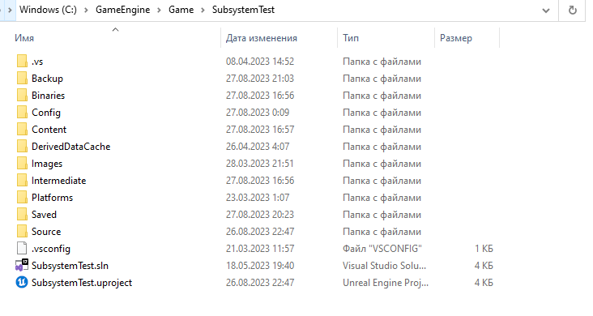
Пути к папкам проекта могут быть получены так:
```cpp
FString ProjectDirectory = FPaths::ProjectDir();
UE_LOG(LogTemp, Warning, TEXT("FilePaths: ProjectDir: %s"),*ProjectDirectory);
FString ProjectConfigDirectory = FPaths::ProjectConfigDir();
UE_LOG(LogTemp, Warning, TEXT("FilePaths: ProjectConfigDir: %s"),*ProjectConfigDirectory);
FString ProjectContentDirectory = FPaths::ProjectContentDir();
UE_LOG(LogTemp, Warning, TEXT("FilePaths: ProjectContentDir: %s"),*ProjectContentDirectory);
FString ProjectIntermediateDirectory = FPaths::ProjectIntermediateDir();
UE_LOG(LogTemp, Warning, TEXT("FilePaths: ProjectIntermediateDirectory: %s"),*ProjectIntermediateDirectory);
FString ProjectLogDirectory = FPaths::ProjectLogDir();
UE_LOG(LogTemp, Warning, TEXT("FilePaths: ProjectLogDir: %s"),*ProjectLogDirectory);
FString ProjectModsDirectory = FPaths::ProjectModsDir();
UE_LOG(LogTemp, Warning, TEXT("FilePaths: ProjectModsDir: %s"),*ProjectModsDirectory);
FString ProjectPluginsDirectory = FPaths::ProjectPluginsDir();
UE_LOG(LogTemp, Warning, TEXT("FilePaths: ProjectPluginsDir: %s"),*ProjectPluginsDirectory);
FString ProjectSavedDirectory = FPaths::ProjectSavedDir();
UE_LOG(LogTemp, Warning, TEXT("FilePaths: ProjectSavedDir: %s"),*ProjectSavedDirectory);
FString ProjectUserDirectory = FPaths::ProjectUserDir();
UE_LOG(LogTemp, Warning, TEXT("FilePaths: ProjectUserDir: %s"),*ProjectUserDirectory);
FString ProjectPersistentDownloadDirectory = FPaths::ProjectPersistentDownloadDir();
UE_LOG(LogTemp, Warning, TEXT("FilePaths: ProjectPersistentDownloadDir: %s"),*ProjectPersistentDownloadDirectory);
FString ProjectPlatformExtensionsDirectory = FPaths::ProjectPlatformExtensionsDir();
UE_LOG(LogTemp, Warning, TEXT("FilePaths: ProjectPlatformExtensionsDir: %s"),*ProjectPlatformExtensionsDirectory);
```
Результат:
```cpp
LogTemp: Warning: FilePaths: ProjectDir: ../../../../Game/SubsystemTest/
LogTemp: Warning: FilePaths: ProjectConfigDir: ../../../../Game/SubsystemTest/Config/
LogTemp: Warning: FilePaths: ProjectContentDir: ../../../../Game/SubsystemTest/Content/
LogTemp: Warning: FilePaths: ProjectIntermediateDirectory: ../../../../Game/SubsystemTest/Intermediate/
LogTemp: Warning: FilePaths: ProjectLogDir: ../../../../Game/SubsystemTest/Saved/Logs/
LogTemp: Warning: FilePaths: ProjectModsDir: ../../../../Game/SubsystemTest/Mods/
LogTemp: Warning: FilePaths: ProjectPluginsDir: ../../../../Game/SubsystemTest/Plugins/
LogTemp: Warning: FilePaths: ProjectSavedDir: ../../../../Game/SubsystemTest/Saved/
LogTemp: Warning: FilePaths: ProjectUserDir: ../../../../Game/SubsystemTest/
LogTemp: Warning: FilePaths: ProjectPersistentDownloadDir: ../../../../Game/SubsystemTest/Saved/PersistentDownloadDir
LogTemp: Warning: FilePaths: ProjectPlatformExtensionsDir: ../../../../Game/SubsystemTest/Platforms/
```
### Доступ к папке `Resources` модуля
```cpp
// this method should form relative path to assets of the plugin / module
static FString InContent(const FString& RelativePath, const ANSICHAR* Extension) {
    // since we work with module:
    static FString ContentDir = FPaths::GameSourceDir() + TEXT("SlateRuntimeModule/Resources/");
    return (ContentDir / RelativePath) + Extension;
}
```
### Доступ к папке `Resources` плагина
```cpp
// this method should form relative path to assets of the plugin / module
static FString InContent(const FString& RelativePath, const ANSICHAR* Extension) {
    // this is how it should work with plugins:
    static FString ContentDir = IPluginManager::Get().FindPlugin(TEXT("StateTreeEditorModule"))->GetContentDir() / TEXT("Resources");
    return (ContentDir / RelativePath) + Extension;
}
```
### Папки движка
Доступ к папкам движка крайне важен для доступа к встроенным в движок ресурсам, например иконкам.
В главе про `Slate` я использую иконки папки `Content` движка.
Если мы откроем папку движка, в моем случае это `\UE_5.1\Engine\Content\Slate\Common\` то увидим множество иконок. К ним можно получать доступ для создания своих стилей.
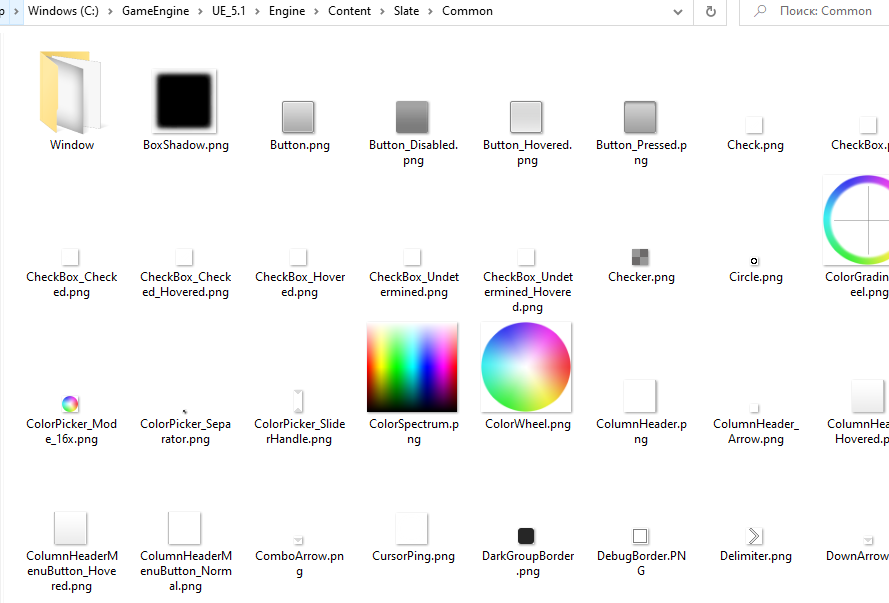
Способы получения пути к различным директориям движка:
```cpp
FString EngineDirectory = FPaths::EngineDir();
UE_LOG(LogTemp, Warning, TEXT("FilePaths: EngineDir: %s"),*EngineDirectory);
FString EngineConfigDirectory = FPaths::EngineConfigDir();
UE_LOG(LogTemp, Warning, TEXT("FilePaths: EngineConfigDir: %s"),*EngineConfigDirectory);
FString EngineContentDirectory = FPaths::EngineConfigDir();
UE_LOG(LogTemp, Warning, TEXT("FilePaths: EngineContentDir: %s"),*EngineContentDirectory);
FString EngineIntermediateDirectory = FPaths::EngineIntermediateDir();
UE_LOG(LogTemp, Warning, TEXT("FilePaths: EngineIntermediateDirectory: %s"),*EngineIntermediateDirectory);
FString EnginePluginsDirectory = FPaths::EnginePluginsDir();
UE_LOG(LogTemp, Warning, TEXT("FilePaths: EnginePluginsDir: %s"),*EnginePluginsDirectory);
FString EngineSavedDirectory = FPaths::EngineSavedDir();
UE_LOG(LogTemp, Warning, TEXT("FilePaths: EngineSavedDir: %s"),*EngineSavedDirectory);
FString EngineUserDirectory = FPaths::EngineUserDir();
UE_LOG(LogTemp, Warning, TEXT("FilePaths: EngineUserDir: %s"),*EngineUserDirectory);
FString EngineDefaultLayoutDir = FPaths::EngineDefaultLayoutDir();
UE_LOG(LogTemp, Warning, TEXT("FilePaths: EngineDefaultLayoutDir: %s"),*EngineDefaultLayoutDir);
FString EnginePlatformExtensionsDir = FPaths::EnginePlatformExtensionsDir();
UE_LOG(LogTemp, Warning, TEXT("FilePaths: EnginePlatformExtensionsDir: %s"),*EnginePlatformExtensionsDir);
FString EngineUserLayoutDir = FPaths::EngineUserLayoutDir();
UE_LOG(LogTemp, Warning, TEXT("FilePaths: EngineUserLayoutDir: %s"),*EngineUserLayoutDir);
```
Результат:
```cpp
LogTemp: Warning: FilePaths: EngineDir: ../../../Engine/
LogTemp: Warning: FilePaths: EngineConfigDir: ../../../Engine/Config/
LogTemp: Warning: FilePaths: EngineContentDir: ../../../Engine/Config/
LogTemp: Warning: FilePaths: EngineIntermediateDirectory: ../../../Engine/Intermediate/
LogTemp: Warning: FilePaths: EnginePluginsDir: ../../../Engine/Plugins/
LogTemp: Warning: FilePaths: EngineSavedDir: C:/Users/USER/AppData/Local/UnrealEngine/5.1/Saved/
LogTemp: Warning: FilePaths: EngineUserDir: C:/Users/USER/AppData/Local/UnrealEngine/5.1/
LogTemp: Warning: FilePaths: EngineDefaultLayoutDir: ../../../Engine/Config/Layouts/
LogTemp: Warning: FilePaths: EnginePlatformExtensionsDir: ../../../Engine/Platforms/
LogTemp: Warning: FilePaths: EngineUserLayoutDir: C:/Users/USER/AppData/Local/UnrealEngine/5.1/Saved/Config/Layouts/
```
## Интерфейс `FPlatformFileManager`
Для прямой работы с файлами в операционной системе движок `Unreal Engine` предоставляет кроссплатформенный интерфейс `FPlatformFileManager`.
```cpp
#include "HAL/PlatformFileManager.h"
//...
FPlatformFileManager& FileManager = FPlatformFileManager::Get();
```
Работа с интерфейсом крайне проста и доступна.
Рассмотрим примеры:
### Directory Exists
Проверка на существование директории выполняется так:
```cpp
#include "HAL/PlatformFileManager.h"
//...
FPlatformFileManager& FileManager = FPlatformFileManager::Get();
// Getting the directory we want to check if it exists
FString MyConfigDirectory = FPaths::ProjectConfigDir() / TEXT("Layouts");
if (FileManager.GetPlatformFile().DirectoryExists(*MyConfigDirectory))
{
    UE_LOG(LogTemp, Warning, TEXT("FilePaths: Directory Exists"));
}
else
{
    UE_LOG(LogTemp, Warning, TEXT("FilePaths: Directory Does not exist"));
}
```
Данный код проверяет существование папки `/Config/Layouts` внутри проекта.
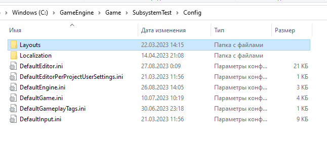
Результат:
```cpp
LogTemp: Warning: FilePaths: Directory Exists
```
### Создание директорий
```cpp
#include "HAL/PlatformFileManager.h"
//...
FPlatformFileManager& FileManager = FPlatformFileManager::Get();
// New Directory path
FString MyConfigDirectory = FPaths::ProjectConfigDir() / TEXT("CustomDirectory");
if (FileManager.GetPlatformFile().CreateDirectory(*MyConfigDirectory))
{
    UE_LOG(LogTemp, Warning, TEXT("FilePaths: Directory was created"));
}
else
{
    UE_LOG(LogTemp, Warning, TEXT("FilePaths: Directory was not created"));
}
```
Данный код создаст директорию `/Config/CustomDirectory` внутри проекта.
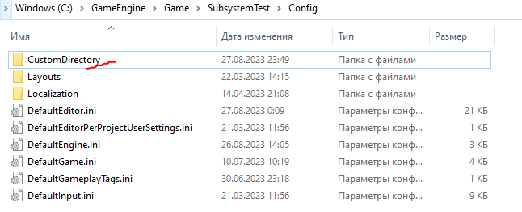
### Создание нескольких директорий подряд
Предыдущий метод не создает подпапки. Если это требуется, можно использовать следующий подход:
```cpp
#include "HAL/PlatformFileManager.h"
//...
// Tree Directory path
FString MyConfigDirectory = FPaths::ProjectConfigDir() / TEXT("CustomDirectoryTree") / TEXT("SubFolder1") / TEXT("SubFolder2");
if (FileManager.GetPlatformFile().CreateDirectoryTree(*MyConfigDirectory))
{
    UE_LOG(LogTemp, Warning, TEXT("FilePaths: Directory was created"));
}
else
{
    UE_LOG(LogTemp, Warning, TEXT("FilePaths: Directory was not created"));
}
```
Данный код создаст древо с вложенными каталогами по пути `/Config/CustomDirectoryTree/SubFolder1/SubFolder2`.
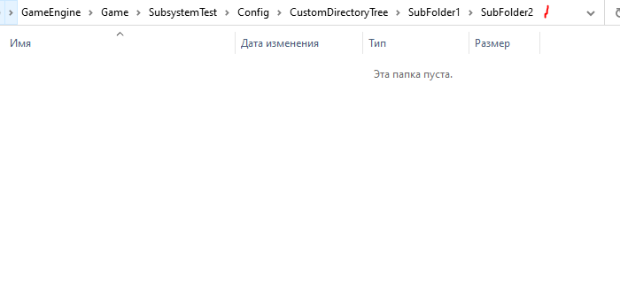
### Удаление директорий
```cpp
#include "HAL/PlatformFileManager.h"
//...
// Directory path
FString MyConfigDirectory = FPaths::ProjectConfigDir() / TEXT("CustomDirectory");
if (FileManager.GetPlatformFile().DeleteDirectory(*MyConfigDirectory))
{
    UE_LOG(LogTemp, Warning, TEXT("FilePaths: Directory was created"));
}
else
{
    UE_LOG(LogTemp, Warning, TEXT("FilePaths: Directory was not created"));
}
```
Данный код удаляет папку `CustomDirectory`.
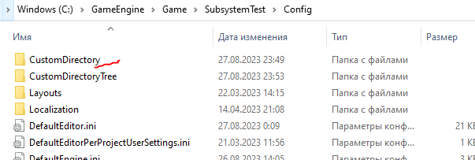
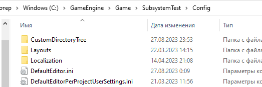
### Рекурсивное удаление директории
Удаляет директорию и все, что в ней есть.
```cpp
#include "HAL/PlatformFileManager.h"
//...
// Directory path
FString MyConfigDirectory = FPaths::ProjectConfigDir() / TEXT("CustomDirectoryTree");
if (FileManager.GetPlatformFile().DeleteDirectoryRecursively(*MyConfigDirectory))
{
    UE_LOG(LogTemp, Warning, TEXT("FilePaths: Directory was created"));
}
else
{
    UE_LOG(LogTemp, Warning, TEXT("FilePaths: Directory was not created"));
}
```
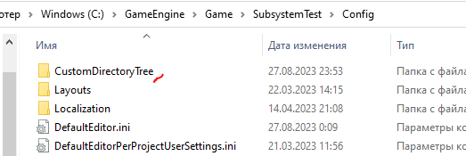
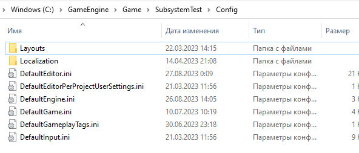
### Вывод всех файлов в директории
```cpp
#include "HAL/PlatformFileManager.h"
//...
struct FDirectoryVisitor : public IPlatformFile::FDirectoryVisitor
{
    //This function is called for every file or directory it finds.
    bool Visit(const TCHAR* FilenameOrDirectory, bool bIsDirectory) override
    {
        // did we find a Directory or a file?
        if (bIsDirectory)
        {
            UE_LOG(LogTemp, Warning, TEXT("FilePaths: Directory found: %s"), FilenameOrDirectory);
        }
        else
        {
            UE_LOG(LogTemp, Warning, TEXT("FilePaths: File Found: %s"), FilenameOrDirectory);
        }
        return true;
    }
};
// make instance of our visitor
FDirectoryVisitor Visitor;
//IPluginManager::Get().FindPlugin(TEXT("StateTreeEditorModule"))
FPlatformFileManager& FileManager = FPlatformFileManager::Get();
// Directory path
FString TargetDirectory = FPaths::ProjectContentDir();
if (FileManager.GetPlatformFile().IterateDirectory(*TargetDirectory, Visitor))
{
    UE_LOG(LogTemp, Warning, TEXT("FilePaths: Directory's or files found"));
}
else
{
    UE_LOG(LogTemp, Warning, TEXT("FilePaths: Directory did not exist or visitor returned false"));
}
```
Данный код напечатает список директорий и файлов в папке `Config` проекта.
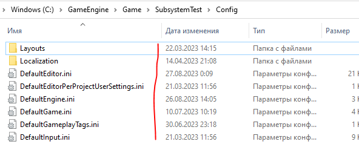
Результат:
```cpp
LogTemp: Warning: FilePaths: File Found: ../../../../Game/SubsystemTest/Config/DefaultEditor.ini
LogTemp: Warning: FilePaths: File Found: ../../../../Game/SubsystemTest/Config/DefaultEditorPerProjectUserSettings.ini
LogTemp: Warning: FilePaths: File Found: ../../../../Game/SubsystemTest/Config/DefaultEngine.ini
LogTemp: Warning: FilePaths: File Found: ../../../../Game/SubsystemTest/Config/DefaultGame.ini
LogTemp: Warning: FilePaths: File Found: ../../../../Game/SubsystemTest/Config/DefaultGameplayTags.ini
LogTemp: Warning: FilePaths: File Found: ../../../../Game/SubsystemTest/Config/DefaultInput.ini
LogTemp: Warning: FilePaths: Directory found: ../../../../Game/SubsystemTest/Config/Layouts
LogTemp: Warning: FilePaths: Directory found: ../../../../Game/SubsystemTest/Config/Localization
LogTemp: Warning: FilePaths: Directory's or files found
```
### Вывод всех файлов в директории, рекурсивно
Предыдущий код может работать рекурсивно, если заменить `IterateDirectory` на `IterateDirectoryRecursively`.
```cpp
#include "HAL/PlatformFileManager.h"
//...
struct FDirectoryVisitor : public IPlatformFile::FDirectoryVisitor
{
    //This function is called for every file or directory it finds.
    bool Visit(const TCHAR* FilenameOrDirectory, bool bIsDirectory) override
    {
        // did we find a Directory or a file?
        if (bIsDirectory)
        {
            UE_LOG(LogTemp, Warning, TEXT("FilePaths: Directory found: %s"), FilenameOrDirectory);
        }
        else
        {
            UE_LOG(LogTemp, Warning, TEXT("FilePaths: File Found: %s"), FilenameOrDirectory);
        }
        return true;
    }
};
// make instance of our visitor
FDirectoryVisitor Visitor;
//IPluginManager::Get().FindPlugin(TEXT("StateTreeEditorModule"))
FPlatformFileManager& FileManager = FPlatformFileManager::Get();
// Directory path
FString TargetDirectory = FPaths::ProjectConfigDir();
if (FileManager.GetPlatformFile().IterateDirectoryRecursively(*TargetDirectory, Visitor))
{
    UE_LOG(LogTemp, Warning, TEXT("FilePaths: Directory's or files found"));
}
else
{
    UE_LOG(LogTemp, Warning, TEXT("FilePaths: Directory did not exist or visitor returned false"));
}
```
Результат:
```cpp
LogTemp: Warning: FilePaths: File Found: ../../../../Game/SubsystemTest/Config/DefaultEditor.ini
LogTemp: Warning: FilePaths: File Found: ../../../../Game/SubsystemTest/Config/DefaultEditorPerProjectUserSettings.ini
LogTemp: Warning: FilePaths: File Found: ../../../../Game/SubsystemTest/Config/DefaultEngine.ini
LogTemp: Warning: FilePaths: File Found: ../../../../Game/SubsystemTest/Config/DefaultGame.ini
LogTemp: Warning: FilePaths: File Found: ../../../../Game/SubsystemTest/Config/DefaultGameplayTags.ini
LogTemp: Warning: FilePaths: File Found: ../../../../Game/SubsystemTest/Config/DefaultInput.ini
LogTemp: Warning: FilePaths: Directory found: ../../../../Game/SubsystemTest/Config/Layouts
LogTemp: Warning: FilePaths: Directory found: ../../../../Game/SubsystemTest/Config/Localization
LogTemp: Warning: FilePaths: File Found: ../../../../Game/SubsystemTest/Config/Localization/Game_Compile.ini
LogTemp: Warning: FilePaths: File Found: ../../../../Game/SubsystemTest/Config/Localization/Game_Export.ini
LogTemp: Warning: FilePaths: File Found: ../../../../Game/SubsystemTest/Config/Localization/Game_ExportDialogueScript.ini
LogTemp: Warning: FilePaths: File Found: ../../../../Game/SubsystemTest/Config/Localization/Game_Gather.ini
LogTemp: Warning: FilePaths: File Found: ../../../../Game/SubsystemTest/Config/Localization/Game_GenerateReports.ini
LogTemp: Warning: FilePaths: File Found: ../../../../Game/SubsystemTest/Config/Localization/Game_Import.ini
LogTemp: Warning: FilePaths: File Found: ../../../../Game/SubsystemTest/Config/Localization/Game_ImportDialogue.ini
LogTemp: Warning: FilePaths: File Found: ../../../../Game/SubsystemTest/Config/Localization/Game_ImportDialogueScript.ini
LogTemp: Warning: FilePaths: Directory's or files found
```
### File Exists
Проверка на существование файла делается так:
```cpp
#include "HAL/PlatformFileManager.h"
//...
FPlatformFileManager& FileManager = FPlatformFileManager::Get();
// File path
FString TargetPath = FPaths::ProjectConfigDir() / TEXT("DefaultEditor.ini");
if (FileManager.GetPlatformFile().FileExists(*TargetPath))
{
    UE_LOG(LogTemp, Warning, TEXT("FilePaths: File found!"));
}
else
{
    UE_LOG(LogTemp, Warning, TEXT("FilePaths: File not found!"));
}
```
Этот код проверяет, есть ли в проекте файл `Config/DefaultEditor.ini`.
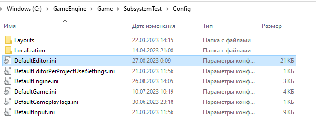
Результат:
```cpp
LogTemp: Warning: FilePaths: File found!
```
### Копирование файла
```cpp
#include "HAL/PlatformFileManager.h"
//...
FPlatformFileManager& FileManager = FPlatformFileManager::Get();
FString SourceFile = FPaths::ProjectConfigDir() / TEXT("DefaultEditor.ini");
FString DestinationFile = FPaths::ProjectConfigDir() / TEXT("DefaultEditor_Copy.ini");
if (FileManager.GetPlatformFile().CopyFile(*DestinationFile, *SourceFile, EPlatformFileRead::None, EPlatformFileWrite::None))
{
    UE_LOG(LogTemp, Warning, TEXT("FilePaths: Copied!"));
}
else
{
    UE_LOG(LogTemp, Warning, TEXT("FilePaths: Failed!"));
}
```
Данный код копирует файл `Config/DefaultEditor.ini` в файл `Config/DefaultEditor_Copy.ini`.
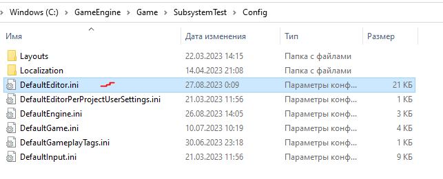
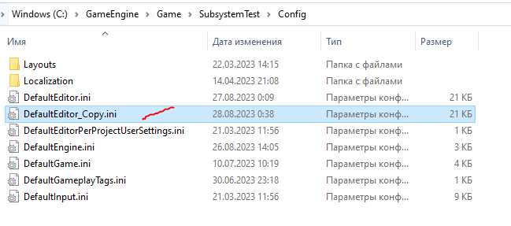
### Перемещение файла
```cpp
#include "HAL/PlatformFileManager.h"
//...
FPlatformFileManager& FileManager = FPlatformFileManager::Get();
FString SourceFile = FPaths::ProjectConfigDir() / TEXT("DefaultEditor_Copy.ini");
FString DestinationFile = FPaths::ProjectConfigDir() / TEXT("TargetLocation") / TEXT("DefaultEditor_Copy.ini");
if (FileManager.GetPlatformFile().MoveFile(*DestinationFile, *SourceFile))
{
    UE_LOG(LogTemp, Warning, TEXT("FilePaths: Moved!"));
}
else
{
    UE_LOG(LogTemp, Warning, TEXT("FilePaths: Failed!"));
}
```
Данный код переместит файл `Config/DefaultEditor_Copy.ini` в папку `Config/TargetLocation/`.
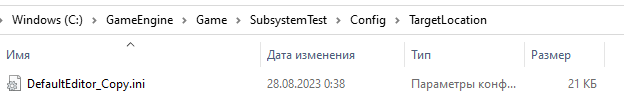
### Удаление файла
```cpp
#include "HAL/PlatformFileManager.h"
//...
FPlatformFileManager& FileManager = FPlatformFileManager::Get();
FString FileLocation = FPaths::ProjectConfigDir() / TEXT("TargetLocation") / TEXT("DefaultEditor_Copy.ini");
if (FileManager.GetPlatformFile().DeleteFile(*FileLocation))
{
    UE_LOG(LogTemp, Warning, TEXT("FilePaths: Deleted!"));
}
else
{
    UE_LOG(LogTemp, Warning, TEXT("FilePaths: Failed!"));
}
```
Данный код удалит файл `Config/TargetLocation/DefaultEditor_Copy.ini`.
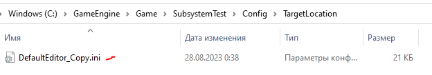

### Размер файла
```cpp
#include "HAL/PlatformFileManager.h"
//...
FPlatformFileManager& FileManager = FPlatformFileManager::Get();
FString FileLocation = FPaths::ProjectConfigDir() / TEXT("DefaultEditor.ini");
int FileSize = FileManager.GetPlatformFile().FileSize(*FileLocation);
if (FileSize != -1)
{
    UE_LOG(LogTemp, Warning, TEXT("FilePaths: File Size: %d bytes"), FileSize);
}
else
{
    UE_LOG(LogTemp, Warning, TEXT("FilePaths: File Not Found!"));
}
```
Данный код напечатает в лог размер файла `Config/DefaultEditor.ini` в байтах.
```cpp
LogTemp: Warning: FilePaths: File Size: 20915
```
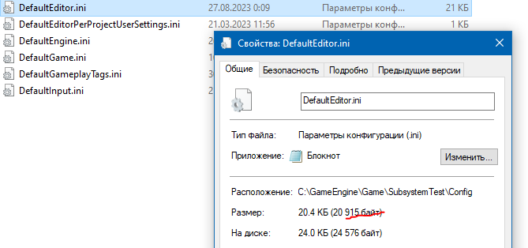
### Чтение из файла
Читать данные из файла можно при помощи интерфейса `FFileHelper`. Причем можно извлекать данные как в бинарном виде, так и в виде строки.
```cpp
#include "HAL/PlatformFileManager.h"
//...
FPlatformFileManager& FileManager = FPlatformFileManager::Get();
FString FilePath = FPaths::ProjectConfigDir() / TEXT("DefaultEditor.ini");
if (FileManager.GetPlatformFile().FileExists(*FilePath))
{
    UE_LOG(LogTemp, Warning, TEXT("FilePaths: File found!"));
    FString FileContent;
    FFileHelper::LoadFileToString(FileContent,*FilePath);
    UE_LOG(LogTemp, Warning, TEXT("FileContent:\n%s"), *FileContent);
}
else
{
    UE_LOG(LogTemp, Warning, TEXT("FilePaths: File not found!"));
}
```
Приведенный выше код напечатает в лог содержимое файла `Config/DefaultEditor.ini`.
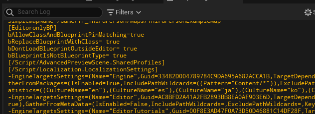
### Запись текста в файл
```cpp
#include "HAL/PlatformFileManager.h"
//...
FPlatformFileManager& FileManager = FPlatformFileManager::Get();
FString FilePath = FPaths::ProjectConfigDir() / TEXT("MyFile.txt");
if (IFileHandle* FileHandle = FileManager.GetPlatformFile().OpenWrite(*FilePath))
{
    FString Guid = FString(
        TEXT("// This file is written to disk\n")
        TEXT("// GUID = "))
        + FGuid::NewGuid().ToString();
    FileHandle->Write((const uint8*)TCHAR_TO_ANSI(*Guid), Guid.Len());
    delete FileHandle;
}
```
Приведенный выше код запишет текст в файл `Config/MyFile.txt`. Если файла нет - он будет создан автоматически.
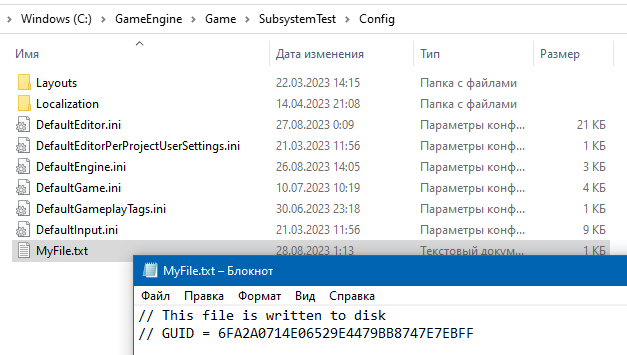
### Запись бинарных данных в файл
Для записи бинарных данных, автор статьи с вики рекомендует использовать тип `uint8`. На всякий случай, предлагаю не отходить от его реализации.
```cpp
#include "HAL/PlatformFileManager.h"
//...
FPlatformFileManager& FileManager = FPlatformFileManager::Get();
FString FilePath = FPaths::ProjectConfigDir() / TEXT("MyArrayBytes");
if (IFileHandle* FileHandle = FileManager.GetPlatformFile().OpenWrite(*FilePath))
{
    int DataArray[] = {5, 3, 7}; // int array
    uint8* ByteBuffer = reinterpret_cast<uint8*>(&DataArray); // cast memory to uint8
    // Write the bytes to the file
    FileHandle->Write(ByteBuffer, sizeof(int)*3);
    // Close the file again
    delete FileHandle;
}
```
Приведенный выше код записывает массив типа `TArray<int>` в файл `Config/MyArrayBytes`.
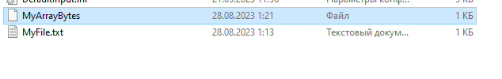
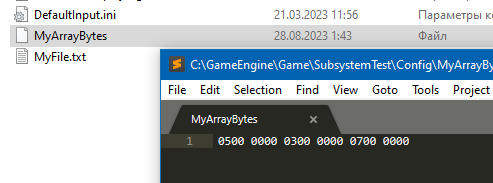
### Чтение бинарных данных из файла
Давайте считаем данные из предыдущего файла снова в массив типа `TArray`.
```cpp
#include "HAL/PlatformFileManager.h"
//...
FPlatformFileManager& FileManager = FPlatformFileManager::Get();
FString FilePath = FPaths::ProjectConfigDir() / TEXT("MyArrayBytes");
if (IFileHandle* FileHandle = FileManager.GetPlatformFile().OpenRead(*FilePath))
{
    ULONG size = sizeof(int) * 3; // all what we need to know is exact size of data in the file
    // allocate buffer for 3 items of TArray<>
    uint8* ByteBuffer = (uint8*)malloc(size);
    // read byres to buffer
    FileHandle->Read(ByteBuffer, size);
    // cast buffer to required type
    int* DataArray = reinterpret_cast<int*>(ByteBuffer);
    for (int i = 0; i < 3; i++) {
        int item = DataArray[i];
        UE_LOG(LogTemp, Warning, TEXT("Array Item = %d\n"), item);
    }
    // free memory
    free(ByteBuffer);
    delete FileHandle;
}
```
В этом коде я читаю данные из файла `Config/MyArrayBytes`. В предыдущей главе я записал в этот файл 3 числа - `5, 3, 7`.
Результат считывания:
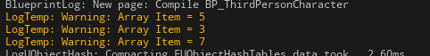
