# Глобальная шина событий
Глобальная шина событий позволяет обмениваться событиями между не связанными друг с другом классами.
Например, используя такую шину, можно связать между собой кнопку интерфейса и лампочку на уровне. Не мучаясь с передачей ссылки на лампочку. Напрямую.
## Подготовка к работе
Предлагаю создать под наши цели отдельный модуль - `EventBusModule`.
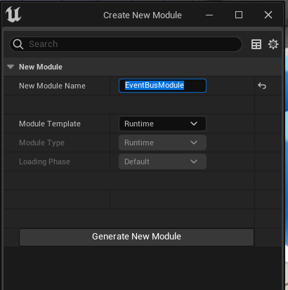
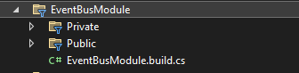
Поскольку события я собираюсь категоризировать по тегам, предлагаю добавить в зависимости  модуля пункт `GameplayTags`.
Открываем файл `EventBusModule.build.cs` и дополняем следующим образом:
```cpp
using UnrealBuildTool;
public class EventBusModule : ModuleRules
{
	public EventBusModule(ReadOnlyTargetRules Target) : base(Target)
	{
        PCHUsage = PCHUsageMode.UseExplicitOrSharedPCHs;
		PublicDependencyModuleNames.AddRange(new string[] { "Core", "CoreUObject", "Engine"});
        PrivateDependencyModuleNames.AddRange(new string[] { "GameplayTags" });
        PublicIncludePaths.AddRange(new string[] {"EventBusModule/Public"});
		PrivateIncludePaths.AddRange(new string[] {"EventBusModule/Private"});
	}
}
```
## Добавляем подсистему
Шина событий будет работать на основе `WorldSubsystem`, потому что обратиться к подсистеме этого типа можно из любого объекта на уровне. При условии, что там есть доступ к `GetWorld()`.
Создаем класс подсистемы `Tools -> New C++ Class -> All Classes -> WorldSubsystem`.
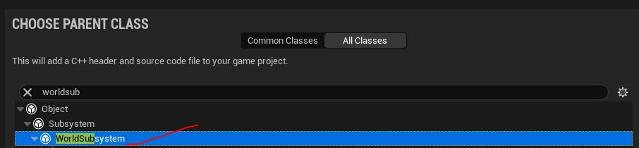
Называем подсистему `EventBusSubsystem` и добавляем в модуль `EventBusModule`.
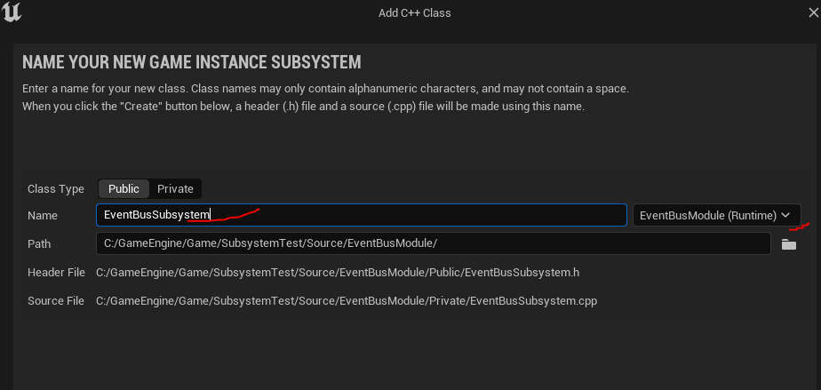
После добавления файла - выполните команду `Tools -> Refresh Visual Studio 2022 Project`, чтобы обновить проект в `Solution Explorer`.
Давайте объясню вам идею. Мы не собираемся создавать новое событие, каждый раз, как хотим что-то вызывать. Вместо этого мы будем вызывать одно и то-же событие, но с разными метками. При этом прямой привязки к событию я делать не буду. Вместо этого, для привязки будет использоваться нода типа `AsyncAction`.
Переходим к написанию кода. Нам понадобится `Dynamic` делегат с одним параметром, который принимает `FGameplayTag`.
Так-же нам нужен всего один метод внутри подсистемы. Он будет вызывать событие по тегу.
```cpp
//.h
#pragma once
#include "CoreMinimal.h"
// kismet
#include "Kismet/KismetSystemLibrary.h"
// ACharacter class refrence
#include "GameFramework/Character.h"
// root class
#include "Subsystems/WorldSubsystem.h"
// Gameplay Tags
#include "NativeGameplayTags.h"
// .generated.h
#include "EventBusSubsystem.generated.h"
UE_DECLARE_GAMEPLAY_TAG_EXTERN(TAG_EVENTS)
UE_DECLARE_GAMEPLAY_TAG_EXTERN(TAG_EVENTS_ALL)
// this delegate will handle bind logics
DECLARE_DYNAMIC_MULTICAST_DELEGATE_OneParam(FBusSubsystemEvent, FGameplayTag, Tag);
/**
 * Event Bus Game Instance Subsystem
 */
UCLASS(ClassGroup = "EventBus", meta = (Keywords = "subsystem, event")) // to simplify search of this subsystem's bp node
class EVENTBUSMODULE_API UEventBusSubsystem : public UWorldSubsystem
{
	GENERATED_BODY()
public:
	// this will broadcast given tag to all listeners
	UFUNCTION(BlueprintCallable, Category = "Operations", Meta=(EventTag="Events.All"))
	void CallEvent(UPARAM(meta=(Categories = "Events")) FGameplayTag EventTag);
private:
	FBusSubsystemEvent Event;
};
//...
//.cpp
// Fill out your copyright notice in the Description page of Project Settings.
#include "EventBusSubsystem.h"
UE_DEFINE_GAMEPLAY_TAG(TAG_EVENTS, "Events");
UE_DEFINE_GAMEPLAY_TAG(TAG_EVENTS_ALL, "Events.All");
// this will broadcast given tag to all listeners
void UEventBusSubsystem::CallEvent(FGameplayTag EventTag)
{
	Event.Broadcast(EventTag);
}
```
Это не конечный вариант подсистемы. Я планирую добавить сюда `friend` класс, чтобы открыть доступ каждой из `AsyncAction` нод к `private` параметру `FBusSubsystemEvent Event`. Без ключевого слова `friend` сделать это не получится, а прямой доступ  к переменной `Event` я открывать не хочу.
## Добавляем `Async Action` для отслеживания событий
Одним из преимуществ нод типа `Async Action` является возможность отслеживания и привязки к делегатам. Мы воспользуемся этим преимуществом.
Идем `Tools -> New C++ Class -> BlueprintAsyncActionBase`.
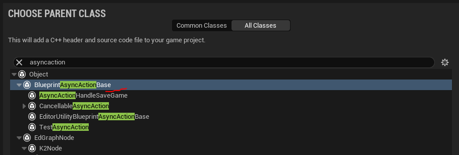
Называем класс `EventBusAsyncAction`.
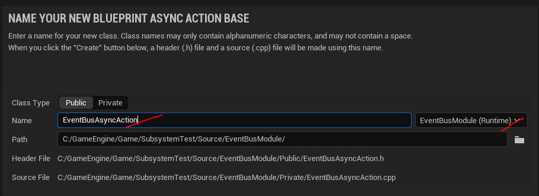
В асинхронном действии мы будем отслеживать срабатывание события `Event` внутри подсистемы `EventBus`. Когда событие срабатывает с тегом, к которому привязана конкретная нода асинхронного действия - будет активироваться единственный дополнительный пин этого действия.
```cpp
// Fill out your copyright notice in the Description page of Project Settings.
#pragma once
#include "CoreMinimal.h"
#include "Kismet/BlueprintAsyncActionBase.h"
// kismet
#include "Kismet/KismetSystemLibrary.h"
#include "Kismet/GameplayStatics.h"
// subsystem
#include "EventBusSubsystem.h"
// Gameplay Tags
#include "NativeGameplayTags.h"
// .generated.h
#include "EventBusAsyncAction.generated.h"
DECLARE_DYNAMIC_MULTICAST_DELEGATE(FEventCalledPin);
/**
 * Async Action Boilerplate
 */
UCLASS(ClassGroup = "EventBus", meta = (Keywords = "subsystem, event")) // to simplify search of this subsystem's bp node
class EVENTBUSMODULE_API UEventBusAsyncAction : public UBlueprintAsyncActionBase
{
	GENERATED_BODY()
public:
	// Output Pins
	UPROPERTY(BlueprintAssignable)
	FEventCalledPin OnEventCalled;
	// Main Logics go here
	virtual void Activate() override {
		AActor* Owner = GetNodeOwner();
		if (Owner == nullptr) return;
		UEventBusSubsystem* BusSubsystem = WorldContextObject->GetWorld()->GetSubsystem<UEventBusSubsystem>();
		if (BusSubsystem == nullptr){
			UE_LOG(LogTemp, Warning, TEXT("No Subsystem"))
			return;
		}
		FScriptDelegate Delegate;
		Delegate.BindUFunction(this, "OnEventTriggered");
		BusSubsystem->Event.Add(Delegate);
	}
	// Callback for delegate
	UFUNCTION(BlueprintCallable)
	void OnEventTriggered(FGameplayTag EventTag) {
		// call OnEventCalled pin if event triggered with tag, that we waiting for
		if (EventTag == WaitForTag || EventTag == TAG_EVENTS_ALL) {
			OnEventCalled.Broadcast(); // Call pin
		}
	}
	// this function will create async action
	// each static function in this section can work as separate async action with same pins amount
	UFUNCTION(BlueprintCallable, Category = "Tags Component", meta = (BlueprintInternalUseOnly = "true", WorldContext = "WorldContextObject"))
	static UEventBusAsyncAction* WaitForEvent(UObject* WorldContextObject, UPARAM(meta = (Categories = "Events")) FGameplayTag EventTag ) {
		UEventBusAsyncAction* BlueprintNode = NewObject<UEventBusAsyncAction>(); // construct async action
		// Set internal class variables. Can't be done otherwise since function is static.
		BlueprintNode->WorldContextObject = WorldContextObject;
		BlueprintNode->WaitForTag = EventTag;
		return BlueprintNode;
	}
private:
	// variables
	// world context
	UObject* WorldContextObject;
	// tag we waiting for
	FGameplayTag WaitForTag;
	// helper functions
	// search for owner actor that contains thhs node
	// works both for actor or actor component
	inline AActor* GetNodeOwner() {
		AActor* Owner = Cast<AActor>(WorldContextObject);
		if (Owner == nullptr) {
			UActorComponent* OwningComponent = Cast<UActorComponent>(WorldContextObject);
			if (OwningComponent == nullptr) return nullptr; // node called not in actor and not in actor component
			Owner = OwningComponent->GetOwner();
		}
		return Owner;
	}
};
```
Так-же нам надо дополнить код подсистемы, зарегистрировав класс асинхронного действия как `friend`, чтобы он имел доступ к `private` полю `Event`.
Добавляем в `private` секцию класса `UEventBusSubsystem` строку:
```cpp
friend class UEventBusAsyncAction; // allow to UEventBusAsyncAction access private fields of this class
```
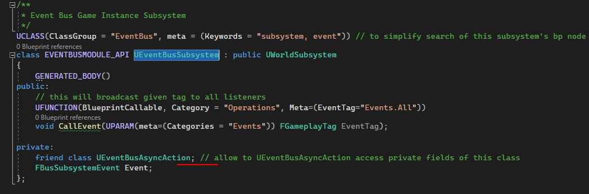
## Тестирование
В подсистеме у нас есть функция `CallEvent`. Ее я буду вызывать по нажатию клавиши `1` из класса `BP_ThirdPersonCharacter`.
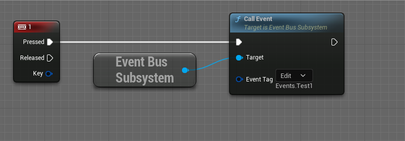
Это будет генерировать событие с тегом `Events.Test1`.
Данное событие я буду отслеживать в классе `BP_TestRefrenceActor`, который находится на игровом уровне и никак напрямую не связан с персонажем, вызывающим событие.
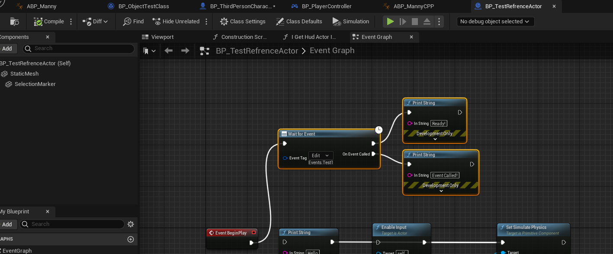
Событие успешно обрабатывается.
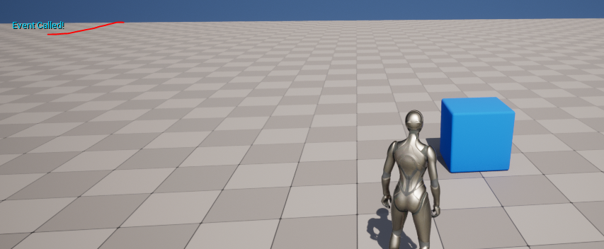
Логика работает.
## Код модуля
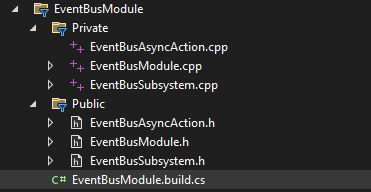
Привожу полный код всех файлов модуля.
### Файл `EventBusModule.build.cs`
```cpp
using UnrealBuildTool;
public class EventBusModule : ModuleRules
{
	public EventBusModule(ReadOnlyTargetRules Target) : base(Target)
	{
        PCHUsage = PCHUsageMode.UseExplicitOrSharedPCHs;
		PublicDependencyModuleNames.AddRange(new string[] { "Core", "CoreUObject", "Engine"});
        PrivateDependencyModuleNames.AddRange(new string[] { "GameplayTags" });
        PublicIncludePaths.AddRange(new string[] {"EventBusModule/Public"});
		PrivateIncludePaths.AddRange(new string[] {"EventBusModule/Private"});
	}
}
```
### Файл `EventBusSubsystem.h`
```cpp
#pragma once
#include "CoreMinimal.h"
// kismet
#include "Kismet/KismetSystemLibrary.h"
// ACharacter class refrence
#include "GameFramework/Character.h"
// root class
#include "Subsystems/WorldSubsystem.h"
// Gameplay Tags
#include "NativeGameplayTags.h"
// .generated.h
#include "EventBusSubsystem.generated.h"
UE_DECLARE_GAMEPLAY_TAG_EXTERN(TAG_EVENTS)
UE_DECLARE_GAMEPLAY_TAG_EXTERN(TAG_EVENTS_ALL)
// this delegate will handle bind logics
DECLARE_DYNAMIC_MULTICAST_DELEGATE_OneParam(FBusSubsystemEvent, FGameplayTag, Tag);
/**
 * Event Bus Game Instance Subsystem
 */
UCLASS(ClassGroup = "EventBus", meta = (Keywords = "subsystem, event")) // to simplify search of this subsystem's bp node
class EVENTBUSMODULE_API UEventBusSubsystem : public UWorldSubsystem
{
	GENERATED_BODY()
public:
	// this will broadcast given tag to all listeners
	UFUNCTION(BlueprintCallable, Category = "Operations", Meta=(EventTag="Events.All"))
	void CallEvent(UPARAM(meta=(Categories = "Events")) FGameplayTag EventTag);
private:
	friend class UEventBusAsyncAction; // allow to UEventBusAsyncAction access private fields of this class
	FBusSubsystemEvent Event;
};
```
### Файл `EventBusSubsystem.cpp`
```cpp
#include "EventBusSubsystem.h"
UE_DEFINE_GAMEPLAY_TAG(TAG_EVENTS, "Events");
UE_DEFINE_GAMEPLAY_TAG(TAG_EVENTS_ALL, "Events.All");
// this will broadcast given tag to all listeners
void UEventBusSubsystem::CallEvent(FGameplayTag EventTag)
{
	Event.Broadcast(EventTag);
}
```
### Файл `EventBusAsyncAction.h`
```cpp
// Fill out your copyright notice in the Description page of Project Settings.
#pragma once
#include "CoreMinimal.h"
#include "Kismet/BlueprintAsyncActionBase.h"
// kismet
#include "Kismet/KismetSystemLibrary.h"
#include "Kismet/GameplayStatics.h"
// subsystem
#include "EventBusSubsystem.h"
// Gameplay Tags
#include "NativeGameplayTags.h"
// .generated.h
#include "EventBusAsyncAction.generated.h"
DECLARE_DYNAMIC_MULTICAST_DELEGATE(FEventCalledPin);
/**
 * Async Action Boilerplate
 */
UCLASS(ClassGroup = "EventBus", meta = (Keywords = "subsystem, event")) // to simplify search of this subsystem's bp node
class EVENTBUSMODULE_API UEventBusAsyncAction : public UBlueprintAsyncActionBase
{
	GENERATED_BODY()
public:
	// Output Pins
	UPROPERTY(BlueprintAssignable)
	FEventCalledPin OnEventCalled;
	// Main Logics go here
	virtual void Activate() override {
		AActor* Owner = GetNodeOwner();
		if (Owner == nullptr) return;
		UEventBusSubsystem* BusSubsystem = WorldContextObject->GetWorld()->GetSubsystem<UEventBusSubsystem>();
		if (BusSubsystem == nullptr){
			UE_LOG(LogTemp, Warning, TEXT("No Subsystem"))
			return;
		}
		FScriptDelegate Delegate;
		Delegate.BindUFunction(this, "OnEventTriggered");
		BusSubsystem->Event.Add(Delegate);
	}
	// Callback for delegate
	UFUNCTION(BlueprintCallable)
	void OnEventTriggered(FGameplayTag EventTag) {
		// call OnEventCalled pin if event triggered with tag, that we waiting for
		if (EventTag == WaitForTag || EventTag == TAG_EVENTS_ALL) {
			OnEventCalled.Broadcast(); // Call pin
		}
	}
	// this function will create async action
	// each static function in this section can work as separate async action with same pins amount
	UFUNCTION(BlueprintCallable, Category = "Tags Component", meta = (BlueprintInternalUseOnly = "true", WorldContext = "WorldContextObject"))
	static UEventBusAsyncAction* WaitForEvent(UObject* WorldContextObject, UPARAM(meta = (Categories = "Events")) FGameplayTag EventTag ) {
		UEventBusAsyncAction* BlueprintNode = NewObject<UEventBusAsyncAction>(); // construct async action
		// Set internal class variables. Can't be done otherwise since function is static.
		BlueprintNode->WorldContextObject = WorldContextObject;
		BlueprintNode->WaitForTag = EventTag;
		return BlueprintNode;
	}
private:
	// variables
	// world context
	UObject* WorldContextObject;
	// tag we waiting for
	FGameplayTag WaitForTag;
	// helper functions
	// search for owner actor that contains thhs node
	// works both for actor or actor component
	inline AActor* GetNodeOwner() {
		AActor* Owner = Cast<AActor>(WorldContextObject);
		if (Owner == nullptr) {
			UActorComponent* OwningComponent = Cast<UActorComponent>(WorldContextObject);
			if (OwningComponent == nullptr) return nullptr; // node called not in actor and not in actor component
			Owner = OwningComponent->GetOwner();
		}
		return Owner;
	}
};
```
### Файл `EventBusModule.h`
```cpp
#pragma once
#include "Modules/ModuleManager.h"
DECLARE_LOG_CATEGORY_EXTERN(EventBusModule, All, All);
class FEventBusModule : public IModuleInterface
{
	public:
	/* Called when the module is loaded */
	virtual void StartupModule() override;
	/* Called when the module is unloaded */
	virtual void ShutdownModule() override;
};
```
### Файл `EventBusModule.cpp`
```cpp
#include "EventBusModule.h"
DEFINE_LOG_CATEGORY(EventBusModule);
#define LOCTEXT_NAMESPACE "FEventBusModule"
void FEventBusModule::StartupModule()
{
	UE_LOG(EventBusModule, Warning, TEXT("EventBusModule module has been loaded"));
}
void FEventBusModule::ShutdownModule()
{
	UE_LOG(EventBusModule, Warning, TEXT("EventBusModule module has been unloaded"));
}
#undef LOCTEXT_NAMESPACE
IMPLEMENT_MODULE(FEventBusModule, EventBusModule)
```