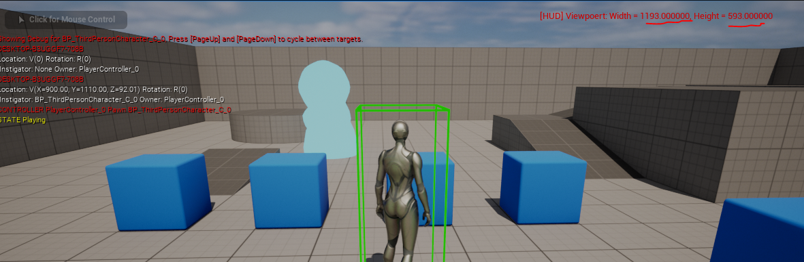

# HUD или Heads-up Display
`HUD` — это базовый объект, используемый, для низкоуровневой отрисовки геометрии на экране пользователя.
Раньше, до появления системы `Slate` именно `HUD` служил для отрисовки элементов игрового интерфейса. В современной разработке данный объект используют для вывода отладочной информации, а так-же для вспомогательных функций в некоторых играх, особенно в РТС(стратегиях).
Чаще всего `HUD` используется в РТС для:
 * выделения персонажей на экране
 * высокопроизводительного отображения полосок здоровья на группах персонажей без применения виджетов
 * отображения цифр урона над персонажами
Эти особенности класса мы и рассмотрим.
## Подготовка к работе
Добавляем новый модуль `HudInfoModule`.

Теперь нужен, собственно, класс `Hud'a`. По своей сущности `Hud` это `Actor`, то есть `AHud` будет родительским классом.
Идем `Tools-> New c++ Class -> AllClasses` ищем в списке `AHud`.

Называем класс `InfoHUD`.

После добавления файла не забудьте выполнить команду `Tools-> Refresh Visual Studio 2022 Project`, чтобы изменения проекта появились в `Solution Explorer`.

Теперь мы можем установить класс нашего `Hud'а` в `Game Mode` проекта.
Для шаблона `Third Person` найти `Game Mode` можно по пути `/ThirdPerson/Blueprints/BP_ThirdPersonGameMode`.

Открываем, ищем строчку `HUD`, меняем на `InfoHUD`.

Теперь созданный нами `Hud` будет загружаться, при запуске проекта.
## Обзор возможностей класса `AHUD`
Исходники класса `AHUD` можно найти по адресу `C:\GameEngine\UE_5.1\Engine\Source\Runtime\Engine\Classes\GameFramework\HUD.h`.

Код класса крайне хороше документирован, поэтому рекомендую ознакомиться.
В заголовке написано, что класс `AHUD` содержит два холста. Один для отрисовки элементов в реальном времени, второй - для отрисовки элементов во время отладки. Так-же в классе присутствует функционал по обработке пользовательских кликов. Помимо этого `HUD` умеет рендерить текст, текстуры, материалы и графические примитивы.
Это низкоуровневый интерфейс, он не предоставляет виджетов.
Основные методы для отрисовки это:
`DrawHUD()` - основной метод отрисовки. Этот метод переопределяется в унаследованных от `AHUD` классах. Он срабатывает каждое обновление экрана.
`ShowDebugInfo()` - метод отрисовки, используемый для показа отладочной информации. Этот метод переопределяется в унаследованных от `AHUD` классах. Отладочная информация в `HUD` может быть выведена консольной командой `showdebug` или через вызов метода `ShowDebug()`.
Основные вспомогательные методы это:
`ShowHUD()` - показывает или скрывает `HUD`.
`ShowDebug(FName DebugType)` - показывает выбранную категорию отладки. По умолчанию категории отладки такие:
```cpp
namespace ShowDebugNames
{
	static const FName Reset(TEXT("Reset"));
	static const FName HitBox(TEXT("HitBox"));
	static const FName Animation(TEXT("Animation"));
	static const FName Physics(TEXT("Physics"));
}
```

Объект `AHUD` является суб объектом для класса `APlayerController`.


Поэтому, для получения ссылки на текущий `HUD` можно использовать следующий код:
```cpp
AInfoHUD* HUD = UGameplayStatics::GetPlayerController(this, 0)->GetHUD<AInfoHUD>();
```
В `blueprint` коде все тоже сводится к нодам `GetPlayerController` и `GetHUD`.

## Расширение класса полезными функциями
Для начала нужен безопасный доступ указателю `ULocalPlayer*`.
```cpp
// Local Player Ref
ULocalPlayer* AInfoHUD::GetLocalPlayer()
{
	return GetOwningPlayerController() ? Cast<ULocalPlayer>(GetOwningPlayerController()->Player) : nullptr;
}
```
Теперь реализуем доступ к размеру экрана, потому что стандартный метод `GetViewportSize` работает со ссылками и не очень удобен.
```cpp
// Viewport Size
FVector2D AInfoHUD::GetViewportSize()
{
	int XVSize, YVSize = 0;
	// viewport size
	if(PlayerOwner != nullptr){
		PlayerOwner->GetViewportSize(XVSize, YVSize);
	}
	FVector2D VS{};
	return FVector2D{ (double)XVSize , (double)YVSize};
}
```
## Отображение информации в `ShowDebugInfo`
Метод `ShowDebugInfo` позволяет каждый цикл обновления экрана рисовать на этом экране ту или иную информацию.
Реализация метода выглядит так:
```cpp
// Render Debug info
void AInfoHUD::ShowDebugInfo(float& YL, float& YPos)
{}
```
Для начала, предлагаю написать код, который будет выводить в правом верхнем углу экрана текущее разрешение этого самого экрана.
```cpp
// Render Debug info
void AInfoHUD::ShowDebugInfo(float& YL, float& YPos)
{
	Super::ShowDebugInfo(YL, YPos); // call parent
	const FVector2D VS = GetViewportSize();
	FString Log = FString::Printf(TEXT("[HUD] Viewpoert: Width = %f, Height = %f"), (float)VS.X, (float)VS.Y);
	// Getting String size in pixels
	int XSize, YSize = 0;
	StringSize(GEngine->GetMediumFont(), XSize, YSize, *Log);
	// Drawing string in right upper corner with offset of 50 from right and 1 letter(YSize) from top
	DrawText(Log,FColor::Red, VS.X- XSize-50, YSize, GEngine->GetMediumFont());
	//GEngine->AddOnScreenDebugMessage(-1, 0.f, FColor::Red, FString::Printf(TEXT("[HUD] Viewpoert: Width = %f, Height = %f"), (float)VS.X, (float)VS.Y));
	//UE_LOG(LogTemp, Warning, TEXT("[HUD] Viewpoert: Width = %f, Height = %f"), (float)VS.X, (float)VS.Y)
}
```

В приведенном выше коде я использовал метод `DrawText` для отрисовки текста одним из системных шрифтов. Я использовал встроенный метод `StringSize` для получения размера строки, чтобы отрисовать с корректным отступами.
Сами отступы строятся по следующей логике:
Отступ по оси X:
```cpp
VS.X - XSize-50
```
Тут берется размер экрана по горизонтали в пикселях `VS.X` из него вычетается размер строки `XSize`. Это позволяет получить позицию для отрисовки строки в правом углу экрана.

Цифра 50 это отступ от правого угла экрана в 50 пикселей.
Отступ по оси Y:
```cpp
YSize
```
Это просто размер строки по оси Y. Мы делаем отступ в 1 строку сверху экрана.
Давайте протестируем.
Поскольку мы отрисовываем информацию в отладочном слое, для ее вывода напишите в консоли `~` команду `showdebug`. Это приведет к появлению отладочной информации.


Изменение размера экрана - меняет значения в логе.

Чтобы лог пропал снова - отправьте `showdebug` в консоль.
### Рисование геометрических примитивов
Теперь давайте рассмотрим рисование примитивной геометрии. Для начала можно обвести наше сообщение из лога квадратной рамкой.
Для этого можно использовать следующий код:
```cpp
// Make Rectangle around text
const float RectOffset = 10.0f;
FVector2D BoxStartPoint{ // upper point
    TextCoordinates.X - RectOffset,
    TextCoordinates.Y - RectOffset
};
FVector2D BoxEndPoint{ // lower point
    TextCoordinates.X + XTSize + RectOffset,
    TextCoordinates.Y + YTSize + RectOffset
};
DrawDebugCanvas2DBox(DebugCanvas, FBox2D{ BoxStartPoint, BoxEndPoint }, FLinearColor::Blue, 1.f);
```
Этот код отрисует прямоугольник между двумя точками - верхней и нижней.

Помимо рисования прямоугольников, можно рисовать и другие примитивы, но их вы сумеете рассмотреть самостоятельно. Я же покажу только линию. Умение рисовать линии одно из ключевых, потому что и прямоугольники и любые другие фигуры, но что самое главное - графики(если вдруг соберетесь их рисовать) строятся из линий.
Добавим под наш прямоугольник линию подчеркивания, используя метод `Draw2DLine`.
```cpp
const float LineOffset = 5.0f;
Draw2DLine(
    TextCoordinates.X - RectOffset,
    TextCoordinates.Y + YTSize + RectOffset + LineOffset,
    TextCoordinates.X + XTSize + RectOffset,
    TextCoordinates.Y + YTSize + RectOffset + LineOffset,
    FColor::Magenta
);
```
Итоговый код функции будет таким:
```cpp
// Render Debug info
void AInfoHUD::ShowDebugInfo(float& YL, float& YPos)
{
	Super::ShowDebugInfo(YL, YPos); // call parent
	const FVector2D VS = GetViewportSize();
	// Log Text
	FString Log = FString::Printf(TEXT("[HUD] Viewpoert: Width = %f, Height = %f"), (float)VS.X, (float)VS.Y);
	// Getting String size in pixels
	int XTSize, YTSize = 0;
	StringSize(GEngine->GetMediumFont(), XTSize, YTSize, *Log);
	// Drawing string in right upper corner with offset of 50 from right and 1 letter(YSize) from top
	FVector2D TextCoordinates{ (double)(VS.X - XTSize - 50.0), (double) YTSize };
	DrawText(Log, FColor::Red, TextCoordinates.X, TextCoordinates.Y, GEngine->GetMediumFont());
	// Make Rectangle around text
	const float RectOffset = 10.0f;
	FVector2D BoxStartPoint{ // upper point
		TextCoordinates.X - RectOffset,
		TextCoordinates.Y - RectOffset
	};
	FVector2D BoxEndPoint{ // lower point
		TextCoordinates.X + XTSize + RectOffset,
		TextCoordinates.Y + YTSize + RectOffset
	};
	DrawDebugCanvas2DBox(DebugCanvas, FBox2D{ BoxStartPoint, BoxEndPoint }, FLinearColor::Blue, 1.f);
	const float LineOffset = 5.0f;
	Draw2DLine(
		TextCoordinates.X - RectOffset,
		TextCoordinates.Y + YTSize + RectOffset + LineOffset,
		TextCoordinates.X + XTSize + RectOffset,
		TextCoordinates.Y + YTSize + RectOffset + LineOffset,
		FColor::Magenta
	);
	//GEngine->AddOnScreenDebugMessage(-1, 0.f, FColor::Red, FString::Printf(TEXT("[HUD] Viewpoert: Width = %f, Height = %f"), (float)VS.X, (float)VS.Y));
	//UE_LOG(LogTemp, Warning, TEXT("[HUD] Viewpoert: Width = %f, Height = %f"), (float)VS.X, (float)VS.Y)
}
```

### `Draw3DLine`
Метод `Draw3DLine` позволяет нарисовать линию в 3D пространстве аналогичную той, которая нарисовалась бы при `Line Trace`.
```cpp
Draw3DLine(FVector{1150.f, 1350.f, 50.f}, FVector{ 1150.f, 950.0f, 50.f }, FColor::Red);
```
Данный код проведет линию от одной точки до другой в 3D пространстве.

Координаты, которые я использовал для отрисовки линии, взяты напрямую от двух синих кубиков на сцене. Линия проводится между ними и отображается в 3D пространстве, отвязанном от `HUD`.
## Взаимодействие с элементами `HUD`
Поскольку каждый раз вбивать в консоль команду `showdebug` - весьма утомительно, а система `HUD` позволяет создание интерактивной геометрии, предлагаю сделать кнопку, по нажатию которой показывалась бы отладочная информация.
Кнопку эту мы будем показывать  как в основном холсте отрисовки, то есть в методе `DrawHUD`, так и в холсте отладки. Поэтому нам понадобится отдельный метод, в котором будет осуществлятсья отрисовка кнопки.
Добавляем методы.
```cpp
// will draw clickable button that execute console command "showdebug"
void DrawShowDebugButton();
// begin play
virtual void BeginPlay() override;
// triggered once hitbox click
virtual void NotifyHitBoxClick(FName BoxName) override;
// main hud update loop
virtual void DrawHUD() override;
```
Помимо отрисовки, нужно осуществить привязку `HitBox` к кнопке, это делается через текстовые метки типа `FName`.
Задаем соответствующую константу. Лучше бы сделать ее `static`, но это немного запутает код из-за особенностей инициализации `static const` переменных.
```cpp
const FName HitBox_ShowDebug = TEXT("ShowDebug");
```

Система `HitBox` не работает сама по себе. Для начала надо. чтобы класс `HUD` начал получать пользовательский ввод. Далее необходимо, чтобы у пользовательского ввода был включен парметр захвата событий клика.
Используем событие `BeginPlay` для выполнения операций, включающих обработку кликов мыши.
```cpp
void AInfoHUD::BeginPlay()
{
	// Enable input for the HUD actor. Otherwise Hit Boxes will not work.
	this->EnableInput(PlayerOwner);
	PlayerOwner->bEnableClickEvents = true; // this necessary!
	Super::BeginPlay(); // call parent
}
```
Код отрисовки кнопки выглядит так:
```cpp
// will draw clickable button that execute console command "showdebug"
void AInfoHUD::DrawShowDebugButton()
{
	const FVector2D VS = GetViewportSize();
	// Draw rectangle for our button
	const int Offset = 10;
	FVector2D RectSize{ 100, 30 };
	FVector2D RectPosition{ Offset, VS.Y - Offset - RectSize.Y };
	FHUDHitBox *HitBox = const_cast<FHUDHitBox*>(GetHitBoxWithName(HitBox_ShowDebug)); // *note  we don't need const here
	// Add Collision HitBox
	if(HitBox == nullptr){
		AddHitBox(RectPosition, RectSize, HitBox_ShowDebug, false, 1);
	}
	// Change button color based on state
	FLinearColor ButtonColor = FLinearColor::Blue;
	// Change Rect Color on mouse Hover from blue to gray, and clear hit state
	if (HitBoxesOver.Contains(HitBox_ShowDebug)) {
		ButtonColor = FLinearColor::Gray;
		HitBoxesOver.Remove(HitBox_ShowDebug);
	}else
	// Change Rect Color on Click to red, and clear hit state
	if (HitBoxHits.Contains(HitBox)) {
		ButtonColor = FLinearColor::Red;
		HitBoxHits.Remove(HitBox);
	}
	DrawRect(ButtonColor, RectPosition.X, RectPosition.Y, RectSize.X, RectSize.Y);
	FString ButtonText = TEXT("Show Debug");
	// Getting String size in pixels
	int XTSize, YTSize = 0;
	StringSize(GEngine->GetMediumFont(), XTSize, YTSize, *ButtonText);
	FVector2D TextCoordinates{
		(double)(RectPosition.X + RectSize.X / 2 - XTSize / 2), // draw text in center
		(double)(RectPosition.Y + RectSize.Y / 2 - YTSize / 2)
	};
	DrawText(ButtonText, FColor::Red, TextCoordinates.X, TextCoordinates.Y, GEngine->GetMediumFont());
}
```
Его надо вызвать как в методе `DrawHUD`, так и в методе `ShowDebugInfo`.

Данный код нарисует синюю кнопку.

При наведении мыши на эту кнопку она будет становиться серой.

При клике она будет красной.

Теперь нужен обработчик `HitBox'а`. В качестве обработчика выступает метод `NotifyHitBoxClick`, в котором я запускаю консольную команду `showdebug`.
```cpp
// triggered once hitbox click
void AInfoHUD::NotifyHitBoxClick(FName BoxName)
{
	// Process HitBoxes
	if (BoxName == HitBox_ShowDebug) {
		UE_LOG(LogTemp, Warning, TEXT("[HUD] ShowDebug HitBox Clicked"))
		// run console command on owner
		PlayerOwner->ConsoleCommand("showdebug");
	}
	Super::NotifyHitBoxClick(BoxName); // call parent
}
```
Этот код при нажатии сгенерирует текст в консоль и переключит режим `HUD`.

## Показ цифр урона
`HUD` можно использовать, чтобы показывать цифры урона, нанесенные игровому персонажу.
Делается это элементарно. Предлагаю усложнить и выводить урон не над одним персонажем, а над несколькими.
Для начала нам нужен список персонажей или акторов, над которыми мы будем выводить цифры урона.Так-же нужен способ добавлять персонажей в этот список.
### Добавляем `UInterface`
Решить эти проблемы поможет интерфейс, он позволит обмениваться данными с классом `HUD'а` без приведения типа.
Идем в `Tools->New C++ Class -> Unreal Interface`.

Назовем интерфейс `HudDamageInterface`.

В код интерфейса добавляем всего один метод, без реализации, это `iShowHUDDamage`.
```cpp
// This class does not need to be modified.
UINTERFACE(MinimalAPI)
class UHudDamageInterface : public UInterface
{
	GENERATED_BODY()
};
/**
 * Interface for AInfoHUD class to render damage numbers
 */
class HUDINFOMODULE_API IHudDamageInterface
{
	GENERATED_BODY()
	// Add interface functions to this class. This is the class that will be inherited to implement this interface.
public:
	// Will render damage number on hud
	UFUNCTION(BlueprintCallable, BlueprintNativeEvent, Category = "HudDamageInterface")
	void iShowHUDDamage(AActor* ForActor, FVector2D Offset, int DamageAmount = 0); // bluepritable interfaces don't need body or realisation
};
```
Метод `iShowHUDDamage` будет отправлять в `HUD` указатель на `AActor`, а так-же количество урона и отступ в пикселях, используемый для отрисовки цифр.
Интерфейс, через множественное наследование, надо добавить к нашему классу `AInfoHUD`.
```cpp
#include "HudDamageInterface.h" // Damage Interface
//...
class HUDINFOMODULE_API AInfoHUD : public AHUD, public IHudDamageInterface
{}
```

Теперь надо реализовать метод `iShowHUDDamage` в классе `HUD`.
Поскольку это метод интерфейса, его реализация включает разделение на описание и реализацию. Метод описания это просто `iShowHUDDamage`, реализации у этого метода быть не должно. Так-же данный метод должен быть `UFUNCTION`.
Метод реализации имеет дополнение `_Implementation`, в нашем случае это `iShowHUDDamage_Implementation`. В методе реализации должен идти код, вызываемый интерфейсом.
```cpp
//.h
// This struct will hold actor and it's damage
struct FActorDamageInfo {
	AActor * Actor = nullptr;
	int DamageAmount = 0;
	FVector2D Offset = {}; // offset of damage number from actor's middle
	float Height = 0.0f;
	float Opacity = 0.0f;
};
TArray<FActorDamageInfo> ActorsToShowDamage{}; // list of the actors taht will be used to render damage numbers
// Part of the IHudDamageInterface, will render damage number on top of the character
UFUNCTION(BlueprintCallable, BlueprintNativeEvent, Category = "HudDamageInterface")
void iShowHUDDamage(AActor* ForActor, FVector2D Offset, int DamageAmount = 0);
virtual void iShowHUDDamage_Implementation(AActor* ForActor, FVector2D Offset, int DamageAmount = 0) override;
//...
//.cpp
// Part of the IHudDamageInterface, will render damage number on top of the character
// Part of the IHudDamageInterface, will render damage number on top of the character
void AInfoHUD::iShowHUDDamage_Implementation(AActor* ForActor, FVector2D Offset, int DamageAmount)
{
	UE_LOG(LogTemp, Warning, TEXT("[HUD]"))
	// add actor to list
	ActorsToShowDamage.Add(FActorDamageInfo{
		ForActor,
		DamageAmount,
		Offset
	});
}
```

Для сохранения информации о `Actor'е`, для которого надо отрисовать цифры урона, была создана структура  `FActorDamageInfo`. Данная структура содержит указатель на `Actor` и информацию о цифрах, которые на нем необходимо отрисовать, а так-же кое какие дополнительные поля, например поле отступа.
В класс `AInfoHUD` был добавлен массив `TArray<FActorDamageInfo>`, позволяющий хранить экземпляры структуры `FActorDamageInfo`, поскольку информацию про урон планируется показывать не на одном `Actor'е`, а на нескольких.
Реализация интерфейса `iShowHUDDamage_Implementation` позволяет помещать информацию об отображаемом на персонаже, в массив.
### Добавляем отрисовку
Теперь можно переходить к отрисовке.
Поскольку цифры урона планируется отображать на персонажах в 3D пространстве, придется проецировать это самое 3D пространство на пространство `HUD`. Для проецирования координат в классе `AHUD` есть методы:
```cpp
/** Transforms a 3D world-space vector into 2D screen coordinates
 * @param Location			The world-space position to transform
 * @param bClampToZeroPlane	If true, 2D screen coordinates behind the viewing plane (-Z) will have Z set to 0 (leaving X and Y alone)
 * @return The transformed vector
 */
UFUNCTION(BlueprintCallable, Category = HUD)
FVector Project(FVector Location, bool bClampToZeroPlane = true) const;
/** Transforms a 2D screen location into a 3D location and direction */
UFUNCTION(BlueprintCallable, Category = HUD)
void Deproject(float ScreenX, float ScreenY, FVector& WorldPosition, FVector& WorldDirection) const;
```
Метод `Project` проецирует координату в 3D пространстве в пространство `HUD'а`. Его я и использую.
Для проверки я написал такой код:
```cpp
for (FActorDamageInfo Info : ActorsToShowDamage) {
    if(Info.Actor == nullptr) continue; // skip empty
    // project actor location to HUD
    FVector Location = Info.Actor->GetActorLocation();
    FVector HudPosition = Project(Location, true);
    // Drawing string on desired actor
    DrawText(TEXT("DAMAGE"), FColor::Red, HudPosition.X, HudPosition.Y, GEngine->GetMediumFont());
}
```
Он будет отрисовывать слово `DAMAGE` на каждом `Actor'е` из списка `ActorsToShowDamage`.
Чтобы добавить `Actor` в этот список используем метод интерфейса `iShowHUDDamage` в `blueprint` коде нашего `BP_ThirdPersonCharacter`, по событию `BeginPlay`.

Если скомпилировать и запустить код, то мы увидим, как текст `DAMAGE` отрисовывается по центру игрового персонажа.

Разумеется, такое расположение текста нас не устраивает. Используем `Offset` для более тонкой настройки позиции.
```cpp
for (FActorDamageInfo Info : ActorsToShowDamage) {
    if(Info.Actor == nullptr) continue; // skip empty
    // project actor location to HUD
    FVector Location = Info.Actor->GetActorLocation();
    FVector ActorHudPosition = Project(Location, true);
    // add damage signs "+" and "-" depending on damage value
    // this is shortened if syntax, just split into lines
    FString DamageText = Info.DamageAmount > 0 ?
        FString::Printf(TEXT(" + %d"), FMath::Abs(Info.DamageAmount))
        :
        FString::Printf(TEXT(" - %d"), FMath::Abs(Info.DamageAmount));
    // show positive damage with green color, negative damage with red color
    // this is shortened if syntax, just split into lines
    FColor DamageColor = Info.DamageAmount > 0 ?
        FColor::FromHex("#00ff00ff") // Green RGBA for positive damage
        :
        FColor::FromHex("#ff0000ff"); // Red RGBA
    FVector2D TextPosition{
        ActorHudPosition.X + Info.Offset.X,
        ActorHudPosition.Y - Info.Offset.Y, // invert Y to move text Upper, not Lower
    };
    // Drawing string on desired actor
    DrawText(*DamageText, DamageColor, TextPosition.X, TextPosition.Y, GEngine->GetMediumFont());
}
```
Я решил добавить еще и изменение цвета урона, в зависимости от того, больше нуля он или меньше нуля.


Теперь надо заставить цифры урона подниматься наверх и, как-бы "расстворяться".
Для этого я заранее задумал два параметра в структуре `FActorDamageInfo`. Это `Height` и `Opacity`.

Каждый цикл отрисовки будем прибавлять к значению `Height` по 1 пикселю. Так-же будем менять прозрачность. После того, как прозрачность достигнет максимума в `255` мы удалим элемент массива.
Поскольку массивы `TArray` не умеют просто так удалять элементы структур, в структуру `FActorDamageInfo` надо добавить перегрузку оператора `==`.
```cpp
// This struct will hold actor and it's damage
struct FActorDamageInfo {
	AActor * Actor = nullptr;
	int DamageAmount = 0;
	FVector2D Offset = {}; // offset of damage number from actor's middle
	float Height = 0.0f;
	float Opacity = 0.0f;
	// oveload operator == because without it functions like TArray::IndexOfByKey will not work
	bool operator==(const FActorDamageInfo& Other) const {
		bool result = true;
		// use simple AND
		result &= Actor == Other.Actor;
		result &= DamageAmount == Other.DamageAmount;
		result &= Offset == Other.Offset;
		result &= Height == Other.Height;
		result &= Opacity == Other.Opacity;
		return result;
	}
};
```
Далее реализуем механику обновления.
```cpp
// main hud update loop
void AInfoHUD::DrawHUD()
{
	Super::DrawHUD(); // call parent
	DrawShowDebugButton(); // show debug button
	//Draw3DLine(FVector{ 1150.f, 1350.f, 50.f }, FVector{ 1150.f, 950.0f, 50.f }, FColor::Red);
	for (FActorDamageInfo& Info : ActorsToShowDamage) {
		if(Info.Actor == nullptr) continue; // skip empty
		// project actor location to HUD
		FVector Location = Info.Actor->GetActorLocation();
		FVector ActorHudPosition = Project(Location, true);
		// add damage signs "+" and "-" depending on damage value
		// this is shortened if syntax, just split into lines
		FString DamageText = Info.DamageAmount > 0 ?
			FString::Printf(TEXT("+%d"), FMath::Abs(Info.DamageAmount))
			:
			FString::Printf(TEXT("-%d"), FMath::Abs(Info.DamageAmount));
		// show positive damage with green color, negative damage with red color
		// this is shortened if syntax, just split into lines
		FColor DamageColor = Info.DamageAmount > 0 ?
			FColor::FromHex("#00ff00ff") // Green RGBA for positive damage
			:
			FColor::FromHex("#ff0000ff"); // Red RGBA
		DamageColor.A = FMath::Max<uint8>(0, 255 - Info.Opacity);
		Info.Opacity += 10; //change text opacity each screen update
		// fully transparent items should be removed from array
		if (Info.Opacity > 255) {
			UE_LOG(LogTemp, Warning, TEXT("[HUD] removing item"))
			ActorsToShowDamage.RemoveSingle(Info);
			continue;
		}
		FVector2D TextPosition{
			ActorHudPosition.X + Info.Offset.X,
			ActorHudPosition.Y - Info.Offset.Y - Info.Height, // invert Y to move text Upper, not Lower
		};
		Info.Height += 3; // move text by 5 pixels each screen update
		// Drawing string on desired actor
		DrawText(*DamageText, DamageColor, TextPosition.X, TextPosition.Y, GEngine->GetMediumFont());
	}
}
```
Чтобы изменять информацию элементов массива прямо в цикле я использовал инициализацию по ссылке  `FActorDamageInfo& Info`. Это позволяет делать, например, так: `Info.Height += 3;`. Удаление элементво массива осуществляется методом `ActorsToShowDamage.RemoveSingle(Info);`.
Как это работает? Появляющиеся над персонажем цифры идут вверх и исчезают. Мы можем показать не одну цифру, а несколько ибо функционал позволяет добавлять одного и того-же `Actor'а` в массив.


Таким образом мы реализовали "классическое" отображение цифор урона над персонажем.
### Код
Приведу полный код классов на данном этапе.

Файл `HudDamageInterface.h`.
```cpp
#pragma once
#include "CoreMinimal.h"
#include "UObject/Interface.h"
#include "HudDamageInterface.generated.h"
// This class does not need to be modified.
UINTERFACE(MinimalAPI)
class UHudDamageInterface : public UInterface
{
	GENERATED_BODY()
};
/**
 * Interface for AInfoHUD class to render damage numbers
 */
class HUDINFOMODULE_API IHudDamageInterface
{
	GENERATED_BODY()
	// Add interface functions to this class. This is the class that will be inherited to implement this interface.
public:
	// Will render damage number on hud
	UFUNCTION(BlueprintCallable, BlueprintNativeEvent, Category = "HudDamageInterface")
	void iShowHUDDamage(AActor* ForActor, FVector2D Offset, int DamageAmount = 0); // bluepritable interfaces don't need body or realisation
};
```
Файл `InfoHUD.h`:
```cpp
#pragma once
#include "CoreMinimal.h"
#include "GameFramework/HUD.h"
#include "HudDamageInterface.h" // Damage Interface
#include "Kismet/GameplayStatics.h" // GetPlayerController
// .generated.h
#include "InfoHUD.generated.h"
// This struct will hold actor and it's damage
struct FActorDamageInfo {
	AActor * Actor = nullptr;
	int DamageAmount = 0;
	FVector2D Offset = {}; // offset of damage number from actor's middle
	float Height = 0.0f;
	float Opacity = 0.0f;
	// oveload operator == because without it functions like TArray::IndexOfByKey will not work
	bool operator==(const FActorDamageInfo& Other) const {
		bool result = true;
		// use simple AND
		result &= Actor == Other.Actor;
		result &= DamageAmount == Other.DamageAmount;
		result &= Offset == Other.Offset;
		result &= Height == Other.Height;
		result &= Opacity == Other.Opacity;
		return result;
	}
};
/**
 * Hud class
 */
UCLASS()
class HUDINFOMODULE_API AInfoHUD : public AHUD, public IHudDamageInterface
{
	GENERATED_BODY()
	const FName HitBox_ShowDebug = TEXT("ShowDebug");
	TArray<FActorDamageInfo> ActorsToShowDamage{}; // list of the actors taht will be used to render damage numbers
public:
	// constructor
	AInfoHUD(const FObjectInitializer& ObjectInitializer);
	// Part of the IHudDamageInterface, will render damage number on top of the character
	UFUNCTION(BlueprintCallable, BlueprintNativeEvent, Category = "HudDamageInterface")
	void iShowHUDDamage(AActor* ForActor, FVector2D Offset, int DamageAmount = 0);
	virtual void iShowHUDDamage_Implementation(AActor* ForActor, FVector2D Offset, int DamageAmount = 0) override;
	// will draw clickable button that execute console command "showdebug"
	void DrawShowDebugButton();
	// begin play
	virtual void BeginPlay() override;
	// triggered once hitbox click
	virtual void NotifyHitBoxClick(FName BoxName) override;
	// main hud update loop
	virtual void DrawHUD() override;
	// used to control debug info
	void ShowDebug(FName DebugType) override;
	// debug hud update loop
	void ShowDebugInfo(float& YL, float& YPos) override; // will render debug info
	// Will return Viewport Size
	FVector2D GetViewportSize();
	// Local Player Ref
	ULocalPlayer* GetLocalPlayer();
};
```
Файл `InfoHUD.cpp`.
```cpp
#include "InfoHUD.h"
// Constructor
AInfoHUD::AInfoHUD(const FObjectInitializer& ObjectInitializer) : Super(ObjectInitializer)
{}
void AInfoHUD::BeginPlay()
{
	// Enable input for the HUD actor. Otherwise Hit Boxes will not work.
	this->EnableInput(PlayerOwner);
	PlayerOwner->bEnableClickEvents = true; // this necessary!
	Super::BeginPlay(); // call parent
}
// Part of the IHudDamageInterface, will render damage number on top of the character
void AInfoHUD::iShowHUDDamage_Implementation(AActor* ForActor, FVector2D Offset, int DamageAmount)
{
	UE_LOG(LogTemp, Warning, TEXT("[HUD]"))
	// add actor to list
	ActorsToShowDamage.Add(FActorDamageInfo{
		ForActor,
		DamageAmount,
		Offset
	});
}
// will draw clickable button that execute console command "showdebug"
void AInfoHUD::DrawShowDebugButton()
{
	const FVector2D VS = GetViewportSize();
	// Draw rectangle for our button
	const int Offset = 10;
	FVector2D RectSize{ 100, 30 };
	FVector2D RectPosition{ Offset, VS.Y - Offset - RectSize.Y };
	FHUDHitBox *HitBox = const_cast<FHUDHitBox*>(GetHitBoxWithName(HitBox_ShowDebug)); // *note  we don't need const here
	// Add Collision HitBox
	if(HitBox == nullptr){
		AddHitBox(RectPosition, RectSize, HitBox_ShowDebug, false, 1);
	}
	// Change button color based on state
	FLinearColor ButtonColor = FLinearColor::Blue;
	// Change Rect Color on mouse Hover from blue to gray, and clear hit state
	if (HitBoxesOver.Contains(HitBox_ShowDebug)) {
		ButtonColor = FLinearColor::Gray;
		HitBoxesOver.Remove(HitBox_ShowDebug);
	}else
	// Change Rect Color on Click to red, and clear hit state
	if (HitBoxHits.Contains(HitBox)) {
		ButtonColor = FLinearColor::Red;
		HitBoxHits.Remove(HitBox);
	}
	DrawRect(ButtonColor, RectPosition.X, RectPosition.Y, RectSize.X, RectSize.Y);
	FString ButtonText = TEXT("Show Debug");
	// Getting String size in pixels
	int XTSize, YTSize = 0;
	StringSize(GEngine->GetMediumFont(), XTSize, YTSize, *ButtonText);
	FVector2D TextCoordinates{
		(double)(RectPosition.X + RectSize.X / 2 - XTSize / 2), // draw text in center
		(double)(RectPosition.Y + RectSize.Y / 2 - YTSize / 2)
	};
	DrawText(ButtonText, FColor::Red, TextCoordinates.X, TextCoordinates.Y, GEngine->GetMediumFont());
}
// triggered once hitbox click
void AInfoHUD::NotifyHitBoxClick(FName BoxName)
{
	// Process HitBoxes
	if (BoxName == HitBox_ShowDebug) {
		UE_LOG(LogTemp, Warning, TEXT("[HUD] ShowDebug HitBox Clicked"))
		// run console command on owner
		PlayerOwner->ConsoleCommand("showdebug");
	}
	Super::NotifyHitBoxClick(BoxName); // call parent
}
// main hud update loop
void AInfoHUD::DrawHUD()
{
	Super::DrawHUD(); // call parent
	DrawShowDebugButton(); // show debug button
	//Draw3DLine(FVector{ 1150.f, 1350.f, 50.f }, FVector{ 1150.f, 950.0f, 50.f }, FColor::Red);
	for (FActorDamageInfo& Info : ActorsToShowDamage) {
		if(Info.Actor == nullptr) continue; // skip empty
		// project actor location to HUD
		FVector Location = Info.Actor->GetActorLocation();
		FVector ActorHudPosition = Project(Location, true);
		// add damage signs "+" and "-" depending on damage value
		// this is shortened if syntax, just split into lines
		FString DamageText = Info.DamageAmount > 0 ?
			FString::Printf(TEXT("+%d"), FMath::Abs(Info.DamageAmount))
			:
			FString::Printf(TEXT("-%d"), FMath::Abs(Info.DamageAmount));
		// show positive damage with green color, negative damage with red color
		// this is shortened if syntax, just split into lines
		FColor DamageColor = Info.DamageAmount > 0 ?
			FColor::FromHex("#00ff00ff") // Green RGBA for positive damage
			:
			FColor::FromHex("#ff0000ff"); // Red RGBA
		DamageColor.A = FMath::Max<uint8>(0, 255 - Info.Opacity);
		Info.Opacity += 10; //change text opacity each screen update
		// fully transparent items should be removed from array
		if (Info.Opacity > 255) {
			UE_LOG(LogTemp, Warning, TEXT("[HUD] removing item"))
			ActorsToShowDamage.RemoveSingle(Info);
			continue;
		}
		FVector2D TextPosition{
			ActorHudPosition.X + Info.Offset.X,
			ActorHudPosition.Y - Info.Offset.Y - Info.Height, // invert Y to move text Upper, not Lower
		};
		Info.Height += 3; // move text by 5 pixels each screen update
		// Drawing string on desired actor
		DrawText(*DamageText, DamageColor, TextPosition.X, TextPosition.Y, GEngine->GetMediumFont());
	}
}
// For Console parameters
void AInfoHUD::ShowDebug(FName DebugType)
{
	Super::ShowDebug(DebugType); // call parent
}
// Render Debug info
void AInfoHUD::ShowDebugInfo(float& YL, float& YPos)
{
	Super::ShowDebugInfo(YL, YPos); // call parent
	DrawShowDebugButton(); // show debug button
	const FVector2D VS = GetViewportSize();
	// Log Text
	FString Log = FString::Printf(TEXT("[HUD] Viewport: Width = %f, Height = %f"), (float)VS.X, (float)VS.Y);
	// Getting String size in pixels
	int XTSize, YTSize = 0;
	StringSize(GEngine->GetMediumFont(), XTSize, YTSize, *Log);
	// Drawing string in right upper corner with offset of 50 from right and 1 letter(YSize) from top
	FVector2D TextCoordinates{ (double)(VS.X - XTSize - 50.0), (double) YTSize };
	DrawText(Log, FColor::Red, TextCoordinates.X, TextCoordinates.Y, GEngine->GetMediumFont());
	// Make Rectangle around text
	const float RectOffset = 10.0f;
	FVector2D BoxStartPoint{ // upper point
		TextCoordinates.X - RectOffset,
		TextCoordinates.Y - RectOffset
	};
	FVector2D BoxEndPoint{ // lower point
		TextCoordinates.X + XTSize + RectOffset,
		TextCoordinates.Y + YTSize + RectOffset
	};
	DrawDebugCanvas2DBox(DebugCanvas, FBox2D{ BoxStartPoint, BoxEndPoint }, FLinearColor::Blue, 1.f);
	const float LineOffset = 5.0f;
	Draw2DLine(
		TextCoordinates.X - RectOffset,
		TextCoordinates.Y + YTSize + RectOffset + LineOffset,
		TextCoordinates.X + XTSize + RectOffset,
		TextCoordinates.Y + YTSize + RectOffset + LineOffset,
		FColor::Magenta
	);
	//GEngine->AddOnScreenDebugMessage(-1, 0.f, FColor::Red, FString::Printf(TEXT("[HUD] Viewpoert: Width = %f, Height = %f"), (float)VS.X, (float)VS.Y));
	//UE_LOG(LogTemp, Warning, TEXT("[HUD] Viewpoert: Width = %f, Height = %f"), (float)VS.X, (float)VS.Y)
}
// Viewport Size
FVector2D AInfoHUD::GetViewportSize()
{
	int XVSize = 0;
	int YVSize = 0;
	// viewport size
	if(PlayerOwner != nullptr){
		PlayerOwner->GetViewportSize(XVSize, YVSize);
	}
	FVector2D VS{};
	return FVector2D{ (double)XVSize , (double)YVSize};
}
// Local Player Ref
ULocalPlayer* AInfoHUD::GetLocalPlayer()
{
	return GetOwningPlayerController() ? Cast<ULocalPlayer>(GetOwningPlayerController()->Player) : nullptr;
}
```

## Отрисовка полосок здоровья
В РТС играх у игрока есть возможность показать или скрыть полоски здоровья над нпс. В `Warcraft 3` это делается клавишей `Alt`.

Предлагаю реализовать схожую механику.
### Добавляем `UInterface` для персонажа
`HUD` должен откуда-то знать, сколько у того или иного персонажа здоровья в данный момент. Предлагаю для этих целей использовать интерфейс, потому что он позволяет работать с любыми классами `Actor'ов`, а не только с `ACharacter`. Вдруг мы захотим полоски здоровья показать на зданиях, например.
Идем `Tools -> New C++ Class -> Unreal Interface`.

Называем `ActorHUDInterface`.

После каждого добавления файла делаем `Tools->Refresh Visual Studio 2022 Project`, чтобы добавленные файлы отобразились в `Solution Explorer`.

В интерфейсе нам нужен метод для получения уровня здоровья персонажа, позиции полоски и состояния видимости / невидимости полоски.
Поскольку параметров, которые могут понадобиться системе `HUD` в будущем может быть крайне много - предлагаю создать отдельную структуру, которую затем запрашивать у класса персонажа через интерфейс.
```cpp
#pragma once
#include "CoreMinimal.h"
#include "UObject/Interface.h"
#include "ActorHUDInterface.generated.h"
// This class does not need to be modified.
UINTERFACE(MinimalAPI)
class UActorHUDInterface : public UInterface
{
	GENERATED_BODY()
};
// Struct that contains Hud related character info
USTRUCT(BlueprintType, Category = "ActorHudInterface")
struct FHudActorInfo {
	GENERATED_USTRUCT_BODY()
	UPROPERTY(BlueprintReadWrite, EditAnywhere, Category = "Info")
	int CurrentHealthAmount = 100;
	// HP Bar Position
	UPROPERTY(BlueprintReadWrite, EditAnywhere, Category = "Info")
	FVector2D HealthBarPosition = { 0.0f, 0.0f};
	// HP Bar Size
	UPROPERTY(BlueprintReadWrite, EditAnywhere, Category = "Info")
	FVector2D HealthBarSize = {100.0f, 25.0f};
	// oveload operator == because without it functions like TArray::IndexOfByKey will not work
	bool operator==(const FHudActorInfo& Other) const {
		bool result = true;
		// use simple AND
		result &= CurrentHealthAmount == Other.CurrentHealthAmount;
		result &= HealthBarPosition == Other.HealthBarPosition;
		return result;
	}
};
/**
 * Hud Interface to inteeract with the character
 */
class HUDINFOMODULE_API IActorHUDInterface
{
	GENERATED_BODY()
	// Add interface functions to this class. This is the class that will be inherited to implement this interface.
public:
	// This interface function allow
	UFUNCTION(BlueprintCallable, BlueprintImplementableEvent, Category = "ActorHudInterface")
	void iGetHudActorInfo(FHudActorInfo& ActorInfo);
};
```
Я добавил структуру `FHudActorInfo`, которая хранит всю информацию `Actor'а`. При желании ее легко можно будет расширить. Метод `iGetHudActorInfo` предполагается переопределить внутри класса персонажа.
После компиляции мы сможем добавить этот интерфейс к классу нашего персонажа `BP_ThirdPersonCharacter`.


После добавления интерфейса необходимо переопределить функцию `iGetHudActorInfo`. Идем в список функций и ищем ее там.

Добавляем.

В этой функции мы должны вернуть значение здоровья персонажа, а так-же позицию бара здоровья и его размер.
### Добавляем отрисовку
Для начала добавим отрисовку просто двух полосок. Красная для здоровья и черная обводка для нее. В качестве элементов отрисовки можно использовать `DrawRect`, но на `Rect` не получится отобразить текстуру. А для полосок здоровья было бы желательно иметь возможность применения текстуры, на будущее. Поэтому используем `FCanvasTileItem`.
Код отрисовки полосок получился таким:
```cpp
//.h
#include "ActorHUDInterface.h" // Actor HUD Interface
#include "Engine/Canvas.h" // canvas
#include "CanvasItem.h" // FCanvasTileItem
//...
// iterate thru all actors that implement UActorHUDInterface
TArray<AActor*> FoundActors;
UGameplayStatics::GetAllActorsWithInterface(GetWorld(), UActorHUDInterface::StaticClass(), FoundActors);
for (AActor* Actor : FoundActors) {
    // get ActorInfo from interface
    FHudActorInfo ActorInfo;
    IActorHUDInterface::Execute_iGetHudActorInfo(Actor, ActorInfo);
    //UE_LOG(LogTemp, Warning, TEXT("[HUD] fval =  %f"), ActorInfo.HealthBarSize.X);
    // project actor location to HUD
    FVector ActorWorldLocation = Actor->GetActorLocation();
    FVector ActorHudPosition = Project(ActorWorldLocation);
    // Make Background
    FVector2D BGLocation{
        ActorHudPosition.X + ActorInfo.HealthBarPosition.X - ActorInfo.HealthBarSize.X / 2, // put bar in the middle
        ActorHudPosition.Y - ActorInfo.HealthBarPosition.Y - ActorInfo.HealthBarSize.X / 2
    };
    FLinearColor BGColor = FLinearColor::FromSRGBColor(FColor::FromHex("#22222299")); // semi-transparent dark color
    // for bg element we will use CanvasTile, because it supports textures.
    // in case if in future we want to use this with texture.
    FCanvasTileItem BGTile(BGLocation, ActorInfo.HealthBarSize, BGColor);
    BGTile.BlendMode = SE_BLEND_Translucent; // this will enable transparency
    Canvas->DrawItem(BGTile); // draw BG
    // Make Background
    const int HealhtLineOffset = 4;
    FVector2D HealthLineSize{
            ActorInfo.HealthBarSize.X - HealhtLineOffset,
            ActorInfo.HealthBarSize.Y - HealhtLineOffset,
        };
    FVector2D HealhtLineLocation{
        BGLocation.X + HealhtLineOffset/2,
        BGLocation.Y + HealhtLineOffset/2 // - because we want to move health bar upper
    };
    FLinearColor HealhtLineColor = FLinearColor::FromSRGBColor(FColor::FromHex("#FF0000FF")); // non-transparent red
    // for bg element we will use CanvasTile, because it supports textures.
    // in case if in future we want to use this with texture.
    FCanvasTileItem HealthLineTile(HealhtLineLocation, HealthLineSize, HealhtLineColor);
    HealthLineTile.BlendMode = SE_BLEND_Masked; // non transparent
    Canvas->DrawItem(HealthLineTile); // draw
}
```


В моем коде нет оптимизации, метод `GetAllActorsWithInterface` очень не оптимален и вызывать его каждый фрейм обновления экрана не стоит даже в с++ коде.
Так-же я не реализовал зависимость полоски от % оставшегося здоровья.
Для оптимизации я предлагаю вынести функционал сканирования персонажей в отдельную функцию. А список персонажей поместить в массив.
```cpp
TArray<AActor*> ActorsWithInterface{}; // list of actors that implement ActorHUDInterface
//...
// will scan for actors with that implement ActorHUDInterface
UFUNCTION(BlueprintCallable, Category = "Hud")
void ScanActorsWithHUDInterface();
//...
//.cpp
// will scan for actors with that implement ActorHUDInterface
TArray<AActor*> AInfoHUD::ScanActorsWithHUDInterface()
{
	UGameplayStatics::GetAllActorsWithInterface(GetWorld(), UActorHUDInterface::StaticClass(), ActorsWithInterface);
	return ActorsWithInterface;
}
```

Теперь из `blueprint` кода можно будет вызвать функцию `ScanActorsWithHUDInterface`, чтобы просканировать сцену на персонажей с интерфейсом `ActorHUDInterface`.

Подправим код с учетом оптимизации, а так-же добавим изменение здоровья в %.
```cpp
// iterate thru all actors that implement UActorHUDInterface
for (AActor* Actor : ActorsWithInterface) {
    // get ActorInfo from interface
    FHudActorInfo ActorInfo;
    IActorHUDInterface::Execute_iGetHudActorInfo(Actor, ActorInfo);
    // project actor location to HUD
    FVector ActorWorldLocation = Actor->GetActorLocation();
    FVector ActorHudPosition = Project(ActorWorldLocation);
    // Make Background
    FVector2D BGLocation{
        ActorHudPosition.X + ActorInfo.HealthBarPosition.X - ActorInfo.HealthBarSize.X / 2, // put bar in the middle
        ActorHudPosition.Y - ActorInfo.HealthBarPosition.Y - ActorInfo.HealthBarSize.X / 2
    };
    FLinearColor BGColor = FLinearColor::FromSRGBColor(FColor::FromHex("#22222299")); // semi-transparent dark color
    // for bg element we will use CanvasTile, because it supports textures.
    // in case if in future we want to use this with texture.
    FCanvasTileItem BGTile(BGLocation, ActorInfo.HealthBarSize, BGColor);
    BGTile.BlendMode = SE_BLEND_Translucent; // this will enable transparency
    Canvas->DrawItem(BGTile); // draw BG
    // Make Background
    const int HealhtLineOffset = 4;
    // 1% of health line
    const float HealtLine1 = (ActorInfo.HealthBarSize.X - HealhtLineOffset) / 100;
    FVector2D HealthLineSize{
            HealtLine1 * FMath::Min(ActorInfo.CurrentHealthAmount, 100),
            ActorInfo.HealthBarSize.Y - HealhtLineOffset,
    };
    FVector2D HealhtLineLocation{
        BGLocation.X + HealhtLineOffset / 2,
        BGLocation.Y + HealhtLineOffset / 2 // - because we want to move health bar upper
    };
    FLinearColor HealhtLineColor = FLinearColor::FromSRGBColor(FColor::FromHex("#FF0000FF")); // non-transparent red
    // for bg element we will use CanvasTile, because it supports textures.
    // in case if in future we want to use this with texture.
    FCanvasTileItem HealthLineTile(HealhtLineLocation, HealthLineSize, HealhtLineColor);
    HealthLineTile.BlendMode = SE_BLEND_Masked; // non transparent
    Canvas->DrawItem(HealthLineTile); // draw
}
```


Для теста давайте добавим бар со здоровьем не только к нашему персонажу, но еще и к кубику в игровом мире.
Щелкаем на кубик в игровом мире, потом на кнопку `Add` в панели `Details`.

Далее добавляем к кубику интерфейс.


Переопределяем функцию интерфейса.

После компиляции мы можем наблюдать как над кубиком появился бар со здоровьем.

### Механика скрытия и показа индикаторов
Хм… Я забыл про механику скрытия и показа индикаторов здоровья.
Добавяем в класс `AInfoHUD` метод `ToggleHealthBars` и переменную `bHealthBarsVisible`.
```cpp
//.h
bool bHealthBarsVisible = false; // allow show/hide health bars
// will show / hide health bars
UFUNCTION(BlueprintCallable, Category = "Hud")
void ToggleHealthBars(bool Show = true){ bHealthBarsVisible = Show; };
//.cpp
// don't render health bars if bHealthBarsVisible is false
if (!bHealthBarsVisible) return;
```


Компилируем и в `blueprint` код добавляем вызов метода `ToggleHealthBars` по нажатию клавиши `Alt`.


### Код
Приведу полный код классов на данном этапе.

Файл `ActorHUDInterface.h`
```cpp
#pragma once
#include "CoreMinimal.h"
#include "UObject/Interface.h"
#include "ActorHUDInterface.generated.h"
// This class does not need to be modified.
UINTERFACE(MinimalAPI)
class UActorHUDInterface : public UInterface
{
	GENERATED_BODY()
};
// Struct that contains Hud related character info
USTRUCT(BlueprintType, Category = "ActorHudInterface")
struct FHudActorInfo {
	GENERATED_USTRUCT_BODY()
	UPROPERTY(BlueprintReadWrite, EditAnywhere, Category = "Info")
	int CurrentHealthAmount = 100;
	// HP Bar Position
	UPROPERTY(BlueprintReadWrite, EditAnywhere, Category = "Info")
	FVector2D HealthBarPosition = { 0.0f, 0.0f};
	// HP Bar Size
	UPROPERTY(BlueprintReadWrite, EditAnywhere, Category = "Info")
	FVector2D HealthBarSize = {100.0f, 25.0f};
	// oveload operator == because without it functions like TArray::IndexOfByKey will not work
	bool operator==(const FHudActorInfo& Other) const {
		bool result = true;
		// use simple AND
		result &= CurrentHealthAmount == Other.CurrentHealthAmount;
		result &= HealthBarPosition == Other.HealthBarPosition;
		return result;
	}
};
/**
 * Hud Interface to inteeract with the character
 */
class HUDINFOMODULE_API IActorHUDInterface
{
	GENERATED_BODY()
	// Add interface functions to this class. This is the class that will be inherited to implement this interface.
public:
	// This interface function allow
	UFUNCTION(BlueprintCallable, BlueprintImplementableEvent, Category = "ActorHudInterface")
	void iGetHudActorInfo(FHudActorInfo& ActorInfo);
};
```
Файл `HudDamageInterface.h`.
```cpp
#pragma once
#include "CoreMinimal.h"
#include "UObject/Interface.h"
#include "HudDamageInterface.generated.h"
// This class does not need to be modified.
UINTERFACE(MinimalAPI)
class UHudDamageInterface : public UInterface
{
	GENERATED_BODY()
};
/**
 * Interface for AInfoHUD class to render damage numbers
 */
class HUDINFOMODULE_API IHudDamageInterface
{
	GENERATED_BODY()
	// Add interface functions to this class. This is the class that will be inherited to implement this interface.
public:
	// Will render damage number on hud
	UFUNCTION(BlueprintCallable, BlueprintNativeEvent, Category = "HudDamageInterface")
	void iShowHUDDamage(AActor* ForActor, FVector2D Offset, int DamageAmount = 0); // bluepritable interfaces don't need body or realisation
};
```
Файл `InfoHUD.h`
```cpp
#pragma once
#include "CoreMinimal.h"
#include "GameFramework/HUD.h"
#include "HudDamageInterface.h" // Damage Interface
#include "ActorHUDInterface.h" // Actor HUD Interface
#include "Kismet/GameplayStatics.h" // GetPlayerController
#include "Engine/Canvas.h" // canvas
#include "CanvasItem.h" // FCanvasTileItem
// .generated.h
#include "InfoHUD.generated.h"
// This struct will hold actor and it's damage
struct FActorDamageInfo {
	AActor * Actor = nullptr;
	int DamageAmount = 0;
	FVector2D Offset = {}; // offset of damage number from actor's middle
	float Height = 0.0f;
	float Opacity = 0.0f;
	// oveload operator == because without it functions like TArray::IndexOfByKey will not work
	bool operator==(const FActorDamageInfo& Other) const {
		bool result = true;
		// use simple AND
		result &= Actor == Other.Actor;
		result &= DamageAmount == Other.DamageAmount;
		result &= Offset == Other.Offset;
		result &= Height == Other.Height;
		result &= Opacity == Other.Opacity;
		return result;
	}
};
/**
 * Hud class
 */
UCLASS()
class HUDINFOMODULE_API AInfoHUD : public AHUD, public IHudDamageInterface
{
	GENERATED_BODY()
	const FName HitBox_ShowDebug = TEXT("ShowDebug");
	bool bHealthBarsVisible = false; // allow show/hide health bars
	TArray<FActorDamageInfo> ActorsToShowDamage{}; // list of the actors taht will be used to render damage numbers
	TArray<AActor*> ActorsWithInterface{}; // list of actors that implement ActorHUDInterface
public:
	// constructor
	AInfoHUD(const FObjectInitializer& ObjectInitializer);
	// Part of the IHudDamageInterface, will render damage number on top of the character
	UFUNCTION(BlueprintCallable, BlueprintNativeEvent, Category = "HudDamageInterface")
	void iShowHUDDamage(AActor* ForActor, FVector2D Offset, int DamageAmount = 0);
	virtual void iShowHUDDamage_Implementation(AActor* ForActor, FVector2D Offset, int DamageAmount = 0) override;
	// will scan for actors with that implement ActorHUDInterface
	UFUNCTION(BlueprintCallable, Category = "Hud")
	TArray<AActor*> ScanActorsWithHUDInterface();
	// will show / hide health bars
	UFUNCTION(BlueprintCallable, Category = "Hud")
	void ToggleHealthBars(bool Show = true){ bHealthBarsVisible = Show; };
	// will draw health bars
	void DrawHealthBars();
	// will draw clickable button that execute console command "showdebug"
	void DrawShowDebugButton();
	// will draw damage numbers
	void DrawShowDamageNumbers();
	// begin play
	virtual void BeginPlay() override;
	// triggered once hitbox click
	virtual void NotifyHitBoxClick(FName BoxName) override;
	// main hud update loop
	virtual void DrawHUD() override;
	// used to control debug info
	void ShowDebug(FName DebugType) override;
	// debug hud update loop
	void ShowDebugInfo(float& YL, float& YPos) override; // will render debug info
	// Will return Viewport Size
	FVector2D GetViewportSize();
	// Local Player Ref
	ULocalPlayer* GetLocalPlayer();
};
```
Файл `InfoHUD.cpp`.
```cpp
#include "InfoHUD.h"
// Constructor
AInfoHUD::AInfoHUD(const FObjectInitializer& ObjectInitializer) : Super(ObjectInitializer)
{}
void AInfoHUD::BeginPlay()
{
	// Enable input for the HUD actor. Otherwise Hit Boxes will not work.
	this->EnableInput(PlayerOwner);
	PlayerOwner->bEnableClickEvents = true; // this necessary!
	Super::BeginPlay(); // call parent
}
// Part of the IHudDamageInterface, will render damage number on top of the character
void AInfoHUD::iShowHUDDamage_Implementation(AActor* ForActor, FVector2D Offset, int DamageAmount)
{
	// add actor to list
	ActorsToShowDamage.Add(FActorDamageInfo{
		ForActor,
		DamageAmount,
		Offset
	});
}
// will draw clickable button that execute console command "showdebug"
void AInfoHUD::DrawShowDebugButton()
{
	const FVector2D VS = GetViewportSize();
	// Draw rectangle for our button
	const int Offset = 10;
	FVector2D RectSize{ 100, 30 };
	FVector2D RectPosition{ Offset, VS.Y - Offset - RectSize.Y };
	FHUDHitBox *HitBox = const_cast<FHUDHitBox*>(GetHitBoxWithName(HitBox_ShowDebug)); // *note  we don't need const here
	// Add Collision HitBox
	if(HitBox == nullptr){
		AddHitBox(RectPosition, RectSize, HitBox_ShowDebug, false, 1);
	}
	// Change button color based on state
	FLinearColor ButtonColor = FLinearColor::Blue;
	// Change Rect Color on mouse Hover from blue to gray, and clear hit state
	if (HitBoxesOver.Contains(HitBox_ShowDebug)) {
		ButtonColor = FLinearColor::Gray;
		HitBoxesOver.Remove(HitBox_ShowDebug);
	}else
	// Change Rect Color on Click to red, and clear hit state
	if (HitBoxHits.Contains(HitBox)) {
		ButtonColor = FLinearColor::Red;
		HitBoxHits.Remove(HitBox);
	}
	DrawRect(ButtonColor, RectPosition.X, RectPosition.Y, RectSize.X, RectSize.Y);
	FString ButtonText = TEXT("Show Debug");
	// Getting String size in pixels
	int XTSize, YTSize = 0;
	StringSize(GEngine->GetMediumFont(), XTSize, YTSize, *ButtonText);
	FVector2D TextCoordinates{
		(double)(RectPosition.X + RectSize.X / 2 - XTSize / 2), // draw text in center
		(double)(RectPosition.Y + RectSize.Y / 2 - YTSize / 2)
	};
	DrawText(ButtonText, FColor::Red, TextCoordinates.X, TextCoordinates.Y, GEngine->GetMediumFont());
}
// triggered once hitbox click
void AInfoHUD::NotifyHitBoxClick(FName BoxName)
{
	// Process HitBoxes
	if (BoxName == HitBox_ShowDebug) {
		UE_LOG(LogTemp, Warning, TEXT("[HUD] ShowDebug HitBox Clicked"))
		// run console command on owner
		PlayerOwner->ConsoleCommand("showdebug");
	}
	Super::NotifyHitBoxClick(BoxName); // call parent
}
// main hud update loop
void AInfoHUD::DrawHUD()
{
	Super::DrawHUD(); // call parent
	DrawShowDebugButton(); // show debug button
	//Draw3DLine(FVector{ 1150.f, 1350.f, 50.f }, FVector{ 1150.f, 950.0f, 50.f }, FColor::Red);
	DrawShowDamageNumbers();
	DrawHealthBars();
}
// will scan for actors with that implement ActorHUDInterface
TArray<AActor*> AInfoHUD::ScanActorsWithHUDInterface()
{
	UGameplayStatics::GetAllActorsWithInterface(GetWorld(), UActorHUDInterface::StaticClass(), ActorsWithInterface);
	return ActorsWithInterface;
}
// will draw health bars
void AInfoHUD::DrawHealthBars()
{
	// don't render health bars if bHealthBarsVisible is false
	if (!bHealthBarsVisible) return;
	// iterate thru all actors that implement UActorHUDInterface
	for (AActor* Actor : ActorsWithInterface) {
		// get ActorInfo from interface
		FHudActorInfo ActorInfo;
		IActorHUDInterface::Execute_iGetHudActorInfo(Actor, ActorInfo);
		// project actor location to HUD
		FVector ActorWorldLocation = Actor->GetActorLocation();
		FVector ActorHudPosition = Project(ActorWorldLocation);
		// Make Background
		FVector2D BGLocation{
			ActorHudPosition.X + ActorInfo.HealthBarPosition.X - ActorInfo.HealthBarSize.X / 2, // put bar in the middle
			ActorHudPosition.Y - ActorInfo.HealthBarPosition.Y - ActorInfo.HealthBarSize.X / 2
		};
		FLinearColor BGColor = FLinearColor::FromSRGBColor(FColor::FromHex("#22222299")); // semi-transparent dark color
		// for bg element we will use CanvasTile, because it supports textures.
		// in case if in future we want to use this with texture.
		FCanvasTileItem BGTile(BGLocation, ActorInfo.HealthBarSize, BGColor);
		BGTile.BlendMode = SE_BLEND_Translucent; // this will enable transparency
		Canvas->DrawItem(BGTile); // draw BG
		// Make Background
		const int HealhtLineOffset = 4;
		// 1% of health line
		const float HealtLine1 = (ActorInfo.HealthBarSize.X - HealhtLineOffset) / 100;
		FVector2D HealthLineSize{
				HealtLine1 * FMath::Min(ActorInfo.CurrentHealthAmount, 100),
				ActorInfo.HealthBarSize.Y - HealhtLineOffset,
		};
		FVector2D HealhtLineLocation{
			BGLocation.X + HealhtLineOffset / 2,
			BGLocation.Y + HealhtLineOffset / 2 // - because we want to move health bar upper
		};
		FLinearColor HealhtLineColor = FLinearColor::FromSRGBColor(FColor::FromHex("#FF0000FF")); // non-transparent red
		// for bg element we will use CanvasTile, because it supports textures.
		// in case if in future we want to use this with texture.
		FCanvasTileItem HealthLineTile(HealhtLineLocation, HealthLineSize, HealhtLineColor);
		HealthLineTile.BlendMode = SE_BLEND_Masked; // non transparent
		Canvas->DrawItem(HealthLineTile); // draw
	}
}
// will draw damage numbers
void AInfoHUD::DrawShowDamageNumbers()
{
	for (FActorDamageInfo& Info : ActorsToShowDamage) {
		if (Info.Actor == nullptr) continue; // skip empty
		// project actor location to HUD
		FVector Location = Info.Actor->GetActorLocation();
		FVector ActorHudPosition = Project(Location, true);
		// add damage signs "+" and "-" depending on damage value
		// this is shortened if syntax, just split into lines
		FString DamageText = Info.DamageAmount > 0 ?
			FString::Printf(TEXT("+%d"), FMath::Abs(Info.DamageAmount))
			:
			FString::Printf(TEXT("-%d"), FMath::Abs(Info.DamageAmount));
		// show positive damage with green color, negative damage with red color
		// this is shortened if syntax, just split into lines
		FColor DamageColor = Info.DamageAmount > 0 ?
			FColor::FromHex("#00ff00ff") // Green RGBA for positive damage
			:
			FColor::FromHex("#ff0000ff"); // Red RGBA
		DamageColor.A = FMath::Max<uint8>(0, 255 - Info.Opacity);
		Info.Opacity += 10; //change text opacity each screen update
		// fully transparent items should be removed from array
		if (Info.Opacity > 255) {
			//UE_LOG(LogTemp, Warning, TEXT("[HUD] removing item"))
			ActorsToShowDamage.RemoveSingle(Info);
			continue;
		}
		FVector2D TextPosition{
			ActorHudPosition.X + Info.Offset.X,
			ActorHudPosition.Y - Info.Offset.Y - Info.Height, // invert Y to move text Upper, not Lower
		};
		Info.Height += 3; // move text by 5 pixels each screen update
		// Drawing string on desired actor
		DrawText(*DamageText, DamageColor, TextPosition.X, TextPosition.Y, GEngine->GetMediumFont());
	}
}
// For Console parameters
void AInfoHUD::ShowDebug(FName DebugType)
{
	Super::ShowDebug(DebugType); // call parent
}
// Render Debug info
void AInfoHUD::ShowDebugInfo(float& YL, float& YPos)
{
	Super::ShowDebugInfo(YL, YPos); // call parent
	DrawShowDebugButton(); // show debug button
	const FVector2D VS = GetViewportSize();
	// Log Text
	FString Log = FString::Printf(TEXT("[HUD] Viewport: Width = %f, Height = %f"), (float)VS.X, (float)VS.Y);
	// Getting String size in pixels
	int XTSize, YTSize = 0;
	StringSize(GEngine->GetMediumFont(), XTSize, YTSize, *Log);
	// Drawing string in right upper corner with offset of 50 from right and 1 letter(YSize) from top
	FVector2D TextCoordinates{ (double)(VS.X - XTSize - 50.0), (double) YTSize };
	DrawText(Log, FColor::Red, TextCoordinates.X, TextCoordinates.Y, GEngine->GetMediumFont());
	// Make Rectangle around text
	const float RectOffset = 10.0f;
	FVector2D BoxStartPoint{ // upper point
		TextCoordinates.X - RectOffset,
		TextCoordinates.Y - RectOffset
	};
	FVector2D BoxEndPoint{ // lower point
		TextCoordinates.X + XTSize + RectOffset,
		TextCoordinates.Y + YTSize + RectOffset
	};
	DrawDebugCanvas2DBox(DebugCanvas, FBox2D{ BoxStartPoint, BoxEndPoint }, FLinearColor::Blue, 1.f);
	const float LineOffset = 5.0f;
	Draw2DLine(
		TextCoordinates.X - RectOffset,
		TextCoordinates.Y + YTSize + RectOffset + LineOffset,
		TextCoordinates.X + XTSize + RectOffset,
		TextCoordinates.Y + YTSize + RectOffset + LineOffset,
		FColor::Magenta
	);
	//GEngine->AddOnScreenDebugMessage(-1, 0.f, FColor::Red, FString::Printf(TEXT("[HUD] Viewpoert: Width = %f, Height = %f"), (float)VS.X, (float)VS.Y));
	//UE_LOG(LogTemp, Warning, TEXT("[HUD] Viewpoert: Width = %f, Height = %f"), (float)VS.X, (float)VS.Y)
}
// Viewport Size
FVector2D AInfoHUD::GetViewportSize()
{
	int XVSize = 0;
	int YVSize = 0;
	// viewport size
	if(PlayerOwner != nullptr){
		PlayerOwner->GetViewportSize(XVSize, YVSize);
	}
	FVector2D VS{};
	return FVector2D{ (double)XVSize , (double)YVSize};
}
// Local Player Ref
ULocalPlayer* AInfoHUD::GetLocalPlayer()
{
	return GetOwningPlayerController() ? Cast<ULocalPlayer>(GetOwningPlayerController()->Player) : nullptr;
}
```
## Выделение персонажей в стиле РТС
Самый частый способ применения класса `AHUD` заключается в реализации выделения персонажей на экране, как это делается в ртс, например `Warcraft 3`.

Для этого в классе `AHUD` есть даже класс `GetActorsInSelectionRectangle`.

Этот метод возвращает персонажей в выделенном секторе. Поскольку он уже написан "за нас", реализация этой механики сильно упрощается.
Замечу, что в `blueprint` коде одного из моих прошлых проектов я уже делал схожую логику.

Поэтому я просто перенесу свою старую логику в `с++` код.

> (дописал, когда закончил статью) Стоит заметить, что делать выделение персонажей через с++ куда проще, чем через `blueprint`, к тому-же сам процесс выделения работает быстрее.

### Отрисовка выделения
Первое что нам надо - начать выделение по нажатию левой клавиши мыши и закончить, когда мышь отпущена. Соответственно, мы будем по нажатию мышки брать координату на экране и чертить по ней прямоугольник.
Для начала нужны две переменные для, одна - для  координаты начала выделения и одна для отслеживания режима выделения.
```cpp
// Selection Coordinates
FVector2D SelectionStartLocation{};
bool bInSelection = false; // true if selection is active
```
Создаем три функции: для начала выделения, окончания его окончания  и получения координат курсора мыши в пространстве экрана.
```cpp
//.h
// will start selection
UFUNCTION(BlueprintCallable, Category = "Hud|Selection")
void SelectionStart();
// will stop selection
UFUNCTION(BlueprintCallable, Category = "Hud|Selection")
void SelectionStop();
// will get cursor position
FVector2D GetCursorPostion();
//...
//.cpp
// will get cursor position
// will get cursor position
FVector2D AInfoHUD::GetCursorPostion()
{
	if (PlayerOwner == nullptr) return {}; // in case if hud not initialized yet
	FVector2D Location{};
	PlayerOwner->GetMousePosition(Location.X, Location.Y);
	return Location;
}
// will start selection
void AInfoHUD::SelectionStart()
{
	if(PlayerOwner == nullptr) return; // in case if hud not initialized yet
	SelectionStartLocation = GetCursorPostion();
	if (SelectionStartLocation != FVector2D{}) {
		bInSelection = true;
	}
}
// will stop selection
void AInfoHUD::SelectionStop()
{
	bInSelection = false;
}
```
Теперь в методе `DrawHUD` делаем отрисовку прямоугольника.
Для начала логика будет такой.
```cpp
// RTS Selection
if (bInSelection) {
    FVector2D CurrentMousePos = GetCursorPostion();
    DrawRect(FLinearColor::Red,
        SelectionStartLocation.X, // from start location
        SelectionStartLocation.Y,
        CurrentMousePos.X - SelectionStartLocation.X, // to current location
        CurrentMousePos.Y - SelectionStartLocation.Y
    );
}
```
Скомпилируем.
Теперь необходимо добавить в `blueprint` код вызовы методов `SelectionStart` и `SelectionStop`, а так-же переключение режимов ввода.
Помимо этого надо чтобы камера не шаталась вслед за курсором, когда мы выделяем область на экране.


Чтобы во время выделения курсор случной не вышел за рамки игрового экрана, я блокирую подобное поведение используя параметр `Mouse Lock Mode` у узла `Set Input Mode Game And UI`.


В данный момент мы рисуем непрозрачный красный квадрат. Это легко исправить, потому что функция `DrawRect` принимает `RGBA`.
```cpp
// RTS Selection
if (bInSelection) {
    FVector2D CurrentMousePos = GetCursorPostion();
    const FLinearColor RectColor{0.1f, 0.2f, 0.4f, 0.5f};
    DrawRect(RectColor,
        SelectionStartLocation.X, // from start location
        SelectionStartLocation.Y,
        CurrentMousePos.X - SelectionStartLocation.X, // to current location
        CurrentMousePos.Y - SelectionStartLocation.Y
    );
}
```

Теперь, когда выделение готово, надо организовать определение персонажей в выделенном прямоугольнике, а так-же отправу этим персонажам событий.
### Добавление логики выделения персонажей
У нас уже есть интерфейс `IActorHUDInterface`, который мы использовали для показа полосок здоровья. Используем его для отправки событий выделенным персонажам.
Добавляем в интерфейс `IActorHUDInterface` метод `iSelectActor`.
```cpp
// This interface function triggered by hud to select actor
UFUNCTION(BlueprintCallable, BlueprintImplementableEvent, Category = "ActorHudInterface")
void iSelectActor(bool bSelect);
```
Данный метод будет вызываться из `HUD` в каждом пероснаже, вписанном в прямоугольник выделения.

Компилируем.
В `BP_ThirdPersonCharacter` идем на панель `Class Settings` и  в секции `Interfaces` добавляем `ActorHUDInterface`. Я это уже сделал в главе про полоски здоровья.

Реализуем метод интерфейса - `iSelectActor`.


Этот метод используется для запуска логик выделения персонажа. Точнее будет использоваться.
В РТС играх под выделенными персонажами показывается зеленый круг. У меня нет никакого круга, но я его могу сделать из цилиндра. Меш цилиндра встроен в базовые ассеты движка Unreal Engine.
Добавляем цилиндр и скалируем до состояния плоского блина, отключаем физику с коллизиями.

Цилиндр должен быть скрыт, показывать его мы будем при срабатывании события `iSelectActor`. Поэтому выставляем параметр `Hidden in Game` в `true`.

По срабатыванию события интерфейса `iSelectActor` мы будем показывать цилиндр или скрывать его, в зависимости от переданного значения.

Теперь сделаем логику вызова интерфейса.
Вводим переменную `SelectedActors`, которая будет хранить список персонажей, выделенных в данный момент.
```cpp
TArray<AActor*> SelectedActors{}; // list of currently selcted actors
```

Логика выделения персонажей основывается на проекции координат выделенного на экране прямоугольника в игровой мир. К счастью, самостоятельно писать подобную логику не нужно, потому что в классе `AHUD` уже есть метод `GetActorsInSelectionRectangle`. Полученный из этого метода список `Actor'ов` помещается в массив `SelectedActors`.
Алгоритм выделения таков:
 * Получаем список персонажей в выделеном прямоугольнике.
 * Проверяем какие из персонажей реализуют интерфейс `UActorHUDInterface`.
 * Отправляем этим персонажам событие интерфейса `iSelectActor` с параметром `true`.
 * Добавляем персонажей в массив `SelectedActors`.
Это позволит просто выделять. Если же нам надо всякий раз выделять новых персонажей, а со старых выделение снимать (именно так выделение работает в, например, `Warcrat 3`), то перед выделением нам надо:
 * Пройтись по списку уже выделенных персоажей в массиве `SelectedActors`
 * Отправить им событие интерфейса `iSelectActor` с параметром `false`, что снимет с них выделение
 * Очистить массив `SelectedActors`
Теперь, при каждом новом выделении - со всех старых выделенных персонажей - выделение снимается и устанавливается на новых.
```cpp
// RTS Selection
if (bInSelection) {
    FVector2D CurrentMousePos = GetCursorPostion();
    FVector2D ScreenSize = GetViewportSize();
    const FLinearColor RectColor{0.1f, 0.2f, 0.4f, 0.5f}; // semi-transparent blue
    DrawRect(RectColor,
        SelectionStartLocation.X, // from start location
        SelectionStartLocation.Y,
        CurrentMousePos.X - SelectionStartLocation.X, // to current location
        CurrentMousePos.Y - SelectionStartLocation.Y
    );
    // deselect old actors
    for (AActor* Previous : this->SelectedActors) {
        if (!Previous->Implements<UActorHUDInterface>()) continue; // skip actors without interface
        IActorHUDInterface::Execute_iSelectActor(Previous, false);
    }
    this->SelectedActors.Empty(); // clear array
    TArray<AActor*> RectangleActors;
    // select new actors
    GetActorsInSelectionRectangle(SelectionStartLocation, CurrentMousePos, RectangleActors, false, false);
    for (AActor* Current : RectangleActors) {
        if (!Current->Implements<UActorHUDInterface>()) continue; // skip actors without interface
        FHudActorInfo ActorInfo;
        IActorHUDInterface::Execute_iSelectActor(Current, true);
        this->SelectedActors.Add(Current);
    }
}
```
После компиляции кода мы сможем выделять нашего игрового персонажа.

Давайте добавим интерфейс выделения еще и к какому-нибудь объекту в игровом мире. Например к пресловутому кубику.
Добавляете к кубику, в игровом мире. `blueprint` нажав на кнопку `Add` в панели `Details`.

Открыаете этот `blueprint` на редактирование.

Добавляете `ActorHudInterface` на панели `Class Settings`.

Добавляете цилиндр в качестве выделяющей метки, скалируете его до состояния круга, скрываете в игровом мире выставляя  параметр `Hidden in Game` в `true`.

Реализуете метод интерфейса `iSelectActor`, чтобы он скрывал и показывал выделяющую метку, в роли которой выступает наш цилиндр.

Теперь на сцене у нас два выделяемых персонажа. Игровой персонаж `BP_ThirdPersonCharacter` и кубик, в моем случае его класс это `BP_TestRefrenceActor`.


### Расширяем логику выделения
В РТС играх, при зажатии клавиши `Shift` можно расширить область выделения, а при зажатии клавиши `Control` - уменьшить область выделения.
Давайте реализуем похожую логику.
Добавим перечисление `EHUD_RTS_SelectionMode` с тремя полями: `Default`, `Extend`, `Reduce`.
```cpp
// Selection Mode Enum
UENUM(BlueprintType)
enum class EHUD_RTS_SelectionMode : uint8
{
	Default,
	Extend,
	Reduce,
};
```
Добавляем переменную типа `EHUD_RTS_SelectionMode` в глобальную область класса. Тут будет храниться текущий режим выделения.
```cpp
EHUD_RTS_SelectionMode CurrentSelectionMode = EHUD_RTS_SelectionMode::Default;
```
Добавляем к функции `SelectionStart` параметр типа `EHUD_RTS_SelectionMode`, который будет сохранять режим выделения.
```cpp
//.h
// will start selection
UFUNCTION(BlueprintCallable, Category = "Hud|Selection")
void SelectionStart(EHUD_RTS_SelectionMode SelectionMode);
//...
//.cpp
// will start selection
void AInfoHUD::SelectionStart(EHUD_RTS_SelectionMode SelectionMode)
{
	if(PlayerOwner == nullptr) return; // in case if hud not initialized yet
	SelectionStartLocation = GetCursorPostion();
	if (SelectionStartLocation != FVector2D{}) {
		bInSelection = true;
	}
	CurrentSelectionMode = SelectionMode; // set selection mode
}
```

Перепишем логику выделения с учетом новых изменений.
```cpp
// RTS Selection
if (bInSelection) {
    FVector2D CurrentMousePos = GetCursorPostion();
    FVector2D ScreenSize = GetViewportSize();
    const FLinearColor RectColor{0.1f, 0.2f, 0.4f, 0.5f}; // semi-transparent blue
    DrawRect(RectColor,
        SelectionStartLocation.X, // from start location
        SelectionStartLocation.Y,
        CurrentMousePos.X - SelectionStartLocation.X, // to current location
        CurrentMousePos.Y - SelectionStartLocation.Y
    );
    // by Default we deselect old actors and select new actors
    if(CurrentSelectionMode == EHUD_RTS_SelectionMode::Default){
        // deselect old actors
        for (AActor* Previous : this->SelectedActors) {
            if (!Previous->Implements<UActorHUDInterface>()) continue; // skip actors without interface
            IActorHUDInterface::Execute_iSelectActor(Previous, false);
        }
        this->SelectedActors.Empty(); // clear array
    }
    TArray<AActor*> RectangleActors;
    // select new actors
    GetActorsInSelectionRectangle(SelectionStartLocation, CurrentMousePos, RectangleActors, false, false);
    for (AActor* Current : RectangleActors) {
        if (!Current->Implements<UActorHUDInterface>()) continue; // skip actors without interface
        FHudActorInfo ActorInfo;
        if (
            CurrentSelectionMode == EHUD_RTS_SelectionMode::Default ||
            CurrentSelectionMode == EHUD_RTS_SelectionMode::Extend
        ) {
            // select
            IActorHUDInterface::Execute_iSelectActor(Current, true);
            this->SelectedActors.Add(Current);
        } else
        if (CurrentSelectionMode == EHUD_RTS_SelectionMode::Reduce) {
            // deselect
            IActorHUDInterface::Execute_iSelectActor(Current, false);
            this->SelectedActors.RemoveSingle(Current);
        }
    }
}
```
Теперь если `CurrentSelectionMode == Reduce`, то вместо выделения персонажей, прямоугольник будет его снимать.
Если `CurrentSelectionMode == Extend`, то с уже выделенных персонажей не будет сниматься выделение.
По умолчанию же алгоритм работы сохраняется - с предыдущих персонажей снимается выделение и добавляется на новых.
В `blueprint` коде тоже потребуются изменения.
Для начала, надо добавить логику отслеживания нажатий `Shift` и `Control`.

При нажатом `Shift` режим выделения будет `Exdtend`. При нажатом `Ctrl` режим выделения будет `Reduce`.

Так-же приведу скриншеты остального `blueprint` кода, относящегося к логике выделения.


В игре это выглядит так.
Я добавил на сцену несколько кубиков.

По умолчанию я могу выделять их свободно.

Если зажать `Ctrl` то можно убрать выделение с некоторых кубиков.

Если зажать клавишу `Shift` - можно выделить новые кубики, сохранив предыдущее выделение.

### Код
Приведу полный код всех классов модуля.

Файл `HudInfoModule.build.cs`.
```cpp
using UnrealBuildTool;
public class HudInfoModule : ModuleRules
{
	public HudInfoModule(ReadOnlyTargetRules Target) : base(Target)
	{
        PCHUsage = PCHUsageMode.UseExplicitOrSharedPCHs;
		PublicDependencyModuleNames.AddRange(new string[] { "Core", "CoreUObject", "Engine"});
		PublicIncludePaths.AddRange(new string[] {"HudInfoModule/Public"});
		PrivateIncludePaths.AddRange(new string[] {"HudInfoModule/Private"});
	}
}
```
Файл `ActorHUDInterface.h`.
```cpp
#pragma once
#include "CoreMinimal.h"
#include "UObject/Interface.h"
#include "ActorHUDInterface.generated.h"
// This class does not need to be modified.
UINTERFACE(MinimalAPI)
class UActorHUDInterface : public UInterface
{
	GENERATED_BODY()
};
// Struct that contains Hud related character info
USTRUCT(BlueprintType, Category = "ActorHudInterface")
struct FHudActorInfo {
	GENERATED_USTRUCT_BODY()
	UPROPERTY(BlueprintReadWrite, EditAnywhere, Category = "Info")
	int CurrentHealthAmount = 100;
	// HP Bar Position
	UPROPERTY(BlueprintReadWrite, EditAnywhere, Category = "Info")
	FVector2D HealthBarPosition = { 0.0f, 0.0f};
	// HP Bar Size
	UPROPERTY(BlueprintReadWrite, EditAnywhere, Category = "Info")
	FVector2D HealthBarSize = {100.0f, 25.0f};
	// oveload operator == because without it functions like TArray::IndexOfByKey will not work
	bool operator==(const FHudActorInfo& Other) const {
		bool result = true;
		// use simple AND
		result &= CurrentHealthAmount == Other.CurrentHealthAmount;
		result &= HealthBarPosition == Other.HealthBarPosition;
		return result;
	}
};
/**
 * Hud Interface to inteeract with the character
 */
class HUDINFOMODULE_API IActorHUDInterface
{
	GENERATED_BODY()
	// Add interface functions to this class. This is the class that will be inherited to implement this interface.
public:
	// This interface function allows to get Actor Info for the Hud Class
	UFUNCTION(BlueprintCallable, BlueprintImplementableEvent, Category = "ActorHudInterface")
	void iGetHudActorInfo(FHudActorInfo& ActorInfo);
	// This interface function triggered by hud to select actor
	UFUNCTION(BlueprintCallable, BlueprintImplementableEvent, Category = "ActorHudInterface")
	void iSelectActor(bool bSelect);
};
```
Файл `HudDamageInterface.h`.
```cpp
#pragma once
#include "CoreMinimal.h"
#include "UObject/Interface.h"
#include "HudDamageInterface.generated.h"
// This class does not need to be modified.
UINTERFACE(MinimalAPI)
class UHudDamageInterface : public UInterface
{
	GENERATED_BODY()
};
/**
 * Interface for AInfoHUD class to render damage numbers
 */
class HUDINFOMODULE_API IHudDamageInterface
{
	GENERATED_BODY()
	// Add interface functions to this class. This is the class that will be inherited to implement this interface.
public:
	// Will render damage number on hud
	UFUNCTION(BlueprintCallable, BlueprintNativeEvent, Category = "HudDamageInterface")
	void iShowHUDDamage(AActor* ForActor, FVector2D Offset, int DamageAmount = 0); // bluepritable interfaces don't need body or realisation
};
```
Файл `InfoHUD.h`.
```cpp
#pragma once
#include "CoreMinimal.h"
#include "GameFramework/HUD.h"
#include "HudDamageInterface.h" // Damage Interface
#include "ActorHUDInterface.h" // Actor HUD Interface
#include "Kismet/GameplayStatics.h" // GetPlayerController
#include "Engine/Canvas.h" // canvas
#include "CanvasItem.h" // FCanvasTileItem
// .generated.h
#include "InfoHUD.generated.h"
// This struct will hold actor and it's damage
struct FActorDamageInfo {
	AActor * Actor = nullptr;
	int DamageAmount = 0;
	FVector2D Offset = {}; // offset of damage number from actor's middle
	float Height = 0.0f;
	float Opacity = 0.0f;
	// oveload operator == because without it functions like TArray::IndexOfByKey will not work
	bool operator==(const FActorDamageInfo& Other) const {
		bool result = true;
		// use simple AND
		result &= Actor == Other.Actor;
		result &= DamageAmount == Other.DamageAmount;
		result &= Offset == Other.Offset;
		result &= Height == Other.Height;
		result &= Opacity == Other.Opacity;
		return result;
	}
};
// Selection Mode Enum
UENUM(BlueprintType)
enum class EHUD_RTS_SelectionMode : uint8
{
	Default,
	Extend,
	Reduce,
};
/**
 * Hud class
 */
UCLASS()
class HUDINFOMODULE_API AInfoHUD : public AHUD, public IHudDamageInterface
{
	GENERATED_BODY()
	// Hit Box
	const FName HitBox_ShowDebug = TEXT("ShowDebug");
	bool bHealthBarsVisible = false; // allow show/hide health bars
	// Selection
	FVector2D SelectionStartLocation{};
	bool bInSelection = false; // true if selection is active
	TArray<AActor*> SelectedActors{}; // list of currently selcted actors
	EHUD_RTS_SelectionMode CurrentSelectionMode = EHUD_RTS_SelectionMode::Default; // rts selection mode
	// Damage Display
	TArray<FActorDamageInfo> ActorsToShowDamage{}; // list of the actors taht will be used to render damage numbers
	TArray<AActor*> ActorsWithInterface{}; // list of actors that implement ActorHUDInterface
public:
	// constructor
	AInfoHUD(const FObjectInitializer& ObjectInitializer);
	// will start selection
	UFUNCTION(BlueprintCallable, Category = "Hud|Selection")
	void SelectionStart(EHUD_RTS_SelectionMode SelectionMode);
	// will stop selection
	UFUNCTION(BlueprintCallable, Category = "Hud|Selection")
	void SelectionStop();
	// Part of the IHudDamageInterface, will render damage number on top of the character
	UFUNCTION(BlueprintCallable, BlueprintNativeEvent, Category = "HudDamageInterface")
	void iShowHUDDamage(AActor* ForActor, FVector2D Offset, int DamageAmount = 0);
	virtual void iShowHUDDamage_Implementation(AActor* ForActor, FVector2D Offset, int DamageAmount = 0) override;
	// will scan for actors with that implement ActorHUDInterface
	UFUNCTION(BlueprintCallable, Category = "Hud")
	TArray<AActor*> ScanActorsWithHUDInterface();
	// will show / hide health bars
	UFUNCTION(BlueprintCallable, Category = "Hud")
	void ToggleHealthBars(bool Show = true){ bHealthBarsVisible = Show; };
	// will draw health bars
	void DrawHealthBars();
	// will get cursor position
	FVector2D GetCursorPostion();
	// will draw clickable button that execute console command "showdebug"
	void DrawShowDebugButton();
	// will draw damage numbers
	void DrawShowDamageNumbers();
	// begin play
	virtual void BeginPlay() override;
	// triggered once hitbox click
	virtual void NotifyHitBoxClick(FName BoxName) override;
	// main hud update loop
	virtual void DrawHUD() override;
	// used to control debug info
	void ShowDebug(FName DebugType) override;
	// debug hud update loop
	void ShowDebugInfo(float& YL, float& YPos) override; // will render debug info
	// Will return Viewport Size
	FVector2D GetViewportSize();
	// Local Player Ref
	ULocalPlayer* GetLocalPlayer();
};
```
Файл `InfoHUD.cpp`.
```cpp
#include "InfoHUD.h"
// Constructor
AInfoHUD::AInfoHUD(const FObjectInitializer& ObjectInitializer) : Super(ObjectInitializer)
{}
void AInfoHUD::BeginPlay()
{
	// Enable input for the HUD actor. Otherwise Hit Boxes will not work.
	this->EnableInput(PlayerOwner);
	PlayerOwner->bEnableClickEvents = true; // this necessary!
	Super::BeginPlay(); // call parent
}
// Part of the IHudDamageInterface, will render damage number on top of the character
void AInfoHUD::iShowHUDDamage_Implementation(AActor* ForActor, FVector2D Offset, int DamageAmount)
{
	// add actor to list
	ActorsToShowDamage.Add(FActorDamageInfo{
		ForActor,
		DamageAmount,
		Offset
	});
}
// will draw clickable button that execute console command "showdebug"
void AInfoHUD::DrawShowDebugButton()
{
	const FVector2D VS = GetViewportSize();
	// Draw rectangle for our button
	const int Offset = 10;
	FVector2D RectSize{ 100, 30 };
	FVector2D RectPosition{ Offset, VS.Y - Offset - RectSize.Y };
	FHUDHitBox *HitBox = const_cast<FHUDHitBox*>(GetHitBoxWithName(HitBox_ShowDebug)); // *note  we don't need const here
	// Add Collision HitBox
	if(HitBox == nullptr){
		AddHitBox(RectPosition, RectSize, HitBox_ShowDebug, false, 1);
	}
	// Change button color based on state
	FLinearColor ButtonColor = FLinearColor::Blue;
	// Change Rect Color on mouse Hover from blue to gray, and clear hit state
	if (HitBoxesOver.Contains(HitBox_ShowDebug)) {
		ButtonColor = FLinearColor::Gray;
		HitBoxesOver.Remove(HitBox_ShowDebug);
	}else
	// Change Rect Color on Click to red, and clear hit state
	if (HitBoxHits.Contains(HitBox)) {
		ButtonColor = FLinearColor::Red;
		HitBoxHits.Remove(HitBox);
	}
	DrawRect(ButtonColor, RectPosition.X, RectPosition.Y, RectSize.X, RectSize.Y);
	FString ButtonText = TEXT("Show Debug");
	// Getting String size in pixels
	int XTSize, YTSize = 0;
	StringSize(GEngine->GetMediumFont(), XTSize, YTSize, *ButtonText);
	FVector2D TextCoordinates{
		(double)(RectPosition.X + RectSize.X / 2 - XTSize / 2), // draw text in center
		(double)(RectPosition.Y + RectSize.Y / 2 - YTSize / 2)
	};
	DrawText(ButtonText, FColor::Red, TextCoordinates.X, TextCoordinates.Y, GEngine->GetMediumFont());
}
// triggered once hitbox click
void AInfoHUD::NotifyHitBoxClick(FName BoxName)
{
	// Process HitBoxes
	if (BoxName == HitBox_ShowDebug) {
		UE_LOG(LogTemp, Warning, TEXT("[HUD] ShowDebug HitBox Clicked"))
		// run console command on owner
		PlayerOwner->ConsoleCommand("showdebug");
	}
	Super::NotifyHitBoxClick(BoxName); // call parent
}
// main hud update loop
void AInfoHUD::DrawHUD()
{
	Super::DrawHUD(); // call parent
	DrawShowDebugButton(); // show debug button
	//Draw3DLine(FVector{ 1150.f, 1350.f, 50.f }, FVector{ 1150.f, 950.0f, 50.f }, FColor::Red);
	DrawShowDamageNumbers();
	DrawHealthBars();
	// RTS Selection
	if (bInSelection) {
		FVector2D CurrentMousePos = GetCursorPostion();
		FVector2D ScreenSize = GetViewportSize();
		const FLinearColor RectColor{0.1f, 0.2f, 0.4f, 0.5f}; // semi-transparent blue
		DrawRect(RectColor,
			SelectionStartLocation.X, // from start location
			SelectionStartLocation.Y,
			CurrentMousePos.X - SelectionStartLocation.X, // to current location
			CurrentMousePos.Y - SelectionStartLocation.Y
		);
		// by Default we deselect old actors and select new actors
		if(CurrentSelectionMode == EHUD_RTS_SelectionMode::Default){
			// deselect old actors
			for (AActor* Previous : this->SelectedActors) {
				if (!Previous->Implements<UActorHUDInterface>()) continue; // skip actors without interface
				IActorHUDInterface::Execute_iSelectActor(Previous, false);
			}
			this->SelectedActors.Empty(); // clear array
		}
		TArray<AActor*> RectangleActors;
		// select new actors
		GetActorsInSelectionRectangle(SelectionStartLocation, CurrentMousePos, RectangleActors, false, false);
		for (AActor* Current : RectangleActors) {
			if (!Current->Implements<UActorHUDInterface>()) continue; // skip actors without interface
			FHudActorInfo ActorInfo;
			if (
				CurrentSelectionMode == EHUD_RTS_SelectionMode::Default ||
				CurrentSelectionMode == EHUD_RTS_SelectionMode::Extend
			) {
				// select
				IActorHUDInterface::Execute_iSelectActor(Current, true);
				this->SelectedActors.Add(Current);
			} else
			if (CurrentSelectionMode == EHUD_RTS_SelectionMode::Reduce) {
				// deselect
				IActorHUDInterface::Execute_iSelectActor(Current, false);
				this->SelectedActors.RemoveSingle(Current);
			}
		}
	}
}
// will start selection
void AInfoHUD::SelectionStart(EHUD_RTS_SelectionMode SelectionMode)
{
	if(PlayerOwner == nullptr) return; // in case if hud not initialized yet
	SelectionStartLocation = GetCursorPostion();
	if (SelectionStartLocation != FVector2D{}) {
		bInSelection = true;
	}
	CurrentSelectionMode = SelectionMode; // set selection mode
}
// will stop selection
void AInfoHUD::SelectionStop()
{
	bInSelection = false;
}
// will scan for actors with that implement ActorHUDInterface
TArray<AActor*> AInfoHUD::ScanActorsWithHUDInterface()
{
	UGameplayStatics::GetAllActorsWithInterface(GetWorld(), UActorHUDInterface::StaticClass(), ActorsWithInterface);
	return ActorsWithInterface;
}
// will draw health bars
void AInfoHUD::DrawHealthBars()
{
	// don't render health bars if bHealthBarsVisible is false
	if (!bHealthBarsVisible) return;
	// iterate thru all actors that implement UActorHUDInterface
	for (AActor* Actor : ActorsWithInterface) {
		// get ActorInfo from interface
		FHudActorInfo ActorInfo;
		IActorHUDInterface::Execute_iGetHudActorInfo(Actor, ActorInfo);
		// project actor location to HUD
		FVector ActorWorldLocation = Actor->GetActorLocation();
		FVector ActorHudPosition = Project(ActorWorldLocation);
		// Make Background
		FVector2D BGLocation{
			ActorHudPosition.X + ActorInfo.HealthBarPosition.X - ActorInfo.HealthBarSize.X / 2, // put bar in the middle
			ActorHudPosition.Y - ActorInfo.HealthBarPosition.Y - ActorInfo.HealthBarSize.X / 2
		};
		FLinearColor BGColor = FLinearColor::FromSRGBColor(FColor::FromHex("#22222299")); // semi-transparent dark color
		// for bg element we will use CanvasTile, because it supports textures.
		// in case if in future we want to use this with texture.
		FCanvasTileItem BGTile(BGLocation, ActorInfo.HealthBarSize, BGColor);
		BGTile.BlendMode = SE_BLEND_Translucent; // this will enable transparency
		Canvas->DrawItem(BGTile); // draw BG
		// Make Background
		const int HealhtLineOffset = 4;
		// 1% of health line
		const float HealtLine1 = (ActorInfo.HealthBarSize.X - HealhtLineOffset) / 100;
		FVector2D HealthLineSize{
				HealtLine1 * FMath::Min(ActorInfo.CurrentHealthAmount, 100),
				ActorInfo.HealthBarSize.Y - HealhtLineOffset,
		};
		FVector2D HealhtLineLocation{
			BGLocation.X + HealhtLineOffset / 2,
			BGLocation.Y + HealhtLineOffset / 2 // - because we want to move health bar upper
		};
		FLinearColor HealhtLineColor = FLinearColor::FromSRGBColor(FColor::FromHex("#FF0000FF")); // non-transparent red
		// for bg element we will use CanvasTile, because it supports textures.
		// in case if in future we want to use this with texture.
		FCanvasTileItem HealthLineTile(HealhtLineLocation, HealthLineSize, HealhtLineColor);
		HealthLineTile.BlendMode = SE_BLEND_Masked; // non transparent
		Canvas->DrawItem(HealthLineTile); // draw
	}
}
// will draw damage numbers
void AInfoHUD::DrawShowDamageNumbers()
{
	for (FActorDamageInfo& Info : ActorsToShowDamage) {
		if (Info.Actor == nullptr) continue; // skip empty
		// project actor location to HUD
		FVector Location = Info.Actor->GetActorLocation();
		FVector ActorHudPosition = Project(Location, true);
		// add damage signs "+" and "-" depending on damage value
		// this is shortened if syntax, just split into lines
		FString DamageText = Info.DamageAmount > 0 ?
			FString::Printf(TEXT("+%d"), FMath::Abs(Info.DamageAmount))
			:
			FString::Printf(TEXT("-%d"), FMath::Abs(Info.DamageAmount));
		// show positive damage with green color, negative damage with red color
		// this is shortened if syntax, just split into lines
		FColor DamageColor = Info.DamageAmount > 0 ?
			FColor::FromHex("#00ff00ff") // Green RGBA for positive damage
			:
			FColor::FromHex("#ff0000ff"); // Red RGBA
		DamageColor.A = FMath::Max<uint8>(0, 255 - Info.Opacity);
		Info.Opacity += 10; //change text opacity each screen update
		// fully transparent items should be removed from array
		if (Info.Opacity > 255) {
			//UE_LOG(LogTemp, Warning, TEXT("[HUD] removing item"))
			ActorsToShowDamage.RemoveSingle(Info);
			continue;
		}
		FVector2D TextPosition{
			ActorHudPosition.X + Info.Offset.X,
			ActorHudPosition.Y - Info.Offset.Y - Info.Height, // invert Y to move text Upper, not Lower
		};
		Info.Height += 3; // move text by 5 pixels each screen update
		// Drawing string on desired actor
		DrawText(*DamageText, DamageColor, TextPosition.X, TextPosition.Y, GEngine->GetMediumFont());
	}
}
// For Console parameters
void AInfoHUD::ShowDebug(FName DebugType)
{
	Super::ShowDebug(DebugType); // call parent
}
// Render Debug info
void AInfoHUD::ShowDebugInfo(float& YL, float& YPos)
{
	Super::ShowDebugInfo(YL, YPos); // call parent
	DrawShowDebugButton(); // show debug button
	const FVector2D VS = GetViewportSize();
	// Log Text
	FString Log = FString::Printf(TEXT("[HUD] Viewport: Width = %f, Height = %f"), (float)VS.X, (float)VS.Y);
	// Getting String size in pixels
	int XTSize, YTSize = 0;
	StringSize(GEngine->GetMediumFont(), XTSize, YTSize, *Log);
	// Drawing string in right upper corner with offset of 50 from right and 1 letter(YSize) from top
	FVector2D TextCoordinates{ (double)(VS.X - XTSize - 50.0), (double) YTSize };
	DrawText(Log, FColor::Red, TextCoordinates.X, TextCoordinates.Y, GEngine->GetMediumFont());
	// Make Rectangle around text
	const float RectOffset = 10.0f;
	FVector2D BoxStartPoint{ // upper point
		TextCoordinates.X - RectOffset,
		TextCoordinates.Y - RectOffset
	};
	FVector2D BoxEndPoint{ // lower point
		TextCoordinates.X + XTSize + RectOffset,
		TextCoordinates.Y + YTSize + RectOffset
	};
	DrawDebugCanvas2DBox(DebugCanvas, FBox2D{ BoxStartPoint, BoxEndPoint }, FLinearColor::Blue, 1.f);
	const float LineOffset = 5.0f;
	Draw2DLine(
		TextCoordinates.X - RectOffset,
		TextCoordinates.Y + YTSize + RectOffset + LineOffset,
		TextCoordinates.X + XTSize + RectOffset,
		TextCoordinates.Y + YTSize + RectOffset + LineOffset,
		FColor::Magenta
	);
	//GEngine->AddOnScreenDebugMessage(-1, 0.f, FColor::Red, FString::Printf(TEXT("[HUD] Viewpoert: Width = %f, Height = %f"), (float)VS.X, (float)VS.Y));
	//UE_LOG(LogTemp, Warning, TEXT("[HUD] Viewpoert: Width = %f, Height = %f"), (float)VS.X, (float)VS.Y)
}
// Viewport Size
FVector2D AInfoHUD::GetViewportSize()
{
	int XVSize = 0;
	int YVSize = 0;
	// viewport size
	if(PlayerOwner != nullptr){
		PlayerOwner->GetViewportSize(XVSize, YVSize);
	}
	FVector2D VS{};
	return FVector2D{ (double)XVSize , (double)YVSize};
}
// will get cursor position
FVector2D AInfoHUD::GetCursorPostion()
{
	if (PlayerOwner == nullptr) return {}; // in case if hud not initialized yet
	FVector2D Location{};
	PlayerOwner->GetMousePosition(Location.X, Location.Y);
	return Location;
}
// Local Player Ref
ULocalPlayer* AInfoHUD::GetLocalPlayer()
{
	return GetOwningPlayerController() ? Cast<ULocalPlayer>(GetOwningPlayerController()->Player) : nullptr;
}
```
## Links
https://docs.unrealengine.com/4.27/en-US/API/Runtime/Engine/GameFramework/AHUD/
