# `UFUNCTION Wildcard`
В `Unreal Engine` есть возможность создавать функции с `Wildcard` пинами. Ключевой особенностью `Wildcard` пинов является возможность подводить к ним данные любого типа.
В коде движка есть масса функций, которые используются `wildcard` пины. Чтобы их найти, нажмите `Ctrl + Shift + F` и вбейте в поле поиска ключевое слово модификатора -  `CustomThunk`.
Найденные функции послужат отличным примером, для изучения `wildcard` пинов.
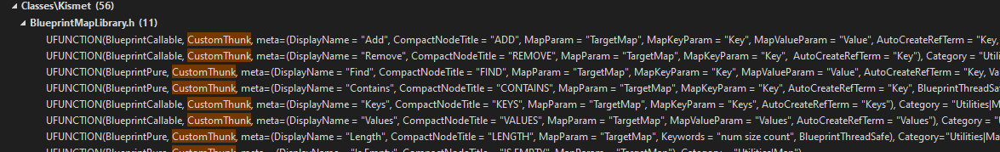
Важно помнить, что по этой теме в сети практически нет никакой информации. Есть лишь небольшая ветка на форуме - https://forums.unrealengine.com/t/how-to-implement-wildcard-pins-in-c/543008/2
Все, что вы читаете в этой статье - результат моих экспериментов и изысканий на основе исходников движка.
## Базовые принципы системы
Для реализации собственной функции с `Wildcard` пином надо использовать модификатор `CustomThunk` в макросе `UPROPERTY`.
`Wildcard` пины должны быть переданы в макрос в виде `meta`параметра `CustomStructureParam`.
```cpp
UFUNCTION(BlueprintCallable, CustomThunk, Category = "Custom Functions|Widcard", meta = (CustomStructureParam = "WCPinForInt,WCPinForFloat,WCSummOutput"))
```
Разделять аргументы `CustomStructureParam` между собой надо одной запятой `,` БЕЗ ПРОБЕЛА. Это важно.
В качестве `wildcard` пина выступает аргумент функции типа `int&`.

+ Используем `const int32&` для входного параметра.
+ Используем  `int32&` для выходного параметра.

```cpp
//.h
// Wildcard as function input
UFUNCTION(BlueprintCallable, CustomThunk, Category = "Custom Functions|Widcard", meta = (CustomStructureParam = "WCPinForInt,WCPinForFloat,WCSummOutput"))
bool WildcardFunctionTest(FString StringProperty, const int32& WCPinForInt, const int32& WCPinForFloat, int32& WCSummOutput);
DECLARE_FUNCTION(execWildcardFunctionTest);
```
После тела функции необходимо добавить макрос `DECLARE_FUNCTION`. Данный макрос должен содержать название функции-реализации. Это название должно начинаться с ключевого слова `exec`, с маленькой буквы, за которым следует название самой функции. В моем случае это `execWildcardFunctionTest`.
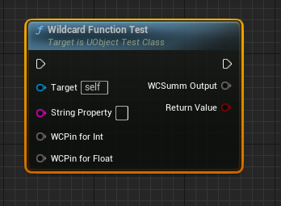
Реализация `Wildcard` ноды создается в файле `.cpp`. Для этого надо использовать макрос `DEFINE_FUNCTION`. В этом макросе прописывается путь к методу, заданному через макрос `DECLARE_FUNCTION`. В моем случае это `UObjectTestClass::execWildcardFunctionTest`.
Общий шаблон реализации выглядит так:
```cpp
//.h
// Wildcard as function input
UFUNCTION(BlueprintCallable, CustomThunk, Category = "Custom Functions|Widcard", meta = (CustomStructureParam = "WCPinForInt,WCPinForFloat,WCSummOutput"))
bool WildcardFunctionTest(FString StringProperty, const int32& WCPinForInt, const int32& WCPinForFloat, int32& WCSummOutput);
DECLARE_FUNCTION(execWildcardFunctionTest);
//...
//.cpp
// function with wildcad pins
DEFINE_FUNCTION(UObjectTestClass::execWildcardFunctionTest)
{
	// properties section begin:
	// Property order MATTERS!
	/* retrive properties here */
	P_FINISH; // properties section end
 
    // global values should be initialized before NATIVE section
	bool bResult = false;
 
	P_NATIVE_BEGIN;
        /* if you need some calculations - do them here */
	P_NATIVE_END;
 
    // Function Return Value
	*(bool*)RESULT_PARAM = bResult;
}
```
### Секция параметров
Секция параметров начинается сразу после заголовка функции, вплоть до макроса `P_FINISH`. В этой секции можно получить параметры функции, приведенные к указанному типу.
Сделать это можно двумя способами.
Первый способ получения параметров самый простой - макросом `P_GET_`. Макросов такого вида достаточно много, полный список можно найти в файле `\Runtime\CoreUObject\Public\UObject\ScriptMacros.h`.
Использование:
```cpp
P_GET_OBJECT(FString, StringProperty); // FString is Class
P_GET_PROPERTY(FIntProperty, IntValue);
P_GET_PROPERTY(FDoubleProperty, FloatValue);
```
Второй способ получения параметров чуть сложнее. Надо двигать указатель в стеке параметров `Stack` вперед на 1 единицу до тех пор, пока все параметры не будут получены.
```cpp
// clear stack property values if any
Stack.MostRecentProperty = nullptr;
Stack.MostRecentPropertyAddress = nullptr;
Stack.StepCompiledIn<FIntProperty>(NULL); // move property pointer stack forward to 1
// get wildcard property value from stack
void* IntPropValueContainer = Stack.MostRecentPropertyAddress;
const FIntProperty* IntWCProp = CastField<FIntProperty>(Stack.MostRecentProperty);
// clear stack property values if any
Stack.MostRecentProperty = nullptr;
Stack.MostRecentPropertyAddress = nullptr;
Stack.StepCompiledIn<FDoubleProperty>(NULL); // move property pointer stack forward to 1
// get wildcard property value from stack
void* FloatPropValueContainer = Stack.MostRecentPropertyAddress;
const FDoubleProperty* FloatWCProp = CastField<FDoubleProperty>(Stack.MostRecentProperty);
// get return value wildcard pin
// clear stack property values if any
Stack.MostRecentProperty = nullptr;
Stack.MostRecentPropertyAddress = nullptr;
Stack.StepCompiledIn<FProperty>(NULL); // move property pointer stack forward to 1, this is outbut pin, there is no value
void* ResultValueContainer = Stack.MostRecentPropertyAddress;
const FProperty* ResultWCProp = CastField<FProperty>(Stack.MostRecentProperty);
P_FINISH; // properties section end
```
Возвращаемый параметр может быть получен только из стека.
```cpp
// get return value wildcard pin
// clear stack property values if any
Stack.MostRecentProperty = nullptr;
Stack.MostRecentPropertyAddress = nullptr;
Stack.StepCompiledIn<FProperty>(NULL); // move property pointer stack forward to 1, this is outbut pin, there is no value
void* ResultValueContainer = Stack.MostRecentPropertyAddress;
const FProperty* ResultWCProp = CastField<FProperty>(Stack.MostRecentProperty);
P_FINISH; // properties section end
```
### Секция вычислений
Вычисления логики внутри метода должны происходить между макросами `P_NATIVE_BEGIN`и `P_NATIVE_END`.
Тут можно сложить полученные значения или присвоить пину какое либо значение.
```cpp
// global values should be initialized before NATIVE section
bool bResult = false;
// NATIVE section
P_NATIVE_BEGIN;
    if (IntWCProp->GetPropertyValue(IntPropValuePtr) > 3 && FloatWCProp->GetPropertyValue(FloatPropValuePtr) > 4.f) {
        bResult = true;
    }
    int res = IntWCProp->GetPropertyValue(IntPropValuePtr) + FMath::TruncToInt(FloatWCProp->GetPropertyValue(FloatPropValuePtr));
    ResultWCProp->CopySingleValueFromScriptVM(ResultValueAddr,&res);
    /* in you need some calculations - do them here */
P_NATIVE_END;
```
### Задаем значение "выходным" `output` пинам
Пин `WCSummOutput` является "выходным". Чтобы отправить на него значение суммы двух входных  пинов я использую метод `CopySingleValueFromScriptVM`.
```cpp
int res = IntPropVal + FMath::TruncToInt(FloatPropVal);
ResultWCProp->CopySingleValueFromScriptVM(ResultValueContainer, &res);
```
Данный метод копирует значение памяти со второго аргумента на первый. Таким образом число, переданное на второй аргумент `Src`, копируется в первый аргумент `Dest`.
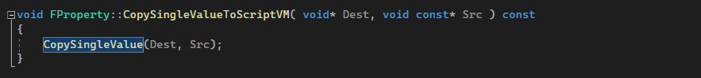
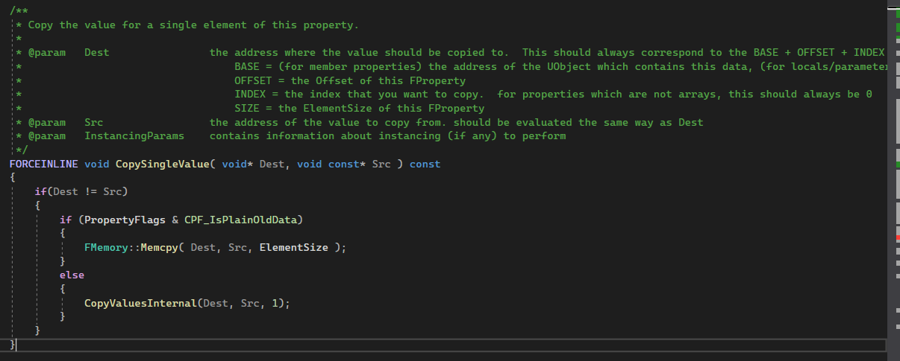
### `return value`
Моя тестовая функция возвращает `bool`.
Возвращаемое значение вычисляется  в секции `NATIVE` как параметр `bResult`. Далее значение должно быть передано макросу `RESULT_PARAM`, в самом конце функции.
```cpp
//...
// global values should be initialized before NATIVE section
bool bResult = false;
// NATIVE section
P_NATIVE_BEGIN;
    // get values from containers
    int IntPropVal = IntWCProp->GetPropertyValue(IntPropValueContainer);
    float FloatPropVal = FloatWCProp->GetPropertyValue(FloatPropValueContainer);
    if (IntPropVal > 3 && FloatPropVal > 4.f) {
        bResult = true;
    }
    int res = IntPropVal + FMath::TruncToInt(FloatPropVal);
    ResultWCProp->CopySingleValueFromScriptVM(ResultValueContainer, &res);
    /* in you need some calculations - do them here */
P_NATIVE_END;
// Function Return Value
*(bool*)RESULT_PARAM = bResult;
```
## Упрощенный метод доступа к значениям в пинах
```cpp
//.h
// Wildcard as function input
UFUNCTION(BlueprintCallable, CustomThunk, Category = "Custom Functions|Widcard", meta = (CustomStructureParam = "WCPinForInt,WCPinForFloat,WCSummOutput"))
bool WildcardFunctionTest(FString StringProperty, const int32& WCPinForInt, const int32& WCPinForFloat, int32& WCSummOutput);
DECLARE_FUNCTION(execWildcardFunctionTest);
//...
//.cpp
// function with wildcad pins
DEFINE_FUNCTION(UObjectTestClass::execWildcardFunctionTest)
{
	// properties section begin:
	// Property order MATTERS!
	// function properties can be obtained this way:
	P_GET_OBJECT(FString, StringProperty); // FString is Class
	P_GET_PROPERTY(FIntProperty, IntValue);
	P_GET_PROPERTY(FDoubleProperty, FloatValue);
 
	// get return value wildcard pin
	Stack.MostRecentProperty = nullptr;
	Stack.MostRecentPropertyAddress = nullptr;
	Stack.StepCompiledIn<FProperty>(NULL); // move property pointer stack forward to 1, this is outbut pin, there is no value
	void* ResultValueAddr = Stack.MostRecentPropertyAddress;
	const FProperty* ResultWCProp = CastField<FProperty>(Stack.MostRecentProperty);
	P_FINISH; // properties section end
 
	// global values should be initialized before NATIVE section
	bool bResult = false;
	P_NATIVE_BEGIN;
        if (IntValue > 3 && FloatValue > 4.f) {
            bResult = true;
        }
        int res = IntValue + FMath::TruncToInt(FloatValue);
        ResultWCProp->CopySingleValueFromScriptVM(ResultValueAddr,&res);
	P_NATIVE_END;
 
    // Function Return Value
	*(bool*)RESULT_PARAM = bResult;
}
```
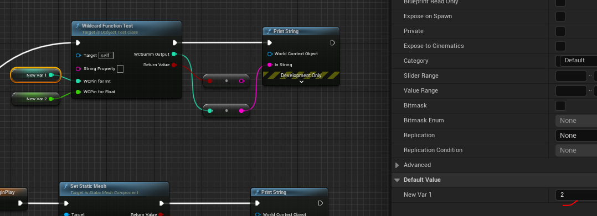
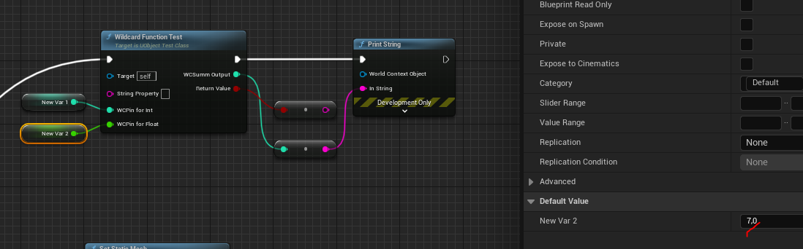
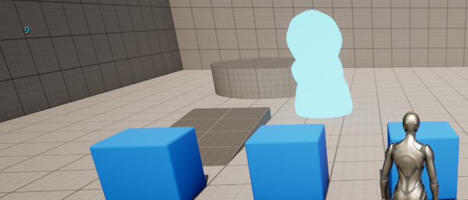
## Усложненный метод доступа к значениям в пинах
```cpp
//.h
// Wildcard as function input
UFUNCTION(BlueprintCallable, CustomThunk, Category = "Custom Functions|Widcard", meta = (CustomStructureParam = "WCPinForInt,WCPinForFloat,WCSummOutput"))
bool WildcardFunctionTest(FString StringProperty, const int32& WCPinForInt, const int32& WCPinForFloat, int32& WCSummOutput);
DECLARE_FUNCTION(execWildcardFunctionTest);
//...
//.cpp
// function with wildcad pins
DEFINE_FUNCTION(UObjectTestClass::execWildcardFunctionTest)
{
	// properties section begin:
	// Property order MATTERS!
	// function properties can be obtained in two ways
	// simple way:
	P_GET_OBJECT(FString, StringProperty); // FString is Class
	// complex way:
	// clear stack property values if any
	Stack.MostRecentProperty = nullptr;
	Stack.MostRecentPropertyAddress = nullptr;
	Stack.StepCompiledIn<FIntProperty>(NULL); // move property pointer stack forward to 1
	// get wildcard property value from stack
	void* IntPropValueAddr = Stack.MostRecentPropertyAddress;
	const FIntProperty* IntWCProp = CastField<FIntProperty>(Stack.MostRecentProperty);
	// clear stack property values if any
	Stack.MostRecentProperty = nullptr;
	Stack.MostRecentPropertyAddress = nullptr;
	Stack.StepCompiledIn<FDoubleProperty>(NULL); // move property pointer stack forward to 1
	// get wildcard property value from stack
	void* FloatPropValueAddr = Stack.MostRecentPropertyAddress;
	const FDoubleProperty* FloatWCProp = CastField<FDoubleProperty>(Stack.MostRecentProperty);
	// get return value wildcard pin
	// clear stack property values if any
	Stack.MostRecentProperty = nullptr;
	Stack.MostRecentPropertyAddress = nullptr;
	Stack.StepCompiledIn<FProperty>(NULL); // move property pointer stack forward to 1, this is outbut pin, there is no value
	void* ResultValueAddr = Stack.MostRecentPropertyAddress;
	const FProperty* ResultWCProp = CastField<FProperty>(Stack.MostRecentProperty);
	ResultWCProp->InitializeValue(ResultValueAddr);
	P_FINISH; // properties section end
	// global values should be initialized before NATIVE section
	bool bResult = false;
	// NATIVE section
	P_NATIVE_BEGIN;
		// get values from containers
		int IntPropVal = IntWCProp->GetPropertyValue(IntPropValueAddr);
		float FloatPropVal = FloatWCProp->GetPropertyValue(FloatPropValueAddr);
		if (IntPropVal > 3 && FloatPropVal > 4.f) {
			bResult = true;
		}
		int res = IntPropVal + FMath::TruncToInt(FloatPropVal);
		ResultWCProp->CopySingleValueFromScriptVM(ResultValueAddr, &res);
	P_NATIVE_END;
	// Function Return Value
	*(bool*)RESULT_PARAM = bResult;
}
```
## Пины, передающие значение "по  ссылке"
Для передачи значения `wildcard` по ссылке, в `meta` надо добавить атрибут `AutoCreateRefTerm`.
```cpp
//.h
// Wildcard with ref pin
UFUNCTION(BlueprintCallable, CustomThunk, Category = "Custom Functions|Widcard", meta = (CustomStructureParam = "InRefPin", AutoCreateRefTerm = "InRefPin"))
void WildcardPassByRef(const int32& InRefPin);
DECLARE_FUNCTION(execWildcardPassByRef);
//...
//.cpp
// function with wildcad pin that passed by "ref"
DEFINE_FUNCTION(UObjectTestClass::execWildcardPassByRef)
{
	// properties section begin:
	Stack.MostRecentProperty = nullptr;
	Stack.MostRecentPropertyAddress = nullptr;
	Stack.StepCompiledIn<FNameProperty>(NULL); // move property pointer stack forward to 1, this is outbut pin, there is no value
	void* ValueAddr = Stack.MostRecentPropertyAddress;
	const FNameProperty* Prop = CastField<FNameProperty>(Stack.MostRecentProperty);
	P_FINISH; // properties section end
	P_NATIVE_BEGIN;
	FName NewValue = TEXT("This Is New Text Value!");
	Prop->CopyCompleteValueToScriptVM(ValueAddr, &NewValue);
	P_NATIVE_END;
}
```
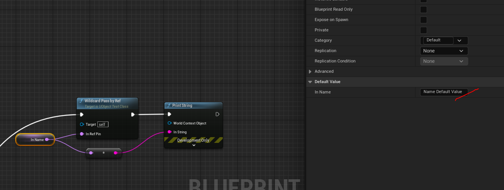

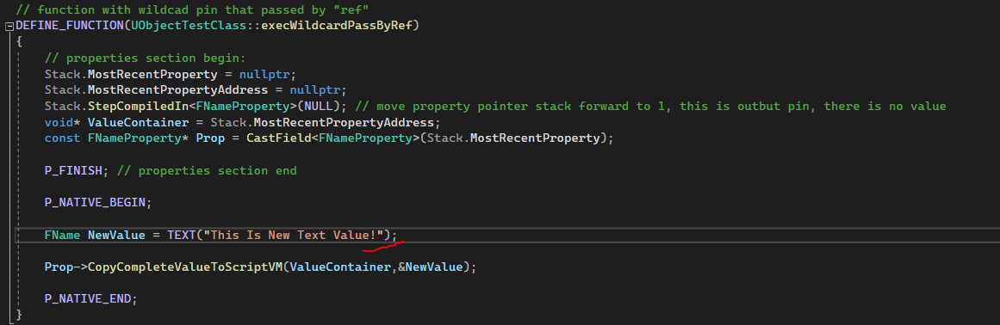
## `Wildcard` массивы
Самое очевидное применение `Wildcard` пина - для универсального массива.
Для массивов требуется использовать параметры типа `const TArray<int32>&`, а так-же следующие `meta` параметры: `ArrayParm` и `ArrayTypeDependentParams`.
Параметр `ArrayTypeDependentParams` позволяет изменять тип пинов, связанных с массивом.
Параметр `ArrayParm` может принимать несколько значений массивов подряд, при этом каждый массив будет задан как `Wildcard` пин.
```cpp
//.h
// Wildcard with Array pin
UFUNCTION(BlueprintCallable, CustomThunk, Category = "Custom Functions|Widcard", meta = (ArrayParm = "InArray,OutArray", AutoCreateRefTerm = "InArray", ArrayTypeDependentParams = "ElementToAdd,OutArray"))
void WildcardArrayTest(const TArray<int32>& InArray, const int32& ElementToAdd, TArray<int32>& OutArray);
DECLARE_FUNCTION(execWildcardArrayTest);
//...
//.cpp
// function with wildcad array pin
DEFINE_FUNCTION(UObjectTestClass::execWildcardArrayTest)
{
	// properties section begin:
	// Property order MATTERS!
	// clear stack property values if any
	Stack.MostRecentProperty = nullptr;
	Stack.MostRecentPropertyAddress = nullptr;
	Stack.StepCompiledIn<FArrayProperty>(NULL); // move property pointer stack forward to 1
	// get wildcard property value from stack
	void* InArrayValueAddr = Stack.MostRecentPropertyAddress;
	FArrayProperty* InArrayProperty = ExactCastField<FArrayProperty>(Stack.MostRecentProperty);
	// clear stack property values if any
	Stack.MostRecentProperty = nullptr;
	Stack.MostRecentPropertyAddress = nullptr;
	Stack.StepCompiledIn<FProperty>(NULL); // move property pointer stack forward to 1
	// get wildcard property value from stack
	void* ElementValueAddr = Stack.MostRecentPropertyAddress;
	const FProperty* ElementProperty = CastField<FProperty>(Stack.MostRecentProperty);
	// clear stack property values if any
	Stack.MostRecentProperty = nullptr;
	Stack.MostRecentPropertyAddress = nullptr;
	Stack.StepCompiledIn<FArrayProperty>(NULL); // move property pointer stack forward to 1
	// get wildcard property value from stack
	void* OutArrayValueAddr = Stack.MostRecentPropertyAddress;
	FArrayProperty* OutArrayProperty = ExactCastField<FArrayProperty>(Stack.MostRecentProperty);
	P_FINISH; // properties section end
	if (InArrayValueAddr == nullptr)
	{
		Stack.bArrayContextFailed = true;
		return;
	}
	int32 NewIndex = INDEX_NONE;
	P_NATIVE_BEGIN;
		FScriptArrayHelper ArrayHelper(InArrayProperty, InArrayValueAddr);
		FProperty* InnerProp = InArrayProperty->Inner;
		// this will generate new empty array items
		NewIndex = ArrayHelper.AddValue();
		// set new value of array element
		InnerProp->CopySingleValueToScriptVM(ArrayHelper.GetRawPtr(NewIndex), ElementValueAddr);
		// copy values to output
		FScriptArrayHelper OutArrayHelper(OutArrayProperty, OutArrayValueAddr);
		// initialize Num values in OutArray
		OutArrayHelper.AddValues(ArrayHelper.Num());
		FProperty* InnerPropOA = OutArrayProperty->Inner;
		for (int Index = 0; Index < ArrayHelper.Num(); Index++)
		{
			// copy
			InnerPropOA->CopySingleValueToScriptVM(OutArrayHelper.GetRawPtr(Index), ArrayHelper.GetRawPtr(Index));
		}
	P_NATIVE_END;
}
```
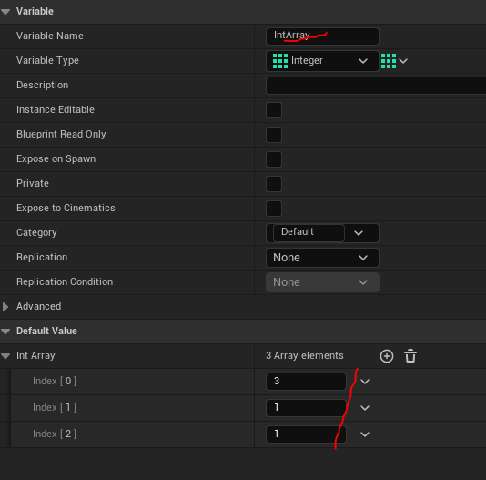
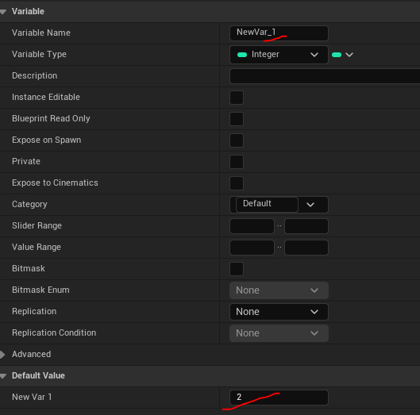
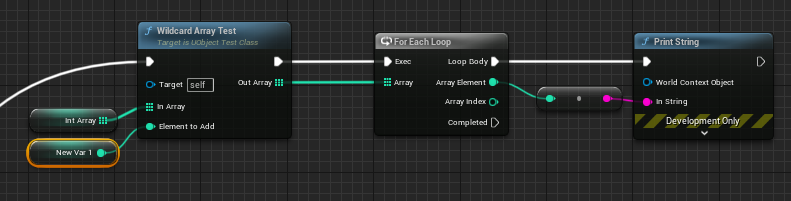
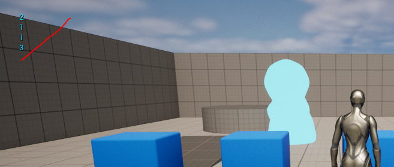
## `Wildcard` Map
Помимо массивов `wildcard` пины могут работать с типом `Map`.
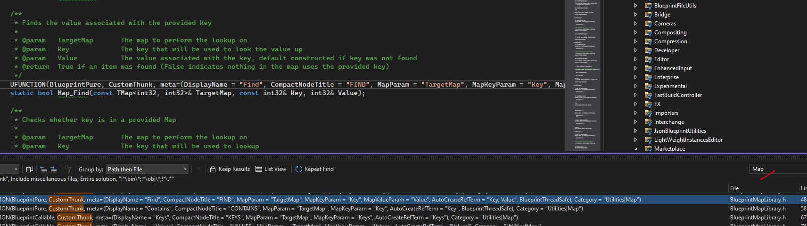
Давайте сделаем собственную реализацию этого подхода.
Для добавления `wildcard` типа `Map` надо использовать аргумент вида: `const TMap<int32, int32>&`.
`Meta` параметры нужны следующие:

+ `MapParam` - параметр, отвечающий за инициализацию `wildcard`
+ `MapKeyParam` - опциональный параметр, тип которого автоматически изменится в соответствии с типом `wildcard`, когда к нему подведут переменную типа `map`
+ `MapValueParam` - опциональный параметр, тип которого автоматически изменится в соответствии с типом `wildcard`, когда к нему подведут переменную типа `map`.

Параметр `wildcard map` у функции может быть только один. Я проверял, с несколькими - не получилось.
```cpp
//.h
#include <Kismet/BlueprintMapLibrary.h>
// Wildcard with Map pin
UFUNCTION(BlueprintCallable, CustomThunk, Category = "Custom Functions|Widcard", meta = (MapParam = "TargetMap", MapKeyParam = "Key", MapValueParam = "Value", AutoCreateRefTerm = "Key,Value"))
void WildcardMapTest(const TMap<int32, int32>& TargetMap, const int32& Key, const int32& Value);
DECLARE_FUNCTION(execWildcardMapTest);
//...
//.cpp
// function with map pin
// build based on UBlueprintMapLibrary::Map_Add, see /Runtime/Engine/Classes/Kismet/BlueprintMapLibrary.h
DEFINE_FUNCTION(UObjectTestClass::execWildcardMapTest)
{
	// properties section begin:
	// Property order MATTERS!
	Stack.StepCompiledIn<FMapProperty>(NULL);  // move property pointer stack forward to 1
	void* MapAddr = Stack.MostRecentPropertyAddress;
	FMapProperty* MapProperty = CastField<FMapProperty>(Stack.MostRecentProperty);
	if (!MapProperty)
	{
		Stack.bArrayContextFailed = true;
		return;
	}
	// Since Key and Value aren't really an int, step the stack manually
	const FProperty* CurrKeyProp = MapProperty->KeyProp;
	const int32 KeyPropertySize = CurrKeyProp->ElementSize * CurrKeyProp->ArrayDim;
	// manually allocate memory for the Key
	void* KeyStorageSpace = FMemory_Alloca(KeyPropertySize);
	CurrKeyProp->InitializeValue(KeyStorageSpace);
	Stack.MostRecentPropertyAddress = nullptr;
	Stack.MostRecentPropertyContainer = nullptr;
	Stack.StepCompiledIn<FProperty>(KeyStorageSpace); // move property pointer stack forward to 1 and fill value
	const FProperty* CurrValueProp = MapProperty->ValueProp;
	const int32 ValuePropertySize = CurrValueProp->ElementSize * CurrValueProp->ArrayDim;
	// manually allocate memory for the Value
	void* ValueStorageSpace = FMemory_Alloca(ValuePropertySize);
	CurrValueProp->InitializeValue(ValueStorageSpace);
	Stack.MostRecentPropertyAddress = nullptr;
	Stack.MostRecentPropertyContainer = nullptr;
	Stack.StepCompiledIn<FProperty>(ValueStorageSpace); // move property pointer stack forward to 1 and fill value
	P_FINISH; // properties section end
	P_NATIVE_BEGIN;
		if (MapAddr)
		{
			FScriptMapHelper MapHelper(MapProperty, MapAddr);
			MapHelper.AddPair(KeyStorageSpace, ValueStorageSpace);
		}
	P_NATIVE_END;
	CurrValueProp->DestroyValue(ValueStorageSpace);
	CurrKeyProp->DestroyValue(KeyStorageSpace);
}
```


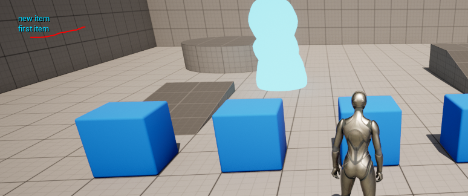
