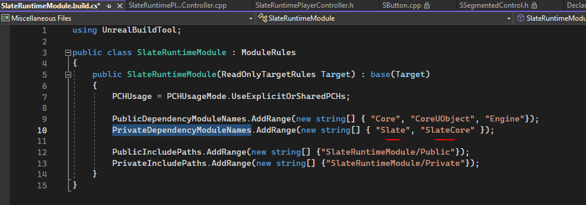
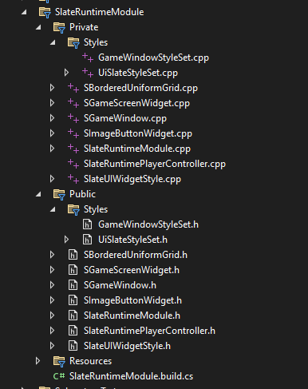

# Slate Runtimе, введение в Slate
`Slate` это выосокуровневый фреймворк отрисовки пользовательского интерфейса `GUI` интегрированный в `Unreal Engine`. Данный фреймворк выступает как более низкоуровневая альтернатива системе `UMG` виджетов. При этом сами `UMG` виджеты основаны на `Slate`.
`Slate` - один из самых сложных фреймворков с которыми я сталкивался в своей жизни. Многие механики этого фреймворка не очевидны.
Проблемы с изучением `Slate` были почти у всех разработчиков, касавшихся этой системы, не зависимо от уровня навыков и предыдущего опыта. Главные источники проблем этого фреймворка - декларативный дизайн и абсолютно непонятная система атрибутов, с бессмысленным пояснительным комментарием в коде движка, поставившим меня в тупик. Изучение `Slate` заняло у меня порядка 20 дней. Ничего более запутанного и сложного я за все годы работы не встречал.
## Материалы для ознакомления
Прежде чем приступать к работе, предлагаю вам ознакомиться с материалами по фреймворку `Slate`, которые доступны в сети интернет.
Для начала обратите внимание на [документацию](https://docs.unrealengine.com/5.1/en-US/slate-user-interface-programming-framework-for-unreal-engine/) по этой системе, которая приведена на официальном сайте. Здесь вы найдете описание основных принципов `Slate`, способы интеграции фреймворка в проект и многое другое.
Рекомендую обратить внимание на описание инструментов которые предлагает движок Unreal Engine, для отладки `Slate` систем, в первую очередь это [WidgetReflector](https://docs.unrealengine.com/5.1/en-US/using-the-slate-widget-reflector-in-unreal-engine/).
В дополнение к официальной документации, на `GitHub` существует своеобразный вики-[репозиторий](https://docs.unrealengine.com/5.1/en-US/using-the-slate-widget-reflector-in-unreal-engine/), который, к сожалению, больше внимания уделяет системе `UMG`, но я все равно рекомендую вам его почитать.
## Подготовка к работе
Создадим отдельный модуль для классов, которые будут написаны в этой статье.
Назовем модуль `SlateRuntimeModule`.


Так-же, для отображения виджетов на экране, нам нужен класс `PlayerController`.
Идем `Tools -> New C++ Class` и далее `PlayerController`.


Называем  класс `SlateRuntimePlayerController`.


После добавления файлов не забудьте выполнить команду `Tools -> Refresh Visual Studio 2022 Project`, чтобы изменения отобразились в `Solution Explorer`.


После компиляции, необходимо добавить класс `SlateRuntimePlayerController` в `GameMode` проекта (делается это на вкладке `World Settings` в редакторе Unreal).


## Изучение системы
Система `Slate` состоит из двух модулей:
* `SlateCore` - ядро системы, здесь находится ключевой класс `SWidget`, а так-же логика стилей, обработки ввода, шрифтов и много чего еще. Данный модуль можно найти по пути `\Engine\Source\Runtime\SlateCore`. 

* `Slate` - в этом модуле хранятся основные виджеты системы, унаследованные от `SWidget`. Данный модуль можно найти по пути `\Engine\Source\Runtime\Slate`. 

Для использования виджетов `Slate` надо подключать в зависимостях оба этих модуля, поскольку они взаимосвязаны.
Давайте подключим зависимости к нашему модулю `SlateRuntimeModule`. Откройте файл `.build.cs`.

И добавьте туда следующую строчку:
```cpp
PrivateDependencyModuleNames.AddRange(new string[] { "Slate", "SlateCore" });
```
Добавлять ее стоит после строки `PublicDependencyModuleNames`.

## Виджеты Slate
Виджеты системы `Slate` можно найти в двух папках, это:

- `\Runtime\Slate\Public\Widgets\` - основной набор виджетов, кнопки, панели, картинки и так далее.

- `\Runtime\SlateCore\Public\Widgets\` - базовые виджеты и их логика.


Функционально основные виджеты `Slate` дублируют своих более высокоуровневых потомков из системы `UMG`. Поэтому, крайне полезно было бы изучить `UMG` виджеты и уже потом программировать в `Slate`.
Давайте откроем движок и создадим `UMG` виджет для наших тестов.
В `Content Browser'е` идем `Add -> User Interface -> Widget Blueprint`, чтобы создать тестовый виджет. 

Я назвал его `UMG_TestWidget`. 

Если открыть созданный нами виджет то можно увидеть пустое окно редактора `UMG` с палитрой доступных виджетов в левом углу экрана.

Можно перетащить в редактор некоторые из виджетов. Например: контейнер `Canvas` и кнопку в него.

В правой части редактора находится панель `Details` с полным набором параметров выбранного виджета. Эти параметры полностью совпадают с теми, которые есть у классов `Slate`.
Если открыть класс `SButton`, то в его параметрах можно будет увидеть почти все то-же самое, что и в редакторе `UMG`.

Поэтому, если вам надо понять, как работает тот или иной `Slate` виджет, вы можете использовать редактор `UMG` с тем-же самым виджетом, для понимания. И хотя имена переменных с парметрами иногда отличаются (потому что `UMG` виджеты отличаются от своих собратьев в `Slate`), их ключевой функционал и поведение совпадают.
Например: панель `Canvas` в `UMG` работает точно так-же как `SConstraintCanvas`, а панель `Overlay` работает как `SOverlay`.
### Сборка интерфейса с применением `Slate`
Основным преимуществом `Slate` перед `UMG` (помимо производительности) является возможность быстрой сборки и вывода на экран `UI` виджетов почти из любого класса, в котором есть доступ к объекту `GEngine->GameViewport`.
Поскольку в движке уже есть готовые виджеты, система позволяет собрать из них примитивный `UI`, практически из любого класса. При этом данный `UI` сможет обрабатывать события, выводить текст и скалироваться по размеру экрана.
У в главе "Подготовка к работе", я уже создал класс `ASlateRuntimePlayerController`. Предлагаю использовать этот класс для сборки и вывода на экран простого интерфейса.
```cpp
#include "Widgets/SCompoundWidget.h" // our ui is compound widget
#include "Widgets/Layout/SConstraintCanvas.h" // Slate Canvas
#include "Brushes/SlateImageBrush.h"
// Begin Play
if (GEngine != nullptr) {
    // This will be called on button click
    FOnClicked ClickDelegate;
    ClickDelegate.BindLambda([]() -> FReply {
            UE_LOG(LogTemp, Warning, TEXT("Button Clicked!"));
            return FReply::Handled();
        });
    // Slate UI
    TSharedPtr<SConstraintCanvas> Canvas =
    SNew(SConstraintCanvas)
        + SConstraintCanvas::Slot()
        .AutoSize(true)
        .Anchors(FAnchors{0.2f,0.8f}) // down left
        [
            SNew(SButton)
            .Text(FText::FromString(TEXT("TestButton")))
            .OnClicked(ClickDelegate) // bind click event
            .ContentPadding(FMargin{10.0f, 15.0f})
        ]
    ; // end
    // Add Background to our Canvas with Button
    TSharedPtr<SOverlay> BGOverlay =
    SNew(SOverlay)
        + SOverlay::Slot()
        .HAlign(HAlign_Fill) // fill whole space
        .VAlign(VAlign_Fill)
        [
            // Border widget works as background color sourse
            // will be better if you use just SImage, but as example i picked up Border
            SNew(SBorder)
            .BorderImage(new FSlateImageBrush{ // just demo of using Slate Brush on c++
                TEXT("CanvasOverlayBG"),
                FVector2D{},
                FLinearColor(0.1f, 0.1f, 0.1f, 1.0f), // tint
                ESlateBrushTileType::Both,
                ESlateBrushImageType::FullColor // draw as
            })
        ]
        + SOverlay::Slot()[
            Canvas.ToSharedRef() // this will put canvas into overlay
        ]
    ; // end
    // Add generated UI to Veiwport
    GEngine->GameViewport->AddViewportWidgetForPlayer(GetLocalPlayer(), BGOverlay.ToSharedRef(), 0);
}
```
Указанный выше код я добавил вкласс `ASlateRuntimePlayerController` в событие `BeginPlay`.

При запуске проекта, в левом нижнем углу перед нами появится кнопка `Test Button` на сером фоне. Нажатие на кнопку будет печатать текст `Button Clicked!`.

Можно загрузить на фон, например, текстуру.
Делается это так:
```cpp
UTexture* Texture = Cast<UTexture>(StaticLoadObject(UTexture::StaticClass(), NULL, TEXT("/Script/Engine.Texture2D'/Game/Characters/Textures/2344444_original.2344444_original'")));
if (Texture == nullptr) {
    return;
}
// Border widget works as background color sourse
// will be better if you use just SImage, but as example i picked up Border
SNew(SBorder)
.BorderImage(new FSlateImageBrush{ // just demo of using Slate Brush on c++
    Texture, // image path comes here
    FVector2D{},
    FLinearColor(0.1f, 0.1f, 0.1f, 1.0f), // tint
    ESlateBrushTileType::Both,
    ESlateBrushImageType::FullColor // draw as
})
```

### Макросы инициализации виджетов `Slate`
В приведенном выше коде я часто использовал макрос `SNew`. Это макрос ингициализации виджета. Есть еще два таких-же макроса(всего их три).
Давайте рассмотрим макросы инициализации виджетов `Slate`.
#### Макрос `SNew`
`SNew( WidgetType, ... )`  - создает объект виджета, возвращая  `TSharedPtr<WidgetType>` в присвоенную переменную.
```cpp
TSharedPtr<SButton> ButtonSNew =
    SNew(SButton)
    .Text(FText::FromString(TEXT("SNew Button")))
    .HAlign(HAlign_Fill);
```
Благодаря декларативному синтаксису аргументов в виджетах `Slate` мы можем указывать параметры объекта, созданного через `SNew`, сразу после его инициализации.
#### Макрос `SAssignNew`
`SAssignNew( ExposeAs, WidgetType, ... )` - создает объект типа `WidgetType` и  присваивает указатель на этот объект параметру `ExposeAs` (типа  `TSharedPtr<WidgetType>`). Этот макрос позволяет создать указатель на виджет в другом месте, а потом присвоить ему значение.
```cpp
// SAssignNew
TSharedPtr<SButton> ButtonSAssignNew = nullptr;
SAssignNew(ButtonSAssignNew, SButton)
.Text(FText::FromString(TEXT("SAssignNew Button")))
.HAlign(HAlign_Fill);
```
#### Макрос `SArgumentNew`
`SArgumentNew( InArgs, WidgetType, ... )` - позволяет предзадать аргументы для виджета в обход декларативного синтаксиса. Аргументы  передаются первым праметром - `InArgs`, а класс виджета - вторым параметром `WidgetType`. Этот макрос возвращает `TSharedPtr<WidgetType>`.
```cpp
// SArgumentNew
SButton::FArguments ButtonArgs;
ButtonArgs.Text( FText::FromString(TEXT("ButtonSArgNew Button")) );
TSharedPtr<SButton> ButtonSArgNew = SArgumentNew(ButtonArgs, SButton);
```
---
В приведенных выше фрагментах я создал 3 кнопки, которые были добавлены в тестовый код следующим образом:
```cpp
// Quick UI Sample
// This will be called on button click
FOnClicked ClickDelegate;
ClickDelegate.BindLambda([]() -> FReply {
        UE_LOG(LogTemp, Warning, TEXT("Button Clicked!"));
        return FReply::Handled();
    });
// SArgumentNew
SButton::FArguments ButtonArgs;
ButtonArgs.Text( FText::FromString(TEXT("ButtonSArgNew Button")) );
TSharedPtr<SButton> ButtonSArgNew = SArgumentNew(ButtonArgs, SButton);
// SNew
TSharedPtr<SButton> ButtonSNew =
SNew(SButton)
.Text(FText::FromString(TEXT("SNew Button")))
.HAlign(HAlign_Fill);
// SAssignNew
TSharedPtr<SButton> ButtonSAssignNew = nullptr;
SAssignNew(ButtonSAssignNew, SButton)
.Text(FText::FromString(TEXT("SAssignNew Button")))
.HAlign(HAlign_Fill);
// Slate UI
TSharedPtr<SConstraintCanvas> Canvas =
SNew(SConstraintCanvas)
    + SConstraintCanvas::Slot()
    .AutoSize(true)
    .Anchors(FAnchors{0.2f,0.8f}) // down left
    [
        SNew(SButton)
        .Text( FText::FromString(TEXT("TestButton")) )
        .OnClicked(ClickDelegate) // bind click event
        .ContentPadding(FMargin{10.0f, 15.0f})
    ]
    + SConstraintCanvas::Slot() // ButtonSNew slot
    .AutoSize(true)
    .Anchors(FAnchors{ 0.3f,0.5f })
    [
        ButtonSNew.ToSharedRef()
    ]
    + SConstraintCanvas::Slot() // ButtonSAssignNew slot
    .AutoSize(true)
    .Anchors(FAnchors{ 0.3f,0.6f })
    [
        ButtonSAssignNew.ToSharedRef()
    ]
    + SConstraintCanvas::Slot() // ButtonSArgNew slot
    .AutoSize(true)
    .Anchors(FAnchors{ 0.3f,0.7f })
    [
        ButtonSArgNew.ToSharedRef()
    ]
;
```

### Добавление виджетов на экран
Виджеты `Slate` можно добавлять на экран везде, где доступен объект `GEngine->GameViewport`. Сначала вызывается один из макросов иницилизации виджета, например `SNew` и декларативным синтакисом создается нужная структура элементов управления.
Добавление полученных элементов на экран осуществляется так:
```cpp
// Add generated UI to Veiwport
GEngine->GameViewport->AddViewportWidgetForPlayer(GetLocalPlayer(), WidgetPointer.ToSharedRef(), ZIndex);
```
Где:
 + `WidgetPointer`  - указатель на виджет, созданный через `SNew` и размещенный в `TSharedPtr`.
 + `ZIndex` - уровень слоя, на котором выводится виджет. Срабатывает при наложении виджетов друг на друга.
Теперь, когда вы знаете как пользоваться уже имеющимися в системе виджетами `Slate`, давайте изучим, как написать собственный виджет.
## Программируем собственный виджет
Изучим создание собственных виджетов для системы `Slate`.
### Наследование
Базовым классом для каждого виджета `Slate` является `SWidget`, найти его можно в файле `\Runtime\SlateCore\Public\Widgets\SWidget.h`. Однако, если мы откроем его комментарии, то увидим явное предупреждение от разработчиков:
```cpp
STOP. DO NOT INHERIT DIRECTLY FROM WIDGET!
// СТОП. НЕЛЬЗЯ НАСЛЕДОВАТЬ НАПРЯМУЮ ОТ WIDGET
```

Наследовать виджеты `Slate` можно от следующих классов:
`SCompoundWidget` - базовый класс для элементов управления.

+ можно вложить в другие виджеты
+ может выступать контейнером для других виджетов

Большинство виджетов системы являются `SCompoundWidget`, в частности это: `SButton`, `SBorder`, `SSlider` и так далее.

`SUserWidget` - базовый класс для виджетов, которые не планируется использовать внутри других виджетов. То есть класс для сборных виджетов, например: меню, экран загрузки, странца настроек, интерфейса игрока.

+ может выступать контейнером для других виджетов
- нельзя вложить в другие виджеты


`SLeafWidget` - базовый класс для виджетов, в которые не планируется ничего вкладывать. Часто используется для элементов управления движка Unral Engine.

- не может быть контейнером для других виджетов
+ можно вложить в другие виджеты

Примером `SLeafWidget` является `SColorGradingPicker`.

### Структура виджета `Slate`
Рассмотрим процесс создания виджета.
Идем `Tools -> New C++ Class -> Slate Widget`.

Называем виджет `GameScreenWidget`.

В результате для нас будет сгенерирован почти готовый базовый виджет `Slate` с таким содержимым:
```cpp
//.h
#pragma once
#include "CoreMinimal.h"
#include "Widgets/SCompoundWidget.h"
class SLATERUNTIMEMODULE_API SGameScreenWidget : public SCompoundWidget
{
public:
	SLATE_BEGIN_ARGS(SGameScreenWidget)
	{}
	SLATE_END_ARGS()
	/** Constructs this widget with InArgs */
	void Construct(const FArguments& InArgs);
};
//...
//.cpp
#include "SlateOptMacros.h"
BEGIN_SLATE_FUNCTION_BUILD_OPTIMIZATION
void SGameScreenWidget::Construct(const FArguments& InArgs)
{
	/*
	ChildSlot
	[
		// Populate the widget
	];
	*/
}
END_SLATE_FUNCTION_BUILD_OPTIMIZATION
```
В приведенном выше коде уже присутствуют все ключевые элементы, свойственные виджетам `Slate`, а именно: секция аргументов и метод `Construct`.
#### Добавление аргументов
Аргументы могут быть переданы виджету после его создания.
```cpp
SNew(SConstraintCanvas)
+ SConstraintCanvas::Slot()
.AutoSize(true)
.Anchors(FAnchors{0.5,0.5})
[]
```
В приведенном выше примере все строки, указанные после макроса `SNew`, являются аргументами виджета `SConstraintCanvas`.
Аргументы задаются в секции между двумя макросами:
* `SLATE_BEGIN_ARGS(SWidgetClass):_Argument(DefaultValue){}` - открывает секцию аргументов.
* `SLATE_END_ARGS()` - закрывает секцию аргументов.
Макросы аргументов всегда должны указываться в `public` секции класса.

Формат:
```cpp
public: // public scope is important for args section!
    SLATE_BEGIN_ARGS(SWidgetClass): // open arguments section
        _Argument1(DefaultValue1)
        _Argument2(DefaultValue2)
        _WidgetSlotArgument() // widget slot without args
        {}
        // argument types definition
        SLATE_ATTRIBUTE(FLinearColor, Argument1) // Argument1 will be of type FLinearColor
        SLATE_ATTRIBUTE(EHorizontalAlignment, Argument2) // Argument2 will be of type EHorizontalAlignment
        // adding any other widgets slot
        SLATE_DEFAULT_SLOT( FArguments, WidgetSlotArgument )
        SLATE_EVENT( FSimpleDelegate, OnPressed ) // use it if we want to turn class variable delegate with type FSimpleDelegate and name OnClicked into SlateEvent
        // ... Other Attributes
    SLATE_END_ARGS() // close arguments section
     
// args, like Events and Slots should be declared outside of macro in private section
private:
    /* The delegate to execute when the button is pressed */
	FSimpleDelegate OnPressed;
```
Макросы `SLATE_ATTRIBUTE`, `SLATE_DEFAULT_SLOT`, `SLATE_EVENT` являются макросами аргументов и задают, соответственно, переменную, слот для виджета и привязку события.
Давайте добавим нашему виджету, например, аргумент строки. Поскольку виджет у нас называется `GameScreen`, то, очевидно, строкой будет `CharacterName`. Так-же добавим атрибуты для здоровья и выносливости.
```cpp
#include "GameFramework/PlayerController.h" // Player Controller
#include "Widgets/DeclarativeSyntaxSupport.h" // SNew, SLATE_SLOT_ARGUMENT
#define LOCTEXT_NAMESPACE "SGameScreenWidgetNamespace" // to use FText
// ...
SLATE_BEGIN_ARGS(SGameScreenWidget):
    // Default values for arguments
    _CharacterName(LOCTEXT("CharacterNameReplacer", "Hero")),
    _CharacterHealth(100),
    _CharacterStamina(100)
    {}
    // Arguments
    SLATE_ARGUMENT(FText, CharacterName)
    SLATE_ARGUMENT(int, CharacterHealth)
    SLATE_ARGUMENT(int, CharacterStamina)
    SLATE_ARGUMENT(APlayerController, PlayerController) // args that dosen't have default value - always should be sed during widget construction
SLATE_END_ARGS()
//...
#undef LOCTEXT_NAMESPACE
```

#### Метод `_Construct`
Использование аргументов доступно в методе `_Construct` - ключевом методе виджета, в котором осуществляется его сборка.
Получение значений аргументов доступно из парамера `const FArguments& InArgs`.
Добавим в этом методе полоски здоровья и выносливости.
```cpp
// .h
#include "Widgets/Layout/SConstraintCanvas.h" // SConstraintCanvas widget
#include "Widgets/Notifications/SProgressBar.h" // SProgressBar widget
#include "Widgets/Text/STextBlock.h" // STextBlock widget
#include "Brushes/SlateImageBrush.h" // Image Brush
#include "Widgets/DeclarativeSyntaxSupport.h" // SNew, SLATE_SLOT_ARGUMENT
#include "Widgets/SlateControlledConstruction.h" // SLATE_DECLARE_WIDGET
#define LOCTEXT_NAMESPACE "SGameScreenWidgetNamespace" // to use FText
// class SGameScreenWidget
SLATE_BEGIN_ARGS(SGameScreenWidget):
    // Default values for arguments
    _CharacterName(LOCTEXT("CharacterNameReplacer", "Hero")),
    _CharacterMaxHealth(100),
    _CharacterMaxStamina(100)
    {}
    // Arguments
    SLATE_ARGUMENT(FText, CharacterName)
    SLATE_ARGUMENT(int, CharacterMaxHealth)
    SLATE_ARGUMENT(int, CharacterMaxStamina)
    SLATE_ARGUMENT(APlayerController*, PlayerController) // args that dosen't have default value - always should be sed during widget construction
SLATE_END_ARGS()
private:
    // Exposed controls
	TSharedPtr<SProgressBar> HealthProgressBar;
	TSharedPtr<SProgressBar> StaminaProgressBar;
	TSharedPtr<STextBlock> CharacterName;
	// Stats
	int CurrentHealth = 0; // sill be set in Construct
	int CurrentStamina = 0;
//...
// .cpp
void SGameScreenWidget::Construct(const FArguments& InArgs)
{
	//ColorAttribute.Bind(*this, []()->FLinearColor{ return FLinearColor::Red; });
	// this is how to track viewport resize if necessary
	/* GEngine->GameViewport->Viewport->ViewportResizedEvent.AddLambda([this](FViewport* Viewport, uint32 Unused)->void {
		UE_LOG(LogTemp, Warning, TEXT("Viewport Resized!"))
	});*/
	FSimpleDelegate EventArgs = InArgs._ButtonPressEvent;
	// Stats
	int MaxHealth = InArgs._CharacterMaxHealth;
	int MaxStamina = InArgs._CharacterMaxStamina;
	CurrentHealth = MaxHealth; // since there is no actual stat system implemented
	CurrentStamina = MaxStamina;
	// Styles
	FSlateFontInfo ButtonFont = FCoreStyle::Get().GetFontStyle("EmbossedText");
	ButtonFont.Size = 45;
	FSlateFontInfo NormalFont = FCoreStyle::Get().GetFontStyle("NormalFont");
	FSlateFontInfo CharacterNameFont = FCoreStyle::Get().GetFontStyle("EmbossedText");
	CharacterNameFont.Size = 30;
	// On "+" button click
	FOnClicked OnIncreaseHealth;
	OnIncreaseHealth.BindLambda([this, MaxHealth, EventArgs]() -> FReply {
		EventArgs.ExecuteIfBound(); // call argument event
		float Health1P = (float)MaxHealth / 100; // 1% of health
		float NewHealth = (float)CurrentHealth + 5.f;
		if (NewHealth <= MaxHealth) CurrentHealth = NewHealth;
		float Percent = (float)(NewHealth / Health1P) / 100.f;
		HealthProgressBar->SetPercent(Percent);
		UE_LOG(LogTemp, Warning, TEXT("Health Increased %f"), Percent)
		return FReply::Handled();
	});
	// On "-" button click
	FOnClicked OnDecreaseHealth;
	OnDecreaseHealth.BindLambda([this, MaxHealth]() -> FReply {
		float Health1P = (float)MaxHealth / 100; // 1% of health
		float NewHealth = (float)CurrentHealth-5.f;
		if(NewHealth >= 0.f) CurrentHealth = NewHealth;
		float Percent = (NewHealth / Health1P) / 100.f;
		HealthProgressBar->SetPercent(Percent);
		UE_LOG(LogTemp, Warning, TEXT("Health Decreased %f"), Percent)
		return FReply::Handled();
	});
	ChildSlot
	[
		SNew(SOverlay)
		+ SOverlay::Slot()
		[
			SNew(SConstraintCanvas)
			+ SConstraintCanvas::Slot()
			.Anchors(FAnchors{0.1f, 0.1f, 0.3f, 0.3f})
			.AutoSize(true)
			[
				SNew(SBorder)
				.Padding(5.0f) // offset
				.BorderImage(new FSlateImageBrush{
					TEXT("CharacterInfoBorder"), // here comes image path, but we need only the color of brush, image is unnecessary
					FVector2D{},
					FLinearColor(0.05f, 0.05f, 0.05f, 0.7f), // tint
					ESlateBrushTileType::Both,
					ESlateBrushImageType::FullColor // draw as
				})
				[
	
					SNew(SVerticalBox) // health
					+ SVerticalBox::Slot()
					[
						SNew(SOverlay) // overlay text over progress bar
						+ SOverlay::Slot()
						.HAlign(HAlign_Fill)
						.VAlign(VAlign_Fill)
						[
							SAssignNew(HealthProgressBar, SProgressBar)
							.FillColorAndOpacity(FLinearColor::Gray)
							.Percent(1.0f)
						]
						+ SOverlay::Slot()
						.HAlign(HAlign_Center)
						.VAlign(VAlign_Center)
						[
							SNew(STextBlock)
							.Text(LOCTEXT("GameScrreen Health", "Health"))
							.Font(NormalFont)
						]
					]
					+ SVerticalBox::Slot() // stamina
					[
						SNew(SOverlay) // overlay text over progress bar
						+ SOverlay::Slot()
						.HAlign(HAlign_Fill)
						.VAlign(VAlign_Fill)
						[
							SAssignNew(StaminaProgressBar, SProgressBar)
							.FillColorAndOpacity(FLinearColor::Green)
							.Percent(1.0f)
						]
						+ SOverlay::Slot()
						.HAlign(HAlign_Center)
						.VAlign(VAlign_Center)
						[
							SNew(STextBlock)
							.Text(LOCTEXT("GameScrreen Stamina", "Stamina"))
							.Margin(FMargin{0.f, 0.f})
							.Font(NormalFont)
						]
					]
					+ SVerticalBox::Slot() // character name
					.VAlign(VAlign_Center)
					.HAlign(HAlign_Fill)
					.AutoHeight()
					[
						SAssignNew(CharacterNameBlock, STextBlock)
						.Justification(ETextJustify::Center)
						.Text(InArgs._CharacterName) // set character name
						.Font(CharacterNameFont)
					]
					+SVerticalBox::Slot()
					[
						SNew(SHorizontalBox)
						+ SHorizontalBox::Slot()
						.Padding(4.f,2.f)
						[
							SNew(SButton)
							.VAlign(VAlign_Center)
							.HAlign(HAlign_Center)
							.Text(FText::FromString("-"))
							.OnClicked(OnDecreaseHealth)
						]
						+ SHorizontalBox::Slot()
						.Padding(4.f, 2.f)
						[
							SNew(SButton)
							.VAlign(VAlign_Center)
							.HAlign(HAlign_Center)
							.Text(FText::FromString("+"))
							.OnClicked(OnIncreaseHealth)
						]
					]
				] // SBorder
			] // SConstraint Canvas
		] // ChildSlot
	];
}
#undef LOCTEXT_NAMESPACE
```

Приведенный код создает две полоски прогресс баров для выносливости и здоровья с текстовым описанием, строчку с именем персонажа, а так-же две кнопки. Нажимая на кнопки пользователь может влиять на уровень здоровья, отображаемый в полоске здоровья.

Откуда я взял значения для параметра `Anchors` у `SConstraintCanvas`?
Параметр `.Anchors(FAnchors{0.1f, 0.1f, 0.3f, 0.3f})` у класса `SConstraintCanvas` работает следующим образом:
`.Anchors(FAnchors{FirstPointX, FirstPointY, SecondPointX, SecondPointY})`
Позиции `Anchors` указываются не в пикселях, а в процентах. Значение `0.1` соответствует `10%` от размера экрана.
Где:
`FirstPointX` - позиция первой точки по оси `X`.
`FirstPointY` - позиция первой точки по оси `Y`.
`SecondPointX` - позиция второй точки по оси `X`.
`SecondPointY` - позиция второй точки по оси `Y`.

Чтобы управлять прогресс баром здоровья я привязал к нему указатель используя макрос `SAssignNew(HealthProgressBar, SProgressBar)`.
Кнопки, управляющие показателем здоровья вызывают лямбда выражения, потому что так быстрее и удобнее.

При инициализации виджета мы можем изменить, например, выводимое имя персонажа, используя аргументы.
```cpp
SAssignNew(UIContent, SGameScreenWidget)
.CharacterName(FText::FromString("Arthas"))
.PlayerController(this);
```

#### Аргументы событий
Чтобы вывести привязку события надо использовать макрос `SLATE_EVENT` в следующем формате:
```cpp
SLATE_EVENT(DelegateGeneratedClass, EventName)
```
В `Unreal Engine` уже есть предзаданный тип делегата - `FSimpleDelegate`, я использовал его в примере.
```cpp
// Events
SLATE_EVENT(FSimpleDelegate, ButtonPressEvent) // SimpleDelegate event
```

Я вызываю данный делегат по нажатию кнопки `+`, из обработчика соответствующего нажатия. Напоминаю, что за обработку кнопки `+` в моем коде отвечает лямбда.

В нее была добавлена следующая строчка:
```cpp
EventArgs.ExecuteIfBound(); // call argument event
```

Привязку события к делегату я провел в классе `SlateRuntimePlayerController`. При создании виджета я передал ему в качестве параметра делегат `ArgumentEvent`.
```cpp
// SlateRuntimePlayerController
// BeginPlay
FSimpleDelegate ArgumentEvent;
ArgumentEvent.BindLambda([]()->void{
    UE_LOG(LogTemp, Warning, TEXT("Argument delegate is called"))
});
SAssignNew(UIContent, SGameScreenWidget)
.CharacterName(FText::FromString("Arthas"))
.PlayerController(this)
.ButtonPressEvent(ArgumentEvent); // bind
;
```

Теперь, нажатие кнопки `+` на экране приводит к печати сообщения `Argument delegate is called`.

#### Атрибуты
У аргументов `Slate` есть одно серьезное ограничение - использовать их можно только в методе `Construct`.

Если мы попытаемся получить, например, имя персонажа `CharacterName` вне метода `Construct` - у нас ничего не получится.

Только в методе `Construct` есть доступ к параметру `InArgs`, который позволяет считывать значения аргументов.

Но что если аргумент должен изменяться с течением времени? Например, мы бы хотели отслеживать в реальном времени уровень здоровья персонажа и или имя персонажа. Как быть в этом случае?
На помощ приходят атрибуты. Их установка - довольно трудоемкий процесс. Но атрибуты - единственный  способ обновлять состояние виджета с течением времени.
Для добавления  атрибутов следуйте следующей схеме:
##### Шаг 1
Добавляем переменные типа `TSlateAttribute`. Эти переменные задаются в `private`  секции класса и хранят текущее значение атрибута. Задать их извне класса нельзя.
```cpp
private:
    // Attributes
    // Pay Attention to variable order!
	TSlateAttribute<int> CurrentHealthAttribute;
	TSlateAttribute<int> MaxHealthAttribute;
	TSlateAttribute<int> CurrentStaminaAttribute;
	TSlateAttribute<int> MaxStaminaAttribute;
```

##### Шаг 2
Добавляем значения по умолчанию для атрибутов к конструкторе. Для ВСЕХ атрибутов. Если вы не укажите значение хоть для одного из них - код не скомпилируется.
```cpp
SGameScreenWidget(): // our class name is SGameScreenWidget
    // Define TSlateAttribute default values here
    // Order Matters!
    // for ALL of them, or will be error
    CurrentHealthAttribute(*this, 100),
    MaxHealthAttribute(*this, 100),
    CurrentStaminaAttribute(*this, 100),
    MaxStaminaAttribute(*this, 100)
{}
```
##### Шаг 3
Добавляем макросы для входных атрибутов. Через эти макросы можно будет установить значение атрибутов при создании класса.
```cpp
SLATE_BEGIN_ARGS(SGameScreenWidget):
    // Input Attribute default values
    // for all of them
    // Order Matters!
    _Health(100),
    _MaxHealth(100),
    _Stamina(100),
    _MaxStamina(100)
    {}
    // Input Attributes
    // Order Matters!
    SLATE_ATTRIBUTE(int, Health)
    SLATE_ATTRIBUTE(int, MaxHealth)
    SLATE_ATTRIBUTE(int, Stamina)
    SLATE_ATTRIBUTE(int, MaxStamina)
SLATE_END_ARGS()
```
Макросы `SLATE_ATTRIBUTE` создают переменные типа `TAttrribute`, которые можно присвоить в наши `TSlateAttribute` через макрос `Assign`.
##### Шаг 3
Добавляем т.н. "сеттеры" `Set_` - методы  установки значения атрибутов, и "геттеры" `Get_` - методы получения значений атрибутов.
```cpp
// Getters / Setters
void SetHealth(TAttribute<int> NewHealth) {
    CurrentHealthAttribute.Assign(*this, NewHealth);
}
int GetHealth() const {
    return CurrentHealthAttribute.Get();
}
void SetMaxHealth(TAttribute<int> NewHealth) {
    MaxHealthAttribute.Assign(*this, NewHealth);
}
int GetMaxHealth() const {
    return MaxHealthAttribute.Get();
}
void SetStamina(TAttribute<int> NewStamina) {
    CurrentStaminaAttribute.Assign(*this, NewStamina);
}
int GetStamina() const {
    return CurrentStaminaAttribute.Get();
}
void SetMaxStamina(TAttribute<int> NewStamina) {
    MaxStaminaAttribute.Assign(*this, NewStamina);
}
int GetMaxStamina() const {
    return MaxStaminaAttribute.Get();
}
```
Зачем эти методы нужны? Дело в том, что значения и аргументов и атрибутов не поддаются изменению после того, как виджет `Slate` загружается в память.
Например я конструирую виджет `SGameScreenWidget` в контроллере и могу задать те или иные значения переменным виджета следующим образом:
```cpp
SAssignNew(UIContent, SGameScreenWidget) // crate game screen widget
    .CharacterName(FText::FromString("Hero")) // name
    .PlayerController(this)
    .MaxHealth(300)
    .MaxStamina(300)
    .Health(200)
    .ButtonPressEvent(ArgumentEvent);
```
Переменная `UIContent` получает текущее  состояние виджета. Однако я не смогу изменить значение `CharacterName` используя эту переменную, потому что у меня нет метода `SetCharacterName` (и не будет, можете сами добавить).

Зато я смогу изменить значение здоровья используя метод `SetHealth`. Можно даже привязать нажатие кнопки `1` к установке здоровья на `300` единиц так:
```cpp
// Input
// Bind to key "1"
FInputKeyBinding KB1 = FInputKeyBinding(EKeys::One, EInputEvent::IE_Pressed);
KB1.KeyDelegate.GetDelegateForManualSet().BindLambda([this](){
    // restore health to 100%
    UIContent->SetHealth(300);
    UE_LOG(LogTemp, Warning, TEXT("Key 1 Pressed"))
});
InputComponent->KeyBindings.Emplace(MoveTemp(KB1));
```
##### Шаг 4
Добавляем методы обновления значений в элементах виджета. В данном случае в прогресс баре.
Предположим, был вызван метод `UIContent->SetHealth(300)`, после этого надо перерисовать виджет и обновить `%` здоровья, отображаемый в прогресс баре.
Для этих целей для начала добавляем метод `UpdateHealth` (для параметра `Stamina` делаем аналогичный метод тоже):
```cpp
// will return health in %
float GetHealthPercent() const {
    return ((float)GetHealth() / ((float)GetMaxHealth() / 100.f)) / 100.f;
}
// will update health percent
void UpdateHealth() {
    if (HealthProgressBar.IsValid()) {
        HealthProgressBar->SetPercent(GetHealthPercent());
    }
}
// will return stamina in %
float GetStaminaPercent() const {
    return ((float)GetStamina() / ((float)GetMaxStamina() / 100.f)) / 100.f;
}
// will update stamina percent
void UpdateStamina() {
    if (StaminaProgressBar.IsValid()) {
        StaminaProgressBar->SetPercent(GetStaminaPercent());
    }
}
```
##### Шаг 5
Добавляем поддержку метода `PrivateRegisterAttributes`.
Теперь нам надо как-то отследить изменение атрибутов здоровья и выносливости. Как это сделать? Старый способ реализации подразумевает обычную проверку изменения атрибута в методе `Paint` или `Tick`. Но, вы вероятно понимаете насколько такой подход плох для производительности.
В `Slate` есть паттерн, позволяющий использовать метод метод `PrivateRegisterAttributes` для отслеживания значений атрибутов виджета.
Для начала добавляем макрос  `SLATE_DECLARE_WIDGET` в заголовочном файле класса `.h` следующим образом:
```cpp
SLATE_DECLARE_WIDGET(SGameScreenWidget, SCompoundWidget)
```
Шаблон этого макроса выглядит так:
```cpp
SLATE_DECLARE_WIDGET(WidgetClass, WidgetParentClass)
```
Где `WidgetClass` - класс виджета, а `WidgetParentClass` - родительский класс виджета.
Макрос задается в `private` секции класса, в заголовочном файле, сразу после определения класса.

Теперь идем в файле реализации класса `.cpp` и добавляем туда макрос `SLATE_IMPLEMENT_WIDGET` и метод `PrivateRegisterAttributes`.
Делается это следующим образом:
```cpp
SLATE_IMPLEMENT_WIDGET(SGameScreenWidget)
void SGameScreenWidget::PrivateRegisterAttributes(FSlateAttributeInitializer& AttributeInitializer)
{
}
```
В методе `PrivateRegisterAttributes` мы можем использовать макрос `SLATE_ADD_MEMBER_ATTRIBUTE_DEFINITION_WITH_NAME` доля добавления события, при изменении значения переменной.
Делается это так:
```cpp
SLATE_IMPLEMENT_WIDGET(SGameScreenWidget)
void SGameScreenWidget::PrivateRegisterAttributes(FSlateAttributeInitializer& AttributeInitializer)
{
	// this will invalidate widget's paint once Health is changed
	SLATE_ADD_MEMBER_ATTRIBUTE_DEFINITION_WITH_NAME(AttributeInitializer, "CurrentHealthAttribute", CurrentHealthAttribute, EInvalidateWidgetReason::Paint)
	.OnValueChanged(FSlateAttributeDescriptor::FAttributeValueChangedDelegate::CreateLambda([](SWidget& Widget)
		{
			// Track health changes
			SGameScreenWidget& ScreenWidget = static_cast<SGameScreenWidget&>(Widget);
			ScreenWidget.UpdateHealth();
			UE_LOG(LogTemp, Warning, TEXT("[SGameScreenWidget] Health Changed To = %i"), ScreenWidget.GetHealth())
		})
	);
	SLATE_ADD_MEMBER_ATTRIBUTE_DEFINITION_WITH_NAME(AttributeInitializer, "MaxHealthAttribute", MaxHealthAttribute, EInvalidateWidgetReason::Paint)
	.OnValueChanged(FSlateAttributeDescriptor::FAttributeValueChangedDelegate::CreateLambda([](SWidget& Widget)
		{
			// Track health changes
			SGameScreenWidget& ScreenWidget = static_cast<SGameScreenWidget&>(Widget);
			ScreenWidget.UpdateHealth();
		})
	);
	SLATE_ADD_MEMBER_ATTRIBUTE_DEFINITION_WITH_NAME(AttributeInitializer, "CurrentStaminaAttribute", CurrentStaminaAttribute, EInvalidateWidgetReason::Paint)
	.OnValueChanged(FSlateAttributeDescriptor::FAttributeValueChangedDelegate::CreateLambda([](SWidget& Widget)
		{
			// Track health changes
			SGameScreenWidget& ScreenWidget = static_cast<SGameScreenWidget&>(Widget);
			ScreenWidget.UpdateStamina();
			UE_LOG(LogTemp, Warning, TEXT("[SGameScreenWidget] Stamina Changed To = %i"), ScreenWidget.GetStamina())
		})
	);
	SLATE_ADD_MEMBER_ATTRIBUTE_DEFINITION_WITH_NAME(AttributeInitializer, "MaxStaminaAttribute", MaxStaminaAttribute, EInvalidateWidgetReason::Paint)
	.OnValueChanged(FSlateAttributeDescriptor::FAttributeValueChangedDelegate::CreateLambda([](SWidget& Widget)
		{
			// Track health changes
			SGameScreenWidget& ScreenWidget = static_cast<SGameScreenWidget&>(Widget);
			ScreenWidget.UpdateStamina();
			UE_LOG(LogTemp, Warning, TEXT("[SGameScreenWidget] Stamina Changed To = %i"), ScreenWidget.GetStamina())
		})
	);
}
```
Тут я привязал лямбда выражение к методу `OnValueChanged`, для отслеживания изменений каждого из наших атрибутов. Изменение значений будет приводить к вызову мтеодов `UpdateHealth` и `UpdateStamina`, помимо этого кеш перерисовки виджета будет сбрасываться. За перерисовку отвечает аргумент `EInvalidateWidgetReason`.
##### Шаг 6
Теперь необходимо связать входные атрибуты с атрибутами, которые хранят значения. Делается это в методе `Construct`, где мы можем считать значения атрибутов из параметра `InArgs`.
```cpp
// assign attributes _Health and _Stamina
SetHealth(InArgs._Health);
SetMaxHealth(InArgs._MaxHealth);
SetStamina(InArgs._Stamina);
SetMaxStamina(InArgs._MaxStamina);
```

Я напомню, что наши методы линейки `Set` принимают аргументы типа `TAttribute`. Входные атрибуты как раз и являются `TAttribute`, поэтому их прекрасно можно передать в данные методы.


##### Послесловие
Понять атрибуты крайне непросто. У знающего читателя может возникнуть очевидный вопрос - зачем нужны атрибуты, если можно использовать обычные геттеры и сеттеры, ведь из объекта виджета есть доступ к его внутренним методам.
Например, запросто можно сделать так:
```cpp
SAssignNew(UIContent, SGameScreenWidget) // crate game screen widget
    .CharacterName(FText::FromString("Hero")) // name
    .PlayerController(this)
    .MaxHealth(300)
    .MaxStamina(300)
    .Health(200)
    .ButtonPressEvent(ArgumentEvent);
GEngine->GameViewport->AddViewportWidgetForPlayer(GetLocalPlayer(), UIContent.ToSharedRef(), 0);
// call inline method directly
UIContent->UpdateHealth(); // this will work
```
Тут я обращаюсь к внутреннему методу класса `SGameScreenWidget`, а  именно к методу `UpdateHealth`.

Дело в том, что разработчик может вызвать внутренние методы виджета по его ссылке, но сделать то-же самое во время инициализации виджета макросами `SNew / SAssignNew` не получится.

Вызов функционала виджета `Slate` непосредственно во время инициализации возможен лишь с применением атрибутов. Внутренние функции вызвать вы так не сможете.
```cpp
SAssignNew(UIContent, SGameScreenWidget) // crate game screen widget
    .CharacterName(FText::FromString("Hero")) // name
    .PlayerController(this)
    .MaxHealth(300)
    .MaxStamina(300)
    .Health(200)
    .ButtonPressEvent(ArgumentEvent);
    .UpdateHealth() // this will not work!
GEngine->GameViewport->AddViewportWidgetForPlayer(GetLocalPlayer(), UIContent.ToSharedRef(), 0);
UIContent->UpdateHealth(); // this will work
```
Многие разработчики (большинство) избегают применения `TSlateAttribute` из за плохой документации. Надеюсь мое короткое дополнение помогло вам понять смысл этого шаблона, потому что я собираюсь использовать его крайне активно.
Прочитать подробнее про атрибуты и их возможности можно в исходниках движка, в файле `\Runtime\SlateCore\Public\Types\SlateAttribute.h`.

Тут приведен очень длинный комментарий, к сожалению, довольно скверно написанный. А  пример кода, приведенный в этом комментарии уже не работает (потому что написан он был очень давно). (Если честно, я не уверен что он работал хоть когда-то...)
Мне пришлось разбираться самостоятельно, на что ушло много времени и сил.
В интернете информации про атрибуты `Slate`, в данный момент, вы не найдете. Вот когда я опубликую книгу, найдутся те, кто ее перепечатает в личные бложики… Если уж вы это делаете - хоть на тушенку мне донат киньте, мне тут в деревне жрать нечего.

#### Код класса на данном этапе
Прилагаю полный код класса на данном этапе разработки.

Файл `SGameScreenWidget.h`.
```cpp
#pragma once
#include "CoreMinimal.h"
#include "Widgets/SCompoundWidget.h" // SCompoundWidget widget
#include "GameFramework/PlayerController.h" // Player Controller
#include "Layout/LayoutUtils.h" // to be used in OnArrangeChildren
#include "Misc/Attribute.h" // TSlateAttribute
#include "Widgets/Layout/SConstraintCanvas.h" // SConstraintCanvas widget
#include "Widgets/Notifications/SProgressBar.h" // SProgressBar widget
#include "Widgets/Text/STextBlock.h" // STextBlock widget
#include "Brushes/SlateImageBrush.h" // Image Brush
#include "Widgets/DeclarativeSyntaxSupport.h" // SNew, SLATE_SLOT_ARGUMENT
#include "Widgets/SlateControlledConstruction.h" // SLATE_DECLARE_WIDGET
#define LOCTEXT_NAMESPACE "SGameScreenWidgetNamespace" // to use FText
/**
 * Game Screen Widget
 */
class SLATERUNTIMEMODULE_API SGameScreenWidget : public SCompoundWidget
{
	SLATE_DECLARE_WIDGET(SGameScreenWidget, SCompoundWidget)
public:
	SLATE_BEGIN_ARGS(SGameScreenWidget):
		// Default values for arguments
		_CharacterName(LOCTEXT("CharacterNameReplacer", "Hero")),
		// Input Attribute default values
		_Health(100),
		_MaxHealth(100),
		_Stamina(100),
		_MaxStamina(100)
		{}
		// Arguments
		SLATE_ARGUMENT(FText, CharacterName)
		SLATE_ARGUMENT(APlayerController*, PlayerController) // args that dosen't have default value - always should be sed during widget construction
		// Events
		SLATE_EVENT(FSimpleDelegate, ButtonPressEvent) // SimpleDelegate event
		// Input Attributes
		SLATE_ATTRIBUTE(int, Health)
		SLATE_ATTRIBUTE(int, MaxHealth)
		SLATE_ATTRIBUTE(int, Stamina)
		SLATE_ATTRIBUTE(int, MaxStamina)
	SLATE_END_ARGS()
	SGameScreenWidget():
		// Define TSlateAttribute default values here
		CurrentHealthAttribute(*this, 100),
		MaxHealthAttribute(*this, 100),
		CurrentStaminaAttribute(*this, 100),
		MaxStaminaAttribute(*this, 100)
	{}
	// Constructs this widget with InArgs
	void Construct(const FArguments& InArgs);
	// Getters / Setters
	void SetHealth(TAttribute<int> NewHealth) {
		CurrentHealthAttribute.Assign(*this, NewHealth);
	}
	int GetHealth() const {
		return CurrentHealthAttribute.Get();
	}
	void SetMaxHealth(TAttribute<int> NewHealth) {
		MaxHealthAttribute.Assign(*this, NewHealth);
	}
	int GetMaxHealth() const {
		return MaxHealthAttribute.Get();
	}
	// will return health in %
	float GetHealthPercent() const {
		return ((float)GetHealth() / ((float)GetMaxHealth() / 100.f)) / 100.f;
	}
	// will update health percent
	void UpdateHealth() {
		if (HealthProgressBar.IsValid()) {
			HealthProgressBar->SetPercent(GetHealthPercent());
		}
	}
	void SetStamina(TAttribute<int> NewStamina) {
		CurrentStaminaAttribute.Assign(*this, NewStamina);
	}
	int GetStamina() const {
		return CurrentStaminaAttribute.Get();
	}
	void SetMaxStamina(TAttribute<int> NewStamina) {
		MaxStaminaAttribute.Assign(*this, NewStamina);
	}
	int GetMaxStamina() const {
		return MaxStaminaAttribute.Get();
	}
	// will return stamina in %
	float GetStaminaPercent() const {
		return ((float)GetStamina() / ((float)GetMaxStamina() / 100.f)) / 100.f;
	}
	// will update stamina percent
	void UpdateStamina() {
		if (StaminaProgressBar.IsValid()) {
			StaminaProgressBar->SetPercent(GetStaminaPercent());
		}
	}
	// SWidget Overrides
	// Called every widget re-paint
	virtual int32 OnPaint(const FPaintArgs& Args,
							const FGeometry& AllottedGeometry,
							const FSlateRect& MyCullingRect,
							FSlateWindowElementList& OutDrawElements,
							int32 LayerId,
							const FWidgetStyle& InWidgetStyle,
							bool bParentEnabled
						) const override;
	// Recomputes the volatility of the widget.
	// Will force Layout recalculation, for example after adding child widgets
	virtual bool ComputeVolatility() const { return Super::ComputeVolatility(); }
	// Events like OnKeyDown, OnKeyUp and all others related to keyboard won't work without this
	virtual bool SupportsKeyboardFocus() const { return true; };
private:
	// Attributes
	TSlateAttribute<int> CurrentHealthAttribute;
	TSlateAttribute<int> MaxHealthAttribute;
	TSlateAttribute<int> CurrentStaminaAttribute;
	TSlateAttribute<int> MaxStaminaAttribute;
	// Exposed controls
	TSharedPtr<SProgressBar> HealthProgressBar;
	TSharedPtr<SProgressBar> StaminaProgressBar;
	TSharedPtr<STextBlock> CharacterNameBlock;
};
#undef LOCTEXT_NAMESPACE
```
Файл `SGameScreenWidget.cpp`.
```cpp
#include "SGameScreenWidget.h"
#include "SlateOptMacros.h"
#define LOCTEXT_NAMESPACE "SGameScreenWidgetCppNamespace"
BEGIN_SLATE_FUNCTION_BUILD_OPTIMIZATION
SLATE_IMPLEMENT_WIDGET(SGameScreenWidget)
void SGameScreenWidget::PrivateRegisterAttributes(FSlateAttributeInitializer& AttributeInitializer)
{
	// this will invalidate widget's paint once Health is changed
	SLATE_ADD_MEMBER_ATTRIBUTE_DEFINITION_WITH_NAME(AttributeInitializer, "CurrentHealthAttribute", CurrentHealthAttribute, EInvalidateWidgetReason::Paint)
	.OnValueChanged(FSlateAttributeDescriptor::FAttributeValueChangedDelegate::CreateLambda([](SWidget& Widget)
		{
			// Track health changes
			SGameScreenWidget& ScreenWidget = static_cast<SGameScreenWidget&>(Widget);
			ScreenWidget.UpdateHealth();
			UE_LOG(LogTemp, Warning, TEXT("[SGameScreenWidget] Health Changed To = %i"), ScreenWidget.GetHealth())
		})
	);
	SLATE_ADD_MEMBER_ATTRIBUTE_DEFINITION_WITH_NAME(AttributeInitializer, "MaxHealthAttribute", MaxHealthAttribute, EInvalidateWidgetReason::Paint)
	.OnValueChanged(FSlateAttributeDescriptor::FAttributeValueChangedDelegate::CreateLambda([](SWidget& Widget)
		{
			// Track health changes
			SGameScreenWidget& ScreenWidget = static_cast<SGameScreenWidget&>(Widget);
			ScreenWidget.UpdateHealth();
		})
	);
	SLATE_ADD_MEMBER_ATTRIBUTE_DEFINITION_WITH_NAME(AttributeInitializer, "CurrentStaminaAttribute", CurrentStaminaAttribute, EInvalidateWidgetReason::Paint)
	.OnValueChanged(FSlateAttributeDescriptor::FAttributeValueChangedDelegate::CreateLambda([](SWidget& Widget)
		{
			// Track health changes
			SGameScreenWidget& ScreenWidget = static_cast<SGameScreenWidget&>(Widget);
			ScreenWidget.UpdateStamina();
			UE_LOG(LogTemp, Warning, TEXT("[SGameScreenWidget] Stamina Changed To = %i"), ScreenWidget.GetStamina())
		})
	);
	SLATE_ADD_MEMBER_ATTRIBUTE_DEFINITION_WITH_NAME(AttributeInitializer, "MaxStaminaAttribute", MaxStaminaAttribute, EInvalidateWidgetReason::Paint)
	.OnValueChanged(FSlateAttributeDescriptor::FAttributeValueChangedDelegate::CreateLambda([](SWidget& Widget)
		{
			// Track health changes
			SGameScreenWidget& ScreenWidget = static_cast<SGameScreenWidget&>(Widget);
			ScreenWidget.UpdateStamina();
			UE_LOG(LogTemp, Warning, TEXT("[SGameScreenWidget] Stamina Changed To = %i"), ScreenWidget.GetStamina())
		})
	);
}
void SGameScreenWidget::Construct(const FArguments& InArgs)
{
	// DelegateArgument
	FSimpleDelegate EventArgs = InArgs._ButtonPressEvent;
	// assign attributes _Health and _Stamina
	SetHealth(InArgs._Health);
	SetMaxHealth(InArgs._MaxHealth);
	SetStamina(InArgs._Stamina);
	SetMaxStamina(InArgs._MaxStamina);
	// Styles
	FSlateFontInfo ButtonFont = FCoreStyle::Get().GetFontStyle("EmbossedText");
	ButtonFont.Size = 45;
	FSlateFontInfo NormalFont = FCoreStyle::Get().GetFontStyle("NormalFont");
	FSlateFontInfo CharacterNameFont = FCoreStyle::Get().GetFontStyle("EmbossedText");
	CharacterNameFont.Size = 30;
	// On "+" button click
	FOnClicked OnIncreaseHealth;
	OnIncreaseHealth.BindLambda([this, EventArgs]() -> FReply {
		EventArgs.ExecuteIfBound(); // call argument event
		float Health1P = (float)GetMaxHealth() / 100; // 1% of health
		float NewHealth = (float)GetHealth() + 5.f;
		if (NewHealth <= GetMaxHealth())
		{
			SetHealth(NewHealth);
			float Percent = (float)(NewHealth / Health1P) / 100.f;
			HealthProgressBar->SetPercent(Percent);
			UE_LOG(LogTemp, Warning, TEXT("[SGameScreenWidget] Health Increased %i"), GetHealth())
		}
		return FReply::Handled();
	});
	// On "-" button click
	FOnClicked OnDecreaseHealth;
	OnDecreaseHealth.BindLambda([this]() -> FReply {
		float Health1P = (float)GetMaxHealth() / 100; // 1% of health
		float NewHealth = (float)GetHealth() - 5.f;
		if(NewHealth >= 0.f){
			SetHealth(NewHealth);
			float Percent = (NewHealth / Health1P) / 100.f;
			HealthProgressBar->SetPercent(Percent);
			UE_LOG(LogTemp, Warning, TEXT("[SGameScreenWidget] Health Decreased %i"), GetHealth())
		}
		return FReply::Handled();
	});
	ChildSlot
	[
		SNew(SOverlay)
		+ SOverlay::Slot()
		[
			SNew(SConstraintCanvas)
			+ SConstraintCanvas::Slot()
			.Anchors(FAnchors{0.1f, 0.1f, 0.3f, 0.3f})
			.AutoSize(true)
			[
				SNew(SBorder)
				.Padding(5.0f) // offset
				.BorderImage(new FSlateImageBrush{
					TEXT("CharacterInfoBorder"), // here comes image path, but we need only the color of brush, image is unnecessary
					FVector2D{},
					FLinearColor(0.05f, 0.05f, 0.05f, 0.7f), // tint
					ESlateBrushTileType::Both,
					ESlateBrushImageType::FullColor // draw as
				})
				[
	
					SNew(SVerticalBox) // health
					+ SVerticalBox::Slot()
					[
						SNew(SOverlay) // overlay text over progress bar
						+ SOverlay::Slot()
						.HAlign(HAlign_Fill)
						.VAlign(VAlign_Fill)
						[
							SAssignNew(HealthProgressBar, SProgressBar) // Health Bar
							.FillColorAndOpacity(FLinearColor::Gray)
							.Percent(GetHealthPercent())
						]
						+ SOverlay::Slot()
						.HAlign(HAlign_Center)
						.VAlign(VAlign_Center)
						[
							SNew(STextBlock)
							.Text(LOCTEXT("GameScrreen Health", "Health"))
							.Font(NormalFont)
						]
					]
					+ SVerticalBox::Slot() // stamina
					[
						SNew(SOverlay) // overlay text over progress bar
						+ SOverlay::Slot()
						.HAlign(HAlign_Fill)
						.VAlign(VAlign_Fill)
						[
							SAssignNew(StaminaProgressBar, SProgressBar) // Stamina Bar
							.FillColorAndOpacity(FLinearColor::Green)
							.Percent(GetStaminaPercent())
						]
						+ SOverlay::Slot()
						.HAlign(HAlign_Center)
						.VAlign(VAlign_Center)
						[
							SNew(STextBlock)
							.Text(LOCTEXT("GameScrreen Stamina", "Stamina"))
							.Margin(FMargin{0.f, 0.f})
							.Font(NormalFont)
						]
					]
					+ SVerticalBox::Slot() // character name
					.VAlign(VAlign_Center)
					.HAlign(HAlign_Fill)
					.AutoHeight()
					[
						SAssignNew(CharacterNameBlock, STextBlock)
						.Justification(ETextJustify::Center)
						.Text(InArgs._CharacterName) // set character name
						.Font(CharacterNameFont)
					]
					+SVerticalBox::Slot()
					[
						SNew(SHorizontalBox)
						+ SHorizontalBox::Slot()
						.Padding(4.f,2.f)
						[
							SNew(SButton)
							.VAlign(VAlign_Center)
							.HAlign(HAlign_Center)
							.Text(FText::FromString("-"))
							.OnClicked(OnDecreaseHealth)
						]
						+ SHorizontalBox::Slot()
						.Padding(4.f, 2.f)
						[
							SNew(SButton)
							.VAlign(VAlign_Center)
							.HAlign(HAlign_Center)
							.Text(FText::FromString("+"))
							.OnClicked(OnIncreaseHealth)
						]
					]
				] // SBorder
			] // SConstraint Canvas
		] // ChildSlot
	];
}
// Called every widget re-paint
int32 SGameScreenWidget::OnPaint(const FPaintArgs& Args,
							const FGeometry& AllottedGeometry,
							const FSlateRect& MyCullingRect,
							FSlateWindowElementList& OutDrawElements,
							int32 LayerId,
							const FWidgetStyle& InWidgetStyle,
							bool bParentEnabled
						) const
{
	// we can call SCompoundWidget::OnPaint to paint every visible children
	return SCompoundWidget::OnPaint(Args, AllottedGeometry, MyCullingRect, OutDrawElements, LayerId, InWidgetStyle, bParentEnabled);
}
END_SLATE_FUNCTION_BUILD_OPTIMIZATION
#undef LOCTEXT_NAMESPACE
```
Файл `SlateRuntimePlayerController.h`.
```cpp
#pragma once
#include "CoreMinimal.h"
#include "GameFramework/PlayerController.h"
#include "SGameScreenWidget.h"
#include "Widgets/SCompoundWidget.h" // our ui is compound widget
#include "Widgets/SWeakWidget.h"
#include "Widgets/Layout/SConstraintCanvas.h" // Slate Canvas
#include "Brushes/SlateImageBrush.h"
// Mapping Context
#include "InputMappingContext.h"
// Enhanced Input
#include "EnhancedInputSubsystems.h"
#include "EnhancedInputComponent.h"
// .generated.h
#include "SlateRuntimePlayerController.generated.h"
/**
 * Playe controller used to show slate UI
 */
UCLASS()
class SLATERUNTIMEMODULE_API ASlateRuntimePlayerController : public APlayerController
{
	GENERATED_BODY()
	// our ui root widget
	TSharedPtr<SGameScreenWidget> UIContent; // our game ui
public:
	// Constructor
	ASlateRuntimePlayerController(const FObjectInitializer& ObjectInitializer) {
	}
	// BeginPlay
	virtual void BeginPlay() override {
		Super::BeginPlay();
		UTexture* Texture = Cast<UTexture>(StaticLoadObject(UTexture::StaticClass(), NULL, TEXT("/Script/Engine.Texture2D'/Game/Characters/Textures/2344444_original.2344444_original'")));
		if (Texture == nullptr) {
			return;
		}
		if (GEngine != nullptr) {
			FSimpleDelegate ArgumentEvent;
			ArgumentEvent.BindLambda([]()->void {
				UE_LOG(LogTemp, Warning, TEXT("[SlateRuntimeController] ButtonPressEvent triggered"))
			});
			SAssignNew(UIContent, SGameScreenWidget) // crate game screen widget
				.CharacterName(FText::FromString("Hero")) // name
				.PlayerController(this)
				.MaxHealth(300)
				.MaxStamina(300)
				.Health(200)
				.ButtonPressEvent(ArgumentEvent);
			GEngine->GameViewport->AddViewportWidgetForPlayer(GetLocalPlayer(), UIContent.ToSharedRef(), 0);
			// Input
			// Bind to key "1"
			FInputKeyBinding KB1 = FInputKeyBinding(EKeys::One, EInputEvent::IE_Pressed);
			KB1.KeyDelegate.GetDelegateForManualSet().BindLambda([this](){
	
				// restore health to 100%
				UIContent->SetHealth(300);
				UE_LOG(LogTemp, Warning, TEXT("Key 1 Pressed"))
			});
			InputComponent->KeyBindings.Emplace(MoveTemp(KB1));
			/*
			//UEnhancedInputLocalPlayerSubsystem* Subsystem = ULocalPlayer::GetSubsystem<UEnhancedInputLocalPlayerSubsystem>(GetLocalPlayer());
			// Bind to key "2"
			UEnhancedInputComponent* EnhancedInputComponent = Cast<UEnhancedInputComponent>(InputComponent);
			// Bind Actions
			if (EnhancedInputComponent != nullptr) {
				FInputKeyBinding KB2 = FInputKeyBinding(EKeys::Two, EInputEvent::IE_Pressed);
				KB2.KeyDelegate.GetDelegateForManualSet().BindLambda([this]() {
					UE_LOG(LogTemp, Warning, TEXT("Key 2 Pressed"))
				});
				EnhancedInputComponent->KeyBindings.Emplace(MoveTemp(KB2));
			}*/
			/*
			// Quick UI Sample
			// This will be called on button click
			FOnClicked ClickDelegate;
			ClickDelegate.BindLambda([]() -> FReply {
					UE_LOG(LogTemp, Warning, TEXT("Button Clicked!"));
					return FReply::Handled();
				});
			// SArgumentNew
			SButton::FArguments ButtonArgs;
			ButtonArgs.Text( FText::FromString(TEXT("ButtonSArgNew Button")) );
			TSharedPtr<SButton> ButtonSArgNew = SArgumentNew(ButtonArgs, SButton);
			// SNew
			TSharedPtr<SButton> ButtonSNew =
			SNew(SButton)
			.Text(FText::FromString(TEXT("SNew Button")))
			.HAlign(HAlign_Fill);
			// SAssignNew
			TSharedPtr<SButton> ButtonSAssignNew = nullptr;
			SAssignNew(ButtonSAssignNew, SButton)
			.Text(FText::FromString(TEXT("SAssignNew Button")))
			.HAlign(HAlign_Fill);
			// Slate UI
			TSharedPtr<SConstraintCanvas> Canvas =
			SNew(SConstraintCanvas)
				+ SConstraintCanvas::Slot()
				.AutoSize(true)
				.Anchors(FAnchors{0.2f,0.8f}) // down left
				[
					SNew(SButton)
					.Text( FText::FromString(TEXT("TestButton")) )
					.OnClicked(ClickDelegate) // bind click event
					.ContentPadding(FMargin{10.0f, 15.0f})
				]
				+ SConstraintCanvas::Slot() // ButtonSNew slot
				.AutoSize(true)
				.Anchors(FAnchors{ 0.3f,0.5f })
				[
					ButtonSNew.ToSharedRef()
				]
				+ SConstraintCanvas::Slot() // ButtonSAssignNew slot
				.AutoSize(true)
				.Anchors(FAnchors{ 0.3f,0.6f })
				[
					ButtonSAssignNew.ToSharedRef()
				]
				+ SConstraintCanvas::Slot() // ButtonSArgNew slot
				.AutoSize(true)
				.Anchors(FAnchors{ 0.3f,0.7f })
				[
					ButtonSArgNew.ToSharedRef()
				]
			;
			// Add Background to our Canvas with Button
			TSharedPtr<SOverlay> BGOverlay =
			SNew(SOverlay)
				+ SOverlay::Slot()
				.HAlign(HAlign_Fill) // fill whole space
				.VAlign(VAlign_Fill)
				[
					// Border widget works as background color sourse
					// will be better if you use just SImage, but as example i picked up Border
					SNew(SBorder)
					.BorderImage(new FSlateImageBrush{ // just demo of using Slate Brush on c++
						Texture, // image path comes here
						FVector2D{},
						FLinearColor(0.1f, 0.1f, 0.1f, 1.0f), // tint
						ESlateBrushTileType::Both,
						ESlateBrushImageType::FullColor // draw as
					})
				]
				+ SOverlay::Slot()[
					Canvas.ToSharedRef() // this will put canvas into overlay
				]
			;
			// Add generated UI to Veiwport
			TSharedPtr<SWidget> UIContainer; // ui container
			GEngine->GameViewport->AddViewportWidgetForPlayer(GetLocalPlayer(), BGOverlay.ToSharedRef(), 0);
			return;*/
		}
	};
};
```

### Слоты виджетов
Слоты используются для размещения одних виджетов внутри других. Мы пользовались системой слотов в готовых виджетах, например в `SVerticalBox`. В этой главе я рассмотрю как добавить собственные слоты в виджет.
Есть две категории слотов:

- Именные `Named` слоты. Виджеты в такие слоты помещаются при помощи оператора `[]`. Слот этого типа может содержать в себе только один любой виджет.
- Шаблонные `Pattern` слоты. Виджеты в такие слоты добавляются при помощи оператора `+`. Слотов этого типа может быть сколько угодно внутри виджета, при условии, что все они следуют одному и тому-же шаблону.


Давайте рассмотрим каждую категорию слотов отдельно.
#### `Named` слоты
Для демонстрации работы этого типа слота - предлагаю сделать кнопку с картинкой внутри и слотом для текста, соответственно.
Идем `Tools -> New C++ Class -> Slate Widget`.

Называем новый класс - `ImageButtonWidget`и добавляем его в модуль `SlateRuntimeModule`.

Привожу код полученного класса.
Файл `SImageButtonWidget.h`.
```cpp
#pragma once
#include "CoreMinimal.h"
#include "Widgets/SCompoundWidget.h"
#include "Widgets/Layout/SScaleBox.h"
#include "ImageUtils.h" // ImportFileAsTexture2D
#include "Brushes/SlateImageBrush.h" // FSlateImageBrush
/**
 * Image Button
 */
class SLATERUNTIMEMODULE_API SImageButtonWidget : public SCompoundWidget
{
	SLATE_DECLARE_WIDGET(SImageButtonWidget, SCompoundWidget)
public:
	SLATE_BEGIN_ARGS(SImageButtonWidget):
		_bAllowDefaultImage(true),
		_Image()
		{}
		SLATE_ATTRIBUTE(bool, bAllowDefaultImage)
		SLATE_ATTRIBUTE(const FSlateBrush*, Image)
		// Events
		SLATE_EVENT(FOnClicked, OnClicked) // SimpleDelegate event
		// Slot for content
		SLATE_DEFAULT_SLOT(FArguments, Content)
	SLATE_END_ARGS()
	// constructor
	SImageButtonWidget() :
		// attribute default values
		bShowDefaultImage(*this, true),
		ImageBrushAttribute(*this, new FSlateBrush{})
	{}
	/* Constructs this widget with InArgs */
	void Construct(const FArguments& InArgs);
	void SetImageBrush(TAttribute<const FSlateBrush*> NewBrush) {
		ImageBrushAttribute.Assign(*this, NewBrush);
	}
	const FSlateBrush* GetImageBrush() const {
		return ImageBrushAttribute.Get();
	}
	// image attribute setter
	void SetDefaultImageMode(TAttribute<bool> bMode) {
		bShowDefaultImage.Assign(*this, bMode);
	}
	// image attribute getter
	bool GetDefaultImageMode() const {
		return bShowDefaultImage.Get();
	}
	// will force image to update
	void UpdateImage() {
		if (ImageControl.IsValid()) {
			ImageControl->SetImage((const FSlateBrush*)ImageBrushAttribute.Get());
		}
	}
	// to access ImageControl
	SImage* GetImageControl() {
		return ImageControl.Get();
	}
	// will load default image
	FSlateImageBrush *GetDefaultImageBrush(){
		if (ImageBrushAttribute.Get()->HasUObject() || !GetDefaultImageMode()) {
			return nullptr;
		}
		if (DefaultImage == nullptr) {
			// load image if not already
			DefaultImage = FImageUtils::ImportFileAsTexture2D(FPaths::GameSourceDir() + TEXT("/SlateRuntimeModule/Resources/default_button_icon.png"));
		}
		return new FSlateImageBrush{
			// load image from module's resources folder
			DefaultImage,
			FVector2D{128.0, 128.0},
			FLinearColor::White, // tint
			ESlateBrushTileType::NoTile,
			ESlateBrushImageType::FullColor // draw as
		};
	}
	// to access ButtonControl
	SButton* GetButtonControl() {
		return ButtonControl.Get();
	}
	// Called every widget re-paint
	virtual int32 OnPaint(const FPaintArgs& Args,
		const FGeometry& AllottedGeometry,
		const FSlateRect& MyCullingRect,
		FSlateWindowElementList& OutDrawElements,
		int32 LayerId,
		const FWidgetStyle& InWidgetStyle,
		bool bParentEnabled
	) const override;
private:
	// Attributes
	TSlateAttribute<bool> bShowDefaultImage;
	TSlateAttribute<const FSlateBrush*> ImageBrushAttribute;
	// Controls
	TSharedPtr<SButton> ButtonControl;
	TSharedPtr<SImage> ImageControl;
	// default button image, if loaded
	UTexture2D* DefaultImage; // it's garbage collected uobject, so we need to store it's refrence
};
```
Файл `SImageButtonWidget.cpp`.
```cpp
#include "SImageButtonWidget.h"
#include "SlateOptMacros.h"
BEGIN_SLATE_FUNCTION_BUILD_OPTIMIZATION
SLATE_IMPLEMENT_WIDGET(SImageButtonWidget)
void SImageButtonWidget::PrivateRegisterAttributes(FSlateAttributeInitializer& AttributeInitializer)
{
	SLATE_ADD_MEMBER_ATTRIBUTE_DEFINITION_WITH_NAME(AttributeInitializer, "ImageBrushAttribute", ImageBrushAttribute, EInvalidateWidgetReason::Paint)
	.OnValueChanged(FSlateAttributeDescriptor::FAttributeValueChangedDelegate::CreateLambda([](SWidget& Widget)
		{
			static_cast<SImageButtonWidget&>(Widget).UpdateImage();
		})
	);
	SLATE_ADD_MEMBER_ATTRIBUTE_DEFINITION_WITH_NAME(AttributeInitializer, "bShowDefaultImage", bShowDefaultImage, EInvalidateWidgetReason::Paint)
	.OnValueChanged(FSlateAttributeDescriptor::FAttributeValueChangedDelegate::CreateLambda([](SWidget& Widget)
		{
				static_cast<SImageButtonWidget&>(Widget).UpdateImage();
		})
	);
}
void SImageButtonWidget::Construct(const FArguments& InArgs)
{
	SetDefaultImageMode(InArgs._bAllowDefaultImage);
	if (InArgs._Image.IsSet()) {
		SetImageBrush(InArgs._Image);
	}else
	if (GetDefaultImageMode()) {
		SetImageBrush(GetDefaultImageBrush());
	}
	ChildSlot
	[
		SAssignNew(ButtonControl, SButton)
		.OnClicked(InArgs._OnClicked)
		[
			SNew(SHorizontalBox)
			+ SHorizontalBox::Slot()
			.VAlign(VAlign_Center)
			.HAlign(HAlign_Center)
			.FillWidth(1) // proportions
			[
				SNew(SScaleBox)
				.Stretch(EStretch::ScaleToFitX)
				[
					SNew(SImage)
					.Image(ImageBrushAttribute.Get())
				]
			]
			+ SHorizontalBox::Slot()
			.VAlign(VAlign_Center)
			.HAlign(HAlign_Center)
			.FillWidth(3) // will take 3 times from image slot size
			[
				InArgs._Content.Widget // get widgets inside content
			]
		]
	];
}
// Called every widget re-paint
int32 SImageButtonWidget::OnPaint(const FPaintArgs& Args,
	const FGeometry& AllottedGeometry,
	const FSlateRect& MyCullingRect,
	FSlateWindowElementList& OutDrawElements,
	int32 LayerId,
	const FWidgetStyle& InWidgetStyle,
	bool bParentEnabled
) const
{
	//UE_LOG(LogTemp, Warning, TEXT("has image %s"), ImageBrushAttribute.Get()->HasUObject() ? TEXT("TRUE") : TEXT("FALSE"))
	// we can call SCompoundWidget::OnPaint to paint every visible children
	return SCompoundWidget::OnPaint(Args, AllottedGeometry, MyCullingRect, OutDrawElements, LayerId, InWidgetStyle, bParentEnabled);
}
END_SLATE_FUNCTION_BUILD_OPTIMIZATION
```
Данный код создаст кнопку, со слотом `Content`.

Картинка в кнопке задается через аргумент `Image`.
Файл из папки проекта можно загрузить в кнопку следующим образом:
```cpp
SNew(SImageButtonWidget)
.Image(
    new FSlateImageBrush{
        // load image from module's resources folder
        FImageUtils::ImportFileAsTexture2D(FPaths::GameSourceDir() + TEXT("/SlateRuntimeModule/Resources/test.jpg")),
        FVector2D{128.0, 128.0}
    }
)
[
    SNew(STextBlock)
    .Text(FText::FromString("Test"))
]
```
Файл берется из папки `/SlateRuntimeModule/Resources/`.

Причем можно загрузить как файл, так и `UObject`.
```cpp
SNew(SImageButtonWidget)
.Image(
new FSlateImageBrush{
    // load image from module's resources folder
    //FImageUtils::ImportFileAsTexture2D(FPaths::GameSourceDir() + TEXT("/SlateRuntimeModule/Resources/test.jpg")),
    Cast<UTexture2D>(StaticLoadObject(UTexture2D::StaticClass(), NULL, TEXT("/Script/Engine.Texture2D'/Game/Characters/Textures/2344444_original.2344444_original'"))),
    FVector2D{128.0, 128.0}
})
[
    SNew(STextBlock)
    .Text(FText::FromString("Test"))
]
```

В данном случае я загружаю вот эту картинку:

Если проигнорировать параметр `Image`, то в качестве картинки будет использовано изображение "по умолчанию". В качестве такого изображения выставлена картинка из папки `/SlateRuntimeModule/Resources/`, под названием `default_button_icon.png`.

```cpp
SNew(SImageButtonWidget)
[
    SNew(STextBlock)
    .Text(FText::FromString("Test"))
]
```

Содержимое добавляется в кнопку из `Named` слота, в данном случае я добавляю элемент `STextBlock` с текстом `Test`.
#### Шаблонные слоты
Данные слоты позволяют добавлять вложенные в узел элементы на основе предзаданного шаблона (в роли которого может выступать как отдельный класс, так и подкласс или структура унаследованные от `TSlotBase`).
Размещаются шаблонные слоты внутри виджета-контейнера, который наследуют от `SPanel`.
Реализацию класса `SPanel` можно посмотреть в файле `\Runtime\SlateCore\Public\Widgets\SPanel.h`.

Класс `SPanel` реализует набор методов для работы с шаблонными слотами, основные среди них это `OnArrangeChildren` и `ComputeDesiredSize`.
Переопределив эти методы можно указать организацию шаблонных слотов в базовом классе.
Примерами шаблонных слотов являются: `SVerticalBox`, `SConstraintCanvas`, `SUniformGridPanel.h`.
Реализуем собственный шаблонный слот.
Пусть это будет пользовательская версия класса `SUniformGridPanel`, в которой можно будет задавать оформление ячеек под инвентарь.
Идем `Tools -> New C++ Class` и снова выбираем `Slate Widget`.

Называем класс `BorderedUniformGrid`.

Чтобы класс появился в `Solution Explorer`, не забудьте выполнить команду `Tools -> Refresh Visual Studio 2022 Project`.

И так, цель - сделать собственную версию `UniformGrid`, со слотами в виде обводки `SBorder`, с возможностью автоматического заполнения слотами, а так-же с возможностью замены контента в уже добавленых слотах.
Давайте посмотрим на исходники класса `SUniformGridPanel`, на основе которых будет писаться наш код, найти их можно в файле `\Runtime\Slate\Public\Widgets\Layout\SUniformGridPanel.h`.

В этом классе уже представлена заготовка для слота, это вложенная структура типа `FSlot`.
Если мы хотим добавить обводку к  слоту, как того требует задача, нам как-то необходимо этот слот переопределить. К сожалению, поскольку объект слота является вложенным, без почти полной переделки исходного кода не обойтись. Наследование не сработает.
Дело в том, что тип `FSlot` жестко указан в некоторых шаблонах(макросах) и наследование, очевидно, сломает эту логику.

Таким образом, мне придется переделать класс `SUniformGridPanel` полностью. И кода будет очень много.
Для начала необходимо перенести структуру слота, с собственными правками и проверить как она работает.
```cpp
struct FSlot : public TSlotBase<FSlot>, public TAlignmentWidgetSlotMixin<FSlot>
{
    // TAlignmentWidgetSlotMixin<FSlot> - this mixin will allow for FSlot to have parameters for VAlign and HAlign
    SLATE_SLOT_BEGIN_ARGS_OneMixin(FSlot, TSlotBase<FSlot>, TAlignmentWidgetSlotMixin<FSlot>)
    SLATE_SLOT_END_ARGS()
    FSlot(int32 InColumn, int32 InRow)
    // set default values
    : TSlotBase<FSlot>(
            // default object content that placed into slot if no content is provided
            SNew(SImage).ColorAndOpacity(FLinearColor::Red)
        )
    , TAlignmentWidgetSlotMixin<FSlot>(HAlign_Fill, VAlign_Fill) // default alignment
    , Column(InColumn)
    , Row(InRow)
    {}
    void Construct(const FChildren& SlotOwner, FSlotArguments&& InArgs)
    {
        if (InArgs.GetAttachedWidget())
        {
            AttachWidget(
                SNew(SBorder)
                .Padding(5.f, 5.f) // Offset
                .BorderImage(new FSlateImageBrush{
                    TEXT("SBorderedUniformGrid::FSlot"), // here comes image path, but we need only the color of brush, image is unnecessary
                    FVector2D{},
                    FLinearColor(0.05f, 0.05f, 0.05f, 1.0f), // tint
                    ESlateBrushTileType::Both,
                    ESlateBrushImageType::FullColor
                })
                [
                    InArgs.GetAttachedWidget().ToSharedRef()
                ]
            );
        }
        SetOwner(SlotOwner);
        //TSlotBase<FSlot>::Construct(SlotOwner, MoveTemp(InArgs));
        TAlignmentWidgetSlotMixin<FSlot>::ConstructMixin(SlotOwner, MoveTemp(InArgs));
    }
    void SetColumn(int32 InColumn)
    {
        if (InColumn != Column)
        {
            Column = InColumn;
            // since TSlateAttribute can't work with nested structs we have to invalidate layout manually
            Invalidate(EInvalidateWidgetReason::Layout);
        }
    }
    int32 GetColumn() const
    {
        return Column;
    }
    int32 GetRow() const
    {
        return Row;
    }
    void SetRow(int32 InRow)
    {
        if (InRow != Row)
        {
            Row = InRow;
            // since TSlateAttribute can't work with nested structs we have to invalidate layout manually
            Invalidate(EInvalidateWidgetReason::Layout);
        }
    }
private:
    // since TSlateAttribute can't work with nested structs, we have to deal with normal variables
    int Column;
    int Row;
};
```
Исследуя класс мне удалось выяснить, что за структуру слота "по умолчанию" отвечает первый параметр конструктора.

Элементы, размещенные в этом параметре, будут загружаться в слотах, которые не имею никакого содержимого.
За оформление слотов, которые имеют внутри  себя содержимое, отвечает метод `Construct`.
```cpp
void Construct(const FChildren& SlotOwner, FSlotArguments&& InArgs)
{
    if (InArgs.GetAttachedWidget())
    {
        AttachWidget(
            SNew(SBorder)
            .Padding(5.f, 5.f) // Offset
            .BorderImage(new FSlateImageBrush{
                TEXT("SBorderedUniformGrid::FSlot"), // here comes image path, but we need only the color of brush, image is unnecessary
                FVector2D{},
                FLinearColor(0.05f, 0.05f, 0.05f, 1.0f), // tint
                ESlateBrushTileType::Both,
                ESlateBrushImageType::FullColor
            })
            [
                InArgs.GetAttachedWidget().ToSharedRef()
            ]
        );
    }
    SetOwner(SlotOwner);
    TAlignmentWidgetSlotMixin<FSlot>::ConstructMixin(SlotOwner, MoveTemp(InArgs)); // will transfer HAlignment and VAlignment
}
```
Тут я разместил обертку в виде `SBorder`. Само содержимое слота выводится методом `InArgs.GetAttachedWidget()`.
Для тестов я создал код, формирующий `SBorderedUniformGrid` со слотами по диагонали.
```cpp
SNew(SBorderedUniformGrid)
.SlotPadding(FMargin{3.f,4.f})
+ SBorderedUniformGrid::Slot(0,0)
.HAlign(HAlign_Center)
[
    SNew(SImage)
    .ColorAndOpacity(FLinearColor::Blue)
]
+ SBorderedUniformGrid::Slot(1,1)
.HAlign(HAlign_Center)
[
    SNew(SImage)
    .ColorAndOpacity(FLinearColor::Blue)
]
+ SBorderedUniformGrid::Slot(2,2)
.HAlign(HAlign_Fill)
/*[
    SNew(SImage)
    .ColorAndOpacity(FLinearColor::Blue)
]*/
+ SBorderedUniformGrid::Slot(3,3)
.HAlign(HAlign_Center)
[
    SNew(SImage)
    .ColorAndOpacity(FLinearColor::Blue)
]
```
Пустой параметр, без заполненного `Named` слота я просто закомментировал.

На данном этапе вывод виджета выглядит так:

Красным выделен слот, контент для которого не указан. У него так-же нет границы. Другие слоты имеют серую границу размером в 5 пикселей. К сожалению, серый цвет границы плохо виден на фоне синего неба.

Я сделал границу белой, чтоб было виднее.


Теперь, когда мы поняли как работает логика `FSlot`, вынесем параметры оформления границы слота в отдельную переменную. Поскольку параметров много - сделаем отдельную структуру.
```cpp
// struct to hold slot border parameters
struct FSlotBorderSettings {
    bool bShowBorder = true;
    FMargin Padding = {5.f, 5.f};
    const FSlateBrush* BorderImageBrush = nullptr;
    // oveload operator == because we need to compare default settings
    bool operator==(const FSlotBorderSettings& Other) const {
        bool result = true;
        // use simple AND
        result &= bShowBorder == Other.bShowBorder;
        result &= Padding == Other.Padding;
        result &= BorderImageBrush == Other.BorderImageBrush;
        return result;
    }
};
```
Эта структура будет служить параметром как для объекта слота, так и для класса `UniformGrid`. На уровне класса мы будем задавать глобальную настройку границы для всех слотов, а на уровне слота у нас будет возможность изменять границы конкретных  слотов.
За глобальную настройку слотов будет отвечать атрибут `DefaultBorderSettings`, который задается в корне класса `SBorderedUniformGrid`.

Поскольку возможность изменять границу в каждом отдельном слоте - крайне важна, в слотах так-же добавлен параметр `inNormalBorder`, который является опциональным параметром конструктора. Его можно указывать и не указывать. Если этот параметр не указан - слот использует оформление границ, полученное от `SBorderedUniformGrid`.

##### Код
Код класса получился достаточно … большим, поэтому я приведу его полностью.
Файл `SBorderedUniformGrid.h`.
```cpp
#pragma once
#include "CoreMinimal.h"
#include "Widgets/SCompoundWidget.h"
#include "Widgets/SPanel.h"
#include "Layout/LayoutUtils.h"
#include "Misc/Attribute.h"
#include "Layout/Visibility.h"
#include "SlotBase.h"
#include "Layout/Margin.h"
#include "Widgets/SWidget.h"
#include "Layout/Children.h"
#include "Widgets/DeclarativeSyntaxSupport.h"
#include "Widgets/Layout/SBorder.h"
#include "Brushes/SlateImageBrush.h" // Image Brush
/**
 * Custom Uniform Grid with slots that has border
 */
class SLATERUNTIMEMODULE_API SBorderedUniformGrid : public SPanel
{
	SLATE_DECLARE_WIDGET(SBorderedUniformGrid, SPanel)
public:
	// struct to hold slot border parameters
	struct FSlotBorderSettings {
		bool bShowBorder = true;
		FMargin Padding = {5.f, 5.f};
		const FSlateBrush* BorderImageBrush = nullptr;
		// oveload operator == because we need to compare default settings
		bool operator==(const FSlotBorderSettings& Other) const {
			bool result = true;
			// use simple AND
			result &= bShowBorder == Other.bShowBorder;
			result &= Padding == Other.Padding;
			result &= BorderImageBrush == Other.BorderImageBrush;
			return result;
		}
	};
	struct FSlot : public TSlotBase<FSlot>, public TAlignmentWidgetSlotMixin<FSlot>
	// *note: TAlignmentWidgetSlotMixin<FSlot> - this mixin will allow for FSlot to have parameters for VAlign and HAlign
	{
		SLATE_SLOT_BEGIN_ARGS_OneMixin(FSlot, TSlotBase<FSlot>, TAlignmentWidgetSlotMixin<FSlot>)
		SLATE_SLOT_END_ARGS()
		// Constructor
		FSlot(int32 InColumn, int32 InRow, FSlotBorderSettings inNormalBorder = FSlotBorderSettings{})
		// set default values
		: TSlotBase<FSlot>(
			/*(inNormalBorder.bShowBorder) ? // it's just shortened if, split into lines
			// true
			SNew(SBorder)
			.Padding(inNormalBorder.Padding)
			.BorderImage(inNormalBorder.BorderImageBrush)
			: // else
			// false
			SNew(SBorder)
			.BorderImage(
				new FSlateImageBrush{
					TEXT("BorderImage::HiddenSlot"),
					FVector2D{},
					FLinearColor::Transparent, // hide
					ESlateBrushTileType::NoTile,
					ESlateBrushImageType::NoImage
				})*/
			)
		, TAlignmentWidgetSlotMixin<FSlot>(HAlign_Fill, VAlign_Fill) // default alignment
		, Column(InColumn)
		, Row(InRow)
		, CurrentBorderSettings(inNormalBorder)
		{}
		void Construct(const FChildren& SlotOwner, FSlotArguments&& InArgs)
		{
			// InArgs.GetAttachedWidget() - is slot content
			if (InArgs.GetAttachedWidget())
			{
				BorderControl = SNew(SBorder)
				[
					InArgs.GetAttachedWidget().ToSharedRef() // put slot content into border
				];
			}
			else {
				// if slot dosen't have content - just make the border
				BorderControl = SNew(SBorder);
			}
			// put border into slot
			AttachWidget(BorderControl.ToSharedRef());
			UpdateBorderSettings();
			SetOwner(SlotOwner);
			//TSlotBase<FSlot>::Construct(SlotOwner, MoveTemp(InArgs)); // - old code
			TAlignmentWidgetSlotMixin<FSlot>::ConstructMixin(SlotOwner, MoveTemp(InArgs)); // will transfer HAlignment and VAlignment
		}
		void SetColumn(int32 InColumn)
		{
			if (InColumn != Column)
			{
				Column = InColumn;
				// since TSlateAttribute can't work with nested structs we have to invalidate layout manually
				Invalidate(EInvalidateWidgetReason::Layout);
			}
		}
		int32 GetColumn() const
		{
			return Column;
		}
		int32 GetRow() const
		{
			return Row;
		}
		void SetRow(int32 InRow)
		{
			if (InRow != Row)
			{
				Row = InRow;
				// since TSlateAttribute can't work with nested structs we have to invalidate layout manually
				Invalidate(EInvalidateWidgetReason::Layout);
			}
		}
		FSlotBorderSettings GetCurrentBorderSettings() const {
			return CurrentBorderSettings;
		}
		void SetCurrentBorderSettings(FSlotBorderSettings Settings){
			CurrentBorderSettings = Settings;
		}
		void UpdateBorderSettings(){
			if(!BorderControl.IsValid()) return;
			UE_LOG(LogTemp, Warning, TEXT("slot border updated"))
			if(CurrentBorderSettings.bShowBorder){
				BorderControl->SetBorderImage(CurrentBorderSettings.BorderImageBrush );
				BorderControl->SetPadding(CurrentBorderSettings.Padding);
				BorderControl->Invalidate(EInvalidateWidgetReason::Paint);
			}
			else
			{
				FSlotBorderSettings EmptySettings{};
				BorderControl->SetBorderImage(EmptySettings.BorderImageBrush);
				BorderControl->SetPadding(EmptySettings.Padding);
			}
			Invalidate(EInvalidateWidgetReason::PaintAndVolatility);
			//GetOwner()->GetOwner().Invalidate(EInvalidateWidgetReason::Paint);
		}
		// will return current slot's border
		TSharedPtr<SBorder> GetBorderControl(){
			return BorderControl;
		}
	private:
		// since TSlateAttribute can't work with nested structs, we have to deal with normal variables
		int Column;
		int Row;
		FSlotBorderSettings CurrentBorderSettings;
		TSharedPtr<SBorder> BorderControl;
	};
	/**
	 * Used by declarative syntax to create a Slot in the specified Column, Row.
	 */
	static SBorderedUniformGrid::FSlot::FSlotArguments Slot(int32 Column, int32 Row, FSlotBorderSettings inBorder = {})
	{
		return SBorderedUniformGrid::FSlot::FSlotArguments(MakeUnique<FSlot>(Column, Row, inBorder));
	}
	SLATE_BEGIN_ARGS(SBorderedUniformGrid)
		// default values for arguments
		: _InitialGridSize(4.f, 3.f)
		, _SlotPadding(FMargin(0.0f))
		, _MinDesiredSlotWidth(0.0f)
		, _MinDesiredSlotHeight(0.0f)
		, _DefaultBorderSettings(FSlotBorderSettings{
				false,
				{5.f, 5.f},
				new FSlateImageBrush{
					TEXT("SBorderedUniformGrid::FSlotBorderSettings::Default"),
					FVector2D{25.f,25.f},
					FLinearColor(1.f, 1.f, 1.f, 1.0f), // tint
					ESlateBrushTileType::Both,
					ESlateBrushImageType::FullColor
				}
			}
		) {
			// override parent defaults
			_Visibility = EVisibility::SelfHitTestInvisible;
		}
		// SBorderedUniformGrid::FSlot is template for chind slots of this widget
		SLATE_SLOT_ARGUMENT(SBorderedUniformGrid::FSlot, Slots)
		// Initial col/rows in the grid
		SLATE_ARGUMENT(FVector2D, InitialGridSize)
		// Padding given to each slot
		SLATE_ATTRIBUTE(FMargin, SlotPadding)
		// The minimum desired width of the slots
		SLATE_ATTRIBUTE(float, MinDesiredSlotWidth)
		// The minimum desired height of the slots
		SLATE_ATTRIBUTE(float, MinDesiredSlotHeight)
		// Brush for empty slot border
		SLATE_ATTRIBUTE(FSlotBorderSettings, DefaultBorderSettings)
	SLATE_END_ARGS()
	// Constructor
	SBorderedUniformGrid():
		// Argument Defaults
		ChildrenContainer(this), // pass this as Owner of all child nodes
		SlotPadding(*this, FMargin{5.f,5.f}),
		MinDesiredSlotWidth(*this, 50),
		MinDesiredSlotHeight(*this,50),
		DefaultBorderSettings(*this, FSlotBorderSettings{})
	{}
	/** Constructs this widget with InArgs */
	void Construct(const FArguments& InArgs);
	// SPanel Interface
	/**
	 * Panels arrange their children in a space described by the AllottedGeometry parameter. The results of the arrangement
	 * should be returned by appending a FArrangedWidget pair for every child widget. See StackPanel for an example
	 *
	 * @param AllottedGeometry    The geometry allotted for this widget by its parent.
	 * @param ArrangedChildren    The array to which to add the WidgetGeometries that represent the arranged children.
	 */
	virtual void OnArrangeChildren( const FGeometry& AllottedGeometry, FArrangedChildren& ArrangedChildren ) const override;
	/**
	 * A Panel's desired size in the space required to arrange of its children on the screen while respecting all of
	 * the children's desired sizes and any layout-related options specified by the user. See StackPanel for an example.
	 *
	 * @return The desired size.
	 */
	virtual FVector2D ComputeDesiredSize(float) const override;
	/**
	 * All widgets must provide a way to access their children in a layout-agnostic way.
	 * Panels store their children in Slots, which creates a dilemma. Most panels
	 * can store their children in a TPanelChildren<Slot>, where the Slot class
	 * provides layout information about the child it stores. In that case
	 * GetChildren should simply return the TPanelChildren<Slot>. See StackPanel for an example.
	 */
	virtual FChildren* GetChildren() override {
		return &ChildrenContainer;
	}
	// Add slot at column and row if not set already
	TPanelChildren<FSlot>::FScopedWidgetSlotArguments AddSlot(int Column, int Row, FSlotBorderSettings inBorder = {}) {
		return TPanelChildren<FSlot>::FScopedWidgetSlotArguments{ // this will construct the slot and add it to the ChildrenContainer
			MakeUnique<SBorderedUniformGrid::FSlot>(Column, Row, inBorder),
			ChildrenContainer,
			INDEX_NONE
		};
	}
	// Will remove slot by it's refrence
	bool RemoveSlot(const TSharedRef<SWidget>& SlotWidget) {
		return ChildrenContainer.Remove(SlotWidget) != INDEX_NONE;
	}
	// Will remove slot by col and row
	void RemoveSlot(int index){
		ChildrenContainer.RemoveAt(index);
	}
	void RemoveSlot(int Col, int Row) {
		RemoveSlot(GetChildAt(Col,Row).ToSharedRef());
	}
	// Will search and return slot at col / row
	SBorderedUniformGrid::FSlot* GetSlotAt(int ElementColumn, int ElementRow) {
		for (int i = 0; i < ChildrenContainer.Num(); i++) {
			if(
				ChildrenContainer[i].GetColumn() == ElementColumn &&
				ChildrenContainer[i].GetRow() == ElementRow
				)
			return &ChildrenContainer[i];
		}
		return nullptr;
	}
	// Will search and return slot at col / row
	TSharedPtr<SWidget> GetChildAt(int ElementColumn, int ElementRow) {
		for (int i = 0; i < ChildrenContainer.Num(); i++) {
			if (
				ChildrenContainer[i].GetColumn() == ElementColumn &&
				ChildrenContainer[i].GetRow() == ElementRow
				)
			return ChildrenContainer[i].GetWidget();
		}
		return TSharedPtr<SWidget>(nullptr);
	}
	// Will return slot at given index
	SBorderedUniformGrid::FSlot* GetSlotAtIndex(int index) {
		return &ChildrenContainer[index];
	}
	// Will return slot at given index
	TSharedRef<SWidget> GetChildAtIndex(int index) {
		return ChildrenContainer.GetChildAt(index);
	}
	// Will replace one slot to another
	void ReplaceSlotAt(int ElementColumn, int ElementRow, TSharedPtr<SWidget> InContent = nullptr, FSlotBorderSettings inBorder = {}) {
		RemoveSlot(ElementColumn, ElementRow);
		AddSlot(ElementColumn, ElementRow, inBorder);
		FSlot* Slot = GetSlotAt(ElementColumn, ElementRow);
		if (Slot != nullptr) {
			Slot->GetBorderControl()->SetContent(InContent.ToSharedRef());
		}
		Invalidate(EInvalidateWidgetReason::PaintAndVolatility);
	}
	// will fill grid with slots
	void FillGrid(int Amount, int ColSize, bool bClear = false, FSlotBorderSettings inBorder = {}) {
		if(bClear){
			ClearChildren();
		}
		int Index = 0;
		while (Index < Amount || Index > 200)
		{
			int Row = FMath::FloorToInt((float)Index / (float)ColSize);
			int Col = Index - (Row * ColSize);
			FSlot* Slot = GetSlotAt(Col, Row);
			if (Slot == nullptr) { // no slot? Make One!
	
				// shortened if: (inBorder is {empty / has default values}) then GetDefaultBorderSettings else use InBorder;
				FSlotBorderSettings Settngs = inBorder == FSlotBorderSettings{} ? GetDefaultBorderSettings() : inBorder;
				AddSlot(Col, Row, Settngs);
			}
			Index ++;
		}
		Invalidate(EInvalidateWidgetReason::Layout);
	}
	// Removes all slots from the panel
	void ClearChildren(){
		NumColumns = 0;
		NumRows = 0;
		ChildrenContainer.Empty();
	}
	// NumRows*Row + Col
	int ColRow_To_Index(int Col, int Row) const {
		return NumRows*Row + Col;
	}
	// Will split Index to Col and Row depending on NumRows of the grid
	void ColRow_From_Index(int Index, int& Col, int& Row) {
		Row = FMath::FloorToInt((float)Index / (float) NumRows);
		Col = Index - (Row * NumRows);
	}
	// Current number of rows
	int GetNumRows() const {
		return NumRows;
	}
	// Current Number of columns
	int GetNumCols() const {
		return NumColumns;
	}
	// Attribute Setters
	// Sets Padding
	void SetSlotPadding(TAttribute<FMargin> InSlotPadding)
	{
		SlotPadding.Assign(*this, MoveTemp(InSlotPadding));
	}
	// Get Padding
	FMargin GetSlotPadding() const {
		return SlotPadding.Get();
	}
	// will set slot width
	void SetMinDesiredSlotWidth(TAttribute<float> InMinDesiredSlotWidth)
	{
		MinDesiredSlotWidth.Assign(*this, MoveTemp(InMinDesiredSlotWidth));
	}
	// Get MinDesiredSlotWidth
	float GetMinDesiredSlotWidth() const {
		return MinDesiredSlotWidth.Get();
	}
	// will set slot height
	void SetMinDesiredSlotHeight(TAttribute<float> InMinDesiredSlotHeight)
	{
		MinDesiredSlotHeight.Assign(*this, MoveTemp(InMinDesiredSlotHeight));
	}
	// Get MinDesiredSlotHeight
	float GetMinDesiredSlotHeight() const {
		return MinDesiredSlotHeight.Get();
	}
	void SetDefaultBorderSettings(TAttribute<FSlotBorderSettings> Settings) {
		DefaultBorderSettings.Assign(*this, Settings);
	}
	FSlotBorderSettings GetDefaultBorderSettings() const {
		return DefaultBorderSettings.Get();
	}
private:
	// we gonna attach all slots to this
	// TPanelChildren allows to add, remode, sort and operate on all nodes, attached to it
	TPanelChildren<SBorderedUniformGrid::FSlot> ChildrenContainer;
	// Attributes
	TSlateAttribute<FMargin> SlotPadding;
	TSlateAttribute<float> MinDesiredSlotWidth;
	TSlateAttribute<float> MinDesiredSlotHeight;
	TSlateAttribute<SBorderedUniformGrid::FSlotBorderSettings> DefaultBorderSettings;
	// values cache
	mutable int32 NumColumns;
	mutable int32 NumRows;
};
```
Файл `SBorderedUniformGrid.cpp`.
```cpp
#include "SBorderedUniformGrid.h"
#include "SlateOptMacros.h"
BEGIN_SLATE_FUNCTION_BUILD_OPTIMIZATION
SLATE_IMPLEMENT_WIDGET(SBorderedUniformGrid)
void SBorderedUniformGrid::PrivateRegisterAttributes(FSlateAttributeInitializer& AttributeInitializer)
{
	SLATE_ADD_MEMBER_ATTRIBUTE_DEFINITION(AttributeInitializer, SlotPadding, EInvalidateWidgetReason::Layout);
	SLATE_ADD_MEMBER_ATTRIBUTE_DEFINITION(AttributeInitializer, MinDesiredSlotWidth, EInvalidateWidgetReason::Layout);
	SLATE_ADD_MEMBER_ATTRIBUTE_DEFINITION(AttributeInitializer, MinDesiredSlotHeight, EInvalidateWidgetReason::Layout);
	SLATE_ADD_MEMBER_ATTRIBUTE_DEFINITION(AttributeInitializer, DefaultBorderSettings, EInvalidateWidgetReason::Paint);
}
void SBorderedUniformGrid::Construct(const FArguments& InArgs)
{
	SetSlotPadding(InArgs._SlotPadding);
	SetMinDesiredSlotWidth(InArgs._MinDesiredSlotWidth);
	SetMinDesiredSlotHeight(InArgs._MinDesiredSlotHeight);
	SetDefaultBorderSettings(InArgs._DefaultBorderSettings);
	NumColumns = 0;
	NumRows = 0;
	//ChildrenContainer.AddSlots(MoveTemp(const_cast<TArray<FSlot::FSlotArguments>&>(InArgs._Slots))); // - old code
	using FSlotsArray = TArray<FSlot::FSlotArguments>&; // this is like typedef, but better
	using FBorderSettings = SBorderedUniformGrid::FSlotBorderSettings;
	const FSlotsArray SlotsArr = const_cast<FSlotsArray>(InArgs._Slots);
	ChildrenContainer.Reserve(ChildrenContainer.Num() + SlotsArr.Num());
	for (int32 ChildIndex = 0; ChildIndex < SlotsArr.Num(); ++ChildIndex)
	{
		// for slots that don't have border settings parameter override
		// apply default global border setting
		if (SlotsArr[ChildIndex].GetSlot()->GetCurrentBorderSettings() == FBorderSettings{}) {
			SlotsArr[ChildIndex].GetSlot()->SetCurrentBorderSettings(InArgs._DefaultBorderSettings.Get());
		}
		ChildrenContainer.AddSlot(MoveTemp(SlotsArr[ChildIndex])); // this will call "construct" method on the slot as well
	}
	// fill grid with default slots
	int SlotsAmount = InArgs._InitialGridSize.X * InArgs._InitialGridSize.Y;
	FillGrid(SlotsAmount, (int)InArgs._InitialGridSize.X, false, GetDefaultBorderSettings());
}
FVector2D SBorderedUniformGrid::ComputeDesiredSize(float) const
// *note - this code just copied from SUniformGridPanel.cpp
{
	FVector2D MaxChildDesiredSize = FVector2D::ZeroVector;
	const FVector2D SlotPaddingDesiredSize = SlotPadding.Get().GetDesiredSize();
	const float CachedMinDesiredSlotWidth = MinDesiredSlotWidth.Get();
	const float CachedMinDesiredSlotHeight = MinDesiredSlotHeight.Get();
	NumColumns = 0;
	NumRows = 0;
	for (int32 ChildIndex = 0; ChildIndex < ChildrenContainer.Num(); ++ChildIndex)
	{
		const FSlot& Child = ChildrenContainer[ChildIndex];
		if (Child.GetWidget()->GetVisibility() != EVisibility::Collapsed)
		{
			// A single cell at (N,M) means our grid size is (N+1, M+1)
			NumColumns = FMath::Max(Child.GetColumn() + 1, NumColumns);
			NumRows = FMath::Max(Child.GetRow() + 1, NumRows);
			FVector2D ChildDesiredSize = Child.GetWidget()->GetDesiredSize() + SlotPaddingDesiredSize;
			ChildDesiredSize.X = FMath::Max(ChildDesiredSize.X, CachedMinDesiredSlotWidth);
			ChildDesiredSize.Y = FMath::Max(ChildDesiredSize.Y, CachedMinDesiredSlotHeight);
			MaxChildDesiredSize.X = FMath::Max(MaxChildDesiredSize.X, ChildDesiredSize.X);
			MaxChildDesiredSize.Y = FMath::Max(MaxChildDesiredSize.Y, ChildDesiredSize.Y);
		}
	}
	return FVector2D(NumColumns * MaxChildDesiredSize.X, NumRows * MaxChildDesiredSize.Y);
}
void SBorderedUniformGrid::OnArrangeChildren(const FGeometry& AllottedGeometry, FArrangedChildren& ArrangedChildren) const
// *note - this code just copied from SUniformGridPanel.cpp
{
	if (ChildrenContainer.Num() > 0)
	{
		const FVector2D CellSize(AllottedGeometry.GetLocalSize().X / NumColumns, AllottedGeometry.GetLocalSize().Y / NumRows);
		const FMargin& CurrentSlotPadding(SlotPadding.Get());
		for (int32 ChildIndex = 0; ChildIndex < ChildrenContainer.Num(); ++ChildIndex)
		{
			const FSlot& Child = ChildrenContainer[ChildIndex];
			const EVisibility ChildVisibility = Child.GetWidget()->GetVisibility();
			if (ArrangedChildren.Accepts(ChildVisibility))
			{
				// Do the standard arrangement of elements within a slot
				// Takes care of alignment and padding.
				AlignmentArrangeResult XAxisResult = AlignChild<Orient_Horizontal>(CellSize.X, Child, CurrentSlotPadding);
				AlignmentArrangeResult YAxisResult = AlignChild<Orient_Vertical>(CellSize.Y, Child, CurrentSlotPadding);
				ArrangedChildren.AddWidget(ChildVisibility,
					AllottedGeometry.MakeChild(Child.GetWidget(),
						FVector2D(CellSize.X * Child.GetColumn() + XAxisResult.Offset, CellSize.Y * Child.GetRow() + YAxisResult.Offset),
						FVector2D(XAxisResult.Size, YAxisResult.Size)
					));
			}
		}
	}
}
END_SLATE_FUNCTION_BUILD_OPTIMIZATION
```
Написанный мной класс `SBorderedUniformGrid` имеет все необходимые методы для работы со слотами.
Рассмотрим методы.
Метод `GetChildAt` позволяет находить виджет по его параметрам `Col` и  `Row`. По умолчанию `SUniformGridPanel` так делать не умеет.

Метод `ColRow_To_Index` позволяет получить индекс из параметров `Col / Row`. Добавлен и обратный ему метод получения индекса из `Col / Row` - `ColRow_To_Index`.

Индекс, в данном случае, олицетворяет порядковый номер элемента в массиве. Напомню, тем кто забыл: `TArray` не поддерживает двумерные массивы, а значит инвентарь, помещаемый в грид, должен конвертироватсья из списка в двумерный массив и обратно. Эти методы позволяют осуществлять подобные трюки.
Метод `ReplaceSlotAt` позволяет заменить содержимое слота - другим содержимым, по желанию. Он позволит размещать предметы инвентаря в слотах.

В классе есть три метода `RemoveSlot`, реализующие различные сценарии для удаления слота.

Метод `FillGrid` заполняет грид указанным количеством слотов, потому что по умолчанию грид этого делать не умеет и все его слоты пусты. Я сумел реализовать этот метод таким образом, чтобы он не удалял уже существующие слоты, добавленные через декларативный синтаксис `Slate`.

##### Тестирование
Тестирование выполняется следующим кодом:
```cpp
// .h
private:
// Test Exposed controls
TSharedPtr<SBorderedUniformGrid> BorderedGrid;
//...
// .cpp
// Construct
// Bind key 2 to perform Grid Panel Tests
FInputKeyBinding KB2 = FInputKeyBinding(EKeys::Two, EInputEvent::IE_Pressed);
KB2.KeyDelegate.GetDelegateForManualSet().BindLambda([this]() {
    // Slot border change Test
    auto Slot = BorderedGrid->GetSlotAt(1, 2);
    if(Slot == nullptr) return;
    FString Str = Slot->GetCurrentBorderSettings().BorderImageBrush->TintColor.GetSpecifiedColor().ToString();
    Slot->SetCurrentBorderSettings({
            true,
            { 2.f, 2.f },
            new FSlateImageBrush{
                TEXT( "SBorderedUniformGrid::greencolor" ),
                FVector2D{ 120.f, 120.f },
                FLinearColor::Green
            }
        });
    Slot->UpdateBorderSettings(); // apply changes
    // Widget Slot Data Replace Test
    // will put data into slot
    TSharedPtr<STextBlock> TxtBlock = SNew(STextBlock).Text(FText::FromString("Test"));
    // will clear content and replace it with new data
    BorderedGrid->ReplaceSlotAt(0,0, TxtBlock, {true,
        {7.f,7.f},
        new FSlateImageBrush{
            TEXT("SBorderedUniformGrid::greencolor1"),
            FVector2D{ 1.f, 1.f },
            FLinearColor::White
        }
    });
    // will test grid filling
    BorderedGrid->FillGrid(24, 4, false, SBorderedUniformGrid::FSlotBorderSettings{
                true,
                {5.f, 5.f}
            });
    UE_LOG(LogTemp, Warning, TEXT("Slot Color = %s"), *Str);
});
InArgs._PlayerController->InputComponent->KeyBindings.Emplace(MoveTemp(KB2));
//...
// Generate Bordered Uniform Grid
SAssignNew(BorderedGrid, SBorderedUniformGrid)
.InitialGridSize({3.f,3.f}) // fill initial slots in grix of 3 x 3
.SlotPadding(FMargin{3.f,4.f})
.DefaultBorderSettings(SBorderedUniformGrid::FSlotBorderSettings{
    true,
    {5.f, 5.f},
    new FSlateImageBrush{
        //TEXT("SBorderedUniformGrid::Slot1"),
        Cast<UMaterialInstance>(StaticLoadObject(UMaterialInstance::StaticClass(), NULL,
        TEXT("/Game/Characters/UI/UiMaterial_Inst.UiMaterial_Inst"))),
        FVector2D{120.f, 120.f},
        FLinearColor::White // Default Slot tint color is White
    }
})
// 0
+ SBorderedUniformGrid::Slot(0,0)
[
    SNew(SImage)
    .ColorAndOpacity(FLinearColor::Blue)
]
// 1
+ SBorderedUniformGrid::Slot(1,1, { // this slot has overriden border color
    true,
    { 5.f, 5.f },
        new FSlateImageBrush{
            TEXT("SBorderedUniformGrid::Slot2"),
            FVector2D{120.f, 120.f},
            FLinearColor::Red // this slot border color will be Red
    }
})
[
    SNew(SImage)
    .ColorAndOpacity(FLinearColor::Blue)
]
// 2
+ SBorderedUniformGrid::Slot(1,2, { // this is slot with border, but without content, but bg color is overriden
    true,
    {5.f, 5.f},
    new FSlateImageBrush{
        TEXT("SBorderedUniformGrid::Slot3"),
        FVector2D{120.f, 120.f},
        FLinearColor::Black // this slot will be totally black witout any content
    }
})
.HAlign(HAlign_Fill)
/*[ // no content in this slot!
    SNew(SImage)
    .ColorAndOpacity(FLinearColor::Blue)
]*/
// 3
+SBorderedUniformGrid::Slot(2, 2) // this is slot with border, but without content, with default bg color
.HAlign(HAlign_Fill)
// 4
+ SBorderedUniformGrid::Slot(3,3)
.HAlign(HAlign_Fill)
[
    SNew(SImage)
    .ColorAndOpacity(FLinearColor::Blue)
]
```
Данный код создает на экране грид со слотами одинаковой размерности и разноцветной обводкой, в зависимости от параметра границы у каждого слота. Сетка размером `3 x 3` будет заполнена желтыми слотами.

По нажатию клавиши `2` я выполняю проверку и печать цветовой информации, которая содержится в границе слота по индекску `1,2`. После чего я меня цвет границы этого слота на зеленый.

Далее я заменяю содержимое слота с индексом `0,0` на текст `Test`.

`24` пустые ячейки грида, по `4` в ряд, заполняются  пустыми слотами.

Было:

После нажатия клавиши `2` слоты меняются так:

Сверху вы видите как заполняется сетка `6 x 4`, не затрагивая уже существующие слоты. Далее вы видите как переопределяется цвет границы у первого слота и у слота `3,2`.
Используя приведенный выше класс вы можете сделать т.н. классический игровой интвентарь. На вроде того, что был в `Baldur's Gate`.

Вы можете расширить класс и собрать его таким образом, чтобы он загружал данные инвентаря вашего персонажа, а потом выводил их на экран, соответственно.
Однако, в данный момент на экране всего-лишь квадратные непонятные фигуры, да еще и с цветом вместо текстуры, как же превратить все это в слоты инвентаря? Используем стили оформления.
### Стили оформления
Стили позволяют компактно разместить в одном месте постоянно используемые элементы оформления. Например, на протяжении написания предыдущего кода мы часто использовали блоки `FSlateImageBrush`, которые постоянно приходилось создавать заново, что очень сильно влияло на читаемость кода и комфорт работы с проектом.
```cpp
new FSlateImageBrush{
    Cast<UMaterialInstance>(StaticLoadObject(UMaterialInstance::StaticClass(), NULL,
    TEXT("/Game/Characters/UI/UiMaterial_Inst.UiMaterial_Inst"))),
    FVector2D{120.f, 120.f},
    FLinearColor::White // Default Slot tint color is White
}
```
Я уже тогда хотел создать `SlateStyle`, но это бы не вписалось в логику статьи.
Стили делятся на две категории.

+ `WidgetStyle` стили. При реализации этого типа стилей, разработчик получает возможность создавать в движке файл с данными, в котором можно хранить элементы оформления игрового интерфейса. Этот тип стилей оформления должен быть использован при работе с `runtime ui`, то есть с внутриигровым интерфейсом.
+ `StyleSet` стили. Данные стили жестко привязаны к с++ коду и чтобы изменить значения в этих стилях - придется открывать исходники. Этот тип стилей используется для внутренних систем движка.

#### `WidgetStyle` стили
Рассмотрим для начала стили, которые можно изменять из движка, не открывая исходный код.
`WidgetStyle` - это своеобразный `DataAsset`(с рядом отличий) для стилей `Slate`.
Разработчик может вынести часть информации об оформлении виджетов в отдельные файлы `WidgetStyle`, чтобы потом, изменяя их, влиять на оформление виджетов в игре.
Шаблон для подобного вида стилей предустановлен в `Unrean Engine`, поэтому создать файл не составит труда.
Идем `Tools -> New C++ Class` и ищем в появившемся окне пункт  `Slate Widget Style`.

Я называю класс `SlateUIWidgetStyle`.

Не забудьте обновить проект командой `Tools -> Refresh Visual Studio 2022 Project`.

После этих операций движок создаст в папке модуля `SlateRuntimeModule` заготовку для хранения стилей оформления.
Внутри вы найдете два класса: `FSlateUIStyle` и `USlateUIWidgetStyle`. Оба они являются `UObject` и управляются системой сборки мусора.

Структура `FSlateUIStyle` отвечает непосредственно за реализацию стиля. В этой структуре необходимо указывать поля, которые будет хранить файл `SlateWidgetStyle`.
```cpp
//.h
/**
 * Main style class
 */
USTRUCT(BlueprintType)
struct SLATERUNTIMEMODULE_API FSlateUIStyle : public FSlateWidgetStyle
{
	GENERATED_USTRUCT_BODY()
	// Constructor
	FSlateUIStyle();
	// Destructor
	virtual ~FSlateUIStyle();
	// Place here to OutBrushes all your custom style brushes
	virtual void GetResources(TArray<const FSlateBrush*>& OutBrushes) const override;
	// static const default value is set in .cpp file or below the class
	static const FName TypeName;
	// getter
	virtual const FName GetTypeName() const override { return TypeName; };
	// should return singletone "static FSlateUIStyle"
	// if you don't remember how static is work:
	// static variables defined once and exist until app is closed. they not cleared after exiting the function.
	static const FSlateUIStyle& GetDefault() {
		static FSlateUIStyle Default;
		return Default;
	}
};
//...
//.cpp
// Constructor
FSlateUIStyle::FSlateUIStyle()
{
}
// Destructor
FSlateUIStyle::~FSlateUIStyle()
{
}
// since TypeName is "static const", default value of this variable can be set only in .cpp file
const FName FSlateUIStyle::TypeName(TEXT("FSlateUIStyle"));
void FSlateUIStyle::GetResources(TArray<const FSlateBrush*>& OutBrushes) const
{
	// Add any brush resources here so that Slate can correctly atlas and reference them
}
```
Далее идет класс `USlateUIWidgetStyle`, который отвечает за регистрацию структуры в системе стилей. Этот класс прост и не имеет дополнительной реализации в `.cpp` файле. Изменять тут ничего не надо.
```cpp
/**
 * Singletone that allows to register FSlateUIStyle int the FAppStyle
 */
UCLASS(hidecategories=Object, MinimalAPI)
class USlateUIWidgetStyle : public USlateWidgetStyleContainerBase
{
	GENERATED_BODY()
public:
	/** The actual data describing the widget appearance. */
	UPROPERTY(Category=Appearance, EditAnywhere, meta=(ShowOnlyInnerProperties))
	FSlateUIStyle WidgetStyle;
	virtual const struct FSlateWidgetStyle* const GetStyle() const override
	{
		return static_cast< const struct FSlateWidgetStyle* >( &WidgetStyle );
	}
};
```
Чтобы лучше понять как все работает - скопилируйте проект с двумя этими классами. Теперь в `ContentBrowser` идем `Add -> UserInterface -> Slate Widget Style`.

И видим наш класс `SlateUIWidgetStyle`.

Можно создать несколько экземпляров этого класса, чтобы использовать их в роли контейнеров для данных оформления, но пока в этом нет смысла. Потому что мы не добавили никакой информации внутрь класса.
Давайте добавим в структуру с данными, а именно в `FSlateUIStyle` несколько полей с данными. Эти поля должны быть `blueprintable`, иначе ничего не получится.
В моем случае получилось так:
```cpp
//.h
/**
 * Main blueprintable widget style class
 */
USTRUCT(BlueprintType)
struct SLATERUNTIMEMODULE_API FSlateUIStyle : public FSlateWidgetStyle
{
	GENERATED_USTRUCT_BODY()
	// Constructor
	FSlateUIStyle();
	// Destructor
	virtual ~FSlateUIStyle();
	/**
	 * FSlateWidgetStyle Interface
	 */
	// Place here to OutBrushes all your custom style brushes
	virtual void GetResources(TArray<const FSlateBrush*>& OutBrushes) const override;
	// static const default value is set in .cpp file or below the class
	static const FName TypeName;
	// should return TypeName
	virtual const FName GetTypeName() const override { return TypeName; };
	// should return singletone "static FSlateUIStyle"
	// if you don't remember how static is work:
	// static variables defined once and exist until app is closed. they not cleared after exiting the function.
	static const FSlateUIStyle& GetDefault() {
		static FSlateUIStyle Default;
		return Default;
	}
	/**
	 * Properties
	 */
	// FontStyle
	UPROPERTY(EditAnywhere, Category = Appearance)
	FSlateFontInfo TextUiFontInfo;
	FSlateUIStyle& SetTextUiFont(const FSlateFontInfo& InFontInfo) {
		TextUiFontInfo = InFontInfo;
		return *this;
	}
	// Slot Border Brush
	UPROPERTY(EditAnywhere, Category = Appearance)
	FSlateBrush SlotBorderBrush;
	FSlateUIStyle& SetUpSlotBorderBrush(const FSlateBrush& BorderBrush) {
		SlotBorderBrush = BorderBrush;
		return *this;
	}
	// Slot Border Mouse Over
	UPROPERTY(EditAnywhere, BlueprintReadWrite, Category = Appearance)
	FSlateColor StaminaBarColor;
	FSlateUIStyle& SetStaminaBarColor(const FSlateColor& BorderBrush) {
		StaminaBarColor = BorderBrush;
		return *this;
	}
	// Slot Border Margin
	UPROPERTY(EditAnywhere, BlueprintReadWrite, Category = Appearance)
	FMargin SlotBorderMargin;
	FSlateUIStyle& SetSlotBorderMargin(const FMargin& InMargin) {
		SlotBorderMargin = InMargin;
		return *this;
	}
};
//...
//.cpp
#include "SlateUIWidgetStyle.h"
// Constructor
FSlateUIStyle::FSlateUIStyle()
{
	// Set Default Values Here
	StaminaBarColor = FSlateColor{ FLinearColor::Green };
	SlotBorderMargin = FMargin{ 5.f, 5.f };
	// for SlotBorderBrush
	FString DefaultMaterialPath = TEXT("/Game/Characters/UI/UiMaterial_Inst.UiMaterial_Inst");
	TSoftObjectPtr<UMaterialInstance> MaterialPointer = TSoftObjectPtr<UMaterialInstance>(FSoftObjectPath(*DefaultMaterialPath));
	if (!MaterialPointer.IsNull()) {
		SlotBorderBrush = FSlateImageBrush{
								MaterialPointer.LoadSynchronous(), // stylesets work only with valid objects
								FVector2D{ 120.f, 120.f },
								FLinearColor::Green // Default Slot tint color
							};
	}
	// set default font object
	FString FontPath = TEXT("/Script/Engine.Font'/Game/UI/Bitter-Black_Font.Bitter-Black_Font'");
	//TSharedPtr<UObject> LoadedFontObj = MakeShareable(LoadObject<UObject>(NULL, *FontPath)); // - this will work  to but i prefer soft pointers
	TSoftObjectPtr<UObject> FontPointer = TSoftObjectPtr<UObject>( FSoftObjectPath(*FontPath) );
	if (!FontPointer.IsNull()) {
		TextUiFontInfo.FontObject = FontPointer.LoadSynchronous(); // stylesets work only with valid objects
		TextUiFontInfo.Size = 16;
	}
}
// Destructor
FSlateUIStyle::~FSlateUIStyle()
{
}
// since TypeName is "static const", default value of this variable can be set only in .cpp file
const FName FSlateUIStyle::TypeName(TEXT("FSlateUIStyle"));
void FSlateUIStyle::GetResources(TArray<const FSlateBrush*>& OutBrushes) const
{
	// Add any brush resources here so that Slate can correctly atlas and reference them
	OutBrushes.Add(&SlotBorderBrush);
}
```
Обратите внимание на метод `GetResources`. Этот метод принимает по ссылке массив `FSlateBrush`, в который разработчик должен поместить собственные кисти стилей.
Данные кисти будут считанны из стиля и использованы сисемой рендеринга.

Я задал передал в этом методе ссылку на кисть `SlotBorderBrush`.
```cpp
void FSlateUIStyle::GetResources(TArray<const FSlateBrush*>& OutBrushes) const
{
	// Add any brush resources here so that Slate can correctly atlas and reference them
	OutBrushes.Add(&SlotBorderBrush);
}
```
Теперь можно создать `blueprint` версию нашего стиля.
В главный каталог проекта `Content` я добавил подкатегорию `/UI/Styles/`.

Теперь повторяем описанный выше цикл операций.
В `ContentBrowser` идем `Add -> UserInterface -> Slate Widget Style`.

И видим наш класс `SlateUIWidgetStyle`.

Добавляем. Я назвал стиль `MyWidgetStyle`.

Если открыть созданный файл, мы увидим внутри поля, которые задали ранее в структуре `FSlateUIStyle`.

Обратите внимание, что значения полей соответствуют тем, которые мы выставили в конструкторе структуры.
В параметр `SlotBorderBrush` я устанавил вместо текстуры -  ссылку на материал.
Это простейший `User Interface` материал.

Параметр `TextUiFontInfo` отображает поле для шрифта. Шрифт, по умолчанию загружающийся в это поле, импортирован в папку проекта `UI`.

Как вы видите, ссылка на шрифт загрузилась  корректно.

Сам шрифт вы можете найти в папке `Дополнительно`, которая идет вместе с книгой. Он поддерживает как кириллицу, так и латинницу.
Теперь надо зарегистрировать полученный стиль в системе. Для этого используем конструктор и деструктор модуля.
```cpp
// SlateRuntimeModule.h
#pragma once
#include "Modules/ModuleManager.h"
DECLARE_LOG_CATEGORY_EXTERN(SlateRuntimeModule, All, All);
class FSlateRuntimeModule : public IModuleInterface
{
	public:
	/* Called when the module is loaded */
	virtual void StartupModule() override;
	/* Called when the module is unloaded */
	virtual void ShutdownModule() override;
	private:
	TSharedPtr<FSlateStyleSet> UiStyle; // style refrence
};
// SlateRuntimeModule.cpp
#include "SlateRuntimeModule.h"
#include "SlateUIWidgetStyle.h"
#include "Slate/SlateGameResources.h"
DEFINE_LOG_CATEGORY(SlateRuntimeModule);
#define LOCTEXT_NAMESPACE "FSlateRuntimeModule"
void FSlateRuntimeModule::StartupModule()
{
    // register custom widget style class
	if(!UiStyle.IsValid()){
		UiStyle = FSlateGameResources::New(FSlateUIStyle::GetDefault().GetTypeName(), "/Game/UI/Styles", "/Game/UI/Styles");
		FSlateStyleRegistry::RegisterSlateStyle(*UiStyle.Get());
	}
}
void FSlateRuntimeModule::ShutdownModule()
{
    // unregister widget style and free memory
	if (!UiStyle.IsValid()) {
		FSlateStyleRegistry::UnRegisterSlateStyle(*UiStyle);
		UiStyle.Reset();
	}
}
#undef LOCTEXT_NAMESPACE
IMPLEMENT_MODULE(FSlateRuntimeModule, SlateRuntimeModule)
```
Обратите внимание на метод `FSlateGameResources::New()`, вкоторый я отправляю ссылку на папку со стилями - `"/Game/UI/Styles"`. Данная папка соответствует директории, в которую я добавил стиль `MyWidgetStyle`.

Но не ожидайте, что система будет сканировать эту папку и загружать стили на "автомате".
Как использовать стили виджетов?
Для начала нам надо получить ссылку на файл стиля, щелкнув на нем правой кнопкой мыши `GetRefrence`.

В движке есть тип `USlateWidgetStyleAsset` рассчитанный на загрузку стилей. Используем его для загрузки ассета:
```cpp
// Load Style from file
USlateWidgetStyleAsset* UiStyleFile = LoadObject<USlateWidgetStyleAsset>(NULL, TEXT("/Script/SlateCore.SlateWidgetStyleAsset'/Game/UI/Styles/MyWidgetStyle.MyWidgetStyle'"));
// use style:
SAssignNew(BorderedGrid, SBorderedUniformGrid)
.MinDesiredSlotWidth(70)
.MinDesiredSlotHeight(70)
.InitialGridSize({3.f,3.f}) // fill initial slots in grix of 3 x 3
.SlotPadding(FMargin{2.f})
.DefaultBorderSettings(SBorderedUniformGrid::FSlotBorderSettings{
    true,
    {5.f, 5.f},
    &(UiStyleFile->GetStyle<FSlateUIStyle>()->SlotBorderBrush)
})
```
Не забудьте изменить стиль, на который ссылаетесь.


Применяя такой подход, можно вынести все оформление интерфейса в файлы стилей, а потом менять их по желанию.
#### `StyleSet` стили
`StyleSet` это паттерн для реализации класса с набором `static` полей. Данный класс может быть использован разработчиком для регистрации собственных стилей `Slate` в движке `Unral Engine`.
Стили этого типа не могут быть использованы из `blueprint` кода напрямую, но часто служат прослойкой между `widget style` и виджетом `slate`.
Давайте откроем директорию нашего модуля `SlateRuntimeModule`.

Добавляем в папку `Public` подкаталог `Styles`.

В который, в свою очередь, добавляем файл `UiSlateStyleSet.h`, который будет заголовочным файлом для нашего класса.

Теперь идем в директорию модуля `Private` и там создаем папку `Styles`, а в ней файл `UiSlateStyleSet.cpp`.


Чтобы созданные файлы появились в `SolutionExplorer` выполняем команду `Tools -> Refresh Visual Studio 2022 Project`.


Теперь самое время добавить код.
Примеров реализации `StyleSet` паттерна очень много внутри самого движка Unreal Engint. Все они сводятся к простому классу с набором `Static` методов.
Для примера - рассмотрим класс `FProfilerStyle` в файле `\Source\Developer\Profiler\Private\ProfilerStyle.h`.
```cpp
#pragma once
#include "Styling/SlateStyle.h"
#include "Styling/SlateColor.h"
#include "UObject/NameTypes.h"
#include "Templates/UniquePtr.h"
class FProfilerStyle
	: public FSlateStyleSet
{
public:
	virtual const FName& GetStyleSetName() const override;
	static const FProfilerStyle& Get();
	static void Shutdown();
	~FProfilerStyle();
private:
	FProfilerStyle();
	static FName StyleName;
	static TUniquePtr<FProfilerStyle> Inst;
};
```

Тут есть конструктор, деструктор, а так-же метод `Get`, который инициализирует синглтон `Inst`.

Данный метод вызывается в конструкторе модуля, для инициализации стилиля. В деструкторе модуля он вызывается для удаления стиля из памяти.


Давайте реализуем этот паттерн в собственном классе.
Файл `UiSlateStyleSet.h`.
```cpp
#pragma once
#include "Styling/ISlateStyle.h"
#include "Styling/SlateStyle.h"
#include "Styling/SlateStyleRegistry.h" // to register our styles in
#include "Brushes/SlateImageBrush.h" // Image Brush
// Core Style include files
#include "Styling/CoreStyle.h"
#include "Styling/SlateTypes.h"
#include "Styling/AppStyle.h"
// Style set - collection of slate styles
// Just static class, like it's done here - FProfilerStyle
//\Engine\Source\Developer\Profiler\Private\ProfilerStyle.h
class FUiSlateStyleSet
	: public FSlateStyleSet
{
public:
	// style set name
	virtual const FName& GetStyleSetName() const override;
	// here we will store our style instance in Inst variable
	static const FUiSlateStyleSet& Get();
	// here we will unregister our style instance
	static void Shutdown();
	// destructor
	~FUiSlateStyleSet();
	// this method should form relative path to assets of the plugin / module
	// idea taken from \Plugins\Runtime\StateTree\Source\StateTreeEditorModule\Private\StateTreeEditorStyle.cpp
	// (it's new Mass based Ai State Tree)
	static FString InContent(const FString& RelativePath, const ANSICHAR* Extension) {
		// this is how it should work with plugins:
		//static FString ContentDir = IPluginManager::Get().FindPlugin(TEXT("StateTreeEditorModule"))->GetContentDir() / TEXT("Slate");
		//return (ContentDir / RelativePath) + Extension;
		// since we work with module:
		static FString ContentDir = FPaths::GameSourceDir() + TEXT("SlateRuntimeModule/Resources/");
		return (ContentDir / RelativePath) + Extension;
	}
private:
	// constructor
	// here we gonna make our styles and load variable Inst
	FUiSlateStyleSet();
	static FName StyleName;
	static TUniquePtr<FUiSlateStyleSet> Inst;
};
```
Файл `UiSlateStyleSet.cpp`.
```cpp
#include "Styles/UiSlateStyleSet.h"
// note* static members of class should be ALVAYS initialized with default value
// Even if they are in the Private scope (which i did not know)
// static initialization should be outside of the class
// or you will get following error:
// unresolved external symbol "private: static class...etc"
TUniquePtr<FUiSlateStyleSet> FUiSlateStyleSet::Inst = nullptr;
// static for teh style name
FName FUiSlateStyleSet::StyleName = TEXT("SlateRuntimeModuleStyles");
// constructor
// here we gonna make our styles and load variable Inst
FUiSlateStyleSet::FUiSlateStyleSet() : FSlateStyleSet(StyleName)
{
	// first set the Parent Style
	// Parent Style always loads before our style
	// Inheriting Parent Style will allow us to use all styles, defined in it as our own class styles
	// so, for example "Icons.Cross" defined in core style - FCoreStyle::Get().GetBrush("Icons.Cross")
	// will be accessible thru - FUiSlateStyleSet::Get().GetBrush("Icons.Cross")
	// if we inherit from the CoreStyle (and we will do so)
	//*note: since FCoreStyle::StyleName dosen't exist(it's very old class), instead just use string, it will work
	//*note2: CoreStyle can be found here - \Source\Runtime\SlateCore\Private\Styling\CoreStyle.cpp
	SetParentStyleName("CoreStyle");
	//*note: if you don't want all CoreStyle styles - use this instead:
	//SetParentStyleName(FAppStyle::GetAppStyleSetName());
	// this will allow to work with: RootToContentDir(TEXT("file_name"), TEXT(".extension")) to refrence content in the "Root" folder
	// as "Root" we use FPaths::EngineContentDir() / TEXT("Slate"), because same walue is used in CoreStyle, which is our parent style
	// you can find this directory in engine installataion folder - \Engine\Content\Slate
	SetContentRoot(FPaths::EngineContentDir() / TEXT("Slate"));
	// this will allow to work with: RootToCoreContentDir(TEXT("file_name"), TEXT(".extension")) to refrence content in the "Root" folder
	// as "Root" we use FPaths::EngineContentDir() / TEXT("Slate"), because same walue is used in CoreStyle, which is our parent style
	// you can find this directory in engine installataion folder - \Engine\Content\Slate
	SetCoreContentRoot(FPaths::EngineContentDir() / TEXT("Slate"));
	// --- common variables ---
	// we can refrence files, that are not imported into project's filesystem, using direct links
	const FString BitterLightFontPath = InContent(TEXT("Fonts/Bitter-Light"), ".ttf"); // will search for file Bitter-Light.ttf in Resources / Fonts folder of the module
	const FString BitterBlackFontPath = InContent(TEXT("Fonts/Bitter-Black"), ".ttf");
	// if you refrencing assets imported inside game project - preload them first
	FString MaterialPath = TEXT("/Game/Characters/UI/UiMaterial_Inst.UiMaterial_Inst");
	UMaterialInstance* SlotMaterial = LoadObject<UMaterialInstance>(NULL, *MaterialPath);
	// --- styles ---
	// custom brushes
	{
		// some custom brushes
		// This brush image loaded from module's Resource folder
		Set("Brushes:SlotImageBrush", new FSlateBoxBrush{ // Box Brush projection
									*InContent(TEXT("InventorySlot_Icon"), ".png"), // will return path of InventorySlot_Icon from modeule Resources folder
									FVector2D{0.4f}, // margins on box and border brush projections work differenty, check it in umg widgets editor
									FSlateColor(FLinearColor::White) // tint
								});
		// This brush loaded from folder that is set as ContentRoot
		Set("Brushes:SlotContentBrush", new FSlateBorderBrush{ // Border Brush Projection
									RootToContentDir( TEXT("Common/BoxShadow"), TEXT(".png") ), // will search image in folder we set in SetContentRoot()
									FVector2D{0.4f}, // margins on box and border brush projections work differenty, check it in umg widgets editor
									FSlateColor(FLinearColor::White) // tint
								});
		// This brush uses material as it's value
		Set("Brushes:SlotMaterialBrush", new FSlateImageBrush{
									SlotMaterial,
									FVector2D{50.f, 50.f},
									FLinearColor::White,
									ESlateBrushTileType::NoTile // image brushes can be tiled, but since it's just material - there is no meaning of tiling at all
								});
		// just color brush
		Set("Brushes:Dark", new FSlateImageBrush{
									"Brush:DarkColorBrush",
									FVector2D{},
									FLinearColor{0.0f, 0.0f, 0.0f, 0.7f}
								});
		// This brush loads font Bitter-Light.ttf from Resources folder of the module
		Set("Fonts:BitterLight16", FSlateFontInfo(BitterLightFontPath, 16));
		// This brush loads font Bitter-Black.ttf from Resources folder of the module		
		Set("Fonts:BitterBlack32", FSlateFontInfo(BitterBlackFontPath, 32));
	}
	// override existing style
	{
		// this way we can make custom TextBlock
		// big text
		const FTextBlockStyle TBStyleY = FTextBlockStyle()
			.SetFont(FSlateFontInfo(BitterBlackFontPath, 32))
			.SetColorAndOpacity(FLinearColor::White)
			;
		Set("Controls:TextBlock32Big", TBStyleY); // store style
		// basic text
		const FTextBlockStyle TBStyle = FTextBlockStyle()
			.SetFont(FSlateFontInfo(BitterBlackFontPath, 24))
			.SetColorAndOpacity(FLinearColor::White)
			;
		Set("Controls:TextBlock24", TBStyle); // store style
		// buttons:
		// slightly blue
		FSlateBrush ButtonBrush = FButtonStyle::GetDefault().Normal;
		ButtonBrush.TintColor = FLinearColor(0.7f, 0.0f, 0.f, 1.f);
		const FButtonStyle BStyleBlue = FButtonStyle()
			.SetNormal(ButtonBrush)
			;
		Set("Controls:BlueButton", BStyleBlue); // store style
		// slightly green
		ButtonBrush.TintColor = FLinearColor(0.f, 0.0f, 7.f, 1.f);
		const FButtonStyle BStyleGreen = FButtonStyle()
			.SetNormal(ButtonBrush)
			;
		Set("Controls:GreenButton", BStyleGreen); // store style
	}
	// register style
	FSlateStyleRegistry::RegisterSlateStyle(*this);
}
// destructor
FUiSlateStyleSet::~FUiSlateStyleSet()
{
	// unregister style
	FSlateStyleRegistry::UnRegisterSlateStyle(*this);
}
const FName& FUiSlateStyleSet::GetStyleSetName() const
{
	return StyleName;
}
// initialize static pointer
const FUiSlateStyleSet& FUiSlateStyleSet::Get()
{
	if (!Inst.IsValid())
	{
		// make class instance and store is as static
		// *note - this also calls constructor, where RegisterSlateStyle is called
		Inst = TUniquePtr<FUiSlateStyleSet>(new FUiSlateStyleSet());
	}
	return *(Inst.Get());
}
void FUiSlateStyleSet::Shutdown()
{
	// clear unique pointer
	// *note - this will also call destructor, where UnRegisterSlateStyle is called
	Inst.Reset();
}
```
В приведенном коде я уже реализовал большинство возможностей, которые вам могут понадобиться на практике. Внимательно читайте комментарии к коду, не зря же я их писал.
Остановимся подробнее на некоторых аспектах реализации `StyleSet`.
Класс `FUiSlateStyleSet` реализован как синглтон, в памяти может быть только однин его экземпляр. Этот экземпляр хранится в переменной `Inst`, доступ к которой "из вне" возможен только через метод `Get`.
```cpp
// initialize static pointer
const FUiSlateStyleSet& FUiSlateStyleSet::Get()
{
	if (!Inst.IsValid())
	{
		// make class instance and store is as static
		// *note - this also calls constructor, where RegisterSlateStyle is called
		Inst = TUniquePtr<FUiSlateStyleSet>(new FUiSlateStyleSet());
	}
	return *(Inst.Get());
}
```
Метод `Get` создает экземпляр класса `new FUiSlateStyleSet()`  с привязкой к умному указателю `Inst`, если этот указатель ни на что не ссылается. Создание экземпляра класса, подразумевает вызов его конструктора.
Ключевым методом класса является его конструктор, именно в конструкторе происходит регистрация стиля в регистре, а так-же весь процесс генерации стиля.
```cpp
// register style
FSlateStyleRegistry::RegisterSlateStyle(*this);
```
Деструктор отвечает за удаление стиля из регистра. Деструктор вызывается автоматически, при уничтожении `static` указателя `Inst`, который представляет из себя синглтон на наш стиль.
Метод `SetParentStyleName` позволяет присвоить текущему стилю "родительский стиль". В качестве "родительского" стиля я использую встроенный в движок по умолчанию стиль `CoreStyle`. При такой реализации стиля, мы получаем возможность обращаться к элементам родительского стиля через указатель на текущий стиль.
Кисти, доступные в `FCoreStyle`, например:
```cpp
FCoreStyle::Get().GetBrush("Icons.Cross")
```
Становятся доступны в нашем собственном стиле `FUiSlateStyleSet`:
```cpp
FUiSlateStyleSet::Get().GetBrush("Icons.Cross")
```
Методы `SetContentRoot` и `SetCoreContentRoot` позволяют указать для проекта папку, в которой хранятся его ассеты. К этой папке можно будет легко обращаться, используя две встроенные вспомогательные функции:
```cpp
RootToContentDir(TEXT("file_name"), TEXT(".extension")
RootToCoreContentDir(TEXT("file_name"), TEXT(".extension"))
```
Эти функции активно используются в родительском стиле, а именно в `CoreStyle`.

Поскольку я использовал наследование от `CoreStyle`, придется указать в `SetContentRoot` и `SetCoreContentRoot` путь, в котором лежат ассеты, относящиеся к `CoreStyle`.
Делается это так:
```cpp
SetContentRoot(FPaths::EngineContentDir() / TEXT("Slate"));
SetCoreContentRoot(FPaths::EngineContentDir() / TEXT("Slate"));
```
Путь, который формируется командой `FPaths::EngineContentDir() / TEXT("Slate")` указывает на папку внутри `Unreal Engine`. Вы можете найти ее, открыв место установки движка и перейдя в `Engine/Content/Slate`.

Если вы хотите, чтобы вместо стандартного оформления и картинок, родительские стили использовали ваши собственные картинки, вы можете переопределить эти параметры и указать в них путь к собственной директории с ассетами.
Поскольку методы `RootToContentDir` и `RootToCoreContentDir` в нашем случае указывают на папку с содержимым движка, в код класса был добавлен метод `InContent`.
```cpp
// this method should form relative path to assets of the plugin / module
// idea taken from \Plugins\Runtime\StateTree\Source\StateTreeEditorModule\Private\StateTreeEditorStyle.cpp
// (it's new Mass based Ai State Tree)
static FString InContent(const FString& RelativePath, const ANSICHAR* Extension) {
    // this is how it should work with plugins:
    //static FString ContentDir = IPluginManager::Get().FindPlugin(TEXT("StateTreeEditorModule"))->GetContentDir() / TEXT("Slate");
    //return (ContentDir / RelativePath) + Extension;
    // since we work with module:
    static FString ContentDir = FPaths::GameSourceDir() + TEXT("SlateRuntimeModule/Resources/");
    return (ContentDir / RelativePath) + Extension;
}
```
Данный метод позволяет ссылаться на ассеты, находящиеся в папке `Resources` нашего модуля `SlateRuntimeModule`. Сюда я поместил несколько картинок, а так-же два шрифта.


Все эти файлы вы сможете найти вместе с книгой, в папке `Дополнительно`.
Из этих файлов я создал кисти и шрифты.
Кисти для  стиля создаются следующим образом:
```cpp
// if you refrencing assets imported inside game project - preload them first
FString MaterialPath = TEXT("/Game/Characters/UI/UiMaterial_Inst.UiMaterial_Inst");
UMaterialInstance* SlotMaterial = LoadObject<UMaterialInstance>(NULL, *MaterialPath);
// some custom brushes
// This brush image loaded from module's Resource folder
Set("Brushes:SlotImageBrush", new FSlateBoxBrush{ // Box Brush projection
                            *InContent(TEXT("InventorySlot_Icon"), ".png"), // will return path of InventorySlot_Icon from modeule Resources folder
                            FVector2D{0.4f}, // margins on box and border brush projections work differenty, check it in umg widgets editor
                            FSlateColor(FLinearColor::White) // tint
                        });
// This brush loaded from folder that is set as ContentRoot
Set("Brushes:SlotContentBrush", new FSlateBorderBrush{ // Border Brush Projection
                            RootToContentDir( TEXT("Common/BoxShadow"), TEXT(".png") ), // will search image in folder we set in SetContentRoot()
                            FVector2D{0.4f}, // margins on box and border brush projections work differenty, check it in umg widgets editor
                            FSlateColor(FLinearColor::White) // tint
                        });
// This brush uses material as it's value
Set("Brushes:SlotMaterialBrush", new FSlateImageBrush{
                            SlotMaterial,
                            FVector2D{50.f, 50.f},
                            FLinearColor::White,
                            ESlateBrushTileType::NoTile // image brushes can be tiled, but since it's just material - there is no meaning of tiling at all
                        });
// This brush will draw rounded box
Set("Brushes:RoundedDark", new FSlateRoundedBoxBrush{
                                FLinearColor::Black, // background
                                FLinearColor::Red, // outline
                                1.0f, // outline size
                                FVector2D{50.f, 50.f} // image size
                            });
// just color brush
Set("Brushes:Dark", new FSlateImageBrush{
                            "Brush:DarkColorBrush",
                            FVector2D{},
                            FLinearColor{0.0f, 0.0f, 0.0f, 0.7f}
                        });
```
При этом структуры `FSlateBoxBrush`, `FSlateBorderBrush`, `FSlateRoundedBoxBrush` и `FSlateImageBrush` отвечают за разные методы проецирования изображения. Если вы работали с `UMG`, то знаете, как они выглядят в параметрах движка.

Изображения загружаются системой по переданным вами путям автоматически, если эти изображения не импортированы в игровой движок. Если они импортированы, то ссылаться на них надо используя `LoadObject`. Я показал этот подход на примере материала, который я использую в коде.

Шрифты загружаются точно так-же по путям.
```cpp
// we can refrence files, that are not imported into project's filesystem, using direct links
const FString BitterLightFontPath = InContent(TEXT("Fonts/Bitter-Light"), ".ttf"); // will search for file Bitter-Light.ttf in Resources / Fonts folder of the module
const FString BitterBlackFontPath = InContent(TEXT("Fonts/Bitter-Black"), ".ttf");
// This brush loads font Bitter-Light.ttf from Resources folder of the module
Set("Fonts:BitterLight16", FSlateFontInfo(BitterLightFontPath, 16));
// This brush loads font Bitter-Black.ttf from Resources folder of the module		
Set("Fonts:BitterBlack32", FSlateFontInfo(BitterBlackFontPath, 32));
```
Стили можно использовать для переопределения внешнего вида виджетов, уже существующих в системе, например кнопок или блоков текста.
```cpp
// override existing style
{
    // this way we can make custom TextBlock
    // big text
    const FTextBlockStyle TBStyleY = FTextBlockStyle()
        .SetFont(FSlateFontInfo(BitterBlackFontPath, 32))
        .SetColorAndOpacity(FLinearColor::White)
        ;
    Set("Controls:TextBlock32Big", TBStyleY); // store style
    // basic text
    const FTextBlockStyle TBStyle = FTextBlockStyle()
        .SetFont(FSlateFontInfo(BitterBlackFontPath, 24))
        .SetColorAndOpacity(FLinearColor::White)
        ;
    Set("Controls:TextBlock24", TBStyle); // store style
    // buttons:
    // slightly blue
    FSlateBrush ButtonBrush = FButtonStyle::GetDefault().Normal;
    ButtonBrush.TintColor = FLinearColor(0.7f, 0.0f, 0.f, 1.f);
    const FButtonStyle BStyleBlue = FButtonStyle()
        .SetNormal(ButtonBrush)
        ;
    Set("Controls:BlueButton", BStyleBlue); // store style
    // slightly green
    ButtonBrush.TintColor = FLinearColor(0.f, 0.0f, 7.f, 1.f);
    const FButtonStyle BStyleGreen = FButtonStyle()
        .SetNormal(ButtonBrush)
        ;
    Set("Controls:GreenButton", BStyleGreen); // store style
}
```
Переопределение оформления базовых элементов управления используется в файлах стилей чаще всего.
Обратите внимание, что классы, используемые для переопределения, являются т.н. `WidgetStyle`, то есть они `blueprintable`.
В данном случае это `FButtonStyle` и `FTextBlockStyle`.

Таким образом `StyleSet` может служить мостом, между `WidgetStyle` и оформлением виджета `Slate`.
##### Использование `StyleSet` стилей
Чтобы использовать заданные таким образом стили в виджетах, для начала надо зарегистрировать наш класс через конструктор модуля. Делается это через конструктор модуля.
Файл `SlateRuntimeModule.cpp`.
```cpp
#include "Styles/UiSlateStyleSet.h" // StyleSet to register
void FSlateRuntimeModule::StartupModule()
{
	// this will initialize static variable FUiSlateStyleSet::inst in the class with object value
	FUiSlateStyleSet::Get();
	UE_LOG(SlateRuntimeModule, Warning, TEXT("SlateRuntimeModule module has been loaded"));
}
void FSlateRuntimeModule::ShutdownModule()
{
	// this will unregister style and clear local pointer to it
	FUiSlateStyleSet::Shutdown();
	UE_LOG(SlateRuntimeModule, Warning, TEXT("SlateRuntimeModule module has been unloaded"));
}
```
Поскольку наш класс представляет из себя авторегистрирующийся синглтон, достаточно вызвать его метод `Get`, чтобы произошла базовая сборка класса, после запуска модуля.
Регистрация класса в `FSlateStyleRegistry` происходит через конструктор.
Синглтон удаляется через вызов `FUiSlateStyleSet::Shutdown()`.
Наконец теперь мы готовы к использованию наших стилей в проекте.
`StyleSet` стили можно использовать обращаясь к методу `Get`.
Так можно в любой момент использовать стили `FCoreStyle`:
```cpp
#include "Styling/CoreStyle.h"
//...
FSlateFontInfo NormalFont = FCoreStyle::Get().GetFontStyle("NormalFont");
//
FCoreStyle::Get().GetBrush("SlotBorderBrush");
```
В случае с нашим классом код выглядит так:
```cpp
#include "Styles/UiSlateStyleSet.h"
//...
FUiSlateStyleSet::Get().GetFontStyle("Fonts:BitterLight16")
//
FUiSlateStyleSet::Get().GetBrush("Brushes:SlotImageBrush")
```
Рассмотрим код:
```cpp
#include "Styles/UiSlateStyleSet.h" // styles
//
ChildSlot
[
    SNew(SOverlay)
    + SOverlay::Slot()
    [
        SNew(SConstraintCanvas)
        + SConstraintCanvas::Slot()
        .Anchors(FAnchors{ 0.3f, 0.9f })
        .AutoSize(true)
        [
            SNew(SBorder)
            .Padding(10.f, 15.f)
            .BorderImage(
                FUiSlateStyleSet::Get().GetBrush("Brushes:RoundedDark")
            )
            [
                SNew(SVerticalBox) // tooltips
                + SVerticalBox::Slot()
                [
                    SNew(STextBlock)
                    .Text(FText::FromString("Press Key1 To make Health 100%"))
                    .Font(FUiSlateStyleSet::Get().GetFontStyle("Fonts:BitterLight16"))
                    .ColorAndOpacity(FLinearColor::White)
                ]
                + SVerticalBox::Slot()
                [
                    SNew(STextBlock)
                    .Text(FText::FromString("Press Key2 To fill grid with slots and change slot borders in runtime"))
                    .Font(FUiSlateStyleSet::Get().GetFontStyle("Fonts:BitterLight16"))
                    .ColorAndOpacity(FLinearColor::White)
                ]
            ]
        ]
        + SConstraintCanvas::Slot()
        .Anchors(FAnchors{ 0.7f, 0.3f })
        .AutoSize(true)
        [
            SAssignNew(BorderedGrid, SBorderedUniformGrid)
            .MinDesiredSlotWidth(70)
            .MinDesiredSlotHeight(70)
            .InitialGridSize({3.f,3.f}) // fill initial slots in grix of 3 x 3
            .SlotPadding(FMargin{2.f})
            .DefaultBorderSettings(SBorderedUniformGrid::FSlotBorderSettings{
                true,
                {5.f, 5.f},
                FUiSlateStyleSet::Get().GetBrush("Brushes:SlotImageBrush"),
                //FUiSlateStyleSet::Get().GetBrush("Icons.Cross"), // since our parent style is CoreStyle, we can use it's definitions here
                /*new FSlateImageBrush{
                    Cast<UMaterialInstance>(StaticLoadObject(UMaterialInstance::StaticClass(), NULL,
                    TEXT("/Game/Characters/UI/UiMaterial_Inst.UiMaterial_Inst"))),
                    FVector2D{120.f, 120.f},
                    FLinearColor::White // Default Slot tint color is White
                }*/
            })
            // 0
            + SBorderedUniformGrid::Slot(0,0)
            [
                SNew(SImage)
                .ColorAndOpacity(FLinearColor::Blue)
            ]
            // 1
            + SBorderedUniformGrid::Slot(1,1, { // this slot has overriden border color
                true,
                { 5.f, 5.f },
                new FSlateImageBrush{
                    TEXT("SBorderedUniformGrid::Slot2"),
                    FVector2D{120.f, 120.f},
                    FLinearColor::Red // this slot border color will be Red
                }
            })
            [
                SNew(SImage)
                .ColorAndOpacity(FLinearColor::Blue)
            ]
            // 2
            + SBorderedUniformGrid::Slot(1,2, { // this is slot with border, but without content, but bg color is overriden
                true,
                {5.f, 5.f},
                new FSlateImageBrush{
                    TEXT("SBorderedUniformGrid::Slot3"),
                    FVector2D{120.f, 120.f},
                    FLinearColor::Black // this slot will be totally black witout any content
                }
            })
            .HAlign(HAlign_Fill)
            /*[ // no content in this slot!
                SNew(SImage)
                .ColorAndOpacity(FLinearColor::Blue)
            ]*/
            // 3
            +SBorderedUniformGrid::Slot(2, 2) // this is slot with border, but without content, with default bg color
            .HAlign(HAlign_Fill)
            // 4
            + SBorderedUniformGrid::Slot(3,3)
            .HAlign(HAlign_Fill)
            [
                SNew(SImage)
                .ColorAndOpacity(FLinearColor::Blue)
            ]
        ]
        + SConstraintCanvas::Slot()
        .Anchors(FAnchors{ 0.1f, 0.7f, 0.2, 0.75 })
        .AutoSize(true)
        [
            SNew(SImageButtonWidget)
            .bAllowDefaultImage(true)
            .Image(
            new FSlateImageBrush{
                // load image from module's resources folder
                //FImageUtils::ImportFileAsTexture2D(FPaths::GameSourceDir() + TEXT("/SlateRuntimeModule/Resources/test.jpg")),
                Cast<UTexture2D>(StaticLoadObject(UTexture2D::StaticClass(), NULL, TEXT("/Script/Engine.Texture2D'/Game/Characters/Textures/2344444_original.2344444_original'"))),
                FVector2D{128.0, 128.0}
            })
            [
                SNew(STextBlock)
                .Text(FText::FromString("Test"))
            ]
        ]
        + SConstraintCanvas::Slot()
        .Anchors(FAnchors{0.1f, 0.1f, 0.3f, 0.3f})
        .AutoSize(true)
        [
            SNew(SBorder)
            .Padding(5.0f) // offset
            .BorderImage(new FSlateImageBrush{
                TEXT("CharacterInfoBorder"), // here comes image path, but we need only the color of brush, image is unnecessary
                FVector2D{},
                FLinearColor(0.05f, 0.05f, 0.05f, 0.7f), // tint
                ESlateBrushTileType::Both,
                ESlateBrushImageType::FullColor // draw as
            })
            [
                SNew(SVerticalBox) // health
                + SVerticalBox::Slot()
                [
                    SNew(SOverlay) // overlay text over progress bar
                    + SOverlay::Slot()
                    .HAlign(HAlign_Fill)
                    .VAlign(VAlign_Fill)
                    [
                        SAssignNew(HealthProgressBar, SProgressBar) // Health Bar
                        .FillColorAndOpacity(FLinearColor::Gray)
                        .Percent(GetHealthPercent())
                    ]
                    + SOverlay::Slot()
                    .HAlign(HAlign_Center)
                    .VAlign(VAlign_Center)
                    [
                        SNew(STextBlock)
                        .Text(LOCTEXT("GameScrreen Health", "Health"))
                        .Font(FUiSlateStyleSet::Get().GetFontStyle("Fonts:BitterLight16"))
                        //.Font(NormalFont)
                    ]
                ]
                + SVerticalBox::Slot() // stamina
                [
                    SNew(SOverlay) // overlay text over progress bar
                    + SOverlay::Slot()
                    .HAlign(HAlign_Fill)
                    .VAlign(VAlign_Fill)
                    [
                        SAssignNew(StaminaProgressBar, SProgressBar) // Stamina Bar
                        .FillColorAndOpacity(FLinearColor::Green)
                        .Percent(GetStaminaPercent())
                    ]
                    + SOverlay::Slot()
                    .HAlign(HAlign_Center)
                    .VAlign(VAlign_Center)
                    [
                        SNew(STextBlock)
                        .Text(LOCTEXT("GameScrreen Stamina", "Stamina"))
                        .Margin(FMargin{0.f, 0.f})
                        .Font(NormalFont)
                    ]
                ]
                + SVerticalBox::Slot() // character name
                .VAlign(VAlign_Center)
                .HAlign(HAlign_Fill)
                .AutoHeight()
                [
                    SAssignNew(CharacterNameBlock, STextBlock)
                    .Justification(ETextJustify::Center)
                    .Text(InArgs._CharacterName) // set character name
                    // override font stylings:
                    //.Font(CharacterNameFont) // classic
                    //.Font(FUiSlateStyleSet::Get().GetFontStyle("Fonts:BitterBlack32")) // using font style
                    .TextStyle(FUiSlateStyleSet::Get(), "Controls:TextBlock32Big") // apply custom style
                ]
                +SVerticalBox::Slot()
                [
                    SNew(SHorizontalBox)
                    + SHorizontalBox::Slot()
                    .Padding(4.f,2.f)
                    [
                        SNew(SButton)
                        .VAlign(VAlign_Center)
                        .HAlign(HAlign_Center)
                        .Text(FText::FromString("-"))
                        .ButtonStyle(FUiSlateStyleSet::Get(), "Controls:BlueButton")
                        .TextStyle(FUiSlateStyleSet::Get(), "Controls:TextBlock24")
                        .OnClicked(OnDecreaseHealth)
                    ]
                    + SHorizontalBox::Slot()
                    .Padding(4.f, 2.f)
                    [
                        SNew(SButton)
                        .VAlign(VAlign_Center)
                        .HAlign(HAlign_Center)
                        .Text(FText::FromString("+"))
                        .ButtonStyle(FUiSlateStyleSet::Get(), "Controls:GreenButton")
                        .TextStyle(FUiSlateStyleSet::Get(), "Controls:TextBlock24")
                        .OnClicked(OnIncreaseHealth)
                    ]
                ]
            ] // SBorder
        ] // SConstraint Canvas
    ] // ChildSlot
];
```

Вы тоже уже начинаете ненавидеть декларативный синтаксис? Вынужден извиниться. Этот длинный список элементов был создан исключительно чтобы продемонстирировать вам работу системы с максимально возможным количеством подходов. Обычно код выглядит куда короче, хотя бы потому что добавлять элементы в грид обычно приходится в цикле... Поверьте, писать это было ничуть не легче, чем читать.
Пример изменения стиля шрифта:
```cpp
SNew(STextBlock)
.Text(FText::FromString("Press Key2 To fill grid with slots and change slot borders in runtime"))
.Font(FUiSlateStyleSet::Get().GetFontStyle("Fonts:BitterLight16"))
.ColorAndOpacity(FLinearColor::White)
```

Пример изменения стиля границы:
```cpp
SNew(SBorder)
.Padding(10.f, 15.f)
.BorderImage(FUiSlateStyleSet::Get().GetBrush("Brushes:RoundedDark"))
```
Пример изменения стиля `STextBlock`:
```cpp
SAssignNew(CharacterNameBlock, STextBlock)
.Justification(ETextJustify::Center)
.Text(InArgs._CharacterName) // set character name
// override font stylings:
//.Font(CharacterNameFont) // classic
//.Font(FUiSlateStyleSet::Get().GetFontStyle("Fonts:BitterBlack32")) // using font style
.TextStyle(FUiSlateStyleSet::Get(), "Controls:TextBlock32Big") // apply custom style
```

Пример изменения стиля кнопки:
```cpp
SNew(SButton)
.VAlign(VAlign_Center)
.HAlign(HAlign_Center)
.Text(FText::FromString("-"))
.ButtonStyle(FUiSlateStyleSet::Get(), "Controls:BlueButton")
.TextStyle(FUiSlateStyleSet::Get(), "Controls:TextBlock24")
.OnClicked(OnDecreaseHealth)
```

Оформление слотов грида задается так:
```cpp
SAssignNew(BorderedGrid, SBorderedUniformGrid)
.MinDesiredSlotWidth(70)
.MinDesiredSlotHeight(70)
.InitialGridSize({3.f,3.f}) // fill initial slots in grix of 3 x 3
.SlotPadding(FMargin{2.f})
.DefaultBorderSettings(SBorderedUniformGrid::FSlotBorderSettings{
    true,
    {5.f, 5.f},
    FUiSlateStyleSet::Get().GetBrush("Brushes:SlotImageBrush"),
    //FUiSlateStyleSet::Get().GetBrush("Icons.Cross"), // since our parent style is CoreStyle, we can use it's definitions here
    /*new FSlateImageBrush{ // old code, won't delete, it works and serves as another example
        Cast<UMaterialInstance>(StaticLoadObject(UMaterialInstance::StaticClass(), NULL,
        TEXT("/Game/Characters/UI/UiMaterial_Inst.UiMaterial_Inst"))),
        FVector2D{120.f, 120.f},
        FLinearColor::White // Default Slot tint color is White
    }*/
})
```

## Системные Окна `SWindow`
В фреймворке `Slate` есть класс кросплатформенного окна - `SWindow`. Данное окно используется для вывода различной информации пользователю.
Код вызова очень прост.
```cpp
// SWindow
TSharedPtr<SWindow> WindowPtr;
SAssignNew(WindowPtr, SWindow)
.IsTopmostWindow(true)
.bDragAnywhere(true)
.ClientSize({ 600, 300 })
[
    SNew(STextBlock)
    .Margin(FMargin{ 25.f, 30.f })
    .Text(FText::FromString("Window Text"))
    .TextStyle(FUiSlateStyleSet::Get(), "Controls:TextBlock24")
    .ColorAndOpacity(FLinearColor::White)
];
// on Window close
FOnWindowClosed OnClosed;
OnClosed.BindLambda( [](const TSharedRef<SWindow>& WPtr) {
    UE_LOG(LogTemp, Warning, TEXT("Window %s Being Closed!"), *WPtr->GetTitle().ToString())
} );
WindowPtr->SetOnWindowClosed(OnClosed);
FSlateApplication::Get().AddWindow(WindowPtr.ToSharedRef()); // add window to the editor
```
Я указал его в классе `ASlateRuntimePlayerController`.

При компиляции и запуске проекта, данный код откроет новое окно редактора.
Однако. Созданное таким образом окно - является окном редактора, а не внутриигровым.

Что делать, если хочется использовать окно внутри игры. Например - для инвентаря.
## Закрепление материала. Пишем виджет игрового окна
Предалагю закрепить знания о системе `Slate` написанием чего-нибудь крайне сложного. Пусть это будет окно. В одном из своих прошлых проектов на `Unreal Engine 4.27` я уже делал окно для рпг игры на системе `UMG`.

Это не просто окно, а окно с поддержкой перетаскивания и изменения размера. Само оно имеет довольно любопытный, но в то-же время простой дизайн.
Окно должно быть не просто перетаскиваемым, надо сделать так, чтобы пользователь не мог вытащить это окно за пределы игрового экрана.
Мне, для моей собственной игры, все равно придется реализовывать код этого окна, так почему-бы не сдеать это прямо в книге.
Давайте повторим этот-же код, но уже на `Slate`.
Идем `Tools -> New C++ Class -> Slate Widget`.

Файл называем `GameWindow`.

Так-же нам понадобится файл класс стилей, в котором мы будем хранить оформление элементов окна.
Идем в папку `Styles` модуля, мы создавали эту папку в главе про `StyleSet` стили.
Добавляем файлы `GameWindowStyleSet.h` и `GameWindowStyleSet.cpp`.


После добавления файлов не забудьте выполнить команду `Tools -> Refrehs Visual Studio 2022 Project`, чтобы обновить иерархию проекта.

Самое время перейти к написанию кода для окна.
Сначала я закончил внешний вид она и его стилизацию.

Теперь требуются механики перетаскивания окна и изменения размера.
Для их реализации я переопределил ряд методов класса `SWidget`:
```cpp
//.h
/**
 * SWidget Interface
 */
// Events like OnKeyDown, OnKeyUp and all others related to keyboard won't work without this
virtual bool SupportsKeyboardFocus() const override { return true; };
/**
 * Called after a key is pressed when this widget has focus (this event bubbles if not handled)
 *
 * @param MyGeometry The Geometry of the widget receiving the event
 * @param InKeyEvent  Key event
 * @return Returns whether the event was handled, along with other possible actions
 */
virtual FReply OnKeyDown(const FGeometry& MyGeometry, const FKeyEvent& InKeyEvent) override;
/**
 * The system calls this method to notify the widget that a mouse button was pressed within it. This event is bubbled.
 *
 * @param MyGeometry The Geometry of the widget receiving the event
 * @param MouseEvent Information about the input event
 * @return Whether the event was handled along with possible requests for the system to take action.
 */
virtual FReply OnMouseButtonDown(const FGeometry& MyGeometry, const FPointerEvent& MouseEvent) override;
/**
 * The system calls this method to notify the widget that a mouse moved within it. This event is bubbled.
 *
 * @param MyGeometry The Geometry of the widget receiving the event
 * @param MouseEvent Information about the input event
 * @return Whether the event was handled along with possible requests for the system to take action.
 */
virtual FReply OnMouseMove(const FGeometry& MyGeometry, const FPointerEvent& MouseEvent) override;
/**
 * The system will use this event to notify a widget that the cursor has entered it. This event is uses a custom bubble strategy.
 *
 * @param MyGeometry The Geometry of the widget receiving the event
 * @param MouseEvent Information about the input event
 */
virtual void OnMouseEnter(const FGeometry& MyGeometry, const FPointerEvent& MouseEvent) override;
/**
 * The system will use this event to notify a widget that the cursor has left it. This event is uses a custom bubble strategy.
 *
 * @param MouseEvent Information about the input event
 */
virtual void OnMouseLeave(const FPointerEvent& MouseEvent) override;
//...
//.cpp
FReply SGameWindow::OnKeyDown(const FGeometry& MyGeometry, const FKeyEvent& InKeyEvent)
{
	UE_LOG(LogTemp, Warning, TEXT("[SGameWindow] KeyDown Key = %s"), *InKeyEvent.GetKey().ToString())
	return FReply::Handled();
}
FReply SGameWindow::OnMouseButtonDown(const FGeometry& MyGeometry, const FPointerEvent& MouseEvent)
{
	UE_LOG(LogTemp, Warning, TEXT("[SGameWindow] Mouse Down Key = %s"), *MouseEvent.GetEffectingButton().ToString())
	return FReply::Handled();
}
FReply SGameWindow::OnMouseMove(const FGeometry& MyGeometry, const FPointerEvent& MouseEvent)
{
	UE_LOG(LogTemp, Warning, TEXT("[SGameWindow] Mouse Moved on Pos = %s"), *MouseEvent.GetScreenSpacePosition().ToString())
	return FReply::Handled();
}
void SGameWindow::OnMouseEnter(const FGeometry& MyGeometry, const FPointerEvent& MouseEvent)
{
	if (GetPlayerController() != nullptr && FSlateApplication::IsInitialized()) {
		// Set focus to widget once mouse is entered it
		FWidgetPath PathToWidget;
		FSlateApplication::Get().FindPathToWidget(this->AsShared(), PathToWidget, EVisibility::Visible);
		FSlateApplication::Get().SetUserFocus(GetPlayerController()->GetLocalPlayer()->GetControllerId(), PathToWidget, EFocusCause::Mouse);
		UE_LOG(LogTemp, Error, TEXT("[SGameWindow] Parent Widget = %s"), *this->GetParentWidget()->ToString())
	}
	UE_LOG(LogTemp, Error, TEXT("[SGameWindow] Mouse Entered"))
}
void SGameWindow::OnMouseLeave(const FPointerEvent& MouseEvent)
{
	UE_LOG(LogTemp, Error, TEXT("[SGameWindow] Mouse Leaved"))
}
```
Данный код позволяет отслеживать вхождение мыши в окно и выход мыши за пределы окна. Так-же, в коде перехватывается пользовательский ввод.

### Код Окна
Файл `SGameWindow.h`.
```cpp
#pragma once
#include "CoreMinimal.h"
#include "Widgets/SCompoundWidget.h"
#include "Widgets/Text/STextBlock.h"
#include "Brushes/SlateImageBrush.h"
#include "Widgets/Layout/SScaleBox.h"
#include "Widgets/Layout/SSpacer.h"
#include "ImageUtils.h"
#include "Widgets/Layout/SConstraintCanvas.h"
#include "Styles/GameWindowStyleSet.h" // Window Styles
#define LOCTEXT_NAMESPACE "SGameWindow" // to use FText
/**
 * In Game Window
 */
class SLATERUNTIMEMODULE_API SGameWindow : public SCompoundWidget
{
	SLATE_DECLARE_WIDGET(SGameWindow, SCompoundWidget)
public:
	// Window Size struct
	struct FGameWindowSizeLimits {
		int MinHeight = 450;
		int MinWidth = 450;
		int MaxHeight = 600;
		int MaxWidth = 600;
		// oveload operator == because we might be need to compare structs
		bool operator==(const FGameWindowSizeLimits& Other) const {
			bool result = true;
			// use simple AND
			result &= MinHeight == Other.MinHeight;
			result &= MinWidth == Other.MinWidth;
			result &= MaxHeight == Other.MaxHeight;
			result &= MaxWidth == Other.MaxWidth;
			return result;
		}
	};
	SLATE_BEGIN_ARGS(SGameWindow)
	{}
		// Slot for content
		SLATE_DEFAULT_SLOT(FArguments, Content)
		// Window Title input attribute
		SLATE_ATTRIBUTE(FText, WindowTitle)
		// Window Size input attribute
		SLATE_ATTRIBUTE(FGameWindowSizeLimits, WindowSizeLimits)
		// Local Player Attribute
		SLATE_ATTRIBUTE(APlayerController*, PlayerController)
		// On close button clicked
		SLATE_EVENT(FOnClicked, OnCloseClicked)
	SLATE_END_ARGS()
	// Constructor
	SGameWindow()
		// Attribute Default Values
		: WindowTitleAttribute(*this, LOCTEXT("SGameWindow:DefaultTitle", "Game Window"))
		, WindowSizeLimitsAttribute(*this, FGameWindowSizeLimits{ /* initialize with default values */ })
		, PlayerControllerAttribute(*this, nullptr)
	{}
	/** Constructs this widget with InArgs */
	void Construct(const FArguments& InArgs);
	/**
	 * SWidget Interface
	 */
	// Events like OnKeyDown, OnKeyUp and all others related to keyboard won't work without this
	virtual bool SupportsKeyboardFocus() const override {
		return false;
		//return true;
	};
	//virtual FReply OnKeyDown(const FGeometry& MyGeometry, const FKeyEvent& InKeyEvent) override;
	//virtual FReply OnMouseButtonDown(const FGeometry& MyGeometry, const FPointerEvent& MouseEvent) override;
	FReply OnTitleMouseButtonDown(const FGeometry& MyGeometry, const FPointerEvent& MouseEvent);
	FReply OnTitleMouseButtonUp(const FGeometry& MyGeometry, const FPointerEvent& MouseEvent);
	FReply OnResizeMouseButtonDown(const FGeometry& MyGeometry, const FPointerEvent& MouseEvent);
	FReply OnResizeMouseButtonUp(const FGeometry& MyGeometry, const FPointerEvent& MouseEvent);
	FReply OnRootMouseButtonUp(const FGeometry& MyGeometry, const FPointerEvent& MouseEvent);
	void OnRootMouseLeave(const FPointerEvent& InEvent);
	//virtual FReply OnMouseMove(const FGeometry& MyGeometry, const FPointerEvent& MouseEvent) override;
	virtual void OnMouseEnter(const FGeometry& MyGeometry, const FPointerEvent& MouseEvent) override;
	// called every frame
	virtual void Tick(const FGeometry& AllottedGeometry, const double InCurrentTime, const float InDeltaTime) override;
	// every paint update
	//int32 Paint(const FPaintArgs& Args, const FGeometry& AllottedGeometry, const FSlateRect& MyCullingRect, FSlateWindowElementList& OutDrawElements, int32 LayerId, const FWidgetStyle& InWidgetStyle, bool bParentEnabled) const;
	// organize geometry
	//virtual void OnArrangeChildren(const FGeometry& AllottedGeometry, FArrangedChildren& ArrangedChildren) const override;
	// Attribute Setters / Getters
	FText GetWindowTitle() const {
		return WindowTitleAttribute.Get();
	}
	void SetWindowTitle(TAttribute<FText> NewTitle) {
		WindowTitleAttribute.Assign(*this, NewTitle);
	}
	void SetWindowSizeLimits(TAttribute<FGameWindowSizeLimits> Limits) {
		WindowSizeLimitsAttribute.Assign(*this, Limits);
	}
	FGameWindowSizeLimits GetWindowSizeLimits() const {
		return WindowSizeLimitsAttribute.Get();
	}
	// setter for PlayerControllerAttribute
	void SetNewPlayerController(TAttribute<APlayerController*> LPlayer){
		PlayerControllerAttribute.Assign(*this, LPlayer);
	}
	// getter for PlayerControllerAttribute
	APlayerController* GetPlayerController() const {
		return PlayerControllerAttribute.Get();
	}
	// will return FSlateUser user object from current LocalPlayer
	FSlateUser* GetSlateUser() {
		if (GetPlayerController() != nullptr) {
			return FSlateApplication::Get().GetUser(GetPlayerController()->GetLocalPlayer()->GetControllerId()).Get();
		}
		return nullptr;
	}
	// will return parent SConstraintCanvas slate node if our window placed inside of the canvas
	SConstraintCanvas* GetParentCanvas() {
		return static_cast<SConstraintCanvas*>(this->GetParentWidget().Get());
	}
	// will return FSlot object, related to our Window on SConstraintCanvas
	SConstraintCanvas::FSlot* GetCanvasSlot();
	// get slot with highest z-order
	int32 GetHighestZOrder();
	// will set keyboard focus to current window
	void SetFocusToWindow();
	/**
	 * Window drag mechanics
	 */
	// will initiate drag sequence
	void StartWindowDrag();
	// will update window position on the canvas according to cursro movement
	void ProcessWindowDrag();
	// will stop drag
	void StopWindowDrag() {
		if (DragMode) {
			DragMode = false;
		}
	}
	// check if we are in drag mode
	bool isDrag() const {
		return DragMode;
	}
	/**
	 * Window resize mechanics
	 */
	// will initiate resize sequence
	void StartWindowResize();
	// will process resize
	void ProcessWindowResize();
	// will stop resize
	void StopWindowResize() {
		if(ResizeMode){
			ResizeMode = false;
		}
	}
	// check if we are in resize mode
	bool isResize() const {
		return ResizeMode;
	}
	// will search all SGameWindow objects on the parent canvas
	TArray<SGameWindow*> GetAllGameWindowsOnCanvas() {
		SConstraintCanvas* Canvas = GetParentCanvas();
		if (Canvas == nullptr) {
			return {}; // we are not in the canvas
		}
		TArray<SGameWindow*> res;
		// in loop check every canvas slot widget
		FChildren* ChildWingets = Canvas->GetChildren();
		for (int i = 0; i < ChildWingets->Num(); i++) {
			SWidget& ChildWidget = ChildWingets->GetChildAt(i).Get();
			//SConstraintCanvas::FSlot* Slot = (SConstraintCanvas::FSlot*)(&ChildWingets->GetSlotAt(i));
			if (ChildWidget.GetType() == "SGameWindow") {
				SGameWindow* GameWindow = static_cast<SGameWindow*>(&ChildWidget);
				//StaticCastSharedPtr
				res.Add(GameWindow);
			}
		}
		return res;
	}
private:
	// Variables
	int CurrentHeight = FGameWindowSizeLimits{}.MinHeight; // take min default values
	int CurrentWidth = FGameWindowSizeLimits{}.MinWidth;
	bool DragMode = false;
	bool ResizeMode = false;
	FVector2D InitialMousePosition = {0.f, 0.f};
	FVector2D InitialWindowSize = {0.f, 0.f};
	FAnchors InitialAnchors = {0.f, 0.f};
	FAnchors TargetAnchors = {0.f, 0.f};
	// Attributes
	TSlateAttribute<FText> WindowTitleAttribute;
	TSlateAttribute<FGameWindowSizeLimits> WindowSizeLimitsAttribute;
	TSlateAttribute<APlayerController*> PlayerControllerAttribute;
	// Controls
	TSharedPtr<SBox> WindowSizeBox;
	TSharedPtr<STextBlock> WindowTitleBlock;
	TSharedPtr<SButton> CloseButton;
	TSharedPtr<SWidget> ResizeWidget;
};
#undef LOCTEXT_NAMESPACE
```
Файл `SGameWindow.cpp`.
```cpp
#include "SGameWindow.h"
#include "SlateOptMacros.h"
BEGIN_SLATE_FUNCTION_BUILD_OPTIMIZATION
SLATE_IMPLEMENT_WIDGET(SGameWindow)
void SGameWindow::PrivateRegisterAttributes(FSlateAttributeInitializer& AttributeInitializer)
{
	SLATE_ADD_MEMBER_ATTRIBUTE_DEFINITION_WITH_NAME(AttributeInitializer, "WindowTitle", WindowTitleAttribute, EInvalidateWidgetReason::Paint)
	.OnValueChanged(FSlateAttributeDescriptor::FAttributeValueChangedDelegate::CreateLambda([](SWidget& Widget)
		{
			SGameWindow& WindowWidget = static_cast<SGameWindow&>(Widget);
		})
	);
	SLATE_ADD_MEMBER_ATTRIBUTE_DEFINITION_WITH_NAME(AttributeInitializer, "WindowSizeLimits", WindowSizeLimitsAttribute, EInvalidateWidgetReason::Paint);
	SLATE_ADD_MEMBER_ATTRIBUTE_DEFINITION_WITH_NAME(AttributeInitializer, "PlayerController", PlayerControllerAttribute, EInvalidateWidgetReason::Paint);
}
void SGameWindow::Construct(const FArguments& InArgs)
{
	SetWindowTitle(InArgs._WindowTitle);
	SetWindowSizeLimits(InArgs._WindowSizeLimits);
	SetNewPlayerController(InArgs._PlayerController);
	const FVector2D TitleSpacerSize = {15.f,0.f};
	ChildSlot
	[
		SAssignNew(WindowSizeBox, SBox) // SizeBox
		.HeightOverride(CurrentHeight)
		.WidthOverride(CurrentWidth)
		[
			SNew(SBorder) // window background
			.VAlign(VAlign_Fill)
			.HAlign(HAlign_Fill)
			.Padding(FMargin{ 4.f, 2.f })
			.BorderImage(FGameWindowStyleSet::Get().GetBrush("Brushes:WindowBackground"))
			[
				SNew(SVerticalBox)
				+ SVerticalBox::Slot() // title
				.VAlign(VAlign_Fill)
				.HAlign(HAlign_Fill)
				.AutoHeight()
				.Padding(FMargin{ 4.f, 2.f })
				[
					SNew(SBorder)
					.BorderImage(FGameWindowStyleSet::Get().GetBrush("Brushes:TitleBackground"))
					[
						SNew(SHorizontalBox)
						+SHorizontalBox::Slot() // title text area [image [spacer] TEXT [spacer] image]
						.VAlign(VAlign_Fill)
						.HAlign(HAlign_Fill)
						.Padding(FMargin{ 17.f, 10.f })
						.FillWidth(true)
						[
							SNew(SHorizontalBox)
							+ SHorizontalBox::Slot()
							.VAlign(VAlign_Center)
							.HAlign(HAlign_Fill)
							.AutoWidth()
							[
								SNew(SImage)
								.Image(FGameWindowStyleSet::Get().GetBrush("Brushes:TitleRArrow"))
							]
							+ SHorizontalBox::Slot()
							.AutoWidth()
							[
								SNew(SSpacer)
								.Size(TitleSpacerSize)
							]
							+ SHorizontalBox::Slot()
							.FillWidth(true)
							[
								SNew(SScaleBox) // for big text sizes
								.Stretch(EStretch::ScaleToFit)
								[
									SAssignNew(WindowTitleBlock, STextBlock)
									.TextStyle(FGameWindowStyleSet::Get(), "Controls:WindowTitle")
									.Justification(ETextJustify::Center)
									.Text(GetWindowTitle())
								]
							]
							+ SHorizontalBox::Slot()
							.AutoWidth()
							[
								SNew(SSpacer)
								.Size(TitleSpacerSize)
							]
							+ SHorizontalBox::Slot()
							.VAlign(VAlign_Center)
							.HAlign(HAlign_Fill)
							.AutoWidth()
							[
								SNew(SImage)
								.Image(FGameWindowStyleSet::Get().GetBrush("Brushes:TitleLArrow"))
							]
						]
						// \title text area
						+SHorizontalBox::Slot() // close button
						.VAlign(VAlign_Center)
						.HAlign(HAlign_Center)
						.Padding(FMargin{ 5.f })
						.AutoWidth()
						[
							SNew(SBox)
							.WidthOverride(50)
							.HeightOverride(50)
							[
								SNew(SScaleBox) // scale button to fit
								.Stretch(EStretch::ScaleToFit)
								[
									SAssignNew(CloseButton, SButton)
									.HAlign(HAlign_Fill)
									.VAlign(VAlign_Fill)
									.ButtonStyle(FGameWindowStyleSet::Get(), "Controls:CloseButton")
									.OnClicked(InArgs._OnCloseClicked) // redirect event
									.ContentPadding(FMargin{0.f, 0.f}) // remove content padding
									[
										SNew(SImage)
										.DesiredSizeOverride(FVector2D{32.f, 32.f})
										.Image(FGameWindowStyleSet::Get().GetBrush("Brushes:CloseWindowImage"))
									]
								]
							]
						]
					]
				]// \title
				+ SVerticalBox::Slot() // content
				.VAlign(VAlign_Fill)
				.HAlign(HAlign_Fill)
				.FillHeight(true)
				[
					SNew(SBorder)
					[
						InArgs._Content.Widget // content goes here
					]
				]
				+ SVerticalBox::Slot() // footer
				.VAlign(VAlign_Fill)
				.HAlign(HAlign_Fill)
				.AutoHeight()
				.Padding(FMargin{ 4.f, 1.f })
				[
		
					SNew(SOverlay)
					+ SOverlay::Slot()
					.VAlign(VAlign_Fill)
					.HAlign(HAlign_Center)
					[
						SNew(SBox)
						.HeightOverride(20)
						[
							SNew(SScaleBox)
							.Stretch(EStretch::ScaleToFit)
							[
								SNew(SImage)
								.Image(FGameWindowStyleSet::Get().GetBrush("Brushes:FooterImage"))
							]
						]
					]
					+ SOverlay::Slot() // resize button
					.VAlign(VAlign_Bottom)
					.HAlign(HAlign_Right)
					[
						SNew(SBox)
						.HeightOverride(20)
						.WidthOverride(20)
						.Padding(0)
						[
							SNew(SButton)
							.ButtonStyle(FGameWindowStyleSet::Get(), "Controls:ResizeButton")
							.ContentPadding(0)
							[
								SAssignNew(ResizeWidget, SImage) // in SButton event OnMouseDown somehow don't work, only click works, so i have to use Image to detect mousee events instead
								.Image(FGameWindowStyleSet::Get().GetBrush("Brushes:ResizeImage"))
							]
						]
					] // \ resize button
				] // \ footer
			] // \ window background, this is why declarative syntax sucks
		]
	];
	// bind drag functionality
	if (WindowTitleBlock.IsValid()) {
		WindowTitleBlock->SetOnMouseButtonDown(FPointerEventHandler::CreateSP(this, &SGameWindow::OnTitleMouseButtonDown));
		WindowTitleBlock->SetOnMouseButtonUp(FPointerEventHandler::CreateSP(this, &SGameWindow::OnTitleMouseButtonUp));
	}
	// bind resize functionality
	if (ResizeWidget.IsValid()) {
		ResizeWidget->SetOnMouseButtonDown(FPointerEventHandler::CreateSP(this, &SGameWindow::OnResizeMouseButtonDown));
		ResizeWidget->SetOnMouseButtonUp(FPointerEventHandler::CreateSP(this, &SGameWindow::OnResizeMouseButtonUp));
	}
}
FReply SGameWindow::OnRootMouseButtonUp(const FGeometry& MyGeometry, const FPointerEvent& MouseEvent) {
	if (MouseEvent.GetEffectingButton() == EKeys::LeftMouseButton) {
		StopWindowDrag();
		StopWindowResize();
	}
	return FReply::Handled();
}
void SGameWindow::OnRootMouseLeave(const FPointerEvent& MouseEvent) {
	if (MouseEvent.GetEffectingButton() == EKeys::LeftMouseButton) {
		StopWindowDrag();
		StopWindowResize();
	}
}
FReply SGameWindow::OnResizeMouseButtonDown(const FGeometry& MyGeometry, const FPointerEvent& MouseEvent)
{
	if (MouseEvent.GetEffectingButton() != EKeys::LeftMouseButton) {
		return FReply::Unhandled();
	}
	APlayerController* Controller = GetPlayerController();
	if (Controller == nullptr) {
		return FReply::Unhandled();
	}
	StartWindowResize(); // will start resize
	return FReply::Handled();
}
FReply SGameWindow::OnResizeMouseButtonUp(const FGeometry& MyGeometry, const FPointerEvent& MouseEvent)
{
	StopWindowResize(); // stop resize
	FReply Result = FReply::Handled();
	Result.ClearUserFocus();
	return Result;
}
FReply SGameWindow::OnTitleMouseButtonDown(const FGeometry& MyGeometry, const FPointerEvent& MouseEvent)
{
	if (MouseEvent.GetEffectingButton() != EKeys::LeftMouseButton) {
		return FReply::Unhandled();
	}
	APlayerController* Controller = GetPlayerController();
	if (Controller == nullptr) {
		return FReply::Unhandled();
	}
	StartWindowDrag(); // will start drag
	return FReply::Handled();
}
FReply SGameWindow::OnTitleMouseButtonUp(const FGeometry& MyGeometry, const FPointerEvent& MouseEvent)
{
	StopWindowDrag(); // will stop drag
	FReply Result = FReply::Handled();
	Result.ClearUserFocus();
	return Result;
}
/*FReply SGameWindow::OnMouseButtonDown(const FGeometry& MyGeometry, const FPointerEvent& MouseEvent)
{
	UE_LOG(LogTemp, Warning, TEXT("[SGameWindow] Mouse Down Key = %s"), *MouseEvent.GetEffectingButton().ToString())
	if (MouseEvent.GetEffectingButton() == EKeys::LeftMouseButton)
	{
		return FReply::Handled().DetectDrag(SharedThis(this), EKeys::LeftMouseButton);
	}
	return FReply::Unhandled();
}
FReply SGameWindow::OnMouseMove(const FGeometry& MyGeometry, const FPointerEvent& MouseEvent)
{
	return FReply::Handled();
}
FReply SGameWindow::OnKeyDown(const FGeometry& MyGeometry, const FKeyEvent& InKeyEvent)
{
	UE_LOG(LogTemp, Warning, TEXT("[SGameWindow] KeyDown Key = %s"), *InKeyEvent.GetKey().ToString())
	return FReply::Handled();
}
int32 SGameWindow::Paint(const FPaintArgs& Args, const FGeometry& AllottedGeometry, const FSlateRect& MyCullingRect, FSlateWindowElementList& OutDrawElements, int32 LayerId, const FWidgetStyle& InWidgetStyle, bool bParentEnabled) const
{
	return Super::OnPaint(Args, AllottedGeometry, MyCullingRect, OutDrawElements, LayerId, InWidgetStyle, bParentEnabled);
}
void SGameWindow::OnArrangeChildren(const FGeometry& AllottedGeometry, FArrangedChildren& ArrangedChildren) const {
	Super::OnArrangeChildren(AllottedGeometry, ArrangedChildren); // call parent
}
*/
void SGameWindow::OnMouseEnter(const FGeometry& MyGeometry, const FPointerEvent& MouseEvent)
{
	// don't clear focus if any of window on the canvas currently resized or dragged
	TArray<SGameWindow*> GameWindows = GetAllGameWindowsOnCanvas();
	for (SGameWindow* Wnd : GameWindows) {
		if (Wnd->isDrag() || Wnd->isResize()) {
			return;
		}
	}
	SetFocusToWindow(); // Set focus to widget once mouse is entered it
	// move currently working window to top of the canvas z-order
	int HOrder = GetHighestZOrder();
	if (HOrder != -1) {
		GetCanvasSlot()->SetZOrder(GetHighestZOrder() + 1);
	}
}
void SGameWindow::Tick(const FGeometry& AllottedGeometry, const double InCurrentTime, const float InDeltaTime)
{
	ProcessWindowDrag();
	ProcessWindowResize();
	Super::Tick(AllottedGeometry, InCurrentTime, InDeltaTime); // call parent
}
// will initiate resize sequence
void SGameWindow::StartWindowResize() {
	if (isDrag()) { // exit from previous state
		StopWindowDrag();
	}
	FSlateUser* User = GetSlateUser();
	SConstraintCanvas::FSlot* Slot = GetCanvasSlot();
	if (Slot == nullptr || User == nullptr) {
		return; // we are not in the canvas so we can't be dragged
	}
	InitialAnchors = Slot->GetAnchors();
	TargetAnchors = InitialAnchors;
	InitialWindowSize = WindowSizeBox->GetCachedGeometry().GetAbsoluteSize();
	// save initial cursor position
	InitialMousePosition = User->GetCursorPosition();
	ResizeMode = true;
	UE_LOG(LogTemp, Warning, TEXT("[SGameWindow] Resize Started"))
}
// will update window position on the canvas according to cursro movement
void SGameWindow::ProcessWindowResize() {
	if (!isResize()) {
		return;
	}
	APlayerController* Controller = GetPlayerController();
	SConstraintCanvas::FSlot* Slot = GetCanvasSlot();
	SConstraintCanvas* ParentCanvas = GetParentCanvas();
	if (Slot == nullptr || Controller == nullptr || ParentCanvas == nullptr) {
		return;
	}
	// canvas size x, y in actual resolution i.t. 1024 x 860
	FVector2D CanvasSize = ParentCanvas->GetCachedGeometry().GetAbsoluteSize();
	FVector2D WindowSize = InitialWindowSize;
	// canvas slot position on each axis described by float number from 0.0 to 1.0
	// get window size in scope of 0 to 1 where 1 is full window resolution on axis
	WindowSize.X /= CanvasSize.X;
	WindowSize.Y /= CanvasSize.Y;
	float WinAnchorOffsetX =(InitialAnchors.Minimum.X == InitialAnchors.Maximum.X) ? WindowSize.X / 2 : 0.f;
	float WinAnchorOffsetY = (InitialAnchors.Minimum.Y == InitialAnchors.Maximum.Y) ? WindowSize.Y / 2 : 0.f;
	// depending on anchors setup we need to pick different offsets
	// if .Anchors(FAnchors{ 0.5f, 0.5f }) widget offset to the corner will me WindowSize.X/2
	// if .Anchors(FAnchors{ 0.3f, 0.3f, 0.6, 0.7 }) widget offset to the corner will valy from 0 on top to at bottom WindowSize.X
	float AnchorOffsetX = (InitialAnchors.Minimum.X == InitialAnchors.Maximum.X) ? WindowSize.X / 2 : 0; // top corner offset
	float AnchorOffsetXMax = (InitialAnchors.Minimum.X == InitialAnchors.Maximum.X) ? WindowSize.X / 2 : WindowSize.X; // bottom corner offset
	float AnchorOffsetY = (InitialAnchors.Minimum.Y == InitialAnchors.Maximum.Y) ? WindowSize.Y / 2 : 0.f;
	float AnchorOffsetYMax = (InitialAnchors.Minimum.Y == InitialAnchors.Maximum.Y) ? WindowSize.Y / 2 : WindowSize.Y;
	// Mouse Delta is distance of mouse movement from drag start point to current point in 0 - 1 scope
	FVector2D CurrentMousePos = GetSlateUser()->GetCursorPosition();
	FVector2D MouseDelta = (CurrentMousePos - InitialMousePosition) / CanvasSize;
	// get current local size, since offsets set in local (not transformed) screen size
	FVector2D CanvasLocalSize = ParentCanvas->GetCachedGeometry().GetLocalSize();
	FGameWindowSizeLimits WindowLimits = GetWindowSizeLimits();
	// convert limit values to canvas space, which is from 0 to 1
	float LimitsOffsetXMin = WindowLimits.MinWidth / CanvasLocalSize.X;
	float LimitsOffsetYMin = WindowLimits.MinHeight / CanvasLocalSize.Y;
	float LimitsOffsetXMax = WindowLimits.MaxWidth / CanvasLocalSize.X;
	float LimitsOffsetYMax = WindowLimits.MaxHeight / CanvasLocalSize.Y;
	float SizeMinX = InitialAnchors.Minimum.X - AnchorOffsetX;
	float SizeMaxX = InitialAnchors.Maximum.X + AnchorOffsetX + MouseDelta.X;
	// this is important part.
	// if you set window size via anchors like so: .Anchors(FAnchors{ 0.3f, 0.3f, 0.6, 0.7 })
	// window size on canvas sometimes becase bigger than size, set in the limits
	// so we sync max size in limits with current canvas window size, to fix scaling bug in this exact case
	float XSize = (InitialAnchors.Maximum.X - InitialAnchors.Minimum.X);
	if (XSize > LimitsOffsetXMax) {
		WindowLimits.MaxWidth = XSize * CanvasLocalSize.X; // update maximum limit
		SetWindowSizeLimits(WindowLimits); // to use boolean or to call it twise, this is a question
	}
	float YSize = (InitialAnchors.Maximum.Y - InitialAnchors.Minimum.Y);
	if (YSize > LimitsOffsetYMax) {
		WindowLimits.MaxHeight = YSize * CanvasLocalSize.Y; // update maximum limit
		SetWindowSizeLimits(WindowLimits); // to use boolean or to call it twise, this is a question
	}
	// Check limits
	if (
	(SizeMaxX - SizeMinX) < LimitsOffsetXMax  // max size limit
	&& (SizeMaxX - SizeMinX) > LimitsOffsetXMin // min size limit
	&& SizeMaxX < 1.0f // 1 is screen max size in canvas space
	) {
		TargetAnchors.Minimum.X = SizeMinX;
		TargetAnchors.Maximum.X = SizeMaxX;
	}
	float SizeMinY = InitialAnchors.Minimum.Y - AnchorOffsetY;
	float SizeMaxY = InitialAnchors.Maximum.Y + AnchorOffsetY + MouseDelta.Y;
	if(
	(SizeMaxY - SizeMinY) < LimitsOffsetYMax // max size limit
	&& (SizeMaxY - SizeMinY) > LimitsOffsetYMin // min size limit
	&& SizeMaxY < 1.0f // 1 is screen max size in canvas space
	){
		TargetAnchors.Minimum.Y = SizeMinY;
		TargetAnchors.Maximum.Y = SizeMaxY;
	}
	Slot->SetAnchors(TargetAnchors);
	Invalidate(EInvalidateWidgetReason::Layout);
}
// will initiate drag sequence
void SGameWindow::StartWindowDrag() {
	if (isResize()) {
		StopWindowResize(); // exit from previous state
	}
	FSlateUser* User = GetSlateUser();
	SConstraintCanvas::FSlot* Slot = GetCanvasSlot();
	if (Slot == nullptr || User == nullptr) {
		return; // we are not in the canvas so we can't be dragged
	}
	InitialAnchors = Slot->GetAnchors();
	TargetAnchors = InitialAnchors;
	// save initial cursor position
	InitialMousePosition = User->GetCursorPosition();
	DragMode = true;
}
// will update window position on the canvas according to cursro movement
void SGameWindow::ProcessWindowDrag() {
	if (!isDrag()) {
		return;
	}
	APlayerController* Controller = GetPlayerController();
	SConstraintCanvas::FSlot* Slot = GetCanvasSlot();
	if (Slot == nullptr || Controller == nullptr) {
		return;
	}
	// canvas size x, y in actual resolution i.t. 1024 x 860
	FVector2D CanvasSize = GetParentCanvas()->GetCachedGeometry().GetAbsoluteSize();
	FVector2D WindowSize = WindowSizeBox->GetCachedGeometry().GetAbsoluteSize();
	// canvas slot position on each axis described by float number from 0.0 to 1.0
	// get window size in scope of 0 to 1 where 1 is full window resolution on axis
	WindowSize.X /= CanvasSize.X;
	WindowSize.Y /= CanvasSize.Y;
	// depending on anchors setup we need to pick different offsets
	// if .Anchors(FAnchors{ 0.5f, 0.5f }) widget offset to the corner will me WindowSize.X/2
	// if .Anchors(FAnchors{ 0.3f, 0.3f, 0.6, 0.7 }) widget offset to the corner will valy from 0 on top to at bottom WindowSize.X
	float AnchorOffsetX = (InitialAnchors.Minimum.X == InitialAnchors.Maximum.X) ? WindowSize.X / 2 : 0; // top corner offset
	float AnchorOffsetXMax = (InitialAnchors.Minimum.X == InitialAnchors.Maximum.X) ? WindowSize.X / 2 : WindowSize.X; // bottom corner offset
	float AnchorOffsetY = (InitialAnchors.Minimum.Y == InitialAnchors.Maximum.Y) ? WindowSize.Y / 2 : 0.f;
	float AnchorOffsetYMax = (InitialAnchors.Minimum.Y == InitialAnchors.Maximum.Y) ? WindowSize.Y / 2 : WindowSize.Y;
	// Mouse Delta is distance of mouse movement from drag start point to current point in 0 - 1 scope
	FVector2D CurrentMousePos = GetSlateUser()->GetCursorPosition();
	FVector2D MouseDelta = (CurrentMousePos - InitialMousePosition) / CanvasSize;
	// check bounds
	// if our new window position on canvas > than maximum possible (1) then we don't move window
	if (InitialAnchors.Minimum.X + MouseDelta.X + AnchorOffsetXMax <= 1.f
	&& InitialAnchors.Minimum.X + MouseDelta.X - AnchorOffsetX >= 0.f ){
		// move slot by mouse delta
		TargetAnchors.Minimum.X = InitialAnchors.Minimum.X + MouseDelta.X;
		TargetAnchors.Maximum.X = InitialAnchors.Maximum.X + MouseDelta.X;
	}
	if(InitialAnchors.Minimum.Y + MouseDelta.Y + AnchorOffsetYMax <= 1.f
	&& InitialAnchors.Minimum.Y + MouseDelta.Y - AnchorOffsetY >= 0.f
	) {
		TargetAnchors.Minimum.Y = InitialAnchors.Minimum.Y + MouseDelta.Y;
		TargetAnchors.Maximum.Y = InitialAnchors.Maximum.Y + MouseDelta.Y;
	}
	// apply offsets
	Slot->SetAnchors(TargetAnchors);
	Invalidate(EInvalidateWidgetReason::Layout);
}
// will return FSlot object, related to our Window on SConstraintCanvas
SConstraintCanvas::FSlot* SGameWindow::GetCanvasSlot(){
	SConstraintCanvas* Canvas = GetParentCanvas();
	if (Canvas == nullptr) {
		return nullptr; // we are not in the canvas
	}
	// in loop check every canvas slot widget
	FChildren* ChildWingets = Canvas->GetChildren();
	for (int i = 0; i < ChildWingets->Num(); i++) {
		SWidget& ChildWidget = ChildWingets->GetChildAt(i).Get();
		SConstraintCanvas::FSlot* Slot = (SConstraintCanvas::FSlot*)(&ChildWingets->GetSlotAt(i));
		if (&(Slot->GetWidget().Get()) == this) { // if slot widget is our current window - then slot is our window slot
			return Slot; // return found slot
		}
	}
	return nullptr; // nothing found
}
// will return FSlot object, related to our Window on SConstraintCanvas
int32 SGameWindow::GetHighestZOrder(){
	SConstraintCanvas* Canvas = GetParentCanvas();
	if (Canvas == nullptr) {
		return -1; // we are not in the canvas
	}
	int32 HighestZOrder = 0;
	// in loop check every canvas slot widget
	FChildren* ChildWingets = Canvas->GetChildren();
	for (int i = 0; i < ChildWingets->Num(); i++) {
		SWidget& ChildWidget = ChildWingets->GetChildAt(i).Get();
		SConstraintCanvas::FSlot* Slot = (SConstraintCanvas::FSlot*)(&ChildWingets->GetSlotAt(i));
		if (Slot->GetZOrder() > HighestZOrder) {
			HighestZOrder = Slot->GetZOrder();
		}
	}
	// take care of int size limits. It's impossible to reach them, using widgets because your pc memory will fill up, but...
	if (HighestZOrder == INT_MAX - 1) {
		return -1;
	}
	return HighestZOrder;
}
// will set keyboard focus to current window
void SGameWindow::SetFocusToWindow() {
	APlayerController* Controller = GetPlayerController();
	if (Controller == nullptr || !FSlateApplication::IsInitialized() || !SupportsKeyboardFocus()) {
		return;
	}
	FWidgetPath PathToWidget;
	FSlateApplication::Get().FindPathToWidget(this->AsShared(), PathToWidget, EVisibility::Visible);
	// Apply user focus
	FSlateApplication::Get().SetUserFocus(Controller->GetLocalPlayer()->GetControllerId(), PathToWidget, EFocusCause::Mouse);
}
END_SLATE_FUNCTION_BUILD_OPTIMIZATION
```
Стиль оформления.
Файл `GameWindowStyleSet.h`
```cpp
#pragma once
#include "Styling/ISlateStyle.h"
#include "Styling/SlateStyle.h"
#include "Styling/SlateStyleRegistry.h" // to register our styles in
#include "Brushes/SlateImageBrush.h" // Image Brush
// Core Style include files
#include "Styling/CoreStyle.h"
#include "Styling/SlateTypes.h"
#include "Styling/AppStyle.h"
// Style set - collection of slate styles
class FGameWindowStyleSet
	: public FSlateStyleSet
{
public:
	// style set name
	virtual const FName& GetStyleSetName() const override;
	// here we will store our style instance in Inst variable
	static const FGameWindowStyleSet& Get();
	// here we will unregister our style instance
	static void Shutdown();
	// destructor
	~FGameWindowStyleSet();
	// this method should form relative path to assets of the plugin / module
	static FString InContent(const FString& RelativePath, const ANSICHAR* Extension) {
		// this is how it should work with plugins:
		//static FString ContentDir = IPluginManager::Get().FindPlugin(TEXT("StateTreeEditorModule"))->GetContentDir() / TEXT("Slate");
		//return (ContentDir / RelativePath) + Extension;
		// since we work with module:
		static FString ContentDir = FPaths::GameSourceDir() + TEXT("SlateRuntimeModule/Resources/");
		return (ContentDir / RelativePath) + Extension;
	}
private:
	// constructor
	// here we gonna make our styles and load variable Inst
	FGameWindowStyleSet();
	static FName StyleName;
	static TUniquePtr<FGameWindowStyleSet> Inst;
};
```
Файл `GameWindowStyleSet.cpp`
```cpp
#include "Styles/GameWindowStyleSet.h"
// Singletone default value
TUniquePtr<FGameWindowStyleSet> FGameWindowStyleSet::Inst = nullptr;
// Style name
FName FGameWindowStyleSet::StyleName = TEXT("GameWindowStyle");
// constructor
// here we gonna make our styles and load variable Inst
FGameWindowStyleSet::FGameWindowStyleSet() : FSlateStyleSet(StyleName)
{
	SetParentStyleName("CoreStyle");
	SetContentRoot(FPaths::EngineContentDir() / TEXT("Slate"));
	SetCoreContentRoot(FPaths::EngineContentDir() / TEXT("Slate"));
	// --- common variables ---
	const FString NizhegorodskyFontPath = InContent(TEXT("Fonts/ST-Nizhegorodsky"), ".ttf");
	// --- styles ---
	// custom brushes
	{
		Set("Brushes:CloseWindowImage", new FSlateImageBrush{
								*InContent(TEXT("WindowClose_Icon"), ".png"),
								{32.f,32.f},
								FSlateColor(FLinearColor::White) // tint
							});
		Set("Brushes:FooterImage", new FSlateImageBrush{
								*InContent(TEXT("Line1"), ".png"),
								{600.f,50.f},
								FSlateColor(FLinearColor::White) // tint
							});
		Set("Brushes:ResizeImage", new FSlateImageBrush{
								*InContent(TEXT("DragWindow"), ".png"),
								{200.f,200.f},
								FSlateColor(FLinearColor::White) // tint
							});
		Set("Brushes:TitleLArrow", new FSlateImageBrush{
								*InContent(TEXT("UI_Arrow_L"), ".png"),
								{32.f,32.f},
								FSlateColor(FLinearColor::White) // tint
							});
		Set("Brushes:TitleRArrow", new FSlateImageBrush{
								*InContent(TEXT("UI_Arrow_R"), ".png"),
								{32.f,32.f},
								FSlateColor(FLinearColor::White) // tint
							});
		Set("Brushes:TitleBackground", new FSlateImageBrush{
								"Brush:TitleBackground",
								FVector2D{},
								FLinearColor{ 0.35, 0.27f, 0.084f, 0.084f }
							});
		Set("Brushes:WindowBackground", new FSlateImageBrush{
								"Brush:WindowBackground",
								FVector2D{},
								FLinearColor{0.005f, 0.005f, 0.005f, 1.f}
							});
		// This brush loads font Bitter-Light.ttf from Resources folder of the module
		Set("Fonts:WindowTitleFont", FSlateFontInfo(NizhegorodskyFontPath, 16));
	}
	// override existing styles
	{
		const FTextBlockStyle TitleTBStyle = FTextBlockStyle()
			.SetFont(FSlateFontInfo(NizhegorodskyFontPath, 32))
			.SetColorAndOpacity(FLinearColor::White)
			;
		Set("Controls:WindowTitle", TitleTBStyle); // store style
		// buttons:
		FButtonStyle CloseButtonStyle = FCoreStyle::Get().GetWidgetStyle<FButtonStyle>("SimpleButton");
		CloseButtonStyle.Pressed.TintColor = FLinearColor::Red;
		Set("Controls:CloseButton", CloseButtonStyle);
		FButtonStyle ResizeButtonStyle = FCoreStyle::Get().GetWidgetStyle<FButtonStyle>("InvisibleButton");
		Set("Controls:ResizeButton", ResizeButtonStyle);
	}
	// register style
	FSlateStyleRegistry::RegisterSlateStyle(*this);
}
// destructor
FGameWindowStyleSet::~FGameWindowStyleSet()
{
	// unregister style
	FSlateStyleRegistry::UnRegisterSlateStyle(*this);
}
const FName& FGameWindowStyleSet::GetStyleSetName() const
{
	return StyleName;
}
// initialize static pointer
const FGameWindowStyleSet& FGameWindowStyleSet::Get()
{
	if (!Inst.IsValid())
	{
		// make class instance and store is as static
		// *note - this also calls constructor, where RegisterSlateStyle is called
		Inst = TUniquePtr<FGameWindowStyleSet>(new FGameWindowStyleSet());
	}
	return *(Inst.Get());
}
void FGameWindowStyleSet::Shutdown()
{
	// clear unique pointer
	// *note - this will also call destructor, where UnRegisterSlateStyle is called
	Inst.Reset();
}
```
Класс `SGameWindow` может работать Только внутри `SConstraintCanvas` из-за особенностей реализации механизма перетаскивания.

Окно поддерживает перетаскивание и может быть поверх другого окна.
Вытащить окно за границы экрана невозможно, за это отвечает весьма сложная логика внутри метода `ProcessWindowDrag`. Данная логика основана на том простом факте: якоря `SConstraintCanvas` находятся в пространстве между [0,0] и [1,1], где [0,0] это верхний угол экрана, а [1,1] - нижний. Для перемещения окна я двигаю его якоря `Anchors`. Если якоря переходят через одну из границ (0 или 1) то я останавливаю перемещение.
```cpp
// will update window position on the canvas according to cursro movement
void SGameWindow::ProcessWindowDrag() {
	if (!isDrag()) {
		return;
	}
	APlayerController* Controller = GetPlayerController();
	SConstraintCanvas::FSlot* Slot = GetCanvasSlot();
	if (Slot == nullptr || Controller == nullptr) {
		return;
	}
	// canvas size x, y in actual resolution i.t. 1024 x 860
	FVector2D CanvasSize = GetParentCanvas()->GetCachedGeometry().GetAbsoluteSize();
	FVector2D WindowSize = WindowSizeBox->GetCachedGeometry().GetAbsoluteSize();
	// canvas slot position on each axis described by float number from 0.0 to 1.0
	// get window size in scope of 0 to 1 where 1 is full window resolution on axis
	WindowSize.X /= CanvasSize.X;
	WindowSize.Y /= CanvasSize.Y;
	// depending on anchors setup we need to pick different offsets
	// if .Anchors(FAnchors{ 0.5f, 0.5f }) widget offset to the corner will me WindowSize.X/2
	// if .Anchors(FAnchors{ 0.3f, 0.3f, 0.6, 0.7 }) widget offset to the corner will valy from 0 on top to at bottom WindowSize.X
	float AnchorOffsetX = (InitialAnchors.Minimum.X == InitialAnchors.Maximum.X) ? WindowSize.X / 2 : 0; // top corner offset
	float AnchorOffsetXMax = (InitialAnchors.Minimum.X == InitialAnchors.Maximum.X) ? WindowSize.X / 2 : WindowSize.X; // bottom corner offset
	float AnchorOffsetY = (InitialAnchors.Minimum.Y == InitialAnchors.Maximum.Y) ? WindowSize.Y / 2 : 0.f;
	float AnchorOffsetYMax = (InitialAnchors.Minimum.Y == InitialAnchors.Maximum.Y) ? WindowSize.Y / 2 : WindowSize.Y;
	// Mouse Delta is distance of mouse movement from drag start point to current point in 0 - 1 scope
	FVector2D CurrentMousePos = GetSlateUser()->GetCursorPosition();
	FVector2D MouseDelta = (CurrentMousePos - InitialMousePosition) / CanvasSize;
	// check bounds
	// if our new window position on canvas > than maximum possible (1) then we don't move window
	if (InitialAnchors.Minimum.X + MouseDelta.X + AnchorOffsetXMax <= 1.f
	&& InitialAnchors.Minimum.X + MouseDelta.X - AnchorOffsetX >= 0.f ){
		// move slot by mouse delta
		TargetAnchors.Minimum.X = InitialAnchors.Minimum.X + MouseDelta.X;
		TargetAnchors.Maximum.X = InitialAnchors.Maximum.X + MouseDelta.X;
	}
	if(InitialAnchors.Minimum.Y + MouseDelta.Y + AnchorOffsetYMax <= 1.f
	&& InitialAnchors.Minimum.Y + MouseDelta.Y - AnchorOffsetY >= 0.f
	) {
		TargetAnchors.Minimum.Y = InitialAnchors.Minimum.Y + MouseDelta.Y;
		TargetAnchors.Maximum.Y = InitialAnchors.Maximum.Y + MouseDelta.Y;
	}
	// apply offsets
	Slot->SetAnchors(TargetAnchors);
	Invalidate(EInvalidateWidgetReason::Layout);
}
```

Перемещение окна останавливается автоматически, при касании границ экрана.
Схожая логика используется и при растягивании окна. Причем растягивание работает лишь в указанных рамках, к тому-же растянуть окно больше, чем текущий размер экрана - тоже не получится.

Заголовок окна выделен отдельным шрифтом, который приложен к книге, посмотрите в папку "дополнительно". В данном случае это бесплатный шрифт `ST-Nizhegorodsky.ttf`, который поддерживает как латинницу так и кириллицу.

Границы, а так-же иконки нарисованы лично мной и взяты из моего старого проекта, их я тоже приложил к книге.

Использование виджета окна выглядит так:
```cpp
#include "SGameWindow.h"
//...
SNew(SConstraintCanvas)
+ SConstraintCanvas::Slot()
.Anchors(FAnchors{ 0.5f, 0.5f }) // this window size is automatic
.AutoSize(true)
[
    SAssignNew(InventoryWindow, SGameWindow)
    .PlayerController(InArgs._PlayerController)
    .WindowTitle(FText::FromString("Window Test"))
]
+ SConstraintCanvas::Slot()
.Anchors(FAnchors{ 0.3f, 0.3f, 0.6, 0.7 }) // this window will be sized based on anchors
//.AutoSize(true)
[
    SAssignNew(InventoryWindow, SGameWindow)
    .PlayerController(InArgs._PlayerController)
    .WindowTitle(FText::FromString("Window Test 1"))
    [
        SNew(STextBlock)
        .Text(FText::FromString(TEXT("This is inline text")))
    ]
]
```

Теперь мы готовы заполнить слотами наш инвентарь и довести до ума внешний вид интерфейса.

## Полный код всех классов модуля
Файлов много, поэтому читать будет тяжело.

`Slate` это одна из самых сложных и комплексных систем `Unreal Engine`.
Я крайне настоятельно советую вам смотреть этот код, загрузив тестовый проект, который поставляется вместе с книгой, в `Visual Studio`. Но, на всякий случай, если у вас нет доступа или вы книгу спиратили, потому что у вас нет денег, я приложу код и сюда тоже.
### `SlateRuntimeModule.h`
```cpp
#pragma once
#include "Modules/ModuleManager.h"
DECLARE_LOG_CATEGORY_EXTERN(SlateRuntimeModule, All, All);
class FSlateRuntimeModule : public IModuleInterface
{
	public:
	/* Called when the module is loaded */
	virtual void StartupModule() override;
	/* Called when the module is unloaded */
	virtual void ShutdownModule() override;
	private:
	TSharedPtr<FSlateStyleSet> UiStyle;
};
```
### `SlateRuntimeModule.cpp`
```cpp
#include "SlateRuntimeModule.h"
#include "SlateUIWidgetStyle.h"
#include "Styles/UiSlateStyleSet.h" // StyleSet to register
#include "Styles/StyleSetBoilerplate.h" // StyleSet to register
#include "Styles/GameWindowStyleSet.h"
#include "Slate/SlateGameResources.h"
DEFINE_LOG_CATEGORY(SlateRuntimeModule);
#define LOCTEXT_NAMESPACE "FSlateRuntimeModule"
void FSlateRuntimeModule::StartupModule()
{
	// register custom widget style class
	if(!UiStyle.IsValid()){
		UiStyle = FSlateGameResources::New(FSlateUIStyle::GetDefault().GetTypeName(), "/Game/UI/Styles", "/Game/UI/Styles");
		FSlateStyleRegistry::RegisterSlateStyle(*UiStyle.Get());
	}
	// this will initialize static variable FUiSlateStyleSet::inst in the class with object value
	FUiSlateStyleSet::Get();
	FGameWindowStyleSet::Get();
	FStyleSetBoilerplate::Get();
	UE_LOG(SlateRuntimeModule, Warning, TEXT("SlateRuntimeModule module has been loaded"));
}
void FSlateRuntimeModule::ShutdownModule()
{
	// unregister widget style and free memory
	if (!UiStyle.IsValid()) {
		FSlateStyleRegistry::UnRegisterSlateStyle(*UiStyle);
		UiStyle.Reset();
	}
	// this will unregister style and clear local pointer to it
	FUiSlateStyleSet::Shutdown();
	FGameWindowStyleSet::Shutdown();
	FStyleSetBoilerplate::Shutdown();
	UE_LOG(SlateRuntimeModule, Warning, TEXT("SlateRuntimeModule module has been unloaded"));
}
#undef LOCTEXT_NAMESPACE
IMPLEMENT_MODULE(FSlateRuntimeModule, SlateRuntimeModule)
```
### `SImageButtonWidget.h`
```cpp
#pragma once
#include "CoreMinimal.h"
#include "Widgets/SCompoundWidget.h"
#include "Widgets/Layout/SScaleBox.h"
#include "ImageUtils.h" // ImportFileAsTexture2D
#include "Brushes/SlateImageBrush.h" // FSlateImageBrush
/**
 * Image Button
 */
class SLATERUNTIMEMODULE_API SImageButtonWidget : public SCompoundWidget
{
	SLATE_DECLARE_WIDGET(SImageButtonWidget, SCompoundWidget)
public:
	SLATE_BEGIN_ARGS(SImageButtonWidget):
		_bAllowDefaultImage(true),
		_Image()
		{}
		SLATE_ATTRIBUTE(bool, bAllowDefaultImage)
		SLATE_ATTRIBUTE(const FSlateBrush*, Image)
		// Events
		SLATE_EVENT(FOnClicked, OnClicked) // SimpleDelegate event
		// Slot for content
		SLATE_DEFAULT_SLOT(FArguments, Content)
	SLATE_END_ARGS()
	// constructor
	SImageButtonWidget() :
		// attribute default values
		bShowDefaultImage(*this, true),
		ImageBrushAttribute(*this, new FSlateBrush{})
	{}
	/* Constructs this widget with InArgs */
	void Construct(const FArguments& InArgs);
	void SetImageBrush(TAttribute<const FSlateBrush*> NewBrush) {
		ImageBrushAttribute.Assign(*this, NewBrush);
	}
	const FSlateBrush* GetImageBrush() const {
		return ImageBrushAttribute.Get();
	}
	// image attribute setter
	void SetDefaultImageMode(TAttribute<bool> bMode) {
		bShowDefaultImage.Assign(*this, bMode);
	}
	// image attribute getter
	bool GetDefaultImageMode() const {
		return bShowDefaultImage.Get();
	}
	// will force image to update
	void UpdateImage() {
		if (ImageControl.IsValid()) {
			ImageControl->SetImage((const FSlateBrush*)ImageBrushAttribute.Get());
		}
	}
	// to access ImageControl
	SImage* GetImageControl() {
		return ImageControl.Get();
	}
	// will load default image
	FSlateImageBrush *GetDefaultImageBrush(){
		if (ImageBrushAttribute.Get()->HasUObject() || !GetDefaultImageMode()) {
			return nullptr;
		}
		if (DefaultImage == nullptr) {
			// load image if not already
			DefaultImage = FImageUtils::ImportFileAsTexture2D(FPaths::GameSourceDir() + TEXT("/SlateRuntimeModule/Resources/default_button_icon.png"));
		}
		return new FSlateImageBrush{
			// load image from module's resources folder
			DefaultImage,
			FVector2D{128.0, 128.0},
			FLinearColor::White, // tint
			ESlateBrushTileType::NoTile,
			ESlateBrushImageType::FullColor // draw as
		};
	}
	// to access ButtonControl
	SButton* GetButtonControl() {
		return ButtonControl.Get();
	}
	// Called every widget re-paint
	virtual int32 OnPaint(const FPaintArgs& Args,
		const FGeometry& AllottedGeometry,
		const FSlateRect& MyCullingRect,
		FSlateWindowElementList& OutDrawElements,
		int32 LayerId,
		const FWidgetStyle& InWidgetStyle,
		bool bParentEnabled
	) const override;
private:
	// Attributes
	TSlateAttribute<bool> bShowDefaultImage;
	TSlateAttribute<const FSlateBrush*> ImageBrushAttribute;
	// Controls
	TSharedPtr<SButton> ButtonControl;
	TSharedPtr<SImage> ImageControl;
	// default button image, if loaded
	UTexture2D* DefaultImage; // it's garbage collected uobject, so we need to store it's refrence
};
```
### `SImageButtonWidget.cpp`
```cpp
#include "SImageButtonWidget.h"
#include "SlateOptMacros.h"
BEGIN_SLATE_FUNCTION_BUILD_OPTIMIZATION
SLATE_IMPLEMENT_WIDGET(SImageButtonWidget)
void SImageButtonWidget::PrivateRegisterAttributes(FSlateAttributeInitializer& AttributeInitializer)
{
	SLATE_ADD_MEMBER_ATTRIBUTE_DEFINITION_WITH_NAME(AttributeInitializer, "ImageBrushAttribute", ImageBrushAttribute, EInvalidateWidgetReason::Paint)
	.OnValueChanged(FSlateAttributeDescriptor::FAttributeValueChangedDelegate::CreateLambda([](SWidget& Widget)
		{
			static_cast<SImageButtonWidget&>(Widget).UpdateImage();
		})
	);
	SLATE_ADD_MEMBER_ATTRIBUTE_DEFINITION_WITH_NAME(AttributeInitializer, "bShowDefaultImage", bShowDefaultImage, EInvalidateWidgetReason::Paint)
	.OnValueChanged(FSlateAttributeDescriptor::FAttributeValueChangedDelegate::CreateLambda([](SWidget& Widget)
		{
				static_cast<SImageButtonWidget&>(Widget).UpdateImage();
		})
	);
}
void SImageButtonWidget::Construct(const FArguments& InArgs)
{
	SetDefaultImageMode(InArgs._bAllowDefaultImage);
	if (InArgs._Image.IsSet()) {
		SetImageBrush(InArgs._Image);
	}else
	if (GetDefaultImageMode()) {
		SetImageBrush(GetDefaultImageBrush());
	}
	ChildSlot
	[
		SAssignNew(ButtonControl, SButton)
		.OnClicked(InArgs._OnClicked)
		[
			SNew(SHorizontalBox)
			+ SHorizontalBox::Slot()
			.VAlign(VAlign_Center)
			.HAlign(HAlign_Center)
			.FillWidth(1) // proportions
			[
				SNew(SScaleBox)
				.Stretch(EStretch::ScaleToFitX)
				[
					SNew(SImage)
					.Image(ImageBrushAttribute.Get())
				]
			]
			+ SHorizontalBox::Slot()
			.VAlign(VAlign_Center)
			.HAlign(HAlign_Center)
			.FillWidth(3) // will take 3 times from image slot size
			[
				InArgs._Content.Widget // get widgets inside content
			]
		]
	];
}
// Called every widget re-paint
int32 SImageButtonWidget::OnPaint(const FPaintArgs& Args,
	const FGeometry& AllottedGeometry,
	const FSlateRect& MyCullingRect,
	FSlateWindowElementList& OutDrawElements,
	int32 LayerId,
	const FWidgetStyle& InWidgetStyle,
	bool bParentEnabled
) const
{
	//UE_LOG(LogTemp, Warning, TEXT("has image %s"), ImageBrushAttribute.Get()->HasUObject() ? TEXT("TRUE") : TEXT("FALSE"))
	// we can call SCompoundWidget::OnPaint to paint every visible children
	return SCompoundWidget::OnPaint(Args, AllottedGeometry, MyCullingRect, OutDrawElements, LayerId, InWidgetStyle, bParentEnabled);
}
END_SLATE_FUNCTION_BUILD_OPTIMIZATION
```
### `SlateUIWidgetStyle.h`
```cpp
#pragma once
#include "CoreMinimal.h"
#include "Styling/SlateWidgetStyle.h"
#include "Styling/SlateWidgetStyleContainerBase.h"
#include "Styling/SlateStyle.h"
#include "Styling/SlateStyleRegistry.h"
#include "Brushes/SlateImageBrush.h" // Image Brush
#include "SlateUIWidgetStyle.generated.h"
/**
 * Main blueprintable widget style class
 */
USTRUCT(BlueprintType)
struct SLATERUNTIMEMODULE_API FSlateUIStyle : public FSlateWidgetStyle
{
	GENERATED_USTRUCT_BODY()
	// Constructor
	FSlateUIStyle();
	// Destructor
	virtual ~FSlateUIStyle();
	/**
	 * FSlateWidgetStyle Interface
	 */
	// Place here to OutBrushes all your custom style brushes
	virtual void GetResources(TArray<const FSlateBrush*>& OutBrushes) const override;
	// static const default value is set in .cpp file or below the class
	static const FName TypeName;
	// should return TypeName
	virtual const FName GetTypeName() const override { return TypeName; };
	// should return singletone "static FSlateUIStyle"
	// if you don't remember how static is work:
	// static variables defined once and exist until app is closed. they not cleared after exiting the function.
	static const FSlateUIStyle& GetDefault() {
		static FSlateUIStyle Default;
		return Default;
	}
	/**
	 * Properties
	 */
	// FontStyle
	UPROPERTY(EditAnywhere, Category = Appearance)
	FSlateFontInfo TextUiFontInfo;
	FSlateUIStyle& SetTextUiFont(const FSlateFontInfo& InFontInfo) {
		TextUiFontInfo = InFontInfo;
		return *this;
	}
	// Slot Border Brush
	UPROPERTY(EditAnywhere, Category = Appearance)
	FSlateBrush SlotBorderBrush;
	FSlateUIStyle& SetUpSlotBorderBrush(const FSlateBrush& BorderBrush) {
		SlotBorderBrush = BorderBrush;
		return *this;
	}
	// Slot Border Mouse Over
	UPROPERTY(EditAnywhere, BlueprintReadWrite, Category = Appearance)
	FSlateColor StaminaBarColor;
	FSlateUIStyle& SetStaminaBarColor(const FSlateColor& BorderBrush) {
		StaminaBarColor = BorderBrush;
		return *this;
	}
	// Slot Border Margin
	UPROPERTY(EditAnywhere, BlueprintReadWrite, Category = Appearance)
	FMargin SlotBorderMargin;
	FSlateUIStyle& SetSlotBorderMargin(const FMargin& InMargin) {
		SlotBorderMargin = InMargin;
		return *this;
	}
};
/**
 * Singletone that allows to register FSlateUIStyle in the FAppStyle
 */
UCLASS(hidecategories=Object, MinimalAPI)
class USlateUIWidgetStyle : public USlateWidgetStyleContainerBase
{
	GENERATED_BODY()
public:
	/** The actual data describing the widget appearance. */
	UPROPERTY(Category=Appearance, EditAnywhere, meta=(ShowOnlyInnerProperties))
	FSlateUIStyle WidgetStyle;
	virtual const struct FSlateWidgetStyle* const GetStyle() const override
	{
		return static_cast< const struct FSlateWidgetStyle* >( &WidgetStyle );
	}
};
```
### `SlateUIWidgetStyle.cpp`
```cpp
#include "SlateUIWidgetStyle.h"
// Constructor
FSlateUIStyle::FSlateUIStyle()
{
	// Set Default Values Here
	StaminaBarColor = FSlateColor{ FLinearColor::Green };
	SlotBorderMargin = FMargin{ 5.f, 5.f };
	// for SlotBorderBrush
	FString DefaultMaterialPath = TEXT("/Game/Characters/UI/UiMaterial_Inst.UiMaterial_Inst");
	TSoftObjectPtr<UMaterialInstance> MaterialPointer = TSoftObjectPtr<UMaterialInstance>(FSoftObjectPath(*DefaultMaterialPath));
	if (!MaterialPointer.IsNull()) {
		SlotBorderBrush = FSlateImageBrush{
								MaterialPointer.LoadSynchronous(), // stylesets work only with valid objects
								FVector2D{ 120.f, 120.f },
								FLinearColor::Green // Default Slot tint color
							};
	}
	// set font object
	// font should be imported into game, or this won't work
	FString FontPath = TEXT("/Script/Engine.Font'/Game/UI/Bitter-Black_Font.Bitter-Black_Font'");
	TSoftObjectPtr<UObject> FontPointer = TSoftObjectPtr<UObject>( FSoftObjectPath(*FontPath) );
	if (!FontPointer.IsNull()) {
		TextUiFontInfo.FontObject = FontPointer.LoadSynchronous(); // font should be loaded in memory as UObject
		TextUiFontInfo.Size = 16;
	}
	// Test font loading from drive path
	// dosen't work here since it's not imported
	// but will work in SltyleSet
	/*
	FString FontDiscPath = FPaths::GameSourceDir() + TEXT("SlateRuntimeModule/Resources/Fonts/Bitter-Light.ttf");
	DiscFontInfo = FSlateFontInfo(*FontDiscPath, 16);*/
}
// Destructor
FSlateUIStyle::~FSlateUIStyle()
{
}
// since TypeName is "static const", default value of this variable can be set only in .cpp file
const FName FSlateUIStyle::TypeName(TEXT("FSlateUIStyle"));
void FSlateUIStyle::GetResources(TArray<const FSlateBrush*>& OutBrushes) const
{
	// Add any brush resources here so that Slate can correctly atlas and reference them
	OutBrushes.Add(&SlotBorderBrush);
}
```
### `SlateRuntimePlayerController.h`
```cpp
#pragma once
#include "CoreMinimal.h"
#include "GameFramework/PlayerController.h"
#include "SGameScreenWidget.h"
#include "Widgets/SCompoundWidget.h" // our ui is compound widget
#include "Widgets/SWeakWidget.h"
#include "Widgets/Layout/SConstraintCanvas.h" // Slate Canvas
#include "Brushes/SlateImageBrush.h"
// Mapping Context
#include "InputMappingContext.h"
// Enhanced Input
#include "EnhancedInputSubsystems.h"
#include "EnhancedInputComponent.h"
#include <Interfaces/IMainFrameModule.h>
#include <MainFrame/Private/MainFrameModule.h>
// .generated.h
#include "SlateRuntimePlayerController.generated.h"
/**
 * Playe controller used to show slate UI
 */
UCLASS()
class SLATERUNTIMEMODULE_API ASlateRuntimePlayerController : public APlayerController
{
	GENERATED_BODY()
	// our ui root widget
	TSharedPtr<SGameScreenWidget> UIContent; // our game ui
public:
	// Constructor
	ASlateRuntimePlayerController(const FObjectInitializer& ObjectInitializer)
	{}
	// BeginPlay
	virtual void BeginPlay() override {
		Super::BeginPlay();
		UTexture* Texture = Cast<UTexture>(StaticLoadObject(UTexture::StaticClass(), NULL, TEXT("/Script/Engine.Texture2D'/Game/Characters/Textures/2344444_original.2344444_original'")));
		if (Texture == nullptr) {
			return;
		}
		if (GEngine != nullptr) {
			FSimpleDelegate ArgumentEvent;
			ArgumentEvent.BindLambda([]()->void {
				UE_LOG(LogTemp, Warning, TEXT("[SlateRuntimeController] ButtonPressEvent triggered"))
			});
			SAssignNew(UIContent, SGameScreenWidget) // crate game screen widget
				.CharacterName(FText::FromString("Hero")) // name
				.PlayerController(this)
				.MaxHealth(300)
				.MaxStamina(300)
				.Health(200)
				.ButtonPressEvent(ArgumentEvent);
			GEngine->GameViewport->AddViewportWidgetForPlayer(GetLocalPlayer(), UIContent.ToSharedRef(), 0);
			/*// SWindow
			TSharedPtr<SWindow> WindowPtr;
			SAssignNew(WindowPtr, SWindow)
			.IsTopmostWindow(true)
			.bDragAnywhere(true)
			.ClientSize({ 600, 300 })
			[
				SNew(STextBlock)
				.Margin(FMargin{ 25.f, 30.f })
				.Text(FText::FromString("Window Text"))
				.TextStyle(FUiSlateStyleSet::Get(), "Controls:TextBlock24")
				.ColorAndOpacity(FLinearColor::White)
			];
			// on Window close
			FOnWindowClosed OnClosed;
			OnClosed.BindLambda( [](const TSharedRef<SWindow>& WPtr) {
				UE_LOG(LogTemp, Warning, TEXT("Window %s Being Closed!"), *WPtr->GetTitle().ToString())
			} );
			WindowPtr->SetOnWindowClosed(OnClosed);
			FSlateApplication::Get().AddWindow(WindowPtr.ToSharedRef()); // add window to the editor
			*/
			/*IMainFrameModule& MainFrameModule =
			FModuleManager::LoadModuleChecked<IMainFrameModule>(TEXT("MainFrame"));
			FSlateApplication::Get().AddWindowAsNativeChild(WindowPtr.ToSharedRef(), MainFrameModule.GetParentWindow().ToSharedRef());
			*/
			//GEngine->GameViewport->AddViewportWidgetForPlayer(GetLocalPlayer(), WindowPtr.ToSharedRef(), 1);
			// Input
			// Bind to key "1"
			FInputKeyBinding KB1 = FInputKeyBinding(EKeys::One, EInputEvent::IE_Pressed);
			KB1.KeyDelegate.GetDelegateForManualSet().BindLambda([this](){
	
				// restore health to 100%
				UIContent->SetHealth(300);
				UE_LOG(LogTemp, Warning, TEXT("Key 1 Pressed"))
			});
			InputComponent->KeyBindings.Emplace(MoveTemp(KB1));
			/*
			//UEnhancedInputLocalPlayerSubsystem* Subsystem = ULocalPlayer::GetSubsystem<UEnhancedInputLocalPlayerSubsystem>(GetLocalPlayer());
			// Bind to key "2"
			UEnhancedInputComponent* EnhancedInputComponent = Cast<UEnhancedInputComponent>(InputComponent);
			// Bind Actions
			if (EnhancedInputComponent != nullptr) {
				FInputKeyBinding KB2 = FInputKeyBinding(EKeys::Two, EInputEvent::IE_Pressed);
				KB2.KeyDelegate.GetDelegateForManualSet().BindLambda([this]() {
					UE_LOG(LogTemp, Warning, TEXT("Key 2 Pressed"))
				});
				EnhancedInputComponent->KeyBindings.Emplace(MoveTemp(KB2));
			}*/
			/*
			// Quick UI Sample
			// This will be called on button click
			FOnClicked ClickDelegate;
			ClickDelegate.BindLambda([]() -> FReply {
					UE_LOG(LogTemp, Warning, TEXT("Button Clicked!"));
					return FReply::Handled();
				});
			// SArgumentNew
			SButton::FArguments ButtonArgs;
			ButtonArgs.Text( FText::FromString(TEXT("ButtonSArgNew Button")) );
			TSharedPtr<SButton> ButtonSArgNew = SArgumentNew(ButtonArgs, SButton);
			// SNew
			TSharedPtr<SButton> ButtonSNew =
			SNew(SButton)
			.Text(FText::FromString(TEXT("SNew Button")))
			.HAlign(HAlign_Fill);
			// SAssignNew
			TSharedPtr<SButton> ButtonSAssignNew = nullptr;
			SAssignNew(ButtonSAssignNew, SButton)
			.Text(FText::FromString(TEXT("SAssignNew Button")))
			.HAlign(HAlign_Fill);
			// Slate UI
			TSharedPtr<SConstraintCanvas> Canvas =
			SNew(SConstraintCanvas)
				+ SConstraintCanvas::Slot()
				.AutoSize(true)
				.Anchors(FAnchors{0.2f,0.8f}) // down left
				[
					SNew(SButton)
					.Text( FText::FromString(TEXT("TestButton")) )
					.OnClicked(ClickDelegate) // bind click event
					.ContentPadding(FMargin{10.0f, 15.0f})
				]
				+ SConstraintCanvas::Slot() // ButtonSNew slot
				.AutoSize(true)
				.Anchors(FAnchors{ 0.3f,0.5f })
				[
					ButtonSNew.ToSharedRef()
				]
				+ SConstraintCanvas::Slot() // ButtonSAssignNew slot
				.AutoSize(true)
				.Anchors(FAnchors{ 0.3f,0.6f })
				[
					ButtonSAssignNew.ToSharedRef()
				]
				+ SConstraintCanvas::Slot() // ButtonSArgNew slot
				.AutoSize(true)
				.Anchors(FAnchors{ 0.3f,0.7f })
				[
					ButtonSArgNew.ToSharedRef()
				]
			;
			// Add Background to our Canvas with Button
			TSharedPtr<SOverlay> BGOverlay =
			SNew(SOverlay)
				+ SOverlay::Slot()
				.HAlign(HAlign_Fill) // fill whole space
				.VAlign(VAlign_Fill)
				[
					// Border widget works as background color sourse
					// will be better if you use just SImage, but as example i picked up Border
					SNew(SBorder)
					.BorderImage(new FSlateImageBrush{ // just demo of using Slate Brush on c++
						Texture, // image path comes here
						FVector2D{},
						FLinearColor(0.1f, 0.1f, 0.1f, 1.0f), // tint
						ESlateBrushTileType::Both,
						ESlateBrushImageType::FullColor // draw as
					})
				]
				+ SOverlay::Slot()[
					Canvas.ToSharedRef() // this will put canvas into overlay
				]
			;
			// Add generated UI to Veiwport
			TSharedPtr<SWidget> UIContainer; // ui container
			GEngine->GameViewport->AddViewportWidgetForPlayer(GetLocalPlayer(), BGOverlay.ToSharedRef(), 0);
			return;*/
		}
	};
};
```
### `SlateRuntimePlayerController.cpp`
```cpp
#include "SlateRuntimePlayerController.h"
// BeginPlay
/*void ASlateRuntimePlayerController::BeginPlay()
{
    GEngine->GameViewport->AddViewportWidgetContent(
        SNew(SGameScreenWidget)
        .PossiblyNullContent(MyWidgetClass)
    );
}*/
```
### `UiSlateStyleSet.h`
```cpp
#pragma once
#include "Styling/ISlateStyle.h"
#include "Styling/SlateStyle.h"
#include "Styling/SlateStyleRegistry.h" // to register our styles in
#include "Brushes/SlateImageBrush.h" // Image Brush
// Core Style include files
#include "Styling/CoreStyle.h"
#include "Styling/SlateTypes.h"
#include "Styling/AppStyle.h"
// Style set - collection of slate styles
// Just static class, like it's done here - FProfilerStyle
//\Engine\Source\Developer\Profiler\Private\ProfilerStyle.h
class FUiSlateStyleSet
	: public FSlateStyleSet
{
public:
	// style set name
	virtual const FName& GetStyleSetName() const override;
	// here we will store our style instance in Inst variable
	static const FUiSlateStyleSet& Get();
	// here we will unregister our style instance
	static void Shutdown();
	// destructor
	~FUiSlateStyleSet();
	// this method should form relative path to assets of the plugin / module
	// idea taken from \Plugins\Runtime\StateTree\Source\StateTreeEditorModule\Private\StateTreeEditorStyle.cpp
	// (it's new Mass based Ai State Tree)
	static FString InContent(const FString& RelativePath, const ANSICHAR* Extension) {
		// this is how it should work with plugins:
		//static FString ContentDir = IPluginManager::Get().FindPlugin(TEXT("StateTreeEditorModule"))->GetContentDir() / TEXT("Slate");
		//return (ContentDir / RelativePath) + Extension;
		// since we work with module:
		static FString ContentDir = FPaths::GameSourceDir() + TEXT("SlateRuntimeModule/Resources/");
		return (ContentDir / RelativePath) + Extension;
	}
private:
	// constructor
	// here we gonna make our styles and load variable Inst
	FUiSlateStyleSet();
	static FName StyleName;
	static TUniquePtr<FUiSlateStyleSet> Inst;
};
```
### `UiSlateStyleSet.cpp`
```cpp
#include "Styles/UiSlateStyleSet.h"
// note* static members of class should be ALVAYS initialized with default value
// Even if they are in the Private scope (which i did not know)
// static initialization should be outside of the class
// or you will get following error:
// unresolved external symbol "private: static class...etc"
TUniquePtr<FUiSlateStyleSet> FUiSlateStyleSet::Inst = nullptr;
// static for teh style name
FName FUiSlateStyleSet::StyleName = TEXT("SlateRuntimeModuleStyles");
// constructor
// here we gonna make our styles and load variable Inst
FUiSlateStyleSet::FUiSlateStyleSet() : FSlateStyleSet(StyleName)
{
	// first set the Parent Style
	// Parent Style always loads before our style
	// Inheriting Parent Style will allow us to use all styles, defined in it as our own class styles
	// so, for example "Icons.Cross" defined in core style - FCoreStyle::Get().GetBrush("Icons.Cross")
	// will be accessible thru - FUiSlateStyleSet::Get().GetBrush("Icons.Cross")
	// if we inherit from the CoreStyle (and we will do so)
	//*note: since FCoreStyle::StyleName dosen't exist(it's very old class), instead just use string, it will work
	//*note2: CoreStyle can be found here - \Source\Runtime\SlateCore\Private\Styling\CoreStyle.cpp
	SetParentStyleName("CoreStyle");
	//*note: if you don't want all CoreStyle styles - use this instead:
	//SetParentStyleName(FAppStyle::GetAppStyleSetName());
	// this will allow to work with: RootToContentDir(TEXT("file_name"), TEXT(".extension")) to refrence content in the "Root" folder
	// as "Root" we use FPaths::EngineContentDir() / TEXT("Slate"), because same walue is used in CoreStyle, which is our parent style
	// you can find this directory in engine installataion folder - \Engine\Content\Slate
	SetContentRoot(FPaths::EngineContentDir() / TEXT("Slate"));
	// this will allow to work with: RootToCoreContentDir(TEXT("file_name"), TEXT(".extension")) to refrence content in the "Root" folder
	// as "Root" we use FPaths::EngineContentDir() / TEXT("Slate"), because same walue is used in CoreStyle, which is our parent style
	// you can find this directory in engine installataion folder - \Engine\Content\Slate
	SetCoreContentRoot(FPaths::EngineContentDir() / TEXT("Slate"));
	// --- common variables ---
	// we can refrence files, that are not imported into project's filesystem, using direct links
	const FString BitterLightFontPath = InContent(TEXT("Fonts/Bitter-Light"), ".ttf"); // will search for file Bitter-Light.ttf in Resources / Fonts folder of the module
	const FString BitterBlackFontPath = InContent(TEXT("Fonts/Bitter-Black"), ".ttf");
	// if you refrencing assets imported inside game project - preload them first
	FString MaterialPath = TEXT("/Game/Characters/UI/UiMaterial_Inst.UiMaterial_Inst");
	UMaterialInstance* SlotMaterial = LoadObject<UMaterialInstance>(NULL, *MaterialPath);
	// --- styles ---
	// custom brushes
	{
		// some custom brushes
		// This brush image loaded from module's Resource folder
		Set("Brushes:SlotImageBrush", new FSlateBoxBrush{ // Box Brush projection
									*InContent(TEXT("InventorySlot_Icon"), ".png"), // will return path of InventorySlot_Icon from modeule Resources folder
									FVector2D{0.4f}, // margins on box and border brush projections work differenty, check it in umg widgets editor
									FSlateColor(FLinearColor::White) // tint
								});
		// This brush loaded from folder that is set as ContentRoot
		Set("Brushes:SlotContentBrush", new FSlateBorderBrush{ // Border Brush Projection
									RootToContentDir( TEXT("Common/BoxShadow"), TEXT(".png") ), // will search image in folder we set in SetContentRoot()
									FVector2D{0.4f}, // margins on box and border brush projections work differenty, check it in umg widgets editor
									FSlateColor(FLinearColor::White) // tint
								});
		// This brush uses material as it's value
		Set("Brushes:SlotMaterialBrush", new FSlateImageBrush{
									SlotMaterial,
									FVector2D{50.f, 50.f},
									FLinearColor::White,
									ESlateBrushTileType::NoTile // image brushes can be tiled, but since it's just material - there is no meaning of tiling at all
								});
		Set("Brushes:InventoryIcon", new FSlateImageBrush{
									*InContent(TEXT("ThreeLinesIcon"), ".png"),
									FVector2D{100.f, 100.f},
									FLinearColor::White,
									ESlateBrushTileType::NoTile // image brushes can be tiled, but since it's just material - there is no meaning of tiling at all
								});
		// This brush will draw rounded box
		Set("Brushes:RoundedDark", new FSlateRoundedBoxBrush{
										FLinearColor::Black, // background
										FLinearColor::Red, // outline
										1.0f, // outline size
										FVector2D{50.f, 50.f} // image size
									});
		// just color brush
		Set("Brushes:Dark", new FSlateImageBrush{
									"Brush:DarkColorBrush",
									FVector2D{},
									FLinearColor{0.0f, 0.0f, 0.0f, 0.7f}
								});
		// This brush loads font Bitter-Light.ttf from Resources folder of the module
		Set("Fonts:BitterLight16", FSlateFontInfo(BitterLightFontPath, 16));
		// This brush loads font Bitter-Black.ttf from Resources folder of the module		
		Set("Fonts:BitterBlack32", FSlateFontInfo(BitterBlackFontPath, 32));
	}
	// override existing style
	{
		// this way we can make custom TextBlock
		// big text
		const FTextBlockStyle TBStyleY = FTextBlockStyle()
			.SetFont(FSlateFontInfo(BitterBlackFontPath, 32))
			.SetColorAndOpacity(FLinearColor::White)
			;
		Set("Controls:TextBlock32Big", TBStyleY); // store style
		// basic text
		const FTextBlockStyle TBStyle = FTextBlockStyle()
			.SetFont(FSlateFontInfo(BitterBlackFontPath, 24))
			.SetColorAndOpacity(FLinearColor::White)
			;
		Set("Controls:TextBlock24", TBStyle); // store style
		// buttons:
		// slightly blue
		FSlateBrush ButtonBrush = FButtonStyle::GetDefault().Normal;
		ButtonBrush.TintColor = FLinearColor(0.7f, 0.0f, 0.f, 1.f);
		const FButtonStyle BStyleBlue = FButtonStyle()
			.SetNormal(ButtonBrush)
			;
		Set("Controls:BlueButton", BStyleBlue); // store style
		// slightly green
		ButtonBrush.TintColor = FLinearColor(0.f, 0.0f, 7.f, 1.f);
		const FButtonStyle BStyleGreen = FButtonStyle()
			.SetNormal(ButtonBrush)
			;
		Set("Controls:GreenButton", BStyleGreen); // store style
	}
	// register style
	FSlateStyleRegistry::RegisterSlateStyle(*this);
}
// destructor
FUiSlateStyleSet::~FUiSlateStyleSet()
{
	// unregister style
	FSlateStyleRegistry::UnRegisterSlateStyle(*this);
}
const FName& FUiSlateStyleSet::GetStyleSetName() const
{
	return StyleName;
}
// initialize static pointer
const FUiSlateStyleSet& FUiSlateStyleSet::Get()
{
	if (!Inst.IsValid())
	{
		// make class instance and store is as static
		// *note - this also calls constructor, where RegisterSlateStyle is called
		Inst = TUniquePtr<FUiSlateStyleSet>(new FUiSlateStyleSet());
	}
	return *(Inst.Get());
}
void FUiSlateStyleSet::Shutdown()
{
	// clear unique pointer
	// *note - this will also call destructor, where UnRegisterSlateStyle is called
	Inst.Reset();
}
```
### `SGameWindow.h`
```cpp
#pragma once
#include "CoreMinimal.h"
#include "Widgets/SCompoundWidget.h"
#include "Widgets/Text/STextBlock.h"
#include "Brushes/SlateImageBrush.h"
#include "Widgets/Layout/SScaleBox.h"
#include "Widgets/Layout/SSpacer.h"
#include "ImageUtils.h"
#include "Widgets/Layout/SConstraintCanvas.h"
#include "Styles/GameWindowStyleSet.h" // Window Styles
#define LOCTEXT_NAMESPACE "SGameWindow" // to use FText
/**
 * In Game Window
 */
class SLATERUNTIMEMODULE_API SGameWindow : public SCompoundWidget
{
	SLATE_DECLARE_WIDGET(SGameWindow, SCompoundWidget)
public:
	// Window Size struct
	struct FGameWindowSizeLimits {
		int MinHeight = 450;
		int MinWidth = 450;
		int MaxHeight = 600;
		int MaxWidth = 600;
		// oveload operator == because we might be need to compare structs
		bool operator==(const FGameWindowSizeLimits& Other) const {
			bool result = true;
			// use simple AND
			result &= MinHeight == Other.MinHeight;
			result &= MinWidth == Other.MinWidth;
			result &= MaxHeight == Other.MaxHeight;
			result &= MaxWidth == Other.MaxWidth;
			return result;
		}
	};
	SLATE_BEGIN_ARGS(SGameWindow)
	{}
		// Slot for content
		SLATE_DEFAULT_SLOT(FArguments, Content)
		// Window Title input attribute
		SLATE_ATTRIBUTE(FText, WindowTitle)
		// Window Size input attribute
		SLATE_ATTRIBUTE(FGameWindowSizeLimits, WindowSizeLimits)
		// Local Player Attribute
		SLATE_ATTRIBUTE(APlayerController*, PlayerController)
		// On close button clicked
		SLATE_EVENT(FOnClicked, OnCloseClicked)
	SLATE_END_ARGS()
	// Constructor
	SGameWindow()
		// Attribute Default Values
		: WindowTitleAttribute(*this, LOCTEXT("SGameWindow:DefaultTitle", "Game Window"))
		, WindowSizeLimitsAttribute(*this, FGameWindowSizeLimits{ /* initialize with default values */ })
		, PlayerControllerAttribute(*this, nullptr)
	{}
	/** Constructs this widget with InArgs */
	void Construct(const FArguments& InArgs);
	/**
	 * SWidget Interface
	 */
	// Events like OnKeyDown, OnKeyUp and all others related to keyboard won't work without this
	virtual bool SupportsKeyboardFocus() const override {
		return false;
		//return true;
	};
	//virtual FReply OnKeyDown(const FGeometry& MyGeometry, const FKeyEvent& InKeyEvent) override;
	//virtual FReply OnMouseButtonDown(const FGeometry& MyGeometry, const FPointerEvent& MouseEvent) override;
	FReply OnTitleMouseButtonDown(const FGeometry& MyGeometry, const FPointerEvent& MouseEvent);
	FReply OnTitleMouseButtonUp(const FGeometry& MyGeometry, const FPointerEvent& MouseEvent);
	FReply OnResizeMouseButtonDown(const FGeometry& MyGeometry, const FPointerEvent& MouseEvent);
	FReply OnResizeMouseButtonUp(const FGeometry& MyGeometry, const FPointerEvent& MouseEvent);
	FReply OnRootMouseButtonUp(const FGeometry& MyGeometry, const FPointerEvent& MouseEvent);
	void OnRootMouseLeave(const FPointerEvent& InEvent);
	//virtual FReply OnMouseMove(const FGeometry& MyGeometry, const FPointerEvent& MouseEvent) override;
	virtual void OnMouseEnter(const FGeometry& MyGeometry, const FPointerEvent& MouseEvent) override;
	// called every frame
	virtual void Tick(const FGeometry& AllottedGeometry, const double InCurrentTime, const float InDeltaTime) override;
	// every paint update
	//int32 Paint(const FPaintArgs& Args, const FGeometry& AllottedGeometry, const FSlateRect& MyCullingRect, FSlateWindowElementList& OutDrawElements, int32 LayerId, const FWidgetStyle& InWidgetStyle, bool bParentEnabled) const;
	// organize geometry
	//virtual void OnArrangeChildren(const FGeometry& AllottedGeometry, FArrangedChildren& ArrangedChildren) const override;
	// Attribute Setters / Getters
	FText GetWindowTitle() const {
		return WindowTitleAttribute.Get();
	}
	void SetWindowTitle(TAttribute<FText> NewTitle) {
		WindowTitleAttribute.Assign(*this, NewTitle);
	}
	void SetWindowSizeLimits(TAttribute<FGameWindowSizeLimits> Limits) {
		WindowSizeLimitsAttribute.Assign(*this, Limits);
	}
	FGameWindowSizeLimits GetWindowSizeLimits() const {
		return WindowSizeLimitsAttribute.Get();
	}
	// setter for PlayerControllerAttribute
	void SetNewPlayerController(TAttribute<APlayerController*> LPlayer){
		PlayerControllerAttribute.Assign(*this, LPlayer);
	}
	// getter for PlayerControllerAttribute
	APlayerController* GetPlayerController() const {
		return PlayerControllerAttribute.Get();
	}
	// will return FSlateUser user object from current LocalPlayer
	FSlateUser* GetSlateUser() {
		if (GetPlayerController() != nullptr) {
			return FSlateApplication::Get().GetUser(GetPlayerController()->GetLocalPlayer()->GetControllerId()).Get();
		}
		return nullptr;
	}
	// will return parent SConstraintCanvas slate node if our window placed inside of the canvas
	SConstraintCanvas* GetParentCanvas() {
		return static_cast<SConstraintCanvas*>(this->GetParentWidget().Get());
	}
	// will return FSlot object, related to our Window on SConstraintCanvas
	SConstraintCanvas::FSlot* GetCanvasSlot();
	// get slot with highest z-order
	int32 GetHighestZOrder();
	// will set keyboard focus to current window
	void SetFocusToWindow();
	/**
	 * Window drag mechanics
	 */
	// will initiate drag sequence
	void StartWindowDrag();
	// will update window position on the canvas according to cursro movement
	void ProcessWindowDrag();
	// will stop drag
	void StopWindowDrag() {
		if (DragMode) {
			DragMode = false;
		}
	}
	// check if we are in drag mode
	bool isDrag() const {
		return DragMode;
	}
	/**
	 * Window resize mechanics
	 */
	// will initiate resize sequence
	void StartWindowResize();
	// will process resize
	void ProcessWindowResize();
	// will stop resize
	void StopWindowResize() {
		if(ResizeMode){
			ResizeMode = false;
		}
	}
	// check if we are in resize mode
	bool isResize() const {
		return ResizeMode;
	}
	// will search all SGameWindow objects on the parent canvas
	TArray<SGameWindow*> GetAllGameWindowsOnCanvas() {
		SConstraintCanvas* Canvas = GetParentCanvas();
		if (Canvas == nullptr) {
			return {}; // we are not in the canvas
		}
		TArray<SGameWindow*> res;
		// in loop check every canvas slot widget
		FChildren* ChildWingets = Canvas->GetChildren();
		for (int i = 0; i < ChildWingets->Num(); i++) {
			SWidget& ChildWidget = ChildWingets->GetChildAt(i).Get();
			//SConstraintCanvas::FSlot* Slot = (SConstraintCanvas::FSlot*)(&ChildWingets->GetSlotAt(i));
			if (ChildWidget.GetType() == "SGameWindow") {
				SGameWindow* GameWindow = static_cast<SGameWindow*>(&ChildWidget);
				//StaticCastSharedPtr
				res.Add(GameWindow);
			}
		}
		return res;
	}
private:
	// Variables
	int CurrentHeight = FGameWindowSizeLimits{}.MinHeight; // take min default values
	int CurrentWidth = FGameWindowSizeLimits{}.MinWidth;
	bool DragMode = false;
	bool ResizeMode = false;
	FVector2D InitialMousePosition = {0.f, 0.f};
	FVector2D InitialWindowSize = {0.f, 0.f};
	FAnchors InitialAnchors = {0.f, 0.f};
	FAnchors TargetAnchors = {0.f, 0.f};
	// Attributes
	TSlateAttribute<FText> WindowTitleAttribute;
	TSlateAttribute<FGameWindowSizeLimits> WindowSizeLimitsAttribute;
	TSlateAttribute<APlayerController*> PlayerControllerAttribute;
	// Controls
	TSharedPtr<SBox> WindowSizeBox;
	TSharedPtr<STextBlock> WindowTitleBlock;
	TSharedPtr<SButton> CloseButton;
	TSharedPtr<SWidget> ResizeWidget;
};
#undef LOCTEXT_NAMESPACE
```
### `SGameWindow.cpp`
```cpp
#include "SGameWindow.h"
#include "SlateOptMacros.h"
BEGIN_SLATE_FUNCTION_BUILD_OPTIMIZATION
SLATE_IMPLEMENT_WIDGET(SGameWindow)
void SGameWindow::PrivateRegisterAttributes(FSlateAttributeInitializer& AttributeInitializer)
{
	SLATE_ADD_MEMBER_ATTRIBUTE_DEFINITION_WITH_NAME(AttributeInitializer, "WindowTitle", WindowTitleAttribute, EInvalidateWidgetReason::Paint)
	.OnValueChanged(FSlateAttributeDescriptor::FAttributeValueChangedDelegate::CreateLambda([](SWidget& Widget)
		{
			SGameWindow& WindowWidget = static_cast<SGameWindow&>(Widget);
		})
	);
	SLATE_ADD_MEMBER_ATTRIBUTE_DEFINITION_WITH_NAME(AttributeInitializer, "WindowSizeLimits", WindowSizeLimitsAttribute, EInvalidateWidgetReason::Paint);
	SLATE_ADD_MEMBER_ATTRIBUTE_DEFINITION_WITH_NAME(AttributeInitializer, "PlayerController", PlayerControllerAttribute, EInvalidateWidgetReason::Paint);
}
void SGameWindow::Construct(const FArguments& InArgs)
{
	SetWindowTitle(InArgs._WindowTitle);
	SetWindowSizeLimits(InArgs._WindowSizeLimits);
	SetNewPlayerController(InArgs._PlayerController);
	const FVector2D TitleSpacerSize = {15.f,0.f};
	ChildSlot
	[
		SAssignNew(WindowSizeBox, SBox) // SizeBox
		.HeightOverride(CurrentHeight)
		.WidthOverride(CurrentWidth)
		[
			SNew(SBorder) // window background
			.VAlign(VAlign_Fill)
			.HAlign(HAlign_Fill)
			.Padding(FMargin{ 4.f, 2.f })
			.BorderImage(FGameWindowStyleSet::Get().GetBrush("Brushes:WindowBackground"))
			[
				SNew(SVerticalBox)
				+ SVerticalBox::Slot() // title
				.VAlign(VAlign_Fill)
				.HAlign(HAlign_Fill)
				.AutoHeight()
				.Padding(FMargin{ 4.f, 2.f })
				[
					SNew(SBorder)
					.BorderImage(FGameWindowStyleSet::Get().GetBrush("Brushes:TitleBackground"))
					[
						SNew(SHorizontalBox)
						+SHorizontalBox::Slot() // title text area [image [spacer] TEXT [spacer] image]
						.VAlign(VAlign_Fill)
						.HAlign(HAlign_Fill)
						.Padding(FMargin{ 17.f, 10.f })
						.FillWidth(true)
						[
							SNew(SHorizontalBox)
							+ SHorizontalBox::Slot()
							.VAlign(VAlign_Center)
							.HAlign(HAlign_Fill)
							.AutoWidth()
							[
								SNew(SImage)
								.Image(FGameWindowStyleSet::Get().GetBrush("Brushes:TitleRArrow"))
							]
							+ SHorizontalBox::Slot()
							.AutoWidth()
							[
								SNew(SSpacer)
								.Size(TitleSpacerSize)
							]
							+ SHorizontalBox::Slot()
							.FillWidth(true)
							[
								SNew(SScaleBox) // for big text sizes
								.Stretch(EStretch::ScaleToFit)
								[
									SAssignNew(WindowTitleBlock, STextBlock)
									.TextStyle(FGameWindowStyleSet::Get(), "Controls:WindowTitle")
									.Justification(ETextJustify::Center)
									.Text(GetWindowTitle())
								]
							]
							+ SHorizontalBox::Slot()
							.AutoWidth()
							[
								SNew(SSpacer)
								.Size(TitleSpacerSize)
							]
							+ SHorizontalBox::Slot()
							.VAlign(VAlign_Center)
							.HAlign(HAlign_Fill)
							.AutoWidth()
							[
								SNew(SImage)
								.Image(FGameWindowStyleSet::Get().GetBrush("Brushes:TitleLArrow"))
							]
						]
						// \title text area
						+SHorizontalBox::Slot() // close button
						.VAlign(VAlign_Center)
						.HAlign(HAlign_Center)
						.Padding(FMargin{ 5.f })
						.AutoWidth()
						[
							SNew(SBox)
							.WidthOverride(50)
							.HeightOverride(50)
							[
								SNew(SScaleBox) // scale button to fit
								.Stretch(EStretch::ScaleToFit)
								[
									SAssignNew(CloseButton, SButton)
									.HAlign(HAlign_Fill)
									.VAlign(VAlign_Fill)
									.ButtonStyle(FGameWindowStyleSet::Get(), "Controls:CloseButton")
									.OnClicked(InArgs._OnCloseClicked) // redirect event
									.ContentPadding(FMargin{0.f, 0.f}) // remove content padding
									[
										SNew(SImage)
										.DesiredSizeOverride(FVector2D{32.f, 32.f})
										.Image(FGameWindowStyleSet::Get().GetBrush("Brushes:CloseWindowImage"))
									]
								]
							]
						]
					]
				]// \title
				+ SVerticalBox::Slot() // content
				.VAlign(VAlign_Fill)
				.HAlign(HAlign_Fill)
				.FillHeight(true)
				[
					SNew(SBorder)
					[
						InArgs._Content.Widget // content goes here
					]
				]
				+ SVerticalBox::Slot() // footer
				.VAlign(VAlign_Fill)
				.HAlign(HAlign_Fill)
				.AutoHeight()
				.Padding(FMargin{ 4.f, 1.f })
				[
		
					SNew(SOverlay)
					+ SOverlay::Slot()
					.VAlign(VAlign_Fill)
					.HAlign(HAlign_Center)
					[
						SNew(SBox)
						.HeightOverride(20)
						[
							SNew(SScaleBox)
							.Stretch(EStretch::ScaleToFit)
							[
								SNew(SImage)
								.Image(FGameWindowStyleSet::Get().GetBrush("Brushes:FooterImage"))
							]
						]
					]
					+ SOverlay::Slot() // resize button
					.VAlign(VAlign_Bottom)
					.HAlign(HAlign_Right)
					[
						SNew(SBox)
						.HeightOverride(20)
						.WidthOverride(20)
						.Padding(0)
						[
							SNew(SButton)
							.ButtonStyle(FGameWindowStyleSet::Get(), "Controls:ResizeButton")
							.ContentPadding(0)
							[
								SAssignNew(ResizeWidget, SImage) // in SButton event OnMouseDown somehow don't work, only click works, so i have to use Image to detect mousee events instead
								.Image(FGameWindowStyleSet::Get().GetBrush("Brushes:ResizeImage"))
							]
						]
					] // \ resize button
				] // \ footer
			] // \ window background, this is why declarative syntax sucks
		]
	];
	// bind drag functionality
	if (WindowTitleBlock.IsValid()) {
		WindowTitleBlock->SetOnMouseButtonDown(FPointerEventHandler::CreateSP(this, &SGameWindow::OnTitleMouseButtonDown));
		WindowTitleBlock->SetOnMouseButtonUp(FPointerEventHandler::CreateSP(this, &SGameWindow::OnTitleMouseButtonUp));
	}
	// bind resize functionality
	if (ResizeWidget.IsValid()) {
		ResizeWidget->SetOnMouseButtonDown(FPointerEventHandler::CreateSP(this, &SGameWindow::OnResizeMouseButtonDown));
		ResizeWidget->SetOnMouseButtonUp(FPointerEventHandler::CreateSP(this, &SGameWindow::OnResizeMouseButtonUp));
	}
}
FReply SGameWindow::OnRootMouseButtonUp(const FGeometry& MyGeometry, const FPointerEvent& MouseEvent) {
	if (MouseEvent.GetEffectingButton() == EKeys::LeftMouseButton) {
		StopWindowDrag();
		StopWindowResize();
	}
	return FReply::Handled();
}
void SGameWindow::OnRootMouseLeave(const FPointerEvent& MouseEvent) {
	if (MouseEvent.GetEffectingButton() == EKeys::LeftMouseButton) {
		StopWindowDrag();
		StopWindowResize();
	}
}
FReply SGameWindow::OnResizeMouseButtonDown(const FGeometry& MyGeometry, const FPointerEvent& MouseEvent)
{
	if (MouseEvent.GetEffectingButton() != EKeys::LeftMouseButton) {
		return FReply::Unhandled();
	}
	APlayerController* Controller = GetPlayerController();
	if (Controller == nullptr) {
		return FReply::Unhandled();
	}
	StartWindowResize(); // will start resize
	return FReply::Handled();
}
FReply SGameWindow::OnResizeMouseButtonUp(const FGeometry& MyGeometry, const FPointerEvent& MouseEvent)
{
	StopWindowResize(); // stop resize
	FReply Result = FReply::Handled();
	Result.ClearUserFocus();
	return Result;
}
FReply SGameWindow::OnTitleMouseButtonDown(const FGeometry& MyGeometry, const FPointerEvent& MouseEvent)
{
	if (MouseEvent.GetEffectingButton() != EKeys::LeftMouseButton) {
		return FReply::Unhandled();
	}
	APlayerController* Controller = GetPlayerController();
	if (Controller == nullptr) {
		return FReply::Unhandled();
	}
	StartWindowDrag(); // will start drag
	return FReply::Handled();
}
FReply SGameWindow::OnTitleMouseButtonUp(const FGeometry& MyGeometry, const FPointerEvent& MouseEvent)
{
	StopWindowDrag(); // will stop drag
	FReply Result = FReply::Handled();
	Result.ClearUserFocus();
	return Result;
}
/*FReply SGameWindow::OnMouseButtonDown(const FGeometry& MyGeometry, const FPointerEvent& MouseEvent)
{
	UE_LOG(LogTemp, Warning, TEXT("[SGameWindow] Mouse Down Key = %s"), *MouseEvent.GetEffectingButton().ToString())
	if (MouseEvent.GetEffectingButton() == EKeys::LeftMouseButton)
	{
		return FReply::Handled().DetectDrag(SharedThis(this), EKeys::LeftMouseButton);
	}
	return FReply::Unhandled();
}
FReply SGameWindow::OnMouseMove(const FGeometry& MyGeometry, const FPointerEvent& MouseEvent)
{
	return FReply::Handled();
}
FReply SGameWindow::OnKeyDown(const FGeometry& MyGeometry, const FKeyEvent& InKeyEvent)
{
	UE_LOG(LogTemp, Warning, TEXT("[SGameWindow] KeyDown Key = %s"), *InKeyEvent.GetKey().ToString())
	return FReply::Handled();
}
int32 SGameWindow::Paint(const FPaintArgs& Args, const FGeometry& AllottedGeometry, const FSlateRect& MyCullingRect, FSlateWindowElementList& OutDrawElements, int32 LayerId, const FWidgetStyle& InWidgetStyle, bool bParentEnabled) const
{
	return Super::OnPaint(Args, AllottedGeometry, MyCullingRect, OutDrawElements, LayerId, InWidgetStyle, bParentEnabled);
}
void SGameWindow::OnArrangeChildren(const FGeometry& AllottedGeometry, FArrangedChildren& ArrangedChildren) const {
	Super::OnArrangeChildren(AllottedGeometry, ArrangedChildren); // call parent
}
*/
void SGameWindow::OnMouseEnter(const FGeometry& MyGeometry, const FPointerEvent& MouseEvent)
{
	// don't clear focus if any of window on the canvas currently resized or dragged
	TArray<SGameWindow*> GameWindows = GetAllGameWindowsOnCanvas();
	for (SGameWindow* Wnd : GameWindows) {
		if (Wnd->isDrag() || Wnd->isResize()) {
			return;
		}
	}
	SetFocusToWindow(); // Set focus to widget once mouse is entered it
	// move currently working window to top of the canvas z-order
	int HOrder = GetHighestZOrder();
	if (HOrder != -1) {
		GetCanvasSlot()->SetZOrder(GetHighestZOrder() + 1);
	}
}
void SGameWindow::Tick(const FGeometry& AllottedGeometry, const double InCurrentTime, const float InDeltaTime)
{
	ProcessWindowDrag();
	ProcessWindowResize();
	Super::Tick(AllottedGeometry, InCurrentTime, InDeltaTime); // call parent
}
// will initiate resize sequence
void SGameWindow::StartWindowResize() {
	if (isDrag()) { // exit from previous state
		StopWindowDrag();
	}
	FSlateUser* User = GetSlateUser();
	SConstraintCanvas::FSlot* Slot = GetCanvasSlot();
	if (Slot == nullptr || User == nullptr) {
		return; // we are not in the canvas so we can't be dragged
	}
	InitialAnchors = Slot->GetAnchors();
	TargetAnchors = InitialAnchors;
	InitialWindowSize = WindowSizeBox->GetCachedGeometry().GetAbsoluteSize();
	// save initial cursor position
	InitialMousePosition = User->GetCursorPosition();
	ResizeMode = true;
	UE_LOG(LogTemp, Warning, TEXT("[SGameWindow] Resize Started"))
}
// will update window position on the canvas according to cursro movement
void SGameWindow::ProcessWindowResize() {
	if (!isResize()) {
		return;
	}
	APlayerController* Controller = GetPlayerController();
	SConstraintCanvas::FSlot* Slot = GetCanvasSlot();
	SConstraintCanvas* ParentCanvas = GetParentCanvas();
	if (Slot == nullptr || Controller == nullptr || ParentCanvas == nullptr) {
		return;
	}
	// canvas size x, y in actual resolution i.t. 1024 x 860
	FVector2D CanvasSize = ParentCanvas->GetCachedGeometry().GetAbsoluteSize();
	FVector2D WindowSize = InitialWindowSize;
	// canvas slot position on each axis described by float number from 0.0 to 1.0
	// get window size in scope of 0 to 1 where 1 is full window resolution on axis
	WindowSize.X /= CanvasSize.X;
	WindowSize.Y /= CanvasSize.Y;
	float WinAnchorOffsetX =(InitialAnchors.Minimum.X == InitialAnchors.Maximum.X) ? WindowSize.X / 2 : 0.f;
	float WinAnchorOffsetY = (InitialAnchors.Minimum.Y == InitialAnchors.Maximum.Y) ? WindowSize.Y / 2 : 0.f;
	// depending on anchors setup we need to pick different offsets
	// if .Anchors(FAnchors{ 0.5f, 0.5f }) widget offset to the corner will me WindowSize.X/2
	// if .Anchors(FAnchors{ 0.3f, 0.3f, 0.6, 0.7 }) widget offset to the corner will valy from 0 on top to at bottom WindowSize.X
	float AnchorOffsetX = (InitialAnchors.Minimum.X == InitialAnchors.Maximum.X) ? WindowSize.X / 2 : 0; // top corner offset
	float AnchorOffsetXMax = (InitialAnchors.Minimum.X == InitialAnchors.Maximum.X) ? WindowSize.X / 2 : WindowSize.X; // bottom corner offset
	float AnchorOffsetY = (InitialAnchors.Minimum.Y == InitialAnchors.Maximum.Y) ? WindowSize.Y / 2 : 0.f;
	float AnchorOffsetYMax = (InitialAnchors.Minimum.Y == InitialAnchors.Maximum.Y) ? WindowSize.Y / 2 : WindowSize.Y;
	// Mouse Delta is distance of mouse movement from drag start point to current point in 0 - 1 scope
	FVector2D CurrentMousePos = GetSlateUser()->GetCursorPosition();
	FVector2D MouseDelta = (CurrentMousePos - InitialMousePosition) / CanvasSize;
	// get current local size, since offsets set in local (not transformed) screen size
	FVector2D CanvasLocalSize = ParentCanvas->GetCachedGeometry().GetLocalSize();
	FGameWindowSizeLimits WindowLimits = GetWindowSizeLimits();
	// convert limit values to canvas space, which is from 0 to 1
	float LimitsOffsetXMin = WindowLimits.MinWidth / CanvasLocalSize.X;
	float LimitsOffsetYMin = WindowLimits.MinHeight / CanvasLocalSize.Y;
	float LimitsOffsetXMax = WindowLimits.MaxWidth / CanvasLocalSize.X;
	float LimitsOffsetYMax = WindowLimits.MaxHeight / CanvasLocalSize.Y;
	float SizeMinX = InitialAnchors.Minimum.X - AnchorOffsetX;
	float SizeMaxX = InitialAnchors.Maximum.X + AnchorOffsetX + MouseDelta.X;
	// this is important part.
	// if you set window size via anchors like so: .Anchors(FAnchors{ 0.3f, 0.3f, 0.6, 0.7 })
	// window size on canvas sometimes becase bigger than size, set in the limits
	// so we sync max size in limits with current canvas window size, to fix scaling bug in this exact case
	float XSize = (InitialAnchors.Maximum.X - InitialAnchors.Minimum.X);
	if (XSize > LimitsOffsetXMax) {
		WindowLimits.MaxWidth = XSize * CanvasLocalSize.X; // update maximum limit
		SetWindowSizeLimits(WindowLimits); // to use boolean or to call it twise, this is a question
	}
	float YSize = (InitialAnchors.Maximum.Y - InitialAnchors.Minimum.Y);
	if (YSize > LimitsOffsetYMax) {
		WindowLimits.MaxHeight = YSize * CanvasLocalSize.Y; // update maximum limit
		SetWindowSizeLimits(WindowLimits); // to use boolean or to call it twise, this is a question
	}
	// Check limits
	if (
	(SizeMaxX - SizeMinX) < LimitsOffsetXMax  // max size limit
	&& (SizeMaxX - SizeMinX) > LimitsOffsetXMin // min size limit
	&& SizeMaxX < 1.0f // 1 is screen max size in canvas space
	) {
		TargetAnchors.Minimum.X = SizeMinX;
		TargetAnchors.Maximum.X = SizeMaxX;
	}
	float SizeMinY = InitialAnchors.Minimum.Y - AnchorOffsetY;
	float SizeMaxY = InitialAnchors.Maximum.Y + AnchorOffsetY + MouseDelta.Y;
	if(
	(SizeMaxY - SizeMinY) < LimitsOffsetYMax // max size limit
	&& (SizeMaxY - SizeMinY) > LimitsOffsetYMin // min size limit
	&& SizeMaxY < 1.0f // 1 is screen max size in canvas space
	){
		TargetAnchors.Minimum.Y = SizeMinY;
		TargetAnchors.Maximum.Y = SizeMaxY;
	}
	Slot->SetAnchors(TargetAnchors);
	Invalidate(EInvalidateWidgetReason::Layout);
}
// will initiate drag sequence
void SGameWindow::StartWindowDrag() {
	if (isResize()) {
		StopWindowResize(); // exit from previous state
	}
	FSlateUser* User = GetSlateUser();
	SConstraintCanvas::FSlot* Slot = GetCanvasSlot();
	if (Slot == nullptr || User == nullptr) {
		return; // we are not in the canvas so we can't be dragged
	}
	InitialAnchors = Slot->GetAnchors();
	TargetAnchors = InitialAnchors;
	// save initial cursor position
	InitialMousePosition = User->GetCursorPosition();
	DragMode = true;
}
// will update window position on the canvas according to cursro movement
void SGameWindow::ProcessWindowDrag() {
	if (!isDrag()) {
		return;
	}
	APlayerController* Controller = GetPlayerController();
	SConstraintCanvas::FSlot* Slot = GetCanvasSlot();
	if (Slot == nullptr || Controller == nullptr) {
		return;
	}
	// canvas size x, y in actual resolution i.t. 1024 x 860
	FVector2D CanvasSize = GetParentCanvas()->GetCachedGeometry().GetAbsoluteSize();
	FVector2D WindowSize = WindowSizeBox->GetCachedGeometry().GetAbsoluteSize();
	// canvas slot position on each axis described by float number from 0.0 to 1.0
	// get window size in scope of 0 to 1 where 1 is full window resolution on axis
	WindowSize.X /= CanvasSize.X;
	WindowSize.Y /= CanvasSize.Y;
	// depending on anchors setup we need to pick different offsets
	// if .Anchors(FAnchors{ 0.5f, 0.5f }) widget offset to the corner will me WindowSize.X/2
	// if .Anchors(FAnchors{ 0.3f, 0.3f, 0.6, 0.7 }) widget offset to the corner will valy from 0 on top to at bottom WindowSize.X
	float AnchorOffsetX = (InitialAnchors.Minimum.X == InitialAnchors.Maximum.X) ? WindowSize.X / 2 : 0; // top corner offset
	float AnchorOffsetXMax = (InitialAnchors.Minimum.X == InitialAnchors.Maximum.X) ? WindowSize.X / 2 : WindowSize.X; // bottom corner offset
	float AnchorOffsetY = (InitialAnchors.Minimum.Y == InitialAnchors.Maximum.Y) ? WindowSize.Y / 2 : 0.f;
	float AnchorOffsetYMax = (InitialAnchors.Minimum.Y == InitialAnchors.Maximum.Y) ? WindowSize.Y / 2 : WindowSize.Y;
	// Mouse Delta is distance of mouse movement from drag start point to current point in 0 - 1 scope
	FVector2D CurrentMousePos = GetSlateUser()->GetCursorPosition();
	FVector2D MouseDelta = (CurrentMousePos - InitialMousePosition) / CanvasSize;
	// check bounds
	// if our new window position on canvas > than maximum possible (1) then we don't move window
	if (InitialAnchors.Minimum.X + MouseDelta.X + AnchorOffsetXMax <= 1.f
	&& InitialAnchors.Minimum.X + MouseDelta.X - AnchorOffsetX >= 0.f ){
		// move slot by mouse delta
		TargetAnchors.Minimum.X = InitialAnchors.Minimum.X + MouseDelta.X;
		TargetAnchors.Maximum.X = InitialAnchors.Maximum.X + MouseDelta.X;
	}
	if(InitialAnchors.Minimum.Y + MouseDelta.Y + AnchorOffsetYMax <= 1.f
	&& InitialAnchors.Minimum.Y + MouseDelta.Y - AnchorOffsetY >= 0.f
	) {
		TargetAnchors.Minimum.Y = InitialAnchors.Minimum.Y + MouseDelta.Y;
		TargetAnchors.Maximum.Y = InitialAnchors.Maximum.Y + MouseDelta.Y;
	}
	// apply offsets
	Slot->SetAnchors(TargetAnchors);
	Invalidate(EInvalidateWidgetReason::Layout);
}
// will return FSlot object, related to our Window on SConstraintCanvas
SConstraintCanvas::FSlot* SGameWindow::GetCanvasSlot(){
	SConstraintCanvas* Canvas = GetParentCanvas();
	if (Canvas == nullptr) {
		return nullptr; // we are not in the canvas
	}
	// in loop check every canvas slot widget
	FChildren* ChildWingets = Canvas->GetChildren();
	for (int i = 0; i < ChildWingets->Num(); i++) {
		SWidget& ChildWidget = ChildWingets->GetChildAt(i).Get();
		SConstraintCanvas::FSlot* Slot = (SConstraintCanvas::FSlot*)(&ChildWingets->GetSlotAt(i));
		if (&(Slot->GetWidget().Get()) == this) { // if slot widget is our current window - then slot is our window slot
			return Slot; // return found slot
		}
	}
	return nullptr; // nothing found
}
// will return FSlot object, related to our Window on SConstraintCanvas
int32 SGameWindow::GetHighestZOrder(){
	SConstraintCanvas* Canvas = GetParentCanvas();
	if (Canvas == nullptr) {
		return -1; // we are not in the canvas
	}
	int32 HighestZOrder = 0;
	// in loop check every canvas slot widget
	FChildren* ChildWingets = Canvas->GetChildren();
	for (int i = 0; i < ChildWingets->Num(); i++) {
		SWidget& ChildWidget = ChildWingets->GetChildAt(i).Get();
		SConstraintCanvas::FSlot* Slot = (SConstraintCanvas::FSlot*)(&ChildWingets->GetSlotAt(i));
		if (Slot->GetZOrder() > HighestZOrder) {
			HighestZOrder = Slot->GetZOrder();
		}
	}
	// take care of int size limits. It's impossible to reach them, using widgets because your pc memory will fill up, but...
	if (HighestZOrder == INT_MAX - 1) {
		return -1;
	}
	return HighestZOrder;
}
// will set keyboard focus to current window
void SGameWindow::SetFocusToWindow() {
	APlayerController* Controller = GetPlayerController();
	if (Controller == nullptr || !FSlateApplication::IsInitialized() || !SupportsKeyboardFocus()) {
		return;
	}
	FWidgetPath PathToWidget;
	FSlateApplication::Get().FindPathToWidget(this->AsShared(), PathToWidget, EVisibility::Visible);
	// Apply user focus
	FSlateApplication::Get().SetUserFocus(Controller->GetLocalPlayer()->GetControllerId(), PathToWidget, EFocusCause::Mouse);
}
END_SLATE_FUNCTION_BUILD_OPTIMIZATION
```
### `GameWindowStyleSet.h`
```cpp
#pragma once
#include "Styling/ISlateStyle.h"
#include "Styling/SlateStyle.h"
#include "Styling/SlateStyleRegistry.h" // to register our styles in
#include "Brushes/SlateImageBrush.h" // Image Brush
// Core Style include files
#include "Styling/CoreStyle.h"
#include "Styling/SlateTypes.h"
#include "Styling/AppStyle.h"
// Style set - collection of slate styles
class FGameWindowStyleSet
	: public FSlateStyleSet
{
public:
	// style set name
	virtual const FName& GetStyleSetName() const override;
	// here we will store our style instance in Inst variable
	static const FGameWindowStyleSet& Get();
	// here we will unregister our style instance
	static void Shutdown();
	// destructor
	~FGameWindowStyleSet();
	// this method should form relative path to assets of the plugin / module
	static FString InContent(const FString& RelativePath, const ANSICHAR* Extension) {
		// this is how it should work with plugins:
		//static FString ContentDir = IPluginManager::Get().FindPlugin(TEXT("StateTreeEditorModule"))->GetContentDir() / TEXT("Slate");
		//return (ContentDir / RelativePath) + Extension;
		// since we work with module:
		static FString ContentDir = FPaths::GameSourceDir() + TEXT("SlateRuntimeModule/Resources/");
		return (ContentDir / RelativePath) + Extension;
	}
private:
	// constructor
	// here we gonna make our styles and load variable Inst
	FGameWindowStyleSet();
	static FName StyleName;
	static TUniquePtr<FGameWindowStyleSet> Inst;
};
```
### `GameWindowStyleSet.cpp`
```cpp
#include "Styles/GameWindowStyleSet.h"
// Singletone default value
TUniquePtr<FGameWindowStyleSet> FGameWindowStyleSet::Inst = nullptr;
// Style name
FName FGameWindowStyleSet::StyleName = TEXT("GameWindowStyle");
// constructor
// here we gonna make our styles and load variable Inst
FGameWindowStyleSet::FGameWindowStyleSet() : FSlateStyleSet(StyleName)
{
	SetParentStyleName("CoreStyle");
	SetContentRoot(FPaths::EngineContentDir() / TEXT("Slate"));
	SetCoreContentRoot(FPaths::EngineContentDir() / TEXT("Slate"));
	// --- common variables ---
	const FString NizhegorodskyFontPath = InContent(TEXT("Fonts/ST-Nizhegorodsky"), ".ttf");
	// --- styles ---
	// custom brushes
	{
		Set("Brushes:CloseWindowImage", new FSlateImageBrush{
								*InContent(TEXT("WindowClose_Icon"), ".png"),
								{32.f,32.f},
								FSlateColor(FLinearColor::White) // tint
							});
		Set("Brushes:FooterImage", new FSlateImageBrush{
								*InContent(TEXT("Line1"), ".png"),
								{600.f,50.f},
								FSlateColor(FLinearColor::White) // tint
							});
		Set("Brushes:ResizeImage", new FSlateImageBrush{
								*InContent(TEXT("DragWindow"), ".png"),
								{200.f,200.f},
								FSlateColor(FLinearColor::White) // tint
							});
		Set("Brushes:TitleLArrow", new FSlateImageBrush{
								*InContent(TEXT("UI_Arrow_L"), ".png"),
								{32.f,32.f},
								FSlateColor(FLinearColor::White) // tint
							});
		Set("Brushes:TitleRArrow", new FSlateImageBrush{
								*InContent(TEXT("UI_Arrow_R"), ".png"),
								{32.f,32.f},
								FSlateColor(FLinearColor::White) // tint
							});
		Set("Brushes:TitleBackground", new FSlateImageBrush{
								"Brush:TitleBackground",
								FVector2D{},
								FLinearColor{ 0.35, 0.27f, 0.084f, 0.084f }
							});
		Set("Brushes:WindowBackground", new FSlateImageBrush{
								"Brush:WindowBackground",
								FVector2D{},
								FLinearColor{0.005f, 0.005f, 0.005f, 1.f}
							});
		// This brush loads font Bitter-Light.ttf from Resources folder of the module
		Set("Fonts:WindowTitleFont", FSlateFontInfo(NizhegorodskyFontPath, 16));
	}
	// override existing styles
	{
		const FTextBlockStyle TitleTBStyle = FTextBlockStyle()
			.SetFont(FSlateFontInfo(NizhegorodskyFontPath, 32))
			.SetColorAndOpacity(FLinearColor::White)
			;
		Set("Controls:WindowTitle", TitleTBStyle); // store style
		// buttons:
		FButtonStyle CloseButtonStyle = FCoreStyle::Get().GetWidgetStyle<FButtonStyle>("SimpleButton");
		CloseButtonStyle.Pressed.TintColor = FLinearColor::Red;
		Set("Controls:CloseButton", CloseButtonStyle);
		FButtonStyle ResizeButtonStyle = FCoreStyle::Get().GetWidgetStyle<FButtonStyle>("InvisibleButton");
		Set("Controls:ResizeButton", ResizeButtonStyle);
	}
	// register style
	FSlateStyleRegistry::RegisterSlateStyle(*this);
}
// destructor
FGameWindowStyleSet::~FGameWindowStyleSet()
{
	// unregister style
	FSlateStyleRegistry::UnRegisterSlateStyle(*this);
}
const FName& FGameWindowStyleSet::GetStyleSetName() const
{
	return StyleName;
}
// initialize static pointer
const FGameWindowStyleSet& FGameWindowStyleSet::Get()
{
	if (!Inst.IsValid())
	{
		// make class instance and store is as static
		// *note - this also calls constructor, where RegisterSlateStyle is called
		Inst = TUniquePtr<FGameWindowStyleSet>(new FGameWindowStyleSet());
	}
	return *(Inst.Get());
}
void FGameWindowStyleSet::Shutdown()
{
	// clear unique pointer
	// *note - this will also call destructor, where UnRegisterSlateStyle is called
	Inst.Reset();
}
```
### `SGameScreenWidget.h`
```cpp
#pragma once
#include "CoreMinimal.h"
#include "Widgets/SCompoundWidget.h" // SCompoundWidget widget
#include "GameFramework/PlayerController.h" // Player Controller
#include "Layout/LayoutUtils.h" // to be used in OnArrangeChildren
#include "Misc/Attribute.h" // TSlateAttribute
#include "Widgets/Layout/SConstraintCanvas.h" // SConstraintCanvas widget
#include "Widgets/Layout/SUniformGridPanel.h" // SUniformGridPanel widget
#include "Widgets/Notifications/SProgressBar.h" // SProgressBar widget
#include "Widgets/Text/STextBlock.h" // STextBlock widget
#include "Brushes/SlateImageBrush.h" // Image Brush
#include "Widgets/DeclarativeSyntaxSupport.h" // SNew, SLATE_SLOT_ARGUMENT
#include "Widgets/SlateControlledConstruction.h" // SLATE_DECLARE_WIDGET
#include "Widgets/Layout/SScaleBox.h"
#include "Widgets/Layout/SScrollBox.h"
#include "SGameWindow.h"
#include "SImageButtonWidget.h" // Image Button
#include "SBorderedUniformGrid.h" // Bordered Grid
#define LOCTEXT_NAMESPACE "SGameScreenWidgetNamespace" // to use FText
/**
 * Game Screen Widget
 */
class SLATERUNTIMEMODULE_API SGameScreenWidget : public SCompoundWidget
{
	SLATE_DECLARE_WIDGET(SGameScreenWidget, SCompoundWidget)
public:
	SLATE_BEGIN_ARGS(SGameScreenWidget):
		// Default values for arguments
		_CharacterName(LOCTEXT("CharacterNameReplacer", "Hero")),
		// Input Attribute default values
		_Health(100),
		_MaxHealth(100),
		_Stamina(100),
		_MaxStamina(100)
		{}
		// Arguments
		SLATE_ARGUMENT(FText, CharacterName)
		SLATE_ARGUMENT(APlayerController*, PlayerController) // args that dosen't have default value - always should be sed during widget construction
		// Events
		SLATE_EVENT(FSimpleDelegate, ButtonPressEvent) // SimpleDelegate event
		// Input Attributes
		SLATE_ATTRIBUTE(int, Health)
		SLATE_ATTRIBUTE(int, MaxHealth)
		SLATE_ATTRIBUTE(int, Stamina)
		SLATE_ATTRIBUTE(int, MaxStamina)
	SLATE_END_ARGS()
	SGameScreenWidget():
		// Define TSlateAttribute default values here
		// Order Matters!
		// for ALL of them, or will be error
		CurrentHealthAttribute(*this, 100),
		MaxHealthAttribute(*this, 100),
		CurrentStaminaAttribute(*this, 100),
		MaxStaminaAttribute(*this, 100)
	{}
	// Constructs this widget with InArgs
	void Construct(const FArguments& InArgs);
	// Getters / Setters
	void SetHealth(TAttribute<int> NewHealth) {
		CurrentHealthAttribute.Assign(*this, NewHealth);
	}
	int GetHealth() const {
		return CurrentHealthAttribute.Get();
	}
	void SetMaxHealth(TAttribute<int> NewHealth) {
		MaxHealthAttribute.Assign(*this, NewHealth);
	}
	int GetMaxHealth() const {
		return MaxHealthAttribute.Get();
	}
	// will return health in %
	float GetHealthPercent() const {
		return ((float)GetHealth() / ((float)GetMaxHealth() / 100.f)) / 100.f;
	}
	// will update health percent
	void UpdateHealth() {
		if (HealthProgressBar.IsValid()) {
			HealthProgressBar->SetPercent(GetHealthPercent());
		}
	}
	void SetStamina(TAttribute<int> NewStamina) {
		CurrentStaminaAttribute.Assign(*this, NewStamina);
	}
	int GetStamina() const {
		return CurrentStaminaAttribute.Get();
	}
	void SetMaxStamina(TAttribute<int> NewStamina) {
		MaxStaminaAttribute.Assign(*this, NewStamina);
	}
	int GetMaxStamina() const {
		return MaxStaminaAttribute.Get();
	}
	// will return stamina in %
	float GetStaminaPercent() const {
		return ((float)GetStamina() / ((float)GetMaxStamina() / 100.f)) / 100.f;
	}
	// will update stamina percent
	void UpdateStamina() {
		if (StaminaProgressBar.IsValid()) {
			StaminaProgressBar->SetPercent(GetStaminaPercent());
		}
	}
	// SWidget Overrides
	// Called every widget re-paint
	virtual int32 OnPaint(const FPaintArgs& Args,
							const FGeometry& AllottedGeometry,
							const FSlateRect& MyCullingRect,
							FSlateWindowElementList& OutDrawElements,
							int32 LayerId,
							const FWidgetStyle& InWidgetStyle,
							bool bParentEnabled
						) const override;
	// Recomputes the volatility of the widget.
	// Will force Layout recalculation, for example after adding child widgets
	virtual bool ComputeVolatility() const { return Super::ComputeVolatility(); }
	// Events like OnKeyDown, OnKeyUp and all others related to keyboard won't work without this
	virtual bool SupportsKeyboardFocus() const { return true; };
private:
	// Attributes
	// Pay Attention to variable order!
	TSlateAttribute<int> CurrentHealthAttribute;
	TSlateAttribute<int> MaxHealthAttribute;
	TSlateAttribute<int> CurrentStaminaAttribute;
	TSlateAttribute<int> MaxStaminaAttribute;
	// Exposed controls
	TSharedPtr<SProgressBar> HealthProgressBar;
	TSharedPtr<SProgressBar> StaminaProgressBar;
	TSharedPtr<STextBlock> CharacterNameBlock;
	TSharedPtr<SBorderedUniformGrid> BorderedGrid;
	TSharedPtr<SBorderedUniformGrid> InventoryGrid;
	TSharedPtr<SGameWindow> InventoryWindow;
	TSharedPtr<SImageButtonWidget> InventoryButton;
};
#undef LOCTEXT_NAMESPACE
```
### `SGameScreenWidget.cpp`
```cpp
#include "SGameScreenWidget.h"
#include "SlateOptMacros.h"
#include "Styles/UiSlateStyleSet.h"
#include "SlateUIWidgetStyle.h"
// -----
#include "Kismet/GameplayStatics.h"
#define LOCTEXT_NAMESPACE "SGameScreenWidgetCppNamespace"
BEGIN_SLATE_FUNCTION_BUILD_OPTIMIZATION
SLATE_IMPLEMENT_WIDGET(SGameScreenWidget)
void SGameScreenWidget::PrivateRegisterAttributes(FSlateAttributeInitializer& AttributeInitializer)
{
	// this will invalidate widget's paint once Health is changed
	SLATE_ADD_MEMBER_ATTRIBUTE_DEFINITION_WITH_NAME(AttributeInitializer, "CurrentHealthAttribute", CurrentHealthAttribute, EInvalidateWidgetReason::Paint)
	.OnValueChanged(FSlateAttributeDescriptor::FAttributeValueChangedDelegate::CreateLambda([](SWidget& Widget)
		{
			// Track health changes
			SGameScreenWidget& ScreenWidget = static_cast<SGameScreenWidget&>(Widget);
			ScreenWidget.UpdateHealth();
			UE_LOG(LogTemp, Warning, TEXT("[SGameScreenWidget] Health Changed To = %i"), ScreenWidget.GetHealth())
		})
	);
	SLATE_ADD_MEMBER_ATTRIBUTE_DEFINITION_WITH_NAME(AttributeInitializer, "MaxHealthAttribute", MaxHealthAttribute, EInvalidateWidgetReason::Paint)
	.OnValueChanged(FSlateAttributeDescriptor::FAttributeValueChangedDelegate::CreateLambda([](SWidget& Widget)
		{
			// Track health changes
			SGameScreenWidget& ScreenWidget = static_cast<SGameScreenWidget&>(Widget);
			ScreenWidget.UpdateHealth();
		})
	);
	SLATE_ADD_MEMBER_ATTRIBUTE_DEFINITION_WITH_NAME(AttributeInitializer, "CurrentStaminaAttribute", CurrentStaminaAttribute, EInvalidateWidgetReason::Paint)
	.OnValueChanged(FSlateAttributeDescriptor::FAttributeValueChangedDelegate::CreateLambda([](SWidget& Widget)
		{
			// Track health changes
			SGameScreenWidget& ScreenWidget = static_cast<SGameScreenWidget&>(Widget);
			ScreenWidget.UpdateStamina();
			UE_LOG(LogTemp, Warning, TEXT("[SGameScreenWidget] Stamina Changed To = %i"), ScreenWidget.GetStamina())
		})
	);
	SLATE_ADD_MEMBER_ATTRIBUTE_DEFINITION_WITH_NAME(AttributeInitializer, "MaxStaminaAttribute", MaxStaminaAttribute, EInvalidateWidgetReason::Paint)
	.OnValueChanged(FSlateAttributeDescriptor::FAttributeValueChangedDelegate::CreateLambda([](SWidget& Widget)
		{
			// Track health changes
			SGameScreenWidget& ScreenWidget = static_cast<SGameScreenWidget&>(Widget);
			ScreenWidget.UpdateStamina();
			UE_LOG(LogTemp, Warning, TEXT("[SGameScreenWidget] Stamina Changed To = %i"), ScreenWidget.GetStamina())
		})
	);
}
void SGameScreenWidget::Construct(const FArguments& InArgs)
{
	// DelegateArgument
	FSimpleDelegate EventArgs = InArgs._ButtonPressEvent;
	// assign attributes _Health and _Stamina
	SetHealth(InArgs._Health);
	SetMaxHealth(InArgs._MaxHealth);
	SetStamina(InArgs._Stamina);
	SetMaxStamina(InArgs._MaxStamina);
	// Styles
	FSlateFontInfo ButtonFont = FCoreStyle::Get().GetFontStyle("EmbossedText");
	ButtonFont.Size = 45;
	FSlateFontInfo NormalFont = FCoreStyle::Get().GetFontStyle("NormalFont");
	FSlateFontInfo CharacterNameFont = FCoreStyle::Get().GetFontStyle("EmbossedText");
	//FSlateFontInfo CharacterNameFont = FCoreStyle::Get().GetWidgetStyle<FSlateUIStyle>("CharacterNameFont").TextUiFontInfo;
	CharacterNameFont.Size = 30;
	// Load Style from file
	USlateWidgetStyleAsset* UiStyleFile = LoadObject<USlateWidgetStyleAsset>(NULL, TEXT("/Script/SlateCore.SlateWidgetStyleAsset'/Game/UI/Styles/MyWidgetStyle.MyWidgetStyle'"));
	// On "+" button click
	FOnClicked OnIncreaseHealth;
	OnIncreaseHealth.BindLambda([this, EventArgs]() -> FReply {
		EventArgs.ExecuteIfBound(); // call argument event
		float Health1P = (float)GetMaxHealth() / 100; // 1% of health
		float NewHealth = (float)GetHealth() + 5.f;
		if (NewHealth <= GetMaxHealth())
		{
			SetHealth(NewHealth);
			float Percent = (float)(NewHealth / Health1P) / 100.f;
			HealthProgressBar->SetPercent(Percent);
			UE_LOG(LogTemp, Warning, TEXT("[SGameScreenWidget] Health Increased %i"), GetHealth())
		}
		return FReply::Handled();
	});
	// On "-" button click
	FOnClicked OnDecreaseHealth;
	OnDecreaseHealth.BindLambda([this]() -> FReply {
		float Health1P = (float)GetMaxHealth() / 100; // 1% of health
		float NewHealth = (float)GetHealth() - 5.f;
		if(NewHealth >= 0.f){
			SetHealth(NewHealth);
			float Percent = (NewHealth / Health1P) / 100.f;
			HealthProgressBar->SetPercent(Percent);
			UE_LOG(LogTemp, Warning, TEXT("[SGameScreenWidget] Health Decreased %i"), GetHealth())
		}
		return FReply::Handled();
	});
	// On "-" button click
	FOnClicked OnToggleInventory;
	OnToggleInventory.BindLambda([this]() -> FReply {
			if (InventoryWindow.IsValid()) {
				if (InventoryWindow->GetVisibility() == EVisibility::Hidden)
				{
					InventoryWindow->SetVisibility(EVisibility::Visible); // show
				}
				else
				{
					InventoryWindow->SetVisibility(EVisibility::Hidden); // hide
				}
				return FReply::Handled();
			}
		return FReply::Unhandled();
		});
	// Close Inventory click
	FOnClicked OnCloseInventory;
	OnCloseInventory.BindLambda([this]() -> FReply {
			if(InventoryWindow.IsValid()){
				InventoryWindow->SetVisibility(EVisibility::Hidden); // hide
				return FReply::Handled();
			}
			return FReply::Unhandled();
		});
	// Bind key 2 to perform Grid Panel Tests
	/*FInputKeyBinding KB2 = FInputKeyBinding(EKeys::Two, EInputEvent::IE_Pressed);
	KB2.KeyDelegate.GetDelegateForManualSet().BindLambda([this]() {
			// Slot border change Test
			auto Slot = BorderedGrid->GetSlotAt(1, 2);
			if(Slot == nullptr) return;
			FString Str = Slot->GetCurrentBorderSettings().BorderImageBrush->TintColor.GetSpecifiedColor().ToString();
			Slot->SetCurrentBorderSettings({
					true,
					{ 2.f, 2.f },
					new FSlateImageBrush{
						TEXT( "SBorderedUniformGrid::greencolor" ),
						FVector2D{ 120.f, 120.f },
						FLinearColor::Green
					}
				});
			Slot->UpdateBorderSettings(); // apply changes
			// Widget Slot Data Replace Test
			// will put data into slot
			TSharedPtr<STextBlock> TxtBlock = SNew(STextBlock).Text(FText::FromString("Test")).ColorAndOpacity(FLinearColor::Black);
			// will clear content and replace it with new data
			BorderedGrid->ReplaceSlotAt(0,0, TxtBlock, {true,
				{7.f,7.f},
				new FSlateImageBrush{
					TEXT("SBorderedUniformGrid::greencolor1"),
					FVector2D{ 1.f, 1.f },
					FLinearColor::White
				}
			});
			// will test grid filling
			BorderedGrid->FillGrid(24, 4, false, SBorderedUniformGrid::FSlotBorderSettings{
						true,
						{5.f, 5.f}
					});
			UE_LOG(LogTemp, Warning, TEXT("Slot Color = %s"), *Str);
		});
	InArgs._PlayerController->InputComponent->KeyBindings.Emplace(MoveTemp(KB2));*/
	ChildSlot
	[
		SNew(SOverlay)
		+ SOverlay::Slot()
		[
			SNew(SConstraintCanvas)
			+ SConstraintCanvas::Slot() // character window
			.Anchors(FAnchors{ 0.2f, 0.3f, 0.4f, 0.7f })
			[
				SNew(SGameWindow)
				.PlayerController(InArgs._PlayerController)
				.WindowTitle(FText::FromString("Character Info"))
				[
					SNew(STextBlock)
					.Text(FText::FromString("Here will be your character info."))
				]
			]
			+ SConstraintCanvas::Slot() // inventory
			.Anchors(FAnchors{ 0.8f, 0.5f, 0.99f, 0.94f })
			[
				SAssignNew(InventoryWindow, SGameWindow)
				.Visibility(EVisibility::Hidden)
				.PlayerController(InArgs._PlayerController)
				.OnCloseClicked(OnCloseInventory)
				.WindowTitle(FText::FromString("Inventory"))
				[
					SNew(SScrollBox)
					.Orientation(EOrientation::Orient_Vertical)
					+ SScrollBox::Slot()
					[
						SNew(SScaleBox)
						.VAlign(VAlign_Fill)
						.HAlign(HAlign_Fill)
						.Stretch(EStretch::ScaleToFitX)
						[
							SAssignNew(InventoryGrid, SBorderedUniformGrid)
							.MinDesiredSlotWidth(70)
							.MinDesiredSlotHeight(70)
							.InitialGridSize({7.f, 8.f}) // fill initial slots in grid of 7 x 8
							.SlotPadding(FMargin{2.f})
							.DefaultBorderSettings(
								SBorderedUniformGrid::FSlotBorderSettings{
									true,
									{5.f, 5.f},
									FUiSlateStyleSet::Get().GetBrush("Brushes:SlotImageBrush"),
								}
							)
						] // \SScrollBox
					]
				]
			]
			+ SConstraintCanvas::Slot() // inventory button
			.Anchors(FAnchors{ 0.8f, 0.944f, 0.9, 0.99 })
			.AutoSize(true)
			[
				SAssignNew(InventoryButton, SImageButtonWidget)
				.bAllowDefaultImage(true)
				.Image( FUiSlateStyleSet::Get().GetBrush("Brushes:InventoryIcon") )
				.OnClicked(OnToggleInventory) // toggle inventory by pressing this button
				[
					SNew(STextBlock)
					.Font(FUiSlateStyleSet::Get().GetFontStyle("Fonts:BitterLight16"))
					.Text(FText::FromString("Inventory"))
				]
			]
			+ SConstraintCanvas::Slot()
			.Anchors(FAnchors{ 0.3f, 0.95f })
			.AutoSize(true)
			[
				SNew(SBorder)
				.Padding(10.f, 15.f)
				.BorderImage(
					FUiSlateStyleSet::Get().GetBrush("Brushes:RoundedDark")
				)
				[
					SNew(SVerticalBox) // tooltips
					+ SVerticalBox::Slot()
					[
						SNew(STextBlock)
						.Text(FText::FromString("Press Key1 To make Health 100%"))
						.Font(FUiSlateStyleSet::Get().GetFontStyle("Fonts:BitterLight16"))
						.ColorAndOpacity(FLinearColor::White)
					]
					+ SVerticalBox::Slot()
					[
						SNew(STextBlock)
						.Text(FText::FromString("Press Key2 To fill grid with slots and change slot borders in runtime"))
						.Font(FUiSlateStyleSet::Get().GetFontStyle("Fonts:BitterLight16"))
						.ColorAndOpacity(FLinearColor::White)
					]
				]
			]
			/* + SConstraintCanvas::Slot()
			.Anchors(FAnchors{ 0.7f, 0.3f })
			.AutoSize(true)
			[
				SAssignNew(BorderedGrid, SBorderedUniformGrid)
				.MinDesiredSlotWidth(70)
				.MinDesiredSlotHeight(70)
				.InitialGridSize({3.f,3.f}) // fill initial slots in grix of 3 x 3
				.SlotPadding(FMargin{2.f})
				.DefaultBorderSettings(SBorderedUniformGrid::FSlotBorderSettings{
					true,
					{5.f, 5.f},
					//&(UiStyleFile->GetStyle<FSlateUIStyle>()->SlotBorderBrush)
					FUiSlateStyleSet::Get().GetBrush("Brushes:SlotImageBrush"),
					//FUiSlateStyleSet::Get().GetBrush("Icons.Cross"), // since our parent style is CoreStyle, we can use it's definitions here
					/*new FSlateImageBrush{ // old code, won't delete, it works and serves as another example
			
						Cast<UMaterialInstance>(StaticLoadObject(UMaterialInstance::StaticClass(), NULL,
						TEXT("/Game/Characters/UI/UiMaterial_Inst.UiMaterial_Inst"))),
						FVector2D{120.f, 120.f},
						FLinearColor::White // Default Slot tint color is White
					}*\/
				})
				// 0
				+ SBorderedUniformGrid::Slot(0,0)
				[
					SNew(SImage)
					.ColorAndOpacity(FLinearColor::Blue)
				]
				// 1
				+ SBorderedUniformGrid::Slot(1,1, { // this slot has overriden border color
					true,
					{ 5.f, 5.f },
					new FSlateImageBrush{
						TEXT("SBorderedUniformGrid::Slot2"),
						FVector2D{120.f, 120.f},
						FLinearColor::Red // this slot border color will be Red
					}
				})
				[
					SNew(SImage)
					.ColorAndOpacity(FLinearColor::Blue)
				]
				// 2
				+ SBorderedUniformGrid::Slot(1,2, { // this is slot with border, but without content, but bg color is overriden
					true,
					{5.f, 5.f},
					new FSlateImageBrush{
						TEXT("SBorderedUniformGrid::Slot3"),
						FVector2D{120.f, 120.f},
						FLinearColor::Black // this slot will be totally black witout any content
					}
				})
				.HAlign(HAlign_Fill)
				/*[ // no content in this slot!
					SNew(SImage)
					.ColorAndOpacity(FLinearColor::Blue)
				]*\/
				// 3
				+SBorderedUniformGrid::Slot(2, 2) // this is slot with border, but without content, with default bg color
				.HAlign(HAlign_Fill)
				// 4
				+ SBorderedUniformGrid::Slot(3,3)
				.HAlign(HAlign_Fill)
				[
					SNew(SImage)
					.ColorAndOpacity(FLinearColor::Blue)
				]
			]*/
			+ SConstraintCanvas::Slot()
			.Anchors(FAnchors{0.02f, 0.02f, 0.23f, 0.19f})
			.AutoSize(true)
			[
				SNew(SBorder)
				.Padding(5.0f) // offset
				.BorderImage(new FSlateImageBrush{
					TEXT("CharacterInfoBorder"), // here comes image path, but we need only the color of brush, image is unnecessary
					FVector2D{},
					FLinearColor(0.05f, 0.05f, 0.05f, 0.7f), // tint
					ESlateBrushTileType::Both,
					ESlateBrushImageType::FullColor // draw as
				})
				[
	
					SNew(SVerticalBox) // health
					+ SVerticalBox::Slot()
					[
						SNew(SOverlay) // overlay text over progress bar
						+ SOverlay::Slot()
						.HAlign(HAlign_Fill)
						.VAlign(VAlign_Fill)
						[
							SAssignNew(HealthProgressBar, SProgressBar) // Health Bar
							.FillColorAndOpacity(FLinearColor::Gray)
							.Percent(GetHealthPercent())
						]
						+ SOverlay::Slot()
						.HAlign(HAlign_Center)
						.VAlign(VAlign_Center)
						[
							SNew(STextBlock)
							.Text(LOCTEXT("GameScrreen Health", "Health"))
							.Font(FUiSlateStyleSet::Get().GetFontStyle("Fonts:BitterLight16"))
						]
					]
					+ SVerticalBox::Slot() // stamina
					[
						SNew(SOverlay) // overlay text over progress bar
						+ SOverlay::Slot()
						.HAlign(HAlign_Fill)
						.VAlign(VAlign_Fill)
						[
							SAssignNew(StaminaProgressBar, SProgressBar) // Stamina Bar
							.FillColorAndOpacity(FLinearColor::Green)
							.Percent(GetStaminaPercent())
						]
						+ SOverlay::Slot()
						.HAlign(HAlign_Center)
						.VAlign(VAlign_Center)
						[
							SNew(STextBlock)
							.Text(LOCTEXT("GameScrreen Stamina", "Stamina"))
							.Margin(FMargin{0.f, 0.f})
							.Font(NormalFont)
						]
					]
					+ SVerticalBox::Slot() // character name
					.VAlign(VAlign_Center)
					.HAlign(HAlign_Fill)
					.AutoHeight()
					[
						SAssignNew(CharacterNameBlock, STextBlock)
						.Justification(ETextJustify::Center)
						.Text(InArgs._CharacterName) // set character name
						// override font stylings:
						//.Font(CharacterNameFont) // classic
						//.Font(FUiSlateStyleSet::Get().GetFontStyle("Fonts:BitterBlack32")) // using font style
						.TextStyle(FUiSlateStyleSet::Get(), "Controls:TextBlock32Big") // apply custom style
					]
					+SVerticalBox::Slot()
					[
						SNew(SHorizontalBox)
						+ SHorizontalBox::Slot()
						.Padding(4.f,2.f)
						[
							SNew(SButton)
							.VAlign(VAlign_Center)
							.HAlign(HAlign_Center)
							.Text(FText::FromString("-"))
							.OnClicked(OnDecreaseHealth)
						]
						+ SHorizontalBox::Slot()
						.Padding(4.f, 2.f)
						[
							SNew(SButton)
							.VAlign(VAlign_Center)
							.HAlign(HAlign_Center)
							.Text(FText::FromString("+"))
							.OnClicked(OnIncreaseHealth)
						]
					]
				] // SBorder
			] // SConstraint Canvas
		] // ChildSlot
	];
}
// Called every widget re-paint
int32 SGameScreenWidget::OnPaint(const FPaintArgs& Args,
							const FGeometry& AllottedGeometry,
							const FSlateRect& MyCullingRect,
							FSlateWindowElementList& OutDrawElements,
							int32 LayerId,
							const FWidgetStyle& InWidgetStyle,
							bool bParentEnabled
						) const
{
	// we can call Super::OnPaint to paint every visible children
	return Super::OnPaint(Args, AllottedGeometry, MyCullingRect, OutDrawElements, LayerId, InWidgetStyle, bParentEnabled);
}
END_SLATE_FUNCTION_BUILD_OPTIMIZATION
#undef LOCTEXT_NAMESPACE
```
## Сниппеты
В ходе разработки окна я вывел несколько крайне полезных сниппетов, для работы со `Slate`.
### Simple Attribute Boilerplate
```cpp
//.h
#pragma once
#include "CoreMinimal.h"
#include "Widgets/SCompoundWidget.h"
/**
 * Slate Widget boilerplate with attribute setup
 */
class SLATERUNTIMEMODULE_API SWidgetBoilerplate : public SCompoundWidget
{
public:
	SLATE_BEGIN_ARGS(SWidgetBoilerplate):
		_NumberAttribute(0)
	{}
		SLATE_ATTRIBUTE(float, NumberAttribute)
	SLATE_END_ARGS()
	// constructor used to set attribute default values
	SWidgetBoilerplate():
		NumberAttribute(*this, 0)
	{}
	/** Constructs this widget with InArgs */
	void Construct(const FArguments& InArgs);
	// attribute setter
	void SetNumberAttribute(TAttribute<float> inNumber) {
		NumberAttribute.Assign(*this, inNumber);
	}
	// attribute getter
	float GetNumberAttribute() {
		return NumberAttribute.Get();
	}
private:
	// attributes
	TSlateAttribute<float,EInvalidateWidgetReason::Paint> NumberAttribute;
};
//...
//.cpp
#include "SWidgetBoilerplate.h"
#include "SlateOptMacros.h"
BEGIN_SLATE_FUNCTION_BUILD_OPTIMIZATION
void SWidgetBoilerplate::Construct(const FArguments& InArgs)
{
	// sync values
	SetNumberAttribute(InArgs._NumberAttribute);
	/*
	ChildSlot
	[
		// Populate the widget
	];
	*/
}
END_SLATE_FUNCTION_BUILD_OPTIMIZATION
```
### Complex Attribute Boilerplate
```cpp
//.h
#pragma once
#include "CoreMinimal.h"
#include "Widgets/SCompoundWidget.h"
/**
 * Slate Widget boilerplate with attribute setup
 */
class SLATERUNTIMEMODULE_API SWidgetBoilerplate : public SCompoundWidget
{
	SLATE_DECLARE_WIDGET(SWidgetBoilerplate, SCompoundWidget)
public:
	SLATE_BEGIN_ARGS(SWidgetBoilerplate):
		_NumberAttribute(0)
	{}
		SLATE_ATTRIBUTE(float, NumberAttribute)
	SLATE_END_ARGS()
	// constructor used to set attribute default values
	SWidgetBoilerplate():
		NumberAttribute(*this, 0)
	{}
	/** Constructs this widget with InArgs */
	void Construct(const FArguments& InArgs);
	// attribute setter
	void SetNumberAttribute(TAttribute<float> inNumber) {
		NumberAttribute.Assign(*this, inNumber);
	}
	// attribute getter
	float GetNumberAttribute() {
		return NumberAttribute.Get();
	}
	// updater
	void UpdateNumberAttribute() {
		float AttributeValue = GetNumberAttribute();
		// do something with value
	}
private:
	// attributes
	TSlateAttribute<float> NumberAttribute;
};
//...
//.cpp
#include "SWidgetBoilerplate.h"
#include "SlateOptMacros.h"
BEGIN_SLATE_FUNCTION_BUILD_OPTIMIZATION
SLATE_IMPLEMENT_WIDGET(SWidgetBoilerplate)
void SWidgetBoilerplate::PrivateRegisterAttributes(FSlateAttributeInitializer& AttributeInitializer)
{
	SLATE_ADD_MEMBER_ATTRIBUTE_DEFINITION_WITH_NAME(AttributeInitializer, "NumberAttribute", NumberAttribute, EInvalidateWidgetReason::Paint)
		.OnValueChanged(FSlateAttributeDescriptor::FAttributeValueChangedDelegate::CreateLambda([](SWidget& Widget)
			{
				SWidgetBoilerplate& inWidget = static_cast<SWidgetBoilerplate&>(Widget);
				// do something with widget
				inWidget.UpdateNumberAttribute();
			})
		);
	// or simple, since our
	// TSlateAttribute<float,EInvalidateWidgetReason::Paint> NumberAttribute
	// and SLATE_ATTRIBUTE(float, NumberAttribute)
	// share same name
	//SLATE_ADD_MEMBER_ATTRIBUTE_DEFINITION(AttributeInitializer, NumberAttribute, EInvalidateWidgetReason::Paint);
}
void SWidgetBoilerplate::Construct(const FArguments& InArgs)
{
	// sync values
	SetNumberAttribute(InArgs._NumberAttribute);
	/*
	ChildSlot
	[
		// Populate the widget
	];
	*/
}
END_SLATE_FUNCTION_BUILD_OPTIMIZATION
```
### Style Set Boilerplate
```cpp
//.h
#pragma once
#include "Styling/ISlateStyle.h"
#include "Styling/SlateStyle.h"
#include "Styling/SlateStyleRegistry.h" // to register our styles in
#include "Brushes/SlateImageBrush.h" // Image Brush
// Core Style include files
#include "Styling/CoreStyle.h"
#include "Styling/SlateTypes.h"
#include "Styling/AppStyle.h"
// Style set - collection of slate styles
// Just static class, like it's done here - FProfilerStyle
//\Engine\Source\Developer\Profiler\Private\ProfilerStyle.h
class FStyleSetBoilerplate
	: public FSlateStyleSet
{
public:
	// style set name
	virtual const FName& GetStyleSetName() const override;
	// here we will store our style instance in Inst variable
	static const FStyleSetBoilerplate& Get();
	// here we will unregister our style instance
	static void Shutdown();
	// destructor
	~FStyleSetBoilerplate();
	// this method should form relative path to assets of the plugin / module
	// idea taken from \Plugins\Runtime\StateTree\Source\StateTreeEditorModule\Private\StateTreeEditorStyle.cpp
	// (it's new Mass based Ai State Tree)
	static FString InContent(const FString& RelativePath, const ANSICHAR* Extension) {
		// this is how it should work with plugins:
		//static FString ContentDir = IPluginManager::Get().FindPlugin(TEXT("StateTreeEditorModule"))->GetContentDir() / TEXT("Slate");
		//return (ContentDir / RelativePath) + Extension;
		// since we work with module:
		static FString ContentDir = FPaths::GameSourceDir() + TEXT("SlateRuntimeModule/Resources/");
		return (ContentDir / RelativePath) + Extension;
	}
private:
	// constructor
	// here we gonna make our styles and load variable Inst
	FStyleSetBoilerplate();
	static FName StyleName;
	static TUniquePtr<FStyleSetBoilerplate> Inst;
};
//...
//.cpp
#include "Styles/StyleSetBoilerplate.h"
// note* static members of class should be ALVAYS initialized with default value
// Even if they are in the Private scope (which i did not know)
// static initialization should be outside of the class
// or you will get following error:
// unresolved external symbol "private: static class...etc"
TUniquePtr<FStyleSetBoilerplate> FStyleSetBoilerplate::Inst = nullptr;
// static for teh style name
FName FStyleSetBoilerplate::StyleName = TEXT("SlateModuleBoilerplateStyles");
// constructor
// here we gonna make our styles and load variable Inst
FStyleSetBoilerplate::FStyleSetBoilerplate() : FSlateStyleSet(StyleName)
{
	// first set the Parent Style
	// Parent Style always loads before our style
	// Inheriting Parent Style will allow us to use all styles, defined in it as our own class styles
	// so, for example "Icons.Cross" defined in core style - FCoreStyle::Get().GetBrush("Icons.Cross")
	// will be accessible thru - FStyleSetBoilerplate::Get().GetBrush("Icons.Cross")
	// if we inherit from the CoreStyle (and we will do so)
	//*note: since FCoreStyle::StyleName dosen't exist(it's very old class), instead just use string, it will work
	//*note2: CoreStyle can be found here - \Source\Runtime\SlateCore\Private\Styling\CoreStyle.cpp
	SetParentStyleName("CoreStyle");
	//*note: if you don't want all CoreStyle styles - use this instead:
	//SetParentStyleName(FAppStyle::GetAppStyleSetName());
	// this will allow to work with: RootToContentDir(TEXT("file_name"), TEXT(".extension")) to refrence content in the "Root" folder
	// as "Root" we use FPaths::EngineContentDir() / TEXT("Slate"), because same walue is used in CoreStyle, which is our parent style
	// you can find this directory in engine installataion folder - \Engine\Content\Slate
	SetContentRoot(FPaths::EngineContentDir() / TEXT("Slate"));
	// this will allow to work with: RootToCoreContentDir(TEXT("file_name"), TEXT(".extension")) to refrence content in the "Root" folder
	// as "Root" we use FPaths::EngineContentDir() / TEXT("Slate"), because same walue is used in CoreStyle, which is our parent style
	// you can find this directory in engine installataion folder - \Engine\Content\Slate
	SetCoreContentRoot(FPaths::EngineContentDir() / TEXT("Slate"));
	// --- common variables ---
	// we can refrence files, that are not imported into project's filesystem, using direct links
	const FString BitterLightFontPath = InContent(TEXT("Fonts/Bitter-Light"), ".ttf"); // will search for file Bitter-Light.ttf in Resources / Fonts folder of the module
	const FString BitterBlackFontPath = InContent(TEXT("Fonts/Bitter-Black"), ".ttf");
	// if you refrencing assets imported inside game project - preload them first
	FString MaterialPath = TEXT("/Game/Characters/UI/UiMaterial_Inst.UiMaterial_Inst");
	UMaterialInstance* SlotMaterial = LoadObject<UMaterialInstance>(NULL, *MaterialPath);
	// --- styles ---
	// custom brushes
	{
		// some custom brushes
		// This brush image loaded from module's Resource folder
		Set("Brushes:SlotImageBrush", new FSlateBoxBrush{ // Box Brush projection
									*InContent(TEXT("InventorySlot_Icon"), ".png"), // will return path of InventorySlot_Icon from modeule Resources folder
									FVector2D{0.4f}, // margins on box and border brush projections work differenty, check it in umg widgets editor
									FSlateColor(FLinearColor::White) // tint
			});
		// This brush loaded from folder that is set as ContentRoot
		Set("Brushes:SlotContentBrush", new FSlateBorderBrush{ // Border Brush Projection
									RootToContentDir(TEXT("Common/BoxShadow"), TEXT(".png")), // will search image in folder we set in SetContentRoot()
									FVector2D{0.4f}, // margins on box and border brush projections work differenty, check it in umg widgets editor
									FSlateColor(FLinearColor::White) // tint
			});
		// This brush uses material as it's value
		Set("Brushes:SlotMaterialBrush", new FSlateImageBrush{
									SlotMaterial,
									FVector2D{50.f, 50.f},
									FLinearColor::White,
									ESlateBrushTileType::NoTile // image brushes can be tiled, but since it's just material - there is no meaning of tiling at all
			});
		Set("Brushes:InventoryIcon", new FSlateImageBrush{
									*InContent(TEXT("ThreeLinesIcon"), ".png"),
									FVector2D{100.f, 100.f},
									FLinearColor::White,
									ESlateBrushTileType::NoTile // image brushes can be tiled, but since it's just material - there is no meaning of tiling at all
			});
		// This brush will draw rounded box
		Set("Brushes:RoundedDark", new FSlateRoundedBoxBrush{
										FLinearColor::Black, // background
										FLinearColor::Red, // outline
										1.0f, // outline size
										FVector2D{50.f, 50.f} // image size
			});
		// just color brush
		Set("Brushes:Dark", new FSlateImageBrush{
									"Brush:DarkColorBrush",
									FVector2D{},
									FLinearColor{0.0f, 0.0f, 0.0f, 0.7f}
			});
		// This brush loads font Bitter-Light.ttf from Resources folder of the module
		Set("Fonts:BitterLight16", FSlateFontInfo(BitterLightFontPath, 16));
		// This brush loads font Bitter-Black.ttf from Resources folder of the module		
		Set("Fonts:BitterBlack32", FSlateFontInfo(BitterBlackFontPath, 32));
	}
	// override existing style
	{
		// this way we can make custom TextBlock
		// big text
		const FTextBlockStyle TBStyleY = FTextBlockStyle()
			.SetFont(FSlateFontInfo(BitterBlackFontPath, 32))
			.SetColorAndOpacity(FLinearColor::White)
			;
		Set("Controls:TextBlock32Big", TBStyleY); // store style
		// basic text
		const FTextBlockStyle TBStyle = FTextBlockStyle()
			.SetFont(FSlateFontInfo(BitterBlackFontPath, 24))
			.SetColorAndOpacity(FLinearColor::White)
			;
		Set("Controls:TextBlock24", TBStyle); // store style
		// buttons:
		// slightly blue
		FSlateBrush ButtonBrush = FButtonStyle::GetDefault().Normal;
		ButtonBrush.TintColor = FLinearColor(0.7f, 0.0f, 0.f, 1.f);
		const FButtonStyle BStyleBlue = FButtonStyle()
			.SetNormal(ButtonBrush)
			;
		Set("Controls:BlueButton", BStyleBlue); // store style
		// slightly green
		ButtonBrush.TintColor = FLinearColor(0.f, 0.0f, 7.f, 1.f);
		const FButtonStyle BStyleGreen = FButtonStyle()
			.SetNormal(ButtonBrush)
			;
		Set("Controls:GreenButton", BStyleGreen); // store style
	}
	// register style
	FSlateStyleRegistry::RegisterSlateStyle(*this);
}
// destructor
FStyleSetBoilerplate::~FStyleSetBoilerplate()
{
	// unregister style
	FSlateStyleRegistry::UnRegisterSlateStyle(*this);
}
const FName& FStyleSetBoilerplate::GetStyleSetName() const
{
	return StyleName;
}
// initialize static pointer
const FStyleSetBoilerplate& FStyleSetBoilerplate::Get()
{
	if (!Inst.IsValid())
	{
		// make class instance and store is as static
		// *note - this also calls constructor, where RegisterSlateStyle is called
		Inst = TUniquePtr<FStyleSetBoilerplate>(new FStyleSetBoilerplate());
	}
	return *(Inst.Get());
}
void FStyleSetBoilerplate::Shutdown()
{
	// clear unique pointer
	// *note - this will also call destructor, where UnRegisterSlateStyle is called
	Inst.Reset();
}
```
Регистрация осуществляется в конструкторе модуля, удаление - в деструкторе модуля.
```cpp
//.h
#pragma once
#include "Modules/ModuleManager.h"
DECLARE_LOG_CATEGORY_EXTERN(SlateRuntimeModule, All, All);
class FSlateRuntimeModule : public IModuleInterface
{
	public:
	/* Called when the module is loaded */
	virtual void StartupModule() override;
	/* Called when the module is unloaded */
	virtual void ShutdownModule() override;
};
//...
//.cpp
#include "SlateRuntimeModule.h"
#include "Styles/StyleSetBoilerplate.h" // StyleSet to register
#include "Slate/SlateGameResources.h"
DEFINE_LOG_CATEGORY(SlateRuntimeModule);
#define LOCTEXT_NAMESPACE "FSlateRuntimeModule"
void FSlateRuntimeModule::StartupModule()
{
	// register style set
	FStyleSetBoilerplate::Get();
}
void FSlateRuntimeModule::ShutdownModule()
{
    // unregister style set
	FStyleSetBoilerplate::Shutdown();
}
#undef LOCTEXT_NAMESPACE
IMPLEMENT_MODULE(FSlateRuntimeModule, SlateRuntimeModule)
```
### Передача в `Slate` класса `APlayerController`
Делается через атрибуты.
```cpp
//.h
class SClassConstructor : public SCompoundWidget
{
	SLATE_DECLARE_WIDGET(SClassConstructor, SCompoundWidget)
    public:
    SLATE_BEGIN_ARGS(SGameWindow)
	{}
    // Local Player Attribute
    SLATE_ATTRIBUTE(APlayerController*, PlayerController)
	SLATE_END_ARGS()
 
    SClassConstructor()
        // Attribute Default Values
        : PlayerControllerAttribute(*this, nullptr)
        {}
    private:
    // setter for PlayerControllerAttribute
	void SetNewPlayerController(TAttribute<APlayerController*> LPlayer){
		PlayerControllerAttribute.Assign(*this, LPlayer);
	}
	// getter for PlayerControllerAttribute
	APlayerController* GetPlayerController() const {
		return PlayerControllerAttribute.Get();
	}
	// will return FSlateUser user object from current LocalPlayer
	FSlateUser* GetSlateUser() {
		if (GetPlayerController() != nullptr) {
			return FSlateApplication::Get().GetUser(GetPlayerController()->GetLocalPlayer()->GetControllerId()).Get();
		}
		return nullptr;
	}
 
    TSlateAttribute<APlayerController*> PlayerControllerAttribute;
}
//...
//.cpp
BEGIN_SLATE_FUNCTION_BUILD_OPTIMIZATION
SLATE_IMPLEMENT_WIDGET(SGameWindow)
void SGameWindow::PrivateRegisterAttributes(FSlateAttributeInitializer& AttributeInitializer)
{
	SLATE_ADD_MEMBER_ATTRIBUTE_DEFINITION_WITH_NAME(AttributeInitializer, "PlayerController", PlayerControllerAttribute, EInvalidateWidgetReason::Paint);
}
```
### Получение доступа к `SlateUser`
Объект `FSlateUser` позволяет получить доступ к положению курсора, что бывает Очень важно при перетаскивании объектов по экрану.
```cpp
// will return FSlateUser user object from current LocalPlayer
FSlateUser* GetSlateUser() {
    if (GetPlayerController() != nullptr) {
        return FSlateApplication::Get().GetUser(GetPlayerController()->GetLocalPlayer()->GetControllerId()).Get();
    }
    return nullptr;
}
```
Получение позиции курсора в виджете:
```cpp
FSlateUser* User = GetSlateUser();
InitialMousePosition = User->GetCursorPosition();
```
### Привязка к событиям прямо внутри виджета
Иногда надо отследить то или иное нажатие клавиши в определенных состояниях интерфейса. Если у нас есть доступ к объекту `APlayerController`, то проблем не возникнет:
```cpp
FReply SGameWindow::OnTitleMouseButtonDown(const FGeometry& MyGeometry, const FPointerEvent& MouseEvent)
{
	APlayerController* Controller = GetPlayerController();
	if (Controller == nullptr) {
		return FReply::Unhandled();
	}
	//UE_LOG(LogTemp, Warning, TEXT("[SGameWindow] Title Mouse Button Down Key = %s"), *MouseEvent.GetEffectingButton().ToString())
	// Bind to same key event "key Released" to stop window drag
	// this is necessary if user released "drag mouse button" outside of the window title
	FInputKeyBinding ReleasedBinding = FInputKeyBinding(MouseEvent.GetEffectingButton(), EInputEvent::IE_Released);
	//ReleasedBinding.KeyDelegate.GetDelegateForManualSet().BindRaw(this,&SGameWindow::StopWindowDrag);
	ReleasedBinding.KeyDelegate.GetDelegateForManualSet().BindLambda([this]() {
			StopWindowDrag(); // stop drag
		});
	Controller->InputComponent->KeyBindings.Emplace(MoveTemp(ReleasedBinding));
	StartWindowDrag(); // will start drag
	return FReply::Handled();
}
```
### Приведение типа для виджетов `Slate`
Делается через `static_cast` или `StaticCastSharedPtr / StaticCastSharedRef`. Поскольку операция `static_cast` не является типобезопасной, у каждого виджета есть метод `GetType`.
Вариант 1:
```cpp
FChildren* ChildWingets = Canvas->GetChildren();
SWidget& ChildWidget = ChildWingets->GetChildAt(0);
if (ChildWidget.GetType() == "SGameWindow") {
    SGameWindow* GameWindow = static_cast<SGameWindow*>(&ChildWidget);
    res.Add(GameWindow);
}
```
Вариант 2:
```cpp
if (ChildWingets->GetChildAt(i)->GetType() == "SGameWindow") {
    TSharedPtr<SGameWindow> GameWindow = StaticCastSharedRef<SGameWindow>(ChildWingets->GetChildAt(0));
    res.Add(GameWindow.Get());
}
```
### Получение списка виджетов заданного типа внутри `SConstraintCanvas`
На примере `SGameWindow`.
```cpp
// will search all SGameWindow objects on the parent canvas
TArray<SGameWindow*> GetAllGameWindowsOnCanvas() {
    SConstraintCanvas* Canvas = GetParentCanvas();
    if (Canvas == nullptr) {
        return {}; // we are not in the canvas
    }
    TArray<SGameWindow*> res;
    // in loop check every canvas slot widget
    FChildren* ChildWingets = Canvas->GetChildren();
    for (int i = 0; i < ChildWingets->Num(); i++) {
        SWidget& ChildWidget = ChildWingets->GetChildAt(i).Get();
        //SConstraintCanvas::FSlot* Slot = (SConstraintCanvas::FSlot*)(&ChildWingets->GetSlotAt(i));
        if (ChildWidget.GetType() == "SGameWindow") {
            SGameWindow* GameWindow = static_cast<SGameWindow*>(&ChildWidget);
            //StaticCastSharedPtr
            res.Add(GameWindow);
        }
    }
    return res;
}
```
### Получение ссылки на слот `SConstraintCanvas::FSlot` для текущего виджета
Доступ к слоту, в котором находится текущий виджет, может быть использован для изменения якорей `Anchors` этого слота
```cpp
// will return FSlot object, related to our Window on SConstraintCanvas
SConstraintCanvas::FSlot* SGameWindow::GetCanvasSlot(){
	SConstraintCanvas* Canvas = GetParentCanvas();
	if (Canvas == nullptr) {
		return nullptr; // we are not in the canvas
	}
	// in loop check every canvas slot widget
	FChildren* ChildWingets = Canvas->GetChildren();
	for (int i = 0; i < ChildWingets->Num(); i++) {
		SWidget& ChildWidget = ChildWingets->GetChildAt(i).Get();
		SConstraintCanvas::FSlot* Slot = (SConstraintCanvas::FSlot*)(&ChildWingets->GetSlotAt(i));
		if (&(Slot->GetWidget().Get()) == this) { // if slot widget is our current window - then slot is our window slot
			return Slot; // return found slot
		}
	}
	return nullptr; // nothing found
}
```
Якоря меняются так:
```cpp
SConstraintCanvas::FSlot* Slot = GetCanvasSlot();
Slot->SetAnchors(TargetAnchors);
```
### Получение объекта на самом первом слое в `SConstraintCanvas`
Иногда надо узнать, какой объект находится выше всех остальных по `ZOrder`. Делается это так:
```cpp
// will return FSlot object, related to our Window on SConstraintCanvas
int32 SGameWindow::GetHighestZOrder(){
	SConstraintCanvas* Canvas = GetParentCanvas();
	if (Canvas == nullptr) {
		return -1; // we are not in the canvas
	}
	int32 HighestZOrder = 0;
	// in loop check every canvas slot widget
	FChildren* ChildWingets = Canvas->GetChildren();
	for (int i = 0; i < ChildWingets->Num(); i++) {
		SWidget& ChildWidget = ChildWingets->GetChildAt(i).Get();
		SConstraintCanvas::FSlot* Slot = (SConstraintCanvas::FSlot*)(&ChildWingets->GetSlotAt(i));
		if (Slot->GetZOrder() > HighestZOrder) {
			HighestZOrder = Slot->GetZOrder();
		}
	}
	// take care of int size limits. It's impossible to reach them, using widgets because your pc memory will fill up, but...
	if (HighestZOrder == INT_MAX - 1) {
		return -1;
	}
	return HighestZOrder;
}
```
### Захват ввода клавиатуры
Для начала надо переопределить метод `SupportsKeyboardFocus`:
```cpp
// Events like OnKeyDown, OnKeyUp and all others related to keyboard won't work without this
virtual bool SupportsKeyboardFocus() const override { return true; };
```
Далее мы можем переопределить метод `OnKeyDown`:
```cpp
//.h
virtual FReply OnKeyDown(const FGeometry& MyGeometry, const FKeyEvent& InKeyEvent) override;
//...
//.cpp
FReply SGameWindow::OnKeyDown(const FGeometry& MyGeometry, const FKeyEvent& InKeyEvent)
{
	UE_LOG(LogTemp, Warning, TEXT("[SGameWindow] KeyDown Key = %s"), *InKeyEvent.GetKey().ToString())
	return FReply::Handled();
}
```
Теперь, если щелкнуть на виджете и начать печатать - вывод клавиатуры будет захвачен.

### Вывод виджета на первый план и передача ему фокуса ввода
Захват фокуса ввода делается так:
```cpp
// will set keyboard focus to current window
void SGameWindow::SetFocusToWindow() {
	APlayerController* Controller = GetPlayerController();
	if (Controller == nullptr) {
		return;
	}
	FWidgetPath PathToWidget;
	FSlateApplication::Get().FindPathToWidget(this->AsShared(), PathToWidget, EVisibility::Visible);
	// Apply user focus
	FSlateApplication::Get().SetUserFocus(Controller->GetLocalPlayer()->GetControllerId(), PathToWidget, EFocusCause::Mouse);
}
```
Тут используется метод `FindPathToWidget`, который задает переменную `PathToWidget`.
```cpp
FWidgetPath PathToWidget;
FSlateApplication::Get().FindPathToWidget(this->AsShared(), PathToWidget, EVisibility::Visible);
```
Выведение виджета на первый план, с передачей ему фокуса ввода, в моем случае, осуществляется по событию `OnMouseEnter`.
```cpp
//.h
virtual void OnMouseEnter(const FGeometry& MyGeometry, const FPointerEvent& MouseEvent) override;
//...
//.cpp
void SGameWindow::OnMouseEnter(const FGeometry& MyGeometry, const FPointerEvent& MouseEvent)
{
	// don't clear focus if any of window on the canvas currently resized or dragged
	TArray<SGameWindow*> GameWindows = GetAllGameWindowsOnCanvas();
	for (SGameWindow* Wnd : GameWindows) {
		if (Wnd->isDrag() || Wnd->isResize()) {
			return;
		}
	}
	// set focus to window under mouse cursor
	if (GetPlayerController() != nullptr && FSlateApplication::IsInitialized() && SupportsKeyboardFocus()) {
		SetFocusToWindow(); // Set focus to widget once mouse is entered it
		//UE_LOG(LogTemp, Error, TEXT("[SGameWindow] Parent Widget = %s"), *this->GetParentWidget()->ToString())
	}
	// move currently working window to top of the canvas z-order
	int HOrder = GetHighestZOrder();
	if (HOrder != -1) {
		GetCanvasSlot()->SetZOrder(GetHighestZOrder() + 1);
	}
	//UE_LOG(LogTemp, Error, TEXT("[SGameWindow] Mouse Entered"))
}
```
