# UMG
Unreal Motion Graphics или `UMG` - это графическая обертка над виджетами `Slate`, позволяющая использовать эти виджеты в редакторе `Unreal`.
## Вступление
Чтобы посмотреть на список доступных по умолчанию `UMG` виджетов, давайте создадим новый `widget blueprint`.
В `Content Browset` идем по пути `Add -> User Interface -> Widget Blueprint`.
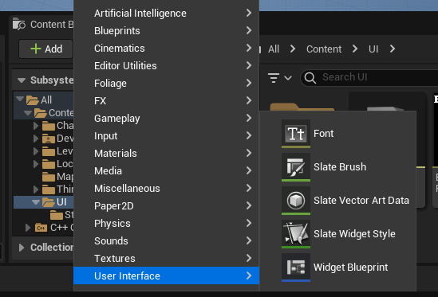
В появившемся всплывающем окне выбираем класс `UserWidget` и называем … `WidgetTest`.
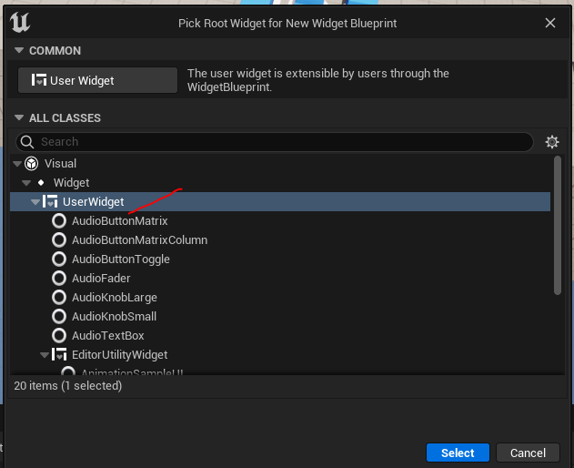
Открыв созданный файл мы увидим перед собой окно графического редактора, со списком `UMG` виджетов в панели `Pallete`.
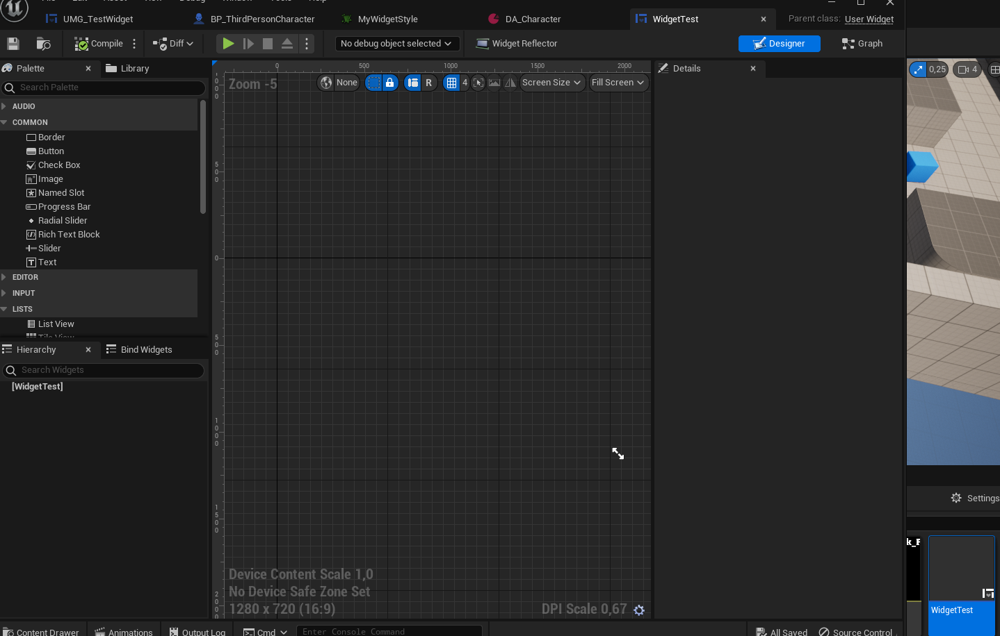
Эти виджеты можно перетаскивать на экран, формируя пользовательский интерфейс. В первую очередь тут нас интересуют виджеты `Overlay` и `CanvasPanel`, найти их можно в категории `Panel`.
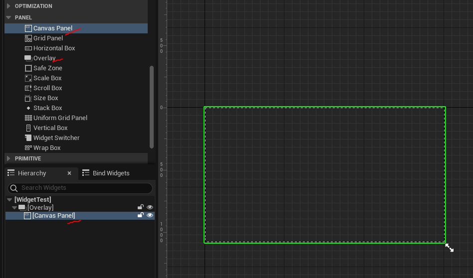
`Canvas` работает как гибкая сетка, скалируемая под размер экрана.
Хотя на самом деле я не должен тут объяснять, как работают базовые виджеты. Подразумевается, что покупатель, который полез в с++, уже знает как они работают…
Ладно, предположим, что читатель ничего не знает. Скорее всего большинство читателей эту часть статьи просто пропустит и будет соврешенно право.
В `Canvas` вы можете задать т.н. `Anchors`, то есть якоря, на которых будет крепиться добавленный туда элемент управления. Добавьте `Button`.
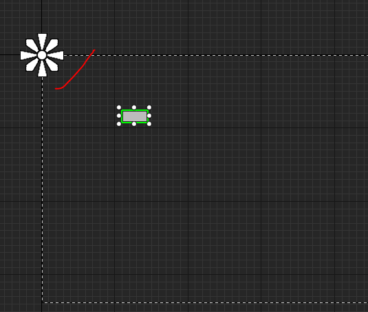
Якоря отображаются как … своеобразный цветок в левом верхнем углу экрана.
Именно на основе якорей кнопка выбирает собственные отступы, указанные в параметрах.
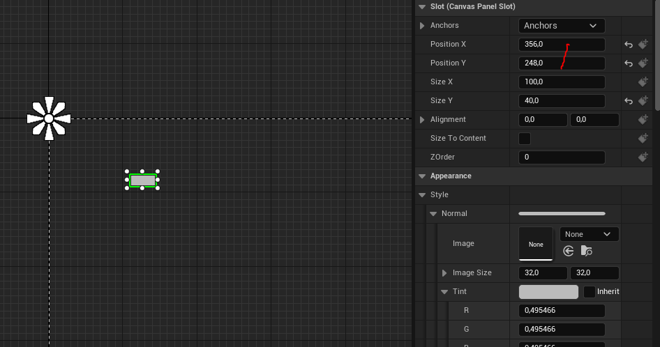
Якоря можно перетащить на позицию кнопки, чтобы четко зафиксировать ее положение, при изменении размеров экрана.
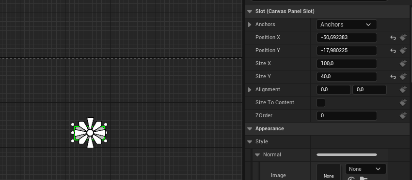
Кнопка может быть растянута под размер якорей. Потянув за верхнюю и боковую части "цветка" вы можете сформировать прямоугольник.
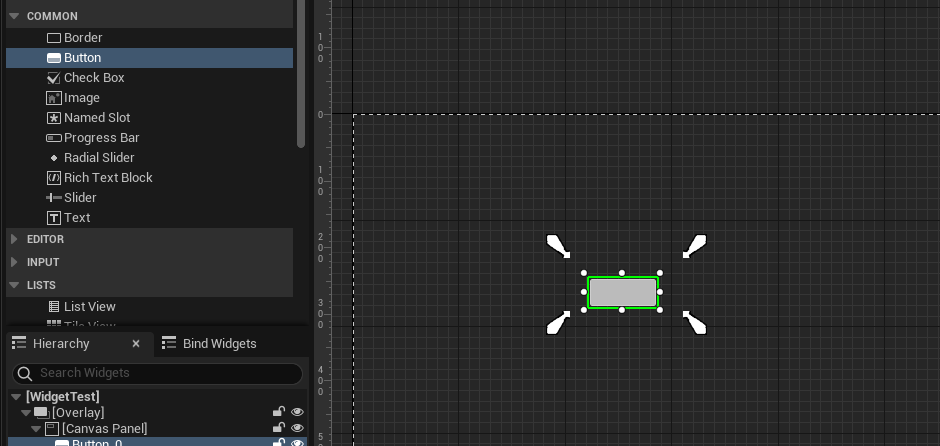
Чтобы растянуть кнопку под якоря, достаточно установить параметры отступов в `0`.
Установите `Offset Left`, `Offset Top`, `Offset Right` и `Offset Botton` в `0`.
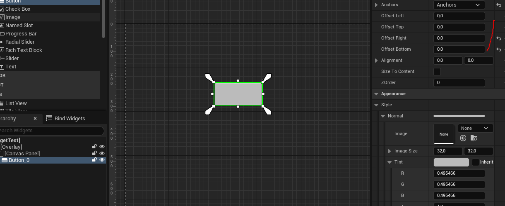
Как вы видите - кнопка растянулась.
## Добавление виджетов `UMG` на экран
Чтобы добавить `UMG` виджет на экран нам нужен `blueprint` класс - `PlayerController`.
Давайте его создадим.
В `Content Browser` идем `Add -> Blueprint Class`.
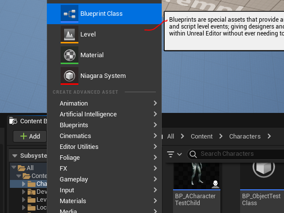
Из заготовок выбираем `Player Controller`.
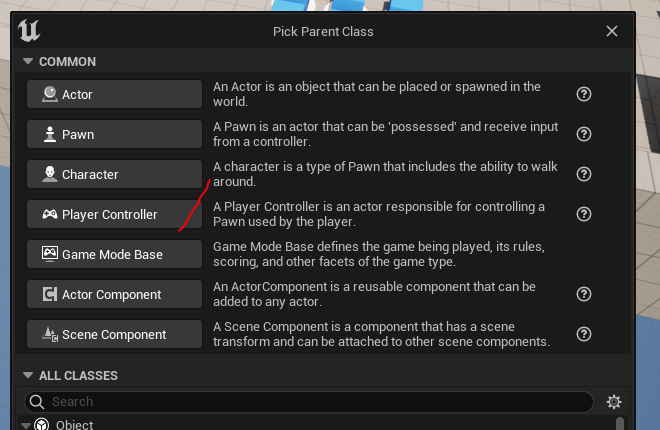
Называем `BP_PlayerController`.
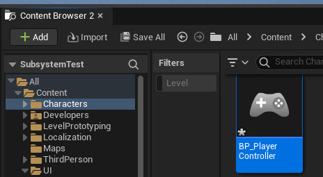
Открываем созданный файл и добавляем в событие `Begin Play` узел `Create Widget`.
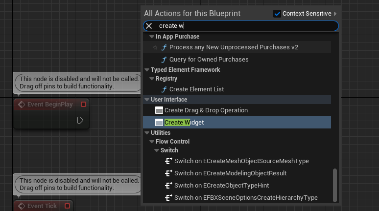
В созданном `blueprint` узле выбираем класс нашего виджета `WidgetTest`.
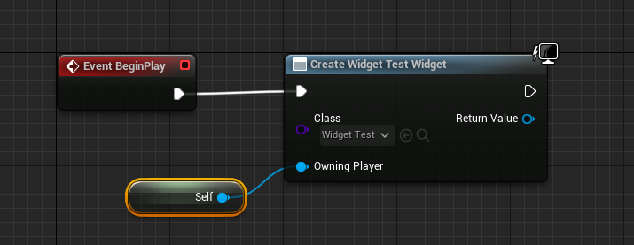
Чтобы виджет появился на экране игрока выбираем узел `Add To Player Screen`.
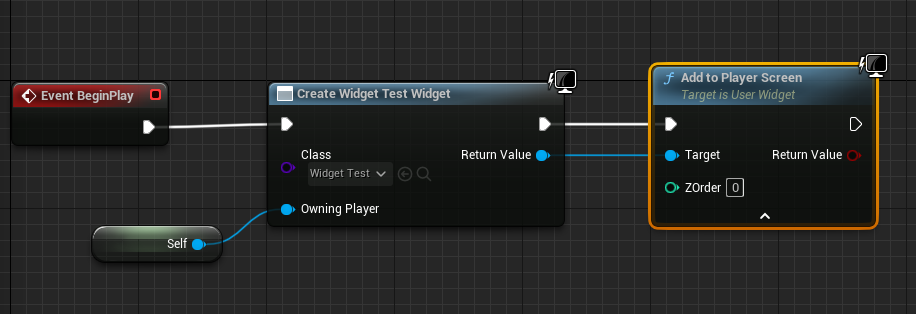
Теперь надо, чтобы наш контроллер загружался, при запуске игры. Для этого идем в `BP_ThirdPersonGameMode` и устанавливаем там в параметр `Player Controller Class` наш класс `BP_PlayerController`.
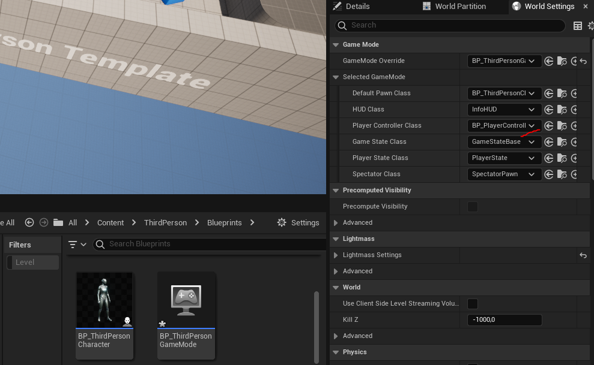
При запуске проекта виджет загружается и показывает кнопку, которую мы туда добавили ранее.
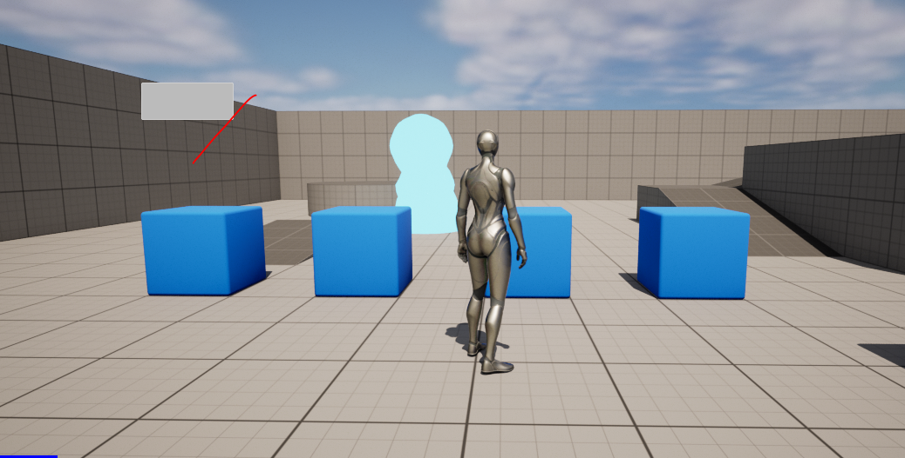
### Подготовка к работе
Создаем модуль `UMGRuntimeModule`.
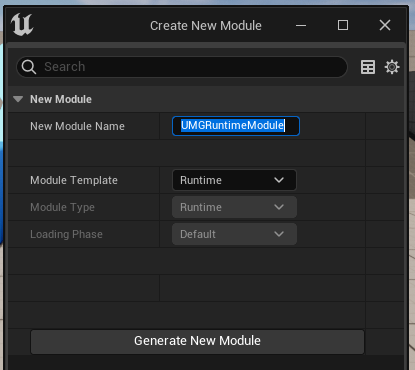
Теперь надо подключить зависимости от соответствующих модулей.
Открываем файл `.build.cs` и добавляем в зависимости строчку:
```cpp
PrivateDependencyModuleNames.AddRange(new string[] {"UMG", "Slate", "SlateCore" });
```
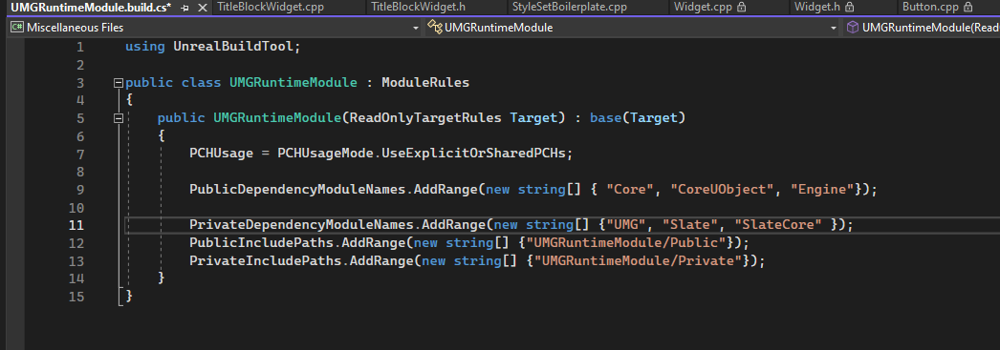
Это позволит использовать в созданном модуле как `Slate`, так и `UMG`.
## Совмещение с++ кода и `UMG` дизайна
Программирование `UMG` виджетов через `blueprint` код не всегда эффективно из-за проблем производительности. Иногда, часть логики лучше вынести в `с++`, потому что такой код работает во много раз быстрее `blueprint` кода.
При этом, в отличие от `Slate`, который полностью ориентирован на `с++`, у вас сохранится возможность использования графического редактора при организации элементов управления. Таким образом вы берете позитивные стороны обоих "миров".
От `blueprint` вы получаете удобный редактор интерфейса, а от `с++` - производительность.
За класс, позволяющий совмещать `UMG` дизайн с `с++` составляющей в Unreal Engine отвечает `UUserWidget`, который можно найти по пути `\Engine\Source\Runtime\UMG\Public\Blueprint\UserWidget.h`.
Добавляем собственный класс, унаследованный от `UUserWidget`.
`Tools -> New C++ Class -> All Classes -> User Widget`
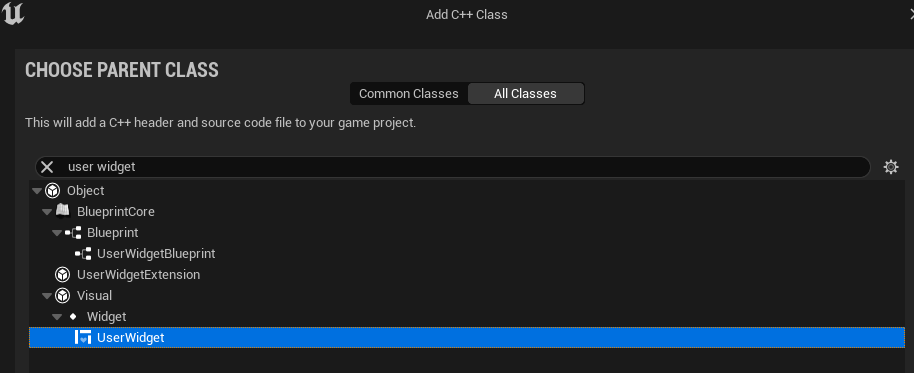
Я называю виджет `UserInterfaceCore`.
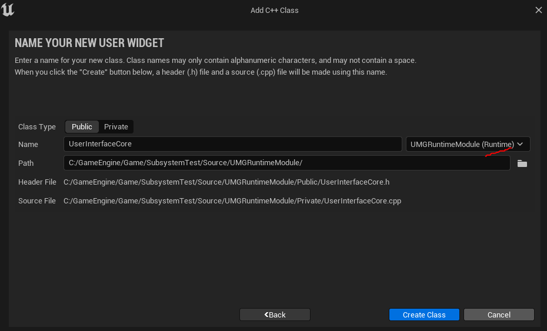
### Пишем код
Базовая заготовка, которую нам сгенерирует движок, никуда не годится. Ее надо переписать.
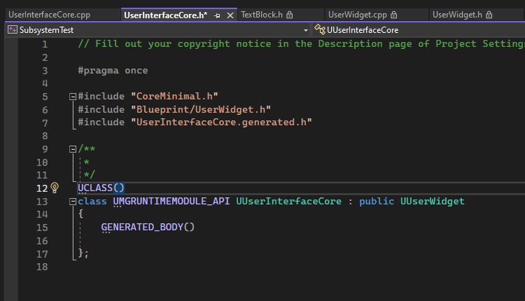
Классы, унаследованные от `UUserWidget` рекомендуется делать `abstract`, чтобы их нельзя было выбрать для спавна виджета. Потому что сами они элементы пользовательского интерфейса обычно не  содержат.
Система построена так, чтобы пользователь использовал `UUserWidget` для добавления `blueprintable` методов и переменных, которые затем становятся доступны в унаследованных `UMG` виджетах.
Поправим класс и добавим в него какую-нибудь примитивную функцию.
```cpp
//.h
#pragma once
#include "CoreMinimal.h"
#include "Blueprint/UserWidget.h"
#include "UserInterfaceCore.generated.h"
/**
 * Game User Interface base class
 */
UCLASS(abstract)
class UMGRUNTIMEMODULE_API UUserInterfaceCore : public UUserWidget
{
	GENERATED_BODY()
public:
	// constructor
	// We can set default values in constructor
	// we also can override some predefined default values
	UUserInterfaceCore(const FObjectInitializer& ObjectInitializer);
	// simple blueprintable variable
	UPROPERTY(EditAnywhere, BlueprintReadWrite, Category = "Data", Setter, BlueprintSetter = "SetNumericValue")
	float NumericValue;
	// Setter for NumericValue
	UFUNCTION(BlueprintCallable, Category = "Data")
	void SetNumericValue(const float inValue);
};
//...
//.cpp
#include "UserInterfaceCore.h"
// We can set default values in constructor
// we also can override some predefined default values
UUserInterfaceCore::UUserInterfaceCore(const FObjectInitializer& ObjectInitializer)
	: Super(ObjectInitializer)
	, NumericValue(0)
{
}
// Setter for NumericValue
void UUserInterfaceCore::SetNumericValue(const float inValue)
{
	NumericValue = inValue;
}
```
Полученный класс `UUserInterfaceCore` может быть установлен в качестве `parent` виджета для нашего `blueprint` класса `WidgetTest`.
В данный момент `parent` классом виджета является просто заглушка `UserWidget`.
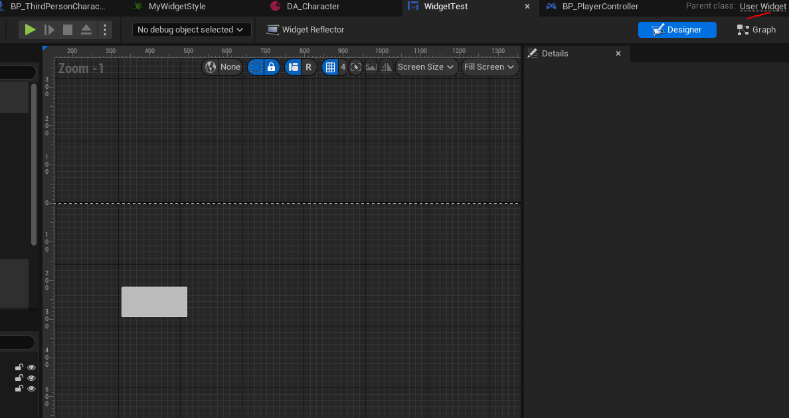
Мы можем заменить ее на класс `UserInterfaceCore`, который только что создали.
Для этого, в редакторе `UMG`, идем `File -> Reparent Blueprint`.
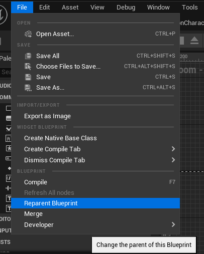
В появившемся меню выбираем класс `UserInterfaceCore`.
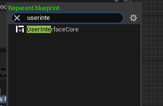
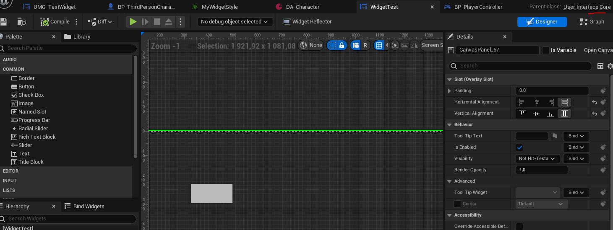
Если теперь перейти в `Graph` секцию редактора, можно увидеть, что в панели `Details` повилась переменная `NumericValue`.
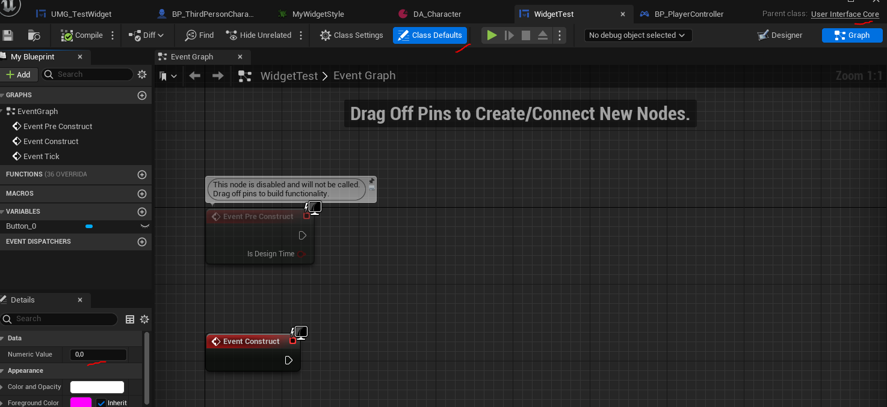
Так-же в редакторе будет доступна функция `SetNumericValue`.
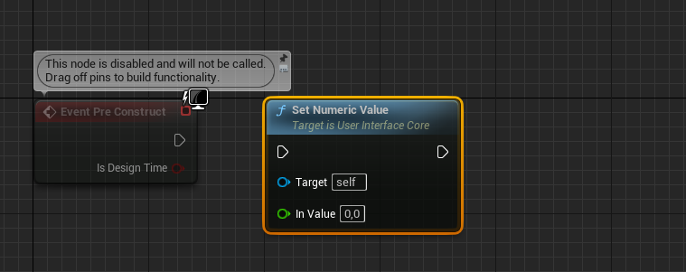
Используя такой подход разработчик может добавлять любую сложную логику внутрь с++ функций и совмещать производительность `с++` с визуальным редактором `blueprint`.
### `Meta=(BindWidget)`
Через класс, унаследованный от `UUserWidget` можно запрашивать у разработчика те или иные виджеты.
Делается это с использованием параметра `Meta = (BindWidget)`.
```cpp
// This will force user to add TextBlock with name "CharacterName" to the UMG editor
UPROPERTY(EditAnywhere, BlueprintReadWrite, Category = "Character", Meta = (BindWidget))
UTextBlock* CharacterName;
```
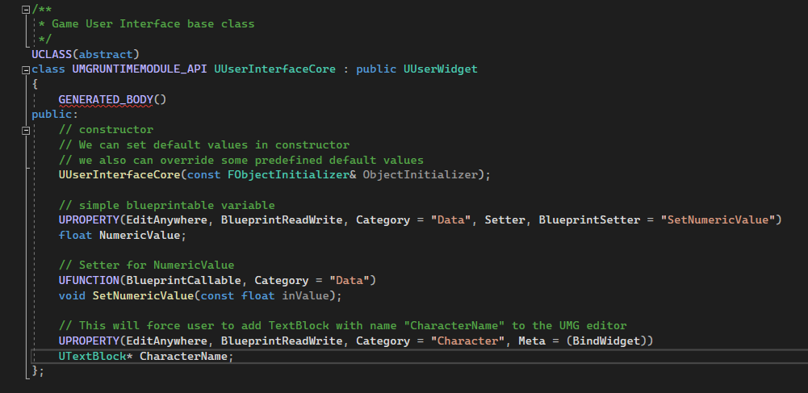
Если скомпилировать код нашего класса, с добавленной выше строчкой, то в редакторе `UMG` перед нами появится ошибка: `A required widget binding "CharacterName" of type  Text  was not found.`.
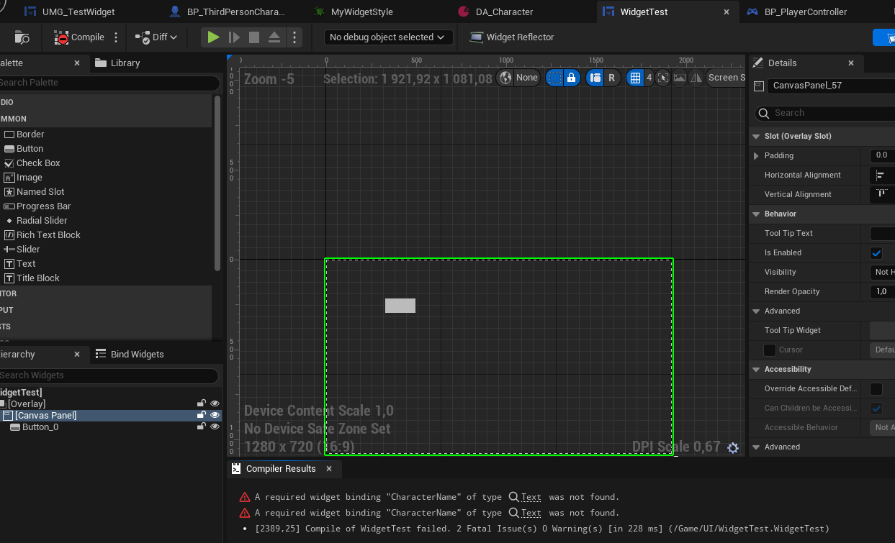
Ошибка прямо говорит разработчику, что на сцене должен присутствовать виджет типа `Text` с именем `CharacterName`.
Если добавить соответствующий блок - ошибка пропадет.
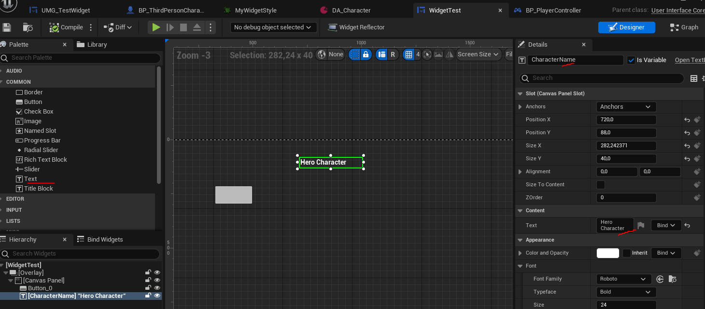
Указатель на добавленный элемент управления автоматически передается в с++ код.
Это очень удобно.
### `RebuildWidget`
Метод `RebuildWidget` является ключевым для любого виджета `UMG`. В этом методе происходит сборка виджета из элементов `Slate`. Так-же мы можем использовать этот метод для добавления на сцену собственных виджетов прямо через с++ код.
```cpp
//.h
// this method can be used to make widgets directly, if necessary
virtual TSharedRef<SWidget> RebuildWidget() override;
// function to bind ConstructedButton
UFUNCTION(BlueprintCallable, Category = "Bindings")
void OnClickedConstructedButton();
// Dynamically constructed button, initialised in RebuildWidget method
UPROPERTY(EditAnywhere, BlueprintReadWrite, Category = "Controls")
UButton* ConstructedButton;
//.cpp
// this method can be used to make widgets directly, if necessary
TSharedRef<SWidget> UUserInterfaceCore::RebuildWidget() {
	TSharedRef<SWidget> SlateRootWidget = Super::RebuildWidget(); // call parent
	if (WidgetTree)
	{
		if (CanvasPanel != nullptr) {
			ConstructedButton = WidgetTree->ConstructWidget<UButton>(UButton::StaticClass(), FName("ConstructedButton"));
			// add click event to the button
			FScriptDelegate ClickDelegate;
			ClickDelegate.BindUFunction(this, FName("OnClickedConstructedButton"));
			ConstructedButton->OnClicked.Add(ClickDelegate);
			UCanvasPanelSlot* CvSlot = CanvasPanel->AddChildToCanvas(ConstructedButton);
			CvSlot->SetAnchors(FAnchors{ 0.1f, 0.1f }); // slightly left upper corner
			// set UserContext to make new control editable
			if (GetPlayerContext().IsValid()) {
				UUserWidget* ButtonCasted = Cast<UUserWidget>(ConstructedButton);
				if (ButtonCasted != nullptr) {
					ButtonCasted->SetPlayerContext(GetPlayerContext());
				}
			}
		}
	}
	return SlateRootWidget;
}
// Dynamically constructed button, initialised in RebuildWidget method
void UUserInterfaceCore::OnClickedConstructedButton()
{
	UE_LOG(LogTemp, Warning, TEXT("Button Clicked"))
}
```
Стоит отметить, что делать так НЕ СТОИТ, это плохая идея. Что не отмеяет саму возможность.
Виджеты созданные через `RebuildWidget` не будут доступны для редактирования и будут присутствовать на сцене всегда.
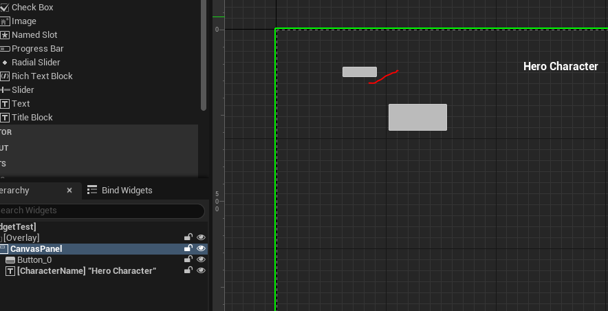
При этом вы не найдете динамические виджеты в иерархии сцены.
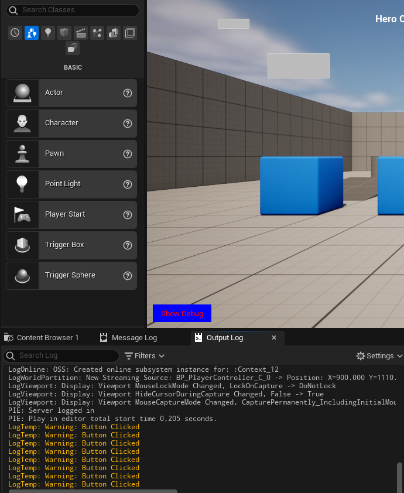
События, привязанные к динамические созданным виджетам будут работать нормально.
### Полный код класса
#### Файл `UserInterfaceCore.h`
```cpp
#pragma once
#include "CoreMinimal.h"
#include "Blueprint/UserWidget.h"
#include "Blueprint/WidgetTree.h" // WidgetTree
#include "Components/TextBlock.h" // UTextBlock
#include "Components/Button.h" // UButton
#include "Components/CanvasPanel.h" // UCanvasPanel
#include "Components/CanvasPanelSlot.h" // UCanvasPanelSlot
#include "UserInterfaceCore.generated.h"
/**
 * Game User Interface base class
 */
UCLASS(abstract)
class UMGRUNTIMEMODULE_API UUserInterfaceCore : public UUserWidget
{
	GENERATED_BODY()
public:
	// constructor
	// We can set default values in constructor
	// we also can override some predefined default values
	UUserInterfaceCore(const FObjectInitializer& ObjectInitializer);
	// this method can be used to make widgets directly, if necessary
	virtual TSharedRef<SWidget> RebuildWidget() override;
	// simple blueprintable variable
	UPROPERTY(EditAnywhere, BlueprintReadWrite, Category = "Data", Setter, BlueprintSetter = "SetNumericValue")
	float NumericValue;
	// Setter for NumericValue
	UFUNCTION(BlueprintCallable, Category = "Data")
	void SetNumericValue(const float inValue);
	// function to bind ConstructedButton
	UFUNCTION(BlueprintCallable, Category = "Bindings")
	void OnClickedConstructedButton();
	// This will force user to add TextBlock with name "CharacterName" to the UMG editor
	UPROPERTY(EditAnywhere, BlueprintReadWrite, Category = "Controls", Meta = (BindWidget))
	UTextBlock* CharacterName;
	// Canvas Panel will be here
	UPROPERTY(EditAnywhere, BlueprintReadWrite, Category = "Controls", Meta = (BindWidget))
	UCanvasPanel* CanvasPanel;
	// Dynamically constructed button, initialised in RebuildWidget method
	UPROPERTY(EditAnywhere, BlueprintReadWrite, Category = "Controls")
	UButton* ConstructedButton;
};
```
#### Файл `UserInterfaceCore.cpp`
```cpp
#include "UserInterfaceCore.h"
// We can set default values in constructor
// we also can override some predefined default values
UUserInterfaceCore::UUserInterfaceCore(const FObjectInitializer& ObjectInitializer)
	: Super(ObjectInitializer)
	, NumericValue(0)
{
}
// Setter for NumericValue
void UUserInterfaceCore::SetNumericValue(const float inValue)
{
	NumericValue = inValue;
}
// this method can be used to make widgets directly, if necessary
TSharedRef<SWidget> UUserInterfaceCore::RebuildWidget() {
	TSharedRef<SWidget> SlateRootWidget = Super::RebuildWidget(); // call parent
	if (WidgetTree)
	{
		if (CanvasPanel != nullptr) {
			ConstructedButton = WidgetTree->ConstructWidget<UButton>(UButton::StaticClass(), FName("ConstructedButton"));
			// add click event to the button
			FScriptDelegate ClickDelegate;
			ClickDelegate.BindUFunction(this, FName("OnClickedConstructedButton"));
			ConstructedButton->OnClicked.Add(ClickDelegate);
			UCanvasPanelSlot* CvSlot = CanvasPanel->AddChildToCanvas(ConstructedButton);
			CvSlot->SetAnchors(FAnchors{ 0.1f, 0.1f }); // slightly left upper corner
			// set UserContext to make new control editable
			if (GetPlayerContext().IsValid()) {
				UUserWidget* ButtonCasted = Cast<UUserWidget>(ConstructedButton);
				if (ButtonCasted != nullptr) {
					ButtonCasted->SetPlayerContext(GetPlayerContext());
				}
			}
		}
	}
	return SlateRootWidget;
}
// Dynamically constructed button, initialised in RebuildWidget method
void UUserInterfaceCore::OnClickedConstructedButton()
{
	UE_LOG(LogTemp, Warning, TEXT("Button Clicked"))
}
```
## Собственные UMG виджеты
Все `UMG` виджеты являются высокоуровневой оберткой над `Slate`. При необходимости, разработчик может написать свой собственный уникальный виджет, который ничем не будет отличаться от тех, что представлены в системе.
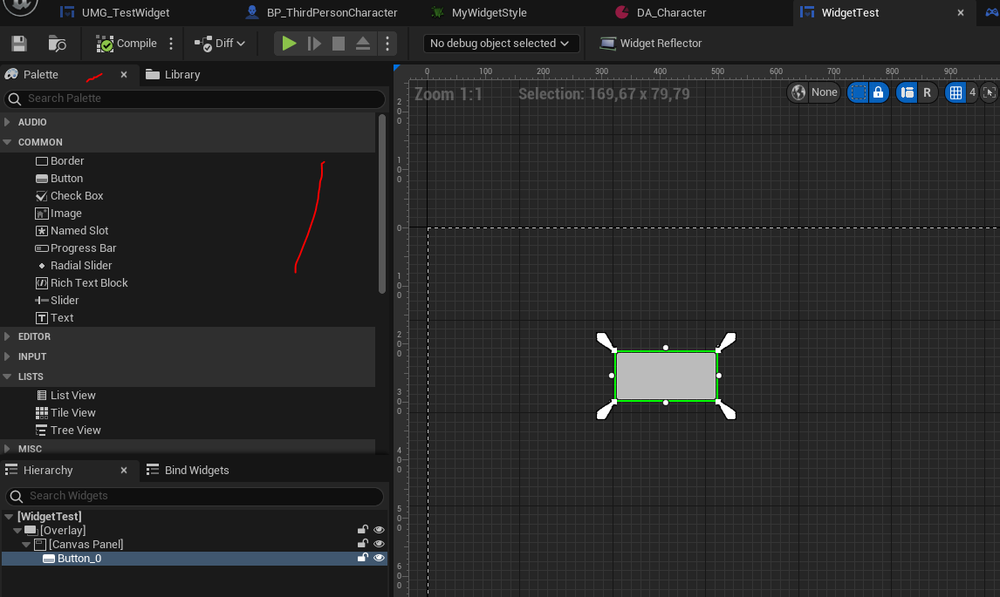
Все виджеты, которые вы видите в меню `Pallete` редактора `UMG` могут быть найдены в папке движка по пути `\Engine\Source\Runtime\UMG\Public\Components\`.
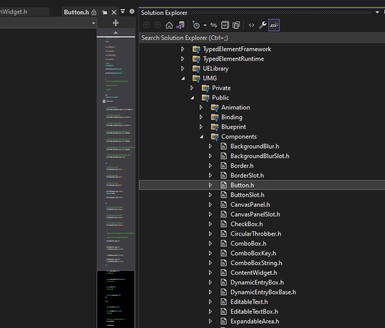
Каждый `UMG` виджет, так или иначе, наследуется от базового класса `UWidget`. Найти его можно по пути `\Engine\Source\Runtime\UMG\Public\Components\Widget.h`.
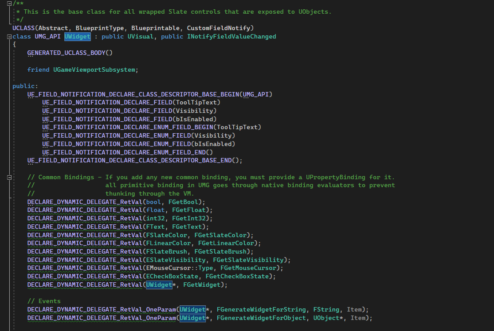
Данный класс содержит базовый набор переменных и методов, доступных для каждого `UMG` виджета.
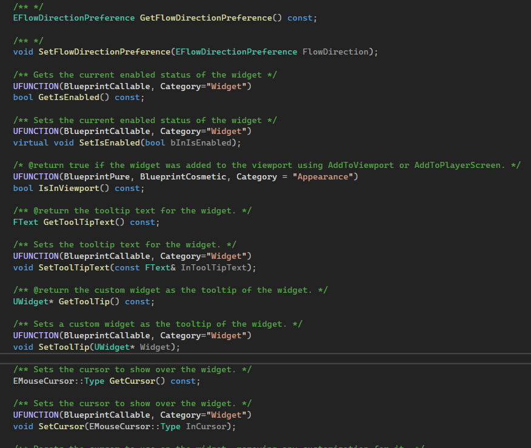
Давайте посмотрим, как устроен стандартный `UMG` виджет, на примере класса `\Engine\Source\Runtime\UMG\Public\Components\Button.h`.
Внутри класса мы видим указатель на виджет `Slate`, который хранит в себе кнопку.
```cpp
TSharedPtr<SButton> MyButton;
```
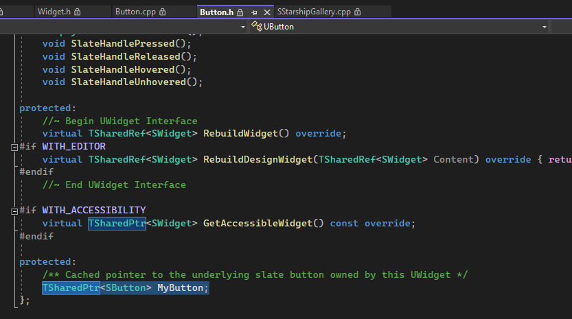
Данный указатель инициализируется в методе `RebuildWidget` и удаляется в методе `ReleaseSlateResources`.
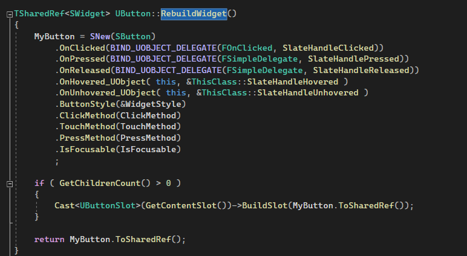
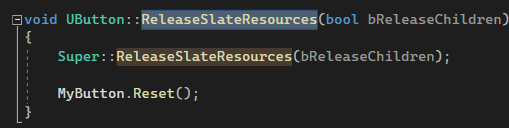
Рассмотрим эти методы виджета.
### `RebuildWidget`
Ключевым методом в классе `UWidget` является `RebuildWidget`, именно в этом методе разработчик должен формировать итоговый вид виджета.
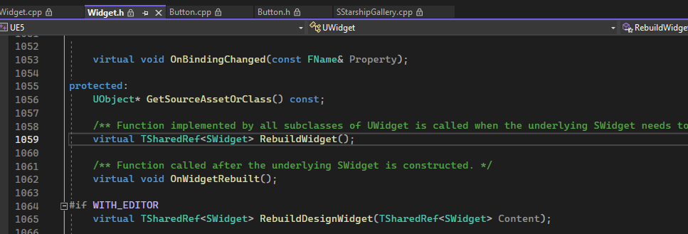
Делается сборка виджета с применением `Slate`. Например, кнопка `UButton` собирается так:
```cpp
TSharedRef<SWidget> UButton::RebuildWidget()
{
	MyButton = SNew(SButton)
		.OnClicked(BIND_UOBJECT_DELEGATE(FOnClicked, SlateHandleClicked))
		.OnPressed(BIND_UOBJECT_DELEGATE(FSimpleDelegate, SlateHandlePressed))
		.OnReleased(BIND_UOBJECT_DELEGATE(FSimpleDelegate, SlateHandleReleased))
		.OnHovered_UObject( this, &ThisClass::SlateHandleHovered )
		.OnUnhovered_UObject( this, &ThisClass::SlateHandleUnhovered )
		.ButtonStyle(&WidgetStyle)
		.ClickMethod(ClickMethod)
		.TouchMethod(TouchMethod)
		.PressMethod(PressMethod)
		.IsFocusable(IsFocusable)
		;
	if ( GetChildrenCount() > 0 )
	{
		Cast<UButtonSlot>(GetContentSlot())->BuildSlot(MyButton.ToSharedRef());
	}
	return MyButton.ToSharedRef();
}
```
### `SynchronizeProperties`
Метод `SynchronizeProperties` позволяет синхронизировать параметры между `UMG` виджетом и его `Slate` реализацией.
В `UButton` данный метод выглядит так:
```cpp
void UButton::SynchronizeProperties()
{
	Super::SynchronizeProperties();
	MyButton->SetColorAndOpacity( ColorAndOpacity );
	MyButton->SetBorderBackgroundColor( BackgroundColor );
}
```
### `ReleaseSlateResources`
Методы `ReleaseSlateResources`  служит для очистки памяти от указателей на `Slate` виджеты.
```cpp
void UButton::ReleaseSlateResources(bool bReleaseChildren)
{
	Super::ReleaseSlateResources(bReleaseChildren);
	MyButton.Reset();
}
```
### Виджет `TitleBlock`
Для демонстрации возможностей системы `UMG`, предлагаю реализовать собственный виджет, полностью на с++ и `Slate`. Пусть это будет `TitleBlock`, блок заголовка, с двумя картинками слева и справа.
Добавляем новый класс в наш модуль. Для этого идем:`Tools -> New C++ Class -> All Classes`.
Ищем класс `WidgetBlueprint`.
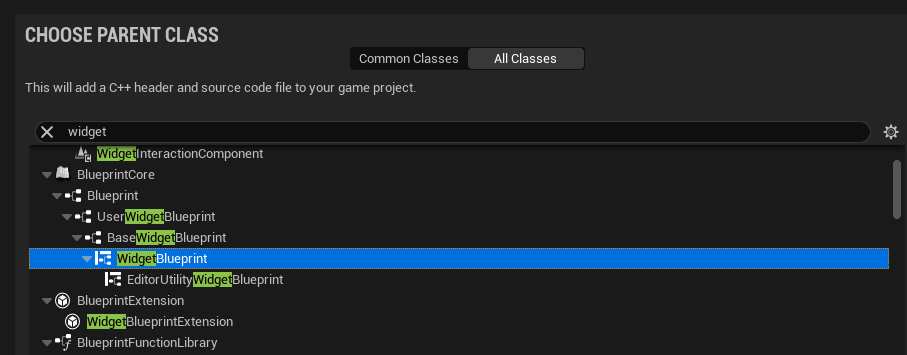
Я называю свой виджет `TitleBlockWidget`.
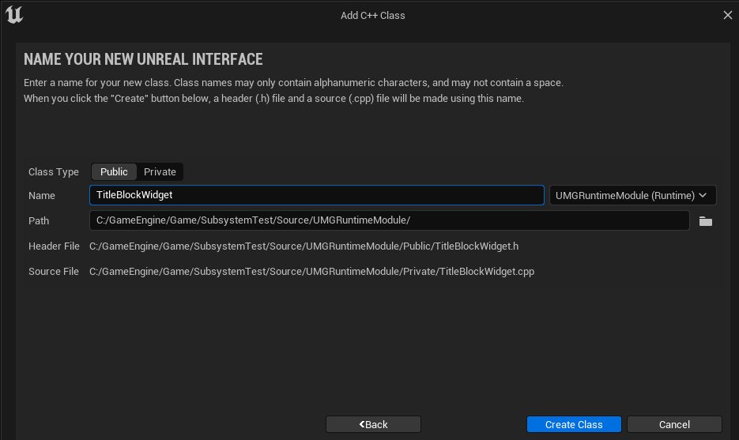
Далее нужно выполнить команду `Tools -> Refresh Visual Studio 2022 Project`, чтобы добавленные файлы появились в `Solution Explorer`.
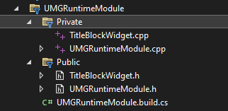
В созданных файлах я реализовал следующий код:
#### Файл `TitleBlockWidget.h`
```cpp
#pragma once
#include "CoreMinimal.h"
#include "Components/Widget.h" //  UMG Widget
#include "Components/TextBlock.h" //  UMG TextBlock widget
#include "Widgets/SWidget.h" // Slate Widget
#include "Widgets/SBoxPanel.h" // SHorizontalBox
#include "Widgets/Layout/SScaleBox.h" // SScaleBox
#include "Blueprint/UserWidget.h" // UUserWidget
#include "Components/TextWidgetTypes.h" // widget with text
#include "TitleBlockWidget.generated.h"
#define LOCTEXT_NAMESPACE "TitleBlockWidgetText"
/**
 * Title Block widget with corners
 */
UCLASS(BlueprintType, meta = (DisplayName = "Title Block"))
class UMGRUNTIMEMODULE_API UTitleBlockWidget : public UWidget // UUserWidget
{
	GENERATED_BODY()
public:
	// constructor
	// here we can override some class default values
	UTitleBlockWidget(const FObjectInitializer& ObjectInitializer)
		: Super(ObjectInitializer)
	{
		static ConstructorHelpers::FObjectFinder<UObject> RobotoFontObj(*UWidget::GetDefaultFontName());
		Font = FSlateFontInfo(RobotoFontObj.Object, 24, FName("Italic"));
		ColorAndOpacity = FLinearColor::Green;
		Text = LOCTEXT("TitleBlockWidgetDefaultText", "Text");
		Justification = ETextJustify::Center;
	}
	//~ Begin UWidget Interface
	// must return pallete category of widget in UMG Editor
	virtual const FText GetPaletteCategory() override;
	// main method where we form widget
	virtual TSharedRef<SWidget> RebuildWidget() override;
	// method where we should sinc properties with the widget
	virtual void SynchronizeProperties() override;
	//~ End UWidget Interface
	//~ Begin UVisual Interface
	// this is important method. Here we should destroy all our widget's pointers
	virtual void ReleaseSlateResources(bool bReleaseChildren) override;
	//~ End UVisual Interface
	/**
	 * Text Justification
	 */
	 // Text alignment in text block property
	UPROPERTY(EditAnywhere, BlueprintReadWrite, Getter, Setter, BlueprintSetter = "SetJustification", Category = "Appearance")
		TEnumAsByte<ETextJustify::Type> Justification;
	// Getter
	const ETextJustify::Type GetJustification() const {
		return Justification;
	}
	// Text block text justification setter
	UFUNCTION(BlueprintCallable, Category = "Appearance", meta = (DisplayName = "SetJustification (Type)"))
	void SetJustification(ETextJustify::Type InJustification);
	/**
	 * Text Property
	 */
	UPROPERTY(EditAnywhere, BlueprintReadWrite, Getter, Setter, BlueprintGetter = "GetText", BlueprintSetter = "SetText", Category = "Content", meta = (MultiLine = "true"))
	FText Text;
	// Will return Text Block Text
	UFUNCTION(BlueprintCallable, Category = "Widget", meta = (DisplayName = "GetText (Text)"))
	FText GetText() const;
	// Allows to set text into widget
	UFUNCTION(BlueprintCallable, Category = "Widget", meta = (DisplayName = "SetText (Text)"))
	void SetText(FText InText);
	// used to bind value of Text
	UPROPERTY()
	FGetText TextDelegate;
	/**
	 * ColorAndOpacity
	 */
	UPROPERTY(EditAnywhere, BlueprintReadWrite, Getter, Setter, BlueprintSetter = "SetColorAndOpacity", Category = "Appearance")
	FSlateColor ColorAndOpacity;
	// Getter for ColorAndOpacity, called automatically since there is Getter modifier on
	FSlateColor GetColorAndOpacity() const;
	// Setter for ColorAndOpacity
	UFUNCTION(BlueprintCallable, Category = "Appearance")
	void SetColorAndOpacity(FSlateColor InColorAndOpacity);
	// used to bind value of ColorAndOpacity
	UPROPERTY()
	FGetSlateColor ColorAndOpacityDelegate;
	/**
	 * Font
	 */
	UPROPERTY(EditAnywhere, BlueprintReadWrite, Getter, Setter, BlueprintSetter = "SetFont", Category = "Appearance")
	FSlateFontInfo Font;
	// Setter for Font
	UFUNCTION(BlueprintCallable, Category = "Appearance")
	void SetFont(FSlateFontInfo InFontInfo);
	// Getter for Font
	const FSlateFontInfo& GetFont() const { return Font; }
	/**
	 * LeftImage
	 */
	UPROPERTY(EditAnywhere, BlueprintReadWrite, Getter, Setter, BlueprintSetter = "SetLeftCornerImage", Category = "Appearance")
	FSlateBrush LeftCornerImage;
	UFUNCTION(BlueprintCallable, Category = "Appearance")
	void SetLeftCornerImage(FSlateBrush InImage);
	const FSlateBrush& GetLeftCornerImage() const { return LeftCornerImage; }
	/**
	 * RightImage
	 */
	UPROPERTY(EditAnywhere, BlueprintReadWrite, Getter, Setter, BlueprintSetter = "SetLeftCornerImage", Category = "Appearance")
	FSlateBrush RightCornerImage;
	UFUNCTION(BlueprintCallable, Category = "Appearance")
	void SetRightCornerImage(FSlateBrush InImage);
	const FSlateBrush& GetRightCornerImage() const { return RightCornerImage; }
protected:
	// make Text property bindable thru Unreal Editor
	PROPERTY_BINDING_IMPLEMENTATION(FText, Text);
	// make ColorAndOpacity property bindable thru Unreal Editor
	PROPERTY_BINDING_IMPLEMENTATION(FSlateColor, ColorAndOpacity);
	// Slate Widget pointers
	TSharedPtr<SHorizontalBox> WidgetContent;
	TSharedPtr<STextBlock> TextBlock;
	TSharedPtr<SImage> LeftCornerImageControl;
	TSharedPtr<SImage> RightCornerImageControl;
};
#undef LOCTEXT_NAMESPACE
```
#### Файл `TitleBlockWidget.cpp`
```cpp
#include "TitleBlockWidget.h"
#include UE_INLINE_GENERATED_CPP_BY_NAME(TitleBlockWidget)
#define LOCTEXT_NAMESPACE "TitleBlockWidgetText"
// must return pallete category of widget in UMG Editor
const FText UTitleBlockWidget::GetPaletteCategory()
{
	return LOCTEXT("Common", "Common");
}
// main method where we form widget
TSharedRef<SWidget> UTitleBlockWidget::RebuildWidget() {
	// form widget
	SAssignNew(WidgetContent, SHorizontalBox)
	+ SHorizontalBox::Slot()
	.VAlign(VAlign_Center)
	.HAlign(HAlign_Left)
	.AutoWidth()
	[
		SNew(SScaleBox)
		.Stretch(EStretch::ScaleToFit)
		[
			SAssignNew(LeftCornerImageControl, SImage)
			.DesiredSizeOverride(FVector2D{ 50.f, 50.f })
		]
	]
	+ SHorizontalBox::Slot()
	.VAlign(VAlign_Center)
	.HAlign(HAlign_Fill)
	[
		SAssignNew(TextBlock, STextBlock)
		.Text(FText::FromString("Test Text Block"))
		.Justification(Justification)
		.ColorAndOpacity(ColorAndOpacity)
		.Font(Font)
	]
	+ SHorizontalBox::Slot()
	.VAlign(VAlign_Center)
	.HAlign(HAlign_Right)
	.AutoWidth()
	[
		SNew(SScaleBox)
		.Stretch(EStretch::ScaleToFit)
		[
			SAssignNew(RightCornerImageControl, SImage)
			.DesiredSizeOverride(FVector2D{ 50.f, 50.f })
		]
	]
	;
	return WidgetContent.ToSharedRef();
}
// method where we should sinc properties with the widget
void UTitleBlockWidget::SynchronizeProperties() {
	Super::SynchronizeProperties();
	TAttribute<FText> TextBinding = PROPERTY_BINDING(FText, Text);
	TAttribute<FSlateColor> ColorAndOpacityBinding = PROPERTY_BINDING(FSlateColor, ColorAndOpacity);
	if (TextBlock.IsValid()) {
		TextBlock->SetText(TextBinding);
		TextBlock->SetFont(Font);
		TextBlock->SetColorAndOpacity(ColorAndOpacityBinding);
		TextBlock->SetJustification(Justification);
	}
	if (LeftCornerImageControl.IsValid()) {
		LeftCornerImageControl->SetImage(&LeftCornerImage);
	}
	if (RightCornerImageControl.IsValid()) {
		RightCornerImageControl->SetImage(&RightCornerImage);
	}
}
// this is important method. Here we should destroy all our widget's pointers
void UTitleBlockWidget::ReleaseSlateResources(bool bReleaseChildren) {
	// free all shared pointers here
	Super::ReleaseSlateResources(bReleaseChildren);
	TextBlock.Reset();
	WidgetContent.Reset();
	LeftCornerImageControl.Reset();
	RightCornerImageControl.Reset();
}
// Text block text justification setter
void UTitleBlockWidget::SetJustification(ETextJustify::Type InJustification)
{
	if (TextBlock.IsValid())
	{
		TextBlock->SetJustification(InJustification);
	}
}
// Will return Text Block Text
FText UTitleBlockWidget::GetText() const
{
	if (TextDelegate.IsBound() && !IsDesignTime()) {
		return TextDelegate.Execute();
	}
	else
	if (TextBlock.IsValid())
	{
		return TextBlock->GetText();
	}
	return Text;
}
// Allows to set text into widget
void UTitleBlockWidget::SetText(FText InText)
{
	Text = InText;
	if (TextBlock.IsValid())
	{
		TextBlock->SetText(InText);
	}
}
// Setter for ColorAndOpacity
void UTitleBlockWidget::SetColorAndOpacity(FSlateColor InColorAndOpacity)
{
	ColorAndOpacity = InColorAndOpacity;
	if (TextBlock.IsValid())
	{
		TextBlock->SetColorAndOpacity(InColorAndOpacity);
	}
}
// Getter for ColorAndOpacity, called automatically since there is Getter modifier on
FSlateColor UTitleBlockWidget::GetColorAndOpacity() const
{
	if (ColorAndOpacityDelegate.IsBound() && !IsDesignTime())
	{
		return ColorAndOpacityDelegate.Execute();
	}
	return ColorAndOpacity;
}
// Setter for Font
void UTitleBlockWidget::SetFont(FSlateFontInfo InFontInfo)
{
	Font = InFontInfo;
	if (TextBlock.IsValid())
	{
		TextBlock->SetFont(Font);
	}
}
void UTitleBlockWidget::SetLeftCornerImage(FSlateBrush InImage)
{
	LeftCornerImage = InImage;
	if (TextBlock.IsValid())
	{
		LeftCornerImageControl->SetImage(&InImage);
	}
}
void UTitleBlockWidget::SetRightCornerImage(FSlateBrush InImage)
{
	LeftCornerImage = InImage;
	if (TextBlock.IsValid())
	{
		LeftCornerImageControl->SetImage(&InImage);
	}
}
#undef LOCTEXT_NAMESPACE
```
Данный код позволяет создать виджет с названием `TitleBlock`. Виджет создается как один из интегрированных в систему и найти его можно в категории `Common`.
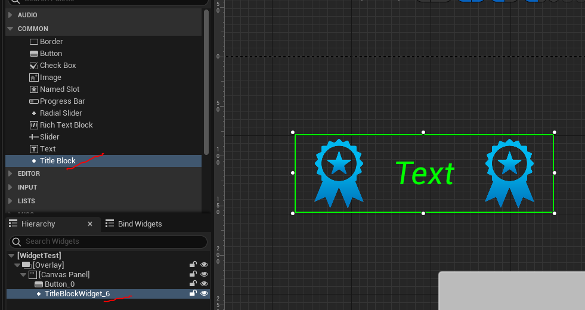
"По умолчанию" текст в виджете зеленый `Italic`.
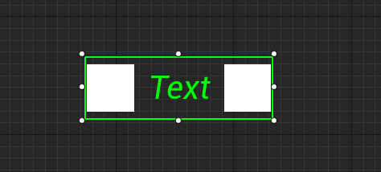
Для виджета возможно установить левую и правую картинку, а так-же общее направление текста.
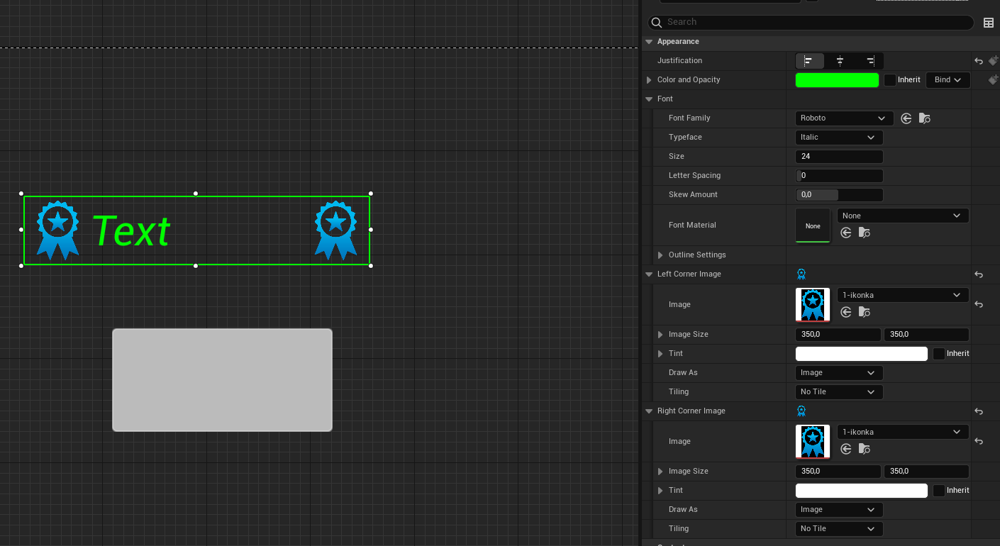
Шрифт тоже поддается изменению.
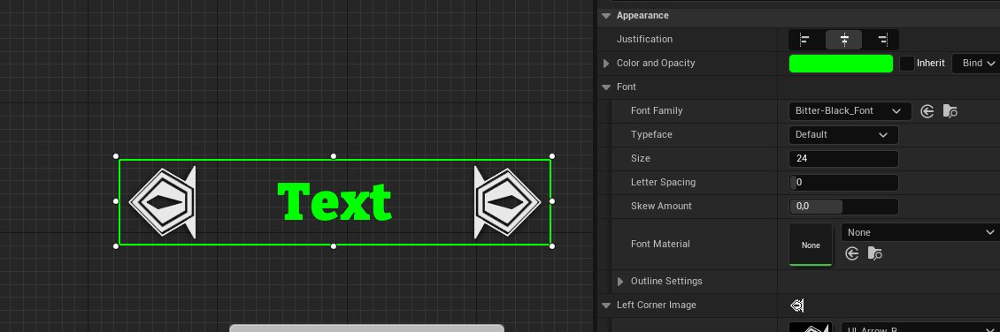
Все изменения работают и виджет может быть смело использован на практике.
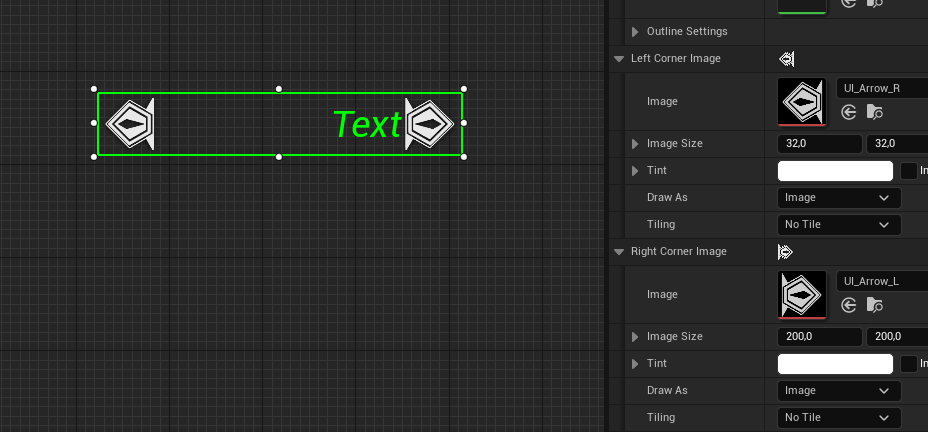
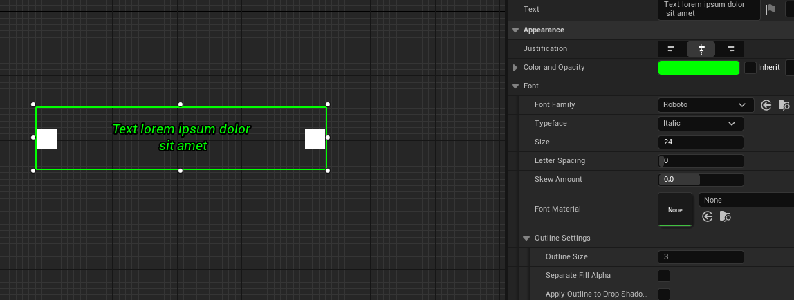
### Объяснение принципов
Виджет составлен мной из четырех элементов, это: контейнер `SHorizontalBox`, текстовый блок `STextBlock`, и две картинки `SImage`.
Указатели на данные элементы хранятся в `Protected` секции класса.
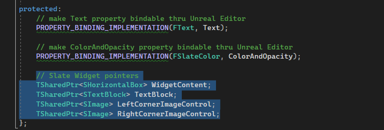
Сборка виджета и инициализация указателей происходит в методе `RebuildWidget`. При сборке виджеты получают начальные значения параметров, которые я вывел в редактор.
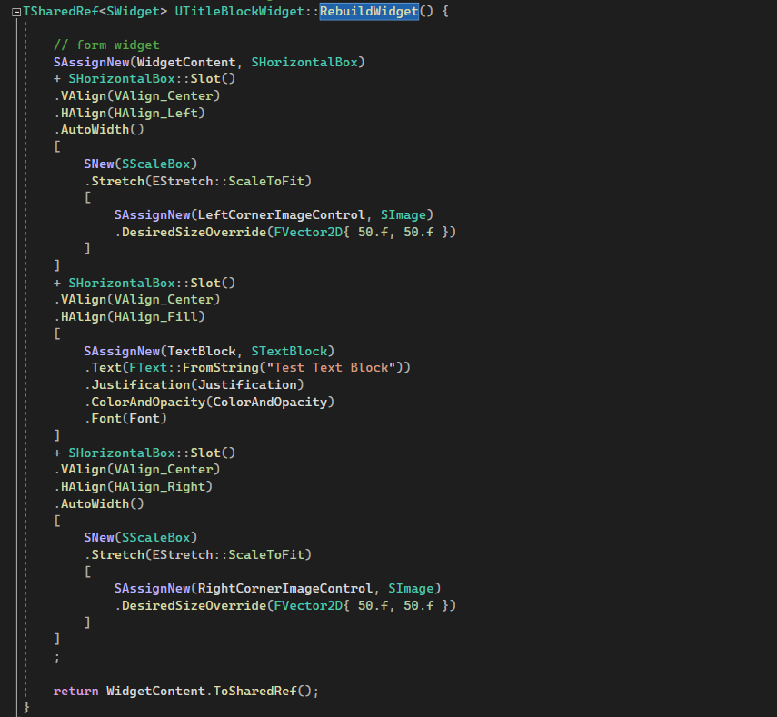
Параметры виджета позволяют менять текст `Text` , шрифт `Font`, цвет текста `ColorAndOpacity`, расположение текста в панели `Justification`, а так-же тип изображения в левой `LeftCornerImage` и правой картинке `RightCornerImage`.
При этом параметры `Text` и `ColorAndOpacity` могут быть привязаны к функции.
#### Привязываемые параметры
Привязываемые параметры могут динамически получать свои значения из `blueprint` функции. За это отвечает автоматически добавляемый к параметру переключатель `Bind`.
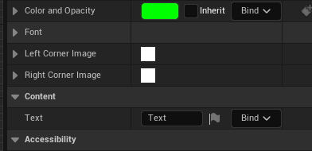
Чтобы создать такие параметры надо использовать макрос `PROPERTY_BINDING_IMPLEMENTATION` при задании параметра и макрос `PROPERTY_BINDING` при поулчении значения параметра.
Вот как это выглядит, на примере переменной `Text`.
```cpp
/**
 * Text Property
 */
UPROPERTY(EditAnywhere, BlueprintReadWrite, Getter, Setter, BlueprintGetter = "GetText", BlueprintSetter = "SetText", Category = "Content", meta = (MultiLine = "true"))
FText Text;
// Will return Text Block Text
UFUNCTION(BlueprintCallable, Category = "Widget", meta = (DisplayName = "GetText (Text)"))
FText GetText() const;
// Allows to set text into widget
UFUNCTION(BlueprintCallable, Category = "Widget", meta = (DisplayName = "SetText (Text)"))
void SetText(FText InText);
// used to bind value of Text
UPROPERTY()
FGetText TextDelegate;
protected:
	// make Text property bindable thru Unreal Editor
	PROPERTY_BINDING_IMPLEMENTATION(FText, Text);
```
Добавление макроса `PROPERTY_BINDING_IMPLEMENTATION` автоматически требует добавления для выбранной переменной функций `BlueprintSetter`, `BlueprintGetter`, а так-же делегата, к которому будет привязан параметр. В случае с текстом это `FGetText`.
Важно название `TextDelegate`.
Движок Unreal Engine имеет несколько предзаданных делегатов для подобных параметров.
Найти их можно в файле `\Engine\Source\Runtime\UMG\Public\Components\Widget.h`.
```cpp
// Common Bindings - If you add any new common binding, you must provide a UPropertyBinding for it.
// all primitive binding in UMG goes through native binding evaluators to prevent
// thunking through the VM.
DECLARE_DYNAMIC_DELEGATE_RetVal(bool, FGetBool);
DECLARE_DYNAMIC_DELEGATE_RetVal(float, FGetFloat);
DECLARE_DYNAMIC_DELEGATE_RetVal(int32, FGetInt32);
DECLARE_DYNAMIC_DELEGATE_RetVal(FText, FGetText);
DECLARE_DYNAMIC_DELEGATE_RetVal(FSlateColor, FGetSlateColor);
DECLARE_DYNAMIC_DELEGATE_RetVal(FLinearColor, FGetLinearColor);
DECLARE_DYNAMIC_DELEGATE_RetVal(FSlateBrush, FGetSlateBrush);
DECLARE_DYNAMIC_DELEGATE_RetVal(ESlateVisibility, FGetSlateVisibility);
DECLARE_DYNAMIC_DELEGATE_RetVal(EMouseCursor::Type, FGetMouseCursor);
DECLARE_DYNAMIC_DELEGATE_RetVal(ECheckBoxState, FGetCheckBoxState);
DECLARE_DYNAMIC_DELEGATE_RetVal(UWidget*, FGetWidget);
```
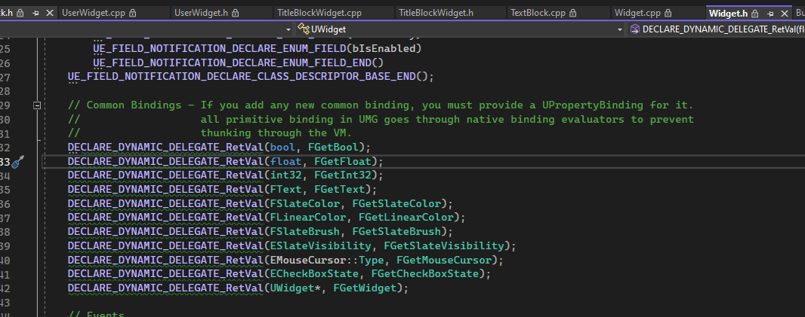
#### Категория виджета
За категорию, в которой появится виджет. отвечает метод `GetPaletteCategory`.
```cpp
//.h
// must return pallete category of widget in UMG Editor
virtual const FText GetPaletteCategory() override;
//...
//.cpp
// must return pallete category of widget in UMG Editor
const FText UTitleBlockWidget::GetPaletteCategory()
{
	return LOCTEXT("Common", "Common");
}
```
Я разместил виджет в категории `Common`.
### Добавление иконки для виджета
Единственное, чего не хватает нашему виджету в данный момент - нормальной иконки.
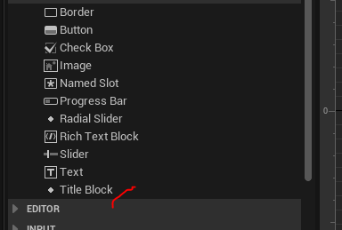
Давайте исправим этот недостаток.
Иконки виджетов, которые вы видите по умолчанию, заданы в файле `\Engine\Source\Runtime\UMG\Private\UMGStyle.cpp`.
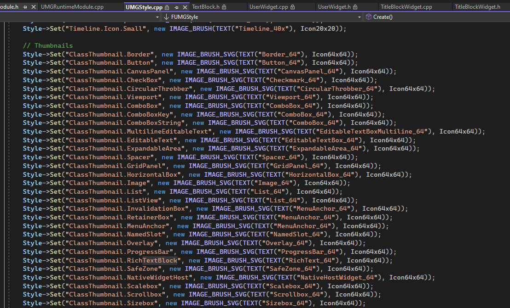
Я предлагаю использовать одну из встроенных в движок иконок, например иконку `TextBlock'а`. Найти ее можно в папке `Content` движка по пути `\Engine\Content\Editor\Slate\UMG`.
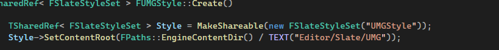
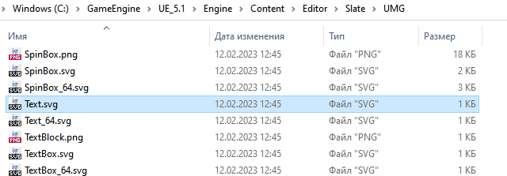
Чтобы зарегистрировать иконку для класса виджета, требуется создать `SlateStyleSet`. Однако, реализовывать целый паттерн в отдельных файлах для всего одного класса - излишне. `StyleSet` можно встроить прямо в логику конструктора модуля. Давайте это сделаем.
#### Файл `UMGRuntimeModule.h`
```cpp
#pragma once
#include "Modules/ModuleManager.h"
#include "Slate/SlateGameResources.h"
#include "Styling/ISlateStyle.h"
#include "Styling/SlateStyle.h"
#include "Styling/SlateStyleRegistry.h" // to register our styles in
DECLARE_LOG_CATEGORY_EXTERN(UMGRuntimeModule, All, All);
class FUMGRuntimeModule : public IModuleInterface
{
	public:
	/* Called when the module is loaded */
	virtual void StartupModule() override;
	/* Called when the module is unloaded */
	virtual void ShutdownModule() override;
	private:
	TSharedPtr<FSlateStyleSet> UiStyle;
};
```
#### Файл `UMGRuntimeModule.cpp`
```cpp
#include "UMGRuntimeModule.h"
DEFINE_LOG_CATEGORY(UMGRuntimeModule);
#define LOCTEXT_NAMESPACE "FUMGRuntimeModule"
void FUMGRuntimeModule::StartupModule()
{
	FCoreStyle::Get();
	// register custom widget style class
	if (!UiStyle.IsValid()) {
		//UiStyle = MakeShared<FSlateStyleSet>();
		UiStyle = TSharedPtr<FSlateStyleSet>(new FSlateStyleSet(FName("UMGRuntimeModuleStyles")));
		UiStyle->SetContentRoot(FPaths::EngineContentDir() / TEXT("Editor/Slate/UMG")); // see Engine\Source\Runtime\UMG\Private\UMGStyle.cpp
		// Common sizes for icons and thumbnails
		const FVector2D Icon64x64(64.f, 64.f);
		const FVector2D Icon16x16(16.0f, 16.0f);
		// Set the Images of the properties to be equal of our new images, finding the property names can be a bit tricky however.
		UiStyle->Set("ClassThumbnail.TitleBlockWidget",new FSlateVectorImageBrush(
                UiStyle->RootToContentDir(TEXT("Text_64"), TEXT(".svg")),
                Icon64x64
            ));
        UiStyle->Set("ClassIcon.TitleBlockWidget", new FSlateVectorImageBrush(
                UiStyle->RootToContentDir(TEXT("Text"), TEXT(".svg")),
                Icon16x16
            ));
		// register our styles
		FSlateStyleRegistry::RegisterSlateStyle(*UiStyle.Get());
	}
	UE_LOG(UMGRuntimeModule, Warning, TEXT("UMGRuntimeModule module has been loaded"));
}
void FUMGRuntimeModule::ShutdownModule()
{
	// unregister widget style and free memory
	if (!UiStyle.IsValid()) {
		FSlateStyleRegistry::UnRegisterSlateStyle(*UiStyle.Get());
		UiStyle.Reset();
	}
	UE_LOG(UMGRuntimeModule, Warning, TEXT("UMGRuntimeModule module has been unloaded"));
}
#undef LOCTEXT_NAMESPACE
IMPLEMENT_MODULE(FUMGRuntimeModule, UMGRuntimeModule)
```
Если вы читали мою статью про `SlateRuntime` то сразу поймете как тут все работает.
Первым шагом я регистрирую путь до папки `\Engine\Content\Editor\Slate\UMG` как `ContentRoot`.
```cpp
UiStyle->SetContentRoot(FPaths::EngineContentDir() / TEXT("Editor/Slate/UMG"));
```
Это позволяет использовать функцию `RootToContentDir`, которая автоматически этот путь подставляет для переданных в нее имен файлов.
```cpp
UiStyle->Set("ClassThumbnail.TitleBlockWidget",new FSlateVectorImageBrush(
        UiStyle->RootToContentDir(TEXT("Text_64"), TEXT(".svg")),
        Icon64x64
    ));
UiStyle->Set("ClassIcon.TitleBlockWidget", new FSlateVectorImageBrush(
        UiStyle->RootToContentDir(TEXT("Text"), TEXT(".svg")),
        Icon16x16
    ));
```
Далее берутся две иконки `Text.svg` и `Text_64.svg`, которые регистрируются в системе.
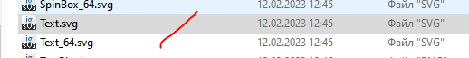
После компиляции кода - движок надо перезапустить, иначе иконка не загрузится. Так происходит из-за того, что конструктор модуля вызывается всего один раз при запуске движка.
При запуске вы можете наблюдать, что иконка `Text` применилась к нашему классу виджета `TitleBlockWidget`.
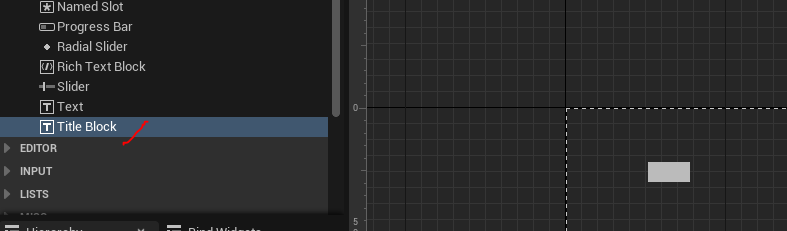
Теперь наш виджет почти не отличим от тех, которые поставляюстя вместе с движком `Unreal Engine`.