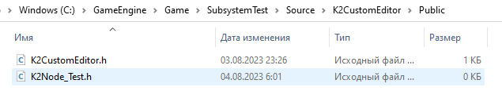
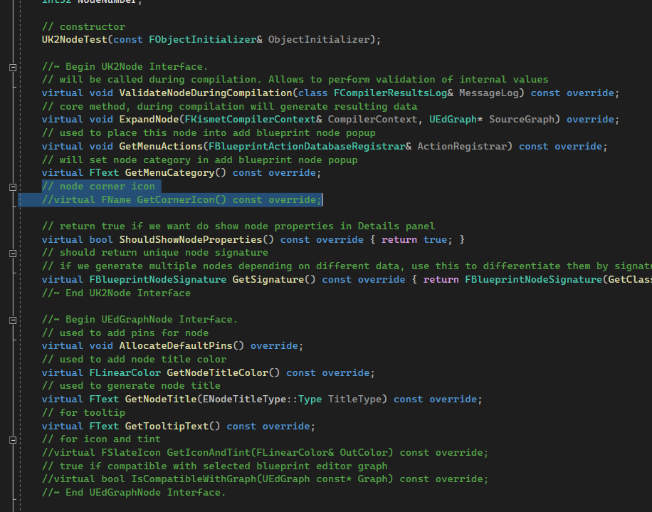
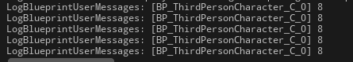

# `K2`
`K2` - или `Kismet2` это система, использующаяся для создания сложных `blueprint` узлов, в тех случаях, когда функционала `latent action` и `async action` не достаточно.
`K2` предоставляет разработчику низкоуровневый доступ к созданию практически любых `blueprint` узлов. При этом данная система - самая сложная для освоения в Unreal Engine.
Абсолютно вся базовая `blueprint` логика  движка сделана через систему `K2`. Включая узлы событий, вызовов функций и переменных.
## О системе
`K2` является частью модуля `BlueprintGraph`. Это `Engine` модуль, который можно найти по пути `\Engine\Source\Editor\BlueprintGraph\`.
За непосредственно систему `K2` отвечает глобальный класс `UK2Node`, который находится в файле `\Engine\Source\Editor\BlueprintGraph\Classes\K2Node.h`.


Класс `UK2Node` унаследован от другого не менее важного класса `UEdGraphNode`. Он отвечает за генерацию пинов и внешнее оформление ноды.
Найти его можно в файле `\Engine\Source\Runtime\Engine\Classes\EdGraph\EdGraphNode.h`.


Рекомендую открыть эти два класса в `Visual Studio`, потому что они содержат методы  и логику, которой мы будем пользоваться по ходу работы.
Методы, отвечающие за компиляцию `blueprint` ноды, а так-же за регистрацию этой ноды в редакторе относятся непосредственно к самому классу `UK2Node`.

В папке `\Engine\Source\Editor\BlueprintGraph\Classes\` можно найти примеры реализации большинства `blueprint` узлов доступных в редакторе "из коробки".

Эти примеры реализации будут послужат для нас отличным пособием при разработке собственных классов.
## Подготовка к работе
Для работы с системой `K2` нам понадобится целых два модуля: один для расширения редактора `Editor`, второй для `Runtime` библиотеки функций.
### Создаем `Editor` модуль
Создаем модуль `Editor` с названием `K2CustomEditor`. Тут будут размещаться `K2` ноды.

После того как модуль сгенерируется, необходимо установить порядок его загрузки. Открываем в текстовом редакторе файл `.uproject`.

Найдите в этом файле параметры модуля `K2CustomEditor` и измените их следующим образом:
```cpp
{
    "Name": "K2CustomEditor",
    "Type": "UncookedOnly",
    "LoadingPhase": "PreDefault"
},
```

Сохраните файл `.uproject` и перезапустите `Unreal Engine` с компиляцией проекта.
### Создаем `Runtime` модуль
Теперь нам нужен `Runtime` модуль с названием `K2Custom`. Тут будет библиотека функций.

Закрываем движок и пересобираем проект.
### Добавляем библиотеку функций
Поскольку `K2` ноды существуют только внутри редактора, их надо заменять аналогичной по функционалу `runtime` логикой.
Эту логику надо где-то размещать. Например - в библиотеке функций. Создадим ее.
Идем `Tools -> New C++ Class -> Blueprint Function Library`.

Я назвал библиотеку функций `K2RuntimeFunctionsLibrary`.

На данном этапе проект выглядит так:


### Добавляем зависимости
Теперь необходимо рассмотреть зависимости.
Открываем файл `.build.cs` у модуля `K2CustomEditor`.

Добавляем зависимости из списка, приведенного ниже:
```cpp
using UnrealBuildTool;
public class K2CustomEditor : ModuleRules
{
	public K2CustomEditor(ReadOnlyTargetRules Target) : base(Target)
	{
        PCHUsage = PCHUsageMode.UseExplicitOrSharedPCHs;
		PublicDependencyModuleNames.AddRange(new string[] { "Core", "CoreUObject", "Engine", "UnrealEd", "GameplayTags" });
        PrivateDependencyModuleNames.AddRange(new string[] {
			"Slate",
			"SlateCore",
            "BlueprintGraph",
            "Kismet",
            "KismetCompiler",
            "ToolMenus",
            "K2Custom" // Runtime Module
        });
        PublicIncludePaths.AddRange(new string[] {"K2CustomEditor/Public"});
		PrivateIncludePaths.AddRange(new string[] {"K2CustomEditor/Private"});
	}
}
```
## Простейшая `K2` нода
Первые классы для системы `K2` я буду создавать вручную. Чуть ниже я создам т.н. основной шаблон или `boilerplate`, который упростит вам создание новых `K2` нод. Но пока, давайте создадим и рассмотрим простейший `K2` класс в действии.
Переходим в папку модуля `K2CustomEditor` и добавляем в `/Public` и `/Private` директории файлы, соответственно, `K2Node_Test.h` и `K2Node_Test.cpp`.


Теперь необходимо выполните команду `Tools -> Refresh Visual Studio 2022 Project`, чтобы добавленные файлы отобразились в проекте.

В данный момент файлы пусты.

Предлагаю реализовать ноду, которая будет просто печатать переданное число в лог. Такая нода может быть описана следующим простым графом:


Для печати числа используем макрос `UE_LOG`. Его надо обернуть внутрь функции, для дальнейшего обращения.
```cpp
UFUNCTION(BlueprintCallable, meta = (BlueprintInternalUseOnly = true))
static void LogNumber(int Number) {
    UE_LOG(LogTemp, Warning, TEXT("Log Number = %i"), Number)
}
```
Сама функция должна быть добавлена в созданную ранее `Runtime` библиотеку функций `K2RuntimeFunctionsLibrary`.

Переходим непосредственно к коду будущей ноды.
### Файл `K2Node_Test.h`
```cpp
#pragma once
#include "CoreMinimal.h"
// Main File
#include "K2Node.h"
#include "K2Node_EaseFunction.h"
// EdGraph is part of K2
#include "EdGraph/EdGraphNode.h"
#include "EdGraph/EdGraphNodeUtils.h"
// Blueprint Utilities
#include "KismetCompiler.h"
#include "Kismet2/CompilerResultsLog.h"
#include "Kismet2/BlueprintEditorUtils.h"
#include "BlueprintActionDatabaseRegistrar.h"
//#include "GameFramework/PlayerController.h"
// UObject related includes
#include "UObject/ObjectMacros.h" // this will hide warnings from intellisense
#include "UObject/UObjectGlobals.h"
// Editor Blueprint Utilities
#include "BlueprintActionDatabase.h"
#include "BlueprintNodeSpawner.h"
// K2 Nodes that we refer to
#include "K2Node_CallFunction.h"
#include "K2Node_MacroInstance.h"
// runtime function library
#include "K2RuntimeFunctionsLibrary.h"
// .generated.h
#include "K2Node_Test.generated.h"
/**
 * K2 Node Test class
 */
UCLASS()
class K2CUSTOMEDITOR_API UK2NodeTest : public UK2Node
{
	GENERATED_BODY()
public:
	// variables
	UPROPERTY(EditAnywhere, Category="Data")
	int32 NodeNumber;
	// constructor
	UK2NodeTest(const FObjectInitializer& ObjectInitializer);
	//~ Begin UK2Node Interface.
	// will be called during compilation. Allows to perform validation of internal values
	virtual void ValidateNodeDuringCompilation(class FCompilerResultsLog& MessageLog) const override;
	// core method, during compilation will generate resulting data
	virtual void ExpandNode(FKismetCompilerContext& CompilerContext, UEdGraph* SourceGraph) override;
	// used to place this node into add blueprint node popup
	virtual void GetMenuActions(FBlueprintActionDatabaseRegistrar& ActionRegistrar) const override;
	// will set node category in add blueprint node popup
	virtual FText GetMenuCategory() const override;
	// node corner icon
	virtual FName GetCornerIcon() const override;
	// return true if we want do show node properties in Details panel
	virtual bool ShouldShowNodeProperties() const override { return true; }
	// should return unique node signature
	// if we generate multiple nodes depending on different data, use this to differentiate them by signature
	virtual FBlueprintNodeSignature GetSignature() const override { return FBlueprintNodeSignature(GetClass()); }
	//~ End UK2Node Interface
	//~ Begin UEdGraphNode Interface.
	// used to add pins for node
	virtual void AllocateDefaultPins() override;
	// used to add node title color
	virtual FLinearColor GetNodeTitleColor() const override;
	// used to generate node title
	virtual FText GetNodeTitle(ENodeTitleType::Type TitleType) const override;
	// for tooltip
	virtual FText GetTooltipText() const override;
	// for icon and tint
	virtual FSlateIcon GetIconAndTint(FLinearColor& OutColor) const override;
	// true if compatible with selected blueprint editor graph
	virtual bool IsCompatibleWithGraph(UEdGraph const* Graph) const override;
	//~ End UEdGraphNode Interface.
private:
	// pin names
	static const FName IntPinName;
};
```
### Файл `K2Node_Test.cpp`
```cpp
#include "K2Node_Test.h"
#define LOCTEXT_NAMESPACE "K2Node_TestText"
// pin name default values
const FName UK2NodeTest::IntPinName = TEXT("IntInputParam");
// constructor
UK2NodeTest::UK2NodeTest(const FObjectInitializer& ObjectInitializer)
	:Super(ObjectInitializer)
{
	NodeNumber = 0;
}
// used to add pins for node
void UK2NodeTest::AllocateDefaultPins()
{
	Super::AllocateDefaultPins();
	UEdGraphSchema_K2 const* K2Schema = GetDefault<UEdGraphSchema_K2>();
	// Add execution pins
	CreatePin(EGPD_Input, UEdGraphSchema_K2::PC_Exec, UEdGraphSchema_K2::PN_Execute);
	CreatePin(EGPD_Output, UEdGraphSchema_K2::PC_Exec, UEdGraphSchema_K2::PN_Then);
	// int data pin
	UEdGraphPin* IntPin = CreatePin(EGPD_Input, UEdGraphSchema_K2::PC_Int, IntPinName);
	K2Schema->ConstructBasicPinTooltip(*IntPin, LOCTEXT("UK2NodeTestText", "Int Test Input Pin"), IntPin->PinToolTip);
	IntPin->DefaultValue = FString::FromInt(NodeNumber);
}
// core method, during compilation will generate resulting data
void UK2NodeTest::ExpandNode(FKismetCompilerContext& CompilerContext, UEdGraph* SourceGraph)
{
	Super::ExpandNode(CompilerContext, SourceGraph);
	// access to the blueprint where this node has been called
	/*UBlueprint* BP = FBlueprintEditorUtils::FindBlueprintForGraph(SourceGraph);
	ensure(BP);
	if (BP != nullptr)
	{
		// do some logics here
	}*/
	UEdGraphPin* IntPin = FindPin(IntPinName);
	if (IntPin != nullptr) {
		UE_LOG(LogTemp, Warning, TEXT("K2 Int Pin Value is %s"), *IntPin->GetDefaultAsString())
	}
	UK2Node_CallFunction* CallFunction = CompilerContext.SpawnIntermediateNode<UK2Node_CallFunction>(this, SourceGraph);
	CallFunction->FunctionReference.SetExternalMember(GET_FUNCTION_NAME_CHECKED(UK2RuntimeFunctionsLibrary, LogNumber), UK2RuntimeFunctionsLibrary::StaticClass());
	CallFunction->AllocateDefaultPins();
	// connect IntPin of editor k2 node (this) to runtime function node's Number pin
	UEdGraphPin* TargetIntPin = CallFunction->FindPinChecked(TEXT("Number"));
	CompilerContext.CopyPinLinksToIntermediate(*IntPin, *TargetIntPin); // copy data from editor pin
	// move Exec and Then pin addreses from editor node to runtime function node
	CompilerContext.MovePinLinksToIntermediate(*GetExecPin(), *(CallFunction->GetExecPin()));
	CompilerContext.MovePinLinksToIntermediate(*GetThenPin(), *(CallFunction->GetThenPin()));
	// since all connections from this node are forwarded to CallFunction
	// we should disconnect the rest, if any
	// why? because this node will not exist in runtime build
	// in runtime only CallFunction node will exist
	// this is how K2 works, it just replaces one node with another or group of another nodes with some logic
	// since this script is short, here we do only very basic logic of forwarding data, it can be much more complex
	BreakAllNodeLinks();
}
// will be called during compilation. Allows to perform validation of internal values
void UK2NodeTest::ValidateNodeDuringCompilation(FCompilerResultsLog& MessageLog) const
{
	Super::ValidateNodeDuringCompilation(MessageLog);
}
// used to place this node into add blueprint node popup
void UK2NodeTest::GetMenuActions(FBlueprintActionDatabaseRegistrar& ActionRegistrar) const
{
	Super::GetMenuActions(ActionRegistrar);
	/*
	// simple, classic way of working
	UClass* Action = GetClass();
	if (ActionRegistrar.IsOpenForRegistration(Action))
	{
		UBlueprintNodeSpawner* Spawner = UBlueprintNodeSpawner::Create(GetClass());
		check(Spawner != nullptr);
		ActionRegistrar.AddBlueprintAction(Action, Spawner);
	}*/
	// this lambda used to sync settings between spawned K2 nodes of this type
	TFunction<void(UEdGraphNode*, bool, int32)> SetupNodeData = [](UEdGraphNode* NewNode, bool bIsTemplateNode, int32 NodeNumber)
	{
		UK2NodeTest* MenuNode = CastChecked<UK2NodeTest>(NewNode);
		MenuNode->NodeNumber  = NodeNumber; // set new node's internal value
	};
	UClass* NodeClass = GetClass();
	if (ActionRegistrar.IsOpenForRegistration(NodeClass))
	{
		// as example - register 3 nodes of UK2NodeTest type
		for(int i = 0; i < 3; i++){
			UBlueprintNodeSpawner* NodeSpawner = UBlueprintNodeSpawner::Create(NodeClass);
			check(NodeSpawner != nullptr);
			NodeSpawner->CustomizeNodeDelegate = UBlueprintNodeSpawner::FCustomizeNodeDelegate::CreateLambda(SetupNodeData, i);
			ActionRegistrar.AddBlueprintAction(NodeClass, NodeSpawner);
		}
	}
}
// will set node category in add blueprint node popup
FText UK2NodeTest::GetMenuCategory() const
{
	if (NodeNumber == 0) {
		return LOCTEXT("UK2NodeTestText", "TestK2Node|1");
	}
	if (NodeNumber == 1) {
		return LOCTEXT("UK2NodeTestText", "TestK2Node|2");
	}
	if (NodeNumber == 2) {
		return LOCTEXT("UK2NodeTestText", "TestK2Node|3");
	}
	// default
	return LOCTEXT("UK2NodeTestText", "TestK2Node");
}
// node corner icon
FName UK2NodeTest::GetCornerIcon() const
{
	//return TEXT("Graph.Latent.LatentIcon");
	return TEXT("FontEditor.UpdateAll");
}
// used to add node title color
FLinearColor UK2NodeTest::GetNodeTitleColor() const
{
	return FLinearColor::Blue;
}
// used to generate node title
FText UK2NodeTest::GetNodeTitle(ENodeTitleType::Type TitleType) const
{
	return FText::Format(LOCTEXT("UK2NodeTestText", "TestNode {0}"), NodeNumber);
}
// for tooltip
FText UK2NodeTest::GetTooltipText() const
{
	return FText::Format(LOCTEXT("UK2NodeTestText", "This is test K2 Node Tooltip. NodeNumber is = {0}."), NodeNumber);
}
// for icon and tint
FSlateIcon UK2NodeTest::GetIconAndTint(FLinearColor& OutColor) const
{
	static const FSlateIcon Icon = FSlateIcon(FAppStyle::GetAppStyleSetName(), "GraphEditor.K2Node_CallFunction");
	return Icon;
}
// true if compatible with selected blueprint editor graph
bool UK2NodeTest::IsCompatibleWithGraph(UEdGraph const* Graph) const
{
	EGraphType const GraphType = Graph->GetSchema()->GetGraphType(Graph);
	bool bIsCompatible = (GraphType == EGraphType::GT_Ubergraph); // this is default graph for actor editor
	if (bIsCompatible)
	{
		UBlueprint* Blueprint = FBlueprintEditorUtils::FindBlueprintForGraph(Graph);
		UEdGraphSchema_K2 const* K2Schema = Cast<UEdGraphSchema_K2>(Graph->GetSchema());
		// prevent placement of this node in Construction Script
		if (UEdGraphSchema_K2::IsConstructionScript(Graph))
		{
			bIsCompatible = false;
		} else {
			bIsCompatible = true;
		}
	}
	//return bIsCompatible;
	return true;
}
#undef LOCTEXT_NAMESPACE
```
### Изучаем результат
После компиляции кода, в меню создания `blueprint` узлов появилась категория `Test K2Node` и три подкатегории.

Если выбрать один из пунктов в этих категориях - в выбранном графе появится созданная нами `K2` нода. Она крайне проста и имеет всего одно входное значение, а так-же два `Exec` пина: входящий и выходящий.

Что соответствует паттерну, который я ранее вам продемонстрировал.

При каждой компиляции `blueprint` кода - в лог печатается результат выполнения метода `ExpandNode`:


Я привязал вызов созданной `K2` ноды к событию нажатия кнопки `1`.

При запуске проекта и нажатии на эту кнопку значения вызова узла корректно печатаются в лог. Нода корректно работает.

### Проблемы с добавлением `K2` узлов
В процессе реализации данной примитивной ноды я столкнулся с массой технических проблем. Два дня у меня ушло на то, чтобы со всем разобраться. Надеюсь мои заметки вам помогут.
#### Что делать если написанная вами `K2` нода не появляется в редакторе?
Иногда класс `K2` ноды, добавленный в проект, упорно не желает регистрироваться в системе, что бы вы не делали. Как быть?
Для начала обратите внимание на файл модуля `_editor.build.cs`, убедитесь, что там прописаны следующие зависимости:
```cpp
using UnrealBuildTool;
public class K2CustomEditor : ModuleRules
{
	public K2CustomEditor(ReadOnlyTargetRules Target) : base(Target)
	{
        PCHUsage = PCHUsageMode.UseExplicitOrSharedPCHs;
		PublicDependencyModuleNames.AddRange(new string[] { "Core", "CoreUObject", "Engine", "UnrealEd"});
        PrivateDependencyModuleNames.AddRange(new string[] {
			"Slate",
			"SlateCore",
            "BlueprintGraph",
            "Kismet",
            "KismetCompiler"
        });
        PublicIncludePaths.AddRange(new string[] {"K2CustomEditor/Public"});
		PrivateIncludePaths.AddRange(new string[] {"K2CustomEditor/Private"});
	}
}
```

Далее откройте файл проекта `.uproject` в текстором редакторе.

Убедитесь, что ваш модуль загружается правильным образом:
```cpp
{
    "Name": "K2CustomEditor",
    "Type": "UncookedOnly",
    "LoadingPhase": "PreDefault"
},
```

Если это не помогло - обратите внимание на класс, в котором вы реализовали `K2` ноду. Уберите все аргументы у макроса `UCLASS`, если они там есть. Особенно это относится к аргументу `abstract`.

Если даже это не помогло - идите в вашу `K2` ноду и закомментируйте в ней методы, влияющие на видимость:
```cpp
// node corner icon
//virtual FName GetCornerIcon() const override;
//virtual FSlateIcon GetIconAndTint(FLinearColor& OutColor) const override;
// true if compatible with selected blueprint editor graph
//virtual bool IsCompatibleWithGraph(UEdGraph const* Graph) const override;
```

Измените методы `GetMenuCategory` и `GetMenuActions` так, чтобы они реализовывали примитивную логику, вместо сложной.
```cpp
// will set node category in add blueprint node popup
FText UK2NodeTest::GetMenuCategory() const
{
	// default
	return LOCTEXT("UK2NodeTestText", "TestK2Node");
}
// used to place this node into add blueprint node popup
void UK2NodeTest::GetMenuActions(FBlueprintActionDatabaseRegistrar& ActionRegistrar) const
{
	Super::GetMenuActions(ActionRegistrar);
	UClass* Action = GetClass();
	if (ActionRegistrar.IsOpenForRegistration(Action))
	{
		UBlueprintNodeSpawner* Spawner = UBlueprintNodeSpawner::Create(GetClass());
		check(Spawner != nullptr);
		ActionRegistrar.AddBlueprintAction(Action, Spawner);
	}
}
```
Так-же переделайте метод `ExpandNode` на что-нибудь крайне примитивное:
```cpp
void UK2NodeTest::ExpandNode(FKismetCompilerContext& CompilerContext, UEdGraph* SourceGraph)
{
	Super::ExpandNode(CompilerContext, SourceGraph);
}
```
После всех изменений обязательно перезапустите `Unreal Engine`, удалите папки `Intermediate` и `Binaries`, после чего запустите движок с пересборкой всех файлов.

Запустив движок не забудьте выполнить команду `Tools -> Refresh Visual Studio 2022 Project`.
Надеюсь эти советы вам помогут.

#### `K2 Nodes should only be defined in a Developer or UncookedOnly module.`
Если при компиляции вылезает ошибка:
 >`K2 Nodes should only be defined in a Developer or UncookedOnly module.`
Для начала открываем в текстовом редакторе файл `.uproject`.

Убедитесь, что ваш модуль загружается правильным образом:
```cpp
{
    "Name": "K2CustomEditor",
    "Type": "UncookedOnly",
    "LoadingPhase": "PreDefault"
},
```

Сохраните файл и закройте `Visual Studio` и `Unreal Engine`.
Несмотря на то, что мы изменили порядок загрузки модуля - этого не достаточно, чтобы изменения провились в движке. Следующий шаг крайне **важен, чтобы все заработало**.
Удалите папки `Intermediate` и `Binaries`, после чего запустите движок с пересборкой всех файлов.

Запустив движок не забудьте выполнить команду `Tools->Refresh Visual Studio 2022 Project`.

## Изучаем пины
Пин является базовым элементом любой `K2` ноды. Именно через пины выстраивается `blueprint` логика проекта.

Умение добавлять, удалять и обновлять список пинов - одно из ключевых при работе с системой `K2`. Рассмотрим возможности пинов в этой системе на примере ноды `UK2NodeTest`, которую я написал в предыдущей главе.
Предлагаю улучшить эту ноду, дополнив ее функционалом отображения и скрытия пинов.


Давайте начнем с основного набора пинов и их генерации.
### `AllocateDefaultPins`
Основные пины ноды добавляются в методе `AllocateDefaultPins`.
Данный метод отвечает за пины, которые будут доступны в ноде сразу после ее добавления в граф и которые не будут изменяться с течением времени.
Именно в этом методе стоит добавлять `Execute` и `Then` пины. Они отвечают за вход и  выход из ноды.

```cpp
//.h
// if this pin is True, then all rest pins will be visible
static const FName ShowExtraPinsPinName;
//.cpp
const FName UK2NodeTest::ShowExtraPinsPinName = TEXT("ShowHidden");
//...
// used to add pins for node
void UK2NodeTest::AllocateDefaultPins()
{
	Super::AllocateDefaultPins();
	// Add execution pins
	CreatePin(EGPD_Input, UEdGraphSchema_K2::PC_Exec, UEdGraphSchema_K2::PN_Execute);
	CreatePin(EGPD_Output, UEdGraphSchema_K2::PC_Exec, UEdGraphSchema_K2::PN_Then);
	UEdGraphSchema_K2 const* K2Schema = GetDefault<UEdGraphSchema_K2>();
	// Show Extra Node Pin
	UEdGraphPin* ShowExtraPin = CreatePin(EGPD_Input, UEdGraphSchema_K2::PC_Boolean, UK2NodeTest::ShowExtraPinsPinName);
	K2Schema->ConstructBasicPinTooltip(*ShowExtraPin, LOCTEXT("UK2NodeTestText", "Will show extra pins if checked"), ShowExtraPin->PinToolTip);
}
```

Новые пины могут быть добавлены в ноду и после ее сборки, но за первоначальный набор нод отвечает именно `AllocateDefaultPins`.
### `CreatePin`
Метод `CreatePin` используется для регистрации новых пинов у `K2` ноды.
В приведенном выше примере создаются два пина для ноды - входной и выходной, соответственно.
Аргументы этого метода выглядят так:
```cpp
UEdGraphPin* CreatePin(
    EEdGraphPinDirection Direction, // bin node direction: input | output
    const FName PinCategory, // pin type
    const FName PinName, // pin text name
    const FCreatePinParams& PinParams = FCreatePinParams()) // used to set pin params, such as: `bIsConst`, `bIsReference`, `Index`
{ }
```
#### Параметр `EEdGraphPinDirection Direction`
Данный параметр отвечает за расположение пина внутри `K2` ноды.
Он принимает следующие значения:
`EGPD_Input` - пин будет добавлен в начало ноды

`EGPD_Output` - пин будет добавлен в конец ноды

#### Параметр `const FName PinCategory`
Отвечает за тип данных, который относится к пину.
Данный параметр берется из перечилсения `UEdGraphSchema_K2`.
Типов у перечисления крайне много, полный их список можно найти в файле `\Engine\Source\Editor\BlueprintGraph\Classes\EdGraphSchema_K2.h`.

`int` пин задается так:
```cpp
UEdGraphPin* IntPin = CreatePin(EGPD_Input, UEdGraphSchema_K2::PC_Int, IntPinName);
```
`Exec` пин задается так:
```cpp
// second output exec pin
CreatePin(EGPD_Output, UEdGraphSchema_K2::PC_Exec, TEXT("Out Exec"));
```

Пину можно добавить подсказку `tooltip` следующим образом:
```cpp
UEdGraphSchema_K2 const* K2Schema = GetDefault<UEdGraphSchema_K2>();
// second output exec pin
UEdGraphPin* OutExecPin = CreatePin(EGPD_Output, UEdGraphSchema_K2::PC_Exec, TEXT("Out Exec"));
K2Schema->ConstructBasicPinTooltip(*OutExecPin, LOCTEXT("UK2NodeTestText", "Out Exec Pin Tooltip"), OutExecPin->PinToolTip);
```

#### Параметр `PinName`
Данный параметр позволяет задать пину текстовую метку. По этой метке можно будет найти пин в будущем.
В системе есть ряд готовых текстовых меток, их можно найти в перечислении `UEdGraphSchema_K2`.

В частности, метки `execute` и `then` соответствуют входному и выходному пину.
```cpp
// Add execution pins
CreatePin(EGPD_Input, UEdGraphSchema_K2::PC_Exec, UEdGraphSchema_K2::PN_Execute);
CreatePin(EGPD_Output, UEdGraphSchema_K2::PC_Exec, UEdGraphSchema_K2::PN_Then);
```
Крайне рекомендуется создавать под названия пинов отдельные `static const` переменные внутри класса.
Например, для входящего цифрового параметра ноды `IntInputParam` в классе была создана соответствующая `static const` переменная.

```cpp
//.h
private:
	// pin names
	static const FName IntPinName;
//...
//.cpp
const FName UK2NodeTest::IntPinName = TEXT("IntInputParam");
```
Эти переменные пригодятся нам не только для создания пинов, но так-же и для их поиска с помощью `FindPin`.
#### Параметр `PinParams`
Позволяет изменить параметры для конкретного пина. Например пин можно превратить в массив или передавать его значение по ссылке.
Пин, передающий значение по ссылке, делается так:
```cpp
FCreatePinParams PinParams;
PinParams.bIsReference = true; // this pin will be refrence
// int data pin
UEdGraphPin* IntPin = CreatePin(EGPD_Input, UEdGraphSchema_K2::PC_Int, IntPinName, PinParams);
```

Пин целочисленного массива делается так:
```cpp
FCreatePinParams PinParams;
PinParams.ContainerType = EPinContainerType::Array;
// int data pin
UEdGraphPin* IntPin = CreatePin(EGPD_Input, UEdGraphSchema_K2::PC_Int, IntPinName, PinParams);
```

#### Значение "по умолчанию" для пина
Некоторым типам пинов можно задать значение "по умолчанию".
Для этого есть два параметра `UEdGraphPin::AutogeneratedDefaultValue` и `UEdGraphPin::DefaultValue`.
Параметр `UEdGraphPin::AutogeneratedDefaultValue` автоматически генерируемое значение пина при его создании.
Параметр `UEdGraphPin::DefaultValue` задает значение пина "по умолчанию" для пинов, к которым ничего не подведено.
На практике надо использовать оба параметра.
`int` пин с числом `3`:
```cpp
// int data pin
FCreatePinParams PinParams;
UEdGraphPin* IntPin = CreatePin(EGPD_Input, UEdGraphSchema_K2::PC_Int, IntPinName, PinParams);
static FString IntPinValue = FString::FromInt(3);
IntPin->AutogeneratedDefaultValue = IntPinValue;
IntPin->DefaultValue = IntPinValue;
```
`bool` пин со значением `true`:
```cpp
// boolean data  pin
UEdGraphPin* BoolPin = CreatePin(EGPD_Input, UEdGraphSchema_K2::PC_Boolean, BoolPinName);
static FString BoolPinValue = FString("true");
BoolPin->AutogeneratedDefaultValue = BoolPinValue;
BoolPin->DefaultValue = BoolPinValue;
```

`FString` пин с текстовым значением:
```cpp
// string data  pin
UEdGraphPin* StringPin = CreatePin(EGPD_Input, UEdGraphSchema_K2::PC_String, StringPinName);
StringPin->AutogeneratedDefaultValue = TEXT("Test String Value");
StringPin->DefaultValue = TEXT("Test String Value");
```

Пин класса, с присвоенным значением "по умолчанию":
```cpp
UEdGraphPin* ClassPin = CreatePin(EGPD_Input, UEdGraphSchema_K2::PC_Class, AActor::StaticClass(), ClassPinName);
FString StringClassPath = TEXT("/Script/Engine.Blueprint'/Game/Characters/BP_ACharacterTestChild.BP_ACharacterTestChild'");
ClassPin->AutogeneratedDefaultValue = StringClassPath;
ClassPin->DefaultValue = StringClassPath;
```

Объект на который я ссылаюсь выглядит так:

Ссылка получена через пункт меню `Copy Refrence`.

Пин `self` создается так:
```cpp
// self pin
UEdGraphPin* SelfPin = CreatePin(EGPD_Input, UEdGraphSchema_K2::PC_Object, UEdGraphSchema_K2::PSC_Self, nullptr, UEdGraphSchema_K2::PN_Self);
```

Пин делегата:
```cpp
// Test Delegate Pin
CreatePin(EGPD_Input, UEdGraphSchema_K2::PC_Delegate, TEXT("InDelegate"));
```

Пин `Exec` задается так:
```cpp
// second output exec pin
CreatePin(EGPD_Output, UEdGraphSchema_K2::PC_Exec, TEXT("Out Exec"));
```

### Обновление пинов в ноде, `ReallocatePinsDuringReconstruction`
Метод `ReallocatePinsDuringReconstruction` удаляет все имеющиеся в ноде пины и позволяет сгенерировать новые. Он срабатывает, когда разработчик вызывает операцию `Refresh Nodes` из контекстного меню ноды.

Формат метода:
```cpp
//.h
// used to change pins in runtime
virtual void ReallocatePinsDuringReconstruction(TArray<UEdGraphPin*>& OldPins) override;
//...
//.cpp
// used to change pins in runtime
void UK2NodeTest::ReallocatePinsDuringReconstruction(TArray<UEdGraphPin*>& OldPins)
{
	AllocateDefaultPins(); // this will load default exec pins
	UE_LOG(LogTemp, Warning, TEXT("Reconstruction"))
	// main function code
	if (GetShowExtraPinValue(&OldPins)) {
		GenerateExtraPins();
	}
	// restore pins that was split
	RestoreSplitPins(OldPins);
}
```
Для тестирования нам понадобится переменная:
```cpp
//.h
// if this pin is True, then all rest pins will be visible
static const FName ShowExtraPinsPinName;
```

Задумка такова: если переменная `bExpandNode` выставлена в `True`, то в ноде, после обновления, должны будут появиться дополнительные пины. За генерацию дополнительных пинов отвечает метод `GenerateExtraPins`.
В данный момент он выглядит так:
```cpp
//.h
// will generate extra pins
void GenerateExtraPins();
//...
//.cpp
// will generate extra pins
void UK2NodeTest::GenerateExtraPins()
{
	UEdGraphSchema_K2 const* K2Schema = GetDefault<UEdGraphSchema_K2>();
	// another output exec pin
	{
		UEdGraphPin* Pin = CreatePin(EGPD_Output, UEdGraphSchema_K2::PC_Exec, UK2NodeTest::OutExecPinName);
		K2Schema->ConstructBasicPinTooltip(*Pin, LOCTEXT("UK2NodeTestText", "Out Exec Pin Tooltip"), Pin->PinToolTip);
	}
	// generate class pin
	{
		UEdGraphPin* Pin = CreatePin(EGPD_Input, UEdGraphSchema_K2::PC_Class, AActor::StaticClass(), UK2NodeTest::ClassPinName);
		FString PinValue = TEXT("/Script/Engine.Blueprint'/Game/Characters/BP_ACharacterTestChild.BP_ACharacterTestChild'");
		Pin->AutogeneratedDefaultValue = PinValue;
		Pin->DefaultValue = PinValue;
		Pin->SetOwningNode(this);
	}
	// generate ACharacter object pin
	{
		UEdGraphPin* Pin = CreatePin(EGPD_Input, UEdGraphSchema_K2::PC_Object, ACharacter::StaticClass(), UK2NodeTest::ObjectPinName);
		// there is no default value, it's object pin
		Pin->SetOwningNode(this);
	}
	// generate DataAsset pin
	{
		UEdGraphPin* Pin = CreatePin(EGPD_Input, UEdGraphSchema_K2::PC_Object, UDataAsset::StaticClass(), UK2NodeTest::DataPinName);
		static FString PinValue = TEXT("/Script/DataAccess.CharacterData'/Game/Characters/Data/DA_Character.DA_Character'");
		//UDataAsset* Asset = LoadObject<UDataAsset>(NULL, *PinValue);
		Pin->DefaultObject = UKismetSystemLibrary::MakeSoftObjectPath(PinValue).ResolveObject();
		Pin->DefaultValue = PinValue;
		InitialiseNewPinWithOldData(Pin, OldPins);
		Pin->SetOwningNode(this);
		ExtraPinsCache.AddUnique(Pin->PinName); // add pin to cache
	}
	// generate int pin
	{
		FCreatePinParams PinParams;
		//PinParams.ContainerType = EPinContainerType::Array;
		UEdGraphPin* Pin = CreatePin(EGPD_Input, UEdGraphSchema_K2::PC_Int, UK2NodeTest::IntPinName, PinParams);
		// default value
		static FString PinValue = TEXT("1"); //FString::FromInt(3);
		Pin->AutogeneratedDefaultValue = PinValue;
		Pin->DefaultValue = PinValue;
		Pin->SetOwningNode(this);
	}
	// Struct pin
	{
		UEdGraphNode::FCreatePinParams InPinParams;
		//InPinParams.ContainerType = EPinContainerType::Set;
		//InPinParams.ValueTerminalType = FEdGraphTerminalType::bTerminalIsUObjectWrapper;
		UEdGraphPin* Pin = CreatePin(EGPD_Input, UEdGraphSchema_K2::PC_Struct, FTestPinData::StaticStruct(), UK2NodeTest::TestStructPinName, InPinParams);
		// default value
		// *note: we can't directly set default struct values
		// instead we should export struct as i did it below
		FTestPinData Data; // we gonna export this struct variable
		Data.Number = 3;
		Data.String = TEXT("Test");
		Data.InlineRotator = FRotator{ 2,3,4 };
		Data.InlineVector = FVector2D{ 3,2 };
		UScriptStruct* Struct = FTestPinData::StaticStruct();
		FString StrStructValue = ""; //string struct value
		// this method will serialize struct fields to string StrStructValue, fields taked from variable Data
		Struct->ExportText(StrStructValue, &Data, nullptr, this, (PPF_ExportsNotFullyQualified | PPF_Copy | PPF_Delimited | PPF_IncludeTransient), nullptr);
		// pin will automatically deserialize DefaultValue on the node itself
		Pin->AutogeneratedDefaultValue = StrStructValue;
		Pin->DefaultValue = StrStructValue;
	}
	// string data pin
	{
		UEdGraphPin* Pin = CreatePin(EGPD_Input, UEdGraphSchema_K2::PC_String, UK2NodeTest::StringPinName);
		static FString PinValue = TEXT("Test String Value");
		Pin->AutogeneratedDefaultValue = PinValue;
		Pin->DefaultValue = PinValue;
	}
	// boolean data pin
	{
		UEdGraphPin* Pin = CreatePin(EGPD_Input, UEdGraphSchema_K2::PC_Boolean, UK2NodeTest::BoolPinName);
		static FString BoolPinValue = FString("true");
		Pin->AutogeneratedDefaultValue = BoolPinValue;
		Pin->DefaultValue = BoolPinValue;
	}
	// GameplayTag pin
	//*note: Add "GameplayTags" as Module Dependancy or this won't work!
	{
		UEdGraphNode::FCreatePinParams InPinParams;
		//InPinParams.bIsReference = true;
		UEdGraphPin* Pin = CreatePin(EGPD_Input, UEdGraphSchema_K2::PC_Struct, FGameplayTag::StaticStruct(), UK2NodeTest::TagPinName, InPinParams);
		// default value
		static FString PinValue = TAG_FROZEN.GetTag().ToString(); //TEXT("State.Frozen");
		Pin->AutogeneratedDefaultValue = PinValue;
		Pin->DefaultValue = PinValue;
	}
	// GameplayTagContainer pin
	//*note: Add "GameplayTags" as Module Dependancy or this won't work!
	{
		UEdGraphNode::FCreatePinParams InPinParams;
		//InPinParams.bIsReference = true;
		UEdGraphPin* Pin = CreatePin(EGPD_Input, UEdGraphSchema_K2::PC_Struct, FGameplayTagContainer::StaticStruct(), UK2NodeTest::TagContainerPinName, InPinParams);
		// build container
		FGameplayTagContainer Container;
		Container.AddTag(TAG_FROZEN);
		Container.AddTag(TAG_STUN);
		// set default value
		static FString PinValue = Container.ToString();
		Pin->AutogeneratedDefaultValue = PinValue;
		Pin->DefaultValue = PinValue;
	}
	// Vector pin
	{
		UEdGraphNode::FCreatePinParams InPinParams;
		//InPinParams.bIsReference = true;
		UScriptStruct* VectorStruct = TBaseStructure<FVector>::Get(); // well... i'd never expected THIS
		UEdGraphPin* Pin = CreatePin(EGPD_Input, UEdGraphSchema_K2::PC_Struct, VectorStruct, UK2NodeTest::VectorPinName, InPinParams);
		// default value
		FString PinValue = TEXT("1.4, 0.3, 0.0");
		Pin->AutogeneratedDefaultValue = PinValue;
		Pin->DefaultValue = PinValue;
	}
	// Rotator pin
	{
		UEdGraphNode::FCreatePinParams InPinParams;
		//InPinParams.bIsReference = true;
		UScriptStruct* RotatorStruct = TBaseStructure<FRotator>::Get();
		UEdGraphPin* Pin = CreatePin(EGPD_Input, UEdGraphSchema_K2::PC_Struct, RotatorStruct, UK2NodeTest::RotatorPinName, InPinParams);
		// default value
		FString PinValue = TEXT("1.4, 0.3, 0.0");
		Pin->AutogeneratedDefaultValue = PinValue;
		Pin->DefaultValue = PinValue;
	}
	// Test Delegate Pin
	{
		UEdGraphPin* Pin = CreatePin(EGPD_Input, UEdGraphSchema_K2::PC_Delegate, TEXT("InDelegate"));
	}
}
```
Принцип работы логики таков: в методе `AllocateDefaultPins` есть пин, отвечающий за показ других пинов и "разворачивание" ноды, он называется `ShowExtraPin`.

В методе `ReallocatePinsDuringReconstruction` выполняется проверка значения данного пина.
```cpp
// used to change pins in runtime
void UK2NodeTest::ReallocatePinsDuringReconstruction(TArray<UEdGraphPin*>& OldPins)
{
	AllocateDefaultPins(); // this will load default exec pins
	UE_LOG(LogTemp, Warning, TEXT("Reconstruction"))
 
	// main function code
	if (GetShowExtraPinValue(&OldPins)) {
		GenerateExtraPins();
	}
	// restore pins that was split
	RestoreSplitPins(OldPins);
}
```
Если при обновлении узла пин `ShowExtra` выставлен в `true` - срабатывает метод `GenerateExtraPins`, который отображает новые пины.

Проверка состояния пина `ShowExtra` выполняется в методе `GetShowExtraPinValue`.
```cpp
//.h
// pin value getter for bExpandNode
bool GetShowExtraPinValue(const TArray<UEdGraphPin*>* InPinsToSearch = NULL) const;
//...
//.cpp
// pin value getter for ShowExtraPinsPinName
bool UK2NodeTest::GetShowExtraPinValue(const TArray<UEdGraphPin*>* InPinsToSearch) const
{
	const TArray<UEdGraphPin*>* PinsToSearch = InPinsToSearch != nullptr ? InPinsToSearch : &Pins; // *note: "Pins" is all K2 Node current pins list
	// in given pins list search for desired pin, in our case  is't ShowExtraPinsPinName
	UEdGraphPin* Pin = nullptr;
	for (UEdGraphPin* TestPin : *PinsToSearch)
	{
		if (TestPin && TestPin->PinName == UK2NodeTest::ShowExtraPinsPinName) // if this pin is ExpandNotePin
		{
			Pin = TestPin;
			break; // exit of loop
		}
	}
	if (Pin == nullptr) { // just extra check in case if previous loop dosen't found anything
		return false; // no such pin
	}
	// connections, linked to pin, can be accessed thru array: Pin->LinkedTo
	// first connection is Pin->LinkedTo[0]
	if (Pin->LinkedTo.Num() == 0) // if pin dosen't linked to anything - just get it's Default Value
	{
		return Pin->DefaultValue.ToBool();
	}
	else // if pin is linked to some logic
	{
		// pin can be linked to variable or function
		// i want to read linked variable or function pin's default value, and return it as result
		// get first pin that we are linked to
		UEdGraphPin* PinSource = Pin->LinkedTo[0];
		if (PinSource == nullptr) {
			return false; // no connected nodes
		}
		// debug
		//UE_LOG(LogTemp, Warning, TEXT("Source Pin Name = %s"), *PinSource->PinName.ToString())
		//UE_LOG(LogTemp, Warning, TEXT("Blueprint Node Name = %s"), *PinSource->GetOwningNode()->GetName())
		// search blueprint, that has current K2 node
		UBlueprint* Blueprint = FBlueprintEditorUtils::FindBlueprintForGraph(PinSource->GetOwningNode()->GetGraph());
		if (Blueprint == nullptr) { // it's impossible to trigger, but let it be
			return false;
		}
		// "blueprint variable" is "blueprint property"
		// we can read any of the variables inside given blueprint
		// we need so, because user can link to our ShowExtraPin any variable, and i want to read linked variable default value
		FProperty* Property = FindFProperty<FProperty>(Blueprint->GeneratedClass, PinSource->PinName);
		// we dealing with linked boolean property
		if (Property!= nullptr && Property->IsA(FBoolProperty::StaticClass()))
		{
			FString DefaultValueAsString;
			// parse variable property and get it's DefaultValue
			bool IsVariableLinked = FBlueprintCompilationManager::GetDefaultValue(Blueprint->GeneratedClass, Property, DefaultValueAsString);
			if (IsVariableLinked) {
				// UE_LOG(LogTemp, Warning, TEXT("Linked Variable Default Value = %s"), *DefaultValueAsString)
				return DefaultValueAsString.ToBool();
			}
		}
		else
		{
			// we dealing with function property
			// since all code below dosen't make sense, just return pin default value
			return Pin->DefaultValue.ToBool();
			// even if this dosen't make sence, it's still usefull information to read
			// It's impossible to directly access DefaultValue from blueprint pin
			// we can get node, that connected to our node, in our case it's function node, but we can't get pin's default value
			// *note1: this code dosen't work with booleans! why so? well, it's because old bug in the engine
			// *note2: actually, we can evaluate blueprint functions by their names, why not do so?
			// well, because we don't know exact signature of function, that has currently linked pin
			// which pin is it. is it return pin or any else? what args function has?
			/*UEdGraphNode* Node = PinSource->GetOwningNode();
			UK2Node_CallFunction *FunctionCall = Cast<UK2Node_CallFunction>(PinSource->GetOwningNode());
			if (FunctionCall != nullptr) {
				UE_LOG(LogTemp, Warning, TEXT("This is Function Node"))
	
				/*
				// we can try to get connected function return value by executing it
				// this won't work, because bp functions are runtime functions
				// in Editor space, where  K2 nodes are work in, no WorldObject
				// so this will just return true no matter what you do
				UFunction* BoundFunc = FunctionCall->GetTargetFunction();
				struct FBoolRetvalArgs
				{
					bool Value;
				};
				FBoolRetvalArgs Arguments;
				Blueprint->ProcessEvent(BoundFunc, &Arguments);
				return Arguments.Value;*\/
				/////////
	
				// this is alternative approach where i try to read function node pin itself, as i did with the variables
				// with no luck, it will anyway return false
				FProperty* FuncProperty = FunctionCall->GetTargetFunction()->GetReturnProperty();
				if (FuncProperty != nullptr && FuncProperty->IsA(FBoolProperty::StaticClass())) {
					FString DefaultValueAsString;
					bool IsVariableLinked = FBlueprintCompilationManager::GetDefaultValue(Blueprint->GeneratedClass, FuncProperty, DefaultValueAsString);
					if (IsVariableLinked) {
						UE_LOG(LogTemp, Warning, TEXT("Function Return Default Value = %s"), *DefaultValueAsString)
						return DefaultValueAsString.ToBool();
					}
				}
	
			}*/
		}
	}
	return false;
}
```
Сложность реализации метода `GetShowExtraPinValue` связана с простым, но не всегда очевидным фактом: получить значение пинов в `blueprint` ноде напрямую нельзя. Потому что к пинам могут быть подключены другие пины, создавая сложные цепочки.

Вычислить базовое значение, которое будет в пине при выполнении длинной цепочки из `blueprint` нод - нельзя. Получение значения подведенной к пину переменной - это все, чего мне удалось добиться.

Свои исследования из кода я удалять не стал, вместо этого, закомментировав его и оставив для изучения.

Важное замечание. Метод `ReallocatePinsDuringReconstruction` срабатывает только если вручную вызвать команду `Refresh Nodes` на выбранной `K2` ноде.


Чтобы нода обновлялась автоматически, при изменении соединения или значения пина - надо реализовать соответствующую логику отслеживания.
### Отслеживание изменений пина `PinDefaultValueChanged`
Метод `PinDefaultValueChanged` позволяет отследить момент изменения пина, чтобы обновить ноду или провести какие-то внутренние оперции в ней.
В наивной реализации этого метода мы можем просто вызывать `ReconstructNode`, чтобы пересобирать ноду всякий раз, как значение пинов меняется:
```cpp
//.h
// used to determine pin changes
virtual void PinDefaultValueChanged(UEdGraphPin* Pin) override;
//...
//.cpp
void UK2NodeTest::PinDefaultValueChanged(UEdGraphPin* Pin)
{
		// toggle reconstruction
		ReconstructNode();
     
		RestoreSplitPins(Pins);
 
		// Refresh the UI for the graph so the pin changes show up
		GetGraph()->NotifyGraphChanged();
		// Mark dirty
		FBlueprintEditorUtils::MarkBlueprintAsModified(GetBlueprint());
	}
}
```
Однако, в движке возникнет сбой, если попытаться вызвать для любого из пинов такой ноды опцию, из выпадающего по пкм, меню под названием `Promote To Variable`.


Причина сбоя крайне проста - при вызове метода `ReconstructNode` сбрасываются все пины и соединения ноды.
В том числе сбрасывается тот пин, для которого мы пытаемся создать переменную через операцию `Promote To Variable`.
Чтобы обойти эту проблему, придется вручную удалять старые пины и добавлять новые.
#### Удаление добавленных пинов
Чтобы удалять сгенерированные пины, нам нужен массив который будет хранить в себе ссылки на эти пины.
```cpp
//.h
//...
private:
// cache for visible pins, that are revealed by checking ShowExtraPins
// used to remove pins, when ShowExtraPins is Unchecked
UPROPERTY() // to allow copying and serialisation of this param we should make it UPROPERTY
TArray<FName> ExtraPinsCache = {};
```

Поскольку `K2` ноды предполагается копировать или дублировать, параметры, которые надо копировать и дублировать вместе с нодой, должны быть `UPROPERTY`. В том числе и наш массив `ExtraPinsCache` тоже должен быть `UPROPERTY`. Это обязательно.
Почему я храню в массиве не прямую ссылку на ноду, а ее имя `FName`?
Потому что ноду предполагается копировать или дублировать.
Если хранить прямой указатель на пин в массиве, например в таком `TArray<UEdGraphPin*>`, то такой массив не получится сделать `UPROPERTY`, потому что тип `UEdGraphPin` не `BlueprintType`. Более того, даже если это получится сделать, у нас будут большие проблемы с копированием ноды. Значения указателей в скопированной ноде, все еще будут указывать на адреса памяти оригинальной ноды, что приведет к опасному и непредсказуемому поведению. Именно поэтому список пинов, размещенных в ноде, я решил хранить внутри массива типа `FName`.
Более того, такой подход, при удалении пинов, позволяет нам так-же удалять и суб пины.
Например, если выполнить операцию `Split Struct Pin` на пине нашей структуры,  можно увидеть, что каждый из созданных суб пинов имеет то-же имя + суффикс. Я воспользуюсь этой замечательной особенностью системы.


При каждом создании пина внутри метода `GenerateExtraPins`, необходимо добавлять имя этого пина в массив `ExtraPinsCache`.
```cpp
ExtraPinsCache.AddUnique(Pin->PinName); // add pin to cache
```
В данный момент это выглядит так:
```cpp
// another output exec pin
{
    UEdGraphPin* Pin = CreatePin(EGPD_Output, UEdGraphSchema_K2::PC_Exec, UK2NodeTest::OutExecPinName);
    K2Schema->ConstructBasicPinTooltip(*Pin, LOCTEXT("UK2NodeTestText", "Out Exec Pin Tooltip"), Pin->PinToolTip);
    ExtraPinsCache.AddUnique(Pin->PinName); // add pin to cache
}
// ...
// other pins
```
Теперь, используя массив `ExtraPinsCache`, мы можем удалить все пины, которые генерируются в методе `GenerateExtraPins`. Для этих целей я написал метод `RemovePinByName`, который удаляет пин по его имени .
```cpp
//.h
// will remove pin and all it's subpins by name
bool RemovePinByName(FName PinName);
//...
//.cpp
// will remove pin and all it's subpins by name
bool UK2NodeTest::RemovePinByName(FName PinName)
{
	// code below will remove elements from array of Pins
	// array itself shrinks towards the beginning when elements are removed
	// and if we do loop from index - to Pins.Num() we will have problems with "out of bounds" error
	// so it's important to do reversed foor loop
	for (int index = Pins.Num() - 1; index >= 0; index--) {
		UEdGraphPin* CurrentPin = Pins[index];
		// if names are same or same+suffix (for expanden pins such as structs)
		if (CurrentPin->PinName.ToString().Contains(PinName.ToString()))
		{
			CurrentPin->BreakAllPinLinks();
			CurrentPin->DefaultObject = nullptr;
			CurrentPin->DefaultValue = "";
			CurrentPin->AutogeneratedDefaultValue = "";
			CurrentPin->MarkAsGarbage();
			Pins.RemoveAt(index);
		}
	}
	FBlueprintEditorUtils::MarkBlueprintAsModified(GetBlueprint());
	GetGraph()->NotifyGraphChanged();
	return true;
}
```
Далее я добавил метод `RemoveMultiplePinsByNames`, в который можно отправить массив типа `TArray<FName>`:
```cpp
//.h
// will remove pins from provided name array
void RemoveMultiplePinsByNames(TArray<FName>* NameList);
//...
//.cpp
// will remove pins from provided name array
void UK2NodeTest::RemoveMultiplePinsByNames(TArray<FName>* NameList)
{
	if (NameList->Num() == 0 || Pins.Num() == 0) {
		return;
	}
	for (FName Name : *NameList) {
		RemovePinByName(Name);
	}
	NameList->Empty();
}
```
Поскольку у нас уже есть массив с коллекцией названий, для удаляемых пинов, все что остается - использовать его.
В самом начале метода `GenerateExtraPins` я добавил следующий код:
```cpp
// if previously generated pins still exist
if (ExtraPinsCache.Num() > 0) {
    RemoveMultiplePinsByNames(&ExtraPinsCache); // remove previous pins
}
```

Таким образом, если в кеше `ExtraPinsCache` есть элементы, перед добавлением новых элементов - происходит автоматическое удаление старых.
Чтобы добиться показывания и скрытия пинов, надо в методе `PinDefaultValueChanged` отследить состояние пина `ShowExtraPins`. Если он имеет значение `true` то пины генерируются, если `false` то удаляются.
```cpp
// used to determine pin changes
void UK2NodeTest::PinDefaultValueChanged(UEdGraphPin* Pin)
{
	Super::PinDefaultValueChanged(Pin);
	// skip null
	if (Pin == nullptr) {
		return;
	}
	UE_LOG(LogTemp, Warning, TEXT("Pin default value changed"))
	// show extra pins
	if (Pin->PinName == UK2NodeTest::ShowExtraPinsPinName) {
		if (GetShowExtraPinValue()) { // if ShowExtraPins checked - show extra pins and class pins as well
			// re-generate hidden pins
			GenerateExtraPins();
            RestoreSplitPins(Pins);
		} else { // if ShowExtraPins unchecked - hide everything by clearing both pin groups
			// clear pins
			RemoveMultiplePinsByNames(&ExtraPinsCache);
		}
	}
	// Refresh the UI for the graph so the pin changes show up
	GetGraph()->NotifyGraphChanged();
	// Mark dirty
	FBlueprintEditorUtils::MarkBlueprintAsModified(GetBlueprint());
}
```


#### Метод `RemovePin` и его проблемы
Разработчику доступен метод `UEdGraphNode::RemovePin`, почему я не использую его?  Напомню, что в моей реализации, пины удаляются через метод `Pins.RemoveAt(index)`.


Вот как выглядит метод `RemovePinByName` с применением `RemovePin`:
```cpp
// will remove pin and all it's subpins by name
bool UK2NodeTest::RemovePinByName(FName PinName)
{
	// code below will remove elements from array of Pins
	// array itself shrinks towards the beginning when elements are removed
	// and if we do loop from index - to Pins.Num() we will have problems with "out of bounds" error
	// so it's important to do reversed foor loop
	for (int index = Pins.Num() - 1; index >= 0; index--) {
		UEdGraphPin* CurrentPin = Pins[index];
		// if names are same or same+suffix (for expanden pins such as structs)
		if (CurrentPin->PinName.ToString().Contains(PinName.ToString()))
		{
			CurrentPin->BreakAllPinLinks();
			CurrentPin->DefaultObject = nullptr;
			CurrentPin->DefaultValue = "";
			CurrentPin->AutogeneratedDefaultValue = "";
			CurrentPin->MarkAsGarbage();
			RemovePin(CurrentPin);
			//Pins.RemoveAt(index);
			OnPinRemoved(CurrentPin);
		}
	}
	FBlueprintEditorUtils::MarkBlueprintAsModified(GetBlueprint());
	GetGraph()->NotifyGraphChanged();
	return true;
}
```

К сожалению, вызов метода `RemovePin` приводит к сбою движка. Причем вам даже не напишет от чего возникла ошибка и где она появляется.

Это достаточно старый баг, судя по коду, который мне довелось изучить. Другие разработчики стараются избегать прямого использования `RemovePin`.
Вы можете попробовать использовать данный метод самостоятельно, особенно если программируете не в `Unreal Engine 5.1`, а в какой-то последующей версии. Возможно в будущем баг исправят.
### Пересборка `K2` ноды с сохранением имеющихся соединений
Пины, которые уже имеют соединения, при их удалении и восстановлении - не обновляются. Вот как это выглядит:


К счастью эта проблема решаема.
Метод `DoPinsMatchForReconstruction` позволяет восстанавливать соединения для тех пинов, которые восстанавливаются или заменяются новыми. Делается это так:
```cpp
//.h
// used to reconnect deprecated pin connections
virtual UK2Node::ERedirectType DoPinsMatchForReconstruction(const UEdGraphPin* NewPin, int32 NewPinIndex, const UEdGraphPin* OldPin, int32 OldPinIndex) const;
//...
//.cpp
// used to reconnect deprecated pin connections
UK2Node::ERedirectType UK2NodeTest::DoPinsMatchForReconstruction(const UEdGraphPin* NewPin, int32 NewPinIndex, const UEdGraphPin* OldPin, int32 OldPinIndex) const
{
	// reconnect given pin types:
	if ( NewPin->PinName == UK2NodeTest::ClassPinName
		&& OldPin->PinName == UK2NodeTest::ClassPinName
	)
	{
		return ERedirectType_Name;
	}
	if ( NewPin->PinName == UK2NodeTest::IntPinName
		&& OldPin->PinName == UK2NodeTest::IntPinName
	)
	{
		return ERedirectType_Name;
	}
	return Super::DoPinsMatchForReconstruction(NewPin, NewPinIndex, OldPin, OldPinIndex);
}
```
Теперь, при вызове `ReallocatePinsDuringReconstruction` соединения между пересоздаваемыми пинами `ClassPinName` и `IntPinName` восстанавливаются корректно.


### Получение списка пинов у `Blueprint` объекта
В `K2` доступна возможность получить доступ к `blueprint` объекту, в котором размещена текущая нода.
Делается это так:
```cpp
// search blueprint, that has current K2 node
UBlueprint* Blueprint = FBlueprintEditorUtils::FindBlueprintForGraph(PinSource->GetOwningNode()->GetGraph());
```
Получив ссылку на `blueprint`, мы можем использовать его параметр `PropertyLink`.
Данный односвязный список `linked list` хранит в себе набор параметров, относящихся к текущему `UObject`.

Для разворачивания списка параметров объекта есть отдельный интерфейс - `TFieldIterator`.

Именно через этот итератор разработчики `Unreal Engine` выводят список пинов отмеченных как `ExposeOnSpawn` в ноде `K2Node_ConstructObjectFromClass`.

Ознакомиться с кодом реализации такого подхода можно в файле `\Engine\Source\Editor\BlueprintGraph\Private\K2Node_ConstructObjectFromClass.cpp`.

Используем аналогичный подход.
```cpp
// search blueprint, that has current K2 node
UEdGraphSchema_K2 const* K2Schema = GetDefault<UEdGraphSchema_K2>();
UEdGraph const* const Graph = GetGraph();
UBlueprint* Blueprint = FBlueprintEditorUtils::FindBlueprintForGraph(Graph);
if (Blueprint == nullptr) { // it's impossible to trigger, but let it be
    return;
}
UClass* InClass = Blueprint->GeneratedClass; // get current blueprint's class
const UObject* const ClassDefaultObject = InClass->GetDefaultObject(false); // check if this object exists in game memory
// iterate over current blueprint's fields
for (TFieldIterator<FProperty> PropertyIt(InClass, EFieldIteratorFlags::IncludeSuper); PropertyIt; ++PropertyIt)
{
    FProperty* Property = *PropertyIt;
    UClass* PropertyClass = CastChecked<UClass>(Property->GetOwner<UObject>()); // make sure we are on UObject
    const bool bIsDelegate = Property->IsA(FMulticastDelegateProperty::StaticClass()); // check if is Delegate
    const bool bIsExposedToSpawn = UEdGraphSchema_K2::IsPropertyExposedOnSpawn(Property); // is property marked as Expose to Spawn
    const bool bIsSettableExternally = !Property->HasAnyPropertyFlags(CPF_DisableEditOnInstance); // is property can be set externally
    if ( bIsExposedToSpawn
        && !Property->HasAnyPropertyFlags(CPF_Parm) // make sure it's param
        && bIsSettableExternally
        && Property->HasAllPropertyFlags(CPF_BlueprintVisible) // is visible to bp's
        && !bIsDelegate // do not add delegates as pins
        && (FindPin(Property->GetFName()) == nullptr) // make sure this pin dosen't exist
        && FBlueprintEditorUtils::PropertyStillExists(Property)) // make sure it's not pending delete with GC
    {
        // create new pin with property name on it
        // *note: make Output pin
        UEdGraphPin* Pin = CreatePin(EGPD_Output, NAME_None, Property->GetFName());
        if (Pin != nullptr)
        {
            // initialise created pin with property data
            K2Schema->ConvertPropertyToPinType(Property, /*out*/ Pin->PinType);
            // copy param default value to pin if object is not initialised
            if (ClassDefaultObject && K2Schema->PinDefaultValueIsEditable(*Pin))
            {
                FString DefaultValueAsString;
                // read property value
                const bool bDefaultValueSet = FBlueprintEditorUtils::PropertyValueToString(Property, reinterpret_cast<const uint8*>(ClassDefaultObject), DefaultValueAsString, this);
                check(bDefaultValueSet); // assert
                // set default value
                K2Schema->SetPinAutogeneratedDefaultValue(Pin, DefaultValueAsString);
            }
            UE_LOG(LogTemp, Warning, TEXT("Property Name is %s"), *Property->GetFullName())
            // Copy tooltip from the property.
            K2Schema->ConstructBasicPinTooltip(*Pin, Property->GetToolTipText(), Pin->PinToolTip);
        }
    }
}
```
Данный код добавлен в метод `ReallocatePinsDuringReconstruction`.

Чтобы увидеть работу кода, надо добавить в вызывающий ноду `blueprint` несколько `Expose on Spawn` параметров.

После чего просто щелкнуть по ноде правой кнопкой мыши и выбрать пункт `Refresh Nodes`.

В результате на ноде появятся соответствующие пины.

Этот трюк можно использовать не только с `blueprint` файлом, который вызывает ноду, но и с файлом, который передается в ноду через параметр типа `Class`. У нас как раз есть такой параметр - `Class Input Param`, давайте переделаем код под использование этого параметра.
Для начала нам нужен метод получения значений этого пина. Я сделал свой на основе того-же самого класса `\Engine\Source\Editor\BlueprintGraph\Private\K2Node_ConstructObjectFromClass.cpp`.
```cpp
//.h
// pin value gettr for ClassPin
UClass* GetClassPinValue(const TArray<UEdGraphPin*>* InPinsToSearch = NULL) const;
//...
//.cpp
// pin value gettr for ClassPin
// *note this method build based on \Engine\Source\Editor\BlueprintGraph\Private\K2Node_ConstructObjectFromClass.cpp
UClass* UK2NodeTest::GetClassPinValue(const TArray<UEdGraphPin*>* InPinsToSearch) const
{
	UClass* ClassResult = nullptr; // result
	const TArray<UEdGraphPin*>* PinsToSearch = InPinsToSearch ? InPinsToSearch : &Pins;
	UEdGraphPin* ClassPin = nullptr;
	// search for class pin
	for (UEdGraphPin* TestPin : *PinsToSearch)
	{
		if (TestPin && TestPin->PinName == UK2NodeTest::ClassPinName)
		{
			ClassPin = TestPin;
			break;
		}
	}
	if (ClassPin != nullptr && ClassPin->DefaultObject != nullptr) { // pin is found
		if ( ClassPin->LinkedTo.Num() == 0 ) // pin not linked, so get default value
		{
			ClassResult = Cast<UClass>(ClassPin->DefaultObject);
		} else
		if (ClassPin->LinkedTo.Num() > 0) {
			UEdGraphPin* ClassSource = ClassPin->LinkedTo[0];
			ClassResult = ClassSource ? Cast<UClass>(ClassSource->PinType.PinSubCategoryObject.Get()) : nullptr; // pin linked so get pub category object value
		}
	}
	return ClassResult;
}
```
Этот метод нам нужен обязательно, потому что пины мы ищем в `ReallocatePinsDuringReconstruction`, где есть доступ к переменной `OldPins`. В `OldPins` хранятся значения, присвоенные пинам в предыдущем состоянии ноды.

Теперь добавляем метод генерации пинов для выбранного класса:
```cpp
//.h
// will generate extra pins for given class
void GeneratePinsForClass(UClass* Class);
//...
//.cpp
// will generate extra pins for given class
void UK2NodeTest::GeneratePinsForClass(UClass* InClass = nullptr)
{
	if (InClass == nullptr) { // if nothing is passed
		return;
	}
	// search blueprint, that has current K2 node
	UEdGraphSchema_K2 const* K2Schema = GetDefault<UEdGraphSchema_K2>();
	UEdGraph const* const Graph = GetGraph();
	UBlueprint* Blueprint = FBlueprintEditorUtils::FindBlueprintForGraph(Graph);
	if (Blueprint == nullptr) { // it's impossible to trigger, but let it be
		return;
	}
	const UObject* const ClassDefaultObject = InClass->GetDefaultObject(false); // check if this object exists in game memory
	// iterate over current blueprint's fields
	for (TFieldIterator<FProperty> PropertyIt(InClass, EFieldIteratorFlags::IncludeSuper); PropertyIt; ++PropertyIt)
	{
		FProperty* Property = *PropertyIt;
		UClass* PropertyClass = CastChecked<UClass>(Property->GetOwner<UObject>()); // make sure we are on UObject
		const bool bIsDelegate = Property->IsA(FMulticastDelegateProperty::StaticClass()); // check if is Delegate
		const bool bIsExposedToSpawn = UEdGraphSchema_K2::IsPropertyExposedOnSpawn(Property); // is property marked as Expose to Spawn
		const bool bIsSettableExternally = !Property->HasAnyPropertyFlags(CPF_DisableEditOnInstance); // is property can be set externally
		if (bIsExposedToSpawn
			&& !Property->HasAnyPropertyFlags(CPF_Parm) // make sure it's param
			&& bIsSettableExternally
			&& Property->HasAllPropertyFlags(CPF_BlueprintVisible) // is visible to bp's
			&& !bIsDelegate // do not add delegates as pins
			&& (FindPin(Property->GetFName()) == nullptr) // make sure this pin dosen't exist
			&& FBlueprintEditorUtils::PropertyStillExists(Property)) // make sure it's not pending delete with GC
		{
			// create new pin with property name on it
			// *note: make Output pin
			UEdGraphPin* Pin = CreatePin(EGPD_Output, NAME_None, Property->GetFName());
			if (Pin != nullptr)
			{
				// initialise created pin with property data
				K2Schema->ConvertPropertyToPinType(Property, Pin->PinType);
				// copy param default value to pin if object is not initialised
				if (ClassDefaultObject && K2Schema->PinDefaultValueIsEditable(*Pin))
				{
					FString DefaultValueAsString;
					// read property value
					const bool bDefaultValueSet = FBlueprintEditorUtils::PropertyValueToString(Property, reinterpret_cast<const uint8*>(ClassDefaultObject), DefaultValueAsString, this);
					check(bDefaultValueSet); // assert
					// set default value
					K2Schema->SetPinAutogeneratedDefaultValue(Pin, DefaultValueAsString);
				}
				UE_LOG(LogTemp, Warning, TEXT("Property Name is %s"), *Property->GetFullName())
					// Copy tooltip from the property.
					K2Schema->ConstructBasicPinTooltip(*Pin, Property->GetToolTipText(), Pin->PinToolTip);
			}
		}
	}
}
```
Через метод `GeneratePinsForClass` в ноду будут добавляться `Output` пины на основе выбранного класса.
Метод `ReallocatePinsDuringReconstruction` меняется так:
```cpp
// used to change pins in runtime
void UK2NodeTest::ReallocatePinsDuringReconstruction(TArray<UEdGraphPin*>& OldPins)
{
	AllocateDefaultPins(); // this will load default exec pins
	// main function code
	if (GetExpandNodePinValue(&OldPins)) {
		GenerateExtraPins();
		// Generate pins for specified class
		//UClass* Source = Blueprint->GeneratedClass; // get current blueprint's class
		// we can read class data from specific pin
		UClass* Source = GetClassPinValue(&OldPins);
		GeneratePinsForClass(Source);
	}
	// restore pins that was split
	RestoreSplitPins(OldPins);
}
```
Добавляем к любому `blueprint` классу типа `Actor` пару `ExposeOnSpawn` параметров.

После чего обновляем ноду и видим, как эти параметры появляются в ней.

### Контекстное меню, добавление и удаление пинов
За показ контекстного меню отвечает метод `GetNodeContextMenuActions`. Причем контекстное меню может быть как у самой ноды, так и у отдельных пинов.
Используем это меню, для добавления дополнительных `Exec` пинов.
Для начала нам нужен массив, в котором будут храниться `Exec` пины.
```cpp
// exec pins generated using context menu
UPROPERTY()
TArray<FName> ExecPinsCache = {};
```
Далее нам нужен метод генерации пинов по этому массиву.
```cpp
// will generate exec pins by list
void UK2NodeTest::GenerateExecPins(const TArray<UEdGraphPin*>* OldPins)
{
	// clear old pins
	//RemoveMultiplePinsByNames(&ExecPinsCache);
	UEdGraphSchema_K2 const* K2Schema = GetDefault<UEdGraphSchema_K2>();
	// generate new pins
	for(FName PinName: ExecPinsCache){
		UEdGraphPin* Pin = CreatePin(EGPD_Output, UEdGraphSchema_K2::PC_Exec, PinName);
		InitialiseNewPinWithOldData(Pin, OldPins);
		K2Schema->ConstructBasicPinTooltip(*Pin, LOCTEXT("UK2NodeTestText", "Out Exec Pin"), Pin->PinToolTip);
		Pin->SetOwningNode(this);
	}
}
```
Теперь, самое время реализовать логику добавления и удаления элементов из `ExecPinsCache`.
```cpp
// used to show and process context menu on node or node pins
void UK2NodeTest::GetNodeContextMenuActions(UToolMenu* Menu, UGraphNodeContextMenuContext* Context) const
{
	Super::GetNodeContextMenuActions(Menu, Context); // call parent wih current context
	if (Context->Node != nullptr && Context->Pin == nullptr) // we are in Node context
	{
		// lambda to reset exec pins list
		TFunction<void()> ClearExecPins =
		[this]() -> void {
			// remove const modifiers
			// "this" lambda modifier is const so get rid of constness as well
			UK2NodeTest* OwningNode = const_cast<UK2NodeTest*>(this);
			// validation
			if(OwningNode == nullptr) return;
			OwningNode->RemoveMultiplePinsByNames(&OwningNode->ExecPinsCache);
			OwningNode->ExecPinsCache.Empty(); // clear array of pins
		};
		// lambda to add another exec pin
		TFunction<void()> AddExecPin =
			[this]() -> void {
			// remove const modifiers
			// "this" lambda modifier is const so get rid of constness as well
			UK2NodeTest* OwningNode = const_cast<UK2NodeTest*>(this);
			// validation
			if (OwningNode == nullptr) return;
			OwningNode->ExecPinsCache.Add(GetNextExecPinName());
			OwningNode->GenerateExecPins();
			OwningNode->ReconstructNode(); // toggle reconstruction
		};
		// add menu section for our items
		FToolMenuSection& Section = Menu->AddSection("TypeOperations", LOCTEXT("UK2NodeTest", "Type Operations"));
		// add exec pin
		Section.AddMenuEntry(
			FName("AddExecPin"),
			LOCTEXT("UK2NodeTest", "Add Exec Pin"),
			LOCTEXT("UK2NodeTest", "Will add Exec Pin to Node"),
			FSlateIcon(),
			FUIAction(FExecuteAction::CreateLambda(AddExecPin))
		);
		// reset exec pins
		Section.AddMenuEntry(
			FName("ClearExecPins"),
			LOCTEXT("UK2NodeTest", "Clear Exec Pins"),
			LOCTEXT("UK2NodeTest", "Will clear all Exec Pins"),
			FSlateIcon(),
			FUIAction(FExecuteAction::CreateLambda(ClearExecPins))
		);
	}
}
```
Я реализовал два пункта в нашем меню. Это `Add Exec Pin` и `Clear Exec Pins`. За обработку этих пунктов меню отвечают соответствующие лямбды.


### `Wildcard` пины и изменение типа пинов "на лету"
В `Unreal Engine` есть такие ноды, пины которых зависят от контекста, так, например, работает нода `UK2Node_SpawnActorFromClass`.
Если передать входному пину `Clas` этой ноды, то выходной тип объекта - изменится.

Можем ли мы делать нечто похожее?
Да, можем, для этого у каждого пина есть параметр `PinType` который можно менять "в реальном времени".

Более того, в движке есть специальный тип пина, который может принимать соединения любых типов. Это `Wildcard` пины. Их использование вы можете наблюдать в операторе `K2Node_PromotableOperator`, который создается всякий раз, при операциях с встроенными типами.

Предлагаю создать собственный `Wildcard` пин и изменить его тип.
Я создал два пина, входной и выходной, которые будут менять свой тип, в зависимости от подключенного объекта.
```cpp
// Wildcard Input Pin
{
    UEdGraphPin* Pin = FWildcardNodeUtils::CreateWildcardPin(this, UK2NodeTest::WcInputPinName, EGPD_Input);
    InitialiseNewPinWithOldData(Pin, OldPins);
    Pin->SetOwningNode(this);
    ExtraPinsCache.AddUnique(Pin->PinName); // add pin to cache
}
// Wildcard Output Pin
{
    UEdGraphPin* Pin = FWildcardNodeUtils::CreateWildcardPin(this, UK2NodeTest::WcOutputPinName, EGPD_Output);
    InitialiseNewPinWithOldData(Pin, OldPins);
    Pin->SetOwningNode(this);
    ExtraPinsCache.AddUnique(Pin->PinName); // add pin to cache
}
```
Далее были реализованы методы `SetWcPinType` и `ResetWcPinType`.
```cpp
// will set wildcard pin type
void UK2NodeTest::SetWcPinType(const UEdGraphPin* inPin, FName PinType, UScriptStruct* SubPinType)
{
	UEdGraphPin* Pin = const_cast<UEdGraphPin*>(inPin); // inPin function arg
	// validation
	if (Pin == nullptr) return;
	if (Pin->SubPins.Num() > 0) {
		Pin->GetSchema()->RecombinePin(Pin);
	}
	// set type to pin
	Pin->PinType.ContainerType = EPinContainerType::None;
	Pin->PinType.PinCategory = PinType; //UEdGraphSchema_K2::PC_Int;
	Pin->PinType.PinSubCategoryObject = SubPinType;
	Pin->GetSchema()->ResetPinToAutogeneratedDefaultValue(Pin); // reset default value after type is set
}
// will wildcard pin type
void UK2NodeTest::ResetWcPinType(const UEdGraphPin* inPin)
{
	UEdGraphPin* Pin = const_cast<UEdGraphPin*>(inPin); // inPin function arg
	Pin->BreakAllPinLinks();
	Pin->GetSchema()->ResetPinToAutogeneratedDefaultValue(Pin);
	this->SetWcPinType(Pin,
		FWildcardNodeUtils::GetDefaultWildcardPinType().PinCategory,
		Cast<UScriptStruct>(FWildcardNodeUtils::GetDefaultWildcardPinType().PinSubCategoryObject.Get())
	);
}
```
Когда к `Wildcard` пину подводится новое соединение, необходимо менять тип этого пина. Для реализации этой логики я использовал метод `PinConnectionListChanged`.
```cpp
// used to track connections for given pin
void UK2NodeTest::PinConnectionListChanged(UEdGraphPin* Pin)
{
	UE_LOG(LogTemp, Warning, TEXT("Pin connection list changed"))
	// check if pin not null
	if (Pin == nullptr) {
		return;
	}
	// ... rest logics
	// change wildcard pin type depending on connection
	if( Pin->PinName == UK2NodeTest::WcInputPinName){
		if(Pin->LinkedTo.Num() > 0){
			const FEdGraphPinType& LastConnectionType = Pin->LinkedTo.Last()->PinType;
			if (CurrentWcType.Key != LastConnectionType.PinCategory){
				CurrentWcType.Key = LastConnectionType.PinCategory;
				CurrentWcType.Value = Cast<UScriptStruct>(LastConnectionType.PinSubCategoryObject);
				// Update pins
				for (UEdGraphPin* lPin : Pins) {
					if (lPin->PinName == UK2NodeTest::WcInputPinName
						|| lPin->PinName == UK2NodeTest::WcOutputPinName
						) {
						SetWcPinType(lPin, CurrentWcType.Key, CurrentWcType.Value);
					}
				}
			}
		}
		else { // on disconnect from wildcard
			ResetAllWcPins();
		}
	}
	Super::PinConnectionListChanged(Pin);
}
```
Теперь мы можем подвести к пину `WcInputPinName` любое соединение, чтобы увидеть, как изменится его тип.


Я решил углубить эту логику и добавить возможность изменения типа `Wildcard` пина через контекстное меню. Как это сделано у ноды `K2Node_PromotableOperator`.

Типы, доступные для преобразования, я разместил внутри массива `WcAllowedTypes`.
```cpp
// wildcard pin conversion types
// pin name -> pin type | sub type
const TMultiMap<FName, FKeyValuePinType> WcAllowedTypes = {
    { TEXT("Vector"), {UEdGraphSchema_K2::PC_Struct, TBaseStructure<FVector>::Get()} },
    { TEXT("Tag"), {UEdGraphSchema_K2::PC_Struct, FGameplayTag::StaticStruct()} },
    { TEXT("CustomStruct"), {UEdGraphSchema_K2::PC_Struct, FTestPinData::StaticStruct()} },
    { TEXT("String"), {UEdGraphSchema_K2::PC_String, nullptr} },
    { TEXT("Class"), {UEdGraphSchema_K2::PC_Class, nullptr} },
    { TEXT("Int"), {UEdGraphSchema_K2::PC_Int, nullptr} }
};
```
Далее, в методе `GetNodeContextMenuActions` была добавлена новая секция, для генерации соответствующих действий.
```cpp
// used to show and process context menu on node or node pins
void UK2NodeTest::GetNodeContextMenuActions(UToolMenu* Menu, UGraphNodeContextMenuContext* Context) const
{
	Super::GetNodeContextMenuActions(Menu, Context); // call parent wih current context
	if (Context->Node != nullptr && Context->Pin == nullptr) // we are in Node context
	{
        //.. previous code
	}
	else
	if (Context->Pin != nullptr) // we are in Pin context
	{
		// lambda to reset wildcard pin types
		// *note args should be const or it won't compile
		TFunction<void()> ClearPins =
		[this]() -> void {
			// remove const modifiers
			// "this" lambda modifier is const so get rid of constness as well
			UK2NodeTest* OwningNode = const_cast<UK2NodeTest*>(this);
			// validation
			if(OwningNode == nullptr) return;
			// reset all pins
			for (UEdGraphPin* Pin : OwningNode->Pins) {
				if (Pin->PinName == UK2NodeTest::WcInputPinName
					|| Pin->PinName == UK2NodeTest::WcOutputPinName
				) {
					// reset pin type
					OwningNode->ResetWcPinType(Pin);
				}
			}
			OwningNode->CurrentWcType = {}; // reset current pin type cache
			OwningNode->ReconstructNode(); // toggle reconstruction
		};
		// lambda to set type for given pin
		// *note args should be const or it won't compile
		TFunction<void(const FKeyValuePinType)> ApplyPinType =
		[this](const FKeyValuePinType Type) -> void {
			// remove const modifiers
			// "this" lambda modifier is const so get rid of constness as well
			UK2NodeTest* OwningNode = const_cast<UK2NodeTest*>(this);
			// validation
			if (OwningNode == nullptr) return;
			OwningNode->CurrentWcType = Type;
			OwningNode->ApplyAllWcPinsToType(Type.Key, Type.Value);
			OwningNode->ReconstructNode(); // toggle reconstruction
		};
		// add menu section for our items
		FToolMenuSection& Section = Menu->AddSection("TypeOperations", LOCTEXT("UK2NodeTest", "Type Operations"));
		// add items to work with wildcard pins
		if (Context->Pin->PinName == UK2NodeTest::WcInputPinName
			&& Context->Pin->Direction == EGPD_Input
		) {
			// iterate thru all accessible types and generate menu items
			for (TPair<FName, FKeyValuePinType> Item : WcAllowedTypes) {
				Section.AddMenuEntry(
					Item.Key, // make FName menu item identifier from combined string
					FText::FromString(FString::Printf(TEXT("Set Pin Type to %s"), *Item.Key.ToString())), // menu item name
					FText::Format(LOCTEXT("UK2NodeTest", "Will convert Pin type to {0} Type"), FText::FromString(Item.Key.ToString())),
					FSlateIcon(),
					// FExecuteAction::CreateUObject requires const function or const uobject refrence. Why? .... ask devs
					// just use const_cast to add or remove constness of variables,
					// maybe, in future, this will be fixed, who knows...
					// *note: i decided to use lambda instead
					//FUIAction(FExecuteAction::CreateUObject(const_cast<UK2NodeTest*>(this), &UK2NodeTest::SetWcPinType, Context->Pin, Item.Value.Key, Item.Value.Value))
					FUIAction(FExecuteAction::CreateLambda(ApplyPinType, Item.Value))
				);
			}
			// add reset type
			Section.AddMenuEntry(
				FName("ResetPinType"),
				LOCTEXT("UK2NodeTest", "Reset Pin Type"),
				LOCTEXT("UK2NodeTest", "Will reset Wildcard Pin type"),
				FSlateIcon(),
				FUIAction(FExecuteAction::CreateLambda(ClearPins))
			);
		}
	}
}
```
Теперь у `Wildcard` пина есть контекстное меню, позволяющее изменять тип, без подведения соединений.


### Шаблоны пинов, Pin Boilerplates
Для упрощения жизни себе и читателю - привожу примеры пинов самого разного назначения с установкой значения "по умолчанию" там, где это возможно.
```cpp
//.h
// Gameplay Tags
// *note: don't forget to add GameplayTags as dependancy in .build.cs file
#include "GameplayTagContainer.h"
#include "BlueprintGameplayTagLibrary.h"
#include "NativeGameplayTags.h"
// Character Refrence
#include "GameFramework/Character.h"
// this struct is used to show, how to create custom struct pins on K2 nodes
USTRUCT(BlueprintType)
struct FTestPinData {
	GENERATED_USTRUCT_BODY()
	// constructor
	// constructor is Necessary if we want to be able "split structural pin" of this type of struct in the K2 Node
	// even if there is no reason to set default values here, we anyway Need constructor, this is how UE works
	FTestPinData(){
		Number = 0;
		String = "";
		InlineRotator = {};
		InlineVector = {};
	}
	// just bunch of fields
	UPROPERTY(BlueprintReadWrite, EditAnywhere, Category="PinData")
	int Number = 0;
	UPROPERTY(BlueprintReadWrite, EditAnywhere, Category="PinData")
	FString String = {};
	UPROPERTY(BlueprintReadWrite, EditAnywhere, Category = "PinData")
	FRotator InlineRotator = {};
	UPROPERTY(BlueprintReadWrite, EditAnywhere, Category = "PinData")
	FVector2D InlineVector = {};
};
// static variables can be in private without UPROPERTY and they will be copied just fine
// pin names
static const FName BoolPinName;
static const FName StringPinName;
static const FName IntPinName;
static const FName FloatPinName;
static const FName ObjectPinName;
static const FName DataPinName;
static const FName TagPinName;
static const FName TagContainerPinName;
static const FName VectorPinName;
static const FName RotatorPinName;
static const FName OutExecPinName;
static const FName TestStructPinName;
static const FName WcInputPinName;
static const FName WcOutputPinName;
// if this pin is True, then all rest pins will be visible
static const FName ShowExtraPinsPinName;
// pin used to generate pins from class
static const FName ClassPinName;
//...
//.cpp
// gameplay tags used as "default" values
// should be defined in beginning of file, after #include section
UE_DEFINE_GAMEPLAY_TAG_STATIC(TAG_FROZEN, "State.Frozen");
UE_DEFINE_GAMEPLAY_TAG_STATIC(TAG_STUN, "State.Stun");
// pin name default values
const FName UK2NodeTest::BoolPinName = TEXT("BooleanInputParam");
const FName UK2NodeTest::IntPinName = TEXT("IntInputParam");
const FName UK2NodeTest::FloatPinName = TEXT("FloatInputParam");
const FName UK2NodeTest::StringPinName = TEXT("StringInputParam");
const FName UK2NodeTest::ClassPinName = TEXT("ClassInputParam");
const FName UK2NodeTest::ObjectPinName = TEXT("ObjectParam");
const FName UK2NodeTest::TagPinName = TEXT("InputTag");
const FName UK2NodeTest::TagContainerPinName = TEXT("TagContainer");
const FName UK2NodeTest::VectorPinName = TEXT("Vector");
const FName UK2NodeTest::RotatorPinName = TEXT("Rotator");
const FName UK2NodeTest::OutExecPinName = TEXT("OutExecParam");
const FName UK2NodeTest::DataPinName = TEXT("Data");
const FName UK2NodeTest::ShowExtraPinsPinName = TEXT("ShowHidden");
const FName UK2NodeTest::TestStructPinName = TEXT("TestStruct");
const FName UK2NodeTest::WcInputPinName = TEXT("In");
const FName UK2NodeTest::WcOutputPinName = TEXT("Out");
//...
// another output exec pin
{
    UEdGraphPin* Pin = CreatePin(EGPD_Output, UEdGraphSchema_K2::PC_Exec, UK2NodeTest::OutExecPinName);
    K2Schema->ConstructBasicPinTooltip(*Pin, LOCTEXT("UK2NodeTestText", "Out Exec Pin Tooltip"), Pin->PinToolTip);
}
// generate class pin
{
    UEdGraphPin* Pin = CreatePin(EGPD_Input, UEdGraphSchema_K2::PC_Class, AActor::StaticClass(), UK2NodeTest::ClassPinName);
    FString PinValue = TEXT("/Script/Engine.Blueprint'/Game/Characters/BP_ACharacterTestChild.BP_ACharacterTestChild'");
    Pin->AutogeneratedDefaultValue = PinValue;
    Pin->DefaultValue = PinValue;
}
// generate ACharacter object pin
{
    UEdGraphPin* Pin = CreatePin(EGPD_Input, UEdGraphSchema_K2::PC_Object, ACharacter::StaticClass(), UK2NodeTest::ObjectPinName);
    // there is no default value, it's object pin
}
// generate DataAsset pin
{
    UEdGraphPin* Pin = CreatePin(EGPD_Input, UEdGraphSchema_K2::PC_Object, UDataAsset::StaticClass(), UK2NodeTest::DataPinName);
    static FString PinValue = TEXT("/Script/DataAccess.CharacterData'/Game/Characters/Data/DA_Character.DA_Character'");
    //UDataAsset* Asset = LoadObject<UDataAsset>(NULL, *PinValue);
    Pin->DefaultObject = UKismetSystemLibrary::MakeSoftObjectPath(PinValue).ResolveObject();
    Pin->DefaultValue = PinValue;
    InitialiseNewPinWithOldData(Pin, OldPins);
    Pin->SetOwningNode(this);
    ExtraPinsCache.AddUnique(Pin->PinName); // add pin to cache
}
// generate int pin
{
    FCreatePinParams PinParams;
    //PinParams.ContainerType = EPinContainerType::Array;
    UEdGraphPin* Pin = CreatePin(EGPD_Input, UEdGraphSchema_K2::PC_Int, UK2NodeTest::IntPinName, PinParams);
    // default value
    static FString PinValue = TEXT("1"); //FString::FromInt(3);
    Pin->AutogeneratedDefaultValue = PinValue;
    Pin->DefaultValue = PinValue;
}
// Struct pin
{
    UEdGraphNode::FCreatePinParams InPinParams;
    //InPinParams.ContainerType = EPinContainerType::Set;
    //InPinParams.ValueTerminalType = FEdGraphTerminalType::bTerminalIsUObjectWrapper;
    UEdGraphPin* Pin = CreatePin(EGPD_Input, UEdGraphSchema_K2::PC_Struct, FTestPinData::StaticStruct(), UK2NodeTest::TestStructPinName, InPinParams);
    // default value
    // *note: we can't directly set default struct values
    // instead we should export struct as i did it below
    FTestPinData Data; // we gonna export this struct variable
    Data.Number = 3;
    Data.String = TEXT("Test");
    Data.InlineRotator = FRotator{ 2,3,4 };
    Data.InlineVector = FVector2D{ 3,2 };
    UScriptStruct* Struct = FTestPinData::StaticStruct();
    FString StrStructValue = ""; //string struct value
    // this method will serialize struct fields to string StrStructValue, fields taked from variable Data
    Struct->ExportText(StrStructValue, &Data, nullptr, this, (PPF_ExportsNotFullyQualified | PPF_Copy | PPF_Delimited | PPF_IncludeTransient), nullptr);
    // pin will automatically deserialize DefaultValue on the node itself
    Pin->AutogeneratedDefaultValue = StrStructValue;
    Pin->DefaultValue = StrStructValue;
}
// string data pin
{
    UEdGraphPin* Pin = CreatePin(EGPD_Input, UEdGraphSchema_K2::PC_String, UK2NodeTest::StringPinName);
    static FString PinValue = TEXT("Test String Value");
    Pin->AutogeneratedDefaultValue = PinValue;
    Pin->DefaultValue = PinValue;
}
// boolean data pin
{
    UEdGraphPin* Pin = CreatePin(EGPD_Input, UEdGraphSchema_K2::PC_Boolean, UK2NodeTest::BoolPinName);
    static FString BoolPinValue = FString("true");
    Pin->AutogeneratedDefaultValue = BoolPinValue;
    Pin->DefaultValue = BoolPinValue;
}
// float data pin
{
    UEdGraphPin* Pin = CreatePin(EGPD_Input, UEdGraphSchema_K2::PC_Real, UEdGraphSchema_K2::PC_Float, UK2NodeTest::FloatPinName);
    static FString PinValue = "0.3";
    Pin->AutogeneratedDefaultValue = PinValue;
    Pin->DefaultValue = PinValue;
}
// GameplayTag pin
//*note: Add "GameplayTags" as Module Dependancy or this won't work!
{
    UEdGraphNode::FCreatePinParams InPinParams;
    //InPinParams.bIsReference = true;
    UEdGraphPin* Pin = CreatePin(EGPD_Input, UEdGraphSchema_K2::PC_Struct, FGameplayTag::StaticStruct(), UK2NodeTest::TagPinName, InPinParams);
    // default value
    static FString PinValue = TAG_FROZEN.GetTag().ToString(); //TEXT("State.Frozen");
    Pin->AutogeneratedDefaultValue = PinValue;
    Pin->DefaultValue = PinValue;
}
// GameplayTagContainer pin
//*note: Add "GameplayTags" as Module Dependancy or this won't work!
{
    UEdGraphNode::FCreatePinParams InPinParams;
    //InPinParams.bIsReference = true;
    UEdGraphPin* Pin = CreatePin(EGPD_Input, UEdGraphSchema_K2::PC_Struct, FGameplayTagContainer::StaticStruct(), UK2NodeTest::TagContainerPinName, InPinParams);
    // build container
    FGameplayTagContainer Container;
    Container.AddTag(TAG_FROZEN);
    Container.AddTag(TAG_STUN);
    // set default value
    static FString PinValue = Container.ToString();
    Pin->AutogeneratedDefaultValue = PinValue;
    Pin->DefaultValue = PinValue;
}
// Vector pin
{
    UEdGraphNode::FCreatePinParams InPinParams;
    //InPinParams.bIsReference = true;
    UScriptStruct* VectorStruct = TBaseStructure<FVector>::Get(); // well... i'd never expected THIS
    UEdGraphPin* Pin = CreatePin(EGPD_Input, UEdGraphSchema_K2::PC_Struct, VectorStruct, UK2NodeTest::VectorPinName, InPinParams);
    // default value
    FString PinValue = TEXT("1.4, 0.3, 0.0");
    Pin->AutogeneratedDefaultValue = PinValue;
    Pin->DefaultValue = PinValue;
}
// Rotator pin
{
    UEdGraphNode::FCreatePinParams InPinParams;
    //InPinParams.bIsReference = true;
    UScriptStruct* RotatorStruct = TBaseStructure<FRotator>::Get();
    UEdGraphPin* Pin = CreatePin(EGPD_Input, UEdGraphSchema_K2::PC_Struct, RotatorStruct, UK2NodeTest::RotatorPinName, InPinParams);
    // default value
    FString PinValue = TEXT("1.4, 0.3, 0.0");
    Pin->AutogeneratedDefaultValue = PinValue;
    Pin->DefaultValue = PinValue;
}
// Test Delegate Pin
{
    UEdGraphPin* Pin = CreatePin(EGPD_Input, UEdGraphSchema_K2::PC_Delegate, TEXT("InDelegate"));
}
// Wildcard Input Pin
{
    UEdGraphPin* Pin = FWildcardNodeUtils::CreateWildcardPin(this, UK2NodeTest::WcInputPinName, EGPD_Input);
}
// Wildcard Output Pin
{
    UEdGraphPin* Pin = FWildcardNodeUtils::CreateWildcardPin(this, UK2NodeTest::WcOutputPinName, EGPD_Output);
}
```
Здесь сразу приведены все типы пинов, до которых я смог додуматься.
Я привел примеры для почти всех случаев пинов, которые смог придумать. К сожалению, создавать и задавать пины не так легко, как кажется. Надеюсь приведенного количества примеров вам хватит.

### Полный код класса
Описать все изменения я врятли смогу, код класса получился крайне большим, а его написание было связано с множеством трудностей.
Привожу полученный результат:
#### Файл `K2Node_Test.h`
```cpp
#pragma once
#include "CoreMinimal.h"
// Main File
#include "K2Node.h"
#include "K2Node_EaseFunction.h"
// EdGraph is part of K2
#include "EdGraph/EdGraphNode.h"
#include "EdGraph/EdGraphNodeUtils.h"
// Blueprint Utilities
#include "KismetCompiler.h"
#include "Kismet2/CompilerResultsLog.h"
#include "Kismet2/WildcardNodeUtils.h" // utils for wildcard node type
#include "Kismet2/BlueprintEditorUtils.h"
#include "BlueprintActionDatabaseRegistrar.h"
#include "Misc/DefaultValueHelper.h"
#include "BlueprintCompilationManager.h"
#include "Kismet/KismetSystemLibrary.h"
#include "Containers/Map.h" // map container
//#include "GameFramework/PlayerController.h"
// UObject related includes
#include "UObject/ObjectMacros.h" // this will hide warnings from intellisense
#include "UObject/UObjectGlobals.h"
// Editor Blueprint Utilities
#include "BlueprintActionDatabase.h"
#include "BlueprintNodeSpawner.h"
// K2 Nodes that we refer to
#include "K2Node_CallFunction.h"
#include "K2Node_MacroInstance.h"
#include "K2Node_Variable.h"
#include "K2Node_Literal.h"
// Gameplay Tags
#include "GameplayTagContainer.h"
#include "BlueprintGameplayTagLibrary.h"
#include "NativeGameplayTags.h"
// Character Refrence
#include "GameFramework/Character.h"
// Runtime function library
#include "K2RuntimeFunctionsLibrary.h"
// .generated.h
#include "K2Node_Test.generated.h"
// this struct is used to show, how to create custom struct pins on K2 nodes
USTRUCT(BlueprintType)
struct FTestPinData {
	GENERATED_USTRUCT_BODY()
	// constructor
	// constructor is Necessary if we want to be able "split structural pin" of this type of struct in the K2 Node
	// even if there is no reason to set default values here, we anyway Need constructor, this is how UE works
	FTestPinData()
	{
		Number = 0;
		String = "";
		InlineRotator = {};
		InlineVector = {};
	}
	// just bunch of fields
	UPROPERTY(BlueprintReadWrite, EditAnywhere, Category="PinData")
	int Number = 0;
	UPROPERTY(BlueprintReadWrite, EditAnywhere, Category="PinData")
	FString String = {};
	UPROPERTY(BlueprintReadWrite, EditAnywhere, Category = "PinData")
	FRotator InlineRotator = {};
	UPROPERTY(BlueprintReadWrite, EditAnywhere, Category = "PinData")
	FVector2D InlineVector = {};
	bool operator==(const FTestPinData& Other) const {
		bool result = true;
		// use simple AND
		result &= Number == Other.Number;
		result &= String == Other.String;
		result &= InlineRotator == Other.InlineRotator;
		result &= InlineVector == Other.InlineVector;
		return result;
	}
};
// since TPair is not blueprint type, i had to make this struct
USTRUCT(BlueprintType)
struct FKeyValuePinType {
	GENERATED_USTRUCT_BODY()
	// constructor
	FKeyValuePinType(FName inKey = NAME_None, UScriptStruct* inValue = nullptr)
	: Key (inKey), Value(inValue)
	{}
	UPROPERTY(BlueprintReadWrite, EditAnywhere)
	FName Key;
	UPROPERTY(BlueprintReadWrite, EditAnywhere)
	UScriptStruct* Value;
	bool operator==(const FKeyValuePinType& Other) const {
		bool result = true;
		// use simple AND
		result &= Key == Other.Key;
		result &= Value == Other.Value;
		return result;
	}
};
/**
 * K2 Node Test class
 */
UCLASS()
class K2CUSTOMEDITOR_API UK2NodeTest : public UK2Node
{
	GENERATED_BODY()
public:
	// variables
	UPROPERTY(EditAnywhere, Category="Data")
	int32 NodeNumber;
	// constructor
	UK2NodeTest(const FObjectInitializer& ObjectInitializer);
	//~ Begin UK2Node Interface.
	// will be called during compilation. Allows to perform validation of internal values
	virtual void ValidateNodeDuringCompilation(class FCompilerResultsLog& MessageLog) const override;
	// core method, expands complex node logic to set of simplier nodes
	virtual void ExpandNode(FKismetCompilerContext& CompilerContext, UEdGraph* SourceGraph) override;
	// used to place this node into add blueprint node popup
	virtual void GetMenuActions(FBlueprintActionDatabaseRegistrar& ActionRegistrar) const override;
	// will set node category in add blueprint node popup
	virtual FText GetMenuCategory() const override;
	// node corner icon
	virtual FName GetCornerIcon() const override;
	// return true if we want do show node properties in Details panel
	virtual bool ShouldShowNodeProperties() const override { return true; }
	// should return unique node signature
	// if we generate multiple nodes depending on different data, use this to differentiate them by signature
	virtual FBlueprintNodeSignature GetSignature() const override { return FBlueprintNodeSignature(GetClass()); }
	//~ End UK2Node Interface
	//~ Begin UEdGraphNode Interface.
	// used to reconnect deprecated pin connections
	virtual UK2Node::ERedirectType DoPinsMatchForReconstruction(const UEdGraphPin* NewPin, int32 NewPinIndex, const UEdGraphPin* OldPin, int32 OldPinIndex) const;
	// used to determine pin changes
	virtual void PinDefaultValueChanged(UEdGraphPin* Pin) override;
	// used to add pins for node
	virtual void AllocateDefaultPins() override;
	// used to track connections for given pin
	void PinConnectionListChanged(UEdGraphPin* Pin) override;
	// used to change pins in runtime
	virtual void ReallocatePinsDuringReconstruction(TArray<UEdGraphPin*>& OldPins) override;
	// used to add node title color
	virtual FLinearColor GetNodeTitleColor() const override;
	// used to generate node title
	virtual FText GetNodeTitle(ENodeTitleType::Type TitleType) const override;
	// for tooltip
	virtual FText GetTooltipText() const override;
	// for icon and tint
	virtual FSlateIcon GetIconAndTint(FLinearColor& OutColor) const override;
	// true if compatible with selected blueprint editor graph
	virtual bool IsCompatibleWithGraph(UEdGraph const* Graph) const override;
	// called after node is pasted to the new graph
	virtual void PostPasteNode() override;
	// used to show and process context menu on node or node pins
	virtual void GetNodeContextMenuActions(class UToolMenu* Menu, class UGraphNodeContextMenuContext* Context) const override;
	//~ End UEdGraphNode Interface.
private:
	// static variables can be in private without UPROPERTY and they will be copied just fine
	// pin names
	static const FName BoolPinName;
	static const FName StringPinName;
	static const FName IntPinName;
	static const FName FloatPinName;
	static const FName ObjectPinName;
	static const FName DataPinName;
	static const FName TagPinName;
	static const FName TagContainerPinName;
	static const FName VectorPinName;
	static const FName RotatorPinName;
	static const FName OutExecPinName;
	static const FName TestStructPinName;
	static const FName WcInputPinName;
	static const FName WcOutputPinName;
	// if this pin is True, then all rest pins will be visible
	static const FName ShowExtraPinsPinName;
	// pin used to generate pins from class
	static const FName ClassPinName;
	// wildcard pin conversion types
	// pin name -> pin type | sub type
	const TMultiMap<FName, FKeyValuePinType> WcAllowedTypes = {
											{ TEXT("Vector"), {UEdGraphSchema_K2::PC_Struct, TBaseStructure<FVector>::Get()} },
											{ TEXT("Tag"), {UEdGraphSchema_K2::PC_Struct, FGameplayTag::StaticStruct()} },
											{ TEXT("CustomStruct"), {UEdGraphSchema_K2::PC_Struct, FTestPinData::StaticStruct()} },
											{ TEXT("String"), {UEdGraphSchema_K2::PC_String, nullptr} },
											{ TEXT("Class"), {UEdGraphSchema_K2::PC_Class, nullptr} },
											{ TEXT("Int"), {UEdGraphSchema_K2::PC_Int, nullptr} }
										};
	// variables cache
	// cache for pins list, generated from ClassPin attached class
	// used to clear generated pins if class changed
	UPROPERTY() // to allow copying and serialisation of this param we should make it UPROPERTY
	TArray<FName> ClassPinsCache = {};
	// cache for visible pins, that are revealed by checking ShowExtraPins
	// used to remove pins, when ShowExtraPins is Unchecked
	UPROPERTY() // to allow copying and serialisation of this param we should make it UPROPERTY
	TArray<FName> ExtraPinsCache = {};
	// current wildcard pin type, used to determine pin type in node recontruction
	UPROPERTY()
	FKeyValuePinType CurrentWcType;
	// exec pins generated using context menu
	UPROPERTY()
	TArray<FName> ExecPinsCache = {};
	//*note:
	// private variables from K2 node, that are not UPROPERTY, can not be copied between blueprints
	// since UEdGraphPin type not blueprintable, it can't be UPROPERTY variable
	// this means that we can't copy this pin from one K2 not to another K2 node
	// so, every time we copy node, we have to ReconstructNode() in PostPasteNode event, to make this cache valid again
	UClass* CurrentClassCache = nullptr; // cache class name to detect changes and reconstruct pins
	// custom functions
	// pin value getter for bExpandNode
	bool GetShowExtraPinValue(const TArray<UEdGraphPin*>* InPinsToSearch = NULL) const;
	// pin value gettr for ClassPin
	UClass* GetClassPinValue(const TArray<UEdGraphPin*>* InPinsToSearch = NULL) const;
	// will remove pin and all it's subpins by name
	bool RemovePinByName(FName PinName);
	// will remove pins from provided name array
	void RemoveMultiplePinsByNames(TArray<FName>* NameList);
	// will clear class pin and all pins, that was generated by GeneratePinsForClass for current class
	void ClearClassPinValue();
	// will generate pins for given class
	void GeneratePinsForClass(UClass* Class, const TArray<UEdGraphPin*>* OldPins = NULL);
	// will generate extra pins
	void GenerateExtraPins(const TArray<UEdGraphPin*>* OldPins = NULL);
	// will move connections and data from old pin to new pin if possible
	void InitialiseNewPinWithOldData(UEdGraphPin* NewPin, const TArray<UEdGraphPin*>* OldPins = NULL);
	// will set wildcard pin type
	void SetWcPinType(const UEdGraphPin* Pin, FName PinType, UScriptStruct* SubPinType);
	// will set all wildcard pins to given type
	void ApplyAllWcPinsToType(FName PinType, UScriptStruct* SubPinType);
	// will wildcard pin type
	void ResetWcPinType(const UEdGraphPin* Pin);
	// will reset type of all wildcards
	void ResetAllWcPins();
	// will generate exec pins by list
	void GenerateExecPins(const TArray<UEdGraphPin*>* OldPins = NULL);
	// will return next exec pin name
	FName GetNextExecPinName() const;
};
```
#### Файл `K2Node_Test.cpp`
```cpp
#include "K2Node_Test.h"
// gameplay tags
UE_DEFINE_GAMEPLAY_TAG_STATIC(TAG_FROZEN, "State.Frozen");
UE_DEFINE_GAMEPLAY_TAG_STATIC(TAG_STUN, "State.Stun");
// will add gen.cpp
#include UE_INLINE_GENERATED_CPP_BY_NAME(K2Node_Test)
#define LOCTEXT_NAMESPACE "K2Node_TestText"
// pin name default values
const FName UK2NodeTest::BoolPinName = TEXT("BooleanInputParam");
const FName UK2NodeTest::IntPinName = TEXT("IntInputParam");
const FName UK2NodeTest::FloatPinName = TEXT("FloatInputParam");
const FName UK2NodeTest::StringPinName = TEXT("StringInputParam");
const FName UK2NodeTest::ClassPinName = TEXT("ClassInputParam");
const FName UK2NodeTest::ObjectPinName = TEXT("ObjectParam");
const FName UK2NodeTest::TagPinName = TEXT("InputTag");
const FName UK2NodeTest::TagContainerPinName = TEXT("TagContainer");
const FName UK2NodeTest::VectorPinName = TEXT("Vector");
const FName UK2NodeTest::RotatorPinName = TEXT("Rotator");
const FName UK2NodeTest::OutExecPinName = TEXT("OutExecParam");
const FName UK2NodeTest::DataPinName = TEXT("Data");
const FName UK2NodeTest::ShowExtraPinsPinName = TEXT("ShowHidden");
const FName UK2NodeTest::TestStructPinName = TEXT("TestStruct");
const FName UK2NodeTest::WcInputPinName = TEXT("In");
const FName UK2NodeTest::WcOutputPinName = TEXT("Out");
// constructor
UK2NodeTest::UK2NodeTest(const FObjectInitializer& ObjectInitializer)
	:Super(ObjectInitializer)
{
	NodeNumber = 0;
}
// used to add pins for node
void UK2NodeTest::AllocateDefaultPins()
{
	Super::AllocateDefaultPins();
	// Add execution pins
	CreatePin(EGPD_Input, UEdGraphSchema_K2::PC_Exec, UEdGraphSchema_K2::PN_Execute);
	CreatePin(EGPD_Output, UEdGraphSchema_K2::PC_Exec, UEdGraphSchema_K2::PN_Then);
	UEdGraphSchema_K2 const* K2Schema = GetDefault<UEdGraphSchema_K2>();
	// Show Extra Node Pin
	UEdGraphPin* ShowExtraPin = CreatePin(EGPD_Input, UEdGraphSchema_K2::PC_Boolean, UK2NodeTest::ShowExtraPinsPinName);
	K2Schema->ConstructBasicPinTooltip(*ShowExtraPin, LOCTEXT("UK2NodeTestText", "Will show extra pins if checked"), ShowExtraPin->PinToolTip);
}
// used to change pins in runtime
void UK2NodeTest::ReallocatePinsDuringReconstruction(TArray<UEdGraphPin*>& OldPins)
{
	AllocateDefaultPins(); // this will load default exec pins
	UE_LOG(LogTemp, Warning, TEXT("Reconstruction"))
	// main function code
	if (GetShowExtraPinValue(&OldPins)) {
		GenerateExtraPins(&OldPins);
		// we can read class data from specific pin
		UClass* Source = GetClassPinValue(&OldPins);
		GeneratePinsForClass(Source, &OldPins);
		// restore pin type
		for (UEdGraphPin* Pin : Pins) {
			if (Pin->PinName == UK2NodeTest::WcInputPinName
				|| Pin->PinName == UK2NodeTest::WcOutputPinName
				) {
				SetWcPinType(Pin, CurrentWcType.Key, CurrentWcType.Value);
			}
		}
		// show exec pins that are made by Context Menu
		GenerateExecPins(&OldPins);
	}
	// restore pins that was split
	RestoreSplitPins(OldPins);
}
// will remove pin and all it's subpins by name
bool UK2NodeTest::RemovePinByName(FName PinName)
{
	// code below will remove elements from array of Pins
	// array itself shrinks towards the beginning when elements are removed
	// and if we do loop from index - to Pins.Num() we will have problems with "out of bounds" error
	// so it's important to do reversed foor loop
	bool res = false;
	for (int index = Pins.Num() - 1; index >= 0; index--) {
		UEdGraphPin* CurrentPin = Pins[index];
		// if names are same or same+suffix (for expanden pins such as structs)
		if (CurrentPin->PinName.ToString().Contains(PinName.ToString()))
		{
			CurrentPin->BreakAllPinLinks();
			CurrentPin->DefaultObject = nullptr;
			CurrentPin->DefaultValue = "";
			CurrentPin->AutogeneratedDefaultValue = "";
			CurrentPin->MarkAsGarbage();
			//RemovePin(CurrentPin);
			Pins.RemoveAt(index);
			OnPinRemoved(CurrentPin);
			res = true;
		}
	}
	FBlueprintEditorUtils::MarkBlueprintAsModified(GetBlueprint());
	GetGraph()->NotifyGraphChanged();
	return res;
}
// will remove pins from provided name array
void UK2NodeTest::RemoveMultiplePinsByNames(TArray<FName>* NameList)
{
	if (NameList->Num() == 0 || Pins.Num() == 0) {
		return;
	}
	for (FName Name : *NameList) {
		RemovePinByName(Name);
	}
	NameList->Empty();
}
// used to determine pin changes
void UK2NodeTest::PinDefaultValueChanged(UEdGraphPin* Pin)
{
	Super::PinDefaultValueChanged(Pin);
	// skip null
	if (Pin == nullptr) {
		return;
	}
	// this pin is linked to something, so it should be proessed by PinConnectionListChanged
	if (Pin->HasAnyConnections()) {
		return; // just exit
	}
	UE_LOG(LogTemp, Warning, TEXT("Pin default value changed"))
	if (Pin->PinName == UK2NodeTest::ShowExtraPinsPinName // update node on show-hide extra pins
	|| Pin->PinName == UK2NodeTest::ClassPinName // regenerate pins for new class
	) {
		ReconstructNode();
	}
}
// used to track connections for given pin
void UK2NodeTest::PinConnectionListChanged(UEdGraphPin* Pin)
{
	UE_LOG(LogTemp, Warning, TEXT("Pin connection list changed"))
	// check if pin not null
	if (Pin == nullptr) {
		return;
	}
	// show / hide pins on node connected to ShowExtraPinsPinName
	if (Pin->PinName == UK2NodeTest::ShowExtraPinsPinName) {
		if (GetShowExtraPinValue()) {
			if (ExtraPinsCache.Num() == 0) { // if nothing is generated for node yet
				GenerateExtraPins();
			}
			if (ClassPinsCache.Num() == 0) {
				// we can read class data from specific pin
				UClass* Source = GetClassPinValue();
				GeneratePinsForClass(Source);
			}
		} else {
			RemoveMultiplePinsByNames(&ExtraPinsCache);
			RemoveMultiplePinsByNames(&ClassPinsCache);
		}
	}
	else
	// if node disconnected from class pin
	if ( Pin->PinName == UK2NodeTest::ClassPinName && !Pin->HasAnyConnections())
	{
		ClearClassPinValue(); // clear old class and it pins, because old data, after reconnection, cannot be obtained
	}
	else
	// change wildcard pin type depending on connection
	if( Pin->PinName == UK2NodeTest::WcInputPinName){
		if(Pin->LinkedTo.Num() > 0){
			const FEdGraphPinType& LastConnectionType = Pin->LinkedTo.Last()->PinType;
			if (CurrentWcType.Key != LastConnectionType.PinCategory){
				CurrentWcType.Key = LastConnectionType.PinCategory;
				CurrentWcType.Value = Cast<UScriptStruct>(LastConnectionType.PinSubCategoryObject);
				// Update pins
				for (UEdGraphPin* lPin : Pins) {
					if (lPin->PinName == UK2NodeTest::WcInputPinName
						|| lPin->PinName == UK2NodeTest::WcOutputPinName
						) {
						SetWcPinType(lPin, CurrentWcType.Key, CurrentWcType.Value);
					}
				}
			}
		}
		else { // on disconnect from wildcard
			ResetAllWcPins();
		}
	}
	Super::PinConnectionListChanged(Pin);
}
// will clear class pin and all pins, that was generated by GeneratePinsForClass for current class
void UK2NodeTest::ClearClassPinValue()
{
	UEdGraphPin* ClassPin = FindPin(UK2NodeTest::ClassPinName);
	if (ClassPin != nullptr) {
		// order matters!
		// first clear list of old pins
		RemoveMultiplePinsByNames(&ClassPinsCache);
		CurrentClassCache = nullptr; // set current class pins cache to null
		// only then change default value since it tirggers PinDefaultValueChanged event
		ClassPin->DefaultValue = "";
		ClassPin->DefaultObject = nullptr;
		ClassPin->AutogeneratedDefaultValue = "";
	}
}
// will generate extra pins for given class
void UK2NodeTest::GeneratePinsForClass(UClass* InClass = nullptr, const TArray<UEdGraphPin*>* OldPins)
{
	// clear old pins
	// if nothing is passed
	if (InClass == nullptr) {
		ClearClassPinValue(); // clear old pins
		return; // exit
	}
	// if new class passed in replacement of current - clear old pins of old class
	if (InClass != CurrentClassCache) {
		RemoveMultiplePinsByNames(&ClassPinsCache); // clear old pins
		CurrentClassCache = InClass; // update current class
	}
	// search blueprint, that has current K2 node
	UEdGraphSchema_K2 const* K2Schema = GetDefault<UEdGraphSchema_K2>();
	UEdGraph const* const Graph = GetGraph();
	UBlueprint* Blueprint = FBlueprintEditorUtils::FindBlueprintForGraph(Graph);
	if (Blueprint == nullptr) { // it's impossible to trigger, but let it be
		return;
	}
	const UObject* const ClassDefaultObject = InClass->GetDefaultObject(false); // check if this object exists in game memory
	// iterate over current blueprint's fields
	for (TFieldIterator<FProperty> PropertyIt(InClass, EFieldIteratorFlags::IncludeSuper); PropertyIt; ++PropertyIt)
	{
		FProperty* Property = *PropertyIt;
		UClass* PropertyClass = CastChecked<UClass>(Property->GetOwner<UObject>()); // make sure we are on UObject
		const bool bIsDelegate = Property->IsA(FMulticastDelegateProperty::StaticClass()); // check if is Delegate
		const bool bIsExposedToSpawn = UEdGraphSchema_K2::IsPropertyExposedOnSpawn(Property); // is property marked as Expose to Spawn
		const bool bIsSettableExternally = !Property->HasAnyPropertyFlags(CPF_DisableEditOnInstance); // is property can be set externally
		if (bIsExposedToSpawn
			&& !Property->HasAnyPropertyFlags(CPF_Parm) // make sure it's param
			&& bIsSettableExternally
			&& Property->HasAllPropertyFlags(CPF_BlueprintVisible) // is visible to bp's
			&& !bIsDelegate // do not add delegates as pins
			&& (FindPin(Property->GetFName()) == nullptr) // make sure this pin dosen't exist
			&& FBlueprintEditorUtils::PropertyStillExists(Property)) // make sure it's not pending delete with GC
		{
			// create new pin with property name on it
			// *note: make Output pin
			UEdGraphPin* Pin = CreatePin(EGPD_Output, NAME_None, Property->GetFName());
			if (Pin != nullptr)
			{
				// initialise created pin with property data
				K2Schema->ConvertPropertyToPinType(Property, Pin->PinType);
				InitialiseNewPinWithOldData(Pin, OldPins);
				// copy param default value to pin if object is not initialised
				if (ClassDefaultObject && K2Schema->PinDefaultValueIsEditable(*Pin))
				{
					FString DefaultValueAsString;
					// read property value
					const bool bDefaultValueSet = FBlueprintEditorUtils::PropertyValueToString(Property, reinterpret_cast<const uint8*>(ClassDefaultObject), DefaultValueAsString, this);
					check(bDefaultValueSet); // assert
					// set default value
					K2Schema->SetPinAutogeneratedDefaultValue(Pin, DefaultValueAsString);
				}
				UE_LOG(LogTemp, Warning, TEXT("Property Name is %s"), *Property->GetFullName())
				// Copy tooltip from the property.
				K2Schema->ConstructBasicPinTooltip(*Pin, Property->GetToolTipText(), Pin->PinToolTip);
				ClassPinsCache.AddUnique(Pin->PinName);
			}
		}
	}
}
// will move connections and data from old pin to new pin if possible
void UK2NodeTest::InitialiseNewPinWithOldData(UEdGraphPin* NewPin, const TArray<UEdGraphPin*>* OldPins)
{
	if (NewPin != nullptr && OldPins != NULL) {
		UEdGraphSchema_K2 const* K2Schema = GetDefault<UEdGraphSchema_K2>();
		// find old pin with same name
		for (UEdGraphPin* OPin : *OldPins)
		{
			if (OPin->PinName.ToString() == NewPin->PinName.ToString() // ToString is necessary, since names don't have registry sensitivity
			&& OPin->bOrphanedPin == true // make sure it's orphan data
			//&& OPin->Direction == EGPD_Input // only input pins can be restored this way. I had very strange bug with output pins connection, but it just disappeared after... so if you have it - uncomment this line.
			) {
				//ReconstructSinglePin(NewPin, OPin, ERedirectType_Name); // don't use this - it won't preserve default values, they sohuld be copied, since data on OldPins get's resetted after pins reallocation
				NewPin->CopyPersistentDataFromOldPin(*OPin);
			}
		}
	}
}
// will generate extra pins
void UK2NodeTest::GenerateExtraPins(const TArray<UEdGraphPin*>* OldPins)
{
	UEdGraphSchema_K2 const* K2Schema = GetDefault<UEdGraphSchema_K2>();
	// if previously generated pins still exist
	if (ExtraPinsCache.Num() > 0) {
		RemoveMultiplePinsByNames(&ExtraPinsCache); // remove previous pins
	}
	// another output exec pin
	{
		UEdGraphPin* Pin = CreatePin(EGPD_Output, UEdGraphSchema_K2::PC_Exec, UK2NodeTest::OutExecPinName);
		InitialiseNewPinWithOldData(Pin, OldPins);
		K2Schema->ConstructBasicPinTooltip(*Pin, LOCTEXT("UK2NodeTestText", "Out Exec Pin Tooltip"), Pin->PinToolTip);
		Pin->SetOwningNode(this);
		ExtraPinsCache.AddUnique(Pin->PinName); // add pin to cache
	}
	// generate class pin
	{
		UEdGraphPin* Pin = CreatePin(EGPD_Input, UEdGraphSchema_K2::PC_Class, AActor::StaticClass(), UK2NodeTest::ClassPinName);
		FString PinValue = TEXT("/Script/Engine.Blueprint'/Game/Characters/BP_ACharacterTestChild.BP_ACharacterTestChild'");
		Pin->AutogeneratedDefaultValue = PinValue;
		Pin->DefaultValue = PinValue;
		InitialiseNewPinWithOldData(Pin, OldPins);
		Pin->SetOwningNode(this);
		ExtraPinsCache.AddUnique(Pin->PinName); // add pin to cache
	}
	// generate ACharacter object pin
	{
		UEdGraphPin* Pin = CreatePin(EGPD_Input, UEdGraphSchema_K2::PC_Object, ACharacter::StaticClass(), UK2NodeTest::ObjectPinName);
		// there is no default value, it's object pin
		InitialiseNewPinWithOldData(Pin, OldPins);
		Pin->SetOwningNode(this);
		ExtraPinsCache.AddUnique(Pin->PinName); // add pin to cache
	}
	// generate DataAsset pin
	{
		UEdGraphPin* Pin = CreatePin(EGPD_Input, UEdGraphSchema_K2::PC_Object, UDataAsset::StaticClass(), UK2NodeTest::DataPinName);
		static FString PinValue = TEXT("/Script/DataAccess.CharacterData'/Game/Characters/Data/DA_Character.DA_Character'");
		//UDataAsset* Asset = LoadObject<UDataAsset>(NULL, *PinValue);
		Pin->DefaultObject = UKismetSystemLibrary::MakeSoftObjectPath(PinValue).ResolveObject();
		Pin->DefaultValue = PinValue;
		InitialiseNewPinWithOldData(Pin, OldPins);
		Pin->SetOwningNode(this);
		ExtraPinsCache.AddUnique(Pin->PinName); // add pin to cache
	}
	// generate int pin
	{
		FCreatePinParams PinParams;
		//PinParams.ContainerType = EPinContainerType::Array;
		UEdGraphPin* Pin = CreatePin(EGPD_Input, UEdGraphSchema_K2::PC_Int, UK2NodeTest::IntPinName, PinParams);
		// default value
		static FString PinValue = TEXT("1"); //FString::FromInt(3);
		Pin->AutogeneratedDefaultValue = PinValue;
		Pin->DefaultValue = PinValue;
		Pin->SetOwningNode(this);
		InitialiseNewPinWithOldData(Pin, OldPins);
		ExtraPinsCache.AddUnique(Pin->PinName); // add pin to cache
	}
	// Struct pin
	{
		UEdGraphNode::FCreatePinParams InPinParams;
		//InPinParams.ContainerType = EPinContainerType::Set;
		//InPinParams.ValueTerminalType = FEdGraphTerminalType::bTerminalIsUObjectWrapper;
		UEdGraphPin* Pin = CreatePin(EGPD_Input, UEdGraphSchema_K2::PC_Struct, FTestPinData::StaticStruct(), UK2NodeTest::TestStructPinName, InPinParams);
		// default value
		// *note: we can't directly set default struct values
		// instead we should export struct as i did it below
		FTestPinData Data; // we gonna export this struct variable
		Data.Number = 3;
		Data.String = TEXT("Test");
		Data.InlineRotator = FRotator{ 2,3,4 };
		Data.InlineVector = FVector2D{ 3,2 };
		UScriptStruct* Struct = FTestPinData::StaticStruct();
		FString StrStructValue = ""; //string struct value
		// this method will serialize struct fields to string StrStructValue, fields taked from variable Data
		Struct->ExportText(StrStructValue, &Data, nullptr, this, (PPF_ExportsNotFullyQualified | PPF_Copy | PPF_Delimited | PPF_IncludeTransient), nullptr);
		// pin will automatically deserialize DefaultValue on the node itself
		Pin->AutogeneratedDefaultValue = StrStructValue;
		Pin->DefaultValue = StrStructValue;
		InitialiseNewPinWithOldData(Pin, OldPins);
		Pin->SetOwningNode(this);
		ExtraPinsCache.AddUnique(Pin->PinName); // add pin to cache
	}
	// string data pin
	{
		UEdGraphPin* Pin = CreatePin(EGPD_Input, UEdGraphSchema_K2::PC_String, UK2NodeTest::StringPinName);
		static FString PinValue = TEXT("Test String Value");
		Pin->AutogeneratedDefaultValue = PinValue;
		Pin->DefaultValue = PinValue;
		InitialiseNewPinWithOldData(Pin, OldPins);
		Pin->SetOwningNode(this);
		ExtraPinsCache.AddUnique(Pin->PinName); // add pin to cache
	}
	// boolean data pin
	{
		UEdGraphPin* Pin = CreatePin(EGPD_Input, UEdGraphSchema_K2::PC_Boolean, UK2NodeTest::BoolPinName);
		static FString BoolPinValue = FString("true");
		Pin->AutogeneratedDefaultValue = BoolPinValue;
		Pin->DefaultValue = BoolPinValue;
		InitialiseNewPinWithOldData(Pin, OldPins);
		Pin->SetOwningNode(this);
		ExtraPinsCache.AddUnique(Pin->PinName); // add pin to cache
	}
	// float data pin
	{
		UEdGraphPin* Pin = CreatePin(EGPD_Input, UEdGraphSchema_K2::PC_Real, UEdGraphSchema_K2::PC_Float, UK2NodeTest::FloatPinName);
		static FString PinValue = "0.3";
		Pin->AutogeneratedDefaultValue = PinValue;
		Pin->DefaultValue = PinValue;
		InitialiseNewPinWithOldData(Pin, OldPins);
		Pin->SetOwningNode(this);
		ExtraPinsCache.AddUnique(Pin->PinName); // add pin to cache
	}
	// GameplayTag pin
	//*note: Add "GameplayTags" as Module Dependancy or this won't work!
	{
		UEdGraphNode::FCreatePinParams InPinParams;
		//InPinParams.bIsReference = true;
		UEdGraphPin* Pin = CreatePin(EGPD_Input, UEdGraphSchema_K2::PC_Struct, FGameplayTag::StaticStruct(), UK2NodeTest::TagPinName, InPinParams);
		// default value
		static FString PinValue = TAG_FROZEN.GetTag().ToString(); //TEXT("State.Frozen");
		Pin->AutogeneratedDefaultValue = PinValue;
		Pin->DefaultValue = PinValue;
		InitialiseNewPinWithOldData(Pin, OldPins);
		Pin->SetOwningNode(this);
		ExtraPinsCache.AddUnique(Pin->PinName); // add pin to cache
	}
	// GameplayTagContainer pin
	//*note: Add "GameplayTags" as Module Dependancy or this won't work!
	{
		UEdGraphNode::FCreatePinParams InPinParams;
		//InPinParams.bIsReference = true;
		UEdGraphPin* Pin = CreatePin(EGPD_Input, UEdGraphSchema_K2::PC_Struct, FGameplayTagContainer::StaticStruct(), UK2NodeTest::TagContainerPinName, InPinParams);
		// build container
		FGameplayTagContainer Container;
		Container.AddTag(TAG_FROZEN);
		Container.AddTag(TAG_STUN);
		// set default value
		static FString PinValue = Container.ToString();
		Pin->AutogeneratedDefaultValue = PinValue;
		Pin->DefaultValue = PinValue;
		InitialiseNewPinWithOldData(Pin, OldPins);
		Pin->SetOwningNode(this);
		ExtraPinsCache.AddUnique(Pin->PinName); // add pin to cache
	}
	// Vector pin
	{
		UEdGraphNode::FCreatePinParams InPinParams;
		//InPinParams.bIsReference = true;
		UScriptStruct* VectorStruct = TBaseStructure<FVector>::Get(); // well... i'd never expected THIS
		UEdGraphPin* Pin = CreatePin(EGPD_Input, UEdGraphSchema_K2::PC_Struct, VectorStruct, UK2NodeTest::VectorPinName, InPinParams);
		// default value
		FString PinValue = TEXT("1.4, 0.3, 0.0");
		Pin->AutogeneratedDefaultValue = PinValue;
		Pin->DefaultValue = PinValue;
		InitialiseNewPinWithOldData(Pin, OldPins);
		Pin->SetOwningNode(this);
		ExtraPinsCache.AddUnique(Pin->PinName); // add pin to cache
	}
	// Rotator pin
	{
		UEdGraphNode::FCreatePinParams InPinParams;
		//InPinParams.bIsReference = true;
		UScriptStruct* RotatorStruct = TBaseStructure<FRotator>::Get();
		UEdGraphPin* Pin = CreatePin(EGPD_Input, UEdGraphSchema_K2::PC_Struct, RotatorStruct, UK2NodeTest::RotatorPinName, InPinParams);
		// default value
		FString PinValue = TEXT("1.4, 0.3, 0.0");
		Pin->AutogeneratedDefaultValue = PinValue;
		Pin->DefaultValue = PinValue;
		InitialiseNewPinWithOldData(Pin, OldPins);
		Pin->SetOwningNode(this);
		ExtraPinsCache.AddUnique(Pin->PinName); // add pin to cache
	}
	// Test Delegate Pin
	{
		UEdGraphPin* Pin = CreatePin(EGPD_Input, UEdGraphSchema_K2::PC_Delegate, TEXT("InDelegate"));
		InitialiseNewPinWithOldData(Pin, OldPins);
		Pin->SetOwningNode(this);
		ExtraPinsCache.AddUnique(Pin->PinName); // add pin to cache
	}
	// Wildcard Input Pin
	{
		UEdGraphPin* Pin = FWildcardNodeUtils::CreateWildcardPin(this, UK2NodeTest::WcInputPinName, EGPD_Input);
		InitialiseNewPinWithOldData(Pin, OldPins);
		Pin->SetOwningNode(this);
		ExtraPinsCache.AddUnique(Pin->PinName); // add pin to cache
	}
	// Wildcard Output Pin
	{
		UEdGraphPin* Pin = FWildcardNodeUtils::CreateWildcardPin(this, UK2NodeTest::WcOutputPinName, EGPD_Output);
		InitialiseNewPinWithOldData(Pin, OldPins);
		Pin->SetOwningNode(this);
		ExtraPinsCache.AddUnique(Pin->PinName); // add pin to cache
	}
}
// used to reconnect deprecated pin connections
UK2Node::ERedirectType UK2NodeTest::DoPinsMatchForReconstruction(const UEdGraphPin* NewPin, int32 NewPinIndex, const UEdGraphPin* OldPin, int32 OldPinIndex) const
{
	// reconnect given pin types:
	if (NewPin->PinName == UK2NodeTest::ShowExtraPinsPinName
		&& OldPin->PinName == UK2NodeTest::ShowExtraPinsPinName
		)
	{
		return ERedirectType_Value;
	}
	if (NewPin->PinName == UK2NodeTest::ClassPinName
		&& OldPin->PinName == UK2NodeTest::ClassPinName
		)
	{
		return ERedirectType_Name;
	}
	if (NewPin->PinName == UK2NodeTest::StringPinName
		&& OldPin->PinName == UK2NodeTest::StringPinName
		)
	{
		return ERedirectType_Value;
	}
	if (NewPin->PinName == UK2NodeTest::IntPinName
		&& OldPin->PinName == UK2NodeTest::IntPinName
		)
	{
		return ERedirectType_Value;
	}
	return Super::DoPinsMatchForReconstruction(NewPin, NewPinIndex, OldPin, OldPinIndex);
}
// core method, expands complex node logic to set of simplier nodes
void UK2NodeTest::ExpandNode(FKismetCompilerContext& CompilerContext, UEdGraph* SourceGraph)
{
	Super::ExpandNode(CompilerContext, SourceGraph);
	UBlueprint* BP = FBlueprintEditorUtils::FindBlueprintForGraph(SourceGraph);
	ensure(BP);
	// spawn "call function" k2 node
	UK2Node_CallFunction* CallFunction = CompilerContext.SpawnIntermediateNode<UK2Node_CallFunction>(this, SourceGraph);
	// set function refrence to the function node
	CallFunction->FunctionReference.SetExternalMember(
		GET_FUNCTION_NAME_CHECKED(UK2RuntimeFunctionsLibrary, LogNumber), UK2RuntimeFunctionsLibrary::StaticClass()
	);
	// allocate node pins
	CallFunction->AllocateDefaultPins();
	// if node is Expanded
	if (GetShowExtraPinValue()) {
		/*UEdGraphPin* IntPin = FindPin(IntPinName);
		if (IntPin != nullptr) {
			UE_LOG(LogTemp, Warning, TEXT("K2 Int Pin Value is %s"), *IntPin->GetDefaultAsString())
			// connect IntPin of editor k2 node (this) to runtime function node's Number pin
			UEdGraphPin* TargetIntPin = CallFunction->FindPinChecked(TEXT("Number"));
			check(TargetIntPin != nullptr);
			// connect pins
			CompilerContext.CopyPinLinksToIntermediate(*IntPin, *TargetIntPin);
		}*/
	}
	// move Exec and Then pin addreses from editor node to runtime function node
	CompilerContext.MovePinLinksToIntermediate(*GetExecPin(), *(CallFunction->GetExecPin()));
	CompilerContext.MovePinLinksToIntermediate(*GetThenPin(), *(CallFunction->GetThenPin()));
	// since all connections from this node are forwarded to CallFunction
	// we should disconnect the rest, if any
	// why? because this node will not exist in runtime build
	// in runtime only CallFunction node will exist
	// this is how K2 works, it just replaces one node with another or group of another nodes with some logic
	// since this script is short, here we do only very basic logic of forwarding data, it can be much more complex
	BreakAllNodeLinks();
}
// will be called during compilation. Allows to perform validation of internal values
void UK2NodeTest::ValidateNodeDuringCompilation(FCompilerResultsLog& MessageLog) const
{
	Super::ValidateNodeDuringCompilation(MessageLog);
}
// used to place this node into add blueprint node popup
void UK2NodeTest::GetMenuActions(FBlueprintActionDatabaseRegistrar& ActionRegistrar) const
{
	Super::GetMenuActions(ActionRegistrar);
	/*
	// simple, classic way of working
	UClass* Action = GetClass();
	if (ActionRegistrar.IsOpenForRegistration(Action))
	{
		UBlueprintNodeSpawner* Spawner = UBlueprintNodeSpawner::Create(GetClass());
		check(Spawner != nullptr);
		ActionRegistrar.AddBlueprintAction(Action, Spawner);
	}*/
	// this lambda used to sync settings between spawned K2 nodes of this type
	TFunction<void(UEdGraphNode*, bool, int32)> SetupNodeData = [](UEdGraphNode* NewNode, bool bIsTemplateNode, int32 NodeNumber)
	{
		UK2NodeTest* MenuNode = CastChecked<UK2NodeTest>(NewNode);
		MenuNode->NodeNumber = NodeNumber; // set new node's internal value
	};
	UClass* NodeClass = GetClass();
	if (ActionRegistrar.IsOpenForRegistration(NodeClass))
	{
		// as example - register 3 nodes of UK2NodeTest type
		for (int i = 0; i < 3; i++) {
			UBlueprintNodeSpawner* NodeSpawner = UBlueprintNodeSpawner::Create(NodeClass);
			check(NodeSpawner != nullptr);
			NodeSpawner->CustomizeNodeDelegate = UBlueprintNodeSpawner::FCustomizeNodeDelegate::CreateLambda(SetupNodeData, i);
			ActionRegistrar.AddBlueprintAction(NodeClass, NodeSpawner);
		}
	}
}
// will set node category in add blueprint node popup
FText UK2NodeTest::GetMenuCategory() const
{
	if (NodeNumber == 0) {
		return LOCTEXT("UK2NodeTestText", "TestK2Node|1");
	}
	if (NodeNumber == 1) {
		return LOCTEXT("UK2NodeTestText", "TestK2Node|2");
	}
	if (NodeNumber == 2) {
		return LOCTEXT("UK2NodeTestText", "TestK2Node|3");
	}
	// default
	return LOCTEXT("UK2NodeTestText", "TestK2Node");
}
// node corner icon
FName UK2NodeTest::GetCornerIcon() const
{
	//return TEXT("Graph.Latent.LatentIcon");
	return TEXT("FontEditor.UpdateAll");
}
// used to add node title color
FLinearColor UK2NodeTest::GetNodeTitleColor() const
{
	return FLinearColor::Blue;
}
// used to generate node title
FText UK2NodeTest::GetNodeTitle(ENodeTitleType::Type TitleType) const
{
	return FText::Format(LOCTEXT("UK2NodeTestText", "TestNode {0}"), NodeNumber);
}
// for tooltip
FText UK2NodeTest::GetTooltipText() const
{
	return FText::Format(LOCTEXT("UK2NodeTestText", "This is test K2 Node Tooltip. NodeNumber is = {0}."), NodeNumber);
}
// for icon and tint
FSlateIcon UK2NodeTest::GetIconAndTint(FLinearColor& OutColor) const
{
	static const FSlateIcon Icon = FSlateIcon(FAppStyle::GetAppStyleSetName(), "GraphEditor.K2Node_CallFunction");
	return Icon;
}
// true if compatible with selected blueprint editor graph
bool UK2NodeTest::IsCompatibleWithGraph(UEdGraph const* Graph) const
{
	EGraphType const GraphType = Graph->GetSchema()->GetGraphType(Graph);
	bool bIsCompatible = (GraphType == EGraphType::GT_Ubergraph); // this is default graph for actor editor
	if (bIsCompatible)
	{
		UBlueprint* Blueprint = FBlueprintEditorUtils::FindBlueprintForGraph(Graph);
		UEdGraphSchema_K2 const* K2Schema = Cast<UEdGraphSchema_K2>(Graph->GetSchema());
		// prevent placement of this node in Construction Script
		if (UEdGraphSchema_K2::IsConstructionScript(Graph))
		{
			bIsCompatible = false;
		}
		else {
			bIsCompatible = true;
		}
	}
	//return bIsCompatible;
	return true;
}
// pin value gettr for ClassPin
// *note this method build based on \Engine\Source\Editor\BlueprintGraph\Private\K2Node_ConstructObjectFromClass.cpp
UClass* UK2NodeTest::GetClassPinValue(const TArray<UEdGraphPin*>* InPinsToSearch) const
{
	UClass* ClassResult = nullptr; // result
	const TArray<UEdGraphPin*>* PinsToSearch = InPinsToSearch ? InPinsToSearch : &Pins;
	UEdGraphPin* ClassPin = nullptr;
	// search for class pin
	for (UEdGraphPin* TestPin : *PinsToSearch)
	{
		if (TestPin && TestPin->PinName == UK2NodeTest::ClassPinName)
		{
			ClassPin = TestPin;
			break;
		}
	}
	if (ClassPin != nullptr && ClassPin->DefaultObject != nullptr) { // pin is found
		if (!ClassPin->HasAnyConnections()) // pin not linked, so get default value
		{
			ClassResult = Cast<UClass>(ClassPin->DefaultObject);
		} else { // pin linked so get sub category pin value
			UEdGraphPin* ClassSource = ClassPin->LinkedTo[0];
			ClassResult = ClassSource ? Cast<UClass>(ClassSource->PinType.PinSubCategoryObject.Get()) : nullptr;
		}
	}
	return ClassResult;
}
// pin value getter for ShowExtraPinsPinName
bool UK2NodeTest::GetShowExtraPinValue(const TArray<UEdGraphPin*>* InPinsToSearch) const
{
	const TArray<UEdGraphPin*>* PinsToSearch = InPinsToSearch != nullptr ? InPinsToSearch : &Pins; // *note: "Pins" is all K2 Node current pins list
	// in given pins list search for desired pin, in our case  is't ShowExtraPinsPinName
	UEdGraphPin* Pin = nullptr;
	for (UEdGraphPin* TestPin : *PinsToSearch)
	{
		if (TestPin && TestPin->PinName == UK2NodeTest::ShowExtraPinsPinName) // if this pin is ExpandNotePin
		{
			Pin = TestPin;
			break; // exit of loop
		}
	}
	if (Pin == nullptr) { // just extra check in case if previous loop dosen't found anything
		return false; // no such pin
	}
	if (!Pin->HasAnyConnections()) // if pin dosen't linked to anything - just get it's Default Value
	{
		return Pin->DefaultValue.ToBool();
	}
	else // if pin is linked to some logic
	{
		// pin can be linked to variable or function
		// i want to read linked variable or function pin's default value, and return it as result
		// get first pin that we are linked to
		// connections, linked to pin, can be accessed thru array: Pin->LinkedTo
		UEdGraphPin* PinSource = Pin->LinkedTo[0]; // first connection is Pin->LinkedTo[0]
		if (PinSource == nullptr) {
			return false; // no connected nodes
		}
		// debug
		//UE_LOG(LogTemp, Warning, TEXT("Source Pin Name = %s"), *PinSource->PinName.ToString())
		//UE_LOG(LogTemp, Warning, TEXT("Blueprint Node Name = %s"), *PinSource->GetOwningNode()->GetName())
		// search blueprint, that has current K2 node
		UBlueprint* Blueprint = FBlueprintEditorUtils::FindBlueprintForGraph(PinSource->GetOwningNode()->GetGraph());
		if (Blueprint == nullptr) { // it's impossible to trigger, but let it be
			return false;
		}
		// "blueprint variable" is "blueprint property"
		// we can read any of the variables inside given blueprint
		// we need so, because user can link to our ShowExtraPin any variable, and i want to read linked variable default value
		FProperty* Property = FindFProperty<FProperty>(Blueprint->GeneratedClass, PinSource->PinName);
		// we dealing with linked boolean property
		if (Property != nullptr && Property->IsA(FBoolProperty::StaticClass()))
		{
			FString DefaultValueAsString;
			// parse variable property and get it's DefaultValue
			bool IsVariableLinked = FBlueprintCompilationManager::GetDefaultValue(Blueprint->GeneratedClass, Property, DefaultValueAsString);
			if (IsVariableLinked) {
				// UE_LOG(LogTemp, Warning, TEXT("Linked Variable Default Value = %s"), *DefaultValueAsString)
				return DefaultValueAsString.ToBool();
			}
		}
		else
		{
			// we dealing with function property
			// since all code below dosen't make sense, just return pin default value
			return Pin->DefaultValue.ToBool();
			// even if this dosen't make sence, it's still usefull information to read
			// It's impossible to directly access DefaultValue from blueprint pin
			// we can get node, that connected to our node, in our case it's function node, but we can't get pin's default value
			// *note1: this code dosen't work with booleans! why so? well, it's because old bug in the engine
			// *note2: actually, we can evaluate blueprint functions by their names, why not do so?
			// well, because we don't know exact signature of function, that has currently linked pin
			// which pin is it. is it return pin or any else? what args function has?
			/*UEdGraphNode* Node = PinSource->GetOwningNode();
			UK2Node_CallFunction *FunctionCall = Cast<UK2Node_CallFunction>(PinSource->GetOwningNode());
			if (FunctionCall != nullptr) {
				UE_LOG(LogTemp, Warning, TEXT("This is Function Node"))
				/*
				// we can try to get connected function return value by executing it
				// this won't work, because bp functions are runtime functions
				// in Editor space, where  K2 nodes are work in, no WorldObject
				// so this will just return true no matter what you do
				UFunction* BoundFunc = FunctionCall->GetTargetFunction();
				struct FBoolRetvalArgs
				{
					bool Value;
				};
				FBoolRetvalArgs Arguments;
				Blueprint->ProcessEvent(BoundFunc, &Arguments);
				return Arguments.Value;*\/
				/////////
				// this is alternative approach where i try to read function node pin itself, as i did with the variables
				// with no luck, it will anyway return false
				FProperty* FuncProperty = FunctionCall->GetTargetFunction()->GetReturnProperty();
				if (FuncProperty != nullptr && FuncProperty->IsA(FBoolProperty::StaticClass())) {
					FString DefaultValueAsString;
					bool IsVariableLinked = FBlueprintCompilationManager::GetDefaultValue(Blueprint->GeneratedClass, FuncProperty, DefaultValueAsString);
					if (IsVariableLinked) {
						UE_LOG(LogTemp, Warning, TEXT("Function Return Default Value = %s"), *DefaultValueAsString)
						return DefaultValueAsString.ToBool();
					}
				}
			}*/
		}
	}
	return false;
}
// called after node is pasted to the new graph
void UK2NodeTest::PostPasteNode()
{
	// since private variables can't be copied if they aren't UPROPERTIES
	// in our case it's variable named "CurrentClassCache"
	// we should re-initialise them after node is copied / duplicated
	// i just do it by calling reconstruct
	ReconstructNode(); // reconstruct node to re-validate variables cache
}
// used to show and process context menu on node or node pins
void UK2NodeTest::GetNodeContextMenuActions(UToolMenu* Menu, UGraphNodeContextMenuContext* Context) const
{
	Super::GetNodeContextMenuActions(Menu, Context); // call parent wih current context
	if (Context->Node != nullptr && Context->Pin == nullptr) // we are in Node context
	{
		// lambda to reset exec pins list
		TFunction<void()> ClearExecPins =
		[this]() -> void {
			// remove const modifiers
			// "this" lambda modifier is const so get rid of constness as well
			UK2NodeTest* OwningNode = const_cast<UK2NodeTest*>(this);
			// validation
			if(OwningNode == nullptr) return;
			OwningNode->RemoveMultiplePinsByNames(&OwningNode->ExecPinsCache);
			OwningNode->ExecPinsCache.Empty(); // clear array of pins
		};
		// lambda to add another exec pin
		TFunction<void()> AddExecPin =
			[this]() -> void {
			// remove const modifiers
			// "this" lambda modifier is const so get rid of constness as well
			UK2NodeTest* OwningNode = const_cast<UK2NodeTest*>(this);
			// validation
			if (OwningNode == nullptr) return;
			OwningNode->ExecPinsCache.Add(GetNextExecPinName());
			OwningNode->GenerateExecPins();
			OwningNode->ReconstructNode(); // toggle reconstruction
		};
		// add menu section for our items
		FToolMenuSection& Section = Menu->AddSection("TypeOperations", LOCTEXT("UK2NodeTest", "Type Operations"));
		// add exec pin
		Section.AddMenuEntry(
			FName("AddExecPin"),
			LOCTEXT("UK2NodeTest", "Add Exec Pin"),
			LOCTEXT("UK2NodeTest", "Will add Exec Pin to Node"),
			FSlateIcon(),
			FUIAction(FExecuteAction::CreateLambda(AddExecPin))
		);
		// reset exec pins
		Section.AddMenuEntry(
			FName("ClearExecPins"),
			LOCTEXT("UK2NodeTest", "Clear Exec Pins"),
			LOCTEXT("UK2NodeTest", "Will clear all Exec Pins"),
			FSlateIcon(),
			FUIAction(FExecuteAction::CreateLambda(ClearExecPins))
		);
	}
	else
	if (Context->Pin != nullptr) // we are in Pin context
	{
		// lambda to reset wildcard pin types
		// *note args should be const or it won't compile
		TFunction<void()> ClearPins =
		[this]() -> void {
			// remove const modifiers
			// "this" lambda modifier is const so get rid of constness as well
			UK2NodeTest* OwningNode = const_cast<UK2NodeTest*>(this);
			// validation
			if(OwningNode == nullptr) return;
			// reset all pins
			for (UEdGraphPin* Pin : OwningNode->Pins) {
				if (Pin->PinName == UK2NodeTest::WcInputPinName
					|| Pin->PinName == UK2NodeTest::WcOutputPinName
				) {
					// reset pin type
					OwningNode->ResetWcPinType(Pin);
				}
			}
			OwningNode->CurrentWcType = {}; // reset current pin type cache
			OwningNode->ReconstructNode(); // toggle reconstruction
		};
		// lambda to set type for given pin
		// *note args should be const or it won't compile
		TFunction<void(const FKeyValuePinType)> ApplyPinType =
		[this](const FKeyValuePinType Type) -> void {
			// remove const modifiers
			// "this" lambda modifier is const so get rid of constness as well
			UK2NodeTest* OwningNode = const_cast<UK2NodeTest*>(this);
			// validation
			if (OwningNode == nullptr) return;
			OwningNode->CurrentWcType = Type;
			OwningNode->ApplyAllWcPinsToType(Type.Key, Type.Value);
			OwningNode->ReconstructNode(); // toggle reconstruction
		};
		// add menu section for our items
		FToolMenuSection& Section = Menu->AddSection("TypeOperations", LOCTEXT("UK2NodeTest", "Type Operations"));
		// add items to work with wildcard pins
		if (Context->Pin->PinName == UK2NodeTest::WcInputPinName
			&& Context->Pin->Direction == EGPD_Input
		) {
			// iterate thru all accessible types and generate menu items
			for (TPair<FName, FKeyValuePinType> Item : WcAllowedTypes) {
				Section.AddMenuEntry(
					Item.Key, // make FName menu item identifier from combined string
					FText::FromString(FString::Printf(TEXT("Set Pin Type to %s"), *Item.Key.ToString())), // menu item name
					FText::Format(LOCTEXT("UK2NodeTest", "Will convert Pin type to {0} Type"), FText::FromString(Item.Key.ToString())),
					FSlateIcon(),
					// FExecuteAction::CreateUObject requires const function or const uobject refrence. Why? .... ask devs
					// just use const_cast to add or remove constness of variables,
					// maybe, in future, this will be fixed, who knows...
					// *note: i decided to use lambda instead
					//FUIAction(FExecuteAction::CreateUObject(const_cast<UK2NodeTest*>(this), &UK2NodeTest::SetWcPinType, Context->Pin, Item.Value.Key, Item.Value.Value))
					FUIAction(FExecuteAction::CreateLambda(ApplyPinType, Item.Value))
				);
			}
			// add reset type
			Section.AddMenuEntry(
				FName("ResetPinType"),
				LOCTEXT("UK2NodeTest", "Reset Pin Type"),
				LOCTEXT("UK2NodeTest", "Will reset Wildcard Pin type"),
				FSlateIcon(),
				FUIAction(FExecuteAction::CreateLambda(ClearPins))
			);
		}
	}
}
// will set all wildcard pins to given type
void UK2NodeTest::ApplyAllWcPinsToType(FName PinType, UScriptStruct* SubPinType)
{
	for (UEdGraphPin* Pin : Pins) {
		if (Pin->PinName == UK2NodeTest::WcInputPinName
			|| Pin->PinName == UK2NodeTest::WcOutputPinName
		) {
			Pin->BreakAllPinLinks();
			SetWcPinType(Pin, PinType, SubPinType);
		}
	}
}
// will set wildcard pin type
void UK2NodeTest::SetWcPinType(const UEdGraphPin* inPin, FName PinType, UScriptStruct* SubPinType)
{
	UEdGraphPin* Pin = const_cast<UEdGraphPin*>(inPin); // inPin function arg
	// validation
	if (Pin == nullptr) return;
	if (Pin->SubPins.Num() > 0) {
		Pin->GetSchema()->RecombinePin(Pin);
	}
	// set type to pin
	Pin->PinType.ContainerType = EPinContainerType::None;
	Pin->PinType.PinCategory = PinType; //UEdGraphSchema_K2::PC_Int;
	Pin->PinType.PinSubCategoryObject = SubPinType;
	Pin->GetSchema()->ResetPinToAutogeneratedDefaultValue(Pin); // reset default value after type is set
}
// will wildcard pin type
void UK2NodeTest::ResetWcPinType(const UEdGraphPin* inPin)
{
	UEdGraphPin* Pin = const_cast<UEdGraphPin*>(inPin); // inPin function arg
	Pin->BreakAllPinLinks();
	Pin->GetSchema()->ResetPinToAutogeneratedDefaultValue(Pin);
	this->SetWcPinType(Pin,
		FWildcardNodeUtils::GetDefaultWildcardPinType().PinCategory,
		Cast<UScriptStruct>(FWildcardNodeUtils::GetDefaultWildcardPinType().PinSubCategoryObject.Get())
	);
}
// will reset type of all wildcards
void UK2NodeTest::ResetAllWcPins()
{
	// reset all pins
	for (UEdGraphPin* Pin : Pins) {
		if (Pin->PinName == UK2NodeTest::WcInputPinName
			|| Pin->PinName == UK2NodeTest::WcOutputPinName
			) {
			// reset pin type
			ResetWcPinType(Pin);
		}
	}
	CurrentWcType = {}; // reset current pin type cache
}
// will return next exec pin name
FName UK2NodeTest::GetNextExecPinName() const
{
	static const FString NameBase = "Exec Pin";
	int count = 0;
	for (UEdGraphPin* Pin : Pins) {
		if (Pin->PinName.ToString().Contains(NameBase)) {
			count++;
		}
	}
	return FName(FString::Printf(TEXT("%s %i"), *NameBase, count));
}
// will generate exec pins by list
void UK2NodeTest::GenerateExecPins(const TArray<UEdGraphPin*>* OldPins)
{
	// clear old pins
	//RemoveMultiplePinsByNames(&ExecPinsCache);
	UEdGraphSchema_K2 const* K2Schema = GetDefault<UEdGraphSchema_K2>();
	// generate new pins
	for(FName PinName: ExecPinsCache){
		UEdGraphPin* Pin = CreatePin(EGPD_Output, UEdGraphSchema_K2::PC_Exec, PinName);
		InitialiseNewPinWithOldData(Pin, OldPins);
		K2Schema->ConstructBasicPinTooltip(*Pin, LOCTEXT("UK2NodeTestText", "Out Exec Pin"), Pin->PinToolTip);
		Pin->SetOwningNode(this);
	}
}
#undef LOCTEXT_NAMESPACE
```
## K2 Node Boilerplate, шаблон `K2` ноды
Прежде чем двигаться дальше, считаю необходимым сделать некий базовый шаблон `K2` ноды, который будет очень легко использовать в будущих примерах и разработках.
В этом шаблоне не должно быть никакой сложной логики. Лишь простой набор методов и спискок необходимых `#include`.
### Файл `K2Node_Boilerplate.h`
```cpp
#pragma once
#include "CoreMinimal.h"
// Main File
#include "K2Node.h"
#include "K2Node_EaseFunction.h"
// EdGraph is part of K2
#include "EdGraph/EdGraphNode.h"
#include "EdGraph/EdGraphNodeUtils.h"
// Blueprint Utilities
#include "KismetCompiler.h"
#include "Kismet2/CompilerResultsLog.h"
#include "Kismet2/WildcardNodeUtils.h" // utils for wildcard node type
#include "Kismet2/BlueprintEditorUtils.h"
#include "BlueprintActionDatabaseRegistrar.h"
#include "Misc/DefaultValueHelper.h"
#include "BlueprintCompilationManager.h"
#include "Kismet/KismetSystemLibrary.h"
#include "Containers/Map.h" // map container
//#include "GameFramework/PlayerController.h"
// UObject related includes
#include "UObject/ObjectMacros.h" // this will hide warnings from intellisense
#include "UObject/UObjectGlobals.h"
// Editor Blueprint Utilities
#include "BlueprintActionDatabase.h"
#include "BlueprintNodeSpawner.h"
// K2 Nodes that we refer to
#include "K2Node_CallFunction.h"
#include "K2Node_MacroInstance.h"
#include "K2Node_Variable.h"
#include "K2Node_Literal.h"
// Character Refrence
#include "GameFramework/Character.h"
// Runtime function library
//#include "your function library"
// .generated.h
#include "K2Node_Boilerplate.generated.h"
/**
 * K2 Node Boilerplate class
 */
UCLASS()
class K2CUSTOMEDITOR_API UK2Node_Boilerplate : public UK2Node
{
	GENERATED_BODY()
public:
	// constructor
	UK2Node_Boilerplate(const FObjectInitializer& ObjectInitializer);
	//~ Begin UK2Node Interface.
	// expands complex node logic to set of simplier nodes
	virtual void ExpandNode(FKismetCompilerContext& CompilerContext, UEdGraph* SourceGraph) override;
	// allows to handle node compilation directly
	// see https://docs.unrealengine.com/5.2/en-US/compiler-overview-for-blueprints-visual-scripting-in-unreal-engine/
	virtual class FNodeHandlingFunctor* CreateNodeHandler(class FKismetCompilerContext& CompilerContext) const;
	// used to place this node into add blueprint node popup
	virtual void GetMenuActions(FBlueprintActionDatabaseRegistrar& ActionRegistrar) const override;
	// will set node category in add blueprint node popup
	virtual FText GetMenuCategory() const override;
	// node corner icon
	virtual FName GetCornerIcon() const override;
	// Called when the connection list of one of the pins of this node is changed in the editor, after the pin has had it's literal cleared
	virtual void NotifyPinConnectionListChanged(UEdGraphPin* Pin) override;
	// return true if we want do show node properties in Details panel
	virtual bool ShouldShowNodeProperties() const override { return false; }
	// return true if node used as "pure"
	virtual bool IsNodePure() const { return false; }
	//~ End UK2Node Interface
	//~ Begin UEdGraphNode Interface.
	// used to reconnect deprecated pin connections
	virtual UK2Node::ERedirectType DoPinsMatchForReconstruction(const UEdGraphPin* NewPin, int32 NewPinIndex, const UEdGraphPin* OldPin, int32 OldPinIndex) const;
	// used to add pins for node
	virtual void AllocateDefaultPins() override;
	// used to change pins in runtime
	virtual void ReallocatePinsDuringReconstruction(TArray<UEdGraphPin*>& OldPins) override;
	// used to determine pin changes
	virtual void PinDefaultValueChanged(UEdGraphPin* Pin) override;
	// used to track connections for given pin
	void PinConnectionListChanged(UEdGraphPin* Pin) override;
	// used to generate node title
	virtual FText GetNodeTitle(ENodeTitleType::Type TitleType) const override;
	// for icon and tint on left corner
	virtual FSlateIcon GetIconAndTint(FLinearColor& OutColor) const override;
	// for tooltip
	virtual FText GetTooltipText() const override;
	//~ End UEdGraphNode Interface.
private:
	// will remove pin and all it's subpins by name
	bool RemovePinByName(FName PinName);
	// will remove pins from provided name array
	void RemoveMultiplePinsByNames(TArray<FName>* NameList);
private:
	// pin names
	static const FName NumberPinName;
	// used to debug spawned node pins
	void DebugPrintNodePins(UK2Node* Node) {
		for (UEdGraphPin* Pin : Node->Pins) {
			UE_LOG(LogTemp, Warning, TEXT("Pin Name = %s, Pin Direction = %s"), *Pin->PinName.ToString(), *UEnum::GetValueAsString(Pin->Direction))
		}
	}
};
```
### Файл `K2Node_Boilerplate.cpp`
```cpp
#include "K2Node_Boilerplate.h"
#define LOCTEXT_NAMESPACE "K2Node_Boilerplate"
// pin name default values
const FName UK2Node_Boilerplate::NumberPinName = TEXT("Number");
// constructor
UK2Node_Boilerplate::UK2Node_Boilerplate(const FObjectInitializer& ObjectInitializer)
:Super(ObjectInitializer)
{}
// used to add pins for node
void UK2Node_Boilerplate::AllocateDefaultPins()
{
	Super::AllocateDefaultPins();
	// Add execution pins
	CreatePin(EGPD_Input, UEdGraphSchema_K2::PC_Exec, UEdGraphSchema_K2::PN_Execute);
	CreatePin(EGPD_Output, UEdGraphSchema_K2::PC_Exec, UEdGraphSchema_K2::PN_Then);
	UEdGraphSchema_K2 const* K2Schema = GetDefault<UEdGraphSchema_K2>();
	// int data pin
	{
		FCreatePinParams PinParams;
		//PinParams.ContainerType = EPinContainerType::Array;
		UEdGraphPin* IntPin = CreatePin(EGPD_Input, UEdGraphSchema_K2::PC_Int, UK2Node_Boilerplate::NumberPinName, PinParams);
		static FString PinValue = FString::FromInt(3);
		IntPin->AutogeneratedDefaultValue = PinValue;
		IntPin->DefaultValue = PinValue;
		K2Schema->ConstructBasicPinTooltip(*IntPin, LOCTEXT("UK2Node_Boilerplate", "Int Pin Toolptip"), IntPin->PinToolTip);
	}
}
// used to change pins in runtime
void UK2Node_Boilerplate::ReallocatePinsDuringReconstruction(TArray<UEdGraphPin*>& OldPins)
{
	AllocateDefaultPins(); // this will load default exec pins
	// restore pins that was split
	RestoreSplitPins(OldPins);
}
// used to determine pin changes
void UK2Node_Boilerplate::PinDefaultValueChanged(UEdGraphPin* Pin)
{
	Super::PinDefaultValueChanged(Pin);
}
// used to track connections for given pin
void UK2Node_Boilerplate::PinConnectionListChanged(UEdGraphPin* Pin)
{
	Super::PinConnectionListChanged(Pin);
}
// Called when the connection list of one of the pins of this node is changed in the editor, after the pin has had it's literal cleared
void UK2Node_Boilerplate::NotifyPinConnectionListChanged(UEdGraphPin* Pin)
{
	Super::NotifyPinConnectionListChanged(Pin);
}
// used to reconnect deprecated pin connections
UK2Node::ERedirectType UK2Node_Boilerplate::DoPinsMatchForReconstruction(const UEdGraphPin* NewPin, int32 NewPinIndex, const UEdGraphPin* OldPin, int32 OldPinIndex) const
{
	if (NewPin->PinName == UK2Node_Boilerplate::NumberPinName
		&& OldPin->PinName == UK2Node_Boilerplate::NumberPinName
		)
	{
		return ERedirectType_Name;
	}
	return Super::DoPinsMatchForReconstruction(NewPin, NewPinIndex, OldPin, OldPinIndex);
}
// expands complex node logic to set of simplier nodes
void UK2Node_Boilerplate::ExpandNode(FKismetCompilerContext& CompilerContext, UEdGraph* SourceGraph)
{
	Super::ExpandNode(CompilerContext, SourceGraph);
	/*UBlueprint* BP = FBlueprintEditorUtils::FindBlueprintForGraph(SourceGraph);
	ensure(BP);
	const UEdGraphSchema_K2* Schema = CompilerContext.GetSchema();
	// spawn "call function" k2 node
	UK2Node_CallFunction* CallFunction = CompilerContext.SpawnIntermediateNode<UK2Node_CallFunction>(this, SourceGraph);
	// set function refrence to the function node
	CallFunction->FunctionReference.SetExternalMember(
		GET_FUNCTION_NAME_CHECKED(UK2RuntimeFunctionsLibrary, LogNumber), UK2RuntimeFunctionsLibrary::StaticClass()
	);
	// allocate node pins
	CallFunction->AllocateDefaultPins();
	// move Exec and Then pin addreses from editor node to runtime function node
	CompilerContext.MovePinLinksToIntermediate(*GetExecPin(), *(CallFunction->GetExecPin()));
	CompilerContext.MovePinLinksToIntermediate(*GetThenPin(), *(CallFunction->GetThenPin()));
	// since all connections from this node are forwarded to CallFunction
	// we should disconnect the rest, if any
	// why? because this node will not exist in runtime build
	// in runtime only CallFunction node will exist
	// this is how K2 works, it just replaces one node with another or group of another nodes with some logic
	BreakAllNodeLinks();*/
}
// allows to handle node compilation directly
// see https://docs.unrealengine.com/5.2/en-US/compiler-overview-for-blueprints-visual-scripting-in-unreal-engine/
FNodeHandlingFunctor* UK2Node_Boilerplate::CreateNodeHandler(FKismetCompilerContext& CompilerContext) const
{
	return new FKCHandler_Passthru(CompilerContext); // just passthru this node
	//return nullptr;
}
// used to place this node into add blueprint node popup
void UK2Node_Boilerplate::GetMenuActions(FBlueprintActionDatabaseRegistrar& ActionRegistrar) const
{
	Super::GetMenuActions(ActionRegistrar); // call parent
	UClass* Action = GetClass();
	// register current class as acessible blueprint node
	if (ActionRegistrar.IsOpenForRegistration(Action))
	{
		UBlueprintNodeSpawner* Spawner = UBlueprintNodeSpawner::Create(GetClass());
		check(Spawner != nullptr);
		ActionRegistrar.AddBlueprintAction(Action, Spawner);
	}
}
// for icon and tint on left corner
FSlateIcon UK2Node_Boilerplate::GetIconAndTint(FLinearColor& OutColor) const
{
	static const FSlateIcon Icon = FSlateIcon(FAppStyle::GetAppStyleSetName(), "GraphEditor.K2Node_CallFunction");
	return Icon;
}
// will set node category in add blueprint node popup
FText UK2Node_Boilerplate::GetMenuCategory() const
{
	return LOCTEXT("UK2Node_Boilerplate", "K2Custom");
}
// used to generate node title
FText UK2Node_Boilerplate::GetNodeTitle(ENodeTitleType::Type TitleType) const
{
	return LOCTEXT("UK2Node_Boilerplate", "K2Boilerplate");
}
// for tooltip
FText UK2Node_Boilerplate::GetTooltipText() const
{
	return LOCTEXT("UK2Node_Boilerplate", "Just Boilerplate for basic K2 Nodes");
}
// node corner icon
FName UK2Node_Boilerplate::GetCornerIcon() const
{
	// latent action icon, if needed
	//return TEXT("Graph.Latent.LatentIcon");
	return Super::GetCornerIcon(); // in case if you don't want icon - just call parent
}
// will remove pin and all it's subpins by name
bool UK2Node_Boilerplate::RemovePinByName(FName PinName)
{
	// code below will remove elements from array of Pins
	// array itself shrinks towards the beginning when elements are removed
	// and if we do loop from index - to Pins.Num() we will have problems with "out of bounds" error
	// so it's important to do reversed foor loop
	bool res = false;
	for (int index = Pins.Num() - 1; index >= 0; index--) {
		UEdGraphPin* CurrentPin = Pins[index];
		// if names are same or same+suffix (for expanden pins such as structs)
		if (CurrentPin->PinName.ToString().Contains(PinName.ToString()))
		{
			CurrentPin->BreakAllPinLinks();
			CurrentPin->DefaultObject = nullptr;
			CurrentPin->DefaultValue = "";
			CurrentPin->AutogeneratedDefaultValue = "";
			CurrentPin->MarkAsGarbage();
			//RemovePin(CurrentPin);
			Pins.RemoveAt(index);
			OnPinRemoved(CurrentPin);
			res = true;
		}
	}
	FBlueprintEditorUtils::MarkBlueprintAsModified(GetBlueprint());
	GetGraph()->NotifyGraphChanged();
	return res;
}
// will remove pins from provided name array
void UK2Node_Boilerplate::RemoveMultiplePinsByNames(TArray<FName>* NameList)
{
	if (NameList->Num() == 0 || Pins.Num() == 0) {
		return;
	}
	for (FName Name : *NameList) {
		RemovePinByName(Name);
	}
	NameList->Empty();
}
#undef LOCTEXT_NAMESPACE
```
## Развертка `K2` ноды, `ExpandNode`
Метод `ExpandNode` позволяет заменить сложную логику вашей `K2` ноды набором других, более простых нод. В `99%` случаев этого метода должно быть достаточно для реализации вашего функционала.
Программирование собственной логики внутри метода `ExpandNode` сильно напоминает создание свернутых `blueprint` графов. Именно на эти графы мы будем опираться в процессе разработки примеров.


Как и свернутые графы, `K2` нода может обрабатывать события, иметь входные и выходные `Exec` пины, а так-же взаимодействовать с другими данными внутри `blueprint` который эту ноду вызывает.
Давайте рассмотрим ключевые методы, которые доступны внутри `Expand Node`.
### Метод `SpawnIntermediateNode`
Данный метод позволяет призвать внутрь нашей ноды любую другую `K2` ноду.
Например так призывается нода функции:
```cpp
UK2Node_CallFunction* CallFunction = CompilerContext.SpawnIntermediateNode<UK2Node_CallFunction>(this, SourceGraph);
```
Которой затем можно указать саму привязанную функцию:
```cpp
// spawn "call function" k2 node
UK2Node_CallFunction* CallFunction = CompilerContext.SpawnIntermediateNode<UK2Node_CallFunction>(this, SourceGraph);
// set function refrence to the function node
CallFunction->FunctionReference.SetExternalMember(
    GET_FUNCTION_NAME_CHECKED(UK2RuntimeFunctionsLibrary, LogNumber), UK2RuntimeFunctionsLibrary::StaticClass()
);
// allocate node pins
CallFunction->AllocateDefaultPins();
```
### Метод `MovePinLinksToIntermediate`
Данный метод позволяет перенести ссылки с пинов собственной `K2` ноды на ту ноду, которая была сгенерирована методом `SpawnIntermediateNode`.
Например так выполняется передача пинов `Exec` и `Then` с собственной `K2` ноды на призванную ноду `UK2Node_CallFunction`:
```cpp
// move Exec and Then pin addreses from editor node to runtime function node
CompilerContext.MovePinLinksToIntermediate(*GetExecPin(), *(CallFunction->GetExecPin()));
CompilerContext.MovePinLinksToIntermediate(*GetThenPin(), *(CallFunction->GetThenPin()));
```
### Метод `TryCreateConnection`
Данный метод позволяет соединять между собой пины узлов, сгенерированных через метод `SpawnIntermediateNode`.
Дело в том, что предыдущий метод `MovePinLinksToIntermediate` перемещает пины с нашей ноды на призванную ноду, т.е. `Intermediate`. А метод `TryCreateConnection` позволяет создавать соединения между призванными `Intermediate` нодами.
```cpp
// connect execution chain from Delay Function to Assign Node
Schema->TryCreateConnection(DelayFunction->GetThenPin(), AssignTempVarNode->GetExecPin());
// connect temp variable to assign node
// this will allow to define variable with value
Schema->TryCreateConnection(AssignTempVarNode->GetVariablePin(), TempVariableNode->GetVariablePin());
```
Рассмотрим наиболее полезные примеры развертки в `Expand Node`.
### Развертка простой функции
В методе `ExpandNode` разработчик может вызвать собственную функцию  из `runtime` библиотеки используя ноду `UK2Node_CallFunction`. Давайте рассмотрим на примере.
Для начала нам нужна функция, в которую мы будем разворачивать ноду. У нас уже есть библиотека функций `UK2RuntimeFunctionsLibrary`, добавим туда еще один метод.
```cpp
// will summ two numbers if 'checker' is true else return -1
// *note BlueprintInternalUseOnly - this function not meant to be used in bp's directly
UFUNCTION(BlueprintCallable, meta = (BlueprintInternalUseOnly = true))
static int SummIfTrue(bool checker, int Num1, int Num2) {
    if (checker) {
        return Num1 + Num2;
    }
    return -1;
}
```

Этот метод будет вызываться внутри нашей `K2` ноды.
Логика будущей ноды может быть описана следующим свернутым графом:


Читатель может заметить, что это очень простая и даже слишком бессмысленная логика. Тем не менее, для демонстрации использования ключевой ноды `UK2Node_CallFunction` данная логика более чем подходит.
Создаем `.h` и `.cpp` файлы будущей ноды. Я решил назвать ее `K2Node_ExpandBasicFunction`. Для создания ноды использовался опубликованный в предыдущей главе шаблон - `K2Node_Boilderplate`, который просто был скопирован и подправлен.


Добавляем код.
#### Файл `K2Node_ExpandBasicFunction.h`
```cpp
#pragma once
#include "CoreMinimal.h"
// Main File
#include "K2Node.h"
#include "K2Node_EaseFunction.h"
// EdGraph is part of K2
#include "EdGraph/EdGraphNode.h"
#include "EdGraph/EdGraphNodeUtils.h"
// Blueprint Utilities
#include "KismetCompiler.h"
#include "Kismet2/CompilerResultsLog.h"
#include "Kismet2/WildcardNodeUtils.h" // utils for wildcard node type
#include "Kismet2/BlueprintEditorUtils.h"
#include "BlueprintActionDatabaseRegistrar.h"
#include "Misc/DefaultValueHelper.h"
#include "BlueprintCompilationManager.h"
#include "Kismet/KismetSystemLibrary.h"
#include "Containers/Map.h" // map container
//#include "GameFramework/PlayerController.h"
// UObject related includes
#include "UObject/ObjectMacros.h" // this will hide warnings from intellisense
#include "UObject/UObjectGlobals.h"
// Editor Blueprint Utilities
#include "BlueprintActionDatabase.h"
#include "BlueprintNodeSpawner.h"
// K2 Nodes that we refer to
#include "K2Node_CallFunction.h"
#include "K2Node_MacroInstance.h"
#include "K2Node_Variable.h"
#include "K2Node_Literal.h"
// Character Refrence
#include "GameFramework/Character.h"
// Runtime function library
#include "K2RuntimeFunctionsLibrary.h"
// .generated.h
#include "K2Node_ExpandBasicFunction.generated.h"
/**
 * K2 Node Boilerplate class
 */
UCLASS()
class K2CUSTOMEDITOR_API UK2Node_ExpandBasicFunction : public UK2Node
{
	GENERATED_BODY()
public:
	// constructor
	UK2Node_ExpandBasicFunction(const FObjectInitializer& ObjectInitializer);
	//~ Begin UK2Node Interface.
	// expands complex node logic to set of simplier nodes
	virtual void ExpandNode(FKismetCompilerContext& CompilerContext, UEdGraph* SourceGraph) override;
	// used to place this node into add blueprint node popup
	virtual void GetMenuActions(FBlueprintActionDatabaseRegistrar& ActionRegistrar) const override;
	// will set node category in add blueprint node popup
	virtual FText GetMenuCategory() const override;
	// return true if we want do show node properties in Details panel
	virtual bool ShouldShowNodeProperties() const override { return false; }
	// return true if node used as "pure"
	virtual bool IsNodePure() const { return false; }
	//~ End UK2Node Interface
	//~ Begin UEdGraphNode Interface.
	// used to reconnect deprecated pin connections
	virtual UK2Node::ERedirectType DoPinsMatchForReconstruction(const UEdGraphPin* NewPin, int32 NewPinIndex, const UEdGraphPin* OldPin, int32 OldPinIndex) const;
	// used to add pins for node
	virtual void AllocateDefaultPins() override;
	// used to generate node title
	virtual FText GetNodeTitle(ENodeTitleType::Type TitleType) const override;
	//~ End UEdGraphNode Interface.
private:
	// pin names
	static const FName CheckerPinName;
	static const FName Num1PinName;
	static const FName Num2PinName;
	// note* pin names for return value, Exec and Then pins already predefined in UE
};
```
#### Файл `K2Node_ExpandBasicFunction.cpp`
```cpp
#include "K2Node_ExpandBasicFunction.h"
#define LOCTEXT_NAMESPACE "K2Node_ExpandBasicFunction"
// pin name default values
const FName UK2Node_ExpandBasicFunction::CheckerPinName = TEXT("Checker");
const FName UK2Node_ExpandBasicFunction::Num1PinName = TEXT("Num1");
const FName UK2Node_ExpandBasicFunction::Num2PinName = TEXT("Num2");
// constructor
UK2Node_ExpandBasicFunction::UK2Node_ExpandBasicFunction(const FObjectInitializer& ObjectInitializer)
:Super(ObjectInitializer)
{}
// used to add pins for node
void UK2Node_ExpandBasicFunction::AllocateDefaultPins()
{
	Super::AllocateDefaultPins();
	// Add execution pins
	CreatePin(EGPD_Input, UEdGraphSchema_K2::PC_Exec, UEdGraphSchema_K2::PN_Execute);
	CreatePin(EGPD_Output, UEdGraphSchema_K2::PC_Exec, UEdGraphSchema_K2::PN_Then);
	UEdGraphSchema_K2 const* K2Schema = GetDefault<UEdGraphSchema_K2>();
	// int1 pin
	{
		UEdGraphPin* Pin = CreatePin(EGPD_Input, UEdGraphSchema_K2::PC_Int, UK2Node_ExpandBasicFunction::Num1PinName);
		static FString PinValue = FString::FromInt(0);
		Pin->AutogeneratedDefaultValue = PinValue;
		Pin->DefaultValue = PinValue;
	}
	// int2 pin
	{
		UEdGraphPin* Pin = CreatePin(EGPD_Input, UEdGraphSchema_K2::PC_Int, UK2Node_ExpandBasicFunction::Num2PinName);
		static FString PinValue = FString::FromInt(0);
		Pin->AutogeneratedDefaultValue = PinValue;
		Pin->DefaultValue = PinValue;
	}
	// checker pin
	{
		UEdGraphPin* Pin = CreatePin(EGPD_Input, UEdGraphSchema_K2::PC_Boolean, UK2Node_ExpandBasicFunction::CheckerPinName);
		static FString PinValue = "false";
		Pin->AutogeneratedDefaultValue = PinValue;
		Pin->DefaultValue = PinValue;
	}
	// result pin
	{
		UEdGraphPin* Pin = CreatePin(EGPD_Output, UEdGraphSchema_K2::PC_Int, UEdGraphSchema_K2::PN_ReturnValue);
		static FString PinValue = FString::FromInt(0);
		Pin->AutogeneratedDefaultValue = PinValue;
		Pin->DefaultValue = PinValue;
	}
}
// used to reconnect deprecated pin connections
UK2Node::ERedirectType UK2Node_ExpandBasicFunction::DoPinsMatchForReconstruction(const UEdGraphPin* NewPin, int32 NewPinIndex, const UEdGraphPin* OldPin, int32 OldPinIndex) const
{
	if (NewPin->PinName == UK2Node_ExpandBasicFunction::CheckerPinName
		&& OldPin->PinName == UK2Node_ExpandBasicFunction::CheckerPinName
		)
	{
		return ERedirectType_Name;
	}
	return Super::DoPinsMatchForReconstruction(NewPin, NewPinIndex, OldPin, OldPinIndex);
}
// expands complex node logic to set of simplier nodes
void UK2Node_ExpandBasicFunction::ExpandNode(FKismetCompilerContext& CompilerContext, UEdGraph* SourceGraph)
{
	Super::ExpandNode(CompilerContext, SourceGraph);
	UBlueprint* BP = FBlueprintEditorUtils::FindBlueprintForGraph(SourceGraph);
	ensure(BP);
	const UEdGraphSchema_K2* Schema = CompilerContext.GetSchema();
	// get refrences to the pins
	UEdGraphPin* Num1Pin = FindPin(UK2Node_ExpandBasicFunction::Num1PinName);
	UEdGraphPin* Num2Pin = FindPin(UK2Node_ExpandBasicFunction::Num2PinName);
	UEdGraphPin* CheckerPin = FindPin(UK2Node_ExpandBasicFunction::CheckerPinName);
	UEdGraphPin* ResultPin = FindPin(UEdGraphSchema_K2::PN_ReturnValue);
	check(Num1Pin && Num2Pin && CheckerPin && ResultPin);
	// spawn "call function" k2 node
	UK2Node_CallFunction* SummIfTrueFunction = CompilerContext.SpawnIntermediateNode<UK2Node_CallFunction>(this, SourceGraph);
	// set function refrence to the function node
	SummIfTrueFunction->FunctionReference.SetExternalMember(
		GET_FUNCTION_NAME_CHECKED(UK2RuntimeFunctionsLibrary, SummIfTrue), UK2RuntimeFunctionsLibrary::StaticClass()
	);
	// allocate node pins
	SummIfTrueFunction->AllocateDefaultPins();
	UEdGraphPin* FunctionNum1Pin = SummIfTrueFunction->FindPin(TEXT("Num1"));
	UEdGraphPin* FunctionNum2Pin = SummIfTrueFunction->FindPin(TEXT("Num2"));
	UEdGraphPin* FunctionCheckerPin = SummIfTrueFunction->FindPin(TEXT("checker"));
	UEdGraphPin* FunctionResultPin = SummIfTrueFunction->FindPin(UEdGraphSchema_K2::PN_ReturnValue);
	check(FunctionNum1Pin && FunctionNum2Pin && FunctionCheckerPin && FunctionResultPin);
	// move Exec and Then pin addreses from editor node to runtime function node
	CompilerContext.MovePinLinksToIntermediate(*GetExecPin(), *(SummIfTrueFunction->GetExecPin()));
	CompilerContext.MovePinLinksToIntermediate(*GetThenPin(), *(SummIfTrueFunction->GetThenPin()));
	// move other pins as well
	CompilerContext.MovePinLinksToIntermediate(*CheckerPin, *FunctionCheckerPin);
	CompilerContext.MovePinLinksToIntermediate(*Num1Pin, *FunctionNum1Pin);
	CompilerContext.MovePinLinksToIntermediate(*Num2Pin, *FunctionNum2Pin);
	CompilerContext.MovePinLinksToIntermediate(*ResultPin, *FunctionResultPin);
	// since all connections from this node are forwarded to CallFunction
	// we should disconnect the rest, if any
	// why? because this node will not exist in runtime build
	// in runtime only CallFunction node will exist
	// this is how K2 works, it just replaces one node with another or group of another nodes with some logic
	BreakAllNodeLinks();
}
// used to place this node into add blueprint node popup
void UK2Node_ExpandBasicFunction::GetMenuActions(FBlueprintActionDatabaseRegistrar& ActionRegistrar) const
{
	Super::GetMenuActions(ActionRegistrar); // call parent
	UClass* Action = GetClass();
	// register current class as acessible blueprint node
	if (ActionRegistrar.IsOpenForRegistration(Action))
	{
		UBlueprintNodeSpawner* Spawner = UBlueprintNodeSpawner::Create(GetClass());
		check(Spawner != nullptr);
		ActionRegistrar.AddBlueprintAction(Action, Spawner);
	}
}
// will set node category in add blueprint node popup
FText UK2Node_ExpandBasicFunction::GetMenuCategory() const
{
	return LOCTEXT("K2Node_ExpandBasicFunction", "K2Custom|ExpandNode");
}
// used to generate node title
FText UK2Node_ExpandBasicFunction::GetNodeTitle(ENodeTitleType::Type TitleType) const
{
	return LOCTEXT("K2Node_ExpandBasicFunction", "K2ExpandBasicFunction");
}
#undef LOCTEXT_NAMESPACE
```
#### Разбор кода
После компиляции, вы получите ноду `K2ExpandBasicFunction`. Я привязал ее вызов к нажатию кнопки `1`. Если пин `Checker` установлен в `false`, то нода возвращает `-1`, если в `true` то сумму значений, в пинах `Num1` и `Num2`.



Код метода `ExpandNode` выглядит так:
```cpp
// expands complex node logic to set of simplier nodes
void UK2Node_ExpandBasicFunction::ExpandNode(FKismetCompilerContext& CompilerContext, UEdGraph* SourceGraph)
{
	Super::ExpandNode(CompilerContext, SourceGraph);
	UBlueprint* BP = FBlueprintEditorUtils::FindBlueprintForGraph(SourceGraph);
	ensure(BP);
	const UEdGraphSchema_K2* Schema = CompilerContext.GetSchema();
	// get refrences to the pins
	UEdGraphPin* Num1Pin = FindPin(UK2Node_ExpandBasicFunction::Num1PinName);
	UEdGraphPin* Num2Pin = FindPin(UK2Node_ExpandBasicFunction::Num2PinName);
	UEdGraphPin* CheckerPin = FindPin(UK2Node_ExpandBasicFunction::CheckerPinName);
	UEdGraphPin* ResultPin = FindPin(UEdGraphSchema_K2::PN_ReturnValue);
	check(Num1Pin && Num2Pin && CheckerPin && ResultPin);
	// spawn "call function" k2 node
	UK2Node_CallFunction* SummIfTrueFunction = CompilerContext.SpawnIntermediateNode<UK2Node_CallFunction>(this, SourceGraph);
	// set function refrence to the function node
	SummIfTrueFunction->FunctionReference.SetExternalMember(
		GET_FUNCTION_NAME_CHECKED(UK2RuntimeFunctionsLibrary, SummIfTrue), UK2RuntimeFunctionsLibrary::StaticClass()
	);
	// allocate node pins
	SummIfTrueFunction->AllocateDefaultPins();
	UEdGraphPin* FunctionNum1Pin = SummIfTrueFunction->FindPin(TEXT("Num1"));
	UEdGraphPin* FunctionNum2Pin = SummIfTrueFunction->FindPin(TEXT("Num2"));
	UEdGraphPin* FunctionCheckerPin = SummIfTrueFunction->FindPin(TEXT("checker"));
	UEdGraphPin* FunctionResultPin = SummIfTrueFunction->FindPin(UEdGraphSchema_K2::PN_ReturnValue);
	check(FunctionNum1Pin && FunctionNum2Pin && FunctionCheckerPin && FunctionResultPin);
	// move Exec and Then pin addreses from editor node to runtime function node
	CompilerContext.MovePinLinksToIntermediate(*GetExecPin(), *(SummIfTrueFunction->GetExecPin()));
	CompilerContext.MovePinLinksToIntermediate(*GetThenPin(), *(SummIfTrueFunction->GetThenPin()));
	// move other pins as well
	CompilerContext.MovePinLinksToIntermediate(*CheckerPin, *FunctionCheckerPin);
	CompilerContext.MovePinLinksToIntermediate(*Num1Pin, *FunctionNum1Pin);
	CompilerContext.MovePinLinksToIntermediate(*Num2Pin, *FunctionNum2Pin);
	CompilerContext.MovePinLinksToIntermediate(*ResultPin, *FunctionResultPin);
	// since all connections from this node are forwarded to CallFunction
	// we should disconnect the rest, if any
	// why? because this node will not exist in runtime build
	// in runtime only CallFunction node will exist
	// this is how K2 works, it just replaces one node with another or group of another nodes with some logic
	BreakAllNodeLinks();
}
```
Как вы видите, я создаю ноду `UK2Node_CallFunction`, в которую затем размещаю функцию `SummIfTrue`. Методом `AllocateDefaultPins` происходит создание пинов. К которым затем переносятся пины от нашей собственной ноды, через `MovePinLinksToIntermediate`.
### Как получить список пинов у `Intermediate` ноды?
Как были получены названия пинов, которые есть у `intermediate` ноды `SummIfTrueFunction`?
```cpp
UEdGraphPin* FunctionNum1Pin = SummIfTrueFunction->FindPin(TEXT("Num1"));
UEdGraphPin* FunctionNum2Pin = SummIfTrueFunction->FindPin(TEXT("Num2"));
UEdGraphPin* FunctionCheckerPin = SummIfTrueFunction->FindPin(TEXT("checker"));
UEdGraphPin* FunctionResultPin = SummIfTrueFunction->FindPin(UEdGraphSchema_K2::PN_ReturnValue);
check(FunctionNum1Pin && FunctionNum2Pin && FunctionCheckerPin && FunctionResultPin);
```
Из определения самой функции.
Напомню, как она выглядит:
```cpp
// will summ two numbers if 'checker' is true else return -1
// *note BlueprintInternalUseOnly - this function not meant to be used in bp's directly
UFUNCTION(BlueprintCallable/*, meta = (BlueprintInternalUseOnly = true)*/)
static int SummIfTrue(bool checker, int Num1, int Num2) {
    if (checker) {
        return Num1 + Num2;
    }
    return -1;
}
```
Однако.
Чтение реализации целевой функции не всегда позволяет получить настоящие названия пинов. В этом случае рекомендую сделать следующий цикл прямо внутри метода `ExpandNode`:
```cpp
// debug - print all pins of spawned function node
// this way we can check pin names if something goes wrong
for (UEdGraphPin* Pin : SummIfTrueFunction->Pins) {
    UE_LOG(LogTemp, Warning, TEXT("Pin Name %s"), *Pin->PinName.ToString())
}
```

Теперь, в редакторе `Unreal Engine`, при компиляции кода с этой `K2` нодой в лог будет печататься список пинов.


Эти названия пинов затем можно смело использовать.
Я, так-же, обернул приведенный выше код в функцию.
```cpp
// used to debug spawned node pins
void DebugPrintNodePins(UK2Node* Node) {
    for (UEdGraphPin* Pin : Node->Pins) {
        UE_LOG(LogTemp, Warning, TEXT("Pin Name = %s, Pin Direction = %s"), *Pin->PinName.ToString(), *UEnum::GetValueAsString(Pin->Direction))
    }
}
```
Эту функцию можно добавить к любой `K2` ноде и вызвать в методе `ExpandNode`.
```cpp
DebugPrintNodePins(IncrementFloatFunc);
```
Тогда при компиляции будет выводиться не только название пина, но так-же его `Direction`.

### Развертка `Latent Action Delay` и создание временных переменных
Предлагаю рассмотреть развертку одной из встроенных функций, например функции `Delay` из `KismetSystemLibrary`. Это `LatentAction`, поэтому мне самому очень интересно узнать, как подобная функция поведет себя при развертке.

Вместо слишком простой логики, которую я использовал в предыдущей главе, предлагаю использовать логику чуть сложнее.
В дополнение к вызову функции `Delay`, так-же создадим и присвоим значения временным переменным типа `int` и `float`, а так-же увеличим значения этих переменных на 1.
Общий граф, по которому будет построена нода, выглядит так:

Ноду я решил назвать `K2Node_DelayedIncrement`.
На основе заготовленного шаблона создаем файлы `K2Node_DelayedIncrement.h` и `K2Node_DelayedIncrement.cpp`.


Теперь можно приступать к написанию кода.
Для начала я развернул ноду в метод `Delay` следующим образом:
```cpp
// spawn "call function" k2 node
UK2Node_CallFunction* DelayFunction = CompilerContext.SpawnIntermediateNode<UK2Node_CallFunction>(this, SourceGraph);
// load Delay function
DelayFunction->FunctionReference.SetExternalMember(
    GET_FUNCTION_NAME_CHECKED(UKismetSystemLibrary, Delay), UKismetSystemLibrary::StaticClass()
);
// allocate node pins
DelayFunction->AllocateDefaultPins();
// debug - print all pins of spawned function node
// this way we can check pin names if something goes wrong
/*
Output is:
LogTemp: Warning: Pin Name execute
LogTemp: Warning: Pin Name then
LogTemp: Warning: Pin Name self
LogTemp: Warning: Pin Name WorldContextObject
LogTemp: Warning: Pin Name Duration
LogTemp: Warning: Pin Name LatentInfo
*/
/*for (UEdGraphPin* Pin : DelayFunction->Pins) {
    UE_LOG(LogTemp, Warning, TEXT("Pin Name %s"), *Pin->PinName.ToString())
}*/
UEdGraphPin* FunctionDurationPin = DelayFunction->FindPinChecked(TEXT("Duration"));
// Connect Exec and Duration pins to Delay node
CompilerContext.MovePinLinksToIntermediate(*GetExecPin(), *(DelayFunction->GetExecPin()));
CompilerContext.MovePinLinksToIntermediate(*DurationPin, *FunctionDurationPin);
// connect output
CompilerContext.MovePinLinksToIntermediate(*GetThenPin(), *(DelayFunction->GetThenPin()));
```
В реализации метода `Delay`, есть дополнительные параметры: `WorldContextObject` и `LatentInfo`.

Однако, как вы наверное уже знаете, данные параметры отсутствуют при вызове метода `Delay` в движке.

Дело в том, что `LatentInfo` и `WorldContextObject` это параметры, автоматически задаваемые системой. Я уже рассматривал в одной из предыдущих статей как работают функции типа `LatentAction`.
Поскольку наша `K2` нода "разворачивается" в ноду `Delay`, нам не надо указывать приведенные выше параметры.
Пины, которые надо соединять, это `Duration`, а так-же `exec-then`.
Давайте проверим будет ли работать наша нода на данном этапе.


Теперь необходимо реализовать логику работы переменных.
За создание временной переменной отвечает нода `UK2Node_TemporaryVariable`. Чтобы присвоить значение созданной нами переменной, используется нода `UK2Node_AssignmentStatement`.
Чтобы увеличить значение переменной на заданное число можно использовать, в случае с `float`, вызов встроенной в движок функции `Add_FloatFloat`, которую можно найти в библиотеке функций `UKismetMathLibrary`.
Таким образом, для присвоения значения переменной, а потом для увеличения этого значения, используется следующий граф:

В коде метода `ExpandNode` это выглядит так:
```cpp
/////////////////////////////////////////////////////
// now let's look at creation of temporal variables//
/////////////////////////////////////////////////////
// Create temp float variable
UK2Node_TemporaryVariable* TempVariableNode = CompilerContext.SpawnIntermediateNode<UK2Node_TemporaryVariable>(this, SourceGraph);
TempVariableNode->VariableType.PinCategory = UEdGraphSchema_K2::PC_Real;
TempVariableNode->VariableType.PinSubCategory = UEdGraphSchema_K2::PC_Float;
TempVariableNode->AllocateDefaultPins();
// now we need to assing default value to our TempVariableNode
// to do so - spawn UK2Node_AssignmentStatement node
UK2Node_AssignmentStatement* AssignTempVarNode = CompilerContext.SpawnIntermediateNode<UK2Node_AssignmentStatement>(this, SourceGraph);
AssignTempVarNode->AllocateDefaultPins();
// connect execution chain from Delay Function to Assign Node
Schema->TryCreateConnection(DelayFunction->GetThenPin(), AssignTempVarNode->GetExecPin());
// connect temp variable to assign node
// this will allow to define variable with value
Schema->TryCreateConnection(AssignTempVarNode->GetVariablePin(), TempVariableNode->GetVariablePin());
// assign value to temp variable
AssignTempVarNode->GetValuePin()->DefaultValue = TEXT("0.0");
// now increment default value in our temp variable
// to do so we will use function Add_FloatFloat from UKismetMathLibrary
// we will load this function into UK2Node_CallFunction node
UK2Node_CallFunction* AddFloatFunc = CompilerContext.SpawnIntermediateNode<UK2Node_CallFunction>(this, SourceGraph);
// load Add_FloatFloat function
AddFloatFunc->FunctionReference.SetExternalMember(
    GET_FUNCTION_NAME_CHECKED(UKismetMathLibrary, Add_FloatFloat), UKismetMathLibrary::StaticClass()
);
AddFloatFunc->AllocateDefaultPins();
// set Add value to 1, it will be equal to increment
AddFloatFunc->FindPinChecked(TEXT("B"))->DefaultValue = TEXT("1.0");
// connect increment A with variable node pin
UEdGraphPin* IncrementFloatPinA = AddFloatFunc->FindPinChecked(TEXT("A"));
Schema->TryCreateConnection(TempVariableNode->GetVariablePin(), IncrementFloatPinA);
// get return value
UEdGraphPin* IncrementFloatOutput = AddFloatFunc->FindPinChecked(UEdGraphSchema_K2::PN_ReturnValue);
// connect our node's FloatRes pin with IncrementFloatOutput pin
CompilerContext.MovePinLinksToIntermediate(*FloatResPin, *IncrementFloatOutput);
```
Довольно путаный код, с этим нельзя поспорить, но если вы помните граф, на основе которого этот код был создан, все становится куда понятнее.
Разумеется, по всем видам `K2` нод не получится построить такой простой граф. Например для ноды `UK2Node_TemporaryVariable` нет никакого представления в движке. Именно поэтому вместо нее я использовал `MakeLiteralFloat`.

Система `K2` открывает доступ разработчика к куда большему набору нод, нежели `blueprint`.
Аналогичный код будет и для создания, а так-же присвоения значения переменной типа `int`.
#### Файл `K2Node_DelayedIncrement.h`
```cpp
#pragma once
#include "CoreMinimal.h"
// Main File
#include "K2Node.h"
#include "K2Node_EaseFunction.h"
// EdGraph is part of K2
#include "EdGraph/EdGraphNode.h"
#include "EdGraph/EdGraphNodeUtils.h"
// Blueprint Utilities
#include "KismetCompiler.h"
#include "Kismet2/CompilerResultsLog.h"
#include "Kismet2/WildcardNodeUtils.h" // utils for wildcard node type
#include "Kismet2/BlueprintEditorUtils.h"
#include "BlueprintActionDatabaseRegistrar.h"
#include "Misc/DefaultValueHelper.h"
#include "BlueprintCompilationManager.h"
#include "Kismet/KismetSystemLibrary.h"
#include "Kismet/KismetMathLibrary.h"
#include "Containers/Map.h" // map container
//#include "GameFramework/PlayerController.h"
// UObject related includes
#include "UObject/ObjectMacros.h" // this will hide warnings from intellisense
#include "UObject/UObjectGlobals.h"
#include "UObject/UnrealTypePrivate.h"
// Editor Blueprint Utilities
#include "BlueprintActionDatabase.h"
#include "BlueprintNodeSpawner.h"
// K2 Nodes that we refer to
#include "K2Node_CallFunction.h"
#include "K2Node_MacroInstance.h"
#include "K2Node_TemporaryVariable.h"
#include "K2Node_AssignmentStatement.h"
#include "K2Node_Literal.h"
// Character Refrence
#include "GameFramework/Character.h"
// Runtime function library
#include "K2RuntimeFunctionsLibrary.h"
// .generated.h
#include "K2Node_DelayedIncrement.generated.h"
/**
 * K2 Node Boilerplate class
 */
UCLASS()
class K2CUSTOMEDITOR_API UK2Node_DelayedIncrement : public UK2Node
{
	GENERATED_BODY()
public:
	// constructor
	UK2Node_DelayedIncrement(const FObjectInitializer& ObjectInitializer);
	//~ Begin UK2Node Interface.
	// expands complex node logic to set of simplier nodes
	virtual void ExpandNode(FKismetCompilerContext& CompilerContext, UEdGraph* SourceGraph) override;
	// used to place this node into add blueprint node popup
	virtual void GetMenuActions(FBlueprintActionDatabaseRegistrar& ActionRegistrar) const override;
	// will set node category in add blueprint node popup
	virtual FText GetMenuCategory() const override;
	// return true if we want do show node properties in Details panel
	virtual bool ShouldShowNodeProperties() const override { return false; }
	// return true if node used as "pure"
	virtual bool IsNodePure() const { return false; }
	// node corner icon
	virtual FName GetCornerIcon() const override;
	//~ End UK2Node Interface
	//~ Begin UEdGraphNode Interface.
	// used to add pins for node
	virtual void AllocateDefaultPins() override;
	// used to generate node title
	virtual FText GetNodeTitle(ENodeTitleType::Type TitleType) const override;
	//~ End UEdGraphNode Interface.
private:
	// pin names
	static const FName DurationPinName;
	static const FName IntResPinName;
	static const FName FloatResName;
	// note* pin names for return value, Exec and Then pins already predefined in UE
	// used to debug spawned node pins
	void DebugPrintNodePins(UK2Node* Node) {
		for (UEdGraphPin* Pin : Node->Pins) {
			UE_LOG(LogTemp, Warning, TEXT("Pin Name = %s, Pin Direction = %s"), *Pin->PinName.ToString(), *UEnum::GetValueAsString(Pin->Direction))
		}
	}
};
```
#### Файл `K2Node_DelayedIncrement.cpp`
```cpp
#include "K2Node_DelayedIncrement.h"
#define LOCTEXT_NAMESPACE "K2Node_DelayedIncrement"
// pin name default values
const FName UK2Node_DelayedIncrement::DurationPinName = TEXT("Duration");
const FName UK2Node_DelayedIncrement::IntResPinName = TEXT("IntRes");
const FName UK2Node_DelayedIncrement::FloatResName = TEXT("FloatRes");
// constructor
UK2Node_DelayedIncrement::UK2Node_DelayedIncrement(const FObjectInitializer& ObjectInitializer)
	:Super(ObjectInitializer)
{}
// used to add pins for node
void UK2Node_DelayedIncrement::AllocateDefaultPins()
{
	Super::AllocateDefaultPins();
	// Add execution pins
	CreatePin(EGPD_Input, UEdGraphSchema_K2::PC_Exec, UEdGraphSchema_K2::PN_Execute);
	CreatePin(EGPD_Output, UEdGraphSchema_K2::PC_Exec, UEdGraphSchema_K2::PN_Then);
	UEdGraphSchema_K2 const* K2Schema = GetDefault<UEdGraphSchema_K2>();
	// Duration pin
	{
		UEdGraphPin* Pin = CreatePin(EGPD_Input, UEdGraphSchema_K2::PC_Real, UEdGraphSchema_K2::PC_Float, UK2Node_DelayedIncrement::DurationPinName);
		static FString PinValue = "0.3";
		Pin->AutogeneratedDefaultValue = PinValue;
		Pin->DefaultValue = PinValue;
	}
	// IntRes pin
	{
		UEdGraphPin* Pin = CreatePin(EGPD_Output, UEdGraphSchema_K2::PC_Int, UK2Node_DelayedIncrement::IntResPinName);
		static FString PinValue = FString::FromInt(0);
		Pin->AutogeneratedDefaultValue = PinValue;
		Pin->DefaultValue = PinValue;
	}
	// FloatRes pin
	{
		UEdGraphPin* Pin = CreatePin(EGPD_Output, UEdGraphSchema_K2::PC_Real, UEdGraphSchema_K2::PC_Float, UK2Node_DelayedIncrement::FloatResName);
		static FString PinValue = "0.0";
		Pin->AutogeneratedDefaultValue = PinValue;
		Pin->DefaultValue = PinValue;
	}
	/*// LatentInfo pin
	{
		CreatePin(EGPD_Input, UEdGraphSchema_K2::PC_Struct, FLatentActionInfo::StaticStruct(), FBlueprintMetadata::MD_LatentInfo);
	}
	// WorldContext pin
	{
		CreatePin(EGPD_Input, UEdGraphSchema_K2::PC_Object, UObject::StaticClass(), FBlueprintMetadata::MD_WorldContext);
	}*/
}
// expands complex node logic to set of simplier nodes
void UK2Node_DelayedIncrement::ExpandNode(FKismetCompilerContext& CompilerContext, UEdGraph* SourceGraph)
{
	Super::ExpandNode(CompilerContext, SourceGraph);
	UBlueprint* BP = FBlueprintEditorUtils::FindBlueprintForGraph(SourceGraph);
	ensure(BP);
	const UEdGraphSchema_K2* Schema = CompilerContext.GetSchema();
	// get refrences to the pins
	UEdGraphPin* IntResPin = FindPin(UK2Node_DelayedIncrement::IntResPinName);
	UEdGraphPin* FloatResPin = FindPin(UK2Node_DelayedIncrement::FloatResName);
	UEdGraphPin* DurationPin = FindPin(UK2Node_DelayedIncrement::DurationPinName);
	check(IntResPin && FloatResPin && DurationPin);
	////////////////////////////////////////////////////////////////////////
	// let's look at spawning latent action Delay inside CallFunction node//
	////////////////////////////////////////////////////////////////////////
	// spawn "call function" k2 node
	UK2Node_CallFunction* DelayFunction = CompilerContext.SpawnIntermediateNode<UK2Node_CallFunction>(this, SourceGraph);
	// load Delay function
	DelayFunction->FunctionReference.SetExternalMember(
		GET_FUNCTION_NAME_CHECKED(UKismetSystemLibrary, Delay), UKismetSystemLibrary::StaticClass()
	);
	// allocate node pins
	DelayFunction->AllocateDefaultPins();
	// connect input duration pin value with delay node pin
	UEdGraphPin* FunctionDurationPin = DelayFunction->FindPinChecked(TEXT("Duration"));
	CompilerContext.MovePinLinksToIntermediate(*DurationPin, *FunctionDurationPin);
	// Connect Exec pin to Delay node
	CompilerContext.MovePinLinksToIntermediate(*GetExecPin(), *(DelayFunction->GetExecPin()));
	/////////////////////////////////////////////////////
	// now let's look at creation of temporal variables//
	/////////////////////////////////////////////////////
	// Create temp float variable
	UK2Node_TemporaryVariable* TempVariableNode = CompilerContext.SpawnIntermediateNode<UK2Node_TemporaryVariable>(this, SourceGraph);
	TempVariableNode->VariableType.PinCategory = UEdGraphSchema_K2::PC_Real;
	TempVariableNode->VariableType.PinSubCategory = UEdGraphSchema_K2::PC_Float;
	TempVariableNode->AllocateDefaultPins();
	// now we need to assing default value to our TempVariableNode
	// to do so - spawn UK2Node_AssignmentStatement node
	UK2Node_AssignmentStatement* AssignTempVarNode = CompilerContext.SpawnIntermediateNode<UK2Node_AssignmentStatement>(this, SourceGraph);
	AssignTempVarNode->AllocateDefaultPins();
	// connect execution chain from Delay Function to Assign Node
	Schema->TryCreateConnection(DelayFunction->GetThenPin(), AssignTempVarNode->GetExecPin());
	// connect temp variable to assign node
	// this will allow to define variable with value
	Schema->TryCreateConnection(AssignTempVarNode->GetVariablePin(), TempVariableNode->GetVariablePin());
	// assign value to temp variable
	AssignTempVarNode->GetValuePin()->DefaultValue = TEXT("0.0");
	// now increment default value in our temp variable
	// to do so we will use function Add_FloatFloat from UKismetMathLibrary
	// we will load this function into UK2Node_CallFunction node
	UK2Node_CallFunction* AddFloatFunc = CompilerContext.SpawnIntermediateNode<UK2Node_CallFunction>(this, SourceGraph);
	// load Add_FloatFloat function
	AddFloatFunc->FunctionReference.SetExternalMember(
		GET_FUNCTION_NAME_CHECKED(UKismetMathLibrary, Add_FloatFloat), UKismetMathLibrary::StaticClass()
	);
	AddFloatFunc->AllocateDefaultPins();
	// set Add value to 1, it will be equal to increment
	AddFloatFunc->FindPinChecked(TEXT("B"))->DefaultValue = TEXT("1.0");
	// connect increment A with variable node pin
	UEdGraphPin* IncrementFloatPinA = AddFloatFunc->FindPinChecked(TEXT("A"));
	Schema->TryCreateConnection(TempVariableNode->GetVariablePin(), IncrementFloatPinA);
	// get return value
	UEdGraphPin* IncrementFloatOutput = AddFloatFunc->FindPinChecked(UEdGraphSchema_K2::PN_ReturnValue);
	// connect our node's FloatRes pin with IncrementFloatOutput pin
	CompilerContext.MovePinLinksToIntermediate(*FloatResPin, *IncrementFloatOutput);
	/////////////////////////////////////////////////
	// now let's look at creation of basic variable//
	/////////////////////////////////////////////////
	// spawn Variable node
	UK2Node_TemporaryVariable* IntVariableNode = CompilerContext.SpawnIntermediateNode<UK2Node_TemporaryVariable>(this, SourceGraph);
	IntVariableNode->VariableType.PinCategory = UEdGraphSchema_K2::PC_Int;
	IntVariableNode->AllocateDefaultPins();
	// now we need to assing default value to our TempFloatVar
	// to do so - spawn UK2Node_AssignmentStatement node
	UK2Node_AssignmentStatement* AssignVariableNode = CompilerContext.SpawnIntermediateNode<UK2Node_AssignmentStatement>(this, SourceGraph);
	AssignVariableNode->AllocateDefaultPins();
	// connect execution chain from DelayAssignTempVarNode to AssignVariableNode
	Schema->TryCreateConnection(AssignTempVarNode->GetThenPin(), AssignVariableNode->GetExecPin());
	// connect IntVariableNode to AssignVariableNode
	// this will allow to define variable with value
	Schema->TryCreateConnection(AssignVariableNode->GetVariablePin(), IntVariableNode->GetVariablePin());
	// assign value to temp variable
	AssignVariableNode->GetValuePin()->DefaultValue = TEXT("0");
	// now increment default value in our variable
	// to do so we will use function Add_IntInt from UKismetMathLibrary
	// we will load this function into UK2Node_CallFunction node
	UK2Node_CallFunction* AddIntFunc = CompilerContext.SpawnIntermediateNode<UK2Node_CallFunction>(this, SourceGraph);
	// load Add_IntInt function
	AddIntFunc->FunctionReference.SetExternalMember(
		GET_FUNCTION_NAME_CHECKED(UKismetMathLibrary, Add_IntInt), UKismetMathLibrary::StaticClass()
	);
	AddIntFunc->AllocateDefaultPins();
	// set Add value to 1, it will be equal to increment
	AddIntFunc->FindPinChecked(TEXT("B"))->DefaultValue = TEXT("1");
	// connect increment A with variable node pin
	UEdGraphPin* IncrementIntPinA = AddIntFunc->FindPinChecked(TEXT("A"));
	Schema->TryCreateConnection(IntVariableNode->GetVariablePin(), IncrementIntPinA);
	// get return value
	UEdGraphPin* IncrementIntOutput = AddIntFunc->FindPinChecked(UEdGraphSchema_K2::PN_ReturnValue);
	// connect our node's IntRes pin with IncrementIntOutput pin
	CompilerContext.MovePinLinksToIntermediate(*IntResPin, *IncrementIntOutput);
	//DebugPrintNodePins(AssignVariableNode);
	// connect output
	CompilerContext.MovePinLinksToIntermediate(*GetThenPin(), *(AssignVariableNode->GetThenPin()));
	BreakAllNodeLinks();
}
// used to place this node into add blueprint node popup
void UK2Node_DelayedIncrement::GetMenuActions(FBlueprintActionDatabaseRegistrar& ActionRegistrar) const
{
	Super::GetMenuActions(ActionRegistrar); // call parent
	UClass* Action = GetClass();
	// register current class as acessible blueprint node
	if (ActionRegistrar.IsOpenForRegistration(Action))
	{
		UBlueprintNodeSpawner* Spawner = UBlueprintNodeSpawner::Create(GetClass());
		check(Spawner != nullptr);
		ActionRegistrar.AddBlueprintAction(Action, Spawner);
	}
}
// will set node category in add blueprint node popup
FText UK2Node_DelayedIncrement::GetMenuCategory() const
{
	return LOCTEXT("K2Node_DelayedIncrement", "K2Custom|DelayedIncrement");
}
// used to generate node title
FText UK2Node_DelayedIncrement::GetNodeTitle(ENodeTitleType::Type TitleType) const
{
	return LOCTEXT("K2Node_DelayedIncrement", "K2DelayedIncrement");
}
// node corner icon
FName UK2Node_DelayedIncrement::GetCornerIcon() const
{
	// latent action icon, if needed
	return TEXT("Graph.Latent.LatentIcon");
	//return Super::GetCornerIcon(); // in case if you don't want icon - just call parent
}
#undef LOCTEXT_NAMESPACE
```
#### Результат
После компиляции мы получаем ноду, которая, после заданной задержки, возвращает два числа `int` и `float` со значениями: `1` и `1.0` соответственно.


### Развертка события в `Exec` пин
К помощью `K2` можно разворачивать обработку событий в набор `exec` пинов.
Для работы нам трубуется функция, которая будет генерировать событие. Я реализовал следующую функцию внутри библиотеки `UK2RuntimeFunctionsLibrary`:
```cpp
// will create thread and freeze it for given amount of time, then call ResultDelegate
UFUNCTION(BlueprintCallable, Category = "K2RuntimeModule", Meta = (DelayDuration = "3.0"))
static void MakeThreadedDelay(float DelayDuration, FCallResultDelegate ResultDelegate) {
    // make async thread
    Async(EAsyncExecution::Thread, [&]()->FString {
        FPlatformProcess::Sleep(DelayDuration);
        return "Thread Finished";
    })
    // call Then after thread is done.
    // *note: Delegates can't be used in lambdas directly, we should Move them in lambda scope
    .Then([Delegate = MoveTemp(ResultDelegate)](TFuture<FString> Result) -> void {
        if (Result.IsValid()) { // Make Sure result valid
            Delegate.ExecuteIfBound(Result.Get()); // call bound event
        }
    });
}
```
С ней и будем работать.
`Dynamic` делегат функции может быть развернут в `blueprint` событие. Мы можем использовать эту особенность движка, чтобы перенаправить пин полученного события в `Exec` пин нашей ноды.
Вот как это выглядит внутри свернутого графа:


Реализуем схожую логику внутри `K2` ноды, я решил назвать ее `K2Node_ThreadedDelay`.
Создадим файлы для будущей ноды.


Мне повезло и я сумел найти в исходниках движка пример реализации развертки события. Он может быть найден внутри ноды `K2Node_LoadAsset` по пути `\Source\Editor\BlueprintGraph\Private\K2Node_LoadAsset.cpp`.

Повторим данную реализацию в применении к нашей собственной функции.
#### Файл `K2Node_ThreadedDelay.h`
```cpp
#pragma once
#include "CoreMinimal.h"
// Main File
#include "K2Node.h"
#include "K2Node_EaseFunction.h"
// EdGraph is part of K2
#include "EdGraph/EdGraphNode.h"
#include "EdGraph/EdGraphNodeUtils.h"
// Blueprint Utilities
#include "KismetCompiler.h"
#include "Kismet2/CompilerResultsLog.h"
#include "Kismet2/WildcardNodeUtils.h" // utils for wildcard node type
#include "Kismet2/BlueprintEditorUtils.h"
#include "BlueprintActionDatabaseRegistrar.h"
#include "Misc/DefaultValueHelper.h"
#include "BlueprintCompilationManager.h"
#include "Kismet/KismetSystemLibrary.h"
#include "Containers/Map.h" // map container
//#include "GameFramework/PlayerController.h"
// UObject related includes
#include "UObject/ObjectMacros.h" // this will hide warnings from intellisense
#include "UObject/UObjectGlobals.h"
// Editor Blueprint Utilities
#include "BlueprintActionDatabase.h"
#include "BlueprintNodeSpawner.h"
// K2 Nodes that we refer to
#include "K2Node_CallFunction.h"
#include "K2Node_MacroInstance.h"
#include "K2Node_Variable.h"
#include "K2Node_Literal.h"
#include "K2Node_CustomEvent.h"
#include "K2Node_AddDelegate.h"
#include "K2Node_MacroInstance.h"
// Character Refrence
#include "GameFramework/Character.h"
// Runtime function library
#include "K2RuntimeFunctionsLibrary.h"
// .generated.h
#include "K2Node_ThreadedDelay.generated.h"
/**
 * K2 Node Boilerplate class
 */
UCLASS()
class K2CUSTOMEDITOR_API UK2Node_ThreadedDelay : public UK2Node
{
	GENERATED_BODY()
public:
	// constructor
	UK2Node_ThreadedDelay(const FObjectInitializer& ObjectInitializer);
	//~ Begin UK2Node Interface.
	// expands complex node logic to set of simplier nodes
	virtual void ExpandNode(FKismetCompilerContext& CompilerContext, UEdGraph* SourceGraph) override;
	// used to place this node into add blueprint node popup
	virtual void GetMenuActions(FBlueprintActionDatabaseRegistrar& ActionRegistrar) const override;
	// will set node category in add blueprint node popup
	virtual FText GetMenuCategory() const override;
	// node corner icon
	virtual FName GetCornerIcon() const override;
	// return true if we want do show node properties in Details panel
	virtual bool ShouldShowNodeProperties() const override { return false; }
	// return true if node used as "pure"
	virtual bool IsNodePure() const { return false; }
	//~ End UK2Node Interface
	//~ Begin UEdGraphNode Interface.
	// determine if a node of this type can be created for the specified graph.
	virtual bool IsCompatibleWithGraph(UEdGraph const* Graph) const override;
	// used to add pins for node
	virtual void AllocateDefaultPins() override;
	// used to generate node title
	virtual FText GetNodeTitle(ENodeTitleType::Type TitleType) const override;
	//~ End UEdGraphNode Interface.
private:
	// pin names
	static const FName DonePinName;
	static const FName DelayDurationPinName;
	static const FName FinishMessagePinName;
	// used to debug spawned node pins
	void DebugPrintNodePins(UK2Node* Node) {
		for (UEdGraphPin* Pin : Node->Pins) {
			UE_LOG(LogTemp, Warning, TEXT("Pin Name = %s, Pin Direction = %s"), *Pin->PinName.ToString(), *UEnum::GetValueAsString(Pin->Direction))
		}
	}
};
```
#### Файл `K2Node_ThreadedDelay.cpp`
```cpp
#include "K2Node_ThreadedDelay.h"
#define LOCTEXT_NAMESPACE "K2Node_ThreadedDelay"
// pin name default values
const FName UK2Node_ThreadedDelay::DelayDurationPinName = TEXT("DelayDuration");
const FName UK2Node_ThreadedDelay::DonePinName = TEXT("Done");
const FName UK2Node_ThreadedDelay::FinishMessagePinName = TEXT("FinishMessage");
// constructor
UK2Node_ThreadedDelay::UK2Node_ThreadedDelay(const FObjectInitializer& ObjectInitializer)
:Super(ObjectInitializer)
{}
// used to add pins for node
void UK2Node_ThreadedDelay::AllocateDefaultPins()
{
	Super::AllocateDefaultPins();
	// Add execution pins
	CreatePin(EGPD_Input, UEdGraphSchema_K2::PC_Exec, UEdGraphSchema_K2::PN_Execute);
	CreatePin(EGPD_Output, UEdGraphSchema_K2::PC_Exec, UEdGraphSchema_K2::PN_Then);
	// Done Pin
	CreatePin(EGPD_Output, UEdGraphSchema_K2::PC_Exec, UK2Node_ThreadedDelay::DonePinName);
	UEdGraphSchema_K2 const* K2Schema = GetDefault<UEdGraphSchema_K2>();
	// Duration pin
	{
		UEdGraphPin* Pin = CreatePin(EGPD_Input, UEdGraphSchema_K2::PC_Real, UEdGraphSchema_K2::PC_Float, UK2Node_ThreadedDelay::DelayDurationPinName);
		static FString PinValue = "0.3";
		Pin->AutogeneratedDefaultValue = PinValue;
		Pin->DefaultValue = PinValue;
	}
	// Finish Message Pin
	{
		CreatePin(EGPD_Output, UEdGraphSchema_K2::PC_String, UK2Node_ThreadedDelay::FinishMessagePinName);
	}
}
// expands complex node logic to set of simplier nodes
void UK2Node_ThreadedDelay::ExpandNode(FKismetCompilerContext& CompilerContext, UEdGraph* SourceGraph)
{
	Super::ExpandNode(CompilerContext, SourceGraph);
	UBlueprint* BP = FBlueprintEditorUtils::FindBlueprintForGraph(SourceGraph);
	ensure(BP);
	const UEdGraphSchema_K2* Schema = CompilerContext.GetSchema();
	bool bIsErrorFree = true;
	// get pin refrences
	UEdGraphPin* DurationPin = FindPinChecked(UK2Node_ThreadedDelay::DelayDurationPinName);
	UEdGraphPin* FinishMessagePin = FindPinChecked(UK2Node_ThreadedDelay::FinishMessagePinName);
	UEdGraphPin* DonePin = FindPinChecked(UK2Node_ThreadedDelay::DonePinName);
	// spawn "call function" k2 node
	FName FunctionName = GET_FUNCTION_NAME_CHECKED(UK2RuntimeFunctionsLibrary, MakeThreadedDelay);
	UK2Node_CallFunction* FunctionNode = CompilerContext.SpawnIntermediateNode<UK2Node_CallFunction>(this, SourceGraph);
	FunctionNode->FunctionReference.SetExternalMember( FunctionName, UK2RuntimeFunctionsLibrary::StaticClass() );
	FunctionNode->AllocateDefaultPins();
	// move Exec and Then pin addreses from editor node to runtime function node
	CompilerContext.MovePinLinksToIntermediate(*GetExecPin(), *(FunctionNode->GetExecPin()));
	CompilerContext.MovePinLinksToIntermediate(*GetThenPin(), *(FunctionNode->GetThenPin()));
	// move links from duration pin to DelayDuration function param
	CompilerContext.MovePinLinksToIntermediate(*DurationPin, *(FunctionNode->FindPinChecked(FName("DelayDuration"))));
	// get delegate pin
	const FName DelegatePinName = TEXT("ResultDelegate");
	UEdGraphPin * CallFunctionDelegatePin = FunctionNode->FindPinChecked(DelegatePinName);
	//*note: code below based on: \Source\Editor\BlueprintGraph\Private\K2Node_LoadAsset.cpp
	UK2Node_CustomEvent* CustomEventNode = CompilerContext.SpawnIntermediateEventNode<UK2Node_CustomEvent>(this, CallFunctionDelegatePin, SourceGraph);
	CustomEventNode->CustomFunctionName = *FString::Printf(TEXT("OnDelayDone_%s"), *CompilerContext.GetGuid(FunctionNode));
	CustomEventNode->AllocateDefaultPins();
	// get delegate signature from function node
	// first get target UFunction
	UFunction* DelayTargetFunction = FunctionNode->GetTargetFunction();
	// then get UFunction property with name DelegatePinName
	FDelegateProperty* DoneDelegateProperty = DelayTargetFunction ? FindFProperty<FDelegateProperty>(DelayTargetFunction, DelegatePinName) : nullptr;
	// then get found delegate property signature
	UFunction* DoneDelegateSignature = DoneDelegateProperty ? DoneDelegateProperty->SignatureFunction : nullptr;
	ensure(DoneDelegateSignature); // check if signature is found
	// make new pins in CustomEventNode node based on found delegate signature
	for (TFieldIterator<FProperty> PropIt(DoneDelegateSignature); PropIt && (PropIt->PropertyFlags & CPF_Parm); ++PropIt)
	{
		const FProperty* Param = *PropIt;
		if (!Param->HasAnyPropertyFlags(CPF_OutParm) || Param->HasAnyPropertyFlags(CPF_ReferenceParm))
		{
			FEdGraphPinType PinType;
			bIsErrorFree &= Schema->ConvertPropertyToPinType(Param, /*out*/ PinType);
			bIsErrorFree &= (nullptr != CustomEventNode->CreateUserDefinedPin(Param->GetFName(), PinType, EGPD_Output));
		}
	}
	// now we can see new pins in custom event
	//DebugPrintNodePins(CustomEventNode);
	// connect custom event node with function delegate pin
	{
		UEdGraphPin* EventDelegatePin = CustomEventNode->FindPin(UK2Node_CustomEvent::DelegateOutputName);
		bIsErrorFree &= CallFunctionDelegatePin && EventDelegatePin && Schema->TryCreateConnection(CallFunctionDelegatePin, EventDelegatePin);
	}
	if (bIsErrorFree == false)
	{
		CompilerContext.MessageLog.Error(*LOCTEXT("InternalConnectionError", "K2Node_ThreadedDelay: Internal connection error. @@").ToString(), this);
	}
	// connect Done exec pin with CustomEventNode's Then pin
	CompilerContext.MovePinLinksToIntermediate(*DonePin, *(CustomEventNode->GetThenPin()));
	// connect Finish Message pin
	UEdGraphPin *FinishMessageCustomNodePin = CustomEventNode->FindPinChecked(TEXT("FinishMessage"));
	CompilerContext.MovePinLinksToIntermediate(*FinishMessagePin, *FinishMessageCustomNodePin);
	BreakAllNodeLinks();
}
// determine if a node of this type can be created for the specified graph.
bool UK2Node_ThreadedDelay::IsCompatibleWithGraph(UEdGraph const* Graph) const
{
	bool bIsCompatible = false;
	EGraphType GraphType = Graph->GetSchema()->GetGraphType(Graph);
	// this node compatible only with Ubergraph and Macro Graph
	// function graphs are not allowed
	if (GraphType == EGraphType::GT_Ubergraph || GraphType == EGraphType::GT_Macro)
	{
		bIsCompatible = true;
	}
	return bIsCompatible && Super::IsCompatibleWithGraph(Graph);
}
// used to place this node into add blueprint node popup
void UK2Node_ThreadedDelay::GetMenuActions(FBlueprintActionDatabaseRegistrar& ActionRegistrar) const
{
	Super::GetMenuActions(ActionRegistrar); // call parent
	UClass* Action = GetClass();
	// register current class as acessible blueprint node
	if (ActionRegistrar.IsOpenForRegistration(Action))
	{
		UBlueprintNodeSpawner* Spawner = UBlueprintNodeSpawner::Create(GetClass());
		check(Spawner != nullptr);
		ActionRegistrar.AddBlueprintAction(Action, Spawner);
	}
}
// will set node category in add blueprint node popup
FText UK2Node_ThreadedDelay::GetMenuCategory() const
{
	return LOCTEXT("UK2Node_ThreadedDelay", "K2Custom|Delay");
}
// used to generate node title
FText UK2Node_ThreadedDelay::GetNodeTitle(ENodeTitleType::Type TitleType) const
{
	return LOCTEXT("UK2Node_ThreadedDelay", "K2ThreadedDelay");
}
// node corner icon
FName UK2Node_ThreadedDelay::GetCornerIcon() const
{
	// latent action icon, if needed
	return TEXT("Graph.Latent.LatentIcon");
	//return Super::GetCornerIcon(); // in case if you don't want icon - just call parent
}
#undef LOCTEXT_NAMESPACE
```
#### Результат
После компиляции мы получаем ноду `K2ThreadedDelay`.

Данная нода, после заданной задержки, возвращает текст `Thread Finished`, при этом задержка просчитывается через дополнительный поток, а не через `tick`.

#### Запрет на добавление ноды в определенные графы
Как вы знаете, внутри тела `blueprint` функций создание ноды `CustomEvent` не возможно.

Поэтому любая попытка вызова `K2ThreadedDelay` внутри функции приведет к ошибке.

Чтобы избежать такого рода ошибок - надо запретить создание нод типа `UK2Node_ThreadedDelay` в функциях.
Для этой цели существует переопределяемый метод - `IsCompatibleWithGraph`.
```cpp
// determine if a node of this type can be created for the specified graph.
bool UK2Node_ThreadedDelay::IsCompatibleWithGraph(UEdGraph const* Graph) const
{
	bool bIsCompatible = false;
	EGraphType GraphType = Graph->GetSchema()->GetGraphType(Graph);
	// this node compatible only with Ubergraph and Macro Graph
	// function graphs are not allowed
	if (GraphType == EGraphType::GT_Ubergraph || GraphType == EGraphType::GT_Macro)
	{
		bIsCompatible = true;
	}
	return bIsCompatible && Super::IsCompatibleWithGraph(Graph);
}
```
После добавления этого кода разработчик не сможет добавлять ноды типа `UK2Node_ThreadedDelay` в функции ни через копирование, ни через меню выбора.

### Развертка условия `IfThenElse`, а так-же `PromotableOperator`
Не плохой идеей будет рассмотреть развертку ноды `Branch` или-же `IfThenElse`. Хотя пример будет слишком простым, но крайне полезным, потому что эта нода - одна из наиболее востребованных при работе.
Развернем следующий граф:


В работе нам поможет `KismetMathLibrary`.

Создаем файлы. Я решил назвать новую ноду `K2Node_BranchTest`.
#### Файл `K2Node_BranchTest.h`
```cpp
#pragma once
#include "CoreMinimal.h"
// Main File
#include "K2Node.h"
#include "K2Node_EaseFunction.h"
// EdGraph is part of K2
#include "EdGraph/EdGraphNode.h"
#include "EdGraph/EdGraphNodeUtils.h"
// Blueprint Utilities
#include "KismetCompiler.h"
#include "Kismet2/CompilerResultsLog.h"
#include "Kismet2/WildcardNodeUtils.h" // utils for wildcard node type
#include "Kismet2/BlueprintEditorUtils.h"
#include "BlueprintActionDatabaseRegistrar.h"
#include "Misc/DefaultValueHelper.h"
#include "BlueprintCompilationManager.h"
#include "Kismet/KismetSystemLibrary.h"
#include "Kismet/KismetMathLibrary.h"
#include "Containers/Map.h" // map container
//#include "GameFramework/PlayerController.h"
// UObject related includes
#include "UObject/ObjectMacros.h" // this will hide warnings from intellisense
#include "UObject/UObjectGlobals.h"
#include "UObject/UnrealTypePrivate.h"
// Editor Blueprint Utilities
#include "BlueprintActionDatabase.h"
#include "BlueprintNodeSpawner.h"
// K2 Nodes that we refer to
#include "K2Node_CallFunction.h"
#include "K2Node_MacroInstance.h"
#include "K2Node_TemporaryVariable.h"
#include "K2Node_AssignmentStatement.h"
#include "K2Node_IfThenElse.h"
#include "K2Node_PromotableOperator.h"
#include "K2Node_Literal.h"
// Character Refrence
#include "GameFramework/Character.h"
// .generated.h
#include "K2Node_BranchTest.generated.h"
/**
 * K2 Node Boilerplate class
 */
UCLASS()
class K2CUSTOMEDITOR_API UK2Node_BranchTest : public UK2Node
{
	GENERATED_BODY()
public:
	// constructor
	UK2Node_BranchTest(const FObjectInitializer& ObjectInitializer);
	//~ Begin UK2Node Interface.
	// expands complex node logic to set of simplier nodes
	virtual void ExpandNode(FKismetCompilerContext& CompilerContext, UEdGraph* SourceGraph) override;
	// used to place this node into add blueprint node popup
	virtual void GetMenuActions(FBlueprintActionDatabaseRegistrar& ActionRegistrar) const override;
	// will set node category in add blueprint node popup
	virtual FText GetMenuCategory() const override;
	// return true if we want do show node properties in Details panel
	virtual bool ShouldShowNodeProperties() const override { return false; }
	// return true if node used as "pure"
	virtual bool IsNodePure() const { return false; }
	// node corner icon
	virtual FName GetCornerIcon() const override;
	//~ End UK2Node Interface
	//~ Begin UEdGraphNode Interface.
	// used to add pins for node
	virtual void AllocateDefaultPins() override;
	// used to generate node title
	virtual FText GetNodeTitle(ENodeTitleType::Type TitleType) const override;
	//~ End UEdGraphNode Interface.
private:
	// pin names
	static const FName ValuePinName;
	static const FName GreaterPinName;
	static const FName SmallerPinName;
	// note* pin names for return value, Exec and Then pins already predefined in UE
	// used to debug spawned node pins
	void DebugPrintNodePins(UK2Node* Node) {
		for (UEdGraphPin* Pin : Node->Pins) {
			UE_LOG(LogTemp, Warning, TEXT("Pin Name = %s, Pin Direction = %s"), *Pin->PinName.ToString(), *UEnum::GetValueAsString(Pin->Direction))
		}
	}
};
```
#### Файл `K2Node_BranchTest.cpp`
```cpp
#include "K2Node_BranchTest.h"
#define LOCTEXT_NAMESPACE "K2Node_DelayedIncrement"
// pin name default values
const FName UK2Node_BranchTest::ValuePinName = TEXT("Value");
const FName UK2Node_BranchTest::GreaterPinName = TEXT(">0");
const FName UK2Node_BranchTest::SmallerPinName = TEXT("<=0");
// constructor
UK2Node_BranchTest::UK2Node_BranchTest(const FObjectInitializer& ObjectInitializer)
	:Super(ObjectInitializer)
{}
// used to add pins for node
void UK2Node_BranchTest::AllocateDefaultPins()
{
	Super::AllocateDefaultPins();
	// Add execution pins
	CreatePin(EGPD_Input, UEdGraphSchema_K2::PC_Exec, UEdGraphSchema_K2::PN_Execute);
	// we don't need then pin
	//CreatePin(EGPD_Output, UEdGraphSchema_K2::PC_Exec, UEdGraphSchema_K2::PN_Then);
	// greater exec pin
	CreatePin(EGPD_Output, UEdGraphSchema_K2::PC_Exec, UK2Node_BranchTest::GreaterPinName);
	// smaller exec pin
	CreatePin(EGPD_Output, UEdGraphSchema_K2::PC_Exec, UK2Node_BranchTest::SmallerPinName);
	UEdGraphSchema_K2 const* K2Schema = GetDefault<UEdGraphSchema_K2>();
	// ValuePinName pin
	{
		UEdGraphPin* Pin = CreatePin(EGPD_Input, UEdGraphSchema_K2::PC_Int, UK2Node_BranchTest::ValuePinName);
		static FString PinValue = FString::FromInt(0);
		Pin->AutogeneratedDefaultValue = PinValue;
		Pin->DefaultValue = PinValue;
	}
}
// expands complex node logic to set of simplier nodes
void UK2Node_BranchTest::ExpandNode(FKismetCompilerContext& CompilerContext, UEdGraph* SourceGraph)
{
	Super::ExpandNode(CompilerContext, SourceGraph);
	UBlueprint* BP = FBlueprintEditorUtils::FindBlueprintForGraph(SourceGraph);
	ensure(BP);
	const UEdGraphSchema_K2* Schema = CompilerContext.GetSchema();
	// get refrences to the pins
	UEdGraphPin* ValuePin = FindPinChecked(UK2Node_BranchTest::ValuePinName);
	UEdGraphPin* GreaterPin = FindPinChecked(UK2Node_BranchTest::GreaterPinName);
	UEdGraphPin* SmallerPin = FindPinChecked(UK2Node_BranchTest::SmallerPinName);
	UK2Node_IfThenElse* BranchCheck = CompilerContext.SpawnIntermediateNode<UK2Node_IfThenElse>(this, SourceGraph);
	BranchCheck->AllocateDefaultPins();
	//DebugPrintNodePins(BranchCheck);
	if(ValuePin->LinkedTo.Num() > 0 || !ValuePin->DoesDefaultValueMatchAutogenerated())
	{
		// spawn PromotableOperator and load Greater_IntInt function in it
		UK2Node_PromotableOperator* ComparsionFunctionNode = CompilerContext.SpawnIntermediateNode<UK2Node_PromotableOperator>(this, SourceGraph);
		UFunction* Function = UKismetMathLibrary::StaticClass()->FindFunctionByName( GET_FUNCTION_NAME_CHECKED(UKismetMathLibrary, Greater_IntInt) );
		ComparsionFunctionNode->SetFromFunction(Function);
		ComparsionFunctionNode->AllocateDefaultPins();
		UEdGraphPin* APin = ComparsionFunctionNode->FindPinChecked(TEXT("A"));
		UEdGraphPin* BPin = ComparsionFunctionNode->FindPinChecked(TEXT("B"));
		// convert wildcard pins to accept int values
		FEdGraphPinType IntPinType;
		IntPinType.PinCategory = UEdGraphSchema_K2::PC_Int;
		ComparsionFunctionNode->ConvertPinType(APin, IntPinType);
		ComparsionFunctionNode->ConvertPinType(BPin, IntPinType);
		// connect pin A with value
		CompilerContext.MovePinLinksToIntermediate(*ValuePin, *APin);
		//DebugPrintNodePins(ComparsionFunctionNode);
		// connect condition pin
		Schema->TryCreateConnection(BranchCheck->GetConditionPin(), ComparsionFunctionNode->GetReturnValuePin());
	}
	else
	{
		BranchCheck->GetConditionPin()->DefaultValue = "false";
	}
	// connect input branches
	CompilerContext.MovePinLinksToIntermediate(*GetExecPin(), *(BranchCheck->GetExecPin()));
	// connect output branches
	CompilerContext.MovePinLinksToIntermediate(*SmallerPin, *(BranchCheck->GetElsePin()));
	CompilerContext.MovePinLinksToIntermediate(*GreaterPin, *(BranchCheck->GetThenPin()));
	BreakAllNodeLinks();
}
// used to place this node into add blueprint node popup
void UK2Node_BranchTest::GetMenuActions(FBlueprintActionDatabaseRegistrar& ActionRegistrar) const
{
	Super::GetMenuActions(ActionRegistrar); // call parent
	UClass* Action = GetClass();
	// register current class as acessible blueprint node
	if (ActionRegistrar.IsOpenForRegistration(Action))
	{
		UBlueprintNodeSpawner* Spawner = UBlueprintNodeSpawner::Create(GetClass());
		check(Spawner != nullptr);
		ActionRegistrar.AddBlueprintAction(Action, Spawner);
	}
}
// will set node category in add blueprint node popup
FText UK2Node_BranchTest::GetMenuCategory() const
{
	return LOCTEXT("K2Node_BranchTest", "K2Custom|BranchTest");
}
// used to generate node title
FText UK2Node_BranchTest::GetNodeTitle(ENodeTitleType::Type TitleType) const
{
	return LOCTEXT("K2Node_BranchTest", "K2BranchTest");
}
// node corner icon
FName UK2Node_BranchTest::GetCornerIcon() const
{
	return Super::GetCornerIcon(); // in case if you don't want icon - just call parent
}
#undef LOCTEXT_NAMESPACE
```
#### Результат


Для проверки типа ноды я использовал оператор `UK2Node_PromotableOperator`. Он представляет собой обертку над классом `UK2Node_CallFunction`. Данный оператор имеет вместо обычных пинов - `Wildcard` пины.

Данный оператор добавляется следующим образом:
```cpp
// spawn PromotableOperator and load Greater_IntInt function in it
UK2Node_PromotableOperator* ComparsionFunctionNode = CompilerContext.SpawnIntermediateNode<UK2Node_PromotableOperator>(this, SourceGraph);
UFunction* Function = UKismetMathLibrary::StaticClass()->FindFunctionByName( GET_FUNCTION_NAME_CHECKED(UKismetMathLibrary, Greater_IntInt) );
ComparsionFunctionNode->SetFromFunction(Function);
ComparsionFunctionNode->AllocateDefaultPins();
```
Пины конвертируются так `Int`.
```cpp
// convert wildcard pins to accept int values
FEdGraphPinType IntPinType;
IntPinType.PinCategory = UEdGraphSchema_K2::PC_Int;
ComparsionFunctionNode->ConvertPinType(APin, IntPinType);
ComparsionFunctionNode->ConvertPinType(BPin, IntPinType);
```
### Развертка делегатов в `Exec` пины
Средствами системы `K2` можно развернуть любой класс `UObject` с делегатами, в ноду с `Exec` пинами.
Это небольшая демонстрация такого подхода, вы можете углубить ее, при желании.
Для начала давайте создадим класс нашего будущего объекта.
Идем `Tools -> New C++ Class -> All Classes -> Object`.

Добавляем наш объект в модуль `K2Custom`, который мы создали в главе "подготовка к работе". Я назвал базовый класс для будущих объектов - `ConstructibleObject`.

Нам особого функционала внутри объекта не нужно. Нужно лишь два события: `Init`, которое срабатывает, когда объект появляется в памяти, и событие `BeginPlay`, которое вызывается непосредственно из самой `K2` ноды.
Итого, класс выглядит так:
```cpp
//.h
#pragma once
#include "CoreMinimal.h"
#include "UObject/NoExportTypes.h"
#include "ConstructibleObject.generated.h"
/**
 * Constructible Object Class
 */
UCLASS(Abstract, BlueprintType, Blueprintable)
class K2CUSTOM_API UConstructibleObject : public UObject
{
	GENERATED_BODY()
	// Override PostInitProperties to make BeginPlay
	virtual void PostInitProperties() override;
public:
	// constructor
	UConstructibleObject(const FObjectInitializer& ObjectInitializer);
	// Begin Play event is called directly and only from our K2Node_ConstructibleObject
	UFUNCTION(BlueprintCallable, BlueprintNativeEvent, meta = (DisplayName = "BeginPlay"))
	void ReceiveBeginPlay();
	// _Implementation is function that spawned by "Add Call To Parent Function"
	void ReceiveBeginPlay_Implementation() { /* Nothing Here */ };
	// Init event in Blueprint
	UFUNCTION(BlueprintCallable, BlueprintNativeEvent, meta = (DisplayName = "Init"))
	void ReceiveInit();
	// _Implementation is function that spawned by "Add Call To Parent Function"
	void ReceiveInit_Implementation() { /* Nothing Here */ };
	// Init event is called after this object is constructed
	void Init() {
		// call bp version of the BeginPlay
		ReceiveInit();
	};
};
//...
//.cpp
#include "ConstructibleObject.h"
// constructor
UConstructibleObject::UConstructibleObject(const FObjectInitializer& ObjectInitializer)
{}
// Override PostInitProperties to make BeginPlay
void UConstructibleObject::PostInitProperties() {
    Super::PostInitProperties();
    // only after this we can tick. it's "BeginPlay".
    if (GetOuter() && GetOuter()->GetWorld()) {
        Init();
    }
}
```
Данный класс добавляется в `Runtime` модуль.

После компиляции мы сможем создавать объекты данного типа.
Идем в `Content Browser -> Add -> Blueprint Class`.

В появившемся окне выбираем новый класс - `ConstructibleObject`.


Открываем созданный файл и добавляем туда пару диспетчеров событий.
Я сделал следующую логику:

Теперь сделаем новую `K2` ноду на основе заготовленного шаблона.
Добавляем файлы `K2Node_ConstructibleObject.h` и  `K2Node_ConstructibleObject.cpp` в модуль `K2CustomEditor`.

Внутри этой ноды будем реализовывать следующую логику:


Для сборки объекта используется функция `MakeObject`, которая выглядит так:
```cpp
// very simple function to help instanciate object
// necessary, because NewObject method is not blueprintable template
UFUNCTION(BlueprintCallable/*, meta = (BlueprintInternalUseOnly = true)*/)
static UObject* MakeObject(TSubclassOf<UObject> Class, UObject* Owner)
{
    return NewObject<UObject>(Owner, Class);
}
```
#### Файл `K2Node_ConstructibleObject.h`
```cpp
#pragma once
#include "CoreMinimal.h"
// Main File
#include "K2Node.h"
#include "K2Node_EaseFunction.h"
// EdGraph is part of K2
#include "EdGraph/EdGraphNode.h"
#include "EdGraph/EdGraphNodeUtils.h"
// Blueprint Utilities
#include "KismetCompiler.h"
#include "Kismet2/CompilerResultsLog.h"
#include "Kismet2/WildcardNodeUtils.h" // utils for wildcard node type
#include "Kismet2/BlueprintEditorUtils.h"
#include "BlueprintActionDatabaseRegistrar.h"
#include "Misc/DefaultValueHelper.h"
#include "BlueprintCompilationManager.h"
#include "Kismet/KismetSystemLibrary.h"
#include "Containers/Map.h" // map container
//#include "GameFramework/PlayerController.h"
// UObject related includes
#include "UObject/ObjectMacros.h" // this will hide warnings from intellisense
#include "UObject/UObjectGlobals.h"
// Editor Blueprint Utilities
#include "BlueprintActionDatabase.h"
#include "BlueprintNodeSpawner.h"
// K2 Nodes that we refer to
#include "K2Node_CallFunction.h"
#include "K2Node_MacroInstance.h"
#include "K2Node_CustomEvent.h"
#include "K2Node_ConstructObjectFromClass.h"
#include "K2Node_AddDelegate.h"
#include "K2Node_TemporaryVariable.h"
#include "K2Node_Self.h"
#include "K2Node_Literal.h"
// Character Refrence
#include "GameFramework/Character.h"
// Constructible Object base class
#include "ConstructibleObject.h"
// Runtime Functions Library
#include "K2RuntimeFunctionsLibrary.h"
// .generated.h
#include "K2Node_ConstructibleObject.generated.h"
/**
 * K2 Node Constructible Object class
 */
UCLASS()
class K2CUSTOMEDITOR_API UK2Node_ConstructibleObject : public UK2Node
{
	GENERATED_BODY()
public:
	// constructor
	UK2Node_ConstructibleObject(const FObjectInitializer& ObjectInitializer);
	//~ Begin UK2Node Interface.
	// expands complex node logic to set of simplier nodes
	virtual void ExpandNode(FKismetCompilerContext& CompilerContext, UEdGraph* SourceGraph) override;
	// used to place this node into add blueprint node popup
	virtual void GetMenuActions(FBlueprintActionDatabaseRegistrar& ActionRegistrar) const override;
	// will set node category in add blueprint node popup
	virtual FText GetMenuCategory() const override;
	// node corner icon
	virtual FName GetCornerIcon() const override;
	// Called when the connection list of one of the pins of this node is changed in the editor, after the pin has had it's literal cleared
	virtual void NotifyPinConnectionListChanged(UEdGraphPin* Pin) override;
	// return true if we want do show node properties in Details panel
	virtual bool ShouldShowNodeProperties() const override { return false; }
	// return true if node used as "pure"
	virtual bool IsNodePure() const { return false; }
	//~ End UK2Node Interface
	//~ Begin UEdGraphNode Interface.
	// used to reconnect deprecated pin connections
	virtual UK2Node::ERedirectType DoPinsMatchForReconstruction(const UEdGraphPin* NewPin, int32 NewPinIndex, const UEdGraphPin* OldPin, int32 OldPinIndex) const;
	// used to add pins for node
	virtual void AllocateDefaultPins() override;
	// used to change pins in runtime
	virtual void ReallocatePinsDuringReconstruction(TArray<UEdGraphPin*>& OldPins) override;
	// used to determine pin changes
	virtual void PinDefaultValueChanged(UEdGraphPin* Pin) override;
	// used to track connections for given pin
	void PinConnectionListChanged(UEdGraphPin* Pin) override;
	// used to generate node title
	virtual FText GetNodeTitle(ENodeTitleType::Type TitleType) const override;
	//~ End UEdGraphNode Interface.
	// Get the blueprint input pin
	UEdGraphPin* GetClassPin(const TArray<UEdGraphPin*>* InPinsToSearch = NULL) const;
	// Get the result output pin
	UEdGraphPin* GetResultPin() const;
private:
	// variables cache
	// cache for pins list, generated from ClassPin attached class
	// used to clear generated pins if class changed
	UPROPERTY() // to allow copying and serialisation of this param we should make it UPROPERTY
	TArray<FName> ClassPinsCache = {};
	// cache class name to detect changes and reconstruct pins
	UClass* CurrentClassCache = nullptr;
	// will remove pin and all it's subpins by name
	bool RemovePinByName(FName PinName);
	// will remove pins from provided name array
	void RemoveMultiplePinsByNames(TArray<FName>* NameList);
	// will clear class pin and all pins, that was generated by GeneratePinsForClass for current class
	void ClearClassPinValue();
	// will generate pins for given class
	void GeneratePinsForClass(UClass* Class, const TArray<UEdGraphPin*>* OldPins = NULL);
	// will move connections and data from old pin to new pin if possible
	void InitialiseNewPinWithOldData(UEdGraphPin* NewPin, const TArray<UEdGraphPin*>* OldPins = NULL);
	// pin value gettr for ClassPin
	UClass* GetClassPinValue(const TArray<UEdGraphPin*>* InPinsToSearch = NULL) const;
private:
	// pin names
	static const FName ClassPinName;
	// used to debug spawned node pins
	void DebugPrintNodePins(UK2Node* Node) {
		for (UEdGraphPin* Pin : Node->Pins) {
			UE_LOG(LogTemp, Warning, TEXT("Pin Name = %s, Pin Direction = %s"), *Pin->PinName.ToString(), *UEnum::GetValueAsString(Pin->Direction))
		}
	}
};
```
#### Файл `K2Node_ConstructibleObject.cpp`
```cpp
#include "K2Node_ConstructibleObject.h"
#define LOCTEXT_NAMESPACE "K2Node_ConstructibleObject"
// pin name default values
const FName UK2Node_ConstructibleObject::ClassPinName = TEXT("ConstructibleClass");
// constructor
UK2Node_ConstructibleObject::UK2Node_ConstructibleObject(const FObjectInitializer& ObjectInitializer)
:Super(ObjectInitializer)
{}
// used to add pins for node
void UK2Node_ConstructibleObject::AllocateDefaultPins()
{
	Super::AllocateDefaultPins();
	// Add execution pins
	CreatePin(EGPD_Input, UEdGraphSchema_K2::PC_Exec, UEdGraphSchema_K2::PN_Execute);
	CreatePin(EGPD_Output, UEdGraphSchema_K2::PC_Exec, UEdGraphSchema_K2::PN_Then);
	UEdGraphSchema_K2 const* K2Schema = GetDefault<UEdGraphSchema_K2>();
	// generate class pin
	{
		UEdGraphPin* Pin = CreatePin(EGPD_Input, UEdGraphSchema_K2::PC_Class, UObject::StaticClass(), UK2Node_ConstructibleObject::ClassPinName);
	}
	// return pin
	{
		UEdGraphPin* Pin = CreatePin(EGPD_Output, UEdGraphSchema_K2::PC_Object, UConstructibleObject::StaticClass(), UEdGraphSchema_K2::PN_ReturnValue);
	}
}
// used to change pins in runtime
void UK2Node_ConstructibleObject::ReallocatePinsDuringReconstruction(TArray<UEdGraphPin*>& OldPins)
{
	AllocateDefaultPins(); // this will load default exec pins
	// we can read class data from specific pin
	UClass* Source = GetClassPinValue(&OldPins);
	GeneratePinsForClass(Source, &OldPins);
	// restore pins that was split
	RestoreSplitPins(OldPins);
}
// used to determine pin changes
void UK2Node_ConstructibleObject::PinDefaultValueChanged(UEdGraphPin* Pin)
{
	Super::PinDefaultValueChanged(Pin);
	// skip null
	if (Pin == nullptr) {
		return;
	}
	// this pin is linked to something, so it should be proessed by PinConnectionListChanged
	if (Pin->HasAnyConnections()) {
		return; // just exit
	}
	// regenerate pins for new class
	if ( Pin->PinName == UK2Node_ConstructibleObject::ClassPinName ) {
		ReconstructNode();
	}
}
// used to track connections for given pin
void UK2Node_ConstructibleObject::PinConnectionListChanged(UEdGraphPin* Pin)
{
	Super::PinConnectionListChanged(Pin);
	// skip null
	if (Pin == nullptr) {
		return;
	}
// this pin is linked to something, so it should be proessed by PinConnectionListChanged
if (Pin->HasAnyConnections()) {
	return; // just exit
}
// regenerate pins for new class or connection
if (Pin->PinName == UK2Node_ConstructibleObject::ClassPinName) {
	ReconstructNode();
}
}
// Called when the connection list of one of the pins of this node is changed in the editor, after the pin has had it's literal cleared
void UK2Node_ConstructibleObject::NotifyPinConnectionListChanged(UEdGraphPin* Pin)
{
	Super::NotifyPinConnectionListChanged(Pin);
	// check if pin not null
	if (Pin == nullptr) {
		return;
	}
	// if node disconnected from class pin
	if (Pin->PinName == UK2Node_ConstructibleObject::ClassPinName && !Pin->HasAnyConnections())
	{
		ClearClassPinValue(); // clear old class and it pins, because old data, after reconnection, cannot be obtained
	}
}
// used to reconnect deprecated pin connections
UK2Node::ERedirectType UK2Node_ConstructibleObject::DoPinsMatchForReconstruction(const UEdGraphPin* NewPin, int32 NewPinIndex, const UEdGraphPin* OldPin, int32 OldPinIndex) const
{
	return Super::DoPinsMatchForReconstruction(NewPin, NewPinIndex, OldPin, OldPinIndex);
}
// expands complex node logic to set of simplier nodes
void UK2Node_ConstructibleObject::ExpandNode(FKismetCompilerContext& CompilerContext, UEdGraph* SourceGraph)
{
	Super::ExpandNode(CompilerContext, SourceGraph);
	// search blueprint, that has current K2 node
	UEdGraphSchema_K2 const* K2Schema = GetDefault<UEdGraphSchema_K2>();
	UEdGraph const* const Graph = GetGraph();
	UBlueprint* Blueprint = FBlueprintEditorUtils::FindBlueprintForGraph(Graph);
	UK2Node* LatestConnectedNode = nullptr; // we will chain nodes together using last node refrence
	if (Blueprint == nullptr) { // it's impossible to trigger, but let it be
		return;
	}
	UClass* SourceClass = GetClassPinValue();
	UEdGraphPin* ClassPin = GetClassPin();
	UEdGraphPin* ResultPin = GetResultPin();
	if (SourceClass == nullptr) {
		CompilerContext.MessageLog.Error(*LOCTEXT("ConstructibleObjectError", "K2Node_ConstructibleObject: No Class is set").ToString());
		BreakAllNodeLinks();
	}
	// instantiate NewObject in MakeObject function that attached to the UK2Node_CallFunction node
	UK2Node_CallFunction* ClassNode = CompilerContext.SpawnIntermediateNode<UK2Node_CallFunction>(this, SourceGraph);
	ClassNode->FunctionReference.SetExternalMember(GET_FUNCTION_NAME_CHECKED(UK2RuntimeFunctionsLibrary, MakeObject), UK2RuntimeFunctionsLibrary::StaticClass());
	ClassNode->AllocateDefaultPins();
	ensure(ClassNode);
	//DebugPrintNodePins(ClassNode);
	{
		UEdGraphPin* ClassNodeClassPin = ClassNode->FindPinChecked(TEXT("Class"));
		CompilerContext.MovePinLinksToIntermediate(*ClassPin, *ClassNodeClassPin); // connect class pin
	}
	{
		// we need to deal with owner of the MakeObject function, if it's not set - engine will crash
		UEdGraphPin* ClassNodeOwnerPin = ClassNode->FindPinChecked(TEXT("Owner"));
		// we need to pass Self refrence as Owner of the NewObject
		// *error: Object is not Packaged for classes, set "by default"
		UK2Node_Self* const SelfNode = CompilerContext.SpawnIntermediateNode<UK2Node_Self>(this, SourceGraph);
		SelfNode->AllocateDefaultPins();
		ensure(SelfNode);
		UEdGraphPin* SelfPin = SelfNode->FindPinChecked(UEdGraphSchema_K2::PN_Self);
		// send refrence
		K2Schema->TryCreateConnection(SelfPin, ClassNodeOwnerPin);
	}
	// connect exec pins
	CompilerContext.MovePinLinksToIntermediate(*GetExecPin(), *(ClassNode->GetExecPin()));
	// now class loaded in ClassNode, so we get it's instance pin
	UEdGraphPin* ClassInstancePin = ClassNode->GetReturnValuePin();
	// result pin type should be same as class pin type or delegate will not bind
	// we, ofc, can spawn Cast node, but simplier and easier way is just construct pin type based on input class
	ClassInstancePin->PinType.PinCategory = UEdGraphSchema_K2::PC_Object;
	ClassInstancePin->PinType.PinSubCategoryObject = SourceClass->GetAuthoritativeClass();
	LatestConnectedNode = ClassNode; // refrence to latest connected node
	const UObject* const ClassDefaultObject = SourceClass->GetDefaultObject(false); // check if this object exists in game memory
	// iterate over current blueprint's fields
	for (TFieldIterator<FProperty> PropertyIt(SourceClass, EFieldIteratorFlags::IncludeSuper); PropertyIt; ++PropertyIt)
	{
		FProperty* Property = *PropertyIt;
		UClass* PropertyClass = CastChecked<UClass>(Property->GetOwner<UObject>()); // make sure we are on UObject
		const bool bIsDelegate = Property->IsA(FMulticastDelegateProperty::StaticClass()); // check if is Delegate
		const bool bIsExposedToSpawn = UEdGraphSchema_K2::IsPropertyExposedOnSpawn(Property); // is property marked as Expose to Spawn
		const bool bIsSettableExternally = !Property->HasAnyPropertyFlags(CPF_DisableEditOnInstance); // is property can be set externally
		if (!FBlueprintEditorUtils::PropertyStillExists(Property) // if pin property dosen't exist
			|| !Property->HasAllPropertyFlags(CPF_BlueprintVisible) // or if property dosen't visible to bp's
			) {
			continue; // skip
		}
		// handle delegates
		if (bIsDelegate)
		{
			//FString PinName = FString::Printf(TEXT("EventData_%s"), *Property->GetFName().ToString());
			UEdGraphPin* DelegateExecPin = FindPin(Property->GetFName());
			// make sure we have proper exec pin that matches the delegate name
			if (!DelegateExecPin
				|| DelegateExecPin->PinType.PinCategory != UEdGraphSchema_K2::PC_Exec
			) {
				continue;
			}
			// create output pins for every delegate sub pins signature
			FMulticastDelegateProperty* CastedProperty = CastFieldChecked<FMulticastDelegateProperty>(Property);
			UFunction* DelegateSignature = CastedProperty ? CastedProperty->SignatureFunction : nullptr;
			ensure(DelegateSignature); // check if signature is found
			// we need to put our delegate refrence into UK2Node_AddDelegate, because we need to connect to this delegate
			UK2Node_AddDelegate* DelegateRefrenceNode = CompilerContext.SpawnIntermediateNode<UK2Node_AddDelegate>(this, SourceGraph);
			DelegateRefrenceNode->SetFromProperty(Property, false, Property->GetOwnerClass()); // set refrence from property
			DelegateRefrenceNode->AllocateDefaultPins();
			//DebugPrintNodePins(DelegateRefrenceNode);
			// delegate node should be connected
			// *error: This blueprint (self) is not a ConstructibleObjectInstance_C, therefore ' Target ' must have a connection.
			K2Schema->TryCreateConnection(DelegateRefrenceNode->FindPinChecked(UEdGraphSchema_K2::PN_Self), ClassInstancePin);
			// build connections chain
			K2Schema->TryCreateConnection(LatestConnectedNode->GetThenPin(), DelegateRefrenceNode->GetExecPin());
			LatestConnectedNode = DelegateRefrenceNode; // update latest node in chain
			// get delegate pin refrence
			UEdGraphPin* DelegatePin = DelegateRefrenceNode->GetDelegatePin();
			// make new Custom Event node, that will be bound to our delegate
			UK2Node_CustomEvent* DelegateCustomEvent = CompilerContext.SpawnIntermediateEventNode<UK2Node_CustomEvent>(this, DelegateRefrenceNode->GetExecPin(), SourceGraph);
			DelegateCustomEvent->EventReference.SetFromField<UFunction>(DelegateSignature, false);
			DelegateCustomEvent->CustomFunctionName = *FString::Printf(TEXT("%s_%s"), *Property->GetName(), *CompilerContext.GetGuid(this));
			DelegateCustomEvent->AllocateDefaultPins();
			//DebugPrintNodePins(DelegateCustomEvent);
			// connect custom event node with function delegate pin
			UEdGraphPin* CEventDelegatePin = DelegateCustomEvent->FindPin(UK2Node_CustomEvent::DelegateOutputName);
			if(DelegatePin && CEventDelegatePin)
			{
				K2Schema->TryCreateConnection(DelegatePin, CEventDelegatePin);
				CompilerContext.MovePinLinksToIntermediate(*DelegateExecPin, *(DelegateCustomEvent->GetThenPin()));
			}
		}
	}
	{
		// now we need to call Begin Play event on our ConstructibleObject, so add another "UK2Node_CallFunction"
		UK2Node_CallFunction* BeginPlayNode = CompilerContext.SpawnIntermediateNode<UK2Node_CallFunction>(this, SourceGraph);
		// load function ReceiveBeginPlay from UConstructibleObject
		UFunction* BeginPlayFunctionSignature = FindFieldChecked<UFunction>(UConstructibleObject::StaticClass(), TEXT("ReceiveBeginPlay"));
		BeginPlayNode->FunctionReference.SetFromField<UFunction>(BeginPlayFunctionSignature, false);
		BeginPlayNode->AllocateDefaultPins();
		ensure(BeginPlayNode);
		// send refrence of class instance as self pin
		UEdGraphPin* BPSelfPin = BeginPlayNode->FindPinChecked(UEdGraphSchema_K2::PN_Self);
		K2Schema->TryCreateConnection(BPSelfPin, ClassInstancePin);
		//DebugPrintNodePins(BeginPlayNode);
		// connect BeginPlayNode in our chain
		K2Schema->TryCreateConnection(LatestConnectedNode->GetThenPin(), BeginPlayNode->GetExecPin());
		LatestConnectedNode = BeginPlayNode; // continue chain
	}
	// connect latest node with output
	if (LatestConnectedNode != nullptr) {
		CompilerContext.MovePinLinksToIntermediate(*(LatestConnectedNode->GetThenPin()), *(GetThenPin()));
	}
	BreakAllNodeLinks();
}
// will generate extra pins for given class
void UK2Node_ConstructibleObject::GeneratePinsForClass(UClass* InClass = nullptr, const TArray<UEdGraphPin*>* OldPins)
{
	// clear old pins
	// if nothing is passed
	if (InClass == nullptr) {
		ClearClassPinValue(); // clear old pins
		return; // exit
	}
	// if new class passed in replacement of current - clear old pins of old class
	if (InClass != CurrentClassCache) {
		RemoveMultiplePinsByNames(&ClassPinsCache); // clear old pins
		CurrentClassCache = InClass; // update current class
	}
	// search blueprint, that has current K2 node
	UEdGraphSchema_K2 const* K2Schema = GetDefault<UEdGraphSchema_K2>();
	UEdGraph const* const Graph = GetGraph();
	UBlueprint* Blueprint = FBlueprintEditorUtils::FindBlueprintForGraph(Graph);
	if (Blueprint == nullptr) { // it's impossible to trigger, but let it be
		return;
	}
	const UObject* const ClassDefaultObject = InClass->GetDefaultObject(false); // check if this object exists in game memory
	// iterate over current blueprint's fields
	for (TFieldIterator<FProperty> PropertyIt(InClass, EFieldIteratorFlags::IncludeSuper); PropertyIt; ++PropertyIt)
	{
		FProperty* Property = *PropertyIt;
		UClass* PropertyClass = CastChecked<UClass>(Property->GetOwner<UObject>()); // make sure we are on UObject
		const bool bIsDelegate = Property->IsA(FMulticastDelegateProperty::StaticClass()); // check if is Delegate
		const bool bIsExposedToSpawn = UEdGraphSchema_K2::IsPropertyExposedOnSpawn(Property); // is property marked as Expose to Spawn
		const bool bIsSettableExternally = !Property->HasAnyPropertyFlags(CPF_DisableEditOnInstance); // is property can be set externally
		if ((FindPin(Property->GetFName()) != nullptr) // if pin already exists
			|| !FBlueprintEditorUtils::PropertyStillExists(Property) // or if pin property dosen't exist
			|| !Property->HasAllPropertyFlags(CPF_BlueprintVisible) // or if property dosen't visible to bp's
		){
			continue; // skip
		}
		// handle delegates
		if (bIsDelegate)
		{
			// create output exec pin for every delegate
			UEdGraphPin* Pin = CreatePin(EGPD_Output, UEdGraphSchema_K2::PC_Exec, Property->GetFName());
			// create output pins for every delegate sub pins signature
			FMulticastDelegateProperty* CastedProperty = CastFieldChecked<FMulticastDelegateProperty>(Property);
			UFunction* DelegateSignature = CastedProperty ? CastedProperty->SignatureFunction : nullptr;
			ensure(DelegateSignature); // check if signature is found
			/*
			// make new pins in CustomEventNode node based on found delegate signature
			for (TFieldIterator<FProperty> PropIt(DelegateSignature); PropIt && (PropIt->PropertyFlags & CPF_Parm); ++PropIt)
			{
				const FProperty* Param = *PropIt;
				if (!Param->HasAnyPropertyFlags(CPF_OutParm) || Param->HasAnyPropertyFlags(CPF_ReferenceParm))
				{
					// add delegate pin
					FString PinName = FString::Printf(TEXT("EventData_%s"), *Property->GetFName().ToString());
					UEdGraphPin* DelegatePin = CreatePin(EGPD_Output, NAME_None, FName(PinName));
					K2Schema->ConvertPropertyToPinType(Param, DelegatePin->PinType);
				}
			}
			*/
		}/* else
		// you can also expand properties, if it's necessary
		if (!Property->HasAnyPropertyFlags(CPF_Parm) // handle properties
			&& bIsSettableExternally
		){
			// create new pin with property name on it
			// *note: make Output pin
			UEdGraphPin* Pin = nullptr;
			if (bIsExposedToSpawn) { // handle input properties
				Pin = CreatePin(EGPD_Input, NAME_None, Property->GetFName());
			}
			else
			if (Property->GetFName().ToString().Contains("Output")) {  // handle output properties
				Pin = CreatePin(EGPD_Output, NAME_None, Property->GetFName());
			}
			if (Pin != nullptr)
			{
				// initialise created pin with property data
				K2Schema->ConvertPropertyToPinType(Property, Pin->PinType);
				InitialiseNewPinWithOldData(Pin, OldPins);
				// copy param default value to pin if object is not initialised
				if (ClassDefaultObject && K2Schema->PinDefaultValueIsEditable(*Pin))
				{
					FString DefaultValueAsString;
					// read property value
					const bool bDefaultValueSet = FBlueprintEditorUtils::PropertyValueToString(Property, reinterpret_cast<const uint8*>(ClassDefaultObject), DefaultValueAsString, this);
					check(bDefaultValueSet); // assert
					// set default value
					K2Schema->SetPinAutogeneratedDefaultValue(Pin, DefaultValueAsString);
				}
				UE_LOG(LogTemp, Warning, TEXT("Property Name is %s"), *Property->GetFullName())
				// Copy tooltip from the property.
				K2Schema->ConstructBasicPinTooltip(*Pin, Property->GetToolTipText(), Pin->PinToolTip);
				ClassPinsCache.AddUnique(Pin->PinName);
			}
		}*/
	}
	// Change class of output pin
	UEdGraphPin* ResultPin = FindPin(UEdGraphSchema_K2::PN_ReturnValue);
	check(ResultPin);
	ResultPin->PinType.PinSubCategoryObject = InClass->GetAuthoritativeClass();
}
// used to place this node into add blueprint node popup
void UK2Node_ConstructibleObject::GetMenuActions(FBlueprintActionDatabaseRegistrar& ActionRegistrar) const
{
	Super::GetMenuActions(ActionRegistrar); // call parent
	UClass* Action = GetClass();
	// register current class as acessible blueprint node
	if (ActionRegistrar.IsOpenForRegistration(Action))
	{
		UBlueprintNodeSpawner* Spawner = UBlueprintNodeSpawner::Create(GetClass());
		check(Spawner != nullptr);
		ActionRegistrar.AddBlueprintAction(Action, Spawner);
	}
}
// will set node category in add blueprint node popup
FText UK2Node_ConstructibleObject::GetMenuCategory() const
{
	return LOCTEXT("ConstructibleObject", "Object");
}
// used to generate node title
FText UK2Node_ConstructibleObject::GetNodeTitle(ENodeTitleType::Type TitleType) const
{
	return LOCTEXT("UK2Node_Boilerplate", "K2ConstructibleObject");
}
// node corner icon
FName UK2Node_ConstructibleObject::GetCornerIcon() const
{
	// latent action icon, if needed
	//return TEXT("Graph.Latent.LatentIcon");
	return Super::GetCornerIcon(); // in case if you don't want icon - just call parent
}
// will remove pin and all it's subpins by name
bool UK2Node_ConstructibleObject::RemovePinByName(FName PinName)
{
	// code below will remove elements from array of Pins
	// array itself shrinks towards the beginning when elements are removed
	// and if we do loop from index - to Pins.Num() we will have problems with "out of bounds" error
	// so it's important to do reversed foor loop
	bool res = false;
	for (int index = Pins.Num() - 1; index >= 0; index--) {
		UEdGraphPin* CurrentPin = Pins[index];
		// if names are same or same+suffix (for expanden pins such as structs)
		if (CurrentPin->PinName.ToString().Contains(PinName.ToString()))
		{
			CurrentPin->BreakAllPinLinks();
			CurrentPin->DefaultObject = nullptr;
			CurrentPin->DefaultValue = "";
			CurrentPin->AutogeneratedDefaultValue = "";
			CurrentPin->MarkAsGarbage();
			//RemovePin(CurrentPin);
			Pins.RemoveAt(index);
			OnPinRemoved(CurrentPin);
			res = true;
		}
	}
	FBlueprintEditorUtils::MarkBlueprintAsModified(GetBlueprint());
	GetGraph()->NotifyGraphChanged();
	return res;
}
// will remove pins from provided name array
void UK2Node_ConstructibleObject::RemoveMultiplePinsByNames(TArray<FName>* NameList)
{
	if (NameList->Num() == 0 || Pins.Num() == 0) {
		return;
	}
	for (FName Name : *NameList) {
		RemovePinByName(Name);
	}
	NameList->Empty();
}
// pin value gettr for ClassPin
// *note this method build based on \Engine\Source\Editor\BlueprintGraph\Private\K2Node_ConstructObjectFromClass.cpp
UClass* UK2Node_ConstructibleObject::GetClassPinValue(const TArray<UEdGraphPin*>* InPinsToSearch) const
{
	UClass* ClassResult = nullptr; // result
	const TArray<UEdGraphPin*>* PinsToSearch = InPinsToSearch ? InPinsToSearch : &Pins;
	UEdGraphPin* ClassPin = nullptr;
	// search for class pin
	for (UEdGraphPin* TestPin : *PinsToSearch)
	{
		if (TestPin && TestPin->PinName == UK2Node_ConstructibleObject::ClassPinName)
		{
			ClassPin = TestPin;
			break;
		}
	}
	if (ClassPin != nullptr && ClassPin->DefaultObject != nullptr) { // pin is found
		if (!ClassPin->HasAnyConnections()) // pin not linked, so get default value
		{
			ClassResult = Cast<UClass>(ClassPin->DefaultObject);
		}
		else { // pin linked so get sub category pin value
			UEdGraphPin* ClassSource = ClassPin->LinkedTo[0];
			ClassResult = ClassSource ? Cast<UClass>(ClassSource->PinType.PinSubCategoryObject.Get()) : nullptr;
		}
	}
	return ClassResult;
}
// will move connections and data from old pin to new pin if possible
void UK2Node_ConstructibleObject::InitialiseNewPinWithOldData(UEdGraphPin* NewPin, const TArray<UEdGraphPin*>* OldPins)
{
	if (NewPin != nullptr && OldPins != NULL) {
		UEdGraphSchema_K2 const* K2Schema = GetDefault<UEdGraphSchema_K2>();
		// find old pin with same name
		for (UEdGraphPin* OPin : *OldPins)
		{
			if (OPin->PinName.ToString() == NewPin->PinName.ToString() // ToString is necessary, since names don't have registry sensitivity
				&& OPin->bOrphanedPin == true // make sure it's orphan data
				//&& OPin->Direction == EGPD_Input // only input pins can be restored this way. I had very strange bug with output pins connection, but it just disappeared after... so if you have it - uncomment this line.
				) {
				//ReconstructSinglePin(NewPin, OPin, ERedirectType_Name); // don't use this - it won't preserve default values, they sohuld be copied, since data on OldPins get's resetted after pins reallocation
				NewPin->CopyPersistentDataFromOldPin(*OPin);
			}
		}
	}
}
// will clear class pin and all pins, that was generated by GeneratePinsForClass for current class
void UK2Node_ConstructibleObject::ClearClassPinValue()
{
	UEdGraphPin* ClassPin = FindPin(UK2Node_ConstructibleObject::ClassPinName);
	if (ClassPin != nullptr) {
		// order matters!
		// first clear list of old pins
		RemoveMultiplePinsByNames(&ClassPinsCache);
		CurrentClassCache = nullptr; // set current class pins cache to null
		// only then change default value since it tirggers PinDefaultValueChanged event
		ClassPin->DefaultValue = "";
		ClassPin->DefaultObject = nullptr;
		ClassPin->AutogeneratedDefaultValue = "";
	}
}
// Get the result output pin
UEdGraphPin* UK2Node_ConstructibleObject::GetResultPin() const
{
	UEdGraphPin* Pin = FindPinChecked(UEdGraphSchema_K2::PN_ReturnValue);
	check(Pin->Direction == EGPD_Output);
	return Pin;
}
// Get the blueprint input pin
UEdGraphPin* UK2Node_ConstructibleObject::GetClassPin(const TArray<UEdGraphPin*>* InPinsToSearch /*= NULL*/) const
{
	const TArray<UEdGraphPin*>* PinsToSearch = InPinsToSearch ? InPinsToSearch : &Pins;
	UEdGraphPin* Pin = nullptr;
	for (UEdGraphPin* TestPin : *PinsToSearch)
	{
		if (TestPin && TestPin->PinName == UK2Node_ConstructibleObject::ClassPinName)
		{
			Pin = TestPin;
			break;
		}
	}
	check(Pin == nullptr || Pin->Direction == EGPD_Input);
	return Pin;
}
#undef LOCTEXT_NAMESPACE
```
#### Разбор кода
Полученная `K2` нода выглядит так:

Доступ к переменным класса возможен из пина `ReturnValue`. При этом каждый новый добавленный делегат будет появляться в ноде, в виде отдельного пина.


Делегаты можно вызывать напрямую из кода самой ноды.

При этом вызов делегата будет активировать созданный `Exec` пин.

Генерация пинов для каждого из делегатов делается в методе `GeneratePinsForClass`, который вызывается непосредственно в `ReallocatePinsDuringReconstruction`.
При обновлении ноды, цикл проходит по всем параметрам класса, выбирает там делегаты и генерирует для каждого делегата отдельный `Exec` пин.

Далее, в методе `ExpandNode` осуществляется присоединение созданных `Exec` пинов к событиям, полученным при развертке делегатов, по аналогии с тем, как это делается в `blueprint` коде.

## Links
Обязательно обратите внимание на следующие примеры:
1. Very Good example of native foreach, go there and study it: https://github.com/MagForceSeven/UE-K2-Nodes/blob/main/K2Node_NativeForEach.cpp
2. K2 Node Pins Customisation example: https://github.com/NansPellicari/UE4-HowTo-CustomPin/blob/master/Plugins/CustomPin/Source/CustomPin/Public/CustomPinFactory.h
3. Short Article on UE Community Wiki: https://nerivec.github.io/old-ue4-wiki/pages/create-custom-k2-node-for-blueprint.html
4. Another good example of K2 nodes, this time made using `CreatenodeHandler`: https://github.com/nFerrar/K2Node_Intro/blob/master/PSK2Node_GetObjectVarByName.cpp
5. Kismet Compiler documentation: https://docs.unrealengine.com/5.2/en-US/compiler-overview-for-blueprints-visual-scripting-in-unreal-engine/
