# Регистрируем новый тип ассета
Если в `Content Browser` нажать на кнопку `Add` мы увидим меню ассетов, которые разработчик может создавать.
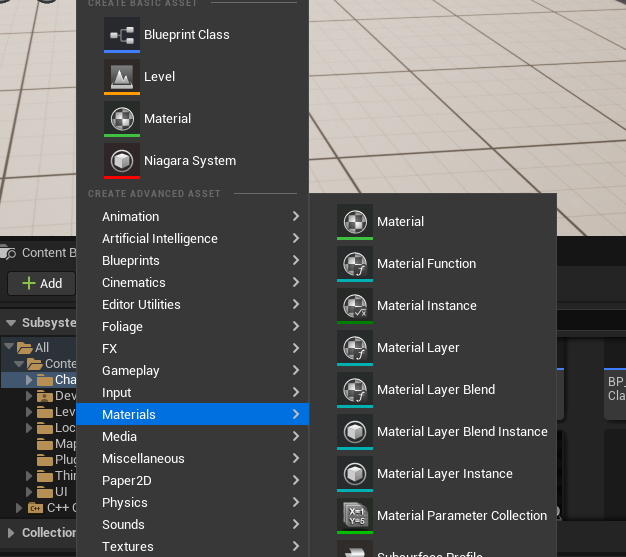
Как добавить в это меню свой собственный тип ассета?
Давайте рассмотрим этот процесс в подробностях.
Замечу, что создание ассетов делится на две категории. Мы можем создаваь `blueprint` ассеты, а так-же ассеты произвольного типа. Я предлагаю рассмотреть в главе создание `blueprint` ассета, потому что для него "по умолчанию" уже есть редактор. В противном случае редактор придется писать самому и это уже никак не тянет на короткую статью.
## Подготовка к работе
Для начала, нам нужен `Runtime` модуль, в который я планирую добавлять различные вспомогательные классы.
Я назвал этот модуль `ExtendHelpersModule`.
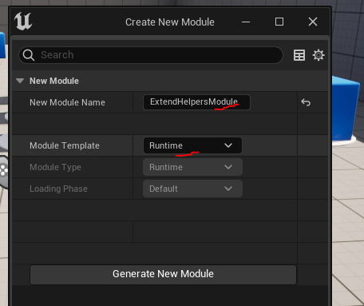
Добавляем модуль. перезапускаем движок.
Теперь, нам нужен модуль редактора. Это основной модуль для нашей работы. Я назвал его `ExtendEditorModule`.
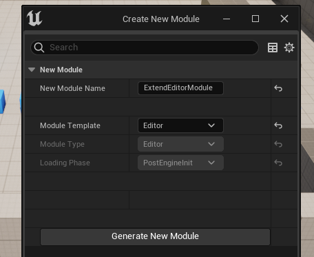
Перезапускаем движок, а потом выполняем команду `Tools -> Refresh Visual Studio 2022 Project`, чтобы обновить файлы проекта.
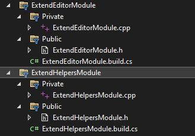
В зависимости модуля `ExtendEditorModule` надо добавить `AssetTools`.
Изменяем файл `ExtendEditorModule.build.cs` следующим образом:
```cpp
using UnrealBuildTool;
public class ExtendEditorModule : ModuleRules
{
	public ExtendEditorModule(ReadOnlyTargetRules Target) : base(Target)
	{
        PCHUsage = PCHUsageMode.UseExplicitOrSharedPCHs;
		PublicDependencyModuleNames.AddRange(new string[] { "Core", "CoreUObject", "Engine", "UnrealEd", "ExtendHelpersModule" });
		PrivateDependencyModuleNames.AddRange(new string[] { 
			"AssetTools",
			"PropertyEditor",
			"DetailCustomizations"
		});
        PublicIncludePaths.AddRange(new string[] {"ExtendEditorModule/Public"});
		PrivateIncludePaths.AddRange(new string[] {"ExtendEditorModule/Private"});
	}
}
```
## Добавляем класс ассета
Нам нужен класс, который мы собираемся регистрировать в качестве `blueprint` ассета. Добавим его. Идем `Tools -> New C++ Class -> All Classes -> Object`.
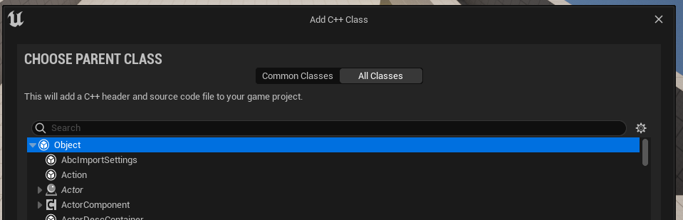
Называем новый класс `CustomObjectAsset`.
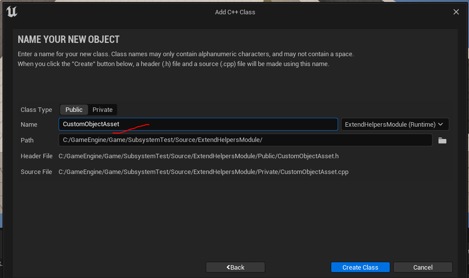
Добавляем этот класс в `Runtime` модуль `ExtendHelpersModule`.
В я уже создал заготовку для класса `UObject`, просто копируем ее и заменяем название класса на `UCustomObjectAsset`.
```cpp
#pragma once
#include "CoreMinimal.h"
#include "UObject/NoExportTypes.h"
// kismet
#include "Kismet/KismetSystemLibrary.h"
#include "Kismet/GameplayStatics.h"
// just in case
// actor class can be included this way:
//#include "GameFramework/Actor.h"
// component class can be included this way:
//#include "Components/StaticMeshComponent.h"
// .generated.h
#include "CustomObjectAsset.generated.h"
/**
 * Constom object asset that can be created via unreal menu
 */
UCLASS(Blueprintable)
class EXTENDHELPERSMODULE_API UCustomObjectAsset : public UObject, public FTickableGameObject
{
	GENERATED_BODY()
public:
	// constructor
	UCustomObjectAsset(const FObjectInitializer& ObjectInitializer) {}
	// Override PostInitProperties to make BeginPlay
	virtual void PostInitProperties() override {
		Super::PostInitProperties();
		// only after this we can tick. it's "BeginPlay".
		if (GetOuter() && GetOuter()->GetWorld()) {
			bIsInit = true;
			BeginPlay();
		}
	}
	// Begin Play in Blueprint
	UFUNCTION(BlueprintCallable, BlueprintNativeEvent, meta = (DisplayName = "BeginPlay"))
	void ReceiveBeginPlay(); // don't make realization for this function, it's generated by UHT
	// _Implementation is function that spawned by "Add Call To Parent Function"
	void ReceiveBeginPlay_Implementation() { /* your implementation */ };
	// Real BeginPlay
	void BeginPlay() {
		// call bp version of the BeginPlay
		ReceiveBeginPlay();
	};
	// Tick event binding
	UFUNCTION(BlueprintCallable, BlueprintNativeEvent, meta = (DisplayName = "Tick"))
	void ReceiveTick(float DeltaTime); // don't make realization for this function, it's generated by UHT
	// _Implementation is function that spawned by "Add Call To Parent Function"
	void ReceiveTick_Implementation(float DeltaTime) { /* your implementation */ };
	// Begin FTickableGameObject Interface.
	virtual void Tick(float DeltaTime) override {
		ReceiveTick(DeltaTime); // call blueprint tick
	}
	// true if object is ready to be ticked, false otherwise.
	virtual bool IsTickable() const override {
		return this->bIsInit && IsTickableOption; // tick only after object is loaded to the world
	}
	// return the stat id to use for this tickable
	virtual TStatId GetStatId() const override { return UObject::GetStatID(); };
	// world refrence, required to enable usage of latent actions inside of the UOBJECT
	virtual UWorld* GetWorld() const override {
		//Return null if the called from the CDO, or if the outer is being destroyed
		if (!HasAnyFlags(RF_ClassDefaultObject) && !GetOuter()->HasAnyFlags(RF_BeginDestroyed) && !GetOuter()->IsUnreachable())
		{
			//Try to get the world from the owning actor if we have one
			AActor* Outer = GetTypedOuter<AActor>();
			if (Outer != nullptr)
			{
				return Outer->GetWorld();
			}
		}
		//Else return null - the latent action will fail to initialize
		return nullptr;
	}
public:
	// properties section
	// will start tick on object once it's loaded to scene
	UPROPERTY(EditAnywhere, Category = "Tick", meta = (DisplayName = "Is Tickable"))
	bool IsTickableOption = true;
private:
	bool bIsInit = false; // true if object loaded to the world
};
```
После компиляции мы сможем наследовать собственные `blueprint` классы от типа `UCustomObjectAsset`.
Если кто забыл, то делается это так: в `Content Explorer` идем `Add -> Blueprint Class`.
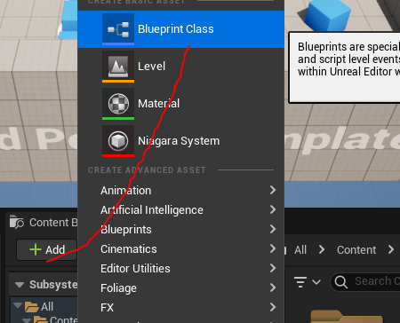
В появившемся окне, открываем вкладку `All Classes`, здесь будет созданный нами класс `CustomObjectAsset`.
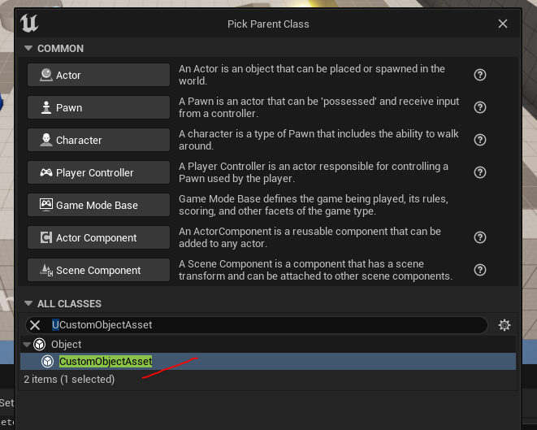
Как вы понимаете, создавать экземпляры класса таким способом крайне неудобно. Давайте разместим класс `UCustomObjectAsset` в меню создания ассетов, для более быстрого доступа.
Чтобы понять как это делается, можно обратить внимание на модуль `BehaviourTreeEditor`. В этом модуле нас интересует файл `\Engine\Source\Editor\BehaviorTreeEditor\Private\BehaviorTreeEditorModule.cpp`.
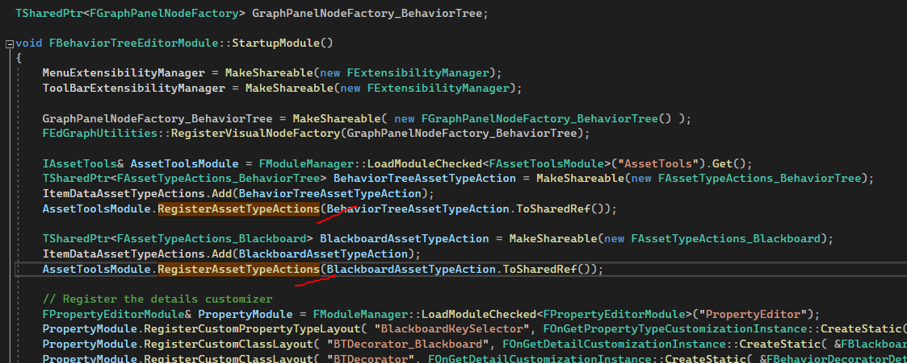
Это класс конструктора модуля. В этом классе прошу обратить ваше внимание на инструкции `RegisterAssetTypeActions`, именно через них задаются типы ассетов, доступные для модуля `BehaviourTree`, а именно: `Blackboard` и `BehaviourTree`.
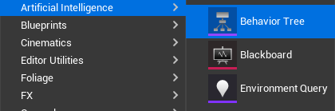
Давайте повторим логику регистрации ассета, для класса `UCustomObjectAsset`.
### Файл `ExtendEditorModule.h`
```cpp
#pragma once
#include "Modules/ModuleManager.h"
// kismet
#include "Kismet2/KismetEditorUtilities.h"
// assets
#include "IAssetTools.h"
#include "AssetTypeActions_Base.h" // asset actions base class
#include "AssetTypeActions/AssetTypeActions_Blueprint.h" // asset action for blueprints
#include "AssetToolsModule.h"
#include "AssetRegistry/AssetData.h"
#include "Factories/Factory.h"
#include "Factories/BlueprintFactory.h"
// asset that we register
#include "CustomObjectAsset.h"
//.generated.h
#include "ExtendEditorModule.generated.h"
DECLARE_LOG_CATEGORY_EXTERN(ExtendEditorModule, All, All);
class FExtendEditorModule : public IModuleInterface
{
public:
	/* Called when the module is loaded */
	virtual void StartupModule() override;
	/* Called when the module is unloaded */
	virtual void ShutdownModule() override;
private:
	// Asset type actions array
	// locks in memory each asset action
	TArray<TSharedPtr<FAssetTypeActions_Base>> AssetTypeActions;
};
/**
 * Asset Actions
 * use FAssetTypeActions_Base for assets, that are generated with NewObject in Factory
 * use FAssetTypeActions_Blueprint for assets, that are generated with FKismetEditorUtilities::CreateBlueprint in Factory
 */
class FAssetTypeActions_CustomObject : public FAssetTypeActions_Blueprint
{
public:
	//~ Begin IAssetTypeActions interface
	// asset name
	virtual FText GetName() const override { return NSLOCTEXT("AssetTypeActions", "AssetTypeActions_CustomObjectAsset", "Custom Object"); }
	// icon color
	virtual FColor GetTypeColor() const override { return FColor(149, 70, 255); }
	// asset class, that controlled by this AssetActions
	virtual UClass* GetSupportedClass() const override
	{
		return UCustomObjectAsset::StaticClass();
	}
	// asset menu category
	virtual uint32 GetCategories() override {
		IAssetTools& AssetToolsInterface = FModuleManager::LoadModuleChecked<FAssetToolsModule>("AssetTools").Get();
		EAssetTypeCategories::Type Category =
		AssetToolsInterface.RegisterAdvancedAssetCategory(
			FName(TEXT("CustomAsset")),
			NSLOCTEXT("AssetTypeActions", "CustomAssetName", "Custom Asset Instance")
		);
		// we can combine categories this way:
		return EAssetTypeCategories::Misc | Category;
	}
	//~ End of IAssetTypeActions interface
	//~ Begin FAssetTypeActions_Blueprint interface
	// register asset generation factory
	virtual UFactory* GetFactoryForBlueprintType(UBlueprint* InBlueprint) const override {
		UCustomObjectFactory* BlueprintFactory = NewObject<UCustomObjectFactory>();
		return (UFactory*)BlueprintFactory;
	}
	//~ End FAssetTypeActions_Blueprint interface
};
// Factories are responsible for creting new assets
// here we generate our blueprint
UCLASS(MinimalAPI, HideCategories = Object)
class UCustomObjectFactory : public UFactory
{
	GENERATED_BODY()
public:
	// constructor
	UCustomObjectFactory() {
		SupportedClass = UCustomObjectAsset::StaticClass();
		bCreateNew = true;
		bEditAfterNew = true;
	}
	virtual UObject* FactoryCreateNew(UClass* InClass, UObject* InParent, FName InName, EObjectFlags Flags, UObject* Context, FFeedbackContext* Warn, FName CallingContext) override
	{
		// just call other method
		return FactoryCreateNew(InClass, InParent, InName, Flags, Context, Warn);
	}
	virtual UObject* FactoryCreateNew(UClass* Class, UObject* InParent, FName Name, EObjectFlags Flags, UObject* Context, FFeedbackContext* Warn) override
	{
		/*
		// use this if you want to create Object file with custom editor, instead of blueprint class
		return NewObject<UCustomObjectAsset>(InParent, Class, Name, Flags, Context);
		*/
		// create blueprint
		return FKismetEditorUtilities::CreateBlueprint(Class, InParent, Name, BPTYPE_Normal, UBlueprint::StaticClass(), UBlueprintGeneratedClass::StaticClass());
	}
};
```
### Файл `ExtendEditorModule.cpp`
```cpp
#include "ExtendEditorModule.h"
DEFINE_LOG_CATEGORY(ExtendEditorModule);
#define LOCTEXT_NAMESPACE "FExtendEditorModule"
void FExtendEditorModule::StartupModule()
{
	UE_LOG(ExtendEditorModule, Warning, TEXT("ExtendEditorModule module has been loaded"));
 
	IAssetTools& AssetToolsInterface = FModuleManager::LoadModuleChecked<FAssetToolsModule>("AssetTools").Get();
	// Register new Assset
	TSharedPtr<FAssetTypeActions_CustomObject> CustomObjectAssetAction = MakeShareable(new FAssetTypeActions_CustomObject());
	AssetTypeActions.Add(CustomObjectAssetAction);
	AssetToolsInterface.RegisterAssetTypeActions(CustomObjectAssetAction.ToSharedRef());
	// this will force "BlueprintNativeEvent" nodes to appear inside of the blueprint once class is crated
	FKismetEditorUtilities::RegisterAutoGeneratedDefaultEvent(this, UCustomObjectAsset::StaticClass(), "ReceiveBeginPlay");
	FKismetEditorUtilities::RegisterAutoGeneratedDefaultEvent(this, UCustomObjectAsset::StaticClass(), "ReceiveTick");
}
void FExtendEditorModule::ShutdownModule()
{
	UE_LOG(ExtendEditorModule, Warning, TEXT("ExtendEditorModule module has been unloaded"));
	if (!FModuleManager::Get().IsModuleLoaded("AssetTools")) return;
	// unregister asset actions
	for (auto Action : AssetTypeActions) {
		FAssetToolsModule::GetModule().Get().UnregisterAssetTypeActions(Action.ToSharedRef());
	}
}
#undef LOCTEXT_NAMESPACE
IMPLEMENT_MODULE(FExtendEditorModule, ExtendEditorModule)
```
### Разбор
За логику размещения ассета в движке отвечает класс `FAssetTypeActions_CustomObject`. Здесь задается категория ассета, его название и класс ассета, который должен быть создан.
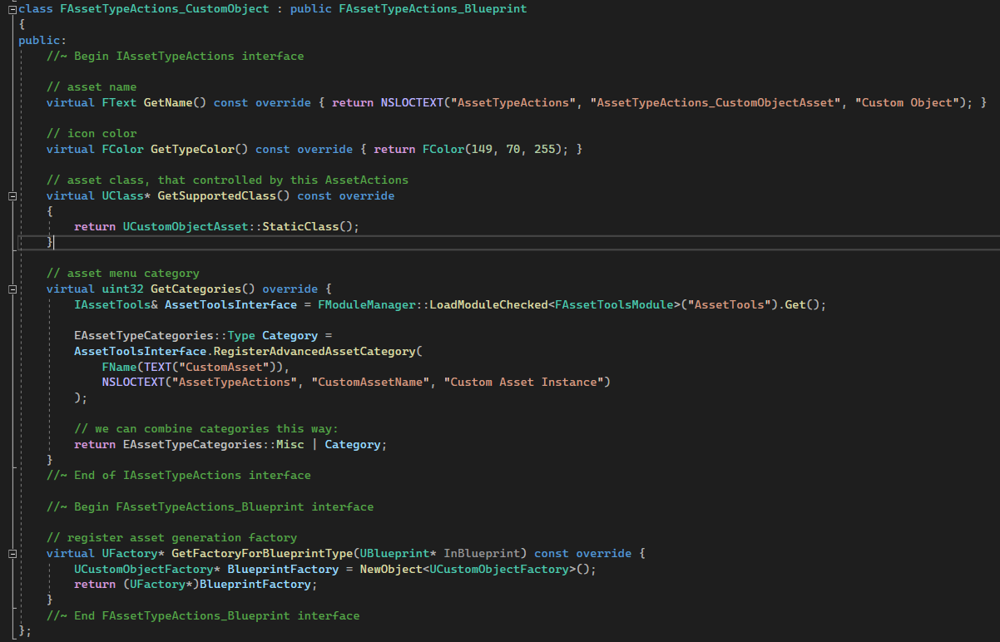
В качестве категории я указал `Custom Asset Instance`.
Если скомпилировать код, то это категория появится в меню добавления ассета.
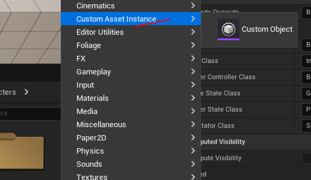
Можно указать сразу несколько категорий для ассета, как сделал я. В качестве второй категории у меня выступает `Miscelanneous`.

Имя ассета в категории задается внутри метода `GetName`.
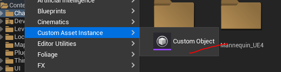
За генерацию ассета, по нажатию на пункт меню, отвечает класс `UCustomObjectFactory`. Его логика крайне проста и шаблонна. Для генерации `blueprint` ассета используется `FKismetEditorUtilities::CreateBlueprint`.
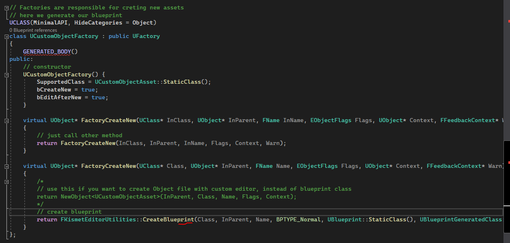
Давайте создадим один из экземпляров нашего нового ассета.
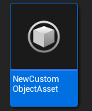
Если открыть полученный `blueprint` класс, мы увидим, что он унаследован от класса `CustomObjectAsset`.
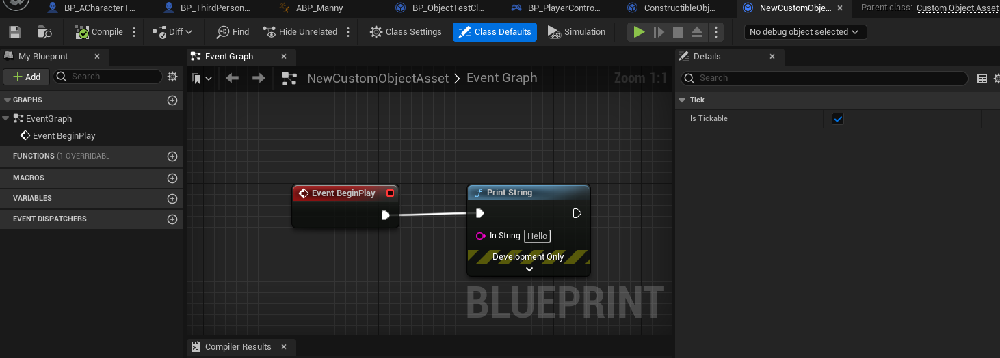
Обратите внимание на следующие строчки:
```cpp
// this will force "BlueprintNativeEvent" nodes to appear inside of the blueprint once class is crated
FKismetEditorUtilities::RegisterAutoGeneratedDefaultEvent(this, UCustomObjectAsset::StaticClass(), "ReceiveBeginPlay");
FKismetEditorUtilities::RegisterAutoGeneratedDefaultEvent(this, UCustomObjectAsset::StaticClass(), "ReceiveTick");
```
Они позволяют автоматически создавать ноды `BeginPlay` и `Tick` для функций, которые заданы как `BlueprintNativeEvent` внутри класса `UCustomObjectAsset`.
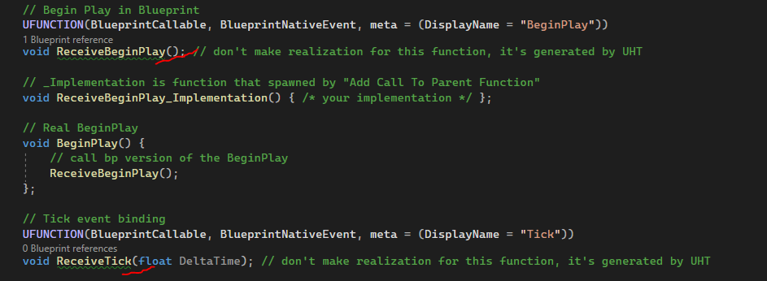
Если вы создадите новый ассет типа `CustomObjectAsset`, то увидите, что ноды, относящиеся к этим функциям, автоматически созданы.
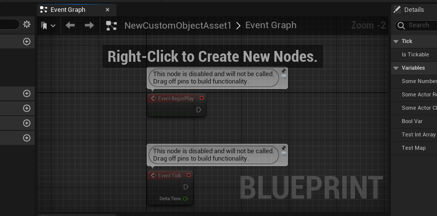