# `ACharacter` и `Enhanced Input`
В этой статье рассмотрим пример работы с классом `ACharacter`, а так-же плагином `Enhanced Input`.
## Введение в плагин `Enhanced Input`
Для начала разберемся с плагином. Потому что его я буду использовать для обработки игровых событий.
В проекте типа `Third Person`, который я использую для написания статей, плагин `Enhanced Input` уже включен. Если у вас он не активен - включите.
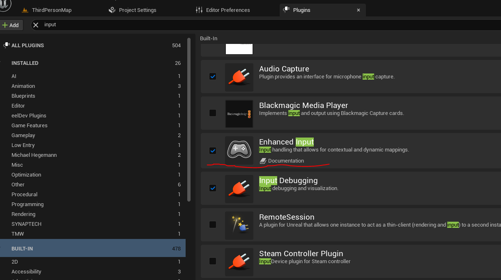
Плагин `Enhanced Input` позволяет динамически подключаться к устройствам ввода и отслеживать нажатия клавиш  / сочетаний клавиш.
### Работа с плагином в `blueprint`
Использование данного плагина на стороне `blueprint` кода крайне простое. Плагин предоставляет доступ к особому типу событий - `EnhancedInputAction`, которые можно создавать внутри любого `Character'a`.
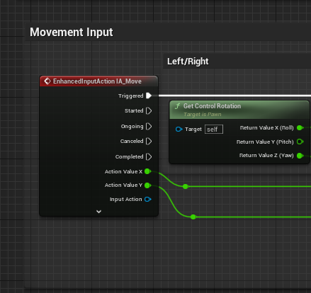
Сами события генерируются из файлов `Input Action`, которые разработчик может создавать вручную.
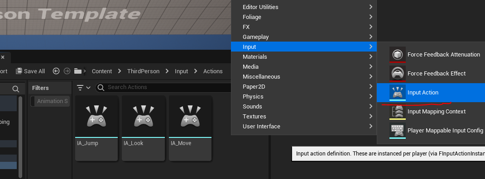
Для этого щелкните правой кнопкой мыши в проводнике, далее `Input->Input Action`.
Несколько действий - `Input Action` можно объединить в файле `Input Mapping Context`.
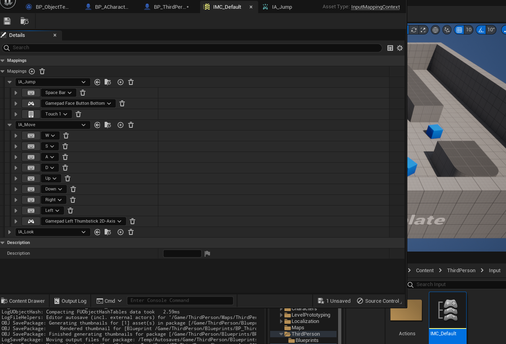
В файле `Input Mapping Context` указываются сочетания клавиш, которые вызывают то или иное действие.
Файлов типа `Input Mapping Context` может быть несколько - под каждое из состояний игры. Контексты ввода могут переключатсья как через `bluepruint'ы`, так и посредством `с++`. В `blueprint` для изменения или загрузки контекста ввода используется узел `Add Mapping Context`.
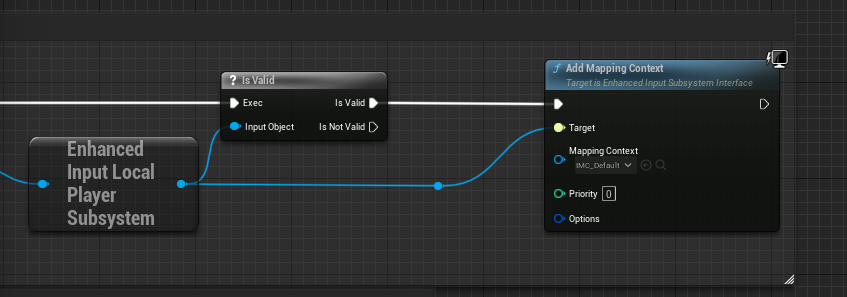
Для добавления своей клавиши в активный контекст из `blueprint` кода можно использовать узел `AddPlayerMappedKey`.
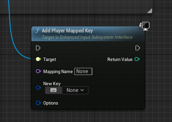
Вообще-же список основных `blueprint` узлов для работы с плагином `Enhanced Input` выглядит так:
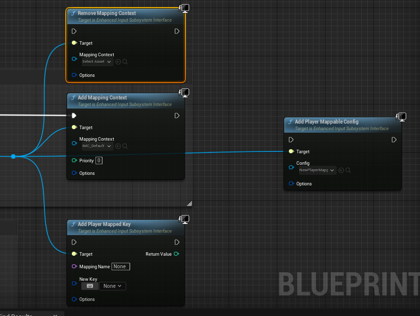
## Исходники плагина `Enhanced Input`
Исходники плагина, которые я настоятельно рекомендую изучить, можно найти в папке `Engine\Plugins\EnhancedInput\Source\`.
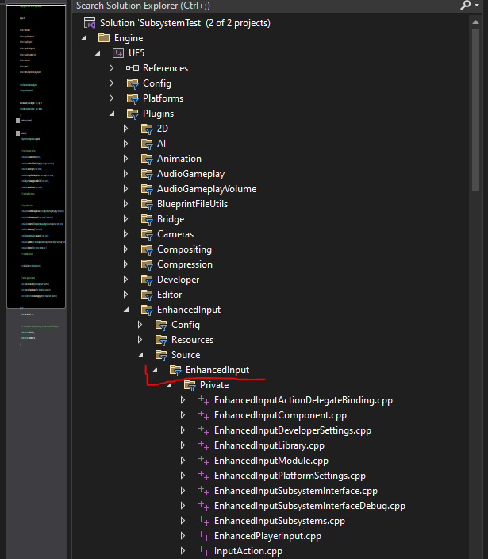
## Подготовка к работе
Добавляем модуль `EnhancedCharacter`.
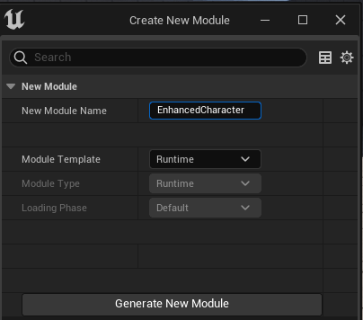
После создания модуля обновите файлы проекта командой `Tools->Refresh Visual Studio 2022 Project`.
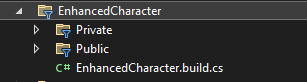
### Подключаем зависимости
В файл сборки  модуля `EnhancedCharacter.build.cs` необходимо добавить `EnhancedInput` и `InputCore`.
```cpp
using UnrealBuildTool;
public class EnhancedCharacter : ModuleRules
{
	public EnhancedCharacter(ReadOnlyTargetRules Target) : base(Target)
	{
        PCHUsage = PCHUsageMode.UseExplicitOrSharedPCHs;
		PublicDependencyModuleNames.AddRange(new string[] { "Core", "CoreUObject", "Engine", "InputCore", "EnhancedInput" });
		PublicIncludePaths.AddRange(new string[] {"EnhancedCharacter/Public"});
		PrivateIncludePaths.AddRange(new string[] {"EnhancedCharacter/Private"});
	}
}
```
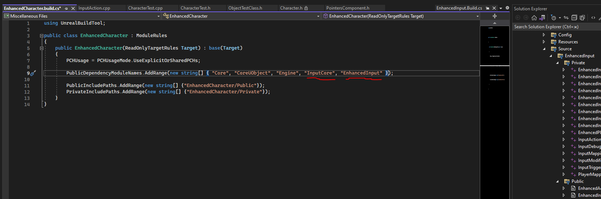
### Создаем класс персонажа
Добавим класс новый `Character` класс в модуль `EnhancedCharacter`.
Для этого идем `Tools -> New C++ Class`, в появившемся меню ищем пункт `Character`.
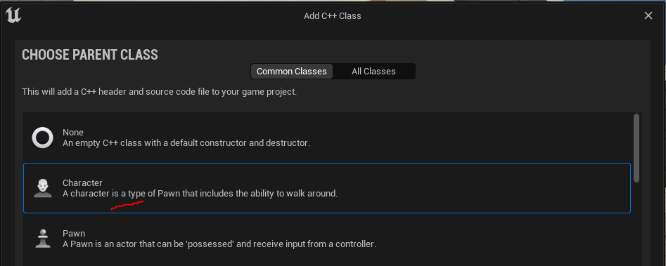
Называем новый класс - `EnCharacter`.
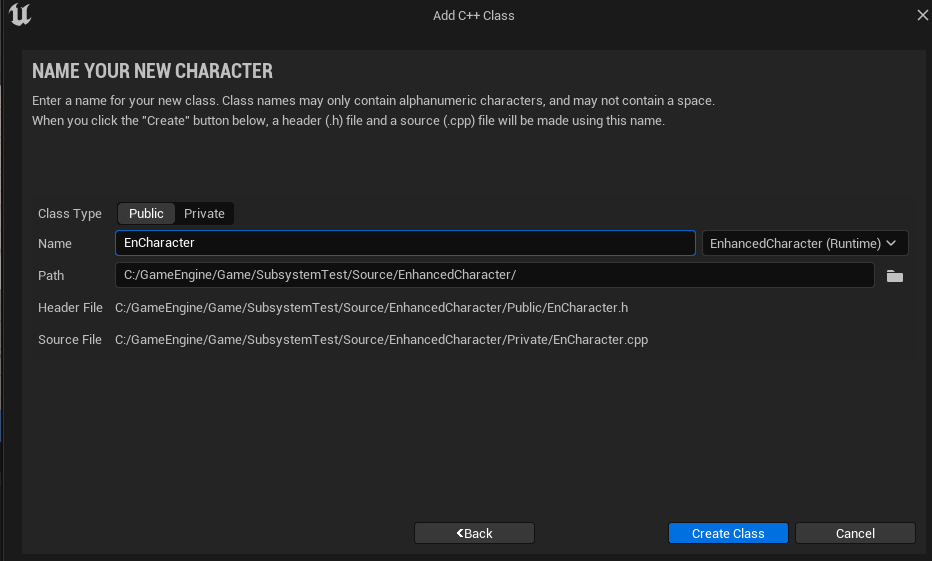
Обновляем файлы проекта командой `Tools -> Refresh Visual Studio 2022 Project`.
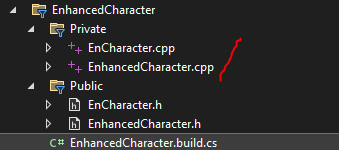
Открываем файл `EnCharacter.h` для редактирования.
## Подключение плагина `Enhanced Input` к персонажу
Давайте подключим обработку событий через плагин `Enhanced Input` к созданному персонажу.
### Добавляем `InputContext`
Начнем с добавления `InputContext`.
Добавим переменную типа `UInputMappingContext`. Для нее придется подключить заголовочный файл, а мы не знаем какой. Чтобы узнать вбиваем в гугл название класса и идем в [документацию](https://docs.unrealengine.com/4.26/en-US/API/Plugins/EnhancedInput/UInputMappingContext/).
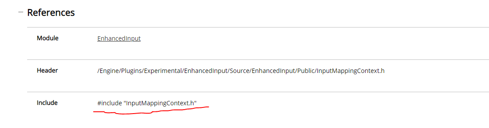
```cpp
#include "InputMappingContext.h"
// ...
// MappingContext
UPROPERTY(EditAnywhere, BlueprintReadWrite, Category = Input)
TSoftObjectPtr<UInputMappingContext> DefaultMappingContext = nullptr;
```
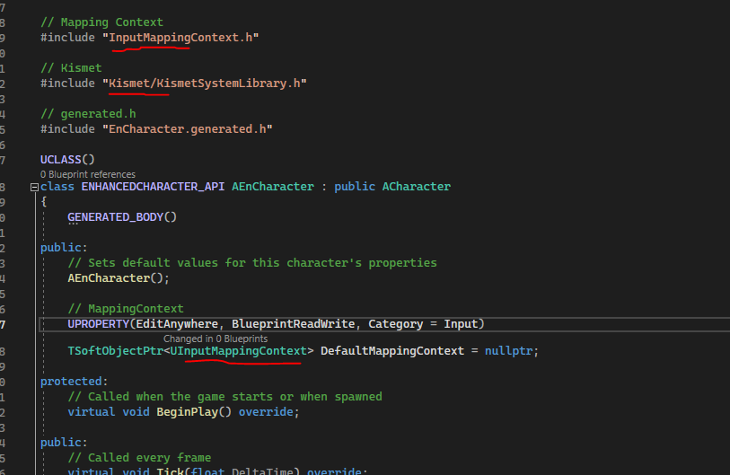
Переменной контекста надо дать значение "по умолчанию", чтобы она не была пустой.
У нас в проекте уже есть заготовленный `MappingContext` в папке `ThirdPerson/Input/'`.
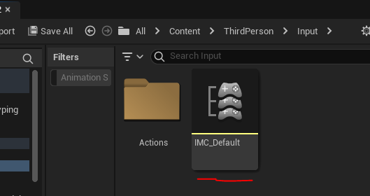
Копируем его рефренс и загружаем в переменную из конструктора класса.
```cpp
// Kismet
#include "Kismet/KismetSystemLibrary.h"
// ...
// Load Default Mapping Context
if (DefaultMappingContext == nullptr) {
    const FString DefaultMappingContextAsset = TEXT("/Script/EnhancedInput.InputMappingContext'/Game/ThirdPerson/Input/IMC_Default.IMC_Default'");
    DefaultMappingContext = UKismetSystemLibrary::MakeSoftObjectPath(DefaultMappingContextAsset);
}
```
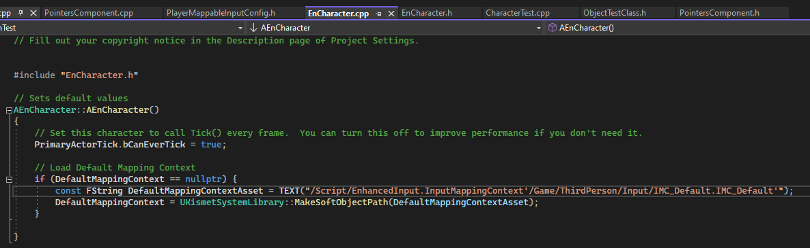
Теперь у переменной контекста будет значение "по умолчанию".
Чтобы проверить - перекиньте полученного персонажа на уровень и посмотрите его настройки в панели `Details`.
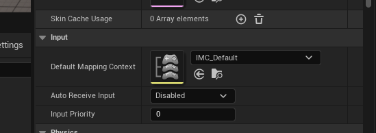
### Загружаем `Input Context`
Загрузим выбранный контекст ввода.
В `blueprint` части за это отвечает такой код:
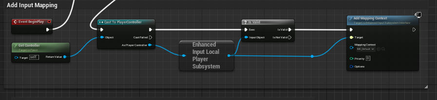
Воспроизведу `blueprint` код его в секции `BeginPlay`.
```cpp
// Enhanced Input
#include "EnhancedInputSubsystems.h"
// ...
// Called when the game starts or when spawned
void AEnCharacter::BeginPlay()
{
	Super::BeginPlay();
	// Load Mapping Context if controller is posessed
	APlayerController *PController = Cast<APlayerController>(GetController());
	if (PController != nullptr) {
		const ULocalPlayer* LPlayer = PController->GetLocalPlayer();
		UEnhancedInputLocalPlayerSubsystem* ESubsystem = ULocalPlayer::GetSubsystem<UEnhancedInputLocalPlayerSubsystem>(LPlayer);
		if (ESubsystem != nullptr) {
			ESubsystem->AddMappingContext(DefaultMappingContext.Get(), InputPriority);
		}
	}
}
```
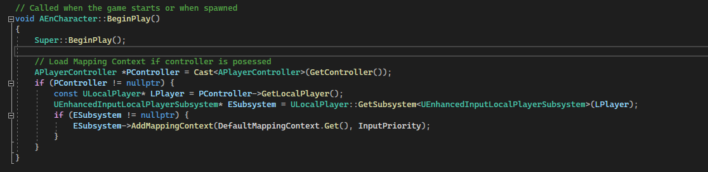
### Создаем ссылки на `Input Action`
Помимо контекста в `с++` нужно получить сслыки на сами действия ввода. Потому что, в отличие от `blueprint` кода в `с++` у нас нет возможности загрузить данные действия автоматически.
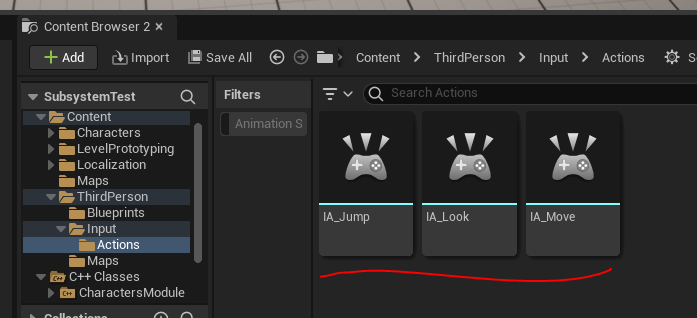
Создаем переменные для каждого действия.
```cpp
// Jump
UPROPERTY(EditAnywhere, BlueprintReadWrite, Category = Input)
TSoftObjectPtr<UInputAction> JumpAction = nullptr;
// Move
UPROPERTY(EditAnywhere, BlueprintReadWrite, Category = Input)
TSoftObjectPtr<UInputAction> MoveAction = nullptr;
// Rotate
UPROPERTY(EditAnywhere, BlueprintReadWrite, Category = Input)
TSoftObjectPtr<UInputAction> RotateAction = nullptr;
```
Разумеется, полученным переменным тоже надо скормить ассет, установленный "по умолчанию".
Идем в конструктор класса и дополняем его следующим кодом.
```cpp
// Load Jump Action
if (JumpAction == nullptr) {
    const FString JumpActionAsset = TEXT("/Script/EnhancedInput.InputAction'/Game/ThirdPerson/Input/Actions/IA_Jump.IA_Jump'");
    JumpAction = UKismetSystemLibrary::MakeSoftObjectPath(JumpActionAsset);
}
// Load Move Action
if (MoveAction == nullptr) {
    const FString MoveActionAsset = TEXT("/Script/EnhancedInput.InputAction'/Game/ThirdPerson/Input/Actions/IA_Move.IA_Move'");
    MoveAction = UKismetSystemLibrary::MakeSoftObjectPath(MoveActionAsset);
}
// Load Rotate Action
if (RotateAction == nullptr) {
    const FString RotateActionAsset = TEXT("/Script/EnhancedInput.InputAction'/Game/ThirdPerson/Input/Actions/IA_Look.IA_Look'");
    RotateAction = UKismetSystemLibrary::MakeSoftObjectPath(RotateActionAsset);
}
```
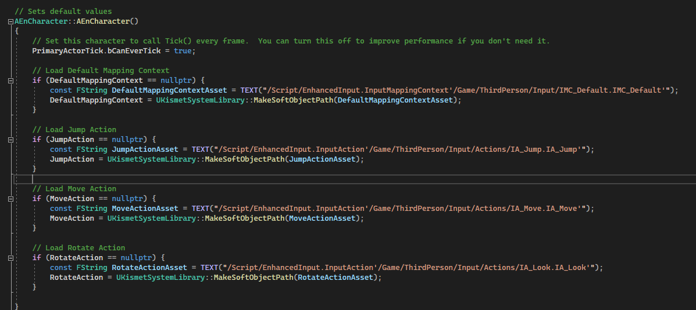
### Добавляем логику `Input Action`
Зададим логику, которая будет вызываться для каждого `Input Action`.
Для начала нам нужны функции, которые мы будем соединять с командами ввода.
Создадим определения для функций в файле `EnCharacter.h`.
```cpp
// Movement Input
void Move(const FInputActionValue& Value);
// Camera Input
void Rotate(const FInputActionValue& Value);
```
И их реализацию.
Она будет совпадать с той, что имеет место в `blueprint` коде.
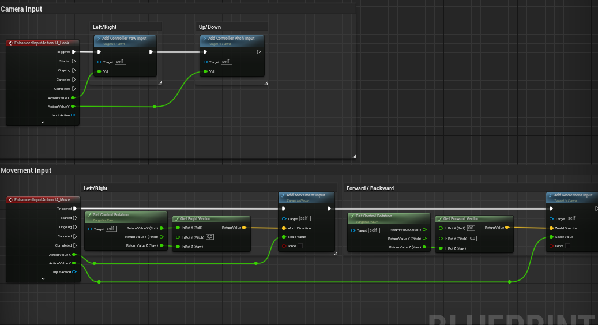
Для функции `Rotate` реализация будет такой:
```cpp
// Roation Input
void AEnCharacter::Rotate(const FInputActionValue& Value)
{
	// input is a Vector2D
	FVector2D LookAxisVector = Value.Get<FVector2D>();
	// if controller is possessed
	if (Controller != nullptr) {
		AddControllerYawInput(LookAxisVector.X);
		AddControllerPitchInput(LookAxisVector.Y);
	}
}
```
Для функции `Move` реализация будет такой:
```cpp
// Movement Input
void AEnCharacter::Move(const FInputActionValue& Value)
{
	// input is a Vector2D
	FVector2D MovementVector = Value.Get<FVector2D>();
	if (Controller != nullptr)
	{
		// find out which way is forward
		const FRotator Rotation = Controller->GetControlRotation();
		const FRotator YawRotation(0, Rotation.Yaw, 0);
		// get forward vector
		const FVector ForwardDirection = FRotationMatrix(YawRotation).GetUnitAxis(EAxis::X);
		// get right vector
		const FVector RightDirection = FRotationMatrix(YawRotation).GetUnitAxis(EAxis::Y);
		// add movement
		AddMovementInput(ForwardDirection, MovementVector.Y);
		AddMovementInput(RightDirection, MovementVector.X);
	}
}
```
Для события `Jump` метод не нужен - он уже есть внутри класса `ACharacter` и реализован как подбрасывание персонажа вверх. Мы просто его вызовем.
### Привязываем `Input Action` к контексту ввода
В базовом классе `ACharacter` по умолчанию представлен метод - `SetupPlayerInputComponent`, предназначенный для переопределения ввода.
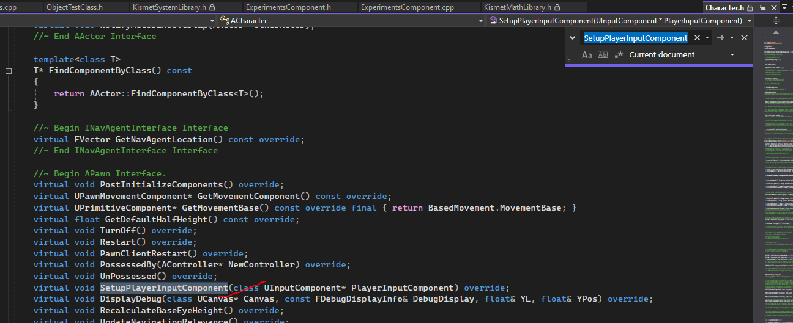
Этот метод нам понадобится для работы.
Именно в тут надо подключать события ввода к методам класса.
Можно, конечно, делать это и  в `BeginPlay`, но там нет прямой ссылки на `PlayerInputComponent` (хотя ее легко можно получить).
Переопределяем метод и пишем его реализацию:
```cpp
//.h
#include "EnhancedInputComponent.h"
// Called to bind functionality to input
virtual void SetupPlayerInputComponent(class UInputComponent* PlayerInputComponent) override;
// ...
//.cpp
// Called to bind functionality to input
void AEnCharacter::SetupPlayerInputComponent(UInputComponent* PlayerInputComponent)
{
	Super::SetupPlayerInputComponent(PlayerInputComponent);
	UEnhancedInputComponent* EnhancedInputComponent = Cast<UEnhancedInputComponent>(PlayerInputComponent);
	// Bind Actions
	if (EnhancedInputComponent != nullptr) {
		//Jumping
		EnhancedInputComponent->BindAction(JumpAction.Get(), ETriggerEvent::Triggered, this, &ACharacter::Jump);
		EnhancedInputComponent->BindAction(JumpAction.Get(), ETriggerEvent::Completed, this, &ACharacter::StopJumping);
		//Moving
		EnhancedInputComponent->BindAction(MoveAction.Get(), ETriggerEvent::Triggered, this, &AEnCharacter::Move);
		//Looking
		EnhancedInputComponent->BindAction(RotateAction.Get(), ETriggerEvent::Triggered, this, &AEnCharacter::Rotate);
	}
}
```
Все готово и должно работать.
### Файл `EnCharacter.h`
```cpp
#pragma once
#include "CoreMinimal.h"
#include "GameFramework/Character.h"
// Mapping Context
#include "InputMappingContext.h"
// Enhanced Input
#include "EnhancedInputSubsystems.h"
#include "EnhancedInputComponent.h"
// Kismet
#include "Kismet/KismetSystemLibrary.h"
#include "Kismet/GameplayStatics.h"
// Animation Asset
#include "Animation/AnimationAsset.h"
// Capsule Component
#include "Components/CapsuleComponent.h"
// Character Movement
#include "GameFramework/CharacterMovementComponent.h"
// Camera
#include "Camera/CameraComponent.h"
// Spring Arm
#include "GameFramework/SpringArmComponent.h"
// generated.h
#include "EnCharacter.generated.h"
UCLASS()
class ENHANCEDCHARACTER_API AEnCharacter : public ACharacter
{
	GENERATED_BODY()
public:
	// Sets default values for this character's properties
	AEnCharacter(const FObjectInitializer& ObjectInitializer);
	// Spring Arm
	UPROPERTY(VisibleAnywhere, BlueprintReadOnly, Category = Camera)
	TObjectPtr<USpringArmComponent> CameraBoom;
	// Camera
	UPROPERTY(VisibleAnywhere, BlueprintReadOnly, Category = Camera)
	TObjectPtr<UCameraComponent> FollowCamera;
	// MappingContext
	UPROPERTY(EditAnywhere, BlueprintReadWrite, Category = Input)
	TSoftObjectPtr<UInputMappingContext> DefaultMappingContext = nullptr;
	// Jump
	UPROPERTY(EditAnywhere, BlueprintReadWrite, Category = Input)
	TSoftObjectPtr<UInputAction> JumpAction = nullptr;
	// Move
	UPROPERTY(EditAnywhere, BlueprintReadWrite, Category = Input)
	TSoftObjectPtr<UInputAction> MoveAction = nullptr;
	// Rotate
	UPROPERTY(EditAnywhere, BlueprintReadWrite, Category = Input)
	TSoftObjectPtr<UInputAction> RotateAction = nullptr;
protected:
	// Called when the game starts or when spawned
	virtual void BeginPlay() override;
	// Movement Input
	void Move(const FInputActionValue& Value);
	// Camera Input
	void Rotate(const FInputActionValue& Value);
public:
	// Called every frame
	virtual void Tick(float DeltaTime) override;
	// Called to bind functionality to input
	virtual void SetupPlayerInputComponent(class UInputComponent* PlayerInputComponent) override;
	// Once character posessed
	virtual void PossessedBy(AController* NewController) override;
};
```
### Файл `EnCharacter.cpp`
```cpp
#include "EnCharacter.h"
// Sets default values
AEnCharacter::AEnCharacter(const FObjectInitializer& ObjectInitializer)
{
	// SpringArm for the camera
	CameraBoom = CreateDefaultSubobject<USpringArmComponent>(TEXT("CameraBoom"));
	CameraBoom->SetRelativeLocation(FVector3d(0.0f, 0.0f, 8.492264f));
	CameraBoom->SetupAttachment(RootComponent);
	CameraBoom->TargetArmLength = 400.0f; // The camera follows at this distance behind the character
	CameraBoom->bUsePawnControlRotation = true; // Rotate the arm based on the controller
	CameraBoom->bInheritPitch = true;
	CameraBoom->bInheritYaw = true;
	CameraBoom->bInheritRoll = true;
	// Camera
	FollowCamera = CreateDefaultSubobject<UCameraComponent>(TEXT("FollowCamera"));
	FollowCamera->SetupAttachment(CameraBoom, USpringArmComponent::SocketName); // Attach the camera to the end of the boom and let the boom adjust to match the controller orientation
	FollowCamera->bUsePawnControlRotation = false; // Camera does not rotate relative to arm
	FollowCamera->Deactivate(); // Deactivate camera by default to prevent performance issues
	// Default Rotation Settings
	bUseControllerRotationPitch = false;
	bUseControllerRotationYaw = false;
	bUseControllerRotationRoll = false;
	// Set Character Movement values
	UCharacterMovementComponent* CharMoveComp = GetCharacterMovement();
	CharMoveComp->bOrientRotationToMovement = true; // will force character to rotate towards velocity direction
	CharMoveComp->RotationRate = FRotator(0.0f, 500.0f, 0.0f); // with rotation rate
	// Speed values
	CharMoveComp->JumpZVelocity = 700.f;
	CharMoveComp->AirControl = 0.35f;
	CharMoveComp->MaxWalkSpeed = 500.f;
	CharMoveComp->MinAnalogWalkSpeed = 20.f;
	CharMoveComp->BrakingDecelerationWalking = 2000.f;
	// Set Capsule Size
	UCapsuleComponent* CapsuleComp = GetCapsuleComponent();
	CapsuleComp->InitCapsuleSize(35.0f,90.0f);
	USkeletalMeshComponent* MeshComp = GetMesh();
	// Load Default Skeletal Mesh
	if (MeshComp->GetSkeletalMeshAsset() == nullptr) {
		const FString MannequinAsset = TEXT("/Script/Engine.SkeletalMesh'/Game/Characters/Mannequins/Meshes/SKM_Manny.SKM_Manny'");
		const TSoftObjectPtr<USkeletalMesh> SKMesh(MannequinAsset);
		if (!SKMesh.IsNull()) {
			MeshComp->SetSkeletalMesh(SKMesh.LoadSynchronous());
		}
		// Load ainm instance as well
		// since we loading blueprint class, add _C at the end of the asset refrence
		const FString AnimationInstanceAsset = TEXT("/Script/Engine.AnimBlueprint'/Game/Characters/Mannequins/Animations/ABP_Manny.ABP_Manny_C'");
		const TSoftClassPtr<UAnimInstance> CAnimInst(AnimationInstanceAsset);
		if (!CAnimInst.IsNull()) {
			MeshComp->SetAnimationMode(EAnimationMode::AnimationBlueprint);
			MeshComp->SetAnimInstanceClass(CAnimInst.LoadSynchronous());
		}
		// Apply default parameters to the mesh
		// Relative Location
		MeshComp->SetRelativeLocation(FVector3d(0.0f, 0.0f, -89.0f));
		// Relative Rotation
		MeshComp->SetRelativeRotation(FRotator(0.0f, 270.0f, 0.0f));
	}
	// Load Default Mapping Context
	if (DefaultMappingContext == nullptr) {
		const FString DefaultMappingContextAsset = TEXT("/Script/EnhancedInput.InputMappingContext'/Game/ThirdPerson/Input/IMC_Default.IMC_Default'");
		DefaultMappingContext = UKismetSystemLibrary::MakeSoftObjectPath(DefaultMappingContextAsset);
	}
	// Load Jump Action
	if (JumpAction == nullptr) {
		const FString JumpActionAsset = TEXT("/Script/EnhancedInput.InputAction'/Game/ThirdPerson/Input/Actions/IA_Jump.IA_Jump'");
		JumpAction = UKismetSystemLibrary::MakeSoftObjectPath(JumpActionAsset);
	}
	// Load Move Action
	if (MoveAction == nullptr) {
		const FString MoveActionAsset = TEXT("/Script/EnhancedInput.InputAction'/Game/ThirdPerson/Input/Actions/IA_Move.IA_Move'");
		MoveAction = UKismetSystemLibrary::MakeSoftObjectPath(MoveActionAsset);
	}
	// Load Rotate Action
	if (RotateAction == nullptr) {
		const FString RotateActionAsset = TEXT("/Script/EnhancedInput.InputAction'/Game/ThirdPerson/Input/Actions/IA_Look.IA_Look'");
		RotateAction = UKismetSystemLibrary::MakeSoftObjectPath(RotateActionAsset);
	}
}
// Called when the game starts or when spawned
void AEnCharacter::BeginPlay()
{
	Super::BeginPlay();
	// Load Mapping Context if controller is posessed
	APlayerController* PController = Cast<APlayerController>(GetController());
	if (PController != nullptr) {
		const ULocalPlayer* LPlayer = PController->GetLocalPlayer();
		UEnhancedInputLocalPlayerSubsystem* ESubsystem = ULocalPlayer::GetSubsystem<UEnhancedInputLocalPlayerSubsystem>(LPlayer);
		if (ESubsystem != nullptr) {
			ESubsystem->AddMappingContext(DefaultMappingContext.Get(), InputPriority);
		}
	}
}
// On Possessed
void AEnCharacter::PossessedBy(AController* NewController)
{
	// Enable Camera when posessed
	if (NewController->IsLocalPlayerController()) {
		FollowCamera->Activate();
	}
}
// Movement Input
void AEnCharacter::Move(const FInputActionValue& Value)
{
	// input is a Vector2D
	FVector2D MovementVector = Value.Get<FVector2D>();
	if (Controller != nullptr)
	{
		// find out which way is forward
		const FRotator Rotation = Controller->GetControlRotation();
		const FRotator YawRotation(0, Rotation.Yaw, 0);
		// get forward vector
		const FVector ForwardDirection = FRotationMatrix(YawRotation).GetUnitAxis(EAxis::X);
		// get right vector
		const FVector RightDirection = FRotationMatrix(YawRotation).GetUnitAxis(EAxis::Y);
		// add movement
		AddMovementInput(ForwardDirection, MovementVector.Y);
		AddMovementInput(RightDirection, MovementVector.X);
	}
}
// Roation Input
void AEnCharacter::Rotate(const FInputActionValue& Value)
{
	// input is a Vector2D
	FVector2D LookAxisVector = Value.Get<FVector2D>();
	// if controller is possessed
	if (Controller != nullptr) {
		AddControllerYawInput(LookAxisVector.X);
		AddControllerPitchInput(LookAxisVector.Y);
	}
}
// Called every frame
void AEnCharacter::Tick(float DeltaTime)
{
	Super::Tick(DeltaTime);
}
// Called to bind functionality to input
void AEnCharacter::SetupPlayerInputComponent(UInputComponent* PlayerInputComponent)
{
	UE_LOG(LogTemp, Warning, TEXT("Setup Input"))
	Super::SetupPlayerInputComponent(PlayerInputComponent);
	UEnhancedInputComponent* EnhancedInputComponent = Cast<UEnhancedInputComponent>(PlayerInputComponent);
	// Bind Actions
	if (EnhancedInputComponent != nullptr) {
		//Jumping
		EnhancedInputComponent->BindAction(JumpAction.Get(), ETriggerEvent::Triggered, this, &ACharacter::Jump);
		EnhancedInputComponent->BindAction(JumpAction.Get(), ETriggerEvent::Completed, this, &ACharacter::StopJumping);
		//Moving
		EnhancedInputComponent->BindAction(MoveAction.Get(), ETriggerEvent::Triggered, this, &AEnCharacter::Move);
		//Looking
		EnhancedInputComponent->BindAction(RotateAction.Get(), ETriggerEvent::Triggered, this, &AEnCharacter::Rotate);
	}
}
```
### Тестирование
Проверим код, который у нас получился.
Для начала надо создать `blueprint` класс, унаследованный от нашего `EnCharacter`. Идем в `Content Browser`, нажимаем на кнопку `Add -> Blueprint Class`.
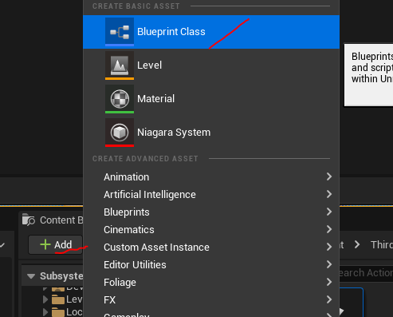
В появившемся окне, во вкладке `All Classes`, ищем класс `EnCharacter` и создаем `blueprint`.
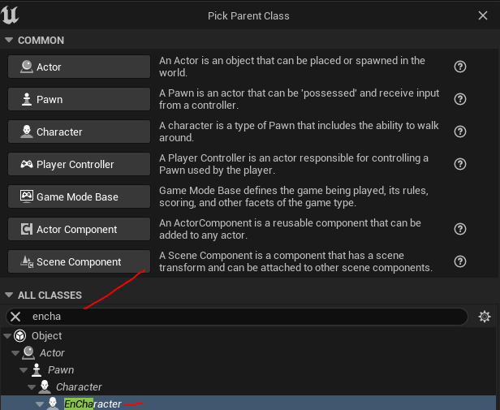
Называем новый класс `BP_EnCharacter`.
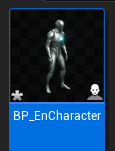
Если открыть созданный `blueprint`, мы увидим, что меш персонажа и все компоненты загружены корректно.
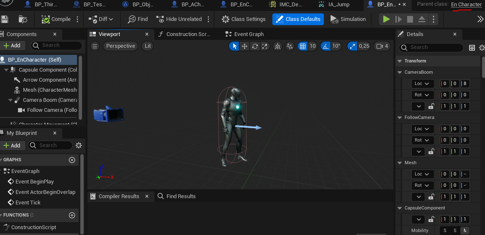
Чтобы протестировать работу нашего класса - добавим его в текущий `Game Mode`.
Поскольку у мы работаем в проекте `Third Person Template`, у нас уже есть реализация `Game Mode`. Ее можно найти в папке `Content/ThirdPerson/Blueprints`.
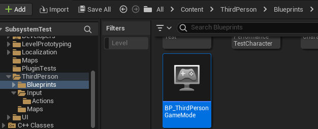
Открываем `BP_ThirdPersonGameMode` и устанавливаем `BP_EnCharacter`, как `DefaultPawnClass`.
(у меня персонаж уже создан и называется `BP_EnCharacterTest`)
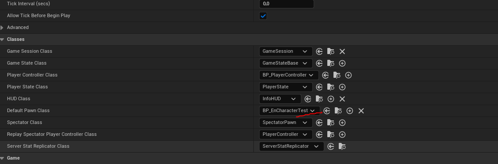
Если сейчас запустить тестовую карту, то выбранный класс персонажа загрузится и мы сможем увидеть свой код в действии.
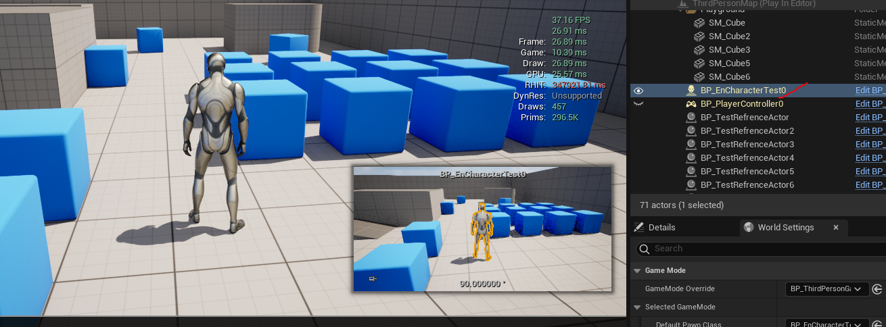
Все инпуты работают, камера двигается, прыжки работают.
## Улучшаем логику персонажа
У подключенного таким образом плагина `EnhancedInput` есть один весьма существенный недостаток -  необходимость постоянно создавать новые переменные под новые `InputAction`.
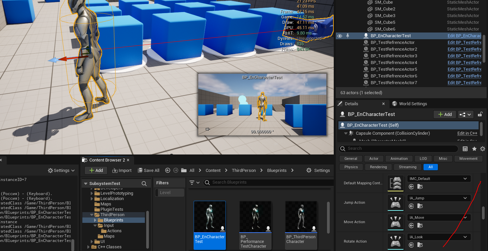
Причем создавать их придется всякий раз из кода, что крайне неудобно.
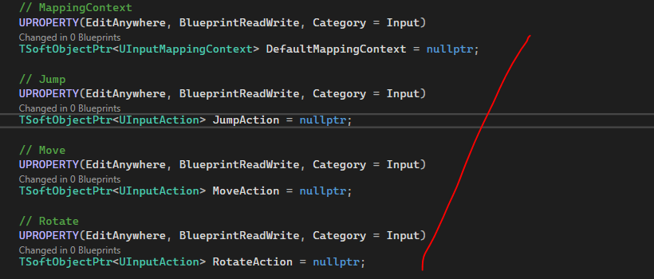
При том, что у нас уже есть `DefaultMappingContext`, который содержит ссылки на все, необходимые, `InputAction`.
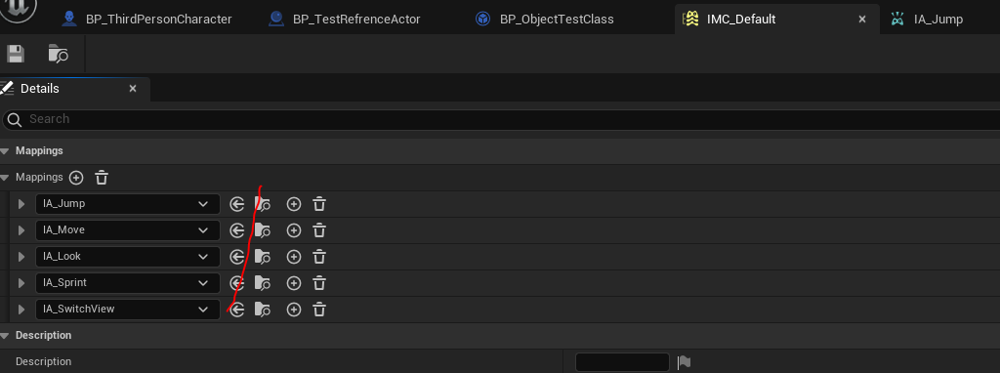
Предлагаю использовать `MappingContext` для автоматического поиска и загрузки `InputAction`.
Под эти цели я написал метод:
```cpp
//.h
// will bind new mapping context
UFUNCTION(BlueprintCallable, Category = "Input")
void BindContext(TSoftObjectPtr<UInputMappingContext> Context = nullptr);
//...
//.cpp
// will bind new mapping context
// will bind new mapping context
void AEnCharacter::BindContext(TSoftObjectPtr<UInputMappingContext> Context)
{
	if (Context == nullptr) {
		Context = MappingContext;
	}
	if(Context == nullptr) return; // only because i don't want to crash app with check()
	// Load Mapping Context if controller is posessed
	APlayerController* PlayerController = Cast<APlayerController>(GetController());
	if (PlayerController == nullptr) return;
	const ULocalPlayer* LocalPlayer = PlayerController->GetLocalPlayer();
	// get enhanced input component's subsystem
	UEnhancedInputLocalPlayerSubsystem* EiSubsystem = ULocalPlayer::GetSubsystem<UEnhancedInputLocalPlayerSubsystem>(LocalPlayer);
	ensure(LocalPlayer && EiSubsystem);
	// input component
	UEnhancedInputComponent* EnhancedInputComponent = Cast<UEnhancedInputComponent>(PlayerController->InputComponent);
	//EnhancedInputComponent->ClearActionBindings(); // clear all bindings if necessary
	EnhancedInputComponent->ClearBindingsForObject(this); // clear bindings only from this object
	if (EiSubsystem != nullptr) {
		// register mapping context
		EiSubsystem->AddMappingContext(Context.Get(), InputPriority);
	}
	// iterate over all mappings and put every unique action into the Map
	// since actions occur in the map multiple times, for every key binding
	TMap<FName, const UInputAction*> Actions;
	for (FEnhancedActionKeyMapping Mapping : Context->GetMappings()) {
		FName ActionName = Mapping.Action->GetFName();
		if (!Actions.Contains(ActionName)) {
			Actions.Add(ActionName, Mapping.Action.Get());
		}
		UE_LOG(LogTemp, Warning, TEXT("Action Name = %s"), *Mapping.Action->GetName())
	}
	// now differentiate actions in the loop and assign them according to the names
	// make sure to give action names accordingly
	for (const TPair<FName, const UInputAction*>& ActionInfo : Actions)
	{
		FString AName = ActionInfo.Key.ToString();
		const UInputAction* Action = ActionInfo.Value;
		// Jumping
		if (AName.Contains(TEXT("Jump"))) {
			EnhancedInputComponent->BindAction(Action, ETriggerEvent::Triggered, this, &ACharacter::Jump);
			EnhancedInputComponent->BindAction(Action, ETriggerEvent::Completed, this, &ACharacter::StopJumping);
		}
		// Moving
		if (AName.Contains(TEXT("Move"))) {
			EnhancedInputComponent->BindAction(Action, ETriggerEvent::Triggered, this, &AEnCharacter::Move);
		}
		// Sprinting
		if (AName.Contains(TEXT("Sprint"))) {
			EnhancedInputComponent->BindAction(Action, ETriggerEvent::Triggered, this, &AEnCharacter::StartSprint);
			EnhancedInputComponent->BindAction(Action, ETriggerEvent::Completed, this, &AEnCharacter::EndSprint);
		}
		// Looking around
		if (AName.Contains(TEXT("Look"))) {
			EnhancedInputComponent->BindAction(Action, ETriggerEvent::Triggered, this, &AEnCharacter::Rotate);
		}
	}
}
```
В этом методе я присваиваю `InputAction` по к обработчикам по их имени. Это очень сильно упрощает код, потому что создавать указатели под каждый `InputAction` в теле класса `EnCharacter` больше не надо. Старые указатели можно удалить.
Поскольку функция `BindContext` помечена как `BlueprintCallable`, ее можно спокойно использовать из `blueprint` кода для загрузки другого контекста, при необходимости.
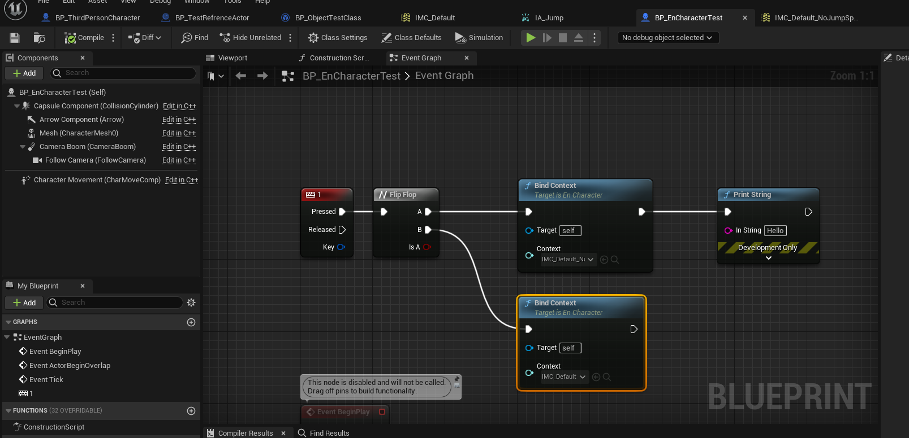
При этом переживать насчет имен файлов не стоит. `Unreal Engine` сохраняет имена и структуру файловой системы в упакованных проектах. Именно поэтому ассеты, загруженные по текстовым ссылкам - продолжают работать.
### Файл `EnCharacter.h`
```cpp
#pragma once
#include "CoreMinimal.h"
#include "GameFramework/Character.h"
// Mapping Context
#include "InputMappingContext.h"
// Enhanced Input
#include "EnhancedInputSubsystems.h"
#include "EnhancedInputComponent.h"
// Kismet
#include "Kismet/KismetSystemLibrary.h"
#include "Kismet/GameplayStatics.h"
// Animation Asset
#include "Animation/AnimationAsset.h"
// Capsule Component
#include "Components/CapsuleComponent.h"
// Character Movement
#include "GameFramework/CharacterMovementComponent.h"
// Camera
#include "Camera/CameraComponent.h"
// Spring Arm
#include "GameFramework/SpringArmComponent.h"
// generated.h
#include "EnCharacter.generated.h"
UCLASS()
class ENHANCEDCHARACTER_API AEnCharacter : public ACharacter
{
	GENERATED_BODY()
public:
	// Sets default values for this character's properties
	AEnCharacter(const FObjectInitializer& ObjectInitializer);
	// Spring Arm
	UPROPERTY(VisibleAnywhere, BlueprintReadOnly, Category = Camera)
	TObjectPtr<USpringArmComponent> CameraBoom;
	// Camera
	UPROPERTY(VisibleAnywhere, BlueprintReadOnly, Category = Camera)
	TObjectPtr<UCameraComponent> FollowCamera;
	// MappingContext
	UPROPERTY(EditAnywhere, BlueprintReadWrite, Category = Input)
	TSoftObjectPtr<UInputMappingContext> MappingContext = nullptr;
protected:
	// Called when the game starts or when spawned
	virtual void BeginPlay() override;
	// Movement Input
	void Move(const FInputActionValue& Value);
	// Camera Input
	void Rotate(const FInputActionValue& Value);
	// Sprint
	void StartSprint(const FInputActionValue& Value);
	// End Sprint
	void EndSprint(const FInputActionValue& Value);
public:
	// will bind new mapping context
	UFUNCTION(BlueprintCallable, Category = "Input")
	void BindContext(TSoftObjectPtr<UInputMappingContext> Context = nullptr);
	// Called every frame
	virtual void Tick(float DeltaTime) override;
	// Called to bind functionality to input
	virtual void SetupPlayerInputComponent(class UInputComponent* PlayerInputComponent) override;
	// Once character posessed
	virtual void PossessedBy(AController* NewController) override;
};
```
### Файл `EnCharacter.cpp`
```cpp
#include "EnCharacter.h"
// Sets default values
AEnCharacter::AEnCharacter(const FObjectInitializer& ObjectInitializer)
{
	// SpringArm for the camera
	{
		CameraBoom = CreateDefaultSubobject<USpringArmComponent>(TEXT("CameraBoom"));
		CameraBoom->SetRelativeLocation(FVector3d(0.0f, 0.0f, 8.492264f));
		CameraBoom->SetupAttachment(RootComponent);
		CameraBoom->TargetArmLength = 400.0f; // The camera follows at this distance behind the character
		CameraBoom->bUsePawnControlRotation = true; // Rotate the arm based on the controller
		CameraBoom->bInheritPitch = true;
		CameraBoom->bInheritYaw = true;
		CameraBoom->bInheritRoll = true;
	}
	// Camera
	{
		FollowCamera = CreateDefaultSubobject<UCameraComponent>(TEXT("FollowCamera"));
		FollowCamera->SetupAttachment(CameraBoom, USpringArmComponent::SocketName); // Attach the camera to the end of the boom and let the boom adjust to match the controller orientation
		FollowCamera->bUsePawnControlRotation = false; // Camera does not rotate relative to arm
		FollowCamera->Deactivate(); // Deactivate camera by default to prevent performance issues
	}
	// Default Rotation Settings
	{
		bUseControllerRotationPitch = false;
		bUseControllerRotationYaw = false;
		bUseControllerRotationRoll = false;
	}
	// Set Character Movement values
	{
		UCharacterMovementComponent* CharMoveComp = GetCharacterMovement();
		CharMoveComp->bOrientRotationToMovement = true; // will force character to rotate towards velocity direction
		CharMoveComp->RotationRate = FRotator(0.0f, 500.0f, 0.0f); // with rotation rate
		// Speed values
		CharMoveComp->JumpZVelocity = 700.f;
		CharMoveComp->AirControl = 0.35f;
		CharMoveComp->MaxWalkSpeed = 250.f;
		CharMoveComp->MinAnalogWalkSpeed = 20.f;
		CharMoveComp->BrakingDecelerationWalking = 2000.f;
	}
	// Set Capsule Size
	{
		UCapsuleComponent* CapsuleComp = GetCapsuleComponent();
		CapsuleComp->InitCapsuleSize(35.0f, 90.0f);
	}
	// Load Default Skeletal Mesh
	{
		USkeletalMeshComponent* MeshComp = GetMesh();
		if (MeshComp->GetSkeletalMeshAsset() == nullptr) {
			const FString MannequinAsset = TEXT("/Script/Engine.SkeletalMesh'/Game/Characters/Mannequins/Meshes/SKM_Manny.SKM_Manny'");
			const TSoftObjectPtr<USkeletalMesh> SKMesh(MannequinAsset);
			if (!SKMesh.IsNull()) {
				MeshComp->SetSkeletalMesh(SKMesh.LoadSynchronous());
			}
			// Load ainm instance as well
			// since we loading blueprint class, add _C at the end of the asset refrence
			const FString AnimationInstanceAsset = TEXT("/Script/Engine.AnimBlueprint'/Game/Characters/Mannequins/Animations/ABP_Manny.ABP_Manny_C'");
			const TSoftClassPtr<UAnimInstance> CAnimInst(AnimationInstanceAsset);
			if (!CAnimInst.IsNull()) {
				MeshComp->SetAnimationMode(EAnimationMode::AnimationBlueprint);
				MeshComp->SetAnimInstanceClass(CAnimInst.LoadSynchronous());
			}
			// Apply default parameters to the mesh
			// Relative Location
			MeshComp->SetRelativeLocation(FVector3d(0.0f, 0.0f, -89.0f));
			// Relative Rotation
			MeshComp->SetRelativeRotation(FRotator(0.0f, 270.0f, 0.0f));
		}
	}
	// Load Default Mapping Context
	if (MappingContext == nullptr) {
		const FString DefaultMappingContextAsset = TEXT("/Script/EnhancedInput.InputMappingContext'/Game/ThirdPerson/Input/IMC_Default.IMC_Default'");
		MappingContext = UKismetSystemLibrary::MakeSoftObjectPath(DefaultMappingContextAsset);
	}
}
// Called when the game starts or when spawned
void AEnCharacter::BeginPlay()
{
	Super::BeginPlay();
	BindContext(MappingContext.LoadSynchronous());
}
// will bind new mapping context
void AEnCharacter::BindContext(TSoftObjectPtr<UInputMappingContext> Context)
{
	if (Context == nullptr) {
		Context = MappingContext;
	}
	if(Context == nullptr) return; // only because i don't want to crash app with check()
	// Load Mapping Context if controller is posessed
	APlayerController* PlayerController = Cast<APlayerController>(GetController());
	if (PlayerController == nullptr) return;
	const ULocalPlayer* LocalPlayer = PlayerController->GetLocalPlayer();
	// get enhanced input component's subsystem
	UEnhancedInputLocalPlayerSubsystem* EiSubsystem = ULocalPlayer::GetSubsystem<UEnhancedInputLocalPlayerSubsystem>(LocalPlayer);
	ensure(LocalPlayer && EiSubsystem);
	// input component
	UEnhancedInputComponent* EnhancedInputComponent = Cast<UEnhancedInputComponent>(PlayerController->InputComponent);
	//EnhancedInputComponent->ClearActionBindings(); // clear all bindings if necessary
	EnhancedInputComponent->ClearBindingsForObject(this); // clear bindings only from this object
	if (EiSubsystem != nullptr) {
		// register mapping context
		EiSubsystem->AddMappingContext(Context.Get(), InputPriority);
	}
	// iterate over all mappings and put every unique action into the Map
	// since actions occur in the map multiple times, for every key binding
	TMap<FName, const UInputAction*> Actions;
	for (FEnhancedActionKeyMapping Mapping : Context->GetMappings()) {
		FName ActionName = Mapping.Action->GetFName();
		if (!Actions.Contains(ActionName)) {
			Actions.Add(ActionName, Mapping.Action.Get());
		}
		UE_LOG(LogTemp, Warning, TEXT("Action Name = %s"), *Mapping.Action->GetName())
	}
	// now differentiate actions in the loop and assign them according to the names
	// make sure to give action names accordingly
	for (const TPair<FName, const UInputAction*>& ActionInfo : Actions)
	{
		FString AName = ActionInfo.Key.ToString();
		const UInputAction* Action = ActionInfo.Value;
		// Jumping
		if (AName.Contains(TEXT("Jump"))) {
			EnhancedInputComponent->BindAction(Action, ETriggerEvent::Triggered, this, &ACharacter::Jump);
			EnhancedInputComponent->BindAction(Action, ETriggerEvent::Completed, this, &ACharacter::StopJumping);
		}
		// Moving
		if (AName.Contains(TEXT("Move"))) {
			EnhancedInputComponent->BindAction(Action, ETriggerEvent::Triggered, this, &AEnCharacter::Move);
		}
		// Sprinting
		if (AName.Contains(TEXT("Sprint"))) {
			EnhancedInputComponent->BindAction(Action, ETriggerEvent::Triggered, this, &AEnCharacter::StartSprint);
			EnhancedInputComponent->BindAction(Action, ETriggerEvent::Completed, this, &AEnCharacter::EndSprint);
		}
		// Looking around
		if (AName.Contains(TEXT("Look"))) {
			EnhancedInputComponent->BindAction(Action, ETriggerEvent::Triggered, this, &AEnCharacter::Rotate);
		}
	}
}
// On Possessed
void AEnCharacter::PossessedBy(AController* NewController)
{
	// Enable Camera when posessed
	if (NewController->IsLocalPlayerController()) {
		FollowCamera->Activate();
	}
}
// Start Sprint
void AEnCharacter::StartSprint(const FInputActionValue& Value)
{
	UCharacterMovementComponent* CharMoveComp = GetCharacterMovement();
	CharMoveComp->MaxWalkSpeed = 500.f;
}
// End Sprint
void AEnCharacter::EndSprint(const FInputActionValue& Value)
{
	UCharacterMovementComponent* CharMoveComp = GetCharacterMovement();
	CharMoveComp->MaxWalkSpeed = 250.f;
}
// Movement Input
void AEnCharacter::Move(const FInputActionValue& Value)
{
	// input is a Vector2D
	FVector2D MovementVector = Value.Get<FVector2D>();
	if (Controller != nullptr)
	{
		// find out which way is forward
		const FRotator Rotation = Controller->GetControlRotation();
		const FRotator YawRotation(0, Rotation.Yaw, 0);
		// get forward vector
		const FVector ForwardDirection = FRotationMatrix(YawRotation).GetUnitAxis(EAxis::X);
		// get right vector
		const FVector RightDirection = FRotationMatrix(YawRotation).GetUnitAxis(EAxis::Y);
		// add movement
		AddMovementInput(ForwardDirection, MovementVector.Y);
		AddMovementInput(RightDirection, MovementVector.X);
	}
}
// Roation Input
void AEnCharacter::Rotate(const FInputActionValue& Value)
{
	// input is a Vector2D
	FVector2D LookAxisVector = Value.Get<FVector2D>();
	// if controller is possessed
	if (Controller != nullptr) {
		AddControllerYawInput(LookAxisVector.X);
		AddControllerPitchInput(LookAxisVector.Y);
	}
}
// Called every frame
void AEnCharacter::Tick(float DeltaTime)
{
	Super::Tick(DeltaTime);
}
// Called to bind functionality to input
void AEnCharacter::SetupPlayerInputComponent(UInputComponent* PlayerInputComponent)
{
	Super::SetupPlayerInputComponent(PlayerInputComponent);
}
```
## Pass Inputs without Possess

> Передать события ввода на персонажа, без вызова метода `Possess`.

Одной из фундаментальных проблем `Unreal Engine` является тот факт, что этот движок заточен под шутеры. Если же мы пытаемся сделать а нем рпг или стратегию - приходится заниматься извращениями. Именно таким извращениям посвящена эта статья.
В стратегии игрок должен иметь возможность управлять не одним персонажем, а целой группой персонажей. Из одного контроллера.
Единственный способ решить эту задачу - перехват событий у не подключенного контроллера, без вызова метода `posses` и прямого подключения персонажа.
Отмечу, что средствами `blueprint` эту задачу решить куда сложнее, чем через `с++`.
### Файл `EnCharacter.h`
```cpp
#pragma once
#include "CoreMinimal.h"
#include "GameFramework/Character.h"
// Mapping Context
#include "InputMappingContext.h"
// Enhanced Input
#include "EnhancedInputSubsystems.h"
#include "EnhancedInputComponent.h"
// Kismet
#include "Kismet/KismetSystemLibrary.h"
#include "Kismet/GameplayStatics.h"
// Animation Asset
#include "Animation/AnimationAsset.h"
// Capsule Component
#include "Components/CapsuleComponent.h"
// Character Movement
#include "GameFramework/CharacterMovementComponent.h"
// Camera
#include "Camera/CameraComponent.h"
// Spring Arm
#include "GameFramework/SpringArmComponent.h"
// generated.h
#include "EnCharacter.generated.h"
UCLASS()
class ENHANCEDCHARACTER_API AEnCharacter : public ACharacter
{
	GENERATED_BODY()
public:
	// Sets default values for this character's properties
	AEnCharacter(const FObjectInitializer& ObjectInitializer);
	// Spring Arm
	UPROPERTY(VisibleAnywhere, BlueprintReadOnly, Category = Camera)
	TObjectPtr<USpringArmComponent> CameraBoom;
	// Camera
	UPROPERTY(VisibleAnywhere, BlueprintReadOnly, Category = Camera)
	TObjectPtr<UCameraComponent> FollowCamera;
	// MappingContext
	UPROPERTY(EditAnywhere, BlueprintReadWrite, Category = Input)
	TSoftObjectPtr<UInputMappingContext> MappingContext = nullptr;
	// if true - will recive player input without being possessed
	UPROPERTY(EditDefaultsOnly, Category = Pawn)
	bool RecivePlayerInputWitoutPossess = false;
protected:
	// Called when the game starts or when spawned
	virtual void BeginPlay() override;
	// Movement Input
	void Move(const FInputActionValue& Value);
	// Camera Input
	void Rotate(const FInputActionValue& Value);
	// Sprint
	void StartSprint(const FInputActionValue& Value);
	// End Sprint
	void EndSprint(const FInputActionValue& Value);
public:
	// will bind new mapping context
	UFUNCTION(BlueprintCallable, Category = "Input")
	void BindContext(TSoftObjectPtr<UInputMappingContext> Context = nullptr, AController* OnController = nullptr);
	// Called every frame
	virtual void Tick(float DeltaTime) override;
	// Called to bind functionality to input
	virtual void SetupPlayerInputComponent(class UInputComponent* PlayerInputComponent) override;
	// Once character posessed
	virtual void PossessedBy(AController* NewController) override;
};
```
### Файл `EnCharacter.cpp`
```cpp
#include "EnCharacter.h"
// Sets default values
AEnCharacter::AEnCharacter(const FObjectInitializer& ObjectInitializer)
{
	// SpringArm for the camera
	{
		CameraBoom = CreateDefaultSubobject<USpringArmComponent>(TEXT("CameraBoom"));
		CameraBoom->SetRelativeLocation(FVector3d(0.0f, 0.0f, 8.492264f));
		CameraBoom->SetupAttachment(RootComponent);
		CameraBoom->TargetArmLength = 400.0f; // The camera follows at this distance behind the character
		CameraBoom->bUsePawnControlRotation = true; // Rotate the arm based on the controller
		CameraBoom->bInheritPitch = true;
		CameraBoom->bInheritYaw = true;
		CameraBoom->bInheritRoll = true;
	}
	// Camera
	{
		FollowCamera = CreateDefaultSubobject<UCameraComponent>(TEXT("FollowCamera"));
		FollowCamera->SetupAttachment(CameraBoom, USpringArmComponent::SocketName); // Attach the camera to the end of the boom and let the boom adjust to match the controller orientation
		FollowCamera->bUsePawnControlRotation = false; // Camera does not rotate relative to arm
		FollowCamera->Deactivate(); // Deactivate camera by default to prevent performance issues
	}
	// Default Rotation Settings
	{
		bUseControllerRotationPitch = false;
		bUseControllerRotationYaw = false;
		bUseControllerRotationRoll = false;
	}
	// Set Character Movement values
	{
		UCharacterMovementComponent* CharMoveComp = GetCharacterMovement();
		CharMoveComp->bOrientRotationToMovement = true; // will force character to rotate towards velocity direction
		CharMoveComp->RotationRate = FRotator(0.0f, 500.0f, 0.0f); // with rotation rate
		// Speed values
		CharMoveComp->JumpZVelocity = 700.f;
		CharMoveComp->AirControl = 0.35f;
		CharMoveComp->MaxWalkSpeed = 250.f;
		CharMoveComp->MinAnalogWalkSpeed = 20.f;
		CharMoveComp->BrakingDecelerationWalking = 2000.f;
	}
	// Set Capsule Size
	{
		UCapsuleComponent* CapsuleComp = GetCapsuleComponent();
		CapsuleComp->InitCapsuleSize(35.0f, 90.0f);
	}
	// Load Default Skeletal Mesh
	{
		USkeletalMeshComponent* MeshComp = GetMesh();
		if (MeshComp->GetSkeletalMeshAsset() == nullptr) {
			const FString MannequinAsset = TEXT("/Script/Engine.SkeletalMesh'/Game/Characters/Mannequins/Meshes/SKM_Manny.SKM_Manny'");
			const TSoftObjectPtr<USkeletalMesh> SKMesh(MannequinAsset);
			if (!SKMesh.IsNull()) {
				MeshComp->SetSkeletalMesh(SKMesh.LoadSynchronous());
			}
			// Load ainm instance as well
			// since we loading blueprint class, add _C at the end of the asset refrence
			const FString AnimationInstanceAsset = TEXT("/Script/Engine.AnimBlueprint'/Game/Characters/Mannequins/Animations/ABP_Manny.ABP_Manny_C'");
			const TSoftClassPtr<UAnimInstance> CAnimInst(AnimationInstanceAsset);
			if (!CAnimInst.IsNull()) {
				MeshComp->SetAnimationMode(EAnimationMode::AnimationBlueprint);
				MeshComp->SetAnimInstanceClass(CAnimInst.LoadSynchronous());
			}
			// Apply default parameters to the mesh
			// Relative Location
			MeshComp->SetRelativeLocation(FVector3d(0.0f, 0.0f, -89.0f));
			// Relative Rotation
			MeshComp->SetRelativeRotation(FRotator(0.0f, 270.0f, 0.0f));
		}
	}
	// Load Default Mapping Context
	if (MappingContext == nullptr) {
		const FString DefaultMappingContextAsset = TEXT("/Script/EnhancedInput.InputMappingContext'/Game/ThirdPerson/Input/IMC_Default.IMC_Default'");
		MappingContext = UKismetSystemLibrary::MakeSoftObjectPath(DefaultMappingContextAsset);
	}
}
// Called when the game starts or when spawned
void AEnCharacter::BeginPlay()
{
	Super::BeginPlay();
	if (Controller != nullptr) {
		BindContext(MappingContext.LoadSynchronous(), Controller); // bind input context
	}
	else
	if (RecivePlayerInputWitoutPossess) {
		// get player controller from the world
		APlayerController* PlayerController = UGameplayStatics::GetPlayerController(GetWorld(), 0);
		EnableInput(PlayerController); // thiw sill allow player inputs to work on this actor
		BindContext(MappingContext.LoadSynchronous(), PlayerController); // bind input context to player controller
		// set controller refrence. IHIS STEP IS VERY IMPORTANT
		Controller = PlayerController;
		// finalise
		SetupPlayerInputComponent(PlayerController->InputComponent);
	}
}
// will bind new mapping context
void AEnCharacter::BindContext(TSoftObjectPtr<UInputMappingContext> Context, AController* OnController)
{
	if (Context == nullptr) {
		Context = MappingContext;
	}
	if(Context == nullptr) return; // only because i don't want to crash app with check()
	// if OnController dosen't set - use default GetController()
	AController* CurrentContoller = OnController == nullptr ? GetController() : OnController;
	// cast controller to the PlayerController, because we need LocalPlayerSubsystem access
	APlayerController* PlayerController = Cast<APlayerController>(CurrentContoller);
	if (PlayerController == nullptr) return;
	const ULocalPlayer* LocalPlayer = PlayerController->GetLocalPlayer();
	// get enhanced input component's subsystem
	UEnhancedInputLocalPlayerSubsystem* EiSubsystem = ULocalPlayer::GetSubsystem<UEnhancedInputLocalPlayerSubsystem>(LocalPlayer);
	ensure(LocalPlayer && EiSubsystem);
	// input component
	UEnhancedInputComponent* EnhancedInputComponent = Cast<UEnhancedInputComponent>(PlayerController->InputComponent);
	//EnhancedInputComponent->ClearActionBindings(); // clear all bindings if necessary
	EnhancedInputComponent->ClearBindingsForObject(this); // clear bindings only from this object
	if (EiSubsystem != nullptr) {
		// register mapping context
		EiSubsystem->AddMappingContext(Context.Get(), InputPriority);
	}
	// iterate over all mappings and put every unique action into the Map
	// since actions occur in the map multiple times, for every key binding
	TMap<FName, const UInputAction*> Actions;
	for (FEnhancedActionKeyMapping Mapping : Context->GetMappings()) {
		FName ActionName = Mapping.Action->GetFName();
		if (!Actions.Contains(ActionName)) {
			Actions.Add(ActionName, Mapping.Action.Get());
		}
		UE_LOG(LogTemp, Warning, TEXT("Action Name = %s"), *Mapping.Action->GetName())
	}
	// now differentiate actions in the loop and assign them according to the names
	// make sure to give action names accordingly
	for (const TPair<FName, const UInputAction*>& ActionInfo : Actions)
	{
		FString AName = ActionInfo.Key.ToString();
		const UInputAction* Action = ActionInfo.Value;
		// Jumping
		if (AName.Contains(TEXT("Jump"))) {
			EnhancedInputComponent->BindAction(Action, ETriggerEvent::Triggered, this, &ACharacter::Jump);
			EnhancedInputComponent->BindAction(Action, ETriggerEvent::Completed, this, &ACharacter::StopJumping);
		}
		// Moving
		if (AName.Contains(TEXT("Move"))) {
			EnhancedInputComponent->BindAction(Action, ETriggerEvent::Triggered, this, &AEnCharacter::Move);
		}
		// Sprinting
		if (AName.Contains(TEXT("Sprint"))) {
			EnhancedInputComponent->BindAction(Action, ETriggerEvent::Triggered, this, &AEnCharacter::StartSprint);
			EnhancedInputComponent->BindAction(Action, ETriggerEvent::Completed, this, &AEnCharacter::EndSprint);
		}
		// Looking around
		if (AName.Contains(TEXT("Look"))) {
			EnhancedInputComponent->BindAction(Action, ETriggerEvent::Triggered, this, &AEnCharacter::Rotate);
		}
	}
}
// On Possessed
void AEnCharacter::PossessedBy(AController* NewController)
{
	// Enable Camera when posessed
	if (NewController->IsLocalPlayerController()) {
		FollowCamera->Activate();
	}
}
// Start Sprint
void AEnCharacter::StartSprint(const FInputActionValue& Value)
{
	UCharacterMovementComponent* CharMoveComp = GetCharacterMovement();
	CharMoveComp->MaxWalkSpeed = 500.f;
}
// End Sprint
void AEnCharacter::EndSprint(const FInputActionValue& Value)
{
	UCharacterMovementComponent* CharMoveComp = GetCharacterMovement();
	CharMoveComp->MaxWalkSpeed = 250.f;
}
// Movement Input
void AEnCharacter::Move(const FInputActionValue& Value)
{
	// input is a Vector2D
	FVector2D MovementVector = Value.Get<FVector2D>();
	if (Controller != nullptr)
	{
		// find out which way is forward
		const FRotator Rotation = Controller->GetControlRotation();
		const FRotator YawRotation(0, Rotation.Yaw, 0);
		// get forward vector
		const FVector ForwardDirection = FRotationMatrix(YawRotation).GetUnitAxis(EAxis::X);
		// get right vector
		const FVector RightDirection = FRotationMatrix(YawRotation).GetUnitAxis(EAxis::Y);
		// add movement
		AddMovementInput(ForwardDirection, MovementVector.Y);
		AddMovementInput(RightDirection, MovementVector.X);
	}
}
// Roation Input
void AEnCharacter::Rotate(const FInputActionValue& Value)
{
	// input is a Vector2D
	FVector2D LookAxisVector = Value.Get<FVector2D>();
	// this methods won't work without possess anyway
	if(IsPlayerControlled()){
		AddControllerYawInput(LookAxisVector.X);
		AddControllerPitchInput(LookAxisVector.Y);
	}
}
// Called every frame
void AEnCharacter::Tick(float DeltaTime)
{
	Super::Tick(DeltaTime);
	// Since AddControllerYawInput and AddControllerPitchInput dosen't work without "Posess", i have to copy rotation directly
	if (InputEnabled()) {
		ACharacter* PLCharacter = UGameplayStatics::GetPlayerCharacter(GetWorld(), 0);
		if (PLCharacter != this) {
			SetActorRotation(PLCharacter->GetActorRotation());
		}
	}
}
// Called to bind functionality to input
void AEnCharacter::SetupPlayerInputComponent(UInputComponent* PlayerInputComponent)
{
	Super::SetupPlayerInputComponent(PlayerInputComponent);
}
```
### Принцип работы
В коде есть переменная `RecivePlayerInputWitoutPossess` которая будет видна в персонаже лишь на панели `Details`. Выставим ее в `true`.
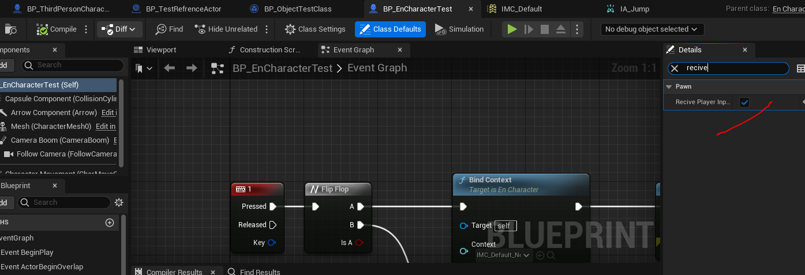
Добавим 2 или 3 персонажа типа `BP_EnCharacter` на уровень.
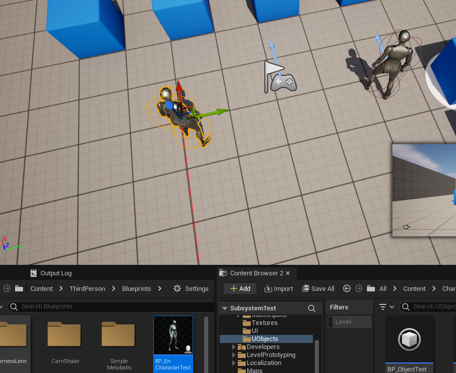
Если запустить проект, то мы увидим, как добавленные на сцену персонажи следуют за игроком, копируя все его действия, включая вращение.
При этом на персонажах нет никакого ИИ. Персонажи управляются за счет копирования событий ввода.
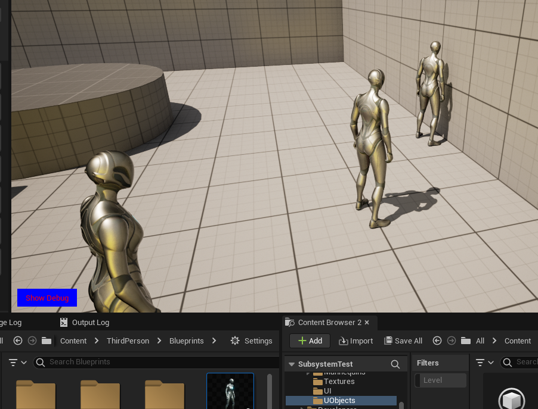
Таким способом можно управлять целыми группами песонажей, отключая их ии, когда они рядом, и включая ии, когда они далеко.
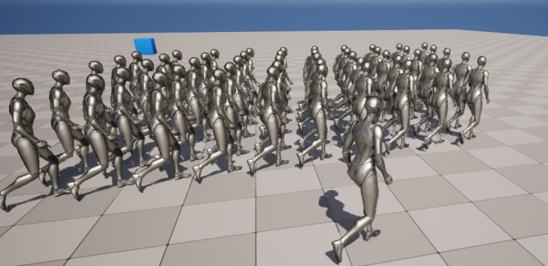