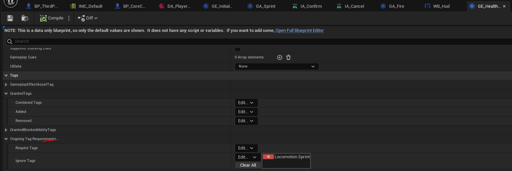
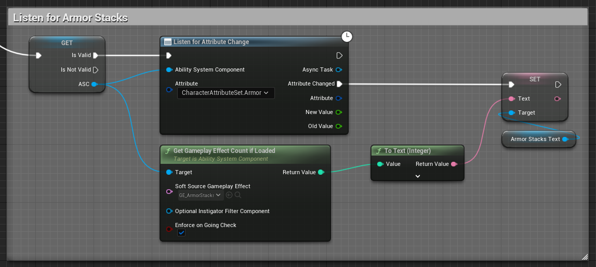
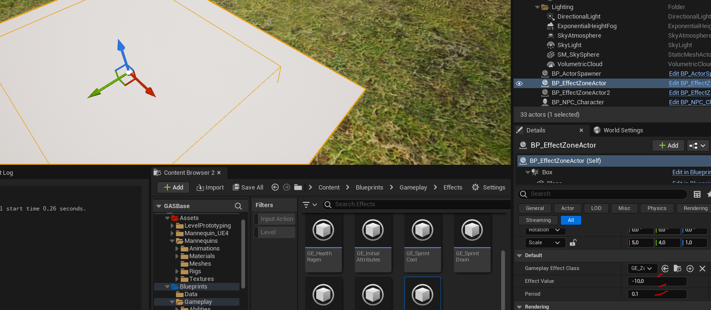

# Gameplay Ability System
`Gameplay Ability System` или `GAS` - это встроенный в `Unreal Engine` высокоуровневый фреймворк, упрощающий разработку игровой логики. На его основе разработчик может реализовать удобный функционал управления способностями, характеристиками и эффектами игровых объектов, в том числе - персонажей.
Все крупные `AAA` игры на `Unreal Engine` построены вокруг системы `GAS`. Среди таких: `Borderlands`, `Fortnite`, `PUBG`, `Tower of Fantasy` и  так далее.


Основное, что должен уметь программист под `Unreal Engine` относится к установке и настройке системы `GAS`. Благо сделать это достаточно просто и пусть размер статьи вас не пугает. `GAS` мы установим и настроим уже во второй главе. Все остальное посвящено неочевидным моментам работы с системой.
Фреймворк `GAS` предлагает абсолютно уникальный опыт по совмещению `с++` и `blueprint` кода. Установить и настроить его корректно надо всего один раз. Достаточно лишь определиться с набором характеристик, которые будут использоваться в вашей игре, а так-же с клавишами ввода - и каркас вашей игры будет готов. Всю остальную логику вы сможете писать исключительно на `blueprint`.
Никакие плагины, никакие платные ассеты не заменят для вас полноценно установленную и настроенную систему `Gameplay Abilities`.
На `Guthub` есть отличный репозиторий с примером проекта для `GAS` - [GAS Documentation](https://github.com/tranek/GASDocumentation). Он немного устарел и относится к `Unreal Engine 5.1`, а так-же не поддерживает `Enhanced Input`. В этой статье я исправлю недочеты старого проекта и постараюсь сделать повествование максимально доступным даже для того, кто не читал всю мою книгу, а открыл только эту статью.
## Подготовка к работе
Мы будем работать с абсолютно новым проектом.
### Создаем новый проект
В `Epic Games Launcher` запускаем выбранный нами игровой движок. В моем случае это `Unreal Engine 5.1`.

В появившемся окне переходим на вкладку `Games` и выбираем пункт `ThirdPerson`.
Называем будущий проект `GASBase`, выбираем место сохранения проекта. В настройках проекта выставляете `Blueprint` и галочку на `StarterContent`, он нам тоже понадобится.
Почему я создаю `Blueprint` проект? Потому что основные способности и эффекты, которые вы будете создавать для системы `GAS` реализованы в виде `Blueprint`. К тому-же из `blueprint` проекта в разы проще вести отладку игровой логики.

### Включаем требуемые плагины
После создания и запуска, проекта перейдите на вкладку `Edit -> Plugins`.
Для работы с `Visual Studio` необходимо установить плагин `Visual Studio Integration Tools`. Скачайте его с [официального маркетплейса](https://www.unrealengine.com/marketplace/en-US/product/visual-studio-integration-tool), это бесплатный плагин.
Активируйте плагины `Visual Studio Integration` и `Visual Studio Integration Tools`.

Фреймворк `GAS` реализован в плагине `Gameplay Abilities`, который поставляется вместе с `Unreal Engine`. Найти его можно в подкатегории `Gameplay`. Активируйте.

Если у вас не включен плагин `EnhancedInput` - включите его.

После активации плагинов - перезапускаем движок.

### Включаем поддержку `c++`
Поскольку мы создали `Blueprint` проект - поддержку `с++` в нем придется включать вручную. Для этого необходимо добавить в проект любой `с++` класс из редактора.
Предлагаю создать `BlueprintFunctionLibrary`.
Идем в меню `Tools -> New C++ Class`, в появившемся окне выбираем пункт `BlueprintFunctionLibrary`.


Называем наш класс `CoreProjectFunctionLibrary`. Размещаем его в подпапке `Library`.

После нажатия кнопки `CreateClass` движок откроет перед вами окно с вопросом, желаете ли вы запуска `Visual Studio`. Жмем - `No`.

Закрываем движок.
Переоткрываем проект с пересборкой модулей. Для этого нажимаем на файл `GASBase.uproject` в папке проекта. После чего перед вами появится всплывающее окно, с вопросом - желаете ли вы пересобрать проект. Жмете `Да` / `Yes`.

### Добавляем зависимости
Если все сделано правильно, то, после запуска движка, в меню `Tools` появятся новые пункты - `Refresh Visual Studio 2022 Project` и `Open Visual Studio 2022`.

Выбираем `Open Visual Studio 2022`.
В `Solution Explorer` открывавем папку `Source -> GASBase`. Это главный модуль игры. Тут есть файл с расширением `.build.cs`, в моем случае он называется `GASBase.Build.cs`.

В этом файле необходимо указать зависимости нашего проекта.
Система `GAS` рекомендует включать следующие зависимости: `GameplayAbilities`, `GameplayTags` и `GameplayTasks`. Я так-же добавлю к ним `InputCore`, `EnhancedInput`, `SlateCore` и `Slate`.
```cpp
using UnrealBuildTool;
public class GASBase : ModuleRules
{
	public GASBase(ReadOnlyTargetRules Target) : base(Target)
	{
		PCHUsage = PCHUsageMode.UseExplicitOrSharedPCHs;
		PublicDependencyModuleNames.AddRange(new string[] {
			"Core"
			, "CoreUObject"
			, "Engine"
			, "InputCore"
			, "EnhancedInput"
		});
		PrivateDependencyModuleNames.AddRange(new string[] {
            "GameplayAbilities"
			, "GameplayTags"
			, "GameplayTasks"
			, "SlateCore"
			, "Slate"
        });
	}
}
```

Пересобираем проект с помощью `LiveCoding` сочетанием клавиш `Ctrl + Alt + F11`.

Если все скомпилировалось успешно - мы готовы к работе.
## Добавляем `AttributeSet`
###  Введение в `AttributeSet`
`AttributeSet` это класс, в котором разработчик должен задать аттрибуты для работы с системой `GAS`. Про аттрибуты мы поговорим чуть ниже, в этой главе, а пока просто создадим класс и заполним его базовым набором инструкций.
### Создаем класс
Выполняем команду `Tools -> New C++ Class -> All Classes` ищем в списке `AttributeSet`.

Называем новый класс `CharacterAttributeSet` и добавляем его в модуль `GASModule`, в папку `Attributes`.


Открываем файл `CharacterAttributeSet.h`.
### Добавляем макрос `ATTRIBUTE_ACCESSORS`
Каждый класс `AttributeSet` должен содержать макрос `ATTRIBUTE_ACCESSORS` со следующим определением:
```cpp
// Uses macros from AttributeSet.h
#define ATTRIBUTE_ACCESSORS(ClassName, PropertyName) \
	GAMEPLAYATTRIBUTE_PROPERTY_GETTER(ClassName, PropertyName) \
	GAMEPLAYATTRIBUTE_VALUE_GETTER(PropertyName) \
	GAMEPLAYATTRIBUTE_VALUE_SETTER(PropertyName) \
	GAMEPLAYATTRIBUTE_VALUE_INITTER(PropertyName)
```
Рекомендации по использованию данного макроса могут быть найдены в исходных файлах движка -  `\Engine\Plugins\Runtime\GameplayAbilities\Source\GameplayAbilities\Public\AttributeSet.h`.

Добавляем макрос `ATTRIBUTE_ACCESSORS` в `CharacterAttributeSet`.
```cpp
//CharacterAttributeSet.h
#pragma once
#include "CoreMinimal.h"
#include "AttributeSet.h" // core
#include "Net/UnrealNetwork.h" // DOREPLIFETIME_CONDITION_NOTIFY macro
#include "GameplayEffectExtension.h"
// .generated.h
#include "CharacterAttributeSet.generated.h"
// Uses macros from AttributeSet.h
#define ATTRIBUTE_ACCESSORS(ClassName, PropertyName) \
	GAMEPLAYATTRIBUTE_PROPERTY_GETTER(ClassName, PropertyName) \
	GAMEPLAYATTRIBUTE_VALUE_GETTER(PropertyName) \
	GAMEPLAYATTRIBUTE_VALUE_SETTER(PropertyName) \
	GAMEPLAYATTRIBUTE_VALUE_INITTER(PropertyName)
/**
 * Character related attributes
 */
UCLASS()
class GASBASE_API UCharacterAttributeSet : public UAttributeSet
{
	GENERATED_BODY()
public:
    /* Attributes will be here */
};
```
Самое время добавить аттрибуты.
### Введение в Аттрибуты
Аттрибут - это переменная, которая используется разработчиком, для описания игровых характеристик персонажа. Аттрибутами являются: здоровье, выносливость, броня, скорость передвижения.
Пример аттрибута, отвечающего за здоровье персонажа:
```cpp
// Current Health
UPROPERTY(BlueprintReadOnly, Category = "Attributes", ReplicatedUsing = OnRep_Health)
FGameplayAttributeData Health;
ATTRIBUTE_ACCESSORS(UGameCharacterAttributeSet, Health)
```
Аттрибут описывается структурой `FGameplayAttributeData`. Данная структура может быть найдена в файле `\Engine\Plugins\Runtime\GameplayAbilities\Source\GameplayAbilities\Public\AttributeSet.h`.

#### Шаги для добавления аттрибута
Рассмотрим формулу, по которой добавляется почти каждый аттрибут.
В коде используются следующие заголовочные файлы:
```cpp
#include "AttributeSet.h" // core
#include "Net/UnrealNetwork.h" // DOREPLIFETIME_CONDITION_NOTIFY macro
#include "GameplayEffectExtension.h"
#include "AbilitySystemComponent.h"
```
##### Шаг 1
Добавляем аттрибут.
```cpp
// Current Health
UPROPERTY(BlueprintReadOnly, Category = "Attributes", ReplicatedUsing = OnRep_Health)
FGameplayAttributeData Health;
ATTRIBUTE_ACCESSORS(UCharacterAttributeSet, Health)
```
##### Шаг 2
Задаем значение "по умолчанию" в конструкторе класса.
```cpp
//.h
// Set Attribute Default Values in Constructor
UCharacterAttributeSet();
//...
//.cpp
// Set Attribute Default Values in Constructor
UCharacterAttributeSet::UCharacterAttributeSet()
{
	Health = 100.f;
}
```
##### Шаг 3
Создаем метод сетевой репликации аттрибута. Это надо делать только для основных аттрибутов, например для здоровья. Если аттрибут влияет на другие аттрибуты, но сам не предоставляет дополнительной логики - например регенерация здоровья - делать для него репликацию не нужно.
```cpp
//.h
// Current Health
// make ReplicatedUsing = OnRep_Health
UPROPERTY(BlueprintReadOnly, Category = "Attributes", ReplicatedUsing = OnRep_Health)
FGameplayAttributeData Health;
ATTRIBUTE_ACCESSORS(UCharacterAttributeSet, Health)
 
// Attributes replication live time
virtual void GetLifetimeReplicatedProps(TArray<FLifetimeProperty>& OutLifetimeProps) const override;
// Health replication
UFUNCTION()
virtual void OnRep_Health(const FGameplayAttributeData& Old);
//...
//.cpp
// Attributes replication live time
void UCharacterAttributeSet::GetLifetimeReplicatedProps(TArray<FLifetimeProperty>& OutLifetimeProps) const
{
	Super::GetLifetimeReplicatedProps(OutLifetimeProps);
	// Health
    // do same for all attributes:
	DOREPLIFETIME_CONDITION_NOTIFY(UCharacterAttributeSet, Health, COND_None, REPNOTIFY_Always);
}
// Health Replication
// for all attributes this method has same pattern
void UCharacterAttributeSet::OnRep_Health(const FGameplayAttributeData& Old)
{
	GAMEPLAYATTRIBUTE_REPNOTIFY(UCharacterAttributeSet, Health, Old);
}
```
##### Шаг 4
Фиксируем изменение аттрибута в определенных рамках, чтобы избежать нарушения игровой логики.
```cpp
//.h
/**
 * BASE and CURRENT value attribute change
 * BASE attribute values are NOT Modified by the Gameplay Effects
 * CURRENT attribute value is BASE value +- Gameplay Effect modifiers
 */
/**
 * CURRENT attribute value change notifies :
 */
// Called just before any modification happens to an attribute. This is lower level than PreAttributeModify/PostAttribute modify.
virtual void PreAttributeChange(const FGameplayAttribute& Attribute, float& NewValue) override;
/**
 * BASE attribute value change notifies :
 */
// Called just before any modification happens to an attribute's base value when an attribute aggregator exists
virtual void PreAttributeBaseChange(const FGameplayAttribute& Attribute, float& NewValue) const override;
// Clamp attributes to keep their values in range
virtual void ClampAttributeOnChange(const FGameplayAttribute& AffectedAttribute, float& NewValue) const;
//...
//.cpp
// Called just before any modification happens to an attribute's base value when an attribute aggregator exists
void UCharacterAttributeSet::PreAttributeBaseChange(const FGameplayAttribute& Attribute, float& NewValue) const
{
	Super::PreAttributeBaseChange(Attribute, NewValue);
	ClampAttributeOnChange(Attribute, NewValue);
}
// Called just before any modification happens to an attribute. This is lower level than PreAttributeModify/PostAttribute modify.
void UCharacterAttributeSet::PreAttributeChange(const FGameplayAttribute& Attribute, float& NewValue)
{
	Super::PreAttributeChange(Attribute, NewValue);
	ClampAttributeOnChange(Attribute, NewValue);
}
// Clamp attributes to keep their values in range
void UCharacterAttributeSet::ClampAttributeOnChange(const FGameplayAttribute& AffectedAttribute, float& NewValue) const
{
	if (AffectedAttribute == GetHealthAttribute()) {
		NewValue = FMath::Clamp(NewValue, 0, GetMaxHealth());
	}
}
```
Эта последовательность шагов повторяется для почти каждого из создаваемых аттрибутов.
---
#### `BaseValue` и `CurrentValue`
Каждый аттрибут имеет два значения:
1. `BaseValue` - значение аттрибута, без модификаций.
2. `CurrentValue` - значение аттрибута, который модифицирован наложенными эффектами.
Предположим, есть аттрибут скорости передвижения персонажа - `Speed`.
Изначальное значение аттрибута равно:`Speed = 600`. Если наложить на персонажа эффект ускорения, увеличивающий `Speed` на `50` единиц, то внутри аттрибута мы буедем иметь следующие значения: `BaseValue = 600`, `CurrentValue = 650`.
Когда все эффекты снимаются с персонажа или их время действия истекает `CurrentValue` принимает значение, которое хранится в `BaseValue`.
#### Максимальные и минимальные значения атрибутов
Макисмальные и минимальные значения аттрибута должны задаваться в виде отдельных аттрибутов. Необходимость такого разделения связана с сетевой составляющей системы.
Если минимальным значением аттрибута всегда является `0`, а максимальным, например, `100` и менять эти значения вы не собираетесь в будущем - можете отдельные аттрибуты под эти значения не создавать.
Рассмотрим реализацию аттрибута здоровья.
Поскольку с повышением уровня персонажа предполагается увеличение его запаса здоровья, максимальное значение здоровья должно быть задано в виде отдельного аттрибута.
```cpp
// Current Health
UPROPERTY(BlueprintReadOnly, Category = "Attributes", ReplicatedUsing = OnRep_Health)
FGameplayAttributeData Health;
ATTRIBUTE_ACCESSORS(UGameCharacterAttributeSet, Health)
// MaxHealth is its own attribute since GameplayEffects may modify it
UPROPERTY(BlueprintReadOnly, Category = "Attributes", ReplicatedUsing = OnRep_MaxHealth)
FGameplayAttributeData MaxHealth;
ATTRIBUTE_ACCESSORS(UGameCharacterAttributeSet, MaxHealth)
```
Для фиксации значения аттрибута в границах от минимума до максимума используют вспомогательный метод `ClampAttributeOnChange` который выглядит так:
```cpp
// Clamp attributes to keep their values in range
void ClampAttributeOnChange(const FGameplayAttribute& AffectedAttribute, float& NewValue) const
{
	if (AffectedAttribute == GetHealthAttribute()) {
		NewValue = FMath::Clamp(NewValue, 0, GetMaxHealth());
	}
    /* add more if necessary */
}
```
Для каждого аттрибута, который необходимо фиксировать в определенных рамках, используется дополнительное условие внутри метода `ClampAttributeOnChange`.
Данный метод вызывается в `PreAttributeChange` и `PreAttributeBaseChange`. Это гарантирует, что аттрибут с наложенными на него эффектами и без эффектов - всегда останется в заданных границах.
```cpp
// Called just before any modification happens to an attribute. This is lower level than PreAttributeModify/PostAttribute modify.
void PreAttributeChange(const FGameplayAttribute& Attribute, float& NewValue)
{
	Super::PreAttributeChange(Attribute, NewValue);
	ClampAttributeOnChange(Attribute, NewValue);
}
// Called just before any modification happens to an attribute's base value when an attribute aggregator exists
void PreAttributeBaseChange(const FGameplayAttribute& Attribute, float& NewValue) const
{
	Super::PreAttributeBaseChange(Attribute, NewValue);
	ClampAttributeOnChange(Attribute, NewValue);
}
```
#### Репликация вторичных аттрибутов
Аттрибуты, которые не имеют сетевой репликации и используются для обновления других аттрибутов считаются "вторичными" аттрибутами. К примеру, таким аттрибутом является `HealthRegenRate`, скорость восстановления здоровья. Этому  аттрибуту не нужна сетевая репликация, потому что показатель здоровья, на который этот аттрибут влияет - и без того реплицируется по сети, а значит мы избавляемся от лишней нагрузки.
```cpp
// Health Regen Rate
UPROPERTY(BlueprintReadOnly, Category = "Attributes")
FGameplayAttributeData HealthRegenRate;
ATTRIBUTE_ACCESSORS(UCharacterAttributeSet, HealthRegenRate)
```
##### `PostGameplayEffectExecute`
Данный метод вызывается после применения всех модификаторов эффекта к `BaseValue` аттрибута.
Логика нанесения урона обычно выполняется с использованием соответствующих эффектов урона. В методе `PostGameplayEffectExecute` вы можете проверить - убил урон персонажа или нет.
Так-же, используя данный метод можно "аккумулировать" урон, нанесенный персонажу. Это бывает полезно в сетевых играх, где соединение не всегда достаточно надежное и время применения эффектов урона на игроках между клиентами - разное. В этом случае вы можете использовать стакающийся эффект урона, например такой:

При стрельбе очередями в шутерах крайне накладно обрабатывать каждое попадание на сервере. Куда удобнее будет реализовать такой стакающийся эффект, который затем будет обработан через `PostGameplayEffectExecute`.
Тут мы немного забегаем вперед, но я все-же покажу как такой подход работает.
У нас есть нпц-цель.

В лог печатается урон, который будет нанесен здоровью за текущий тик:

При множественном наложении эффектов урона - их значение возрастает и они накладываются на здоровье все "разом".
Именно для такой `batched` обработки изменений от всех эффектов стоит использовать `PostGameplayEffectExecute`.
```cpp
//.h
/**
 * Gameplay Effects execution
 */
 // Called just before a GameplayEffect is executed to modify the base value of an attribute
virtual void PostGameplayEffectExecute(const struct FGameplayEffectModCallbackData& Data) override;
//...
//.cpp
// Called just before a GameplayEffect is executed to modify the base value of an attribute
void UCharacterAttributeSet::PostGameplayEffectExecute(const FGameplayEffectModCallbackData& Data)
{
	Super::PostGameplayEffectExecute(Data);
	FGameplayEffectContextHandle Context = Data.EffectSpec.GetContext();
	UAbilitySystemComponent* Source = Context.GetOriginalInstigatorAbilitySystemComponent();
	// Get the Target actor, which should be our owner
	AActor* TargetActor = nullptr;
	AController* TargetController = nullptr;
	UAbilitySystemComponent* TargetAbilitySystem = nullptr;
	if (Data.Target.AbilityActorInfo.IsValid() && Data.Target.AbilityActorInfo->AvatarActor.IsValid())
	{
		TargetActor = Data.Target.AbilityActorInfo->AvatarActor.Get();
		TargetAbilitySystem = Data.Target.AbilityActorInfo->AbilitySystemComponent.Get();
		TargetController = Data.Target.AbilityActorInfo->PlayerController.Get();
	}
	// Get the Source actor
	AActor* SourceActor = nullptr;
	AController* SourceController = nullptr;
	UAbilitySystemComponent* SourceAbilitySystem = nullptr;
	if (Source && Source->AbilityActorInfo.IsValid() && Source->AbilityActorInfo->AvatarActor.IsValid())
	{
		SourceActor = Source->AbilityActorInfo->AvatarActor.Get();
		SourceAbilitySystem = Source->AbilityActorInfo->AbilitySystemComponent.Get();
		SourceController = Source->AbilityActorInfo->PlayerController.Get();
	}
	// damage application
	if (Data.EvaluatedData.Attribute == GetHealthAttribute()
	&& Data.EvaluatedData.ModifierOp == EGameplayModOp::Additive // modifier with Add value set
	) {
		// get clamped damage to prevent very big damage numbers, just in case
		float LocalDamageDone = GetAppliedDamage();
		SetAppliedDamage(0.f); // clear damage attribute to prevent multiple applications
		// *note, damage can be - or +
		if((int)LocalDamageDone != 0){
			UE_LOG(LogTemp, Error, TEXT("LocalDamageDone = %f"), LocalDamageDone)
			// Apply the health change and then clamp it
			float NewValue = FMath::Clamp(GetHealth() - LocalDamageDone, 0.0f, GetMaxHealth());
			// update health
			SetHealth(NewValue);
		}
	}
}
```
### Код
#### `CharacterAttributeSet.h`
```cpp
#pragma once
#include "CoreMinimal.h"
#include "AttributeSet.h" // core
#include "Net/UnrealNetwork.h" // DOREPLIFETIME_CONDITION_NOTIFY macro
#include "GameplayEffectExtension.h"
#include "AbilitySystemComponent.h"
// .generated.h
#include "CharacterAttributeSet.generated.h"
// Uses macros from AttributeSet.h
#define ATTRIBUTE_ACCESSORS(ClassName, PropertyName) \
	GAMEPLAYATTRIBUTE_PROPERTY_GETTER(ClassName, PropertyName) \
	GAMEPLAYATTRIBUTE_VALUE_GETTER(PropertyName) \
	GAMEPLAYATTRIBUTE_VALUE_SETTER(PropertyName) \
	GAMEPLAYATTRIBUTE_VALUE_INITTER(PropertyName)
/**
 * Character related attributes
 */
UCLASS()
class GASBASE_API UCharacterAttributeSet : public UAttributeSet
{
	GENERATED_BODY()
public:
	// Set Attribute Default Values in Constructor
	UCharacterAttributeSet();
	// Current Health
	UPROPERTY(BlueprintReadOnly, Category = "Attributes", ReplicatedUsing = OnRep_Health)
	FGameplayAttributeData Health;
	ATTRIBUTE_ACCESSORS(UCharacterAttributeSet, Health)
	// MaxHealth is its own attribute since GameplayEffects may modify it
	UPROPERTY(BlueprintReadOnly, Category = "Attributes", ReplicatedUsing = OnRep_MaxHealth)
	FGameplayAttributeData MaxHealth;
	ATTRIBUTE_ACCESSORS(UCharacterAttributeSet, MaxHealth)
	// Health Regen Rate
	UPROPERTY(BlueprintReadOnly, Category = "Attributes")
	FGameplayAttributeData HealthRegenRate;
	ATTRIBUTE_ACCESSORS(UCharacterAttributeSet, HealthRegenRate)
	// Current stamina Capped by MaxStamina.
	UPROPERTY(BlueprintReadOnly, Category = "Attributes", ReplicatedUsing = OnRep_Stamina)
	FGameplayAttributeData Stamina;
	ATTRIBUTE_ACCESSORS(UCharacterAttributeSet, Stamina)
	// MaxStamina is its own attribute since GameplayEffects may modify it
	UPROPERTY(BlueprintReadOnly, Category = "Attributes", ReplicatedUsing = OnRep_MaxStamina)
	FGameplayAttributeData MaxStamina;
	ATTRIBUTE_ACCESSORS(UCharacterAttributeSet, MaxStamina)
	// Stamina Regen Rate
	UPROPERTY(BlueprintReadOnly, Category = "Attributes")
	FGameplayAttributeData StaminaRegenRate;
	ATTRIBUTE_ACCESSORS(UCharacterAttributeSet, StaminaRegenRate)
	// Current Mana, used to execute special abilities. Capped by MaxMana.
	UPROPERTY(BlueprintReadOnly, Category = "Attributes", ReplicatedUsing = OnRep_Mana)
	FGameplayAttributeData Mana;
	ATTRIBUTE_ACCESSORS(UCharacterAttributeSet, Mana)
	// MaxMana is its own attribute since GameplayEffects may modify it
	UPROPERTY(BlueprintReadOnly, Category = "Attributes", ReplicatedUsing = OnRep_MaxMana)
	FGameplayAttributeData MaxMana;
	ATTRIBUTE_ACCESSORS(UCharacterAttributeSet, MaxMana)
	// Mana Regen Rate
	UPROPERTY(BlueprintReadOnly, Category = "Attributes")
	FGameplayAttributeData ManaRegenRate;
	ATTRIBUTE_ACCESSORS(UCharacterAttributeSet, ManaRegenRate)
	// Current Armor
	UPROPERTY(BlueprintReadOnly, Category = "Attributes", ReplicatedUsing = OnRep_Armor)
	FGameplayAttributeData Armor;
	ATTRIBUTE_ACCESSORS(UCharacterAttributeSet, Armor)
	// Applied Damage to the character on current update
	UPROPERTY(BlueprintReadOnly, Category = "Attributes")
	FGameplayAttributeData AppliedDamage;
	ATTRIBUTE_ACCESSORS(UCharacterAttributeSet, AppliedDamage)
	// Current character's strength
	UPROPERTY(BlueprintReadOnly, Category = "Attributes")
	FGameplayAttributeData Strength;
	ATTRIBUTE_ACCESSORS(UCharacterAttributeSet, Strength)
	/**
	 * BASE and CURRENT value attribute change
	 * BASE attribute values are NOT Modified by the Gameplay Effects
	 * CURRENT attribute value is BASE value +- Gameplay Effect modifiers
	 */
	/**
	 * CURRENT attribute value change notifies :
	 */
	// Called just before any modification happens to an attribute. This is lower level than PreAttributeModify/PostAttribute modify.
	virtual void PreAttributeChange(const FGameplayAttribute& Attribute, float& NewValue) override;
	// Called just after any modification happens to an attribute.
	virtual void PostAttributeChange(const FGameplayAttribute& Attribute, float OldValue, float NewValue) override;
	/**
	 * BASE attribute value change notifies :
	 */
	// Called just before any modification happens to an attribute's base value when an attribute aggregator exists
	virtual void PreAttributeBaseChange(const FGameplayAttribute& Attribute, float& NewValue) const override;
	// Called just after any modification happens to an attribute's base value when an attribute aggregator exists
	virtual void PostAttributeBaseChange(const FGameplayAttribute& Attribute, float OldValue, float NewValue) const override;
	/**
	 * Gameplay Effects execution
	 */
	 // Called just before a GameplayEffect is executed to modify the base value of an attribute
	virtual void PostGameplayEffectExecute(const struct FGameplayEffectModCallbackData& Data) override;
	// Called just before modifying the value of an attribute.
	// AttributeSet can make additional modifications here. Return true to continue, or false to throw out the modification
	virtual bool PreGameplayEffectExecute(struct FGameplayEffectModCallbackData& Data) { return true; }
protected:
	// Clamp attributes to keep their values in range
	virtual void ClampAttributeOnChange(const FGameplayAttribute& AffectedAttribute, float& NewValue) const;
	// Replication
	// Attributes replication live time
	virtual void GetLifetimeReplicatedProps(TArray<FLifetimeProperty>& OutLifetimeProps) const override;
	UFUNCTION()
	virtual void OnRep_Health(const FGameplayAttributeData& Old);
	UFUNCTION()
	virtual void OnRep_MaxHealth(const FGameplayAttributeData& Old);
	UFUNCTION()
	virtual void OnRep_Stamina(const FGameplayAttributeData& Old);
	UFUNCTION()
	virtual void OnRep_MaxStamina(const FGameplayAttributeData& Old);
	UFUNCTION()
	virtual void OnRep_Mana(const FGameplayAttributeData& Old);
	UFUNCTION()
	virtual void OnRep_MaxMana(const FGameplayAttributeData& Old);
	UFUNCTION()
	virtual void OnRep_Armor(const FGameplayAttributeData& Old);
};
```
#### `CharacterAttributeSet.cpp`
```cpp
#include "Attributes/CharacterAttributeSet.h"
// Set Attribute Default Values in Constructor
UCharacterAttributeSet::UCharacterAttributeSet()
{
	Health = 100.f;
	MaxHealth = 100.f;
	HealthRegenRate = 0.f;
	Stamina = 100.f;
	MaxStamina = 100.f;
	StaminaRegenRate = 0.f;
	Mana = 100.f;
	MaxMana = 100.f;
	ManaRegenRate = 0.f;
	AppliedDamage = 0.f;
	Armor = 0.f;
}
/**
 * CURRENT attribute value change notifies :
 */
// Called just before any modification happens to an attribute. This is lower level than PreAttributeModify/PostAttribute modify.
void UCharacterAttributeSet::PreAttributeChange(const FGameplayAttribute& Attribute, float& NewValue)
{
	Super::PreAttributeChange(Attribute, NewValue);
	ClampAttributeOnChange(Attribute, NewValue);
}
// Called just after any modification happens to an attribute
void UCharacterAttributeSet::PostAttributeChange(const FGameplayAttribute& Attribute, float OldValue, float NewValue)
{
	Super::PostAttributeChange(Attribute, OldValue, NewValue);
}
/**
 * BASE attribute value change notifies :
 */
// Called just before any modification happens to an attribute's base value when an attribute aggregator exists
void UCharacterAttributeSet::PreAttributeBaseChange(const FGameplayAttribute& Attribute, float& NewValue) const
{
	Super::PreAttributeBaseChange(Attribute, NewValue);
	ClampAttributeOnChange(Attribute, NewValue);
}
// Called just after any modification happens to an attribute's base value when an attribute aggregator exists.
void UCharacterAttributeSet::PostAttributeBaseChange(const FGameplayAttribute& Attribute, float OldValue, float NewValue) const
{
	Super::PostAttributeBaseChange(Attribute, OldValue, NewValue);
}
/**
 * Gameplay Effects execution
 */
// Called just before a GameplayEffect is executed to modify the base value of an attribute
void UCharacterAttributeSet::PostGameplayEffectExecute(const FGameplayEffectModCallbackData& Data)
{
	Super::PostGameplayEffectExecute(Data);
	FGameplayEffectContextHandle Context = Data.EffectSpec.GetContext();
	UAbilitySystemComponent* Source = Context.GetOriginalInstigatorAbilitySystemComponent();
	// Get the Target actor, which should be our owner
	AActor* TargetActor = nullptr;
	AController* TargetController = nullptr;
	UAbilitySystemComponent* TargetAbilitySystem = nullptr;
	if (Data.Target.AbilityActorInfo.IsValid() && Data.Target.AbilityActorInfo->AvatarActor.IsValid())
	{
		TargetActor = Data.Target.AbilityActorInfo->AvatarActor.Get();
		TargetAbilitySystem = Data.Target.AbilityActorInfo->AbilitySystemComponent.Get();
		TargetController = Data.Target.AbilityActorInfo->PlayerController.Get();
	}
	// Get the Source actor
	AActor* SourceActor = nullptr;
	AController* SourceController = nullptr;
	UAbilitySystemComponent* SourceAbilitySystem = nullptr;
	if (Source && Source->AbilityActorInfo.IsValid() && Source->AbilityActorInfo->AvatarActor.IsValid())
	{
		SourceActor = Source->AbilityActorInfo->AvatarActor.Get();
		SourceAbilitySystem = Source->AbilityActorInfo->AbilitySystemComponent.Get();
		SourceController = Source->AbilityActorInfo->PlayerController.Get();
	}
	// damage application
	if (Data.EvaluatedData.Attribute == GetHealthAttribute()
	&& Data.EvaluatedData.ModifierOp == EGameplayModOp::Additive // modifier with Add value set
	) {
		// get clamped damage to prevent very big damage numbers, just in case
		float LocalDamageDone = GetAppliedDamage();
		SetAppliedDamage(0.f); // clear damage attribute to prevent multiple applications
		// *note, damage can be - or +
		if((int)LocalDamageDone != 0){
			UE_LOG(LogTemp, Error, TEXT("LocalDamageDone = %f"), LocalDamageDone)
			// Apply the health change and then clamp it
			float NewValue = FMath::Clamp(GetHealth() - LocalDamageDone, 0.0f, GetMaxHealth());
			// update health
			SetHealth(NewValue);
		}
	}
}
// Clamp attributes to keep their values in range
void UCharacterAttributeSet::ClampAttributeOnChange(const FGameplayAttribute& AffectedAttribute, float& NewValue) const
{
	// health
	if (AffectedAttribute == GetHealthAttribute()) {
		NewValue = FMath::Clamp(NewValue, 0, GetMaxHealth());
	}
	// health regen rate
	if (AffectedAttribute == GetHealthRegenRateAttribute()) {
		NewValue = FMath::Clamp(NewValue, 0, GetMaxHealth());
	}
	// stamina
	if (AffectedAttribute == GetStaminaAttribute()) {
		NewValue = FMath::Clamp(NewValue, 0, GetMaxStamina());
	}
	// stamina regen rate
	if (AffectedAttribute == GetStaminaRegenRateAttribute()) {
		NewValue = FMath::Clamp(NewValue, 0, GetMaxStamina());
	}
	// mana
	if (AffectedAttribute == GetManaAttribute()) {
		NewValue = FMath::Clamp(NewValue, 0, GetMaxMana());
	}
	// mana regen rate
	if (AffectedAttribute == GetManaRegenRateAttribute()) {
		NewValue = FMath::Clamp(NewValue, 0, GetMaxMana());
	}
}
// Attributes replication live time
void UCharacterAttributeSet::GetLifetimeReplicatedProps(TArray<FLifetimeProperty>& OutLifetimeProps) const
{
	Super::GetLifetimeReplicatedProps(OutLifetimeProps);
	// Health
	DOREPLIFETIME_CONDITION_NOTIFY(UCharacterAttributeSet, Health, COND_None, REPNOTIFY_Always);
	DOREPLIFETIME_CONDITION_NOTIFY(UCharacterAttributeSet, MaxHealth, COND_None, REPNOTIFY_Always);
	// Stamina
	DOREPLIFETIME_CONDITION_NOTIFY(UCharacterAttributeSet, Stamina, COND_None, REPNOTIFY_Always);
	DOREPLIFETIME_CONDITION_NOTIFY(UCharacterAttributeSet, MaxStamina, COND_None, REPNOTIFY_Always);
	// Mana
	DOREPLIFETIME_CONDITION_NOTIFY(UCharacterAttributeSet, Mana, COND_None, REPNOTIFY_Always);
	DOREPLIFETIME_CONDITION_NOTIFY(UCharacterAttributeSet, MaxMana, COND_None, REPNOTIFY_Always);
	// Armor
	DOREPLIFETIME_CONDITION_NOTIFY(UCharacterAttributeSet, Armor, COND_None, REPNOTIFY_Always);
}
// Health Replication
void UCharacterAttributeSet::OnRep_Health(const FGameplayAttributeData& Old)
{
	GAMEPLAYATTRIBUTE_REPNOTIFY(UCharacterAttributeSet, Health, Old);
}
void UCharacterAttributeSet::OnRep_MaxHealth(const FGameplayAttributeData& Old)
{
	GAMEPLAYATTRIBUTE_REPNOTIFY(UCharacterAttributeSet, MaxHealth, Old);
}
// Stamina Replication
void UCharacterAttributeSet::OnRep_Stamina(const FGameplayAttributeData& Old)
{
	GAMEPLAYATTRIBUTE_REPNOTIFY(UCharacterAttributeSet, Stamina, Old);
}
void UCharacterAttributeSet::OnRep_MaxStamina(const FGameplayAttributeData& Old)
{
	GAMEPLAYATTRIBUTE_REPNOTIFY(UCharacterAttributeSet, MaxStamina, Old);
}
// Mana Replication
void UCharacterAttributeSet::OnRep_Mana(const FGameplayAttributeData& Old)
{
	GAMEPLAYATTRIBUTE_REPNOTIFY(UCharacterAttributeSet, Mana, Old);
}
void UCharacterAttributeSet::OnRep_MaxMana(const FGameplayAttributeData& Old)
{
	GAMEPLAYATTRIBUTE_REPNOTIFY(UCharacterAttributeSet, MaxMana, Old);
}
// Armor Replication
void UCharacterAttributeSet::OnRep_Armor(const FGameplayAttributeData& Old)
{
	GAMEPLAYATTRIBUTE_REPNOTIFY(UCharacterAttributeSet, Armor, Old);
}
```
## Создаем класс персонажа
Добавим класс персонажа и зарегистрируем его в системе `GAS` через `Ability System Component`.
Выполняем команду `Tools -> New C++ Class` и в появившемся окне выбираем класс - `Character`.

Называем будущий класс `CoreCharacter` и размещаем его в папке `Characters`.


### Добавляем стартовый код персонажа
В одной из предыдущих глав я создал базовую заготовку для класса `Character`, которая уже поддерживает `EnhancedInput`. Используем эту заготовку в нашем проекте.
#### `CoreCharacter.h`
```cpp
#pragma once
#include "CoreMinimal.h"
#include "GameFramework/Character.h"
// Enhanced Input
#include "InputMappingContext.h" // Mapping Context
#include "EnhancedInputSubsystems.h"
#include "EnhancedInputComponent.h"
// Kismet
#include "Kismet/KismetSystemLibrary.h"
#include "Kismet/GameplayStatics.h"
// Capsule Component
#include "Components/CapsuleComponent.h"
// Character Movement
#include "GameFramework/CharacterMovementComponent.h"
// Camera
#include "Camera/CameraComponent.h"
// Spring Arm
#include "GameFramework/SpringArmComponent.h"
// generated.h
#include "CoreCharacter.generated.h"
UCLASS()
class ACoreCharacter : public ACharacter
{
	GENERATED_BODY()
public:
	// Sets default values for this character's properties
	ACoreCharacter(const FObjectInitializer& ObjectInitializer);
	/** =======================================================
	 * Sub Objects
	 */
	// Spring Arm
	UPROPERTY(VisibleAnywhere, BlueprintReadOnly, Category = Camera)
	TObjectPtr<USpringArmComponent> CameraBoom;
	// Camera
	UPROPERTY(VisibleAnywhere, BlueprintReadOnly, Category = Camera)
	TObjectPtr<UCameraComponent> FollowCamera;
	/** =======================================================
	 * Variables
	 */
	// MappingContext
	UPROPERTY(EditAnywhere, BlueprintReadWrite, Category = Input)
	TSoftObjectPtr<UInputMappingContext> MappingContext = nullptr;
protected:
	// Called when the game starts or when spawned
	virtual void BeginPlay() override;
	// Movement Input
	void Move(const FInputActionValue& Value);
	// Camera Input
	void Rotate(const FInputActionValue& Value);
	// Sprint
	void StartSprint(const FInputActionValue& Value);
	// End Sprint
	void EndSprint(const FInputActionValue& Value);
public:
	// will bind new mapping context
	UFUNCTION(BlueprintCallable, Category = "Input")
	void BindContext(TSoftObjectPtr<UInputMappingContext> Context = nullptr, APlayerController* OnController = nullptr);
	// Called every frame
	virtual void Tick(float DeltaTime) override;
	// Called to bind functionality to input
	virtual void SetupPlayerInputComponent(class UInputComponent* PlayerInputComponent) override;
	// Once character posessed
	virtual void PossessedBy(AController* NewController) override;
};
```
#### `CoreCharacter.cpp`
```cpp
#include "Characters/CoreCharacter.h"
// Sets default values
ACoreCharacter::ACoreCharacter(const FObjectInitializer& ObjectInitializer)
{
	// SpringArm for the camera
	{
		CameraBoom = CreateDefaultSubobject<USpringArmComponent>(TEXT("CameraBoom"));
		CameraBoom->SetRelativeLocation(FVector3d(0.0f, 0.0f, 8.492264f));
		CameraBoom->SetupAttachment(RootComponent);
		CameraBoom->TargetArmLength = 400.0f; // The camera follows at this distance behind the character
		CameraBoom->bUsePawnControlRotation = true; // Rotate the arm based on the controller
		CameraBoom->bInheritPitch = true;
		CameraBoom->bInheritYaw = true;
		CameraBoom->bInheritRoll = true;
	}
	// Camera
	{
		FollowCamera = CreateDefaultSubobject<UCameraComponent>(TEXT("FollowCamera"));
		FollowCamera->SetupAttachment(CameraBoom, USpringArmComponent::SocketName); // Attach the camera to the end of the boom and let the boom adjust to match the controller orientation
		FollowCamera->bUsePawnControlRotation = false; // Camera does not rotate relative to arm
		FollowCamera->Deactivate(); // Deactivate camera by default to prevent performance issues
	}
	// Default Rotation Settings
	{
		bUseControllerRotationPitch = false;
		bUseControllerRotationYaw = false;
		bUseControllerRotationRoll = false;
	}
	// Set Character Movement values
	{
		UCharacterMovementComponent* CharMoveComp = GetCharacterMovement();
		CharMoveComp->bOrientRotationToMovement = true; // will force character to rotate towards velocity direction
		CharMoveComp->RotationRate = FRotator(0.0f, 500.0f, 0.0f); // with rotation rate
		// Speed values
		CharMoveComp->JumpZVelocity = 700.f;
		CharMoveComp->AirControl = 0.35f;
		CharMoveComp->MaxWalkSpeed = 250.f;
		CharMoveComp->MinAnalogWalkSpeed = 20.f;
		CharMoveComp->BrakingDecelerationWalking = 2000.f;
	}
	// Set Capsule Size
	{
		UCapsuleComponent* CapsuleComp = GetCapsuleComponent();
		CapsuleComp->InitCapsuleSize(35.0f, 90.0f);
	}
	// Load Default Skeletal Mesh
	{
		USkeletalMeshComponent* MeshComp = GetMesh();
		if (MeshComp->GetSkeletalMeshAsset() == nullptr) {
			// set refrence here
			const FString MannequinAsset = TEXT("/Script/Engine.SkeletalMesh'/Game/Assets/Mannequins/Meshes/SKM_Quinn.SKM_Quinn'");
			const TSoftObjectPtr<USkeletalMesh> SKMesh(MannequinAsset);
			if (!SKMesh.IsNull()) {
				MeshComp->SetSkeletalMesh(SKMesh.LoadSynchronous());
			}
			// Load ainm instance as well
			// since we loading blueprint class, add _C at the end of the asset refrence
			const FString AnimationInstanceAsset = TEXT("/Script/Engine.AnimBlueprint'/Game/Assets/Mannequins/Animations/ABP_Quinn.ABP_Quinn_C'");
			const TSoftClassPtr<UAnimInstance> CAnimInst(AnimationInstanceAsset);
			if (!CAnimInst.IsNull()) {
				MeshComp->SetAnimationMode(EAnimationMode::AnimationBlueprint);
				MeshComp->SetAnimInstanceClass(CAnimInst.LoadSynchronous());
			}
			// Apply default parameters to the mesh
			// Relative Location
			MeshComp->SetRelativeLocation(FVector3d(0.0f, 0.0f, -89.0f));
			// Relative Rotation
			MeshComp->SetRelativeRotation(FRotator(0.0f, 270.0f, 0.0f));
		}
	}
	// Load Default Mapping Context
	if (MappingContext == nullptr) {
		const FString Path = TEXT("/Script/EnhancedInput.InputMappingContext'/Game/Blueprints/Input/IMC_Default.IMC_Default'");
		MappingContext = UKismetSystemLibrary::MakeSoftObjectPath(Path);
	}
}
// Called when the game starts or when spawned
void ACoreCharacter::BeginPlay()
{
	Super::BeginPlay();
	// bind input context to player controller
	// Important to be called in BeginPlay, since SetupPlayerInputComponent dosen't get called for AI's
	BindContext(MappingContext.LoadSynchronous());
}
// will bind new mapping context
void ACoreCharacter::BindContext(TSoftObjectPtr<UInputMappingContext> Context, APlayerController* OnController)
{
	if (Context == nullptr) {
		Context = MappingContext;
	}
	if (Context == nullptr) return; // only because i don't want to crash app with check()
	APlayerController* PlayerController = OnController == nullptr ? Cast<APlayerController>(GetController()) : OnController;
	if (PlayerController == nullptr) {
		return;
	}
	const ULocalPlayer* LocalPlayer = PlayerController->GetLocalPlayer();
	// get enhanced input component's subsystem
	UEnhancedInputLocalPlayerSubsystem* EiSubsystem = ULocalPlayer::GetSubsystem<UEnhancedInputLocalPlayerSubsystem>(LocalPlayer);
	ensure(LocalPlayer && EiSubsystem);
	// input component
	UEnhancedInputComponent* EnhancedInputComponent = Cast<UEnhancedInputComponent>(PlayerController->InputComponent);
	//EnhancedInputComponent->ClearActionBindings(); // clear all bindings if necessary
	EnhancedInputComponent->ClearBindingsForObject(this); // clear bindings only from this object
	if (EiSubsystem != nullptr) {
		// register mapping context
		EiSubsystem->AddMappingContext(Context.Get(), InputPriority);
	}
	// iterate over all mappings and put every unique action into the Map
	// since actions occur in the map multiple times, for every key binding
	TMap<FName, const UInputAction*> Actions;
	for (FEnhancedActionKeyMapping Mapping : Context->GetMappings()) {
		FName ActionName = Mapping.Action->GetFName();
		if (!Actions.Contains(ActionName)) {
			Actions.Add(ActionName, Mapping.Action.Get());
		}
		UE_LOG(LogTemp, Warning, TEXT("Action Name = %s"), *Mapping.Action->GetName())
	}
	// now differentiate actions in the loop and assign them according to the names
	// make sure to give action names accordingly
	for (const TPair<FName, const UInputAction*>& ActionInfo : Actions)
	{
		FString AName = ActionInfo.Key.ToString();
		const UInputAction* Action = ActionInfo.Value;
		// Jumping
		if (AName.Contains(TEXT("Jump"))) {
			// use integrated jump
			EnhancedInputComponent->BindAction(Action, ETriggerEvent::Triggered, this, &ACharacter::Jump);
			EnhancedInputComponent->BindAction(Action, ETriggerEvent::Completed, this, &ACharacter::StopJumping);
		}
		// Moving
		if (AName.Contains(TEXT("Move"))) {
			EnhancedInputComponent->BindAction(Action, ETriggerEvent::Triggered, this, &ACoreCharacter::Move);
		}
		// Sprinting
		if (AName.Contains(TEXT("Sprint"))) {
			EnhancedInputComponent->BindAction(Action, ETriggerEvent::Triggered, this, &ACoreCharacter::StartSprint);
			EnhancedInputComponent->BindAction(Action, ETriggerEvent::Completed, this, &ACoreCharacter::EndSprint);
		}
		// Looking around
		if (AName.Contains(TEXT("Look"))) {
			EnhancedInputComponent->BindAction(Action, ETriggerEvent::Triggered, this, &ACoreCharacter::Rotate);
		}
	}
}
// On Possessed
void ACoreCharacter::PossessedBy(AController* NewController)
{
	Super::PossessedBy(NewController);
	bool bIsPlayer = NewController->IsLocalPlayerController();
	// Enable Camera only when character posessed by player
	if (bIsPlayer) {
		FollowCamera->Activate();
	}
}
// Start Sprint
void ACoreCharacter::StartSprint(const FInputActionValue& Value)
{
	UCharacterMovementComponent* CharMoveComp = GetCharacterMovement();
	CharMoveComp->MaxWalkSpeed = 500.f;
}
// End Sprint
void ACoreCharacter::EndSprint(const FInputActionValue& Value)
{
	UCharacterMovementComponent* CharMoveComp = GetCharacterMovement();
	CharMoveComp->MaxWalkSpeed = 250.f;
}
// Movement Input
void ACoreCharacter::Move(const FInputActionValue& Value)
{
	// input is a Vector2D
	FVector2D MovementVector = Value.Get<FVector2D>();
	if (GetController() != nullptr)
	{
		// find out which way is forward
		const FRotator Rotation = GetController()->GetControlRotation();
		const FRotator YawRotation(0, Rotation.Yaw, 0);
		// get forward vector
		FVector ForwardDirection = FRotationMatrix(YawRotation).GetUnitAxis(EAxis::X);
		// get right vector
		FVector RightDirection = FRotationMatrix(YawRotation).GetUnitAxis(EAxis::Y);
		// add movement
		AddMovementInput(ForwardDirection, MovementVector.Y);
		AddMovementInput(RightDirection, MovementVector.X);
	}
}
// Roation Input
void ACoreCharacter::Rotate(const FInputActionValue& Value)
{
	// input is a Vector2D
	FVector2D LookAxisVector = Value.Get<FVector2D>();
	AddControllerYawInput(LookAxisVector.X);
	AddControllerPitchInput(LookAxisVector.Y);
}
// Called every frame
void ACoreCharacter::Tick(float DeltaTime)
{
	Super::Tick(DeltaTime);
	/* nothing */
}
// Called to bind functionality to input
void ACoreCharacter::SetupPlayerInputComponent(UInputComponent* PlayerInputComponent)
{
	Super::SetupPlayerInputComponent(PlayerInputComponent);
}
```
### Создаем `blueprint` персонажа
В `Content Browser` нажмите на кнопку `Add -> Blueprint Class`.

В окне выбора класса, на вкладке `All Classes` найдите пункт `CoreCharacter`.

Добавляем `blueprint` и называем его `BP_CoreCharacter`.

В созданном классе уже установлен базовый меш и подключены основные элементы управления.

Если меш персонажа пуст - проверьте конструктор класса `ACoreCharacter`. В нем указаны ссылки на основные установленные "по умолчанию" ассеты.

Добавим созданный нами класс в `GameMode`. В проекте `ThirdPerson` уже есть класс `GameMode`, который называется `BP_ThirdPersonGameMode`.

Открываем его. Устанавливаем ссылку на нашего персонажа в параметр `Default Pawn Class`.

Запускаем проект и проверяем работу системы.

### Подключение `GAS`
Подключим систему `Gameplay Ability System` к созданному персонажу.
Для работы с `GAS`, персонаж или любой `UObject` должен иметь два суб объекта: `AbilitySystemComponent` и `AttributeSet`. Займемся их созданием.
#### Добавляем переменные `AbilitySystemComponent` и `AttributeSet`
В заголовочном файле, в `public` секции добавляем два указателя:
```cpp
//.h
// GAS
#include "AbilitySystemComponent.h"
#include "AbilitySystemInterface.h"
#include "Attributes/CharacterAttributeSet.h" // custom attributes
public:
/** =======================================================
 * GAS
 */
// Gameplay Ability Component SubObject
UPROPERTY(VisibleAnywhere, BlueprintReadOnly, Category="Gameplay Abilities")
TObjectPtr<UAbilitySystemComponent> GameAbilitySystemComponent;
// Attribute Set Subobject
UPROPERTY(VisibleAnywhere, BlueprintReadOnly, Category = "Gameplay Abilities")
TObjectPtr<UCharacterAttributeSet> AttributeSet; // our custom attribute set refrence
```
#### Создаем суб объект для `AttributeSet`
Рекомендуется первым создать суб объект для `AttributeSet`. Делается это в конструкторке класса персонажа.
```cpp
//.cpp
//constructor
// Attribute Set
{
    AttributeSet = CreateDefaultSubobject<UCharacterAttributeSet>(TEXT("Attribute Set"));
}
```
Суб объект `AttributeSet` будет автоматически подхвачен `AbilitySystemComponent` в момент создания. Таким образом система будет знать о атрибутах, которые ей передаются.
#### Создем суб объект для `AbilitySystemComponent`
Теперь необходимо создать суб объект для компонента `UAbilitySystemComponent`. Делается это так-же в конструкторе.
```cpp
//.cpp
//constructor
// Gameplay Ability System
{
    GameAbilitySystemComponent = CreateDefaultSubobject<UAbilitySystemComponent>(TEXT("AbilitySystemComponent"));
    GameAbilitySystemComponent->SetIsReplicated(true); // make GAS component states replicated
    GameAbilitySystemComponent->SetReplicationMode(EGameplayEffectReplicationMode::Full); // will replicate only necessary info
}
```

Для созданного суб объекта надо включить сетевую репликацию методами `SetReplicationMode` и `SetIsReplicated`. При этом `EGameplayEffectReplicationMode` должен быть установлен в соответствии со следующими правилами:
```cpp
EGameplayEffectReplicationMode::Minimal - Only replicate minimal gameplay effect info. Note: this does not work for Owned AbilitySystemComponents (Use Mixed instead).
EGameplayEffectReplicationMode::Mixed - Only replicate minimal gameplay effect info to simulated proxies but full info to owners and autonomous proxies
EGameplayEffectReplicationMode::Full - Replicate full gameplay info to all
```
В зависимости от режима репликации меняется нагрузка на сеть.
#### Реализуем `IAbilitySystemInterface`
Интерфейс `IAbilitySystemInterface` содержит метод `GetAbilitySystemComponent` который разработчик обязан переопределить. В этом методе необходимо вернуть указатель на активный `AbilitySystemComponent`.
```cpp
//.h
//...
// inherit class from IAbilitySystemInterface
class GASBASE_API ACoreCharacter : public ACharacter, public IAbilitySystemInterface
{
    //...
    // Begin IAbilitySystemInterface
	// GAS component registration
	virtual UAbilitySystemComponent* GetAbilitySystemComponent() const override;
	// End IAbilitySystemInterface
}
//...
//.cpp
// GAS component registration
UAbilitySystemComponent* ACoreCharacter::GetAbilitySystemComponent() const
{
	return GameAbilitySystemComponent;
}
```
#### `Owner Actor` и `AvatarActor`
Компоненту `ASC` необходимо передать информацию о двух объектах: `OwnerActor` и с `AvatarActor`.
`OwnerActor` - объект, к которому привязан `AbilitySystemComponent`. В нашем случае это персонаж.
`AvatarActor` - объект, который является визуальным представлением `Owner'а`. В нашем случае это тоже персонаж.
Таким образом, инициализация `AbilitySystemComponent`, в нашем случае, выглядит так:
```cpp
GameAbilitySystemComponent->InitAbilityActorInfo(/* Owner Actor */ this, /* Avatar Actor */ this);
```
Поскольку `Unreal Engine` позволяет добавлять суб объекты к любым объектам, разработчик может создать `AbilitySystemComponent`, например, внутри `APlayerState`.
Тогда передача информации о владельце и аватаре будет выглядеть так:
```cpp
AGDPlayerState* PS = GetPlayerState<AGDPlayerState>();
if (PS)
{
    // Init ASC with PS (Owner) and our new Pawn (AvatarActor)
    PS->GetAbilitySystemComponent()->InitAbilityActorInfo(PS, this);
}
```
Переданные в `ASC` указатели на `OwnerActor` и `AvatarActor`, будут доступны разработчику внутри `GameplayAbility` в качестве `blueprint` нод: `Get Owning Actor from Actor Info`, и `Get Avatar Actor from Actor Info`.

#### Переопределяем методы `OnRep_PlayerState` и `PossessedBy`
Привязка компонента `AbilitySystemComponent` к `OwnerActor` и `AvatarActor` должна быть проведена как на сервере, так и на клиенте. Для этих целей необходимо реализовать методы `OnRep_PlayerState` и `PossessedBy`.
Метод `OnRep_PlayerState` будет использоваться для инициализации `ASC` на сервере.
Метод `PossessedBy` будет использоваться для инициализации `ASC` на клиенте.
```cpp
//.h
// PlayerState Replication Notification Callback
virtual void OnRep_PlayerState() override;
// Once character posessed
virtual void PossessedBy(AController* NewController) override;
//...
//.cpp
// On Possessed
void ACoreCharacter::PossessedBy(AController* NewController)
{
	Super::PossessedBy(NewController);
	bool bIsPlayer = NewController->IsLocalPlayerController();
	// Enable Camera only when character posessed by player
	if (bIsPlayer) {
		FollowCamera->Activate();
	}
	// init GAS actor info
	if (GameAbilitySystemComponent != nullptr) {
		GameAbilitySystemComponent->InitAbilityActorInfo(/* Owner Actor */ this, /* Avatar Actor */ this);
	}
}
// PlayerState Replication Notification Callback
void ACoreCharacter::OnRep_PlayerState()
{
	Super::OnRep_PlayerState();
	// init GAS actor info
	if (GameAbilitySystemComponent != nullptr) {
		GameAbilitySystemComponent->InitAbilityActorInfo(/* Owner Actor */ this, /* Avatar Actor */ this);
	}
}
```
### Код персонажа на данном этапе
#### `CoreCharacter.h`
```cpp
#pragma once
#include "CoreMinimal.h"
#include "GameFramework/Character.h"
// GAS
#include "AbilitySystemComponent.h"
#include "AbilitySystemInterface.h"
#include "Attributes/CharacterAttributeSet.h"
#include "Abilities/CoreGameplayAbility.h"
// Enhanced Input
#include "InputMappingContext.h" // Mapping Context
#include "EnhancedInputSubsystems.h"
#include "EnhancedInputComponent.h"
// Kismet
#include "Kismet/KismetSystemLibrary.h"
#include "Kismet/GameplayStatics.h"
// Capsule Component
#include "Components/CapsuleComponent.h"
// Character Movement
#include "GameFramework/CharacterMovementComponent.h"
// Camera
#include "Camera/CameraComponent.h"
// Spring Arm
#include "GameFramework/SpringArmComponent.h"
// generated.h
#include "CoreCharacter.generated.h"
UCLASS()
class ACoreCharacter : public ACharacter, public IAbilitySystemInterface
{
	GENERATED_BODY()
public:
	// Sets default values for this character's properties
	ACoreCharacter(const FObjectInitializer& ObjectInitializer);
	/** =======================================================
	 * Sub Objects
	 */
	// Spring Arm
	UPROPERTY(VisibleAnywhere, BlueprintReadOnly, Category = Camera)
	TObjectPtr<USpringArmComponent> CameraBoom;
	// Camera
	UPROPERTY(VisibleAnywhere, BlueprintReadOnly, Category = Camera)
	TObjectPtr<UCameraComponent> FollowCamera;
	/** =======================================================
	 * GAS
	 */
	// Gameplay Ability Component SubObject
	UPROPERTY(VisibleAnywhere, BlueprintReadOnly, Category="Gameplay Abilities")
	TObjectPtr<UAbilitySystemComponent> GameAbilitySystemComponent;
	// Attribute Set Subobject
	UPROPERTY(VisibleAnywhere, BlueprintReadOnly, Category = "Gameplay Abilities")
	TObjectPtr<UCharacterAttributeSet> AttributeSet; // our custom attribute set refrence
	/** =======================================================
	 * Variables
	 */
	// MappingContext
	UPROPERTY(EditAnywhere, BlueprintReadWrite, Category = Input)
	TSoftObjectPtr<UInputMappingContext> MappingContext = nullptr;
	// Begin IAbilitySystemInterface
	// GAS component registration
	virtual UAbilitySystemComponent* GetAbilitySystemComponent() const override;
	// End IAbilitySystemInterface
protected:
	// Called when the game starts or when spawned
	virtual void BeginPlay() override;
	// Movement Input
	void Move(const FInputActionValue& Value);
	// Camera Input
	void Rotate(const FInputActionValue& Value);
	// Sprint
	void StartSprint(const FInputActionValue& Value);
	// End Sprint
	void EndSprint(const FInputActionValue& Value);
public:
	// will bind new mapping context
	UFUNCTION(BlueprintCallable, Category = "Input")
	void BindContext(TSoftObjectPtr<UInputMappingContext> Context = nullptr, APlayerController* OnController = nullptr);
	// Called every frame
	virtual void Tick(float DeltaTime) override;
	// Called to bind functionality to input
	virtual void SetupPlayerInputComponent(class UInputComponent* PlayerInputComponent) override;
	// Once character posessed
	virtual void PossessedBy(AController* NewController) override;
	// PlayerState Replication Notification Callback
	virtual void OnRep_PlayerState() override;
};
```
#### `CoreCharacter.cpp`
```cpp
#include "Characters/CoreCharacter.h"
// Sets default values
ACoreCharacter::ACoreCharacter(const FObjectInitializer& ObjectInitializer)
{
	// Attribute Set
	{
		AttributeSet = CreateDefaultSubobject<UCharacterAttributeSet>(TEXT("Attribute Set"));
	}
	// Gameplay Ability System
	{
		GameAbilitySystemComponent = CreateDefaultSubobject<UAbilitySystemComponent>(TEXT("AbilitySystemComponent"));
		GameAbilitySystemComponent->SetIsReplicated(true); // make GAS component states replicated
		GameAbilitySystemComponent->SetReplicationMode(EGameplayEffectReplicationMode::Full); // will replicate only necessary info
	}
	// SpringArm for the camera
	{
		CameraBoom = CreateDefaultSubobject<USpringArmComponent>(TEXT("CameraBoom"));
		CameraBoom->SetRelativeLocation(FVector3d(0.0f, 0.0f, 8.492264f));
		CameraBoom->SetupAttachment(RootComponent);
		CameraBoom->TargetArmLength = 400.0f; // The camera follows at this distance behind the character
		CameraBoom->bUsePawnControlRotation = true; // Rotate the arm based on the controller
		CameraBoom->bInheritPitch = true;
		CameraBoom->bInheritYaw = true;
		CameraBoom->bInheritRoll = true;
	}
	// Camera
	{
		FollowCamera = CreateDefaultSubobject<UCameraComponent>(TEXT("FollowCamera"));
		FollowCamera->SetupAttachment(CameraBoom, USpringArmComponent::SocketName); // Attach the camera to the end of the boom and let the boom adjust to match the controller orientation
		FollowCamera->bUsePawnControlRotation = false; // Camera does not rotate relative to arm
		FollowCamera->Deactivate(); // Deactivate camera by default to prevent performance issues
	}
	// Default Rotation Settings
	{
		bUseControllerRotationPitch = false;
		bUseControllerRotationYaw = false;
		bUseControllerRotationRoll = false;
	}
	// Set Character Movement values
	{
		UCharacterMovementComponent* CharMoveComp = GetCharacterMovement();
		CharMoveComp->bOrientRotationToMovement = true; // will force character to rotate towards velocity direction
		CharMoveComp->RotationRate = FRotator(0.0f, 500.0f, 0.0f); // with rotation rate
		// Speed values
		CharMoveComp->JumpZVelocity = 700.f;
		CharMoveComp->AirControl = 0.35f;
		CharMoveComp->MaxWalkSpeed = 250.f;
		CharMoveComp->MinAnalogWalkSpeed = 20.f;
		CharMoveComp->BrakingDecelerationWalking = 2000.f;
	}
	// Set Capsule Size
	{
		UCapsuleComponent* CapsuleComp = GetCapsuleComponent();
		CapsuleComp->InitCapsuleSize(35.0f, 90.0f);
	}
	// Load Default Skeletal Mesh
	{
		USkeletalMeshComponent* MeshComp = GetMesh();
		if (MeshComp->GetSkeletalMeshAsset() == nullptr) {
			// set refrence here
			const FString MannequinAsset = TEXT("/Script/Engine.SkeletalMesh'/Game/Assets/Mannequins/Meshes/SKM_Quinn.SKM_Quinn'");
			const TSoftObjectPtr<USkeletalMesh> SKMesh(MannequinAsset);
			if (!SKMesh.IsNull()) {
				MeshComp->SetSkeletalMesh(SKMesh.LoadSynchronous());
			}
			// Load ainm instance as well
			// since we loading blueprint class, add _C at the end of the asset refrence
			const FString AnimationInstanceAsset = TEXT("/Script/Engine.AnimBlueprint'/Game/Assets/Mannequins/Animations/ABP_Quinn.ABP_Quinn_C'");
			const TSoftClassPtr<UAnimInstance> CAnimInst(AnimationInstanceAsset);
			if (!CAnimInst.IsNull()) {
				MeshComp->SetAnimationMode(EAnimationMode::AnimationBlueprint);
				MeshComp->SetAnimInstanceClass(CAnimInst.LoadSynchronous());
			}
			// Apply default parameters to the mesh
			// Relative Location
			MeshComp->SetRelativeLocation(FVector3d(0.0f, 0.0f, -89.0f));
			// Relative Rotation
			MeshComp->SetRelativeRotation(FRotator(0.0f, 270.0f, 0.0f));
		}
	}
	// Load Default Mapping Context
	if (MappingContext == nullptr) {
		const FString Path = TEXT("/Script/EnhancedInput.InputMappingContext'/Game/Blueprints/Input/IMC_Default.IMC_Default'");
		MappingContext = UKismetSystemLibrary::MakeSoftObjectPath(Path);
	}
}
// Called when the game starts or when spawned
void ACoreCharacter::BeginPlay()
{
	Super::BeginPlay();
	// bind input context to player controller
	// Important to be called in BeginPlay, since SetupPlayerInputComponent dosen't get called for AI's
	BindContext(MappingContext.LoadSynchronous());
}
// On Possessed
void ACoreCharacter::PossessedBy(AController* NewController)
{
	Super::PossessedBy(NewController);
	bool bIsPlayer = NewController->IsLocalPlayerController();
	// Enable Camera only when character posessed by player
	if (bIsPlayer) {
		FollowCamera->Activate();
	}
	// init GAS actor info
	if (GameAbilitySystemComponent != nullptr) {
		GameAbilitySystemComponent->InitAbilityActorInfo(/* Owner Actor */ this, /* Avatar Actor */ this);
	}
}
// PlayerState Replication Notification Callback
void ACoreCharacter::OnRep_PlayerState()
{
	Super::OnRep_PlayerState();
	// init GAS actor info
	if (GameAbilitySystemComponent != nullptr) {
		GameAbilitySystemComponent->InitAbilityActorInfo(/* Owner Actor */ this, /* Avatar Actor */ this);
	}
}
// Called every frame
void ACoreCharacter::Tick(float DeltaTime)
{
	Super::Tick(DeltaTime);
	/* nothing */
}
/**===============================================
 * GAS
 */
// GAS component registration
UAbilitySystemComponent* ACoreCharacter::GetAbilitySystemComponent() const
{
	return GameAbilitySystemComponent;
}
/**===============================================
 * Input
 */
// will bind new mapping context
void ACoreCharacter::BindContext(TSoftObjectPtr<UInputMappingContext> Context, APlayerController* OnController)
{
	if (Context == nullptr) {
		Context = MappingContext;
	}
	if (Context == nullptr) return; // only because i don't want to crash app with check()
	APlayerController* PlayerController = OnController == nullptr ? Cast<APlayerController>(GetController()) : OnController;
	if (PlayerController == nullptr) {
		return;
	}
	const ULocalPlayer* LocalPlayer = PlayerController->GetLocalPlayer();
	// get enhanced input component's subsystem
	UEnhancedInputLocalPlayerSubsystem* EiSubsystem = ULocalPlayer::GetSubsystem<UEnhancedInputLocalPlayerSubsystem>(LocalPlayer);
	ensure(LocalPlayer && EiSubsystem);
	// input component
	UEnhancedInputComponent* EnhancedInputComponent = Cast<UEnhancedInputComponent>(PlayerController->InputComponent);
	//EnhancedInputComponent->ClearActionBindings(); // clear all bindings if necessary
	EnhancedInputComponent->ClearBindingsForObject(this); // clear bindings only from this object
	if (EiSubsystem != nullptr) {
		// register mapping context
		EiSubsystem->AddMappingContext(Context.Get(), InputPriority);
	}
	// iterate over all mappings and put every unique action into the Map
	// since actions occur in the map multiple times, for every key binding
	TMap<FName, const UInputAction*> Actions;
	for (FEnhancedActionKeyMapping Mapping : Context->GetMappings()) {
		FName ActionName = Mapping.Action->GetFName();
		if (!Actions.Contains(ActionName)) {
			Actions.Add(ActionName, Mapping.Action.Get());
		}
		UE_LOG(LogTemp, Warning, TEXT("Action Name = %s"), *Mapping.Action->GetName())
	}
	// now differentiate actions in the loop and assign them according to the names
	// make sure to give action names accordingly
	for (const TPair<FName, const UInputAction*>& ActionInfo : Actions)
	{
		FString AName = ActionInfo.Key.ToString();
		const UInputAction* Action = ActionInfo.Value;
		// Jumping
		if (AName.Contains(TEXT("Jump"))) {
			// use integrated jump
			EnhancedInputComponent->BindAction(Action, ETriggerEvent::Triggered, this, &ACharacter::Jump);
			EnhancedInputComponent->BindAction(Action, ETriggerEvent::Completed, this, &ACharacter::StopJumping);
		}
		// Moving
		if (AName.Contains(TEXT("Move"))) {
			EnhancedInputComponent->BindAction(Action, ETriggerEvent::Triggered, this, &ACoreCharacter::Move);
		}
		// Sprinting
		if (AName.Contains(TEXT("Sprint"))) {
			EnhancedInputComponent->BindAction(Action, ETriggerEvent::Triggered, this, &ACoreCharacter::StartSprint);
			EnhancedInputComponent->BindAction(Action, ETriggerEvent::Completed, this, &ACoreCharacter::EndSprint);
		}
		// Looking around
		if (AName.Contains(TEXT("Look"))) {
			EnhancedInputComponent->BindAction(Action, ETriggerEvent::Triggered, this, &ACoreCharacter::Rotate);
		}
	}
}
// Called to bind functionality to input
void ACoreCharacter::SetupPlayerInputComponent(UInputComponent* PlayerInputComponent)
{
	Super::SetupPlayerInputComponent(PlayerInputComponent);
}
// Start Sprint
void ACoreCharacter::StartSprint(const FInputActionValue& Value)
{
	UCharacterMovementComponent* CharMoveComp = GetCharacterMovement();
	CharMoveComp->MaxWalkSpeed = 500.f;
}
// End Sprint
void ACoreCharacter::EndSprint(const FInputActionValue& Value)
{
	UCharacterMovementComponent* CharMoveComp = GetCharacterMovement();
	CharMoveComp->MaxWalkSpeed = 250.f;
}
// Movement Input
void ACoreCharacter::Move(const FInputActionValue& Value)
{
	// input is a Vector2D
	FVector2D MovementVector = Value.Get<FVector2D>();
	if (GetController() != nullptr)
	{
		// find out which way is forward
		const FRotator Rotation = GetController()->GetControlRotation();
		const FRotator YawRotation(0, Rotation.Yaw, 0);
		// get forward vector
		FVector ForwardDirection = FRotationMatrix(YawRotation).GetUnitAxis(EAxis::X);
		// get right vector
		FVector RightDirection = FRotationMatrix(YawRotation).GetUnitAxis(EAxis::Y);
		// add movement
		AddMovementInput(ForwardDirection, MovementVector.Y);
		AddMovementInput(RightDirection, MovementVector.X);
	}
}
// Roation Input
void ACoreCharacter::Rotate(const FInputActionValue& Value)
{
	// input is a Vector2D
	FVector2D LookAxisVector = Value.Get<FVector2D>();
	AddControllerYawInput(LookAxisVector.X);
	AddControllerPitchInput(LookAxisVector.Y);
}
```
#### Проверка работоспособности
Поздравляю. Система `GAS` установлена, правда в весьма базовой комплектации. Осталось проверить, работает ли она.
Откройте созданный ранее `blueprint` класс - `BP_CoreCharacter`.

В списке компонентов этого класса должен появиться `Ability System Component`, который мы задали.

Этот компонент можно протестировать. Для этого создадим первый `Gameplay Ability`.
В `Content Browser` нажимаем на кнопку `Add -> Blueprint Class`.

В появившемся окне выбираем подкатегорию `All` и ищем класс `GameplayAbility`.

Создаем файл и называем `GA_TestAbility`.

Пишем внутри `GA_TestAbility` код, который просто выводит сообщение `AbilityActivated`. В конце логики, очень важно вызвать ноду `EndAbility`, иначе способность так и будет висеть в памяти.

Далее, в классе `BP_CoreCharacter` добавляем ноды `GiveAbility` и `TryActivateAbility`. В ноде `GiveAbility` укажите класс способности - `GA_TestAbility`. Я привязал вызов обоих нод к нажатию кнопки `1`.

При нажатии клавиши `1` на экране появляется сообщение `AbilityActivated`.

Способность работает.
### Отладка, `showdebug AbilitySystem`
Команда `showdebug AbilitySystem` позволяет отобразить отладочную информацию с текущими характеристиками персонажа, а так-же его тегами, способностями и эффектами.
Запустите проект, нажмите на клавишу тильды - `~` и отправьте в появившееся поле ввода команду:
```cpp
showdebug AbilitySystem
```

Если все установлено правильно, мы увидим имя нашего персонажа, а так-же информацию о его характеристиках в виде отладочной информации.

### Обработка ввода в `Ability System Component`
Способности, добавленные в `ASC` можно вызвать по нажатию клавиш и их сочетаний.
Подобный подход подразумевает, что разработчику уже известно, какие именно события ввода будет использовать игра.
Из известного набора событий  создается набор слотов в виде перечисления `Enum`, выполненного по специальной формуле. Первые три пункта `Enum` отводятся под слоты: `None`, `Confirm` и `Cancel`, про обработку событий `Confirm` и `Cancel` мы поговорим в отдельной главе. Остальные пункты перечисления разработчик может добавлять по своему усмотрению.
```cpp
// Ability Input Action
UENUM(BlueprintType)
enum class EAbilityInput: uint8
{
	None,
	Confirm,
	Cancel,
    /* Other Items */
};
```
#### Создаем `Enum` со слотами ввода
Предлагаю добавить под наш `Enum` отдельный файл. Идем в папку проекта `/Source/GASBase/Public`. Добавляем подпапку `Enums`.

Внутри папки `Enums` добавляем пустой текстовый файл `AbilityInputEnum.h`.

Чтобы созданный файл зарегистрировался в проекте - выполняем команду `Tools -> Refresh Visual Studio 2022 Project`.


Добавляем код, описывающий слоты ввода.
```cpp
#pragma once
#include "CoreMinimal.h"
// somehow my VS dosen't detect .generated.h for nested files so i have to inclde this manyally to get rid of red errors
#include "UObject/ObjectMacros.h"
// UHT
#include "AbilityInputEnum.generated.h"
// Ability Action
UENUM(BlueprintType)
enum class EAbilityInput : uint8
{
	None
	, Confirm
	, Cancel
	, Slot1 UMETA(DisplayName = "Fire Slot")
	, Slot2 UMETA(DisplayName = "Aim Slot")
	, Slot3 UMETA(DisplayName = "Sprint Slot")
	, Slot4 UMETA(DisplayName = "Jump Slot")
};
```
На данном этапе нам достаточно всего `4` слотов под способности.
#### Привязка `Ability System Component` к слотам способностей
Чтобы `ASC` начал отправлять события ввода к слотам способностей, необходимо вызвать метод `BindAbilityActivationToInputComponent` следующим образом:
```cpp
#include "Enums/AbilityInputEnum.h"
// register ability inputs
// https://forums.unrealengine.com/t/somebody-know-ftoplevelassetpath-of-5-1/734537/3
// Format is: /Script/ModuleName that owns this enum, EnumName
// if format is wrong - engine will crash because of assertion error
// My Module name is GASBase
// My Enum name is EAbilityInput
FTopLevelAssetPath EnumAssetPath = { FName("/Script/GASBase"), FName("EAbilityInput") };
GameAbilitySystemComponent->BindAbilityActivationToInputComponent(InputComponent, FGameplayAbilityInputBinds{ TEXT(""), TEXT(""), EnumAssetPath, (int)EAbilityInput::Confirm, (int)EAbilityInput::Cancel });
```
Привязку `Ability System Component` к слотам надо выполнять как на сервере, так и на клиенте, поэтому необходимо обернуть приведенный выше код в отдельный метод. У меня это `BindASCInput`. Данный метод должен быть вызван в `SetupPlayerInputComponent` на клиенте и в `OnRep_PlayerState` на сервере.
```cpp
//.h
#include "Enums/AbilityInputEnum.h"
//...
// Called to bind functionality to input
virtual void SetupPlayerInputComponent(class UInputComponent* PlayerInputComponent) override;
// PlayerState Replication Notification Callback
virtual void OnRep_PlayerState() override;
// Will bind GAS input
virtual void BindASCInput(class UInputComponent* PlayerInputComponent = NULL);
private:
	bool bGasInputBound = false; // true if gas is already bound. prevents multiple initialisations
//...
//.cpp
// Called to bind functionality to input
void ACoreCharacter::SetupPlayerInputComponent(UInputComponent* PlayerInputComponent)
{
	Super::SetupPlayerInputComponent(PlayerInputComponent);
	BindASCInput(PlayerInputComponent);
}
// PlayerState Replication Notification Callback
void ACoreCharacter::OnRep_PlayerState()
{
	Super::OnRep_PlayerState();
	// init GAS actor info
	if (GameAbilitySystemComponent != nullptr) {
		GameAbilitySystemComponent->InitAbilityActorInfo(/* Owner Actor */ this, /* Avatar Actor */ this);
	}
	BindASCInput();
}
// Will bind GAS input
void ACoreCharacter::BindASCInput(UInputComponent* PlayerInputComponent /* = NULL */)
{
	// if we already bound - just return
	if (bGasInputBound == true) {
		return;
	}
	UInputComponent* IC = PlayerInputComponent == NULL ? InputComponent : PlayerInputComponent;
	// if ASC not ready
	if (GameAbilitySystemComponent == nullptr || IC == nullptr) {
		bGasInputBound = false;
		return;
	}
	// register ability inputs
	// https://forums.unrealengine.com/t/somebody-know-ftoplevelassetpath-of-5-1/734537/3
	// Format is: /Script/ModuleName that owns this enum, EnumName
	// if format is wrong - engine will crash because of assertion error
	// My Module name is GASBase
	// My Enum name is EAbilityInput
	FTopLevelAssetPath EnumAssetPath = { FName("/Script/GASBase"), FName("EAbilityInput") };
	GameAbilitySystemComponent->BindAbilityActivationToInputComponent(IC, FGameplayAbilityInputBinds{ TEXT(""), TEXT(""), EnumAssetPath, (int)EAbilityInput::Confirm, (int)EAbilityInput::Cancel });
	bGasInputBound = true;
}
```
Обратите внимание, что в параметре `FGameplayAbilityInputBinds` я передаю две пустые текстовые метки - `TEXT(""), TEXT("")`. В `Unreal Engine 4.27` и ниже, они использовались для указания событий `Confirm` и `Cancel`. В `Unreal Engine 5` появился плагин `EnhancedInput`, поэтому данные метки стоит пропускать.

Мы рассмотрим привязку действий `Confirm` и `Cancel` в одной из следующих глав, а пока просто передавайте пустые строки. Это совершенно нормально, в коде метода `FGameplayAbilityInputBinds` есть проверка для этого случая.

#### Переопределяем `GameplayAbility`
Мы привязали `ASC` к слотам, заданным в `Enum`.
Необходимо переопределить класс `GameplayAbility` и добавить в него поддержку слотов ввода.
Выполняем команду `Tools -> New C++ Class`, в появившемся окне переходим на вкладку `All Classes` и ищем класс `GameplayAbility`.

Называем класс `CoreGameplayAbility` и добавляем его в папку `Abilities`.

Чтобы созданный файл появился в `Solution Explorer` - выполните команду `Tools -> Refresh Visual Studio 2022 Project`.

Откройте файл `CoreGameplayAbility.h`. Все что нам надо - добавить в него одну переменную типа `EAbilityInput`.
```cpp
#pragma once
#include "CoreMinimal.h"
#include "Abilities/GameplayAbility.h"
#include "Enums/AbilityInputEnum.h"
// .generated.h
#include "CoreGameplayAbility.generated.h"
/**
 * Base Ability class with ActionSlot support
 */
UCLASS()
class GASBASE_API UCoreGameplayAbility : public UGameplayAbility
{
	GENERATED_BODY()
public:
	// Ability Action
	UPROPERTY(EditAnywhere, BlueprintReadOnly, Category = "Default")
	EAbilityInput AbilitySlot = EAbilityInput::None;
};
```
Скомпилируйте код.
##### `Jump Ability`
Посмотрим, как выглядит способность, которую мы создали. Для этого в `Content Browser` нажмите на кнопку `Add -> Blueprint Class`.

Во вкладке `All Classes` найдите `CoreGameplayAbility` и создайте `blueprint`. Я назвал его `GA_JumpAbility`.

Открываем созданный `blueprint`.
В правом верхнем углу панели `Details` вы можете увидеть параметр `AbilitySlot`.
Установите в слот значение `Jump`.

Добавляем логику прыжка в код класса.


Устанавливаем для способности тег - `Locomotion.Jump`. Он должен быть установлен как для `Ability Tags`, так и для `Activation Owned Tags`.

Способность готова. Теперь ее необходимо привязать к нажатию соответствующей клавиши.
#### Создаем и регистрируем дополнительные `InputAction`
Создадим недостающие`InputAction`.
Для этого в `Content Browser` нажмите на кнопку `Add -> Input -> Input Action`.

Нужны следующие `Input Action` для наших слотов: `IA_Sprint`, `IA_Fire`, `IA_Aim`, `IA_Jump`. Все события должны иметь тип `bool`.

Каждое действие должно быть добавлено в контекст ввода, с привязкой к соответствующей клавише. Откройте стандартный контекст ввода `IMC_Default`.

Добавьте созданные нами действия в контекст, а так-же присвойте им соответствующие клавиши ввода.

#### Запускаем событие в слоте используя `blueprint` код
При запуске проекта слоты способностей пусты. Мы еще не реализовали логику автоматического добавления способностей. Поэтому, для тестирования, добавим `Gameplay Action` в нужный слот по событию `BeginPlay`, внутри класса персонажа `BP_CoreCharacter`.

У ноды `GiveAbility` есть параметр `InputID`. Именно сюда надо задать номер слота, при активации которого автоматически будет срабатывать способность.
Откуда взять `Input ID`?
Поскольку мы передали слоты `EAbilityInput` в `GAS`, именно из `EAbilityInput` надо брать`Input ID`.
Добавляем в `blueprint` код новую ноду типа `Literal EAbilityInput`. В этой ноде устанавливаем слот для способности на `Jump`.
Соединяем ноду `Literal EAbilityInput` c пином `InputId` через приведение типа `Enum -> Int(byte)`.

Теперь необходимо настроить логику вызова события из слота. Сделать это можно как в `c++` (о чем мы поговорим ниже), так и из `blueprint`. Добавляем на сцену две ноды, от компонента `AbilitySystemComponent`, а именно: `FindAll Abilities with InputID` и `TryActivateAbility`.
По событию `IA_Jump` необходимо вызвать ноду `FindAll Abilities with InputID` и передать номер слота в параметр `Input Id`.

Запустите проект и нажмите клавишу пробела. Она отвечает за событие `Jump`. Персонаж прыгает, а на экране появляется отладочный текст.

Однако, у такого подохода есть весьма серьезный недостаток.
Если мы добавим ноду `Wait Input Release` в конец нашего `blueprint` скрипта следующим образом:

То, запустив проект, увидим, что она не работает.
Нода `Wait Input Release` ждет, пока разработчик отпустит привязанную клавишу. Поскольку мы не привязывали наши клавиши ввода через метод `AbilityLocalInputPressed` - нода `Wait Input Release` не работает.

Сообщение `Ability Stopped!` не появляется. Так происходит, потому что нода `Wait Input Release` не работает. А не работает она, потому что активировать способности надо  через `AbilityLocalInputPressed` и `AbilityLocalInputReleased`. К сожалению, данные методы не доступны в `blueprint`, поэтому привяжем их через `с++`.
#### Настраиваем вызов способностей через `с++`
Привязка слотов `InputId` к клавишам ввода осуществляется в методе `AbilityLocalInputPressed`, который может быть вызван исключительно в `c++`.
Добавляем в код персонажа метод `SendAbilityLocalInput`, который который служит оберткой для вызова `AbilityLocalInputPressed`.
```cpp
//.h
// Will send input value to local Gas Component
virtual void SendAbilityLocalInput(const FInputActionValue& Value, int InputId);
//...
//.cpp
// Will send input value to local Gas Component
void AGameBaseCharacter::SendAbilityLocalInput(const FInputActionValue& Value, int InputId)
{
	if (GameAbilitySystemComponent == nullptr) {
		return;
	}
	if (Value.Get<bool>() == true) {
		GameAbilitySystemComponent->AbilityLocalInputPressed(InputId);
	}
	else {
		GameAbilitySystemComponent->AbilityLocalInputReleased(InputId);
	}
}
```
Теперь идем в метод
Изменяем секцию `Jumping` следующим образом:
```cpp
// Jumping
if (AName.Contains(TEXT("Jump"))) {
    EnhancedInputComponent->BindAction(Action, ETriggerEvent::Triggered, this, &ACoreCharacter::SendAbilityLocalInput, (int)EAbilityInput::Slot4);
    EnhancedInputComponent->BindAction(Action, ETriggerEvent::Completed, this, &ACoreCharacter::SendAbilityLocalInput, (int)EAbilityInput::Slot4);
    // use integrated jump
    //EnhancedInputComponent->BindAction(Action, ETriggerEvent::Triggered, this, &ACharacter::Jump);
    //EnhancedInputComponent->BindAction(Action, ETriggerEvent::Completed, this, &ACharacter::StopJumping);
}
```
Как вы видите, я передаю в метод `SendAbilityLocalInput` два события. Одно - для начала прыжка `ETriggerEvent::Triggered`, второе - для окончания прыжка `ETriggerEvent::Completed`.
Если скомпилировать код с этим изменением мы увидим, что логика работает корректно.

Нода `WaitInputRelease` корректно отслеживает событие `ETriggerEvent::Completed`.

Создадим `GameplayAbility` для бега.
Для начала регистрируем слот.
```cpp
// Sprinting
if (AName.Contains(TEXT("Sprint"))) {
    EnhancedInputComponent->BindAction(Action, ETriggerEvent::Triggered, this, &ACoreCharacter::SendAbilityLocalInput, (int)EAbilityInput::Slot3);
    EnhancedInputComponent->BindAction(Action, ETriggerEvent::Completed, this, &ACoreCharacter::SendAbilityLocalInput, (int)EAbilityInput::Slot3);
    //EnhancedInputComponent->BindAction(Action, ETriggerEvent::Triggered, this, &ACoreCharacter::StartSprint);
    //EnhancedInputComponent->BindAction(Action, ETriggerEvent::Completed, this, &ACoreCharacter::EndSprint);
}
```
Компилируем код.
##### `Sprint Ability`
В `Content Browser` нажимаем кнопку `Add -> Blueprint Class`. В качестве класса выбираем `CoreGameplayAbility`.

Называем новый ассет - `GA_Sprint`.

Открываем ассет и добавляем в него `blueprin` код, управляющий параметром `MaxWalkSpeed`.

Созданное событие надо добавить в соответствующий слот персонажа. Для этого в методе `BeginPlay` класса `BP_CoreCharacter` добавляем еще одну ноду `GiveAbility`, с указанием на `GA_Sprint`.

Теперь, если запустить проект, мы увидим, что персонаж получил возможность бегать за счет использования `GameplayAbility`.

Как вы видите, слоты заработали.
Для каждого из слотов способностей, в методе `BindContext` необходимо добавлять отдельное условие. Для всех четырех  слотов код выглядит так:
```cpp
// Will send input value to local Gas Component
void ACoreCharacter::SendAbilityLocalInput(const FInputActionValue& Value, int InputId)
{
	if (GameAbilitySystemComponent == nullptr) {
		return;
	}
	if (Value.Get<bool>() == true) {
		GameAbilitySystemComponent->AbilityLocalInputPressed(InputId);
	}
	else {
		GameAbilitySystemComponent->AbilityLocalInputReleased(InputId);
	}
}
// ...
// BindContext
// Jumping
if (AName.Contains(TEXT("Jump"))) {
    EnhancedInputComponent->BindAction(Action, ETriggerEvent::Triggered, this, &ACoreCharacter::SendAbilityLocalInput, (int)EAbilityInput::Slot4);
    EnhancedInputComponent->BindAction(Action, ETriggerEvent::Completed, this, &ACoreCharacter::SendAbilityLocalInput, (int)EAbilityInput::Slot4);
}
// Fire
if (AName.Contains(TEXT("Fire"))) {
    EnhancedInputComponent->BindAction(Action, ETriggerEvent::Triggered, this, &ACoreCharacter::SendAbilityLocalInput, (int)EAbilityInput::Slot1);
    EnhancedInputComponent->BindAction(Action, ETriggerEvent::Completed, this, &ACoreCharacter::SendAbilityLocalInput, (int)EAbilityInput::Slot1);
}
// Aim
if (AName.Contains(TEXT("Aim"))) {
    EnhancedInputComponent->BindAction(Action, ETriggerEvent::Triggered, this, &ACoreCharacter::SendAbilityLocalInput, (int)EAbilityInput::Slot2);
    EnhancedInputComponent->BindAction(Action, ETriggerEvent::Completed, this, &ACoreCharacter::SendAbilityLocalInput, (int)EAbilityInput::Slot2);
}
// Sprinting
if (AName.Contains(TEXT("Sprint"))) {
    EnhancedInputComponent->BindAction(Action, ETriggerEvent::Triggered, this, &ACoreCharacter::SendAbilityLocalInput, (int)EAbilityInput::Slot3);
    EnhancedInputComponent->BindAction(Action, ETriggerEvent::Completed, this, &ACoreCharacter::SendAbilityLocalInput, (int)EAbilityInput::Slot3);
}
```
Итоговый код метода `BindContext` выглядит так:
```cpp
// will bind new mapping context
void ACoreCharacter::BindContext(TSoftObjectPtr<UInputMappingContext> Context, APlayerController* OnController)
{
	if (Context == nullptr) {
		Context = MappingContext;
	}
	if (Context == nullptr) return; // only because i don't want to crash app with check()
	APlayerController* PlayerController = OnController == nullptr ? Cast<APlayerController>(GetController()) : OnController;
	if (PlayerController == nullptr) {
		return;
	}
	const ULocalPlayer* LocalPlayer = PlayerController->GetLocalPlayer();
	// get enhanced input component's subsystem
	UEnhancedInputLocalPlayerSubsystem* EiSubsystem = ULocalPlayer::GetSubsystem<UEnhancedInputLocalPlayerSubsystem>(LocalPlayer);
	ensure(LocalPlayer && EiSubsystem);
	// input component
	UEnhancedInputComponent* EnhancedInputComponent = Cast<UEnhancedInputComponent>(PlayerController->InputComponent);
	//EnhancedInputComponent->ClearActionBindings(); // clear all bindings if necessary
	EnhancedInputComponent->ClearBindingsForObject(this); // clear bindings only from this object
	if (EiSubsystem != nullptr) {
		// register mapping context
		EiSubsystem->AddMappingContext(Context.Get(), InputPriority);
	}
	// iterate over all mappings and put every unique action into the Map
	// since actions occur in the map multiple times, for every key binding
	TMap<FName, const UInputAction*> Actions;
	for (FEnhancedActionKeyMapping Mapping : Context->GetMappings()) {
		FName ActionName = Mapping.Action->GetFName();
		if (!Actions.Contains(ActionName)) {
			Actions.Add(ActionName, Mapping.Action.Get());
		}
		UE_LOG(LogTemp, Warning, TEXT("Action Name = %s"), *Mapping.Action->GetName())
	}
	// now differentiate actions in the loop and assign them according to the names
	// make sure to give action names accordingly
	for (const TPair<FName, const UInputAction*>& ActionInfo : Actions)
	{
		FString AName = ActionInfo.Key.ToString();
		const UInputAction* Action = ActionInfo.Value;
		// Jumping
		if (AName.Contains(TEXT("Jump"))) {
			EnhancedInputComponent->BindAction(Action, ETriggerEvent::Triggered, this, &ACoreCharacter::SendAbilityLocalInput, (int)EAbilityInput::Slot4);
			EnhancedInputComponent->BindAction(Action, ETriggerEvent::Completed, this, &ACoreCharacter::SendAbilityLocalInput, (int)EAbilityInput::Slot4);
			// use integrated jump
			//EnhancedInputComponent->BindAction(Action, ETriggerEvent::Triggered, this, &ACharacter::Jump);
			//EnhancedInputComponent->BindAction(Action, ETriggerEvent::Completed, this, &ACharacter::StopJumping);
		}
		// Fire
		if (AName.Contains(TEXT("Fire"))) {
			EnhancedInputComponent->BindAction(Action, ETriggerEvent::Triggered, this, &ACoreCharacter::SendAbilityLocalInput, (int)EAbilityInput::Slot1);
			EnhancedInputComponent->BindAction(Action, ETriggerEvent::Completed, this, &ACoreCharacter::SendAbilityLocalInput, (int)EAbilityInput::Slot1);
		}
		// Aim
		if (AName.Contains(TEXT("Aim"))) {
			EnhancedInputComponent->BindAction(Action, ETriggerEvent::Triggered, this, &ACoreCharacter::SendAbilityLocalInput, (int)EAbilityInput::Slot2);
			EnhancedInputComponent->BindAction(Action, ETriggerEvent::Completed, this, &ACoreCharacter::SendAbilityLocalInput, (int)EAbilityInput::Slot2);
		}
		// Moving
		if (AName.Contains(TEXT("Move"))) {
			EnhancedInputComponent->BindAction(Action, ETriggerEvent::Triggered, this, &ACoreCharacter::Move);
		}
		// Sprinting
		if (AName.Contains(TEXT("Sprint"))) {
			EnhancedInputComponent->BindAction(Action, ETriggerEvent::Triggered, this, &ACoreCharacter::SendAbilityLocalInput, (int)EAbilityInput::Slot3);
			EnhancedInputComponent->BindAction(Action, ETriggerEvent::Completed, this, &ACoreCharacter::SendAbilityLocalInput, (int)EAbilityInput::Slot3);
			//EnhancedInputComponent->BindAction(Action, ETriggerEvent::Triggered, this, &ACoreCharacter::StartSprint);
			//EnhancedInputComponent->BindAction(Action, ETriggerEvent::Completed, this, &ACoreCharacter::EndSprint);
		}
		// Looking around
		if (AName.Contains(TEXT("Look"))) {
			EnhancedInputComponent->BindAction(Action, ETriggerEvent::Triggered, this, &ACoreCharacter::Rotate);
		}
	}
}
```
На данном этапе старые функции обработки `StartSprint` и `EndSprint` можно убрать. Все способности должны работать исключительно через `GameplayAbility`. Стандартная обработка ввода остается лишь для камеры и движения персонажа.
#### Добавляем действия `Confirm` и `Cancel`
Для инициализации слотов событий используется метод `BindAbilityActivationToInputComponent`. Мы вызывали этот метод в одной из предыдущих глав следующим образом:
```cpp
#include "Enums/AbilityInputEnum.h"
// register ability inputs
// https://forums.unrealengine.com/t/somebody-know-ftoplevelassetpath-of-5-1/734537/3
// Format is: /Script/ModuleName that owns this enum, EnumName
// if format is wrong - engine will crash because of assertion error
// My Module name is GASBase
// My Enum name is EAbilityInput
FTopLevelAssetPath EnumAssetPath = { FName("/Script/GASBase"), FName("EAbilityInput") };
GameAbilitySystemComponent->BindAbilityActivationToInputComponent(InputComponent, FGameplayAbilityInputBinds{ TEXT(""), TEXT(""), EnumAssetPath, (int)EAbilityInput::Confirm, (int)EAbilityInput::Cancel });
```
Обратите внимание на параметры `TEXT(""), TEXT("")`. Это пустые текстовые метки, в которые должна быть передана информация о двух действиях: `Confirm` и `Cancel`.
Данные действия отвечают за `blueprint` ноды `Wait For Cancel Input` и `Wait For Confirm Input`.


Если не привязать действия `Confirm` и `Cancel`, то данные ноды работать не будут.
##### Классический способ привязки
Действия `Confirm` и `Cancel` создаются вручную через меню `Edit -> Project Settings -> Input`.

Затем, их названия передаются в метод `BindAbilityActivationToInputComponent` следующим образом:
```cpp
GameAbilitySystemComponent->BindAbilityActivationToInputComponent(InputComponent, FGameplayAbilityInputBinds{ TEXT("ConfirmAction"), TEXT("CancelAction"), EnumAssetPath, (int)EAbilityInput::Confirm, (int)EAbilityInput::Cancel });
```
Именно так это сделано в проекте `GAS Documentation`.

Однако, если перейти в соответствующее меню, можно увидеть, что стандартная система ввода имеет пометку - `Deprecated`.

Создать стандартные действия ввода все еще можно и они будут работать. Но `Deprecated` статус заданных таким образом действий не внушает оптимизма.
##### Привязка действий с применением плагина `EnhancedInput`
Необходимо привязать действия `Confirm` и `Cancel` с применением плагина `EnhancedInput`.
Для выполнения данной задачи, рассмотрим реализацию метода `BindAbilityActivationToInputComponent`. В коде метода можно найти функции, отвечающие за обработку действий `Confirm` и `Cancel`.


- Действие `Confirm` обрабатывается методом `&UAbilitySystemComponent::LocalInputConfirm`.
- Действие `Cancel` обрабатывается методом `&UAbilitySystemComponent::LocalInputCancel`

Разработчик может привязать данные методы к собственным событиям, используя `EnhancedInput` и `MappingContext`.
Добавим `Input Action`под наши действия.
В `Content Browser` нажимаем на кнопку `Add`, в меню `Input` выбираем `Input Action`.

Добавляем таким образом два действия `IA_Confirm` и `IA_Cancel`.

`Value Type` в каждом действии - `bool`.


Созданные `InputAction` необходимо добавить в `MappingContext`, в нашем случае это `IMC_Default`.

Добавляем привязки клавиш к обоим действиям в контексте. В моем случае, действие `IA_Confirm` будет срабатывать по нажатию левой кнопки мыши, а действие `IA_Cancel` - по нажатию правой кнопки мыши. Если левая кнопка у вас уже привязана, например, к действию `IA_Fire` - ничего страшного, код все равно будет работать корректно.

Дополняем код метода `ACoreCharacter::BindContext` следующими строчками:
```cpp
// Confirm
if (AName.Contains(TEXT("Confirm")) && GameAbilitySystemComponent != nullptr) {
    // bind Confirm action
    EnhancedInputComponent->BindAction(Action, ETriggerEvent::Started, GameAbilitySystemComponent.Get(), &UAbilitySystemComponent::LocalInputConfirm);
    GameAbilitySystemComponent->GenericCancelInputID = (int)EAbilityInput::Confirm;
}
// Cancel
if (AName.Contains(TEXT("Cancel")) && GameAbilitySystemComponent != nullptr) {
    // bind Confirm action
    EnhancedInputComponent->BindAction(Action, ETriggerEvent::Started, GameAbilitySystemComponent.Get(), &UAbilitySystemComponent::LocalInputCancel);
    GameAbilitySystemComponent->GenericCancelInputID = (int) EAbilityInput::Cancel;
}
```
Общий код метода `ACoreCharacter::BindContext` выглядит так:
```cpp
// will bind new mapping context
void ACoreCharacter::BindContext(TSoftObjectPtr<UInputMappingContext> Context, APlayerController* OnController)
{
	if (Context == nullptr) {
		Context = MappingContext;
	}
	if (Context == nullptr) return; // only because i don't want to crash app with check()
	APlayerController* PlayerController = OnController == nullptr ? Cast<APlayerController>(GetController()) : OnController;
	if (PlayerController == nullptr) {
		return;
	}
	const ULocalPlayer* LocalPlayer = PlayerController->GetLocalPlayer();
	// get enhanced input component's subsystem
	UEnhancedInputLocalPlayerSubsystem* EiSubsystem = ULocalPlayer::GetSubsystem<UEnhancedInputLocalPlayerSubsystem>(LocalPlayer);
	ensure(LocalPlayer && EiSubsystem);
	// input component
	UEnhancedInputComponent* EnhancedInputComponent = Cast<UEnhancedInputComponent>(PlayerController->InputComponent);
	//EnhancedInputComponent->ClearActionBindings(); // clear all bindings if necessary
	EnhancedInputComponent->ClearBindingsForObject(this); // clear bindings only from this object
	if (EiSubsystem != nullptr) {
		// register mapping context
		EiSubsystem->AddMappingContext(Context.Get(), InputPriority);
	}
	// iterate over all mappings and put every unique action into the Map
	// since actions occur in the map multiple times, for every key binding
	TMap<FName, const UInputAction*> Actions;
	for (FEnhancedActionKeyMapping Mapping : Context->GetMappings()) {
		FName ActionName = Mapping.Action->GetFName();
		if (!Actions.Contains(ActionName)) {
			Actions.Add(ActionName, Mapping.Action.Get());
		}
		//UE_LOG(LogTemp, Warning, TEXT("Action Name = %s"), *Mapping.Action->GetName())
	}
	// now differentiate actions in the loop and assign them according to the names
	// make sure to give action names accordingly
	for (const TPair<FName, const UInputAction*>& ActionInfo : Actions)
	{
		FString AName = ActionInfo.Key.ToString();
		const UInputAction* Action = ActionInfo.Value;
		// Confirm
		if (AName.Contains(TEXT("Confirm")) && GameAbilitySystemComponent != nullptr) {
			// bind Confirm action
			EnhancedInputComponent->BindAction(Action, ETriggerEvent::Started, GameAbilitySystemComponent.Get(), &UAbilitySystemComponent::LocalInputConfirm);
			GameAbilitySystemComponent->GenericCancelInputID = (int)EAbilityInput::Confirm;
		}
		// Cancel
		if (AName.Contains(TEXT("Cancel")) && GameAbilitySystemComponent != nullptr) {
			// bind Confirm action
			EnhancedInputComponent->BindAction(Action, ETriggerEvent::Started, GameAbilitySystemComponent.Get(), &UAbilitySystemComponent::LocalInputCancel);
			GameAbilitySystemComponent->GenericCancelInputID = (int) EAbilityInput::Cancel;
		}
		// Jumping
		if (AName.Contains(TEXT("Jump"))) {
			EnhancedInputComponent->BindAction(Action, ETriggerEvent::Triggered, this, &ACoreCharacter::SendAbilityLocalInput, (int)EAbilityInput::Slot4);
			EnhancedInputComponent->BindAction(Action, ETriggerEvent::Completed, this, &ACoreCharacter::SendAbilityLocalInput, (int)EAbilityInput::Slot4);
			// use integrated jump
			//EnhancedInputComponent->BindAction(Action, ETriggerEvent::Triggered, this, &ACharacter::Jump);
			//EnhancedInputComponent->BindAction(Action, ETriggerEvent::Completed, this, &ACharacter::StopJumping);
		}
		// Fire
		if (AName.Contains(TEXT("Fire"))) {
			EnhancedInputComponent->BindAction(Action, ETriggerEvent::Triggered, this, &ACoreCharacter::SendAbilityLocalInput, (int)EAbilityInput::Slot1);
			EnhancedInputComponent->BindAction(Action, ETriggerEvent::Completed, this, &ACoreCharacter::SendAbilityLocalInput, (int)EAbilityInput::Slot1);
		}
		// Aim
		if (AName.Contains(TEXT("Aim"))) {
			EnhancedInputComponent->BindAction(Action, ETriggerEvent::Triggered, this, &ACoreCharacter::SendAbilityLocalInput, (int)EAbilityInput::Slot2);
			EnhancedInputComponent->BindAction(Action, ETriggerEvent::Completed, this, &ACoreCharacter::SendAbilityLocalInput, (int)EAbilityInput::Slot2);
		}
		// Moving
		if (AName.Contains(TEXT("Move"))) {
			EnhancedInputComponent->BindAction(Action, ETriggerEvent::Triggered, this, &ACoreCharacter::Move);
		}
		// Sprinting
		if (AName.Contains(TEXT("Sprint"))) {
			EnhancedInputComponent->BindAction(Action, ETriggerEvent::Triggered, this, &ACoreCharacter::SendAbilityLocalInput, (int)EAbilityInput::Slot3);
			EnhancedInputComponent->BindAction(Action, ETriggerEvent::Completed, this, &ACoreCharacter::SendAbilityLocalInput, (int)EAbilityInput::Slot3);
		}
		// Looking around
		if (AName.Contains(TEXT("Look"))) {
			EnhancedInputComponent->BindAction(Action, ETriggerEvent::Triggered, this, &ACoreCharacter::Rotate);
		}
	}
}
```
##### Проверка, Confirmable `Fire Ability`
Для проверки кода, создадим новый `GameplayAction`. В `Content Browser` нажимаем на кнопку `Add -> Blueprint Class`.
Выбираем в пункте `All Classes` подкласс `CoreGameplayAbility`.

Называем новый `blueprint` - `GA_Fire`.

Открываем действие и устанавливаем слот - `Fire Slot`.

Добавляем в код действия `GA_Fire` следующий граф:

Добавляем действие к `ASC` в методе `BeginPlay` персонажа `BP_CoreCharacter`:

Запускаем проект и нажимаем кнопку, к которой привязано действие `IA_Fire`. У меня это левая кнопка мыши.
Сначала появится сообщение `Ready To Fire, Ser!`:

Если повторно нажать левую кнопку мыши, это приведет к срабатыванию действия `Confirm`.

В результате на экране, с периодом в `0.2` секунды будет печататься слово `PeW!`.


Если нажать правую кнопку мыши, произойдет срабатывание действия `Cancel` и выведется текст `Hold Fire!`.


### Добавление способностей и эффектов "по умолчанию"
Добавлять способности в `ASC` из события `BeginPlay`, как я это делал выше - крайне неудобно.

В разы удобнее было бы создать массив с базовым набором автоматически загружаемых способностей.
Массив такого типа можно разместить прямо внутри нашего `Ability System Component`, просто переопределив его класс. Однако разработчики рекомендуют использовать в таких ситуациях `DataAsset`. Это позволит легко переключаться между наборами способностей для разного вида персонажей.
Помимо способностей, в `DataAsset` можно хранить настройки внешнего вида персонажей, их экипировку и любую другую информацию. Оставлю это на будущее.
#### Создаем `Data Asset` для способностей и эффектов
Выполняем команду `Tools -> New C++ Class`, в появившемся окне, на вкладке `All Classes` ищем базовый класс `PrimaryDataAsset`.

Называем будущий класс `CharacterAbilitiesData` и размещаем его в подпапке `Data`.

#### Файл `CharacterAbilitiesData.h`
```cpp
#pragma once
#include "CoreMinimal.h"
#include "Engine/DataAsset.h" // core
// GAS
#include "AbilitySystemComponent.h"
#include "GameplayEffect.h"
#include "Abilities/GameplayAbility.h"
#include "NativeGameplayTags.h" // gameplay tags
#include "InputAction.h" // enhanced input
#include "InputMappingContext.h"
// .generated.h
#include "CharacterAbilitiesData.generated.h"
/**
 * Character Initial Abilities
 */
UCLASS()
class GASBASE_API UCharacterAbilitiesData : public UPrimaryDataAsset
{
	GENERATED_BODY()
public:
	// constructor for default values
	UCharacterAbilitiesData(){ /* nothing here yet */ };
	// Default Abilities for this character
	UPROPERTY(BlueprintReadOnly, EditAnywhere, Category = "Gameplay")
	TArray<TSubclassOf<class UCoreGameplayAbility>> Abilities;
	// Default Effects for this character
	UPROPERTY(BlueprintReadOnly, EditAnywhere, Category = "Gameplay")
	TArray<TSubclassOf<UGameplayEffect>> Effects;
};
```
Внутри класса `UCharacterAbilitiesData` я сделал две переменные. Одну - для способностей, которые будут даны персонажу после инициализации, вторую - для хранения эффектов, которые тоже будут даны после инициализации.
Создадим новый `Data Asset` с использованием добавленного нами типа `CharacterAbilitiesData`.
Для этого в `Content Browser` нажмите кнопку `Add` и перейдите в меню `Miscelanneous -> DataAsset`.

В появившемся окне ищите класс `CharacterAbilitiesData`.

Называем созданный файл - `DA_PlayerAbilities`.

Открываем. Задаем созданные нами способности.

#### Применяем `DataAsset` к персонажу
`DataAsset` с информацией о способностям необходимо загрузить в персонажа. Напишем для этих целей дополнительный метод.
```cpp
//.h
// will apply abilities and effects, that specified in Data asset
UFUNCTION(BlueprintCallable, Category = "Input")
void ApplyAbilitiesData(TSoftObjectPtr<class UCharacterAbilitiesData> Data = nullptr, bool bOnlyEffects = false);
//...
//.cpp
// will apply abilities and effects, that specified in Data asset
void ACoreCharacter::ApplyAbilitiesData(TSoftObjectPtr<class UCharacterAbilitiesData> Data, bool bOnlyEffects)
{
	// check initialisation
	if (GameAbilitySystemComponent == nullptr) {
		return;
	}
	const int Level = 0; // ability grant level
	if (bOnlyEffects == false){
		/**
		 * Add Abilities
		 */
		for (TSubclassOf<UCoreGameplayAbility>& AbilityClass : Data->Abilities) {
            if(AbilityClass == nullptr) continue;
			// form ability info
			FGameplayAbilitySpec Spec{
				AbilityClass
				, Level // character level on that this ability will be granted
				, (int)AbilityClass->GetDefaultObject<UCoreGameplayAbility>()->AbilitySlot // enum - ability slot type
				, this
			};
			GameAbilitySystemComponent->GiveAbility(Spec);
		}
	}
	/**
	 * Add Effects
	 */
	FGameplayEffectContextHandle EffectContext = GameAbilitySystemComponent->MakeEffectContext();
	EffectContext.AddSourceObject(this); // owner of effect
	for (TSubclassOf<UGameplayEffect>& EffectClass : Data->Effects) {
		FGameplayEffectSpecHandle SpecHandle = GameAbilitySystemComponent->MakeOutgoingSpec(EffectClass, Level, EffectContext);
		if (SpecHandle.IsValid()) {
			/*FActiveGameplayEffectHandle GEHandle = */GameAbilitySystemComponent->ApplyGameplayEffectSpecToSelf(*SpecHandle.Data.Get());
		}
	}
}
```
Метод `ApplyAbilitiesData` создан с модификатором `BlueprintCallable`  и потому его можно вызвать из `blueprint` кода.
Используя соответствующую ноду в событии `BeginPlay` персонажа, можно предоставить ему набор событий и эффектов.

Это, несомненно, важная возможность. Однако мне бы хотелось перименять `GameplayAbilities` к персонажу прямо из параметров класса.
Добавим к классу переменную:
```cpp
// Character Abilities info
UPROPERTY(EditAnywhere, BlueprintReadWrite, Category = Data)
TSoftObjectPtr<class UCharacterAbilitiesData> DefaultAbilitiesInfo = nullptr;
```
Используем данную переменную для загрузки способностей в класс. Сделать это надо в двух методах - `PossessedBy` и `OnRep_PlayerState` следующим образом:
```cpp
//.h
// Character Abilities info
UPROPERTY(EditAnywhere, BlueprintReadWrite, Category = Data)
TSoftObjectPtr<class UCharacterAbilitiesData> DefaultAbilitiesInfo = nullptr;
// Once character posessed
virtual void PossessedBy(AController* NewController) override;
// PlayerState Replication Notification Callback
virtual void OnRep_PlayerState() override;
private:
	bool bDefaultAttributesApplied = false; // true if default attributes are applied
//...
//.cpp
// On Possessed
void ACoreCharacter::PossessedBy(AController* NewController)
{
	Super::PossessedBy(NewController);
	bool bIsPlayer = NewController->IsLocalPlayerController();
	// Enable Camera only when character posessed by player
	if (bIsPlayer) {
		FollowCamera->Activate();
	}
	// init GAS actor info
	if (GameAbilitySystemComponent != nullptr) {
		GameAbilitySystemComponent->InitAbilityActorInfo(/* Owner Actor */ this, /* Avatar Actor */ this);
	}
	// apply default abilities and effects
	if (bDefaultAttributesApplied == false && DefaultAbilitiesInfo != nullptr) {
		ApplyAbilitiesData(DefaultAbilitiesInfo);
		bDefaultAttributesApplied =  true;
	}
}
// PlayerState Replication Notification Callback
void ACoreCharacter::OnRep_PlayerState()
{
	Super::OnRep_PlayerState();
	// init GAS actor info
	if (GameAbilitySystemComponent != nullptr) {
		GameAbilitySystemComponent->InitAbilityActorInfo(/* Owner Actor */ this, /* Avatar Actor */ this);
	}
	// apply default abilities and effects
	if (bDefaultAttributesApplied == false && DefaultAbilitiesInfo != nullptr) {
		ApplyAbilitiesData(DefaultAbilitiesInfo, true); // on replication apply only effects
		bDefaultAttributesApplied = true;
	}
	BindASCInput();
}
```
После добавления кода и компиляции, у персонажа появится параметр `DefaultAbilitiesInfo`. В нем можно указать ассет с базовым набором способностей и эффектов персонажа. Они будут загружены автоматически.


###  Фоновые способности / пассивные способности
Способности такого типа автоматически запускаются, при добавлении в персонажа. Их `blueprint` логика используется для отслеживания определенных событий.
Например:

+ фоновая способность может накладывать на персонаж баф к здоровью, если он бежит,
+ фоновая  способность может защищать игрока ледяным щитом, с шансом в `25%`, при получении урона,
+ фоновая способность может с шансом в `16%`, при атаке наносить `AOE` урон всем окружающим противникам.


Это не совсем пассивные эффекты, это активные пассивные эффекты. Такие есть, например, в `Diablo`.
Как создать подобные способности?
В классе способности `CoreGameplayAbility`, который мы реализовали в главе "переопределяем `GameplayAbility`", необходимо реализовать метод `OnAvatarSet`, а так-же `bool` переменную `bRunOnAssign`.

В методе `OnAvatarSet` способность будет запускаться автоматически, если параметр `bRunOnAssign == true`.
#### `CoreGameplayAbility.h`
```cpp
#pragma once
#include "CoreMinimal.h"
#include "Abilities/GameplayAbility.h"
#include "AbilitySystemComponent.h"
#include "Enums/AbilityInputEnum.h"
// .generated.h
#include "CoreGameplayAbility.generated.h"
/**
 * Base Ability class with ActionSlot support
 */
UCLASS()
class GASBASE_API UCoreGameplayAbility : public UGameplayAbility
{
	GENERATED_BODY()
public:
	// Ability Action
	UPROPERTY(EditAnywhere, BlueprintReadOnly, Category = "Default")
	EAbilityInput AbilitySlot = EAbilityInput::None;
	// Run Ability once it assigned to avatar
	UPROPERTY(EditAnywhere, BlueprintReadOnly, Category = "Default")
	bool bRunOnAssign = false;
	// Called when the avatar actor is set/changes
	virtual void OnAvatarSet(const FGameplayAbilityActorInfo* ActorInfo, const FGameplayAbilitySpec& Spec);
};
```
#### `CoreGameplayAbility.cpp`
```cpp
#include "Abilities/CoreGameplayAbility.h"
// Called when the avatar actor is set/changes
void UCoreGameplayAbility::OnAvatarSet(const FGameplayAbilityActorInfo* ActorInfo, const FGameplayAbilitySpec& Spec)
{
	Super::OnAvatarSet(ActorInfo, Spec); // call parent
	if (bRunOnAssign == true) { // run ability automatically, once it assigned
		ActorInfo->AbilitySystemComponent->TryActivateAbility(Spec.Handle, false);
	}
}
```
После компиляции кода, у способностей, унаследованных от `UCoreGameplayAbility`, в секции `Default` будет доступен новый параметр - `RunOnAssign`.

Если выставить его в `True` - такая способность активируется при присвоении.
#### Создаем фоновую способность
Предлагаю протестировать данный функционал на примере способности, которая будет увеличивать здоровье персонажа, во время бега.
Для начала надо открыть способность бега - `GA_Sprint` и добавить в параметр `Activation Owned Tags`  новый тег `Locomotion.Sprint`.

Для добавления тега достаточно нажать на кнопку `Add New Gameplay Tag` в выпадающем меню параметра .


Теперь необходимо создать новую способность. В `Content Browser` нажимаем кнопку `Add -> Blueprint Class`, в поле `All Classes` ищем `CoreGameplayAbility`, создаем ассет.

Называем новую способность - `GA_SprintHealthBoost`. Она будет увеличивать здоровье персонажа во время бега.

Так-же нам нужен `GameplayEffect`, который будет влиять на показатель здоровья.
В `Content Browser` нажимаем кнопку `Add -> Blueprint Class`, в поле `All Classes` ищем `GameplayEffect`, создаем ассет.

Называем новый эффект - `GE_SprintHealthBoost` и открываем файл эффекта.

В параметрах выставляем `Duration Policy` = `Instant`. Наш эффект будет мгновенным.

Добавляем два элемента в список `Mofieirs`. Первый - увеличивает параметр `MaxHealth` на переданное значение, второй - увеличивает параметр `Health` на переданное значение.

Значение передается в эффект через `Set by Caller Magnitude` по тегу `Buff.Health.Increased.Value`. Тег можно добавить следующим образом:

Полученный эффект, при наложении на персонажа, будет увеличивать показатель здоровья на переданное через тег `Buff.Health.Increased.Value` значение.
Возвращаемся к способности `GA_SprintHealthBoost`. Открываем `blueprint` способности и добавляем туда следующий код:

Ноды `Wait Gameplay Tag Add` и `Wait Gameplay Tag Remove` активируются, когда персонаж с этой способностью получает или теряет `GameplayTag`. В нашем случае это `Locomotion.Sprint`. Данный тег накладывается на персонажа способностью `Sprint`, которую мы изменили чуть выше. Активация ожидающих нод приводит к наложению на персонажа эффекта, который увеличивает здоровье на `Boost Value` единиц.
Когда тег `Locomotion.Sprint` удаляется, мы так-же вычитаем значение `Boost Value` из текущего значения здоровья, используя тот-же самый эффект.
В моем случае `Boost Value` имеет значение в `10`, то есть здоровье будет увеличиваться на `10` единиц при беге.

Устанавливаем для способности `GA_SprintHealthBoost` параметр `RunOnAssign` в `true`.

Теперь наша способность будет постоянно активироваться, при беге персонажа.
Добавляем способности `GA_Sprint` и `GA_SprintHealthBoost` в `DA_PlayerAbilities`, чтобы они загружались в класс "по умолчанию".

Запускаем проект, вбиваем в консоль команду `showdebug AbilitySystem` и следим за изменением характеристик.
До бега `Health - 70, Max Health - 120`.

В беге  `Health - 80, Max Health - 130`.

## Отслеживание изменений в аттрибутах
Как отследить изменение уровня здоровья или выносливости из кода персонажа?
Для отслеживания аттрибутов `GAS` в `blueprint` есть два способа реализации.
### Отслеживаем аттрибуты через `BlueprintImplementableEvent`
Это самый простой способ.
Добавляем два метода с модификатором `BlueprintImplementableEvent` для двух характеристик (выносливости и  здоровья) в класс персонажа `CoreCharacter.h`.
```cpp
/** =======================================================
 * Attribute Changes
 */
// event, that will be called once HealthChanged
UFUNCTION(BlueprintImplementableEvent)
void OnHealthChanged(float OldValue, float NewValue);
UFUNCTION(BlueprintImplementableEvent)
void OnStaminaChanged(float OldValue, float NewValue);
```
Реализацию этим событиям писать не надо, потому что она будет сгенерирована автоматически системой `UHT`.
В методе `BeginPlay` вызываем каждую из функций внутри лямбды, связанной с изменением аттрибута:
```cpp
// Called when the game starts or when spawned
void ACoreCharacter::BeginPlay()
{
    // ....
	/**
	 * Bind Attribute Changes
	 */
	// bind health changes
	GameAbilitySystemComponent->GetGameplayAttributeValueChangeDelegate(AttributeSet->GetHealthAttribute())
	.AddLambda([this](const FOnAttributeChangeData& Data){
		OnHealthChanged(Data.OldValue, Data.NewValue); // call BlueprintImplementableEvent
	});
	// bind stamina changes
	GameAbilitySystemComponent->GetGameplayAttributeValueChangeDelegate(AttributeSet->GetStaminaAttribute())
	.AddLambda([this](const FOnAttributeChangeData& Data){
		OnStaminaChanged(Data.OldValue, Data.NewValue); // call BlueprintImplementableEvent
	});
}
```
После компиляции кода у вас появится возможность добавить новые `Event'ы` в `blueprint` персонажа: `OnStaminaChanged` и `OnHealthChanged`. Они срабатывают, когда изменяется соответствующая характеристика.

Я написал небольшой эффект. который расходует выносливость персонажа при беге.

Данный эффект вызывается из способности `GA_Sprint`, к как ее `cost`.


Из-за изменения показателя `Stamina`, происходит вызов события `OnStaminaChanged`, что приводит к печати текста на экране.


### Использование `Async Task` для отслеживания аттрибутов
Мы можем написать `Async Task` для отслеживания изменений в аттрибутах. (подробнее про `Async Task` можно прочитать в одной из предыдущих статей книги)
Автор репозитория `GAS Documentation` привел три примера `AsyncTask` - [`AsyncTaskAttributeChanged`](https://github.com/tranek/GASDocumentation/blob/master/Source/GASDocumentation/Public/Characters/Abilities/AsyncTaskAttributeChanged.h), [`AsyncTaskCooldownChanged`](https://github.com/tranek/GASDocumentation/blob/master/Source/GASDocumentation/Public/Characters/Abilities/AsyncTaskCooldownChanged.h) и [`AsyncTaskEffectStackChanged`](https://github.com/tranek/GASDocumentation/blob/master/Source/GASDocumentation/Public/Characters/Abilities/AsyncTaskEffectStackChanged.h).
Мы можем перенести их в свой проект без каких-либо сложностей.
В движке выполняем команду `Tools -> New C++ Class`.
В появившемся окне переходим на вкладку `All Classes` и выбираем класс - `BlueprintAsyncActionBase`.

Называем класс `AttributeChangedAsyncAction` и добавляем его в каталог `AsyncActions`.


Добавляем код
#### `AttributeChangedAsyncAction.h`
```cpp
#pragma once
#include "CoreMinimal.h"
#include "Kismet/BlueprintAsyncActionBase.h"
#include "AbilitySystemComponent.h"
// .generated.h
#include "AttributeChangedAsyncAction.generated.h"
DECLARE_DYNAMIC_MULTICAST_DELEGATE_ThreeParams(FOnAttributeChangedPin, FGameplayAttribute, Attribute, float, NewValue, float, OldValue);
/**
 * Blueprint node to automatically register a listener for all attribute changes in an AbilitySystemComponent.
 * Useful to use in UI.
 */
UCLASS(BlueprintType, meta = (ExposedAsyncProxy = AsyncTask))
class GASBASE_API UAttributeChangedAsyncAction : public UBlueprintAsyncActionBase
{
	GENERATED_BODY()
public:
	UPROPERTY(BlueprintAssignable)
	FOnAttributeChangedPin AttributeChanged; // this will create pin
	// Listens for an attribute changing.
	UFUNCTION(BlueprintCallable, meta = (BlueprintInternalUseOnly = "true"))
	static UAttributeChangedAsyncAction* ListenForAttributeChange(UAbilitySystemComponent* AbilitySystemComponent, FGameplayAttribute Attribute);
	// Listens for an attribute changing.
	// Version that takes in an array of Attributes. Check the Attribute output for which Attribute changed.
	UFUNCTION(BlueprintCallable, meta = (BlueprintInternalUseOnly = "true"))
	static UAttributeChangedAsyncAction* ListenForAttributesChange(UAbilitySystemComponent* AbilitySystemComponent, TArray<FGameplayAttribute> Attributes);
	// You must call this function manually when you want the AsyncTask to end.
	// For UMG Widgets, you would call it in the Widget's Destruct event.
	UFUNCTION(BlueprintCallable)
	void EndTask();
protected:
	UPROPERTY()
	UAbilitySystemComponent* ASC;
	FGameplayAttribute AttributeToListenFor;
	TArray<FGameplayAttribute> AttributesToListenFor;
	// this will be bound to GetGameplayAttributeValueChangeDelegate
	void OnAttributeChanged(const FOnAttributeChangeData& Data);
};
```
#### `AttributeChangedAsyncAction.cpp`
```cpp
#include "AsyncActions/AttributeChangedAsyncAction.h"
// Listens for an attribute changing.
UAttributeChangedAsyncAction* UAttributeChangedAsyncAction::ListenForAttributeChange(UAbilitySystemComponent* AbilitySystemComponent, FGameplayAttribute Attribute)
{
	UAttributeChangedAsyncAction* WaitForAttributeChangedTask = NewObject<UAttributeChangedAsyncAction>();
	WaitForAttributeChangedTask->ASC = AbilitySystemComponent;
	WaitForAttributeChangedTask->AttributeToListenFor = Attribute;
	if (!IsValid(AbilitySystemComponent) || !Attribute.IsValid())
	{
		WaitForAttributeChangedTask->RemoveFromRoot();
		return nullptr;
	}
	// bind AttributeChanged
	AbilitySystemComponent->GetGameplayAttributeValueChangeDelegate(Attribute).AddUObject(WaitForAttributeChangedTask, &UAttributeChangedAsyncAction::OnAttributeChanged);
	return WaitForAttributeChangedTask;
}
// Listens for an attribute changing.
// Version that takes in an array of Attributes. Check the Attribute output for which Attribute changed.
UAttributeChangedAsyncAction* UAttributeChangedAsyncAction::ListenForAttributesChange(UAbilitySystemComponent* AbilitySystemComponent, TArray<FGameplayAttribute> Attributes)
{
	UAttributeChangedAsyncAction* WaitForAttributeChangedTask = NewObject<UAttributeChangedAsyncAction>();
	WaitForAttributeChangedTask->ASC = AbilitySystemComponent;
	WaitForAttributeChangedTask->AttributesToListenFor = Attributes;
	if (!IsValid(AbilitySystemComponent) || Attributes.Num() < 1)
	{
		WaitForAttributeChangedTask->RemoveFromRoot();
		return nullptr;
	}
	// for each attribute
	for (FGameplayAttribute Attribute : Attributes)
	{
		// bind AttributeChanged
		AbilitySystemComponent->GetGameplayAttributeValueChangeDelegate(Attribute).AddUObject(WaitForAttributeChangedTask, &UAttributeChangedAsyncAction::OnAttributeChanged);
	}
	return WaitForAttributeChangedTask;
}
// You must call this function manually when you want the AsyncTask to end.
// For UMG Widgets, you would call it in the Widget's Destruct event.
void UAttributeChangedAsyncAction::EndTask()
{
	if (IsValid(ASC))
	{
		ASC->GetGameplayAttributeValueChangeDelegate(AttributeToListenFor).RemoveAll(this);
		for (FGameplayAttribute Attribute : AttributesToListenFor)
		{
			ASC->GetGameplayAttributeValueChangeDelegate(Attribute).RemoveAll(this);
		}
	}
	SetReadyToDestroy();
	MarkAsGarbage();
}
// this will be bound to GetGameplayAttributeValueChangeDelegate
void UAttributeChangedAsyncAction::OnAttributeChanged(const FOnAttributeChangeData& Data)
{
	AttributeChanged.Broadcast(Data.Attribute, Data.NewValue, Data.OldValue);
}
```
После компиляции данного кода, вы сможете использовать две новые `blueprint` ноды: `Listen for Attribute Change` и `Listen for Attributes Change`.

Данные ноды будут срабатывать всякий раз при изменении выбранного аттрибута или списка аттрибутов.
Аналогичным образом переносятся действия `AsyncTaskCooldownChanged` и `AsyncTaskEffectStackChanged`.
#### `CooldownChangedAsyncAction.h`
```cpp
// Fill out your copyright notice in the Description page of Project Settings.
#pragma once
#include "CoreMinimal.h"
#include "Kismet/BlueprintAsyncActionBase.h"
#include "AbilitySystemComponent.h"
#include "GameplayTagContainer.h"
// .generated.h
#include "CooldownChangedAsyncAction.generated.h"
DECLARE_DYNAMIC_MULTICAST_DELEGATE_ThreeParams(FOnCooldownChangedPin, FGameplayTag, CooldownTag, float, TimeRemaining, float, Duration);
/**
 * Blueprint node to automatically register a listener for changes (Begin and End) to an array of Cooldown tags.
 * Useful to use in UI.
 */
UCLASS(BlueprintType, meta = (ExposedAsyncProxy = AsyncTask))
class GASBASE_API UCooldownChangedAsyncAction : public UBlueprintAsyncActionBase
{
	GENERATED_BODY()
public:
	UPROPERTY(BlueprintAssignable)
	FOnCooldownChangedPin CooldownBegin;
	UPROPERTY(BlueprintAssignable)
	FOnCooldownChangedPin CooldownEnd;
	// Listens for changes (Begin and End) to cooldown GameplayEffects based on the cooldown tag.
	// UseServerCooldown determines if the Sever's cooldown is returned in addition to the local predicted cooldown.
	// If using ServerCooldown, TimeRemaining and Duration will return -1 to signal local predicted cooldown has begun.
	UFUNCTION(BlueprintCallable, meta = (BlueprintInternalUseOnly = "true"))
	static UCooldownChangedAsyncAction* ListenForCooldownChange(UAbilitySystemComponent* AbilitySystemComponent, FGameplayTagContainer InCooldownTags, bool InUseServerCooldown);
	// You must call this function manually when you want the AsyncTask to end.
	// For UMG Widgets, you would call it in the Widget's Destruct event.
	UFUNCTION(BlueprintCallable)
	void EndTask();
protected:
	UPROPERTY()
	UAbilitySystemComponent* ASC;
	FGameplayTagContainer CooldownTags;
	bool UseServerCooldown;
	// will be bound to OnActiveGameplayEffectAddedDelegateToSelf
	virtual void OnActiveGameplayEffectAddedCallback(UAbilitySystemComponent* Target, const FGameplayEffectSpec& SpecApplied, FActiveGameplayEffectHandle ActiveHandle);
	// Callback for RegisterGameplayTagEvent Added or Removed
	virtual void CooldownTagAddedRemoved(const FGameplayTag CooldownTag, int32 NewCount);
	// calculates cooldown for tag
	bool GetCooldownRemainingForTag(FGameplayTagContainer InCooldownTags, float& TimeRemaining, float& CooldownDuration);
};
```
#### `CooldownChangedAsyncAction.h`
```cpp
// Fill out your copyright notice in the Description page of Project Settings.
#include "AsyncActions/CooldownChangedAsyncAction.h"
// Listens for changes (Begin and End) to cooldown GameplayEffects based on the cooldown tag.
// UseServerCooldown determines if the Sever's cooldown is returned in addition to the local predicted cooldown.
// If using ServerCooldown, TimeRemaining and Duration will return -1 to signal local predicted cooldown has begun.
UCooldownChangedAsyncAction* UCooldownChangedAsyncAction::ListenForCooldownChange(UAbilitySystemComponent* AbilitySystemComponent, FGameplayTagContainer InCooldownTags, bool InUseServerCooldown)
{
	UCooldownChangedAsyncAction* ListenForCooldownChange = NewObject<UCooldownChangedAsyncAction>();
	ListenForCooldownChange->ASC = AbilitySystemComponent;
	ListenForCooldownChange->CooldownTags = InCooldownTags;
	ListenForCooldownChange->UseServerCooldown = InUseServerCooldown;
	if (!IsValid(AbilitySystemComponent) || InCooldownTags.Num() < 1)
	{
		ListenForCooldownChange->EndTask();
		return nullptr;
	}
	// bind OnActiveGameplayEffectAddedCallback
	AbilitySystemComponent->OnActiveGameplayEffectAddedDelegateToSelf.AddUObject(ListenForCooldownChange, &UCooldownChangedAsyncAction::OnActiveGameplayEffectAddedCallback);
	TArray<FGameplayTag> CooldownTagArray;
	InCooldownTags.GetGameplayTagArray(CooldownTagArray);
	for (FGameplayTag CooldownTag : CooldownTagArray)
	{
		// bind tag Added or Removed
		AbilitySystemComponent->RegisterGameplayTagEvent(CooldownTag, EGameplayTagEventType::NewOrRemoved).AddUObject(ListenForCooldownChange, &UCooldownChangedAsyncAction::CooldownTagAddedRemoved);
	}
	return ListenForCooldownChange;
}
// You must call this function manually when you want the AsyncTask to end.
// For UMG Widgets, you would call it in the Widget's Destruct event.
void UCooldownChangedAsyncAction::EndTask()
{
	if (IsValid(ASC))
	{
		ASC->OnActiveGameplayEffectAddedDelegateToSelf.RemoveAll(this);
		TArray<FGameplayTag> CooldownTagArray;
		CooldownTags.GetGameplayTagArray(CooldownTagArray);
		for (FGameplayTag CooldownTag : CooldownTagArray)
		{
			ASC->RegisterGameplayTagEvent(CooldownTag, EGameplayTagEventType::NewOrRemoved).RemoveAll(this);
		}
	}
	SetReadyToDestroy();
	MarkAsGarbage();
}
// will be bound to OnActiveGameplayEffectAddedDelegateToSelf
void UCooldownChangedAsyncAction::OnActiveGameplayEffectAddedCallback(UAbilitySystemComponent* Target, const FGameplayEffectSpec& SpecApplied, FActiveGameplayEffectHandle ActiveHandle)
{
	FGameplayTagContainer AssetTags;
	SpecApplied.GetAllAssetTags(AssetTags);
	FGameplayTagContainer GrantedTags;
	SpecApplied.GetAllGrantedTags(GrantedTags);
	TArray<FGameplayTag> CooldownTagArray;
	CooldownTags.GetGameplayTagArray(CooldownTagArray);
	for (FGameplayTag CooldownTag : CooldownTagArray)
	{
		if (AssetTags.HasTagExact(CooldownTag) || GrantedTags.HasTagExact(CooldownTag))
		{
			float TimeRemaining = 0.0f;
			float Duration = 0.0f;
			// Expecting cooldown tag to always be first tag
			FGameplayTagContainer CooldownTagContainer(GrantedTags.GetByIndex(0));
			GetCooldownRemainingForTag(CooldownTagContainer, TimeRemaining, Duration);
			if (ASC->GetOwnerRole() == ROLE_Authority)
			{
				// Player is Server
				CooldownBegin.Broadcast(CooldownTag, TimeRemaining, Duration);
			}
			else if (!UseServerCooldown && SpecApplied.GetContext().GetAbilityInstance_NotReplicated())
			{
				// Client using predicted cooldown
				CooldownBegin.Broadcast(CooldownTag, TimeRemaining, Duration);
			}
			else if (UseServerCooldown && SpecApplied.GetContext().GetAbilityInstance_NotReplicated() == nullptr)
			{
				// Client using Server's cooldown. This is Server's corrective cooldown GE.
				CooldownBegin.Broadcast(CooldownTag, TimeRemaining, Duration);
			}
			else if (UseServerCooldown && SpecApplied.GetContext().GetAbilityInstance_NotReplicated())
			{
				// Client using Server's cooldown but this is predicted cooldown GE.
				// This can be useful to gray out abilities until Server's cooldown comes in.
				CooldownBegin.Broadcast(CooldownTag, -1.0f, -1.0f);
			}
		}
	}
}
// Callback for RegisterGameplayTagEvent Added or Removed
void UCooldownChangedAsyncAction::CooldownTagAddedRemoved(const FGameplayTag CooldownTag, int32 NewCount)
{
	if (NewCount == 0)
	{
		CooldownEnd.Broadcast(CooldownTag, -1.0f, -1.0f);
	}
}
// calculates cooldown for tag
bool UCooldownChangedAsyncAction::GetCooldownRemainingForTag(FGameplayTagContainer InCooldownTags, float& TimeRemaining, float& CooldownDuration)
{
	if (IsValid(ASC) && InCooldownTags.Num() > 0)
	{
		TimeRemaining = 0.f;
		CooldownDuration = 0.f;
		FGameplayEffectQuery const Query = FGameplayEffectQuery::MakeQuery_MatchAnyOwningTags(InCooldownTags);
		TArray< TPair<float, float> > DurationAndTimeRemaining = ASC->GetActiveEffectsTimeRemainingAndDuration(Query);
		if (DurationAndTimeRemaining.Num() > 0)
		{
			int32 BestIdx = 0;
			float LongestTime = DurationAndTimeRemaining[0].Key;
			for (int32 Idx = 1; Idx < DurationAndTimeRemaining.Num(); ++Idx)
			{
				if (DurationAndTimeRemaining[Idx].Key > LongestTime)
				{
					LongestTime = DurationAndTimeRemaining[Idx].Key;
					BestIdx = Idx;
				}
			}
			TimeRemaining = DurationAndTimeRemaining[BestIdx].Key;
			CooldownDuration = DurationAndTimeRemaining[BestIdx].Value;
			return true;
		}
	}
 
	return false;
}
```

#### `EffectStackChangedAsyncAction.h`
```cpp
#pragma once
#include "CoreMinimal.h"
#include "Kismet/BlueprintAsyncActionBase.h"
#include "AbilitySystemComponent.h"
// .generated.h
#include "EffectStackChangedAsyncAction.generated.h"
DECLARE_DYNAMIC_MULTICAST_DELEGATE_FourParams(FOnGameplayEffectStackChangedPin, FGameplayTag, EffectGameplayTag, FActiveGameplayEffectHandle, Handle, int32, NewStackCount, int32, OldStackCount);
/**
 * Blueprint node to automatically register a listener for changes to a GameplayEffect's stack count based on an Asset or Granted tag on the Effect.
 * Useful to use in UI.
 */
UCLASS(BlueprintType, meta = (ExposedAsyncProxy = AsyncTask))
class GASBASE_API UEffectStackChangedAsyncAction : public UBlueprintAsyncActionBase
{
	GENERATED_BODY()
	UPROPERTY(BlueprintAssignable, Meta=(DisplayName = "EffectStackChange"))
	FOnGameplayEffectStackChangedPin OnGameplayEffectStackChange;
	UFUNCTION(BlueprintCallable, meta = (BlueprintInternalUseOnly = "true"))
	static UEffectStackChangedAsyncAction* ListenForGameplayEffectStackChange(UAbilitySystemComponent* AbilitySystemComponent, FGameplayTag EffectGameplayTag);
	// You must call this function manually when you want the AsyncTask to end.
	// For UMG Widgets, you would call it in the Widget's Destruct event.
	UFUNCTION(BlueprintCallable)
	void EndTask();
protected:
	UPROPERTY()
	UAbilitySystemComponent* ASC;
	FGameplayTag EffectGameplayTag;
	virtual void OnActiveGameplayEffectAddedCallback(UAbilitySystemComponent* Target, const FGameplayEffectSpec& SpecApplied, FActiveGameplayEffectHandle ActiveHandle);
	virtual void OnRemoveGameplayEffectCallback(const FActiveGameplayEffect& EffectRemoved);
	virtual void GameplayEffectStackChanged(FActiveGameplayEffectHandle EffectHandle, int32 NewStackCount, int32 PreviousStackCount);
};
```
#### `EffectStackChangedAsyncAction.cpp`
```cpp
#include "AsyncActions/EffectStackChangedAsyncAction.h"
UEffectStackChangedAsyncAction* UEffectStackChangedAsyncAction::ListenForGameplayEffectStackChange(UAbilitySystemComponent* AbilitySystemComponent, FGameplayTag InEffectGameplayTag)
{
	UEffectStackChangedAsyncAction* ListenForGameplayEffectStackChange = NewObject<UEffectStackChangedAsyncAction>();
	ListenForGameplayEffectStackChange->ASC = AbilitySystemComponent;
	ListenForGameplayEffectStackChange->EffectGameplayTag = InEffectGameplayTag;
	if (!IsValid(AbilitySystemComponent) || !InEffectGameplayTag.IsValid())
	{
		ListenForGameplayEffectStackChange->EndTask();
		return nullptr;
	}
	AbilitySystemComponent->OnActiveGameplayEffectAddedDelegateToSelf.AddUObject(ListenForGameplayEffectStackChange, &UEffectStackChangedAsyncAction::OnActiveGameplayEffectAddedCallback);
	AbilitySystemComponent->OnAnyGameplayEffectRemovedDelegate().AddUObject(ListenForGameplayEffectStackChange, &UEffectStackChangedAsyncAction::OnRemoveGameplayEffectCallback);
	return ListenForGameplayEffectStackChange;
}
void UEffectStackChangedAsyncAction::EndTask()
{
	if (IsValid(ASC))
	{
		ASC->OnActiveGameplayEffectAddedDelegateToSelf.RemoveAll(this);
		ASC->OnAnyGameplayEffectRemovedDelegate().RemoveAll(this);
	}
	SetReadyToDestroy();
	MarkAsGarbage();
}
void UEffectStackChangedAsyncAction::OnActiveGameplayEffectAddedCallback(UAbilitySystemComponent* Target, const FGameplayEffectSpec& SpecApplied, FActiveGameplayEffectHandle ActiveHandle)
{
	FGameplayTagContainer AssetTags;
	SpecApplied.GetAllAssetTags(AssetTags);
	FGameplayTagContainer GrantedTags;
	SpecApplied.GetAllGrantedTags(GrantedTags);
	if (AssetTags.HasTagExact(EffectGameplayTag) || GrantedTags.HasTagExact(EffectGameplayTag))
	{
		ASC->OnGameplayEffectStackChangeDelegate(ActiveHandle)->AddUObject(this, &UEffectStackChangedAsyncAction::GameplayEffectStackChanged);
		OnGameplayEffectStackChange.Broadcast(EffectGameplayTag, ActiveHandle, 1, 0);
	}
}
void UEffectStackChangedAsyncAction::OnRemoveGameplayEffectCallback(const FActiveGameplayEffect& EffectRemoved)
{
	FGameplayTagContainer AssetTags;
	EffectRemoved.Spec.GetAllAssetTags(AssetTags);
	FGameplayTagContainer GrantedTags;
	EffectRemoved.Spec.GetAllGrantedTags(GrantedTags);
	if (AssetTags.HasTagExact(EffectGameplayTag) || GrantedTags.HasTagExact(EffectGameplayTag))
	{
		OnGameplayEffectStackChange.Broadcast(EffectGameplayTag, EffectRemoved.Handle, 0, 1);
	}
}
void UEffectStackChangedAsyncAction::GameplayEffectStackChanged(FActiveGameplayEffectHandle EffectHandle, int32 NewStackCount, int32 PreviousStackCount)
{
	OnGameplayEffectStackChange.Broadcast(EffectGameplayTag, EffectHandle, NewStackCount, PreviousStackCount);
}
```

## Добавляем `GUI`
Теперь, когда мы можем отслеживать изменения аттрибутов - самое время добавить интерфейс для нашего проекта.
В `Content Browser` нажимаем на кнопку `Add -> User Interface -> Widget Blueprint` чтобы создать новый виджет.

Называем виджет - `WB_Hud`.

Откройте виджет.
Добавляем в `Designer` виджета два прогресс бара для отображения здоровья и выносливости, а так-же текстовые метки, которые будут отображать цифровое значение этих параметров:

Для `Progress Bar` выставляем  параметр `Percent` в `1`.


В `Graph` виджета добавьте переменную `ASC` типа `AbilitySystemComponent`, она должна иметь параметры `Instance Editable` и `Expose On Spawn`.

Далее добавляем логику для обновления обоих `Progress` баров и информации о показателях здоровья.


Чтобы виджет с показателями здоровья и выносливости отображался на главном экране, откроем `blueprint` нашего персонажа - `BP_CoreCharacter`.
В событии `BeginPlay` реализуйте логику создания виджета `WB_Hud` и добавления его в `Viewport`.

В запущенном проекте виджет выглядит так:

Теперь, когда у нас есть визуальное представление характеристик, можно переходить к изучению эффектов.
## `GameplayEffects`
`GameplayEffects` используются чтобы манипулировать аттрибутами в `Ability System Component`. Через эффекты разработчик может накладывать бафы, дебафы, эффекты периодического урона или исцеления.
### Эффект, периодически расходующий выносливость при беге
Самый элементарный пример эффекта - расход выносливости при беге. Данный эффект может быть создан двумя способами - через применение `Effect Cost` и через периодический эффект. В этой главе поговорим о периодическом эффекте расхода выносливости при беге.
Чтобы создать эффект, в `Content Browser` нажмите на кнопку `Add -> Blueprint Class`.
В появившемся окне выбора класса найдите `GameplayEffect`.

Называем эффект `GE_SprintDrain`.

Открываем.
На панеди `Details` вы можете видеть основное меню настройки эффекта. Установите в этом меню следующие параметры:

Параметр `Duration` отвечает за время активности эффекта. Я выставил там значение `Infinite`, потому что эффект будет накладываться и убираться по нажатию клавиши бега.
Параметр `Modifiers` содержит массив модификаторов, которые будут применены к аттрибутам персонажа, при активации эффекта. В список модификаторов необходимо добавить всего один - добавляющий к аттрибуту `Stamina` значение `-1`. Это будет убавлять выносливость при наложении модификатора.
Параметр `Period` отвечает за периодичность наложения модификаторов. В этом параметре необходимо установить значение в `0.1` - именно с такой периодичностью параметр `Stamina` будет расходоваться во время бега.
Эффект готов. Теперь необходимо его наложить из `Gameplay Action`, которое отвечает за `Sprint`, у нас это `GA_Sprint`.

Открываем `blueprint` действия. Добавляем туда следующий код:


Эффект применяется нодой `Apply Gameplay Effect To Owner`, убирается нодой - `Remove Gameplay Effect From Owner`.
За уровнем выносливости следит нода `Wait Attribute Change Treshold`. За состоянием нажатия клавиши следит нода `Wait Input Release`. Если выносливость кончилась или клавиша бега была отпущена - эффект расхода выносливости спадает, а скорость персонажа восстанавливает свое значение.
Метод работает, но у него есть один крайне серьезный минус. Чтобы понять это - достаточно подпрыгнуть во время бега. Выносливость продолжит расходоваться, даже если персонаж в воздухе.

Очевидно, что во время прыжка выносливость расходоваться не должна.
Для этого можно использовать `Ongoing Tag Requirements -> Ignore Tags`. Если указать тут тег `Locomotion.Jump`, то при прыжках выносливость расходоваться не будет.

Проблема наступит тогда, когда персонаж упрется в стену и не будет фактически перемещаться, что все равно будет расходовать его выносливость. И эту проблему тегами не исправить.

Рассмотрим альтернативный способ расхода выносливости.
### Расход выносливости за счет `Effect Cost`
У `GameplayAbility` есть параметр `Effect Cost`.

В это поле надо добавлять `Duration = Instant` эффект. Данный эффект применяется на способность всякий раз, как вызывается нода `Commit Ability`.

Создаем новый эффект для `Effect Cost`.
В `Content Browser` нажмите на кнопку `Add -> Blueprint Class`.
В появившемся окне выбора класса найдите `GameplayEffect`.

Называем эффект `GE_SprintCost`.

Открываем.
На панели `Details` вы можете видеть основное меню настройки эффекта. Установите в этом меню следующие параметры:

`Duration` - `Instant`, потому что все `Cost` эффекты применяются единовременно и `Modifier Magnitude` -> `Add` -> `-1`, именно столько выносливости будет отниматься у персонажа, при применении эффекта.
Теперь идем в `GameplayAction` с логикой бега - `GA_Sprint` и устанавливаем эффект в слот `Cost Gameplay Effect Class`:

Реализуем в теле класса следующую логику:


В этом коде, раз в `0.1` секунды вызывается нода `Commit Ability`, которая применяет эффект из параметра `Cost` к персонажу до тех пор, пока не кончится выносливость.

Благодаря сложной логике проверок - выносливость не расходуется, если игрок прыгнул или уперся в стену и не бежит, или если его скорость равна той, что была до бега.

### Эффект, переопределяющий начальные значения характеристик
Базовые значения характеристик, которые разработчик задал в конструкторе `AttributeSet` могут быть переопределены за счет автоматически применяемого эффекта.

В частности, нам надо переопределить такие параметры как `Stamina Regen Rate` и `Health Regen Rate`. Остальное я пока трогать не буду.
Добавляем новый `GameplayEffect`.
В `Content Browser` нажмите на кнопку `Add -> Blueprint Class`.
В появившемся окне выбора класса найдите `GameplayEffect`.

Называем эффект `GE_InitialAttributes`.
Это должен быть `Intant` эффект.

Я задал начальное значение здоровья на `70`, а максимальное на `100`.

Скорось восстановления здоровья - `1`, максимальная выносливость - `200`.

Выносливость - `200`, скорость восстановления выносливости - `1`.

Мана - `300`, скорость восстановления маны - `1`.

Все модификаторы эффекта создаются в режиме `Override`.
Первым задается модификатор `Max` значения характеристики, а потом - значение характеристики. Порядок важен.
Добавляем ссылку на созданный эффект в наш `DataAsset` со стартовыми способностями - `DA_PlayerAbilities`.

Запускаем проект и видим, что параметры изменились.

### Эффект пассивного восстановления здоровья и выносливости
Давайте создадим эффект, пассивно восстанавливающий выносливость и здоровье.
Добавляем новый `GameplayEffect`.
В `Content Browser` нажмите на кнопку `Add -> Blueprint Class`.
В появившемся окне выбора класса найдите `GameplayEffect`.

Называем эффект `GE_HealthStaminaRegen`.

Открываем созданный эффект. Задаем `Duration Policy = Infinite` и добавляем два модификатора, для здоровья и для выносливости.

Выставляем `Modifier Magnitude` - `Attribute Based` и в параметре `Attribute To Capture` выбираем аттрибут - `Health Regen Rate`.

Точно так-же выставляем и `Stamina Regen Rate`.
Сохраняем и запускаем проект. Видим постепенное восстановление здоровья и выносливости.

Однако, этого не достаточно. Во время бега происходит восстановление выносливости, что сказывается на поведении прогресс бара в интерфейсе.
Остановим восстановление выносливости во время бега.
Действие `GA_Sprint` накладывает тег `Locomotion.Sprint`, зная этот факт мы можем блокировать применение способности.

Для этого, в эффекте `GE_HealthStaminaRegen` выставляем параметр `Ongoing Tag Requirements -> Ignore Tags` в значение `Locomotion.Sprint`.

В результате, во время бега выносливость восстанавливаться не будет.
Вынесем логику восстановления здоровья в отдельный эффект, чтобы оно не останавливалось, во время бега.


### Стаки эффектов, стаки брони
Создадим эффект который будет пассивно восстанавливать до 10 стаков брони на персонаже.
#### Добавляем эффект стаков брони
В `Content Browser` нажимаем кнопку `Add -> Blueprint Class`, в появившемся окне, на вкладке `All Classes` ищем `Gameplay Effect`.

Создаем новый `blueprint` и называем его `GE_ArmorStacks`.

В коде эффекта добавляем модификатор, который увеличивает количество параметра `Armor` на 3.
Так-же устанавливаем `Duration Policy` на `Infinite`.

В параметре `Stack Limit Count` ставим `5` - максимум `5` стаков брони. Так-же устанавливаем `Stacking Type`, этот параметр отвечает за накопление стаков на цели эффекта, выбираем `Aggregate by Target`.

Добавляем для эффекта тег, в секции `Granted Tags`, по которому мы будем отслеживать стаки. В моем случае тег - `Buff.Armor`.


#### Пишем способность, добавляющую стаки брони
Добавляем пассивную способность, которая будет восстанавливать стаки брони с течением времени.
Для этого в `Content Browser` нажимаем на кнопку `Add -> Blueprint Class`. В появившемся окне, на вкладке `All Classes` ищем класс - `CoreGameplayAbility`.

Создаем новый `blueprint` на его основе. Называем новый класс `GA_ArmorRegen`.

В настройках эффекта устанавливаем параметр `Run on Assign` в `True`.

Пишем код, который будет накладывать эффекты брони с течением времени.


Добавим созданное действие в список загружаемых "по умолчанию". Для этого откройте `Data Asset` - `DA_PlayerAbilities` и добавьте способность `GA_ArmorRegen` в список.

#### Добавляем индикатор брони в интерфейс
Открываем виджет интерфейса `WB_Hud`.

Добавляем справа от полосок здоровья и выносливости дополнительную иконку брони. Я нарисовал ее за пару секунд в gimp, изображение иконки приложено к книге в папке "дополнительно".

Интерфейс выглядит так:

Добавляем логику отслеживания стаков брони в `Graph` виджета, по событию `Construct`.


#### Проверка
При запуске игры вы увидите, как над индикатором брони увеличивается число стаков.

## Передача информации в `Gameplay Effect`
Рассмотрим различные способы передачи информации о уроне в `Gameplay Effect`, а так-же взаимодействия эффектов со способностями.
### Зоны урона и восстановления здоровья `Set By Caller Magnitude`
Реализуем зону урона, в которой у персонажа будет отниматься здоровье и еще одну зону, которая будет ускорять восстановление здоровья.
Передача значения урона, который наносит соответствующая зона, будет реализована с применением ноды `Set By Called Magnitude`. Это самый простой способ передать динамическое значение внутрь эффекта.
Добавляем новый `blueprint` класс типа `Actor`, он и будет олицетворять собой зону, которая применяет на персонажа требуемый эффект.
В `Content Browser` нажимаем на кнопку `Add -> Blueprint Class`. В появившемся окне выбираем `Actor`.

Называем класс `BP_EffectZoneActor`.

Открываем. Для обработки коллизий в класс необходимо добавить компонент - `Box Collision`.
Перетаскиваем его вверх, на `Default Scene Root`, чтобы сделать основным компоенентом класса.


Для отображения места установки зоны, добавим `Static Mesh Component` и загрузим туда предзаданный меш `Plane`.

Настроим коллизии. В компоненте `Box`, переключаемся на вкладку `Collision`.
Устанавливаем пресет - `OverlapAllDynamic`.

В компоненте `Plane` отключаем все коллизии, потому что он используется только для визуализации зоны.

В код класса добавляем переменную `Gameplay Effect Class`.

Делаем данную переменную `Expose On Spawn` и `Instance Editable`.

Добавляем ряд других переменных.

`EffectValue` по умолчанию имеет значение в `-10`.
`Period` по умолчанию имеет значение в `0.1`.
Пишем логику применения выбранного эффекта по событию `Begin Play`.


Размещаем созданный класс где-нибудь на уровне.

#### Добавляем  эффект нанесения урона здоровью
В `Content Browser` нажимаем кнопку `Add -> Blueprint Class`, в появившемся окне, на вкладке `All Classes` ищем `Gameplay Effect`.

Создаем новый `blueprint` и называем его `GE_ZoneEffect`.

Значение урона, которое будет накладываться в эффектом, можно передавать через параметр `Caller Magnitude`. Вот как это делается:

Параметр `Caller Magnitude` создается с использованием `blueprint` ноды `Assign Tag Set by Caller Magnitude`. Для маркировки значения урона я использовал тег `Damage.Value`.
Открываем созданный нами эффект `GE_DamageZoneHealth`.
Добавляем один модификатор и устанавливаем ему параметр `Modifier Magnitude -> Set By Caller`. В выпадающем списке `Set by Caller Magnitude` выбираем наш тег - `Damage.Value`.

Таким способом разработчик может передавать цифровые значения внутрь `Gameplay Effect`.
Установим выбранный эффект, в качестве параметра `Gameplay Effect Class` нашей зоны с уроном.

Запустим проект и войдем в зону персонажем. Здоровье начнет убывать и остановится у нуля.

Благодаря передаче значения прямо в эффект через `Caller Magnitude`, мы можем создать вторую зону такого-же типа, но с другим значением `Effect Value`. Для нанесения урона здоровью мы ставили значение `-10`. Если мы поставим положительное значение `5` в параметр `Effect Value`, то такая зона будет выступать как зона лечения.

Проверим.
Урон:

Лечение:

### Пишем логику смерти персонажа
При падении здоровья до `0` персонаж должен прекращать всякую активность и падать в `ragdoll`.
#### Исправляем `Physics Asset`
Для начала нам нужно исправить стандартный `Phycisc Asset`, чтобы `Ragdoll` в нем работал корректно.
В шаблоне `ThirdPerson`, который мы используем для этого проекта, есть `Physics Asset` маникена. Называется он `PA_Mannequin`.


В этом ассете, к кости `root` необходимо добавить физическое тело с `Kinematic` режимом симуляции. Я уже писал на форуме `Epic Games` длинный пост [как такое делается](https://forums.unrealengine.com/t/attempting-to-move-fully-simulated-skeletal-mesh-error/402585/15?u=alexanderst). Напишу еще раз.
В редакторе `Physics Asset` нажимаем на неприметную кнопку с иконкой колесика, смотрите на картинку. После нажатия перед вами появится меню, в котором надо будет выбрать пункт - `Show All Bones`.

Теперь выделяем кость `Root` и щелкаем по ней правой кнопкой мыши.

В появившемся меню переходим по пунктам `Add Shape -> Add Sphere`.
В результате редактор сгенерирует нам новое физическое тело у ног персонажа - сферу.

Щелкните по ней мышью. Поскольку я не хочу, чтобы данная сфера симулировала физику и хоть как-то влияла на `ragdoll` - необходимо установить в параметрах сферы `Physics Type` - `Kinematic`.

Наличие этого тела  позволит сохранять трансформ персонажа при входе в рагдолл. Свяжем `root` тело с остальным физическим скелетом.
Для этого снизу, в редакторе, есть окно - `Graph`, а точнее `Joint Graph`. В этом графе можно отслеживать связи нашего физического тела с другими телами. Поскольку `root` тело только что создано - связей у него нет.

Щелкаем по узлу `Body root` правой кнопкой мыши и переходим в меню `Constraints`. Выберите тут кость `pelvis`.

Теперь физическое тело `root` связано с физическим телом `pelvis`.

Нажмите на соединяющую оба тела прослойку - `Constraint pelvis:root`.
Тут необходимо установить допустимые лимиты отступа тел друг от друга.

Выставляете в параметрах `Linear Limits` и  `Angular Limits` все в `Free`. Не надо экспериментировать с `Limited`, вы только сломаете `Ragdoll`. Тут обязательно должно быть `Free`.
Давайте повысим производительность нашего рига в движке. Переключите параметр отображения костей с `Show All Bones` на `Hide Bones`.

Выделите в редакторе все физические тела рига, кроме `hand_l, hand_r, head, foot_l, foot_r`

Снимите у выделенных тел параметр `Consider for Bounds`. Установите данным физическим телам параметр `Skip Scale from Animation`.
Это повысит производительность `Radoll`, без каких-либо видимых потерь качества.
#### Добавляем эффект, обнуляющий статы персонажа - `GE_Death`
Поскольку при смерти персонажа все его характеристики должны обнуляться, включая выносливость и здоровье - создадим эффект, который все это сделает.
В `Content Browser` нажимаем кнопку `Add -> Blueprint Class`, в появившемся окне, на вкладке `All Classes` ищем `Gameplay Effect`.

Создаем новый `blueprint` и называем его `GE_Death`.

Создаем два модификатора `Modifier` для обнуления здоровья и выносливости. Значение, которое будут применять эти модификаторы должно быть основано на соответствующем аттрибуте. Выбираем параметр `Magnitude Calculation Type` - `Attribute Based`. Выставляем параметр `Coefficient` в `-1`. Таким образом значения аттрибутов здоровье и выносливость, при наложении эффекта, будут вычитаться сами из себя.

#### Удаляем эффекты и способности при смерти персонажа
Чтобы активные эффекты и способности удалялись при смерти персонажа, надо создать особый тег, я предлагаю назвать его `Effect.RemoveOnDeath`. Этот тег необходимо присвоить каждому эффекту и каждой способности, которые должны удаляться при смерти персонажа.
Начнем с эффекта восстановления здоровья, который мы написали ранее - `GE_HealthRegen`.

Откроем ассет и добавим в список `GrantedTags` тег `Effect.RemoveOnDeath`.

Аналогичные действия надо провести с эффектом брони `GE_ArmorStacks`.

Теперь откройте эффект смерти персонажа - `GE_Death`.

При наложении этого эффекта, все эффекты, помеченные тегом `Effect.RemoveOnDeath` должны удаляться. Чтобы этого добиться, переходим вниз, к параметру `Remove Gameplay Effects With Tags`, выставляем `Effect.RemoveOnDeath`. Все эффекты, с этим тегом, будут удалены при наложении `GE_Death`.
Так-же задаем `GrantedBlockedAbilityTags` и `GrantedTags` в `Buff.Death`. Это позволит блокировать работу способностей.

Поскольку эффект `GE_Death` имеет продолжительность - `Infinite` мы можем блокировать способности, используя `Buff.Death`.
Способностям, работу которых необходимо блокировать выставляем `Activation Blocked Tags` - `Buff.Death`. Например в способности `GA_Sprint` выставите следующее:

#### Добавляем функционал включения / выключения `Ragdoll`
В класс персонажа надо добавить функцию, которая позволит включать рагдолл.
Окрываем `blueprint` персонажа, у нас это `BP_CoreCharacter`.

Добавляем следующий метод:

При его активации персонаж будет падать в рагдолл.
Протестируем.
Добавьте в персонажа событие нажатия клавиши `3` следующим образом:

Рагдолл работает:

Напишем функцию выхода из рагдолла.
Для начала, по событию `BeginPlay`, нам надо сохранять базовый трансформ меша, а так-же режим работы коллизий на меше и капсуле.


Далее пишем следующую функцию:

Переменные:

Для тестирования, на событие обработки клавиши `3` добавляем следующий код:

Теперь мы можем свободно выходить и входить в `Ragdoll`, по желанию.


#### Добавляем способность `GA_Death`
Создаем пассивную способность для отслеживания состояния здоровья. Именно тут мы будем активировать `Ragdoll`, если здоровье равно `0`.
Для этого в `Content Browser` нажимаем на кнопку `Add -> Blueprint Class`. В появившемся окне, на вкладке `All Classes` ищем класс - `CoreGameplayAbility`.

Создаем новый `blueprint` на его основе. Называем новый класс `GA_Death`.

Устанавливаем для способности параметр `Run on Assign` в `True`.
В событии `Event ActivateAbility` добавляем ноду отслеживающую характеристику `Health` - `Wait for Attribute Change Treshold -> Exactly Equal To -> 0`.

Когда параметр `Health` достигает значения `0`, эта нода активируется и вызывается метод `Apply Ragdoll` на аватаре эффекта. Помимо рагдолла, к персонажу применяется и эффект `GE_Death`, который обнуляет ему  выносливость и здоровье уже окончательно.
Добавляем созданную способность в списко применяемых "по умолчанию". Для этого открываем `Data Asset` - `DA_PlayerAbilities` и добавляем способность `GA_Death` в список.

Если теперь войти персонажем в зону, наносящую урон - персонаж упадет в `ragdoll`.

Что нам и требовалось.
Однако, у нашей реализации есть одна явная проблема.
### Вычисляем модификатор эффекта по собственной формуле, `Mod Magnitude Calculation`
Значение модификатора, накладываемого эффектом на характеристику, может быть вычислено по требуемой формуле, с использованием собственной формулы.
У нашего персонажа есть показатель брони, мы можем вычитать значение брони персонажа из урона, который по нему наносится.
#### Введение
Класс вычисления значения модификатора может быть установлен через поле `Magnitude Calculation Type` - `Custom Calculation Class`.

В появившемся списке параметров будет поле `Calculation Class`. Объект, который можно установить в это поле, должен быть унаследован от класса `UGameplayModMagnitudeCalculation`.
Как и в случае с другими классами такого типа, у него есть определенный паттерн реализации, который можно понять, если посмотреть на исходные файлы движка.
Сам класс `UGameplayModMagnitudeCalculation` можно найти в файле `\Engine\Plugins\Runtime\GameplayAbilities\Source\GameplayAbilities\Public\GameplayModMagnitudeCalculation.h`.

Самый главный метод тут - `CalculateBaseMagnitude`. Он должен возвращать `float` значение, которое будет применено к эффекту.
Поскольку метод `CalculateBaseMagnitude` создан с модификатром `BlueprintNativeEvent`, чтобы его переопределить надо использовать постфикс `_Implementation`.
Класс `UGameplayModMagnitudeCalculation`  можно использовать из `blueprint`. Однако его возможности в `blueprint` сильно ограничены и ничего серьезного посчитать вы не сможете.

Тем не менее, подобная возможность открывает для разработчика способ вынести часть `c++` логики в `blueprint`, для более легкого редактирования. Однако основа класса должна быть написана на `c++`.
#### Создаем заголовочный файл для класса
Открываем расположение проекта по пути `Source / GASBase / Public / Attributes` и создаем там подпапку `Modifiers`.

В папку `Modifiers` добавляем пустой текстовый файл `DamageModMagnitudeCalculation.h`.

Чтобы файл отобразился в `Visual Studio` - выполните из `Unreal Engine` команду `Tools -> Refresh Visual Studio 2022 Project`.

Открываем файл для редактирования и пишем код.
#### Базовый шаблон класса
Все классы, вычисляющие значение `Magnitude Modifier` должны следовать следующему паттерну:
```cpp
#pragma once
#include "CoreMinimal.h"
#include "GameplayModMagnitudeCalculation.h"
#include "GameplayEffectExecutionCalculation.h"
#include "AbilitySystemComponent.h"
// project files
#include "Attributes/CharacterAttributeSet.h"
// .generated.h
#include "DamageModMagnitudeCalculation.generated.h"
// singleton struct to get captured fields data
struct FDamageMagnitudeCapturedStatics
{
	DECLARE_ATTRIBUTE_CAPTUREDEF(Health);
	FDamageMagnitudeCapturedStatics()
	{
		DEFINE_ATTRIBUTE_CAPTUREDEF(UCharacterAttributeSet, Health, Target, true);
	}
	// singleton
	static FDamageMagnitudeCapturedStatics& instance()
	{
		static FDamageMagnitudeCapturedStatics INSTANCE;
		return INSTANCE;
	}
};
/**
 * Damage to Health Magnitude Calculation
 */
UCLASS()
class UDamageModMagnitudeCalculation : public UGameplayModMagnitudeCalculation
{
	GENERATED_BODY()
public:
	// constructor
	UDamageModMagnitudeCalculation() {
		RelevantAttributesToCapture.Add(FDamageMagnitudeCapturedStatics::instance().HealthDef);
    }
	// calculate magnitude here
	virtual float CalculateBaseMagnitude_Implementation(const FGameplayEffectSpec& Spec) const override {
		float Result = 0.f;
		return Result;
	}
};
```
#### `DamageModMagnitudeCalculation.h`
```cpp
#pragma once
#include "CoreMinimal.h"
#include "GameplayModMagnitudeCalculation.h"
#include "GameplayEffectExecutionCalculation.h"
#include "AbilitySystemComponent.h"
// project files
#include "Attributes/CharacterAttributeSet.h"
// .generated.h
#include "DamageModMagnitudeCalculation.generated.h"
// singleton struct to get captured fields data
struct FDamageMagnitudeCapturedStatics
{
	DECLARE_ATTRIBUTE_CAPTUREDEF(Health);
	DECLARE_ATTRIBUTE_CAPTUREDEF(Armor);
	FDamageMagnitudeCapturedStatics()
	{
		DEFINE_ATTRIBUTE_CAPTUREDEF(UCharacterAttributeSet, Health, Target, true);
		DEFINE_ATTRIBUTE_CAPTUREDEF(UCharacterAttributeSet, Armor, Target, true);
	}
	// singleton
	static FDamageMagnitudeCapturedStatics& instance()
	{
		static FDamageMagnitudeCapturedStatics INSTANCE;
		return INSTANCE;
	}
};
/**
 * Damage to Health Magnitude Calculation
 */
UCLASS()
class UDamageModMagnitudeCalculation : public UGameplayModMagnitudeCalculation
{
	GENERATED_BODY()
public:
	// constructor
	UDamageModMagnitudeCalculation() {
		RelevantAttributesToCapture.Add(FDamageMagnitudeCapturedStatics::instance().HealthDef);
		RelevantAttributesToCapture.Add(FDamageMagnitudeCapturedStatics::instance().ArmorDef);
	}
	// calculate magnitude here
	virtual float CalculateBaseMagnitude_Implementation(const FGameplayEffectSpec& Spec) const override {
		float Result = 0.f; // result
		const FGameplayTagContainer* SourceTags = Spec.CapturedSourceTags.GetAggregatedTags();
		const FGameplayTagContainer* TargetTags = Spec.CapturedTargetTags.GetAggregatedTags();
		// Get DamageValue from SetByCallerMagnitude tag
		float DamageValue = Spec.GetSetByCallerMagnitude(FGameplayTag::RequestGameplayTag(FName("Damage.Value")), true, -1.0f);
		// Getting Values from captured args:
		// set evalupation parameters
		FAggregatorEvaluateParameters EvaluationParameters;
		EvaluationParameters.SourceTags = SourceTags;
		EvaluationParameters.TargetTags = TargetTags;
		// Captured Armor
		float Armor = 0.0f;
		GetCapturedAttributeMagnitude(FDamageMagnitudeCapturedStatics::instance().ArmorDef, Spec, EvaluationParameters, Armor);
		// Capured Health
		float Health = 0.0f;
		GetCapturedAttributeMagnitude(FDamageMagnitudeCapturedStatics::instance().HealthDef, Spec, EvaluationParameters, Health);
		if (Health > 0) {
			Result = FMath::Clamp(DamageValue - Armor, 0, 1000);
		}
		UE_LOG(LogTemp, Error, TEXT("float val = %f"), Result)
		return Result;
	}
};
```
Обратите внимание, что значение урона `DamageValue` внутри эффекта получается с использованием `GetSetByCallerMagnitude`. То есть передается в эффект динамически.
#### Проверка
Для проверки написанного нами класса используем зоны урона. Копируем эффект зоны урона - `GE_ZoneEffect`.

Называем копию - `GE_ZoneModifier`.

Открываем, устанавливаем `Magnitude Calculation Type` - `Custom Calculation Class` и `Calculation Class` - `DamageModMagnitudeCalculation`.
Поскольку предполагается, что цифра урона будет положительной - выставляем `Coefficient` в `-1`.

Устанавливаем наш эффект в зону для урона. Цифра урона должна быть положительной.

Если войти в такую зону, урон, который она наносит, будет снижен, в зависимости от количества стаков брони персонажа.

Однако, применение подобной логики при нанесении урона не позволяет разработчику уменьшать количество стаков брони на персонаже. А это важно для нашей работы.
### `Effect Execution Calculation`, обработчик эффекта
После списка модификаторов, в эффекте есть параметр `Executions`. Тут можно указать собственный класс-обработчик эффекта.

Данный класс должен быть унаследован от `UGameplayEffectExecutionCalculation` и установлен в поле `Calculation Class`.
Используя обработчик, можно вызывать сложную логику, при срабатывании эффекта, можно влиять на другие эффекты или управлять тегами. Мы будем уменьшать стаки брони, используя обработчик.
#### Создаем заголовочный файл для класса
Создадим заголовочный файл для обработчика эффекта.
Открываем расположение проекта по пути `Source / GASBase / Public / Attributes` и создаем там подпапку `Executions`.

В папку `Executions` добавляем пустой текстовый файл `DamageExecCalculation.h`.

Чтобы файл отобразился в `Visual Studio` - выполните из `Unreal Engine` команду `Tools -> Refresh Visual Studio 2022 Project`.

#### Базовый шаблон класса
```cpp
#pragma once
#include "CoreMinimal.h"
#include "GameplayModMagnitudeCalculation.h"
#include "GameplayEffectExecutionCalculation.h"
#include "AbilitySystemComponent.h"
#include "AbilitySystemBlueprintLibrary.h"
// project files
#include "Attributes/CharacterAttributeSet.h"
// .generated.h
#include "DamageExecCalculation.generated.h"
// singleton struct to get captured fields data
struct FDamageExecutionCapturedStatics
{
	DECLARE_ATTRIBUTE_CAPTUREDEF(Health);
	DECLARE_ATTRIBUTE_CAPTUREDEF(Armor);
	FDamageExecutionCapturedStatics()
	{
		DEFINE_ATTRIBUTE_CAPTUREDEF(UCharacterAttributeSet, Health, Target, true);
	}
	// singleton
	static FDamageExecutionCapturedStatics& instance()
	{
		static FDamageExecutionCapturedStatics INSTANCE;
		return INSTANCE;
	}
};
/**
 * Damage to Health Magnitude Calculation
 */
UCLASS()
class UDamageExecCalculation : public UGameplayEffectExecutionCalculation
{
	GENERATED_BODY()
public:
	// constructor
	UDamageExecCalculation() {
		RelevantAttributesToCapture.Add(FDamageExecutionCapturedStatics::instance().HealthDef);
    }
	virtual void Execute_Implementation(const FGameplayEffectCustomExecutionParameters& ExecutionParams, OUT FGameplayEffectCustomExecutionOutput& OutExecutionOutput) const override
    {
    /* your code here */
	}
};
```
#### `DamageModMagnitudeCalculation.h`
```cpp
#pragma once
#include "CoreMinimal.h"
#include "GameplayModMagnitudeCalculation.h"
#include "GameplayEffectExecutionCalculation.h"
#include "AbilitySystemComponent.h"
#include "AbilitySystemBlueprintLibrary.h"
// project files
#include "Attributes/CharacterAttributeSet.h"
// .generated.h
#include "DamageExecCalculation.generated.h"
// singleton struct to get captured fields data
struct FDamageExecutionCapturedStatics
{
	DECLARE_ATTRIBUTE_CAPTUREDEF(Health);
	DECLARE_ATTRIBUTE_CAPTUREDEF(Armor);
	FDamageExecutionCapturedStatics()
	{
		DEFINE_ATTRIBUTE_CAPTUREDEF(UCharacterAttributeSet, Health, Target, true);
		DEFINE_ATTRIBUTE_CAPTUREDEF(UCharacterAttributeSet, Armor, Target, true);
	}
	// singleton
	static FDamageExecutionCapturedStatics& instance()
	{
		static FDamageExecutionCapturedStatics INSTANCE;
		return INSTANCE;
	}
};
/**
 * Damage to Health Magnitude Calculation
 */
UCLASS()
class UDamageExecCalculation : public UGameplayEffectExecutionCalculation
{
	GENERATED_BODY()
public:
	// constructor
	UDamageExecCalculation() {
		RelevantAttributesToCapture.Add(FDamageExecutionCapturedStatics::instance().HealthDef);
		RelevantAttributesToCapture.Add(FDamageExecutionCapturedStatics::instance().ArmorDef);
	}
	virtual void Execute_Implementation(const FGameplayEffectCustomExecutionParameters& ExecutionParams, OUT FGameplayEffectCustomExecutionOutput& OutExecutionOutput) const override {
		UAbilitySystemComponent* TargetAbilitySystemComponent = ExecutionParams.GetTargetAbilitySystemComponent();
		UAbilitySystemComponent* SourceAbilitySystemComponent = ExecutionParams.GetSourceAbilitySystemComponent();
		AActor* SourceActor = SourceAbilitySystemComponent ? SourceAbilitySystemComponent->GetAvatarActor() : nullptr;
		AActor* TargetActor = TargetAbilitySystemComponent ? TargetAbilitySystemComponent->GetAvatarActor() : nullptr;
		const FGameplayEffectSpec& Spec = ExecutionParams.GetOwningSpec();
		// Gather the tags from the source and target as that can affect which buffs should be used
		const FGameplayTagContainer* SourceTags = Spec.CapturedSourceTags.GetAggregatedTags();
		const FGameplayTagContainer* TargetTags = Spec.CapturedTargetTags.GetAggregatedTags();
		FAggregatorEvaluateParameters EvaluationParameters;
		EvaluationParameters.SourceTags = SourceTags;
		EvaluationParameters.TargetTags = TargetTags;
		// Captured Armor
		float Armor = 0.0f;
		ExecutionParams.AttemptCalculateCapturedAttributeMagnitude(FDamageExecutionCapturedStatics::instance().ArmorDef, EvaluationParameters, Armor);
		Armor = FMath::Max<float>(Armor, 0.0f);
		// Capured Health
		float Health = 0.0f;
		ExecutionParams.AttemptCalculateCapturedAttributeMagnitude(FDamageExecutionCapturedStatics::instance().HealthDef, EvaluationParameters, Health);
		Health = FMath::Max<float>(Health, 0.0f);
		// Get DamageValue from SetByCallerMagnitude tag
		float DamageValue = Spec.GetSetByCallerMagnitude(FGameplayTag::RequestGameplayTag(FName("Damage.Value")), true, -1.0f);
		float BlockedDamage = 0.f; // damage blocked by armor
		if (DamageValue > Armor) {
			DamageValue = DamageValue - Armor;
			BlockedDamage = Armor;
		} else {
			DamageValue = 0;
			BlockedDamage = Armor - DamageValue;
		}
		UE_LOG(LogTemp, Error, TEXT("DamageValue = %f"), DamageValue)
		UE_LOG(LogTemp, Error, TEXT("BlockedDamage = %f"), BlockedDamage)
		if (TargetAbilitySystemComponent)
		{
			// iterate over all effects
			for (FActiveGameplayEffectsContainer::ConstIterator ActiveEffectIt = TargetAbilitySystemComponent->GetActiveGameplayEffects().CreateConstIterator(); ActiveEffectIt; ++ActiveEffectIt)
			{
				FGameplayTagContainer EffectTagContainer;
				ActiveEffectIt->Spec.GetAllGrantedTags(EffectTagContainer);
				int EffectStackCount = ActiveEffectIt->Spec.StackCount; // effect stacks
				int SingleStackMitigation = ActiveEffectIt->Spec.GetModifierMagnitude(0, false);
				bool bStackRemoved = false;
				// iterate thru all tags of effect
				for (auto EffectTagIt = EffectTagContainer.CreateConstIterator(); EffectTagIt; ++EffectTagIt)
				{
					// search for effect with tag "Buff.Armor"
					bool bIsArmorEffect = *EffectTagIt == FGameplayTag::RequestGameplayTag(FName("Buff.Armor"));
					if ( bIsArmorEffect )
					{
						UE_LOG(LogTemp, Error, TEXT("SingleStackMitigation = %i"), SingleStackMitigation) // just in case
						// remove one stack of armor from effect
						TargetAbilitySystemComponent->RemoveActiveGameplayEffect((*ActiveEffectIt).Handle, 1);
						bStackRemoved = true; // exit loop
						break;
					}
				}
				if(bStackRemoved) break; // exit loop
			}
		}
		// this way we can modify properties
		if (DamageValue > 0) {
			// Apply modifier to decrease Health attribute based on amount of DamageValue
			OutExecutionOutput.AddOutputModifier(
				FGameplayModifierEvaluatedData(FDamageExecutionCapturedStatics().HealthProperty, EGameplayModOp::Additive, (-1) * DamageValue)
			);
		}
	}
};
```
Как вы видите, из класса `UDamageExecCalculation` мы можем управлять модификаторами эффекта, через `OutExecutionOutput.AddOutputModifier`, а так-же удалять или добавлять стеки эффектов через указатель на `Ability System Component`.
#### Проверка
Для проверки написанного нами класса используем зоны урона. Копируем эффект зоны урона - `GE_ZoneEffect`.

Называем копию - `GE_ZoneExecCalculation`.

Открываем. Удаляем все модификаторы.
Добавляем один элемент в список `Executions`. Устанавливаем `Calculation Class` на `UDamageExecCalculation`.

Устанавливаем наш эффект в зону для урона. Цифра урона должна быть положительной.

Если войти в такую зону, урон, который она наносит, будет снижен, в зависимости от количества стаков брони персонажа. При нанесении урона, стаки брони персонажа будут спадать. Когда броня полностью пропадет - персонаж будет получать полный урон.


Напомню, что `1` стак брони блокирует `3` единицы урона.

`5` стаков блокируют `15` урона, `4` - `12`, `3` - `9`.
Зона наносит `10` единиц урона. Если значение брони выше, чем наносимый урон - то урон снижается до `0`, а стак брони - снимается.
## Сложные эффекты
Рассмотрим работу с `Gameplay Effects` на сложных примерах. Для начала реализуем логику стрельбы, а потом - способность метеор, с выбором зоны применения.
### Примитивная логика стрельбы и нанесения урона
Реализуем логику стрельбы и нанесения урона, с проигрыванием процедурного эффекта попадания.
#### Добавляем `Impact Effect` на персонажа
Чтобы персонаж, при попаданиях пуль, реалистично реагировал, мы можем использовать сесьма занятный трюк с физикой, включая ее в момент попадания, а потом постепенно уменьшая влияние физики на тело персонажа.
Открывает `blueprint` персонажа, в нашем случае это `BP_CoreCharacter`.

Добавляем новый `Timeline`.


Двойным щелчком открываем `Timeline`.
Добавляем `Track` нажав на соответствующую кнопку.

Добавляем две точки на `Track`, через клик правой кнопкой мыши.

Первая точка должна иметь значения `Time - 0.0, Value = 0.5`, вторая точка - значения `Time - 0.4, Value - 0.0`.

Таким образом мы сможем плавно переходить от значения `0.5` к `0.0` за `0.4` секунды.
Оборачиваем логику `Timeline` в `Custom Event` - `ApplyImpactWeight`.

Добавляем метод `Recive Impact` со следующей логикой:


Теперь мы сможем вызывать метод `Recive Impact` и видеть, как персонажи реагируют на попадания игрока.


#### Добавляем прожектайл
В `Content Browser` создаем папку `FireBullet`. Внутрь добавляем `blueprint` класс `Actor` используя `ContentBrowser -> Add -> Blueprint Clas -> Actor`. Называем созданный класс - `BP_Bullet`.

Открываем созданный класс и добавляем в него следующие компоненты: `Projectile Movement`, `Sphere Collision`, и `Static Mesh Component`.
Передаскиваем компонент `SphereCollision` на `DefaultSceneRoot`.

Чтобы было так:

По желанию, можете добавить систему партиклов, которая будет проигрываться при попадании патрона по цели, в моем случае это `P_Explosion` из папки `Starter Content`.

В системе партиклов отключите автоматическую активацию.

Добавляем в `Static Mesh Component` - `Sphere` меш сферы из `Starter Content`.

Скалируем компонент так, чтобы внешне он стал похож на пулю.

Можете написать для пули отдельный шейдер, который будет  светиться. Для этого создайте материал, через `Content Browser` меню `Add -> Materials -> Material`.

Установите для материала `Sdading Mode -> Unlit` и  добавьте в него ноду `Vector3`, для вывода цвета. Подключите ноду к параметру `Emissive Color`.

Чтобы объект с материалом начал светиться, в параметре цвета измените поле `V`, например, на `35`.

Создайте `Material Instance` на основе нашего материала. Для этого щелкните по материалу правой кнопкой мыши -> `Create Material Instance`.

Я назвал `Material Instance` - `MI_Bullet`. Поменяйте материал у пули.

Идем далее.

В компоненте `Projectile Movement` выставляем параметр `Initial Speed` на `3000` и параметр `Projectile Gravity Scale` на `0`.

Эти настройки заставят прожектайл лететь вперед, игнорируя гравитацию.
Установите параметр `Rotation Foolows Velocity`, чтобы вращение прожектайла соовпадало с направлением полета.
Выключаем все коллизии на `Staic Mesh Component` - `Sphere`.


На `Sphere Collision Component` ставим все коллизии в `Overlap`, кроме `Visibility` и `Camera`, а параметр `Collision Enabled` в `Query and Physics`.


Добавляем в прожектайл переменную `Max Range`, это максимальная дистанция, после которой прожектайл самоуничтожится. Данный параметр должен иметь два тега - `Instance Editable` и `Expose On Spawn`, значение в параметре - `1000`.

Добавляем в прожектайл переменную `EffectSpecHandle` типа `Gameplay Effect Spec Handle`. Через эту переменную мы будем передавать в пулю эффект, который она наложит на цель, при попадании. Параметры `Instance Editable` и `Expose On Spawn` - должны быть включены.


Чтобы прожектайл уничтожался после прохождения этой дистанции создаем в событии `BeginPlay` вызов ноды `Set Life Span` следующим образом:

Срок существования прожектайла в секундах считается по следующей логике:
если `V = S / T` тогда `T = S / V`.
Подключаем событие `OnComponentBeginOverlap` у `Sphere Collision`. При коллизии прожектайл должен останавливаться, для этого используем метод `Stop Movement Immediately` от компонента `Projectile Movement`.

События `Overlap` не вызываются для тех объектов на уровне, у которых отключен параметр `Generate Overlap Events`. Выделяем все меши на уровне и включаем его.

Полный `blueprint` код метода `OnComponentBeginOverlap` достаточно длинный, я приведу его по частям.


#### Добавляем способность `GA_FireBullet`
Прожектайл должен призываться из способности выстрела. Реализуем ее.
Для этого в `Content Browser` нажимаем на кнопку `Add -> Blueprint Class`. В появившемся окне, на вкладке `All Classes` ищем класс - `CoreGameplayAbility`.

Создаем новый `blueprint` на его основе. Называем новый класс `GA_FireBullet`.

Открываем файл и выставляем `AbilitySlot` на `FireSlot`, чтобы наша способность активировалась при нажатии соотествтующей клавиши.

Добавляем в граф способности логику призыва новых прожектайлов.


Так-же, в класс способности была добавлена функция, которая высчитывает начальную позицию и вращение прожектайла в соответствии с точкой прицела - `GetBulletInitialTransform`.


Устанавливаем параметр `Fire Rate` в `0.3`.

`Bullet Damage` - `10`.

`Bullet Max Range` - `3000`.

Добавляем действие `GA_FireBullet` в `DataAsset` со списком способностей персонажа - `DA_PlayerAbilities`.

Если запустить проект и нажать на левую кнопку мыши, мы увидим как раз в `0.3` секунды, в цель летят прожектайлы.

#### Создаем бота с примитивным ии
Создадим бота с примитивным ИИ, который будет выступать в качестве цели для прожектайлов.
В `Content Browser` нажимаем кнопку `Add -> Blueprint Class`, в списке `All Classes` ищем `BP_CoreCharacter`.

Называем новый ассет `BP_NPC_Character`.

Открываем. Добавляем следующую логику:

Добавляем на уровень `Nav Mesh Bounds Volume`.

Скалируем `Nav Mesh Bounds Volume` по осям `X` и `Y` так чтобы он покрывал всю карту.

Добавляем `BP_NPC_Character` на уровень.

При запуске проекта, написанный нами `NPC` будет двигаться в случайную точку уровня.

Передайте боту те-же самые способности, которые есть у персонажа. Для этого установите в параметр `Default Abilities Info` файл `DA_PlayerAbilities`.

Давайте заставим бота бегать по уровню. Cпособность `Sprint` можно активировать следующим образом:

Тогда функция `Random Point Movement` будет выглядеть так:


Запускаем проект и смотрим как бот бегает, расходуя выносливость. Правда этого еще не видно, потому что мы не реализовали виджет с соответствующей информацией.

#### Создаем виджет полоски здоровья для `NPC`
Хотя полоски здоровья лучше всего выводить через класс `HUD`, как я делал это в соответствующей статье, тут, в этой статье, мы выведем полоску здоровья через обычный `Widget Blueprint`. Это очень плохо для производительности, но очень хороше для прототипирования.
В `Content Browser` выполняем команду `Add -> User Interface -> Widget Blueprint`.

Называем новый ассет `WB_FloatingStats`.

Внутрь виджета добавляем `SizeBox`, рамзера `300` на `70` и выставляем размерность на `Desired`.

Добавляем `Vertical Box` и два `Progerss Bar'а`, а так-же иконку брони.

Для `Progress Bar` выставляем  параметр `Percent` в `1`.


Переключаемся в `Graph`.

Создаем или копируем переменную `ASC` из виджета `HUD`. Тип переменной - `Ability System Component`.

Переносим остальную логику из виджета `WB_HUD` с небольшими правками.


Возвращаемся к классу нашего `NPC` - `BP_NPC_Character`.
Добавляем в него компонент `Widget`, устанавливаем параметр `Widget Class` в `WB_FloatingStats`.

Выставляем рендеринг в `Screen Space` и размер `150` на `30`.

Виджеты, которые рендерятся в `Screen Space` всегда будут повернуты по направлению к камере игрока.
Чтобы характеристики загружались в виджет - его надо инициализировать через переменную `ASC`.
Добавляем следующий код инициализации виджета в методе `Begin Play` класса `BP_NPC_Character`.

Запускаем проект и видим бегающего бота, у которого расходуется выносливость и накапливается броня.

#### Применение урона
Просчет урона в нашем проекте осуществляется за счет `Execution Calculation Modifier`. Мы применяли этот модификатор на зоны для урона, но ничто не  мешает нам накладывать данный эффект на цели, в которые попадают пули. К тому-же сам класс рассчета урона настроен на динамическое считывание значений через `Set by Caller Magnitude`.
В `Content Browser` нажимаем на кнопку `Add -> Blueprint Class`, в пункте `All Classes` ищем `Gameplay Effect`.

Называем эффект `GE_BulletHealthModifierDamage`.

Устанавливаем `Duration Policy` - `Instant` и `Executions -> Calculation Class` - `DamageExecCalculation`.

Созданный эффект надо применять к цели, при попадании прожектайла.
Открываем `blueprint` нашего прожектайла - `BP_Bullet`. Добавляем туда переменную `EffectSpecHandle` с типом `GameplayEffectSpecHandle`. Переменная должна иметь параметры `Instance Editable` и `Expose on Spawn`.

Теперь идем в `blueprint`, призывающий прожектайл - `GA_FireBullet`. Отсюда надо передать `EffectSpecHandle` с установленным значением урона в тег `Damage.Value`.

Обратите внимание на ноду`MakeOutgoingGameplayEffectSpec`, параметр `Gameplay Effect Class` в ней имеет значение `GE_BulletApplied`. Именно этот эффект мы будем применять на цель, в которую попадет прожектайл.
Возвращаемся в класс прожектайла - `BP_Bullet`.
Тут необходимо написать логику применения переданного эффекта.


Запускаем проект, нажимаем левую кнопку мыши и видим, что урон наносится, стаки брони - снимаются, `NPC` падают в `Ragdoll`.

Если вы хотите, чтобы "мертвые" `NPC` пропадали с уровня, можете добавить следующий код в класс `BP_NPC_Character`:

### Способность `Meteor`
Реализуем способность с выбором области действия. Такие способности, например, есть в `World Of Warcraft`, в частности пресловутый `Rain of Fire` чернокнижника.

Такие способности можно создавать и в `Unreal Engine`, при помощи системы `GAS`. Чем мы и займемся в этой главе.
#### Добавляем слот под нашу способность
Дополняем список слотов, указанный в `EAbilityInput` новым слотом, под способность.
`AbilityInputEnum.h`
```cpp
#pragma once
#include "CoreMinimal.h"
// somehow my VS dosen't detect .generated.h for nested files so i have to inclde this manyally to get rid of red errors
#include "UObject/ObjectMacros.h"
// UHT
#include "AbilityInputEnum.generated.h"
// Ability Action
UENUM(BlueprintType)
enum class EAbilityInput : uint8
{
	None
	, Confirm
	, Cancel
	, Slot1 UMETA(DisplayName = "Fire Slot")
	, Slot2 UMETA(DisplayName = "Aim Slot")
	, Slot3 UMETA(DisplayName = "Sprint Slot")
	, Slot4 UMETA(DisplayName = "Jump Slot")
	, Slot5 UMETA(DisplayName = "Meteor Slot")
};
```
Добавляем `InputAction` для использования способности `Meteor`.
В `Content Browser` нажимаем `Add -> Input -> Input Action`.

Называем новое действие - `IA_Meteor`.
Тип действия оставляем стандартным - `bool`.

Добавляем созданное действие в глобальный `Input Mapping Context`, в нашем проекте это `IMC_Default`.

Назначаем клавишу `F` для применения способности.
Теперь идем в `Visual Studio` и дополняем метод `BindContext` в классе `ACoreCharacter` новым обработчиком.
```cpp
// Meteor
if (AName.Contains(TEXT("Meteor"))) {
    EnhancedInputComponent->BindAction(Action, ETriggerEvent::Triggered, this, &ACoreCharacter::SendAbilityLocalInput, (int)EAbilityInput::Slot5);
    EnhancedInputComponent->BindAction(Action, ETriggerEvent::Completed, this, &ACoreCharacter::SendAbilityLocalInput, (int)EAbilityInput::Slot5);
}
```
На всякий случай привожу полный код метода `BindContext` в данный момент.
`CoreCharacter.cpp`
```cpp
/**===============================================
 * Input
 */
// will bind new mapping context
void ACoreCharacter::BindContext(TSoftObjectPtr<UInputMappingContext> Context, APlayerController* OnController)
{
	if (Context == nullptr) {
		Context = MappingContext;
	}
	if (Context == nullptr) return; // only because i don't want to crash app with check()
	APlayerController* PlayerController = OnController == nullptr ? Cast<APlayerController>(GetController()) : OnController;
	if (PlayerController == nullptr) {
		return;
	}
	const ULocalPlayer* LocalPlayer = PlayerController->GetLocalPlayer();
	// get enhanced input component's subsystem
	UEnhancedInputLocalPlayerSubsystem* EiSubsystem = ULocalPlayer::GetSubsystem<UEnhancedInputLocalPlayerSubsystem>(LocalPlayer);
	ensure(LocalPlayer && EiSubsystem);
	// input component
	UEnhancedInputComponent* EnhancedInputComponent = Cast<UEnhancedInputComponent>(PlayerController->InputComponent);
	//EnhancedInputComponent->ClearActionBindings(); // clear all bindings if necessary
	EnhancedInputComponent->ClearBindingsForObject(this); // clear bindings only from this object
	if (EiSubsystem != nullptr) {
		// register mapping context
		EiSubsystem->AddMappingContext(Context.Get(), InputPriority);
	}
	// iterate over all mappings and put every unique action into the Map
	// since actions occur in the map multiple times, for every key binding
	TMap<FName, const UInputAction*> Actions;
	for (FEnhancedActionKeyMapping Mapping : Context->GetMappings()) {
		FName ActionName = Mapping.Action->GetFName();
		if (!Actions.Contains(ActionName)) {
			Actions.Add(ActionName, Mapping.Action.Get());
		}
		//UE_LOG(LogTemp, Warning, TEXT("Action Name = %s"), *Mapping.Action->GetName())
	}
	// now differentiate actions in the loop and assign them according to the names
	// make sure to give action names accordingly
	for (const TPair<FName, const UInputAction*>& ActionInfo : Actions)
	{
		FString AName = ActionInfo.Key.ToString();
		const UInputAction* Action = ActionInfo.Value;
		// Confirm
		if (AName.Contains(TEXT("Confirm")) && GameAbilitySystemComponent != nullptr) {
			// bind Confirm action
			EnhancedInputComponent->BindAction(Action, ETriggerEvent::Started, GameAbilitySystemComponent.Get(), &UAbilitySystemComponent::LocalInputConfirm);
			GameAbilitySystemComponent->GenericCancelInputID = (int)EAbilityInput::Confirm;
		}
		// Cancel
		if (AName.Contains(TEXT("Cancel")) && GameAbilitySystemComponent != nullptr) {
			// bind Confirm action
			EnhancedInputComponent->BindAction(Action, ETriggerEvent::Started, GameAbilitySystemComponent.Get(), &UAbilitySystemComponent::LocalInputCancel);
			GameAbilitySystemComponent->GenericCancelInputID = (int) EAbilityInput::Cancel;
		}
		// Jumping
		if (AName.Contains(TEXT("Jump"))) {
			EnhancedInputComponent->BindAction(Action, ETriggerEvent::Triggered, this, &ACoreCharacter::SendAbilityLocalInput, (int)EAbilityInput::Slot4);
			EnhancedInputComponent->BindAction(Action, ETriggerEvent::Completed, this, &ACoreCharacter::SendAbilityLocalInput, (int)EAbilityInput::Slot4);
			// use integrated jump
			//EnhancedInputComponent->BindAction(Action, ETriggerEvent::Triggered, this, &ACharacter::Jump);
			//EnhancedInputComponent->BindAction(Action, ETriggerEvent::Completed, this, &ACharacter::StopJumping);
		}
		// Fire
		if (AName.Contains(TEXT("Fire"))) {
			EnhancedInputComponent->BindAction(Action, ETriggerEvent::Triggered, this, &ACoreCharacter::SendAbilityLocalInput, (int)EAbilityInput::Slot1);
			EnhancedInputComponent->BindAction(Action, ETriggerEvent::Completed, this, &ACoreCharacter::SendAbilityLocalInput, (int)EAbilityInput::Slot1);
		}
		// Meteor
		if (AName.Contains(TEXT("Meteor"))) {
			EnhancedInputComponent->BindAction(Action, ETriggerEvent::Triggered, this, &ACoreCharacter::SendAbilityLocalInput, (int)EAbilityInput::Slot5);
			EnhancedInputComponent->BindAction(Action, ETriggerEvent::Completed, this, &ACoreCharacter::SendAbilityLocalInput, (int)EAbilityInput::Slot5);
		}
		// Aim
		if (AName.Contains(TEXT("Aim"))) {
			EnhancedInputComponent->BindAction(Action, ETriggerEvent::Triggered, this, &ACoreCharacter::SendAbilityLocalInput, (int)EAbilityInput::Slot2);
			EnhancedInputComponent->BindAction(Action, ETriggerEvent::Completed, this, &ACoreCharacter::SendAbilityLocalInput, (int)EAbilityInput::Slot2);
		}
		// Moving
		if (AName.Contains(TEXT("Move"))) {
			EnhancedInputComponent->BindAction(Action, ETriggerEvent::Triggered, this, &ACoreCharacter::Move);
		}
		// Sprinting
		if (AName.Contains(TEXT("Sprint"))) {
			EnhancedInputComponent->BindAction(Action, ETriggerEvent::Triggered, this, &ACoreCharacter::SendAbilityLocalInput, (int)EAbilityInput::Slot3);
			EnhancedInputComponent->BindAction(Action, ETriggerEvent::Completed, this, &ACoreCharacter::SendAbilityLocalInput, (int)EAbilityInput::Slot3);
		}
		// Looking around
		if (AName.Contains(TEXT("Look"))) {
			EnhancedInputComponent->BindAction(Action, ETriggerEvent::Triggered, this, &ACoreCharacter::Rotate);
		}
	}
}
```
#### Добавляем `Gameplay Ability Target Actor`
Система `GAS` предоставляет ряд классов, которые могут быть использованы для указания области или цели, в которой будет применена способность.
Увидеть доступные `Target Actor` классы можно из меню добавления нового `blueprint`.

Для способности метеор необходимо использовать класс `GameplayAbilityTargetActor_GroundTrace`. При призыве, экземпляр этого класса будет следовать за поверхностью террейна, позволяя выбрать область на ней.
За призыв классов `Target Actor` отвечает нода `Wait Target Data`. Она создает `Target Actor` и переключает на него контроллер персонажа. Когда система получае событие `Cancel` или `Commit` - `Target Actor` автоматически уничтожается, а управление возвращается к персонажу.

Создаем `Target Actor` от класса `GameplayAbilityTargetActor_GroundTrace`. Называем его `BP_MeteorTargetGroundTrace`.

Добавляем компонент декали.

Эта декаль будет проецироваться на поверхность, по которой двигается `Target Actor`.
Создадим материал для декали.
В `Content Browser` нажимаем кнопку `Add -> Materials -> Material`.

Называем материал `M_GroundCircularDecal`.

Я сделал простой круг для декали. Его исходник приложен к книге, в папке "Дополнительно".

Добавляем текстуру круга в материал.

В параметрах материала выбираем `Material Domain` - `Deferred Decal` и `Blend Mode` - `Translucent`.

Щелкаем по материалу правой кнопкой мыши и создаем `Material Instance`.


Выбирае мозданный материал в компоненте декали.

Устанавливаем трансформы компонента декали следующим образом:

Больше в классе `Ability Target` добавлять ничего не надо.
#### Добавляем эффект, наносящий урон целям
За урон, который будет наноситься целям метеора, должен отвечать отдельный `Gameplay Effect`. Создадим его.
В `Content Browser` нажимаем кнопку `Add -> Blueprint Class`, в появившемся окне, на вкладке `All Classes` ищем `Gameplay Effect`.

Создаем новый `blueprint` и называем его `GE_MeteorDamage`.

В этот эффект надо добавить всего одну вещ - `Execution` класс `DamageExecCalculation`, который мы используем для всех эффектов, наносящих урон.

#### Создаем метеор
В качестве метеора будет выступать обычный `Actor` со сферой внутри.
Создаем его через `Content Browser -> Add -> Blueprint Class -> Actor`.

Называем `BP_MeteorActor`.

Падение метеора будет работать за счет компонента `Projectile Movement`. Логика метеора сходна с логикой пули, которую мы уже реализовывали до этого.
Добавляем в класс компоненты `Static Mesh`, `Sphere Collision` и `Projectile Movement`, опционально можно добавить в класс визуальный эффект `P_Explosion`.

Найти эффект можно в папке `Starter Content`.

Компонент, отвечающий за эффект, должен иметь параметр `Auto Activate` = `False`.

Мы будем активировать этот компонент из кода.
В компоненте `Sphere Collision` установите следующие параметры коллизии:

В компоненте `Static Mesh` отключаем все коллизии.

Загружаем в компонент простую сферу из `Starter Content`.

Настроим компонент `Projectile Movement`. Нам надо, чтобы метеор падал вниз. Ищем праметр `Vecolity`, он отвечает за вектор скоростей по осям.

Устанавливаем ось `Z` на `-1`, чтобы прожектайл двигался вниз.
Начальная скорость метеора задается в параметре `Initial Speed`. Тут установлено значение в `500`, потому что я не хочу, чтобы метеор падал слишком быстро.

Параметр `Gravity Scale` оставляете стандартным.
Пишем логику работы класса.
Добавляем переменную `EffectSpecHandle`, которая будет получать  информацию об накладываемом эффекте и его уроне.

Данная переменная должна иметь флаги `Expose On Spawn` и `Instance Editable`.

Добавляем переменную `Damage Radius`, которая будет отвечать за радиус, в котором персонажи, окружающие метеор, получат урон.

Данная переменная должна иметь флаги `Expose On Spawn` и `Instance Editable`.
Добавляем остальные переменные.

Реализуем метод `OnComponentBeginOverlap` у компонента `SphereCollision`.


Добавляем сюда логику метеора.


Логика работает следующим образом: метеор, при коллизии о статик меш или землю прекращает движение, проигрывается визуальный эффект взрыва, сфера метеора - скрывается, происходит `Sphere Trace` в заданном радиусе на окружающих метеор персонажей, каждый персонаж, попавший в радиус, получает на себя эффект урона.
#### Добавляем способность, применяющую метеор
Для этого в `Content Browser` нажимаем на кнопку `Add -> Blueprint Class`. В появившемся окне, на вкладке `All Classes` ищем класс - `CoreGameplayAbility`.

Создаем новый `blueprint` на его основе. Называем новый класс `GA_CastMeteor`.

Открываем `blueprint`. Устанавливаем слот, из которого способность будет запускаться, на `Meteor Slot`.

Добавляем код.


Добавляем способность в список предоставляемых "по умолчанию", через `DataAsset` - `DA_PlayerAbilities`.

Способность уже можно применять.


Урон наносится, импакт проигрывается исправно, однако, этой способности не хватает эффекта кулдауна и расхода маны.
#### Исправляем интерфейс
Я, изначально, не планировал добавлять эту способность, поэтому не вывел ману, в качестве характеристики в интерфейс. Давайте исправим этот недочет, это достаточно просто и быстро сделать.
Открываем виджет интерфейса, `WB_Hud` и добавляем в него индикатор маны.

Копируем логику работы аттрибута `Health` и  перенастраиваем его под ману.


#### Добавляем эффект `GE_MeteorCost`
Эффекты `Cost` задаются в поле `Cost Gameplay Effect Class`.

Достаточно ли ресурсов для применения способности или нет, можно проверить нодой `CheckAbilityCost`.

Эффект `cost` применяется и ресурсы отнимаются, при вызове ноды `CommitAbility`.

Все эффекты `cost` имеют `Duration Policy` - `Instant`.

При этом такие эффекты имеют модификаторы, необходимые для изменения зависимых характеристик. Например в эффекте `GE_MeteorCost` я отнимаю `30` единиц маны.
#### Добавляем `GE_MeteorCooldown`
Кулдаун способности можно задать в параметре `Cooldown Gameplay Effect Class`.

Эффект, работающий как кулдаун, не имеет модификаторов. Все что в нем есть - `Duration Policy` = `Has Duration`. Значение кулдауна задается как продолжительность эффекта, в поле `Duration Magnitude`.

Активен кулдаун или нет, можно проверит нодой `CheckAbilityCooldown`.

Кулдауны активируются, при применении ноды `CommitAbility`.

Логика способности работает так: сначала мы проверяем, находится наша способность на кулдауне или нет. Если она не находится на кулдауне - вызываем таргетинг, если таргетинг успешен - отправляем способность на кулдаун и вызываем метеор по цели.

Выведем иконку кулдауна в интерфейс.
Я нарисовал следующую иконку в `Gimp`, найти ее можно в папке "Дополнительно" книги.

Добавляем новую иконку в интерфейс.

Прописываем для нее логику.

Теперь, при запуске метеорита, вы будете видеть его кулдаун.
