# Глобальнный доступ к данным
Если надо передать от одного объекта на уровне данные другому объекту - приходится мучаться со ссылками и логикой. Подсистема с глобальным доступом к данным позволяет обойти эту проблему. Если оба объекта будут иметь доступ к общей подсистеме - проблем с передачей данных - не будет.
Реализация этого класса не тривиальна, поскольку подразумевается, что пользователь будет передавать в качестве данных не только простые типы, но и пользовательские `blueprint` структуры.
Для реализации моей задумки придется использовать `wildcard` функции. О них я написал в одной из предыдущих статей.
## Подготовка к работе
Нам нужен модуль. Я называл его `GlobalDataModule`.
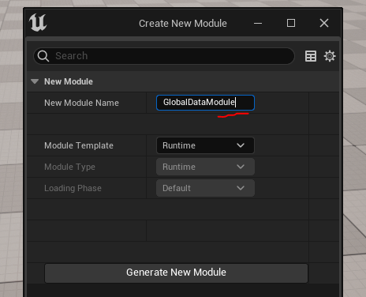
Создаем класс подсистемы `Tools -> New C++ Class -> All Classes` ищем в списке `GameInstanceSubsystem`.
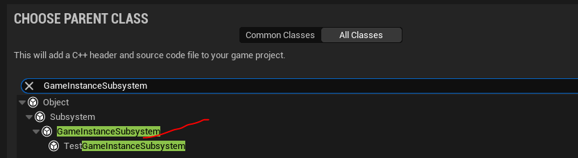
Я назвал подсистему `GlobalDataSubsystem`.
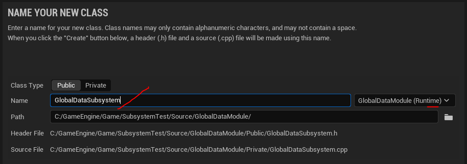
Выполняем команду `Tools -> Refresh Visual Studio 2022 Project` чтобы обновить проект в `Solution Explorer`.
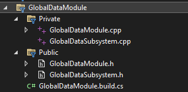
В зависимости нашего модуля надо добавить `GameplayTags`. Открываем файл `GlobalDataModule.build.cs` и меняем его так:
```cpp
using UnrealBuildTool;
public class GlobalDataModule : ModuleRules
{
	public GlobalDataModule(ReadOnlyTargetRules Target) : base(Target)
	{
        PCHUsage = PCHUsageMode.UseExplicitOrSharedPCHs;
		PublicDependencyModuleNames.AddRange(new string[] { "Core", "CoreUObject", "Engine"});
        PrivateDependencyModuleNames.AddRange(new string[] { "GameplayTags" });
        PublicIncludePaths.AddRange(new string[] {"GlobalDataModule/Public"});
		PrivateIncludePaths.AddRange(new string[] {"GlobalDataModule/Private"});
	}
}
```
## Пишем код
Нам надо два метода, которые будут принимать `GameplayTag`. Первый метод для передачи данных в подсистему, второй метод - для получения данных. Оба метода должны иметь `wildcard` пин. Пины этого типа способны принимать любые данные.
Подсистема будет хранить данные внутри контейнера `Map`.
### Файл `GlobalDataSubsystem.h`
```cpp
#pragma once
#include "CoreMinimal.h"
// kismet
#include "Kismet/KismetSystemLibrary.h"
#include "Kismet/BlueprintMapLibrary.h"
// ACharacter class refrence
#include "GameFramework/Character.h"
// root class
#include "Subsystems/WorldSubsystem.h"
// Gameplay Tags
#include "NativeGameplayTags.h"
// .generated.h
#include "GlobalDataSubsystem.generated.h"
// register GameplayTag category
UE_DECLARE_GAMEPLAY_TAG_EXTERN(TAG_DATA)
// sice TMap can't store multiple values
// i decided to put them into struct
struct FGlobalDataContainer{
	FString TypeName;
	void* Data;
	// oveload operator == because this struct used in the TMap
	bool operator==(const FGlobalDataContainer& Other) const {
		bool result = true;
		// use simple AND
		result &= TypeName == Other.TypeName;
		return result;
	}
};
/**
 * Event Bus Game Instance Subsystem
 */
UCLASS(ClassGroup = "GlobalData", meta = (Keywords = "subsystem, data")) // to simplify search of this subsystem's bp node
class GLOBALDATAMODULE_API UGlobalDataSubsystem : public UGameInstanceSubsystem
{
	GENERATED_BODY()
public:
	// Wildcard as function input
	UFUNCTION(BlueprintCallable, CustomThunk, Category = "Data", meta = (CustomStructureParam = "Data", DataTag="Data"))
	void AddData(UPARAM(meta = (Categories = "Data")) FGameplayTag DataTag, const int32& Data);
	DECLARE_FUNCTION(execAddData);
	// Wildcard with ref pin
	UFUNCTION(BlueprintCallable, CustomThunk, Category = "Data", meta = (CustomStructureParam = "DataResultRef", AutoCreateRefTerm = "DataResultRef"))
	bool GetData(UPARAM(meta = (Categories = "Data")) FGameplayTag DataTag, const int32& DataResultRef);
	DECLARE_FUNCTION(execGetData);
private:
	TMap<FGameplayTag, FGlobalDataContainer> DataContainer; // main data container
};
```
### Файл `GlobalDataSubsystem.cpp`
```cpp
#include "GlobalDataSubsystem.h"
UE_DEFINE_GAMEPLAY_TAG(TAG_DATA, "Data");
// function with wildcad pin that passed by "ref"
DEFINE_FUNCTION(UGlobalDataSubsystem::execAddData)
{
	// properties section begin:
	// Property order Matters!
	P_GET_STRUCT(FGameplayTag, TagDefinition); // tag property
	Stack.MostRecentProperty = nullptr;
	Stack.MostRecentPropertyAddress = nullptr;
	Stack.StepCompiledIn<FProperty>(NULL); // move property pointer stack forward to 1, this is outbut pin, there is no value
	void* ValueAddr = Stack.MostRecentPropertyAddress;
	const FProperty* DataProp = CastField<FProperty>(Stack.MostRecentProperty);
	P_FINISH; // properties section end
		UGlobalDataSubsystem* CastedContext = Cast<UGlobalDataSubsystem>(Context);
		// we already have this property field in the map
		if ( CastedContext->DataContainer.Contains(TagDefinition) ){
			CastedContext->DataContainer.Remove(TagDefinition); // remove old property
		}
		// save data and data type in the according map
		CastedContext->DataContainer.Add(TagDefinition, FGlobalDataContainer{ DataProp->GetCPPType(), ValueAddr});
	P_NATIVE_BEGIN;
	P_NATIVE_END;
}
// function with wildcad pin that passed by "ref"
DEFINE_FUNCTION(UGlobalDataSubsystem::execGetData)
{
	// properties section begin:
	// Property order Matters!
	P_GET_STRUCT(FGameplayTag, TagDefinition); // tag property
	// get return value wildcard pin
	// clear stack property values if any
	Stack.MostRecentProperty = nullptr;
	Stack.MostRecentPropertyAddress = nullptr;
	Stack.StepCompiledIn<FProperty>(NULL); // move property pointer stack forward to 1, this is outbut pin, there is no value
	void* ResultValueAddr = Stack.MostRecentPropertyAddress;
	const FProperty* ResultProp = CastField<FProperty>(Stack.MostRecentProperty);
	P_FINISH; // properties section end
	bool Result = false;
	P_NATIVE_BEGIN;
		UGlobalDataSubsystem* CastedContext = Cast<UGlobalDataSubsystem>(Context);
		if (CastedContext->DataContainer.Contains(TagDefinition))
		{
			FGlobalDataContainer* Data = CastedContext->DataContainer.Find(TagDefinition);
			if (ResultProp->GetCPPType() == Data->TypeName) { // send data only if types are same
				Result = true;
				// in case if we plugged same data variable - don't overwrite it
				if (Data->Data != ResultValueAddr) {
					ResultProp->CopyCompleteValueFromScriptVM(ResultValueAddr, Data->Data);
				}
			}
		}
	P_NATIVE_END;
	// Function Return Value
	*(bool*)RESULT_PARAM = Result;
}
```
### Файл `GlobalDataModule.build.cs`
```cpp
using UnrealBuildTool;
public class GlobalDataModule : ModuleRules
{
	public GlobalDataModule(ReadOnlyTargetRules Target) : base(Target)
	{
        PCHUsage = PCHUsageMode.UseExplicitOrSharedPCHs;
		PublicDependencyModuleNames.AddRange(new string[] { "Core", "CoreUObject", "Engine"});
        PrivateDependencyModuleNames.AddRange(new string[] { "GameplayTags" });
        PublicIncludePaths.AddRange(new string[] {"GlobalDataModule/Public"});
		PrivateIncludePaths.AddRange(new string[] {"GlobalDataModule/Private"});
	}
}
```
## Разбор кода
Чтобы понять, как код работает, советую вам прочитать статью про `UFUNCTION Wildcard`.
Там приведена масса примеров работы такого рода функций.
В подсистеме я сделал два метода.
Метод `AddData` используется для добавления данных во внутреннее хранилище.
Метод `GetData` используется для чтения данных из внутреннего хранилища. При этом значение данных считывается "по ссылке".
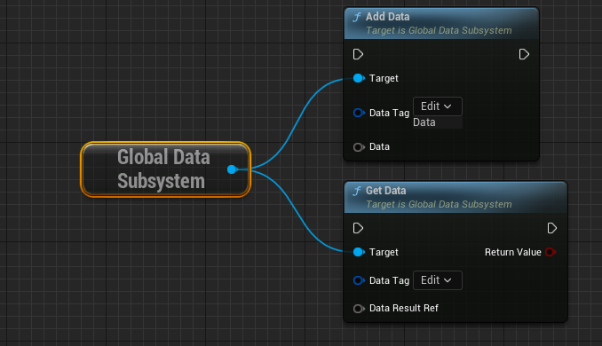
Данные хранятся внутри `TMap` с индексами типа `FGameplayTag` и `FGlobalDataContainer`.
Структура `FGlobalDataContainer` представляет из себя контейнер для сохранения информации о данных в `TMap`. Тут хранится указатель на данные, в виде поля `Data` и тип данных в этом указателе, в виде строкового поля `TypeName`.
Строка с типом нужна мне, поскольку данные хранятся в виде `void*` и я не могу сравнить пины, подведенные к полученным нодам, на соответствие.
Давайте проверим как работает наш код.
Для тестирования понадобится `blueprint` структура. У меня она называется `FBlueprintStructTest`.
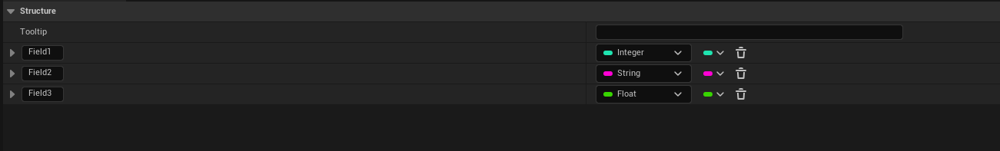
В структуру добавлено 3 поля, первое типа `int`, второе типа `string` и  третье типа `float`.
Далее, на основе этой структуры, создаем в классе `BP_ThirdPersonCharacter` переменную с тестовым набором данных. У меня она выглядит так:
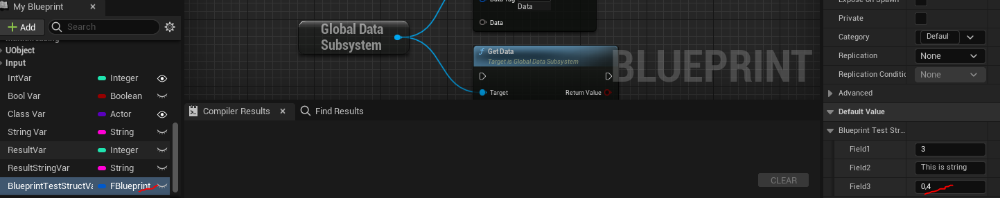
Теперь, в классе `BP_ThirdPersonCharacter` передаем нашу структуру в ноду `AddData` по нажатию клавиши `1`.
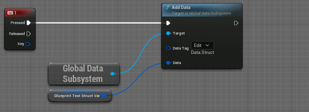
В классе `BP_TestRefrenceActor` добавим переменную-приемник, в которую будут считываться полученные данные. Я назвал ее `BpStructData`. Тип переменной-приемника должен совпадать с передаваемой переменной, то есть это `FBlueprintStructTest`.
В методе `Tick` класса `BP_TestRefrenceActor` вызываем ноду `GetData` и считываем ее значения в переменную `BpStructData`.
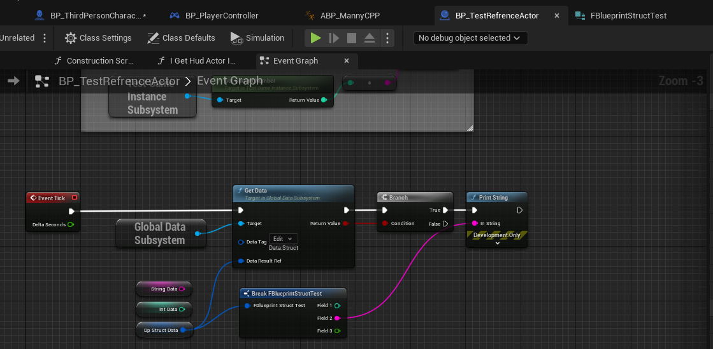
Теперь, запустив проект, мы можем видеть, что данные успешно передаются.
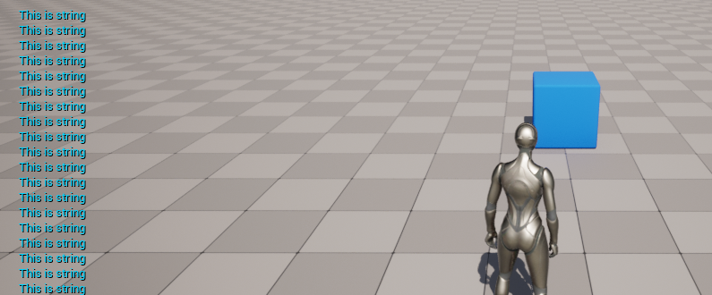
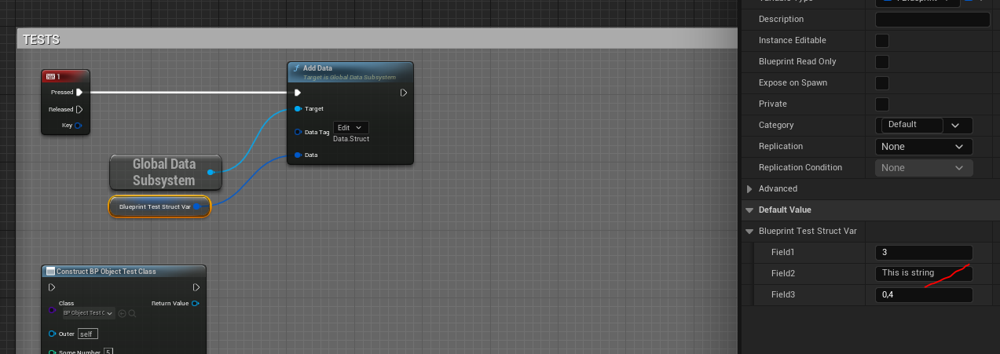
Обычными способами сохранить и тем более передать значение `blueprint` структуры через `с++` вы не сможете. Но через мою реализацию это вполне возможно. Так-же данный код работает с массивами.
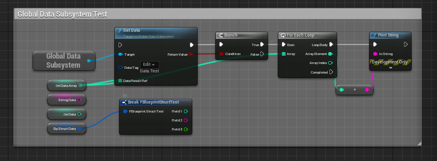
