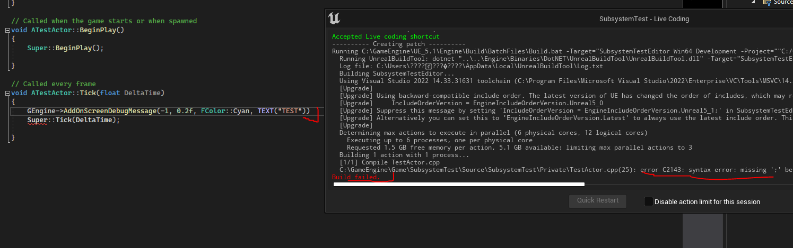
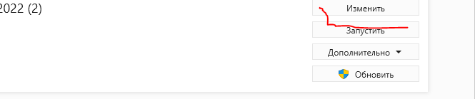
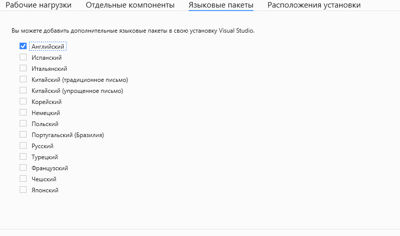

# Проблемы с кодировкой в LiveCoding
Давайте НАМЕРЕННО сделаем какую-нибудь ошибку, например удалим ";" из нашего кода и нажмем на сборку. Поскольку мы не собираем код из самого `VisualStudio`, а используем `LiveCoding`, то ошибка будет выведена именно в его консоли.

Обратите внимание на текст ошибки.
`error C2143: syntax error: missing ';' before 'AActor::Tick'`
Она у меня отображается на  английском языке, хотя изначально была совершенно не читаема из-за поломанной кодировки.
Кириллица не работает и не отображается в окне `LiveCoding`, поэтому если на этом этапе перед вами вышел текст с поломанной кодировкой, то я знаю что вам надо сделать.
Откройте `VisualStudioInstaller` и нажмите кнопку "Изменить" над студией.

Перейдите в подпункт Языковые Пакеты. Удалите Русский, добавьте Английский пакет.

Закройте студию и Unreal Engine, после чего дайте системе скачать языковые файлы.
После этого текст ошибки будет выводиться на вашей системе на английском языке без проблем с кодировкой.