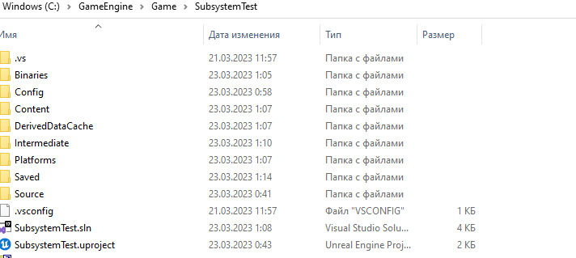
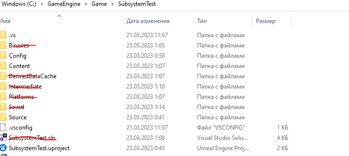

# Сброс (Reset) проекта
Иногда `Unreal Engine` ведет себя крайне странно.
У вас внезапно может отключиться `LiveCoding` или какой-либо модуль может перестать появляться в списке после открытия `Visual Studio`.
Как же чинить проект в таких случаях?
Для начала надо открыть в файловом менеджере папку вашего проекта.

После этого  необходимо удалить все папки, кроме:
```cpp
Config
Content
Source
.vs (тут у нас intellisense cache, так что удалять не надо, ато опять студия будет его собирать целую вечность)
```

> *прежде чем что-либо удалять - закройте движок, если до сих пор его не закрыли*

Так-же необходимо удалить файл с расширением sln, то есть файл Visual Studio.
Итого:

Удаляем все это, запускаем движок, компилируем проект.

После запуска движка, из меню `Tools` создаем новый `Visual Studio` проект и открываем его. 

Теперь `LiveCoding` должен будет заработать, а модули, прежде не появляющиеся из-за проблем со сборкой - начать появляться.

Время от времени эту процедуру неизбежно придется  повторять. Таковы реалии программирования под `Unreal Engine`, с этим просто живут. Это вам не `Unity`.