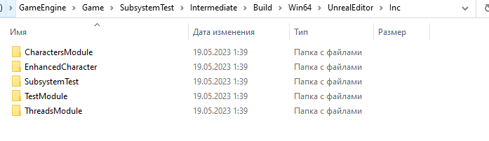

# Проблемы с файлом `.generated.h`
Иногда бывает так, что строчка `#include "***.generated.h"` подсвечивается красным.

При этом никаких проблем с компиляцией проекта не возникает.
Что делать?
Файл `.generated.h` создается в соответствующей папке модуля - `\Intermediate\Build\Win64\UnrealEditor\Inc\[MODULE_NAME]\UHT`.

Открываем, видим, что файл там. Но красное подчеркивание в VS не пропадает все равно. Это значит, что `VisualStudio` не подгружает файлы из данной папки.
Исправляем.
Идем в VS, `Project -> ProjectName.Properties`.

Далее `Configuration -> All Configurations`.

Секция `Nmake` строка `IncludeSearchPaths`.

Щелкаем на выпадающий список -> `Edit`.

Откроется окно редактирования путей. Щелкаем там иконку `NewLine`.

Далее открываем папку `\Intermediate\Build\Win64\UnrealEditor\Inc`, тут мы видим список модулей, для которых `UHT` будет генерировать свои заголовки.

Путь до каждого из этих модулей надо добавить в список `Include Search Path` в формате такого макроса:
```cpp
$(ProjectDir)..\Build\Win64\UnrealEditor\Inc\[ModuleName]\UHT\
```
В моем случае надо добавить такие строки:
```cpp
$(ProjectDir)..\Build\Win64\UnrealEditor\Inc\TestModule\UHT\
$(ProjectDir)..\Build\Win64\UnrealEditor\Inc\SubsystemTest\UHT\
$(ProjectDir)..\Build\Win64\UnrealEditor\Inc\ThreadsModule\UHT\
$(ProjectDir)..\Build\Win64\UnrealEditor\Inc\EnhancedCharacter\UHT\
$(ProjectDir)..\Build\Win64\UnrealEditor\Inc\CharactersModule\UHT\
```

Жмем `OK`, жмем `Применить`, закрываем.

Ошибка пропадает:

Да, это неудобно, тем более делать так для каждого модуля. Но что поделать. Система сборки Unreal Engine плохо совместима с Visual Studio. А проект часто багует. Так что красное подчеркивание над `.generated.h` можно или терпеть или править вручную приведенным выше способом.