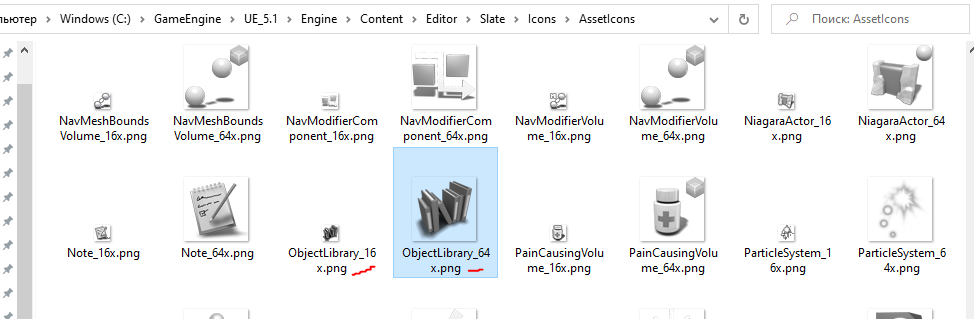
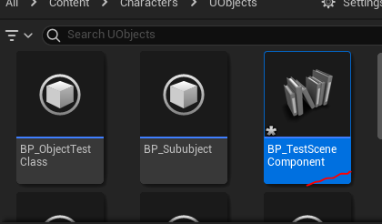

## Замена иконки у ассета
У любого `UObject'а`, в том числе и у компонента, можно заменить иконку класса.
Рассмотрим процесс на примере `TestSceneComponent`.

Поменяем его иконку на что-нибудь сносное.
### Добавляем зависимости
Для отрисовки иконок нам понадобится создать `StyleSet`. За функционал этого типа логики отвечает графический фреймворк `Slate`. Необходимо подключить его файле сборки `.build.cs` нашего модуля.
Открываем файл `TestModule.build.cs` и добавляем в `PublicDependencyModuleNames` строчки `Slate` и `SlateCore`.
```cpp
using System.IO;
using UnrealBuildTool;
public class TestModule : ModuleRules
{
	public TestModule(ReadOnlyTargetRules Target) : base(Target)
	{
        PCHUsage = PCHUsageMode.UseExplicitOrSharedPCHs;
		PublicDependencyModuleNames.AddRange(new string[] {
			"Core",
			"CoreUObject",
			"Engine",
			"Slate",
			"SlateCore"
		});
		PublicIncludePaths.AddRange(new string[] {"TestModule/Public", "TestModule/Public/Enums" });
		PrivateIncludePaths.AddRange(new string[] {
            Path.Combine(ModuleDirectory, "Private")
        });
	}
}
```
### Регистрируем стиль
Для регистрации нового стиля оформления, с иконкой, нам понадобится конструктор модуля. В нашем случае он находится в файлах `TestModule.h` и `TestModule.cpp`.
Добавляем в файл `TestModule.h` переменную будущего стиля `TSharedPtr<FSlateStyleSet> UiStyle;`.
```cpp
#pragma once
#include "Modules/ModuleManager.h"
// Slate
#include "Slate/SlateGameResources.h"
#include "Styling/ISlateStyle.h"
#include "Styling/SlateStyle.h"
#include "Styling/SlateStyleMacros.h"
#include "Styling/SlateStyleRegistry.h" // to register our styles in
DECLARE_LOG_CATEGORY_EXTERN(TestModule, All, All);
class FTestModule : public IModuleInterface
{
public:
	// Here will be our current module Style
	TSharedPtr<FSlateStyleSet> ModuleStyle = nullptr;
	/* Called when the module is loaded */
	virtual void StartupModule() override;
	/* Called when the module is unloaded */
	virtual void ShutdownModule() override;
private:
	TSharedPtr<FSlateStyleSet> UiStyle;
};
```
Регистрируем стиль с новой иконкой в файле `TestModule.cpp`.
```cpp
#include "TestModule.h"
DEFINE_LOG_CATEGORY(TestModule);
void FTestModule::StartupModule()
{
	UE_LOG(TestModule, Warning, TEXT("TestModule module has been loaded"));
	// register custom widget style class
	if (!UiStyle.IsValid()) {
		//UiStyle = MakeShared<FSlateStyleSet>();
		UiStyle = TSharedPtr<FSlateStyleSet>(new FSlateStyleSet(FName("TestSceneComponentStyleSet")));
		UiStyle->SetContentRoot(FPaths::EngineContentDir() / TEXT("/Editor/Slate/Icons/AssetIcons"));
		// Common sizes for icons and thumbnails
		const FVector2D Icon64x64(64.f, 64.f);
		const FVector2D Icon16x16(16.0f, 16.0f);
		// Set the Images of the properties to be equal of our new images, finding the property names can be a bit tricky however.
		UiStyle->Set("ClassThumbnail.TestSceneComponent", new FSlateImageBrush(
			UiStyle->RootToContentDir(TEXT("ObjectLibrary_64x"), TEXT(".png")),
			Icon64x64
		));
		UiStyle->Set("ClassIcon.TestSceneComponent", new FSlateImageBrush(
			UiStyle->RootToContentDir(TEXT("ObjectLibrary_16x"), TEXT(".png")),
			Icon16x16
		));
		// register our styles
		FSlateStyleRegistry::RegisterSlateStyle(*UiStyle.Get());
	}
}
void FTestModule::ShutdownModule()
{
	// unregister widget style and free memory
	if (!UiStyle.IsValid()) {
		FSlateStyleRegistry::UnRegisterSlateStyle(*UiStyle.Get());
		UiStyle.Reset();
	}
	UE_LOG(TestModule, Warning, TEXT("TestModule module has been unloaded"));
}
IMPLEMENT_MODULE(FTestModule, TestModule)
```
Основные иконки `Unreal Engine` поставляются вместе с движком. Найти их можно в папке установки движка, по пути `Engine\Content\Editor\Slate\Icons\`. Иконки ассетов и `blueprint` классов находятся в подпапке `AssetIcons`.
Для нашего компонента я решил использовать иконки `ObjectLibrary_16x` и `ObjectLibrary_64x`.

Для начала я задал каталог, в котором будут искаться файлы иконок.
```cpp
UiStyle->SetContentRoot(FPaths::EngineContentDir() / TEXT("/Editor/Slate/Icons/AssetIcons"));
```
Затем установил иконки для класса `TestSceneComponent`.
```cpp
// Set the Images of the properties to be equal of our new images, finding the property names can be a bit tricky however.
UiStyle->Set("ClassThumbnail.TestSceneComponent", new FSlateVectorImageBrush(
    UiStyle->RootToContentDir(TEXT("ObjectLibrary_64x"), TEXT(".png")),
    Icon64x64
));
UiStyle->Set("ClassIcon.TestSceneComponent", new FSlateVectorImageBrush(
    UiStyle->RootToContentDir(TEXT("ObjectLibrary_16x"), TEXT(".png")),
    Icon16x16
));
```
Формат задания стилей `UI`: `ТипСтиля.КлассСтиля`.
Таким образом строка `ClassThumbnail.TestSceneComponent` задает миниатюру класса для `TestSceneComponent`. А строка `ClassIcon.TestSceneComponent` задает иконку класса `TestSceneComponent`.
После компиляции - перезапустите движок.
Добавим `TestSceneComponent` к тестовому `Actor blueprint`. Как вы видите - иконка компонента поменялась.


Если создать `blueprint` класс, унаследованный от `TestSceneComponent`, то вы увидите, что иконка ассета тоже поменялась.


