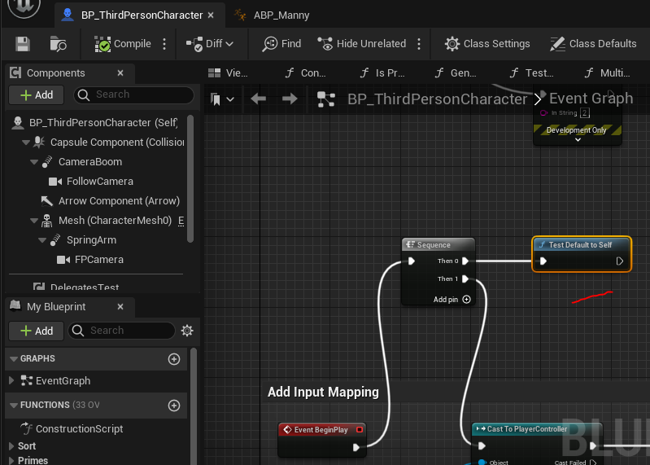
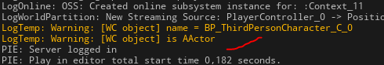

## `WorldContext` Default To Self
Из функции можно получить скрытую ссылку на вызывающий ее `blueprint` объект, используя авто подстановку.
Для этого есть весьма любопытный прием с использованием т.н. `world context object`.
Рассмотрим код:
```cpp
// in UBlueprintFunctionLibrary
UFUNCTION(BlueprintCallable,
    meta = (HidePin = "WorldContextObject", DefaultToSelf = "WorldContextObject")
)
static void TestDefaultToSelf(UObject* WorldContextObject) {
    UE_LOG(LogTemp, Warning, TEXT("[WC object] name = %s"), *(WorldContextObject->GetName()))
    AActor* Actor = Cast<AActor>(WorldContextObject);
    if (Actor != nullptr) {
        UE_LOG(LogTemp, Warning, TEXT("[WC object] is AActor"))
    }
}
```
Обычно `WorldContextObject` это ссылка на уровень. И это было бы так, если б я использовал `meta = (WorldContext = "WorldContextObject")`.
Но в этом примере вместо уровня я использую модификатор `DefaultToSelf` чтобы присвоить ссылку на объект, в котором вызвана функция `TestDefaultToSelf` к пину `WorldContextObject`.

Если вызвать полученную функцию внутри `BP_ThirdPersonCharacter`, то можно будет в логе видеть, что узел успешно получил класс персонажа в пин `WorldContextObject`.
