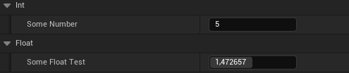

# Переменные разных типов
Поскольку меня иногда подводит память, в этой статье я буду собирать переменные разных типов, чтобы потом просто отсюда их копировать.
## Базовые типы
```cpp
// Int
UPROPERTY(BlueprintReadWrite, EditAnywhere, Category="VariableExperiments|Int", meta = (ExposeOnSpawn = "true"))
int SomeNumber = 5;
// Float
UPROPERTY(BlueprintReadWrite, EditAnywhere, Category = "VariableExperiments|Float", meta = (ClampMin = "0.5", ClampMax = "2.4"))
float someFloatTest = 0.7f;
```

## `FName`, `FText`, `FString`
```cpp
// String
UPROPERTY(BlueprintReadWrite, EditAnywhere, Category = "VariableExperiments|Text")
FString SomeStringTest = "Test";
// Name
UPROPERTY(BlueprintReadWrite, EditAnywhere, Category = "VariableExperiments|Text")
FName SomeNameTest = "Test";
// Text
UPROPERTY(BlueprintReadWrite, EditAnywhere, Category = "VariableExperiments|Text")
FText SomeTest = NSLOCTEXT("ObjectTestClass","SomeStringTest", "This is Text!");
```

## Указатель на `AActor`
```cpp
// AActor class refrence
#include "GameFramework/Actor.h"
// Actor refrence
UPROPERTY(BlueprintReadWrite, EditAnywhere, Category = "VariableExperiments", meta = (ExposeOnSpawn = "true"))
TObjectPtr<AActor> SomeActorRefrence = nullptr;
```

## Указатель на Клаcc
```cpp
// AActor class refrence
#include "GameFramework/Actor.h"
// Actor class refrence
UPROPERTY(BlueprintReadWrite, EditAnywhere, Category = "VariableExperiments", meta = (ExposeOnSpawn = "true"))
TSubclassOf<AActor> SomeActorClass;
```

## Указатель на текстуру
```cpp
//.h
// Texture2D asset refrence
UPROPERTY(BlueprintReadWrite, EditAnywhere, Category = "VariableExperiments", meta = (ExposeOnSpawn = "true"))
TObjectPtr<UTexture2D> SomeTexture2D;
//Texture asset refrence
UPROPERTY(BlueprintReadWrite, EditAnywhere, Category = "VariableExperiments", meta = (ExposeOnSpawn = "true"))
UTexture* SomeTexture;
//...
//.cpp
// default value set in constructor
// UTexture Default value
if (SomeTexture == nullptr) {
    // setting texture using LoadObject
    FString Path = TEXT("/Script/Engine.Texture2D'/Game/Characters/Mannequins/Textures/Shared/T_UE_Logo_M.T_UE_Logo_M'");
    SomeTexture = LoadObject<UTexture>(NULL, *Path, NULL, LOAD_None, NULL);
}
```

## Указатель на `Data Asset`
```cpp
//.h
// kismet
#include <Kismet/KismetSystemLibrary.h>
//Data asset refrence
UPROPERTY(BlueprintReadWrite, EditAnywhere, Category = "VariableExperiments")
TSoftObjectPtr<UDataAsset> DataAssetRefrence;
//...
//.cpp
// Data Asset Default Value
if (DataAssetRefrence == nullptr) {
    const FString Path = TEXT("/Script/DataAccess.CharacterData'/Game/Characters/Data/DA_Character.DA_Character'");
    DataAssetRefrence = UKismetSystemLibrary::MakeSoftObjectPath(Path);
}
```

## Указатель на `Primary Data Asset Type`
```cpp
// Primary Data Asset Type test
UPROPERTY(BlueprintReadOnly, EditAnywhere, Category = "VariableExperiments")
FPrimaryAssetType Type;
```

## `BitFlags` Enum
```cpp
// Item Types Enum
// This enum size limited by 8 maximum items since it's bitmask enum from uint8
UENUM(BlueprintType, meta = (Bitflags, UseEnumValuesAsMaskValuesInEditor = "true"))
enum class EItemTypes : uint8
{
	NONE = 0 UMETA(Hidden),
	Default = 1 << 0,
	Helmet = 1 << 1,
	Gloves = 1 << 2,
	Sword = 1 << 3,
	Boots = 1 << 4,
};
ENUM_CLASS_FLAGS(EItemTypes);
// This is way of making unlimited enums thru namespaces
UENUM(BlueprintType, Meta = (Bitflags, UseEnumValuesAsMaskValuesInEditor = "true"))
namespace EUnlimitedEnum
{
	enum Type
	{
		NONE			= 0 UMETA(Hidden),
		UNL_First		= 1 << 0 UMETA(DisplayName = "First"),
		UNL_Second		= 1 << 1,
		UNL_Third		= 1 << 2,
		UNL_Quartis		= 1 << 3,
		UNL_Quintis		= 1 << 4,
		UNL_Sextus		= 1 << 5,
		UNL_Septemus	= 1 << 6,
		UNL_Octus		= 1 << 7,
		UNL_Novus		= 1 << 8, // i'm pretty bad at Roman number names...
		UNL_Decemus		= 1 << 9,
		UNL_Undecimus	= 1 << 10,
	};
}
ENUM_CLASS_FLAGS(EUnlimitedEnum::Type);
// Bit Flags variable
UPROPERTY(BlueprintReadWrite, EditAnywhere, Category = "BitFlags", meta = (Bitmask, BitmaskEnum = "/Script/TestModule.EItemTypes"))
int32 ItemTypeFlags = StaticCast<int32>(EItemTypes::Helmet | EItemTypes::Gloves);
// Unlimited Bit Flags
UPROPERTY(BlueprintReadWrite, EditAnywhere, Category = "BitFlags", Meta = (Bitmask, BitmaskEnum = "/Script/TestModule.EUnlimitedEnum"))
int32 UnlimitedEnumFlags = StaticCast<int32>(EUnlimitedEnum::Type::UNL_First | EUnlimitedEnum::Type::UNL_Second);
```

## Enum
```cpp
// Item Types Enum
// This enum size limited by 8 maximum items since it's bitmask enum from uint8
UENUM(BlueprintType, meta = (Bitflags, UseEnumValuesAsMaskValuesInEditor = "true"))
enum class EItemTypes : uint8
{
	NONE = 0 UMETA(Hidden),
	Default = 1 << 0,
	Helmet = 1 << 1,
	Gloves = 1 << 2,
	Sword = 1 << 3,
	Boots = 1 << 4,
};
ENUM_CLASS_FLAGS(EItemTypes);
UPROPERTY(BlueprintReadWrite, EditAnywhere, Category = "EditConditions|Enum")
EItemTypes ItemType = EItemTypes::Boots;
```

## Array
```cpp
//.h
USTRUCT(BlueprintType)
struct FObjectTestStruct
{
	GENERATED_USTRUCT_BODY()
	FObjectTestStruct(int Value = 0, FString Text = "Text") {
		SomeVal = Value;
		SomeTest = Text;
	}
	UPROPERTY(BlueprintReadWrite, EditAnywhere)
	int SomeVal;
	UPROPERTY(BlueprintReadWrite, EditAnywhere)
	FString SomeTest;
};
// Arrays
UPROPERTY(BlueprintReadWrite, EditAnywhere, Category = "Arrays")
TArray< FObjectTestStruct > StructArray;
UPROPERTY(BlueprintReadWrite, EditAnywhere, Category = "Arrays")
TArray<int32> TestIntArray;
//...
//.cpp
// Array default values set in the constructor
// Fill Int Array
if (TestIntArray.IsEmpty()) {
    TestIntArray.Add(5);
    TestIntArray.Add(2);
}
// Fill Struct Array
if (StructArray.IsEmpty()) {
    StructArray.Add(FObjectTestStruct(10,"Test1"));
    StructArray.Add(FObjectTestStruct(11,"Test2"));
}
```

## Map
```cpp
//.h
// Map
UPROPERTY(BlueprintReadWrite, EditAnywhere, Category = "Map")
TMap<FString, float> TestMap;
//...
//.cpp
// Map filled in constructor
// Fill Map
if(TestMap.IsEmpty()){
    TestMap.Add("Test", 0.4);
    TestMap.Add("SomeTest", 0.1);
}
```

## Level
```cpp
//.h
// Level Refrence
UPROPERTY(EditAnywhere, Category = Levels)
TSoftObjectPtr<UWorld> LevelToLoad;
//...
//.cpp
// Level value set in constructor
// Default Level Value
if (LevelToLoad == nullptr) {
    const FString Path = TEXT("/Script/Engine.World'/Game/Maps/Level2.Level2'");
    LevelToLoad = UKismetSystemLibrary::MakeSoftObjectPath(Path);
}
```

## Input
### `.build.cs`
```cpp
PrivateDependencyModuleNames.AddRange(new string[] {
    "InputCore"
    , "EnhancedInput"
});
```

### Code
```cpp
//.h
// Input
#include "InputAction.h" // enhanced input
#include "InputMappingContext.h"
#include "EnhancedInputLibrary.h"
#include "EnhancedActionKeyMapping.h"
#include "PlayerMappableInputConfig.h"
#include "InputTriggers.h"
//...
// Input Action Mapping classic
UPROPERTY(EditDefaultsOnly, Category = "Input")
FInputActionKeyMapping InputKeyMapping = { TEXT("Test Action"), FKey{EKeys::F} };
// Enhanced Key Mapping
UPROPERTY(EditDefaultsOnly, Category = "Input")
FEnhancedActionKeyMapping EnhancedMapping;
// Default Key
UPROPERTY(EditDefaultsOnly, Category = "Input")
FKey KeyMapping = EKeys::F1;
// Input Action as parameter in Data Asset
UPROPERTY(EditDefaultsOnly, Category = "Input")
TSoftObjectPtr<UInputAction> InputAction = nullptr;
// Input Context as parameter in Data Asset
UPROPERTY(EditDefaultsOnly, Category = "Input")
TSoftObjectPtr<UInputMappingContext> InputContext = nullptr;
//...
//.cpp
//in contructor
// Input Action loading
if (InputAction == nullptr) {
    const FString Path = TEXT("/Script/EnhancedInput.InputAction'/Game/ThirdPerson/Input/Actions/IA_Jump.IA_Jump'");
    InputAction = UKismetSystemLibrary::MakeSoftObjectPath(Path);
}
// Input Context loadng
if (InputContext == nullptr) {
    const FString Path = TEXT("/Script/EnhancedInput.InputMappingContext'/Game/ThirdPerson/Input/IMC_Default.IMC_Default'");
    InputContext = UKismetSystemLibrary::MakeSoftObjectPath(Path);
}
if (EnhancedMapping.Action == nullptr) {
    EnhancedMapping.Action = InputAction.Get();
    EnhancedMapping.Key = EKeys::Two;
}
```

## Gameplay Tags
### `.build.cs`
```cpp
// first put this into your module's .build.cs file
PrivateDependencyModuleNames.AddRange(new string[] { "GameplayTags" });
```

### Code
```cpp
//.h
// use "GameplayTags" in PublicDependencyModuleNames
// Gameplay tag locked category
UPROPERTY(EditAnywhere, Category = "GameplayTags", meta = (Categories = "Locomotion.Grounded"))
FGameplayTag GroundedLocomotionMode;
// Gameplay tag
UPROPERTY(EditAnywhere, Category = "GameplayTags")
FGameplayTag TagTest;
//...
//.cpp
// Assign tag default values in constructor
GroundedLocomotionMode = FGameplayTag::RequestGameplayTag(FName("Locomotion.Grounded.Walk"));
TagTest = FGameplayTag::RequestGameplayTag(FName("Locomotion.Grounded.Jog"));
```

## AnimInstance
```cpp
// AnimInstance Class Refrence
UPROPERTY(BlueprintReadWrite, EditAnywhere, Category = "DifferentPointers")
TSubclassOf<UAnimInstance> AnimClass = UAnimInstance::StaticClass();
```

## Physics Asset
```cpp
//.h
#include "GameFramework/Character.h"
// Physics Asset Refrence
UPROPERTY(BlueprintReadWrite, EditAnywhere, Category = "DifferentPointers")
TSoftObjectPtr<UPhysicsAsset> PhysicsAsset = nullptr;
//...
//.cpp
// physics asset default value
if (PhysicsAsset == nullptr) {
    const FString Path = TEXT("/Script/Engine.PhysicsAsset'/Game/Characters/Mannequins/Rigs/PA_Mannequin.PA_Mannequin'");
    PhysicsAsset = UKismetSystemLibrary::MakeSoftObjectPath(Path);
}
```

## `TSoftObjectPtr` Actor on Level
```cpp
//.h
#include "GameFramework/Actor.h"
UPROPERTY(BlueprintReadWrite, EditAnywhere, Category = "DifferentPointers")
TSoftObjectPtr<AActor> SomeSoftActorRef = nullptr;
//...
//.cpp
// soft actor ref set in constructor
if (SomeSoftActorRef == nullptr) {
    FString StringObjectOnLevelPath = TEXT("/Game/Maps/Level1.Level1:PersistentLevel.BP_TestRefrenceActor_C_1");
    SomeSoftActorRef = UKismetSystemLibrary::MakeSoftObjectPath(StringObjectOnLevelPath);
}
```

## `TSoftObjectPtr` Component
```cpp
//.h
#include "GameFramework/Actor.h"
UPROPERTY(BlueprintReadWrite, EditAnywhere, Category = "DifferentPointers")
TSoftObjectPtr<AActor> SomeSoftActorRef = nullptr;
UPROPERTY(BlueprintReadWrite, EditAnywhere, Category = "DifferentPointers")
TSoftClassPtr<UActorComponent> SomeSoftComponentClass = UCameraComponent::StaticClass();
```


## `TWeakObjectPtr`
```cpp
// Actor Weak Refrence
UPROPERTY(EditAnywhere, BlueprintReadWrite, Category = "DifferentPointers")
TWeakObjectPtr<AActor> ActorWeakRefrence;
```

## `UStaticMesh` Asset
```cpp
//.h
#include "Components/StaticMeshComponent.h"
// Static mesh ref
UPROPERTY(BlueprintReadWrite, EditAnywhere, Category = "PointerLoadingTest")
TSoftObjectPtr<UStaticMesh> LoadedStaticMesh = nullptr;
//...
//.cpp
// Soft static mesh default valuse set in constructor
if (LoadedStaticMesh == nullptr) {
    FString StringAssetPath = TEXT("/Script/Engine.StaticMesh'/Game/LevelPrototyping/Meshes/SM_ChamferCube.SM_ChamferCube'");
    LoadedStaticMesh = UKismetSystemLibrary::MakeSoftObjectPath(StringAssetPath);
}
```

## `USkeletalMesh` Asset
```cpp
//.h
#include "Components/SkeletalMeshComponent.h"
// Skeletal Mesh Refrence
UPROPERTY(BlueprintReadWrite, EditAnywhere, Category = "DifferentPointers")
TObjectPtr<USkeletalMesh> SkeletalMesh = nullptr;
//...
//.cpp
// Loading Skeletal Mesh in constructor
if (SkeletalMesh == nullptr) {
    const FString Path = TEXT("/Script/Engine.SkeletalMesh'/Game/Characters/Mannequins/Meshes/SKM_Quinn_Simple.SKM_Quinn_Simple'");
    SkeletalMesh = UKismetSystemLibrary::MakeSoftObjectPath(Path);
}
```


## `UMaterialInstance` Asset
```cpp
//.h
// Material Instance Refrence
UPROPERTY(BlueprintReadWrite, EditAnywhere, Category = "DifferentPointers")
TSoftObjectPtr<UMaterialInstance> MaterialInstanceRefrence;
//.cpp
// Loading Material Asset in constructor
if (MaterialInstanceRefrence == nullptr) {
    const FString Path = TEXT("/Script/Engine.MaterialInstanceConstant'/Game/Characters/UI/UiMaterial_Inst.UiMaterial_Inst'");
    MaterialInstanceRefrence = UKismetSystemLibrary::MakeSoftObjectPath(Path);
}
```


