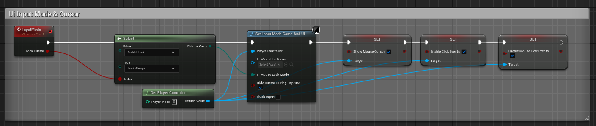

# Изменение GameInputMode



Делается так:
```cpp
#include "Kismet/GameplayStatics.h"
///
// Simple:
APlayerController* Controller = UGameplayStatics::GetPlayerController(this, 0);
bool bLock = true;
// update input mode
FInputModeGameAndUI Mode;
Mode.SetHideCursorDuringCapture(true);
if (bLock) {
    Mode.SetLockMouseToViewportBehavior(EMouseLockMode::LockAlways);
}
else {
    Mode.SetLockMouseToViewportBehavior(EMouseLockMode::DoNotLock);
}
Controller->SetInputMode(MoveTemp(Mode));
Controller->SetShowMouseCursor(true);
Controller->bEnableClickEvents = 1;
Controller->bEnableMouseOverEvents = 1;
```