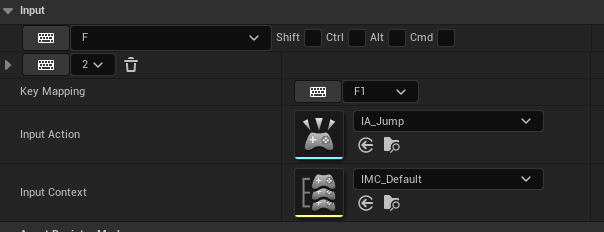
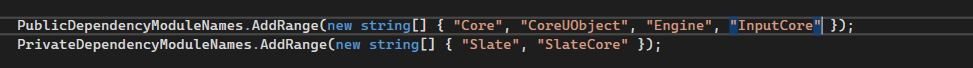
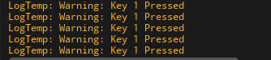
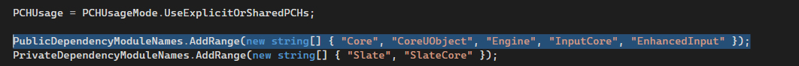
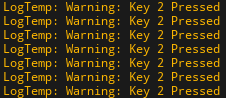

# События ввода
## Input key `UPROPERTY`
Как вывести в интерфейсе кнопку, для указания клавиши?
Для начала подключаем зависимости в `.build.cs`:
```cpp
PrivateDependencyModuleNames.AddRange(new string[] {
    "InputCore"
    , "EnhancedInput"
});
```
Параметры для привязки клавиш ввода создаются так:
```cpp
//.h
// Input
#include "InputAction.h" // enhanced input
#include "InputMappingContext.h"
#include "EnhancedInputLibrary.h"
#include "EnhancedActionKeyMapping.h"
#include "PlayerMappableInputConfig.h"
#include "InputTriggers.h"
//...
// Input Action Mapping classic
UPROPERTY(EditDefaultsOnly, Category = "Input")
FInputActionKeyMapping InputKeyMapping = {TEXT("Test Action"), FKey{EKeys::F} };
// Enhanced Key Mapping
UPROPERTY(EditDefaultsOnly, Category = "Input")
FEnhancedActionKeyMapping EnhancedMapping;
// Default Key
UPROPERTY(EditDefaultsOnly, Category = "Input")
FKey KeyMapping = EKeys::F1;
// Input Action as parameter in Data Asset
UPROPERTY(EditDefaultsOnly, Category = "Input")
TSoftObjectPtr<UInputAction> InputAction = nullptr;
// Input Context as parameter in Data Asset
UPROPERTY(EditDefaultsOnly, Category = "Input")
TSoftObjectPtr<UInputMappingContext> InputContext = nullptr;
//...
//.cpp
//in contructor
// Input Action loading
if (InputAction == nullptr) {
    const FString Path = TEXT("/Script/EnhancedInput.InputAction'/Game/ThirdPerson/Input/Actions/IA_Jump.IA_Jump'");
    InputAction = UKismetSystemLibrary::MakeSoftObjectPath(Path);
}
// Input Context loadng
if (InputContext == nullptr) {
    const FString Path = TEXT("/Script/EnhancedInput.InputMappingContext'/Game/ThirdPerson/Input/IMC_Default.IMC_Default'");
    InputContext = UKismetSystemLibrary::MakeSoftObjectPath(Path);
}
if (EnhancedMapping.Action == nullptr) {
    EnhancedMapping.Action = InputAction.Get();
    EnhancedMapping.Key = EKeys::Two;
}
```

## Bind Input
Привязка событий ввода может быть реализована через объект `APlayerController::InputComponent`.
Рассмотрим классический подход по привязке нажатия клавиши к вызову функции.
Для начала надо указать модуль `InputCore` как `PublicDependency` в файле `.build.cs`:
```cpp
PublicDependencyModuleNames.AddRange(new string[] { "Core", "CoreUObject", "Engine", "InputCore"});
```

Теперь мы можем делать так:
```cpp
// Bind to key "1"
FInputKeyBinding KB1 = FInputKeyBinding(EKeys::One, EInputEvent::IE_Pressed);
KB1.KeyDelegate.GetDelegateForManualSet().BindLambda([this](){
    UE_LOG(LogTemp, Warning, TEXT("Key 1 Pressed"))
});
//KB1.KeyDelegate.BindDelegate(this, &UYourClass::OnKeyPressed); // classic way of binding to the function
InputComponent->KeyBindings.Emplace(MoveTemp(KB1));
```
Компонент `InputComponent` является частью класса `PlayerController`.
```cpp
#include "Kismet/GameplayStatics.h"
//...
APlayerController* PLController = UGameplayStatics::GetPlayerController(GetWorld(), 0);
PLController->InputComponent // refrence to input component
```

## Bind using `Enhanced Input`
Поскольку объект `UEnhancedInputComponent` наследуется от `UInputComponent`, работа предыдущего кода возможна и с применением плагина `Enhanced Input`.
Можно показать это в следующем коде, где я провел приведение типа.
Перед работой добавляем в файл `.build.cs` зависимости:
```cpp
PublicDependencyModuleNames.AddRange(new string[] { "Core", "CoreUObject", "Engine", "InputCore", "EnhancedInput" });
```

Далее код.
```cpp
// Mapping Context
#include "InputMappingContext.h"
// Enhanced Input
#include "EnhancedInputSubsystems.h"
#include "EnhancedInputComponent.h"
//...
// Bind to key "2"
//UEnhancedInputLocalPlayerSubsystem* Subsystem = ULocalPlayer::GetSubsystem<UEnhancedInputLocalPlayerSubsystem>(GetLocalPlayer());
UEnhancedInputComponent* EnhancedInputComponent = Cast<UEnhancedInputComponent>(InputComponent);
// Bind Actions
if (EnhancedInputComponent != nullptr) {
    FInputKeyBinding KB2 = FInputKeyBinding(EKeys::Two, EInputEvent::IE_Pressed);
    KB2.KeyDelegate.GetDelegateForManualSet().BindLambda([this]() {
        UE_LOG(LogTemp, Warning, TEXT("Key 2 Pressed"))
    });
    EnhancedInputComponent->KeyBindings.Emplace(MoveTemp(KB2));
}
```

## Is Key Bound?
Поскольку `Controller->InputComponent->KeyBindings` представляет собой массив, можно пройтись по его элементам, чтобы узнать, какой из них привязан к тому или иному нажатию клавиши.
Проверка привязки клавиши `EKeys::LeftMouseButton` выглядит так:
```cpp
#include "Kismet/GameplayStatics.h"
///
APlayerController* Controller = UGameplayStatics::GetPlayerController(this, 0);
for (FInputKeyBinding Binding : Controller->InputComponent->KeyBindings) {
    if (Binding.Chord == EKeys::LeftMouseButton) {
        ReleasedBinding = Binding;
        break;
    }
}
```
Так-же сработает:
```cpp
#include "Kismet/GameplayStatics.h"
///
APlayerController* Controller = UGameplayStatics::GetPlayerController(this, 0);
// Use of FKey
FKey Key(EKeys::LeftMouseButton);
// if this key is already bound - get it's binding
for (FInputKeyBinding Binding : Controller->InputComponent->KeyBindings) {
    if (Binding.Chord == Key) { // chord can be compared with FKey
        ReleasedBinding = Binding;
        break;
    }
}
```
Обертка в функцию:
```cpp
#include "Kismet/GameplayStatics.h"
///
// will get binding to key, if exists
bool GetBindingToKey(FKey Key, FInputKeyBinding& inBinding) {
    APlayerController* Controller = UGameplayStatics::GetPlayerController(this, 0);
    if(Controller == nullptr) return false;
    // if this key is already bound - get it's binding
    for (FInputKeyBinding Binding : Controller->InputComponent->KeyBindings) {
        if (Binding.Chord == Key) {
            inBinding = Binding;
            return true;
        }
    }
    return false;
}
//...
FInputKeyBinding Bindng;
if(GetBindingToKey(EKeys::LeftMouseButton, Binding)){
    // do things
}
```