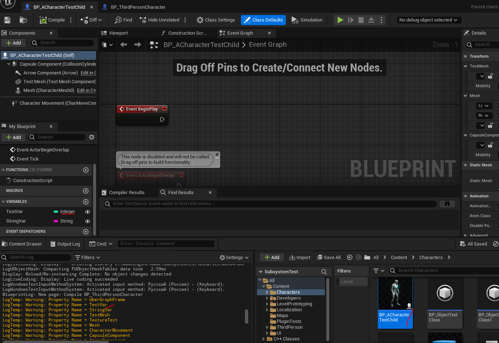

# Чтение параметров `Blueprint` класса
##`FindProperty` в `UBlueprint`
Можно ли найти в `blueprint` классе все переменные, включая те, которые были созданы пользователем? Да, вполне.
Для этого используется следующий цикл:
```cpp
UBlueprint* Obj = LoadObject<UBlueprint>(nullptr,TEXT("/Script/Engine.Blueprint'/Game/Characters/BP_ACharacterTestChild.BP_ACharacterTestChild'"));
for (TFieldIterator<FProperty> PropertyIterator(Obj->GeneratedClass); PropertyIterator; ++PropertyIterator) {
    FProperty* Property = *PropertyIterator;
    UE_LOG(LogTemp, Warning, TEXT("Property Name = %s"), *Property->GetFName().ToString())
}
```



Если надо получить какую-то конкретную переменную, есть метод:
```cpp
FProperty* IntVarProperty = Obj->GeneratedClass->FindPropertyByName(GET_MEMBER_NAME_STRING_CHECKED(Obj->GeneratedClass, TestVar) );
```
Однако он у меня не работает. Почему? Потому что появляется ошибка: `a lambda can only appear in an unevaluated context with '/std:c++20' or later`. Невозможно подставить `Obj->GeneratedClass` в макрос `GET_MEMBER_NAME_STRING_CHECKED`.
Поэтому рекомендую просто использовать тот-же цикл, с фильтром по имени.
```cpp
UBlueprint* Obj = LoadObject<UBlueprint>(nullptr,TEXT("/Script/Engine.Blueprint'/Game/Characters/BP_ACharacterTestChild.BP_ACharacterTestChild'"));
FName TargetPropertyName = "TestVar";
FProperty* Property = nullptr;
for (TFieldIterator<FProperty> PropertyIterator(Obj->GeneratedClass); PropertyIterator; ++PropertyIterator) {
    FProperty* lProperty = *PropertyIterator;
    if (PropertyIterator->GetFName() == TargetPropertyName) {
        Property = lProperty;
        break; // exit loop
    }
}
```
## Get Property Value
Считать значение параметра можно из `GetDefaultObject`. Вот как я это сделал:
```cpp
// let's read blueprint property TestVar's value
// blueprint path
UBlueprint* Obj = LoadObject<UBlueprint>(nullptr, TEXT("/Script/Engine.Blueprint'/Game/Characters/BP_ACharacterTestChild.BP_ACharacterTestChild'"));// var name
FName TargetPropertyName = "TestVar";
FProperty* Property = nullptr;
// search for property
for (TFieldIterator<FProperty> PropertyIterator(Obj->GeneratedClass); PropertyIterator; ++PropertyIterator) {
    FProperty* lProperty = *PropertyIterator;
    if (PropertyIterator->GetFName() == TargetPropertyName) {
        Property = lProperty;
        break; // exit loop
    }
}
if (Property != nullptr) {
    // we know that TestVar is int
    FIntProperty* IntProperty = CastField<FIntProperty>(Property);
    ensure(IntProperty != nullptr);
    // read value from default object of blueprint generated class
    int32 IntValue = IntProperty->GetPropertyValue(Property->ContainerPtrToValuePtr<int32>(Obj->GeneratedClass.GetDefaultObject()));
    UE_LOG(LogTemp, Error, TEXT("int val = %i"), IntValue)
}
else {
    UE_LOG(LogTemp, Error, TEXT("no property"))
}
```