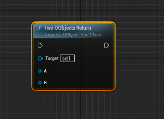

# Возвращение `UObject` по ссылке из функции
Рассмотрим ситуацию. У нас есть два параметра типа `UObject` и оба параметра нам надо вернуть из функции.
```cpp
// Function that should return two objects
UFUNCTION(BlueprintCallable, Category = "Custom Functions|UObjectReturn")
void TwoUObjectsReturn(UObject * A, UObject * B) {
    A = GetMutableDefault<UObject>();
    B = GetMutableDefault<UObject>();
};
```
Если мы попытаемся скомпилировать такой код то нас ждет разочарование.

Напомню, мы хотим ВЕРНУТЬ объекты, а не ЗАДАТЬ их.
Как быть? Можно попробовать `UPARAM(ref)`, это не поможет, но давайте рассмотрим.
```cpp
// Function that should return two objects
UFUNCTION(BlueprintCallable, Category = "Custom Functions|UObjectReturn")
void TwoUObjectsReturn(UPARAM(ref) UObject * A, UPARAM(ref) UObject * B) {
    A = GetMutableDefault<UObject>();
    B = GetMutableDefault<UObject>();
};
```

Как быть?
## Решение
Решение очень странное и узнал я его случайно. Нагуглить такое очень тяжело, потому что непонятно как составлять запрос. Я даже не смог вменяемое название для этой заметки придумать.
Чтобы вернуть два `UObject'а` надо использовать `*&` именно в таком порядке.
Код выглядит так:
```cpp
// Function that should return two objects
UFUNCTION(BlueprintCallable, Category = "Custom Functions|UObjectReturn", meta=(HideSelfPin = true))
void TwoUObjectsReturn(UObject *& A, UObject *& B) {
    A = GetMutableDefault<UObject>();
    B = GetMutableDefault<UObject>();
};
```
И выдает он именно то, что требуется.

Ограничения такого подхода состоят в следующем: вы не можете использовать несколько выходных пинов на функциях, которые являются `BlueprintPure`, если эти функции не `const`. Если вы попытаетесь вернуть несколько пинов по указателю из не `const` и `pure` функции движок просто крашнется.
