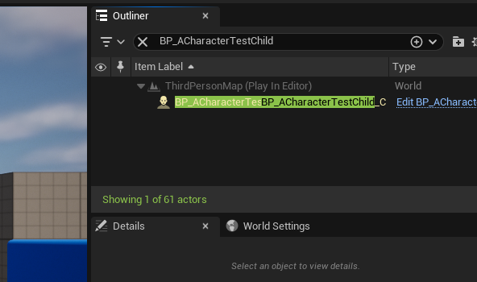
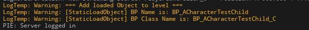

# Spawn, призыв объектов
Для спавна в основном исопльзуются следующие два способа:
## Способ 1, через шаблон
Через шаблон `World->SpawnActor<AActor>`
```cpp
// spawn found actors
UWorld* World = this->GetWorld();
if (World == nullptr) { return; }
AActor* Owner = this->GetOwner();
FActorSpawnParameters SpawnParams;
SpawnParams.Owner = Owner;
SpawnParams.Instigator = Owner->GetInstigator();
SpawnParams.bNoFail = true;
SpawnParams.SpawnCollisionHandlingOverride = ESpawnActorCollisionHandlingMethod::AdjustIfPossibleButAlwaysSpawn;
FVector CLocation = Owner->GetActorForwardVector() * 120 // on front of owner
                   + Owner->GetActorUpVector() * 20 // offset on right based on loop index to form line
                   + Owner->GetActorLocation();
World->SpawnActor<AActor>(FoundBP->GeneratedClass, CLocation, Owner->GetActorRotation(), SpawnParams);
```
## Способ 2, напрямую
Напрямую `World->SpawnActor`
Да, это отдельный метод с другим набором аргументов, как не странно. А не автоматически задаваемый шаблон.
```cpp
// spawn found actors
UWorld* World = this->GetWorld();
if (World == nullptr) { return; }
AActor* Owner = this->GetOwner();
FActorSpawnParameters SpawnParams;
SpawnParams.Owner = Owner;
SpawnParams.Instigator = Owner->GetInstigator();
SpawnParams.bNoFail = true;
SpawnParams.SpawnCollisionHandlingOverride = ESpawnActorCollisionHandlingMethod::AdjustIfPossibleButAlwaysSpawn;
FVector CLocation = Owner->GetActorForwardVector() * 120 // on front of owner
                    + Owner->GetActorUpVector() * 20 // offset on right based on loop index to form line
                    + Owner->GetActorLocation();
FTransform CTransform = { Owner->GetActorRotation() , CLocation };
World->SpawnActor(FoundBP->GeneratedClass, &CTransform, SpawnParams);
```
## Spawn Character BP by Refrence
Пример призыва экземпляра класса `ACharacter` на игровой уровень.
```cpp
FString CharacterBPPath = TEXT("/Script/Engine.Blueprint'/Game/Characters/BP_ACharacterTestChild.BP_ACharacterTestChild_C'");
TSubclassOf<ACharacter> CharacterBPClass = LoadClass<ACharacter>(NULL, *CharacterBPPath);
if (CharacterBPClass != nullptr) {
    AActor* Owner = this->GetOwner();
    FActorSpawnParameters SpawnParams;
    SpawnParams.Owner = Owner;
    SpawnParams.bNoFail = true;
    SpawnParams.Instigator = Owner->GetInstigator();
    SpawnParams.SpawnCollisionHandlingOverride = ESpawnActorCollisionHandlingMethod::AdjustIfPossibleButAlwaysSpawn;
    FVector CLocation = Owner->GetActorForwardVector()*120 + Owner->GetActorUpVector() + Owner->GetActorLocation(); // on front of owner
    World->SpawnActor<AActor>(CharacterBPClass, CLocation, Owner->GetActorRotation(), SpawnParams);
}
```
## DeferredSpawn или отложенный спавн
При отложенном спавне не происходит вызов `ConstructionScript'а` и `blueprint` кода в призываемом объекте. Призванный таким образом `AActor` остается не активным до тех пор, пока разработчик не завершит призыв, через `UGameplayStatics::FinishSpawningActor`.
Объекты, призванные отложенным способом можно увидеть в мире игры. Они не будут анимированы, но, они рендерится.
```cpp
//.h
#include <Kismet/GameplayStatics.h>
//...
//.cpp
UE_LOG(LogTemp, Warning, TEXT("=== Spawn Character Deferred ==="));
FString CharacterBPPath = TEXT("/Script/Engine.Blueprint'/Game/Characters/BP_ACharacterTestChild.BP_ACharacterTestChild_C'");
TSubclassOf<ACharacter> CharacterBPClass = LoadClass<ACharacter>(NULL, *CharacterBPPath);
if (CharacterBPClass != nullptr) {
    AActor* Owner = this->GetOwner();
    FVector CLocation = Owner->GetActorForwardVector() * 120 + Owner->GetActorUpVector() + Owner->GetActorLocation(); // on front of owner
    AActor* DeferredActor = World->SpawnActorDeferred<AActor>(CharacterBPClass,
        FTransform{ Owner->GetActorRotation(),CLocation, FVector{1.0f, 1.0f, 1.0f} },
        Owner, Owner->GetInstigator());
    // #include <Kismet/GameplayStatics.h>
    UGameplayStatics::FinishSpawningActor(DeferredActor, DeferredActor->GetTransform());
}
```
## Добавление существующего объекта AActor на уровень
Если вы создали объект типа `AActor` используя, например `NewObject` то вы знаете, что данный объект не отобразится на уровне. Как сделать так, чтобы отобразился?
Есть два подхода. Первый - перенос всех параметров в новый объект, который спавнится в игровом мире отдельно, второй метод - через `Actors.Add`. Рассмотрим оба.
### Спавн по шаблону `Template`
При таком методе спавна мы используем параметр `FActorSpawnParameters::Template`, чтобы указать, на основе какого `Actor'а` будет сформирована призванная в игровой мир копия. Все параметры, поля и данные с целевого `Actor'а` будут копированы на призванного.
Это наиболее безопасный и часто используемый метод спавна.
```cpp
UE_LOG(LogTemp, Warning, TEXT("=== Spawn Character by template ==="));
FString CharacterBPPath = TEXT("/Script/Engine.Blueprint'/Game/Characters/BP_ACharacterTestChild.BP_ACharacterTestChild_C'");
TSubclassOf<ACharacter> CharacterBPClass = LoadClass<ACharacter>(NULL, *CharacterBPPath);
if (CharacterBPClass != nullptr) {
    AActor* LActor = NewObject<AActor>(this, CharacterBPClass, TEXT("CustomActor"), RF_NoFlags, nullptr);
    AActor* Owner = this->GetOwner();
    FActorSpawnParameters SpawnParams;
    SpawnParams.Owner = Owner;
    SpawnParams.bNoFail = true;
    SpawnParams.Template = LActor; // this will copy All fields from LActor to newly spawned actor
    SpawnParams.SpawnCollisionHandlingOverride = ESpawnActorCollisionHandlingMethod::AdjustIfPossibleButAlwaysSpawn;
    FVector CLocation = Owner->GetActorForwardVector() * 120 + Owner->GetActorUpVector() + Owner->GetActorLocation(); // on front of owner
    World->SpawnActor<AActor>(LActor->GetClass(), CLocation, Owner->GetActorRotation(), SpawnParams);
}
```
### `Actors.Add`
У класса уровня есть методы:
```cpp
// спавн актора, если он инициализирован как NewObject
GetWorld()->GetLevel(LevelNum)->Actors.Add(AActor)
GetWorld()->GetCurrentLevel()->Actors.Add(AActor);
```
Можно использовать их, для размещения желаемого объекта `Actor'а` на уровне. Я не уверен, что такой подход - безопасен. В продакшн проектах не используйте этот способ. Да и вообще не используйте.
Пример:
```cpp
UE_LOG(LogTemp, Warning, TEXT("=== Add already loaded Object to level ==="));
FString CharacterBPPath = TEXT("/Script/Engine.Blueprint'/Game/Characters/BP_ACharacterTestChild.BP_ACharacterTestChild'");
UObject* CharacterBPClass = Cast<UObject>(StaticLoadObject(UObject::StaticClass(), NULL, *CharacterBPPath));
UBlueprint* GeneratedBP = Cast<UBlueprint>(CharacterBPClass);
if (GeneratedBP != nullptr) {
    // Construct Actor object here
    AActor* LActor = NewObject<AActor>(this, GeneratedBP->GeneratedClass, TEXT("CustomActor"), RF_NoFlags, nullptr);
    GetWorld()->GetCurrentLevel()->Actors.Add(LActor);
    UE_LOG(LogTemp, Warning, TEXT("[StaticLoadObject] BP Name is: %s"), *GeneratedBP->GetName());
    UE_LOG(LogTemp, Warning, TEXT("[StaticLoadObject] BP Class Name is: %s"), *GeneratedBP->GeneratedClass->GetName());
}
```


## SubObjects
Суб объекты могут быть добавлены только в конструкторе класса. Попытка добавить их в других методах приведет к сбою движка.
```cpp
// initialise test mesh subobject
// Sob objects can be constructed ONLY in the constructor
UStaticMeshComponent* TestMesh = CreateDefaultSubobject<UStaticMeshComponent>(TEXT("Test Mesh Component"));
```
Переопределение суб объектов.
```cpp
// Sets default values
ACharacterTest::ACharacterTest(const FObjectInitializer& ObjectInitializer)
:Super(ObjectInitializer
        .SetDefaultSubobjectClass<UCMSkeletalMeshComponent>(ACharacter::MeshComponentName)
       .SetDefaultSubobjectClass<UCMCharacterMovementComponent>(ACharacter::CharacterMovementComponentName)
){}
```
## Spawn Component
```cpp
// Spawn skeletal mesh component on owning character and copy parameters of character->mesh to it
void UTestSceneComponent::SpawnSkeletalMeshComponent()
{
	TWeakObjectPtr<AActor> OwnerActor = GetOwner();
	FName NewMeshCompName = TEXT("CustomSkeletalComponent");
	// cast owner to character class
	TWeakObjectPtr<ACharacter> OwningCharacter = Cast<ACharacter>(OwnerActor);
	// copy properties of character's Skeletal Mesh component into new spawned component
	// take refrence of character's Mesh component
	TWeakObjectPtr<UObject> FoundSkeletalMeshComponent = nullptr;
	if (OwningCharacter != nullptr)
	{
		FoundSkeletalMeshComponent = Cast<UObject>(OwningCharacter->GetMesh());
	}
	//take note of last argument here, it almost makes a perfect copy of FoundSkeletalMeshComponent, including scale and USkeletalMesh
	TObjectPtr<USkeletalMeshComponent> pNewSkeletalMeshComponent = NewObject<USkeletalMeshComponent>(this, USkeletalMeshComponent::StaticClass(), NewMeshCompName, RF_NoFlags, FoundSkeletalMeshComponent.Get());
	pNewSkeletalMeshComponent->SetupAttachment(OwnerActor->GetRootComponent()); // Attach to actor's root
	pNewSkeletalMeshComponent->RegisterComponent();
	//pNewSkeletalMeshComponent->AttachToComponent(args) this will crash the game, and its redundant as RegisterComponent does an AttachToComponent using data from SetupAttachment!!!
	OwnerActor->AddInstanceComponent(pNewSkeletalMeshComponent); //without this, component wont show up in properties
}
```