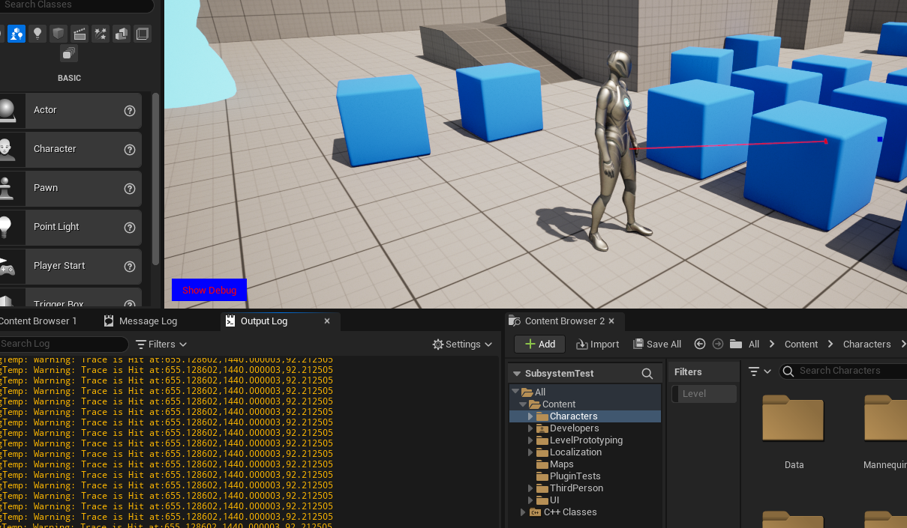
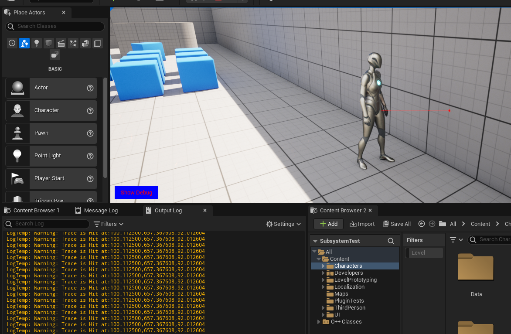
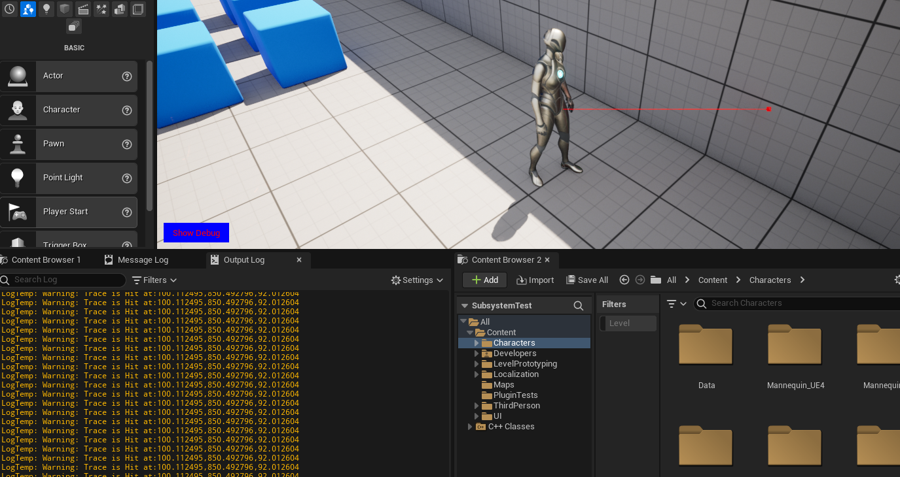
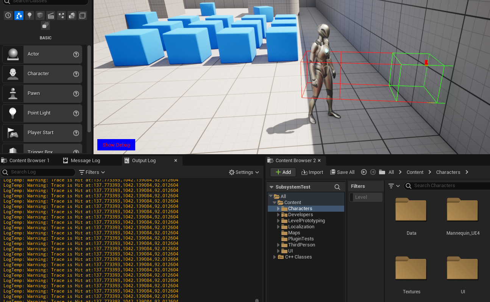
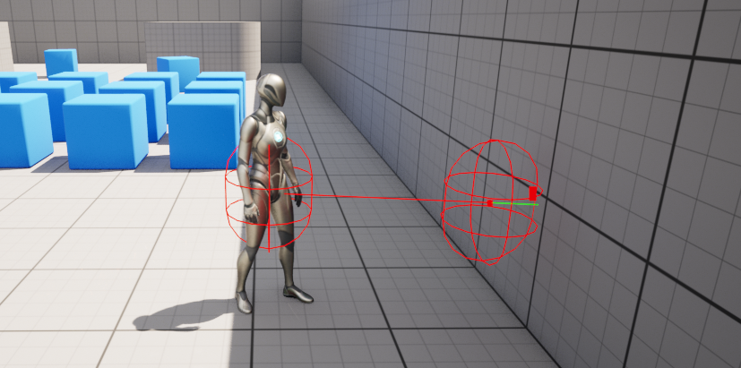
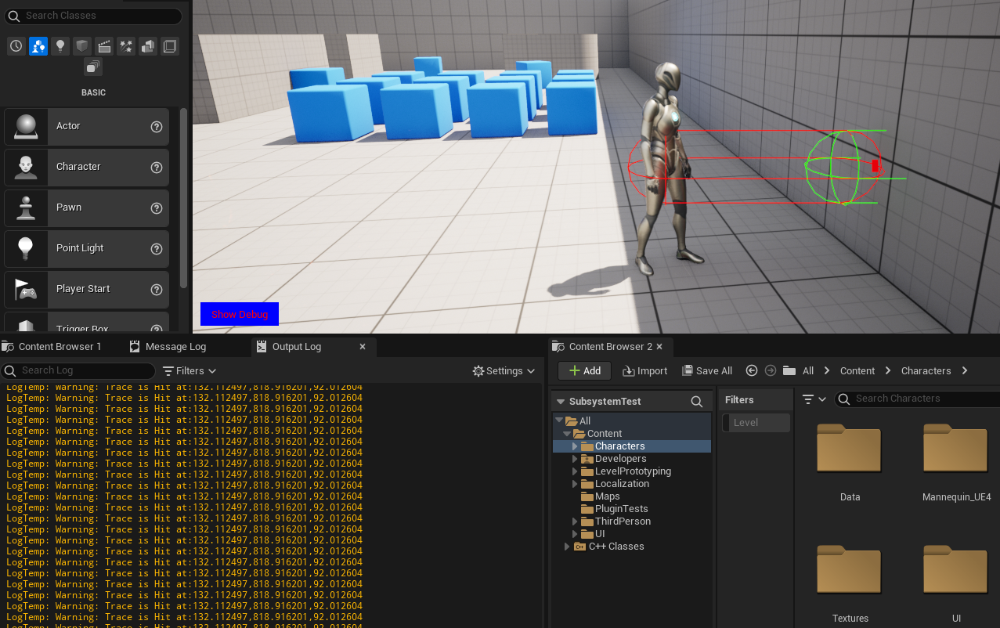

# Trace
Через трассировку разработчик может проверить наличие коллизии в игровом мире.
Привожу примеры доступных способов трассировки в `Unreal Engine`.
## Async Line Trace
```cpp
// Async Line Trace
{
    FTraceDelegate OnTraceDelegate; // will be called once trace is done
    OnTraceDelegate.BindLambda([](const FTraceHandle& handle, FTraceDatum& data)
    {
        DrawDebugPoint(data.PhysWorld.Get(), data.End, 7.f, FColor::Blue, false, 0.1);
        if (data.OutHits.Num() > 0)
        {
            const FHitResult& Result = data.OutHits[0];
            // draw line
            DrawDebugLine(data.PhysWorld.Get(), data.Start, Result.Location, FColor::Red, false, 0.1f, 0.0, 1.f);
            DrawDebugPoint(data.PhysWorld.Get(), Result.Location, 7.f, FColor::Red, false, 0.1);
            UE_LOG(LogTemp, Warning, TEXT("Trace is Hit at:%f,%f,%f"), Result.Location.X, Result.Location.Y, Result.Location.Z)
        }
    });
    // start trace location
    FVector StartLocation = GetOwner()->GetActorLocation();
    // end trace location
    FVector EndLocation = GetOwner()->GetActorForwardVector() * 250 + StartLocation; // 150cm forward from our character's location

    FCollisionQueryParams TraceParams = FCollisionQueryParams::DefaultQueryParam;

    TraceParams.AddIgnoredActor(GetOwner());
    // async line trace
    FTraceHandle Handle = GetWorld()->AsyncLineTraceByChannel(
        EAsyncTraceType::Single,
        StartLocation,
        EndLocation,
        ECC_Visibility,
        TraceParams,
        FCollisionResponseParams::DefaultResponseParam,
        &OnTraceDelegate
    );
}
```

## Line Trace
```cpp
// Line Trace
{
    // start trace location
    FVector StartLocation = GetOwner()->GetActorLocation();
    // end trace location
    FVector EndLocation = GetOwner()->GetActorForwardVector() * 250 + StartLocation; // 150cm forward from our character's location

    FCollisionQueryParams TraceParams = FCollisionQueryParams::DefaultQueryParam;

    TraceParams.AddIgnoredActor(GetOwner());
    FHitResult HitResult;
    bool DidItHit = GetWorld()->LineTraceSingleByChannel(HitResult, StartLocation, EndLocation, ECC_Visibility, TraceParams);
    DrawDebugPoint(GetWorld(), HitResult.TraceEnd, 7.f, FColor::Blue, false, 0.1);
    if (DidItHit) {
        // draw line
        DrawDebugLine(GetWorld(), HitResult.TraceStart, HitResult.Location, FColor::Red, false, 0.1f, 0.0, 1.f);
        DrawDebugPoint(GetWorld(), HitResult.Location, 7.f, FColor::Red, false, 0.1);
        UE_LOG(LogTemp, Warning, TEXT("Trace is Hit at:%f,%f,%f"), HitResult.Location.X, HitResult.Location.Y, HitResult.Location.Z)
    }
}
```

## Line Trace Multi
```cpp
// Line Trace Multi
{
    // start trace location
    FVector StartLocation = GetOwner()->GetActorLocation();
    // end trace location
    FVector EndLocation = GetOwner()->GetActorForwardVector() * 250 + StartLocation; // 150cm forward from our character's location

    FCollisionQueryParams TraceParams = FCollisionQueryParams::DefaultQueryParam;

    TraceParams.AddIgnoredActor(GetOwner());
    TArray<FHitResult> HitResults;
    bool DidItHit = GetWorld()->LineTraceMultiByChannel(HitResults, StartLocation, EndLocation, ECC_Visibility, TraceParams);
    if (DidItHit && HitResults.Num() > 0) {
        DrawDebugPoint(GetWorld(), HitResults[0].TraceEnd, 7.f, FColor::Blue, false, 0.1);
        // draw line
        DrawDebugLine(GetWorld(), HitResults[0].TraceStart, HitResults[0].Location, FColor::Red, false, 0.1f, 0.0, 1.f);
        // draw points on of each hit
        for (FHitResult Result : HitResults) {
            DrawDebugPoint(GetWorld(), Result.Location, 7.f, FColor::Red, false, 0.1, 1);
        }
        UE_LOG(LogTemp, Warning, TEXT("Trace is Hit at:%f,%f,%f"), HitResults[0].Location.X, HitResults[0].Location.Y, HitResults[0].Location.Z)
    }
}
```


## Line Trace Multi By Object Type
```cpp
// Line Trace Multi
{
    // start trace location
    FVector StartLocation = GetOwner()->GetActorLocation();
    // end trace location
    FVector EndLocation = GetOwner()->GetActorForwardVector() * 250 + StartLocation; // 150cm forward from our character's location

    FCollisionQueryParams TraceParams = FCollisionQueryParams::DefaultQueryParam;

    TraceParams.AddIgnoredActor(GetOwner());
    
    FCollisionObjectQueryParams ObjectQueryParams(FCollisionObjectQueryParams::AllObjects);

    TArray<FHitResult> HitResults;

    bool DidItHit = GetWorld()->LineTraceMultiByObjectType(HitResults, StartLocation, EndLocation, ObjectQueryParams, TraceParams);
    
    if (DidItHit && HitResults.Num() > 0) {
        DrawDebugPoint(GetWorld(), HitResults[0].TraceEnd, 7.f, FColor::Blue, false, 0.1);
        // draw line
        DrawDebugLine(GetWorld(), HitResults[0].TraceStart, HitResults[0].Location, FColor::Red, false, 0.1f, 0.0, 1.f);
        // draw points on of each hit
        for (FHitResult Result : HitResults) {
            DrawDebugPoint(GetWorld(), Result.Location, 7.f, FColor::Red, false, 0.1, 1);
        }
        UE_LOG(LogTemp, Warning, TEXT("Trace is Hit at:%f,%f,%f"), HitResults[0].Location.X, HitResults[0].Location.Y, HitResults[0].Location.Z)
    }
}
```
## Box Trace
```cpp
//.h
#include "Kismet/KismetSystemLibrary.h" // library that contain trace functions
//...
//.cpp
// Box Trace
{
    // start trace location
    FVector StartLocation = GetOwner()->GetActorLocation();
    // end trace location
    FVector EndLocation = GetOwner()->GetActorForwardVector() * 250 + StartLocation; // 150cm forward from our character's location
    auto ActorsToIgnore = TArray<AActor*>{GetOwner()};
    FHitResult HitResult; // result
    bool DidItHit = UKismetSystemLibrary::BoxTraceSingle(GetWorld(),
        StartLocation, EndLocation,
        FVector{32.f, 32.f, 32.f}, // size
        GetOwner()->GetActorRotation(),
        TraceTypeQuery1, // trace channel
        false, // trace complex
        ActorsToIgnore,
        EDrawDebugTrace::ForOneFrame, // duration
        HitResult,
        true, // ignore self
        FLinearColor::Red, // trace color
        FLinearColor::Green, // trace hit color
        0.1f // duration
    );
    if (DidItHit) {
        UE_LOG(LogTemp, Warning, TEXT("Trace is Hit at:%f,%f,%f"), HitResult.Location.X, HitResult.Location.Y, HitResult.Location.Z)
    }
}
```

## Capsule Trace Multi
```cpp
//.h
#include "Kismet/KismetSystemLibrary.h" // library that contain trace functions
//...
//.cpp
// Capsule Trace Multi
{
    // start trace location
    FVector StartLocation = GetOwner()->GetActorLocation();
    // end trace location
    FVector EndLocation = GetOwner()->GetActorForwardVector() * 250 + StartLocation; // 150cm forward from our character's location
    auto ActorsToIgnore = TArray<AActor*>{ GetOwner() };
    TArray<FHitResult> HitResults;  // result
    bool DidItHit = UKismetSystemLibrary::CapsuleTraceMulti(GetWorld(),
        StartLocation, EndLocation,
        32.f, // radius
        45.f, // half height,
        TraceTypeQuery1, // trace channel
        false, // trace complex
        ActorsToIgnore,
        EDrawDebugTrace::ForOneFrame, // duration
        HitResults,
        true, // ignore self
        FLinearColor::Red, // trace color
        FLinearColor::Green, // trace hit color
        0.1f // duration
    );
    if (DidItHit) {
        // draw points on of each hit
        for (FHitResult Result : HitResults) {
            DrawDebugPoint(GetWorld(), Result.Location, 7.f, FColor::Red, false, 0.1, 1);
        }
    }
}
```



## Sphere Trace
```cpp
//.h
#include "Kismet/KismetSystemLibrary.h" // library that contain trace functions
//...
//.cpp
// Sphere Trace
{
    // start trace location
    FVector StartLocation = GetOwner()->GetActorLocation();
    // end trace location
    FVector EndLocation = GetOwner()->GetActorForwardVector() * 250 + StartLocation; // 150cm forward from our character's location
    auto ActorsToIgnore = TArray<AActor*>{ GetOwner() };
    FHitResult HitResult; // result
    bool DidItHit = UKismetSystemLibrary::SphereTraceSingle(GetWorld(),
        StartLocation, EndLocation,
        32.f, // radius
        TraceTypeQuery1, // trace channel
        false, // trace complex
        ActorsToIgnore,
        EDrawDebugTrace::ForOneFrame, // duration
        HitResult,
        true, // ignore self
        FLinearColor::Red, // trace color
        FLinearColor::Green, // trace hit color
        0.1f // duration
    );
    if (DidItHit) {
        UE_LOG(LogTemp, Warning, TEXT("Trace is Hit at:%f,%f,%f"), HitResult.Location.X, HitResult.Location.Y, HitResult.Location.Z)
    }
}
```

