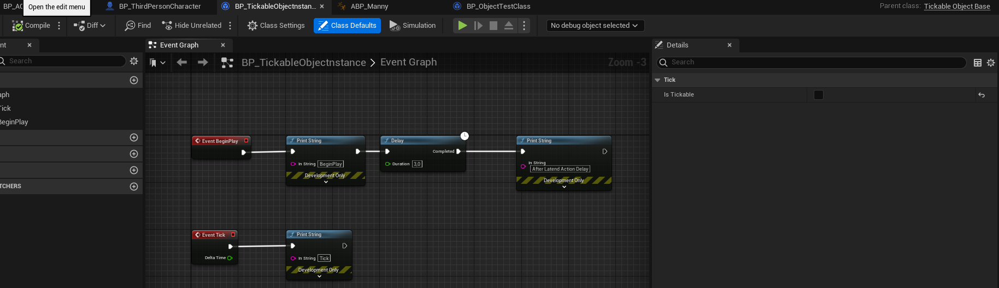
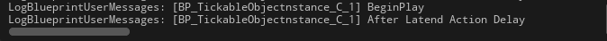
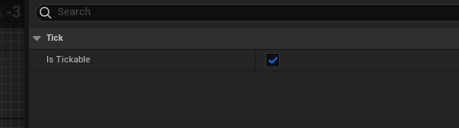
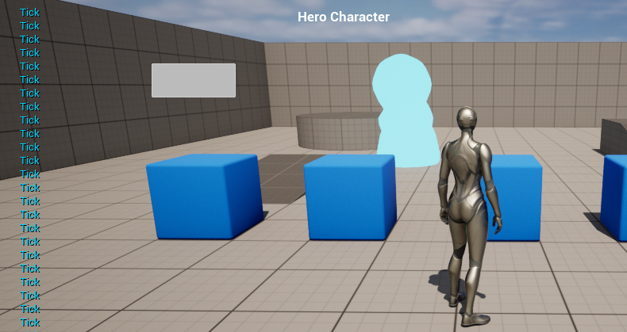

# UObject Base Class
Класс `UObject`, с поддержкой `tick`, `BeginPlay` и `LatentAction`.
```cpp
#pragma once
#include "CoreMinimal.h"
#include "UObject/NoExportTypes.h"
// kismet
#include "Kismet/KismetSystemLibrary.h"
#include "Kismet/GameplayStatics.h"
// just in case
// actor class can be included this way:
//#include "GameFramework/Actor.h"
// component class can be included this way:
//#include "Components/StaticMeshComponent.h"
#include "TickableObjectBase.generated.h"
/**
 * Tickable UOBJECT base class
 */
UCLASS(Blueprintable, BlueprintType, Category = "Objects")
class UTickableObjectBase : public UObject, public FTickableGameObject
{
	GENERATED_BODY()
public:
	// constructor
	UTickableObjectBase(const FObjectInitializer& ObjectInitializer) {}
	// Override PostInitProperties to make BeginPlay
	virtual void PostInitProperties() override {
		Super::PostInitProperties();
		// only after this we can tick. it's "BeginPlay".
		if (GetOuter() && GetOuter()->GetWorld()) {
			bIsInit = true;
			BeginPlay();
		}
	}
	// Begin Play in Blueprint
	UFUNCTION(BlueprintCallable, BlueprintNativeEvent, meta = (DisplayName = "BeginPlay"))
	void ReceiveBeginPlay(); // don't make realization for this function, it's generated by UHT
	// _Implementation is function that spawned by "Add Call To Parent Function"
	void ReceiveBeginPlay_Implementation() { /* your implementation */ };
	// Real BeginPlay
	void BeginPlay() {
		// call bp version of the BeginPlay
		ReceiveBeginPlay();
	};
	// Tick event binding
	UFUNCTION(BlueprintCallable, BlueprintNativeEvent, meta = (DisplayName = "Tick"))
	void ReceiveTick(float DeltaTime); // don't make realization for this function, it's generated by UHT
	// _Implementation is function that spawned by "Add Call To Parent Function"
	void ReceiveTick_Implementation(float DeltaTime) { /* your implementation */ };
	// Begin FTickableGameObject Interface.
	virtual void Tick(float DeltaTime) override {
		ReceiveTick(DeltaTime); // call blueprint tick
	}
	// true if object is ready to be ticked, false otherwise.
	virtual bool IsTickable() const override {
		return this->bIsInit && IsTickableOption; // tick only after object is loaded to the world
	}
	// return the stat id to use for this tickable
	virtual TStatId GetStatId() const override { return UObject::GetStatID(); };
	// world refrence, required to enable usage of latent actions inside of the UOBJECT
	virtual UWorld* GetWorld() const override {
		//Return null if the called from the CDO, or if the outer is being destroyed
		if (!HasAnyFlags(RF_ClassDefaultObject) && !GetOuter()->HasAnyFlags(RF_BeginDestroyed) && !GetOuter()->IsUnreachable())
		{
			//Try to get the world from the owning actor if we have one
			AActor* Outer = GetTypedOuter<AActor>();
			if (Outer != nullptr)
			{
				return Outer->GetWorld();
			}
		}
		//Else return null - the latent action will fail to initialize
		return nullptr;
	}
public:
	// properties section
	// will start tick on object once it's loaded to scene
	UPROPERTY(EditAnywhere, Category = "Tick", meta = (DisplayName = "Is Tickable"))
	bool IsTickableOption = true;
private:
	bool bIsInit = false; // true if object loaded to the world
};
```








