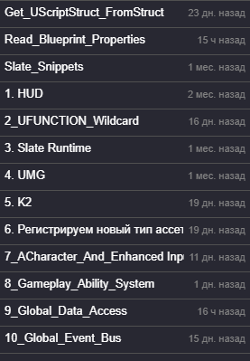
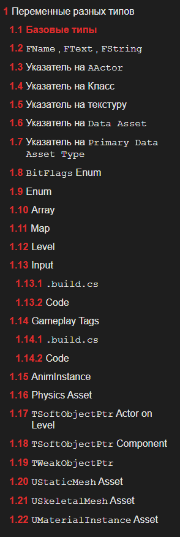
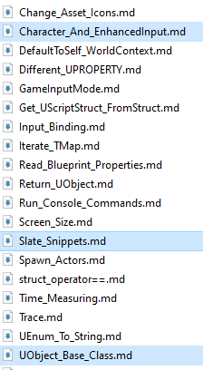

# Вступление
Дорогой читатель. Добро пожаловать в мою первую книгу. По своей структуре это справочник с огромным количеством самых разных рецептов и подходов, которые могут быть полезны при работе с `Unreal Engine`.
Формат книги позволяет быстро и легко находить требуемую информацию и использовать её в повседневной работе.

В первую очередь книга ориентирована на профессионалов. Здесь рассматриваются самые сложные и мало документированные технологии `Unreal Engine`, такие как как: `Enhanced Input`, `Gameplay Ability System`, `Kismet 2` и `Slate`.

Однако, новичков я тоже не обделил вниманием. Начинающие разработчики будут рады узнать, что часть материалов книги посвящена рассмотрению самых сложных тем современного `c++`, а именно: `move semantics`, `templates` и `type casts`.

Тем, кто мигрировал с `C#` отдельно посвящена статья про указатели, в которой рассматривается как обычная, классическая, работа с памятью, так и "умные" указатели, указатели на функции и лямбды.

Таким образом, книга будет полезна как для новичков, так и для  профессионалов в повседневной работе. Более того, если вы профессионал и уже имеете опыт программирования на `с++` - эта книга очень сильно упростит вам работу с `Unreal Engine`, поскольку данный движок использует огромное количество специализированного кода, не зная который вы просто не сможете эффективно работать.

Вся `Reflection System`  движка построена вокруг специализированных инструкций, поэтому особое внимание в книге было уделено рассмотрению макросов этой системы, в частности:  `UPROPERTY`, `UCLASS / USTRUCT` и `UFUNCTION`. Вы найдете уже готовые примеры использования таких макросов с: `Gameplay Tags`, `EnhancedInput Action`, `Data Asset` и огромным количеством других интегрированных типов.

Так-же в книгу включены готовые шаблоны для `Slate`, `ACharacter` и `Tickable UObject` с реализацией `BeginPlay`, которые можно просто копировать и использовать.

## Заключение
Спасибо, за ваше время и оказанное внимание. Отдельное спасибо тем, кто купил эту книгу. Если же вы получили ее … бесплатно, пожалуйста, поддержите автора хотя-бы парой сотен рублей, на банку тушенки. Она в последнее время подорожала, я врятли протяну долго на одних только макаронах. Ей богу, последние времена настали…